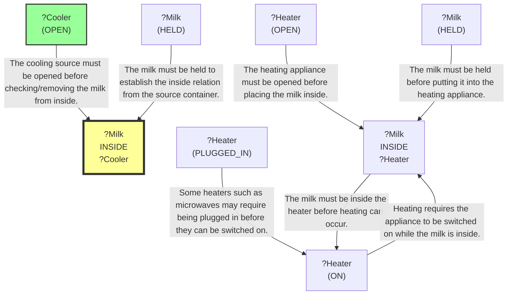
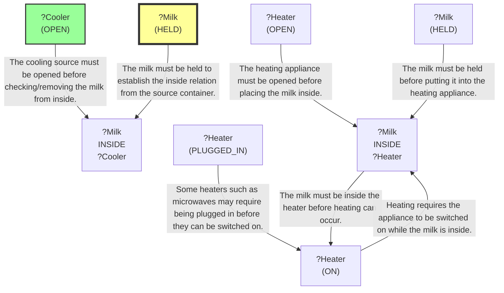
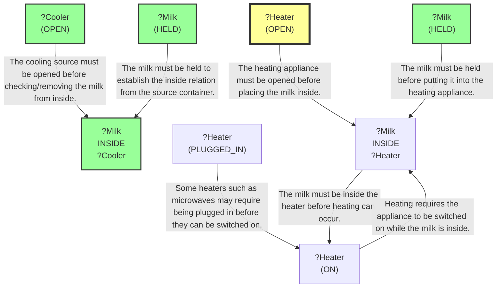
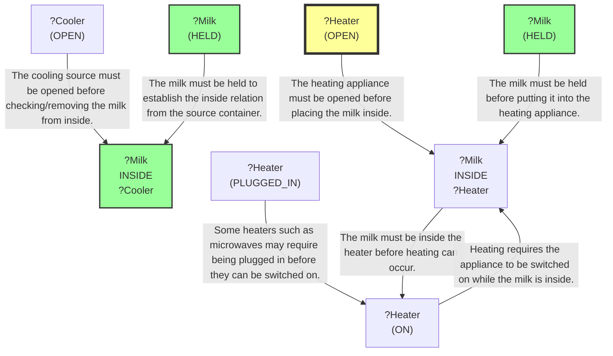
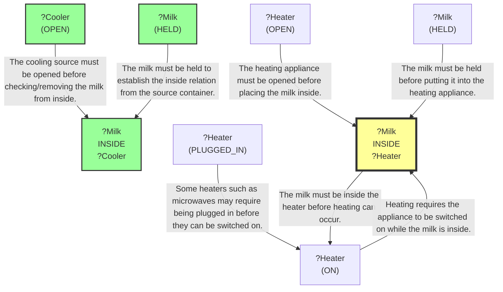
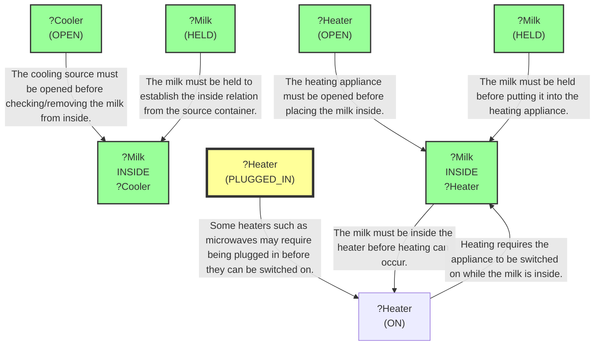
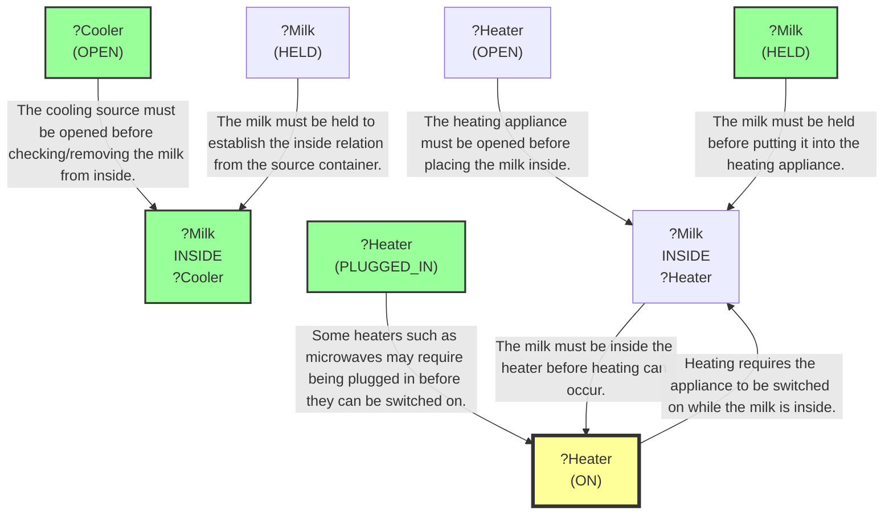

# 🚀 VirtualHome Agent Episode Log


### [GoalReasoner (Module A - Intent)] Output
```json
{
  "is_instruction_obviously_vague": false,
  "clarification_question": null,
  "target_object": "milk",
  "location_hint": "fridge",
  "reasoning_chain": [
    {
      "question": "Why does the user want this object?",
      "answer": "To have milk available for use after checking whether it is in the fridge and heating one cup of it."
    },
    {
      "question": "Why is that important?",
      "answer": "Heating the milk prepares it for drinking or another immediate use in a warmed form."
    },
    {
      "question": "What fundamental need does this fulfill?",
      "answer": "It fulfills the need to obtain a warm, ready-to-use beverage ingredient or drink."
    },
    {
      "question": "Are there any deeper psychological or physical motivations?",
      "answer": "The user likely wants comfort, convenience, or to consume the milk at a preferred warm temperature."
    }
  ],
  "deep_intent": "The user wants to obtain and warm a drinkable dairy beverage for immediate use.",
  "acceptable_alternatives_properties": [
    {
      "priority": 1,
      "description": "Other drinkable refrigerated dairy beverages that can be warmed, such as cream or a milk alternative."
    },
    {
      "priority": 2,
      "description": "Other ready-to-heat beverages in the fridge, such as cocoa or a similar dairy-based drink."
    },
    {
      "priority": 3,
      "description": "Any microwave-safe liquid beverage that can be safely heated for drinking."
    },
    {
      "priority": 4,
      "description": "A warm beverage option like tea or coffee if dairy beverage is unavailable."
    }
  ]
}
```

### [PerceptionFilter] Output
```json
{
  "reasoning": "Need the target milk, the fridge as the cooling source/location to check and retrieve it from, and a heater to warm it. The SDG allows a generic heater, so both microwave and stove are retained as functional heating alternatives, plus the powersocket because the heater may need to be plugged in.",
  "selected_classes": [
    "microwave",
    "character",
    "stove",
    "powersocket",
    "milk",
    "fridge"
  ],
  "raw_class_count": 50
}
```

### [LLMExecutor] Output
```json
{
  "reasoning": "The SDG requires milk to be held and then placed inside the heater. The filtered graph shows a suitable milk object already in the fridge: milk(176), which is COLD, CLOSED, and inside fridge(162). The fridge is already OPEN, so the next necessary step toward satisfying N2/N1 is to get near the milk itself before grabbing it. I should not assume proximity to the milk just because the fridge is open.",
  "satisfied_nodes": [
    "N3"
  ],
  "current_node_focus": "N2",
  "mapped_variables": {
    "?Milk": "milk(176)",
    "?Cooler": "fridge(162)",
    "?Heater": "microwave(171)"
  },
  "action": "[walk] <milk> (176)"
}
```

### [RoboStateMultiTaskController] Output
```json
{
  "action": "[walk] <milk> (176)",
  "active_task_id": "task_1",
  "task_context": {
    "active_task_id": "task_1",
    "pending_task_ids": [],
    "satisfied_task_ids": []
  },
  "source": "llm_executor"
}
```
## Step 0
- **Action**: `[walk] <milk> (176)`
- **Action Success**: `True`
- **Action Message**: {'0': {'message': 'Success'}}
- **Active Task**: `task_1`
- **Decision Source**: `llm_executor`
- **Task Progress**: G1_01=pending
- **SDG Status**:

- **Observed Items (12)**: powersocket(57), fridge(162) [OPEN], stove(163) [OFF,CLOSED], microwave(171) [CLOSED,OFF], milk(177) [CLOSED], character(1), milk(176) [COLD,CLOSED], kitchen(11), livingroom(183), bedroom(241), bathroom(285), bedroom(346)


### [PerceptionFilter] Output
```json
{
  "reasoning": "Reused cached class selection.",
  "selected_classes": [
    "microwave",
    "character",
    "stove",
    "powersocket",
    "milk",
    "fridge"
  ],
  "raw_class_count": 50
}
```

### [LLMExecutor] Output
```json
{
  "reasoning": "The target milk instance to use is milk(176), which is currently inside the open fridge and appears to be the intended refrigerated milk. The next required step in the SDG is to establish that the milk is held, and according to proximity rules I must first be near the specific object before grabbing it. I already walked to milk(176) in the previous step, so the next atomic action is to grab it.",
  "satisfied_nodes": [
    "N3"
  ],
  "current_node_focus": "N1",
  "mapped_variables": {
    "?Milk": "milk(176)",
    "?Cooler": "fridge(162)"
  },
  "action": "[grab] <milk> (176)"
}
```

### [RoboStateMultiTaskController] Output
```json
{
  "action": "[grab] <milk> (176)",
  "active_task_id": "task_1",
  "task_context": {
    "active_task_id": "task_1",
    "pending_task_ids": [],
    "satisfied_task_ids": []
  },
  "source": "llm_executor"
}
```
## Step 1
- **Action**: `[grab] <milk> (176)`
- **Action Success**: `True`
- **Action Message**: {'0': {'message': 'Success'}}
- **Active Task**: `task_1`
- **Decision Source**: `llm_executor`
- **Task Progress**: G1_01=pending
- **SDG Status**:

- **Observed Items (12)**: powersocket(57), fridge(162) [OPEN], stove(163) [OFF,CLOSED], microwave(171) [CLOSED,OFF], milk(177) [CLOSED], character(1), milk(176) [COLD,CLOSED], kitchen(11), livingroom(183), bedroom(241), bathroom(285), bedroom(346)


### [PerceptionFilter] Output
```json
{
  "reasoning": "Reused cached class selection.",
  "selected_classes": [
    "microwave",
    "character",
    "stove",
    "powersocket",
    "milk",
    "fridge"
  ],
  "raw_class_count": 50
}
```

### [LLMExecutor] Output
```json
{
  "reasoning": "The milk being held is milk(176), which is already close to the character and satisfies the HOLD state needed for the next stage. The fridge is already open, so the next necessary progress toward heating the milk is to move to the microwave so it can later be opened and used as the heater. I am not repeating the previous walk action; the immediate gap is proximity to the heater.",
  "satisfied_nodes": [
    "N1",
    "N2",
    "N3",
    "N4"
  ],
  "current_node_focus": "N6",
  "mapped_variables": {
    "?Milk": "milk(176)",
    "?Cooler": "fridge(162)",
    "?Heater": "microwave(171)"
  },
  "action": "[walk] <microwave> (171)"
}
```

### [RoboStateMultiTaskController] Output
```json
{
  "action": "[walk] <microwave> (171)",
  "active_task_id": "task_1",
  "task_context": {
    "active_task_id": "task_1",
    "pending_task_ids": [],
    "satisfied_task_ids": []
  },
  "source": "llm_executor"
}
```
## Step 2
- **Action**: `[walk] <microwave> (171)`
- **Action Success**: `True`
- **Action Message**: {'0': {'message': 'Success'}}
- **Active Task**: `task_1`
- **Decision Source**: `llm_executor`
- **Task Progress**: G1_01=pending
- **SDG Status**:

- **Observed Items (12)**: powersocket(57), fridge(162) [OPEN], stove(163) [OFF,CLOSED], microwave(171) [CLOSED,OFF], milk(177) [CLOSED], character(1), milk(176) [COLD,CLOSED], kitchen(11), livingroom(183), bedroom(241), bathroom(285), bedroom(346)


### [PerceptionFilter] Output
```json
{
  "reasoning": "Reused cached class selection.",
  "selected_classes": [
    "microwave",
    "character",
    "stove",
    "powersocket",
    "milk",
    "fridge"
  ],
  "raw_class_count": 50
}
```

### [LLMExecutor] Output
```json
{
  "reasoning": "The held milk is already in hand (milk 176), and I am already close to the microwave. The next required step in the SDG is to open the heater before placing the milk inside. The microwave is closed and is the best match for ?Heater because it has CAN_OPEN, HAS_SWITCH, and HAS_PLUG.",
  "satisfied_nodes": [
    "N1",
    "N2",
    "N4"
  ],
  "current_node_focus": "N6",
  "mapped_variables": {
    "?Milk": "milk(176)",
    "?Heater": "microwave(171)",
    "?Cooler": "fridge(162)"
  },
  "action": "[open] <microwave> (171)"
}
```

### [RoboStateMultiTaskController] Output
```json
{
  "action": "[open] <microwave> (171)",
  "active_task_id": "task_1",
  "task_context": {
    "active_task_id": "task_1",
    "pending_task_ids": [],
    "satisfied_task_ids": []
  },
  "source": "llm_executor"
}
```
## Step 3
- **Action**: `[open] <microwave> (171)`
- **Action Success**: `True`
- **Action Message**: {'0': {'message': 'Success'}}
- **Active Task**: `task_1`
- **Decision Source**: `llm_executor`
- **Task Progress**: G1_01=pending
- **SDG Status**:

- **Observed Items (12)**: powersocket(57), fridge(162) [OPEN], stove(163) [OFF,CLOSED], microwave(171) [CLOSED,OFF], milk(177) [CLOSED], character(1), milk(176) [COLD,CLOSED], kitchen(11), livingroom(183), bedroom(241), bathroom(285), bedroom(346)


### [PerceptionFilter] Output
```json
{
  "reasoning": "Reused cached class selection.",
  "selected_classes": [
    "microwave",
    "character",
    "stove",
    "powersocket",
    "milk",
    "fridge"
  ],
  "raw_class_count": 50
}
```

### [LLMExecutor] Output
```json
{
  "reasoning": "We already successfully grabbed milk(176) and are now next to the open microwave(171). The remaining gap toward heating is to place the held milk inside the microwave. Since the microwave is already open and we are close to it, the next atomic action is to put the milk into the microwave.",
  "satisfied_nodes": [
    "N1",
    "N2",
    "N3"
  ],
  "current_node_focus": "N5",
  "mapped_variables": {
    "?Milk": "milk(176)",
    "?Heater": "microwave(171)",
    "?Cooler": "fridge(162)"
  },
  "action": "[putin] <milk> (176) <microwave> (171)"
}
```

### [RoboStateMultiTaskController] Output
```json
{
  "action": "[putin] <milk> (176) <microwave> (171)",
  "active_task_id": "task_1",
  "task_context": {
    "active_task_id": "task_1",
    "pending_task_ids": [],
    "satisfied_task_ids": []
  },
  "source": "llm_executor"
}
```
## Step 4
- **Action**: `[putin] <milk> (176) <microwave> (171)`
- **Action Success**: `True`
- **Action Message**: {'0': {'message': 'Success'}}
- **Active Task**: `task_1`
- **Decision Source**: `llm_executor`
- **Task Progress**: G1_01=pending
- **SDG Status**:

- **Observed Items (12)**: powersocket(57), fridge(162) [OPEN], stove(163) [OFF,CLOSED], microwave(171) [OPEN,OFF], milk(177) [CLOSED], character(1), milk(176) [COLD,CLOSED], kitchen(11), livingroom(183), bedroom(241), bathroom(285), bedroom(346)


### [PerceptionFilter] Output
```json
{
  "reasoning": "Reused cached class selection.",
  "selected_classes": [
    "microwave",
    "character",
    "stove",
    "powersocket",
    "milk",
    "fridge"
  ],
  "raw_class_count": 50
}
```

### [LLMExecutor] Output
```json
{
  "reasoning": "The milk has already been successfully grabbed and placed inside the open microwave. The next unsatisfied prerequisite for heating is to switch the heater on; the microwave is currently OFF and is the appropriate ?Heater binding. It already has HAS_PLUG, but the graph does not show it plugged in, so the next step is to plug it in before turning it on.",
  "satisfied_nodes": [
    "N1",
    "N2",
    "N3",
    "N4",
    "N5",
    "N6"
  ],
  "current_node_focus": "N8",
  "mapped_variables": {
    "?Milk": "milk(176)",
    "?Cooler": "fridge(162)",
    "?Heater": "microwave(171)"
  },
  "action": "[plugin] <microwave> (171)"
}
```

### [RoboStateMultiTaskController] Output
```json
{
  "action": "[plugin] <microwave> (171)",
  "active_task_id": "task_1",
  "task_context": {
    "active_task_id": "task_1",
    "pending_task_ids": [],
    "satisfied_task_ids": []
  },
  "source": "llm_executor"
}
```
## Step 5
- **Action**: `[plugin] <microwave> (171)`
- **Action Success**: `True`
- **Action Message**: Faked plug operation in Python layer
- **Active Task**: `task_1`
- **Decision Source**: `llm_executor`
- **Task Progress**: G1_01=pending
- **SDG Status**:

- **Observed Items (12)**: powersocket(57), fridge(162) [OPEN], stove(163) [OFF,CLOSED], microwave(171) [OPEN,OFF], milk(177) [CLOSED], character(1), milk(176) [COLD,CLOSED], kitchen(11), livingroom(183), bedroom(241), bathroom(285), bedroom(346)


### [PerceptionFilter] Output
```json
{
  "reasoning": "Reused cached class selection.",
  "selected_classes": [
    "microwave",
    "character",
    "stove",
    "powersocket",
    "milk",
    "fridge"
  ],
  "raw_class_count": 50
}
```

### [LLMExecutor] Output
```json
{
  "reasoning": "The milk object currently being manipulated is milk(176), which is already inside the microwave(171). The microwave is already open and plugged in. The next required step toward heating is to turn the heater on while the milk remains inside it. No other prerequisite remains before switching it on.",
  "satisfied_nodes": [
    "N2",
    "N3",
    "N4",
    "N8"
  ],
  "current_node_focus": "N7",
  "mapped_variables": {
    "?Milk": "milk(176)",
    "?Cooler": "fridge(162)",
    "?Heater": "microwave(171)"
  },
  "action": "[switchon] <microwave> (171)"
}
```

### [RoboStateMultiTaskController] Output
```json
{
  "action": "[switchon] <microwave> (171)",
  "active_task_id": "task_1",
  "task_context": {
    "active_task_id": "task_1",
    "pending_task_ids": [],
    "satisfied_task_ids": []
  },
  "source": "llm_executor"
}
```
## Step 6
- **Action**: `[switchon] <microwave> (171)`
- **Action Success**: `True`
- **Action Message**: Faked switch operation in Python layer (bypassed Unity failure)
- **Active Task**: `task_1`
- **Decision Source**: `llm_executor`
- **Task Progress**: G1_01=done
- **SDG Status**:

- **Observed Items (12)**: powersocket(57), fridge(162) [OPEN], stove(163) [OFF,CLOSED], microwave(171) [OPEN,PLUGGED_IN,OFF], milk(177) [CLOSED], character(1), milk(176) [COLD,CLOSED], kitchen(11), livingroom(183), bedroom(241), bathroom(285), bedroom(346)

