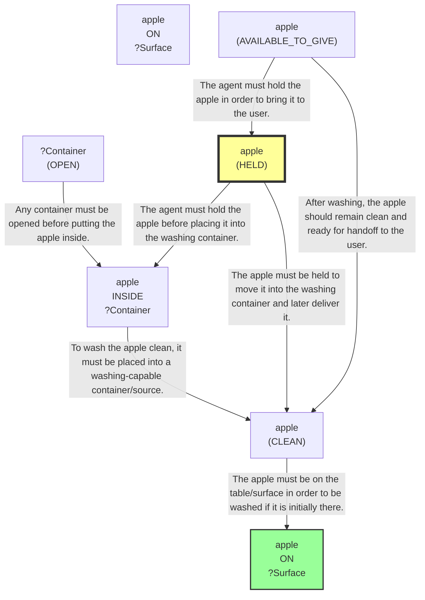
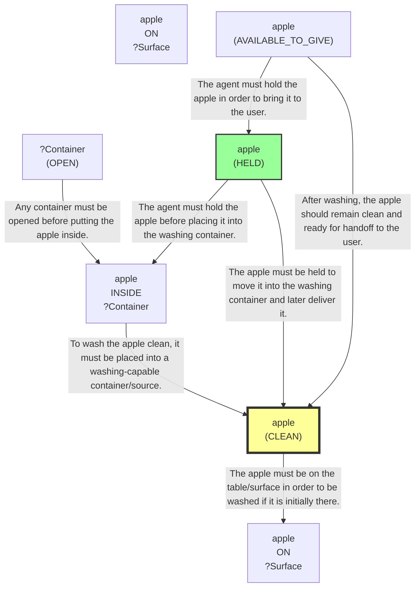

# 🚀 VirtualHome Agent Episode Log


### [GoalReasoner (Module A - Intent)] Output
```json
{
  "is_instruction_obviously_vague": false,
  "clarification_question": null,
  "target_object": "apple",
  "location_hint": "table",
  "reasoning_chain": [
    {
      "question": "Why does the user want this object?",
      "answer": "They want the apple made clean and delivered to them."
    },
    {
      "question": "Why is that important?",
      "answer": "So it is suitable for use or consumption and available to them directly."
    },
    {
      "question": "What fundamental need does this fulfill?",
      "answer": "It fulfills the need to obtain a clean edible item for eating or handling."
    },
    {
      "question": "Are there any deeper psychological or physical motivations?",
      "answer": "The user likely wants convenient access to safe, ready-to-use food."
    }
  ],
  "deep_intent": "The user wants a clean edible item delivered to them for consumption or use.",
  "acceptable_alternatives_properties": [
    {
      "priority": 1,
      "description": "Other washed ready-to-eat fruits, such as a pear, orange, or grapes."
    },
    {
      "priority": 2,
      "description": "Other fresh fruit items that can be cleaned before serving."
    },
    {
      "priority": 3,
      "description": "Other edible snack foods that are already clean and ready to eat."
    },
    {
      "priority": 4,
      "description": "A different ready-to-eat healthy food item that can satisfy the need for something edible."
    }
  ]
}
```

### [PerceptionFilter] Output
```json
{
  "reasoning": "Need the target apple, the table/surface it is on, and the washing setup required by the SDG: a sink with faucet plus dishwashing liquid and sponge as implicit cleaning tools. Since the apple is initially inside a container and must be opened before washing, keep the box as the possible container. The apple must then be held and delivered, so no extra objects are needed beyond these task-critical items.",
  "selected_classes": [
    "faucet",
    "box",
    "apple",
    "sink",
    "kitchentable",
    "washingsponge",
    "character",
    "dishwashingliquid"
  ],
  "raw_class_count": 55
}
```

### [LLMExecutor] Output
```json
{
  "reasoning": "The apple is already on the kitchen table and is currently DIRTY, so the next required step toward CLEAN and then AVAILABLE_TO_GIVE is to pick it up before moving it to the sink for washing. I am already close to the table, and the apple is grabbable and reachable.",
  "satisfied_nodes": [
    "N1"
  ],
  "current_node_focus": "N5",
  "mapped_variables": {
    "?Surface": "kitchentable(231)",
    "?Container": "sink(247)"
  },
  "action": "[grab] <apple> (437)"
}
```

### [RoboStateMultiTaskController] Output
```json
{
  "action": "[walk] <apple> (437)",
  "active_task_id": "task_1",
  "task_context": {
    "active_task_id": "task_1",
    "pending_task_ids": [],
    "satisfied_task_ids": []
  },
  "source": "llm_executor_repaired"
}
```
## Step 0
- **Action**: `[walk] <apple> (437)`
- **Action Success**: `True`
- **Action Message**: {'0': {'message': 'Success'}}
- **Active Task**: `task_1`
- **Decision Source**: `llm_executor_repaired`
- **Task Progress**: G1_02=pending
- **SDG Status**:

- **Observed Items (12)**: kitchentable(231), sink(247), faucet(248) [ON], washingsponge(266), dishwashingliquid(267), box(300) [CLOSED], apple(437) [DIRTY], character(1), bathroom(11), bedroom(73), kitchen(205), livingroom(335)


### [PerceptionFilter] Output
```json
{
  "reasoning": "Reused cached class selection.",
  "selected_classes": [
    "faucet",
    "box",
    "apple",
    "sink",
    "kitchentable",
    "washingsponge",
    "character",
    "dishwashingliquid"
  ],
  "raw_class_count": 55
}
```

### [LLMExecutor] Output
```json
{
  "reasoning": "The apple is already on the kitchen table and close to the character, but it is DIRTY. To satisfy the SDG, the next step toward CLEAN/AVAILABLE_TO_GIVE is to pick it up so it can then be washed at the sink. Since the apple is already nearby, no additional walk is needed before grabbing. The best next atomic action is to grab the apple.",
  "satisfied_nodes": [
    "N1"
  ],
  "current_node_focus": "N5",
  "mapped_variables": {},
  "action": "[grab] <apple> (437)"
}
```

### [RoboStateMultiTaskController] Output
```json
{
  "action": "[grab] <apple> (437)",
  "active_task_id": "task_1",
  "task_context": {
    "active_task_id": "task_1",
    "pending_task_ids": [],
    "satisfied_task_ids": []
  },
  "source": "llm_executor"
}
```
## Step 1
- **Action**: `[grab] <apple> (437)`
- **Action Success**: `True`
- **Action Message**: {'0': {'message': 'Success'}}
- **Active Task**: `task_1`
- **Decision Source**: `llm_executor`
- **Task Progress**: G1_02=pending
- **SDG Status**:

- **Observed Items (12)**: kitchentable(231), sink(247), faucet(248) [ON], washingsponge(266), dishwashingliquid(267), box(300) [CLOSED], apple(437) [DIRTY], character(1), bathroom(11), bedroom(73), kitchen(205), livingroom(335)


### [PerceptionFilter] Output
```json
{
  "reasoning": "Reused cached class selection.",
  "selected_classes": [
    "faucet",
    "box",
    "apple",
    "sink",
    "kitchentable",
    "washingsponge",
    "character",
    "dishwashingliquid"
  ],
  "raw_class_count": 55
}
```

### [LLMExecutor] Output
```json
{
  "reasoning": "The apple is already held in the right hand, and the next missing SDG requirement is cleanliness. To wash it, I must be near a sink and holding the apple. The sink is the correct washing destination (not a container to open/put in), so the next atomic step is to walk to the sink before washing.",
  "satisfied_nodes": [
    "N5"
  ],
  "current_node_focus": "N2",
  "mapped_variables": {
    "?Surface": "kitchentable(231)",
    "?Container": "sink(247)"
  },
  "action": "[walk] <sink> (247)"
}
```

### [RoboStateMultiTaskController] Output
```json
{
  "action": "[walk] <sink> (247)",
  "active_task_id": "task_1",
  "task_context": {
    "active_task_id": "task_1",
    "pending_task_ids": [],
    "satisfied_task_ids": []
  },
  "source": "llm_executor"
}
```
## Step 2
- **Action**: `[walk] <sink> (247)`
- **Action Success**: `True`
- **Action Message**: {'0': {'message': 'Success'}}
- **Active Task**: `task_1`
- **Decision Source**: `llm_executor`
- **Task Progress**: G1_02=pending
- **SDG Status**:

- **Observed Items (12)**: kitchentable(231), sink(247), faucet(248) [ON], washingsponge(266), dishwashingliquid(267), box(300) [CLOSED], apple(437) [DIRTY], character(1), bathroom(11), bedroom(73), kitchen(205), livingroom(335)


### [PerceptionFilter] Output
```json
{
  "reasoning": "Reused cached class selection.",
  "selected_classes": [
    "faucet",
    "box",
    "apple",
    "sink",
    "kitchentable",
    "washingsponge",
    "character",
    "dishwashingliquid"
  ],
  "raw_class_count": 55
}
```

### [LLMExecutor] Output
```json
{
  "reasoning": "The apple is already held and I am already close to the sink/faucet area. The next required step toward making the apple clean is to wash it at the sink. Washing requires holding the dirty apple and being near a sink, which is satisfied now.",
  "satisfied_nodes": [
    "N5"
  ],
  "current_node_focus": "N2",
  "mapped_variables": {
    "?Washer": "sink(247)",
    "?Surface": "kitchentable(231)",
    "?Container": "sink(247)"
  },
  "action": "[wash] <apple> (437)"
}
```

### [RoboStateMultiTaskController] Output
```json
{
  "action": "[wash] <apple> (437)",
  "active_task_id": "task_1",
  "task_context": {
    "active_task_id": "task_1",
    "pending_task_ids": [],
    "satisfied_task_ids": []
  },
  "source": "llm_executor"
}
```
## Step 3
- **Action**: `[wash] <apple> (437)`
- **Action Success**: `True`
- **Action Message**: Washed successfully.
- **Active Task**: `task_1`
- **Decision Source**: `llm_executor`
- **Task Progress**: G1_02=done
- **SDG Status**:

- **Observed Items (12)**: kitchentable(231), sink(247), faucet(248) [ON], washingsponge(266), dishwashingliquid(267), box(300) [CLOSED], apple(437) [DIRTY], character(1), bathroom(11), bedroom(73), kitchen(205), livingroom(335)

