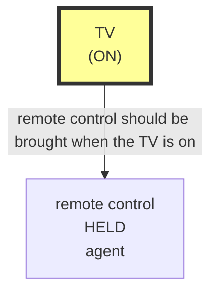
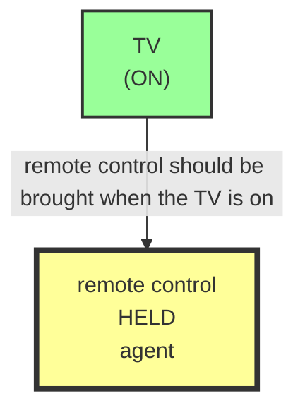

# 🚀 VirtualHome Agent Episode Log


### [GoalReasoner (Module A - Intent)] Output
```json
{
  "is_instruction_obviously_vague": false,
  "clarification_question": null,
  "target_object": "remote control",
  "location_hint": "TV",
  "reasoning_chain": [
    {
      "question": "Why does the user want this object?",
      "answer": "To operate the TV while it is on."
    },
    {
      "question": "Why is that important?",
      "answer": "So they can control the TV without needing to get up or use manual controls."
    },
    {
      "question": "What fundamental need does this fulfill?",
      "answer": "It fulfills the need to conveniently control an active entertainment device."
    },
    {
      "question": "Are there any deeper psychological or physical motivations?",
      "answer": "The user likely wants ease, comfort, and immediate access to TV controls."
    }
  ],
  "deep_intent": "The user wants convenient control of an active entertainment device.",
  "acceptable_alternatives_properties": [
    {
      "priority": 1,
      "description": "A compatible TV remote or other direct control device for the television"
    },
    {
      "priority": 2,
      "description": "A universal remote or replacement remote that can control the TV"
    },
    {
      "priority": 3,
      "description": "A nearby control device such as a smartphone app or smart home controller if it can operate the TV"
    },
    {
      "priority": 4,
      "description": "Any indoor device or interface that allows the user to adjust the TV's power, volume, or channels"
    }
  ]
}
```

### [PerceptionFilter] Output
```json
{
  "reasoning": "The goal is to get a remote control for an already-on TV, so the only necessary classes are the target remote control and the TV itself. No other tools or locations are required by the SDG or intent.",
  "selected_classes": [
    "character",
    "tv",
    "remotecontrol"
  ],
  "raw_class_count": 40
}
```

### [LLMExecutor] Output
```json
{
  "reasoning": "The SDG requires the TV to be ON and the remote control to be HELD. The current graph shows the TV is OFF, but we are already CLOSE to the TV and facing it, so the most direct next step toward enabling use of the remote is to turn the TV on. The remote control is visible in the living room but not yet held; however, the immediate prerequisite node in the SDG is the TV ON state. Since switching on requires being near the TV and we already are, the correct next atomic action is to switch on the TV.",
  "satisfied_nodes": [],
  "current_node_focus": "N1",
  "mapped_variables": {},
  "action": "[switchon] <tv> (426)"
}
```

### [RoboStateMultiTaskController] Output
```json
{
  "action": "[switchon] <tv> (426)",
  "active_task_id": "task_1",
  "task_context": {
    "active_task_id": "task_1",
    "pending_task_ids": [],
    "satisfied_task_ids": []
  },
  "source": "llm_executor"
}
```
## Step 0
- **Action**: `[switchon] <tv> (426)`
- **Action Success**: `True`
- **Action Message**: Faked switch operation in Python layer (bypassed Unity failure)
- **Active Task**: `task_1`
- **Decision Source**: `llm_executor`
- **Task Progress**: G1_03=pending
- **SDG Status**:

- **Observed Items (7)**: tv(426) [OFF], remotecontrol(452) [OFF], character(1), bathroom(11), bedroom(73), kitchen(205), livingroom(335)


### [PerceptionFilter] Output
```json
{
  "reasoning": "Reused cached class selection.",
  "selected_classes": [
    "character",
    "tv",
    "remotecontrol"
  ],
  "raw_class_count": 40
}
```

### [LLMExecutor] Output
```json
{
  "reasoning": "The TV is already ON, satisfying N1. The remaining unsatisfied node is to hold the remote control. The remotecontrol(452) is in the living room and grabbable, so the next step should be to walk to it before grabbing it. We are not already near the remote specifically, even though we are close to the TV, so proximity rules require a walk action first.",
  "satisfied_nodes": [
    "N1"
  ],
  "current_node_focus": "N2",
  "mapped_variables": {
    "?Remote": "remotecontrol(452)"
  },
  "action": "[walk] <remotecontrol> (452)"
}
```

### [RoboStateMultiTaskController] Output
```json
{
  "action": "[walk] <remotecontrol> (452)",
  "active_task_id": "task_1",
  "task_context": {
    "active_task_id": "task_1",
    "pending_task_ids": [],
    "satisfied_task_ids": []
  },
  "source": "llm_executor"
}
```
## Step 1
- **Action**: `[walk] <remotecontrol> (452)`
- **Action Success**: `True`
- **Action Message**: {'0': {'message': 'Success'}}
- **Active Task**: `task_1`
- **Decision Source**: `llm_executor`
- **Task Progress**: G1_03=pending
- **SDG Status**:

- **Observed Items (7)**: tv(426) [ON], remotecontrol(452) [OFF], character(1), bathroom(11), bedroom(73), kitchen(205), livingroom(335)


### [PerceptionFilter] Output
```json
{
  "reasoning": "Reused cached class selection.",
  "selected_classes": [
    "character",
    "tv",
    "remotecontrol"
  ],
  "raw_class_count": 40
}
```

### [LLMExecutor] Output
```json
{
  "reasoning": "The TV is already ON, satisfying N1. The remote control is already close to the agent and is grabbable, so the next step to satisfy N2 is to pick it up. No additional walk is needed because the current graph already indicates CLOSE remotecontrol(452).",
  "satisfied_nodes": [
    "N1"
  ],
  "current_node_focus": "N2",
  "mapped_variables": {
    "?Remote": "remotecontrol(452)"
  },
  "action": "[grab] <remotecontrol> (452)"
}
```

### [RoboStateMultiTaskController] Output
```json
{
  "action": "[grab] <remotecontrol> (452)",
  "active_task_id": "task_1",
  "task_context": {
    "active_task_id": "task_1",
    "pending_task_ids": [],
    "satisfied_task_ids": []
  },
  "source": "llm_executor"
}
```
## Step 2
- **Action**: `[grab] <remotecontrol> (452)`
- **Action Success**: `True`
- **Action Message**: {'0': {'message': 'Success'}}
- **Active Task**: `task_1`
- **Decision Source**: `llm_executor`
- **Task Progress**: G1_03=done
- **SDG Status**:

- **Observed Items (7)**: tv(426) [ON], remotecontrol(452) [OFF], character(1), bathroom(11), bedroom(73), kitchen(205), livingroom(335)

