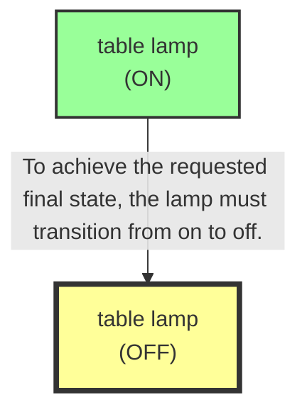

# 🚀 VirtualHome Agent Episode Log


### [GoalReasoner (Module A - Intent)] Output
```json
{
  "is_instruction_obviously_vague": false,
  "clarification_question": null,
  "target_object": "table lamp",
  "location_hint": null,
  "reasoning_chain": [
    {
      "question": "Why does the user want this object?",
      "answer": "They want to control the lamp's power state."
    },
    {
      "question": "Why is that important?",
      "answer": "Because the lamp being on may no longer be desired."
    },
    {
      "question": "What fundamental need does this fulfill?",
      "answer": "To manage lighting in the room by switching a light source off."
    },
    {
      "question": "Are there any deeper psychological or physical motivations?",
      "answer": "It may be to reduce brightness, save energy, avoid distraction, or create a more comfortable environment."
    }
  ],
  "deep_intent": "The user wants to reduce or eliminate the room's lighting.",
  "acceptable_alternatives_properties": [
    {
      "priority": 1,
      "description": "Other indoor light sources that are on and can be switched off, such as a floor lamp or ceiling light."
    },
    {
      "priority": 2,
      "description": "Any nearby artificial light source that contributes to room illumination, if the lamp is unavailable."
    },
    {
      "priority": 3,
      "description": "Methods to darken the room, such as closing blinds or curtains if the goal is to reduce light."
    },
    {
      "priority": 4,
      "description": "Shifting to a less bright environment by using dimmer lighting or turning off multiple lights."
    }
  ]
}
```

### [PerceptionFilter] Output
```json
{
  "reasoning": "The goal is to turn off the target light source, so I must keep the exact target class tablelamp and any alternative indoor light sources that could also be switched off if needed, plus the direct control tool for lighting and any light-blocking option implied by the intent. Curtains are retained as a valid way to reduce room light.",
  "selected_classes": [
    "tablelamp",
    "curtains",
    "floor",
    "ceilinglamp",
    "character",
    "lightswitch",
    "ceiling"
  ],
  "raw_class_count": 33
}
```

### [LLMExecutor] Output
```json
{
  "reasoning": "The active goal is to turn off a table lamp. In the filtered graph, both tablelamp(102) and tablelamp(103) are ON, but no position-relative proximity is guaranteed. Since switching requires being near the target, the best next step is to walk to one valid ON table lamp. Choosing tablelamp(102) is sufficient to progress toward satisfying N2 -> N1 by enabling a subsequent switchoff action.",
  "satisfied_nodes": [
    "N2"
  ],
  "current_node_focus": "N1",
  "mapped_variables": {
    "?Lamp": "tablelamp(102)"
  },
  "action": "[walk] <tablelamp> (102)"
}
```

### [RoboStateMultiTaskController] Output
```json
{
  "action": "[walk] <tablelamp> (102)",
  "active_task_id": "task_1",
  "task_context": {
    "active_task_id": "task_1",
    "pending_task_ids": [],
    "satisfied_task_ids": []
  },
  "source": "llm_executor"
}
```
## Step 0
- **Action**: `[walk] <tablelamp> (102)`
- **Action Success**: `True`
- **Action Message**: {'0': {'message': 'Success'}}
- **Active Task**: `task_1`
- **Decision Source**: `llm_executor`
- **Task Progress**: G1_04=pending
- **SDG Status**:

- **Observed Items (30)**: floor(74), floor(75), floor(76), floor(77), floor(78), floor(79), floor(80), floor(81), floor(82), ceiling(92), ceiling(93), ceiling(94), ceiling(95), ceiling(96), ceiling(97)...


### [PerceptionFilter] Output
```json
{
  "reasoning": "Reused cached class selection.",
  "selected_classes": [
    "tablelamp",
    "curtains",
    "floor",
    "ceilinglamp",
    "character",
    "lightswitch",
    "ceiling"
  ],
  "raw_class_count": 33
}
```

### [LLMExecutor] Output
```json
{
  "reasoning": "The active task is to turn off the table lamp. The current graph shows tablelamp(102) is ON and the character is already CLOSE to it, so the next direct state-changing action is to switch it off. Lamp(102) matches the target better than lamp(103) because it is already near the character and explicitly a table lamp with HAS_SWITCH.",
  "satisfied_nodes": [
    "N2"
  ],
  "current_node_focus": "N1",
  "mapped_variables": {},
  "action": "[switchoff] <tablelamp> (102)"
}
```

### [RoboStateMultiTaskController] Output
```json
{
  "action": "[switchoff] <tablelamp> (102)",
  "active_task_id": "task_1",
  "task_context": {
    "active_task_id": "task_1",
    "pending_task_ids": [],
    "satisfied_task_ids": []
  },
  "source": "llm_executor"
}
```
## Step 1
- **Action**: `[switchoff] <tablelamp> (102)`
- **Action Success**: `True`
- **Action Message**: Faked switch operation in Python layer (bypassed Unity failure)
- **Active Task**: `task_1`
- **Decision Source**: `llm_executor`
- **Task Progress**: G1_04=done
- **SDG Status**:

- **Observed Items (30)**: floor(74), floor(75), floor(76), floor(77), floor(78), floor(79), floor(80), floor(81), floor(82), ceiling(92), ceiling(93), ceiling(94), ceiling(95), ceiling(96), ceiling(97)...

