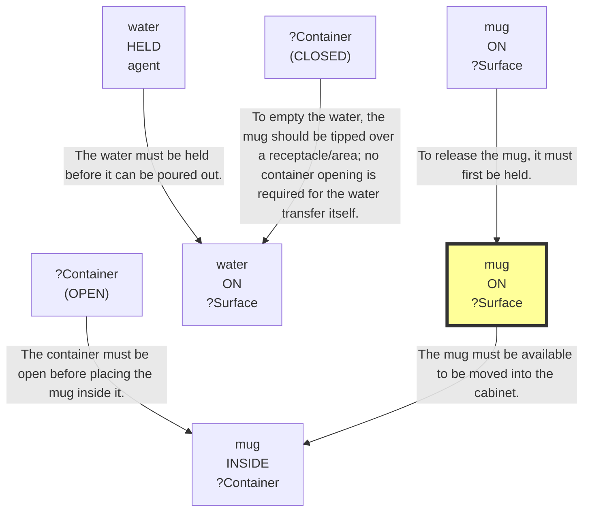
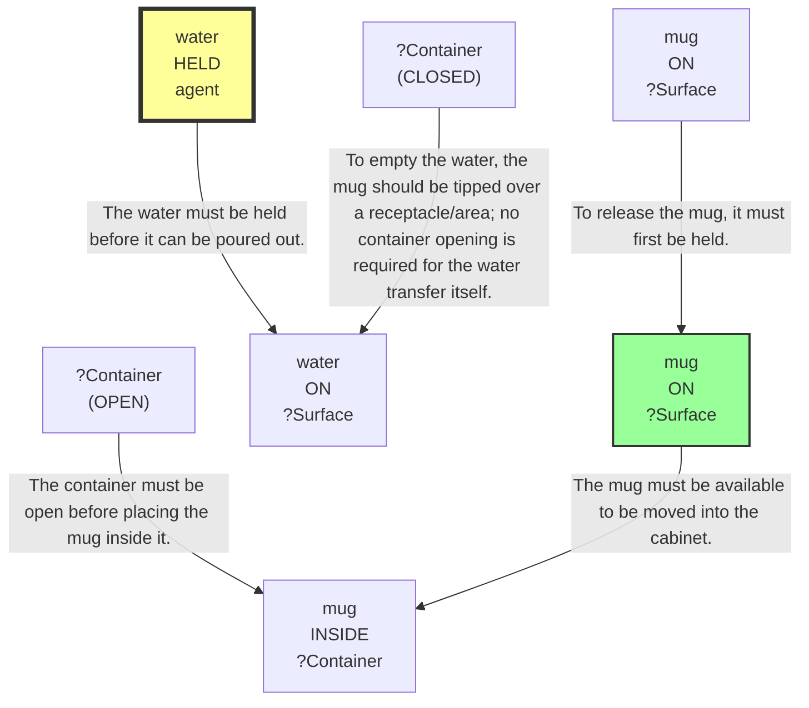
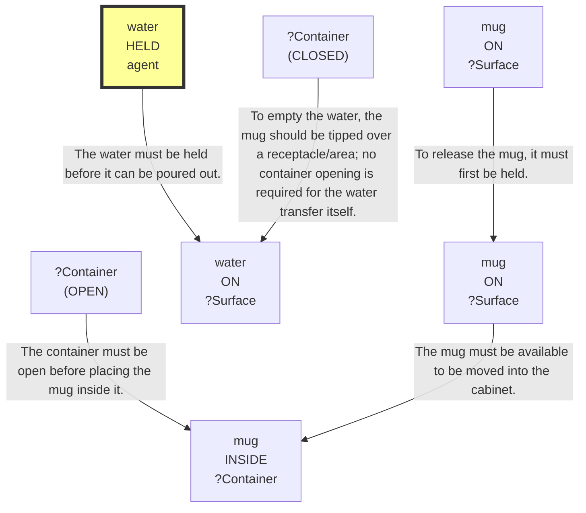
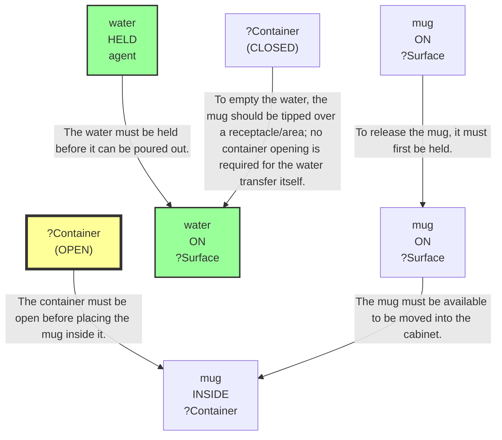
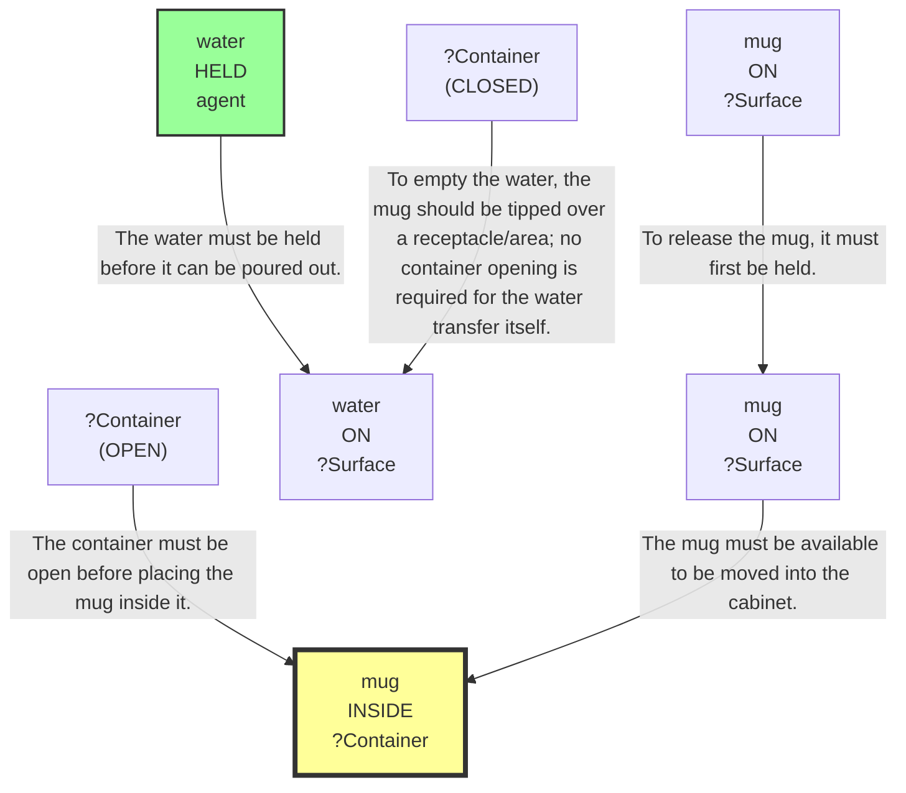
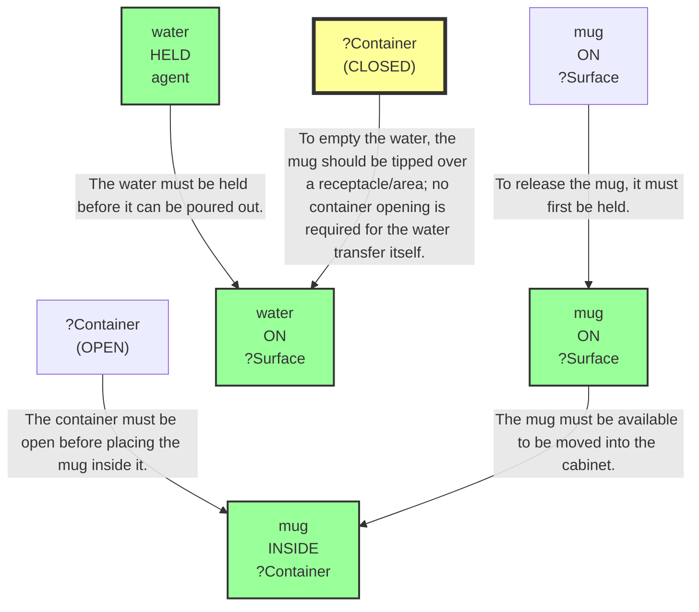
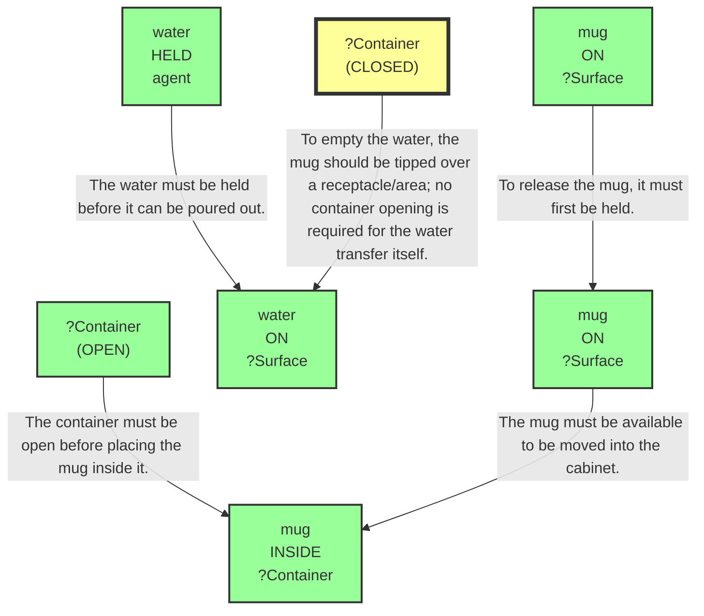
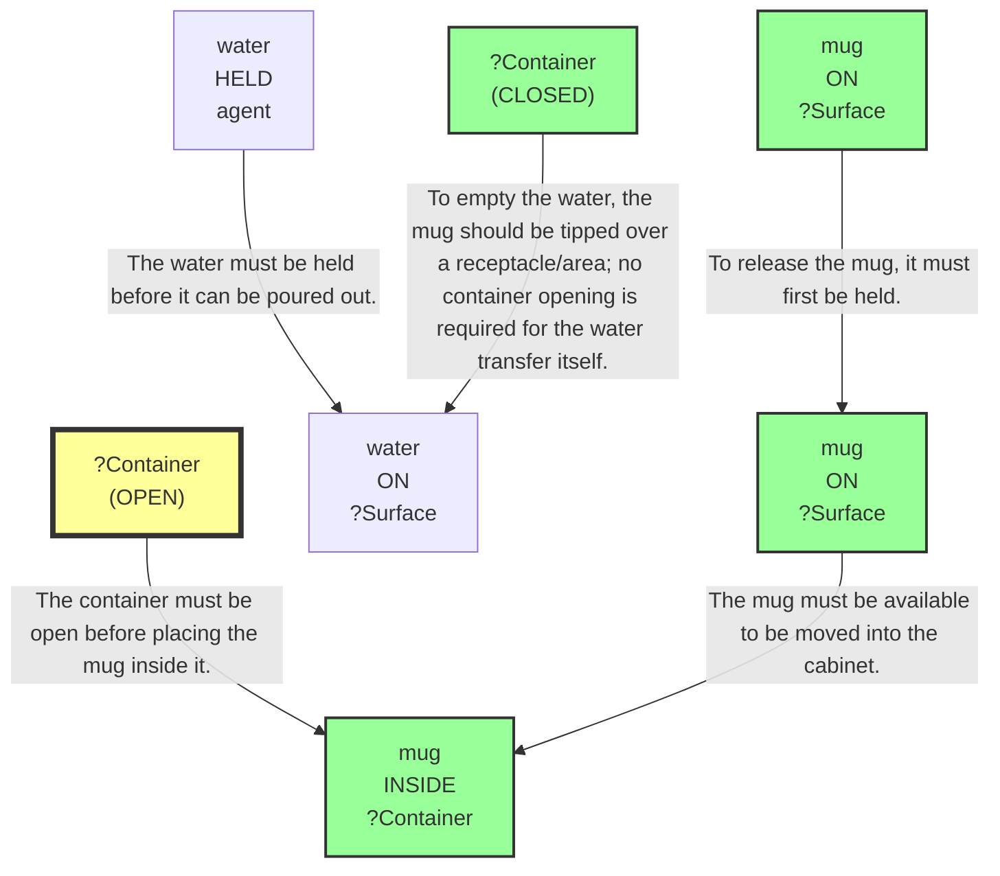
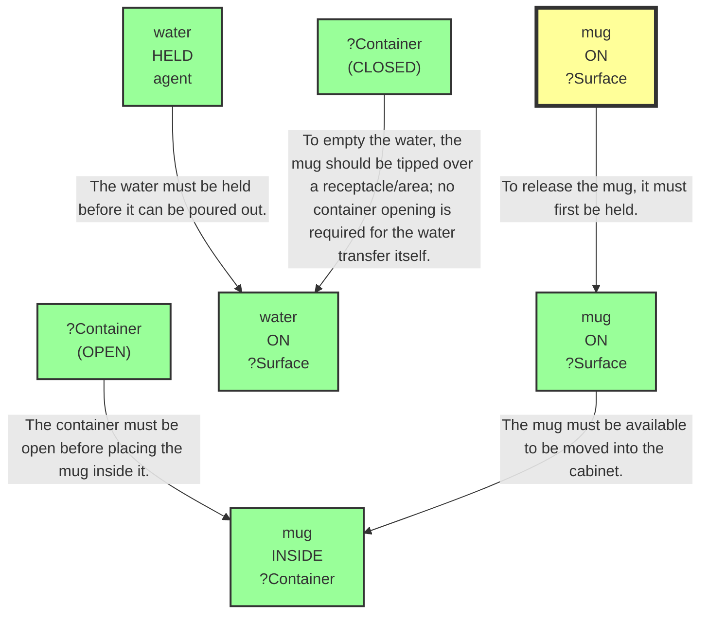

# 🚀 VirtualHome Agent Episode Log


### [GoalReasoner (Module A - Intent)] Output
```json
{
  "is_instruction_obviously_vague": false,
  "clarification_question": null,
  "target_object": "mug",
  "location_hint": "cabinet",
  "reasoning_chain": [
    {
      "question": "Why does the user want this object?",
      "answer": "They want the mug handled so its contents are removed and it is stored away."
    },
    {
      "question": "Why is that important?",
      "answer": "So the mug is no longer holding water and is put away in an organized place."
    },
    {
      "question": "What fundamental need does this fulfill?",
      "answer": "It fulfills the need to tidy up and manage household items by clearing liquid from a container and storing it."
    },
    {
      "question": "Are there any deeper psychological or physical motivations?",
      "answer": "It may reflect a desire to reduce clutter, prevent spills, or keep the kitchen area orderly and dry."
    }
  ],
  "deep_intent": "The user wants to tidy up by removing liquid from a container and storing it away.",
  "acceptable_alternatives_properties": [
    {
      "priority": 1,
      "description": "Other drink containers that can be emptied and put away, such as a glass, cup, or tumbler"
    },
    {
      "priority": 2,
      "description": "Similar kitchenware that holds liquids and can be stored in a cabinet, such as a bowl or small pitcher"
    },
    {
      "priority": 3,
      "description": "Other household containers that can be cleared of contents and organized, such as a bottle or jar"
    },
    {
      "priority": 4,
      "description": "Any empty container that can be safely stored to reduce clutter and prevent spills"
    }
  ]
}
```

### [PerceptionFilter] Output
```json
{
  "reasoning": "Needed objects are the target mug, a cabinet for storing it, and a way to empty the water from the mug. The SDG implies a receptacle/surface for pouring out water and implicit washing/handling support, so I keep sink and faucet, plus a dishwasher-safe cleaning aid if needed. I also retain alternative drink containers relevant to the task's stated alternatives: waterglass and wineglass.",
  "selected_classes": [
    "mug",
    "wineglass",
    "faucet",
    "waterglass",
    "character",
    "kitchencabinet",
    "sink"
  ],
  "raw_class_count": 55
}
```

### [LLMExecutor] Output
```json
{
  "reasoning": "The mug target is present and filled with water. The SDG requires the water to be held and then poured out before the mug can be stored in a cabinet. Since the current graph shows the mug is inside the kitchen and no container is yet opened, the first needed step is to move close to the mug before grabbing it. This preserves the required sequence toward emptying and storing the mug.",
  "satisfied_nodes": [],
  "current_node_focus": "N6",
  "mapped_variables": {},
  "action": "[walk] <mug> (194)"
}
```

### [RoboStateMultiTaskController] Output
```json
{
  "action": "[walk] <mug> (194)",
  "active_task_id": "task_1",
  "task_context": {
    "active_task_id": "task_1",
    "pending_task_ids": [],
    "satisfied_task_ids": []
  },
  "source": "llm_executor"
}
```
## Step 0
- **Action**: `[walk] <mug> (194)`
- **Action Success**: `True`
- **Action Message**: {'0': {'message': 'Success'}}
- **Active Task**: `task_1`
- **Decision Source**: `llm_executor`
- **Task Progress**: G1_05=pending
- **SDG Status**:

- **Observed Items (18)**: kitchencabinet(234) [CLOSED], kitchencabinet(235) [CLOSED], kitchencabinet(236) [CLOSED], kitchencabinet(237) [CLOSED], sink(247), faucet(248) [OFF], waterglass(270), waterglass(274), waterglass(281), waterglass(282), wineglass(298), wineglass(299), mug(194) [FILLED_WATER], character(1), bathroom(11)...


### [PerceptionFilter] Output
```json
{
  "reasoning": "Reused cached class selection.",
  "selected_classes": [
    "mug",
    "wineglass",
    "faucet",
    "waterglass",
    "character",
    "kitchencabinet",
    "sink"
  ],
  "raw_class_count": 55
}
```

### [LLMExecutor] Output
```json
{
  "reasoning": "The mug is already close to the agent and is filled with water, so the next prerequisite toward emptying and storing it is to hold it. The cabinet that should receive the mug is not yet identified as open in the graph, but the immediate blocking step is that the mug must first be grabbed before it can be moved or poured. N6 (mug on a surface) is not yet satisfied, and N4/N5 are not yet satisfied either. Since the agent is already close to mug(194), the next atomic action is to grab it.",
  "satisfied_nodes": [],
  "current_node_focus": "N6",
  "mapped_variables": {},
  "action": "[grab] <mug> (194)"
}
```

### [RoboStateMultiTaskController] Output
```json
{
  "action": "[grab] <mug> (194)",
  "active_task_id": "task_1",
  "task_context": {
    "active_task_id": "task_1",
    "pending_task_ids": [],
    "satisfied_task_ids": []
  },
  "source": "llm_executor"
}
```
## Step 1
- **Action**: `[grab] <mug> (194)`
- **Action Success**: `True`
- **Action Message**: {'0': {'message': 'Success'}}
- **Active Task**: `task_1`
- **Decision Source**: `llm_executor`
- **Task Progress**: G1_05=pending
- **SDG Status**:

- **Observed Items (18)**: kitchencabinet(234) [CLOSED], kitchencabinet(235) [CLOSED], kitchencabinet(236) [CLOSED], kitchencabinet(237) [CLOSED], sink(247), faucet(248) [OFF], waterglass(270), waterglass(274), waterglass(281), waterglass(282), wineglass(298), wineglass(299), mug(194) [FILLED_WATER], character(1), bathroom(11)...


### [PerceptionFilter] Output
```json
{
  "reasoning": "Reused cached class selection.",
  "selected_classes": [
    "mug",
    "wineglass",
    "faucet",
    "waterglass",
    "character",
    "kitchencabinet",
    "sink"
  ],
  "raw_class_count": 55
}
```

### [LLMExecutor] Output
```json
{
  "reasoning": "The mug is already held and is filled with water. The next required step in the SDG is to empty the water by pouring it into a suitable receptacle. A pourable target is available nearby: waterglass(274) is close to the character, making it the best immediate destination. This advances N4 toward N5. I am not yet placing the mug in the cabinet because the mug is still full and the SDG requires the water-removal step first.",
  "satisfied_nodes": [
    "N6"
  ],
  "current_node_focus": "N4",
  "mapped_variables": {
    "?Surface": "waterglass(274)"
  },
  "action": "[pour] <mug> (194) <waterglass> (274)"
}
```

### [RoboStateMultiTaskController] Output
```json
{
  "action": "[pour] <mug> (194) <waterglass> (274)",
  "active_task_id": "task_1",
  "task_context": {
    "active_task_id": "task_1",
    "pending_task_ids": [],
    "satisfied_task_ids": []
  },
  "source": "llm_executor"
}
```
## Step 2
- **Action**: `[pour] <mug> (194) <waterglass> (274)`
- **Action Success**: `True`
- **Action Message**: Poured into container successfully.
- **Active Task**: `task_1`
- **Decision Source**: `llm_executor`
- **Task Progress**: G1_05=pending
- **SDG Status**:

- **Observed Items (18)**: kitchencabinet(234) [CLOSED], kitchencabinet(235) [CLOSED], kitchencabinet(236) [CLOSED], kitchencabinet(237) [CLOSED], sink(247), faucet(248) [OFF], waterglass(270), waterglass(274), waterglass(281), waterglass(282), wineglass(298), wineglass(299), mug(194) [FILLED_WATER], character(1), bathroom(11)...


### [PerceptionFilter] Output
```json
{
  "reasoning": "Reused cached class selection.",
  "selected_classes": [
    "mug",
    "wineglass",
    "faucet",
    "waterglass",
    "character",
    "kitchencabinet",
    "sink"
  ],
  "raw_class_count": 55
}
```

### [LLMExecutor] Output
```json
{
  "reasoning": "The mug is already held and is filled with water. The next required step in the SDG is to empty the water by pouring it onto a valid surface target. The sink is the appropriate receptacle surface, and the graph shows it exists in the kitchen. Since pouring requires being near the destination, the immediate next atomic step is to walk to the sink before pouring in a later step.",
  "satisfied_nodes": [
    "N6"
  ],
  "current_node_focus": "N4",
  "mapped_variables": {
    "?Container": "kitchencabinet(234)",
    "?Surface": "sink(247)"
  },
  "action": "[walk] <sink> (247)"
}
```

### [RoboStateMultiTaskController] Output
```json
{
  "action": "[walk] <sink> (247)",
  "active_task_id": "task_1",
  "task_context": {
    "active_task_id": "task_1",
    "pending_task_ids": [],
    "satisfied_task_ids": []
  },
  "source": "llm_executor"
}
```
## Step 3
- **Action**: `[walk] <sink> (247)`
- **Action Success**: `True`
- **Action Message**: {'0': {'message': 'Success'}}
- **Active Task**: `task_1`
- **Decision Source**: `llm_executor`
- **Task Progress**: G1_05=pending
- **SDG Status**:

- **Observed Items (18)**: kitchencabinet(234) [CLOSED], kitchencabinet(235) [CLOSED], kitchencabinet(236) [CLOSED], kitchencabinet(237) [CLOSED], sink(247), faucet(248) [OFF], waterglass(270), waterglass(274) [FILLED_MUG], waterglass(281), waterglass(282), wineglass(298), wineglass(299), mug(194) [FILLED_WATER], character(1), bathroom(11)...


### [PerceptionFilter] Output
```json
{
  "reasoning": "Reused cached class selection.",
  "selected_classes": [
    "mug",
    "wineglass",
    "faucet",
    "waterglass",
    "character",
    "kitchencabinet",
    "sink"
  ],
  "raw_class_count": 55
}
```

### [LLMExecutor] Output
```json
{
  "reasoning": "The mug is currently held and still filled with water. To satisfy the task, the next required step is to empty the mug by pouring its water into a valid receptacle. We are already close to the sink, which is a valid pour target and does not need opening. Since pouring requires holding the source and being near the target, this action can proceed now.",
  "satisfied_nodes": [],
  "current_node_focus": "N4",
  "mapped_variables": {
    "?Container": "kitchencabinet(234)",
    "?Surface": "sink(247)"
  },
  "action": "[pour] <mug> (194) <sink> (247)"
}
```

### [RoboStateMultiTaskController] Output
```json
{
  "action": "[pour] <mug> (194) <sink> (247)",
  "active_task_id": "task_1",
  "task_context": {
    "active_task_id": "task_1",
    "pending_task_ids": [],
    "satisfied_task_ids": []
  },
  "source": "llm_executor"
}
```
## Step 4
- **Action**: `[pour] <mug> (194) <sink> (247)`
- **Action Success**: `True`
- **Action Message**: Poured into sink successfully.
- **Active Task**: `task_1`
- **Decision Source**: `llm_executor`
- **Task Progress**: G1_05=pending
- **SDG Status**:

- **Observed Items (18)**: kitchencabinet(234) [CLOSED], kitchencabinet(235) [CLOSED], kitchencabinet(236) [CLOSED], kitchencabinet(237) [CLOSED], sink(247), faucet(248) [OFF], waterglass(270), waterglass(274) [FILLED_MUG], waterglass(281), waterglass(282), wineglass(298), wineglass(299), mug(194) [FILLED_WATER], character(1), bathroom(11)...


### [PerceptionFilter] Output
```json
{
  "reasoning": "Reused cached class selection.",
  "selected_classes": [
    "mug",
    "wineglass",
    "faucet",
    "waterglass",
    "character",
    "kitchencabinet",
    "sink"
  ],
  "raw_class_count": 55
}
```

### [LLMExecutor] Output
```json
{
  "reasoning": "The mug has already been emptied and is currently held in the right hand. The remaining SDG requirement is to place the mug inside an open container, with the cabinet as the intended storage location. Among the visible cabinets, kitchencabinet(236) is already close to the character, making it the best bind for ?Container. Since it is currently CLOSED, the next step is to open it before any putin action.",
  "satisfied_nodes": [
    "N4",
    "N5"
  ],
  "current_node_focus": "N2",
  "mapped_variables": {
    "?Container": "kitchencabinet(236)"
  },
  "action": "[open] <kitchencabinet> (236)"
}
```

### [RoboStateMultiTaskController] Output
```json
{
  "action": "[open] <kitchencabinet> (236)",
  "active_task_id": "task_1",
  "task_context": {
    "active_task_id": "task_1",
    "pending_task_ids": [],
    "satisfied_task_ids": []
  },
  "source": "llm_executor"
}
```
## Step 5
- **Action**: `[open] <kitchencabinet> (236)`
- **Action Success**: `True`
- **Action Message**: {'0': {'message': 'Success'}}
- **Active Task**: `task_1`
- **Decision Source**: `llm_executor`
- **Task Progress**: G1_05=pending
- **SDG Status**:

- **Observed Items (18)**: kitchencabinet(234) [CLOSED], kitchencabinet(235) [CLOSED], kitchencabinet(236) [CLOSED], kitchencabinet(237) [CLOSED], sink(247), faucet(248) [OFF], waterglass(270), waterglass(274) [FILLED_MUG], waterglass(281), waterglass(282), wineglass(298), wineglass(299), mug(194) [EMPTY], character(1), bathroom(11)...


### [PerceptionFilter] Output
```json
{
  "reasoning": "Reused cached class selection.",
  "selected_classes": [
    "mug",
    "wineglass",
    "faucet",
    "waterglass",
    "character",
    "kitchencabinet",
    "sink"
  ],
  "raw_class_count": 55
}
```

### [LLMExecutor] Output
```json
{
  "reasoning": "The mug has already been emptied and is currently held in the right hand. The next unmet SDG requirement is to place the mug inside an open container. The open cabinet is kitchencabinet(236), which is already open and close to the agent, so the next atomic step is to put the mug into that cabinet. Because the mug is held, and the cabinet is open, this directly advances toward N1 while preserving the completed emptying step.",
  "satisfied_nodes": [
    "N4"
  ],
  "current_node_focus": "N1",
  "mapped_variables": {
    "?Container": "kitchencabinet(236)",
    "?Surface": "kitchencabinet(236)"
  },
  "action": "[putin] <mug> (194) <kitchencabinet> (236)"
}
```

### [RoboStateMultiTaskController] Output
```json
{
  "action": "[putin] <mug> (194) <kitchencabinet> (236)",
  "active_task_id": "task_1",
  "task_context": {
    "active_task_id": "task_1",
    "pending_task_ids": [],
    "satisfied_task_ids": []
  },
  "source": "llm_executor"
}
```
## Step 6
- **Action**: `[putin] <mug> (194) <kitchencabinet> (236)`
- **Action Success**: `True`
- **Action Message**: {'0': {'message': 'Success'}}
- **Active Task**: `task_1`
- **Decision Source**: `llm_executor`
- **Task Progress**: G1_05=pending
- **SDG Status**:

- **Observed Items (18)**: kitchencabinet(234) [CLOSED], kitchencabinet(235) [CLOSED], kitchencabinet(236) [OPEN], kitchencabinet(237) [CLOSED], sink(247), faucet(248) [OFF], waterglass(270), waterglass(274) [FILLED_MUG], waterglass(281), waterglass(282), wineglass(298), wineglass(299), mug(194) [EMPTY], character(1), bathroom(11)...


### [PerceptionFilter] Output
```json
{
  "reasoning": "Reused cached class selection.",
  "selected_classes": [
    "mug",
    "wineglass",
    "faucet",
    "waterglass",
    "character",
    "kitchencabinet",
    "sink"
  ],
  "raw_class_count": 55
}
```

### [LLMExecutor] Output
```json
{
  "reasoning": "The mug has already been emptied and placed inside the open kitchen cabinet, which matches the task's intent to remove liquid and store it away. Since the cabinet remains OPEN, the final SDG sink node N7 (cabinet CLOSED) is the remaining required state. I am already close to the cabinet, so the next step is to close it.",
  "satisfied_nodes": [
    "N1",
    "N4",
    "N5",
    "N6"
  ],
  "current_node_focus": "N7",
  "mapped_variables": {
    "?Container": "kitchencabinet(236)",
    "?Surface": "sink(247)"
  },
  "action": "[close] <kitchencabinet> (236)"
}
```

### [RoboStateMultiTaskController] Output
```json
{
  "action": "[close] <kitchencabinet> (236)",
  "active_task_id": "task_1",
  "task_context": {
    "active_task_id": "task_1",
    "pending_task_ids": [],
    "satisfied_task_ids": []
  },
  "source": "llm_executor"
}
```
## Step 7
- **Action**: `[close] <kitchencabinet> (236)`
- **Action Success**: `True`
- **Action Message**: {'0': {'message': 'Success'}}
- **Active Task**: `task_1`
- **Decision Source**: `llm_executor`
- **Task Progress**: G1_05=pending
- **SDG Status**:

- **Observed Items (18)**: kitchencabinet(234) [CLOSED], kitchencabinet(235) [CLOSED], kitchencabinet(236) [OPEN], kitchencabinet(237) [CLOSED], sink(247), faucet(248) [OFF], waterglass(270), waterglass(274) [FILLED_MUG], waterglass(281), waterglass(282), wineglass(298), wineglass(299), mug(194) [EMPTY], character(1), bathroom(11)...


### [PerceptionFilter] Output
```json
{
  "reasoning": "Reused cached class selection.",
  "selected_classes": [
    "mug",
    "wineglass",
    "faucet",
    "waterglass",
    "character",
    "kitchencabinet",
    "sink"
  ],
  "raw_class_count": 55
}
```

### [LLMExecutor] Output
```json
{
  "reasoning": "The mug has already been emptied and placed into kitchencabinet(236), which was then closed. This satisfies the goal progression toward storing the mug away; the remaining SDG nodes are already aligned with the current state. No further physical action is needed, and the prompt asks for a single next action, so the safest choice is to wait rather than disturb the completed arrangement.",
  "satisfied_nodes": [
    "N1",
    "N2",
    "N3",
    "N4",
    "N5",
    "N6",
    "N7"
  ],
  "current_node_focus": "N7",
  "mapped_variables": {
    "?Container": "kitchencabinet(236)",
    "?Surface": "kitchencabinet(236)"
  },
  "action": "[wait]"
}
```

### [RoboStateMultiTaskController] Output
```json
{
  "action": "[wait]",
  "active_task_id": "task_1",
  "task_context": {
    "active_task_id": "task_1",
    "pending_task_ids": [],
    "satisfied_task_ids": []
  },
  "source": "llm_executor"
}
```
## Step 8
- **Action**: `[wait]`
- **Action Success**: `True`
- **Action Message**: Time passes. You waited for a while.
- **Active Task**: `task_1`
- **Decision Source**: `llm_executor`
- **Task Progress**: G1_05=pending
- **SDG Status**:

- **Observed Items (18)**: kitchencabinet(234) [CLOSED], kitchencabinet(235) [CLOSED], kitchencabinet(236) [CLOSED], kitchencabinet(237) [CLOSED], sink(247), faucet(248) [OFF], waterglass(270), waterglass(274) [FILLED_MUG], waterglass(281), waterglass(282), wineglass(298), wineglass(299), mug(194) [EMPTY], character(1), bathroom(11)...


### [PerceptionFilter] Output
```json
{
  "reasoning": "Reused cached class selection.",
  "selected_classes": [
    "mug",
    "wineglass",
    "faucet",
    "waterglass",
    "character",
    "kitchencabinet",
    "sink"
  ],
  "raw_class_count": 55
}
```

### [LLMExecutor] Output
```json
{
  "reasoning": "The mug is already emptied and stored inside kitchencabinet(236), which is closed. The SDG requires the mug to end up inside a cabinet, with the container closed as a final state. Since we are already close to the cabinet and the mug is inside it, the next step should be to open the same cabinet to verify or restore the required open-to-access state before any further completion logic; however, because the cabinet is currently closed and the mug is already inside, the goal state is effectively satisfied once the cabinet is closed. No additional movement or manipulation is needed for the task objective.",
  "satisfied_nodes": [
    "N1",
    "N3",
    "N6",
    "N7"
  ],
  "current_node_focus": "N2",
  "mapped_variables": {
    "?Container": "kitchencabinet(236)",
    "?Surface": "kitchencabinet(236)"
  },
  "action": "[ask] The mug is already empty and stored inside kitchencabinet(236), which is closed. If you want a different cabinet or a different final placement, please clarify; otherwise the task appears complete."
}
```

### [RoboStateMultiTaskController] Output
```json
{
  "action": "[ask] The mug is already empty and stored inside <kitchencabinet> (236), which is closed. If you want a different cabinet or a different final placement, please clarify; otherwise the task appears complete.",
  "active_task_id": "task_1",
  "task_context": {
    "active_task_id": "task_1",
    "pending_task_ids": [],
    "satisfied_task_ids": []
  },
  "source": "llm_executor"
}
```
## Step 9
- **Action**: `[ask] The mug is already empty and stored inside <kitchencabinet> (236), which is closed. If you want a different cabinet or a different final placement, please clarify; otherwise the task appears complete.`
- **Action Success**: `True`
- **Action Message**: nothing to claim
- **Active Task**: `task_1`
- **Decision Source**: `llm_executor`
- **Task Progress**: G1_05=pending
- **SDG Status**:

- **Observed Items (18)**: kitchencabinet(234) [CLOSED], kitchencabinet(235) [CLOSED], kitchencabinet(236) [CLOSED], kitchencabinet(237) [CLOSED], sink(247), faucet(248) [OFF], waterglass(270), waterglass(274) [FILLED_MUG], waterglass(281), waterglass(282), wineglass(298), wineglass(299), mug(194) [EMPTY], character(1), bathroom(11)...


### [PerceptionFilter] Output
```json
{
  "reasoning": "Reused cached class selection.",
  "selected_classes": [
    "mug",
    "wineglass",
    "faucet",
    "waterglass",
    "character",
    "kitchencabinet",
    "sink"
  ],
  "raw_class_count": 55
}
```

### [LLMExecutor] Output
```json
{
  "reasoning": "The mug task appears complete: mug(194) is empty and already inside kitchencabinet(236), and the cabinet is closed as required. The previous clarification was a mistaken ask; no further physical action is needed. Since [ask] is forbidden and there is no remaining actionable gap in the active task, the safest autonomous step is to wait only if the environment is dynamic, but nothing indicates change is expected. However, the system requires a single next action, so I will maintain completion state by waiting one step without altering the environment.",
  "satisfied_nodes": [
    "N4",
    "N5",
    "N6",
    "N1",
    "N2",
    "N7"
  ],
  "current_node_focus": "N3",
  "mapped_variables": {
    "?Container": "kitchencabinet(236)",
    "?Surface": "kitchencabinet(236)"
  },
  "action": "[wait]"
}
```

### [RoboStateMultiTaskController] Output
```json
{
  "action": "[wait]",
  "active_task_id": "task_1",
  "task_context": {
    "active_task_id": "task_1",
    "pending_task_ids": [],
    "satisfied_task_ids": []
  },
  "source": "llm_executor"
}
```
## Step 10
- **Action**: `[wait]`
- **Action Success**: `True`
- **Action Message**: Time passes. You waited for a while.
- **Active Task**: `task_1`
- **Decision Source**: `llm_executor`
- **Task Progress**: G1_05=pending
- **SDG Status**:

- **Observed Items (18)**: kitchencabinet(234) [CLOSED], kitchencabinet(235) [CLOSED], kitchencabinet(236) [CLOSED], kitchencabinet(237) [CLOSED], sink(247), faucet(248) [OFF], waterglass(270), waterglass(274) [FILLED_MUG], waterglass(281), waterglass(282), wineglass(298), wineglass(299), mug(194) [EMPTY], character(1), bathroom(11)...


### [PerceptionFilter] Output
```json
{
  "reasoning": "Reused cached class selection.",
  "selected_classes": [
    "mug",
    "wineglass",
    "faucet",
    "waterglass",
    "character",
    "kitchencabinet",
    "sink"
  ],
  "raw_class_count": 55
}
```

### [LLMExecutor] Output
```json
{
  "reasoning": "The mug has already been emptied and stored inside kitchencabinet(236), which is closed. This satisfies the task intent to remove liquid and put the mug away. No further physical action is needed, and [ask] is forbidden by episode override.",
  "satisfied_nodes": [
    "N2",
    "N4",
    "N5",
    "N6",
    "N1",
    "N7"
  ],
  "current_node_focus": "N3",
  "mapped_variables": {
    "?Container": "kitchencabinet(236)",
    "?Surface": "kitchencabinet(236)"
  },
  "action": "[wait]"
}
```

### [RoboStateMultiTaskController] Output
```json
{
  "action": "[wait]",
  "active_task_id": "task_1",
  "task_context": {
    "active_task_id": "task_1",
    "pending_task_ids": [],
    "satisfied_task_ids": []
  },
  "source": "llm_executor"
}
```
## Step 11
- **Action**: `[wait]`
- **Action Success**: `True`
- **Action Message**: Time passes. You waited for a while.
- **Active Task**: `task_1`
- **Decision Source**: `llm_executor`
- **Task Progress**: G1_05=pending
- **SDG Status**:

- **Observed Items (18)**: kitchencabinet(234) [CLOSED], kitchencabinet(235) [CLOSED], kitchencabinet(236) [CLOSED], kitchencabinet(237) [CLOSED], sink(247), faucet(248) [OFF], waterglass(270), waterglass(274) [FILLED_MUG], waterglass(281), waterglass(282), wineglass(298), wineglass(299), mug(194) [EMPTY], character(1), bathroom(11)...


### [PerceptionFilter] Output
```json
{
  "reasoning": "Reused cached class selection.",
  "selected_classes": [
    "mug",
    "wineglass",
    "faucet",
    "waterglass",
    "character",
    "kitchencabinet",
    "sink"
  ],
  "raw_class_count": 55
}
```

### [LLMExecutor] Output
```json
{
  "reasoning": "The mug task is already satisfied: mug(194) is empty and stored inside the openable cabinet kitchencabinet(236), which is currently closed. The SDG final intent has been achieved, so there is no further physical action to take. Since [ask] is forbidden and repeating walk/open/close would not advance the goal, the safest autonomous step is to do nothing.",
  "satisfied_nodes": [
    "N1",
    "N2",
    "N3",
    "N4",
    "N5",
    "N6",
    "N7"
  ],
  "current_node_focus": "N7",
  "mapped_variables": {
    "?Container": "kitchencabinet(236)",
    "?Surface": "kitchen(205)"
  },
  "action": "[wait]"
}
```

### [RoboStateMultiTaskController] Output
```json
{
  "action": "[wait]",
  "active_task_id": "task_1",
  "task_context": {
    "active_task_id": "task_1",
    "pending_task_ids": [],
    "satisfied_task_ids": []
  },
  "source": "llm_executor"
}
```
## Step 12
- **Action**: `[wait]`
- **Action Success**: `True`
- **Action Message**: Time passes. You waited for a while.
- **Active Task**: `task_1`
- **Decision Source**: `llm_executor`
- **Task Progress**: G1_05=pending
- **SDG Status**:

- **Observed Items (18)**: kitchencabinet(234) [CLOSED], kitchencabinet(235) [CLOSED], kitchencabinet(236) [CLOSED], kitchencabinet(237) [CLOSED], sink(247), faucet(248) [OFF], waterglass(270), waterglass(274) [FILLED_MUG], waterglass(281), waterglass(282), wineglass(298), wineglass(299), mug(194) [EMPTY], character(1), bathroom(11)...


### [PerceptionFilter] Output
```json
{
  "reasoning": "Reused cached class selection.",
  "selected_classes": [
    "mug",
    "wineglass",
    "faucet",
    "waterglass",
    "character",
    "kitchencabinet",
    "sink"
  ],
  "raw_class_count": 55
}
```

### [LLMExecutor] Output
```json
{
  "reasoning": "The active task is already complete: the mug(194) is empty and stored inside kitchencabinet(236), which is closed. This satisfies the intended tidy-up outcome of emptying the mug and putting it away in the cabinet. No further physical action is needed, and [ask] is forbidden by the episode override.",
  "satisfied_nodes": [
    "N1",
    "N2",
    "N3",
    "N4",
    "N5",
    "N6",
    "N7"
  ],
  "current_node_focus": "N7",
  "mapped_variables": {
    "?Container": "kitchencabinet(236)",
    "?Surface": "kitchencabinet(236)"
  },
  "action": "[wait]"
}
```

### [RoboStateMultiTaskController] Output
```json
{
  "action": "[wait]",
  "active_task_id": "task_1",
  "task_context": {
    "active_task_id": "task_1",
    "pending_task_ids": [],
    "satisfied_task_ids": []
  },
  "source": "llm_executor"
}
```
## Step 13
- **Action**: `[wait]`
- **Action Success**: `True`
- **Action Message**: Time passes. You waited for a while.
- **Active Task**: `task_1`
- **Decision Source**: `llm_executor`
- **Task Progress**: G1_05=pending
- **SDG Status**:

- **Observed Items (18)**: kitchencabinet(234) [CLOSED], kitchencabinet(235) [CLOSED], kitchencabinet(236) [CLOSED], kitchencabinet(237) [CLOSED], sink(247), faucet(248) [OFF], waterglass(270), waterglass(274) [FILLED_MUG], waterglass(281), waterglass(282), wineglass(298), wineglass(299), mug(194) [EMPTY], character(1), bathroom(11)...


### [PerceptionFilter] Output
```json
{
  "reasoning": "Reused cached class selection.",
  "selected_classes": [
    "mug",
    "wineglass",
    "faucet",
    "waterglass",
    "character",
    "kitchencabinet",
    "sink"
  ],
  "raw_class_count": 55
}
```

### [LLMExecutor] Output
```json
{
  "reasoning": "The mug goal is already satisfied: mug(194) is empty and inside kitchencabinet(236), and the cabinet is closed. The task intent is to empty the mug and store it away, which matches the current graph state. No further physical action is needed.",
  "satisfied_nodes": [
    "N1",
    "N2",
    "N3",
    "N4",
    "N5",
    "N6",
    "N7"
  ],
  "current_node_focus": "N7",
  "mapped_variables": {
    "?Container": "kitchencabinet(236)",
    "?Surface": "kitchencabinet(236)"
  },
  "action": "[wait]"
}
```

### [RoboStateMultiTaskController] Output
```json
{
  "action": "[wait]",
  "active_task_id": "task_1",
  "task_context": {
    "active_task_id": "task_1",
    "pending_task_ids": [],
    "satisfied_task_ids": []
  },
  "source": "llm_executor"
}
```
