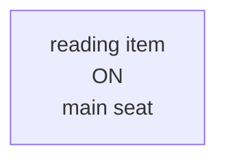

# 🚀 VirtualHome Agent Episode Log


### [GoalReasoner (Module A - Intent)] Output
```json
{
  "is_instruction_obviously_vague": false,
  "clarification_question": null,
  "target_object": "reading item",
  "location_hint": "main seat",
  "reasoning_chain": [
    {
      "question": "Why does the user want this object?",
      "answer": "To relocate the misplaced reading item to the main seat."
    },
    {
      "question": "Why is that important?",
      "answer": "So the item is placed where it is supposed to be and is readily accessible for use."
    },
    {
      "question": "What fundamental need does this fulfill?",
      "answer": "It fulfills the need to organize and restore the item to its intended location for convenient reading or use."
    },
    {
      "question": "Are there any deeper psychological or physical motivations?",
      "answer": "It may reduce clutter, prevent the item from being lost or left out of place, and support comfort or convenience during reading."
    }
  ],
  "deep_intent": "The user wants to restore an item to its intended place for convenient access and organization.",
  "acceptable_alternatives_properties": [
    {
      "priority": 1,
      "description": "Other misplaced personal items that belong at the main seat, such as a book, magazine, or newspaper"
    },
    {
      "priority": 2,
      "description": "Other reading materials or similar paper-based items used for reading"
    },
    {
      "priority": 3,
      "description": "Other household items that are commonly kept with seating for immediate use or access"
    },
    {
      "priority": 4,
      "description": "Any item that needs to be returned to its proper place to reduce clutter and restore organization"
    }
  ]
}
```

### [RoboStateMultiTaskController] Output
```json
{
  "action": "[walk] <kitchen> (11)",
  "active_task_id": "task_1",
  "task_context": {
    "active_task_id": "task_1",
    "pending_task_ids": [],
    "satisfied_task_ids": []
  },
  "source": "room_frontier"
}
```
## Step 0
- **Action**: `[walk] <kitchen> (11)`
- **Action Success**: `True`
- **Action Message**: {'0': {'message': 'Success'}}
- **Active Task**: `task_1`
- **Decision Source**: `room_frontier`
- **Task Progress**: E1_03=pending
- **SDG Status**:

- **Observed Items (59)**: floor(184), floor(185), floor(186), floor(187), floor(188), floor(189), wall(190), wall(191), wall(192), wall(193), wall(194), wall(195), ceiling(196), ceiling(197), ceiling(198)...


### [RoboStateMultiTaskController] Output
```json
{
  "action": "[walk] <bedroom> (241)",
  "active_task_id": "task_1",
  "task_context": {
    "active_task_id": "task_1",
    "pending_task_ids": [],
    "satisfied_task_ids": []
  },
  "source": "room_frontier"
}
```
## Step 1
- **Action**: `[walk] <bedroom> (241)`
- **Action Success**: `True`
- **Action Message**: {'0': {'message': 'Success'}}
- **Active Task**: `task_1`
- **Decision Source**: `room_frontier`
- **Task Progress**: E1_03=pending
- **SDG Status**:

- **Observed Items (212)**: floor(184), floor(185), floor(186), floor(187), floor(188), floor(189), wall(190), wall(191), wall(192), wall(193), wall(194), wall(195), ceiling(196), ceiling(197), ceiling(198)...


### [RoboStateMultiTaskController] Output
```json
{
  "action": "[walk] <bathroom> (285)",
  "active_task_id": "task_1",
  "task_context": {
    "active_task_id": "task_1",
    "pending_task_ids": [],
    "satisfied_task_ids": []
  },
  "source": "room_frontier"
}
```
## Step 2
- **Action**: `[walk] <bathroom> (285)`
- **Action Success**: `True`
- **Action Message**: {'0': {'message': 'Success'}}
- **Active Task**: `task_1`
- **Decision Source**: `room_frontier`
- **Task Progress**: E1_03=pending
- **SDG Status**:

- **Observed Items (244)**: floor(184), floor(185), floor(186), floor(187), floor(188), floor(189), wall(190), wall(191), wall(192), wall(193), wall(194), wall(195), ceiling(196), ceiling(197), ceiling(198)...


### [RoboStateMultiTaskController] Output
```json
{
  "action": "[walk] <bedroom> (346)",
  "active_task_id": "task_1",
  "task_context": {
    "active_task_id": "task_1",
    "pending_task_ids": [],
    "satisfied_task_ids": []
  },
  "source": "room_frontier"
}
```
## Step 3
- **Action**: `[walk] <bedroom> (346)`
- **Action Success**: `True`
- **Action Message**: {'0': {'message': 'Success'}}
- **Active Task**: `task_1`
- **Decision Source**: `room_frontier`
- **Task Progress**: E1_03=pending
- **SDG Status**:

- **Observed Items (304)**: floor(184), floor(185), floor(186), floor(187), floor(188), floor(189), wall(190), wall(191), wall(192), wall(193), wall(194), wall(195), ceiling(196), ceiling(197), ceiling(198)...


### [RoboStateMultiTaskController] Output
```json
{
  "action": "[walk] <livingroom> (183)",
  "active_task_id": null,
  "task_context": {
    "active_task_id": null,
    "pending_task_ids": [
      "task_1"
    ],
    "satisfied_task_ids": []
  },
  "source": "loop_recovery_room_revisit"
}
```
## Step 4
- **Action**: `[walk] <livingroom> (183)`
- **Action Success**: `True`
- **Action Message**: {'0': {'message': 'Success'}}
- **Decision Source**: `loop_recovery_room_revisit`
- **Task Progress**: E1_03=pending
- **SDG Status**:
No SDG active.
- **Observed Items (362)**: floor(184), floor(185), floor(186), floor(187), floor(188), floor(189), wall(190), wall(191), wall(192), wall(193), wall(194), wall(195), ceiling(196), ceiling(197), ceiling(198)...


### [RoboStateMultiTaskController] Output
```json
{
  "action": "[walk] <kitchen> (11)",
  "active_task_id": null,
  "task_context": {
    "active_task_id": null,
    "pending_task_ids": [
      "task_1"
    ],
    "satisfied_task_ids": []
  },
  "source": "loop_recovery_room_revisit"
}
```
## Step 5
- **Action**: `[walk] <kitchen> (11)`
- **Action Success**: `True`
- **Action Message**: {'0': {'message': 'Success'}}
- **Decision Source**: `loop_recovery_room_revisit`
- **Task Progress**: E1_03=pending
- **SDG Status**:
No SDG active.
- **Observed Items (362)**: floor(184), floor(185), floor(186), floor(187), floor(188), floor(189), wall(190), wall(191), wall(192), wall(193), wall(194), wall(195), ceiling(196), ceiling(197), ceiling(198)...


### [RoboStateMultiTaskController] Output
```json
{
  "action": "[walk] <bedroom> (241)",
  "active_task_id": null,
  "task_context": {
    "active_task_id": null,
    "pending_task_ids": [
      "task_1"
    ],
    "satisfied_task_ids": []
  },
  "source": "loop_recovery_room_revisit"
}
```
## Step 6
- **Action**: `[walk] <bedroom> (241)`
- **Action Success**: `True`
- **Action Message**: {'0': {'message': 'Success'}}
- **Decision Source**: `loop_recovery_room_revisit`
- **Task Progress**: E1_03=pending
- **SDG Status**:
No SDG active.
- **Observed Items (362)**: floor(184), floor(185), floor(186), floor(187), floor(188), floor(189), wall(190), wall(191), wall(192), wall(193), wall(194), wall(195), ceiling(196), ceiling(197), ceiling(198)...


### [RoboStateMultiTaskController] Output
```json
{
  "action": "[walk] <bathroom> (285)",
  "active_task_id": null,
  "task_context": {
    "active_task_id": null,
    "pending_task_ids": [
      "task_1"
    ],
    "satisfied_task_ids": []
  },
  "source": "loop_recovery_room_revisit"
}
```
## Step 7
- **Action**: `[walk] <bathroom> (285)`
- **Action Success**: `True`
- **Action Message**: {'0': {'message': 'Success'}}
- **Decision Source**: `loop_recovery_room_revisit`
- **Task Progress**: E1_03=pending
- **SDG Status**:
No SDG active.
- **Observed Items (362)**: floor(184), floor(185), floor(186), floor(187), floor(188), floor(189), wall(190), wall(191), wall(192), wall(193), wall(194), wall(195), ceiling(196), ceiling(197), ceiling(198)...


### [RoboStateMultiTaskController] Output
```json
{
  "action": "[walk] <bedroom> (346)",
  "active_task_id": null,
  "task_context": {
    "active_task_id": null,
    "pending_task_ids": [
      "task_1"
    ],
    "satisfied_task_ids": []
  },
  "source": "loop_recovery_room_revisit"
}
```
## Step 8
- **Action**: `[walk] <bedroom> (346)`
- **Action Success**: `True`
- **Action Message**: {'0': {'message': 'Success'}}
- **Decision Source**: `loop_recovery_room_revisit`
- **Task Progress**: E1_03=pending
- **SDG Status**:
No SDG active.
- **Observed Items (362)**: floor(184), floor(185), floor(186), floor(187), floor(188), floor(189), wall(190), wall(191), wall(192), wall(193), wall(194), wall(195), ceiling(196), ceiling(197), ceiling(198)...


### [RoboStateMultiTaskController] Output
```json
{
  "action": "[walk] <livingroom> (183)",
  "active_task_id": null,
  "task_context": {
    "active_task_id": null,
    "pending_task_ids": [
      "task_1"
    ],
    "satisfied_task_ids": []
  },
  "source": "loop_recovery_room_revisit"
}
```
## Step 9
- **Action**: `[walk] <livingroom> (183)`
- **Action Success**: `True`
- **Action Message**: {'0': {'message': 'Success'}}
- **Decision Source**: `loop_recovery_room_revisit`
- **Task Progress**: E1_03=pending
- **SDG Status**:
No SDG active.
- **Observed Items (362)**: floor(184), floor(185), floor(186), floor(187), floor(188), floor(189), wall(190), wall(191), wall(192), wall(193), wall(194), wall(195), ceiling(196), ceiling(197), ceiling(198)...


### [RoboStateMultiTaskController] Output
```json
{
  "action": "[walk] <kitchen> (11)",
  "active_task_id": null,
  "task_context": {
    "active_task_id": null,
    "pending_task_ids": [
      "task_1"
    ],
    "satisfied_task_ids": []
  },
  "source": "loop_recovery_room_revisit"
}
```
## Step 10
- **Action**: `[walk] <kitchen> (11)`
- **Action Success**: `True`
- **Action Message**: {'0': {'message': 'Success'}}
- **Decision Source**: `loop_recovery_room_revisit`
- **Task Progress**: E1_03=pending
- **SDG Status**:
No SDG active.
- **Observed Items (362)**: floor(184), floor(185), floor(186), floor(187), floor(188), floor(189), wall(190), wall(191), wall(192), wall(193), wall(194), wall(195), ceiling(196), ceiling(197), ceiling(198)...


### [RoboStateMultiTaskController] Output
```json
{
  "action": "[walk] <bedroom> (241)",
  "active_task_id": null,
  "task_context": {
    "active_task_id": null,
    "pending_task_ids": [
      "task_1"
    ],
    "satisfied_task_ids": []
  },
  "source": "loop_recovery_room_revisit"
}
```
## Step 11
- **Action**: `[walk] <bedroom> (241)`
- **Action Success**: `True`
- **Action Message**: {'0': {'message': 'Success'}}
- **Decision Source**: `loop_recovery_room_revisit`
- **Task Progress**: E1_03=pending
- **SDG Status**:
No SDG active.
- **Observed Items (362)**: floor(184), floor(185), floor(186), floor(187), floor(188), floor(189), wall(190), wall(191), wall(192), wall(193), wall(194), wall(195), ceiling(196), ceiling(197), ceiling(198)...


### [RoboStateMultiTaskController] Output
```json
{
  "action": "[walk] <bathroom> (285)",
  "active_task_id": null,
  "task_context": {
    "active_task_id": null,
    "pending_task_ids": [
      "task_1"
    ],
    "satisfied_task_ids": []
  },
  "source": "loop_recovery_room_revisit"
}
```
## Step 12
- **Action**: `[walk] <bathroom> (285)`
- **Action Success**: `True`
- **Action Message**: {'0': {'message': 'Success'}}
- **Decision Source**: `loop_recovery_room_revisit`
- **Task Progress**: E1_03=pending
- **SDG Status**:
No SDG active.
- **Observed Items (362)**: floor(184), floor(185), floor(186), floor(187), floor(188), floor(189), wall(190), wall(191), wall(192), wall(193), wall(194), wall(195), ceiling(196), ceiling(197), ceiling(198)...


### [RoboStateMultiTaskController] Output
```json
{
  "action": "[walk] <bedroom> (346)",
  "active_task_id": null,
  "task_context": {
    "active_task_id": null,
    "pending_task_ids": [
      "task_1"
    ],
    "satisfied_task_ids": []
  },
  "source": "loop_recovery_room_revisit"
}
```
## Step 13
- **Action**: `[walk] <bedroom> (346)`
- **Action Success**: `True`
- **Action Message**: {'0': {'message': 'Success'}}
- **Decision Source**: `loop_recovery_room_revisit`
- **Task Progress**: E1_03=pending
- **SDG Status**:
No SDG active.
- **Observed Items (362)**: floor(184), floor(185), floor(186), floor(187), floor(188), floor(189), wall(190), wall(191), wall(192), wall(193), wall(194), wall(195), ceiling(196), ceiling(197), ceiling(198)...


### [RoboStateMultiTaskController] Output
```json
{
  "action": "[walk] <livingroom> (183)",
  "active_task_id": null,
  "task_context": {
    "active_task_id": null,
    "pending_task_ids": [
      "task_1"
    ],
    "satisfied_task_ids": []
  },
  "source": "loop_recovery_room_revisit"
}
```
## Step 14
- **Action**: `[walk] <livingroom> (183)`
- **Action Success**: `True`
- **Action Message**: {'0': {'message': 'Success'}}
- **Decision Source**: `loop_recovery_room_revisit`
- **Task Progress**: E1_03=pending
- **SDG Status**:
No SDG active.
- **Observed Items (362)**: floor(184), floor(185), floor(186), floor(187), floor(188), floor(189), wall(190), wall(191), wall(192), wall(193), wall(194), wall(195), ceiling(196), ceiling(197), ceiling(198)...


### [RoboStateMultiTaskController] Output
```json
{
  "action": "[walk] <kitchen> (11)",
  "active_task_id": null,
  "task_context": {
    "active_task_id": null,
    "pending_task_ids": [
      "task_1"
    ],
    "satisfied_task_ids": []
  },
  "source": "loop_recovery_room_revisit"
}
```
## Step 15
- **Action**: `[walk] <kitchen> (11)`
- **Action Success**: `True`
- **Action Message**: {'0': {'message': 'Success'}}
- **Decision Source**: `loop_recovery_room_revisit`
- **Task Progress**: E1_03=pending
- **SDG Status**:
No SDG active.
- **Observed Items (362)**: floor(184), floor(185), floor(186), floor(187), floor(188), floor(189), wall(190), wall(191), wall(192), wall(193), wall(194), wall(195), ceiling(196), ceiling(197), ceiling(198)...


### [RoboStateMultiTaskController] Output
```json
{
  "action": "[walk] <bedroom> (241)",
  "active_task_id": null,
  "task_context": {
    "active_task_id": null,
    "pending_task_ids": [
      "task_1"
    ],
    "satisfied_task_ids": []
  },
  "source": "loop_recovery_room_revisit"
}
```
## Step 16
- **Action**: `[walk] <bedroom> (241)`
- **Action Success**: `True`
- **Action Message**: {'0': {'message': 'Success'}}
- **Decision Source**: `loop_recovery_room_revisit`
- **Task Progress**: E1_03=pending
- **SDG Status**:
No SDG active.
- **Observed Items (362)**: floor(184), floor(185), floor(186), floor(187), floor(188), floor(189), wall(190), wall(191), wall(192), wall(193), wall(194), wall(195), ceiling(196), ceiling(197), ceiling(198)...


### [RoboStateMultiTaskController] Output
```json
{
  "action": "[walk] <bathroom> (285)",
  "active_task_id": null,
  "task_context": {
    "active_task_id": null,
    "pending_task_ids": [
      "task_1"
    ],
    "satisfied_task_ids": []
  },
  "source": "loop_recovery_room_revisit"
}
```
## Step 17
- **Action**: `[walk] <bathroom> (285)`
- **Action Success**: `True`
- **Action Message**: {'0': {'message': 'Success'}}
- **Decision Source**: `loop_recovery_room_revisit`
- **Task Progress**: E1_03=pending
- **SDG Status**:
No SDG active.
- **Observed Items (362)**: floor(184), floor(185), floor(186), floor(187), floor(188), floor(189), wall(190), wall(191), wall(192), wall(193), wall(194), wall(195), ceiling(196), ceiling(197), ceiling(198)...


### [RoboStateMultiTaskController] Output
```json
{
  "action": "[walk] <bedroom> (346)",
  "active_task_id": null,
  "task_context": {
    "active_task_id": null,
    "pending_task_ids": [
      "task_1"
    ],
    "satisfied_task_ids": []
  },
  "source": "loop_recovery_room_revisit"
}
```
## Step 18
- **Action**: `[walk] <bedroom> (346)`
- **Action Success**: `True`
- **Action Message**: {'0': {'message': 'Success'}}
- **Decision Source**: `loop_recovery_room_revisit`
- **Task Progress**: E1_03=pending
- **SDG Status**:
No SDG active.
- **Observed Items (362)**: floor(184), floor(185), floor(186), floor(187), floor(188), floor(189), wall(190), wall(191), wall(192), wall(193), wall(194), wall(195), ceiling(196), ceiling(197), ceiling(198)...


### [RoboStateMultiTaskController] Output
```json
{
  "action": "[walk] <livingroom> (183)",
  "active_task_id": null,
  "task_context": {
    "active_task_id": null,
    "pending_task_ids": [
      "task_1"
    ],
    "satisfied_task_ids": []
  },
  "source": "loop_recovery_room_revisit"
}
```
## Step 19
- **Action**: `[walk] <livingroom> (183)`
- **Action Success**: `True`
- **Action Message**: {'0': {'message': 'Success'}}
- **Decision Source**: `loop_recovery_room_revisit`
- **Task Progress**: E1_03=pending
- **SDG Status**:
No SDG active.
- **Observed Items (362)**: floor(184), floor(185), floor(186), floor(187), floor(188), floor(189), wall(190), wall(191), wall(192), wall(193), wall(194), wall(195), ceiling(196), ceiling(197), ceiling(198)...


### [RoboStateMultiTaskController] Output
```json
{
  "action": "[walk] <kitchen> (11)",
  "active_task_id": null,
  "task_context": {
    "active_task_id": null,
    "pending_task_ids": [
      "task_1"
    ],
    "satisfied_task_ids": []
  },
  "source": "loop_recovery_room_revisit"
}
```
## Step 20
- **Action**: `[walk] <kitchen> (11)`
- **Action Success**: `True`
- **Action Message**: {'0': {'message': 'Success'}}
- **Decision Source**: `loop_recovery_room_revisit`
- **Task Progress**: E1_03=pending
- **SDG Status**:
No SDG active.
- **Observed Items (362)**: floor(184), floor(185), floor(186), floor(187), floor(188), floor(189), wall(190), wall(191), wall(192), wall(193), wall(194), wall(195), ceiling(196), ceiling(197), ceiling(198)...


### [RoboStateMultiTaskController] Output
```json
{
  "action": "[walk] <bedroom> (241)",
  "active_task_id": null,
  "task_context": {
    "active_task_id": null,
    "pending_task_ids": [
      "task_1"
    ],
    "satisfied_task_ids": []
  },
  "source": "loop_recovery_room_revisit"
}
```
## Step 21
- **Action**: `[walk] <bedroom> (241)`
- **Action Success**: `True`
- **Action Message**: {'0': {'message': 'Success'}}
- **Decision Source**: `loop_recovery_room_revisit`
- **Task Progress**: E1_03=pending
- **SDG Status**:
No SDG active.
- **Observed Items (362)**: floor(184), floor(185), floor(186), floor(187), floor(188), floor(189), wall(190), wall(191), wall(192), wall(193), wall(194), wall(195), ceiling(196), ceiling(197), ceiling(198)...


### [RoboStateMultiTaskController] Output
```json
{
  "action": "[walk] <bathroom> (285)",
  "active_task_id": null,
  "task_context": {
    "active_task_id": null,
    "pending_task_ids": [
      "task_1"
    ],
    "satisfied_task_ids": []
  },
  "source": "loop_recovery_room_revisit"
}
```
## Step 22
- **Action**: `[walk] <bathroom> (285)`
- **Action Success**: `True`
- **Action Message**: {'0': {'message': 'Success'}}
- **Decision Source**: `loop_recovery_room_revisit`
- **Task Progress**: E1_03=pending
- **SDG Status**:
No SDG active.
- **Observed Items (362)**: floor(184), floor(185), floor(186), floor(187), floor(188), floor(189), wall(190), wall(191), wall(192), wall(193), wall(194), wall(195), ceiling(196), ceiling(197), ceiling(198)...


### [RoboStateMultiTaskController] Output
```json
{
  "action": "[walk] <bedroom> (346)",
  "active_task_id": null,
  "task_context": {
    "active_task_id": null,
    "pending_task_ids": [
      "task_1"
    ],
    "satisfied_task_ids": []
  },
  "source": "loop_recovery_room_revisit"
}
```
## Step 23
- **Action**: `[walk] <bedroom> (346)`
- **Action Success**: `True`
- **Action Message**: {'0': {'message': 'Success'}}
- **Decision Source**: `loop_recovery_room_revisit`
- **Task Progress**: E1_03=pending
- **SDG Status**:
No SDG active.
- **Observed Items (362)**: floor(184), floor(185), floor(186), floor(187), floor(188), floor(189), wall(190), wall(191), wall(192), wall(193), wall(194), wall(195), ceiling(196), ceiling(197), ceiling(198)...


### [RoboStateMultiTaskController] Output
```json
{
  "action": "[walk] <livingroom> (183)",
  "active_task_id": null,
  "task_context": {
    "active_task_id": null,
    "pending_task_ids": [
      "task_1"
    ],
    "satisfied_task_ids": []
  },
  "source": "loop_recovery_room_revisit"
}
```
## Step 24
- **Action**: `[walk] <livingroom> (183)`
- **Action Success**: `True`
- **Action Message**: {'0': {'message': 'Success'}}
- **Decision Source**: `loop_recovery_room_revisit`
- **Task Progress**: E1_03=pending
- **SDG Status**:
No SDG active.
- **Observed Items (362)**: floor(184), floor(185), floor(186), floor(187), floor(188), floor(189), wall(190), wall(191), wall(192), wall(193), wall(194), wall(195), ceiling(196), ceiling(197), ceiling(198)...


### [RoboStateMultiTaskController] Output
```json
{
  "action": "[walk] <kitchen> (11)",
  "active_task_id": null,
  "task_context": {
    "active_task_id": null,
    "pending_task_ids": [
      "task_1"
    ],
    "satisfied_task_ids": []
  },
  "source": "loop_recovery_room_revisit"
}
```
## Step 25
- **Action**: `[walk] <kitchen> (11)`
- **Action Success**: `True`
- **Action Message**: {'0': {'message': 'Success'}}
- **Decision Source**: `loop_recovery_room_revisit`
- **Task Progress**: E1_03=pending
- **SDG Status**:
No SDG active.
- **Observed Items (362)**: floor(184), floor(185), floor(186), floor(187), floor(188), floor(189), wall(190), wall(191), wall(192), wall(193), wall(194), wall(195), ceiling(196), ceiling(197), ceiling(198)...


### [RoboStateMultiTaskController] Output
```json
{
  "action": "[walk] <bedroom> (241)",
  "active_task_id": null,
  "task_context": {
    "active_task_id": null,
    "pending_task_ids": [
      "task_1"
    ],
    "satisfied_task_ids": []
  },
  "source": "loop_recovery_room_revisit"
}
```
## Step 26
- **Action**: `[walk] <bedroom> (241)`
- **Action Success**: `True`
- **Action Message**: {'0': {'message': 'Success'}}
- **Decision Source**: `loop_recovery_room_revisit`
- **Task Progress**: E1_03=pending
- **SDG Status**:
No SDG active.
- **Observed Items (362)**: floor(184), floor(185), floor(186), floor(187), floor(188), floor(189), wall(190), wall(191), wall(192), wall(193), wall(194), wall(195), ceiling(196), ceiling(197), ceiling(198)...


### [RoboStateMultiTaskController] Output
```json
{
  "action": "[walk] <bathroom> (285)",
  "active_task_id": null,
  "task_context": {
    "active_task_id": null,
    "pending_task_ids": [
      "task_1"
    ],
    "satisfied_task_ids": []
  },
  "source": "loop_recovery_room_revisit"
}
```
## Step 27
- **Action**: `[walk] <bathroom> (285)`
- **Action Success**: `True`
- **Action Message**: {'0': {'message': 'Success'}}
- **Decision Source**: `loop_recovery_room_revisit`
- **Task Progress**: E1_03=pending
- **SDG Status**:
No SDG active.
- **Observed Items (362)**: floor(184), floor(185), floor(186), floor(187), floor(188), floor(189), wall(190), wall(191), wall(192), wall(193), wall(194), wall(195), ceiling(196), ceiling(197), ceiling(198)...


### [RoboStateMultiTaskController] Output
```json
{
  "action": "[walk] <bedroom> (346)",
  "active_task_id": null,
  "task_context": {
    "active_task_id": null,
    "pending_task_ids": [
      "task_1"
    ],
    "satisfied_task_ids": []
  },
  "source": "loop_recovery_room_revisit"
}
```
## Step 28
- **Action**: `[walk] <bedroom> (346)`
- **Action Success**: `True`
- **Action Message**: {'0': {'message': 'Success'}}
- **Decision Source**: `loop_recovery_room_revisit`
- **Task Progress**: E1_03=pending
- **SDG Status**:
No SDG active.
- **Observed Items (362)**: floor(184), floor(185), floor(186), floor(187), floor(188), floor(189), wall(190), wall(191), wall(192), wall(193), wall(194), wall(195), ceiling(196), ceiling(197), ceiling(198)...


### [RoboStateMultiTaskController] Output
```json
{
  "action": "[walk] <livingroom> (183)",
  "active_task_id": null,
  "task_context": {
    "active_task_id": null,
    "pending_task_ids": [
      "task_1"
    ],
    "satisfied_task_ids": []
  },
  "source": "loop_recovery_room_revisit"
}
```
## Step 29
- **Action**: `[walk] <livingroom> (183)`
- **Action Success**: `True`
- **Action Message**: {'0': {'message': 'Success'}}
- **Decision Source**: `loop_recovery_room_revisit`
- **Task Progress**: E1_03=pending
- **SDG Status**:
No SDG active.
- **Observed Items (362)**: floor(184), floor(185), floor(186), floor(187), floor(188), floor(189), wall(190), wall(191), wall(192), wall(193), wall(194), wall(195), ceiling(196), ceiling(197), ceiling(198)...


### [RoboStateMultiTaskController] Output
```json
{
  "action": "[walk] <kitchen> (11)",
  "active_task_id": null,
  "task_context": {
    "active_task_id": null,
    "pending_task_ids": [
      "task_1"
    ],
    "satisfied_task_ids": []
  },
  "source": "loop_recovery_room_revisit"
}
```
## Step 30
- **Action**: `[walk] <kitchen> (11)`
- **Action Success**: `True`
- **Action Message**: {'0': {'message': 'Success'}}
- **Decision Source**: `loop_recovery_room_revisit`
- **Task Progress**: E1_03=pending
- **SDG Status**:
No SDG active.
- **Observed Items (362)**: floor(184), floor(185), floor(186), floor(187), floor(188), floor(189), wall(190), wall(191), wall(192), wall(193), wall(194), wall(195), ceiling(196), ceiling(197), ceiling(198)...


### [RoboStateMultiTaskController] Output
```json
{
  "action": "[walk] <bedroom> (241)",
  "active_task_id": null,
  "task_context": {
    "active_task_id": null,
    "pending_task_ids": [
      "task_1"
    ],
    "satisfied_task_ids": []
  },
  "source": "loop_recovery_room_revisit"
}
```
## Step 31
- **Action**: `[walk] <bedroom> (241)`
- **Action Success**: `True`
- **Action Message**: {'0': {'message': 'Success'}}
- **Decision Source**: `loop_recovery_room_revisit`
- **Task Progress**: E1_03=pending
- **SDG Status**:
No SDG active.
- **Observed Items (362)**: floor(184), floor(185), floor(186), floor(187), floor(188), floor(189), wall(190), wall(191), wall(192), wall(193), wall(194), wall(195), ceiling(196), ceiling(197), ceiling(198)...


### [RoboStateMultiTaskController] Output
```json
{
  "action": "[walk] <bathroom> (285)",
  "active_task_id": null,
  "task_context": {
    "active_task_id": null,
    "pending_task_ids": [
      "task_1"
    ],
    "satisfied_task_ids": []
  },
  "source": "loop_recovery_room_revisit"
}
```
## Step 32
- **Action**: `[walk] <bathroom> (285)`
- **Action Success**: `True`
- **Action Message**: {'0': {'message': 'Success'}}
- **Decision Source**: `loop_recovery_room_revisit`
- **Task Progress**: E1_03=pending
- **SDG Status**:
No SDG active.
- **Observed Items (362)**: floor(184), floor(185), floor(186), floor(187), floor(188), floor(189), wall(190), wall(191), wall(192), wall(193), wall(194), wall(195), ceiling(196), ceiling(197), ceiling(198)...


### [RoboStateMultiTaskController] Output
```json
{
  "action": "[walk] <bedroom> (346)",
  "active_task_id": null,
  "task_context": {
    "active_task_id": null,
    "pending_task_ids": [
      "task_1"
    ],
    "satisfied_task_ids": []
  },
  "source": "loop_recovery_room_revisit"
}
```
## Step 33
- **Action**: `[walk] <bedroom> (346)`
- **Action Success**: `True`
- **Action Message**: {'0': {'message': 'Success'}}
- **Decision Source**: `loop_recovery_room_revisit`
- **Task Progress**: E1_03=pending
- **SDG Status**:
No SDG active.
- **Observed Items (362)**: floor(184), floor(185), floor(186), floor(187), floor(188), floor(189), wall(190), wall(191), wall(192), wall(193), wall(194), wall(195), ceiling(196), ceiling(197), ceiling(198)...


### [RoboStateMultiTaskController] Output
```json
{
  "action": "[walk] <livingroom> (183)",
  "active_task_id": null,
  "task_context": {
    "active_task_id": null,
    "pending_task_ids": [
      "task_1"
    ],
    "satisfied_task_ids": []
  },
  "source": "loop_recovery_room_revisit"
}
```
## Step 34
- **Action**: `[walk] <livingroom> (183)`
- **Action Success**: `True`
- **Action Message**: {'0': {'message': 'Success'}}
- **Decision Source**: `loop_recovery_room_revisit`
- **Task Progress**: E1_03=pending
- **SDG Status**:
No SDG active.
- **Observed Items (362)**: floor(184), floor(185), floor(186), floor(187), floor(188), floor(189), wall(190), wall(191), wall(192), wall(193), wall(194), wall(195), ceiling(196), ceiling(197), ceiling(198)...


### [RoboStateMultiTaskController] Output
```json
{
  "action": "[walk] <kitchen> (11)",
  "active_task_id": null,
  "task_context": {
    "active_task_id": null,
    "pending_task_ids": [
      "task_1"
    ],
    "satisfied_task_ids": []
  },
  "source": "loop_recovery_room_revisit"
}
```
## Step 35
- **Action**: `[walk] <kitchen> (11)`
- **Action Success**: `True`
- **Action Message**: {'0': {'message': 'Success'}}
- **Decision Source**: `loop_recovery_room_revisit`
- **Task Progress**: E1_03=pending
- **SDG Status**:
No SDG active.
- **Observed Items (362)**: floor(184), floor(185), floor(186), floor(187), floor(188), floor(189), wall(190), wall(191), wall(192), wall(193), wall(194), wall(195), ceiling(196), ceiling(197), ceiling(198)...


### [RoboStateMultiTaskController] Output
```json
{
  "action": "[walk] <bedroom> (241)",
  "active_task_id": null,
  "task_context": {
    "active_task_id": null,
    "pending_task_ids": [
      "task_1"
    ],
    "satisfied_task_ids": []
  },
  "source": "loop_recovery_room_revisit"
}
```
## Step 36
- **Action**: `[walk] <bedroom> (241)`
- **Action Success**: `True`
- **Action Message**: {'0': {'message': 'Success'}}
- **Decision Source**: `loop_recovery_room_revisit`
- **Task Progress**: E1_03=pending
- **SDG Status**:
No SDG active.
- **Observed Items (362)**: floor(184), floor(185), floor(186), floor(187), floor(188), floor(189), wall(190), wall(191), wall(192), wall(193), wall(194), wall(195), ceiling(196), ceiling(197), ceiling(198)...


### [RoboStateMultiTaskController] Output
```json
{
  "action": "[walk] <bathroom> (285)",
  "active_task_id": null,
  "task_context": {
    "active_task_id": null,
    "pending_task_ids": [
      "task_1"
    ],
    "satisfied_task_ids": []
  },
  "source": "loop_recovery_room_revisit"
}
```
## Step 37
- **Action**: `[walk] <bathroom> (285)`
- **Action Success**: `True`
- **Action Message**: {'0': {'message': 'Success'}}
- **Decision Source**: `loop_recovery_room_revisit`
- **Task Progress**: E1_03=pending
- **SDG Status**:
No SDG active.
- **Observed Items (362)**: floor(184), floor(185), floor(186), floor(187), floor(188), floor(189), wall(190), wall(191), wall(192), wall(193), wall(194), wall(195), ceiling(196), ceiling(197), ceiling(198)...


### [RoboStateMultiTaskController] Output
```json
{
  "action": "[walk] <bedroom> (346)",
  "active_task_id": null,
  "task_context": {
    "active_task_id": null,
    "pending_task_ids": [
      "task_1"
    ],
    "satisfied_task_ids": []
  },
  "source": "loop_recovery_room_revisit"
}
```
## Step 38
- **Action**: `[walk] <bedroom> (346)`
- **Action Success**: `True`
- **Action Message**: {'0': {'message': 'Success'}}
- **Decision Source**: `loop_recovery_room_revisit`
- **Task Progress**: E1_03=pending
- **SDG Status**:
No SDG active.
- **Observed Items (362)**: floor(184), floor(185), floor(186), floor(187), floor(188), floor(189), wall(190), wall(191), wall(192), wall(193), wall(194), wall(195), ceiling(196), ceiling(197), ceiling(198)...


### [RoboStateMultiTaskController] Output
```json
{
  "action": "[walk] <livingroom> (183)",
  "active_task_id": null,
  "task_context": {
    "active_task_id": null,
    "pending_task_ids": [
      "task_1"
    ],
    "satisfied_task_ids": []
  },
  "source": "loop_recovery_room_revisit"
}
```
## Step 39
- **Action**: `[walk] <livingroom> (183)`
- **Action Success**: `True`
- **Action Message**: {'0': {'message': 'Success'}}
- **Decision Source**: `loop_recovery_room_revisit`
- **Task Progress**: E1_03=pending
- **SDG Status**:
No SDG active.
- **Observed Items (362)**: floor(184), floor(185), floor(186), floor(187), floor(188), floor(189), wall(190), wall(191), wall(192), wall(193), wall(194), wall(195), ceiling(196), ceiling(197), ceiling(198)...


### [RoboStateMultiTaskController] Output
```json
{
  "action": "[walk] <kitchen> (11)",
  "active_task_id": null,
  "task_context": {
    "active_task_id": null,
    "pending_task_ids": [
      "task_1"
    ],
    "satisfied_task_ids": []
  },
  "source": "loop_recovery_room_revisit"
}
```
## Step 40
- **Action**: `[walk] <kitchen> (11)`
- **Action Success**: `True`
- **Action Message**: {'0': {'message': 'Success'}}
- **Decision Source**: `loop_recovery_room_revisit`
- **Task Progress**: E1_03=pending
- **SDG Status**:
No SDG active.
- **Observed Items (362)**: floor(184), floor(185), floor(186), floor(187), floor(188), floor(189), wall(190), wall(191), wall(192), wall(193), wall(194), wall(195), ceiling(196), ceiling(197), ceiling(198)...


### [RoboStateMultiTaskController] Output
```json
{
  "action": "[walk] <bedroom> (241)",
  "active_task_id": null,
  "task_context": {
    "active_task_id": null,
    "pending_task_ids": [
      "task_1"
    ],
    "satisfied_task_ids": []
  },
  "source": "loop_recovery_room_revisit"
}
```
## Step 41
- **Action**: `[walk] <bedroom> (241)`
- **Action Success**: `True`
- **Action Message**: {'0': {'message': 'Success'}}
- **Decision Source**: `loop_recovery_room_revisit`
- **Task Progress**: E1_03=pending
- **SDG Status**:
No SDG active.
- **Observed Items (362)**: floor(184), floor(185), floor(186), floor(187), floor(188), floor(189), wall(190), wall(191), wall(192), wall(193), wall(194), wall(195), ceiling(196), ceiling(197), ceiling(198)...


### [RoboStateMultiTaskController] Output
```json
{
  "action": "[walk] <bathroom> (285)",
  "active_task_id": null,
  "task_context": {
    "active_task_id": null,
    "pending_task_ids": [
      "task_1"
    ],
    "satisfied_task_ids": []
  },
  "source": "loop_recovery_room_revisit"
}
```
## Step 42
- **Action**: `[walk] <bathroom> (285)`
- **Action Success**: `True`
- **Action Message**: {'0': {'message': 'Success'}}
- **Decision Source**: `loop_recovery_room_revisit`
- **Task Progress**: E1_03=pending
- **SDG Status**:
No SDG active.
- **Observed Items (362)**: floor(184), floor(185), floor(186), floor(187), floor(188), floor(189), wall(190), wall(191), wall(192), wall(193), wall(194), wall(195), ceiling(196), ceiling(197), ceiling(198)...


### [RoboStateMultiTaskController] Output
```json
{
  "action": "[walk] <bedroom> (346)",
  "active_task_id": null,
  "task_context": {
    "active_task_id": null,
    "pending_task_ids": [
      "task_1"
    ],
    "satisfied_task_ids": []
  },
  "source": "loop_recovery_room_revisit"
}
```
## Step 43
- **Action**: `[walk] <bedroom> (346)`
- **Action Success**: `True`
- **Action Message**: {'0': {'message': 'Success'}}
- **Decision Source**: `loop_recovery_room_revisit`
- **Task Progress**: E1_03=pending
- **SDG Status**:
No SDG active.
- **Observed Items (362)**: floor(184), floor(185), floor(186), floor(187), floor(188), floor(189), wall(190), wall(191), wall(192), wall(193), wall(194), wall(195), ceiling(196), ceiling(197), ceiling(198)...


### [RoboStateMultiTaskController] Output
```json
{
  "action": "[walk] <livingroom> (183)",
  "active_task_id": null,
  "task_context": {
    "active_task_id": null,
    "pending_task_ids": [
      "task_1"
    ],
    "satisfied_task_ids": []
  },
  "source": "loop_recovery_room_revisit"
}
```
## Step 44
- **Action**: `[walk] <livingroom> (183)`
- **Action Success**: `True`
- **Action Message**: {'0': {'message': 'Success'}}
- **Decision Source**: `loop_recovery_room_revisit`
- **Task Progress**: E1_03=pending
- **SDG Status**:
No SDG active.
- **Observed Items (362)**: floor(184), floor(185), floor(186), floor(187), floor(188), floor(189), wall(190), wall(191), wall(192), wall(193), wall(194), wall(195), ceiling(196), ceiling(197), ceiling(198)...

