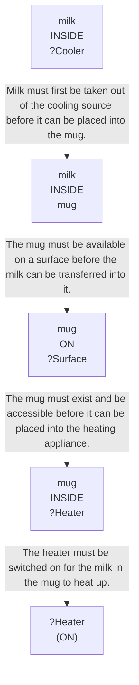
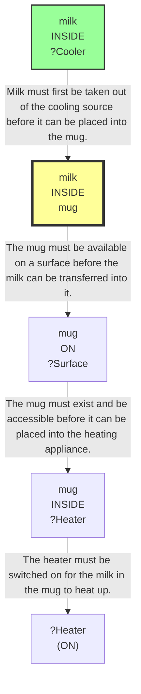
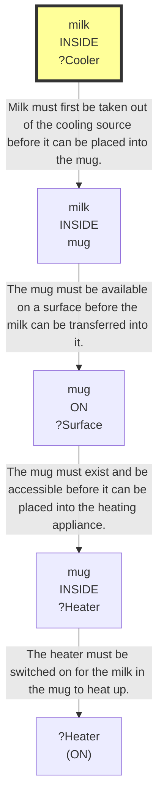
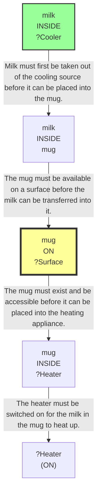
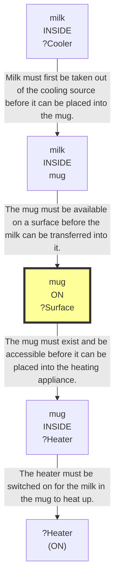

# 🚀 VirtualHome Agent Episode Log


### [GoalReasoner (Module A - Intent)] Output
```json
{
  "is_instruction_obviously_vague": false,
  "clarification_question": null,
  "target_object": "milk",
  "location_hint": "fridge",
  "reasoning_chain": [
    {
      "question": "Why does the user want this object?",
      "answer": "To have the milk heated in a mug."
    },
    {
      "question": "Why is that important?",
      "answer": "To make the milk warm and ready to use or drink."
    },
    {
      "question": "What fundamental need does this fulfill?",
      "answer": "It fulfills the need for a warm beverage or warm liquid to consume."
    },
    {
      "question": "Are there any deeper psychological or physical motivations?",
      "answer": "The user likely wants comfort, convenience, or a preferred temperature for drinking."
    }
  ],
  "deep_intent": "The user wants a warm drink for comfort or consumption.",
  "acceptable_alternatives_properties": [
    {
      "priority": 1,
      "description": "Other milk-based drinks or similar ready-to-heat beverages, such as hot chocolate or warmed plant-based milk."
    },
    {
      "priority": 2,
      "description": "Other drinkable warm liquids, such as tea or coffee."
    },
    {
      "priority": 3,
      "description": "Packaged instant beverages that can be prepared hot with microwave heating."
    },
    {
      "priority": 4,
      "description": "Any warm beverage that can satisfy the desire for a comforting hot drink."
    }
  ]
}
```

### [RoboStateMultiTaskController] Output
```json
{
  "action": "[walk] <livingroom> (183)",
  "active_task_id": "task_1",
  "task_context": {
    "active_task_id": "task_1",
    "pending_task_ids": [],
    "satisfied_task_ids": []
  },
  "source": "room_frontier"
}
```
## Step 0
- **Action**: `[walk] <livingroom> (183)`
- **Action Success**: `True`
- **Action Message**: {'0': {'message': 'Success'}}
- **Active Task**: `task_1`
- **Decision Source**: `room_frontier`
- **Task Progress**: G1_01=pending
- **SDG Status**:

- **Observed Items (159)**: wall(12), wall(13), wall(14), wall(15), wall(16), wall(17), wall(18), wall(19), wall(20), wall(21), floor(22), floor(23), floor(24), floor(25), floor(26)...


### [RoboStateMultiTaskController] Output
```json
{
  "action": "[walk] <bedroom> (241)",
  "active_task_id": "task_1",
  "task_context": {
    "active_task_id": "task_1",
    "pending_task_ids": [],
    "satisfied_task_ids": []
  },
  "source": "room_frontier"
}
```
## Step 1
- **Action**: `[walk] <bedroom> (241)`
- **Action Success**: `True`
- **Action Message**: {'0': {'message': 'Success'}}
- **Active Task**: `task_1`
- **Decision Source**: `room_frontier`
- **Task Progress**: G1_01=pending
- **SDG Status**:

- **Observed Items (211)**: wall(12), wall(13), wall(14), wall(15), wall(16), wall(17), wall(18), wall(19), wall(20), wall(21), floor(22), floor(23), floor(24), floor(25), floor(26)...


### [RoboStateMultiTaskController] Output
```json
{
  "action": "[walk] <bathroom> (285)",
  "active_task_id": "task_1",
  "task_context": {
    "active_task_id": "task_1",
    "pending_task_ids": [],
    "satisfied_task_ids": []
  },
  "source": "room_frontier"
}
```
## Step 2
- **Action**: `[walk] <bathroom> (285)`
- **Action Success**: `True`
- **Action Message**: {'0': {'message': 'Success'}}
- **Active Task**: `task_1`
- **Decision Source**: `room_frontier`
- **Task Progress**: G1_01=pending
- **SDG Status**:

- **Observed Items (243)**: wall(12), wall(13), wall(14), wall(15), wall(16), wall(17), wall(18), wall(19), wall(20), wall(21), floor(22), floor(23), floor(24), floor(25), floor(26)...


### [RoboStateMultiTaskController] Output
```json
{
  "action": "[walk] <bedroom> (346)",
  "active_task_id": "task_1",
  "task_context": {
    "active_task_id": "task_1",
    "pending_task_ids": [],
    "satisfied_task_ids": []
  },
  "source": "room_frontier"
}
```
## Step 3
- **Action**: `[walk] <bedroom> (346)`
- **Action Success**: `True`
- **Action Message**: {'0': {'message': 'Success'}}
- **Active Task**: `task_1`
- **Decision Source**: `room_frontier`
- **Task Progress**: G1_01=pending
- **SDG Status**:

- **Observed Items (303)**: wall(12), wall(13), wall(14), wall(15), wall(16), wall(17), wall(18), wall(19), wall(20), wall(21), floor(22), floor(23), floor(24), floor(25), floor(26)...


### [PerceptionFilter] Output
```json
{
  "reasoning": "Need the target milk and the container mug. The SDG requires a cooling source for milk, a surface for the mug, and a heating appliance that can be turned on. Keep fridge as the cooler, microwave and stove as alternative heaters, and table/counter surfaces as possible mug surfaces.",
  "selected_classes": [
    "mug",
    "coffeetable",
    "fridge",
    "microwave",
    "table",
    "milk",
    "character",
    "stove",
    "kitchencounter",
    "kitchentable"
  ],
  "raw_class_count": 91
}
```

### [LLMExecutor] Output
```json
{
  "reasoning": "The goal requires milk to start inside a cooler, then be transferred into a mug, then the mug placed into a heater and the heater switched on. The current graph already satisfies N1 because milk(176) is inside the fridge(162), which is open and is the best binding for ?Cooler. The next unmet prerequisite is getting the mug so it can later be placed on a surface and into the microwave. The mug(384) is currently inside bedroom(346), and the character is also in bedroom(346), so the robot is already adjacent to the mug and can grab it directly. This is the correct next atomic step toward satisfying N2/N3/N4/N5.",
  "satisfied_nodes": [
    "N1"
  ],
  "current_node_focus": "N2",
  "mapped_variables": {
    "?Cooler": "fridge(162)"
  },
  "action": "[grab] <mug> (384)"
}
```

### [RoboStateMultiTaskController] Output
```json
{
  "action": "[walk] <mug> (384)",
  "active_task_id": "task_1",
  "task_context": {
    "active_task_id": "task_1",
    "pending_task_ids": [],
    "satisfied_task_ids": []
  },
  "source": "llm_executor_repaired"
}
```
## Step 4
- **Action**: `[walk] <mug> (384)`
- **Action Success**: `True`
- **Action Message**: {'0': {'message': 'Success'}}
- **Active Task**: `task_1`
- **Decision Source**: `llm_executor_repaired`
- **Task Progress**: G1_01=pending
- **SDG Status**:

- **Observed Items (17)**: kitchentable(131), kitchentable(135), kitchencounter(136) [CLOSED], kitchencounter(146) [CLOSED], fridge(162) [OPEN], stove(163) [OFF,CLOSED], microwave(171) [CLOSED,OFF], milk(177) [CLOSED], character(1), milk(176) [CLOSED,COLD], kitchen(11), livingroom(183), bedroom(241), bathroom(285), bedroom(346)...


### [PerceptionFilter] Output
```json
{
  "reasoning": "Reused cached class selection.",
  "selected_classes": [
    "mug",
    "coffeetable",
    "fridge",
    "microwave",
    "table",
    "milk",
    "character",
    "stove",
    "kitchencounter",
    "kitchentable"
  ],
  "raw_class_count": 91
}
```

### [LLMExecutor] Output
```json
{
  "reasoning": "The current focus is to satisfy N1 by getting milk inside a cooler. The filtered graph shows two milk instances: milk(176) is explicitly COLD and INSIDE the fridge(162), which best matches the required cooler relation. Since the fridge is already OPEN, the next step is to move to that specific milk so it can be grabbed in a subsequent action. I will not target milk(177) on the kitchen counter because it is not in the cooler, and the task progression starts with the cold milk from the fridge.",
  "satisfied_nodes": [],
  "current_node_focus": "N1",
  "mapped_variables": {
    "?Cooler": "fridge(162)"
  },
  "action": "[walk] <milk> (176)"
}
```

### [RoboStateMultiTaskController] Output
```json
{
  "action": "[walk] <milk> (176)",
  "active_task_id": "task_1",
  "task_context": {
    "active_task_id": "task_1",
    "pending_task_ids": [],
    "satisfied_task_ids": []
  },
  "source": "llm_executor"
}
```
## Step 5
- **Action**: `[walk] <milk> (176)`
- **Action Success**: `True`
- **Action Message**: {'0': {'message': 'Success'}}
- **Active Task**: `task_1`
- **Decision Source**: `llm_executor`
- **Task Progress**: G1_01=pending
- **SDG Status**:

- **Observed Items (17)**: kitchentable(131), kitchentable(135), kitchencounter(136) [CLOSED], kitchencounter(146) [CLOSED], fridge(162) [OPEN], stove(163) [OFF,CLOSED], microwave(171) [CLOSED,OFF], milk(177) [CLOSED], character(1), milk(176) [CLOSED,COLD], kitchen(11), livingroom(183), bedroom(241), bathroom(285), bedroom(346)...


### [PerceptionFilter] Output
```json
{
  "reasoning": "Reused cached class selection.",
  "selected_classes": [
    "mug",
    "coffeetable",
    "fridge",
    "microwave",
    "table",
    "milk",
    "character",
    "stove",
    "kitchencounter",
    "kitchentable"
  ],
  "raw_class_count": 91
}
```

### [LLMExecutor] Output
```json
{
  "reasoning": "The goal requires milk to end up inside a mug, but the current graph shows the accessible milk(177) is on the kitchen counter and already nearby, while the mug(384) is in a different room (bedroom) but also close to the character. Since milk must be transferred into the mug before heating, the next progress-making step is to pick up the milk. I do not yet need to interact with the fridge because the available milk(177) is not inside it. After grabbing the milk, I can later walk to the mug and pour it in.",
  "satisfied_nodes": [],
  "current_node_focus": "N1",
  "mapped_variables": {
    "?Cooler": "fridge(162)"
  },
  "action": "[grab] <milk> (177)"
}
```

### [RoboStateMultiTaskController] Output
```json
{
  "action": "[walk] <milk> (177)",
  "active_task_id": "task_1",
  "task_context": {
    "active_task_id": "task_1",
    "pending_task_ids": [],
    "satisfied_task_ids": []
  },
  "source": "llm_executor_repaired"
}
```
## Step 6
- **Action**: `[walk] <milk> (177)`
- **Action Success**: `True`
- **Action Message**: {'0': {'message': 'Success'}}
- **Active Task**: `task_1`
- **Decision Source**: `llm_executor_repaired`
- **Task Progress**: G1_01=pending
- **SDG Status**:

- **Observed Items (17)**: kitchentable(131), kitchentable(135), kitchencounter(136) [CLOSED], kitchencounter(146) [CLOSED], fridge(162) [OPEN], stove(163) [OFF,CLOSED], microwave(171) [CLOSED,OFF], milk(177) [CLOSED], character(1), milk(176) [CLOSED,COLD], kitchen(11), livingroom(183), bedroom(241), bathroom(285), bedroom(346)...


### [PerceptionFilter] Output
```json
{
  "reasoning": "Reused cached class selection.",
  "selected_classes": [
    "mug",
    "coffeetable",
    "fridge",
    "microwave",
    "table",
    "milk",
    "character",
    "stove",
    "kitchencounter",
    "kitchentable"
  ],
  "raw_class_count": 91
}
```

### [LLMExecutor] Output
```json
{
  "reasoning": "The goal requires milk to end up inside a mug, and the mug must be on a surface before transfer can happen. The current graph shows mug(384) is close to the character but located in bedroom(346), while milk(177) is already available and close in the kitchen. The next needed step along the SDG is to get the mug onto a surface (N3), but before any putback action I must explicitly walk to the destination surface. A suitable surface already available near the character is kitchentable(131), which is a flat movable surface and does not need opening.",
  "satisfied_nodes": [
    "N1"
  ],
  "current_node_focus": "N3",
  "mapped_variables": {
    "?Cooler": "fridge(162)",
    "?Surface": "kitchentable(131)"
  },
  "action": "[walk] <kitchentable> (131)"
}
```

### [RoboStateMultiTaskController] Output
```json
{
  "action": "[walk] <kitchentable> (131)",
  "active_task_id": "task_1",
  "task_context": {
    "active_task_id": "task_1",
    "pending_task_ids": [],
    "satisfied_task_ids": []
  },
  "source": "llm_executor"
}
```
## Step 7
- **Action**: `[walk] <kitchentable> (131)`
- **Action Success**: `True`
- **Action Message**: {'0': {'message': 'Success'}}
- **Active Task**: `task_1`
- **Decision Source**: `llm_executor`
- **Task Progress**: G1_01=pending
- **SDG Status**:

- **Observed Items (17)**: kitchentable(131), kitchentable(135), kitchencounter(136) [CLOSED], kitchencounter(146) [CLOSED], fridge(162) [OPEN], stove(163) [OFF,CLOSED], microwave(171) [CLOSED,OFF], milk(177) [CLOSED], character(1), milk(176) [CLOSED,COLD], kitchen(11), livingroom(183), bedroom(241), bathroom(285), bedroom(346)...


### [PerceptionFilter] Output
```json
{
  "reasoning": "Reused cached class selection.",
  "selected_classes": [
    "mug",
    "coffeetable",
    "fridge",
    "microwave",
    "table",
    "milk",
    "character",
    "stove",
    "kitchencounter",
    "kitchentable"
  ],
  "raw_class_count": 91
}
```

### [LLMExecutor] Output
```json
{
  "reasoning": "The mug (384) is already close to the character and is the required recipient for transferring milk, but to satisfy the SDG we first need the mug available on a surface before placing milk into it. The current location includes kitchentable (131) and the character is close to it, so the correct next step is to walk to the table before any putback action. This also prepares for later grabbing milk and pouring/putting it into the mug.",
  "satisfied_nodes": [],
  "current_node_focus": "N3",
  "mapped_variables": {
    "?Surface": "kitchentable(131)"
  },
  "action": "[walk] <kitchentable> (131)"
}
```

### [RoboStateMultiTaskController] Output
```json
{
  "action": "[walk] <kitchentable> (131)",
  "active_task_id": "task_1",
  "task_context": {
    "active_task_id": "task_1",
    "pending_task_ids": [],
    "satisfied_task_ids": []
  },
  "source": "llm_executor"
}
```
## Step 8
- **Action**: `[walk] <kitchentable> (131)`
- **Action Success**: `True`
- **Action Message**: {'0': {'message': 'Success'}}
- **Active Task**: `task_1`
- **Decision Source**: `llm_executor`
- **Task Progress**: G1_01=pending
- **SDG Status**:

- **Observed Items (17)**: kitchentable(131), kitchentable(135), kitchencounter(136) [CLOSED], kitchencounter(146) [CLOSED], fridge(162) [OPEN], stove(163) [OFF,CLOSED], microwave(171) [CLOSED,OFF], milk(177) [CLOSED], character(1), milk(176) [CLOSED,COLD], kitchen(11), livingroom(183), bedroom(241), bathroom(285), bedroom(346)...


### [PerceptionFilter] Output
```json
{
  "reasoning": "Reused cached class selection.",
  "selected_classes": [
    "mug",
    "coffeetable",
    "fridge",
    "microwave",
    "table",
    "milk",
    "character",
    "stove",
    "kitchencounter",
    "kitchentable"
  ],
  "raw_class_count": 91
}
```

### [LLMExecutor] Output
```json
{
  "reasoning": "N1 is already satisfied because milk(176) is inside the fridge(162), which is the cooling source and currently OPEN. The next unmet prerequisite for the goal is to get milk into the mug. Since milk(177) is a feasible milk instance already in the kitchen and the mug(384) is in bedroom(346), we should first move toward the mug so it can be picked up before transferring milk. I am selecting the mug instance because the task requires milk heated in a mug, and the mug is currently accessible by walking to it.",
  "satisfied_nodes": [
    "N1"
  ],
  "current_node_focus": "N3",
  "mapped_variables": {
    "?Cooler": "fridge(162)",
    "?Surface": "kitchentable(131)",
    "?Heater": "microwave(171)"
  },
  "action": "[walk] <mug> (384)"
}
```

### [RoboStateMultiTaskController] Output
```json
{
  "action": "[walk] <mug> (384)",
  "active_task_id": "task_1",
  "task_context": {
    "active_task_id": "task_1",
    "pending_task_ids": [],
    "satisfied_task_ids": []
  },
  "source": "llm_executor"
}
```
## Step 9
- **Action**: `[walk] <mug> (384)`
- **Action Success**: `True`
- **Action Message**: {'0': {'message': 'Success'}}
- **Active Task**: `task_1`
- **Decision Source**: `llm_executor`
- **Task Progress**: G1_01=pending
- **SDG Status**:

- **Observed Items (17)**: kitchentable(131), kitchentable(135), kitchencounter(136) [CLOSED], kitchencounter(146) [CLOSED], fridge(162) [OPEN], stove(163) [OFF,CLOSED], microwave(171) [CLOSED,OFF], milk(177) [CLOSED], character(1), milk(176) [CLOSED,COLD], kitchen(11), livingroom(183), bedroom(241), bathroom(285), bedroom(346)...


### [PerceptionFilter] Output
```json
{
  "reasoning": "Reused cached class selection.",
  "selected_classes": [
    "mug",
    "coffeetable",
    "fridge",
    "microwave",
    "table",
    "milk",
    "character",
    "stove",
    "kitchencounter",
    "kitchentable"
  ],
  "raw_class_count": 91
}
```

### [LLMExecutor] Output
```json
{
  "reasoning": "The next unmet prerequisite is to get the milk out of the fridge. The fridge is currently OPEN, and the filtered graph shows milk(176) inside fridge(162) and not yet held. To progress toward placing milk into the mug and heating it, I should first move to the milk itself before attempting to grab it. This respects the grab-distance rule and targets the cooler-source node N1.",
  "satisfied_nodes": [],
  "current_node_focus": "N1",
  "mapped_variables": {
    "?Cooler": "fridge(162)"
  },
  "action": "[walk] <milk> (176)"
}
```

### [RoboStateMultiTaskController] Output
```json
{
  "action": "[walk] <milk> (176)",
  "active_task_id": "task_1",
  "task_context": {
    "active_task_id": "task_1",
    "pending_task_ids": [],
    "satisfied_task_ids": []
  },
  "source": "llm_executor"
}
```
## Step 10
- **Action**: `[walk] <milk> (176)`
- **Action Success**: `True`
- **Action Message**: {'0': {'message': 'Success'}}
- **Active Task**: `task_1`
- **Decision Source**: `llm_executor`
- **Task Progress**: G1_01=pending
- **SDG Status**:

- **Observed Items (17)**: kitchentable(131), kitchentable(135), kitchencounter(136) [CLOSED], kitchencounter(146) [CLOSED], fridge(162) [OPEN], stove(163) [OFF,CLOSED], microwave(171) [CLOSED,OFF], milk(177) [CLOSED], character(1), milk(176) [CLOSED,COLD], kitchen(11), livingroom(183), bedroom(241), bathroom(285), bedroom(346)...


### [PerceptionFilter] Output
```json
{
  "reasoning": "Reused cached class selection.",
  "selected_classes": [
    "mug",
    "coffeetable",
    "fridge",
    "microwave",
    "table",
    "milk",
    "character",
    "stove",
    "kitchencounter",
    "kitchentable"
  ],
  "raw_class_count": 91
}
```

### [LLMExecutor] Output
```json
{
  "reasoning": "Milk in the fridge is already available as N1's cooler is identified by the closed fridge(162) containing milk(176). To progress toward placing milk into the mug, the next prerequisite is to take the milk out of the fridge, which requires first being near the milk itself. The last action was a walk to milk(176), but there is no current confirmation of holding it, so the single next atomic action should be to grab that specific milk instance.",
  "satisfied_nodes": [],
  "current_node_focus": "N1",
  "mapped_variables": {
    "?Cooler": "fridge(162)"
  },
  "action": "[grab] <milk> (176)"
}
```

### [RoboStateMultiTaskController] Output
```json
{
  "action": "[grab] <milk> (176)",
  "active_task_id": "task_1",
  "task_context": {
    "active_task_id": "task_1",
    "pending_task_ids": [],
    "satisfied_task_ids": []
  },
  "source": "llm_executor"
}
```
## Step 11
- **Action**: `[grab] <milk> (176)`
- **Action Success**: `True`
- **Action Message**: {'0': {'message': 'Success'}}
- **Active Task**: `task_1`
- **Decision Source**: `llm_executor`
- **Task Progress**: G1_01=pending
- **SDG Status**:

- **Observed Items (17)**: kitchentable(131), kitchentable(135), kitchencounter(136) [CLOSED], kitchencounter(146) [CLOSED], fridge(162) [OPEN], stove(163) [OFF,CLOSED], microwave(171) [CLOSED,OFF], milk(177) [CLOSED], character(1), milk(176) [CLOSED,COLD], kitchen(11), livingroom(183), bedroom(241), bathroom(285), bedroom(346)...


### [PerceptionFilter] Output
```json
{
  "reasoning": "Reused cached class selection.",
  "selected_classes": [
    "mug",
    "coffeetable",
    "fridge",
    "microwave",
    "table",
    "milk",
    "character",
    "stove",
    "kitchencounter",
    "kitchentable"
  ],
  "raw_class_count": 91
}
```

### [LLMExecutor] Output
```json
{
  "reasoning": "We already satisfy the prerequisite of holding the milk: milk(176) is in the right hand and is cold/closed. The next unsatisfied SDG node is to place the milk inside the mug. To do that, I must first be near the mug and then use putin, but the immediate next atomic step should be to walk to the mug because proximity is required before putting milk into it. The mug(384) is the best match for the required mug and is currently close to the character.",
  "satisfied_nodes": [
    "N1"
  ],
  "current_node_focus": "N2",
  "mapped_variables": {
    "?Cooler": "fridge(162)",
    "?Heater": "microwave(171)",
    "?Surface": "kitchentable(131)"
  },
  "action": "[walk] <mug> (384)"
}
```

### [RoboStateMultiTaskController] Output
```json
{
  "action": "[walk] <mug> (384)",
  "active_task_id": "task_1",
  "task_context": {
    "active_task_id": "task_1",
    "pending_task_ids": [],
    "satisfied_task_ids": []
  },
  "source": "llm_executor"
}
```
## Step 12
- **Action**: `[walk] <mug> (384)`
- **Action Success**: `True`
- **Action Message**: {'0': {'message': 'Success'}}
- **Active Task**: `task_1`
- **Decision Source**: `llm_executor`
- **Task Progress**: G1_01=pending
- **SDG Status**:

- **Observed Items (17)**: kitchentable(131), kitchentable(135), kitchencounter(136) [CLOSED], kitchencounter(146) [CLOSED], fridge(162) [OPEN], stove(163) [OFF,CLOSED], microwave(171) [CLOSED,OFF], milk(177) [CLOSED], character(1), milk(176) [CLOSED,COLD], kitchen(11), livingroom(183), bedroom(241), bathroom(285), bedroom(346)...


### [PerceptionFilter] Output
```json
{
  "reasoning": "Reused cached class selection.",
  "selected_classes": [
    "mug",
    "coffeetable",
    "fridge",
    "microwave",
    "table",
    "milk",
    "character",
    "stove",
    "kitchencounter",
    "kitchentable"
  ],
  "raw_class_count": 91
}
```

### [LLMExecutor] Output
```json
{
  "reasoning": "The milk is currently held in the right hand (milk 176), and the mug 384 is already close to the character. To satisfy the next SDG node N2, we need to place the milk into the mug. Before a putin action, I must explicitly walk to the destination container first; the mug is the destination receptacle and is not dirty or closed. The previous action already walked to the mug, so the next step is to transfer the held milk into it.",
  "satisfied_nodes": [
    "N1"
  ],
  "current_node_focus": "N2",
  "mapped_variables": {
    "?Cooler": "milk(176)",
    "?Surface": "bedroom surface near mug(384)"
  },
  "action": "[putin] <milk> (176) <mug> (384)"
}
```

### [RoboStateMultiTaskController] Output
```json
{
  "action": "[putin] <milk> (176) <mug> (384)",
  "active_task_id": "task_1",
  "task_context": {
    "active_task_id": "task_1",
    "pending_task_ids": [],
    "satisfied_task_ids": []
  },
  "source": "llm_executor"
}
```
## Step 13
- **Action**: `[putin] <milk> (176) <mug> (384)`
- **Action Success**: `False`
- **Action Message**: {'0': {'message': 'ScriptExcutor 0: EXECUTION_GENERAL: Script is impossible to execute\n\n'}}
- **Active Task**: `task_1`
- **Decision Source**: `llm_executor`
- **Task Progress**: G1_01=pending
- **SDG Status**:

- **Observed Items (17)**: kitchentable(131), kitchentable(135), kitchencounter(136) [CLOSED], kitchencounter(146) [CLOSED], fridge(162) [OPEN], stove(163) [OFF,CLOSED], microwave(171) [CLOSED,OFF], milk(177) [CLOSED], character(1), milk(176) [CLOSED,COLD], kitchen(11), livingroom(183), bedroom(241), bathroom(285), bedroom(346)...


### [PerceptionFilter] Output
```json
{
  "reasoning": "Reused cached class selection.",
  "selected_classes": [
    "mug",
    "coffeetable",
    "fridge",
    "microwave",
    "table",
    "milk",
    "character",
    "stove",
    "kitchencounter",
    "kitchentable"
  ],
  "raw_class_count": 91
}
```

### [LLMExecutor] Output
```json
{
  "reasoning": "The previous [putin] failed because the mug is not the correct type of destination for a direct put-in in this engine unless it is accessible and likely requires the milk to be poured rather than put inside. The milk 176 is already held, and we need to transfer it into the mug 384. Since pouring requires being near the destination, and the character is already close to the mug, the next logical attempt is to pour the milk into the mug. This advances N2 (milk inside mug) toward the heating sequence. The mug itself is not dirty in the graph, so no wash is needed.",
  "satisfied_nodes": [
    "N1"
  ],
  "current_node_focus": "N2",
  "mapped_variables": {
    "?Cooler": "fridge(162)"
  },
  "action": "[pour] <milk> (176) <mug> (384)"
}
```

### [RoboStateMultiTaskController] Output
```json
{
  "action": "[pour] <milk> (176) <mug> (384)",
  "active_task_id": "task_1",
  "task_context": {
    "active_task_id": "task_1",
    "pending_task_ids": [],
    "satisfied_task_ids": []
  },
  "source": "llm_executor"
}
```
## Step 14
- **Action**: `[pour] <milk> (176) <mug> (384)`
- **Action Success**: `True`
- **Action Message**: Poured into container successfully.
- **Active Task**: `task_1`
- **Decision Source**: `llm_executor`
- **Task Progress**: G1_01=pending
- **SDG Status**:

- **Observed Items (17)**: kitchentable(131), kitchentable(135), kitchencounter(136) [CLOSED], kitchencounter(146) [CLOSED], fridge(162) [OPEN], stove(163) [OFF,CLOSED], microwave(171) [CLOSED,OFF], milk(177) [CLOSED], character(1), milk(176) [CLOSED,COLD], kitchen(11), livingroom(183), bedroom(241), bathroom(285), bedroom(346)...

