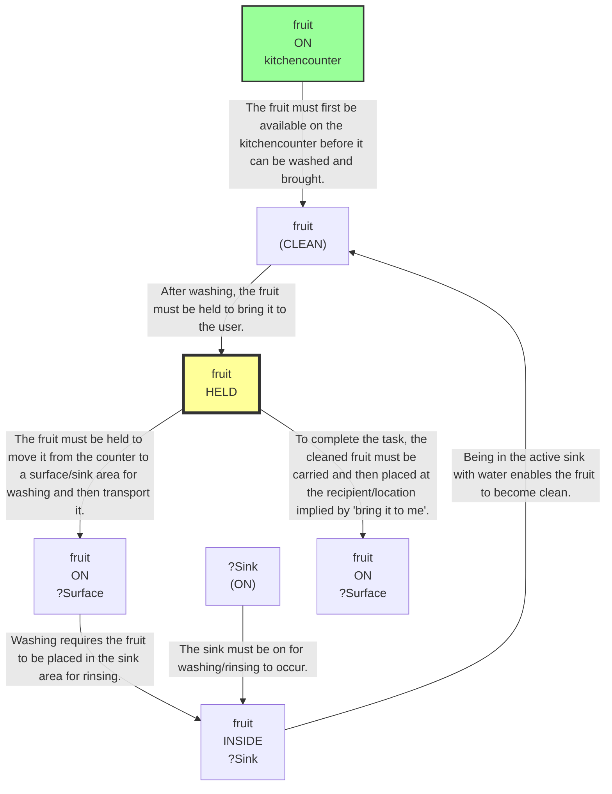
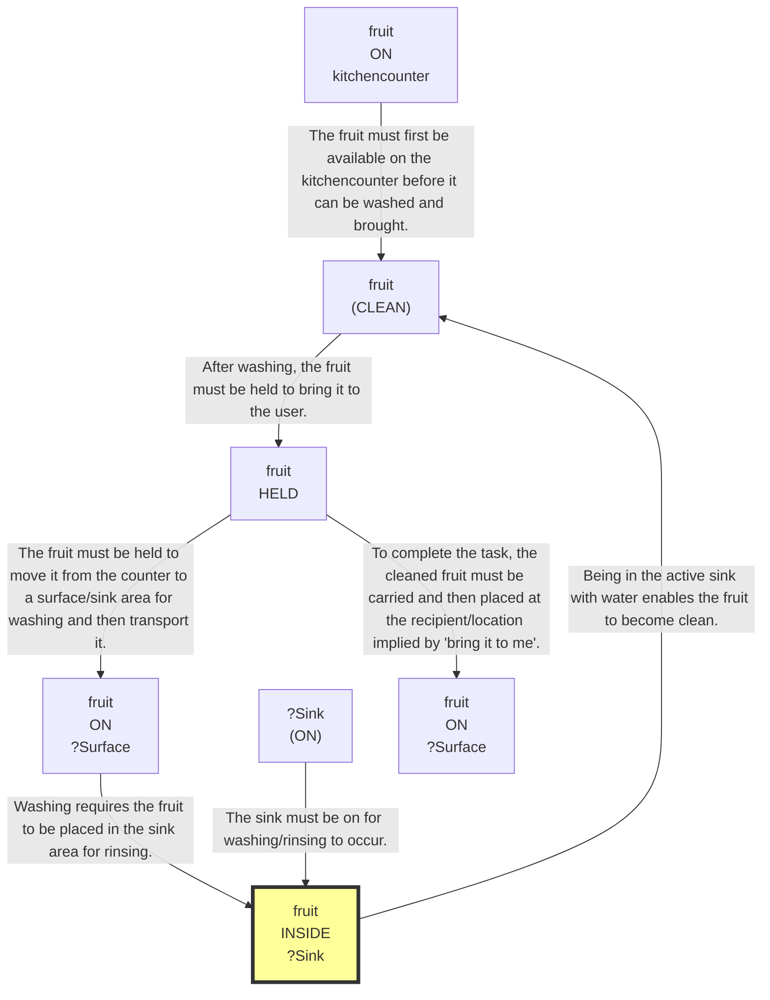

# 🚀 VirtualHome Agent Episode Log


### [GoalReasoner (Module A - Intent)] Output
```json
{
  "is_instruction_obviously_vague": false,
  "clarification_question": null,
  "target_object": "fruit",
  "location_hint": "kitchencounter",
  "reasoning_chain": [
    {
      "question": "Why does the user want this object?",
      "answer": "To have the fruit washed and delivered to them."
    },
    {
      "question": "Why is that important?",
      "answer": "So the fruit is clean and available for the user to eat or use."
    },
    {
      "question": "What fundamental need does this fulfill?",
      "answer": "It helps satisfy the need for ready-to-eat food."
    },
    {
      "question": "Are there any deeper psychological or physical motivations?",
      "answer": "The user may be seeking convenience, cleanliness, and immediate access to food."
    }
  ],
  "deep_intent": "The user wants clean, ready-to-eat food delivered to them.",
  "acceptable_alternatives_properties": [
    {
      "priority": 1,
      "description": "Other fresh fruit items that can be washed and eaten, such as an apple, banana, or orange"
    },
    {
      "priority": 2,
      "description": "Other washable ready-to-eat produce, such as grapes, berries, or sliced melon"
    },
    {
      "priority": 3,
      "description": "Prepared snack foods that can be handed over directly, such as packaged fruit cups or cut fruit"
    },
    {
      "priority": 4,
      "description": "Other ready-to-eat foods that satisfy hunger, even if they are not fruit"
    }
  ]
}
```

### [PerceptionFilter] Output
```json
{
  "reasoning": "The task is to wash fruit on the kitchen counter and deliver it. So I must keep the target fruit class, the location/furniture involved in the SDG, and the washing-related tools/appliances. I also retain alternative sink/washing/holding tools where relevant in case one option is unavailable.",
  "selected_classes": [
    "washingsponge",
    "pie",
    "cutleryknife",
    "kitchencounter",
    "dishwashingliquid",
    "microwave",
    "character",
    "waterglass",
    "faucet",
    "dishbowl",
    "fridge",
    "apple",
    "plate",
    "sink"
  ],
  "raw_class_count": 55
}
```

### [LLMExecutor] Output
```json
{
  "reasoning": "The goal is to deliver washed fruit. The filtered graph shows one plausible fruit item: apple(437), which is dirty and therefore not yet clean. To wash it, I must first hold it. Since it is currently in the kitchen and not marked CLOSE, the next required step is to walk to the apple before grabbing it. This advances toward N6 (fruit held) as the prerequisite for washing and delivery.",
  "satisfied_nodes": [
    "N1"
  ],
  "current_node_focus": "N6",
  "mapped_variables": {},
  "action": "[walk] <apple> (437)"
}
```

### [RoboStateMultiTaskController] Output
```json
{
  "action": "[walk] <apple> (437)",
  "active_task_id": "task_1",
  "task_context": {
    "active_task_id": "task_1",
    "pending_task_ids": [],
    "satisfied_task_ids": []
  },
  "source": "llm_executor"
}
```
## Step 0
- **Action**: `[walk] <apple> (437)`
- **Action Success**: `True`
- **Action Message**: {'0': {'message': 'Success'}}
- **Active Task**: `task_1`
- **Decision Source**: `llm_executor`
- **Task Progress**: G1_02=pending
- **SDG Status**:

- **Observed Items (27)**: kitchencounter(238) [CLOSED], sink(247), faucet(248) [ON], washingsponge(266), dishwashingliquid(267), waterglass(270), cutleryknife(271), plate(273), waterglass(274), cutleryknife(275), plate(277), plate(278), cutleryknife(280), waterglass(281), waterglass(282)...


### [PerceptionFilter] Output
```json
{
  "reasoning": "Reused cached class selection.",
  "selected_classes": [
    "washingsponge",
    "pie",
    "cutleryknife",
    "kitchencounter",
    "dishwashingliquid",
    "microwave",
    "character",
    "waterglass",
    "faucet",
    "dishbowl",
    "fridge",
    "apple",
    "plate",
    "sink"
  ],
  "raw_class_count": 55
}
```

### [LLMExecutor] Output
```json
{
  "reasoning": "The target fruit is best bound to apple(437), which is currently close to the character but DIRTY. To satisfy the wash/clean requirement, I need to hold the apple before I can take it to the sink. I already walked to the apple in the previous step, so the next atomic action is to grab it.",
  "satisfied_nodes": [
    "N1"
  ],
  "current_node_focus": "N6",
  "mapped_variables": {
    "?Washer": "sink(247)",
    "?Sink": "sink(247)",
    "?Surface": "kitchencounter(238)"
  },
  "action": "[grab] <apple> (437)"
}
```

### [RoboStateMultiTaskController] Output
```json
{
  "action": "[grab] <apple> (437)",
  "active_task_id": "task_1",
  "task_context": {
    "active_task_id": "task_1",
    "pending_task_ids": [],
    "satisfied_task_ids": []
  },
  "source": "llm_executor"
}
```
## Step 1
- **Action**: `[grab] <apple> (437)`
- **Action Success**: `True`
- **Action Message**: {'0': {'message': 'Success'}}
- **Active Task**: `task_1`
- **Decision Source**: `llm_executor`
- **Task Progress**: G1_02=pending
- **SDG Status**:

- **Observed Items (27)**: kitchencounter(238) [CLOSED], sink(247), faucet(248) [ON], washingsponge(266), dishwashingliquid(267), waterglass(270), cutleryknife(271), plate(273), waterglass(274), cutleryknife(275), plate(277), plate(278), cutleryknife(280), waterglass(281), waterglass(282)...


### [PerceptionFilter] Output
```json
{
  "reasoning": "Reused cached class selection.",
  "selected_classes": [
    "washingsponge",
    "pie",
    "cutleryknife",
    "kitchencounter",
    "dishwashingliquid",
    "microwave",
    "character",
    "waterglass",
    "faucet",
    "dishbowl",
    "fridge",
    "apple",
    "plate",
    "sink"
  ],
  "raw_class_count": 55
}
```

### [LLMExecutor] Output
```json
{
  "reasoning": "The apple is already held in the right hand and is currently DIRTY. Before the fruit can be brought to the user, it must be washed at the sink. The sink is nearby in the kitchen, and washing requires being near the sink while holding the object. The next step is therefore to walk to the sink so washing can be performed on the following action.",
  "satisfied_nodes": [],
  "current_node_focus": "N4",
  "mapped_variables": {
    "?Sink": "sink(247)"
  },
  "action": "[walk] <sink> (247)"
}
```

### [RoboStateMultiTaskController] Output
```json
{
  "action": "[walk] <sink> (247)",
  "active_task_id": "task_1",
  "task_context": {
    "active_task_id": "task_1",
    "pending_task_ids": [],
    "satisfied_task_ids": []
  },
  "source": "llm_executor"
}
```
## Step 2
- **Action**: `[walk] <sink> (247)`
- **Action Success**: `True`
- **Action Message**: {'0': {'message': 'Success'}}
- **Active Task**: `task_1`
- **Decision Source**: `llm_executor`
- **Task Progress**: G1_02=pending
- **SDG Status**:

- **Observed Items (27)**: kitchencounter(238) [CLOSED], sink(247), faucet(248) [ON], washingsponge(266), dishwashingliquid(267), waterglass(270), cutleryknife(271), plate(273), waterglass(274), cutleryknife(275), plate(277), plate(278), cutleryknife(280), waterglass(281), waterglass(282)...


### [PerceptionFilter] Output
```json
{
  "reasoning": "Reused cached class selection.",
  "selected_classes": [
    "washingsponge",
    "pie",
    "cutleryknife",
    "kitchencounter",
    "dishwashingliquid",
    "microwave",
    "character",
    "waterglass",
    "faucet",
    "dishbowl",
    "fridge",
    "apple",
    "plate",
    "sink"
  ],
  "raw_class_count": 55
}
```

### [LLMExecutor] Output
```json
{
  "reasoning": "The apple is already held in the right hand and we are already close to the sink. To satisfy the washing prerequisite and progress toward delivering clean fruit, the next atomic step is to wash the apple at the sink.",
  "satisfied_nodes": [],
  "current_node_focus": "N4",
  "mapped_variables": {
    "?Sink": "sink(247)"
  },
  "action": "[wash] <apple> (437)"
}
```

### [RoboStateMultiTaskController] Output
```json
{
  "action": "[wash] <apple> (437)",
  "active_task_id": "task_1",
  "task_context": {
    "active_task_id": "task_1",
    "pending_task_ids": [],
    "satisfied_task_ids": []
  },
  "source": "llm_executor"
}
```
## Step 3
- **Action**: `[wash] <apple> (437)`
- **Action Success**: `True`
- **Action Message**: Washed successfully.
- **Active Task**: `task_1`
- **Decision Source**: `llm_executor`
- **Task Progress**: G1_02=done
- **SDG Status**:

- **Observed Items (27)**: kitchencounter(238) [CLOSED], sink(247), faucet(248) [ON], washingsponge(266), dishwashingliquid(267), waterglass(270), cutleryknife(271), plate(273), waterglass(274), cutleryknife(275), plate(277), plate(278), cutleryknife(280), waterglass(281), waterglass(282)...

