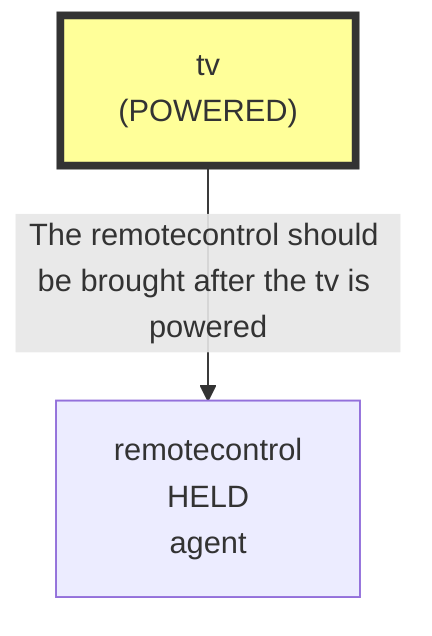
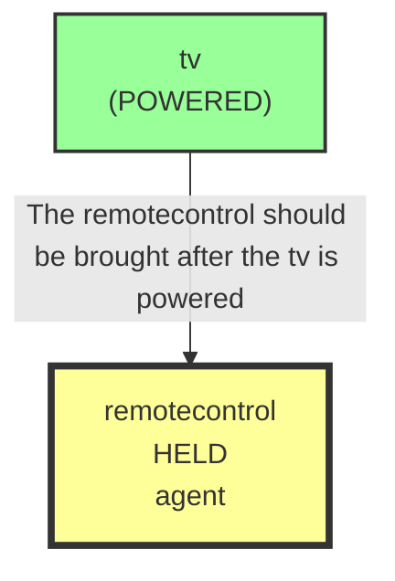

# 🚀 VirtualHome Agent Episode Log


### [GoalReasoner (Module A - Intent)] Output
```json
{
  "is_instruction_obviously_vague": false,
  "clarification_question": null,
  "target_object": "remotecontrol",
  "location_hint": null,
  "reasoning_chain": [
    {
      "question": "Why does the user want this object?",
      "answer": "To operate the television when it is powered on."
    },
    {
      "question": "Why is that important?",
      "answer": "It enables the user to control the television's functions without needing to interact with the TV directly."
    },
    {
      "question": "What fundamental need does this fulfill?",
      "answer": "The need to control and use an active entertainment device."
    },
    {
      "question": "Are there any deeper psychological or physical motivations?",
      "answer": "The user likely wants convenience and easier access to TV control, possibly to change channels, volume, or settings."
    }
  ],
  "deep_intent": "The user wants convenient control of an active entertainment device.",
  "acceptable_alternatives_properties": [
    {
      "priority": 1,
      "description": "Another compatible handheld controller for the television, such as a universal remote"
    },
    {
      "priority": 2,
      "description": "A substitute input device that can control the television, such as a smartphone app if the TV supports it"
    },
    {
      "priority": 3,
      "description": "Any other device that provides direct control of the television's basic functions"
    },
    {
      "priority": 4,
      "description": "A way to access the same entertainment content without using the television controls, such as a streaming device controller or set-top box remote"
    }
  ]
}
```

### [PerceptionFilter] Output
```json
{
  "reasoning": "The goal is to obtain a remotecontrol for a powered tv. The SDG explicitly requires the tv and the remotecontrol, and the alternatives list includes possible substitute control devices, so I retain the handheld control options that could directly serve the same function: remotecontrol and cellphone. I also keep the tv because it is the target device that must be powered and controlled.",
  "selected_classes": [
    "box",
    "tv",
    "cellphone",
    "character",
    "remotecontrol"
  ],
  "raw_class_count": 40
}
```

### [LLMExecutor] Output
```json
{
  "reasoning": "The SDG requires the TV to be powered on before bringing the remotecontrol. The current graph shows tv(426) is OFF but close to the character, so the next step is to switch it on. I am not yet focusing on the remotecontrol because the graph explicitly orders N1 before N2.",
  "satisfied_nodes": [],
  "current_node_focus": "N1",
  "mapped_variables": {},
  "action": "[switchon] <tv> (426)"
}
```

### [RoboStateMultiTaskController] Output
```json
{
  "action": "[switchon] <tv> (426)",
  "active_task_id": "task_1",
  "task_context": {
    "active_task_id": "task_1",
    "pending_task_ids": [],
    "satisfied_task_ids": []
  },
  "source": "llm_executor"
}
```
## Step 0
- **Action**: `[switchon] <tv> (426)`
- **Action Success**: `True`
- **Action Message**: Faked switch operation in Python layer (bypassed Unity failure)
- **Active Task**: `task_1`
- **Decision Source**: `llm_executor`
- **Task Progress**: G1_03=pending
- **SDG Status**:

- **Observed Items (10)**: tv(426) [OFF], box(435) [CLOSED], cellphone(448) [OFF], cellphone(449) [OFF], remotecontrol(452) [OFF], character(1), bathroom(11), bedroom(73), kitchen(205), livingroom(335)


### [PerceptionFilter] Output
```json
{
  "reasoning": "Reused cached class selection.",
  "selected_classes": [
    "box",
    "tv",
    "cellphone",
    "character",
    "remotecontrol"
  ],
  "raw_class_count": 40
}
```

### [LLMExecutor] Output
```json
{
  "reasoning": "The TV is already powered on, satisfying N1. The remaining unsatisfied goal is to have the remotecontrol held by the agent. The remotecontrol(452) is present in the living room and is grabbable. Since grabbing requires being next to the object, the next action should be to walk to the remote control before attempting to grab it.",
  "satisfied_nodes": [
    "N1"
  ],
  "current_node_focus": "N2",
  "mapped_variables": {},
  "action": "[walk] <remotecontrol> (452)"
}
```

### [RoboStateMultiTaskController] Output
```json
{
  "action": "[walk] <remotecontrol> (452)",
  "active_task_id": "task_1",
  "task_context": {
    "active_task_id": "task_1",
    "pending_task_ids": [],
    "satisfied_task_ids": []
  },
  "source": "llm_executor"
}
```
## Step 1
- **Action**: `[walk] <remotecontrol> (452)`
- **Action Success**: `True`
- **Action Message**: {'0': {'message': 'Success'}}
- **Active Task**: `task_1`
- **Decision Source**: `llm_executor`
- **Task Progress**: G1_03=pending
- **SDG Status**:

- **Observed Items (10)**: tv(426) [ON], box(435) [CLOSED], cellphone(448) [OFF], cellphone(449) [OFF], remotecontrol(452) [OFF], character(1), bathroom(11), bedroom(73), kitchen(205), livingroom(335)


### [PerceptionFilter] Output
```json
{
  "reasoning": "Reused cached class selection.",
  "selected_classes": [
    "box",
    "tv",
    "cellphone",
    "character",
    "remotecontrol"
  ],
  "raw_class_count": 40
}
```

### [LLMExecutor] Output
```json
{
  "reasoning": "The TV is already powered on (state ON satisfies the POWERED requirement), so the remaining unsatisfied SDG node is to have the remotecontrol held by the agent. The remotecontrol(452) is already marked CLOSE to the character, so I can directly grab it without another walk. This is the single next step toward completing N2.",
  "satisfied_nodes": [
    "N1"
  ],
  "current_node_focus": "N2",
  "mapped_variables": {},
  "action": "[grab] <remotecontrol> (452)"
}
```

### [RoboStateMultiTaskController] Output
```json
{
  "action": "[grab] <remotecontrol> (452)",
  "active_task_id": "task_1",
  "task_context": {
    "active_task_id": "task_1",
    "pending_task_ids": [],
    "satisfied_task_ids": []
  },
  "source": "llm_executor"
}
```
## Step 2
- **Action**: `[grab] <remotecontrol> (452)`
- **Action Success**: `True`
- **Action Message**: {'0': {'message': 'Success'}}
- **Active Task**: `task_1`
- **Decision Source**: `llm_executor`
- **Task Progress**: G1_03=done
- **SDG Status**:

- **Observed Items (10)**: tv(426) [ON], box(435) [CLOSED], cellphone(448) [OFF], cellphone(449) [OFF], remotecontrol(452) [OFF], character(1), bathroom(11), bedroom(73), kitchen(205), livingroom(335)

