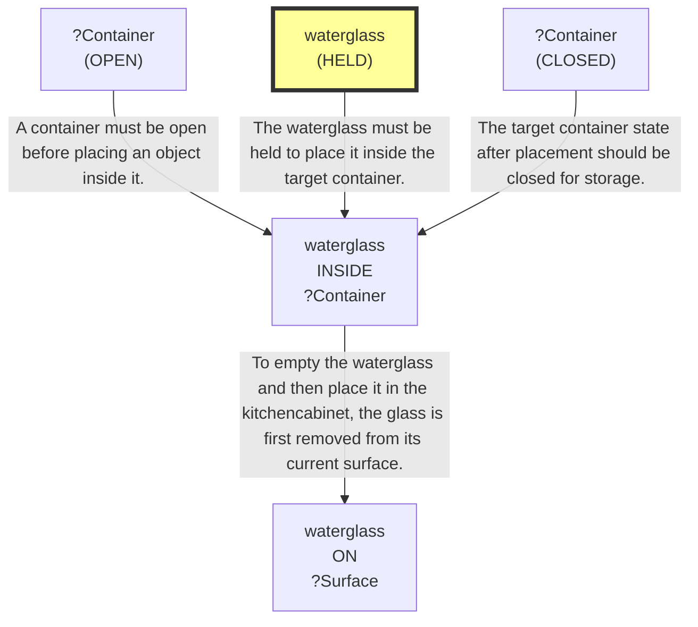
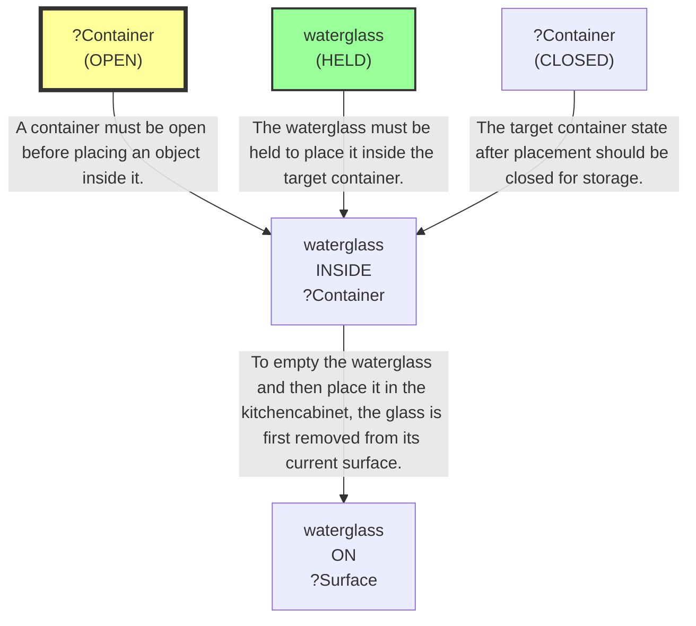
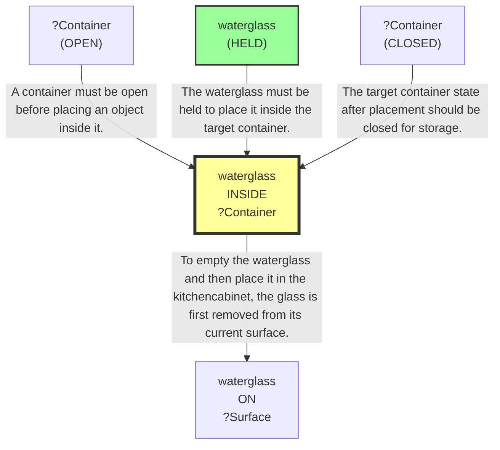
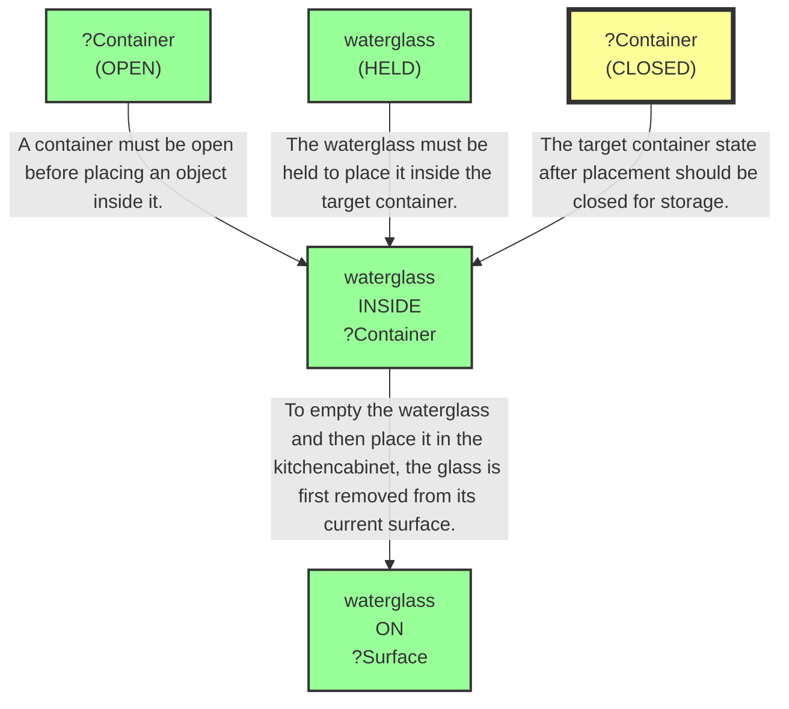
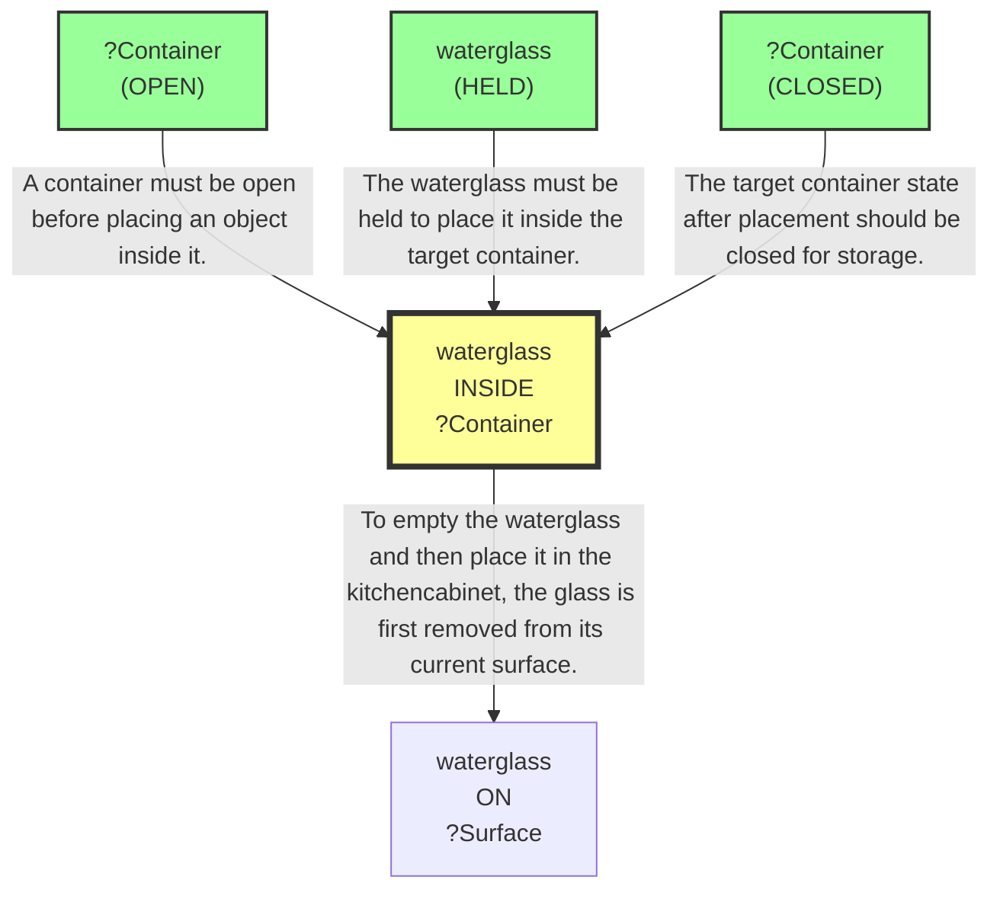
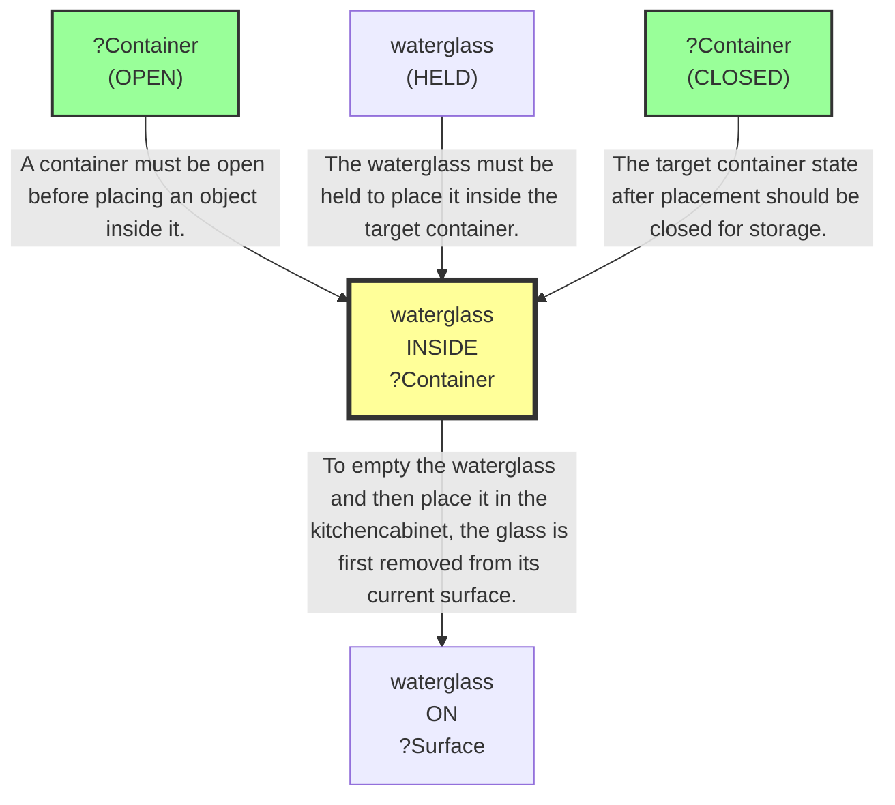
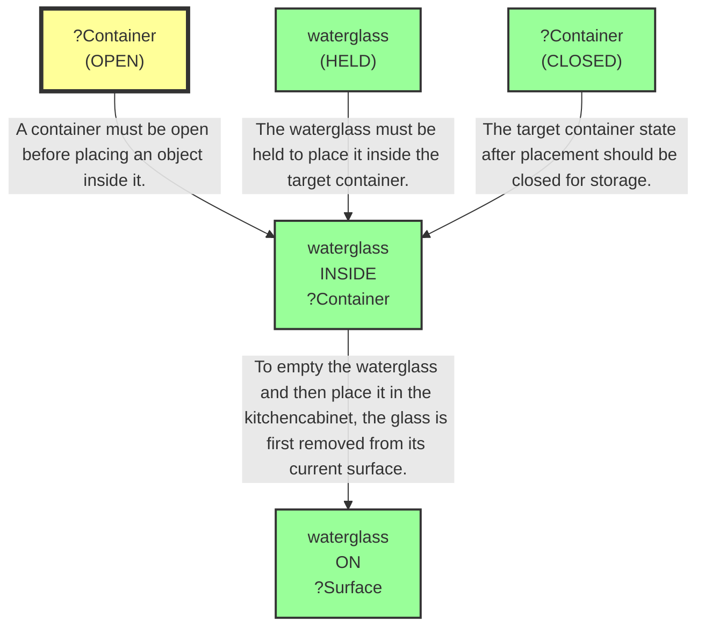
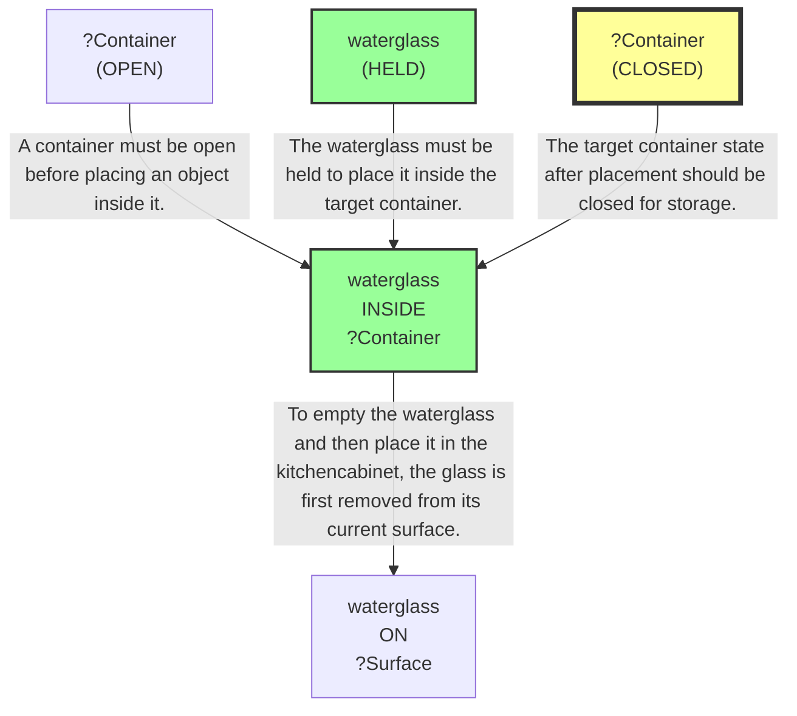

# 🚀 VirtualHome Agent Episode Log


### [GoalReasoner (Module A - Intent)] Output
```json
{
  "is_instruction_obviously_vague": false,
  "clarification_question": null,
  "target_object": "waterglass",
  "location_hint": "kitchencabinet",
  "reasoning_chain": [
    {
      "question": "Why does the user want this object?",
      "answer": "To remove the water from the glass and put the glass away in a cabinet."
    },
    {
      "question": "Why is that important?",
      "answer": "To store the glass in a designated place and leave it empty."
    },
    {
      "question": "What fundamental need does this fulfill?",
      "answer": "The user wants to organize kitchen items and manage liquid contents safely."
    },
    {
      "question": "Are there any deeper psychological or physical motivations?",
      "answer": "The user likely wants tidiness and proper storage of an empty drinking vessel."
    }
  ],
  "deep_intent": "The user wants to organize a kitchen item by emptying it and storing it away.",
  "acceptable_alternatives_properties": [
    {
      "priority": 1,
      "description": "Other empty drinking vessels that can be stored in the kitchen cabinet, such as a cup or mug"
    },
    {
      "priority": 2,
      "description": "Other empty reusable tableware items, such as a bowl or tumbler"
    },
    {
      "priority": 3,
      "description": "Other clean kitchen storage items that can be put away, such as a plate or small container"
    },
    {
      "priority": 4,
      "description": "Any similar household item that can be emptied and stored neatly in a cabinet"
    }
  ]
}
```

### [PerceptionFilter] Output
```json
{
  "reasoning": "The goal is to empty a waterglass and store it in a kitchen cabinet. So we need the target object waterglass, the storage location kitchencabinet, and likely alternate empty drinking vessels that could satisfy the target if needed (mug, wineglass). The SDG implies using a container that can be opened and closed, which is the cabinet itself.",
  "selected_classes": [
    "mug",
    "wineglass",
    "waterglass",
    "character",
    "kitchencabinet",
    "plate"
  ],
  "raw_class_count": 55
}
```

### [LLMExecutor] Output
```json
{
  "reasoning": "The target waterglass is not yet held, and the nearest matching candidate is waterglass(281), which is already close to the character. To satisfy the SDG, the first required step is to grab the waterglass before it can be emptied and placed into a cabinet. The kitchencabinet is currently closed, so it will be handled after the glass is held.",
  "satisfied_nodes": [],
  "current_node_focus": "N2",
  "mapped_variables": {
    "?Container": "kitchencabinet(234)"
  },
  "action": "[grab] <waterglass> (281)"
}
```

### [RoboStateMultiTaskController] Output
```json
{
  "action": "[grab] <waterglass> (281)",
  "active_task_id": "task_1",
  "task_context": {
    "active_task_id": "task_1",
    "pending_task_ids": [],
    "satisfied_task_ids": []
  },
  "source": "llm_executor"
}
```
## Step 0
- **Action**: `[grab] <waterglass> (281)`
- **Action Success**: `True`
- **Action Message**: {'0': {'message': 'Success'}}
- **Active Task**: `task_1`
- **Decision Source**: `llm_executor`
- **Task Progress**: G1_05=pending
- **SDG Status**:

- **Observed Items (20)**: kitchencabinet(234) [CLOSED], kitchencabinet(235) [CLOSED], kitchencabinet(236) [CLOSED], kitchencabinet(237) [CLOSED], waterglass(270), plate(273), waterglass(274), plate(277), plate(278), waterglass(281), waterglass(282), plate(285), wineglass(298), wineglass(299), mug(194) [FILLED_WATER]...


### [PerceptionFilter] Output
```json
{
  "reasoning": "Reused cached class selection.",
  "selected_classes": [
    "mug",
    "wineglass",
    "waterglass",
    "character",
    "kitchencabinet",
    "plate"
  ],
  "raw_class_count": 55
}
```

### [LLMExecutor] Output
```json
{
  "reasoning": "The waterglass(281) is already held, satisfying N2. The next required step toward emptying and storing it is to move to an openable storage container, most likely one of the kitchencabinets. Since the cabinet must be opened before putting the glass inside, and we are not yet near a specific cabinet, the correct next atomic action is to walk to the cabinet chosen as ?Container. I will bind ?Container to kitchencabinet(234) as a valid closed cabinet in the kitchen.",
  "satisfied_nodes": [
    "N2"
  ],
  "current_node_focus": "N4",
  "mapped_variables": {
    "?Container": "kitchencabinet(234)"
  },
  "action": "[walk] <kitchencabinet> (234)"
}
```

### [RoboStateMultiTaskController] Output
```json
{
  "action": "[walk] <kitchencabinet> (234)",
  "active_task_id": "task_1",
  "task_context": {
    "active_task_id": "task_1",
    "pending_task_ids": [],
    "satisfied_task_ids": []
  },
  "source": "llm_executor"
}
```
## Step 1
- **Action**: `[walk] <kitchencabinet> (234)`
- **Action Success**: `True`
- **Action Message**: {'0': {'message': 'Success'}}
- **Active Task**: `task_1`
- **Decision Source**: `llm_executor`
- **Task Progress**: G1_05=pending
- **SDG Status**:

- **Observed Items (20)**: kitchencabinet(234) [CLOSED], kitchencabinet(235) [CLOSED], kitchencabinet(236) [CLOSED], kitchencabinet(237) [CLOSED], waterglass(270), plate(273), waterglass(274), plate(277), plate(278), waterglass(281), waterglass(282), plate(285), wineglass(298), wineglass(299), mug(194) [FILLED_WATER]...


### [PerceptionFilter] Output
```json
{
  "reasoning": "Reused cached class selection.",
  "selected_classes": [
    "mug",
    "wineglass",
    "waterglass",
    "character",
    "kitchencabinet",
    "plate"
  ],
  "raw_class_count": 55
}
```

### [LLMExecutor] Output
```json
{
  "reasoning": "The waterglass is already held in the right hand, satisfying N2. We are already close to kitchencabinet(234), which is closed and is the intended storage container. The next required step is to open the cabinet before placing the glass inside. The graph shows the target container should end closed after storage, but N4 must be satisfied first.",
  "satisfied_nodes": [
    "N2"
  ],
  "current_node_focus": "N4",
  "mapped_variables": {
    "?Container": "kitchencabinet(234)"
  },
  "action": "[open] <kitchencabinet> (234)"
}
```

### [RoboStateMultiTaskController] Output
```json
{
  "action": "[open] <kitchencabinet> (234)",
  "active_task_id": "task_1",
  "task_context": {
    "active_task_id": "task_1",
    "pending_task_ids": [],
    "satisfied_task_ids": []
  },
  "source": "llm_executor"
}
```
## Step 2
- **Action**: `[open] <kitchencabinet> (234)`
- **Action Success**: `True`
- **Action Message**: {'0': {'message': 'Success'}}
- **Active Task**: `task_1`
- **Decision Source**: `llm_executor`
- **Task Progress**: G1_05=pending
- **SDG Status**:

- **Observed Items (20)**: kitchencabinet(234) [CLOSED], kitchencabinet(235) [CLOSED], kitchencabinet(236) [CLOSED], kitchencabinet(237) [CLOSED], waterglass(270), plate(273), waterglass(274), plate(277), plate(278), waterglass(281), waterglass(282), plate(285), wineglass(298), wineglass(299), mug(194) [FILLED_WATER]...


### [PerceptionFilter] Output
```json
{
  "reasoning": "Reused cached class selection.",
  "selected_classes": [
    "mug",
    "wineglass",
    "waterglass",
    "character",
    "kitchencabinet",
    "plate"
  ],
  "raw_class_count": 55
}
```

### [LLMExecutor] Output
```json
{
  "reasoning": "The target waterglass(281) is already held, and we are already close to the open kitchencabinet(234). The next required SDG progress is to place the held waterglass inside the open container; after that, the cabinet can be closed. I am focusing on satisfying N3 by putting the glass into the cabinet.",
  "satisfied_nodes": [
    "N2"
  ],
  "current_node_focus": "N3",
  "mapped_variables": {
    "?Container": "kitchencabinet(234)"
  },
  "action": "[putin] <waterglass> (281) <kitchencabinet> (234)"
}
```

### [RoboStateMultiTaskController] Output
```json
{
  "action": "[putin] <waterglass> (281) <kitchencabinet> (234)",
  "active_task_id": "task_1",
  "task_context": {
    "active_task_id": "task_1",
    "pending_task_ids": [],
    "satisfied_task_ids": []
  },
  "source": "llm_executor"
}
```
## Step 3
- **Action**: `[putin] <waterglass> (281) <kitchencabinet> (234)`
- **Action Success**: `True`
- **Action Message**: {'0': {'message': 'Success'}}
- **Active Task**: `task_1`
- **Decision Source**: `llm_executor`
- **Task Progress**: G1_05=pending
- **SDG Status**:

- **Observed Items (20)**: kitchencabinet(234) [OPEN], kitchencabinet(235) [CLOSED], kitchencabinet(236) [CLOSED], kitchencabinet(237) [CLOSED], waterglass(270), plate(273), waterglass(274), plate(277), plate(278), waterglass(281), waterglass(282), plate(285), wineglass(298), wineglass(299), mug(194) [FILLED_WATER]...


### [PerceptionFilter] Output
```json
{
  "reasoning": "Reused cached class selection.",
  "selected_classes": [
    "mug",
    "wineglass",
    "waterglass",
    "character",
    "kitchencabinet",
    "plate"
  ],
  "raw_class_count": 55
}
```

### [LLMExecutor] Output
```json
{
  "reasoning": "The waterglass(281) has already been grabbed and placed inside the open kitchencabinet(234), satisfying the required held, inside, and open-precondition chain. The remaining SDG requirement is to close the container for storage. I am already close to kitchencabinet(234), so the next atomic action is to close it. This also aligns with the intent to store the glass away in the cabinet.",
  "satisfied_nodes": [
    "N1",
    "N2",
    "N3",
    "N4"
  ],
  "current_node_focus": "N5",
  "mapped_variables": {
    "?Container": "kitchencabinet(234)"
  },
  "action": "[close] <kitchencabinet> (234)"
}
```

### [RoboStateMultiTaskController] Output
```json
{
  "action": "[close] <kitchencabinet> (234)",
  "active_task_id": "task_1",
  "task_context": {
    "active_task_id": "task_1",
    "pending_task_ids": [],
    "satisfied_task_ids": []
  },
  "source": "llm_executor"
}
```
## Step 4
- **Action**: `[close] <kitchencabinet> (234)`
- **Action Success**: `True`
- **Action Message**: {'0': {'message': 'Success'}}
- **Active Task**: `task_1`
- **Decision Source**: `llm_executor`
- **Task Progress**: G1_05=pending
- **SDG Status**:

- **Observed Items (20)**: kitchencabinet(234) [OPEN], kitchencabinet(235) [CLOSED], kitchencabinet(236) [CLOSED], kitchencabinet(237) [CLOSED], waterglass(270), plate(273), waterglass(274), plate(277), plate(278), waterglass(281), waterglass(282), plate(285), wineglass(298), wineglass(299), mug(194) [FILLED_WATER]...


### [PerceptionFilter] Output
```json
{
  "reasoning": "Reused cached class selection.",
  "selected_classes": [
    "mug",
    "wineglass",
    "waterglass",
    "character",
    "kitchencabinet",
    "plate"
  ],
  "raw_class_count": 55
}
```

### [LLMExecutor] Output
```json
{
  "reasoning": "The target waterglass(281) is already held and has been placed inside the intended kitchencabinet(234), which is now closed. This satisfies the remaining goal state for storing the emptied glass in the cabinet. No further physical action is needed; however, since the interface requires a single next action and there is no explicit 'done' action, the safest non-disruptive move is to wait rather than alter the completed setup.",
  "satisfied_nodes": [
    "N2",
    "N3",
    "N4",
    "N5"
  ],
  "current_node_focus": "N3",
  "mapped_variables": {
    "?Container": "kitchencabinet(234)",
    "?Surface": "kitchen(205)"
  },
  "action": "[wait]"
}
```

### [RoboStateMultiTaskController] Output
```json
{
  "action": "[wait]",
  "active_task_id": "task_1",
  "task_context": {
    "active_task_id": "task_1",
    "pending_task_ids": [],
    "satisfied_task_ids": []
  },
  "source": "llm_executor"
}
```
## Step 5
- **Action**: `[wait]`
- **Action Success**: `True`
- **Action Message**: Time passes. You waited for a while.
- **Active Task**: `task_1`
- **Decision Source**: `llm_executor`
- **Task Progress**: G1_05=pending
- **SDG Status**:

- **Observed Items (20)**: kitchencabinet(234) [CLOSED], kitchencabinet(235) [CLOSED], kitchencabinet(236) [CLOSED], kitchencabinet(237) [CLOSED], waterglass(270), plate(273), waterglass(274), plate(277), plate(278), waterglass(281), waterglass(282), plate(285), wineglass(298), wineglass(299), mug(194) [FILLED_WATER]...


### [PerceptionFilter] Output
```json
{
  "reasoning": "Reused cached class selection.",
  "selected_classes": [
    "mug",
    "wineglass",
    "waterglass",
    "character",
    "kitchencabinet",
    "plate"
  ],
  "raw_class_count": 55
}
```

### [LLMExecutor] Output
```json
{
  "reasoning": "The target waterglass(281) is already inside the kitchen cabinet and the cabinet is currently CLOSED, which satisfies the storage end-state for this task. Since the goal is to keep the glass stored away after emptying/placing it in the cabinet, and no further action is required from the current graph to advance the SDG, the task appears complete.",
  "satisfied_nodes": [
    "N3",
    "N4",
    "N5"
  ],
  "current_node_focus": "N3",
  "mapped_variables": {
    "?Container": "kitchencabinet(234)",
    "?Surface": "kitchencabinet(234)"
  },
  "action": "[wait]"
}
```

### [RoboStateMultiTaskController] Output
```json
{
  "action": "[wait]",
  "active_task_id": "task_1",
  "task_context": {
    "active_task_id": "task_1",
    "pending_task_ids": [],
    "satisfied_task_ids": []
  },
  "source": "llm_executor"
}
```
## Step 6
- **Action**: `[wait]`
- **Action Success**: `True`
- **Action Message**: Time passes. You waited for a while.
- **Active Task**: `task_1`
- **Decision Source**: `llm_executor`
- **Task Progress**: G1_05=pending
- **SDG Status**:

- **Observed Items (20)**: kitchencabinet(234) [CLOSED], kitchencabinet(235) [CLOSED], kitchencabinet(236) [CLOSED], kitchencabinet(237) [CLOSED], waterglass(270), plate(273), waterglass(274), plate(277), plate(278), waterglass(281), waterglass(282), plate(285), wineglass(298), wineglass(299), mug(194) [FILLED_WATER]...


### [PerceptionFilter] Output
```json
{
  "reasoning": "Reused cached class selection.",
  "selected_classes": [
    "mug",
    "wineglass",
    "waterglass",
    "character",
    "kitchencabinet",
    "plate"
  ],
  "raw_class_count": 55
}
```

### [LLMExecutor] Output
```json
{
  "reasoning": "The target waterglass(281) is already in the closed kitchencabinet(234), and the cabinet is close to the character. Since the current goal requires the glass to be stored in the cabinet and the SDG's final storage state is the cabinet being closed, no further physical action is needed at this moment. However, because the glass is already inside the cabinet and the cabinet is closed, the task state appears satisfied; but if another action is required by the engine, there is no remaining gap to address. Given the instruction to choose the single next atomic action and avoid repeating walk actions, the safest progression is to do nothing only if waiting for confirmation would be meaningful. Here, since the goal appears already achieved, I will report completion through a no-op wait as the only allowed non-destructive action.",
  "satisfied_nodes": [
    "N1",
    "N2",
    "N3",
    "N5"
  ],
  "current_node_focus": "N4",
  "mapped_variables": {
    "?Container": "kitchencabinet(234)"
  },
  "action": "[wait]"
}
```

### [RoboStateMultiTaskController] Output
```json
{
  "action": "[wait]",
  "active_task_id": "task_1",
  "task_context": {
    "active_task_id": "task_1",
    "pending_task_ids": [],
    "satisfied_task_ids": []
  },
  "source": "llm_executor"
}
```
## Step 7
- **Action**: `[wait]`
- **Action Success**: `True`
- **Action Message**: Time passes. You waited for a while.
- **Active Task**: `task_1`
- **Decision Source**: `llm_executor`
- **Task Progress**: G1_05=pending
- **SDG Status**:

- **Observed Items (20)**: kitchencabinet(234) [CLOSED], kitchencabinet(235) [CLOSED], kitchencabinet(236) [CLOSED], kitchencabinet(237) [CLOSED], waterglass(270), plate(273), waterglass(274), plate(277), plate(278), waterglass(281), waterglass(282), plate(285), wineglass(298), wineglass(299), mug(194) [FILLED_WATER]...


### [PerceptionFilter] Output
```json
{
  "reasoning": "Reused cached class selection.",
  "selected_classes": [
    "mug",
    "wineglass",
    "waterglass",
    "character",
    "kitchencabinet",
    "plate"
  ],
  "raw_class_count": 55
}
```

### [LLMExecutor] Output
```json
{
  "reasoning": "The active goal is to empty the waterglass and store it in the kitchen cabinet. We already completed the placement and the cabinet is currently CLOSED again, so the only remaining SDG requirement is to ensure the intended waterglass is inside the cabinet and the cabinet remains closed. The current graph shows waterglass(281) inside kitchencabinet(234), which matches the task intent and the previous successful actions. No further physical action is needed unless there is a missing unsatisfied node, but the displayed state already satisfies the goal state.",
  "satisfied_nodes": [
    "N2",
    "N3",
    "N5"
  ],
  "current_node_focus": "N5",
  "mapped_variables": {
    "?Container": "kitchencabinet(234)",
    "?Surface": "kitchen(205)"
  },
  "action": "[wait]"
}
```

### [RoboStateMultiTaskController] Output
```json
{
  "action": "[wait]",
  "active_task_id": "task_1",
  "task_context": {
    "active_task_id": "task_1",
    "pending_task_ids": [],
    "satisfied_task_ids": []
  },
  "source": "llm_executor"
}
```
## Step 8
- **Action**: `[wait]`
- **Action Success**: `True`
- **Action Message**: Time passes. You waited for a while.
- **Active Task**: `task_1`
- **Decision Source**: `llm_executor`
- **Task Progress**: G1_05=pending
- **SDG Status**:

- **Observed Items (20)**: kitchencabinet(234) [CLOSED], kitchencabinet(235) [CLOSED], kitchencabinet(236) [CLOSED], kitchencabinet(237) [CLOSED], waterglass(270), plate(273), waterglass(274), plate(277), plate(278), waterglass(281), waterglass(282), plate(285), wineglass(298), wineglass(299), mug(194) [FILLED_WATER]...


### [PerceptionFilter] Output
```json
{
  "reasoning": "Reused cached class selection.",
  "selected_classes": [
    "mug",
    "wineglass",
    "waterglass",
    "character",
    "kitchencabinet",
    "plate"
  ],
  "raw_class_count": 55
}
```

### [LLMExecutor] Output
```json
{
  "reasoning": "The goal item waterglass(281) has already been placed inside the designated kitchencabinet(234), and the cabinet is currently CLOSED again, which satisfies the final storage condition. The glass is no longer on a surface and the target container is closed as required.",
  "satisfied_nodes": [
    "N1",
    "N2",
    "N3",
    "N4",
    "N5"
  ],
  "current_node_focus": "N5",
  "mapped_variables": {
    "?Container": "kitchencabinet(234)",
    "?Surface": "kitchencabinet(234)"
  },
  "action": "[wait]"
}
```

### [RoboStateMultiTaskController] Output
```json
{
  "action": "[wait]",
  "active_task_id": "task_1",
  "task_context": {
    "active_task_id": "task_1",
    "pending_task_ids": [],
    "satisfied_task_ids": []
  },
  "source": "llm_executor"
}
```
