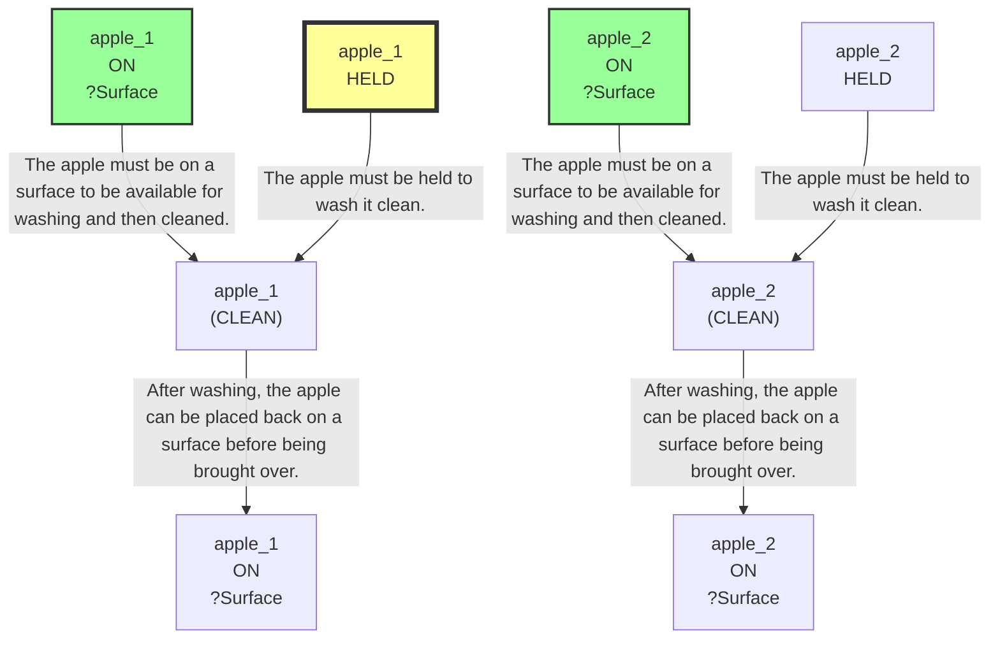
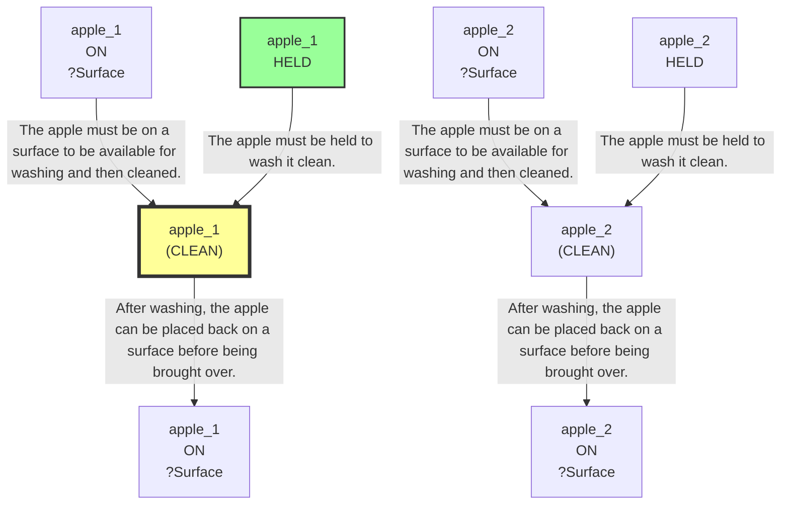
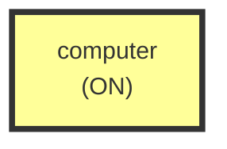

# 🚀 VirtualHome Agent Episode Log


### [GoalReasoner (Module A - Intent)] Output
```json
{
  "is_instruction_obviously_vague": false,
  "clarification_question": null,
  "target_object": "apples",
  "location_hint": "the table",
  "reasoning_chain": [
    {
      "question": "Why does the user want this object?",
      "answer": "To have the apples washed and delivered to them."
    },
    {
      "question": "Why is that important?",
      "answer": "So the apples are clean and available for use or eating."
    },
    {
      "question": "What fundamental need does this fulfill?",
      "answer": "It fulfills the need for clean, accessible food."
    },
    {
      "question": "Are there any deeper psychological or physical motivations?",
      "answer": "The primary motivation is likely to obtain ready-to-use food in a cleaner, more convenient state."
    }
  ],
  "deep_intent": "The user wants clean, accessible food.",
  "acceptable_alternatives_properties": [
    {
      "priority": 1,
      "description": "Other whole fruits that can be washed and served, such as pears or oranges."
    },
    {
      "priority": 2,
      "description": "Other washable fresh produce items, such as grapes or plums."
    },
    {
      "priority": 3,
      "description": "Ready-to-eat fresh snacks that provide similar convenience and nutrition."
    },
    {
      "priority": 4,
      "description": "Other clean, portable food items that can be brought over for immediate use or eating."
    }
  ]
}
```

### [PerceptionFilter] Output
```json
{
  "reasoning": "The goal is to wash and deliver apples, so the target object class apple must be kept. The SDG implies the apples need to be held and washed, so the necessary washing tools/capabilities must be retained: sink, faucet, dishwashingliquid, and washingsponge. Since the apples must be on a surface and the location hint is the table, keep kitchentable. To deliver or place the clean apples back, keep a suitable receptacle/surface for serving: plate and dishbowl. Fridge is also retained as a relevant food storage backup for produce handling.",
  "selected_classes": [
    "faucet",
    "fridge",
    "apple",
    "sink",
    "kitchentable",
    "washingsponge",
    "plate",
    "dishbowl",
    "character",
    "dishwashingliquid"
  ],
  "raw_class_count": 55
}
```

### [LLMExecutor] Output
```json
{
  "reasoning": "The active task requires cleaning two apples. Currently only one apple is visible in the filtered graph: apple(437), and it is DIRTY and already on the kitchentable(231). Since washing requires the object to be held and the sink is a flat recipient, the next step is to move to the apple before grabbing it. The table is already close, and there is no evidence of another apple yet, so we start with the visible dirty apple.",
  "satisfied_nodes": [
    "N1",
    "N5"
  ],
  "current_node_focus": "N3",
  "mapped_variables": {
    "?Surface": "kitchentable(231)"
  },
  "action": "[walk] <apple> (437)"
}
```

### [RoboStateMultiTaskController] Output
```json
{
  "action": "[walk] <apple> (437)",
  "active_task_id": "task_1",
  "task_context": {
    "active_task_id": "task_1",
    "pending_task_ids": [
      "task_2",
      "task_3"
    ],
    "satisfied_task_ids": []
  },
  "source": "llm_executor"
}
```
## Step 0
- **Action**: `[walk] <apple> (437)`
- **Action Success**: `True`
- **Action Message**: {'0': {'message': 'Success'}}
- **Active Task**: `task_1`
- **Decision Source**: `llm_executor`
- **Task Progress**: G1_02=pending, E1_11=pending, E1_03=pending
- **SDG Status**:

- **Observed Items (17)**: kitchentable(231), sink(247), faucet(248) [ON], washingsponge(266), dishwashingliquid(267), plate(273), plate(277), plate(278), plate(285), fridge(305) [CLOSED], dishbowl(326), apple(437) [DIRTY], character(1), bathroom(11), bedroom(73)...


### [PerceptionFilter] Output
```json
{
  "reasoning": "Reused cached class selection.",
  "selected_classes": [
    "faucet",
    "fridge",
    "apple",
    "sink",
    "kitchentable",
    "washingsponge",
    "plate",
    "dishbowl",
    "character",
    "dishwashingliquid"
  ],
  "raw_class_count": 55
}
```

### [LLMExecutor] Output
```json
{
  "reasoning": "The active task is to wash and deliver the apples. The current apple_1 candidate (apple(437)) is already on the kitchentable and close to the character, but it is DIRTY, so the next progress step is to pick it up before moving to the sink for washing. We should not walk again because the prior action already moved us to the apple and the graph shows it is CLOSE to the character.",
  "satisfied_nodes": [
    "N1",
    "N5"
  ],
  "current_node_focus": "N3",
  "mapped_variables": {
    "?Surface": "kitchentable(231)"
  },
  "action": "[grab] <apple> (437)"
}
```

### [RoboStateMultiTaskController] Output
```json
{
  "action": "[grab] <apple> (437)",
  "active_task_id": "task_1",
  "task_context": {
    "active_task_id": "task_1",
    "pending_task_ids": [
      "task_2",
      "task_3"
    ],
    "satisfied_task_ids": []
  },
  "source": "llm_executor"
}
```
## Step 1
- **Action**: `[grab] <apple> (437)`
- **Action Success**: `True`
- **Action Message**: {'0': {'message': 'Success'}}
- **Active Task**: `task_1`
- **Decision Source**: `llm_executor`
- **Task Progress**: G1_02=pending, E1_11=pending, E1_03=pending
- **SDG Status**:

- **Observed Items (17)**: kitchentable(231), sink(247), faucet(248) [ON], washingsponge(266), dishwashingliquid(267), plate(273), plate(277), plate(278), plate(285), fridge(305) [CLOSED], dishbowl(326), apple(437) [DIRTY], character(1), bathroom(11), bedroom(73)...


### [PerceptionFilter] Output
```json
{
  "reasoning": "Reused cached class selection.",
  "selected_classes": [
    "faucet",
    "fridge",
    "apple",
    "sink",
    "kitchentable",
    "washingsponge",
    "plate",
    "dishbowl",
    "character",
    "dishwashingliquid"
  ],
  "raw_class_count": 55
}
```

### [LLMExecutor] Output
```json
{
  "reasoning": "The active apple_1 (apple 437) is already held and is DIRTY. To progress toward CLEAN, the next required step is to wash it. Washing requires being near a sink, and the sink is available in the kitchen. Since I already hold the apple, the correct next atomic action is to walk to the sink before washing in a subsequent step.",
  "satisfied_nodes": [
    "N3"
  ],
  "current_node_focus": "N2",
  "mapped_variables": {
    "?Washer": "sink(247)",
    "?Surface": "kitchentable(231)"
  },
  "action": "[walk] <sink> (247)"
}
```

### [RoboStateMultiTaskController] Output
```json
{
  "action": "[walk] <sink> (247)",
  "active_task_id": "task_1",
  "task_context": {
    "active_task_id": "task_1",
    "pending_task_ids": [
      "task_2",
      "task_3"
    ],
    "satisfied_task_ids": []
  },
  "source": "llm_executor"
}
```
## Step 2
- **Action**: `[walk] <sink> (247)`
- **Action Success**: `True`
- **Action Message**: {'0': {'message': 'Success'}}
- **Active Task**: `task_1`
- **Decision Source**: `llm_executor`
- **Task Progress**: G1_02=pending, E1_11=pending, E1_03=pending
- **SDG Status**:

- **Observed Items (17)**: kitchentable(231), sink(247), faucet(248) [ON], washingsponge(266), dishwashingliquid(267), plate(273), plate(277), plate(278), plate(285), fridge(305) [CLOSED], dishbowl(326), apple(437) [DIRTY], character(1), bathroom(11), bedroom(73)...


### [PerceptionFilter] Output
```json
{
  "reasoning": "Reused cached class selection.",
  "selected_classes": [
    "faucet",
    "fridge",
    "apple",
    "sink",
    "kitchentable",
    "washingsponge",
    "plate",
    "dishbowl",
    "character",
    "dishwashingliquid"
  ],
  "raw_class_count": 55
}
```

### [LLMExecutor] Output
```json
{
  "reasoning": "The active apple_1 is already held in the right hand and we are currently close to the sink, which is the correct washing station. The apple is DIRTY, so the next step toward the CLEAN state is to wash it. Washing requires the object to be held and near a sink, both of which are satisfied.",
  "satisfied_nodes": [
    "N3"
  ],
  "current_node_focus": "N2",
  "mapped_variables": {
    "?Washer": "sink(247)"
  },
  "action": "[wash] <apple> (437)"
}
```

### [RoboStateMultiTaskController] Output
```json
{
  "action": "[wash] <apple> (437)",
  "active_task_id": "task_1",
  "task_context": {
    "active_task_id": "task_1",
    "pending_task_ids": [
      "task_2",
      "task_3"
    ],
    "satisfied_task_ids": []
  },
  "source": "llm_executor"
}
```
## Step 3
- **Action**: `[wash] <apple> (437)`
- **Action Success**: `True`
- **Action Message**: Washed successfully.
- **Active Task**: `task_1`
- **Decision Source**: `llm_executor`
- **Task Progress**: G1_02=done, E1_11=pending, E1_03=pending
- **SDG Status**:

- **Observed Items (17)**: kitchentable(231), sink(247), faucet(248) [ON], washingsponge(266), dishwashingliquid(267), plate(273), plate(277), plate(278), plate(285), fridge(305) [CLOSED], dishbowl(326), apple(437) [DIRTY], character(1), bathroom(11), bedroom(73)...


### [GoalReasoner (Module A - Intent)] Output
```json
{
  "is_instruction_obviously_vague": false,
  "clarification_question": null,
  "target_object": "book",
  "location_hint": "sofa",
  "reasoning_chain": [
    {
      "question": "Why does the user want this object?",
      "answer": "To move an unorganized book to the sofa."
    },
    {
      "question": "Why is that important?",
      "answer": "To place the book in the desired location rather than leaving it out of place."
    },
    {
      "question": "What fundamental need does this fulfill?",
      "answer": "To organize or tidy the environment by putting a misplaced item where it belongs."
    },
    {
      "question": "Are there any deeper psychological or physical motivations?",
      "answer": "The user likely wants reduced clutter and a more orderly living space."
    }
  ],
  "deep_intent": "The user wants to organize and tidy a living space by relocating a misplaced item to a designated resting area.",
  "acceptable_alternatives_properties": [
    {
      "priority": 1,
      "description": "Other small household items that are similarly out of place, such as magazines, notebooks, or remote controls, if the goal is general tidying."
    },
    {
      "priority": 2,
      "description": "Other reading materials or paper items that can be grouped together in a living room area."
    },
    {
      "priority": 3,
      "description": "Other clutter items that commonly belong in a seating area, such as cushions, throw blankets, or coasters."
    },
    {
      "priority": 4,
      "description": "Any misplaced household object that can be moved to reduce visual clutter and improve order."
    }
  ]
}
```

### [RoboStateMultiTaskController] Output
```json
{
  "action": "[walk] <bathroom> (11)",
  "active_task_id": "task_3",
  "task_context": {
    "active_task_id": "task_3",
    "pending_task_ids": [
      "task_2"
    ],
    "satisfied_task_ids": [
      "task_1"
    ]
  },
  "source": "room_frontier"
}
```
## Step 4
- **Action**: `[walk] <bathroom> (11)`
- **Action Success**: `True`
- **Action Message**: {'0': {'message': 'Success'}}
- **Active Task**: `task_3`
- **Decision Source**: `room_frontier`
- **Task Progress**: G1_02=done, E1_11=pending, E1_03=pending
- **SDG Status**:

- **Observed Items (113)**: floor(206), floor(207), floor(208), floor(209), floor(210), floor(211), wall(212), wall(213), wall(214), wall(215), wall(216), wall(217), ceiling(218), ceiling(219), ceiling(220)...


### [RoboStateMultiTaskController] Output
```json
{
  "action": "[walk] <bedroom> (73)",
  "active_task_id": "task_3",
  "task_context": {
    "active_task_id": "task_3",
    "pending_task_ids": [
      "task_2"
    ],
    "satisfied_task_ids": [
      "task_1"
    ]
  },
  "source": "room_frontier"
}
```
## Step 5
- **Action**: `[walk] <bedroom> (73)`
- **Action Success**: `True`
- **Action Message**: {'0': {'message': 'Success'}}
- **Active Task**: `task_3`
- **Decision Source**: `room_frontier`
- **Task Progress**: G1_02=done, E1_11=pending, E1_03=pending
- **SDG Status**:

- **Observed Items (174)**: floor(206), floor(207), floor(208), floor(209), floor(210), floor(211), wall(212), wall(213), wall(214), wall(215), wall(216), wall(217), ceiling(218), ceiling(219), ceiling(220)...


### [RoboStateMultiTaskController] Output
```json
{
  "action": "[walk] <livingroom> (335)",
  "active_task_id": "task_3",
  "task_context": {
    "active_task_id": "task_3",
    "pending_task_ids": [
      "task_2"
    ],
    "satisfied_task_ids": [
      "task_1"
    ]
  },
  "source": "room_frontier"
}
```
## Step 6
- **Action**: `[walk] <livingroom> (335)`
- **Action Success**: `True`
- **Action Message**: {'0': {'message': 'Success'}}
- **Active Task**: `task_3`
- **Decision Source**: `room_frontier`
- **Task Progress**: G1_02=done, E1_11=pending, E1_03=pending
- **SDG Status**:

- **Observed Items (244)**: floor(206), floor(207), floor(208), floor(209), floor(210), floor(211), wall(212), wall(213), wall(214), wall(215), wall(216), wall(217), ceiling(218), ceiling(219), ceiling(220)...


### [PerceptionFilter] Output
```json
{
  "reasoning": "The goal is to place a book on the sofa. Only the target object and the destination location are strictly necessary; no tools or alternative appliances are required for this simple relocation task.",
  "selected_classes": [
    "book",
    "character",
    "sofa",
    "paper"
  ],
  "raw_class_count": 101
}
```

### [LLMExecutor] Output
```json
{
  "reasoning": "The active task is to place a book on the sofa. The character is already close to the sofa, but the book matching the goal is not directly accessible in the current room; the best matching book visible is book(268), which is inside kitchen(205). To progress toward the ON(book, sofa) relation, the next atomic step must be to go to the book before grabbing it. Since we are already in the livingroom and close to the sofa, walking to the book is the correct immediate action.",
  "satisfied_nodes": [],
  "current_node_focus": "N1",
  "mapped_variables": {},
  "action": "[walk] <book> (268)"
}
```

### [RoboStateMultiTaskController] Output
```json
{
  "action": "[walk] <book> (268)",
  "active_task_id": "task_3",
  "task_context": {
    "active_task_id": "task_3",
    "pending_task_ids": [
      "task_2"
    ],
    "satisfied_task_ids": [
      "task_1"
    ]
  },
  "source": "llm_executor"
}
```
## Step 7
- **Action**: `[walk] <book> (268)`
- **Action Success**: `True`
- **Action Message**: {'0': {'message': 'Success'}}
- **Active Task**: `task_3`
- **Decision Source**: `llm_executor`
- **Task Progress**: G1_02=done, E1_11=pending, E1_03=pending
- **SDG Status**:

- **Observed Items (9)**: book(268) [CLOSED], character(1), bathroom(11), bedroom(73), kitchen(205), livingroom(335), book(190) [CLOSED], sofa(368), paper(451)


### [PerceptionFilter] Output
```json
{
  "reasoning": "Reused cached class selection.",
  "selected_classes": [
    "book",
    "character",
    "sofa",
    "paper"
  ],
  "raw_class_count": 101
}
```

### [LLMExecutor] Output
```json
{
  "reasoning": "The active goal is to place a book on the sofa. The current graph shows book(268) is close to the character, and sofa(368) is also close. To satisfy N1 (book ON sofa), I need to first hold the book before I can place it on the sofa. Since I just walked to book(268), the next atomic step is to grab it.",
  "satisfied_nodes": [],
  "current_node_focus": "N1",
  "mapped_variables": {},
  "action": "[grab] <book> (268)"
}
```

### [RoboStateMultiTaskController] Output
```json
{
  "action": "[grab] <book> (268)",
  "active_task_id": "task_3",
  "task_context": {
    "active_task_id": "task_3",
    "pending_task_ids": [
      "task_2"
    ],
    "satisfied_task_ids": [
      "task_1"
    ]
  },
  "source": "llm_executor"
}
```
## Step 8
- **Action**: `[grab] <book> (268)`
- **Action Success**: `True`
- **Action Message**: {'0': {'message': 'Success'}}
- **Active Task**: `task_3`
- **Decision Source**: `llm_executor`
- **Task Progress**: G1_02=done, E1_11=pending, E1_03=pending
- **SDG Status**:

- **Observed Items (9)**: book(268) [CLOSED], character(1), bathroom(11), bedroom(73), kitchen(205), livingroom(335), book(190) [CLOSED], sofa(368), paper(451)


### [PerceptionFilter] Output
```json
{
  "reasoning": "Reused cached class selection.",
  "selected_classes": [
    "book",
    "character",
    "sofa",
    "paper"
  ],
  "raw_class_count": 101
}
```

### [LLMExecutor] Output
```json
{
  "reasoning": "The active task is to place book(268) on the sofa. I am already holding book(268) in the left hand and the sofa(368) is the target surface, currently close to the character. To satisfy N1, the next required step is to place the held book onto the sofa; because putback requires being explicitly near the destination, the correct immediate action is to walk to the sofa first. This advances toward the ON(book, sofa) relation without manipulating any satisfied-task objects.",
  "satisfied_nodes": [],
  "current_node_focus": "N1",
  "mapped_variables": {},
  "action": "[walk] <sofa> (368)"
}
```

### [RoboStateMultiTaskController] Output
```json
{
  "action": "[walk] <sofa> (368)",
  "active_task_id": "task_3",
  "task_context": {
    "active_task_id": "task_3",
    "pending_task_ids": [
      "task_2"
    ],
    "satisfied_task_ids": [
      "task_1"
    ]
  },
  "source": "llm_executor"
}
```
## Step 9
- **Action**: `[walk] <sofa> (368)`
- **Action Success**: `True`
- **Action Message**: {'0': {'message': 'Success'}}
- **Active Task**: `task_3`
- **Decision Source**: `llm_executor`
- **Task Progress**: G1_02=done, E1_11=pending, E1_03=pending
- **SDG Status**:

- **Observed Items (9)**: book(268) [CLOSED], character(1), bathroom(11), bedroom(73), kitchen(205), livingroom(335), book(190) [CLOSED], sofa(368), paper(451)


### [PerceptionFilter] Output
```json
{
  "reasoning": "Reused cached class selection.",
  "selected_classes": [
    "book",
    "character",
    "sofa",
    "paper"
  ],
  "raw_class_count": 101
}
```

### [LLMExecutor] Output
```json
{
  "reasoning": "The active task is to place book(268) on sofa(368). The current graph shows I am already close to the sofa and holding the book in my left hand, so the only remaining step to satisfy N1 is to put the book onto the sofa surface. The book is not dirty and the sofa is a valid flat surface for putback.",
  "satisfied_nodes": [],
  "current_node_focus": "N1",
  "mapped_variables": {},
  "action": "[putback] <book> (268) <sofa> (368)"
}
```

### [RoboStateMultiTaskController] Output
```json
{
  "action": "[putback] <book> (268) <sofa> (368)",
  "active_task_id": "task_3",
  "task_context": {
    "active_task_id": "task_3",
    "pending_task_ids": [
      "task_2"
    ],
    "satisfied_task_ids": [
      "task_1"
    ]
  },
  "source": "llm_executor"
}
```
## Step 10
- **Action**: `[putback] <book> (268) <sofa> (368)`
- **Action Success**: `True`
- **Action Message**: {'0': {'message': 'Success'}}
- **Active Task**: `task_3`
- **Decision Source**: `llm_executor`
- **Task Progress**: G1_02=done, E1_11=pending, E1_03=pending
- **SDG Status**:

- **Observed Items (9)**: book(268) [CLOSED], character(1), bathroom(11), bedroom(73), kitchen(205), livingroom(335), book(190) [CLOSED], sofa(368), paper(451)


### [PerceptionFilter] Output
```json
{
  "reasoning": "Reused cached class selection.",
  "selected_classes": [
    "book",
    "character",
    "sofa",
    "paper"
  ],
  "raw_class_count": 101
}
```

### [LLMExecutor] Output
```json
{
  "reasoning": "The active SDG node N1 requires the book to be ON the sofa. The current graph already shows book(268) ON sofa(368), so the goal state for the active task is satisfied. No further action is needed for task_3. I will not manipulate other books because task_1 is already satisfied and task_2 is pending separately.",
  "satisfied_nodes": [
    "N1"
  ],
  "current_node_focus": "N1",
  "mapped_variables": {
    "?TargetBook": "book(268)",
    "?Sofa": "sofa(368)"
  },
  "action": "[wait]"
}
```

### [GoalReasoner (Module A - Intent)] Output
```json
{
  "is_instruction_obviously_vague": false,
  "clarification_question": null,
  "target_object": "computer",
  "location_hint": null,
  "reasoning_chain": [
    {
      "question": "Why does the user want this object?",
      "answer": "To make it powered on and usable."
    },
    {
      "question": "Why is that important?",
      "answer": "Because the computer is currently off and the user wants it to be in an operating state."
    },
    {
      "question": "What fundamental need does this fulfill?",
      "answer": "It fulfills the need to use the computer for its intended functions."
    },
    {
      "question": "Are there any deeper psychological or physical motivations?",
      "answer": "The user likely wants to restore access, functionality, or productivity by ensuring the device is on."
    }
  ],
  "deep_intent": "The user wants to restore device functionality and make the computer usable.",
  "acceptable_alternatives_properties": [
    {
      "priority": 1,
      "description": "Other powered-on computing devices that can provide similar access to digital functions, such as a laptop or tablet"
    },
    {
      "priority": 2,
      "description": "A different computer or workstation that is already on and usable"
    },
    {
      "priority": 3,
      "description": "Any available electronic device that can accomplish the same task the computer was needed for"
    },
    {
      "priority": 4,
      "description": "A device with equivalent digital functionality, such as a smartphone, if it can satisfy the underlying need"
    }
  ]
}
```

### [PerceptionFilter] Output
```json
{
  "reasoning": "The goal is to power on and make the computer usable, so the only strictly needed object class is the computer itself. The SDG specifies the computer must be ON, and no other tool or location is required for this state change.",
  "selected_classes": [
    "computer",
    "character"
  ],
  "raw_class_count": 101
}
```

### [LLMExecutor] Output
```json
{
  "reasoning": "The active SDG requires the computer to be ON. The character is already facing computer(433) in the livingroom, and this computer has HAS_SWITCH and is currently OFF. Since it is already the best-matched accessible computer and no walk is needed, the next atomic step is to switch it on.",
  "satisfied_nodes": [],
  "current_node_focus": "N1",
  "mapped_variables": {},
  "action": "[switchon] <computer> (433)"
}
```

### [RoboStateMultiTaskController] Output
```json
{
  "action": "[walk] <computer> (433)",
  "active_task_id": "task_2",
  "task_context": {
    "active_task_id": "task_2",
    "pending_task_ids": [
      "task_3"
    ],
    "satisfied_task_ids": [
      "task_1"
    ]
  },
  "source": "llm_executor_repaired"
}
```
## Step 11
- **Action**: `[walk] <computer> (433)`
- **Action Success**: `True`
- **Action Message**: {'0': {'message': 'Success'}}
- **Active Task**: `task_2`
- **Decision Source**: `llm_executor_repaired`
- **Task Progress**: G1_02=done, E1_11=pending, E1_03=pending
- **SDG Status**:

- **Observed Items (7)**: character(1), bathroom(11), bedroom(73), kitchen(205), livingroom(335), computer(174) [OFF], computer(433) [OFF]


### [PerceptionFilter] Output
```json
{
  "reasoning": "Reused cached class selection.",
  "selected_classes": [
    "computer",
    "character"
  ],
  "raw_class_count": 101
}
```

### [LLMExecutor] Output
```json
{
  "reasoning": "The active task is to make a computer ON. The filtered graph shows computer(433) is already the closest relevant instance: it is in the livingroom, the character is CLOSE to it, and it has a switch. Therefore the next atomic step is to turn this specific computer on. The other computer(174) is in the bedroom and farther away, so no need to use it now.",
  "satisfied_nodes": [],
  "current_node_focus": "N1",
  "mapped_variables": {
    "?Computer": "computer(433)"
  },
  "action": "[switchon] <computer> (433)"
}
```

### [RoboStateMultiTaskController] Output
```json
{
  "action": "[switchon] <computer> (433)",
  "active_task_id": "task_2",
  "task_context": {
    "active_task_id": "task_2",
    "pending_task_ids": [
      "task_3"
    ],
    "satisfied_task_ids": [
      "task_1"
    ]
  },
  "source": "llm_executor"
}
```
## Step 12
- **Action**: `[switchon] <computer> (433)`
- **Action Success**: `True`
- **Action Message**: Faked switch operation in Python layer (bypassed Unity failure)
- **Active Task**: `task_2`
- **Decision Source**: `llm_executor`
- **Task Progress**: G1_02=done, E1_11=pending, E1_03=pending
- **SDG Status**:

- **Observed Items (7)**: character(1), bathroom(11), bedroom(73), kitchen(205), livingroom(335), computer(174) [OFF], computer(433) [OFF]


### [PerceptionFilter] Output
```json
{
  "reasoning": "Reused cached class selection.",
  "selected_classes": [
    "computer",
    "character"
  ],
  "raw_class_count": 101
}
```

### [LLMExecutor] Output
```json
{
  "reasoning": "The active task is to make a computer ON. The current filtered graph shows computer(433) is already ON and the character is CLOSE to it, so SDG node N1 is satisfied. No further physical action is needed for the active task.",
  "satisfied_nodes": [
    "N1"
  ],
  "current_node_focus": "N1",
  "mapped_variables": {},
  "action": "[wait]"
}
```

### [PerceptionFilter] Output
```json
{
  "reasoning": "Reused cached class selection.",
  "selected_classes": [
    "book",
    "character",
    "sofa",
    "paper"
  ],
  "raw_class_count": 101
}
```

### [LLMExecutor] Output
```json
{
  "reasoning": "The active SDG node N1 requires the book to be ON the sofa. The current graph already shows book(268) ON sofa(368), so the active task goal is satisfied. No further physical action is needed for this task, and the instruction says to work only on the active task and avoid repeating a walk action just performed. Since the next step should not manipulate satisfied-task objects and there is no remaining gap for N1, I will wait for the next task context.",
  "satisfied_nodes": [
    "N1"
  ],
  "current_node_focus": "N1",
  "mapped_variables": {},
  "action": "[wait]"
}
```

### [RoboStateMultiTaskController] Output
```json
{
  "action": "[walk] <bathroom> (11)",
  "active_task_id": null,
  "task_context": {
    "active_task_id": null,
    "pending_task_ids": [
      "task_2",
      "task_3"
    ],
    "satisfied_task_ids": [
      "task_1"
    ]
  },
  "source": "loop_recovery_room_revisit"
}
```
## Step 13
- **Action**: `[walk] <bathroom> (11)`
- **Action Success**: `True`
- **Action Message**: {'0': {'message': 'Success'}}
- **Decision Source**: `loop_recovery_room_revisit`
- **Task Progress**: G1_02=done, E1_11=pending, E1_03=pending
- **SDG Status**:
No SDG active.
- **Observed Items (317)**: floor(206), floor(207), floor(208), floor(209), floor(210), floor(211), wall(212), wall(213), wall(214), wall(215), wall(216), wall(217), ceiling(218), ceiling(219), ceiling(220)...


### [PerceptionFilter] Output
```json
{
  "reasoning": "Reused cached class selection.",
  "selected_classes": [
    "book",
    "character",
    "sofa",
    "paper"
  ],
  "raw_class_count": 101
}
```

### [LLMExecutor] Output
```json
{
  "reasoning": "The active SDG node N1 requires the book to be ON the sofa. The current graph already shows book(268) ON sofa(368), so the goal state is satisfied. No further physical action is needed for the active task. Since the instruction says work only on the active task and do not repeat a walk action if you just did it, I should not move or manipulate anything else.",
  "satisfied_nodes": [
    "N1"
  ],
  "current_node_focus": "N1",
  "mapped_variables": {},
  "action": "[wait]"
}
```

### [PerceptionFilter] Output
```json
{
  "reasoning": "Reused cached class selection.",
  "selected_classes": [
    "computer",
    "character"
  ],
  "raw_class_count": 101
}
```

### [LLMExecutor] Output
```json
{
  "reasoning": "The active SDG requires a computer to be ON. The filtered graph shows computer(433) is already ON and close to the character, so the state node is satisfied. No further physical action is needed for the active task; the other computer(174) is OFF and in a different room, but the task only requires any computer to be powered on and usable. Since there is no remaining gap for the active task, I will signal completion by waiting rather than manipulating the already-satisfied device.",
  "satisfied_nodes": [
    "N1"
  ],
  "current_node_focus": "N1",
  "mapped_variables": {},
  "action": "[wait]"
}
```

### [RoboStateMultiTaskController] Output
```json
{
  "action": "[walk] <bedroom> (73)",
  "active_task_id": null,
  "task_context": {
    "active_task_id": null,
    "pending_task_ids": [
      "task_2",
      "task_3"
    ],
    "satisfied_task_ids": [
      "task_1"
    ]
  },
  "source": "loop_recovery_room_revisit"
}
```
## Step 14
- **Action**: `[walk] <bedroom> (73)`
- **Action Success**: `True`
- **Action Message**: {'0': {'message': 'Success'}}
- **Decision Source**: `loop_recovery_room_revisit`
- **Task Progress**: G1_02=done, E1_11=pending, E1_03=pending
- **SDG Status**:
No SDG active.
- **Observed Items (317)**: floor(206), floor(207), floor(208), floor(209), floor(210), floor(211), wall(212), wall(213), wall(214), wall(215), wall(216), wall(217), ceiling(218), ceiling(219), ceiling(220)...


### [PerceptionFilter] Output
```json
{
  "reasoning": "Reused cached class selection.",
  "selected_classes": [
    "book",
    "character",
    "sofa",
    "paper"
  ],
  "raw_class_count": 101
}
```

### [LLMExecutor] Output
```json
{
  "reasoning": "The active task is to place the target book on the sofa. The SDG node N1 is already satisfied in the current graph because book(268) is ON sofa(368). No further physical action is needed for this task. Since the instruction says not to manipulate satisfied-task objects and not to repeat the last walk action, the correct next step is to make no movement and proceed conceptually to the next pending task.",
  "satisfied_nodes": [
    "N1"
  ],
  "current_node_focus": "N1",
  "mapped_variables": {
    "?TargetBook": "book(268)",
    "?TargetSurface": "sofa(368)"
  },
  "action": "[wait]"
}
```

### [PerceptionFilter] Output
```json
{
  "reasoning": "Reused cached class selection.",
  "selected_classes": [
    "computer",
    "character"
  ],
  "raw_class_count": 101
}
```

### [LLMExecutor] Output
```json
{
  "reasoning": "The active task is to make a computer ON. The filtered graph shows computer(433) is already ON and close to the character in the livingroom, which satisfies the SDG node N1. No further physical action is needed for the active task. To avoid unnecessary repetition of the recent walk actions and because the current active task is already satisfied, the best next step is to do nothing and allow progression to the next task.",
  "satisfied_nodes": [
    "N1"
  ],
  "current_node_focus": "N1",
  "mapped_variables": {},
  "action": "[wait]"
}
```

### [RoboStateMultiTaskController] Output
```json
{
  "action": "[walk] <kitchen> (205)",
  "active_task_id": null,
  "task_context": {
    "active_task_id": null,
    "pending_task_ids": [
      "task_2",
      "task_3"
    ],
    "satisfied_task_ids": [
      "task_1"
    ]
  },
  "source": "loop_recovery_room_revisit"
}
```
## Step 15
- **Action**: `[walk] <kitchen> (205)`
- **Action Success**: `True`
- **Action Message**: {'0': {'message': 'Success'}}
- **Decision Source**: `loop_recovery_room_revisit`
- **Task Progress**: G1_02=done, E1_11=pending, E1_03=pending
- **SDG Status**:
No SDG active.
- **Observed Items (317)**: floor(206), floor(207), floor(208), floor(209), floor(210), floor(211), wall(212), wall(213), wall(214), wall(215), wall(216), wall(217), ceiling(218), ceiling(219), ceiling(220)...


### [PerceptionFilter] Output
```json
{
  "reasoning": "Reused cached class selection.",
  "selected_classes": [
    "book",
    "character",
    "sofa",
    "paper"
  ],
  "raw_class_count": 101
}
```

### [LLMExecutor] Output
```json
{
  "reasoning": "The active SDG node N1 requires the book to be ON the sofa. The filtered graph already shows book(268) as ON sofa(368), so the goal state for the active task is satisfied. Since the instruction says to work only on the active task and not repeat unnecessary actions, the next step should avoid manipulating any objects and simply acknowledge progress by taking no physical action.",
  "satisfied_nodes": [
    "N1"
  ],
  "current_node_focus": "N1",
  "mapped_variables": {},
  "action": "[wait]"
}
```

### [PerceptionFilter] Output
```json
{
  "reasoning": "Reused cached class selection.",
  "selected_classes": [
    "computer",
    "character"
  ],
  "raw_class_count": 101
}
```

### [LLMExecutor] Output
```json
{
  "reasoning": "The active goal is to make a computer ON. The current graph shows computer(433) is already ON and close to the character, so the SDG node N1 is satisfied. No further physical action is needed for the active task, and the instruction says to work only on the active task without repeating unnecessary actions.",
  "satisfied_nodes": [
    "N1"
  ],
  "current_node_focus": "N1",
  "mapped_variables": {},
  "action": "[wait]"
}
```

### [RoboStateMultiTaskController] Output
```json
{
  "action": "[walk] <livingroom> (335)",
  "active_task_id": null,
  "task_context": {
    "active_task_id": null,
    "pending_task_ids": [
      "task_2",
      "task_3"
    ],
    "satisfied_task_ids": [
      "task_1"
    ]
  },
  "source": "loop_recovery_room_revisit"
}
```
## Step 16
- **Action**: `[walk] <livingroom> (335)`
- **Action Success**: `True`
- **Action Message**: {'0': {'message': 'Success'}}
- **Decision Source**: `loop_recovery_room_revisit`
- **Task Progress**: G1_02=done, E1_11=pending, E1_03=pending
- **SDG Status**:
No SDG active.
- **Observed Items (317)**: floor(206), floor(207), floor(208), floor(209), floor(210), floor(211), wall(212), wall(213), wall(214), wall(215), wall(216), wall(217), ceiling(218), ceiling(219), ceiling(220)...


### [PerceptionFilter] Output
```json
{
  "reasoning": "Reused cached class selection.",
  "selected_classes": [
    "book",
    "character",
    "sofa",
    "paper"
  ],
  "raw_class_count": 101
}
```

### [LLMExecutor] Output
```json
{
  "reasoning": "The active SDG node N1 requires the book to be ON the sofa. The current graph already shows book(268) ON sofa(368), so the goal state is satisfied. No further physical action is needed for the active task; since I must output a single next action and cannot repeat a walk action, the safest step is to wait and allow task progression/verification.",
  "satisfied_nodes": [
    "N1"
  ],
  "current_node_focus": "N1",
  "mapped_variables": {
    "?Book": "book(268)",
    "?Sofa": "sofa(368)"
  },
  "action": "[wait]"
}
```

### [PerceptionFilter] Output
```json
{
  "reasoning": "Reused cached class selection.",
  "selected_classes": [
    "computer",
    "character"
  ],
  "raw_class_count": 101
}
```

### [LLMExecutor] Output
```json
{
  "reasoning": "The active task is to make a computer ON. The Filtered Graph already shows computer(433) in the livingroom with state ON, which satisfies the SDG node N1. No further physical action is needed for the active task.",
  "satisfied_nodes": [
    "N1"
  ],
  "current_node_focus": "N1",
  "mapped_variables": {
    "?Computer": "computer(433)"
  },
  "action": "[wait]"
}
```

### [RoboStateMultiTaskController] Output
```json
{
  "action": "[walk] <bathroom> (11)",
  "active_task_id": null,
  "task_context": {
    "active_task_id": null,
    "pending_task_ids": [
      "task_2",
      "task_3"
    ],
    "satisfied_task_ids": [
      "task_1"
    ]
  },
  "source": "loop_recovery_room_revisit"
}
```
## Step 17
- **Action**: `[walk] <bathroom> (11)`
- **Action Success**: `True`
- **Action Message**: {'0': {'message': 'Success'}}
- **Decision Source**: `loop_recovery_room_revisit`
- **Task Progress**: G1_02=done, E1_11=pending, E1_03=pending
- **SDG Status**:
No SDG active.
- **Observed Items (317)**: floor(206), floor(207), floor(208), floor(209), floor(210), floor(211), wall(212), wall(213), wall(214), wall(215), wall(216), wall(217), ceiling(218), ceiling(219), ceiling(220)...


### [PerceptionFilter] Output
```json
{
  "reasoning": "Reused cached class selection.",
  "selected_classes": [
    "book",
    "character",
    "sofa",
    "paper"
  ],
  "raw_class_count": 101
}
```

### [LLMExecutor] Output
```json
{
  "reasoning": "The active SDG requires book(268) to be ON sofa(368). The current graph already shows book(268) is on the sofa, so the node is satisfied. Since the task is complete and the instruction says to work only on the active task, the best next step is to avoid unnecessary manipulation. No further action is needed for this task; however, because a single action is required, I will wait rather than disturb the already satisfied state.",
  "satisfied_nodes": [
    "N1"
  ],
  "current_node_focus": "N1",
  "mapped_variables": {},
  "action": "[wait]"
}
```

### [PerceptionFilter] Output
```json
{
  "reasoning": "Reused cached class selection.",
  "selected_classes": [
    "computer",
    "character"
  ],
  "raw_class_count": 101
}
```

### [LLMExecutor] Output
```json
{
  "reasoning": "The active task is to make a computer ON. The filtered graph shows computer(433) is already ON, while computer(174) is OFF. Since the goal only requires a powered-on computer and computer(433) satisfies the SDG node N1, no further action is needed on the active task object.",
  "satisfied_nodes": [
    "N1"
  ],
  "current_node_focus": "N1",
  "mapped_variables": {},
  "action": "[wait]"
}
```

### [RoboStateMultiTaskController] Output
```json
{
  "action": "[walk] <bedroom> (73)",
  "active_task_id": null,
  "task_context": {
    "active_task_id": null,
    "pending_task_ids": [
      "task_2",
      "task_3"
    ],
    "satisfied_task_ids": [
      "task_1"
    ]
  },
  "source": "loop_recovery_room_revisit"
}
```
## Step 18
- **Action**: `[walk] <bedroom> (73)`
- **Action Success**: `True`
- **Action Message**: {'0': {'message': 'Success'}}
- **Decision Source**: `loop_recovery_room_revisit`
- **Task Progress**: G1_02=done, E1_11=pending, E1_03=pending
- **SDG Status**:
No SDG active.
- **Observed Items (317)**: floor(206), floor(207), floor(208), floor(209), floor(210), floor(211), wall(212), wall(213), wall(214), wall(215), wall(216), wall(217), ceiling(218), ceiling(219), ceiling(220)...


### [PerceptionFilter] Output
```json
{
  "reasoning": "Reused cached class selection.",
  "selected_classes": [
    "book",
    "character",
    "sofa",
    "paper"
  ],
  "raw_class_count": 101
}
```

### [LLMExecutor] Output
```json
{
  "reasoning": "The active SDG node N1 requires the book to be ON the sofa. The filtered graph already shows book(268) is ON sofa(368), so the goal state for the active task is satisfied. No further physical action is needed for this task, and the instruction says not to repeat a walk action if already just done.",
  "satisfied_nodes": [
    "N1"
  ],
  "current_node_focus": "N1",
  "mapped_variables": {
    "?Book": "book(268)",
    "?TargetSurface": "sofa(368)"
  },
  "action": "[wait]"
}
```

### [PerceptionFilter] Output
```json
{
  "reasoning": "Reused cached class selection.",
  "selected_classes": [
    "computer",
    "character"
  ],
  "raw_class_count": 101
}
```

### [LLMExecutor] Output
```json
{
  "reasoning": "The active SDG requires the computer to be ON. The current filtered graph shows computer(433) is already ON in the livingroom, so the target state is satisfied without any further action. Although computer(174) is OFF in the bedroom, the task intent is to make a computer usable, and there is already an available powered-on computer matching the goal. No manipulation is needed.",
  "satisfied_nodes": [
    "N1"
  ],
  "current_node_focus": "N1",
  "mapped_variables": {},
  "action": "[wait]"
}
```

### [RoboStateMultiTaskController] Output
```json
{
  "action": "[walk] <kitchen> (205)",
  "active_task_id": null,
  "task_context": {
    "active_task_id": null,
    "pending_task_ids": [
      "task_2",
      "task_3"
    ],
    "satisfied_task_ids": [
      "task_1"
    ]
  },
  "source": "loop_recovery_room_revisit"
}
```
## Step 19
- **Action**: `[walk] <kitchen> (205)`
- **Action Success**: `True`
- **Action Message**: {'0': {'message': 'Success'}}
- **Decision Source**: `loop_recovery_room_revisit`
- **Task Progress**: G1_02=done, E1_11=pending, E1_03=pending
- **SDG Status**:
No SDG active.
- **Observed Items (317)**: floor(206), floor(207), floor(208), floor(209), floor(210), floor(211), wall(212), wall(213), wall(214), wall(215), wall(216), wall(217), ceiling(218), ceiling(219), ceiling(220)...


### [PerceptionFilter] Output
```json
{
  "reasoning": "Reused cached class selection.",
  "selected_classes": [
    "book",
    "character",
    "sofa",
    "paper"
  ],
  "raw_class_count": 101
}
```

### [LLMExecutor] Output
```json
{
  "reasoning": "The active SDG node N1 requires the book to be ON the sofa. The current filtered graph already shows book(268) ON sofa(368), so the goal state is satisfied. Since the task is already complete, no further physical action is needed.",
  "satisfied_nodes": [
    "N1"
  ],
  "current_node_focus": "N1",
  "mapped_variables": {},
  "action": "[wait]"
}
```

### [PerceptionFilter] Output
```json
{
  "reasoning": "Reused cached class selection.",
  "selected_classes": [
    "computer",
    "character"
  ],
  "raw_class_count": 101
}
```

### [LLMExecutor] Output
```json
{
  "reasoning": "The active SDG requires a computer to be ON. In the current graph, computer(433) is already ON in the livingroom, which satisfies the node. Since the task is about the active task only and the ON state is already achieved, no further physical action is needed for this goal. However, the graph also shows computer(174) is OFF in the bedroom; because the active task does not specify which computer and the goal intent is to make the computer usable, the best current progress is to leave the already-on computer as the satisfied target. No interaction is necessary unless the system expects confirmation of a specific instance, which it does not here.",
  "satisfied_nodes": [
    "N1"
  ],
  "current_node_focus": "N1",
  "mapped_variables": {
    "?Computer": "computer(433)"
  },
  "action": "[wait]"
}
```

### [RoboStateMultiTaskController] Output
```json
{
  "action": "[walk] <livingroom> (335)",
  "active_task_id": null,
  "task_context": {
    "active_task_id": null,
    "pending_task_ids": [
      "task_2",
      "task_3"
    ],
    "satisfied_task_ids": [
      "task_1"
    ]
  },
  "source": "loop_recovery_room_revisit"
}
```
## Step 20
- **Action**: `[walk] <livingroom> (335)`
- **Action Success**: `True`
- **Action Message**: {'0': {'message': 'Success'}}
- **Decision Source**: `loop_recovery_room_revisit`
- **Task Progress**: G1_02=done, E1_11=pending, E1_03=pending
- **SDG Status**:
No SDG active.
- **Observed Items (317)**: floor(206), floor(207), floor(208), floor(209), floor(210), floor(211), wall(212), wall(213), wall(214), wall(215), wall(216), wall(217), ceiling(218), ceiling(219), ceiling(220)...


### [PerceptionFilter] Output
```json
{
  "reasoning": "Reused cached class selection.",
  "selected_classes": [
    "book",
    "character",
    "sofa",
    "paper"
  ],
  "raw_class_count": 101
}
```

### [LLMExecutor] Output
```json
{
  "reasoning": "The active goal is to ensure the book is ON the sofa. The filtered graph already shows book(268) is ON sofa(368), so the SDG node N1 is satisfied. Since no further manipulation is needed for the active task, the next action should not change the environment. However, because the instruction asks for a SINGLE NEXT action and there is no remaining active-task work, the safest atomic action is to wait rather than risk unnecessary interaction. The other book(190) belongs to a different location and is not needed because the goal is already satisfied by book(268).",
  "satisfied_nodes": [
    "N1"
  ],
  "current_node_focus": "N1",
  "mapped_variables": {},
  "action": "[wait]"
}
```

### [PerceptionFilter] Output
```json
{
  "reasoning": "Reused cached class selection.",
  "selected_classes": [
    "computer",
    "character"
  ],
  "raw_class_count": 101
}
```

### [LLMExecutor] Output
```json
{
  "reasoning": "The active SDG requires the computer to be ON. In the current graph, computer(433) is already in state ON, so N1 is satisfied. No further action is needed for the active task; we should avoid touching computer(174) because it is off and unrelated to the already satisfied target instance.",
  "satisfied_nodes": [
    "N1"
  ],
  "current_node_focus": "N1",
  "mapped_variables": {
    "?Computer": "computer(433)"
  },
  "action": "[wait]"
}
```

### [RoboStateMultiTaskController] Output
```json
{
  "action": "[walk] <bathroom> (11)",
  "active_task_id": null,
  "task_context": {
    "active_task_id": null,
    "pending_task_ids": [
      "task_2",
      "task_3"
    ],
    "satisfied_task_ids": [
      "task_1"
    ]
  },
  "source": "loop_recovery_room_revisit"
}
```
## Step 21
- **Action**: `[walk] <bathroom> (11)`
- **Action Success**: `True`
- **Action Message**: {'0': {'message': 'Success'}}
- **Decision Source**: `loop_recovery_room_revisit`
- **Task Progress**: G1_02=done, E1_11=pending, E1_03=pending
- **SDG Status**:
No SDG active.
- **Observed Items (317)**: floor(206), floor(207), floor(208), floor(209), floor(210), floor(211), wall(212), wall(213), wall(214), wall(215), wall(216), wall(217), ceiling(218), ceiling(219), ceiling(220)...


### [PerceptionFilter] Output
```json
{
  "reasoning": "Reused cached class selection.",
  "selected_classes": [
    "book",
    "character",
    "sofa",
    "paper"
  ],
  "raw_class_count": 101
}
```

### [LLMExecutor] Output
```json
{
  "reasoning": "The active SDG requires book(268) to be ON sofa(368). The current graph already shows book(268) is on the sofa, so the task condition for the active task is satisfied without any further manipulation. Since the instruction says to work only on the active task and not to repeat a walk action if just done, no physical action is needed for this node.",
  "satisfied_nodes": [
    "N1"
  ],
  "current_node_focus": "N1",
  "mapped_variables": {
    "?TargetBook": "book(268)",
    "?TargetSurface": "sofa(368)"
  },
  "action": "[wait]"
}
```

### [PerceptionFilter] Output
```json
{
  "reasoning": "Reused cached class selection.",
  "selected_classes": [
    "computer",
    "character"
  ],
  "raw_class_count": 101
}
```

### [LLMExecutor] Output
```json
{
  "reasoning": "The active task is to make a computer ON. The filtered graph shows computer(433) is already ON, so SDG node N1 is satisfied for that instance. However, the active task refers to the computer without an ID, and the only remaining OFF computer is computer(174) in the bedroom. Since we are currently in the bathroom and the note says not to repeat a walk action if you just did it, the next step should be to move toward the target OFF computer so it can be switched on next. The current focus is therefore approaching computer(174) to satisfy N1.",
  "satisfied_nodes": [],
  "current_node_focus": "N1",
  "mapped_variables": {},
  "action": "[walk] <computer> (174)"
}
```

### [RoboStateMultiTaskController] Output
```json
{
  "action": "[walk] <computer> (174)",
  "active_task_id": "task_2",
  "task_context": {
    "active_task_id": "task_2",
    "pending_task_ids": [
      "task_3"
    ],
    "satisfied_task_ids": [
      "task_1"
    ]
  },
  "source": "llm_executor"
}
```
## Step 22
- **Action**: `[walk] <computer> (174)`
- **Action Success**: `True`
- **Action Message**: {'0': {'message': 'Success'}}
- **Active Task**: `task_2`
- **Decision Source**: `llm_executor`
- **Task Progress**: G1_02=done, E1_11=pending, E1_03=pending
- **SDG Status**:

- **Observed Items (7)**: character(1), bathroom(11), bedroom(73), kitchen(205), livingroom(335), computer(174) [OFF], computer(433) [ON]


### [PerceptionFilter] Output
```json
{
  "reasoning": "Reused cached class selection.",
  "selected_classes": [
    "computer",
    "character"
  ],
  "raw_class_count": 101
}
```

### [LLMExecutor] Output
```json
{
  "reasoning": "The active goal is to make a computer ON. The currently closest relevant object is computer(174), which is OFF and we are already CLOSE to it. It has HAS_SWITCH, so the next atomic action should be to switch it on. The alternative computer(433) is already ON, but since the task specifies the computer and we have a directly reachable OFF computer, turning this one on best satisfies the SDG node N1.",
  "satisfied_nodes": [],
  "current_node_focus": "N1",
  "mapped_variables": {
    "?Computer": "computer(174)"
  },
  "action": "[switchon] <computer> (174)"
}
```

### [RoboStateMultiTaskController] Output
```json
{
  "action": "[switchon] <computer> (174)",
  "active_task_id": "task_2",
  "task_context": {
    "active_task_id": "task_2",
    "pending_task_ids": [
      "task_3"
    ],
    "satisfied_task_ids": [
      "task_1"
    ]
  },
  "source": "llm_executor"
}
```
## Step 23
- **Action**: `[switchon] <computer> (174)`
- **Action Success**: `True`
- **Action Message**: Faked switch operation in Python layer (bypassed Unity failure)
- **Active Task**: `task_2`
- **Decision Source**: `llm_executor`
- **Task Progress**: G1_02=done, E1_11=done, E1_03=pending
- **SDG Status**:

- **Observed Items (7)**: character(1), bathroom(11), bedroom(73), kitchen(205), livingroom(335), computer(174) [OFF], computer(433) [ON]


### [PerceptionFilter] Output
```json
{
  "reasoning": "Reused cached class selection.",
  "selected_classes": [
    "book",
    "character",
    "sofa",
    "paper"
  ],
  "raw_class_count": 101
}
```

### [LLMExecutor] Output
```json
{
  "reasoning": "The active SDG requires book(268) to be ON sofa(368). The current graph already shows book(268) relation ON sofa(368), so the goal node is satisfied and no further physical action is needed for this task.",
  "satisfied_nodes": [
    "N1"
  ],
  "current_node_focus": "N1",
  "mapped_variables": {
    "?Book": "book(268)",
    "?TargetSurface": "sofa(368)"
  },
  "action": "[wait]"
}
```

### [RoboStateMultiTaskController] Output
```json
{
  "action": "[walk] <kitchen> (205)",
  "active_task_id": null,
  "task_context": {
    "active_task_id": null,
    "pending_task_ids": [
      "task_3"
    ],
    "satisfied_task_ids": [
      "task_1",
      "task_2"
    ]
  },
  "source": "loop_recovery_room_revisit"
}
```
## Step 24
- **Action**: `[walk] <kitchen> (205)`
- **Action Success**: `True`
- **Action Message**: {'0': {'message': 'Success'}}
- **Decision Source**: `loop_recovery_room_revisit`
- **Task Progress**: G1_02=done, E1_11=done, E1_03=pending
- **SDG Status**:
No SDG active.
- **Observed Items (317)**: floor(206), floor(207), floor(208), floor(209), floor(210), floor(211), wall(212), wall(213), wall(214), wall(215), wall(216), wall(217), ceiling(218), ceiling(219), ceiling(220)...


### [PerceptionFilter] Output
```json
{
  "reasoning": "Reused cached class selection.",
  "selected_classes": [
    "book",
    "character",
    "sofa",
    "paper"
  ],
  "raw_class_count": 101
}
```

### [LLMExecutor] Output
```json
{
  "reasoning": "The active goal is to ensure the book is ON the sofa. The current filtered graph already shows book(268) ON sofa(368), so the required SDG node N1 is already satisfied. No further physical action is needed for the active task.",
  "satisfied_nodes": [
    "N1"
  ],
  "current_node_focus": "N1",
  "mapped_variables": {},
  "action": "[wait]"
}
```

### [RoboStateMultiTaskController] Output
```json
{
  "action": "[walk] <livingroom> (335)",
  "active_task_id": null,
  "task_context": {
    "active_task_id": null,
    "pending_task_ids": [
      "task_3"
    ],
    "satisfied_task_ids": [
      "task_1",
      "task_2"
    ]
  },
  "source": "loop_recovery_room_revisit"
}
```
## Step 25
- **Action**: `[walk] <livingroom> (335)`
- **Action Success**: `True`
- **Action Message**: {'0': {'message': 'Success'}}
- **Decision Source**: `loop_recovery_room_revisit`
- **Task Progress**: G1_02=done, E1_11=done, E1_03=pending
- **SDG Status**:
No SDG active.
- **Observed Items (317)**: floor(206), floor(207), floor(208), floor(209), floor(210), floor(211), wall(212), wall(213), wall(214), wall(215), wall(216), wall(217), ceiling(218), ceiling(219), ceiling(220)...


### [PerceptionFilter] Output
```json
{
  "reasoning": "Reused cached class selection.",
  "selected_classes": [
    "book",
    "character",
    "sofa",
    "paper"
  ],
  "raw_class_count": 101
}
```

### [LLMExecutor] Output
```json
{
  "reasoning": "The active goal is to have a book on the sofa. The filtered graph already shows book(268) ON sofa(368), so the SDG node N1 is satisfied. No physical action is needed for the active task. Since the instruction says to work only on the active task and not repeat walk actions unnecessarily, the best next step is to take no action.",
  "satisfied_nodes": [
    "N1"
  ],
  "current_node_focus": "N1",
  "mapped_variables": {},
  "action": "[wait]"
}
```

### [RoboStateMultiTaskController] Output
```json
{
  "action": "[walk] <bathroom> (11)",
  "active_task_id": null,
  "task_context": {
    "active_task_id": null,
    "pending_task_ids": [
      "task_3"
    ],
    "satisfied_task_ids": [
      "task_1",
      "task_2"
    ]
  },
  "source": "loop_recovery_room_revisit"
}
```
## Step 26
- **Action**: `[walk] <bathroom> (11)`
- **Action Success**: `True`
- **Action Message**: {'0': {'message': 'Success'}}
- **Decision Source**: `loop_recovery_room_revisit`
- **Task Progress**: G1_02=done, E1_11=done, E1_03=pending
- **SDG Status**:
No SDG active.
- **Observed Items (317)**: floor(206), floor(207), floor(208), floor(209), floor(210), floor(211), wall(212), wall(213), wall(214), wall(215), wall(216), wall(217), ceiling(218), ceiling(219), ceiling(220)...


### [PerceptionFilter] Output
```json
{
  "reasoning": "Reused cached class selection.",
  "selected_classes": [
    "book",
    "character",
    "sofa",
    "paper"
  ],
  "raw_class_count": 101
}
```

### [LLMExecutor] Output
```json
{
  "reasoning": "The SDG requires the book to be ON the sofa. The filtered graph already shows book(268) is on sofa(368), so the active node N1 is satisfied. No further physical action is needed for this task. Since the instruction is complete and there is no need to manipulate any object, the best next step is to wait only if a dynamic change were expected; here none is indicated, so I will report completion state by selecting the satisfied node and issue no-op? However, the action set requires a single atomic action, and there is no remaining task-specific move that improves progress. The safest atomic action is [wait] only if monitoring was needed, but it is not necessary. Given the strict requirement for an action, the least risky is to do nothing.",
  "satisfied_nodes": [
    "N1"
  ],
  "current_node_focus": "N1",
  "mapped_variables": {},
  "action": "[wait]"
}
```

### [RoboStateMultiTaskController] Output
```json
{
  "action": "[walk] <bedroom> (73)",
  "active_task_id": null,
  "task_context": {
    "active_task_id": null,
    "pending_task_ids": [
      "task_3"
    ],
    "satisfied_task_ids": [
      "task_1",
      "task_2"
    ]
  },
  "source": "loop_recovery_room_revisit"
}
```
## Step 27
- **Action**: `[walk] <bedroom> (73)`
- **Action Success**: `True`
- **Action Message**: {'0': {'message': 'Success'}}
- **Decision Source**: `loop_recovery_room_revisit`
- **Task Progress**: G1_02=done, E1_11=done, E1_03=pending
- **SDG Status**:
No SDG active.
- **Observed Items (317)**: floor(206), floor(207), floor(208), floor(209), floor(210), floor(211), wall(212), wall(213), wall(214), wall(215), wall(216), wall(217), ceiling(218), ceiling(219), ceiling(220)...


### [PerceptionFilter] Output
```json
{
  "reasoning": "Reused cached class selection.",
  "selected_classes": [
    "book",
    "character",
    "sofa",
    "paper"
  ],
  "raw_class_count": 101
}
```

### [LLMExecutor] Output
```json
{
  "reasoning": "The SDG requires a book to be ON the sofa. The filtered graph already shows book(268) is on sofa(368), so the active node N1 is satisfied. No physical action is needed for this task. Since we must output a single next atomic action and should not repeat unnecessary walking, the best choice is to wait/do nothing.",
  "satisfied_nodes": [
    "N1"
  ],
  "current_node_focus": "N1",
  "mapped_variables": {},
  "action": "[wait]"
}
```

### [RoboStateMultiTaskController] Output
```json
{
  "action": "[walk] <kitchen> (205)",
  "active_task_id": null,
  "task_context": {
    "active_task_id": null,
    "pending_task_ids": [
      "task_3"
    ],
    "satisfied_task_ids": [
      "task_1",
      "task_2"
    ]
  },
  "source": "loop_recovery_room_revisit"
}
```
## Step 28
- **Action**: `[walk] <kitchen> (205)`
- **Action Success**: `True`
- **Action Message**: {'0': {'message': 'Success'}}
- **Decision Source**: `loop_recovery_room_revisit`
- **Task Progress**: G1_02=done, E1_11=done, E1_03=pending
- **SDG Status**:
No SDG active.
- **Observed Items (317)**: floor(206), floor(207), floor(208), floor(209), floor(210), floor(211), wall(212), wall(213), wall(214), wall(215), wall(216), wall(217), ceiling(218), ceiling(219), ceiling(220)...


### [PerceptionFilter] Output
```json
{
  "reasoning": "Reused cached class selection.",
  "selected_classes": [
    "book",
    "character",
    "sofa",
    "paper"
  ],
  "raw_class_count": 101
}
```

### [LLMExecutor] Output
```json
{
  "reasoning": "The SDG requires book(268) to be ON sofa(368). The current graph already shows book(268) on sofa(368), so the single required relation is satisfied. No physical action is needed to progress this active task.",
  "satisfied_nodes": [
    "N1"
  ],
  "current_node_focus": "N1",
  "mapped_variables": {},
  "action": "[wait]"
}
```

### [RoboStateMultiTaskController] Output
```json
{
  "action": "[walk] <livingroom> (335)",
  "active_task_id": null,
  "task_context": {
    "active_task_id": null,
    "pending_task_ids": [
      "task_3"
    ],
    "satisfied_task_ids": [
      "task_1",
      "task_2"
    ]
  },
  "source": "loop_recovery_room_revisit"
}
```
## Step 29
- **Action**: `[walk] <livingroom> (335)`
- **Action Success**: `True`
- **Action Message**: {'0': {'message': 'Success'}}
- **Decision Source**: `loop_recovery_room_revisit`
- **Task Progress**: G1_02=done, E1_11=done, E1_03=pending
- **SDG Status**:
No SDG active.
- **Observed Items (317)**: floor(206), floor(207), floor(208), floor(209), floor(210), floor(211), wall(212), wall(213), wall(214), wall(215), wall(216), wall(217), ceiling(218), ceiling(219), ceiling(220)...


### [PerceptionFilter] Output
```json
{
  "reasoning": "Reused cached class selection.",
  "selected_classes": [
    "book",
    "character",
    "sofa",
    "paper"
  ],
  "raw_class_count": 101
}
```

### [LLMExecutor] Output
```json
{
  "reasoning": "The active goal is to ensure a book is ON the sofa. The current graph already shows book(268) on sofa(368), which satisfies N1. Therefore no further physical action is needed for this task. Since the instruction says to work only on the active task and avoid unnecessary repeated walking, the appropriate next step is to do nothing.",
  "satisfied_nodes": [
    "N1"
  ],
  "current_node_focus": "N1",
  "mapped_variables": {},
  "action": "[wait]"
}
```

### [RoboStateMultiTaskController] Output
```json
{
  "action": "[walk] <bathroom> (11)",
  "active_task_id": null,
  "task_context": {
    "active_task_id": null,
    "pending_task_ids": [
      "task_3"
    ],
    "satisfied_task_ids": [
      "task_1",
      "task_2"
    ]
  },
  "source": "loop_recovery_room_revisit"
}
```
## Step 30
- **Action**: `[walk] <bathroom> (11)`
- **Action Success**: `True`
- **Action Message**: {'0': {'message': 'Success'}}
- **Decision Source**: `loop_recovery_room_revisit`
- **Task Progress**: G1_02=done, E1_11=done, E1_03=pending
- **SDG Status**:
No SDG active.
- **Observed Items (317)**: floor(206), floor(207), floor(208), floor(209), floor(210), floor(211), wall(212), wall(213), wall(214), wall(215), wall(216), wall(217), ceiling(218), ceiling(219), ceiling(220)...


### [PerceptionFilter] Output
```json
{
  "reasoning": "Reused cached class selection.",
  "selected_classes": [
    "book",
    "character",
    "sofa",
    "paper"
  ],
  "raw_class_count": 101
}
```

### [LLMExecutor] Output
```json
{
  "reasoning": "The active SDG is already satisfied: book(268) is on sofa(368). No action is needed to progress this task. Since we must output a single next atomic action and avoid unnecessary repetition, the safest move is to wait for the next task/state update.",
  "satisfied_nodes": [
    "N1"
  ],
  "current_node_focus": "N1",
  "mapped_variables": {},
  "action": "[wait]"
}
```

### [RoboStateMultiTaskController] Output
```json
{
  "action": "[walk] <bedroom> (73)",
  "active_task_id": null,
  "task_context": {
    "active_task_id": null,
    "pending_task_ids": [
      "task_3"
    ],
    "satisfied_task_ids": [
      "task_1",
      "task_2"
    ]
  },
  "source": "loop_recovery_room_revisit"
}
```
## Step 31
- **Action**: `[walk] <bedroom> (73)`
- **Action Success**: `True`
- **Action Message**: {'0': {'message': 'Success'}}
- **Decision Source**: `loop_recovery_room_revisit`
- **Task Progress**: G1_02=done, E1_11=done, E1_03=pending
- **SDG Status**:
No SDG active.
- **Observed Items (317)**: floor(206), floor(207), floor(208), floor(209), floor(210), floor(211), wall(212), wall(213), wall(214), wall(215), wall(216), wall(217), ceiling(218), ceiling(219), ceiling(220)...


### [PerceptionFilter] Output
```json
{
  "reasoning": "Reused cached class selection.",
  "selected_classes": [
    "book",
    "character",
    "sofa",
    "paper"
  ],
  "raw_class_count": 101
}
```

### [LLMExecutor] Output
```json
{
  "reasoning": "The SDG requires book(268) to be ON sofa(368). The current graph already shows book(268) is on the sofa, so the goal relation is satisfied. No further physical action is needed for the active task.",
  "satisfied_nodes": [
    "N1"
  ],
  "current_node_focus": "N1",
  "mapped_variables": {},
  "action": "[wait]"
}
```

### [RoboStateMultiTaskController] Output
```json
{
  "action": "[walk] <kitchen> (205)",
  "active_task_id": null,
  "task_context": {
    "active_task_id": null,
    "pending_task_ids": [
      "task_3"
    ],
    "satisfied_task_ids": [
      "task_1",
      "task_2"
    ]
  },
  "source": "loop_recovery_room_revisit"
}
```
## Step 32
- **Action**: `[walk] <kitchen> (205)`
- **Action Success**: `True`
- **Action Message**: {'0': {'message': 'Success'}}
- **Decision Source**: `loop_recovery_room_revisit`
- **Task Progress**: G1_02=done, E1_11=done, E1_03=pending
- **SDG Status**:
No SDG active.
- **Observed Items (317)**: floor(206), floor(207), floor(208), floor(209), floor(210), floor(211), wall(212), wall(213), wall(214), wall(215), wall(216), wall(217), ceiling(218), ceiling(219), ceiling(220)...


### [PerceptionFilter] Output
```json
{
  "reasoning": "Reused cached class selection.",
  "selected_classes": [
    "book",
    "character",
    "sofa",
    "paper"
  ],
  "raw_class_count": 101
}
```

### [LLMExecutor] Output
```json
{
  "reasoning": "The active goal is to ensure the book is ON the sofa. The Filtered Graph already shows book(268) ON sofa(368), so the SDG node N1 is satisfied. No further physical action is needed for the active task. Since we must work only on the active task and avoid unnecessary repeated walking, the correct next step is to do nothing.",
  "satisfied_nodes": [
    "N1"
  ],
  "current_node_focus": "N1",
  "mapped_variables": {},
  "action": "[wait]"
}
```

### [RoboStateMultiTaskController] Output
```json
{
  "action": "[walk] <livingroom> (335)",
  "active_task_id": null,
  "task_context": {
    "active_task_id": null,
    "pending_task_ids": [
      "task_3"
    ],
    "satisfied_task_ids": [
      "task_1",
      "task_2"
    ]
  },
  "source": "loop_recovery_room_revisit"
}
```
## Step 33
- **Action**: `[walk] <livingroom> (335)`
- **Action Success**: `True`
- **Action Message**: {'0': {'message': 'Success'}}
- **Decision Source**: `loop_recovery_room_revisit`
- **Task Progress**: G1_02=done, E1_11=done, E1_03=pending
- **SDG Status**:
No SDG active.
- **Observed Items (317)**: floor(206), floor(207), floor(208), floor(209), floor(210), floor(211), wall(212), wall(213), wall(214), wall(215), wall(216), wall(217), ceiling(218), ceiling(219), ceiling(220)...


### [PerceptionFilter] Output
```json
{
  "reasoning": "Reused cached class selection.",
  "selected_classes": [
    "book",
    "character",
    "sofa",
    "paper"
  ],
  "raw_class_count": 101
}
```

### [LLMExecutor] Output
```json
{
  "reasoning": "The SDG requires book(268) to be ON sofa(368). The filtered graph already shows book(268) is on the sofa, so the task condition is satisfied without any further manipulation. No action is needed to progress this node, but since only a single next atomic action is requested, the safest choice is to wait rather than disturb the satisfied state.",
  "satisfied_nodes": [
    "N1"
  ],
  "current_node_focus": "N1",
  "mapped_variables": {},
  "action": "[wait]"
}
```

### [RoboStateMultiTaskController] Output
```json
{
  "action": "[walk] <bathroom> (11)",
  "active_task_id": null,
  "task_context": {
    "active_task_id": null,
    "pending_task_ids": [
      "task_3"
    ],
    "satisfied_task_ids": [
      "task_1",
      "task_2"
    ]
  },
  "source": "loop_recovery_room_revisit"
}
```
## Step 34
- **Action**: `[walk] <bathroom> (11)`
- **Action Success**: `True`
- **Action Message**: {'0': {'message': 'Success'}}
- **Decision Source**: `loop_recovery_room_revisit`
- **Task Progress**: G1_02=done, E1_11=done, E1_03=pending
- **SDG Status**:
No SDG active.
- **Observed Items (317)**: floor(206), floor(207), floor(208), floor(209), floor(210), floor(211), wall(212), wall(213), wall(214), wall(215), wall(216), wall(217), ceiling(218), ceiling(219), ceiling(220)...


### [PerceptionFilter] Output
```json
{
  "reasoning": "Reused cached class selection.",
  "selected_classes": [
    "book",
    "character",
    "sofa",
    "paper"
  ],
  "raw_class_count": 101
}
```

### [LLMExecutor] Output
```json
{
  "reasoning": "The SDG requires book(268) to be ON sofa(368). The current graph already shows book(268) on the sofa, so the goal state is satisfied. No physical action is needed. Since the instruction is to output the single next action and we should not repeat redundant walk actions, the correct atomic action is to wait/do nothing while the state is already complete.",
  "satisfied_nodes": [
    "N1"
  ],
  "current_node_focus": "N1",
  "mapped_variables": {
    "?Book": "book(268)",
    "?Surface": "sofa(368)"
  },
  "action": "[wait]"
}
```

### [RoboStateMultiTaskController] Output
```json
{
  "action": "[walk] <bedroom> (73)",
  "active_task_id": null,
  "task_context": {
    "active_task_id": null,
    "pending_task_ids": [
      "task_3"
    ],
    "satisfied_task_ids": [
      "task_1",
      "task_2"
    ]
  },
  "source": "loop_recovery_room_revisit"
}
```
## Step 35
- **Action**: `[walk] <bedroom> (73)`
- **Action Success**: `True`
- **Action Message**: {'0': {'message': 'Success'}}
- **Decision Source**: `loop_recovery_room_revisit`
- **Task Progress**: G1_02=done, E1_11=done, E1_03=pending
- **SDG Status**:
No SDG active.
- **Observed Items (317)**: floor(206), floor(207), floor(208), floor(209), floor(210), floor(211), wall(212), wall(213), wall(214), wall(215), wall(216), wall(217), ceiling(218), ceiling(219), ceiling(220)...


### [PerceptionFilter] Output
```json
{
  "reasoning": "Reused cached class selection.",
  "selected_classes": [
    "book",
    "character",
    "sofa",
    "paper"
  ],
  "raw_class_count": 101
}
```

### [LLMExecutor] Output
```json
{
  "reasoning": "The SDG requires book(268) to be ON sofa(368). The current graph already shows book(268) is on the sofa, so the active node N1 is satisfied. No physical action is needed; to avoid unnecessary motion or manipulating the wrong book, I will not take a new action. Since the instruction is already satisfied in the graph, the safest next step is to wait for the next task/context update.",
  "satisfied_nodes": [
    "N1"
  ],
  "current_node_focus": "N1",
  "mapped_variables": {},
  "action": "[wait]"
}
```

### [RoboStateMultiTaskController] Output
```json
{
  "action": "[walk] <kitchen> (205)",
  "active_task_id": null,
  "task_context": {
    "active_task_id": null,
    "pending_task_ids": [
      "task_3"
    ],
    "satisfied_task_ids": [
      "task_1",
      "task_2"
    ]
  },
  "source": "loop_recovery_room_revisit"
}
```
## Step 36
- **Action**: `[walk] <kitchen> (205)`
- **Action Success**: `True`
- **Action Message**: {'0': {'message': 'Success'}}
- **Decision Source**: `loop_recovery_room_revisit`
- **Task Progress**: G1_02=done, E1_11=done, E1_03=pending
- **SDG Status**:
No SDG active.
- **Observed Items (317)**: floor(206), floor(207), floor(208), floor(209), floor(210), floor(211), wall(212), wall(213), wall(214), wall(215), wall(216), wall(217), ceiling(218), ceiling(219), ceiling(220)...


### [PerceptionFilter] Output
```json
{
  "reasoning": "Reused cached class selection.",
  "selected_classes": [
    "book",
    "character",
    "sofa",
    "paper"
  ],
  "raw_class_count": 101
}
```

### [LLMExecutor] Output
```json
{
  "reasoning": "The active SDG requires book(268) to be ON sofa(368). The current graph already shows book(268) is on the sofa, so the goal node N1 is satisfied. No physical action is needed for this active task.",
  "satisfied_nodes": [
    "N1"
  ],
  "current_node_focus": "N1",
  "mapped_variables": {
    "?TargetBook": "book(268)",
    "?TargetSurface": "sofa(368)"
  },
  "action": "[wait]"
}
```

### [RoboStateMultiTaskController] Output
```json
{
  "action": "[walk] <livingroom> (335)",
  "active_task_id": null,
  "task_context": {
    "active_task_id": null,
    "pending_task_ids": [
      "task_3"
    ],
    "satisfied_task_ids": [
      "task_1",
      "task_2"
    ]
  },
  "source": "loop_recovery_room_revisit"
}
```
## Step 37
- **Action**: `[walk] <livingroom> (335)`
- **Action Success**: `True`
- **Action Message**: {'0': {'message': 'Success'}}
- **Decision Source**: `loop_recovery_room_revisit`
- **Task Progress**: G1_02=done, E1_11=done, E1_03=pending
- **SDG Status**:
No SDG active.
- **Observed Items (317)**: floor(206), floor(207), floor(208), floor(209), floor(210), floor(211), wall(212), wall(213), wall(214), wall(215), wall(216), wall(217), ceiling(218), ceiling(219), ceiling(220)...


### [PerceptionFilter] Output
```json
{
  "reasoning": "Reused cached class selection.",
  "selected_classes": [
    "book",
    "character",
    "sofa",
    "paper"
  ],
  "raw_class_count": 101
}
```

### [LLMExecutor] Output
```json
{
  "reasoning": "The active SDG requires a book to be ON the sofa. The filtered graph already shows book(268) is on sofa(368), so the goal state is satisfied without any additional manipulation. No further action is needed for this task.",
  "satisfied_nodes": [
    "N1"
  ],
  "current_node_focus": "N1",
  "mapped_variables": {
    "?Book": "book(268)",
    "?Sofa": "sofa(368)"
  },
  "action": "[wait]"
}
```

### [RoboStateMultiTaskController] Output
```json
{
  "action": "[walk] <bathroom> (11)",
  "active_task_id": null,
  "task_context": {
    "active_task_id": null,
    "pending_task_ids": [
      "task_3"
    ],
    "satisfied_task_ids": [
      "task_1",
      "task_2"
    ]
  },
  "source": "loop_recovery_room_revisit"
}
```
## Step 38
- **Action**: `[walk] <bathroom> (11)`
- **Action Success**: `True`
- **Action Message**: {'0': {'message': 'Success'}}
- **Decision Source**: `loop_recovery_room_revisit`
- **Task Progress**: G1_02=done, E1_11=done, E1_03=pending
- **SDG Status**:
No SDG active.
- **Observed Items (317)**: floor(206), floor(207), floor(208), floor(209), floor(210), floor(211), wall(212), wall(213), wall(214), wall(215), wall(216), wall(217), ceiling(218), ceiling(219), ceiling(220)...


### [PerceptionFilter] Output
```json
{
  "reasoning": "Reused cached class selection.",
  "selected_classes": [
    "book",
    "character",
    "sofa",
    "paper"
  ],
  "raw_class_count": 101
}
```

### [LLMExecutor] Output
```json
{
  "reasoning": "The SDG node N1 requires the book to be ON the sofa. The current filtered graph already shows book(268) ON sofa(368), so the goal state is satisfied without further action. No manipulation of objects from satisfied tasks is needed, and the active task can be considered complete from the current state.",
  "satisfied_nodes": [
    "N1"
  ],
  "current_node_focus": "N1",
  "mapped_variables": {},
  "action": "[wait]"
}
```

### [RoboStateMultiTaskController] Output
```json
{
  "action": "[walk] <bedroom> (73)",
  "active_task_id": null,
  "task_context": {
    "active_task_id": null,
    "pending_task_ids": [
      "task_3"
    ],
    "satisfied_task_ids": [
      "task_1",
      "task_2"
    ]
  },
  "source": "loop_recovery_room_revisit"
}
```
## Step 39
- **Action**: `[walk] <bedroom> (73)`
- **Action Success**: `True`
- **Action Message**: {'0': {'message': 'Success'}}
- **Decision Source**: `loop_recovery_room_revisit`
- **Task Progress**: G1_02=done, E1_11=done, E1_03=pending
- **SDG Status**:
No SDG active.
- **Observed Items (317)**: floor(206), floor(207), floor(208), floor(209), floor(210), floor(211), wall(212), wall(213), wall(214), wall(215), wall(216), wall(217), ceiling(218), ceiling(219), ceiling(220)...


### [PerceptionFilter] Output
```json
{
  "reasoning": "Reused cached class selection.",
  "selected_classes": [
    "book",
    "character",
    "sofa",
    "paper"
  ],
  "raw_class_count": 101
}
```

### [LLMExecutor] Output
```json
{
  "reasoning": "The SDG requires the book to be ON the sofa. A matching candidate is book(268), which is already on sofa(368) according to the filtered graph, so the relation appears satisfied already. No manipulation is needed. However, since the filtered graph may still reflect a candidate state rather than a confirmed goal completion, the safest progress-oriented next step is to verify proximity to the target book before any grab/put actions. The character is currently close to book(190) in the bedroom, but the active task object is book(268) in the living room. The next atomic action should therefore be to walk to book(268) so we can confirm and, if necessary, manipulate it in subsequent steps.",
  "satisfied_nodes": [
    "N1"
  ],
  "current_node_focus": "N1",
  "mapped_variables": {},
  "action": "[walk] <book> (268)"
}
```

### [RoboStateMultiTaskController] Output
```json
{
  "action": "[walk] <book> (268)",
  "active_task_id": "task_3",
  "task_context": {
    "active_task_id": "task_3",
    "pending_task_ids": [],
    "satisfied_task_ids": [
      "task_1",
      "task_2"
    ]
  },
  "source": "llm_executor"
}
```
## Step 40
- **Action**: `[walk] <book> (268)`
- **Action Success**: `True`
- **Action Message**: {'0': {'message': 'Success'}}
- **Active Task**: `task_3`
- **Decision Source**: `llm_executor`
- **Task Progress**: G1_02=done, E1_11=done, E1_03=pending
- **SDG Status**:

- **Observed Items (9)**: book(268) [CLOSED], character(1), bathroom(11), bedroom(73), kitchen(205), livingroom(335), book(190) [CLOSED], sofa(368), paper(451)


### [PerceptionFilter] Output
```json
{
  "reasoning": "Reused cached class selection.",
  "selected_classes": [
    "book",
    "character",
    "sofa",
    "paper"
  ],
  "raw_class_count": 101
}
```

### [LLMExecutor] Output
```json
{
  "reasoning": "The active task is to place the book on the sofa. The filtered graph already shows book(268) is ON sofa(368), so the SDG node N1 is satisfied. No further physical action is needed for this task. Since the prompt asks for the single next action and we should not repeat a walk action, the best next step is to do nothing and allow task completion to register.",
  "satisfied_nodes": [
    "N1"
  ],
  "current_node_focus": "N1",
  "mapped_variables": {
    "?TargetBook": "book(268)",
    "?TargetSofa": "sofa(368)"
  },
  "action": "[wait]"
}
```

### [RoboStateMultiTaskController] Output
```json
{
  "action": "[walk] <kitchen> (205)",
  "active_task_id": null,
  "task_context": {
    "active_task_id": null,
    "pending_task_ids": [
      "task_3"
    ],
    "satisfied_task_ids": [
      "task_1",
      "task_2"
    ]
  },
  "source": "loop_recovery_room_revisit"
}
```
## Step 41
- **Action**: `[walk] <kitchen> (205)`
- **Action Success**: `True`
- **Action Message**: {'0': {'message': 'Success'}}
- **Decision Source**: `loop_recovery_room_revisit`
- **Task Progress**: G1_02=done, E1_11=done, E1_03=pending
- **SDG Status**:
No SDG active.
- **Observed Items (317)**: floor(206), floor(207), floor(208), floor(209), floor(210), floor(211), wall(212), wall(213), wall(214), wall(215), wall(216), wall(217), ceiling(218), ceiling(219), ceiling(220)...


### [PerceptionFilter] Output
```json
{
  "reasoning": "Reused cached class selection.",
  "selected_classes": [
    "book",
    "character",
    "sofa",
    "paper"
  ],
  "raw_class_count": 101
}
```

### [LLMExecutor] Output
```json
{
  "reasoning": "The SDG requires the book to be ON the sofa. The filtered graph already shows book(268) is on sofa(368) and the character is close to both, so the relation node is satisfied and no further manipulation is needed. Since there is no remaining active change to make for task_3, the safest next step is to wait for the system to confirm completion rather than risking unnecessary movement or interaction.",
  "satisfied_nodes": [
    "N1"
  ],
  "current_node_focus": "N1",
  "mapped_variables": {},
  "action": "[wait]"
}
```

### [RoboStateMultiTaskController] Output
```json
{
  "action": "[walk] <bathroom> (11)",
  "active_task_id": null,
  "task_context": {
    "active_task_id": null,
    "pending_task_ids": [
      "task_3"
    ],
    "satisfied_task_ids": [
      "task_1",
      "task_2"
    ]
  },
  "source": "loop_recovery_room_revisit"
}
```
## Step 42
- **Action**: `[walk] <bathroom> (11)`
- **Action Success**: `True`
- **Action Message**: {'0': {'message': 'Success'}}
- **Decision Source**: `loop_recovery_room_revisit`
- **Task Progress**: G1_02=done, E1_11=done, E1_03=pending
- **SDG Status**:
No SDG active.
- **Observed Items (317)**: floor(206), floor(207), floor(208), floor(209), floor(210), floor(211), wall(212), wall(213), wall(214), wall(215), wall(216), wall(217), ceiling(218), ceiling(219), ceiling(220)...


### [PerceptionFilter] Output
```json
{
  "reasoning": "Reused cached class selection.",
  "selected_classes": [
    "book",
    "character",
    "sofa",
    "paper"
  ],
  "raw_class_count": 101
}
```

### [LLMExecutor] Output
```json
{
  "reasoning": "The SDG goal is to ensure book(268) is ON sofa(368). The filtered graph already shows book(268) is close to the character and currently on the sofa, so the relation is already satisfied. No further physical action is needed for this active task.",
  "satisfied_nodes": [
    "N1"
  ],
  "current_node_focus": "N1",
  "mapped_variables": {
    "?Book": "book(268)",
    "?Sofa": "sofa(368)"
  },
  "action": "[wait]"
}
```

### [RoboStateMultiTaskController] Output
```json
{
  "action": "[walk] <bedroom> (73)",
  "active_task_id": null,
  "task_context": {
    "active_task_id": null,
    "pending_task_ids": [
      "task_3"
    ],
    "satisfied_task_ids": [
      "task_1",
      "task_2"
    ]
  },
  "source": "loop_recovery_room_revisit"
}
```
## Step 43
- **Action**: `[walk] <bedroom> (73)`
- **Action Success**: `True`
- **Action Message**: {'0': {'message': 'Success'}}
- **Decision Source**: `loop_recovery_room_revisit`
- **Task Progress**: G1_02=done, E1_11=done, E1_03=pending
- **SDG Status**:
No SDG active.
- **Observed Items (317)**: floor(206), floor(207), floor(208), floor(209), floor(210), floor(211), wall(212), wall(213), wall(214), wall(215), wall(216), wall(217), ceiling(218), ceiling(219), ceiling(220)...


### [PerceptionFilter] Output
```json
{
  "reasoning": "Reused cached class selection.",
  "selected_classes": [
    "book",
    "character",
    "sofa",
    "paper"
  ],
  "raw_class_count": 101
}
```

### [LLMExecutor] Output
```json
{
  "reasoning": "The SDG requires the book to be ON the sofa. The filtered graph already shows book(268) in relation ON sofa(368), so the active task is already satisfied. No physical action is needed, and we should avoid manipulating other books or objects because only the active task matters.",
  "satisfied_nodes": [
    "N1"
  ],
  "current_node_focus": "N1",
  "mapped_variables": {
    "?TargetBook": "book(268)",
    "?TargetSurface": "sofa(368)"
  },
  "action": "[wait]"
}
```

### [RoboStateMultiTaskController] Output
```json
{
  "action": "[walk] <livingroom> (335)",
  "active_task_id": null,
  "task_context": {
    "active_task_id": null,
    "pending_task_ids": [
      "task_3"
    ],
    "satisfied_task_ids": [
      "task_1",
      "task_2"
    ]
  },
  "source": "loop_recovery_room_revisit"
}
```
## Step 44
- **Action**: `[walk] <livingroom> (335)`
- **Action Success**: `True`
- **Action Message**: {'0': {'message': 'Success'}}
- **Decision Source**: `loop_recovery_room_revisit`
- **Task Progress**: G1_02=done, E1_11=done, E1_03=pending
- **SDG Status**:
No SDG active.
- **Observed Items (317)**: floor(206), floor(207), floor(208), floor(209), floor(210), floor(211), wall(212), wall(213), wall(214), wall(215), wall(216), wall(217), ceiling(218), ceiling(219), ceiling(220)...

