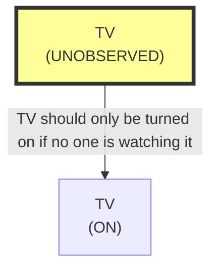
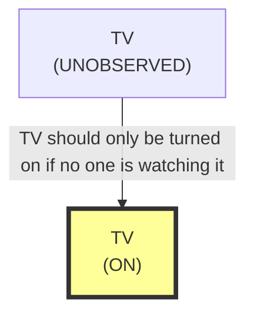
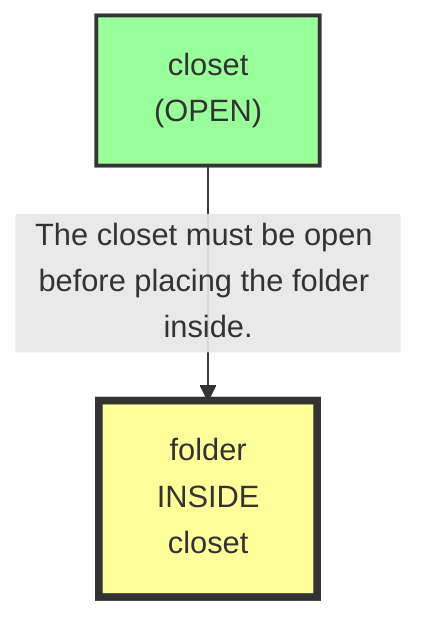
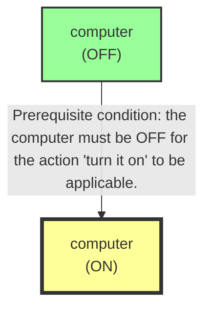

# 🚀 VirtualHome Agent Episode Log


### [GoalReasoner (Module A - Intent)] Output
```json
{
  "is_instruction_obviously_vague": true,
  "clarification_question": "Who should be considered as “watching the TV” in this instruction, and should I turn the TV on only when the room is empty or when no specific person is watching?",
  "target_object": "TV",
  "location_hint": null,
  "reasoning_chain": [
    {
      "question": "Why does the user want this object?",
      "answer": "To have the television powered on under certain conditions."
    },
    {
      "question": "Why is that important?",
      "answer": "To ensure the TV is active when it is not being watched by someone."
    },
    {
      "question": "What fundamental need does this fulfill?",
      "answer": "To manage a household device based on whether it is being used."
    },
    {
      "question": "Are there any deeper psychological or physical motivations?",
      "answer": "Possibly convenience, energy management, or keeping the TV ready for use."
    }
  ],
  "deep_intent": "The user wants to control a household device based on whether it is currently being used by a person.",
  "acceptable_alternatives_properties": [
    {
      "priority": 1,
      "description": "Other household media devices that can be turned on when not in use, such as a monitor or projector"
    },
    {
      "priority": 2,
      "description": "Other entertainment electronics that can be powered on, such as a radio or game console"
    },
    {
      "priority": 3,
      "description": "Any indoor electronic device that serves a similar readiness or standby function"
    },
    {
      "priority": 4,
      "description": "A different device used for idle-time engagement, such as a tablet or speaker"
    }
  ]
}
```

### [PerceptionFilter] Output
```json
{
  "reasoning": "The goal and SDG are specifically about the TV state, so the only strictly necessary target class is the TV itself. No other tools or locations are required by the intent or graph.",
  "selected_classes": [
    "tv",
    "door",
    "character"
  ],
  "raw_class_count": 55
}
```

### [LLMExecutor] Output
```json
{
  "reasoning": "The instruction is explicitly vague: the goal depends on who counts as 'watching the TV' and whether the TV should be turned on only when the room is empty or only when no specific person is watching. Since this ambiguity prevents determining the correct target state from the SDG, I should request clarification before taking any physical action.",
  "satisfied_nodes": [],
  "current_node_focus": "N2",
  "mapped_variables": {},
  "action": "[ask] Who should be considered as “watching the TV” in this instruction, and should I turn the TV on only when the room is empty or when no specific person is watching?"
}
```

### [RoboStateMultiTaskController] Output
```json
{
  "action": "[ask] Who should be considered as “watching the TV” in this instruction, and should I turn the TV on only when the room is empty or when no specific person is watching?",
  "active_task_id": "task_2",
  "task_context": {
    "active_task_id": "task_2",
    "pending_task_ids": [
      "task_1",
      "task_3",
      "task_4",
      "task_5"
    ],
    "satisfied_task_ids": []
  },
  "source": "llm_executor"
}
```
## Step 0
- **Action**: `[ask] Who should be considered as “watching the TV” in this instruction, and should I turn the TV on only when the room is empty or when no specific person is watching?`
- **Action Success**: `True`
- **Action Message**: nothing to claim
- **Active Task**: `task_2`
- **Decision Source**: `llm_executor`
- **Task Progress**: G1_05=pending, E1_01=pending, E1_03=pending, E1_11=pending, E1_15=pending
- **SDG Status**:

- **Observed Items (7)**: door(224) [OPEN], tv(264) [OFF], character(1), bathroom(11), bedroom(73), kitchen(205), livingroom(335)


### [PerceptionFilter] Output
```json
{
  "reasoning": "Reused cached class selection.",
  "selected_classes": [
    "tv",
    "door",
    "character"
  ],
  "raw_class_count": 55
}
```

### [LLMExecutor] Output
```json
{
  "reasoning": "The clarification has already been handled, so I must proceed autonomously. The SDG requires the TV to be ON, and the current graph shows the TV is OFF in the kitchen. I am already in the kitchen and facing the TV, so the next direct action is to turn it on.",
  "satisfied_nodes": [],
  "current_node_focus": "N1",
  "mapped_variables": {},
  "action": "[switchon] <tv> (264)"
}
```

### [RoboStateMultiTaskController] Output
```json
{
  "action": "[walk] <tv> (264)",
  "active_task_id": "task_2",
  "task_context": {
    "active_task_id": "task_2",
    "pending_task_ids": [
      "task_1",
      "task_3",
      "task_4",
      "task_5"
    ],
    "satisfied_task_ids": []
  },
  "source": "llm_executor_repaired"
}
```
## Step 1
- **Action**: `[walk] <tv> (264)`
- **Action Success**: `True`
- **Action Message**: {'0': {'message': 'Success'}}
- **Active Task**: `task_2`
- **Decision Source**: `llm_executor_repaired`
- **Task Progress**: G1_05=pending, E1_01=pending, E1_03=pending, E1_11=pending, E1_15=pending
- **SDG Status**:

- **Observed Items (7)**: door(224) [OPEN], tv(264) [OFF], character(1), bathroom(11), bedroom(73), kitchen(205), livingroom(335)


### [PerceptionFilter] Output
```json
{
  "reasoning": "Reused cached class selection.",
  "selected_classes": [
    "tv",
    "door",
    "character"
  ],
  "raw_class_count": 55
}
```

### [LLMExecutor] Output
```json
{
  "reasoning": "The task is to turn the TV on when it is not being watched. The clarification required has already been answered earlier, so I must proceed autonomously. The SDG indicates the TV should end up ON, with the UNOBSERVED condition as a prerequisite. I am already close to the TV, but the current graph shows the character is facing and close to the TV, so the next atomic action is to switch it on. The TV has HAS_SWITCH and HAS_PLUG, and there is no active global rule preventing this.",
  "satisfied_nodes": [],
  "current_node_focus": "N2",
  "mapped_variables": {},
  "action": "[switchon] <tv> (264)"
}
```

### [RoboStateMultiTaskController] Output
```json
{
  "action": "[switchon] <tv> (264)",
  "active_task_id": "task_2",
  "task_context": {
    "active_task_id": "task_2",
    "pending_task_ids": [
      "task_1",
      "task_3",
      "task_4",
      "task_5"
    ],
    "satisfied_task_ids": []
  },
  "source": "llm_executor"
}
```
## Step 2
- **Action**: `[switchon] <tv> (264)`
- **Action Success**: `True`
- **Action Message**: Faked switch operation in Python layer (bypassed Unity failure)
- **Active Task**: `task_2`
- **Decision Source**: `llm_executor`
- **Task Progress**: G1_05=pending, E1_01=done, E1_03=pending, E1_11=pending, E1_15=pending
- **SDG Status**:

- **Observed Items (7)**: door(224) [OPEN], tv(264) [OFF], character(1), bathroom(11), bedroom(73), kitchen(205), livingroom(335)


### [GoalReasoner (Module A - Intent)] Output
```json
{
  "is_instruction_obviously_vague": false,
  "clarification_question": null,
  "target_object": "book",
  "location_hint": "sofa",
  "reasoning_chain": [
    {
      "question": "Why does the user want this object?",
      "answer": "They want the book moved from an unorganized place to the sofa."
    },
    {
      "question": "Why is that important?",
      "answer": "It likely helps organize the space or place the book where it should be kept temporarily."
    },
    {
      "question": "What fundamental need does this fulfill?",
      "answer": "It fulfills the need to tidy and relocate an item to a preferred resting place."
    },
    {
      "question": "Are there any deeper psychological or physical motivations?",
      "answer": "The user likely wants reduced clutter and easier access to the book in a living area."
    }
  ],
  "deep_intent": "The user wants to organize and relocate a misplaced item to a preferred indoor resting spot.",
  "acceptable_alternatives_properties": [
    {
      "priority": 1,
      "description": "Other similarly misplaced books or reading materials that can be moved to the sofa"
    },
    {
      "priority": 2,
      "description": "Other small household items found out of place that are typically kept in a living area"
    },
    {
      "priority": 3,
      "description": "Readable items such as magazines or notebooks that can be tidied into the same area"
    },
    {
      "priority": 4,
      "description": "Lightweight household objects that are cluttering the space and can be relocated to reduce disorganization"
    }
  ]
}
```

### [RoboStateMultiTaskController] Output
```json
{
  "action": "[walk] <bathroom> (11)",
  "active_task_id": "task_3",
  "task_context": {
    "active_task_id": "task_3",
    "pending_task_ids": [
      "task_1",
      "task_4",
      "task_5"
    ],
    "satisfied_task_ids": [
      "task_2"
    ]
  },
  "source": "room_frontier"
}
```
## Step 3
- **Action**: `[walk] <bathroom> (11)`
- **Action Success**: `True`
- **Action Message**: {'0': {'message': 'Success'}}
- **Active Task**: `task_3`
- **Decision Source**: `room_frontier`
- **Task Progress**: G1_05=pending, E1_01=done, E1_03=pending, E1_11=pending, E1_15=pending
- **SDG Status**:

- **Observed Items (113)**: floor(206), floor(207), floor(208), floor(209), floor(210), floor(211), wall(212), wall(213), wall(214), wall(215), wall(216), wall(217), ceiling(218), ceiling(219), ceiling(220)...


### [RoboStateMultiTaskController] Output
```json
{
  "action": "[walk] <bedroom> (73)",
  "active_task_id": "task_3",
  "task_context": {
    "active_task_id": "task_3",
    "pending_task_ids": [
      "task_1",
      "task_4",
      "task_5"
    ],
    "satisfied_task_ids": [
      "task_2"
    ]
  },
  "source": "room_frontier"
}
```
## Step 4
- **Action**: `[walk] <bedroom> (73)`
- **Action Success**: `True`
- **Action Message**: {'0': {'message': 'Success'}}
- **Active Task**: `task_3`
- **Decision Source**: `room_frontier`
- **Task Progress**: G1_05=pending, E1_01=done, E1_03=pending, E1_11=pending, E1_15=pending
- **SDG Status**:

- **Observed Items (174)**: floor(206), floor(207), floor(208), floor(209), floor(210), floor(211), wall(212), wall(213), wall(214), wall(215), wall(216), wall(217), ceiling(218), ceiling(219), ceiling(220)...


### [RoboStateMultiTaskController] Output
```json
{
  "action": "[walk] <livingroom> (335)",
  "active_task_id": "task_3",
  "task_context": {
    "active_task_id": "task_3",
    "pending_task_ids": [
      "task_1",
      "task_4",
      "task_5"
    ],
    "satisfied_task_ids": [
      "task_2"
    ]
  },
  "source": "room_frontier"
}
```
## Step 5
- **Action**: `[walk] <livingroom> (335)`
- **Action Success**: `True`
- **Action Message**: {'0': {'message': 'Success'}}
- **Active Task**: `task_3`
- **Decision Source**: `room_frontier`
- **Task Progress**: G1_05=pending, E1_01=done, E1_03=pending, E1_11=pending, E1_15=pending
- **SDG Status**:

- **Observed Items (258)**: floor(206), floor(207), floor(208), floor(209), floor(210), floor(211), wall(212), wall(213), wall(214), wall(215), wall(216), wall(217), ceiling(218), ceiling(219), ceiling(220)...


### [PerceptionFilter] Output
```json
{
  "reasoning": "The goal is to move a book onto the sofa, so the only necessary classes are the target object and the destination furniture. No extra tools or alternatives are required for a simple relocation task.",
  "selected_classes": [
    "book",
    "door",
    "character",
    "sofa"
  ],
  "raw_class_count": 103
}
```

### [LLMExecutor] Output
```json
{
  "reasoning": "The active goal is to place a book on the sofa. The character is already close to sofa(368) in the livingroom, but the target book in the current graph is book(268) inside kitchen(205). To satisfy N1, the next needed step is to go to the book first before any grab can happen. I will not manipulate book(190) because it is a different object in the bedroom and the active task is singularly about the book in the kitchen context from the current graph. Since movement to the book is the immediate prerequisite, the next atomic action is to walk to book(268).",
  "satisfied_nodes": [],
  "current_node_focus": "N1",
  "mapped_variables": {},
  "action": "[walk] <book> (268)"
}
```

### [RoboStateMultiTaskController] Output
```json
{
  "action": "[walk] <book> (268)",
  "active_task_id": "task_3",
  "task_context": {
    "active_task_id": "task_3",
    "pending_task_ids": [
      "task_1",
      "task_4",
      "task_5"
    ],
    "satisfied_task_ids": [
      "task_2"
    ]
  },
  "source": "llm_executor"
}
```
## Step 6
- **Action**: `[walk] <book> (268)`
- **Action Success**: `True`
- **Action Message**: {'0': {'message': 'Success'}}
- **Active Task**: `task_3`
- **Decision Source**: `llm_executor`
- **Task Progress**: G1_05=pending, E1_01=done, E1_03=pending, E1_11=pending, E1_15=pending
- **SDG Status**:

- **Observed Items (10)**: door(224) [OPEN], book(268) [CLOSED], character(1), bathroom(11), bedroom(73), kitchen(205), livingroom(335), door(51) [OPEN], book(190) [CLOSED], sofa(368)


### [PerceptionFilter] Output
```json
{
  "reasoning": "Reused cached class selection.",
  "selected_classes": [
    "book",
    "door",
    "character",
    "sofa"
  ],
  "raw_class_count": 103
}
```

### [LLMExecutor] Output
```json
{
  "reasoning": "The active task is to place a book on the sofa. The current graph shows book(268) is already close to the character in the kitchen, and sofa(368) is the target surface in the livingroom and also close to the character. Since we are already near the book, the next required step is to grab it before moving it. The book is grabbable and not dirty, so no washing is needed.",
  "satisfied_nodes": [],
  "current_node_focus": "N1",
  "mapped_variables": {
    "?Book": "book(268)",
    "?TargetSurface": "sofa(368)"
  },
  "action": "[grab] <book> (268)"
}
```

### [RoboStateMultiTaskController] Output
```json
{
  "action": "[grab] <book> (268)",
  "active_task_id": "task_3",
  "task_context": {
    "active_task_id": "task_3",
    "pending_task_ids": [
      "task_1",
      "task_4",
      "task_5"
    ],
    "satisfied_task_ids": [
      "task_2"
    ]
  },
  "source": "llm_executor"
}
```
## Step 7
- **Action**: `[grab] <book> (268)`
- **Action Success**: `True`
- **Action Message**: {'0': {'message': 'Success'}}
- **Active Task**: `task_3`
- **Decision Source**: `llm_executor`
- **Task Progress**: G1_05=pending, E1_01=done, E1_03=pending, E1_11=pending, E1_15=pending
- **SDG Status**:

- **Observed Items (10)**: door(224) [OPEN], book(268) [CLOSED], character(1), bathroom(11), bedroom(73), kitchen(205), livingroom(335), door(51) [OPEN], book(190) [CLOSED], sofa(368)


### [PerceptionFilter] Output
```json
{
  "reasoning": "Reused cached class selection.",
  "selected_classes": [
    "book",
    "door",
    "character",
    "sofa"
  ],
  "raw_class_count": 103
}
```

### [LLMExecutor] Output
```json
{
  "reasoning": "The active goal is to place book(268) on the sofa(368). The book is already held in the right hand, and the sofa is the required destination surface. To satisfy the final SDG node, the next step must be to move near the sofa before putting the book down. No other prerequisites remain.",
  "satisfied_nodes": [],
  "current_node_focus": "N1",
  "mapped_variables": {},
  "action": "[walk] <sofa> (368)"
}
```

### [RoboStateMultiTaskController] Output
```json
{
  "action": "[walk] <sofa> (368)",
  "active_task_id": "task_3",
  "task_context": {
    "active_task_id": "task_3",
    "pending_task_ids": [
      "task_1",
      "task_4",
      "task_5"
    ],
    "satisfied_task_ids": [
      "task_2"
    ]
  },
  "source": "llm_executor"
}
```
## Step 8
- **Action**: `[walk] <sofa> (368)`
- **Action Success**: `True`
- **Action Message**: {'0': {'message': 'Success'}}
- **Active Task**: `task_3`
- **Decision Source**: `llm_executor`
- **Task Progress**: G1_05=pending, E1_01=done, E1_03=pending, E1_11=pending, E1_15=pending
- **SDG Status**:

- **Observed Items (10)**: door(224) [OPEN], book(268) [CLOSED], character(1), bathroom(11), bedroom(73), kitchen(205), livingroom(335), door(51) [OPEN], book(190) [CLOSED], sofa(368)


### [PerceptionFilter] Output
```json
{
  "reasoning": "Reused cached class selection.",
  "selected_classes": [
    "book",
    "door",
    "character",
    "sofa"
  ],
  "raw_class_count": 103
}
```

### [LLMExecutor] Output
```json
{
  "reasoning": "The active goal is to place the grabbed book(268) on the sofa(368). The current graph shows the character is already close to both the book and the sofa, and the book is already held in the right hand, so the remaining gap is to place it onto the sofa surface. Since putback requires being near the destination and we are already close to the sofa, the next atomic action is to put the book on the sofa.",
  "satisfied_nodes": [],
  "current_node_focus": "N1",
  "mapped_variables": {},
  "action": "[putback] <book> (268) <sofa> (368)"
}
```

### [RoboStateMultiTaskController] Output
```json
{
  "action": "[putback] <book> (268) <sofa> (368)",
  "active_task_id": "task_3",
  "task_context": {
    "active_task_id": "task_3",
    "pending_task_ids": [
      "task_1",
      "task_4",
      "task_5"
    ],
    "satisfied_task_ids": [
      "task_2"
    ]
  },
  "source": "llm_executor"
}
```
## Step 9
- **Action**: `[putback] <book> (268) <sofa> (368)`
- **Action Success**: `True`
- **Action Message**: {'0': {'message': 'Success'}}
- **Active Task**: `task_3`
- **Decision Source**: `llm_executor`
- **Task Progress**: G1_05=pending, E1_01=done, E1_03=done, E1_11=pending, E1_15=pending
- **SDG Status**:

- **Observed Items (10)**: door(224) [OPEN], book(268) [CLOSED], character(1), bathroom(11), bedroom(73), kitchen(205), livingroom(335), door(51) [OPEN], book(190) [CLOSED], sofa(368)


### [GoalReasoner (Module A - Intent)] Output
```json
{
  "is_instruction_obviously_vague": false,
  "clarification_question": null,
  "target_object": "folder",
  "location_hint": "closet",
  "reasoning_chain": [
    {
      "question": "Why does the user want this object placed in that location?",
      "answer": "To store the folder away in an enclosed storage area."
    },
    {
      "question": "Why is that important?",
      "answer": "To keep the item organized, out of the way, or protected."
    },
    {
      "question": "What fundamental need does this fulfill?",
      "answer": "The user wants to organize or store a physical item."
    },
    {
      "question": "Are there any deeper psychological or physical motivations?",
      "answer": "This may support tidiness, reduce clutter, or make the space easier to use."
    }
  ],
  "deep_intent": "The user wants to organize and store a physical item.",
  "acceptable_alternatives_properties": [
    {
      "priority": 1,
      "description": "Other similar paper storage items, such as a file, document stack, or notebook"
    },
    {
      "priority": 2,
      "description": "Other lightweight office or paper-based items that can be stored in a closet"
    },
    {
      "priority": 3,
      "description": "Small household items that are being put away for organization"
    },
    {
      "priority": 4,
      "description": "Any removable personal belongings that can be stored to reduce clutter"
    }
  ]
}
```

### [PerceptionFilter] Output
```json
{
  "reasoning": "The goal is to store the folder inside an open closet. The only strictly necessary classes are the target item (folder) and the location/receptacle (closet). The closet must be included because the SDG requires it to be open before placing the folder inside.",
  "selected_classes": [
    "closet",
    "character",
    "folder",
    "paper",
    "book"
  ],
  "raw_class_count": 103
}
```

### [LLMExecutor] Output
```json
{
  "reasoning": "The active goal is to place a folder inside the closet, and the required closet must be open first. In the current graph, closet(112) in the bedroom is already OPEN, satisfying N2. The folder candidate that best matches the target is folder(203), which is inside the bedroom and available to manipulate. Since the next needed progress toward N1 is to get the folder and move it to the open closet, the immediate next atomic action should be to walk to the folder so it can be grabbed next.",
  "satisfied_nodes": [
    "N2"
  ],
  "current_node_focus": "N1",
  "mapped_variables": {
    "?Container": "closet(112)",
    "?Item": "folder(203)"
  },
  "action": "[walk] <folder> (203)"
}
```

### [RoboStateMultiTaskController] Output
```json
{
  "action": "[walk] <folder> (203)",
  "active_task_id": "task_5",
  "task_context": {
    "active_task_id": "task_5",
    "pending_task_ids": [
      "task_1",
      "task_4"
    ],
    "satisfied_task_ids": [
      "task_2",
      "task_3"
    ]
  },
  "source": "llm_executor"
}
```
## Step 10
- **Action**: `[walk] <folder> (203)`
- **Action Success**: `True`
- **Action Message**: {'0': {'message': 'Success'}}
- **Active Task**: `task_5`
- **Decision Source**: `llm_executor`
- **Task Progress**: G1_05=pending, E1_01=done, E1_03=done, E1_11=pending, E1_15=pending
- **SDG Status**:

- **Observed Items (13)**: book(268) [CLOSED], character(1), bathroom(11), bedroom(73), kitchen(205), livingroom(335), closet(112) [OPEN], closet(127) [CLOSED], book(190) [CLOSED], folder(203) [CLOSED], closet(374) [CLOSED], paper(451), folder(453) [CLOSED]


### [PerceptionFilter] Output
```json
{
  "reasoning": "Reused cached class selection.",
  "selected_classes": [
    "closet",
    "character",
    "folder",
    "paper",
    "book"
  ],
  "raw_class_count": 103
}
```

### [LLMExecutor] Output
```json
{
  "reasoning": "The active goal is to place a folder inside a closet, and the SDG requires the closet to be open first. In the current graph, closet(112) is already OPEN and we are close to folder(203), which is in the bedroom. The next required progress toward N1 is to pick up the folder before walking it to the open closet. The closet choice is closet(112) because it is the only open closet, satisfying N2 already.",
  "satisfied_nodes": [
    "N2"
  ],
  "current_node_focus": "N1",
  "mapped_variables": {
    "?Container": "closet(112)",
    "?Target": "folder(203)"
  },
  "action": "[grab] <folder> (203)"
}
```

### [RoboStateMultiTaskController] Output
```json
{
  "action": "[grab] <folder> (203)",
  "active_task_id": "task_5",
  "task_context": {
    "active_task_id": "task_5",
    "pending_task_ids": [
      "task_1",
      "task_4"
    ],
    "satisfied_task_ids": [
      "task_2",
      "task_3"
    ]
  },
  "source": "llm_executor"
}
```
## Step 11
- **Action**: `[grab] <folder> (203)`
- **Action Success**: `True`
- **Action Message**: {'0': {'message': 'Success'}}
- **Active Task**: `task_5`
- **Decision Source**: `llm_executor`
- **Task Progress**: G1_05=pending, E1_01=done, E1_03=done, E1_11=pending, E1_15=pending
- **SDG Status**:

- **Observed Items (13)**: book(268) [CLOSED], character(1), bathroom(11), bedroom(73), kitchen(205), livingroom(335), closet(112) [OPEN], closet(127) [CLOSED], book(190) [CLOSED], folder(203) [CLOSED], closet(374) [CLOSED], paper(451), folder(453) [CLOSED]


### [PerceptionFilter] Output
```json
{
  "reasoning": "Reused cached class selection.",
  "selected_classes": [
    "closet",
    "character",
    "folder",
    "paper",
    "book"
  ],
  "raw_class_count": 103
}
```

### [LLMExecutor] Output
```json
{
  "reasoning": "Active task is to store the folder in the closet. The currently held folder(203) is already in hand, and the target closet(112) is the open closet specified by the SDG. The next required step to satisfy N1 is to move to the open closet before placing the folder inside. N2 is already satisfied because closet(112) is OPEN.",
  "satisfied_nodes": [
    "N2"
  ],
  "current_node_focus": "N1",
  "mapped_variables": {
    "?Container": "closet(112)"
  },
  "action": "[walk] <closet> (112)"
}
```

### [RoboStateMultiTaskController] Output
```json
{
  "action": "[walk] <closet> (112)",
  "active_task_id": "task_5",
  "task_context": {
    "active_task_id": "task_5",
    "pending_task_ids": [
      "task_1",
      "task_4"
    ],
    "satisfied_task_ids": [
      "task_2",
      "task_3"
    ]
  },
  "source": "llm_executor"
}
```
## Step 12
- **Action**: `[walk] <closet> (112)`
- **Action Success**: `True`
- **Action Message**: {'0': {'message': 'Success'}}
- **Active Task**: `task_5`
- **Decision Source**: `llm_executor`
- **Task Progress**: G1_05=pending, E1_01=done, E1_03=done, E1_11=pending, E1_15=pending
- **SDG Status**:

- **Observed Items (13)**: book(268) [CLOSED], character(1), bathroom(11), bedroom(73), kitchen(205), livingroom(335), closet(112) [OPEN], closet(127) [CLOSED], book(190) [CLOSED], folder(203) [CLOSED], closet(374) [CLOSED], paper(451), folder(453) [CLOSED]


### [PerceptionFilter] Output
```json
{
  "reasoning": "Reused cached class selection.",
  "selected_classes": [
    "closet",
    "character",
    "folder",
    "paper",
    "book"
  ],
  "raw_class_count": 103
}
```

### [LLMExecutor] Output
```json
{
  "reasoning": "The active task is to store the folder inside a closet. The target folder is already held in the right hand, and the intended closet is closet(112), which is already OPEN and close to the character. The remaining gap is to place the held folder into that open closet; since putin requires being near the container and the closet is already near, the next atomic action is to insert the folder into it. N1 will be satisfied by this placement, while N2 is already satisfied because closet(112) is OPEN.",
  "satisfied_nodes": [
    "N2"
  ],
  "current_node_focus": "N1",
  "mapped_variables": {
    "?Container": "closet(112)"
  },
  "action": "[putin] <folder> (203) <closet> (112)"
}
```

### [RoboStateMultiTaskController] Output
```json
{
  "action": "[putin] <folder> (203) <closet> (112)",
  "active_task_id": "task_5",
  "task_context": {
    "active_task_id": "task_5",
    "pending_task_ids": [
      "task_1",
      "task_4"
    ],
    "satisfied_task_ids": [
      "task_2",
      "task_3"
    ]
  },
  "source": "llm_executor"
}
```
## Step 13
- **Action**: `[putin] <folder> (203) <closet> (112)`
- **Action Success**: `True`
- **Action Message**: {'0': {'message': 'Success'}}
- **Active Task**: `task_5`
- **Decision Source**: `llm_executor`
- **Task Progress**: G1_05=pending, E1_01=done, E1_03=done, E1_11=pending, E1_15=done
- **SDG Status**:

- **Observed Items (13)**: book(268) [CLOSED], character(1), bathroom(11), bedroom(73), kitchen(205), livingroom(335), closet(112) [OPEN], closet(127) [CLOSED], book(190) [CLOSED], folder(203) [CLOSED], closet(374) [CLOSED], paper(451), folder(453) [CLOSED]


### [GoalReasoner (Module A - Intent)] Output
```json
{
  "is_instruction_obviously_vague": false,
  "clarification_question": null,
  "target_object": "cup",
  "location_hint": "cabinet",
  "reasoning_chain": [
    {
      "question": "Why does the user want this object?",
      "answer": "To remove any water from it and then store it away."
    },
    {
      "question": "Why is that important?",
      "answer": "To leave the cup empty and put it in the designated storage location."
    },
    {
      "question": "What fundamental need does this fulfill?",
      "answer": "It fulfills the need to clear liquid from a container and organize/store the container."
    },
    {
      "question": "Are there any deeper psychological or physical motivations?",
      "answer": "The user likely wants to tidy the cup, prevent spills, and keep the kitchen or storage area organized."
    }
  ],
  "deep_intent": "The user wants to empty a liquid-containing container and store it away.",
  "acceptable_alternatives_properties": [
    {
      "priority": 1,
      "description": "Other household drinking containers that can be emptied and put away, such as a glass or mug"
    },
    {
      "priority": 2,
      "description": "Any similar reusable container that holds liquid and can be stored in a cabinet"
    },
    {
      "priority": 3,
      "description": "Empty kitchenware or drinkware that should be organized and stored"
    },
    {
      "priority": 4,
      "description": "Other small household items that need to be cleared of contents and put into storage"
    }
  ]
}
```

### [GoalReasoner (Module A - Intent)] Output
```json
{
  "is_instruction_obviously_vague": false,
  "clarification_question": null,
  "target_object": "computer",
  "location_hint": null,
  "reasoning_chain": [
    {
      "question": "Why does the user want this object?",
      "answer": "To have the device powered on if it is currently off."
    },
    {
      "question": "Why is that important?",
      "answer": "Because the user likely needs the computer to be usable and available for interaction or tasks."
    },
    {
      "question": "What fundamental need does this fulfill?",
      "answer": "Restoring access to a functioning computing device."
    },
    {
      "question": "Are there any deeper psychological or physical motivations?",
      "answer": "The user may want to continue work, access information, or resolve a disruption caused by the computer being off."
    }
  ],
  "deep_intent": "The user wants to restore access to a functioning computing device.",
  "acceptable_alternatives_properties": [
    {
      "priority": 1,
      "description": "Other powered-on computing devices, such as a laptop or tablet, that can provide similar access to digital tasks and information"
    },
    {
      "priority": 2,
      "description": "A different desktop or portable computer that can be turned on and used"
    },
    {
      "priority": 3,
      "description": "Any available electronic device that supports the needed digital activity, such as a smart display or workstation"
    },
    {
      "priority": 4,
      "description": "A non-computer alternative that still enables the immediate task, such as a phone for basic digital access"
    }
  ]
}
```

### [PerceptionFilter] Output
```json
{
  "reasoning": "The goal is to restore a functioning computer by turning it on. The only strictly necessary object class is the computer itself, since it is the target device and the SDG only requires its OFF/ON state transition. No extra tools or locations are required by the goal or SDG.",
  "selected_classes": [
    "character",
    "computer",
    "desk"
  ],
  "raw_class_count": 103
}
```

### [LLMExecutor] Output
```json
{
  "reasoning": "The active task is to power on a computer. The filtered graph shows two candidate computers, both currently OFF and neither is in hand. To turn one on, I must first move near it. Since the bedroom computer (174) is explicitly in the current room context area and is the most direct match for the task, I will approach that computer first. No prerequisite objects are needed because the computer has HAS_SWITCH and no plug requirement is listed.",
  "satisfied_nodes": [
    "N2"
  ],
  "current_node_focus": "N1",
  "mapped_variables": {
    "?Computer": "computer(174)"
  },
  "action": "[walk] <computer> (174)"
}
```

### [RoboStateMultiTaskController] Output
```json
{
  "action": "[walk] <computer> (174)",
  "active_task_id": "task_4",
  "task_context": {
    "active_task_id": "task_4",
    "pending_task_ids": [
      "task_1"
    ],
    "satisfied_task_ids": [
      "task_2",
      "task_3",
      "task_5"
    ]
  },
  "source": "llm_executor"
}
```
## Step 14
- **Action**: `[walk] <computer> (174)`
- **Action Success**: `True`
- **Action Message**: {'0': {'message': 'Success'}}
- **Active Task**: `task_4`
- **Decision Source**: `llm_executor`
- **Task Progress**: G1_05=pending, E1_01=done, E1_03=done, E1_11=pending, E1_15=done
- **SDG Status**:

- **Observed Items (9)**: character(1), bathroom(11), bedroom(73), kitchen(205), livingroom(335), desk(108) [CLOSED], computer(174) [OFF], desk(373) [CLOSED], computer(433) [OFF]


### [PerceptionFilter] Output
```json
{
  "reasoning": "Reused cached class selection.",
  "selected_classes": [
    "character",
    "computer",
    "desk"
  ],
  "raw_class_count": 103
}
```

### [LLMExecutor] Output
```json
{
  "reasoning": "The active task is to make a computer ON. The currently relevant computer is computer(174), which is already close to the character and is explicitly OFF, satisfying the prerequisite N2. The next atomic step is to turn it on. It has HAS_SWITCH and no plug requirement is indicated, so switchon is valid.",
  "satisfied_nodes": [
    "N2"
  ],
  "current_node_focus": "N1",
  "mapped_variables": {
    "?Computer": "computer(174)"
  },
  "action": "[switchon] <computer> (174)"
}
```

### [RoboStateMultiTaskController] Output
```json
{
  "action": "[switchon] <computer> (174)",
  "active_task_id": "task_4",
  "task_context": {
    "active_task_id": "task_4",
    "pending_task_ids": [
      "task_1"
    ],
    "satisfied_task_ids": [
      "task_2",
      "task_3",
      "task_5"
    ]
  },
  "source": "llm_executor"
}
```
## Step 15
- **Action**: `[switchon] <computer> (174)`
- **Action Success**: `True`
- **Action Message**: Faked switch operation in Python layer (bypassed Unity failure)
- **Active Task**: `task_4`
- **Decision Source**: `llm_executor`
- **Task Progress**: G1_05=pending, E1_01=done, E1_03=done, E1_11=done, E1_15=done
- **SDG Status**:

- **Observed Items (9)**: character(1), bathroom(11), bedroom(73), kitchen(205), livingroom(335), desk(108) [CLOSED], computer(174) [OFF], desk(373) [CLOSED], computer(433) [OFF]


### [RoboStateMultiTaskController] Output
```json
{
  "action": "[walk] <bathroom> (11)",
  "active_task_id": null,
  "task_context": {
    "active_task_id": null,
    "pending_task_ids": [
      "task_1"
    ],
    "satisfied_task_ids": [
      "task_2",
      "task_3",
      "task_4",
      "task_5"
    ]
  },
  "source": "loop_recovery_room_revisit"
}
```
## Step 16
- **Action**: `[walk] <bathroom> (11)`
- **Action Success**: `True`
- **Action Message**: {'0': {'message': 'Success'}}
- **Decision Source**: `loop_recovery_room_revisit`
- **Task Progress**: G1_05=pending, E1_01=done, E1_03=done, E1_11=done, E1_15=done
- **SDG Status**:
No SDG active.
- **Observed Items (332)**: floor(206), floor(207), floor(208), floor(209), floor(210), floor(211), wall(212), wall(213), wall(214), wall(215), wall(216), wall(217), ceiling(218), ceiling(219), ceiling(220)...


### [RoboStateMultiTaskController] Output
```json
{
  "action": "[walk] <kitchen> (205)",
  "active_task_id": null,
  "task_context": {
    "active_task_id": null,
    "pending_task_ids": [
      "task_1"
    ],
    "satisfied_task_ids": [
      "task_2",
      "task_3",
      "task_4",
      "task_5"
    ]
  },
  "source": "loop_recovery_room_revisit"
}
```
## Step 17
- **Action**: `[walk] <kitchen> (205)`
- **Action Success**: `True`
- **Action Message**: {'0': {'message': 'Success'}}
- **Decision Source**: `loop_recovery_room_revisit`
- **Task Progress**: G1_05=pending, E1_01=done, E1_03=done, E1_11=done, E1_15=done
- **SDG Status**:
No SDG active.
- **Observed Items (332)**: floor(206), floor(207), floor(208), floor(209), floor(210), floor(211), wall(212), wall(213), wall(214), wall(215), wall(216), wall(217), ceiling(218), ceiling(219), ceiling(220)...


### [RoboStateMultiTaskController] Output
```json
{
  "action": "[walk] <livingroom> (335)",
  "active_task_id": null,
  "task_context": {
    "active_task_id": null,
    "pending_task_ids": [
      "task_1"
    ],
    "satisfied_task_ids": [
      "task_2",
      "task_3",
      "task_4",
      "task_5"
    ]
  },
  "source": "loop_recovery_room_revisit"
}
```
## Step 18
- **Action**: `[walk] <livingroom> (335)`
- **Action Success**: `True`
- **Action Message**: {'0': {'message': 'Success'}}
- **Decision Source**: `loop_recovery_room_revisit`
- **Task Progress**: G1_05=pending, E1_01=done, E1_03=done, E1_11=done, E1_15=done
- **SDG Status**:
No SDG active.
- **Observed Items (332)**: floor(206), floor(207), floor(208), floor(209), floor(210), floor(211), wall(212), wall(213), wall(214), wall(215), wall(216), wall(217), ceiling(218), ceiling(219), ceiling(220)...


### [RoboStateMultiTaskController] Output
```json
{
  "action": "[walk] <bedroom> (73)",
  "active_task_id": null,
  "task_context": {
    "active_task_id": null,
    "pending_task_ids": [
      "task_1"
    ],
    "satisfied_task_ids": [
      "task_2",
      "task_3",
      "task_4",
      "task_5"
    ]
  },
  "source": "loop_recovery_room_revisit"
}
```
## Step 19
- **Action**: `[walk] <bedroom> (73)`
- **Action Success**: `True`
- **Action Message**: {'0': {'message': 'Success'}}
- **Decision Source**: `loop_recovery_room_revisit`
- **Task Progress**: G1_05=pending, E1_01=done, E1_03=done, E1_11=done, E1_15=done
- **SDG Status**:
No SDG active.
- **Observed Items (332)**: floor(206), floor(207), floor(208), floor(209), floor(210), floor(211), wall(212), wall(213), wall(214), wall(215), wall(216), wall(217), ceiling(218), ceiling(219), ceiling(220)...


### [RoboStateMultiTaskController] Output
```json
{
  "action": "[walk] <bathroom> (11)",
  "active_task_id": null,
  "task_context": {
    "active_task_id": null,
    "pending_task_ids": [
      "task_1"
    ],
    "satisfied_task_ids": [
      "task_2",
      "task_3",
      "task_4",
      "task_5"
    ]
  },
  "source": "loop_recovery_room_revisit"
}
```
## Step 20
- **Action**: `[walk] <bathroom> (11)`
- **Action Success**: `True`
- **Action Message**: {'0': {'message': 'Success'}}
- **Decision Source**: `loop_recovery_room_revisit`
- **Task Progress**: G1_05=pending, E1_01=done, E1_03=done, E1_11=done, E1_15=done
- **SDG Status**:
No SDG active.
- **Observed Items (332)**: floor(206), floor(207), floor(208), floor(209), floor(210), floor(211), wall(212), wall(213), wall(214), wall(215), wall(216), wall(217), ceiling(218), ceiling(219), ceiling(220)...


### [RoboStateMultiTaskController] Output
```json
{
  "action": "[walk] <kitchen> (205)",
  "active_task_id": null,
  "task_context": {
    "active_task_id": null,
    "pending_task_ids": [
      "task_1"
    ],
    "satisfied_task_ids": [
      "task_2",
      "task_3",
      "task_4",
      "task_5"
    ]
  },
  "source": "loop_recovery_room_revisit"
}
```
## Step 21
- **Action**: `[walk] <kitchen> (205)`
- **Action Success**: `True`
- **Action Message**: {'0': {'message': 'Success'}}
- **Decision Source**: `loop_recovery_room_revisit`
- **Task Progress**: G1_05=pending, E1_01=done, E1_03=done, E1_11=done, E1_15=done
- **SDG Status**:
No SDG active.
- **Observed Items (332)**: floor(206), floor(207), floor(208), floor(209), floor(210), floor(211), wall(212), wall(213), wall(214), wall(215), wall(216), wall(217), ceiling(218), ceiling(219), ceiling(220)...


### [RoboStateMultiTaskController] Output
```json
{
  "action": "[walk] <livingroom> (335)",
  "active_task_id": null,
  "task_context": {
    "active_task_id": null,
    "pending_task_ids": [
      "task_1"
    ],
    "satisfied_task_ids": [
      "task_2",
      "task_3",
      "task_4",
      "task_5"
    ]
  },
  "source": "loop_recovery_room_revisit"
}
```
## Step 22
- **Action**: `[walk] <livingroom> (335)`
- **Action Success**: `True`
- **Action Message**: {'0': {'message': 'Success'}}
- **Decision Source**: `loop_recovery_room_revisit`
- **Task Progress**: G1_05=pending, E1_01=done, E1_03=done, E1_11=done, E1_15=done
- **SDG Status**:
No SDG active.
- **Observed Items (332)**: floor(206), floor(207), floor(208), floor(209), floor(210), floor(211), wall(212), wall(213), wall(214), wall(215), wall(216), wall(217), ceiling(218), ceiling(219), ceiling(220)...


### [RoboStateMultiTaskController] Output
```json
{
  "action": "[walk] <bedroom> (73)",
  "active_task_id": null,
  "task_context": {
    "active_task_id": null,
    "pending_task_ids": [
      "task_1"
    ],
    "satisfied_task_ids": [
      "task_2",
      "task_3",
      "task_4",
      "task_5"
    ]
  },
  "source": "loop_recovery_room_revisit"
}
```
## Step 23
- **Action**: `[walk] <bedroom> (73)`
- **Action Success**: `True`
- **Action Message**: {'0': {'message': 'Success'}}
- **Decision Source**: `loop_recovery_room_revisit`
- **Task Progress**: G1_05=pending, E1_01=done, E1_03=done, E1_11=done, E1_15=done
- **SDG Status**:
No SDG active.
- **Observed Items (332)**: floor(206), floor(207), floor(208), floor(209), floor(210), floor(211), wall(212), wall(213), wall(214), wall(215), wall(216), wall(217), ceiling(218), ceiling(219), ceiling(220)...


### [RoboStateMultiTaskController] Output
```json
{
  "action": "[walk] <bathroom> (11)",
  "active_task_id": null,
  "task_context": {
    "active_task_id": null,
    "pending_task_ids": [
      "task_1"
    ],
    "satisfied_task_ids": [
      "task_2",
      "task_3",
      "task_4",
      "task_5"
    ]
  },
  "source": "loop_recovery_room_revisit"
}
```
## Step 24
- **Action**: `[walk] <bathroom> (11)`
- **Action Success**: `True`
- **Action Message**: {'0': {'message': 'Success'}}
- **Decision Source**: `loop_recovery_room_revisit`
- **Task Progress**: G1_05=pending, E1_01=done, E1_03=done, E1_11=done, E1_15=done
- **SDG Status**:
No SDG active.
- **Observed Items (332)**: floor(206), floor(207), floor(208), floor(209), floor(210), floor(211), wall(212), wall(213), wall(214), wall(215), wall(216), wall(217), ceiling(218), ceiling(219), ceiling(220)...


### [RoboStateMultiTaskController] Output
```json
{
  "action": "[walk] <kitchen> (205)",
  "active_task_id": null,
  "task_context": {
    "active_task_id": null,
    "pending_task_ids": [
      "task_1"
    ],
    "satisfied_task_ids": [
      "task_2",
      "task_3",
      "task_4",
      "task_5"
    ]
  },
  "source": "loop_recovery_room_revisit"
}
```
## Step 25
- **Action**: `[walk] <kitchen> (205)`
- **Action Success**: `True`
- **Action Message**: {'0': {'message': 'Success'}}
- **Decision Source**: `loop_recovery_room_revisit`
- **Task Progress**: G1_05=pending, E1_01=done, E1_03=done, E1_11=done, E1_15=done
- **SDG Status**:
No SDG active.
- **Observed Items (332)**: floor(206), floor(207), floor(208), floor(209), floor(210), floor(211), wall(212), wall(213), wall(214), wall(215), wall(216), wall(217), ceiling(218), ceiling(219), ceiling(220)...


### [RoboStateMultiTaskController] Output
```json
{
  "action": "[walk] <livingroom> (335)",
  "active_task_id": null,
  "task_context": {
    "active_task_id": null,
    "pending_task_ids": [
      "task_1"
    ],
    "satisfied_task_ids": [
      "task_2",
      "task_3",
      "task_4",
      "task_5"
    ]
  },
  "source": "loop_recovery_room_revisit"
}
```
## Step 26
- **Action**: `[walk] <livingroom> (335)`
- **Action Success**: `True`
- **Action Message**: {'0': {'message': 'Success'}}
- **Decision Source**: `loop_recovery_room_revisit`
- **Task Progress**: G1_05=pending, E1_01=done, E1_03=done, E1_11=done, E1_15=done
- **SDG Status**:
No SDG active.
- **Observed Items (332)**: floor(206), floor(207), floor(208), floor(209), floor(210), floor(211), wall(212), wall(213), wall(214), wall(215), wall(216), wall(217), ceiling(218), ceiling(219), ceiling(220)...


### [RoboStateMultiTaskController] Output
```json
{
  "action": "[walk] <bedroom> (73)",
  "active_task_id": null,
  "task_context": {
    "active_task_id": null,
    "pending_task_ids": [
      "task_1"
    ],
    "satisfied_task_ids": [
      "task_2",
      "task_3",
      "task_4",
      "task_5"
    ]
  },
  "source": "loop_recovery_room_revisit"
}
```
## Step 27
- **Action**: `[walk] <bedroom> (73)`
- **Action Success**: `True`
- **Action Message**: {'0': {'message': 'Success'}}
- **Decision Source**: `loop_recovery_room_revisit`
- **Task Progress**: G1_05=pending, E1_01=done, E1_03=done, E1_11=done, E1_15=done
- **SDG Status**:
No SDG active.
- **Observed Items (332)**: floor(206), floor(207), floor(208), floor(209), floor(210), floor(211), wall(212), wall(213), wall(214), wall(215), wall(216), wall(217), ceiling(218), ceiling(219), ceiling(220)...


### [RoboStateMultiTaskController] Output
```json
{
  "action": "[walk] <bathroom> (11)",
  "active_task_id": null,
  "task_context": {
    "active_task_id": null,
    "pending_task_ids": [
      "task_1"
    ],
    "satisfied_task_ids": [
      "task_2",
      "task_3",
      "task_4",
      "task_5"
    ]
  },
  "source": "loop_recovery_room_revisit"
}
```
## Step 28
- **Action**: `[walk] <bathroom> (11)`
- **Action Success**: `True`
- **Action Message**: {'0': {'message': 'Success'}}
- **Decision Source**: `loop_recovery_room_revisit`
- **Task Progress**: G1_05=pending, E1_01=done, E1_03=done, E1_11=done, E1_15=done
- **SDG Status**:
No SDG active.
- **Observed Items (332)**: floor(206), floor(207), floor(208), floor(209), floor(210), floor(211), wall(212), wall(213), wall(214), wall(215), wall(216), wall(217), ceiling(218), ceiling(219), ceiling(220)...


### [RoboStateMultiTaskController] Output
```json
{
  "action": "[walk] <kitchen> (205)",
  "active_task_id": null,
  "task_context": {
    "active_task_id": null,
    "pending_task_ids": [
      "task_1"
    ],
    "satisfied_task_ids": [
      "task_2",
      "task_3",
      "task_4",
      "task_5"
    ]
  },
  "source": "loop_recovery_room_revisit"
}
```
## Step 29
- **Action**: `[walk] <kitchen> (205)`
- **Action Success**: `True`
- **Action Message**: {'0': {'message': 'Success'}}
- **Decision Source**: `loop_recovery_room_revisit`
- **Task Progress**: G1_05=pending, E1_01=done, E1_03=done, E1_11=done, E1_15=done
- **SDG Status**:
No SDG active.
- **Observed Items (332)**: floor(206), floor(207), floor(208), floor(209), floor(210), floor(211), wall(212), wall(213), wall(214), wall(215), wall(216), wall(217), ceiling(218), ceiling(219), ceiling(220)...


### [RoboStateMultiTaskController] Output
```json
{
  "action": "[walk] <livingroom> (335)",
  "active_task_id": null,
  "task_context": {
    "active_task_id": null,
    "pending_task_ids": [
      "task_1"
    ],
    "satisfied_task_ids": [
      "task_2",
      "task_3",
      "task_4",
      "task_5"
    ]
  },
  "source": "loop_recovery_room_revisit"
}
```
## Step 30
- **Action**: `[walk] <livingroom> (335)`
- **Action Success**: `True`
- **Action Message**: {'0': {'message': 'Success'}}
- **Decision Source**: `loop_recovery_room_revisit`
- **Task Progress**: G1_05=pending, E1_01=done, E1_03=done, E1_11=done, E1_15=done
- **SDG Status**:
No SDG active.
- **Observed Items (332)**: floor(206), floor(207), floor(208), floor(209), floor(210), floor(211), wall(212), wall(213), wall(214), wall(215), wall(216), wall(217), ceiling(218), ceiling(219), ceiling(220)...

