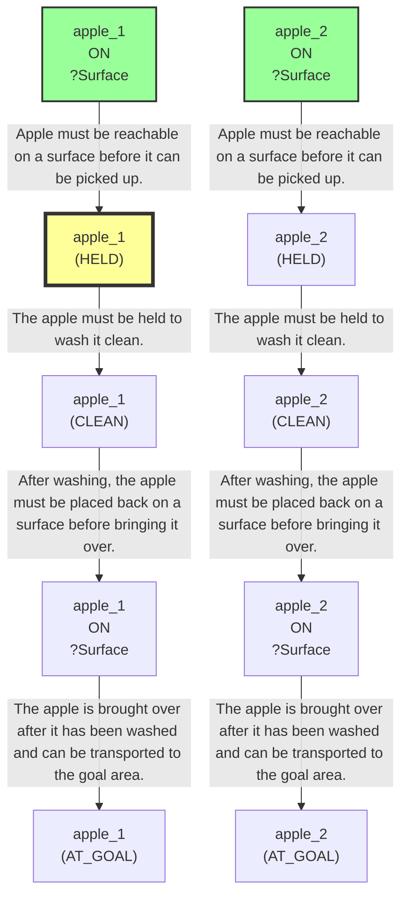
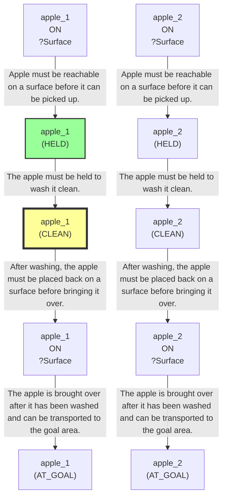
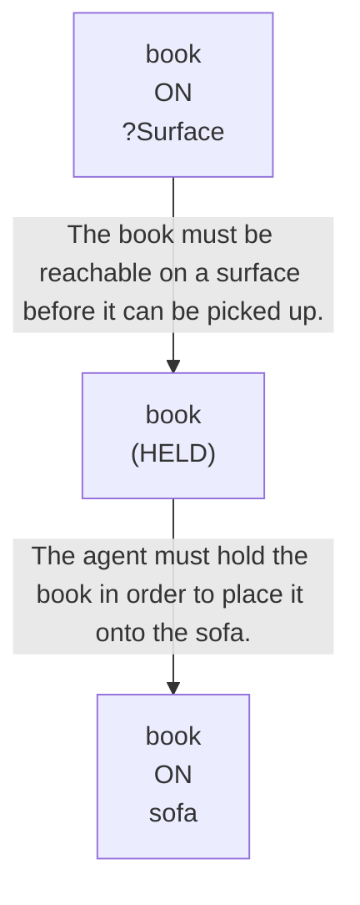
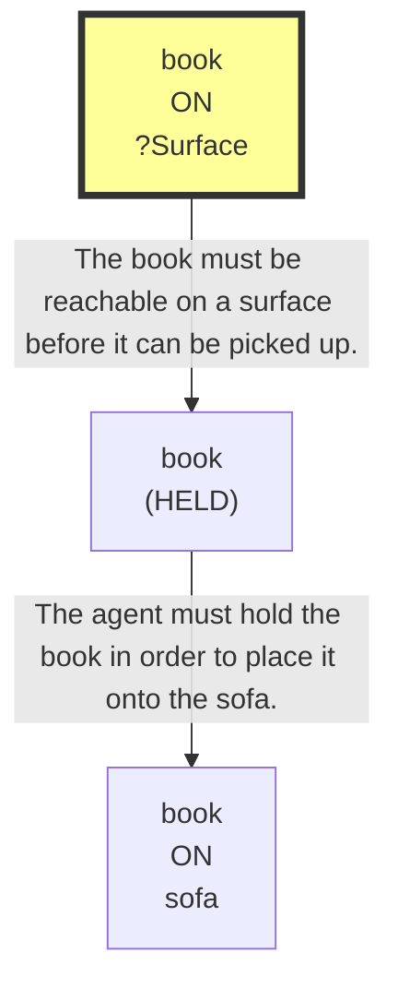
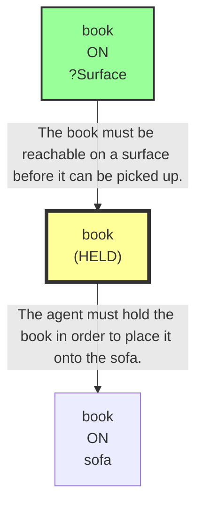
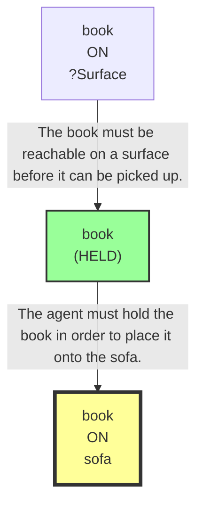
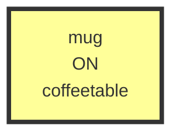
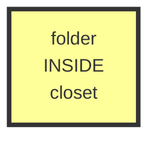
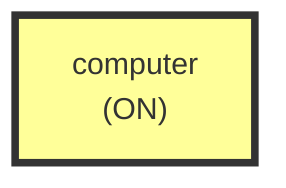

# 🚀 VirtualHome Agent Episode Log


### [GoalReasoner (Module A - Intent)] Output
```json
{
  "is_instruction_obviously_vague": false,
  "clarification_question": null,
  "target_object": "apples",
  "location_hint": "the table",
  "reasoning_chain": [
    {
      "question": "Why does the user want this object?",
      "answer": "To have the apples cleaned and delivered to them."
    },
    {
      "question": "Why is that important?",
      "answer": "So the apples are ready for use or consumption and are available nearby."
    },
    {
      "question": "What fundamental need does this fulfill?",
      "answer": "It helps satisfy the need to obtain and prepare food for eating."
    },
    {
      "question": "Are there any deeper psychological or physical motivations?",
      "answer": "The user likely wants convenience, cleanliness, and access to ready-to-use food."
    }
  ],
  "deep_intent": "The user wants to obtain clean, ready-to-use food.",
  "acceptable_alternatives_properties": [
    {
      "priority": 1,
      "description": "Other fresh fruits that can be washed and brought over, such as pears, oranges, or grapes"
    },
    {
      "priority": 2,
      "description": "Other washable ready-to-eat produce items, such as berries or plums"
    },
    {
      "priority": 3,
      "description": "Other snackable foods that provide a similar food-preparation and delivery function"
    },
    {
      "priority": 4,
      "description": "Any clean, edible household food item that can be brought over for immediate use"
    }
  ]
}
```

### [PerceptionFilter] Output
```json
{
  "reasoning": "The goal is to obtain clean apples and deliver them to the user. The SDG requires the apples themselves, plus a surface to pick/place them on, and cleaning tools/appliances for washing. I kept the exact target object class and the relevant washing locations/tools, along with the hinted table surface.",
  "selected_classes": [
    "faucet",
    "washingsponge",
    "character",
    "apple",
    "kitchentable",
    "sink",
    "dishwashingliquid"
  ],
  "raw_class_count": 56
}
```

### [LLMExecutor] Output
```json
{
  "reasoning": "The active goal is to obtain clean apples and bring them to the goal area. The current graph shows a single apple (apple_437) on the kitchentable and DIRTY. Since the apple is already on a reachable surface and the character is close to the table, the next required step is to pick it up so it can be washed at the sink. This directly advances N2 -> N1 for apple_1 binding to apple(437).",
  "satisfied_nodes": [
    "N2",
    "N7"
  ],
  "current_node_focus": "N1",
  "mapped_variables": {
    "?Surface": "kitchentable(231)"
  },
  "action": "[grab] <apple> (437)"
}
```

### [RoboStateMultiTaskController] Output
```json
{
  "action": "[walk] <apple> (437)",
  "active_task_id": "task_1",
  "task_context": {
    "active_task_id": "task_1",
    "pending_task_ids": [
      "task_2",
      "task_3",
      "task_4",
      "task_5",
      "task_6",
      "task_7"
    ],
    "satisfied_task_ids": []
  },
  "source": "llm_executor_repaired"
}
```
## Step 0
- **Action**: `[walk] <apple> (437)`
- **Action Success**: `True`
- **Action Message**: {'0': {'message': 'Success'}}
- **Active Task**: `task_1`
- **Decision Source**: `llm_executor_repaired`
- **Task Progress**: G1_02=pending, E1_11=pending, E1_03=pending, E1_17=pending, E1_07=pending, E1_01=pending, E1_15=pending
- **SDG Status**:

- **Observed Items (11)**: kitchentable(231), sink(247), faucet(248) [ON], washingsponge(266), dishwashingliquid(267), apple(437) [DIRTY], character(1), bathroom(11), bedroom(73), kitchen(205), livingroom(335)


### [PerceptionFilter] Output
```json
{
  "reasoning": "Reused cached class selection.",
  "selected_classes": [
    "faucet",
    "washingsponge",
    "character",
    "apple",
    "kitchentable",
    "sink",
    "dishwashingliquid"
  ],
  "raw_class_count": 56
}
```

### [LLMExecutor] Output
```json
{
  "reasoning": "The active task requires delivering a clean apple. The current apple_437 is on the kitchentable and already close to the character, so the first unmet SDG node is to hold it (N1). Since we are adjacent to it and have empty hands, the next atomic step is to grab the apple. The apple is currently DIRTY, but washing can only happen after it is held.",
  "satisfied_nodes": [
    "N2",
    "N7"
  ],
  "current_node_focus": "N1",
  "mapped_variables": {
    "?Surface": "kitchentable(231)"
  },
  "action": "[grab] <apple> (437)"
}
```

### [RoboStateMultiTaskController] Output
```json
{
  "action": "[grab] <apple> (437)",
  "active_task_id": "task_1",
  "task_context": {
    "active_task_id": "task_1",
    "pending_task_ids": [
      "task_2",
      "task_3",
      "task_4",
      "task_5",
      "task_6",
      "task_7"
    ],
    "satisfied_task_ids": []
  },
  "source": "llm_executor"
}
```
## Step 1
- **Action**: `[grab] <apple> (437)`
- **Action Success**: `True`
- **Action Message**: {'0': {'message': 'Success'}}
- **Active Task**: `task_1`
- **Decision Source**: `llm_executor`
- **Task Progress**: G1_02=pending, E1_11=pending, E1_03=pending, E1_17=pending, E1_07=pending, E1_01=pending, E1_15=pending
- **SDG Status**:

- **Observed Items (11)**: kitchentable(231), sink(247), faucet(248) [ON], washingsponge(266), dishwashingliquid(267), apple(437) [DIRTY], character(1), bathroom(11), bedroom(73), kitchen(205), livingroom(335)


### [PerceptionFilter] Output
```json
{
  "reasoning": "Reused cached class selection.",
  "selected_classes": [
    "faucet",
    "washingsponge",
    "character",
    "apple",
    "kitchentable",
    "sink",
    "dishwashingliquid"
  ],
  "raw_class_count": 56
}
```

### [LLMExecutor] Output
```json
{
  "reasoning": "The active apple_1 candidate is apple(437). It is already held, which satisfies the prerequisite for washing. The filtered graph shows a sink(247) and faucet(248) in the kitchen, and the faucet is ON. Per the SDG, the next unmet step is to make the held apple CLEAN. Since washing requires being near a sink, the single next atomic action is to walk to the sink.",
  "satisfied_nodes": [
    "N1"
  ],
  "current_node_focus": "N3",
  "mapped_variables": {
    "?Washer": "sink(247)",
    "?Surface": "kitchentable(231)"
  },
  "action": "[walk] <sink> (247)"
}
```

### [RoboStateMultiTaskController] Output
```json
{
  "action": "[walk] <sink> (247)",
  "active_task_id": "task_1",
  "task_context": {
    "active_task_id": "task_1",
    "pending_task_ids": [
      "task_2",
      "task_3",
      "task_4",
      "task_5",
      "task_6",
      "task_7"
    ],
    "satisfied_task_ids": []
  },
  "source": "llm_executor"
}
```
## Step 2
- **Action**: `[walk] <sink> (247)`
- **Action Success**: `True`
- **Action Message**: {'0': {'message': 'Success'}}
- **Active Task**: `task_1`
- **Decision Source**: `llm_executor`
- **Task Progress**: G1_02=pending, E1_11=pending, E1_03=pending, E1_17=pending, E1_07=pending, E1_01=pending, E1_15=pending
- **SDG Status**:

- **Observed Items (11)**: kitchentable(231), sink(247), faucet(248) [ON], washingsponge(266), dishwashingliquid(267), apple(437) [DIRTY], character(1), bathroom(11), bedroom(73), kitchen(205), livingroom(335)


### [PerceptionFilter] Output
```json
{
  "reasoning": "Reused cached class selection.",
  "selected_classes": [
    "faucet",
    "washingsponge",
    "character",
    "apple",
    "kitchentable",
    "sink",
    "dishwashingliquid"
  ],
  "raw_class_count": 56
}
```

### [LLMExecutor] Output
```json
{
  "reasoning": "The apple(437) is already held and we are already close to the sink(247), which is the required washer. Since the apple is DIRTY, the next step is to wash it while holding it near the sink. The faucet is already on, so no additional prep is needed.",
  "satisfied_nodes": [
    "N1"
  ],
  "current_node_focus": "N3",
  "mapped_variables": {
    "?Washer": "sink(247)"
  },
  "action": "[wash] <apple> (437)"
}
```

### [RoboStateMultiTaskController] Output
```json
{
  "action": "[wash] <apple> (437)",
  "active_task_id": "task_1",
  "task_context": {
    "active_task_id": "task_1",
    "pending_task_ids": [
      "task_2",
      "task_3",
      "task_4",
      "task_5",
      "task_6",
      "task_7"
    ],
    "satisfied_task_ids": []
  },
  "source": "llm_executor"
}
```
## Step 3
- **Action**: `[wash] <apple> (437)`
- **Action Success**: `True`
- **Action Message**: Washed successfully.
- **Active Task**: `task_1`
- **Decision Source**: `llm_executor`
- **Task Progress**: G1_02=done, E1_11=pending, E1_03=pending, E1_17=pending, E1_07=pending, E1_01=pending, E1_15=pending
- **SDG Status**:

- **Observed Items (11)**: kitchentable(231), sink(247), faucet(248) [ON], washingsponge(266), dishwashingliquid(267), apple(437) [DIRTY], character(1), bathroom(11), bedroom(73), kitchen(205), livingroom(335)


### [GoalReasoner (Module A - Intent)] Output
```json
{
  "is_instruction_obviously_vague": false,
  "clarification_question": null,
  "target_object": "book",
  "location_hint": "sofa",
  "reasoning_chain": [
    {
      "question": "Why does the user want this object moved to the sofa?",
      "answer": "To place an unorganized book in a more intended or convenient resting location."
    },
    {
      "question": "Why is that important?",
      "answer": "Because the book should no longer be left out in an unorganized place and should be put where the user wants it."
    },
    {
      "question": "What fundamental need does this fulfill?",
      "answer": "It fulfills the need to organize and relocate a book to a preferred indoor resting spot."
    },
    {
      "question": "Are there any deeper psychological or physical motivations?",
      "answer": "The user likely wants to tidy the space and reduce clutter by moving misplaced reading material to the sofa."
    }
  ],
  "deep_intent": "The user wants to organize a misplaced item by relocating it to a preferred indoor resting spot.",
  "acceptable_alternatives_properties": [
    {
      "priority": 1,
      "description": "Other small handheld reading items or similar paper media that are misplaced, such as magazines or notebooks, moved to the sofa"
    },
    {
      "priority": 2,
      "description": "Other paper-based reading materials or documents that can be tidied onto the sofa"
    },
    {
      "priority": 3,
      "description": "Other lightweight household items that are meant to be stored or kept together in a living area"
    },
    {
      "priority": 4,
      "description": "Any similarly misplaced small personal item that needs to be tidied into a designated resting area"
    }
  ]
}
```

### [RoboStateMultiTaskController] Output
```json
{
  "action": "[walk] <bathroom> (11)",
  "active_task_id": "task_3",
  "task_context": {
    "active_task_id": "task_3",
    "pending_task_ids": [
      "task_2",
      "task_4",
      "task_5",
      "task_6",
      "task_7"
    ],
    "satisfied_task_ids": [
      "task_1"
    ]
  },
  "source": "room_frontier"
}
```
## Step 4
- **Action**: `[walk] <bathroom> (11)`
- **Action Success**: `True`
- **Action Message**: {'0': {'message': 'Success'}}
- **Active Task**: `task_3`
- **Decision Source**: `room_frontier`
- **Task Progress**: G1_02=done, E1_11=pending, E1_03=pending, E1_17=pending, E1_07=pending, E1_01=pending, E1_15=pending
- **SDG Status**:

- **Observed Items (114)**: floor(206), floor(207), floor(208), floor(209), floor(210), floor(211), wall(212), wall(213), wall(214), wall(215), wall(216), wall(217), ceiling(218), ceiling(219), ceiling(220)...


### [RoboStateMultiTaskController] Output
```json
{
  "action": "[walk] <bedroom> (73)",
  "active_task_id": "task_3",
  "task_context": {
    "active_task_id": "task_3",
    "pending_task_ids": [
      "task_2",
      "task_4",
      "task_5",
      "task_6",
      "task_7"
    ],
    "satisfied_task_ids": [
      "task_1"
    ]
  },
  "source": "room_frontier"
}
```
## Step 5
- **Action**: `[walk] <bedroom> (73)`
- **Action Success**: `True`
- **Action Message**: {'0': {'message': 'Success'}}
- **Active Task**: `task_3`
- **Decision Source**: `room_frontier`
- **Task Progress**: G1_02=done, E1_11=pending, E1_03=pending, E1_17=pending, E1_07=pending, E1_01=pending, E1_15=pending
- **SDG Status**:

- **Observed Items (175)**: floor(206), floor(207), floor(208), floor(209), floor(210), floor(211), wall(212), wall(213), wall(214), wall(215), wall(216), wall(217), ceiling(218), ceiling(219), ceiling(220)...


### [RoboStateMultiTaskController] Output
```json
{
  "action": "[walk] <livingroom> (335)",
  "active_task_id": "task_3",
  "task_context": {
    "active_task_id": "task_3",
    "pending_task_ids": [
      "task_2",
      "task_4",
      "task_5",
      "task_6",
      "task_7"
    ],
    "satisfied_task_ids": [
      "task_1"
    ]
  },
  "source": "room_frontier"
}
```
## Step 6
- **Action**: `[walk] <livingroom> (335)`
- **Action Success**: `True`
- **Action Message**: {'0': {'message': 'Success'}}
- **Active Task**: `task_3`
- **Decision Source**: `room_frontier`
- **Task Progress**: G1_02=done, E1_11=pending, E1_03=pending, E1_17=pending, E1_07=pending, E1_01=pending, E1_15=pending
- **SDG Status**:

- **Observed Items (259)**: floor(206), floor(207), floor(208), floor(209), floor(210), floor(211), wall(212), wall(213), wall(214), wall(215), wall(216), wall(217), ceiling(218), ceiling(219), ceiling(220)...


### [PerceptionFilter] Output
```json
{
  "reasoning": "The goal is to move a book onto the sofa. Only the target object and the destination location are strictly needed, plus the book must be reachable/held according to the SDG. No extra tools or receptacles are required for simply relocating it.",
  "selected_classes": [
    "paper",
    "door",
    "sofa",
    "character",
    "book"
  ],
  "raw_class_count": 103
}
```

### [LLMExecutor] Output
```json
{
  "reasoning": "The active goal is to place a book on the sofa. The filtered graph shows the agent is already in the living room and close to sofa(368), but the candidate book objects are inside other rooms: book(268) is inside kitchen(205) and book(190) is inside bedroom(73). Since the task is to move a book to the sofa, the next required step is to go to the reachable target book. The best match is book(190) because it is a book already near the character and in a nearby room context, so I will start by moving toward that specific book before grabbing it.",
  "satisfied_nodes": [],
  "current_node_focus": "N3",
  "mapped_variables": {
    "?Surface": "sofa(368)"
  },
  "action": "[walk] <book> (190)"
}
```

### [RoboStateMultiTaskController] Output
```json
{
  "action": "[walk] <book> (190)",
  "active_task_id": "task_3",
  "task_context": {
    "active_task_id": "task_3",
    "pending_task_ids": [
      "task_2",
      "task_4",
      "task_5",
      "task_6",
      "task_7"
    ],
    "satisfied_task_ids": [
      "task_1"
    ]
  },
  "source": "llm_executor"
}
```
## Step 7
- **Action**: `[walk] <book> (190)`
- **Action Success**: `True`
- **Action Message**: {'0': {'message': 'Success'}}
- **Active Task**: `task_3`
- **Decision Source**: `llm_executor`
- **Task Progress**: G1_02=done, E1_11=pending, E1_03=pending, E1_17=pending, E1_07=pending, E1_01=pending, E1_15=pending
- **SDG Status**:

- **Observed Items (11)**: door(224) [OPEN], book(268) [CLOSED], character(1), bathroom(11), bedroom(73), kitchen(205), livingroom(335), door(51) [OPEN], book(190) [CLOSED], sofa(368), paper(451)


### [PerceptionFilter] Output
```json
{
  "reasoning": "Reused cached class selection.",
  "selected_classes": [
    "paper",
    "door",
    "sofa",
    "character",
    "book"
  ],
  "raw_class_count": 103
}
```

### [LLMExecutor] Output
```json
{
  "reasoning": "The active goal is to place a book on the sofa. In the current graph, the reachable candidate book is book(190), which is CLOSE to the character and inside the bedroom, so it is the appropriate object to manipulate. Since the character is already close to book(190) and the next required SDG state is holding the book (N2) before placing it on the sofa, the best immediate step is to grab it. I will not act on the other book(268) because it is in the kitchen and not the closest reachable target in the current area.",
  "satisfied_nodes": [
    "N3"
  ],
  "current_node_focus": "N2",
  "mapped_variables": {},
  "action": "[grab] <book> (190)"
}
```

### [RoboStateMultiTaskController] Output
```json
{
  "action": "[grab] <book> (190)",
  "active_task_id": "task_3",
  "task_context": {
    "active_task_id": "task_3",
    "pending_task_ids": [
      "task_2",
      "task_4",
      "task_5",
      "task_6",
      "task_7"
    ],
    "satisfied_task_ids": [
      "task_1"
    ]
  },
  "source": "llm_executor"
}
```
## Step 8
- **Action**: `[grab] <book> (190)`
- **Action Success**: `True`
- **Action Message**: {'0': {'message': 'Success'}}
- **Active Task**: `task_3`
- **Decision Source**: `llm_executor`
- **Task Progress**: G1_02=done, E1_11=pending, E1_03=pending, E1_17=pending, E1_07=pending, E1_01=pending, E1_15=pending
- **SDG Status**:

- **Observed Items (11)**: door(224) [OPEN], book(268) [CLOSED], character(1), bathroom(11), bedroom(73), kitchen(205), livingroom(335), door(51) [OPEN], book(190) [CLOSED], sofa(368), paper(451)


### [PerceptionFilter] Output
```json
{
  "reasoning": "Reused cached class selection.",
  "selected_classes": [
    "paper",
    "door",
    "sofa",
    "character",
    "book"
  ],
  "raw_class_count": 103
}
```

### [LLMExecutor] Output
```json
{
  "reasoning": "The active task is to place the book on the sofa. The current graph shows I am already holding book(190), and I am close to the sofa(368) in the livingroom. The next required step toward satisfying N1 is to move the held book onto the sofa. Because putback requires being explicitly walked to the destination first, and I am already close to the sofa, the appropriate next atomic action is to put the book on the sofa.",
  "satisfied_nodes": [
    "N2"
  ],
  "current_node_focus": "N1",
  "mapped_variables": {},
  "action": "[putback] <book> (190) <sofa> (368)"
}
```

### [RoboStateMultiTaskController] Output
```json
{
  "action": "[putback] <book> (190) <sofa> (368)",
  "active_task_id": "task_3",
  "task_context": {
    "active_task_id": "task_3",
    "pending_task_ids": [
      "task_2",
      "task_4",
      "task_5",
      "task_6",
      "task_7"
    ],
    "satisfied_task_ids": [
      "task_1"
    ]
  },
  "source": "llm_executor"
}
```
## Step 9
- **Action**: `[putback] <book> (190) <sofa> (368)`
- **Action Success**: `True`
- **Action Message**: {'0': {'message': 'Success'}}
- **Active Task**: `task_3`
- **Decision Source**: `llm_executor`
- **Task Progress**: G1_02=done, E1_11=pending, E1_03=done, E1_17=pending, E1_07=pending, E1_01=pending, E1_15=pending
- **SDG Status**:

- **Observed Items (11)**: door(224) [OPEN], book(268) [CLOSED], character(1), bathroom(11), bedroom(73), kitchen(205), livingroom(335), door(51) [OPEN], book(190) [CLOSED], sofa(368), paper(451)


### [GoalReasoner (Module A - Intent)] Output
```json
{
  "is_instruction_obviously_vague": false,
  "clarification_question": null,
  "target_object": "mug",
  "location_hint": "coffeetable",
  "reasoning_chain": [
    {
      "question": "Why does the user want this object?",
      "answer": "They want the mug to be kept on the coffeetable."
    },
    {
      "question": "Why is that important?",
      "answer": "So the mug remains in a specific, consistent location."
    },
    {
      "question": "What fundamental need does this fulfill?",
      "answer": "It fulfills a need for organization and predictable placement of an everyday item."
    },
    {
      "question": "Are there any deeper psychological or physical motivations?",
      "answer": "It may reduce clutter, make the mug easy to find or access, and maintain a desired room arrangement."
    }
  ],
  "deep_intent": "The user wants an everyday household item to remain in a consistent, designated location.",
  "acceptable_alternatives_properties": [
    {
      "priority": 1,
      "description": "Other drink containers or tabletop items that can serve as a similarly placed household object, such as a cup or glass"
    },
    {
      "priority": 2,
      "description": "Other small personal items that are commonly kept on a coffee table, such as a coaster or remote control"
    },
    {
      "priority": 3,
      "description": "Other lightweight household objects that can be stably kept on a tabletop"
    },
    {
      "priority": 4,
      "description": "Any nearby small household item that helps maintain an organized, designated surface"
    }
  ]
}
```

### [PerceptionFilter] Output
```json
{
  "reasoning": "The goal is to keep the mug on the coffeetable, so the only strictly necessary visible classes are the target object and its required location. No tool or alternative container is needed for this placement task.",
  "selected_classes": [
    "mug",
    "coffeetable",
    "character"
  ],
  "raw_class_count": 103
}
```

### [LLMExecutor] Output
```json
{
  "reasoning": "The active SDG requires mug ON coffeetable. The character is currently CLOSE to coffeetable(371) in the livingroom, so the next step is to get the mug that is in the livingroom. There are two mugs visible: mug(194) in the kitchen and mug(447) in the livingroom. Since the current room is the livingroom and mug(447) is accessible there, I will first move to mug(447) before grabbing it. The coffee table is already nearby for the eventual placement, but placement cannot happen until the mug is held.",
  "satisfied_nodes": [],
  "current_node_focus": "N1",
  "mapped_variables": {},
  "action": "[walk] <mug> (447)"
}
```

### [RoboStateMultiTaskController] Output
```json
{
  "action": "[walk] <mug> (447)",
  "active_task_id": "task_5",
  "task_context": {
    "active_task_id": "task_5",
    "pending_task_ids": [
      "task_2",
      "task_4",
      "task_6",
      "task_7"
    ],
    "satisfied_task_ids": [
      "task_1",
      "task_3"
    ]
  },
  "source": "llm_executor"
}
```
## Step 10
- **Action**: `[walk] <mug> (447)`
- **Action Success**: `True`
- **Action Message**: {'0': {'message': 'Success'}}
- **Active Task**: `task_5`
- **Decision Source**: `llm_executor`
- **Task Progress**: G1_02=done, E1_11=pending, E1_03=done, E1_17=pending, E1_07=pending, E1_01=pending, E1_15=pending
- **SDG Status**:

- **Observed Items (9)**: mug(194), character(1), bathroom(11), bedroom(73), kitchen(205), livingroom(335), coffeetable(111), coffeetable(371), mug(447)


### [PerceptionFilter] Output
```json
{
  "reasoning": "Reused cached class selection.",
  "selected_classes": [
    "mug",
    "coffeetable",
    "character"
  ],
  "raw_class_count": 103
}
```

### [LLMExecutor] Output
```json
{
  "reasoning": "The active goal is to place a mug on a coffeetable. The filtered graph shows mug(447) is already close to the character in the living room, and coffeetable(371) is the coffeetable in the living room. Since the last action was [walk] to the mug and the instruction says not to repeat a walk action if you just did it, the next logical step is to grab the nearby mug before moving it to the coffee table. The alternative mug(194) is inside the kitchen and not the one currently near the agent, so mug(447) is the best binding for the target mug.",
  "satisfied_nodes": [],
  "current_node_focus": "N1",
  "mapped_variables": {
    "?TargetMug": "mug(447)",
    "?CoffeeTable": "coffeetable(371)"
  },
  "action": "[grab] <mug> (447)"
}
```

### [RoboStateMultiTaskController] Output
```json
{
  "action": "[grab] <mug> (447)",
  "active_task_id": "task_5",
  "task_context": {
    "active_task_id": "task_5",
    "pending_task_ids": [
      "task_2",
      "task_4",
      "task_6",
      "task_7"
    ],
    "satisfied_task_ids": [
      "task_1",
      "task_3"
    ]
  },
  "source": "llm_executor"
}
```
## Step 11
- **Action**: `[grab] <mug> (447)`
- **Action Success**: `True`
- **Action Message**: {'0': {'message': 'Success'}}
- **Active Task**: `task_5`
- **Decision Source**: `llm_executor`
- **Task Progress**: G1_02=done, E1_11=pending, E1_03=done, E1_17=pending, E1_07=pending, E1_01=pending, E1_15=pending
- **SDG Status**:

- **Observed Items (9)**: mug(194), character(1), bathroom(11), bedroom(73), kitchen(205), livingroom(335), coffeetable(111), coffeetable(371), mug(447)


### [PerceptionFilter] Output
```json
{
  "reasoning": "Reused cached class selection.",
  "selected_classes": [
    "mug",
    "coffeetable",
    "character"
  ],
  "raw_class_count": 103
}
```

### [LLMExecutor] Output
```json
{
  "reasoning": "The active task is to place a mug on the coffeetable. The currently held mug is mug(447), and the graph shows coffeetable(111) is in the bedroom and not yet being interacted with. Since putback requires being explicitly walked to the destination first, the next step must be to move near the target coffeetable. mug(447) is the correct object for the SDG node N1, so I will keep focusing on that instance.",
  "satisfied_nodes": [],
  "current_node_focus": "N1",
  "mapped_variables": {
    "?TargetMug": "mug(447)",
    "?Table": "coffeetable(111)"
  },
  "action": "[walk] <coffeetable> (111)"
}
```

### [RoboStateMultiTaskController] Output
```json
{
  "action": "[walk] <coffeetable> (111)",
  "active_task_id": "task_5",
  "task_context": {
    "active_task_id": "task_5",
    "pending_task_ids": [
      "task_2",
      "task_4",
      "task_6",
      "task_7"
    ],
    "satisfied_task_ids": [
      "task_1",
      "task_3"
    ]
  },
  "source": "llm_executor"
}
```
## Step 12
- **Action**: `[walk] <coffeetable> (111)`
- **Action Success**: `True`
- **Action Message**: {'0': {'message': 'Success'}}
- **Active Task**: `task_5`
- **Decision Source**: `llm_executor`
- **Task Progress**: G1_02=done, E1_11=pending, E1_03=done, E1_17=pending, E1_07=pending, E1_01=pending, E1_15=pending
- **SDG Status**:

- **Observed Items (9)**: mug(194), character(1), bathroom(11), bedroom(73), kitchen(205), livingroom(335), coffeetable(111), coffeetable(371), mug(447)


### [PerceptionFilter] Output
```json
{
  "reasoning": "Reused cached class selection.",
  "selected_classes": [
    "mug",
    "coffeetable",
    "character"
  ],
  "raw_class_count": 103
}
```

### [LLMExecutor] Output
```json
{
  "reasoning": "The active task is to place a mug on the coffeetable. I am already close to coffeetable(111), and I am currently holding mug(447) in my left hand. The correct next step is to place the held mug onto the nearby coffee table. The target coffeetable(111) is a valid flat surface, so [putback] is appropriate.",
  "satisfied_nodes": [],
  "current_node_focus": "N1",
  "mapped_variables": {
    "?TargetSurface": "coffeetable(111)"
  },
  "action": "[putback] <mug> (447) <coffeetable> (111)"
}
```

### [RoboStateMultiTaskController] Output
```json
{
  "action": "[putback] <mug> (447) <coffeetable> (111)",
  "active_task_id": "task_5",
  "task_context": {
    "active_task_id": "task_5",
    "pending_task_ids": [
      "task_2",
      "task_4",
      "task_6",
      "task_7"
    ],
    "satisfied_task_ids": [
      "task_1",
      "task_3"
    ]
  },
  "source": "llm_executor"
}
```
## Step 13
- **Action**: `[putback] <mug> (447) <coffeetable> (111)`
- **Action Success**: `True`
- **Action Message**: {'0': {'message': 'Success'}}
- **Active Task**: `task_5`
- **Decision Source**: `llm_executor`
- **Task Progress**: G1_02=done, E1_11=pending, E1_03=done, E1_17=pending, E1_07=done, E1_01=pending, E1_15=pending
- **SDG Status**:

- **Observed Items (9)**: mug(194), character(1), bathroom(11), bedroom(73), kitchen(205), livingroom(335), coffeetable(111), coffeetable(371), mug(447)


### [GoalReasoner (Module A - Intent)] Output
```json
{
  "is_instruction_obviously_vague": false,
  "clarification_question": null,
  "target_object": "folder",
  "location_hint": "closet",
  "reasoning_chain": [
    {
      "question": "Why does the user want this object?",
      "answer": "To store or organize the folder in a designated indoor storage place."
    },
    {
      "question": "Why is that important?",
      "answer": "It likely keeps the item out of the way and maintains tidiness or order."
    },
    {
      "question": "What fundamental need does this fulfill?",
      "answer": "The need to organize and store an item properly."
    },
    {
      "question": "Are there any deeper psychological or physical motivations?",
      "answer": "It may reduce clutter, make the space easier to manage, or protect the item by placing it in storage."
    }
  ],
  "deep_intent": "The user wants to organize and store an item in a designated storage area.",
  "acceptable_alternatives_properties": [
    {
      "priority": 1,
      "description": "Other paper document holders or office storage items that can be placed in the closet, such as binders or document envelopes."
    },
    {
      "priority": 2,
      "description": "Similar organizational items for storing paperwork, such as files, packets, or magazines."
    },
    {
      "priority": 3,
      "description": "Other lightweight household items that can be neatly stored away in the closet."
    },
    {
      "priority": 4,
      "description": "Any small, portable item that the user wants kept out of sight and organized in storage."
    }
  ]
}
```

### [PerceptionFilter] Output
```json
{
  "reasoning": "The goal is to place the folder inside the closet. The only strictly necessary object classes are the target item and the destination storage location.",
  "selected_classes": [
    "paper",
    "closet",
    "door",
    "character",
    "folder"
  ],
  "raw_class_count": 103
}
```

### [LLMExecutor] Output
```json
{
  "reasoning": "The active goal is to place a folder inside a closet. We are currently in the bedroom, and the best target object is folder(203) because it is in the bedroom and likely the intended folder for this task. The next required step is to move near the folder before grabbing it. Since the last action was a putback in the living room and we have not yet approached the folder, we should walk to folder(203) now.",
  "satisfied_nodes": [],
  "current_node_focus": "N1",
  "mapped_variables": {
    "?Container": "closet(112)"
  },
  "action": "[walk] <folder> (203)"
}
```

### [RoboStateMultiTaskController] Output
```json
{
  "action": "[walk] <folder> (203)",
  "active_task_id": "task_7",
  "task_context": {
    "active_task_id": "task_7",
    "pending_task_ids": [
      "task_2",
      "task_4",
      "task_6"
    ],
    "satisfied_task_ids": [
      "task_1",
      "task_3",
      "task_5"
    ]
  },
  "source": "llm_executor"
}
```
## Step 14
- **Action**: `[walk] <folder> (203)`
- **Action Success**: `True`
- **Action Message**: {'0': {'message': 'Success'}}
- **Active Task**: `task_7`
- **Decision Source**: `llm_executor`
- **Task Progress**: G1_02=done, E1_11=pending, E1_03=done, E1_17=pending, E1_07=done, E1_01=pending, E1_15=pending
- **SDG Status**:

- **Observed Items (13)**: door(224) [OPEN], character(1), bathroom(11), bedroom(73), kitchen(205), livingroom(335), door(51) [OPEN], closet(112) [OPEN], closet(127) [CLOSED], folder(203) [CLOSED], closet(374) [CLOSED], paper(451), folder(453) [CLOSED]


### [PerceptionFilter] Output
```json
{
  "reasoning": "Reused cached class selection.",
  "selected_classes": [
    "paper",
    "closet",
    "door",
    "character",
    "folder"
  ],
  "raw_class_count": 103
}
```

### [LLMExecutor] Output
```json
{
  "reasoning": "The active goal is to place the folder inside a closet. The current graph shows folder(203) is already close to the character and the character is in bedroom(73), where closet(112) is available and already OPEN. Since putting an item into a container requires being near the destination and the folder is not currently held, the next required step is to grab the target folder before moving it into the closet.",
  "satisfied_nodes": [],
  "current_node_focus": "N1",
  "mapped_variables": {
    "?Container": "closet(112)",
    "?Item": "folder(203)"
  },
  "action": "[grab] <folder> (203)"
}
```

### [RoboStateMultiTaskController] Output
```json
{
  "action": "[grab] <folder> (203)",
  "active_task_id": "task_7",
  "task_context": {
    "active_task_id": "task_7",
    "pending_task_ids": [
      "task_2",
      "task_4",
      "task_6"
    ],
    "satisfied_task_ids": [
      "task_1",
      "task_3",
      "task_5"
    ]
  },
  "source": "llm_executor"
}
```
## Step 15
- **Action**: `[grab] <folder> (203)`
- **Action Success**: `True`
- **Action Message**: {'0': {'message': 'Success'}}
- **Active Task**: `task_7`
- **Decision Source**: `llm_executor`
- **Task Progress**: G1_02=done, E1_11=pending, E1_03=done, E1_17=pending, E1_07=done, E1_01=pending, E1_15=pending
- **SDG Status**:

- **Observed Items (13)**: door(224) [OPEN], character(1), bathroom(11), bedroom(73), kitchen(205), livingroom(335), door(51) [OPEN], closet(112) [OPEN], closet(127) [CLOSED], folder(203) [CLOSED], closet(374) [CLOSED], paper(451), folder(453) [CLOSED]


### [PerceptionFilter] Output
```json
{
  "reasoning": "Reused cached class selection.",
  "selected_classes": [
    "paper",
    "closet",
    "door",
    "character",
    "folder"
  ],
  "raw_class_count": 103
}
```

### [LLMExecutor] Output
```json
{
  "reasoning": "The active task is to place the folder inside a closet. I am already holding folder(203) in my left hand, and the best matching target is the open closet(112) in the bedroom. Since putting into a container requires being near the container, the next step must be to walk to the closet before any putin action. No satisfied nodes are affected.",
  "satisfied_nodes": [],
  "current_node_focus": "N1",
  "mapped_variables": {
    "?Container": "closet(112)"
  },
  "action": "[walk] <closet> (112)"
}
```

### [RoboStateMultiTaskController] Output
```json
{
  "action": "[walk] <closet> (112)",
  "active_task_id": "task_7",
  "task_context": {
    "active_task_id": "task_7",
    "pending_task_ids": [
      "task_2",
      "task_4",
      "task_6"
    ],
    "satisfied_task_ids": [
      "task_1",
      "task_3",
      "task_5"
    ]
  },
  "source": "llm_executor"
}
```
## Step 16
- **Action**: `[walk] <closet> (112)`
- **Action Success**: `True`
- **Action Message**: {'0': {'message': 'Success'}}
- **Active Task**: `task_7`
- **Decision Source**: `llm_executor`
- **Task Progress**: G1_02=done, E1_11=pending, E1_03=done, E1_17=pending, E1_07=done, E1_01=pending, E1_15=pending
- **SDG Status**:

- **Observed Items (13)**: door(224) [OPEN], character(1), bathroom(11), bedroom(73), kitchen(205), livingroom(335), door(51) [OPEN], closet(112) [OPEN], closet(127) [CLOSED], folder(203) [CLOSED], closet(374) [CLOSED], paper(451), folder(453) [CLOSED]


### [PerceptionFilter] Output
```json
{
  "reasoning": "Reused cached class selection.",
  "selected_classes": [
    "paper",
    "closet",
    "door",
    "character",
    "folder"
  ],
  "raw_class_count": 103
}
```

### [LLMExecutor] Output
```json
{
  "reasoning": "The active goal is to place a folder inside the closet. The robot is already close to closet(112) and is holding folder(203) in the left hand, so the remaining gap is to put the folder into the open closet. Closet(112) is the best binding for ?Container because it is an open, can-open storage container in the bedroom and matches the location hint. Since the destination is already open and we are adjacent to it, the next atomic action is to put the held folder inside it.",
  "satisfied_nodes": [],
  "current_node_focus": "N1",
  "mapped_variables": {
    "?Container": "closet(112)"
  },
  "action": "[putin] <folder> (203) <closet> (112)"
}
```

### [RoboStateMultiTaskController] Output
```json
{
  "action": "[putin] <folder> (203) <closet> (112)",
  "active_task_id": "task_7",
  "task_context": {
    "active_task_id": "task_7",
    "pending_task_ids": [
      "task_2",
      "task_4",
      "task_6"
    ],
    "satisfied_task_ids": [
      "task_1",
      "task_3",
      "task_5"
    ]
  },
  "source": "llm_executor"
}
```
## Step 17
- **Action**: `[putin] <folder> (203) <closet> (112)`
- **Action Success**: `True`
- **Action Message**: {'0': {'message': 'Success'}}
- **Active Task**: `task_7`
- **Decision Source**: `llm_executor`
- **Task Progress**: G1_02=done, E1_11=pending, E1_03=done, E1_17=pending, E1_07=done, E1_01=pending, E1_15=done
- **SDG Status**:

- **Observed Items (13)**: door(224) [OPEN], character(1), bathroom(11), bedroom(73), kitchen(205), livingroom(335), door(51) [OPEN], closet(112) [OPEN], closet(127) [CLOSED], folder(203) [CLOSED], closet(374) [CLOSED], paper(451), folder(453) [CLOSED]


### [GoalReasoner (Module A - Intent)] Output
```json
{
  "is_instruction_obviously_vague": true,
  "clarification_question": "Which computer should I turn on if it is off?",
  "target_object": "computer",
  "location_hint": null,
  "reasoning_chain": [
    {
      "question": "Why does the user want this object?",
      "answer": "To have the computer turned on if it is currently off."
    },
    {
      "question": "Why is that important?",
      "answer": "Because the computer needs to be in an on state for the user to use it."
    },
    {
      "question": "What fundamental need does this fulfill?",
      "answer": "It enables access to computing functionality."
    },
    {
      "question": "Are there any deeper psychological or physical motivations?",
      "answer": "The user likely wants to continue using the computer without it remaining powered off."
    }
  ],
  "deep_intent": "The user wants access to a powered-on computer.",
  "acceptable_alternatives_properties": [
    {
      "priority": 1,
      "description": "Another computer or similar computing device that can be powered on and used"
    },
    {
      "priority": 2,
      "description": "A laptop or desktop device that provides the same computing function"
    },
    {
      "priority": 3,
      "description": "A tablet or similar digital device that can provide basic computer-like access"
    },
    {
      "priority": 4,
      "description": "A nearby internet-connected device that can serve the same immediate use case"
    }
  ]
}
```

### [PerceptionFilter] Output
```json
{
  "reasoning": "The goal is to turn on a computer, so the only strictly necessary object class is the target device itself. No tools, locations, or alternative computing devices are required by the SDG beyond the computer being in the ON state.",
  "selected_classes": [
    "desk",
    "character",
    "computer"
  ],
  "raw_class_count": 103
}
```

### [LLMExecutor] Output
```json
{
  "reasoning": "The task is explicitly marked vague: there are two off computers available (computer(174) in the bedroom and computer(433) in the living room), and the goal only says to turn on a computer if it is off. Per the clarification rule, I should not guess which one the user means. No physical action should be taken until the ambiguity is resolved.",
  "satisfied_nodes": [],
  "current_node_focus": "N1",
  "mapped_variables": {},
  "action": "[ask] Which computer should I turn on if it is off?"
}
```

### [RoboStateMultiTaskController] Output
```json
{
  "action": "[ask] Which computer should I turn on if it is off?",
  "active_task_id": "task_2",
  "task_context": {
    "active_task_id": "task_2",
    "pending_task_ids": [
      "task_4",
      "task_6"
    ],
    "satisfied_task_ids": [
      "task_1",
      "task_3",
      "task_5",
      "task_7"
    ]
  },
  "source": "llm_executor"
}
```
## Step 18
- **Action**: `[ask] Which computer should I turn on if it is off?`
- **Action Success**: `True`
- **Action Message**: nothing to claim
- **Active Task**: `task_2`
- **Decision Source**: `llm_executor`
- **Task Progress**: G1_02=done, E1_11=pending, E1_03=done, E1_17=pending, E1_07=done, E1_01=pending, E1_15=done
- **SDG Status**:

- **Observed Items (9)**: character(1), bathroom(11), bedroom(73), kitchen(205), livingroom(335), desk(108) [CLOSED], computer(174) [OFF], desk(373) [CLOSED], computer(433) [OFF]


### [PerceptionFilter] Output
```json
{
  "reasoning": "Reused cached class selection.",
  "selected_classes": [
    "desk",
    "character",
    "computer"
  ],
  "raw_class_count": 103
}
```

### [LLMExecutor] Output
```json
{
  "reasoning": "The active task is to satisfy N1: computer ON. The clarification has already been handled, so I must choose autonomously. Among the available computers, computer(433) is already CLOSE to the character in the living room, making it the most efficient valid target. It is currently OFF and has HAS_SWITCH, so the next step is to switch it on. I should not use computer(174) because it is not marked close, and there is no need to move first for a switch action when a close candidate exists.",
  "satisfied_nodes": [],
  "current_node_focus": "N1",
  "mapped_variables": {
    "?Computer": "computer(433)"
  },
  "action": "[switchon] <computer> (433)"
}
```

### [RoboStateMultiTaskController] Output
```json
{
  "action": "[switchon] <computer> (433)",
  "active_task_id": "task_2",
  "task_context": {
    "active_task_id": "task_2",
    "pending_task_ids": [
      "task_4",
      "task_6"
    ],
    "satisfied_task_ids": [
      "task_1",
      "task_3",
      "task_5",
      "task_7"
    ]
  },
  "source": "llm_executor"
}
```
## Step 19
- **Action**: `[switchon] <computer> (433)`
- **Action Success**: `True`
- **Action Message**: Faked switch operation in Python layer (bypassed Unity failure)
- **Active Task**: `task_2`
- **Decision Source**: `llm_executor`
- **Task Progress**: G1_02=done, E1_11=done, E1_03=done, E1_17=pending, E1_07=done, E1_01=pending, E1_15=done
- **SDG Status**:

- **Observed Items (9)**: character(1), bathroom(11), bedroom(73), kitchen(205), livingroom(335), desk(108) [CLOSED], computer(174) [OFF], desk(373) [CLOSED], computer(433) [OFF]


### [GoalReasoner (Module A - Intent)] Output
```json
{
  "is_instruction_obviously_vague": true,
  "clarification_question": "What should I turn on when no one is watching: the television itself, or a specific program/input on it?",
  "target_object": "TV",
  "location_hint": null,
  "reasoning_chain": [
    {
      "question": "Why does the user want this object?",
      "answer": "To have the television turned on when it is not being watched."
    },
    {
      "question": "Why is that important?",
      "answer": "Because the user wants the TV state to depend on whether someone is currently watching it."
    },
    {
      "question": "What fundamental need does this fulfill?",
      "answer": "It fulfills a need for automated control of a home entertainment device based on occupancy/usage."
    },
    {
      "question": "Are there any deeper psychological or physical motivations?",
      "answer": "The user may want convenience, energy management, or to keep the TV in a desired state without manual intervention."
    }
  ],
  "deep_intent": "The user wants automated control of a home entertainment device based on whether it is being watched.",
  "acceptable_alternatives_properties": [
    {
      "priority": 1,
      "description": "Other home media devices that can be powered on or off based on whether someone is present, such as a monitor or streaming display."
    },
    {
      "priority": 2,
      "description": "Other household entertainment electronics with a similar on/off state, such as a radio or speaker system."
    },
    {
      "priority": 3,
      "description": "Other energy-consuming devices that can be conditionally activated by occupancy, such as lights or a fan."
    },
    {
      "priority": 4,
      "description": "Any household appliance that can be switched on or off to support convenience or energy saving."
    }
  ]
}
```

### [PerceptionFilter] Output
```json
{
  "reasoning": "The goal is to control the TV’s on/off state, so the only strictly necessary visible class is the TV itself. The SDG explicitly references TV OFF -> TV ON, and no additional tool or location is required from the observed objects.",
  "selected_classes": [
    "character",
    "tv"
  ],
  "raw_class_count": 103
}
```

### [LLMExecutor] Output
```json
{
  "reasoning": "The active SDG requires the TV to be OFF before it can be ON. In the filtered graph, both TVs are already OFF, satisfying N2. The task target is the TV, and there are two candidates; to avoid ambiguity and because the task is about the TV generally, I should progress by turning on one valid TV instance. Since I am currently in the living room and tv(426) is in the livingroom, I can interact with it after moving near it. No ask is allowed due to the clarification override.",
  "satisfied_nodes": [
    "N2"
  ],
  "current_node_focus": "N1",
  "mapped_variables": {
    "?TV": "tv(426)"
  },
  "action": "[walk] <tv> (426)"
}
```

### [RoboStateMultiTaskController] Output
```json
{
  "action": "[walk] <tv> (426)",
  "active_task_id": "task_6",
  "task_context": {
    "active_task_id": "task_6",
    "pending_task_ids": [
      "task_4"
    ],
    "satisfied_task_ids": [
      "task_1",
      "task_2",
      "task_3",
      "task_5",
      "task_7"
    ]
  },
  "source": "llm_executor"
}
```
## Step 20
- **Action**: `[walk] <tv> (426)`
- **Action Success**: `True`
- **Action Message**: {'0': {'message': 'Success'}}
- **Active Task**: `task_6`
- **Decision Source**: `llm_executor`
- **Task Progress**: G1_02=done, E1_11=done, E1_03=done, E1_17=pending, E1_07=done, E1_01=pending, E1_15=done
- **SDG Status**:
```mermaid
graph TD
    N1["TV<br>(ON)"]
    style N1 fill:#ff9,stroke:#333,stroke-width:4px
    N2["TV<br>(OFF)"]
    style N2 fill:#9f9,stroke:#333,stroke-width:2px
    N2 -->|"Need the TV to be off before turning it on"| N1
```
- **Observed Items (7)**: tv(264) [OFF], character(1), bathroom(11), bedroom(73), kitchen(205), livingroom(335), tv(426) [OFF]


### [PerceptionFilter] Output
```json
{
  "reasoning": "Reused cached class selection.",
  "selected_classes": [
    "character",
    "tv"
  ],
  "raw_class_count": 103
}
```

### [LLMExecutor] Output
```json
{
  "reasoning": "The active task SDG requires the TV to end up ON, with N2 (OFF) as the prerequisite state. In the current graph, tv(426) is OFF and the character is already CLOSE to it, so the prerequisite is satisfied and the next logical step is to turn it on. I will target the already-nearby tv(426), not the other TV instance in the kitchen.",
  "satisfied_nodes": [
    "N2"
  ],
  "current_node_focus": "N1",
  "mapped_variables": {
    "?TV": "tv(426)"
  },
  "action": "[switchon] <tv> (426)"
}
```

### [RoboStateMultiTaskController] Output
```json
{
  "action": "[switchon] <tv> (426)",
  "active_task_id": "task_6",
  "task_context": {
    "active_task_id": "task_6",
    "pending_task_ids": [
      "task_4"
    ],
    "satisfied_task_ids": [
      "task_1",
      "task_2",
      "task_3",
      "task_5",
      "task_7"
    ]
  },
  "source": "llm_executor"
}
```
## Step 21
- **Action**: `[switchon] <tv> (426)`
- **Action Success**: `True`
- **Action Message**: Faked switch operation in Python layer (bypassed Unity failure)
- **Active Task**: `task_6`
- **Decision Source**: `llm_executor`
- **Task Progress**: G1_02=done, E1_11=done, E1_03=done, E1_17=pending, E1_07=done, E1_01=done, E1_15=done
- **SDG Status**:
```mermaid
graph TD
    N1["TV<br>(ON)"]
    style N1 fill:#ff9,stroke:#333,stroke-width:4px
    N2["TV<br>(OFF)"]
    style N2 fill:#9f9,stroke:#333,stroke-width:2px
    N2 -->|"Need the TV to be off before turning it on"| N1
```
- **Observed Items (7)**: tv(264) [OFF], character(1), bathroom(11), bedroom(73), kitchen(205), livingroom(335), tv(426) [OFF]


### [GoalReasoner (Module A - Intent)] Output
```json
{
  "is_instruction_obviously_vague": false,
  "clarification_question": null,
  "target_object": "radio",
  "location_hint": null,
  "reasoning_chain": [
    {
      "question": "Why does the user want this object?",
      "answer": "To have the radio powered on."
    },
    {
      "question": "Why is that important?",
      "answer": "So it can operate and produce audio content."
    },
    {
      "question": "What fundamental need does this fulfill?",
      "answer": "It fulfills the need to listen to sound or media."
    },
    {
      "question": "Are there any deeper psychological or physical motivations?",
      "answer": "The user may want entertainment, information, or background audio."
    }
  ],
  "deep_intent": "The user wants to access audio output or listen to media.",
  "acceptable_alternatives_properties": [
    {
      "priority": 1,
      "description": "Another audio-playing device that can be turned on, such as a speaker, stereo, or television with sound enabled"
    },
    {
      "priority": 2,
      "description": "Any household media device that can provide audio, such as a music player or smart speaker"
    },
    {
      "priority": 3,
      "description": "Other sources of accessible sound or spoken content, such as a phone playing audio"
    },
    {
      "priority": 4,
      "description": "A different entertainment or information source that still provides background audio or spoken content"
    }
  ]
}
```

### [RoboStateMultiTaskController] Output
```json
{
  "action": "[walk] <kitchen> (205)",
  "active_task_id": null,
  "task_context": {
    "active_task_id": null,
    "pending_task_ids": [
      "task_4"
    ],
    "satisfied_task_ids": [
      "task_1",
      "task_2",
      "task_3",
      "task_5",
      "task_6",
      "task_7"
    ]
  },
  "source": "loop_recovery_room_revisit"
}
```
## Step 22
- **Action**: `[walk] <kitchen> (205)`
- **Action Success**: `True`
- **Action Message**: {'0': {'message': 'Success'}}
- **Decision Source**: `loop_recovery_room_revisit`
- **Task Progress**: G1_02=done, E1_11=done, E1_03=done, E1_17=pending, E1_07=done, E1_01=done, E1_15=done
- **SDG Status**:
No SDG active.
- **Observed Items (332)**: floor(206), floor(207), floor(208), floor(209), floor(210), floor(211), wall(212), wall(213), wall(214), wall(215), wall(216), wall(217), ceiling(218), ceiling(219), ceiling(220)...


### [RoboStateMultiTaskController] Output
```json
{
  "action": "[walk] <bathroom> (11)",
  "active_task_id": null,
  "task_context": {
    "active_task_id": null,
    "pending_task_ids": [
      "task_4"
    ],
    "satisfied_task_ids": [
      "task_1",
      "task_2",
      "task_3",
      "task_5",
      "task_6",
      "task_7"
    ]
  },
  "source": "loop_recovery_room_revisit"
}
```
## Step 23
- **Action**: `[walk] <bathroom> (11)`
- **Action Success**: `True`
- **Action Message**: {'0': {'message': 'Success'}}
- **Decision Source**: `loop_recovery_room_revisit`
- **Task Progress**: G1_02=done, E1_11=done, E1_03=done, E1_17=pending, E1_07=done, E1_01=done, E1_15=done
- **SDG Status**:
No SDG active.
- **Observed Items (332)**: floor(206), floor(207), floor(208), floor(209), floor(210), floor(211), wall(212), wall(213), wall(214), wall(215), wall(216), wall(217), ceiling(218), ceiling(219), ceiling(220)...


### [RoboStateMultiTaskController] Output
```json
{
  "action": "[walk] <bedroom> (73)",
  "active_task_id": null,
  "task_context": {
    "active_task_id": null,
    "pending_task_ids": [
      "task_4"
    ],
    "satisfied_task_ids": [
      "task_1",
      "task_2",
      "task_3",
      "task_5",
      "task_6",
      "task_7"
    ]
  },
  "source": "loop_recovery_room_revisit"
}
```
## Step 24
- **Action**: `[walk] <bedroom> (73)`
- **Action Success**: `True`
- **Action Message**: {'0': {'message': 'Success'}}
- **Decision Source**: `loop_recovery_room_revisit`
- **Task Progress**: G1_02=done, E1_11=done, E1_03=done, E1_17=pending, E1_07=done, E1_01=done, E1_15=done
- **SDG Status**:
No SDG active.
- **Observed Items (332)**: floor(206), floor(207), floor(208), floor(209), floor(210), floor(211), wall(212), wall(213), wall(214), wall(215), wall(216), wall(217), ceiling(218), ceiling(219), ceiling(220)...


### [RoboStateMultiTaskController] Output
```json
{
  "action": "[walk] <livingroom> (335)",
  "active_task_id": null,
  "task_context": {
    "active_task_id": null,
    "pending_task_ids": [
      "task_4"
    ],
    "satisfied_task_ids": [
      "task_1",
      "task_2",
      "task_3",
      "task_5",
      "task_6",
      "task_7"
    ]
  },
  "source": "loop_recovery_room_revisit"
}
```
## Step 25
- **Action**: `[walk] <livingroom> (335)`
- **Action Success**: `True`
- **Action Message**: {'0': {'message': 'Success'}}
- **Decision Source**: `loop_recovery_room_revisit`
- **Task Progress**: G1_02=done, E1_11=done, E1_03=done, E1_17=pending, E1_07=done, E1_01=done, E1_15=done
- **SDG Status**:
No SDG active.
- **Observed Items (332)**: floor(206), floor(207), floor(208), floor(209), floor(210), floor(211), wall(212), wall(213), wall(214), wall(215), wall(216), wall(217), ceiling(218), ceiling(219), ceiling(220)...


### [RoboStateMultiTaskController] Output
```json
{
  "action": "[walk] <kitchen> (205)",
  "active_task_id": null,
  "task_context": {
    "active_task_id": null,
    "pending_task_ids": [
      "task_4"
    ],
    "satisfied_task_ids": [
      "task_1",
      "task_2",
      "task_3",
      "task_5",
      "task_6",
      "task_7"
    ]
  },
  "source": "loop_recovery_room_revisit"
}
```
## Step 26
- **Action**: `[walk] <kitchen> (205)`
- **Action Success**: `True`
- **Action Message**: {'0': {'message': 'Success'}}
- **Decision Source**: `loop_recovery_room_revisit`
- **Task Progress**: G1_02=done, E1_11=done, E1_03=done, E1_17=pending, E1_07=done, E1_01=done, E1_15=done
- **SDG Status**:
No SDG active.
- **Observed Items (332)**: floor(206), floor(207), floor(208), floor(209), floor(210), floor(211), wall(212), wall(213), wall(214), wall(215), wall(216), wall(217), ceiling(218), ceiling(219), ceiling(220)...


### [RoboStateMultiTaskController] Output
```json
{
  "action": "[walk] <bathroom> (11)",
  "active_task_id": null,
  "task_context": {
    "active_task_id": null,
    "pending_task_ids": [
      "task_4"
    ],
    "satisfied_task_ids": [
      "task_1",
      "task_2",
      "task_3",
      "task_5",
      "task_6",
      "task_7"
    ]
  },
  "source": "loop_recovery_room_revisit"
}
```
## Step 27
- **Action**: `[walk] <bathroom> (11)`
- **Action Success**: `True`
- **Action Message**: {'0': {'message': 'Success'}}
- **Decision Source**: `loop_recovery_room_revisit`
- **Task Progress**: G1_02=done, E1_11=done, E1_03=done, E1_17=pending, E1_07=done, E1_01=done, E1_15=done
- **SDG Status**:
No SDG active.
- **Observed Items (332)**: floor(206), floor(207), floor(208), floor(209), floor(210), floor(211), wall(212), wall(213), wall(214), wall(215), wall(216), wall(217), ceiling(218), ceiling(219), ceiling(220)...


### [RoboStateMultiTaskController] Output
```json
{
  "action": "[walk] <bedroom> (73)",
  "active_task_id": null,
  "task_context": {
    "active_task_id": null,
    "pending_task_ids": [
      "task_4"
    ],
    "satisfied_task_ids": [
      "task_1",
      "task_2",
      "task_3",
      "task_5",
      "task_6",
      "task_7"
    ]
  },
  "source": "loop_recovery_room_revisit"
}
```
## Step 28
- **Action**: `[walk] <bedroom> (73)`
- **Action Success**: `True`
- **Action Message**: {'0': {'message': 'Success'}}
- **Decision Source**: `loop_recovery_room_revisit`
- **Task Progress**: G1_02=done, E1_11=done, E1_03=done, E1_17=pending, E1_07=done, E1_01=done, E1_15=done
- **SDG Status**:
No SDG active.
- **Observed Items (332)**: floor(206), floor(207), floor(208), floor(209), floor(210), floor(211), wall(212), wall(213), wall(214), wall(215), wall(216), wall(217), ceiling(218), ceiling(219), ceiling(220)...


### [RoboStateMultiTaskController] Output
```json
{
  "action": "[walk] <livingroom> (335)",
  "active_task_id": null,
  "task_context": {
    "active_task_id": null,
    "pending_task_ids": [
      "task_4"
    ],
    "satisfied_task_ids": [
      "task_1",
      "task_2",
      "task_3",
      "task_5",
      "task_6",
      "task_7"
    ]
  },
  "source": "loop_recovery_room_revisit"
}
```
## Step 29
- **Action**: `[walk] <livingroom> (335)`
- **Action Success**: `True`
- **Action Message**: {'0': {'message': 'Success'}}
- **Decision Source**: `loop_recovery_room_revisit`
- **Task Progress**: G1_02=done, E1_11=done, E1_03=done, E1_17=pending, E1_07=done, E1_01=done, E1_15=done
- **SDG Status**:
No SDG active.
- **Observed Items (332)**: floor(206), floor(207), floor(208), floor(209), floor(210), floor(211), wall(212), wall(213), wall(214), wall(215), wall(216), wall(217), ceiling(218), ceiling(219), ceiling(220)...


### [RoboStateMultiTaskController] Output
```json
{
  "action": "[walk] <kitchen> (205)",
  "active_task_id": null,
  "task_context": {
    "active_task_id": null,
    "pending_task_ids": [
      "task_4"
    ],
    "satisfied_task_ids": [
      "task_1",
      "task_2",
      "task_3",
      "task_5",
      "task_6",
      "task_7"
    ]
  },
  "source": "loop_recovery_room_revisit"
}
```
## Step 30
- **Action**: `[walk] <kitchen> (205)`
- **Action Success**: `True`
- **Action Message**: {'0': {'message': 'Success'}}
- **Decision Source**: `loop_recovery_room_revisit`
- **Task Progress**: G1_02=done, E1_11=done, E1_03=done, E1_17=pending, E1_07=done, E1_01=done, E1_15=done
- **SDG Status**:
No SDG active.
- **Observed Items (332)**: floor(206), floor(207), floor(208), floor(209), floor(210), floor(211), wall(212), wall(213), wall(214), wall(215), wall(216), wall(217), ceiling(218), ceiling(219), ceiling(220)...


### [RoboStateMultiTaskController] Output
```json
{
  "action": "[walk] <bathroom> (11)",
  "active_task_id": null,
  "task_context": {
    "active_task_id": null,
    "pending_task_ids": [
      "task_4"
    ],
    "satisfied_task_ids": [
      "task_1",
      "task_2",
      "task_3",
      "task_5",
      "task_6",
      "task_7"
    ]
  },
  "source": "loop_recovery_room_revisit"
}
```
## Step 31
- **Action**: `[walk] <bathroom> (11)`
- **Action Success**: `True`
- **Action Message**: {'0': {'message': 'Success'}}
- **Decision Source**: `loop_recovery_room_revisit`
- **Task Progress**: G1_02=done, E1_11=done, E1_03=done, E1_17=pending, E1_07=done, E1_01=done, E1_15=done
- **SDG Status**:
No SDG active.
- **Observed Items (332)**: floor(206), floor(207), floor(208), floor(209), floor(210), floor(211), wall(212), wall(213), wall(214), wall(215), wall(216), wall(217), ceiling(218), ceiling(219), ceiling(220)...


### [RoboStateMultiTaskController] Output
```json
{
  "action": "[walk] <bedroom> (73)",
  "active_task_id": null,
  "task_context": {
    "active_task_id": null,
    "pending_task_ids": [
      "task_4"
    ],
    "satisfied_task_ids": [
      "task_1",
      "task_2",
      "task_3",
      "task_5",
      "task_6",
      "task_7"
    ]
  },
  "source": "loop_recovery_room_revisit"
}
```
## Step 32
- **Action**: `[walk] <bedroom> (73)`
- **Action Success**: `True`
- **Action Message**: {'0': {'message': 'Success'}}
- **Decision Source**: `loop_recovery_room_revisit`
- **Task Progress**: G1_02=done, E1_11=done, E1_03=done, E1_17=pending, E1_07=done, E1_01=done, E1_15=done
- **SDG Status**:
No SDG active.
- **Observed Items (332)**: floor(206), floor(207), floor(208), floor(209), floor(210), floor(211), wall(212), wall(213), wall(214), wall(215), wall(216), wall(217), ceiling(218), ceiling(219), ceiling(220)...


### [RoboStateMultiTaskController] Output
```json
{
  "action": "[walk] <livingroom> (335)",
  "active_task_id": null,
  "task_context": {
    "active_task_id": null,
    "pending_task_ids": [
      "task_4"
    ],
    "satisfied_task_ids": [
      "task_1",
      "task_2",
      "task_3",
      "task_5",
      "task_6",
      "task_7"
    ]
  },
  "source": "loop_recovery_room_revisit"
}
```
## Step 33
- **Action**: `[walk] <livingroom> (335)`
- **Action Success**: `True`
- **Action Message**: {'0': {'message': 'Success'}}
- **Decision Source**: `loop_recovery_room_revisit`
- **Task Progress**: G1_02=done, E1_11=done, E1_03=done, E1_17=pending, E1_07=done, E1_01=done, E1_15=done
- **SDG Status**:
No SDG active.
- **Observed Items (332)**: floor(206), floor(207), floor(208), floor(209), floor(210), floor(211), wall(212), wall(213), wall(214), wall(215), wall(216), wall(217), ceiling(218), ceiling(219), ceiling(220)...


### [RoboStateMultiTaskController] Output
```json
{
  "action": "[walk] <kitchen> (205)",
  "active_task_id": null,
  "task_context": {
    "active_task_id": null,
    "pending_task_ids": [
      "task_4"
    ],
    "satisfied_task_ids": [
      "task_1",
      "task_2",
      "task_3",
      "task_5",
      "task_6",
      "task_7"
    ]
  },
  "source": "loop_recovery_room_revisit"
}
```
## Step 34
- **Action**: `[walk] <kitchen> (205)`
- **Action Success**: `True`
- **Action Message**: {'0': {'message': 'Success'}}
- **Decision Source**: `loop_recovery_room_revisit`
- **Task Progress**: G1_02=done, E1_11=done, E1_03=done, E1_17=pending, E1_07=done, E1_01=done, E1_15=done
- **SDG Status**:
No SDG active.
- **Observed Items (332)**: floor(206), floor(207), floor(208), floor(209), floor(210), floor(211), wall(212), wall(213), wall(214), wall(215), wall(216), wall(217), ceiling(218), ceiling(219), ceiling(220)...


### [RoboStateMultiTaskController] Output
```json
{
  "action": "[walk] <bathroom> (11)",
  "active_task_id": null,
  "task_context": {
    "active_task_id": null,
    "pending_task_ids": [
      "task_4"
    ],
    "satisfied_task_ids": [
      "task_1",
      "task_2",
      "task_3",
      "task_5",
      "task_6",
      "task_7"
    ]
  },
  "source": "loop_recovery_room_revisit"
}
```
## Step 35
- **Action**: `[walk] <bathroom> (11)`
- **Action Success**: `True`
- **Action Message**: {'0': {'message': 'Success'}}
- **Decision Source**: `loop_recovery_room_revisit`
- **Task Progress**: G1_02=done, E1_11=done, E1_03=done, E1_17=pending, E1_07=done, E1_01=done, E1_15=done
- **SDG Status**:
No SDG active.
- **Observed Items (332)**: floor(206), floor(207), floor(208), floor(209), floor(210), floor(211), wall(212), wall(213), wall(214), wall(215), wall(216), wall(217), ceiling(218), ceiling(219), ceiling(220)...


### [RoboStateMultiTaskController] Output
```json
{
  "action": "[walk] <bedroom> (73)",
  "active_task_id": null,
  "task_context": {
    "active_task_id": null,
    "pending_task_ids": [
      "task_4"
    ],
    "satisfied_task_ids": [
      "task_1",
      "task_2",
      "task_3",
      "task_5",
      "task_6",
      "task_7"
    ]
  },
  "source": "loop_recovery_room_revisit"
}
```
## Step 36
- **Action**: `[walk] <bedroom> (73)`
- **Action Success**: `True`
- **Action Message**: {'0': {'message': 'Success'}}
- **Decision Source**: `loop_recovery_room_revisit`
- **Task Progress**: G1_02=done, E1_11=done, E1_03=done, E1_17=pending, E1_07=done, E1_01=done, E1_15=done
- **SDG Status**:
No SDG active.
- **Observed Items (332)**: floor(206), floor(207), floor(208), floor(209), floor(210), floor(211), wall(212), wall(213), wall(214), wall(215), wall(216), wall(217), ceiling(218), ceiling(219), ceiling(220)...

