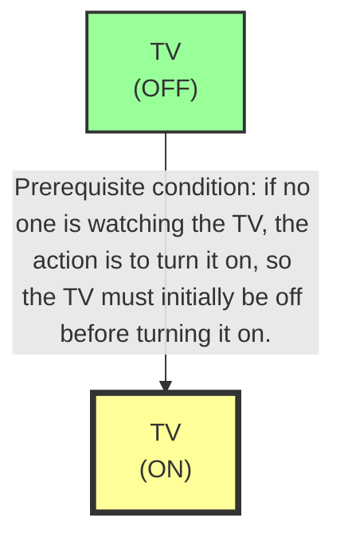
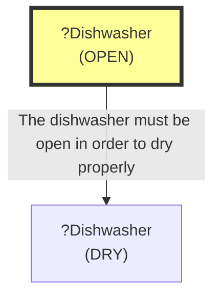
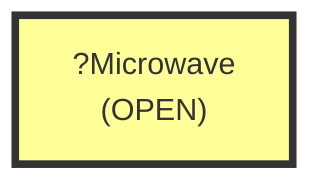

# 🚀 VirtualHome Agent Episode Log


### [GoalReasoner (Module A - Intent)] Output
```json
{
  "is_instruction_obviously_vague": true,
  "clarification_question": "What should I turn on on the TV when no one is watching it: the TV power, or something specific on the screen?",
  "target_object": "TV",
  "location_hint": null,
  "reasoning_chain": [
    {
      "question": "Why does the user want this object?",
      "answer": "To have the TV turned on when it is not being watched."
    },
    {
      "question": "Why is that important?",
      "answer": "It may be for making the TV ready for use or for keeping it active in that condition."
    },
    {
      "question": "What fundamental need does this fulfill?",
      "answer": "To control the TV's power state based on whether it is being observed."
    },
    {
      "question": "Are there any deeper psychological or physical motivations?",
      "answer": "The motivation appears to be maintaining or preparing the device in response to occupancy or attention, but the exact purpose is not explicit."
    }
  ],
  "deep_intent": "The user wants to control the TV's power state based on whether it is being watched.",
  "acceptable_alternatives_properties": [
    {
      "priority": 1,
      "description": "Other household display devices that can be powered on when unattended, such as a monitor or projector"
    },
    {
      "priority": 2,
      "description": "Other entertainment electronics that can be turned on in a room, such as a radio or speaker"
    },
    {
      "priority": 3,
      "description": "Any household device that can be activated in response to occupancy or attention, if that is the intended automation"
    },
    {
      "priority": 4,
      "description": "Other devices that provide ambient activity in a room, such as lights or a smart display"
    }
  ]
}
```

### [PerceptionFilter] Output
```json
{
  "reasoning": "The goal is to control the TV power state, so the only necessary target is the TV itself. The SDG requires the TV to be OFF before turning it ON, but that is a state requirement rather than a separate object class. No alternate device is needed because the instruction specifically targets the TV, and there is no implied need for extra tools or locations.",
  "selected_classes": [
    "character",
    "tv"
  ],
  "raw_class_count": 27
}
```

### [LLMExecutor] Output
```json
{
  "reasoning": "The task is explicitly marked vague: the instruction references turning on the TV 'when no one is watching it,' but the SDG only specifies the TV power state transition from OFF to ON. Since the user-facing intent asks what exactly to turn on, and the clarification rule is still available, I should request clarification before taking physical action.",
  "satisfied_nodes": [
    "N2"
  ],
  "current_node_focus": "N1",
  "mapped_variables": {},
  "action": "[ask] What should I turn on on the TV when no one is watching it: the TV power, or something specific on the screen?"
}
```

### [RoboStateMultiTaskController] Output
```json
{
  "action": "[ask] What should I turn on on the TV when no one is watching it: the TV power, or something specific on the screen?",
  "active_task_id": "task_1",
  "task_context": {
    "active_task_id": "task_1",
    "pending_task_ids": [
      "task_2",
      "task_3"
    ],
    "satisfied_task_ids": []
  },
  "source": "llm_executor"
}
```
## Step 0
- **Action**: `[ask] What should I turn on on the TV when no one is watching it: the TV power, or something specific on the screen?`
- **Action Success**: `True`
- **Action Message**: nothing to claim
- **Active Task**: `task_1`
- **Decision Source**: `llm_executor`
- **Task Progress**: E1_01=pending, E1_04=pending, E1_05=pending
- **SDG Status**:

- **Observed Items (7)**: tv(238) [OFF], character(1), kitchen(11), livingroom(183), bedroom(241), bathroom(285), bedroom(346)


### [PerceptionFilter] Output
```json
{
  "reasoning": "Reused cached class selection.",
  "selected_classes": [
    "character",
    "tv"
  ],
  "raw_class_count": 27
}
```

### [LLMExecutor] Output
```json
{
  "reasoning": "The clarification has already been resolved and the active SDG requires the TV to transition from OFF to ON. The TV is currently visible in the living room and has HAS_SWITCH/HAS_PLUG, so the next required step is to go near it before switching it on. Since no prior walk to the TV is in the recent history, I should move to the TV first.",
  "satisfied_nodes": [
    "N2"
  ],
  "current_node_focus": "N1",
  "mapped_variables": {},
  "action": "[walk] <tv> (238)"
}
```

### [RoboStateMultiTaskController] Output
```json
{
  "action": "[walk] <tv> (238)",
  "active_task_id": "task_1",
  "task_context": {
    "active_task_id": "task_1",
    "pending_task_ids": [
      "task_2",
      "task_3"
    ],
    "satisfied_task_ids": []
  },
  "source": "llm_executor"
}
```
## Step 1
- **Action**: `[walk] <tv> (238)`
- **Action Success**: `True`
- **Action Message**: {'0': {'message': 'Success'}}
- **Active Task**: `task_1`
- **Decision Source**: `llm_executor`
- **Task Progress**: E1_01=pending, E1_04=pending, E1_05=pending
- **SDG Status**:

- **Observed Items (7)**: tv(238) [OFF], character(1), kitchen(11), livingroom(183), bedroom(241), bathroom(285), bedroom(346)


### [PerceptionFilter] Output
```json
{
  "reasoning": "Reused cached class selection.",
  "selected_classes": [
    "character",
    "tv"
  ],
  "raw_class_count": 27
}
```

### [LLMExecutor] Output
```json
{
  "reasoning": "The active SDG requires the TV to transition from OFF to ON. The TV is already close to the character and has HAS_SWITCH and HAS_PLUG, so the next admissible action is to switch it on. The clarification was already resolved earlier, and [ask] is forbidden now. N2 is currently satisfied in the graph, and N1 is the current focus.",
  "satisfied_nodes": [
    "N2"
  ],
  "current_node_focus": "N1",
  "mapped_variables": {},
  "action": "[switchon] <tv> (238)"
}
```

### [RoboStateMultiTaskController] Output
```json
{
  "action": "[switchon] <tv> (238)",
  "active_task_id": "task_1",
  "task_context": {
    "active_task_id": "task_1",
    "pending_task_ids": [
      "task_2",
      "task_3"
    ],
    "satisfied_task_ids": []
  },
  "source": "llm_executor"
}
```
## Step 2
- **Action**: `[switchon] <tv> (238)`
- **Action Success**: `True`
- **Action Message**: Faked switch operation in Python layer (bypassed Unity failure)
- **Active Task**: `task_1`
- **Decision Source**: `llm_executor`
- **Task Progress**: E1_01=done, E1_04=pending, E1_05=pending
- **SDG Status**:

- **Observed Items (7)**: tv(238) [OFF], character(1), kitchen(11), livingroom(183), bedroom(241), bathroom(285), bedroom(346)


### [GoalReasoner (Module A - Intent)] Output
```json
{
  "is_instruction_obviously_vague": false,
  "clarification_question": null,
  "target_object": "dishwasher",
  "location_hint": null,
  "reasoning_chain": [
    {
      "question": "Why does the user want this object?",
      "answer": "To allow it to dry after use."
    },
    {
      "question": "Why is that important?",
      "answer": "To prevent moisture from remaining inside the appliance."
    },
    {
      "question": "What fundamental need does this fulfill?",
      "answer": "To reduce residual dampness and support proper maintenance of the appliance."
    },
    {
      "question": "Are there any deeper psychological or physical motivations?",
      "answer": "The user likely wants to avoid trapped moisture, lingering odor, or buildup associated with a closed, wet interior."
    }
  ],
  "deep_intent": "The user wants to reduce residual moisture in an appliance.",
  "acceptable_alternatives_properties": [
    {
      "priority": 1,
      "description": "Other ways to dry a damp appliance interior, such as leaving the door or lid open after use."
    },
    {
      "priority": 2,
      "description": "Drying methods for similar household appliances or containers that retain moisture, such as towels, racks, or ventilation."
    },
    {
      "priority": 3,
      "description": "General moisture-removal solutions in the home, such as airflow, absorbent materials, or drying time."
    },
    {
      "priority": 4,
      "description": "Any practical household method that prevents trapped humidity and supports drying."
    }
  ]
}
```

### [PerceptionFilter] Output
```json
{
  "reasoning": "The goal is to dry a dishwasher by leaving it open. The only strictly necessary object class in the दृश्य list that matches the required appliance is the dishwasher itself, but it is not visible. No alternative drying tools or required location/receptacle objects from the goal are present in the observed classes, so nothing else should be selected.",
  "selected_classes": [
    "character"
  ],
  "raw_class_count": 27
}
```

### [LLMExecutor] Output
```json
{
  "reasoning": "The active task is to make the dishwasher open so it can dry. In the current filtered graph, no dishwasher object is visible in any room, so I cannot directly interact with it yet. Since the goal is physical and the object is currently missing from observation, the autonomous next step is to search by moving to the most likely room, the kitchen, where a dishwasher would normally be located. This advances toward locating the target without violating the no-ask rule.",
  "satisfied_nodes": [],
  "current_node_focus": "N1",
  "mapped_variables": {
    "?Dishwasher": "dishwasher (unseen; search in kitchen)"
  },
  "action": "[walk] <kitchen> (11)"
}
```

### [RoboStateMultiTaskController] Output
```json
{
  "action": "[walk] <kitchen> (11)",
  "active_task_id": "task_2",
  "task_context": {
    "active_task_id": "task_2",
    "pending_task_ids": [
      "task_3"
    ],
    "satisfied_task_ids": [
      "task_1"
    ]
  },
  "source": "llm_executor"
}
```
## Step 3
- **Action**: `[walk] <kitchen> (11)`
- **Action Success**: `True`
- **Action Message**: {'0': {'message': 'Success'}}
- **Active Task**: `task_2`
- **Decision Source**: `llm_executor`
- **Task Progress**: E1_01=done, E1_04=pending, E1_05=pending
- **SDG Status**:

- **Observed Items (6)**: character(1), kitchen(11), livingroom(183), bedroom(241), bathroom(285), bedroom(346)


### [PerceptionFilter] Output
```json
{
  "reasoning": "The goal is to dry the dishwasher by leaving it open, so the only strictly necessary object class is the dishwasher itself. No extra tools or alternative appliances are required by the SDG.",
  "selected_classes": [
    "dishwasher",
    "character",
    "door"
  ],
  "raw_class_count": 59
}
```

### [LLMExecutor] Output
```json
{
  "reasoning": "The active task is to make the dishwasher dry, and the SDG requires it to be OPEN before it can dry. We are already in the kitchen, and the dishwasher is currently CLOSED. Since opening it is the immediate prerequisite and no other object manipulation is needed first, the best next step is to open the dishwasher.",
  "satisfied_nodes": [],
  "current_node_focus": "N1",
  "mapped_variables": {
    "?Dishwasher": "dishwasher(165)"
  },
  "action": "[open] <dishwasher> (165)"
}
```

### [RoboStateMultiTaskController] Output
```json
{
  "action": "[walk] <dishwasher> (165)",
  "active_task_id": "task_2",
  "task_context": {
    "active_task_id": "task_2",
    "pending_task_ids": [
      "task_3"
    ],
    "satisfied_task_ids": [
      "task_1"
    ]
  },
  "source": "llm_executor_repaired"
}
```
## Step 4
- **Action**: `[walk] <dishwasher> (165)`
- **Action Success**: `True`
- **Action Message**: {'0': {'message': 'Success'}}
- **Active Task**: `task_2`
- **Decision Source**: `llm_executor_repaired`
- **Task Progress**: E1_01=done, E1_04=pending, E1_05=pending
- **SDG Status**:

- **Observed Items (8)**: character(1), kitchen(11), livingroom(183), bedroom(241), bathroom(285), bedroom(346), door(47) [OPEN], dishwasher(165) [CLOSED,OFF]


### [PerceptionFilter] Output
```json
{
  "reasoning": "Reused cached class selection.",
  "selected_classes": [
    "dishwasher",
    "character",
    "door"
  ],
  "raw_class_count": 59
}
```

### [LLMExecutor] Output
```json
{
  "reasoning": "The active task is to make the dishwasher dry by leaving it open. The current graph shows the dishwasher is CLOSED and we are already close to it, so the next needed step is to open it. This should satisfy N1 and enable N2 (DRY) afterward.",
  "satisfied_nodes": [],
  "current_node_focus": "N1",
  "mapped_variables": {
    "?Dishwasher": "dishwasher(165)"
  },
  "action": "[open] <dishwasher> (165)"
}
```

### [RoboStateMultiTaskController] Output
```json
{
  "action": "[open] <dishwasher> (165)",
  "active_task_id": "task_2",
  "task_context": {
    "active_task_id": "task_2",
    "pending_task_ids": [
      "task_3"
    ],
    "satisfied_task_ids": [
      "task_1"
    ]
  },
  "source": "llm_executor"
}
```
## Step 5
- **Action**: `[open] <dishwasher> (165)`
- **Action Success**: `True`
- **Action Message**: {'0': {'message': 'Success'}}
- **Active Task**: `task_2`
- **Decision Source**: `llm_executor`
- **Task Progress**: E1_01=done, E1_04=done, E1_05=pending
- **SDG Status**:

- **Observed Items (8)**: character(1), kitchen(11), livingroom(183), bedroom(241), bathroom(285), bedroom(346), door(47) [OPEN], dishwasher(165) [CLOSED,OFF]


### [GoalReasoner (Module A - Intent)] Output
```json
{
  "is_instruction_obviously_vague": true,
  "clarification_question": "Do you want the microwave to be left open or closed after use?",
  "target_object": "microwave",
  "location_hint": null,
  "reasoning_chain": [
    {
      "question": "Why does the user want this object?",
      "answer": "To affect the microwave's door state for maintenance purposes."
    },
    {
      "question": "Why is that important?",
      "answer": "Keeping the door open may help with drying, ventilation, or reducing moisture buildup."
    },
    {
      "question": "What fundamental need does this fulfill?",
      "answer": "To maintain the appliance in a condition that supports hygiene and upkeep."
    },
    {
      "question": "Are there any deeper psychological or physical motivations?",
      "answer": "The user likely wants to prevent odor, moisture, or wear, but the exact intended final state is ambiguous because 'always open' conflicts with normal appliance use and may not be the desired mechanical state."
    }
  ],
  "deep_intent": "The user wants to maintain an appliance in good condition by controlling its door state.",
  "acceptable_alternatives_properties": [
    {
      "priority": 1,
      "description": "Other household appliance doors or compartments that can be left ajar for ventilation and drying, such as a dishwasher door or washing machine lid after use"
    },
    {
      "priority": 2,
      "description": "Storage spaces or cabinets that may be kept open temporarily to air out moisture"
    },
    {
      "priority": 3,
      "description": "Any enclosed household item or compartment that benefits from ventilation to reduce dampness or odor"
    },
    {
      "priority": 4,
      "description": "Items used for drying or airing out contents, such as a drying rack or open tray, if the goal is moisture reduction"
    }
  ]
}
```

### [PerceptionFilter] Output
```json
{
  "reasoning": "The goal is specifically to leave the microwave open, so the only strictly necessary target class is the microwave itself. No additional tools or locations are required by the SDG.",
  "selected_classes": [
    "microwave",
    "dishwasher",
    "character",
    "door"
  ],
  "raw_class_count": 59
}
```

### [LLMExecutor] Output
```json
{
  "reasoning": "The active task is to make the microwave OPEN, and the filtered graph shows microwave(171) is currently CLOSED. We are already in the kitchen context and no extra prerequisite is needed beyond being near the microwave; since the previous action was walking to the dishwasher, not the microwave, the next autonomous step is to walk to the microwave before opening it. This progresses directly toward satisfying N1.",
  "satisfied_nodes": [],
  "current_node_focus": "N1",
  "mapped_variables": {
    "?Microwave": "microwave(171)"
  },
  "action": "[walk] <microwave> (171)"
}
```

### [RoboStateMultiTaskController] Output
```json
{
  "action": "[walk] <microwave> (171)",
  "active_task_id": "task_3",
  "task_context": {
    "active_task_id": "task_3",
    "pending_task_ids": [],
    "satisfied_task_ids": [
      "task_1",
      "task_2"
    ]
  },
  "source": "llm_executor"
}
```
## Step 6
- **Action**: `[walk] <microwave> (171)`
- **Action Success**: `True`
- **Action Message**: {'0': {'message': 'Success'}}
- **Active Task**: `task_3`
- **Decision Source**: `llm_executor`
- **Task Progress**: E1_01=done, E1_04=done, E1_05=pending
- **SDG Status**:

- **Observed Items (9)**: character(1), kitchen(11), livingroom(183), bedroom(241), bathroom(285), bedroom(346), door(47) [OPEN], dishwasher(165) [OPEN,OFF], microwave(171) [CLOSED,OFF]


### [PerceptionFilter] Output
```json
{
  "reasoning": "Reused cached class selection.",
  "selected_classes": [
    "microwave",
    "dishwasher",
    "character",
    "door"
  ],
  "raw_class_count": 59
}
```

### [LLMExecutor] Output
```json
{
  "reasoning": "The active SDG has a single unsatisfied node: the microwave must be OPEN. The filtered graph shows I am already close to microwave(171), and it is currently CLOSED. Since opening requires proximity and no additional prerequisites (it is not a sink/container that needs special handling beyond being openable), the next atomic action is to open it.",
  "satisfied_nodes": [],
  "current_node_focus": "N1",
  "mapped_variables": {
    "?Microwave": "microwave(171)"
  },
  "action": "[open] <microwave> (171)"
}
```

### [RoboStateMultiTaskController] Output
```json
{
  "action": "[open] <microwave> (171)",
  "active_task_id": "task_3",
  "task_context": {
    "active_task_id": "task_3",
    "pending_task_ids": [],
    "satisfied_task_ids": [
      "task_1",
      "task_2"
    ]
  },
  "source": "llm_executor"
}
```
## Step 7
- **Action**: `[open] <microwave> (171)`
- **Action Success**: `True`
- **Action Message**: {'0': {'message': 'Success'}}
- **Active Task**: `task_3`
- **Decision Source**: `llm_executor`
- **Task Progress**: E1_01=done, E1_04=done, E1_05=done
- **SDG Status**:

- **Observed Items (9)**: character(1), kitchen(11), livingroom(183), bedroom(241), bathroom(285), bedroom(346), door(47) [OPEN], dishwasher(165) [OPEN,OFF], microwave(171) [CLOSED,OFF]

