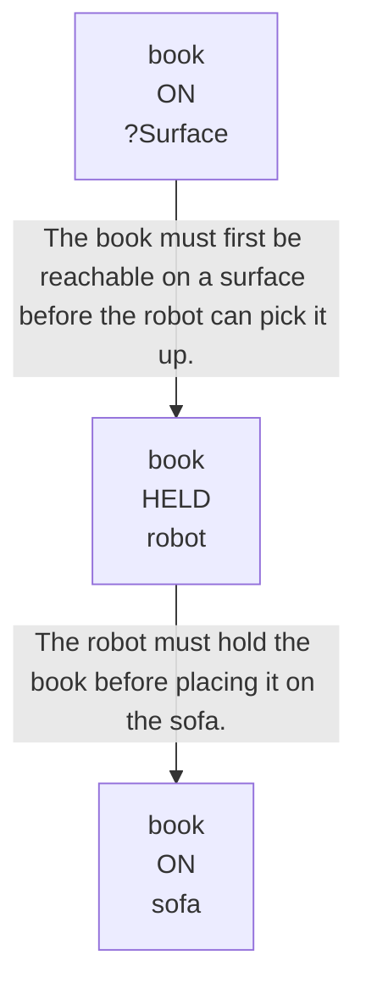
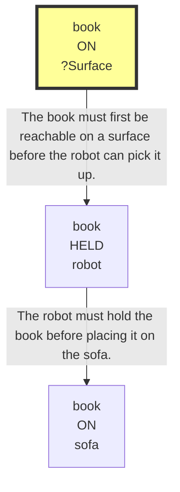
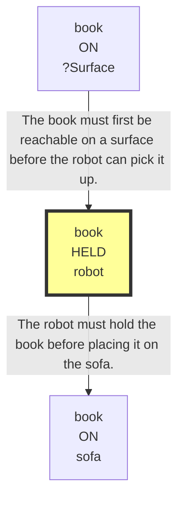
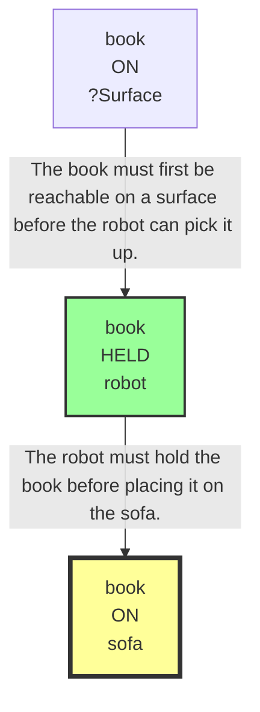
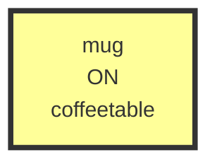
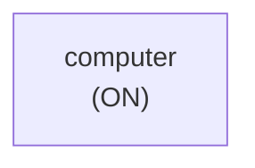
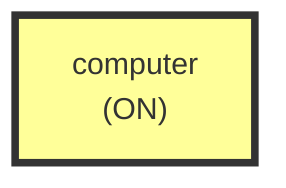

# 🚀 VirtualHome Agent Episode Log


### [GoalReasoner (Module A - Intent)] Output
```json
{
  "is_instruction_obviously_vague": true,
  "clarification_question": "Which specific book should I move, and what counts as “unorganized” in this case?",
  "target_object": "book",
  "location_hint": "sofa",
  "reasoning_chain": [
    {
      "question": "Why does the user want this object?",
      "answer": "To relocate a book they noticed somewhere unorganized."
    },
    {
      "question": "Why is that important?",
      "answer": "To improve the organization of the space by putting the book in the desired place."
    },
    {
      "question": "What fundamental need does this fulfill?",
      "answer": "It fulfills a need to tidy and organize household items."
    },
    {
      "question": "Are there any deeper psychological or physical motivations?",
      "answer": "It may reflect a desire for order, easier access to the book, or reducing clutter in the environment."
    }
  ],
  "deep_intent": "The user wants to organize a misplaced household item by moving it to the desired resting place.",
  "acceptable_alternatives_properties": [
    {
      "priority": 1,
      "description": "Other small household reading materials or similar misplaced personal items that can be relocated to the sofa area"
    },
    {
      "priority": 2,
      "description": "Other books or magazines that are out of place and should be gathered together in one seating area"
    },
    {
      "priority": 3,
      "description": "Loose paper-based items or reading materials that contribute to clutter and can be consolidated"
    },
    {
      "priority": 4,
      "description": "Any small portable household item that needs to be tidied by moving it from a disorganized spot to a designated resting area"
    }
  ]
}
```

### [RoboStateMultiTaskController] Output
```json
{
  "action": "[walk] <kitchen> (11)",
  "active_task_id": "task_2",
  "task_context": {
    "active_task_id": "task_2",
    "pending_task_ids": [
      "task_1",
      "task_3"
    ],
    "satisfied_task_ids": []
  },
  "source": "room_frontier"
}
```
## Step 0
- **Action**: `[walk] <kitchen> (11)`
- **Action Success**: `True`
- **Action Message**: {'0': {'message': 'Success'}}
- **Active Task**: `task_2`
- **Decision Source**: `room_frontier`
- **Task Progress**: E1_11=pending, E1_03=pending, E1_07=pending
- **SDG Status**:

- **Observed Items (38)**: floor(242), floor(243), floor(244), floor(245), ceiling(246), ceiling(247), ceiling(248), ceiling(249), wall(250), wall(251), wall(252), wall(253), door(254) [OPEN], ceilinglamp(255), tablelamp(256) [ON]...


### [RoboStateMultiTaskController] Output
```json
{
  "action": "[walk] <livingroom> (183)",
  "active_task_id": "task_2",
  "task_context": {
    "active_task_id": "task_2",
    "pending_task_ids": [
      "task_1",
      "task_3"
    ],
    "satisfied_task_ids": []
  },
  "source": "room_frontier"
}
```
## Step 1
- **Action**: `[walk] <livingroom> (183)`
- **Action Success**: `True`
- **Action Message**: {'0': {'message': 'Success'}}
- **Active Task**: `task_2`
- **Decision Source**: `room_frontier`
- **Task Progress**: E1_11=pending, E1_03=pending, E1_07=pending
- **SDG Status**:

- **Observed Items (192)**: floor(242), floor(243), floor(244), floor(245), ceiling(246), ceiling(247), ceiling(248), ceiling(249), wall(250), wall(251), wall(252), wall(253), door(254) [OPEN], ceilinglamp(255), tablelamp(256) [ON]...


### [PerceptionFilter] Output
```json
{
  "reasoning": "The goal is to move a book onto the sofa. The SDG requires the book itself and the sofa as the destination, plus any surface the book may currently be on so it can be picked up. Since the current surface is abstract (?Surface), the minimum visible classes that can satisfy it are common tabletop/support surfaces present in the scene: table, desk, coffeetable, bed, kitchentable, nightstand, bookshelf, and shelf-like support (wallshelf). To preserve the exact target and required destination, keep book and sofa.",
  "selected_classes": [
    "nightstand",
    "character",
    "coffeetable",
    "wallshelf",
    "bookshelf",
    "bed",
    "sofa",
    "table",
    "desk",
    "kitchentable",
    "book"
  ],
  "raw_class_count": 66
}
```

### [LLMExecutor] Output
```json
{
  "reasoning": "The active task is explicitly marked vague, and the intent asks to move a book but does not specify which book or what qualifies as 'unorganized'. Per the clarification rule, I should not guess between the multiple book candidates visible in the graph.",
  "satisfied_nodes": [],
  "current_node_focus": "N3",
  "mapped_variables": {},
  "action": "[ask] Which specific book should I move, and what counts as “unorganized” in this case?"
}
```

### [RoboStateMultiTaskController] Output
```json
{
  "action": "[ask] Which specific book should I move, and what counts as “unorganized” in this case?",
  "active_task_id": "task_2",
  "task_context": {
    "active_task_id": "task_2",
    "pending_task_ids": [
      "task_1",
      "task_3"
    ],
    "satisfied_task_ids": []
  },
  "source": "llm_executor"
}
```
## Step 2
- **Action**: `[ask] Which specific book should I move, and what counts as “unorganized” in this case?`
- **Action Success**: `True`
- **Action Message**: nothing to claim
- **Active Task**: `task_2`
- **Decision Source**: `llm_executor`
- **Task Progress**: E1_11=pending, E1_03=pending, E1_07=pending
- **SDG Status**:

- **Observed Items (25)**: book(275) [CLOSED], bookshelf(280), desk(281) [CLOSED], nightstand(282) [CLOSED], bed(284), character(1), kitchen(11), livingroom(183), bedroom(241), bathroom(285), bedroom(346), kitchentable(131), kitchentable(135), bookshelf(158), bookshelf(159)...


### [PerceptionFilter] Output
```json
{
  "reasoning": "Reused cached class selection.",
  "selected_classes": [
    "nightstand",
    "character",
    "coffeetable",
    "wallshelf",
    "bookshelf",
    "bed",
    "sofa",
    "table",
    "desk",
    "kitchentable",
    "book"
  ],
  "raw_class_count": 66
}
```

### [LLMExecutor] Output
```json
{
  "reasoning": "The clarification has already been handled, so I must proceed autonomously. The active SDG requires a book to be held before it can be placed on the sofa. In the current graph, book(105) is the only book already close to the robot in the livingroom, and it is on the coffeetable, making it reachable for the next step toward N2. I should first move to the book’s location/object before grabbing it, per proximity rules.",
  "satisfied_nodes": [
    "N3"
  ],
  "current_node_focus": "N3",
  "mapped_variables": {
    "?Surface": "coffeetable(215)"
  },
  "action": "[walk] <book> (105)"
}
```

### [RoboStateMultiTaskController] Output
```json
{
  "action": "[walk] <book> (105)",
  "active_task_id": "task_2",
  "task_context": {
    "active_task_id": "task_2",
    "pending_task_ids": [
      "task_1",
      "task_3"
    ],
    "satisfied_task_ids": []
  },
  "source": "llm_executor"
}
```
## Step 3
- **Action**: `[walk] <book> (105)`
- **Action Success**: `True`
- **Action Message**: {'0': {'message': 'Success'}}
- **Active Task**: `task_2`
- **Decision Source**: `llm_executor`
- **Task Progress**: E1_11=pending, E1_03=pending, E1_07=pending
- **SDG Status**:

- **Observed Items (25)**: book(275) [CLOSED], bookshelf(280), desk(281) [CLOSED], nightstand(282) [CLOSED], bed(284), character(1), kitchen(11), livingroom(183), bedroom(241), bathroom(285), bedroom(346), kitchentable(131), kitchentable(135), bookshelf(158), bookshelf(159)...


### [PerceptionFilter] Output
```json
{
  "reasoning": "Reused cached class selection.",
  "selected_classes": [
    "nightstand",
    "character",
    "coffeetable",
    "wallshelf",
    "bookshelf",
    "bed",
    "sofa",
    "table",
    "desk",
    "kitchentable",
    "book"
  ],
  "raw_class_count": 66
}
```

### [LLMExecutor] Output
```json
{
  "reasoning": "The clarification has already been answered, so I must proceed autonomously. The SDG requires the book to end up on the sofa (N1), which means I need to first pick up a specific book. The current graph shows book(105) is already near the robot and on the coffeetable in the living room, making it the best reachable candidate to satisfy the book relocation task. Since I am already close to it, the next atomic step is to grab it before walking to the sofa.",
  "satisfied_nodes": [],
  "current_node_focus": "N2",
  "mapped_variables": {},
  "action": "[grab] <book> (105)"
}
```

### [RoboStateMultiTaskController] Output
```json
{
  "action": "[grab] <book> (105)",
  "active_task_id": "task_2",
  "task_context": {
    "active_task_id": "task_2",
    "pending_task_ids": [
      "task_1",
      "task_3"
    ],
    "satisfied_task_ids": []
  },
  "source": "llm_executor"
}
```
## Step 4
- **Action**: `[grab] <book> (105)`
- **Action Success**: `True`
- **Action Message**: {'0': {'message': 'Success'}}
- **Active Task**: `task_2`
- **Decision Source**: `llm_executor`
- **Task Progress**: E1_11=pending, E1_03=pending, E1_07=pending
- **SDG Status**:

- **Observed Items (25)**: book(275) [CLOSED], bookshelf(280), desk(281) [CLOSED], nightstand(282) [CLOSED], bed(284), character(1), kitchen(11), livingroom(183), bedroom(241), bathroom(285), bedroom(346), kitchentable(131), kitchentable(135), bookshelf(158), bookshelf(159)...


### [PerceptionFilter] Output
```json
{
  "reasoning": "Reused cached class selection.",
  "selected_classes": [
    "nightstand",
    "character",
    "coffeetable",
    "wallshelf",
    "bookshelf",
    "bed",
    "sofa",
    "table",
    "desk",
    "kitchentable",
    "book"
  ],
  "raw_class_count": 66
}
```

### [LLMExecutor] Output
```json
{
  "reasoning": "The active task is to move a book onto the sofa. The SDG requires first holding the book (N2) and then placing it on the sofa (N1). The current graph shows the robot is already holding book(105) in the right hand and is close to the sofa(214). Therefore the next needed step is to place the held book onto the sofa. Since the sofa is a flat surface, the correct placement action is putback, and the proximity requirement is already satisfied.",
  "satisfied_nodes": [
    "N2"
  ],
  "current_node_focus": "N1",
  "mapped_variables": {},
  "action": "[putback] <book> (105) <sofa> (214)"
}
```

### [RoboStateMultiTaskController] Output
```json
{
  "action": "[putback] <book> (105) <sofa> (214)",
  "active_task_id": "task_2",
  "task_context": {
    "active_task_id": "task_2",
    "pending_task_ids": [
      "task_1",
      "task_3"
    ],
    "satisfied_task_ids": []
  },
  "source": "llm_executor"
}
```
## Step 5
- **Action**: `[putback] <book> (105) <sofa> (214)`
- **Action Success**: `True`
- **Action Message**: {'0': {'message': 'Success'}}
- **Active Task**: `task_2`
- **Decision Source**: `llm_executor`
- **Task Progress**: E1_11=pending, E1_03=done, E1_07=pending
- **SDG Status**:

- **Observed Items (25)**: book(275) [CLOSED], bookshelf(280), desk(281) [CLOSED], nightstand(282) [CLOSED], bed(284), character(1), kitchen(11), livingroom(183), bedroom(241), bathroom(285), bedroom(346), kitchentable(131), kitchentable(135), bookshelf(158), bookshelf(159)...


### [GoalReasoner (Module A - Intent)] Output
```json
{
  "is_instruction_obviously_vague": false,
  "clarification_question": null,
  "target_object": "mug",
  "location_hint": "coffeetable",
  "reasoning_chain": [
    {
      "question": "Why does the user want this object?",
      "answer": "The mug is intended to be kept on the coffee table."
    },
    {
      "question": "Why is that important?",
      "answer": "The user wants the mug maintained in a specific physical location."
    },
    {
      "question": "What fundamental need does this fulfill?",
      "answer": "It fulfills the need to keep an item consistently placed where the user expects it to be."
    },
    {
      "question": "Are there any deeper psychological or physical motivations?",
      "answer": "This may support convenience, organization, and reducing the chance of the mug being misplaced or cluttering other surfaces."
    }
  ],
  "deep_intent": "The user wants an item to remain consistently in a designated location for organization and convenience.",
  "acceptable_alternatives_properties": [
    {
      "priority": 1,
      "description": "Other drink containers or similar handheld vessels that can be kept in the same designated spot, such as a cup or glass"
    },
    {
      "priority": 2,
      "description": "Small tabletop personal items that are commonly kept in one place, such as a coaster or small bowl"
    },
    {
      "priority": 3,
      "description": "Other everyday objects that benefit from being stored on a coffee table for easy access, such as a remote control or notebook"
    },
    {
      "priority": 4,
      "description": "Any portable household item the user wants to keep consistently accessible and not misplaced"
    }
  ]
}
```

### [PerceptionFilter] Output
```json
{
  "reasoning": "The goal is to keep the mug on the coffeetable, so the only strictly necessary classes are the target container and the designated location. No tool is required since this is a placement/organization task, not a preparation task.",
  "selected_classes": [
    "mug",
    "character",
    "coffeetable",
    "book"
  ],
  "raw_class_count": 66
}
```

### [LLMExecutor] Output
```json
{
  "reasoning": "The active goal is to have the mug on the coffeetable. The mug(384) is currently in the kitchen, while the coffeetable(215) is in the livingroom and the character is already close to the coffeetable. I cannot put the mug onto the table until I am holding it, so the next required step is to move to the mug's location before grabbing it. This starts the transport sequence toward the final SDG node N1.",
  "satisfied_nodes": [],
  "current_node_focus": "N1",
  "mapped_variables": {},
  "action": "[walk] <mug> (384)"
}
```

### [RoboStateMultiTaskController] Output
```json
{
  "action": "[walk] <mug> (384)",
  "active_task_id": "task_3",
  "task_context": {
    "active_task_id": "task_3",
    "pending_task_ids": [
      "task_1"
    ],
    "satisfied_task_ids": [
      "task_2"
    ]
  },
  "source": "llm_executor"
}
```
## Step 6
- **Action**: `[walk] <mug> (384)`
- **Action Success**: `True`
- **Action Message**: {'0': {'message': 'Success'}}
- **Active Task**: `task_3`
- **Decision Source**: `llm_executor`
- **Task Progress**: E1_11=pending, E1_03=done, E1_07=pending
- **SDG Status**:

- **Observed Items (12)**: book(275) [CLOSED], character(1), kitchen(11), livingroom(183), bedroom(241), bathroom(285), bedroom(346), mug(384), coffeetable(215), book(229) [CLOSED], book(230) [CLOSED], book(105) [CLOSED]


### [PerceptionFilter] Output
```json
{
  "reasoning": "Reused cached class selection.",
  "selected_classes": [
    "mug",
    "character",
    "coffeetable",
    "book"
  ],
  "raw_class_count": 66
}
```

### [LLMExecutor] Output
```json
{
  "reasoning": "The active goal is to ensure mug(384) is on coffeetable(215). The current graph shows the mug is close to the character but not on the coffeetable yet, and the coffeetable is also close. Since placing onto a surface requires being explicitly near the destination first, the next step should be to walk to the coffeetable before attempting to put the mug down. The mug is already the correct target object for the task.",
  "satisfied_nodes": [],
  "current_node_focus": "N1",
  "mapped_variables": {
    "?TargetObject": "mug(384)",
    "?Surface": "coffeetable(215)"
  },
  "action": "[walk] <coffeetable> (215)"
}
```

### [RoboStateMultiTaskController] Output
```json
{
  "action": "[walk] <coffeetable> (215)",
  "active_task_id": "task_3",
  "task_context": {
    "active_task_id": "task_3",
    "pending_task_ids": [
      "task_1"
    ],
    "satisfied_task_ids": [
      "task_2"
    ]
  },
  "source": "llm_executor"
}
```
## Step 7
- **Action**: `[walk] <coffeetable> (215)`
- **Action Success**: `True`
- **Action Message**: {'0': {'message': 'Success'}}
- **Active Task**: `task_3`
- **Decision Source**: `llm_executor`
- **Task Progress**: E1_11=pending, E1_03=done, E1_07=pending
- **SDG Status**:

- **Observed Items (12)**: book(275) [CLOSED], character(1), kitchen(11), livingroom(183), bedroom(241), bathroom(285), bedroom(346), mug(384), coffeetable(215), book(229) [CLOSED], book(230) [CLOSED], book(105) [CLOSED]


### [PerceptionFilter] Output
```json
{
  "reasoning": "Reused cached class selection.",
  "selected_classes": [
    "mug",
    "character",
    "coffeetable",
    "book"
  ],
  "raw_class_count": 66
}
```

### [LLMExecutor] Output
```json
{
  "reasoning": "The active goal is to keep mug(384) on coffeetable(215). The character is already CLOSE to both the mug and the coffeetable, but the mug is currently INSIDE kitchen(11), so it is not yet on the coffee table. Since I am already near the mug and the table, the next step is to grab the mug before moving or placing it on the coffee table.",
  "satisfied_nodes": [],
  "current_node_focus": "N1",
  "mapped_variables": {
    "?TargetMug": "mug(384)",
    "?TargetSurface": "coffeetable(215)"
  },
  "action": "[grab] <mug> (384)"
}
```

### [RoboStateMultiTaskController] Output
```json
{
  "action": "[grab] <mug> (384)",
  "active_task_id": "task_3",
  "task_context": {
    "active_task_id": "task_3",
    "pending_task_ids": [
      "task_1"
    ],
    "satisfied_task_ids": [
      "task_2"
    ]
  },
  "source": "llm_executor"
}
```
## Step 8
- **Action**: `[grab] <mug> (384)`
- **Action Success**: `True`
- **Action Message**: {'0': {'message': 'Success'}}
- **Active Task**: `task_3`
- **Decision Source**: `llm_executor`
- **Task Progress**: E1_11=pending, E1_03=done, E1_07=pending
- **SDG Status**:

- **Observed Items (12)**: book(275) [CLOSED], character(1), kitchen(11), livingroom(183), bedroom(241), bathroom(285), bedroom(346), mug(384), coffeetable(215), book(229) [CLOSED], book(230) [CLOSED], book(105) [CLOSED]


### [PerceptionFilter] Output
```json
{
  "reasoning": "Reused cached class selection.",
  "selected_classes": [
    "mug",
    "character",
    "coffeetable",
    "book"
  ],
  "raw_class_count": 66
}
```

### [LLMExecutor] Output
```json
{
  "reasoning": "The active goal is to place the mug on the coffee table. The character is already holding mug(384) and is close to coffeetable(215), so the remaining step is to place the held mug onto that flat surface. This directly satisfies N1.",
  "satisfied_nodes": [],
  "current_node_focus": "N1",
  "mapped_variables": {},
  "action": "[putback] <mug> (384) <coffeetable> (215)"
}
```

### [RoboStateMultiTaskController] Output
```json
{
  "action": "[putback] <mug> (384) <coffeetable> (215)",
  "active_task_id": "task_3",
  "task_context": {
    "active_task_id": "task_3",
    "pending_task_ids": [
      "task_1"
    ],
    "satisfied_task_ids": [
      "task_2"
    ]
  },
  "source": "llm_executor"
}
```
## Step 9
- **Action**: `[putback] <mug> (384) <coffeetable> (215)`
- **Action Success**: `True`
- **Action Message**: {'0': {'message': 'Success'}}
- **Active Task**: `task_3`
- **Decision Source**: `llm_executor`
- **Task Progress**: E1_11=pending, E1_03=done, E1_07=done
- **SDG Status**:

- **Observed Items (12)**: book(275) [CLOSED], character(1), kitchen(11), livingroom(183), bedroom(241), bathroom(285), bedroom(346), mug(384), coffeetable(215), book(229) [CLOSED], book(230) [CLOSED], book(105) [CLOSED]


### [GoalReasoner (Module A - Intent)] Output
```json
{
  "is_instruction_obviously_vague": true,
  "clarification_question": "What should I do if the computer is currently off—turn it on?",
  "target_object": "computer",
  "location_hint": null,
  "reasoning_chain": [
    {
      "question": "Why does the user want this object?",
      "answer": "To have the computer powered on instead of staying off."
    },
    {
      "question": "Why is that important?",
      "answer": "Because the computer needs to be on for use or operation."
    },
    {
      "question": "What fundamental need does this fulfill?",
      "answer": "It fulfills the need to make a computer available for use."
    },
    {
      "question": "Are there any deeper psychological or physical motivations?",
      "answer": "The user likely wants to enable access to computing functions, such as work, communication, or other tasks."
    }
  ],
  "deep_intent": "The user wants to enable access to a computer for use.",
  "acceptable_alternatives_properties": [
    {
      "priority": 1,
      "description": "Other powered-on computing devices, such as a laptop or tablet"
    },
    {
      "priority": 2,
      "description": "Other usable electronic devices that provide similar functionality, such as a desktop computer or all-in-one PC"
    },
    {
      "priority": 3,
      "description": "Any nearby device that can support the same task, such as a smart display or phone"
    },
    {
      "priority": 4,
      "description": "Non-computer alternatives for accessing information or communication, such as a paper notebook or landline phone"
    }
  ]
}
```

### [RoboStateMultiTaskController] Output
```json
{
  "action": "[walk] <bathroom> (285)",
  "active_task_id": "task_1",
  "task_context": {
    "active_task_id": "task_1",
    "pending_task_ids": [],
    "satisfied_task_ids": [
      "task_2",
      "task_3"
    ]
  },
  "source": "room_frontier"
}
```
## Step 10
- **Action**: `[walk] <bathroom> (285)`
- **Action Success**: `True`
- **Action Message**: {'0': {'message': 'Success'}}
- **Active Task**: `task_1`
- **Decision Source**: `room_frontier`
- **Task Progress**: E1_11=pending, E1_03=done, E1_07=done
- **SDG Status**:

- **Observed Items (245)**: floor(242), floor(243), floor(244), floor(245), ceiling(246), ceiling(247), ceiling(248), ceiling(249), wall(250), wall(251), wall(252), wall(253), door(254) [OPEN], ceilinglamp(255), tablelamp(256) [ON]...


### [RoboStateMultiTaskController] Output
```json
{
  "action": "[walk] <bedroom> (346)",
  "active_task_id": "task_1",
  "task_context": {
    "active_task_id": "task_1",
    "pending_task_ids": [],
    "satisfied_task_ids": [
      "task_2",
      "task_3"
    ]
  },
  "source": "room_frontier"
}
```
## Step 11
- **Action**: `[walk] <bedroom> (346)`
- **Action Success**: `True`
- **Action Message**: {'0': {'message': 'Success'}}
- **Active Task**: `task_1`
- **Decision Source**: `room_frontier`
- **Task Progress**: E1_11=pending, E1_03=done, E1_07=done
- **SDG Status**:

- **Observed Items (305)**: floor(242), floor(243), floor(244), floor(245), ceiling(246), ceiling(247), ceiling(248), ceiling(249), wall(250), wall(251), wall(252), wall(253), door(254) [OPEN], ceilinglamp(255), tablelamp(256) [ON]...


### [PerceptionFilter] Output
```json
{
  "reasoning": "The goal and SDG require the computer to be ON. The only necessary class is the computer itself, since turning it on directly satisfies the required state. No alternative device is needed because the target is explicit and the task is state-based, not an open-ended replacement task.",
  "selected_classes": [
    "desk",
    "character",
    "book",
    "computer"
  ],
  "raw_class_count": 91
}
```

### [LLMExecutor] Output
```json
{
  "reasoning": "The active goal is to satisfy N1: computer(397) must be ON. The current graph shows the computer is in bedroom(346) and is currently OFF. We are already in bedroom(346), so the next needed step is to interact with the computer directly. Since it has HAS_SWITCH and no plug requirement is shown, the appropriate action is to switch it on.",
  "satisfied_nodes": [],
  "current_node_focus": "N1",
  "mapped_variables": {
    ":computer": "computer(397)"
  },
  "action": "[switchon] <computer> (397)"
}
```

### [RoboStateMultiTaskController] Output
```json
{
  "action": "[walk] <computer> (397)",
  "active_task_id": "task_1",
  "task_context": {
    "active_task_id": "task_1",
    "pending_task_ids": [],
    "satisfied_task_ids": [
      "task_2",
      "task_3"
    ]
  },
  "source": "llm_executor_repaired"
}
```
## Step 12
- **Action**: `[walk] <computer> (397)`
- **Action Success**: `True`
- **Action Message**: {'0': {'message': 'Success'}}
- **Active Task**: `task_1`
- **Decision Source**: `llm_executor_repaired`
- **Task Progress**: E1_11=pending, E1_03=done, E1_07=done
- **SDG Status**:

- **Observed Items (13)**: book(275) [CLOSED], desk(281) [CLOSED], character(1), kitchen(11), livingroom(183), bedroom(241), bathroom(285), bedroom(346), book(229) [CLOSED], book(230) [CLOSED], book(105) [CLOSED], desk(393) [CLOSED], computer(397) [OFF]


### [PerceptionFilter] Output
```json
{
  "reasoning": "Reused cached class selection.",
  "selected_classes": [
    "desk",
    "character",
    "book",
    "computer"
  ],
  "raw_class_count": 91
}
```

### [LLMExecutor] Output
```json
{
  "reasoning": "The active SDG has a single unmet node: the computer must be ON. The filtered graph shows computer(397) is already CLOSE to the character and is currently OFF. Since it has HAS_SWITCH and no plug requirement is indicated, the correct next atomic action is to switch it on directly.",
  "satisfied_nodes": [],
  "current_node_focus": "N1",
  "mapped_variables": {},
  "action": "[switchon] <computer> (397)"
}
```

### [RoboStateMultiTaskController] Output
```json
{
  "action": "[switchon] <computer> (397)",
  "active_task_id": "task_1",
  "task_context": {
    "active_task_id": "task_1",
    "pending_task_ids": [],
    "satisfied_task_ids": [
      "task_2",
      "task_3"
    ]
  },
  "source": "llm_executor"
}
```
## Step 13
- **Action**: `[switchon] <computer> (397)`
- **Action Success**: `True`
- **Action Message**: Faked switch operation in Python layer (bypassed Unity failure)
- **Active Task**: `task_1`
- **Decision Source**: `llm_executor`
- **Task Progress**: E1_11=done, E1_03=done, E1_07=done
- **SDG Status**:

- **Observed Items (13)**: book(275) [CLOSED], desk(281) [CLOSED], character(1), kitchen(11), livingroom(183), bedroom(241), bathroom(285), bedroom(346), book(229) [CLOSED], book(230) [CLOSED], book(105) [CLOSED], desk(393) [CLOSED], computer(397) [OFF]

