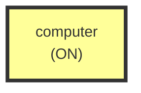
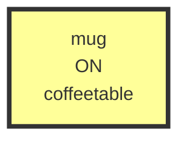

# 🚀 VirtualHome Agent Episode Log


### [GoalReasoner (Module A - Intent)] Output
```json
{
  "is_instruction_obviously_vague": false,
  "clarification_question": null,
  "target_object": "computer",
  "location_hint": null,
  "reasoning_chain": [
    {
      "question": "Why does the user want this object?",
      "answer": "To have the computer powered on instead of remaining off."
    },
    {
      "question": "Why is that important?",
      "answer": "Because an off computer cannot be used to perform tasks or provide access to information and services."
    },
    {
      "question": "What fundamental need does this fulfill?",
      "answer": "It fulfills the need to use a functioning computing device."
    },
    {
      "question": "Are there any deeper psychological or physical motivations?",
      "answer": "The user likely wants to continue an activity that depends on the computer being available and operational."
    }
  ],
  "deep_intent": "The user wants a functioning computer available for use.",
  "acceptable_alternatives_properties": [
    {
      "priority": 1,
      "description": "Another working computer or similar computing device, such as a laptop or desktop, that can be powered on and used."
    },
    {
      "priority": 2,
      "description": "A nearby tablet or all-in-one device that can provide similar digital access if the original computer cannot be turned on."
    },
    {
      "priority": 3,
      "description": "Any household electronic device that can fulfill the same immediate computing task, such as a workstation or replacement computer."
    },
    {
      "priority": 4,
      "description": "A different device that allows access to the needed information or service, if computing power itself is not strictly required."
    }
  ]
}
```

### [PerceptionFilter] Output
```json
{
  "reasoning": "The goal is to have the computer powered on, so the target object class computer must be kept. Since the SDG only requires the computer to be in the ON state, no additional tools, locations, or receptacles are needed.",
  "selected_classes": [
    "desk",
    "character",
    "computer"
  ],
  "raw_class_count": 33
}
```

### [LLMExecutor] Output
```json
{
  "reasoning": "The active task is to turn the computer on. The computer is visible in the current bedroom and has the state OFF with HAS_SWITCH, so the next necessary step is to get near it before switching it on. No other prerequisite like opening a container is needed.",
  "satisfied_nodes": [],
  "current_node_focus": "N1",
  "mapped_variables": {},
  "action": "[walk] <computer> (174)"
}
```

### [RoboStateMultiTaskController] Output
```json
{
  "action": "[walk] <computer> (174)",
  "active_task_id": "task_1",
  "task_context": {
    "active_task_id": "task_1",
    "pending_task_ids": [
      "task_2",
      "task_3"
    ],
    "satisfied_task_ids": []
  },
  "source": "llm_executor"
}
```
## Step 0
- **Action**: `[walk] <computer> (174)`
- **Action Success**: `True`
- **Action Message**: {'0': {'message': 'Success'}}
- **Active Task**: `task_1`
- **Decision Source**: `llm_executor`
- **Task Progress**: E1_11=pending, E1_03=pending, E1_07=pending
- **SDG Status**:

- **Observed Items (7)**: desk(108) [CLOSED], computer(174) [OFF], character(1), bathroom(11), bedroom(73), kitchen(205), livingroom(335)


### [PerceptionFilter] Output
```json
{
  "reasoning": "Reused cached class selection.",
  "selected_classes": [
    "desk",
    "character",
    "computer"
  ],
  "raw_class_count": 33
}
```

### [LLMExecutor] Output
```json
{
  "reasoning": "The active goal is to satisfy N1 by turning the computer ON. The filtered graph shows computer(174) is already CLOSE to the character and has the HAS_SWITCH property, so the next direct action is to switch it on. No other prerequisites are needed.",
  "satisfied_nodes": [],
  "current_node_focus": "N1",
  "mapped_variables": {},
  "action": "[switchon] <computer> (174)"
}
```

### [RoboStateMultiTaskController] Output
```json
{
  "action": "[switchon] <computer> (174)",
  "active_task_id": "task_1",
  "task_context": {
    "active_task_id": "task_1",
    "pending_task_ids": [
      "task_2",
      "task_3"
    ],
    "satisfied_task_ids": []
  },
  "source": "llm_executor"
}
```
## Step 1
- **Action**: `[switchon] <computer> (174)`
- **Action Success**: `True`
- **Action Message**: Faked switch operation in Python layer (bypassed Unity failure)
- **Active Task**: `task_1`
- **Decision Source**: `llm_executor`
- **Task Progress**: E1_11=done, E1_03=pending, E1_07=pending
- **SDG Status**:

- **Observed Items (7)**: desk(108) [CLOSED], computer(174) [OFF], character(1), bathroom(11), bedroom(73), kitchen(205), livingroom(335)


### [GoalReasoner (Module A - Intent)] Output
```json
{
  "is_instruction_obviously_vague": false,
  "clarification_question": null,
  "target_object": "book",
  "location_hint": "sofa",
  "reasoning_chain": [
    {
      "question": "Why does the user want this object?",
      "answer": "To move an unorganized book to the sofa."
    },
    {
      "question": "Why is that important?",
      "answer": "To place the book in a specific, organized resting location."
    },
    {
      "question": "What fundamental need does this fulfill?",
      "answer": "To organize and tidy the environment."
    },
    {
      "question": "Are there any deeper psychological or physical motivations?",
      "answer": "It may reduce clutter, make the space look orderly, and keep the book accessible."
    }
  ],
  "deep_intent": "The user wants to reduce clutter by organizing a misplaced item into a designated resting place.",
  "acceptable_alternatives_properties": [
    {
      "priority": 1,
      "description": "Other small portable reading materials or similar loose items that can be placed on the sofa instead of a book"
    },
    {
      "priority": 2,
      "description": "Magazines, notebooks, or documents that serve a similar organizing function in a living area"
    },
    {
      "priority": 3,
      "description": "Other household items that are out of place and can be moved to a tidier surface or seating area"
    },
    {
      "priority": 4,
      "description": "Any manageable portable object that can be relocated to reduce visible clutter"
    }
  ]
}
```

### [RoboStateMultiTaskController] Output
```json
{
  "action": "[walk] <bathroom> (11)",
  "active_task_id": "task_2",
  "task_context": {
    "active_task_id": "task_2",
    "pending_task_ids": [
      "task_3"
    ],
    "satisfied_task_ids": [
      "task_1"
    ]
  },
  "source": "room_frontier"
}
```
## Step 2
- **Action**: `[walk] <bathroom> (11)`
- **Action Success**: `True`
- **Action Message**: {'0': {'message': 'Success'}}
- **Active Task**: `task_2`
- **Decision Source**: `room_frontier`
- **Task Progress**: E1_11=done, E1_03=pending, E1_07=pending
- **SDG Status**:

- **Observed Items (74)**: floor(74), floor(75), floor(76), floor(77), floor(78), floor(79), floor(80), floor(81), floor(82), wall(83), wall(84), wall(85), wall(86), wall(87), wall(88)...


### [RoboStateMultiTaskController] Output
```json
{
  "action": "[walk] <kitchen> (205)",
  "active_task_id": "task_2",
  "task_context": {
    "active_task_id": "task_2",
    "pending_task_ids": [
      "task_3"
    ],
    "satisfied_task_ids": [
      "task_1"
    ]
  },
  "source": "room_frontier"
}
```
## Step 3
- **Action**: `[walk] <kitchen> (205)`
- **Action Success**: `True`
- **Action Message**: {'0': {'message': 'Success'}}
- **Active Task**: `task_2`
- **Decision Source**: `room_frontier`
- **Task Progress**: E1_11=done, E1_03=pending, E1_07=pending
- **SDG Status**:

- **Observed Items (135)**: floor(74), floor(75), floor(76), floor(77), floor(78), floor(79), floor(80), floor(81), floor(82), wall(83), wall(84), wall(85), wall(86), wall(87), wall(88)...


### [RoboStateMultiTaskController] Output
```json
{
  "action": "[walk] <livingroom> (335)",
  "active_task_id": "task_2",
  "task_context": {
    "active_task_id": "task_2",
    "pending_task_ids": [
      "task_3"
    ],
    "satisfied_task_ids": [
      "task_1"
    ]
  },
  "source": "room_frontier"
}
```
## Step 4
- **Action**: `[walk] <livingroom> (335)`
- **Action Success**: `True`
- **Action Message**: {'0': {'message': 'Success'}}
- **Active Task**: `task_2`
- **Decision Source**: `room_frontier`
- **Task Progress**: E1_11=done, E1_03=pending, E1_07=pending
- **SDG Status**:

- **Observed Items (243)**: floor(74), floor(75), floor(76), floor(77), floor(78), floor(79), floor(80), floor(81), floor(82), wall(83), wall(84), wall(85), wall(86), wall(87), wall(88)...


### [PerceptionFilter] Output
```json
{
  "reasoning": "The goal requires placing the book on the sofa. The only strictly necessary classes are the target object and the destination location; no extra tools are needed for a simple relocation task.",
  "selected_classes": [
    "sofa",
    "character",
    "book"
  ],
  "raw_class_count": 101
}
```

### [LLMExecutor] Output
```json
{
  "reasoning": "The active goal is to place a book on the sofa. The character is already close to sofa(368), and the only suitable nearby book is book(268), which is in the kitchen and therefore not immediately accessible from the current position. Since the next required step toward satisfying N1 is to reach the book before grabbing it, I should move to book(268) now.",
  "satisfied_nodes": [],
  "current_node_focus": "N1",
  "mapped_variables": {},
  "action": "[walk] <book> (268)"
}
```

### [RoboStateMultiTaskController] Output
```json
{
  "action": "[walk] <book> (268)",
  "active_task_id": "task_2",
  "task_context": {
    "active_task_id": "task_2",
    "pending_task_ids": [
      "task_3"
    ],
    "satisfied_task_ids": [
      "task_1"
    ]
  },
  "source": "llm_executor"
}
```
## Step 5
- **Action**: `[walk] <book> (268)`
- **Action Success**: `True`
- **Action Message**: {'0': {'message': 'Success'}}
- **Active Task**: `task_2`
- **Decision Source**: `llm_executor`
- **Task Progress**: E1_11=done, E1_03=pending, E1_07=pending
- **SDG Status**:

- **Observed Items (8)**: book(190) [CLOSED], character(1), bathroom(11), bedroom(73), kitchen(205), livingroom(335), book(268) [CLOSED], sofa(368)


### [PerceptionFilter] Output
```json
{
  "reasoning": "Reused cached class selection.",
  "selected_classes": [
    "sofa",
    "character",
    "book"
  ],
  "raw_class_count": 101
}
```

### [LLMExecutor] Output
```json
{
  "reasoning": "The active goal is to place a book on the sofa. The current graph shows book(268) is already close to the character, and sofa(368) is also close to the character in the living room. Since the book is reachable and the sofa is the target surface, the next required step is to pick up the book before walking to the sofa and putting it back. I will focus on satisfying N1 by grabbing the nearby book(268).",
  "satisfied_nodes": [],
  "current_node_focus": "N1",
  "mapped_variables": {},
  "action": "[grab] <book> (268)"
}
```

### [RoboStateMultiTaskController] Output
```json
{
  "action": "[grab] <book> (268)",
  "active_task_id": "task_2",
  "task_context": {
    "active_task_id": "task_2",
    "pending_task_ids": [
      "task_3"
    ],
    "satisfied_task_ids": [
      "task_1"
    ]
  },
  "source": "llm_executor"
}
```
## Step 6
- **Action**: `[grab] <book> (268)`
- **Action Success**: `True`
- **Action Message**: {'0': {'message': 'Success'}}
- **Active Task**: `task_2`
- **Decision Source**: `llm_executor`
- **Task Progress**: E1_11=done, E1_03=pending, E1_07=pending
- **SDG Status**:

- **Observed Items (8)**: book(190) [CLOSED], character(1), bathroom(11), bedroom(73), kitchen(205), livingroom(335), book(268) [CLOSED], sofa(368)


### [PerceptionFilter] Output
```json
{
  "reasoning": "Reused cached class selection.",
  "selected_classes": [
    "sofa",
    "character",
    "book"
  ],
  "raw_class_count": 101
}
```

### [LLMExecutor] Output
```json
{
  "reasoning": "The active goal is to place a book on the sofa. I am currently holding book(268), and the sofa(368) is already close to the character. The next required step is to move the held book onto the sofa. Since putback onto a surface requires being near the destination and the sofa is a valid flat/sittable surface, the correct next atomic action is to put the held book back onto the sofa.",
  "satisfied_nodes": [],
  "current_node_focus": "N1",
  "mapped_variables": {},
  "action": "[putback] <book> (268) <sofa> (368)"
}
```

### [RoboStateMultiTaskController] Output
```json
{
  "action": "[putback] <book> (268) <sofa> (368)",
  "active_task_id": "task_2",
  "task_context": {
    "active_task_id": "task_2",
    "pending_task_ids": [
      "task_3"
    ],
    "satisfied_task_ids": [
      "task_1"
    ]
  },
  "source": "llm_executor"
}
```
## Step 7
- **Action**: `[putback] <book> (268) <sofa> (368)`
- **Action Success**: `True`
- **Action Message**: {'0': {'message': 'Success'}}
- **Active Task**: `task_2`
- **Decision Source**: `llm_executor`
- **Task Progress**: E1_11=done, E1_03=done, E1_07=pending
- **SDG Status**:

- **Observed Items (8)**: book(190) [CLOSED], character(1), bathroom(11), bedroom(73), kitchen(205), livingroom(335), book(268) [CLOSED], sofa(368)


### [GoalReasoner (Module A - Intent)] Output
```json
{
  "is_instruction_obviously_vague": false,
  "clarification_question": null,
  "target_object": "mug",
  "location_hint": "coffeetable",
  "reasoning_chain": [
    {
      "question": "Why does the user want this object?",
      "answer": "They want the mug to be kept on the coffee table."
    },
    {
      "question": "Why is that important?",
      "answer": "They likely want the mug to remain in a consistent, expected location."
    },
    {
      "question": "What fundamental need does this fulfill?",
      "answer": "It supports organization and easy access to the mug."
    },
    {
      "question": "Are there any deeper psychological or physical motivations?",
      "answer": "It may reduce clutter, prevent misplacement, and make the mug readily available when needed."
    }
  ],
  "deep_intent": "The user wants to keep an item organized and readily accessible in a consistent location.",
  "acceptable_alternatives_properties": [
    {
      "priority": 1,
      "description": "Other small drink containers or tabletop personal items that can be kept on the coffee table in the same spot."
    },
    {
      "priority": 2,
      "description": "Similar household items commonly stored on a coffee table, such as cups, glasses, or coasters."
    },
    {
      "priority": 3,
      "description": "Other small everyday items that help maintain an organized tabletop, such as remotes, notebooks, or keys."
    },
    {
      "priority": 4,
      "description": "Any compact household object that can be placed on the coffee table to satisfy the preference for a fixed, accessible location."
    }
  ]
}
```

### [PerceptionFilter] Output
```json
{
  "reasoning": "The goal and SDG require keeping the mug on the coffeetable. So the only strictly necessary classes are the target object and its required location. No tools or alternative receptacles are needed for this placement task.",
  "selected_classes": [
    "mug",
    "character",
    "coffeetable",
    "book"
  ],
  "raw_class_count": 101
}
```

### [LLMExecutor] Output
```json
{
  "reasoning": "The active SDG requires a mug to be ON the coffeetable. In the current graph, mug(447) is already in the livingroom and the character is CLOSE to coffeetable(371), so the best next step is to move to the specific destination surface. The mug is not yet being held, and placement actions require explicit proximity to the destination first. I will therefore walk to coffeetable(371) before any grab/putback sequence.",
  "satisfied_nodes": [],
  "current_node_focus": "N1",
  "mapped_variables": {
    "?TargetSurface": "coffeetable(371)",
    "?Mug": "mug(447)"
  },
  "action": "[walk] <coffeetable> (371)"
}
```

### [RoboStateMultiTaskController] Output
```json
{
  "action": "[walk] <coffeetable> (371)",
  "active_task_id": "task_3",
  "task_context": {
    "active_task_id": "task_3",
    "pending_task_ids": [],
    "satisfied_task_ids": [
      "task_1",
      "task_2"
    ]
  },
  "source": "llm_executor"
}
```
## Step 8
- **Action**: `[walk] <coffeetable> (371)`
- **Action Success**: `True`
- **Action Message**: {'0': {'message': 'Success'}}
- **Active Task**: `task_3`
- **Decision Source**: `llm_executor`
- **Task Progress**: E1_11=done, E1_03=done, E1_07=pending
- **SDG Status**:

- **Observed Items (11)**: coffeetable(111), book(190) [CLOSED], character(1), bathroom(11), bedroom(73), kitchen(205), livingroom(335), book(268) [CLOSED], mug(194), coffeetable(371), mug(447)


### [PerceptionFilter] Output
```json
{
  "reasoning": "Reused cached class selection.",
  "selected_classes": [
    "mug",
    "character",
    "coffeetable",
    "book"
  ],
  "raw_class_count": 101
}
```

### [LLMExecutor] Output
```json
{
  "reasoning": "The goal is to have a mug ON the coffeetable. We are already close to coffeetable(371), so the next step should be to bring a suitable mug to this surface. The current graph shows mug(447) in the livingroom, which is the best nearby candidate and does not require leaving the room. Since we are not yet holding it, we must first walk to the mug before grabbing it; this is the correct next atomic step toward satisfying N1.",
  "satisfied_nodes": [],
  "current_node_focus": "N1",
  "mapped_variables": {
    "?TargetSurface": "coffeetable(371)",
    "?Mug": "mug(447)"
  },
  "action": "[walk] <mug> (447)"
}
```

### [RoboStateMultiTaskController] Output
```json
{
  "action": "[walk] <mug> (447)",
  "active_task_id": "task_3",
  "task_context": {
    "active_task_id": "task_3",
    "pending_task_ids": [],
    "satisfied_task_ids": [
      "task_1",
      "task_2"
    ]
  },
  "source": "llm_executor"
}
```
## Step 9
- **Action**: `[walk] <mug> (447)`
- **Action Success**: `True`
- **Action Message**: {'0': {'message': 'Success'}}
- **Active Task**: `task_3`
- **Decision Source**: `llm_executor`
- **Task Progress**: E1_11=done, E1_03=done, E1_07=pending
- **SDG Status**:

- **Observed Items (11)**: coffeetable(111), book(190) [CLOSED], character(1), bathroom(11), bedroom(73), kitchen(205), livingroom(335), book(268) [CLOSED], mug(194), coffeetable(371), mug(447)


### [PerceptionFilter] Output
```json
{
  "reasoning": "Reused cached class selection.",
  "selected_classes": [
    "mug",
    "character",
    "coffeetable",
    "book"
  ],
  "raw_class_count": 101
}
```

### [LLMExecutor] Output
```json
{
  "reasoning": "The active goal is to place a mug on the coffeetable. The current graph shows mug(447) is in the livingroom and close to the character, while coffeetable(371) is also in the livingroom. Since I am already near mug(447) and need to hold it before placing it on the table, the next step is to grab that mug. The table placement will come after verifying the mug is held, then walking to the coffeetable if needed.",
  "satisfied_nodes": [],
  "current_node_focus": "N1",
  "mapped_variables": {
    "?Mug": "mug(447)",
    "?Table": "coffeetable(371)"
  },
  "action": "[grab] <mug> (447)"
}
```

### [RoboStateMultiTaskController] Output
```json
{
  "action": "[grab] <mug> (447)",
  "active_task_id": "task_3",
  "task_context": {
    "active_task_id": "task_3",
    "pending_task_ids": [],
    "satisfied_task_ids": [
      "task_1",
      "task_2"
    ]
  },
  "source": "llm_executor"
}
```
## Step 10
- **Action**: `[grab] <mug> (447)`
- **Action Success**: `True`
- **Action Message**: {'0': {'message': 'Success'}}
- **Active Task**: `task_3`
- **Decision Source**: `llm_executor`
- **Task Progress**: E1_11=done, E1_03=done, E1_07=pending
- **SDG Status**:

- **Observed Items (11)**: coffeetable(111), book(190) [CLOSED], character(1), bathroom(11), bedroom(73), kitchen(205), livingroom(335), book(268) [CLOSED], mug(194), coffeetable(371), mug(447)


### [PerceptionFilter] Output
```json
{
  "reasoning": "Reused cached class selection.",
  "selected_classes": [
    "mug",
    "character",
    "coffeetable",
    "book"
  ],
  "raw_class_count": 101
}
```

### [LLMExecutor] Output
```json
{
  "reasoning": "The active SDG requires the mug to be ON the coffeetable. We are already holding mug(447), and the target surface coffeetable(111) is identified in the current graph. Per the proximity rule, before placing an held object onto a surface, I must first walk to that exact surface. The current node focus is N1.",
  "satisfied_nodes": [],
  "current_node_focus": "N1",
  "mapped_variables": {
    "?TargetMug": "mug(447)",
    "?Table": "coffeetable(111)"
  },
  "action": "[walk] <coffeetable> (111)"
}
```

### [RoboStateMultiTaskController] Output
```json
{
  "action": "[walk] <coffeetable> (111)",
  "active_task_id": "task_3",
  "task_context": {
    "active_task_id": "task_3",
    "pending_task_ids": [],
    "satisfied_task_ids": [
      "task_1",
      "task_2"
    ]
  },
  "source": "llm_executor"
}
```
## Step 11
- **Action**: `[walk] <coffeetable> (111)`
- **Action Success**: `True`
- **Action Message**: {'0': {'message': 'Success'}}
- **Active Task**: `task_3`
- **Decision Source**: `llm_executor`
- **Task Progress**: E1_11=done, E1_03=done, E1_07=pending
- **SDG Status**:

- **Observed Items (11)**: coffeetable(111), book(190) [CLOSED], character(1), bathroom(11), bedroom(73), kitchen(205), livingroom(335), book(268) [CLOSED], mug(194), coffeetable(371), mug(447)


### [PerceptionFilter] Output
```json
{
  "reasoning": "Reused cached class selection.",
  "selected_classes": [
    "mug",
    "character",
    "coffeetable",
    "book"
  ],
  "raw_class_count": 101
}
```

### [LLMExecutor] Output
```json
{
  "reasoning": "The active goal is to have a mug on the coffee table. We are already holding mug(447), and we are currently close to coffeetable(111), so the next step is to place the mug onto that surface. This directly satisfies the only SDG node N1. I will use the coffee table instance currently in the same room and closest to the character.",
  "satisfied_nodes": [],
  "current_node_focus": "N1",
  "mapped_variables": {
    "?Mug": "mug(447)",
    "?Surface": "coffeetable(111)"
  },
  "action": "[putback] <mug> (447) <coffeetable> (111)"
}
```

### [RoboStateMultiTaskController] Output
```json
{
  "action": "[putback] <mug> (447) <coffeetable> (111)",
  "active_task_id": "task_3",
  "task_context": {
    "active_task_id": "task_3",
    "pending_task_ids": [],
    "satisfied_task_ids": [
      "task_1",
      "task_2"
    ]
  },
  "source": "llm_executor"
}
```
## Step 12
- **Action**: `[putback] <mug> (447) <coffeetable> (111)`
- **Action Success**: `True`
- **Action Message**: {'0': {'message': 'Success'}}
- **Active Task**: `task_3`
- **Decision Source**: `llm_executor`
- **Task Progress**: E1_11=done, E1_03=done, E1_07=done
- **SDG Status**:

- **Observed Items (11)**: coffeetable(111), book(190) [CLOSED], character(1), bathroom(11), bedroom(73), kitchen(205), livingroom(335), book(268) [CLOSED], mug(194), coffeetable(371), mug(447)

