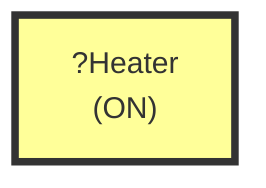
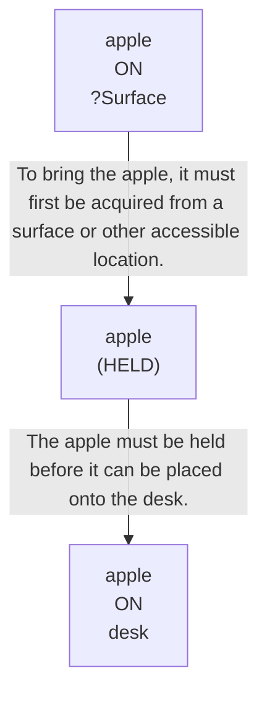
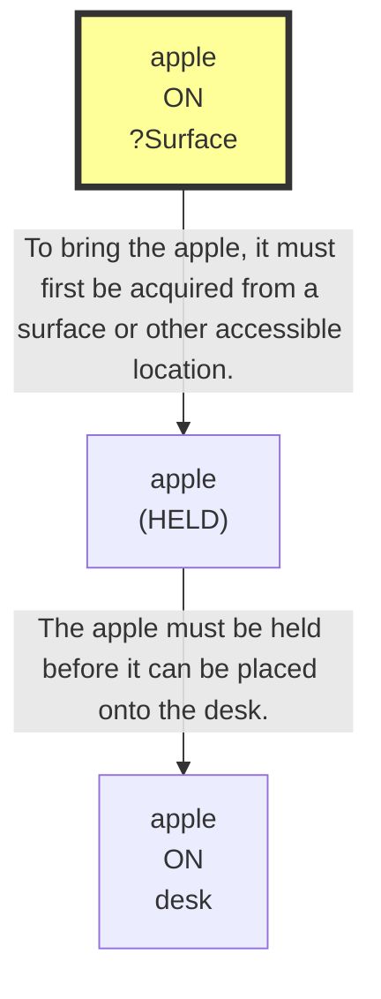
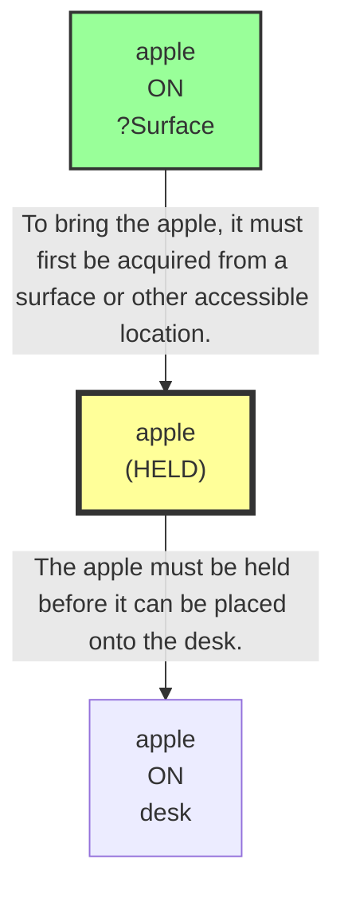
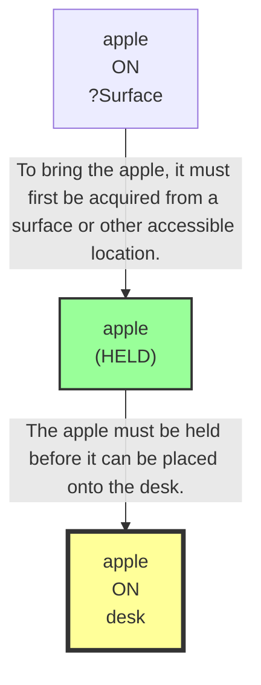

# 🚀 VirtualHome Agent Episode Log


### [GoalReasoner (Module A - Intent)] Output
```json
{
  "is_instruction_obviously_vague": false,
  "clarification_question": null,
  "target_object": "microwave",
  "location_hint": null,
  "reasoning_chain": [
    {
      "question": "Why does the user want this object?",
      "answer": "To have the microwave in an active state rather than powered off."
    },
    {
      "question": "Why is that important?",
      "answer": "Because an off microwave cannot be used for heating or cooking."
    },
    {
      "question": "What fundamental need does this fulfill?",
      "answer": "It enables the user to prepare or warm food and perform microwave-based tasks."
    },
    {
      "question": "Are there any deeper psychological or physical motivations?",
      "answer": "The likely motivation is convenience and readiness for immediate food preparation or reheating."
    }
  ],
  "deep_intent": "The user wants the appliance to be powered on and available for use.",
  "acceptable_alternatives_properties": [
    {
      "priority": 1,
      "description": "Other powered-on kitchen appliances that can perform the same immediate food-preparation function, such as a toaster oven or electric hot plate."
    },
    {
      "priority": 2,
      "description": "Any available appliance that can heat or cook food in the kitchen."
    },
    {
      "priority": 3,
      "description": "A ready-to-use indoor heating device for food preparation."
    },
    {
      "priority": 4,
      "description": "A different method of warming food, such as a stove or kettle, if the goal is simply to heat something."
    }
  ]
}
```

### [PerceptionFilter] Output
```json
{
  "reasoning": "The goal is to have a microwave-like heater appliance powered on and ready for food preparation. I must keep the exact target class microwave, plus functional heating alternatives mentioned by the intent/SDG such as stove and toaster (toaster oven proxy not present), and the other available food-heating appliance coffeemaker only if it can heat, but it is not a food heater, so exclude it. No extra furniture or unrelated objects are needed.",
  "selected_classes": [
    "toaster",
    "character",
    "microwave",
    "door",
    "plate",
    "stove",
    "fridge"
  ],
  "raw_class_count": 45
}
```

### [LLMExecutor] Output
```json
{
  "reasoning": "The active goal is to make the microwave ON. The microwave(234) is present in the kitchen and currently OFF. Since switch actions require proximity, the correct first step is to walk to the microwave before attempting to switch it on. It has HAS_PLUG, but there is no need to plugin yet because the task only requires it to be ON and no powered-state conflict is indicated.",
  "satisfied_nodes": [],
  "current_node_focus": "N1",
  "mapped_variables": {
    "?Heater": "microwave(234)"
  },
  "action": "[walk] <microwave> (234)"
}
```

### [RoboStateMultiTaskController] Output
```json
{
  "action": "[walk] <microwave> (234)",
  "active_task_id": "task_1",
  "task_context": {
    "active_task_id": "task_1",
    "pending_task_ids": [
      "task_2",
      "task_3"
    ],
    "satisfied_task_ids": []
  },
  "source": "llm_executor"
}
```
## Step 0
- **Action**: `[walk] <microwave> (234)`
- **Action Success**: `True`
- **Action Message**: {'0': {'message': 'Success'}}
- **Active Task**: `task_1`
- **Decision Source**: `llm_executor`
- **Task Progress**: E1_19=pending, E1_02=pending, E1_03=pending
- **SDG Status**:

- **Observed Items (18)**: door(145) [OPEN], door(146) [OPEN], plate(170), plate(171), plate(172), plate(173), plate(177), plate(178), plate(184), fridge(225) [CLOSED], stove(226) [OFF,CLOSED], toaster(231) [OFF], microwave(234) [CLOSED,OFF], character(1), bathroom(11)...


### [PerceptionFilter] Output
```json
{
  "reasoning": "Reused cached class selection.",
  "selected_classes": [
    "toaster",
    "character",
    "microwave",
    "door",
    "plate",
    "stove",
    "fridge"
  ],
  "raw_class_count": 45
}
```

### [LLMExecutor] Output
```json
{
  "reasoning": "The active goal is to satisfy N1 by turning the microwave ON. The current graph shows microwave(234) is already CLOSE to the character, so no additional walk is needed. Since it has HAS_SWITCH and is currently OFF, the next atomic step is to switch it on.",
  "satisfied_nodes": [],
  "current_node_focus": "N1",
  "mapped_variables": {
    "?Heater": "microwave(234)"
  },
  "action": "[switchon] <microwave> (234)"
}
```

### [RoboStateMultiTaskController] Output
```json
{
  "action": "[switchon] <microwave> (234)",
  "active_task_id": "task_1",
  "task_context": {
    "active_task_id": "task_1",
    "pending_task_ids": [
      "task_2",
      "task_3"
    ],
    "satisfied_task_ids": []
  },
  "source": "llm_executor"
}
```
## Step 1
- **Action**: `[switchon] <microwave> (234)`
- **Action Success**: `True`
- **Action Message**: Faked switch operation in Python layer (bypassed Unity failure)
- **Active Task**: `task_1`
- **Decision Source**: `llm_executor`
- **Task Progress**: E1_19=done, E1_02=pending, E1_03=pending
- **SDG Status**:

- **Observed Items (18)**: door(145) [OPEN], door(146) [OPEN], plate(170), plate(171), plate(172), plate(173), plate(177), plate(178), plate(184), fridge(225) [CLOSED], stove(226) [OFF,CLOSED], toaster(231) [OFF], microwave(234) [CLOSED,OFF], character(1), bathroom(11)...


### [GoalReasoner (Module A - Intent)] Output
```json
{
  "is_instruction_obviously_vague": false,
  "clarification_question": null,
  "target_object": "apple",
  "location_hint": "desk",
  "reasoning_chain": [
    {
      "question": "Why does the user want this object?",
      "answer": "To have the apple brought to their desk."
    },
    {
      "question": "Why is that important?",
      "answer": "So the apple is available at the desk for the user to use or consume there."
    },
    {
      "question": "What fundamental need does this fulfill?",
      "answer": "It supports access to food."
    },
    {
      "question": "Are there any deeper psychological or physical motivations?",
      "answer": "The primary physical motivation is to satisfy hunger or make a snack available nearby."
    }
  ],
  "deep_intent": "The user wants to have food available at their desk.",
  "acceptable_alternatives_properties": [
    {
      "priority": 1,
      "description": "Other ready-to-eat fruits that can be brought to the desk, such as a banana, pear, or orange"
    },
    {
      "priority": 2,
      "description": "Other small ready-to-eat snack foods suitable for a desk, such as crackers, granola bars, or a small sandwich"
    },
    {
      "priority": 3,
      "description": "Other packaged or portable foods that provide a similar snack function"
    },
    {
      "priority": 4,
      "description": "Any food item available indoors that can satisfy hunger even if it is not fruit"
    }
  ]
}
```

### [RoboStateMultiTaskController] Output
```json
{
  "action": "[walk] <bathroom> (11)",
  "active_task_id": "task_2",
  "task_context": {
    "active_task_id": "task_2",
    "pending_task_ids": [
      "task_3"
    ],
    "satisfied_task_ids": [
      "task_1"
    ]
  },
  "source": "room_frontier"
}
```
## Step 2
- **Action**: `[walk] <bathroom> (11)`
- **Action Success**: `True`
- **Action Message**: {'0': {'message': 'Success'}}
- **Active Task**: `task_2`
- **Decision Source**: `room_frontier`
- **Task Progress**: E1_19=done, E1_02=pending, E1_03=pending
- **SDG Status**:

- **Observed Items (125)**: floor(127), floor(128), floor(129), floor(130), floor(131), floor(132), floor(133), floor(134), floor(135), ceiling(136), ceiling(137), ceiling(138), ceiling(139), ceiling(140), ceiling(141)...


### [RoboStateMultiTaskController] Output
```json
{
  "action": "[walk] <bedroom> (50)",
  "active_task_id": "task_2",
  "task_context": {
    "active_task_id": "task_2",
    "pending_task_ids": [
      "task_3"
    ],
    "satisfied_task_ids": [
      "task_1"
    ]
  },
  "source": "room_frontier"
}
```
## Step 3
- **Action**: `[walk] <bedroom> (50)`
- **Action Success**: `True`
- **Action Message**: {'0': {'message': 'Success'}}
- **Active Task**: `task_2`
- **Decision Source**: `room_frontier`
- **Task Progress**: E1_19=done, E1_02=pending, E1_03=pending
- **SDG Status**:

- **Observed Items (163)**: floor(127), floor(128), floor(129), floor(130), floor(131), floor(132), floor(133), floor(134), floor(135), ceiling(136), ceiling(137), ceiling(138), ceiling(139), ceiling(140), ceiling(141)...


### [PerceptionFilter] Output
```json
{
  "reasoning": "The goal is to get the apple to the desk. The only strictly necessary target and location class are the apple and desk. No tools or alternative storage/receptacle are required by the SDG beyond holding and placing the apple, and the apple is already visible.",
  "selected_classes": [
    "desk",
    "apple",
    "character",
    "door"
  ],
  "raw_class_count": 82
}
```

### [LLMExecutor] Output
```json
{
  "reasoning": "The active task is to bring an apple to the desk. In the current graph, the only apple in the bedroom is apple(114), but the task does not require a specific apple ID. Since the desk is in the bedroom and is currently CLOSED, I do not need to interact with it yet. The next needed step toward satisfying N1 (apple ON ?Surface) and N2 (apple HELD) is to get near the available apple in the bedroom before grabbing it.",
  "satisfied_nodes": [],
  "current_node_focus": "N1",
  "mapped_variables": {},
  "action": "[walk] <apple> (114)"
}
```

### [RoboStateMultiTaskController] Output
```json
{
  "action": "[walk] <apple> (114)",
  "active_task_id": "task_2",
  "task_context": {
    "active_task_id": "task_2",
    "pending_task_ids": [
      "task_3"
    ],
    "satisfied_task_ids": [
      "task_1"
    ]
  },
  "source": "llm_executor"
}
```
## Step 4
- **Action**: `[walk] <apple> (114)`
- **Action Success**: `True`
- **Action Message**: {'0': {'message': 'Success'}}
- **Active Task**: `task_2`
- **Decision Source**: `llm_executor`
- **Task Progress**: E1_19=done, E1_02=pending, E1_03=pending
- **SDG Status**:

- **Observed Items (22)**: door(145) [OPEN], door(146) [OPEN], apple(249), apple(250), apple(251), apple(252), apple(253), apple(254), apple(255), apple(256), apple(257), apple(258), apple(259), apple(113), character(1)...


### [PerceptionFilter] Output
```json
{
  "reasoning": "Reused cached class selection.",
  "selected_classes": [
    "desk",
    "apple",
    "character",
    "door"
  ],
  "raw_class_count": 82
}
```

### [LLMExecutor] Output
```json
{
  "reasoning": "The active goal is to bring an apple to the desk. In the current graph, apple(114) is the closest accessible apple: it is in the bedroom and already CLOSE to the character, while the desk is in the bedroom but currently CLOSED. To progress the SDG, the immediate prerequisite is to acquire the apple, satisfying N1 -> N2. Since I am already close to apple(114) and the last action was a walk to it, the next atomic action should be grabbing it. After that, I can later walk to the desk and place it there.",
  "satisfied_nodes": [
    "N1"
  ],
  "current_node_focus": "N2",
  "mapped_variables": {},
  "action": "[grab] <apple> (114)"
}
```

### [RoboStateMultiTaskController] Output
```json
{
  "action": "[grab] <apple> (114)",
  "active_task_id": "task_2",
  "task_context": {
    "active_task_id": "task_2",
    "pending_task_ids": [
      "task_3"
    ],
    "satisfied_task_ids": [
      "task_1"
    ]
  },
  "source": "llm_executor"
}
```
## Step 5
- **Action**: `[grab] <apple> (114)`
- **Action Success**: `True`
- **Action Message**: {'0': {'message': 'Success'}}
- **Active Task**: `task_2`
- **Decision Source**: `llm_executor`
- **Task Progress**: E1_19=done, E1_02=pending, E1_03=pending
- **SDG Status**:

- **Observed Items (22)**: door(145) [OPEN], door(146) [OPEN], apple(249), apple(250), apple(251), apple(252), apple(253), apple(254), apple(255), apple(256), apple(257), apple(258), apple(259), apple(113), character(1)...


### [PerceptionFilter] Output
```json
{
  "reasoning": "Reused cached class selection.",
  "selected_classes": [
    "desk",
    "apple",
    "character",
    "door"
  ],
  "raw_class_count": 82
}
```

### [LLMExecutor] Output
```json
{
  "reasoning": "The active goal is to place the held apple onto the desk. N2 (apple held) is already satisfied because the character is holding apple(114). To satisfy N3, I must first be near the desk before putting the apple on it. The desk(80) is in the bedroom and is the correct target surface for the task, so the next atomic step is to walk to it.",
  "satisfied_nodes": [
    "N2"
  ],
  "current_node_focus": "N3",
  "mapped_variables": {
    "?Surface": "desk(80)"
  },
  "action": "[walk] <desk> (80)"
}
```

### [RoboStateMultiTaskController] Output
```json
{
  "action": "[walk] <desk> (80)",
  "active_task_id": "task_2",
  "task_context": {
    "active_task_id": "task_2",
    "pending_task_ids": [
      "task_3"
    ],
    "satisfied_task_ids": [
      "task_1"
    ]
  },
  "source": "llm_executor"
}
```
## Step 6
- **Action**: `[walk] <desk> (80)`
- **Action Success**: `True`
- **Action Message**: {'0': {'message': 'Success'}}
- **Active Task**: `task_2`
- **Decision Source**: `llm_executor`
- **Task Progress**: E1_19=done, E1_02=pending, E1_03=pending
- **SDG Status**:

- **Observed Items (22)**: door(145) [OPEN], door(146) [OPEN], apple(249), apple(250), apple(251), apple(252), apple(253), apple(254), apple(255), apple(256), apple(257), apple(258), apple(259), apple(113), character(1)...


### [PerceptionFilter] Output
```json
{
  "reasoning": "Reused cached class selection.",
  "selected_classes": [
    "desk",
    "apple",
    "character",
    "door"
  ],
  "raw_class_count": 82
}
```

### [LLMExecutor] Output
```json
{
  "reasoning": "The active goal is to bring apple(114) to the desk. The apple is already held in the right hand, and the current graph says the character is close to desk(80). Since the desk is a valid flat surface and the apple must be placed onto it to satisfy N3, the next step is to put the held apple onto the desk. No additional walking is needed because proximity is already satisfied.",
  "satisfied_nodes": [
    "N2"
  ],
  "current_node_focus": "N3",
  "mapped_variables": {
    "?Surface": "desk(80)"
  },
  "action": "[putback] <apple> (114) <desk> (80)"
}
```

### [RoboStateMultiTaskController] Output
```json
{
  "action": "[putback] <apple> (114) <desk> (80)",
  "active_task_id": "task_2",
  "task_context": {
    "active_task_id": "task_2",
    "pending_task_ids": [
      "task_3"
    ],
    "satisfied_task_ids": [
      "task_1"
    ]
  },
  "source": "llm_executor"
}
```
## Step 7
- **Action**: `[putback] <apple> (114) <desk> (80)`
- **Action Success**: `True`
- **Action Message**: {'0': {'message': 'Success'}}
- **Active Task**: `task_2`
- **Decision Source**: `llm_executor`
- **Task Progress**: E1_19=done, E1_02=done, E1_03=pending
- **SDG Status**:

- **Observed Items (22)**: door(145) [OPEN], door(146) [OPEN], apple(249), apple(250), apple(251), apple(252), apple(253), apple(254), apple(255), apple(256), apple(257), apple(258), apple(259), apple(113), character(1)...


### [GoalReasoner (Module A - Intent)] Output
```json
{
  "is_instruction_obviously_vague": false,
  "clarification_question": null,
  "target_object": "book",
  "location_hint": "sofa",
  "reasoning_chain": [
    {
      "question": "Why does the user want this object?",
      "answer": "To move an unorganized book to the sofa."
    },
    {
      "question": "Why is that important?",
      "answer": "To place the book in a more desired location rather than leaving it unorganized."
    },
    {
      "question": "What fundamental need does this fulfill?",
      "answer": "It helps organize and relocate a household item to a specific seating area."
    },
    {
      "question": "Are there any deeper psychological or physical motivations?",
      "answer": "The user likely wants the living space to be tidier or wants the book readily accessible on the sofa."
    }
  ],
  "deep_intent": "The user wants to organize and relocate a household item to a preferred resting area.",
  "acceptable_alternatives_properties": [
    {
      "priority": 1,
      "description": "Other similar loose reading materials, such as magazines or notebooks, that can be placed on the sofa"
    },
    {
      "priority": 2,
      "description": "Other paper-based items or small handheld objects that are out of place and can be moved to the sofa"
    },
    {
      "priority": 3,
      "description": "Other household items needing tidying that can be relocated to a seating area"
    },
    {
      "priority": 4,
      "description": "Any portable item that helps reduce clutter in the original spot by being moved elsewhere"
    }
  ]
}
```

### [PerceptionFilter] Output
```json
{
  "reasoning": "The task is to place the book on the sofa. The SDG explicitly requires the book and the sofa, so both must be kept. No additional tools or receptacles are needed for simply moving and placing the book.",
  "selected_classes": [
    "paper",
    "sofa",
    "character",
    "book"
  ],
  "raw_class_count": 82
}
```

### [LLMExecutor] Output
```json
{
  "reasoning": "The active goal is to place a book on the sofa. In the current graph, the best matching book available in the bedroom is book(104), and the sofa(85) is also in the bedroom. Since I am currently close to the paper and inside the bedroom, the next required step is to move next to the specific book before grabbing it. I should not act on the other books in the kitchen because the nearest accessible matching object is book(104) and the task only requires one book on the sofa.",
  "satisfied_nodes": [],
  "current_node_focus": "N1",
  "mapped_variables": {},
  "action": "[walk] <book> (104)"
}
```

### [RoboStateMultiTaskController] Output
```json
{
  "action": "[walk] <book> (104)",
  "active_task_id": "task_3",
  "task_context": {
    "active_task_id": "task_3",
    "pending_task_ids": [],
    "satisfied_task_ids": [
      "task_1",
      "task_2"
    ]
  },
  "source": "llm_executor"
}
```
## Step 8
- **Action**: `[walk] <book> (104)`
- **Action Success**: `True`
- **Action Message**: {'0': {'message': 'Success'}}
- **Active Task**: `task_3`
- **Decision Source**: `llm_executor`
- **Task Progress**: E1_19=done, E1_02=done, E1_03=pending
- **SDG Status**:

- **Observed Items (10)**: book(163) [CLOSED], book(164) [CLOSED], character(1), bathroom(11), bedroom(50), kitchen(126), livingroom(261), sofa(85), book(104) [CLOSED], paper(109)


### [PerceptionFilter] Output
```json
{
  "reasoning": "Reused cached class selection.",
  "selected_classes": [
    "paper",
    "sofa",
    "character",
    "book"
  ],
  "raw_class_count": 82
}
```

### [LLMExecutor] Output
```json
{
  "reasoning": "The active goal is to place the book on the sofa. The current graph shows book(104) is in the bedroom and the character is close to it, so the next necessary step is to grab that exact book. No other SDG nodes are satisfied yet because the book is not on the sofa.",
  "satisfied_nodes": [],
  "current_node_focus": "N1",
  "mapped_variables": {},
  "action": "[grab] <book> (104)"
}
```

### [RoboStateMultiTaskController] Output
```json
{
  "action": "[grab] <book> (104)",
  "active_task_id": "task_3",
  "task_context": {
    "active_task_id": "task_3",
    "pending_task_ids": [],
    "satisfied_task_ids": [
      "task_1",
      "task_2"
    ]
  },
  "source": "llm_executor"
}
```
## Step 9
- **Action**: `[grab] <book> (104)`
- **Action Success**: `True`
- **Action Message**: {'0': {'message': 'Success'}}
- **Active Task**: `task_3`
- **Decision Source**: `llm_executor`
- **Task Progress**: E1_19=done, E1_02=done, E1_03=pending
- **SDG Status**:

- **Observed Items (10)**: book(163) [CLOSED], book(164) [CLOSED], character(1), bathroom(11), bedroom(50), kitchen(126), livingroom(261), sofa(85), book(104) [CLOSED], paper(109)


### [PerceptionFilter] Output
```json
{
  "reasoning": "Reused cached class selection.",
  "selected_classes": [
    "paper",
    "sofa",
    "character",
    "book"
  ],
  "raw_class_count": 82
}
```

### [LLMExecutor] Output
```json
{
  "reasoning": "The active goal is to place a book on the sofa. I am already holding book(104) and am in the bedroom near it. The sofa(85) is a valid surface target in the bedroom, so the next required step is to move to the sofa before placing the book down. I should not attempt putback until after walking to the destination.",
  "satisfied_nodes": [],
  "current_node_focus": "N1",
  "mapped_variables": {},
  "action": "[walk] <sofa> (85)"
}
```

### [RoboStateMultiTaskController] Output
```json
{
  "action": "[walk] <sofa> (85)",
  "active_task_id": "task_3",
  "task_context": {
    "active_task_id": "task_3",
    "pending_task_ids": [],
    "satisfied_task_ids": [
      "task_1",
      "task_2"
    ]
  },
  "source": "llm_executor"
}
```
## Step 10
- **Action**: `[walk] <sofa> (85)`
- **Action Success**: `True`
- **Action Message**: {'0': {'message': 'Success'}}
- **Active Task**: `task_3`
- **Decision Source**: `llm_executor`
- **Task Progress**: E1_19=done, E1_02=done, E1_03=pending
- **SDG Status**:

- **Observed Items (10)**: book(163) [CLOSED], book(164) [CLOSED], character(1), bathroom(11), bedroom(50), kitchen(126), livingroom(261), sofa(85), book(104) [CLOSED], paper(109)


### [PerceptionFilter] Output
```json
{
  "reasoning": "Reused cached class selection.",
  "selected_classes": [
    "paper",
    "sofa",
    "character",
    "book"
  ],
  "raw_class_count": 82
}
```

### [LLMExecutor] Output
```json
{
  "reasoning": "The active goal is to place a book on the sofa. The current graph shows I am already close to the sofa and still holding book(104) in my right hand. Therefore the next required step is to place that held book onto the nearby sofa to satisfy N1. No other task objects should be touched.",
  "satisfied_nodes": [],
  "current_node_focus": "N1",
  "mapped_variables": {},
  "action": "[putback] <book> (104) <sofa> (85)"
}
```

### [RoboStateMultiTaskController] Output
```json
{
  "action": "[putback] <book> (104) <sofa> (85)",
  "active_task_id": "task_3",
  "task_context": {
    "active_task_id": "task_3",
    "pending_task_ids": [],
    "satisfied_task_ids": [
      "task_1",
      "task_2"
    ]
  },
  "source": "llm_executor"
}
```
## Step 11
- **Action**: `[putback] <book> (104) <sofa> (85)`
- **Action Success**: `True`
- **Action Message**: {'0': {'message': 'Success'}}
- **Active Task**: `task_3`
- **Decision Source**: `llm_executor`
- **Task Progress**: E1_19=done, E1_02=done, E1_03=done
- **SDG Status**:

- **Observed Items (10)**: book(163) [CLOSED], book(164) [CLOSED], character(1), bathroom(11), bedroom(50), kitchen(126), livingroom(261), sofa(85), book(104) [CLOSED], paper(109)

