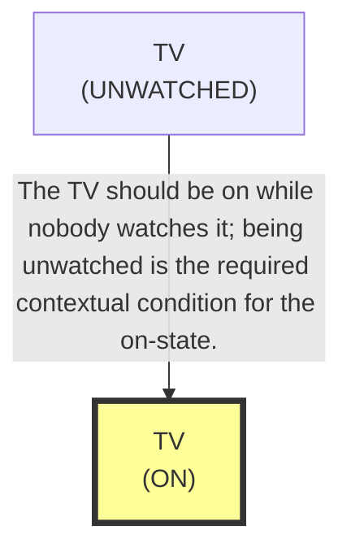
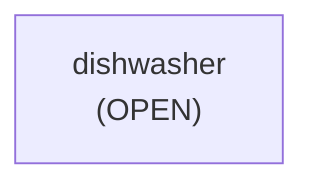
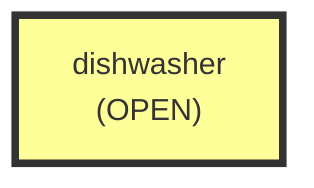
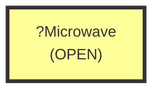

# 🚀 VirtualHome Agent Episode Log


### [GoalReasoner (Module A - Intent)] Output
```json
{
  "is_instruction_obviously_vague": false,
  "clarification_question": null,
  "target_object": "TV",
  "location_hint": null,
  "reasoning_chain": [
    {
      "question": "Why does the user want this object?",
      "answer": "To have the television remain powered on."
    },
    {
      "question": "Why is that important?",
      "answer": "Because the user wants the television to continue operating even without active viewing."
    },
    {
      "question": "What fundamental need does this fulfill?",
      "answer": "It maintains an ongoing audiovisual state in the environment."
    },
    {
      "question": "Are there any deeper psychological or physical motivations?",
      "answer": "The user may want background presence, continuity, or to ensure the display stays active unattended."
    }
  ],
  "deep_intent": "Maintain an active audiovisual source in the environment even when unattended.",
  "acceptable_alternatives_properties": [
    {
      "priority": 1,
      "description": "Other always-on audiovisual devices such as a radio or speaker playing audio"
    },
    {
      "priority": 2,
      "description": "Other household display devices that can remain active, such as a monitor or tablet"
    },
    {
      "priority": 3,
      "description": "Any device that provides continuous ambient media or output, such as a streaming speaker or media player"
    },
    {
      "priority": 4,
      "description": "Other sources of background environmental stimulation, such as a lamp or clock display"
    }
  ]
}
```

### [PerceptionFilter] Output
```json
{
  "reasoning": "The goal is to keep the TV powered on and unattended, so the only strictly necessary class is the TV itself. No additional tool or location is required by the SDG, and no alternatives are needed because the target device is already present.",
  "selected_classes": [
    "character",
    "tv"
  ],
  "raw_class_count": 27
}
```

### [LLMExecutor] Output
```json
{
  "reasoning": "The active task is to keep the TV powered on and unwatched. The TV (tv(238)) is present in the livingroom and currently OFF, with HAS_SWITCH and HAS_PLUG, so the immediate prerequisite is to get near it before switching it on. No other SDG nodes are satisfied yet because the TV is not ON and the unwatched condition is not yet established by the graph.",
  "satisfied_nodes": [],
  "current_node_focus": "N1",
  "mapped_variables": {},
  "action": "[walk] <tv> (238)"
}
```

### [RoboStateMultiTaskController] Output
```json
{
  "action": "[walk] <tv> (238)",
  "active_task_id": "task_1",
  "task_context": {
    "active_task_id": "task_1",
    "pending_task_ids": [
      "task_2",
      "task_3"
    ],
    "satisfied_task_ids": []
  },
  "source": "llm_executor"
}
```
## Step 0
- **Action**: `[walk] <tv> (238)`
- **Action Success**: `True`
- **Action Message**: {'0': {'message': 'Success'}}
- **Active Task**: `task_1`
- **Decision Source**: `llm_executor`
- **Task Progress**: E1_01=pending, E1_04=pending, E1_05=pending
- **SDG Status**:

- **Observed Items (7)**: tv(238) [OFF], character(1), kitchen(11), livingroom(183), bedroom(241), bathroom(285), bedroom(346)


### [PerceptionFilter] Output
```json
{
  "reasoning": "Reused cached class selection.",
  "selected_classes": [
    "character",
    "tv"
  ],
  "raw_class_count": 27
}
```

### [LLMExecutor] Output
```json
{
  "reasoning": "The active task is to keep the TV powered on. The TV(238) is already close to the character and has a switch plus plug, and its current state is OFF. Since powering it on is the remaining unmet state, the next action should directly switch it on. The UNWATCHED condition is contextual and not an action target; no separate physical step is needed right now.",
  "satisfied_nodes": [],
  "current_node_focus": "N1",
  "mapped_variables": {
    "?TV": "tv(238)"
  },
  "action": "[switchon] <tv> (238)"
}
```

### [RoboStateMultiTaskController] Output
```json
{
  "action": "[switchon] <tv> (238)",
  "active_task_id": "task_1",
  "task_context": {
    "active_task_id": "task_1",
    "pending_task_ids": [
      "task_2",
      "task_3"
    ],
    "satisfied_task_ids": []
  },
  "source": "llm_executor"
}
```
## Step 1
- **Action**: `[switchon] <tv> (238)`
- **Action Success**: `True`
- **Action Message**: Faked switch operation in Python layer (bypassed Unity failure)
- **Active Task**: `task_1`
- **Decision Source**: `llm_executor`
- **Task Progress**: E1_01=done, E1_04=pending, E1_05=pending
- **SDG Status**:

- **Observed Items (7)**: tv(238) [OFF], character(1), kitchen(11), livingroom(183), bedroom(241), bathroom(285), bedroom(346)


### [GoalReasoner (Module A - Intent)] Output
```json
{
  "is_instruction_obviously_vague": false,
  "clarification_question": null,
  "target_object": "dishwasher",
  "location_hint": null,
  "reasoning_chain": [
    {
      "question": "Why does the user want this object?",
      "answer": "To allow moisture inside the appliance to evaporate after use."
    },
    {
      "question": "Why is that important?",
      "answer": "Drying helps reduce remaining water and can prevent lingering dampness or odors."
    },
    {
      "question": "What fundamental need does this fulfill?",
      "answer": "It helps keep the appliance dry and hygienic after a wash cycle."
    },
    {
      "question": "Are there any deeper psychological or physical motivations?",
      "answer": "The user likely wants a practical post-wash maintenance state that supports cleanliness and reduces the chance of trapped moisture."
    }
  ],
  "deep_intent": "The user wants to dry and maintain a household appliance after use.",
  "acceptable_alternatives_properties": [
    {
      "priority": 1,
      "description": "Other ways to keep the appliance interior ventilated and dry, such as partially opening it or propping it open."
    },
    {
      "priority": 2,
      "description": "Any similar household appliance or enclosed container that needs air-drying after being wet."
    },
    {
      "priority": 3,
      "description": "Methods that remove residual moisture from indoor surfaces, such as wiping dry or increasing airflow."
    },
    {
      "priority": 4,
      "description": "General household drying actions for damp items or spaces, such as airing out a room or drying a countertop."
    }
  ]
}
```

### [RoboStateMultiTaskController] Output
```json
{
  "action": "[walk] <kitchen> (11)",
  "active_task_id": "task_2",
  "task_context": {
    "active_task_id": "task_2",
    "pending_task_ids": [
      "task_3"
    ],
    "satisfied_task_ids": [
      "task_1"
    ]
  },
  "source": "room_frontier"
}
```
## Step 2
- **Action**: `[walk] <kitchen> (11)`
- **Action Success**: `True`
- **Action Message**: {'0': {'message': 'Success'}}
- **Active Task**: `task_2`
- **Decision Source**: `room_frontier`
- **Task Progress**: E1_01=done, E1_04=pending, E1_05=pending
- **SDG Status**:

- **Observed Items (58)**: floor(184), floor(185), floor(186), floor(187), floor(188), floor(189), wall(190), wall(191), wall(192), wall(193), wall(194), wall(195), ceiling(196), ceiling(197), ceiling(198)...


### [PerceptionFilter] Output
```json
{
  "reasoning": "The goal is to open the dishwasher so it can dry out after use. The only strictly necessary object class is the dishwasher itself, since the SDG requires it to be in the OPEN state and no other tool or location is needed.",
  "selected_classes": [
    "dishwasher",
    "character",
    "door"
  ],
  "raw_class_count": 59
}
```

### [LLMExecutor] Output
```json
{
  "reasoning": "The active goal is to make the dishwasher OPEN. The current graph shows the dishwasher is in the kitchen and is CLOSED, and we are already inside the kitchen, so no walk is needed. The next atomic step is to open the dishwasher.",
  "satisfied_nodes": [],
  "current_node_focus": "N1",
  "mapped_variables": {},
  "action": "[open] <dishwasher> (165)"
}
```

### [RoboStateMultiTaskController] Output
```json
{
  "action": "[walk] <dishwasher> (165)",
  "active_task_id": "task_2",
  "task_context": {
    "active_task_id": "task_2",
    "pending_task_ids": [
      "task_3"
    ],
    "satisfied_task_ids": [
      "task_1"
    ]
  },
  "source": "llm_executor_repaired"
}
```
## Step 3
- **Action**: `[walk] <dishwasher> (165)`
- **Action Success**: `True`
- **Action Message**: {'0': {'message': 'Success'}}
- **Active Task**: `task_2`
- **Decision Source**: `llm_executor_repaired`
- **Task Progress**: E1_01=done, E1_04=pending, E1_05=pending
- **SDG Status**:

- **Observed Items (8)**: character(1), kitchen(11), livingroom(183), bedroom(241), bathroom(285), bedroom(346), door(47) [OPEN], dishwasher(165) [CLOSED,OFF]


### [PerceptionFilter] Output
```json
{
  "reasoning": "Reused cached class selection.",
  "selected_classes": [
    "dishwasher",
    "character",
    "door"
  ],
  "raw_class_count": 59
}
```

### [LLMExecutor] Output
```json
{
  "reasoning": "The active goal is to make the dishwasher OPEN. The filtered graph shows I am already close to dishwasher(165), and it is currently CLOSED. Since opening requires proximity and no other prerequisites, the next step is to open it directly.",
  "satisfied_nodes": [],
  "current_node_focus": "N1",
  "mapped_variables": {},
  "action": "[open] <dishwasher> (165)"
}
```

### [RoboStateMultiTaskController] Output
```json
{
  "action": "[open] <dishwasher> (165)",
  "active_task_id": "task_2",
  "task_context": {
    "active_task_id": "task_2",
    "pending_task_ids": [
      "task_3"
    ],
    "satisfied_task_ids": [
      "task_1"
    ]
  },
  "source": "llm_executor"
}
```
## Step 4
- **Action**: `[open] <dishwasher> (165)`
- **Action Success**: `True`
- **Action Message**: {'0': {'message': 'Success'}}
- **Active Task**: `task_2`
- **Decision Source**: `llm_executor`
- **Task Progress**: E1_01=done, E1_04=done, E1_05=pending
- **SDG Status**:

- **Observed Items (8)**: character(1), kitchen(11), livingroom(183), bedroom(241), bathroom(285), bedroom(346), door(47) [OPEN], dishwasher(165) [CLOSED,OFF]


### [GoalReasoner (Module A - Intent)] Output
```json
{
  "is_instruction_obviously_vague": false,
  "clarification_question": null,
  "target_object": "microwave",
  "location_hint": null,
  "reasoning_chain": [
    {
      "question": "Why does the user want this object?",
      "answer": "To keep it in a specific physical state for maintenance."
    },
    {
      "question": "Why is that important?",
      "answer": "So the appliance can be serviced, inspected, or cleaned without the door being closed."
    },
    {
      "question": "What fundamental need does this fulfill?",
      "answer": "It supports safe access and proper maintenance of the appliance."
    },
    {
      "question": "Are there any deeper psychological or physical motivations?",
      "answer": "The user likely wants to prevent interference with maintenance work and ensure the appliance remains accessible and ready for service."
    }
  ],
  "deep_intent": "The user wants to maintain safe and accessible access to an appliance for servicing.",
  "acceptable_alternatives_properties": [
    {
      "priority": 1,
      "description": "Other household appliances or compartments that can be left open for servicing, inspection, or cleaning, such as an oven door or cabinet door."
    },
    {
      "priority": 2,
      "description": "Similar access points on appliances that need to remain open during maintenance, such as a refrigerator door or washer lid."
    },
    {
      "priority": 3,
      "description": "Any indoor storage or appliance access panel that should stay open to allow work, airflow, or inspection."
    },
    {
      "priority": 4,
      "description": "A different item that can be kept accessible for maintenance purposes, such as a tool drawer or equipment hatch."
    }
  ]
}
```

### [PerceptionFilter] Output
```json
{
  "reasoning": "The goal is to keep the microwave open for safe access and maintenance. The SDG explicitly requires the microwave, and no additional tools or alternative appliances are necessary to satisfy the open-state condition.",
  "selected_classes": [
    "microwave",
    "character",
    "door"
  ],
  "raw_class_count": 59
}
```

### [LLMExecutor] Output
```json
{
  "reasoning": "The active SDG has a single unmet node: the microwave must be OPEN. The current graph shows microwave(171) is in the kitchen, closed, and can be opened. I am already inside the kitchen, so the next atomic action is to open the microwave directly.",
  "satisfied_nodes": [],
  "current_node_focus": "N1",
  "mapped_variables": {
    "?Microwave": "microwave(171)"
  },
  "action": "[open] <microwave> (171)"
}
```

### [RoboStateMultiTaskController] Output
```json
{
  "action": "[walk] <microwave> (171)",
  "active_task_id": "task_3",
  "task_context": {
    "active_task_id": "task_3",
    "pending_task_ids": [],
    "satisfied_task_ids": [
      "task_1",
      "task_2"
    ]
  },
  "source": "llm_executor_repaired"
}
```
## Step 5
- **Action**: `[walk] <microwave> (171)`
- **Action Success**: `True`
- **Action Message**: {'0': {'message': 'Success'}}
- **Active Task**: `task_3`
- **Decision Source**: `llm_executor_repaired`
- **Task Progress**: E1_01=done, E1_04=done, E1_05=pending
- **SDG Status**:

- **Observed Items (8)**: character(1), kitchen(11), livingroom(183), bedroom(241), bathroom(285), bedroom(346), door(47) [OPEN], microwave(171) [CLOSED,OFF]


### [PerceptionFilter] Output
```json
{
  "reasoning": "Reused cached class selection.",
  "selected_classes": [
    "microwave",
    "character",
    "door"
  ],
  "raw_class_count": 59
}
```

### [LLMExecutor] Output
```json
{
  "reasoning": "The active goal is to make the microwave OPEN. The current graph shows the character is already CLOSE to microwave(171), and the microwave is CLOSED. Since opening requires proximity and the robot is already near it, the next step is to open it.",
  "satisfied_nodes": [],
  "current_node_focus": "N1",
  "mapped_variables": {
    "?Microwave": "microwave(171)"
  },
  "action": "[open] <microwave> (171)"
}
```

### [RoboStateMultiTaskController] Output
```json
{
  "action": "[open] <microwave> (171)",
  "active_task_id": "task_3",
  "task_context": {
    "active_task_id": "task_3",
    "pending_task_ids": [],
    "satisfied_task_ids": [
      "task_1",
      "task_2"
    ]
  },
  "source": "llm_executor"
}
```
## Step 6
- **Action**: `[open] <microwave> (171)`
- **Action Success**: `True`
- **Action Message**: {'0': {'message': 'Success'}}
- **Active Task**: `task_3`
- **Decision Source**: `llm_executor`
- **Task Progress**: E1_01=done, E1_04=done, E1_05=done
- **SDG Status**:

- **Observed Items (8)**: character(1), kitchen(11), livingroom(183), bedroom(241), bathroom(285), bedroom(346), door(47) [OPEN], microwave(171) [CLOSED,OFF]

