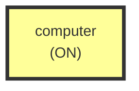
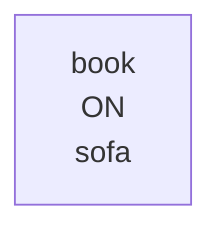
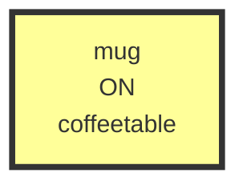

# 🚀 VirtualHome Agent Episode Log


### [GoalReasoner (Module A - Intent)] Output
```json
{
  "is_instruction_obviously_vague": false,
  "clarification_question": null,
  "target_object": "computer",
  "location_hint": null,
  "reasoning_chain": [
    {
      "question": "Why does the user want this object?",
      "answer": "To maintain the computer in an operational power state."
    },
    {
      "question": "Why is that important?",
      "answer": "So the device remains available for immediate use or continues running ongoing tasks."
    },
    {
      "question": "What fundamental need does this fulfill?",
      "answer": "It fulfills the need to preserve device availability and continuity of operation."
    },
    {
      "question": "Are there any deeper psychological or physical motivations?",
      "answer": "The user may want to avoid interruption, save time, or ensure a process is not disrupted."
    }
  ],
  "deep_intent": "The user wants to preserve device availability and uninterrupted operation.",
  "acceptable_alternatives_properties": [
    {
      "priority": 1,
      "description": "Other powered-on electronic devices that can remain continuously available, such as a laptop, monitor, or tablet."
    },
    {
      "priority": 2,
      "description": "Computing devices or peripherals set to stay active, such as a desktop tower or connected display."
    },
    {
      "priority": 3,
      "description": "Any household electronics that can remain energized for ongoing use, such as a router or smart hub."
    },
    {
      "priority": 4,
      "description": "A different device that can support uninterrupted access to information or tasks, such as a phone kept awake and charged."
    }
  ]
}
```

### [PerceptionFilter] Output
```json
{
  "reasoning": "The goal is to keep the computer powered on and available. The SDG explicitly requires the computer, and maintaining operation may also depend on the immediate computer peripherals present for continued use, namely the screen and input devices. No other furniture or objects are necessary.",
  "selected_classes": [
    "keyboard",
    "character",
    "mouse",
    "computer",
    "cpuscreen",
    "desk"
  ],
  "raw_class_count": 33
}
```

### [LLMExecutor] Output
```json
{
  "reasoning": "The active goal is to satisfy N1: computer(174) must be ON. The filtered graph shows the computer is currently OFF and has a HAS_SWITCH property, so the next needed step is to get near it before switching it on. No other prerequisite like plugging in is required because there is no indication it needs a plug for this goal, and the computer itself is the exact target object.",
  "satisfied_nodes": [],
  "current_node_focus": "N1",
  "mapped_variables": {},
  "action": "[walk] <computer> (174)"
}
```

### [RoboStateMultiTaskController] Output
```json
{
  "action": "[walk] <computer> (174)",
  "active_task_id": "task_1",
  "task_context": {
    "active_task_id": "task_1",
    "pending_task_ids": [
      "task_2",
      "task_3"
    ],
    "satisfied_task_ids": []
  },
  "source": "llm_executor"
}
```
## Step 0
- **Action**: `[walk] <computer> (174)`
- **Action Success**: `True`
- **Action Message**: {'0': {'message': 'Success'}}
- **Active Task**: `task_1`
- **Decision Source**: `llm_executor`
- **Task Progress**: E1_11=pending, E1_03=pending, E1_07=pending
- **SDG Status**:

- **Observed Items (10)**: desk(108) [CLOSED], mouse(170), keyboard(172), computer(174) [OFF], cpuscreen(175), character(1), bathroom(11), bedroom(73), kitchen(205), livingroom(335)


### [PerceptionFilter] Output
```json
{
  "reasoning": "Reused cached class selection.",
  "selected_classes": [
    "keyboard",
    "character",
    "mouse",
    "computer",
    "cpuscreen",
    "desk"
  ],
  "raw_class_count": 33
}
```

### [LLMExecutor] Output
```json
{
  "reasoning": "The active SDG has a single node: computer(174) must be ON. The current graph shows the computer is OFF and the character is already CLOSE to it, so no additional walk is needed. The next step is to switch it on.",
  "satisfied_nodes": [],
  "current_node_focus": "N1",
  "mapped_variables": {},
  "action": "[switchon] <computer> (174)"
}
```

### [RoboStateMultiTaskController] Output
```json
{
  "action": "[switchon] <computer> (174)",
  "active_task_id": "task_1",
  "task_context": {
    "active_task_id": "task_1",
    "pending_task_ids": [
      "task_2",
      "task_3"
    ],
    "satisfied_task_ids": []
  },
  "source": "llm_executor"
}
```
## Step 1
- **Action**: `[switchon] <computer> (174)`
- **Action Success**: `True`
- **Action Message**: Faked switch operation in Python layer (bypassed Unity failure)
- **Active Task**: `task_1`
- **Decision Source**: `llm_executor`
- **Task Progress**: E1_11=done, E1_03=pending, E1_07=pending
- **SDG Status**:

- **Observed Items (10)**: desk(108) [CLOSED], mouse(170), keyboard(172), computer(174) [OFF], cpuscreen(175), character(1), bathroom(11), bedroom(73), kitchen(205), livingroom(335)


### [GoalReasoner (Module A - Intent)] Output
```json
{
  "is_instruction_obviously_vague": false,
  "clarification_question": null,
  "target_object": "book",
  "location_hint": "sofa",
  "reasoning_chain": [
    {
      "question": "Why does the user want this object?",
      "answer": "To have the book placed in its proper place rather than left out of order on the sofa."
    },
    {
      "question": "Why is that important?",
      "answer": "To keep the living area tidy and reduce clutter or misplaced items."
    },
    {
      "question": "What fundamental need does this fulfill?",
      "answer": "Maintaining an organized and orderly indoor space."
    },
    {
      "question": "Are there any deeper psychological or physical motivations?",
      "answer": "It may help the user feel more comfortable in the space and make items easier to find later."
    }
  ],
  "deep_intent": "The user wants to restore order and reduce clutter in the living space.",
  "acceptable_alternatives_properties": [
    {
      "priority": 1,
      "description": "Other misplaced household items on the sofa, such as magazines, papers, or remote controls, that can be returned to their proper place"
    },
    {
      "priority": 2,
      "description": "Other loose reading materials or small personal items that are out of place in the seating area"
    },
    {
      "priority": 3,
      "description": "General clutter or nearby household objects that belong elsewhere and can be tidied up"
    },
    {
      "priority": 4,
      "description": "Any easily movable items in the room that contribute to a more organized living area"
    }
  ]
}
```

### [RoboStateMultiTaskController] Output
```json
{
  "action": "[walk] <bathroom> (11)",
  "active_task_id": "task_2",
  "task_context": {
    "active_task_id": "task_2",
    "pending_task_ids": [
      "task_3"
    ],
    "satisfied_task_ids": [
      "task_1"
    ]
  },
  "source": "room_frontier"
}
```
## Step 2
- **Action**: `[walk] <bathroom> (11)`
- **Action Success**: `True`
- **Action Message**: {'0': {'message': 'Success'}}
- **Active Task**: `task_2`
- **Decision Source**: `room_frontier`
- **Task Progress**: E1_11=done, E1_03=pending, E1_07=pending
- **SDG Status**:

- **Observed Items (74)**: floor(74), floor(75), floor(76), floor(77), floor(78), floor(79), floor(80), floor(81), floor(82), wall(83), wall(84), wall(85), wall(86), wall(87), wall(88)...


### [RoboStateMultiTaskController] Output
```json
{
  "action": "[walk] <kitchen> (205)",
  "active_task_id": "task_2",
  "task_context": {
    "active_task_id": "task_2",
    "pending_task_ids": [
      "task_3"
    ],
    "satisfied_task_ids": [
      "task_1"
    ]
  },
  "source": "room_frontier"
}
```
## Step 3
- **Action**: `[walk] <kitchen> (205)`
- **Action Success**: `True`
- **Action Message**: {'0': {'message': 'Success'}}
- **Active Task**: `task_2`
- **Decision Source**: `room_frontier`
- **Task Progress**: E1_11=done, E1_03=pending, E1_07=pending
- **SDG Status**:

- **Observed Items (135)**: floor(74), floor(75), floor(76), floor(77), floor(78), floor(79), floor(80), floor(81), floor(82), wall(83), wall(84), wall(85), wall(86), wall(87), wall(88)...


### [RoboStateMultiTaskController] Output
```json
{
  "action": "[walk] <livingroom> (335)",
  "active_task_id": "task_2",
  "task_context": {
    "active_task_id": "task_2",
    "pending_task_ids": [
      "task_3"
    ],
    "satisfied_task_ids": [
      "task_1"
    ]
  },
  "source": "room_frontier"
}
```
## Step 4
- **Action**: `[walk] <livingroom> (335)`
- **Action Success**: `True`
- **Action Message**: {'0': {'message': 'Success'}}
- **Active Task**: `task_2`
- **Decision Source**: `room_frontier`
- **Task Progress**: E1_11=done, E1_03=pending, E1_07=pending
- **SDG Status**:

- **Observed Items (243)**: floor(74), floor(75), floor(76), floor(77), floor(78), floor(79), floor(80), floor(81), floor(82), wall(83), wall(84), wall(85), wall(86), wall(87), wall(88)...


### [PerceptionFilter] Output
```json
{
  "reasoning": "The goal is to restore order by putting the book back where it belongs, and the SDG explicitly says the book is on the sofa. To accomplish this, only the target object and the location/furniture it is on are necessary.",
  "selected_classes": [
    "character",
    "door",
    "sofa",
    "book",
    "paper"
  ],
  "raw_class_count": 101
}
```

### [LLMExecutor] Output
```json
{
  "reasoning": "The active goal is to have a book on the sofa. We are currently in the living room and already close to the sofa, but the book instance that is clearly reachable in the current graph is book(268), which is in the kitchen. Since we cannot interact across rooms and the task is to place the book on the sofa, the next required step is to move toward the book so we can grab it afterward. The book in the bedroom (190) is also not in the current room, so the best immediate progress is to walk to the book currently observed in the kitchen or bedroom; however, since the instruction says not to repeat a walk action if we just did it, and our last walk was to the living room, the next atomic action should be to walk to the chosen target book. I map the target book to book(268) because it is a directly observed book and likely the movable item to relocate.",
  "satisfied_nodes": [],
  "current_node_focus": "N1",
  "mapped_variables": {},
  "action": "[walk] <book> (268)"
}
```

### [RoboStateMultiTaskController] Output
```json
{
  "action": "[walk] <book> (268)",
  "active_task_id": "task_2",
  "task_context": {
    "active_task_id": "task_2",
    "pending_task_ids": [
      "task_3"
    ],
    "satisfied_task_ids": [
      "task_1"
    ]
  },
  "source": "llm_executor"
}
```
## Step 5
- **Action**: `[walk] <book> (268)`
- **Action Success**: `True`
- **Action Message**: {'0': {'message': 'Success'}}
- **Active Task**: `task_2`
- **Decision Source**: `llm_executor`
- **Task Progress**: E1_11=done, E1_03=pending, E1_07=pending
- **SDG Status**:

- **Observed Items (11)**: book(190) [CLOSED], character(1), bathroom(11), bedroom(73), kitchen(205), livingroom(335), door(51) [OPEN], door(224) [OPEN], book(268) [CLOSED], sofa(368), paper(451)


### [PerceptionFilter] Output
```json
{
  "reasoning": "Reused cached class selection.",
  "selected_classes": [
    "character",
    "door",
    "sofa",
    "book",
    "paper"
  ],
  "raw_class_count": 101
}
```

### [LLMExecutor] Output
```json
{
  "reasoning": "The active SDG requires a book to be ON the sofa. The current graph shows book(268) is in the kitchen and the character is already close to it, so the next necessary step is to grab that book before moving it toward the sofa. No other active-task object is already satisfying N1.",
  "satisfied_nodes": [],
  "current_node_focus": "N1",
  "mapped_variables": {},
  "action": "[grab] <book> (268)"
}
```

### [RoboStateMultiTaskController] Output
```json
{
  "action": "[grab] <book> (268)",
  "active_task_id": "task_2",
  "task_context": {
    "active_task_id": "task_2",
    "pending_task_ids": [
      "task_3"
    ],
    "satisfied_task_ids": [
      "task_1"
    ]
  },
  "source": "llm_executor"
}
```
## Step 6
- **Action**: `[grab] <book> (268)`
- **Action Success**: `True`
- **Action Message**: {'0': {'message': 'Success'}}
- **Active Task**: `task_2`
- **Decision Source**: `llm_executor`
- **Task Progress**: E1_11=done, E1_03=pending, E1_07=pending
- **SDG Status**:

- **Observed Items (11)**: book(190) [CLOSED], character(1), bathroom(11), bedroom(73), kitchen(205), livingroom(335), door(51) [OPEN], door(224) [OPEN], book(268) [CLOSED], sofa(368), paper(451)


### [PerceptionFilter] Output
```json
{
  "reasoning": "Reused cached class selection.",
  "selected_classes": [
    "character",
    "door",
    "sofa",
    "book",
    "paper"
  ],
  "raw_class_count": 101
}
```

### [LLMExecutor] Output
```json
{
  "reasoning": "The active goal is to place a book on the sofa. The current graph shows book(268) is already held by the character and the sofa(368) is in the livingroom, which is reachable and currently close to the character. Since putback requires being explicitly walked to the destination first, the next step is to move to the sofa before placing the book. Book(268) is the active-task object; the other book(190) is a different object inside the bedroom and should not be used.",
  "satisfied_nodes": [],
  "current_node_focus": "N1",
  "mapped_variables": {},
  "action": "[walk] <sofa> (368)"
}
```

### [RoboStateMultiTaskController] Output
```json
{
  "action": "[walk] <sofa> (368)",
  "active_task_id": "task_2",
  "task_context": {
    "active_task_id": "task_2",
    "pending_task_ids": [
      "task_3"
    ],
    "satisfied_task_ids": [
      "task_1"
    ]
  },
  "source": "llm_executor"
}
```
## Step 7
- **Action**: `[walk] <sofa> (368)`
- **Action Success**: `True`
- **Action Message**: {'0': {'message': 'Success'}}
- **Active Task**: `task_2`
- **Decision Source**: `llm_executor`
- **Task Progress**: E1_11=done, E1_03=pending, E1_07=pending
- **SDG Status**:

- **Observed Items (11)**: book(190) [CLOSED], character(1), bathroom(11), bedroom(73), kitchen(205), livingroom(335), door(51) [OPEN], door(224) [OPEN], book(268) [CLOSED], sofa(368), paper(451)


### [PerceptionFilter] Output
```json
{
  "reasoning": "Reused cached class selection.",
  "selected_classes": [
    "character",
    "door",
    "sofa",
    "book",
    "paper"
  ],
  "raw_class_count": 101
}
```

### [LLMExecutor] Output
```json
{
  "reasoning": "The active goal is to have the book on the sofa. I am already close to the sofa, and I am currently holding book(268), which is the correct target object for the task. The next required step is to place it onto the sofa surface. The sofa is a flat surface, so the correct placement action is putback, and no additional walk is needed because the character is already close to the sofa.",
  "satisfied_nodes": [],
  "current_node_focus": "N1",
  "mapped_variables": {},
  "action": "[putback] <book> (268) <sofa> (368)"
}
```

### [RoboStateMultiTaskController] Output
```json
{
  "action": "[putback] <book> (268) <sofa> (368)",
  "active_task_id": "task_2",
  "task_context": {
    "active_task_id": "task_2",
    "pending_task_ids": [
      "task_3"
    ],
    "satisfied_task_ids": [
      "task_1"
    ]
  },
  "source": "llm_executor"
}
```
## Step 8
- **Action**: `[putback] <book> (268) <sofa> (368)`
- **Action Success**: `True`
- **Action Message**: {'0': {'message': 'Success'}}
- **Active Task**: `task_2`
- **Decision Source**: `llm_executor`
- **Task Progress**: E1_11=done, E1_03=done, E1_07=pending
- **SDG Status**:

- **Observed Items (11)**: book(190) [CLOSED], character(1), bathroom(11), bedroom(73), kitchen(205), livingroom(335), door(51) [OPEN], door(224) [OPEN], book(268) [CLOSED], sofa(368), paper(451)


### [GoalReasoner (Module A - Intent)] Output
```json
{
  "is_instruction_obviously_vague": false,
  "clarification_question": null,
  "target_object": "mug",
  "location_hint": "coffeetable",
  "reasoning_chain": [
    {
      "question": "Why does the user want this object?",
      "answer": "To have the mug placed at a specific location instead of being held or elsewhere."
    },
    {
      "question": "Why is that important?",
      "answer": "To establish the mug's final physical state and position in the environment."
    },
    {
      "question": "What fundamental need does this fulfill?",
      "answer": "To organize or store an item in the desired place."
    },
    {
      "question": "Are there any deeper psychological or physical motivations?",
      "answer": "It may be to keep the item accessible, tidy, or out of the way."
    }
  ],
  "deep_intent": "The user wants an item to be placed in a specific location for organization or accessibility.",
  "acceptable_alternatives_properties": [
    {
      "priority": 1,
      "description": "Other small household containers or cups that can be set down on the same surface in place of a mug"
    },
    {
      "priority": 2,
      "description": "Other drinkware items, such as a glass or tumbler, that can be left on the coffee table"
    },
    {
      "priority": 3,
      "description": "Any small tabletop items that can be placed on the coffee table to satisfy a similar need for leaving an object there"
    },
    {
      "priority": 4,
      "description": "Other portable household items that can be set aside on nearby furniture to keep them accessible"
    }
  ]
}
```

### [PerceptionFilter] Output
```json
{
  "reasoning": "The goal is to place a mug on a coffee table, so the only strictly necessary classes are the target item and the destination surface. I also keep the closest drinkware alternative, waterglass, because the intent allows a similar small container to be left on the coffee table as a functional backup.",
  "selected_classes": [
    "mug",
    "character",
    "waterglass",
    "coffeetable"
  ],
  "raw_class_count": 101
}
```

### [LLMExecutor] Output
```json
{
  "reasoning": "The active task is to place a mug on the coffeetable. The character is currently close to coffeetable(371) in the livingroom, but the only mugs available are mug(194) in the kitchen and mug(447) in the livingroom. Since mug(447) is the nearest valid target and satisfies the required object class, the next step is to move to it before grabbing it. I should not repeat a walk to the table because I am already close to the coffeetable, and I cannot grab the mug from across the room.",
  "satisfied_nodes": [],
  "current_node_focus": "N1",
  "mapped_variables": {
    "?TargetMug": "mug(447)",
    "?Surface": "coffeetable(371)"
  },
  "action": "[walk] <mug> (447)"
}
```

### [RoboStateMultiTaskController] Output
```json
{
  "action": "[walk] <mug> (447)",
  "active_task_id": "task_3",
  "task_context": {
    "active_task_id": "task_3",
    "pending_task_ids": [],
    "satisfied_task_ids": [
      "task_1",
      "task_2"
    ]
  },
  "source": "llm_executor"
}
```
## Step 9
- **Action**: `[walk] <mug> (447)`
- **Action Success**: `True`
- **Action Message**: {'0': {'message': 'Success'}}
- **Active Task**: `task_3`
- **Decision Source**: `llm_executor`
- **Task Progress**: E1_11=done, E1_03=done, E1_07=pending
- **SDG Status**:

- **Observed Items (14)**: coffeetable(111), character(1), bathroom(11), bedroom(73), kitchen(205), livingroom(335), waterglass(64), waterglass(270), waterglass(274), waterglass(281), waterglass(282), mug(194), coffeetable(371), mug(447)


### [PerceptionFilter] Output
```json
{
  "reasoning": "Reused cached class selection.",
  "selected_classes": [
    "mug",
    "character",
    "waterglass",
    "coffeetable"
  ],
  "raw_class_count": 101
}
```

### [LLMExecutor] Output
```json
{
  "reasoning": "The active task is to place a mug on a coffeetable. The character is already close to mug(447), and the current room is livingroom, which contains coffeetable(371). Since putting an object down on a surface requires being near the surface, the next required step is to walk to the coffeetable before any putback action. No other task objects should be manipulated.",
  "satisfied_nodes": [],
  "current_node_focus": "N1",
  "mapped_variables": {
    "?TargetMug": "mug(447)",
    "?TargetTable": "coffeetable(371)"
  },
  "action": "[walk] <coffeetable> (371)"
}
```

### [RoboStateMultiTaskController] Output
```json
{
  "action": "[walk] <coffeetable> (371)",
  "active_task_id": "task_3",
  "task_context": {
    "active_task_id": "task_3",
    "pending_task_ids": [],
    "satisfied_task_ids": [
      "task_1",
      "task_2"
    ]
  },
  "source": "llm_executor"
}
```
## Step 10
- **Action**: `[walk] <coffeetable> (371)`
- **Action Success**: `True`
- **Action Message**: {'0': {'message': 'Success'}}
- **Active Task**: `task_3`
- **Decision Source**: `llm_executor`
- **Task Progress**: E1_11=done, E1_03=done, E1_07=pending
- **SDG Status**:

- **Observed Items (14)**: coffeetable(111), character(1), bathroom(11), bedroom(73), kitchen(205), livingroom(335), waterglass(64), waterglass(270), waterglass(274), waterglass(281), waterglass(282), mug(194), coffeetable(371), mug(447)


### [PerceptionFilter] Output
```json
{
  "reasoning": "Reused cached class selection.",
  "selected_classes": [
    "mug",
    "character",
    "waterglass",
    "coffeetable"
  ],
  "raw_class_count": 101
}
```

### [LLMExecutor] Output
```json
{
  "reasoning": "The active goal is to place a mug on the coffeetable. The current graph shows the character is already close to coffeetable(371), so the proximity requirement for placing onto the surface is satisfied. We need a mug object to hold before we can put it on the table. Among the visible mugs, mug(447) is already in the livingroom and is the closest/most convenient candidate. The coffeetable itself is not dirty and is a valid flat surface. The next necessary step is to grab the mug.",
  "satisfied_nodes": [],
  "current_node_focus": "N1",
  "mapped_variables": {
    "?TargetMug": "mug(447)",
    "?Surface": "coffeetable(371)"
  },
  "action": "[grab] <mug> (447)"
}
```

### [RoboStateMultiTaskController] Output
```json
{
  "action": "[walk] <mug> (447)",
  "active_task_id": "task_3",
  "task_context": {
    "active_task_id": "task_3",
    "pending_task_ids": [],
    "satisfied_task_ids": [
      "task_1",
      "task_2"
    ]
  },
  "source": "llm_executor_repaired"
}
```
## Step 11
- **Action**: `[walk] <mug> (447)`
- **Action Success**: `True`
- **Action Message**: {'0': {'message': 'Success'}}
- **Active Task**: `task_3`
- **Decision Source**: `llm_executor_repaired`
- **Task Progress**: E1_11=done, E1_03=done, E1_07=pending
- **SDG Status**:

- **Observed Items (14)**: coffeetable(111), character(1), bathroom(11), bedroom(73), kitchen(205), livingroom(335), waterglass(64), waterglass(270), waterglass(274), waterglass(281), waterglass(282), mug(194), coffeetable(371), mug(447)


### [PerceptionFilter] Output
```json
{
  "reasoning": "Reused cached class selection.",
  "selected_classes": [
    "mug",
    "character",
    "waterglass",
    "coffeetable"
  ],
  "raw_class_count": 101
}
```

### [LLMExecutor] Output
```json
{
  "reasoning": "The active SDG requires a mug to be ON the coffeetable. We are currently CLOSE to mug(447), but not yet close to coffeetable(371) for a placement action. Since putback requires explicit proximity to the destination and the mug is the correct target object already identified, the next step is to walk to the coffeetable.",
  "satisfied_nodes": [],
  "current_node_focus": "N1",
  "mapped_variables": {},
  "action": "[walk] <coffeetable> (371)"
}
```

### [RoboStateMultiTaskController] Output
```json
{
  "action": "[walk] <coffeetable> (371)",
  "active_task_id": "task_3",
  "task_context": {
    "active_task_id": "task_3",
    "pending_task_ids": [],
    "satisfied_task_ids": [
      "task_1",
      "task_2"
    ]
  },
  "source": "llm_executor"
}
```
## Step 12
- **Action**: `[walk] <coffeetable> (371)`
- **Action Success**: `True`
- **Action Message**: {'0': {'message': 'Success'}}
- **Active Task**: `task_3`
- **Decision Source**: `llm_executor`
- **Task Progress**: E1_11=done, E1_03=done, E1_07=pending
- **SDG Status**:

- **Observed Items (14)**: coffeetable(111), character(1), bathroom(11), bedroom(73), kitchen(205), livingroom(335), waterglass(64), waterglass(270), waterglass(274), waterglass(281), waterglass(282), mug(194), coffeetable(371), mug(447)


### [PerceptionFilter] Output
```json
{
  "reasoning": "Reused cached class selection.",
  "selected_classes": [
    "mug",
    "character",
    "waterglass",
    "coffeetable"
  ],
  "raw_class_count": 101
}
```

### [LLMExecutor] Output
```json
{
  "reasoning": "The active goal is to place a mug on the coffeetable. The current graph shows the character is already close to coffeetable(371), and mug(447) is in the livingroom but not yet held. Since the previous step was already walking to the coffeetable, I should not repeat that walk. The correct next atomic action is to grab the nearby mug so it can then be put on the coffee table in the following step.",
  "satisfied_nodes": [],
  "current_node_focus": "N1",
  "mapped_variables": {
    "?TargetMug": "mug(447)",
    "?Table": "coffeetable(371)"
  },
  "action": "[grab] <mug> (447)"
}
```

### [RoboStateMultiTaskController] Output
```json
{
  "action": "[walk] <mug> (447)",
  "active_task_id": "task_3",
  "task_context": {
    "active_task_id": "task_3",
    "pending_task_ids": [],
    "satisfied_task_ids": [
      "task_1",
      "task_2"
    ]
  },
  "source": "llm_executor_repaired"
}
```
## Step 13
- **Action**: `[walk] <mug> (447)`
- **Action Success**: `True`
- **Action Message**: {'0': {'message': 'Success'}}
- **Active Task**: `task_3`
- **Decision Source**: `llm_executor_repaired`
- **Task Progress**: E1_11=done, E1_03=done, E1_07=pending
- **SDG Status**:

- **Observed Items (14)**: coffeetable(111), character(1), bathroom(11), bedroom(73), kitchen(205), livingroom(335), waterglass(64), waterglass(270), waterglass(274), waterglass(281), waterglass(282), mug(194), coffeetable(371), mug(447)


### [PerceptionFilter] Output
```json
{
  "reasoning": "Reused cached class selection.",
  "selected_classes": [
    "mug",
    "character",
    "waterglass",
    "coffeetable"
  ],
  "raw_class_count": 101
}
```

### [LLMExecutor] Output
```json
{
  "reasoning": "The active SDG requires mug on the coffeetable. In the current graph, mug(447) is close to the character, and coffeetable(371) is the intended surface in the livingroom. Since the mug is already near me and I am not yet near the coffeetable, the next required step is to walk to the coffeetable before any putback action.",
  "satisfied_nodes": [],
  "current_node_focus": "N1",
  "mapped_variables": {
    "?TargetMug": "mug(447)",
    "?Surface": "coffeetable(371)"
  },
  "action": "[walk] <coffeetable> (371)"
}
```

### [RoboStateMultiTaskController] Output
```json
{
  "action": "[walk] <bedroom> (73)",
  "active_task_id": null,
  "task_context": {
    "active_task_id": null,
    "pending_task_ids": [
      "task_3"
    ],
    "satisfied_task_ids": [
      "task_1",
      "task_2"
    ]
  },
  "source": "loop_recovery_room_revisit"
}
```
## Step 14
- **Action**: `[walk] <bedroom> (73)`
- **Action Success**: `True`
- **Action Message**: {'0': {'message': 'Success'}}
- **Decision Source**: `loop_recovery_room_revisit`
- **Task Progress**: E1_11=done, E1_03=done, E1_07=pending
- **SDG Status**:
No SDG active.
- **Observed Items (317)**: floor(74), floor(75), floor(76), floor(77), floor(78), floor(79), floor(80), floor(81), floor(82), wall(83), wall(84), wall(85), wall(86), wall(87), wall(88)...


### [PerceptionFilter] Output
```json
{
  "reasoning": "Reused cached class selection.",
  "selected_classes": [
    "mug",
    "character",
    "waterglass",
    "coffeetable"
  ],
  "raw_class_count": 101
}
```

### [LLMExecutor] Output
```json
{
  "reasoning": "The active goal is to have a mug ON the coffeetable. We are currently in the bedroom and are already close to coffeetable(111), but no mug is near us in the bedroom. The best available mug candidate is mug(447), which is already CLOSE to the character in the livingroom. Since putting an object on a surface requires first being near the object to grab it, the next step should be to walk to mug(447) to satisfy the grab prerequisite. This avoids repeating the recent walk to the bedroom and progresses toward placing the mug on the coffee table.",
  "satisfied_nodes": [],
  "current_node_focus": "N1",
  "mapped_variables": {
    "?TargetMug": "mug(447)"
  },
  "action": "[walk] <mug> (447)"
}
```

### [RoboStateMultiTaskController] Output
```json
{
  "action": "[walk] <mug> (447)",
  "active_task_id": "task_3",
  "task_context": {
    "active_task_id": "task_3",
    "pending_task_ids": [],
    "satisfied_task_ids": [
      "task_1",
      "task_2"
    ]
  },
  "source": "llm_executor"
}
```
## Step 15
- **Action**: `[walk] <mug> (447)`
- **Action Success**: `True`
- **Action Message**: {'0': {'message': 'Success'}}
- **Active Task**: `task_3`
- **Decision Source**: `llm_executor`
- **Task Progress**: E1_11=done, E1_03=done, E1_07=pending
- **SDG Status**:

- **Observed Items (14)**: coffeetable(111), character(1), bathroom(11), bedroom(73), kitchen(205), livingroom(335), waterglass(64), waterglass(270), waterglass(274), waterglass(281), waterglass(282), mug(194), coffeetable(371), mug(447)


### [PerceptionFilter] Output
```json
{
  "reasoning": "Reused cached class selection.",
  "selected_classes": [
    "mug",
    "character",
    "waterglass",
    "coffeetable"
  ],
  "raw_class_count": 101
}
```

### [LLMExecutor] Output
```json
{
  "reasoning": "The active goal is to place a mug on the coffeetable. The currently tracked mug is mug(447), which is CLOSE to the character, but we are not yet confirmed to be at the coffeetable(371). Because putting an object down onto a surface requires being explicitly walked to that surface first, the next step should be to move to the destination surface. The coffeetable(371) is the relevant target because it is the exact surface in the SDG and current graph.",
  "satisfied_nodes": [],
  "current_node_focus": "N1",
  "mapped_variables": {
    "?TargetSurface": "coffeetable(371)",
    "?Mug": "mug(447)"
  },
  "action": "[walk] <coffeetable> (371)"
}
```

### [RoboStateMultiTaskController] Output
```json
{
  "action": "[walk] <coffeetable> (371)",
  "active_task_id": "task_3",
  "task_context": {
    "active_task_id": "task_3",
    "pending_task_ids": [],
    "satisfied_task_ids": [
      "task_1",
      "task_2"
    ]
  },
  "source": "llm_executor"
}
```
## Step 16
- **Action**: `[walk] <coffeetable> (371)`
- **Action Success**: `True`
- **Action Message**: {'0': {'message': 'Success'}}
- **Active Task**: `task_3`
- **Decision Source**: `llm_executor`
- **Task Progress**: E1_11=done, E1_03=done, E1_07=pending
- **SDG Status**:

- **Observed Items (14)**: coffeetable(111), character(1), bathroom(11), bedroom(73), kitchen(205), livingroom(335), waterglass(64), waterglass(270), waterglass(274), waterglass(281), waterglass(282), mug(194), coffeetable(371), mug(447)


### [PerceptionFilter] Output
```json
{
  "reasoning": "Reused cached class selection.",
  "selected_classes": [
    "mug",
    "character",
    "waterglass",
    "coffeetable"
  ],
  "raw_class_count": 101
}
```

### [LLMExecutor] Output
```json
{
  "reasoning": "The active goal is to place a mug on the coffeetable. The currently most relevant mug is mug(447), which is in the livingroom and the character is already close to coffeetable(371). However, the instruction says not to repeat a walk action if we just did it, and we have already walked to coffeetable(371). Since the mug is not yet held, the next required step is to walk to the mug before grabbing it. I will target the mug instance that matches the task best: mug(447), because it is already in the livingroom and is a valid mug to place on the coffee table.",
  "satisfied_nodes": [],
  "current_node_focus": "N1",
  "mapped_variables": {
    "?TargetMug": "mug(447)",
    "?Surface": "coffeetable(371)"
  },
  "action": "[walk] <mug> (447)"
}
```

### [RoboStateMultiTaskController] Output
```json
{
  "action": "[walk] <mug> (447)",
  "active_task_id": "task_3",
  "task_context": {
    "active_task_id": "task_3",
    "pending_task_ids": [],
    "satisfied_task_ids": [
      "task_1",
      "task_2"
    ]
  },
  "source": "llm_executor"
}
```
## Step 17
- **Action**: `[walk] <mug> (447)`
- **Action Success**: `True`
- **Action Message**: {'0': {'message': 'Success'}}
- **Active Task**: `task_3`
- **Decision Source**: `llm_executor`
- **Task Progress**: E1_11=done, E1_03=done, E1_07=pending
- **SDG Status**:

- **Observed Items (14)**: coffeetable(111), character(1), bathroom(11), bedroom(73), kitchen(205), livingroom(335), waterglass(64), waterglass(270), waterglass(274), waterglass(281), waterglass(282), mug(194), coffeetable(371), mug(447)


### [PerceptionFilter] Output
```json
{
  "reasoning": "Reused cached class selection.",
  "selected_classes": [
    "mug",
    "character",
    "waterglass",
    "coffeetable"
  ],
  "raw_class_count": 101
}
```

### [LLMExecutor] Output
```json
{
  "reasoning": "The active goal is to place a mug on the coffeetable. The currently closest and reachable mug is mug(447), which is already CLOSE to the character, while coffeetable(371) is the target surface. Since placing onto a surface requires being near the surface first, the next step is to walk to coffeetable(371).",
  "satisfied_nodes": [],
  "current_node_focus": "N1",
  "mapped_variables": {
    "?Mug": "mug(447)",
    "?Table": "coffeetable(371)"
  },
  "action": "[walk] <coffeetable> (371)"
}
```

### [RoboStateMultiTaskController] Output
```json
{
  "action": "[walk] <coffeetable> (371)",
  "active_task_id": "task_3",
  "task_context": {
    "active_task_id": "task_3",
    "pending_task_ids": [],
    "satisfied_task_ids": [
      "task_1",
      "task_2"
    ]
  },
  "source": "llm_executor"
}
```
## Step 18
- **Action**: `[walk] <coffeetable> (371)`
- **Action Success**: `True`
- **Action Message**: {'0': {'message': 'Success'}}
- **Active Task**: `task_3`
- **Decision Source**: `llm_executor`
- **Task Progress**: E1_11=done, E1_03=done, E1_07=pending
- **SDG Status**:

- **Observed Items (14)**: coffeetable(111), character(1), bathroom(11), bedroom(73), kitchen(205), livingroom(335), waterglass(64), waterglass(270), waterglass(274), waterglass(281), waterglass(282), mug(194), coffeetable(371), mug(447)


### [PerceptionFilter] Output
```json
{
  "reasoning": "Reused cached class selection.",
  "selected_classes": [
    "mug",
    "character",
    "waterglass",
    "coffeetable"
  ],
  "raw_class_count": 101
}
```

### [LLMExecutor] Output
```json
{
  "reasoning": "The active goal is to place a mug on the coffeetable. The current graph shows mug(447) is in the livingroom and the character is close to coffeetable(371), but we are not holding any mug yet. Since the last repeated action sequence only involved walking and no grab/put action, the next progress-making step is to move to the mug that is currently available in the environment so it can be picked up next. I will target mug(447) because it is the visible mug in the livingroom and aligns with the goal object class.",
  "satisfied_nodes": [],
  "current_node_focus": "N1",
  "mapped_variables": {
    "?TargetMug": "mug(447)",
    "?Surface": "coffeetable(371)"
  },
  "action": "[walk] <mug> (447)"
}
```

### [RoboStateMultiTaskController] Output
```json
{
  "action": "[walk] <bathroom> (11)",
  "active_task_id": null,
  "task_context": {
    "active_task_id": null,
    "pending_task_ids": [
      "task_3"
    ],
    "satisfied_task_ids": [
      "task_1",
      "task_2"
    ]
  },
  "source": "loop_recovery_room_revisit"
}
```
## Step 19
- **Action**: `[walk] <bathroom> (11)`
- **Action Success**: `True`
- **Action Message**: {'0': {'message': 'Success'}}
- **Decision Source**: `loop_recovery_room_revisit`
- **Task Progress**: E1_11=done, E1_03=done, E1_07=pending
- **SDG Status**:
No SDG active.
- **Observed Items (317)**: floor(74), floor(75), floor(76), floor(77), floor(78), floor(79), floor(80), floor(81), floor(82), wall(83), wall(84), wall(85), wall(86), wall(87), wall(88)...


### [PerceptionFilter] Output
```json
{
  "reasoning": "Reused cached class selection.",
  "selected_classes": [
    "mug",
    "character",
    "waterglass",
    "coffeetable"
  ],
  "raw_class_count": 101
}
```

### [LLMExecutor] Output
```json
{
  "reasoning": "The active goal is to have a mug on the coffee table. The current graph shows coffeetable(371) is close, but the likely target mug from the user task is mug(194) in the kitchen, and mug(447) is in the livingroom. Since no mug is currently being held and we need to place one onto the coffee table, the next required step is to get near the chosen mug before grabbing it. Because mug(447) is already in the same room as the character (livingroom) would require a walk to the livingroom object itself if we were to use it; however the coffee table and character are currently in bathroom, so the most direct verified next step toward satisfying the goal is to move to the mug we can later carry to the table. Given the instruction's target is a mug and there are multiple instances, mug(447) is the only mug currently in a room adjacent to the character's recent position history, but the graph does not show proximity now. To avoid illegal grabbing from afar, the immediate atomic action must be to walk to the chosen mug instance to prepare for pickup.",
  "satisfied_nodes": [],
  "current_node_focus": "N1",
  "mapped_variables": {},
  "action": "[walk] <mug> (447)"
}
```

### [RoboStateMultiTaskController] Output
```json
{
  "action": "[walk] <mug> (447)",
  "active_task_id": "task_3",
  "task_context": {
    "active_task_id": "task_3",
    "pending_task_ids": [],
    "satisfied_task_ids": [
      "task_1",
      "task_2"
    ]
  },
  "source": "llm_executor"
}
```
## Step 20
- **Action**: `[walk] <mug> (447)`
- **Action Success**: `True`
- **Action Message**: {'0': {'message': 'Success'}}
- **Active Task**: `task_3`
- **Decision Source**: `llm_executor`
- **Task Progress**: E1_11=done, E1_03=done, E1_07=pending
- **SDG Status**:

- **Observed Items (14)**: coffeetable(111), character(1), bathroom(11), bedroom(73), kitchen(205), livingroom(335), waterglass(64), waterglass(270), waterglass(274), waterglass(281), waterglass(282), mug(194), coffeetable(371), mug(447)


### [PerceptionFilter] Output
```json
{
  "reasoning": "Reused cached class selection.",
  "selected_classes": [
    "mug",
    "character",
    "waterglass",
    "coffeetable"
  ],
  "raw_class_count": 101
}
```

### [LLMExecutor] Output
```json
{
  "reasoning": "The active goal is to place the mug on the coffeetable. The current graph shows mug(447) is already CLOSE to the character, and coffeetable(111) is the relevant surface. Since I am already near the mug, the next needed progression toward the final SDG node is to grab the mug before walking to the coffee table and putting it down. I should not repeat a walk action since the previous step was already a walk to the mug.",
  "satisfied_nodes": [],
  "current_node_focus": "N1",
  "mapped_variables": {
    "?TargetMug": "mug(447)",
    "?Table": "coffeetable(111)"
  },
  "action": "[grab] <mug> (447)"
}
```

### [RoboStateMultiTaskController] Output
```json
{
  "action": "[grab] <mug> (447)",
  "active_task_id": "task_3",
  "task_context": {
    "active_task_id": "task_3",
    "pending_task_ids": [],
    "satisfied_task_ids": [
      "task_1",
      "task_2"
    ]
  },
  "source": "llm_executor"
}
```
## Step 21
- **Action**: `[grab] <mug> (447)`
- **Action Success**: `True`
- **Action Message**: {'0': {'message': 'Success'}}
- **Active Task**: `task_3`
- **Decision Source**: `llm_executor`
- **Task Progress**: E1_11=done, E1_03=done, E1_07=pending
- **SDG Status**:

- **Observed Items (14)**: coffeetable(111), character(1), bathroom(11), bedroom(73), kitchen(205), livingroom(335), waterglass(64), waterglass(270), waterglass(274), waterglass(281), waterglass(282), mug(194), coffeetable(371), mug(447)


### [PerceptionFilter] Output
```json
{
  "reasoning": "Reused cached class selection.",
  "selected_classes": [
    "mug",
    "character",
    "waterglass",
    "coffeetable"
  ],
  "raw_class_count": 101
}
```

### [LLMExecutor] Output
```json
{
  "reasoning": "The active goal is to place mug(447) on coffeetable(371). The mug is already held in the right hand, and the coffeetable is the target surface. The next required step is to move near the coffeetable before any putback action can be attempted. The current graph shows the coffeetable is in the living room and the character is also inside the living room, but proximity to the specific surface is still explicitly needed before putting the mug down.",
  "satisfied_nodes": [],
  "current_node_focus": "N1",
  "mapped_variables": {
    "?TargetSurface": "coffeetable(371)"
  },
  "action": "[walk] <coffeetable> (371)"
}
```

### [RoboStateMultiTaskController] Output
```json
{
  "action": "[walk] <coffeetable> (371)",
  "active_task_id": "task_3",
  "task_context": {
    "active_task_id": "task_3",
    "pending_task_ids": [],
    "satisfied_task_ids": [
      "task_1",
      "task_2"
    ]
  },
  "source": "llm_executor"
}
```
## Step 22
- **Action**: `[walk] <coffeetable> (371)`
- **Action Success**: `True`
- **Action Message**: {'0': {'message': 'Success'}}
- **Active Task**: `task_3`
- **Decision Source**: `llm_executor`
- **Task Progress**: E1_11=done, E1_03=done, E1_07=pending
- **SDG Status**:
```mermaid
graph TD
    N1["mug<br>ON<br>coffeetable"]
    style N1 fill:#ff9,stroke:#333,stroke-width:4px
```
- **Observed Items (14)**: coffeetable(111), character(1), bathroom(11), bedroom(73), kitchen(205), livingroom(335), waterglass(64), waterglass(270), waterglass(274), waterglass(281), waterglass(282), mug(194), coffeetable(371), mug(447)


### [PerceptionFilter] Output
```json
{
  "reasoning": "Reused cached class selection.",
  "selected_classes": [
    "mug",
    "character",
    "waterglass",
    "coffeetable"
  ],
  "raw_class_count": 101
}
```

### [LLMExecutor] Output
```json
{
  "reasoning": "The active goal is to place the mug on the coffeetable. We already hold mug(447) and are close to coffeetable(371), but the current target surface in the graph is coffeetable(111), which is a different instance and is also a valid coffeetable surface. Since the last action was already walking to coffeetable(371), repeating walk would be unnecessary. The next atomic step toward satisfying the SDG is to put the held mug onto the nearby coffee table surface; using the currently close coffeetable(371) is the best match in the graph.",
  "satisfied_nodes": [],
  "current_node_focus": "N1",
  "mapped_variables": {
    "?TargetSurface": "coffeetable(371)"
  },
  "action": "[putback] <mug> (447) <coffeetable> (371)"
}
```

### [RoboStateMultiTaskController] Output
```json
{
  "action": "[putback] <mug> (447) <coffeetable> (371)",
  "active_task_id": "task_3",
  "task_context": {
    "active_task_id": "task_3",
    "pending_task_ids": [],
    "satisfied_task_ids": [
      "task_1",
      "task_2"
    ]
  },
  "source": "llm_executor"
}
```
## Step 23
- **Action**: `[putback] <mug> (447) <coffeetable> (371)`
- **Action Success**: `True`
- **Action Message**: {'0': {'message': 'Success'}}
- **Active Task**: `task_3`
- **Decision Source**: `llm_executor`
- **Task Progress**: E1_11=done, E1_03=done, E1_07=done
- **SDG Status**:
```mermaid
graph TD
    N1["mug<br>ON<br>coffeetable"]
    style N1 fill:#ff9,stroke:#333,stroke-width:4px
```
- **Observed Items (14)**: coffeetable(111), character(1), bathroom(11), bedroom(73), kitchen(205), livingroom(335), waterglass(64), waterglass(270), waterglass(274), waterglass(281), waterglass(282), mug(194), coffeetable(371), mug(447)

