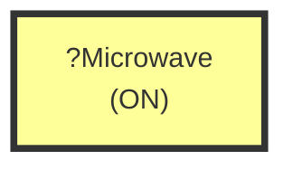
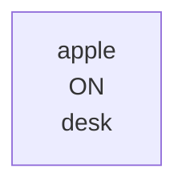
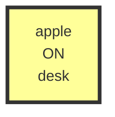

# 🚀 VirtualHome Agent Episode Log


### [GoalReasoner (Module A - Intent)] Output
```json
{
  "is_instruction_obviously_vague": false,
  "clarification_question": null,
  "target_object": "microwave",
  "location_hint": null,
  "reasoning_chain": [
    {
      "question": "Why does the user want this object?",
      "answer": "To keep the microwave operating in an on state."
    },
    {
      "question": "Why is that important?",
      "answer": "So the appliance remains powered and available for use or continues its current operation."
    },
    {
      "question": "What fundamental need does this fulfill?",
      "answer": "It supports the user's need to maintain the appliance in a functioning, active state."
    },
    {
      "question": "Are there any deeper psychological or physical motivations?",
      "answer": "The user likely wants continuous availability or uninterrupted operation of the appliance, possibly to preserve convenience or ongoing heating."
    }
  ],
  "deep_intent": "The user wants to keep an appliance powered and operational.",
  "acceptable_alternatives_properties": [
    {
      "priority": 1,
      "description": "Other household appliances that can be kept powered and active, such as an oven, toaster oven, or countertop heater"
    },
    {
      "priority": 2,
      "description": "Similar kitchen appliances that provide continuous readiness or operation, such as a coffee maker or air fryer"
    },
    {
      "priority": 3,
      "description": "Any indoor electrical device that can remain switched on without changing its intended function"
    },
    {
      "priority": 4,
      "description": "Other useful powered devices in the home that support convenience or task readiness"
    }
  ]
}
```

### [PerceptionFilter] Output
```json
{
  "reasoning": "The goal is to keep the microwave powered and operating, so the essential class is the microwave itself. No additional tools or locations are required by the SDG, and no alternative appliance is needed because the target is explicitly a microwave.",
  "selected_classes": [
    "microwave",
    "toaster",
    "character",
    "door"
  ],
  "raw_class_count": 45
}
```

### [LLMExecutor] Output
```json
{
  "reasoning": "The active task is to keep the microwave in an ON state. The filtered graph shows microwave(234) is OFF and located in the same kitchen as the character, so the immediate next step is to interact with it directly. Because switch actions require proximity, and there has been no prior walk action, I should first move to the microwave before switching it on.",
  "satisfied_nodes": [],
  "current_node_focus": "N1",
  "mapped_variables": {
    "?Microwave": "microwave(234)"
  },
  "action": "[walk] <microwave> (234)"
}
```

### [RoboStateMultiTaskController] Output
```json
{
  "action": "[walk] <microwave> (234)",
  "active_task_id": "task_1",
  "task_context": {
    "active_task_id": "task_1",
    "pending_task_ids": [
      "task_2",
      "task_3"
    ],
    "satisfied_task_ids": []
  },
  "source": "llm_executor"
}
```
## Step 0
- **Action**: `[walk] <microwave> (234)`
- **Action Success**: `True`
- **Action Message**: {'0': {'message': 'Success'}}
- **Active Task**: `task_1`
- **Decision Source**: `llm_executor`
- **Task Progress**: E1_19=pending, E1_02=pending, E1_03=pending
- **SDG Status**:

- **Observed Items (9)**: door(145) [OPEN], door(146) [OPEN], toaster(231) [OFF], microwave(234) [CLOSED,OFF], character(1), bathroom(11), bedroom(50), kitchen(126), livingroom(261)


### [PerceptionFilter] Output
```json
{
  "reasoning": "Reused cached class selection.",
  "selected_classes": [
    "microwave",
    "toaster",
    "character",
    "door"
  ],
  "raw_class_count": 45
}
```

### [LLMExecutor] Output
```json
{
  "reasoning": "The active task is to make the microwave ON. The current graph shows microwave(234) is CLOSE to the character and has HAS_SWITCH, so no further walk is needed. It is currently OFF and CLOSED, but the SDG only requires the ON state; however, to switch it on safely, I should first open it if needed and then switch it on. The single next atomic action is to open the microwave since it is the immediate prerequisite before interacting with its switch in this environment.",
  "satisfied_nodes": [],
  "current_node_focus": "N1",
  "mapped_variables": {
    "?Microwave": "microwave(234)"
  },
  "action": "[open] <microwave> (234)"
}
```

### [RoboStateMultiTaskController] Output
```json
{
  "action": "[open] <microwave> (234)",
  "active_task_id": "task_1",
  "task_context": {
    "active_task_id": "task_1",
    "pending_task_ids": [
      "task_2",
      "task_3"
    ],
    "satisfied_task_ids": []
  },
  "source": "llm_executor"
}
```
## Step 1
- **Action**: `[open] <microwave> (234)`
- **Action Success**: `True`
- **Action Message**: {'0': {'message': 'Success'}}
- **Active Task**: `task_1`
- **Decision Source**: `llm_executor`
- **Task Progress**: E1_19=pending, E1_02=pending, E1_03=pending
- **SDG Status**:

- **Observed Items (9)**: door(145) [OPEN], door(146) [OPEN], toaster(231) [OFF], microwave(234) [CLOSED,OFF], character(1), bathroom(11), bedroom(50), kitchen(126), livingroom(261)


### [PerceptionFilter] Output
```json
{
  "reasoning": "Reused cached class selection.",
  "selected_classes": [
    "microwave",
    "toaster",
    "character",
    "door"
  ],
  "raw_class_count": 45
}
```

### [LLMExecutor] Output
```json
{
  "reasoning": "The active goal is to make the microwave ON. We are already close to microwave(234), and it is currently OPEN and OFF. Since it has HAS_SWITCH and HAS_PLUG, the next required step toward N1 is to switch it on. No other nodes are satisfied yet because ON state has not been achieved.",
  "satisfied_nodes": [],
  "current_node_focus": "N1",
  "mapped_variables": {
    "?Microwave": "microwave(234)"
  },
  "action": "[switchon] <microwave> (234)"
}
```

### [RoboStateMultiTaskController] Output
```json
{
  "action": "[switchon] <microwave> (234)",
  "active_task_id": "task_1",
  "task_context": {
    "active_task_id": "task_1",
    "pending_task_ids": [
      "task_2",
      "task_3"
    ],
    "satisfied_task_ids": []
  },
  "source": "llm_executor"
}
```
## Step 2
- **Action**: `[switchon] <microwave> (234)`
- **Action Success**: `True`
- **Action Message**: Faked switch operation in Python layer (bypassed Unity failure)
- **Active Task**: `task_1`
- **Decision Source**: `llm_executor`
- **Task Progress**: E1_19=done, E1_02=pending, E1_03=pending
- **SDG Status**:

- **Observed Items (9)**: door(145) [OPEN], door(146) [OPEN], toaster(231) [OFF], microwave(234) [OPEN,OFF], character(1), bathroom(11), bedroom(50), kitchen(126), livingroom(261)


### [GoalReasoner (Module A - Intent)] Output
```json
{
  "is_instruction_obviously_vague": false,
  "clarification_question": null,
  "target_object": "apple",
  "location_hint": "desk",
  "reasoning_chain": [
    {
      "question": "Why does the user want this object?",
      "answer": "To have an apple available at the desk."
    },
    {
      "question": "Why is that important?",
      "answer": "So the user can access and use it from that location."
    },
    {
      "question": "What fundamental need does this fulfill?",
      "answer": "It fulfills the need to obtain a ready-to-use food item."
    },
    {
      "question": "Are there any deeper psychological or physical motivations?",
      "answer": "It likely supports hunger relief, a snack request, or convenient access to food during desk activity."
    }
  ],
  "deep_intent": "The user wants to obtain something edible to satisfy hunger or snack conveniently while at the desk.",
  "acceptable_alternatives_properties": [
    {
      "priority": 1,
      "description": "Other ready-to-eat fruits, such as a banana, orange, or pear"
    },
    {
      "priority": 2,
      "description": "Other portable snack foods, such as crackers, granola bars, or a sandwich"
    },
    {
      "priority": 3,
      "description": "Other packaged or grab-and-go foods that provide quick energy"
    },
    {
      "priority": 4,
      "description": "Any other edible item that can serve as a convenient snack"
    }
  ]
}
```

### [RoboStateMultiTaskController] Output
```json
{
  "action": "[walk] <bathroom> (11)",
  "active_task_id": "task_2",
  "task_context": {
    "active_task_id": "task_2",
    "pending_task_ids": [
      "task_3"
    ],
    "satisfied_task_ids": [
      "task_1"
    ]
  },
  "source": "room_frontier"
}
```
## Step 3
- **Action**: `[walk] <bathroom> (11)`
- **Action Success**: `True`
- **Action Message**: {'0': {'message': 'Success'}}
- **Active Task**: `task_2`
- **Decision Source**: `room_frontier`
- **Task Progress**: E1_19=done, E1_02=pending, E1_03=pending
- **SDG Status**:

- **Observed Items (126)**: floor(127), floor(128), floor(129), floor(130), floor(131), floor(132), floor(133), floor(134), floor(135), ceiling(136), ceiling(137), ceiling(138), ceiling(139), ceiling(140), ceiling(141)...


### [RoboStateMultiTaskController] Output
```json
{
  "action": "[walk] <bedroom> (50)",
  "active_task_id": "task_2",
  "task_context": {
    "active_task_id": "task_2",
    "pending_task_ids": [
      "task_3"
    ],
    "satisfied_task_ids": [
      "task_1"
    ]
  },
  "source": "room_frontier"
}
```
## Step 4
- **Action**: `[walk] <bedroom> (50)`
- **Action Success**: `True`
- **Action Message**: {'0': {'message': 'Success'}}
- **Active Task**: `task_2`
- **Decision Source**: `room_frontier`
- **Task Progress**: E1_19=done, E1_02=pending, E1_03=pending
- **SDG Status**:

- **Observed Items (164)**: floor(127), floor(128), floor(129), floor(130), floor(131), floor(132), floor(133), floor(134), floor(135), ceiling(136), ceiling(137), ceiling(138), ceiling(139), ceiling(140), ceiling(141)...


### [PerceptionFilter] Output
```json
{
  "reasoning": "The goal is to obtain an apple at the desk. The SDG explicitly requires the apple and the desk, so both must be kept. No extra tools or containers are needed for this simple placement/availability task.",
  "selected_classes": [
    "desk",
    "apple",
    "character"
  ],
  "raw_class_count": 82
}
```

### [LLMExecutor] Output
```json
{
  "reasoning": "The active goal is to have an apple on the desk. The exact target object can be any apple, and the only apple currently in the bedroom is apple(114), which is available and directly relevant. The desk is in the bedroom but is currently CLOSED, so to place an apple on it I must first get near the desk and then open it before any putback can occur. Since the immediate next required step toward satisfying N1 is to approach the destination object, I will walk to the desk now.",
  "satisfied_nodes": [],
  "current_node_focus": "N1",
  "mapped_variables": {},
  "action": "[walk] <desk> (80)"
}
```

### [RoboStateMultiTaskController] Output
```json
{
  "action": "[walk] <desk> (80)",
  "active_task_id": "task_2",
  "task_context": {
    "active_task_id": "task_2",
    "pending_task_ids": [
      "task_3"
    ],
    "satisfied_task_ids": [
      "task_1"
    ]
  },
  "source": "llm_executor"
}
```
## Step 5
- **Action**: `[walk] <desk> (80)`
- **Action Success**: `True`
- **Action Message**: {'0': {'message': 'Success'}}
- **Active Task**: `task_2`
- **Decision Source**: `llm_executor`
- **Task Progress**: E1_19=done, E1_02=pending, E1_03=pending
- **SDG Status**:

- **Observed Items (19)**: apple(249), apple(250), apple(251), apple(252), apple(253), apple(254), apple(255), apple(256), apple(257), apple(258), apple(259), apple(113), character(1), bathroom(11), bedroom(50)...


### [PerceptionFilter] Output
```json
{
  "reasoning": "Reused cached class selection.",
  "selected_classes": [
    "desk",
    "apple",
    "character"
  ],
  "raw_class_count": 82
}
```

### [LLMExecutor] Output
```json
{
  "reasoning": "The active goal is to have an apple ON the desk. The desk is already close to the character, so the next needed step is to obtain a suitable apple. Several apples are in the kitchen; apple(114) is in the bedroom, but since I am already in the bedroom and close to the desk, the most immediate legal step toward the goal is to walk to the target apple before grabbing it. I will bind ?Apple to apple(114) because it is a valid grabbable apple already observed in the current area and can later be placed on the desk.",
  "satisfied_nodes": [],
  "current_node_focus": "N1",
  "mapped_variables": {
    "?Apple": "apple(114)"
  },
  "action": "[walk] <apple> (114)"
}
```

### [RoboStateMultiTaskController] Output
```json
{
  "action": "[walk] <apple> (114)",
  "active_task_id": "task_2",
  "task_context": {
    "active_task_id": "task_2",
    "pending_task_ids": [
      "task_3"
    ],
    "satisfied_task_ids": [
      "task_1"
    ]
  },
  "source": "llm_executor"
}
```
## Step 6
- **Action**: `[walk] <apple> (114)`
- **Action Success**: `True`
- **Action Message**: {'0': {'message': 'Success'}}
- **Active Task**: `task_2`
- **Decision Source**: `llm_executor`
- **Task Progress**: E1_19=done, E1_02=pending, E1_03=pending
- **SDG Status**:

- **Observed Items (19)**: apple(249), apple(250), apple(251), apple(252), apple(253), apple(254), apple(255), apple(256), apple(257), apple(258), apple(259), apple(113), character(1), bathroom(11), bedroom(50)...


### [PerceptionFilter] Output
```json
{
  "reasoning": "Reused cached class selection.",
  "selected_classes": [
    "desk",
    "apple",
    "character"
  ],
  "raw_class_count": 82
}
```

### [LLMExecutor] Output
```json
{
  "reasoning": "The active goal is to have an apple on the desk. The current graph shows apple(114) is in the bedroom and already close to the character, while the desk(80) is in the bedroom but is CLOSED. Since placing an object on a surface requires being near that surface, the next necessary step is to walk to the desk before any putback action. The desk is the correct target surface for the SDG node N1.",
  "satisfied_nodes": [],
  "current_node_focus": "N1",
  "mapped_variables": {
    "?Surface": "desk(80)"
  },
  "action": "[walk] <desk> (80)"
}
```

### [RoboStateMultiTaskController] Output
```json
{
  "action": "[walk] <desk> (80)",
  "active_task_id": "task_2",
  "task_context": {
    "active_task_id": "task_2",
    "pending_task_ids": [
      "task_3"
    ],
    "satisfied_task_ids": [
      "task_1"
    ]
  },
  "source": "llm_executor"
}
```
## Step 7
- **Action**: `[walk] <desk> (80)`
- **Action Success**: `True`
- **Action Message**: {'0': {'message': 'Success'}}
- **Active Task**: `task_2`
- **Decision Source**: `llm_executor`
- **Task Progress**: E1_19=done, E1_02=pending, E1_03=pending
- **SDG Status**:

- **Observed Items (19)**: apple(249), apple(250), apple(251), apple(252), apple(253), apple(254), apple(255), apple(256), apple(257), apple(258), apple(259), apple(113), character(1), bathroom(11), bedroom(50)...


### [PerceptionFilter] Output
```json
{
  "reasoning": "Reused cached class selection.",
  "selected_classes": [
    "desk",
    "apple",
    "character"
  ],
  "raw_class_count": 82
}
```

### [LLMExecutor] Output
```json
{
  "reasoning": "The active goal is to have an apple on the desk. We are already close to desk(80), but the apple currently visible in the bedroom is apple(114), and there are also multiple apples in the kitchen. Since the desk is a flat surface and the apple must end up on it, the next needed action is to go to the apple we can directly access. Apple(114) is in the bedroom, which we can reach from here, and it is grabbable/movable. I will move to apple(114) first so I can grab it next. The desk itself is already the target surface, so no need to interact with it yet.",
  "satisfied_nodes": [],
  "current_node_focus": "N1",
  "mapped_variables": {
    "?TargetApple": "apple(114)",
    "?Desk": "desk(80)"
  },
  "action": "[walk] <apple> (114)"
}
```

### [RoboStateMultiTaskController] Output
```json
{
  "action": "[walk] <apple> (114)",
  "active_task_id": "task_2",
  "task_context": {
    "active_task_id": "task_2",
    "pending_task_ids": [
      "task_3"
    ],
    "satisfied_task_ids": [
      "task_1"
    ]
  },
  "source": "llm_executor"
}
```
## Step 8
- **Action**: `[walk] <apple> (114)`
- **Action Success**: `True`
- **Action Message**: {'0': {'message': 'Success'}}
- **Active Task**: `task_2`
- **Decision Source**: `llm_executor`
- **Task Progress**: E1_19=done, E1_02=pending, E1_03=pending
- **SDG Status**:

- **Observed Items (19)**: apple(249), apple(250), apple(251), apple(252), apple(253), apple(254), apple(255), apple(256), apple(257), apple(258), apple(259), apple(113), character(1), bathroom(11), bedroom(50)...


### [PerceptionFilter] Output
```json
{
  "reasoning": "Reused cached class selection.",
  "selected_classes": [
    "desk",
    "apple",
    "character"
  ],
  "raw_class_count": 82
}
```

### [LLMExecutor] Output
```json
{
  "reasoning": "The active goal is to have an apple on the desk. The current graph shows apple(114) is the only apple in the bedroom and is CLOSE to the character, so it is the best candidate to satisfy the task. The desk(80) is CLOSED but it is a flat surface target and can be used as the destination once reached; however, the apple is currently already near the character, so the immediate next step is to pick it up. I am not yet holding anything, and this does not require clarification.",
  "satisfied_nodes": [],
  "current_node_focus": "N1",
  "mapped_variables": {
    "?TargetApple": "apple(114)",
    "?Desk": "desk(80)"
  },
  "action": "[grab] <apple> (114)"
}
```

### [RoboStateMultiTaskController] Output
```json
{
  "action": "[grab] <apple> (114)",
  "active_task_id": "task_2",
  "task_context": {
    "active_task_id": "task_2",
    "pending_task_ids": [
      "task_3"
    ],
    "satisfied_task_ids": [
      "task_1"
    ]
  },
  "source": "llm_executor"
}
```
## Step 9
- **Action**: `[grab] <apple> (114)`
- **Action Success**: `True`
- **Action Message**: {'0': {'message': 'Success'}}
- **Active Task**: `task_2`
- **Decision Source**: `llm_executor`
- **Task Progress**: E1_19=done, E1_02=pending, E1_03=pending
- **SDG Status**:

- **Observed Items (19)**: apple(249), apple(250), apple(251), apple(252), apple(253), apple(254), apple(255), apple(256), apple(257), apple(258), apple(259), apple(113), character(1), bathroom(11), bedroom(50)...


### [PerceptionFilter] Output
```json
{
  "reasoning": "Reused cached class selection.",
  "selected_classes": [
    "desk",
    "apple",
    "character"
  ],
  "raw_class_count": 82
}
```

### [LLMExecutor] Output
```json
{
  "reasoning": "The active SDG requires apple(114) to be ON desk(80). The robot is already holding apple(114) and is close to it, but the desk is currently CLOSED and needs to be interacted with at its location before placing the apple on it. Since the task is to end with the apple on the desk surface, the next required step is to get near the desk so a putback can be executed afterward.",
  "satisfied_nodes": [],
  "current_node_focus": "N1",
  "mapped_variables": {},
  "action": "[walk] <desk> (80)"
}
```

### [RoboStateMultiTaskController] Output
```json
{
  "action": "[walk] <desk> (80)",
  "active_task_id": "task_2",
  "task_context": {
    "active_task_id": "task_2",
    "pending_task_ids": [
      "task_3"
    ],
    "satisfied_task_ids": [
      "task_1"
    ]
  },
  "source": "llm_executor"
}
```
## Step 10
- **Action**: `[walk] <desk> (80)`
- **Action Success**: `True`
- **Action Message**: {'0': {'message': 'Success'}}
- **Active Task**: `task_2`
- **Decision Source**: `llm_executor`
- **Task Progress**: E1_19=done, E1_02=pending, E1_03=pending
- **SDG Status**:

- **Observed Items (19)**: apple(249), apple(250), apple(251), apple(252), apple(253), apple(254), apple(255), apple(256), apple(257), apple(258), apple(259), apple(113), character(1), bathroom(11), bedroom(50)...


### [PerceptionFilter] Output
```json
{
  "reasoning": "Reused cached class selection.",
  "selected_classes": [
    "desk",
    "apple",
    "character"
  ],
  "raw_class_count": 82
}
```

### [LLMExecutor] Output
```json
{
  "reasoning": "The active goal is to have an apple on the desk. The currently held apple(114) is already close to the character, and the desk(80) is also close. Since the apple is not yet on the desk and we are already at the desk, the next required step is to place the held apple onto the flat desk surface. The desk is marked CLOSED but that does not block placing items on top of it, and as a surface it should use putback rather than putin.",
  "satisfied_nodes": [],
  "current_node_focus": "N1",
  "mapped_variables": {
    "?TargetSurface": "desk(80)",
    "?Item": "apple(114)"
  },
  "action": "[putback] <apple> (114) <desk> (80)"
}
```

### [RoboStateMultiTaskController] Output
```json
{
  "action": "[putback] <apple> (114) <desk> (80)",
  "active_task_id": "task_2",
  "task_context": {
    "active_task_id": "task_2",
    "pending_task_ids": [
      "task_3"
    ],
    "satisfied_task_ids": [
      "task_1"
    ]
  },
  "source": "llm_executor"
}
```
## Step 11
- **Action**: `[putback] <apple> (114) <desk> (80)`
- **Action Success**: `True`
- **Action Message**: {'0': {'message': 'Success'}}
- **Active Task**: `task_2`
- **Decision Source**: `llm_executor`
- **Task Progress**: E1_19=done, E1_02=done, E1_03=pending
- **SDG Status**:

- **Observed Items (19)**: apple(249), apple(250), apple(251), apple(252), apple(253), apple(254), apple(255), apple(256), apple(257), apple(258), apple(259), apple(113), character(1), bathroom(11), bedroom(50)...


### [GoalReasoner (Module A - Intent)] Output
```json
{
  "is_instruction_obviously_vague": false,
  "clarification_question": null,
  "target_object": "book",
  "location_hint": "sofa",
  "reasoning_chain": [
    {
      "question": "Why does the user want this object?",
      "answer": "To relocate unorganized books away from their current position and place them on the sofa."
    },
    {
      "question": "Why is that important?",
      "answer": "It likely helps organize the space by collecting books in one place."
    },
    {
      "question": "What fundamental need does this fulfill?",
      "answer": "It fulfills the need to organize or tidy the environment."
    },
    {
      "question": "Are there any deeper psychological or physical motivations?",
      "answer": "The user may want to reduce clutter, make items easier to find later, or improve the room's orderliness."
    }
  ],
  "deep_intent": "The user wants to organize the environment by gathering misplaced items into a designated location.",
  "acceptable_alternatives_properties": [
    {
      "priority": 1,
      "description": "Other similarly unorganized reading materials such as magazines, notebooks, or documents that can be gathered together."
    },
    {
      "priority": 2,
      "description": "Other paper-based or lightweight tabletop items that are commonly scattered and can be consolidated in one place."
    },
    {
      "priority": 3,
      "description": "A small set of loose household items that need tidying into a single visible spot."
    },
    {
      "priority": 4,
      "description": "Any clutter that can be collected to reduce disorder in the room."
    }
  ]
}
```

### [PerceptionFilter] Output
```json
{
  "reasoning": "The goal is to place books on the sofa, so the only strictly necessary class is the target item book and the destination location sofa. No tools or alternative receptacles are required by the SDG.",
  "selected_classes": [
    "paper",
    "sofa",
    "character",
    "book"
  ],
  "raw_class_count": 82
}
```

### [LLMExecutor] Output
```json
{
  "reasoning": "The active SDG requires a book to be ON the sofa. The filtered graph shows a book already in the bedroom, and the sofa is also in the bedroom. Since I am not yet near the book or holding it, the next step must be to walk to a suitable book instance before I can grab it and later place it on the sofa. Book(104) is the most appropriate nearby candidate in the same room as the sofa.",
  "satisfied_nodes": [],
  "current_node_focus": "N1",
  "mapped_variables": {},
  "action": "[walk] <book> (104)"
}
```

### [RoboStateMultiTaskController] Output
```json
{
  "action": "[walk] <book> (104)",
  "active_task_id": "task_3",
  "task_context": {
    "active_task_id": "task_3",
    "pending_task_ids": [],
    "satisfied_task_ids": [
      "task_1",
      "task_2"
    ]
  },
  "source": "llm_executor"
}
```
## Step 12
- **Action**: `[walk] <book> (104)`
- **Action Success**: `True`
- **Action Message**: {'0': {'message': 'Success'}}
- **Active Task**: `task_3`
- **Decision Source**: `llm_executor`
- **Task Progress**: E1_19=done, E1_02=done, E1_03=pending
- **SDG Status**:

- **Observed Items (10)**: book(163) [CLOSED], book(164) [CLOSED], character(1), bathroom(11), bedroom(50), kitchen(126), livingroom(261), sofa(85), book(104) [CLOSED], paper(109)


### [PerceptionFilter] Output
```json
{
  "reasoning": "Reused cached class selection.",
  "selected_classes": [
    "paper",
    "sofa",
    "character",
    "book"
  ],
  "raw_class_count": 82
}
```

### [LLMExecutor] Output
```json
{
  "reasoning": "The active SDG requires a book to be ON the sofa. We are already near book(104) in the bedroom from the previous successful walk, and it is the best bind for the target book because it is explicitly in the bedroom and closest to the sofa. The next atomic step should be to pick it up before moving it onto the sofa. I am not yet at the sofa, so I cannot put it down there this step.",
  "satisfied_nodes": [],
  "current_node_focus": "N1",
  "mapped_variables": {
    "?TargetBook": "book(104)",
    "?Surface": "sofa(85)"
  },
  "action": "[grab] <book> (104)"
}
```

### [RoboStateMultiTaskController] Output
```json
{
  "action": "[grab] <book> (104)",
  "active_task_id": "task_3",
  "task_context": {
    "active_task_id": "task_3",
    "pending_task_ids": [],
    "satisfied_task_ids": [
      "task_1",
      "task_2"
    ]
  },
  "source": "llm_executor"
}
```
## Step 13
- **Action**: `[grab] <book> (104)`
- **Action Success**: `True`
- **Action Message**: {'0': {'message': 'Success'}}
- **Active Task**: `task_3`
- **Decision Source**: `llm_executor`
- **Task Progress**: E1_19=done, E1_02=done, E1_03=pending
- **SDG Status**:

- **Observed Items (10)**: book(163) [CLOSED], book(164) [CLOSED], character(1), bathroom(11), bedroom(50), kitchen(126), livingroom(261), sofa(85), book(104) [CLOSED], paper(109)


### [PerceptionFilter] Output
```json
{
  "reasoning": "Reused cached class selection.",
  "selected_classes": [
    "paper",
    "sofa",
    "character",
    "book"
  ],
  "raw_class_count": 82
}
```

### [LLMExecutor] Output
```json
{
  "reasoning": "The active goal is to place a book on the sofa. We are already holding book(104) in the bedroom, and the sofa(85) is the required destination. The next necessary step is to move close to the sofa before any putback action can be done. The other book instances are inside the kitchen and are not needed because we already have the target book in hand.",
  "satisfied_nodes": [],
  "current_node_focus": "N1",
  "mapped_variables": {},
  "action": "[walk] <sofa> (85)"
}
```

### [RoboStateMultiTaskController] Output
```json
{
  "action": "[walk] <sofa> (85)",
  "active_task_id": "task_3",
  "task_context": {
    "active_task_id": "task_3",
    "pending_task_ids": [],
    "satisfied_task_ids": [
      "task_1",
      "task_2"
    ]
  },
  "source": "llm_executor"
}
```
## Step 14
- **Action**: `[walk] <sofa> (85)`
- **Action Success**: `True`
- **Action Message**: {'0': {'message': 'Success'}}
- **Active Task**: `task_3`
- **Decision Source**: `llm_executor`
- **Task Progress**: E1_19=done, E1_02=done, E1_03=pending
- **SDG Status**:

- **Observed Items (10)**: book(163) [CLOSED], book(164) [CLOSED], character(1), bathroom(11), bedroom(50), kitchen(126), livingroom(261), sofa(85), book(104) [CLOSED], paper(109)


### [PerceptionFilter] Output
```json
{
  "reasoning": "Reused cached class selection.",
  "selected_classes": [
    "paper",
    "sofa",
    "character",
    "book"
  ],
  "raw_class_count": 82
}
```

### [LLMExecutor] Output
```json
{
  "reasoning": "The active SDG requires book ON sofa. We are already close to sofa(85), and the held book is book(104), which is the exact instance currently in hand. The next atomic step toward satisfying N1 is to place the held book onto the nearby sofa. Since putback requires being near the destination and we are already close to the sofa, this is the correct next action.",
  "satisfied_nodes": [],
  "current_node_focus": "N1",
  "mapped_variables": {
    "?TargetSurface": "sofa(85)"
  },
  "action": "[putback] <book> (104) <sofa> (85)"
}
```

### [RoboStateMultiTaskController] Output
```json
{
  "action": "[putback] <book> (104) <sofa> (85)",
  "active_task_id": "task_3",
  "task_context": {
    "active_task_id": "task_3",
    "pending_task_ids": [],
    "satisfied_task_ids": [
      "task_1",
      "task_2"
    ]
  },
  "source": "llm_executor"
}
```
## Step 15
- **Action**: `[putback] <book> (104) <sofa> (85)`
- **Action Success**: `True`
- **Action Message**: {'0': {'message': 'Success'}}
- **Active Task**: `task_3`
- **Decision Source**: `llm_executor`
- **Task Progress**: E1_19=done, E1_02=done, E1_03=done
- **SDG Status**:

- **Observed Items (10)**: book(163) [CLOSED], book(164) [CLOSED], character(1), bathroom(11), bedroom(50), kitchen(126), livingroom(261), sofa(85), book(104) [CLOSED], paper(109)

