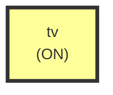
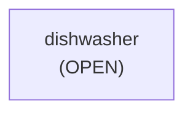
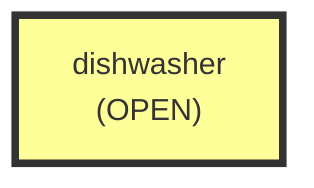
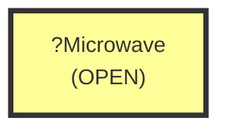

# 🚀 VirtualHome Agent Episode Log


### [GoalReasoner (Module A - Intent)] Output
```json
{
  "is_instruction_obviously_vague": false,
  "clarification_question": null,
  "target_object": "tv",
  "location_hint": null,
  "reasoning_chain": [
    {
      "question": "Why does the user want this object?",
      "answer": "To have the television powered on when no one is currently watching it."
    },
    {
      "question": "Why is that important?",
      "answer": "Because the user wants the television to be in an on state under the condition that it is unattended."
    },
    {
      "question": "What fundamental need does this fulfill?",
      "answer": "It fulfills the need to maintain a desired device power state in the environment."
    },
    {
      "question": "Are there any deeper psychological or physical motivations?",
      "answer": "The motivation may be to keep the television ready for use, continue media playback or presence, or ensure the device remains active when not being observed."
    }
  ],
  "deep_intent": "The user wants a device to remain powered on when it is not being actively observed.",
  "acceptable_alternatives_properties": [
    {
      "priority": 1,
      "description": "Other indoor electronic devices that can be kept powered on in a similar way, such as a monitor or smart display."
    },
    {
      "priority": 2,
      "description": "Other audiovisual devices or screens that can remain active, such as a computer monitor or tablet on a stand."
    },
    {
      "priority": 3,
      "description": "Other household electronics that can stay in an on state, such as a radio or speaker system."
    },
    {
      "priority": 4,
      "description": "Any similar powered household device that can be left active without direct attention."
    }
  ]
}
```

### [PerceptionFilter] Output
```json
{
  "reasoning": "The goal is to keep the TV powered on, so the essential object class is the tv itself. A powersocket is also relevant as the TV’s power source/back-up connection needed to maintain the on state. No other visible objects are necessary.",
  "selected_classes": [
    "powersocket",
    "character",
    "tv"
  ],
  "raw_class_count": 27
}
```

### [LLMExecutor] Output
```json
{
  "reasoning": "The active goal is to make tv(238) ON. The TV is currently OFF and it has HAS_PLUG, so the safest progression is to first move near the TV before any interaction. No prior actions have been taken, and there are no global restrictions. The power socket is present nearby, but the TV itself is the object whose switch must be operated to satisfy N1.",
  "satisfied_nodes": [],
  "current_node_focus": "N1",
  "mapped_variables": {},
  "action": "[walk] <tv> (238)"
}
```

### [RoboStateMultiTaskController] Output
```json
{
  "action": "[walk] <tv> (238)",
  "active_task_id": "task_1",
  "task_context": {
    "active_task_id": "task_1",
    "pending_task_ids": [
      "task_2",
      "task_3"
    ],
    "satisfied_task_ids": []
  },
  "source": "llm_executor"
}
```
## Step 0
- **Action**: `[walk] <tv> (238)`
- **Action Success**: `True`
- **Action Message**: {'0': {'message': 'Success'}}
- **Active Task**: `task_1`
- **Decision Source**: `llm_executor`
- **Task Progress**: E1_01=pending, E1_04=pending, E1_05=pending
- **SDG Status**:

- **Observed Items (8)**: tv(238) [OFF], powersocket(240), character(1), kitchen(11), livingroom(183), bedroom(241), bathroom(285), bedroom(346)


### [PerceptionFilter] Output
```json
{
  "reasoning": "Reused cached class selection.",
  "selected_classes": [
    "powersocket",
    "character",
    "tv"
  ],
  "raw_class_count": 27
}
```

### [LLMExecutor] Output
```json
{
  "reasoning": "The active goal is to get tv(238) into the ON state. The TV is already close to the character and has HAS_SWITCH and HAS_PLUG, so it must be plugged in first if not already powered. The current graph does not show it plugged in, and the nearby powersocket(240) is available in the same room. Since switch-on requires the device to be plugged in, the next atomic step is to walk to the socket so I can plug the TV in on the following action.",
  "satisfied_nodes": [],
  "current_node_focus": "N1",
  "mapped_variables": {
    "?Device": "tv(238)",
    "?Outlet": "powersocket(240)"
  },
  "action": "[walk] <powersocket> (240)"
}
```

### [RoboStateMultiTaskController] Output
```json
{
  "action": "[walk] <powersocket> (240)",
  "active_task_id": "task_1",
  "task_context": {
    "active_task_id": "task_1",
    "pending_task_ids": [
      "task_2",
      "task_3"
    ],
    "satisfied_task_ids": []
  },
  "source": "llm_executor"
}
```
## Step 1
- **Action**: `[walk] <powersocket> (240)`
- **Action Success**: `True`
- **Action Message**: {'0': {'message': 'Success'}}
- **Active Task**: `task_1`
- **Decision Source**: `llm_executor`
- **Task Progress**: E1_01=pending, E1_04=pending, E1_05=pending
- **SDG Status**:

- **Observed Items (8)**: tv(238) [OFF], powersocket(240), character(1), kitchen(11), livingroom(183), bedroom(241), bathroom(285), bedroom(346)


### [PerceptionFilter] Output
```json
{
  "reasoning": "Reused cached class selection.",
  "selected_classes": [
    "powersocket",
    "character",
    "tv"
  ],
  "raw_class_count": 27
}
```

### [LLMExecutor] Output
```json
{
  "reasoning": "The TV is the only SDG target and it is currently OFF. The graph shows it has HAS_SWITCH and HAS_PLUG, and the agent is already close to the powersocket, which is the correct prerequisite location for power-related interaction. Since the prior walk to the socket was successful, the next atomic step is to plug the TV in before switching it on.",
  "satisfied_nodes": [],
  "current_node_focus": "N1",
  "mapped_variables": {
    "?PowerSource": "powersocket(240)"
  },
  "action": "[plugin] <tv> (238)"
}
```

### [RoboStateMultiTaskController] Output
```json
{
  "action": "[walk] <tv> (238)",
  "active_task_id": "task_1",
  "task_context": {
    "active_task_id": "task_1",
    "pending_task_ids": [
      "task_2",
      "task_3"
    ],
    "satisfied_task_ids": []
  },
  "source": "llm_executor_repaired"
}
```
## Step 2
- **Action**: `[walk] <tv> (238)`
- **Action Success**: `True`
- **Action Message**: {'0': {'message': 'Success'}}
- **Active Task**: `task_1`
- **Decision Source**: `llm_executor_repaired`
- **Task Progress**: E1_01=pending, E1_04=pending, E1_05=pending
- **SDG Status**:

- **Observed Items (8)**: tv(238) [OFF], powersocket(240), character(1), kitchen(11), livingroom(183), bedroom(241), bathroom(285), bedroom(346)


### [PerceptionFilter] Output
```json
{
  "reasoning": "Reused cached class selection.",
  "selected_classes": [
    "powersocket",
    "character",
    "tv"
  ],
  "raw_class_count": 27
}
```

### [LLMExecutor] Output
```json
{
  "reasoning": "The active task is to get tv(238) into the ON state. The TV is already CLOSE to the character and has HAS_SWITCH/HAS_PLUG, so the next required step is to turn it on. The power socket is not needed yet because the TV may already be plugged in or can be handled after a switch-on attempt if required by the environment.",
  "satisfied_nodes": [],
  "current_node_focus": "N1",
  "mapped_variables": {},
  "action": "[switchon] <tv> (238)"
}
```

### [RoboStateMultiTaskController] Output
```json
{
  "action": "[switchon] <tv> (238)",
  "active_task_id": "task_1",
  "task_context": {
    "active_task_id": "task_1",
    "pending_task_ids": [
      "task_2",
      "task_3"
    ],
    "satisfied_task_ids": []
  },
  "source": "llm_executor"
}
```
## Step 3
- **Action**: `[switchon] <tv> (238)`
- **Action Success**: `True`
- **Action Message**: Faked switch operation in Python layer (bypassed Unity failure)
- **Active Task**: `task_1`
- **Decision Source**: `llm_executor`
- **Task Progress**: E1_01=done, E1_04=pending, E1_05=pending
- **SDG Status**:

- **Observed Items (8)**: tv(238) [OFF], powersocket(240), character(1), kitchen(11), livingroom(183), bedroom(241), bathroom(285), bedroom(346)


### [GoalReasoner (Module A - Intent)] Output
```json
{
  "is_instruction_obviously_vague": false,
  "clarification_question": null,
  "target_object": "dishwasher",
  "location_hint": null,
  "reasoning_chain": [
    {
      "question": "Why does the user want this object?",
      "answer": "To allow moisture inside the appliance to escape."
    },
    {
      "question": "Why is that important?",
      "answer": "To help the interior dry after use."
    },
    {
      "question": "What fundamental need does this fulfill?",
      "answer": "It reduces residual dampness and supports proper drying/ventilation."
    },
    {
      "question": "Are there any deeper psychological or physical motivations?",
      "answer": "It helps prevent lingering wetness, which can reduce odor or mildew formation and keep the appliance ready for the next use."
    }
  ],
  "deep_intent": "The user wants to dry out a damp enclosed space by allowing ventilation.",
  "acceptable_alternatives_properties": [
    {
      "priority": 1,
      "description": "Other enclosed household compartments or appliances that can be left open for air-drying, such as an oven door, cabinet, or storage bin."
    },
    {
      "priority": 2,
      "description": "Similar indoor containers or chambers that retain moisture and benefit from airflow, such as a cooler, laundry hamper, or storage drawer."
    },
    {
      "priority": 3,
      "description": "Ventilation aids for drying, such as a fan or dehumidifier placed nearby to promote airflow."
    },
    {
      "priority": 4,
      "description": "Any household method that helps remove moisture from an enclosed area, such as drying racks or absorbent towels used in the vicinity."
    }
  ]
}
```

### [RoboStateMultiTaskController] Output
```json
{
  "action": "[walk] <kitchen> (11)",
  "active_task_id": "task_2",
  "task_context": {
    "active_task_id": "task_2",
    "pending_task_ids": [
      "task_3"
    ],
    "satisfied_task_ids": [
      "task_1"
    ]
  },
  "source": "room_frontier"
}
```
## Step 4
- **Action**: `[walk] <kitchen> (11)`
- **Action Success**: `True`
- **Action Message**: {'0': {'message': 'Success'}}
- **Active Task**: `task_2`
- **Decision Source**: `room_frontier`
- **Task Progress**: E1_01=done, E1_04=pending, E1_05=pending
- **SDG Status**:

- **Observed Items (58)**: floor(184), floor(185), floor(186), floor(187), floor(188), floor(189), wall(190), wall(191), wall(192), wall(193), wall(194), wall(195), ceiling(196), ceiling(197), ceiling(198)...


### [PerceptionFilter] Output
```json
{
  "reasoning": "The goal is to dry out the dishwasher by leaving it open, so the required target is the dishwasher itself. No additional tools are needed beyond the appliance and its open state.",
  "selected_classes": [
    "dishwasher",
    "character",
    "door"
  ],
  "raw_class_count": 59
}
```

### [LLMExecutor] Output
```json
{
  "reasoning": "The active task goal is to make the dishwasher OPEN. The current graph shows dishwasher(165) is in the same room (kitchen) and is CLOSED, so the next step is to interact with it directly by opening it. No clarification is needed because the target is unambiguous and the object is present.",
  "satisfied_nodes": [],
  "current_node_focus": "N1",
  "mapped_variables": {},
  "action": "[open] <dishwasher> (165)"
}
```

### [RoboStateMultiTaskController] Output
```json
{
  "action": "[walk] <dishwasher> (165)",
  "active_task_id": "task_2",
  "task_context": {
    "active_task_id": "task_2",
    "pending_task_ids": [
      "task_3"
    ],
    "satisfied_task_ids": [
      "task_1"
    ]
  },
  "source": "llm_executor_repaired"
}
```
## Step 5
- **Action**: `[walk] <dishwasher> (165)`
- **Action Success**: `True`
- **Action Message**: {'0': {'message': 'Success'}}
- **Active Task**: `task_2`
- **Decision Source**: `llm_executor_repaired`
- **Task Progress**: E1_01=done, E1_04=pending, E1_05=pending
- **SDG Status**:

- **Observed Items (8)**: character(1), kitchen(11), livingroom(183), bedroom(241), bathroom(285), bedroom(346), door(47) [OPEN], dishwasher(165) [CLOSED,OFF]


### [PerceptionFilter] Output
```json
{
  "reasoning": "Reused cached class selection.",
  "selected_classes": [
    "dishwasher",
    "character",
    "door"
  ],
  "raw_class_count": 59
}
```

### [LLMExecutor] Output
```json
{
  "reasoning": "The active goal is to make the dishwasher OPEN, and the current graph shows I am already close to dishwasher(165). Since it is a can-open appliance and currently CLOSED, the next necessary step is to open it. No other nodes are satisfied yet because the target state OPEN is not present.",
  "satisfied_nodes": [],
  "current_node_focus": "N1",
  "mapped_variables": {},
  "action": "[open] <dishwasher> (165)"
}
```

### [RoboStateMultiTaskController] Output
```json
{
  "action": "[open] <dishwasher> (165)",
  "active_task_id": "task_2",
  "task_context": {
    "active_task_id": "task_2",
    "pending_task_ids": [
      "task_3"
    ],
    "satisfied_task_ids": [
      "task_1"
    ]
  },
  "source": "llm_executor"
}
```
## Step 6
- **Action**: `[open] <dishwasher> (165)`
- **Action Success**: `True`
- **Action Message**: {'0': {'message': 'Success'}}
- **Active Task**: `task_2`
- **Decision Source**: `llm_executor`
- **Task Progress**: E1_01=done, E1_04=done, E1_05=pending
- **SDG Status**:

- **Observed Items (8)**: character(1), kitchen(11), livingroom(183), bedroom(241), bathroom(285), bedroom(346), door(47) [OPEN], dishwasher(165) [CLOSED,OFF]


### [GoalReasoner (Module A - Intent)] Output
```json
{
  "is_instruction_obviously_vague": false,
  "clarification_question": null,
  "target_object": "microwave",
  "location_hint": null,
  "reasoning_chain": [
    {
      "question": "Why does the user want this object?",
      "answer": "To keep the appliance accessible and ready for servicing or inspection."
    },
    {
      "question": "Why is that important?",
      "answer": "So maintenance can be performed without needing to reopen or adjust the appliance first."
    },
    {
      "question": "What fundamental need does this fulfill?",
      "answer": "It supports the need to prepare equipment for upkeep and repair."
    },
    {
      "question": "Are there any deeper psychological or physical motivations?",
      "answer": "The user likely wants to facilitate safe, efficient maintenance and reduce friction for the person performing the work."
    }
  ],
  "deep_intent": "The user wants to prepare an appliance for maintenance access.",
  "acceptable_alternatives_properties": [
    {
      "priority": 1,
      "description": "Other household appliances or access panels that can be left open for servicing, such as an oven door or cabinet access door"
    },
    {
      "priority": 2,
      "description": "Similar appliance openings or compartments that provide internal access, such as a dishwasher door or utility panel"
    },
    {
      "priority": 3,
      "description": "Any indoor equipment covers or doors that need to remain open for inspection or repair"
    },
    {
      "priority": 4,
      "description": "Other physical access points in the home that can be kept open to support maintenance work"
    }
  ]
}
```

### [PerceptionFilter] Output
```json
{
  "reasoning": "The goal is to leave the microwave open for maintenance access, so the only strictly necessary class is the microwave itself. No alternative access appliance is required by the current SDG, since the state target is specifically the microwave being OPEN.",
  "selected_classes": [
    "microwave",
    "dishwasher",
    "character",
    "door"
  ],
  "raw_class_count": 59
}
```

### [LLMExecutor] Output
```json
{
  "reasoning": "The active SDG has a single unmet node: the microwave must be OPEN. The filtered graph shows microwave(171) is CLOSED and in the kitchen. I am already in the kitchen, so the next atomic step is to open the microwave directly. Dishwasher is unrelated to the current task and should not be manipulated further.",
  "satisfied_nodes": [],
  "current_node_focus": "N1",
  "mapped_variables": {
    "?Microwave": "microwave(171)"
  },
  "action": "[open] <microwave> (171)"
}
```

### [RoboStateMultiTaskController] Output
```json
{
  "action": "[walk] <microwave> (171)",
  "active_task_id": "task_3",
  "task_context": {
    "active_task_id": "task_3",
    "pending_task_ids": [],
    "satisfied_task_ids": [
      "task_1",
      "task_2"
    ]
  },
  "source": "llm_executor_repaired"
}
```
## Step 7
- **Action**: `[walk] <microwave> (171)`
- **Action Success**: `True`
- **Action Message**: {'0': {'message': 'Success'}}
- **Active Task**: `task_3`
- **Decision Source**: `llm_executor_repaired`
- **Task Progress**: E1_01=done, E1_04=done, E1_05=pending
- **SDG Status**:

- **Observed Items (9)**: character(1), kitchen(11), livingroom(183), bedroom(241), bathroom(285), bedroom(346), door(47) [OPEN], dishwasher(165) [OPEN,OFF], microwave(171) [CLOSED,OFF]


### [PerceptionFilter] Output
```json
{
  "reasoning": "Reused cached class selection.",
  "selected_classes": [
    "microwave",
    "dishwasher",
    "character",
    "door"
  ],
  "raw_class_count": 59
}
```

### [LLMExecutor] Output
```json
{
  "reasoning": "The active SDG has one unmet node: the microwave must be OPEN. The filtered graph shows microwave(171) is CLOSED and the character is already CLOSE to it, so the next valid step is to open it. No other task objects should be manipulated.",
  "satisfied_nodes": [],
  "current_node_focus": "N1",
  "mapped_variables": {
    "?Microwave": "microwave(171)"
  },
  "action": "[open] <microwave> (171)"
}
```

### [RoboStateMultiTaskController] Output
```json
{
  "action": "[open] <microwave> (171)",
  "active_task_id": "task_3",
  "task_context": {
    "active_task_id": "task_3",
    "pending_task_ids": [],
    "satisfied_task_ids": [
      "task_1",
      "task_2"
    ]
  },
  "source": "llm_executor"
}
```
## Step 8
- **Action**: `[open] <microwave> (171)`
- **Action Success**: `True`
- **Action Message**: {'0': {'message': 'Success'}}
- **Active Task**: `task_3`
- **Decision Source**: `llm_executor`
- **Task Progress**: E1_01=done, E1_04=done, E1_05=done
- **SDG Status**:

- **Observed Items (9)**: character(1), kitchen(11), livingroom(183), bedroom(241), bathroom(285), bedroom(346), door(47) [OPEN], dishwasher(165) [OPEN,OFF], microwave(171) [CLOSED,OFF]

