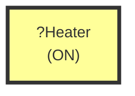
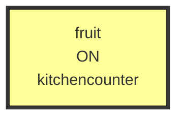

# 🚀 VirtualHome Agent Episode Log


### [GoalReasoner (Module A - Intent)] Output
```json
{
  "is_instruction_obviously_vague": false,
  "clarification_question": null,
  "target_object": "microwave",
  "location_hint": null,
  "reasoning_chain": [
    {
      "question": "Why does the user want this object?",
      "answer": "To change its power state from off to on."
    },
    {
      "question": "Why is that important?",
      "answer": "Because the user wants the appliance to be available for use or actively operating."
    },
    {
      "question": "What fundamental need does this fulfill?",
      "answer": "It fulfills the need to activate a household appliance so it can perform its intended function."
    },
    {
      "question": "Are there any deeper psychological or physical motivations?",
      "answer": "The motivation is likely practical convenience or preparation for cooking/heating food."
    }
  ],
  "deep_intent": "The user wants to activate a household appliance.",
  "acceptable_alternatives_properties": [
    {
      "priority": 1,
      "description": "Other household appliances that can be turned on to perform a similar function, such as an oven, toaster oven, or kettle."
    },
    {
      "priority": 2,
      "description": "Other kitchen devices with an on/off operating state, such as a blender or coffee maker."
    },
    {
      "priority": 3,
      "description": "Any indoor electrical device that can be powered on to provide useful function."
    },
    {
      "priority": 4,
      "description": "A different way to accomplish the same practical goal, such as using a stove or other heating appliance if the microwave is unavailable."
    }
  ]
}
```

### [PerceptionFilter] Output
```json
{
  "reasoning": "The goal is to turn on a household appliance, and the SDG requires a heating/appliance object in the ON state. The exact target class is microwave, and I should retain close functional alternatives with similar on/off utility in case the microwave is unavailable, plus a basic power source if needed.",
  "selected_classes": [
    "character",
    "door",
    "stove",
    "toaster",
    "microwave",
    "coffeemaker",
    "powersocket"
  ],
  "raw_class_count": 45
}
```

### [LLMExecutor] Output
```json
{
  "reasoning": "The active task is to satisfy N1 by turning the heater on. The best binding from the filtered graph is microwave(234), since it is a household appliance with HAS_SWITCH and currently OFF. Because switch actions require proximity, I should first walk to the microwave before switching it on. The microwave is not dirty, and it is already in the kitchen with the character, so no additional setup is needed.",
  "satisfied_nodes": [],
  "current_node_focus": "N1",
  "mapped_variables": {
    "?Heater": "microwave(234)"
  },
  "action": "[walk] <microwave> (234)"
}
```

### [RoboStateMultiTaskController] Output
```json
{
  "action": "[walk] <microwave> (234)",
  "active_task_id": "task_1",
  "task_context": {
    "active_task_id": "task_1",
    "pending_task_ids": [
      "task_2",
      "task_3"
    ],
    "satisfied_task_ids": []
  },
  "source": "llm_executor"
}
```
## Step 0
- **Action**: `[walk] <microwave> (234)`
- **Action Success**: `True`
- **Action Message**: {'0': {'message': 'Success'}}
- **Active Task**: `task_1`
- **Decision Source**: `llm_executor`
- **Task Progress**: E1_19=pending, E1_02=pending, E1_03=pending
- **SDG Status**:

- **Observed Items (12)**: door(145) [OPEN], door(146) [OPEN], powersocket(156), stove(226) [OFF,CLOSED], coffeemaker(229) [OFF], toaster(231) [OFF], microwave(234) [OFF,CLOSED], character(1), bathroom(11), bedroom(50), kitchen(126), livingroom(261)


### [PerceptionFilter] Output
```json
{
  "reasoning": "Reused cached class selection.",
  "selected_classes": [
    "character",
    "door",
    "stove",
    "toaster",
    "microwave",
    "coffeemaker",
    "powersocket"
  ],
  "raw_class_count": 45
}
```

### [LLMExecutor] Output
```json
{
  "reasoning": "The active task is to turn the microwave ON. The filtered graph shows microwave(234) is already CLOSE to the character, so no additional walk is needed. It has HAS_SWITCH and is currently OFF, so the next direct action is to switch it on. Since the microwave is not listed as needing a plug-in check beyond HAS_PLUG, and no power constraint blocks it, this should satisfy the SDG node N1.",
  "satisfied_nodes": [],
  "current_node_focus": "N1",
  "mapped_variables": {
    "?Heater": "microwave(234)"
  },
  "action": "[switchon] <microwave> (234)"
}
```

### [RoboStateMultiTaskController] Output
```json
{
  "action": "[switchon] <microwave> (234)",
  "active_task_id": "task_1",
  "task_context": {
    "active_task_id": "task_1",
    "pending_task_ids": [
      "task_2",
      "task_3"
    ],
    "satisfied_task_ids": []
  },
  "source": "llm_executor"
}
```
## Step 1
- **Action**: `[switchon] <microwave> (234)`
- **Action Success**: `True`
- **Action Message**: Faked switch operation in Python layer (bypassed Unity failure)
- **Active Task**: `task_1`
- **Decision Source**: `llm_executor`
- **Task Progress**: E1_19=done, E1_02=pending, E1_03=pending
- **SDG Status**:

- **Observed Items (12)**: door(145) [OPEN], door(146) [OPEN], powersocket(156), stove(226) [OFF,CLOSED], coffeemaker(229) [OFF], toaster(231) [OFF], microwave(234) [OFF,CLOSED], character(1), bathroom(11), bedroom(50), kitchen(126), livingroom(261)


### [GoalReasoner (Module A - Intent)] Output
```json
{
  "is_instruction_obviously_vague": false,
  "clarification_question": null,
  "target_object": "fruit",
  "location_hint": "kitchencounter",
  "reasoning_chain": [
    {
      "question": "Why does the user want this object?",
      "answer": "To have fruit moved to the kitchen counter."
    },
    {
      "question": "Why is that important?",
      "answer": "So the fruit is placed where the user expects it to be used or accessed."
    },
    {
      "question": "What fundamental need does this fulfill?",
      "answer": "It supports making food available and accessible in a specific household location."
    },
    {
      "question": "Are there any deeper psychological or physical motivations?",
      "answer": "The user may want convenience, organization, or to prepare for eating or food handling."
    }
  ],
  "deep_intent": "The user wants food moved to an accessible kitchen location for convenience or preparation.",
  "acceptable_alternatives_properties": [
    {
      "priority": 1,
      "description": "Other pieces of fruit that can be placed on the kitchen counter."
    },
    {
      "priority": 2,
      "description": "Other ready-to-handle produce items commonly stored in a kitchen, such as vegetables."
    },
    {
      "priority": 3,
      "description": "Other household food items suitable for countertop placement, such as packaged snacks or baked goods."
    },
    {
      "priority": 4,
      "description": "Other edible items that can be brought to the kitchen area for access or preparation."
    }
  ]
}
```

### [PerceptionFilter] Output
```json
{
  "reasoning": "The goal is to place fruit on the kitchen counter, so I need the target food class and the destination location. No extra tools are required for a simple move/place action.",
  "selected_classes": [
    "character",
    "apple",
    "kitchencounter"
  ],
  "raw_class_count": 45
}
```

### [LLMExecutor] Output
```json
{
  "reasoning": "The active task is to place fruit on the kitchen counter. The graph shows multiple apples inside the kitchen, and apples are valid fruit substitutes. I am currently in the kitchen and there is no evidence I am already holding anything. To progress toward placing one fruit on the counter, I should first approach a specific fruit object before grabbing it. The best target is apple(249), a movable grabbable fruit candidate with no special constraints.",
  "satisfied_nodes": [],
  "current_node_focus": "N1",
  "mapped_variables": {
    "?Fruit": "apple(249)",
    "?Counter": "kitchencounter(210)"
  },
  "action": "[walk] <apple> (249)"
}
```

### [RoboStateMultiTaskController] Output
```json
{
  "action": "[walk] <apple> (249)",
  "active_task_id": "task_2",
  "task_context": {
    "active_task_id": "task_2",
    "pending_task_ids": [
      "task_3"
    ],
    "satisfied_task_ids": [
      "task_1"
    ]
  },
  "source": "llm_executor"
}
```
## Step 2
- **Action**: `[walk] <apple> (249)`
- **Action Success**: `False`
- **Action Message**: {'0': {'message': 'ScriptExcutor 0: PROCESS WALK: Can not select object: apple. REASON: No interaction positions\nEXECUTION_GENERAL: Script is impossible to execute\n\n'}}
- **Active Task**: `task_2`
- **Decision Source**: `llm_executor`
- **Task Progress**: E1_19=done, E1_02=pending, E1_03=pending
- **SDG Status**:

- **Observed Items (19)**: kitchencounter(210) [CLOSED], kitchencounter(222) [CLOSED], apple(249), apple(250), apple(251), apple(252), apple(253), apple(254), apple(255), apple(256), apple(257), apple(258), apple(259), apple(113), character(1)...


### [PerceptionFilter] Output
```json
{
  "reasoning": "Reused cached class selection.",
  "selected_classes": [
    "character",
    "apple",
    "kitchencounter"
  ],
  "raw_class_count": 45
}
```

### [LLMExecutor] Output
```json
{
  "reasoning": "The active goal is to place fruit on the kitchen counter. The current graph shows multiple apples in the kitchen, which are valid fruit substitutes. The previous [walk] to apple(249) failed because it had no interaction positions, so I should choose a different reachable fruit instance. Since placing requires first holding the object and then walking to the destination, the next atomic step must be to move near a reachable apple. Apple(250) is an unencumbered fruit candidate with no blocking relations, unlike some others stacked on apples.",
  "satisfied_nodes": [],
  "current_node_focus": "N1",
  "mapped_variables": {},
  "action": "[walk] <apple> (250)"
}
```

### [RoboStateMultiTaskController] Output
```json
{
  "action": "[walk] <apple> (250)",
  "active_task_id": "task_2",
  "task_context": {
    "active_task_id": "task_2",
    "pending_task_ids": [
      "task_3"
    ],
    "satisfied_task_ids": [
      "task_1"
    ]
  },
  "source": "llm_executor"
}
```
## Step 3
- **Action**: `[walk] <apple> (250)`
- **Action Success**: `True`
- **Action Message**: {'0': {'message': 'Success'}}
- **Active Task**: `task_2`
- **Decision Source**: `llm_executor`
- **Task Progress**: E1_19=done, E1_02=pending, E1_03=pending
- **SDG Status**:

- **Observed Items (19)**: kitchencounter(210) [CLOSED], kitchencounter(222) [CLOSED], apple(249), apple(250), apple(251), apple(252), apple(253), apple(254), apple(255), apple(256), apple(257), apple(258), apple(259), apple(113), character(1)...


### [PerceptionFilter] Output
```json
{
  "reasoning": "Reused cached class selection.",
  "selected_classes": [
    "character",
    "apple",
    "kitchencounter"
  ],
  "raw_class_count": 45
}
```

### [LLMExecutor] Output
```json
{
  "reasoning": "The active goal is to place fruit on the kitchen counter. We are already close to several apples, so the next step is to pick one up before moving to the counter. Apple(249) is a valid fruit and is close to the character, making it a suitable choice. I will start by grabbing it; after that I can walk to the kitchen counter and place it there.",
  "satisfied_nodes": [],
  "current_node_focus": "N1",
  "mapped_variables": {},
  "action": "[grab] <apple> (249)"
}
```

### [RoboStateMultiTaskController] Output
```json
{
  "action": "[grab] <apple> (249)",
  "active_task_id": "task_2",
  "task_context": {
    "active_task_id": "task_2",
    "pending_task_ids": [
      "task_3"
    ],
    "satisfied_task_ids": [
      "task_1"
    ]
  },
  "source": "llm_executor"
}
```
## Step 4
- **Action**: `[grab] <apple> (249)`
- **Action Success**: `True`
- **Action Message**: {'0': {'message': 'Success'}}
- **Active Task**: `task_2`
- **Decision Source**: `llm_executor`
- **Task Progress**: E1_19=done, E1_02=pending, E1_03=pending
- **SDG Status**:

- **Observed Items (19)**: kitchencounter(210) [CLOSED], kitchencounter(222) [CLOSED], apple(249), apple(250), apple(251), apple(252), apple(253), apple(254), apple(255), apple(256), apple(257), apple(258), apple(259), apple(113), character(1)...


### [PerceptionFilter] Output
```json
{
  "reasoning": "Reused cached class selection.",
  "selected_classes": [
    "character",
    "apple",
    "kitchencounter"
  ],
  "raw_class_count": 45
}
```

### [LLMExecutor] Output
```json
{
  "reasoning": "The active goal is to place fruit on the kitchen counter. I am already holding apple(249), which can serve as fruit. The counter object kitchencounter(210) is available and is a flat surface. To satisfy the SDG, the next step is to move to the counter before placing the apple there. I should not repeat the previous walk to the apple, and I cannot put it back onto the counter without first walking to the counter.",
  "satisfied_nodes": [],
  "current_node_focus": "N1",
  "mapped_variables": {},
  "action": "[walk] <kitchencounter> (210)"
}
```

### [RoboStateMultiTaskController] Output
```json
{
  "action": "[walk] <kitchencounter> (210)",
  "active_task_id": "task_2",
  "task_context": {
    "active_task_id": "task_2",
    "pending_task_ids": [
      "task_3"
    ],
    "satisfied_task_ids": [
      "task_1"
    ]
  },
  "source": "llm_executor"
}
```
## Step 5
- **Action**: `[walk] <kitchencounter> (210)`
- **Action Success**: `True`
- **Action Message**: {'0': {'message': 'Success'}}
- **Active Task**: `task_2`
- **Decision Source**: `llm_executor`
- **Task Progress**: E1_19=done, E1_02=pending, E1_03=pending
- **SDG Status**:

- **Observed Items (19)**: kitchencounter(210) [CLOSED], kitchencounter(222) [CLOSED], apple(249), apple(250), apple(251), apple(252), apple(253), apple(254), apple(255), apple(256), apple(257), apple(258), apple(259), apple(113), character(1)...


### [PerceptionFilter] Output
```json
{
  "reasoning": "Reused cached class selection.",
  "selected_classes": [
    "character",
    "apple",
    "kitchencounter"
  ],
  "raw_class_count": 45
}
```

### [LLMExecutor] Output
```json
{
  "reasoning": "The active goal is to place fruit on the kitchen counter. I am already close to kitchencounter(210), but I am currently holding apple(249), which is a valid fruit item. The next required step is to place the held apple onto the counter surface. Since putback requires being near the destination and I am already close to the kitchencounter, I can proceed with placing the apple there.",
  "satisfied_nodes": [],
  "current_node_focus": "N1",
  "mapped_variables": {
    "?Fruit": "apple(249)",
    "?Counter": "kitchencounter(210)"
  },
  "action": "[putback] <apple> (249) <kitchencounter> (210)"
}
```

### [RoboStateMultiTaskController] Output
```json
{
  "action": "[putback] <apple> (249) <kitchencounter> (210)",
  "active_task_id": "task_2",
  "task_context": {
    "active_task_id": "task_2",
    "pending_task_ids": [
      "task_3"
    ],
    "satisfied_task_ids": [
      "task_1"
    ]
  },
  "source": "llm_executor"
}
```
## Step 6
- **Action**: `[putback] <apple> (249) <kitchencounter> (210)`
- **Action Success**: `True`
- **Action Message**: {'0': {'message': 'Success'}}
- **Active Task**: `task_2`
- **Decision Source**: `llm_executor`
- **Task Progress**: E1_19=done, E1_02=pending, E1_03=pending
- **SDG Status**:

- **Observed Items (19)**: kitchencounter(210) [CLOSED], kitchencounter(222) [CLOSED], apple(249), apple(250), apple(251), apple(252), apple(253), apple(254), apple(255), apple(256), apple(257), apple(258), apple(259), apple(113), character(1)...


### [PerceptionFilter] Output
```json
{
  "reasoning": "Reused cached class selection.",
  "selected_classes": [
    "character",
    "apple",
    "kitchencounter"
  ],
  "raw_class_count": 45
}
```

### [LLMExecutor] Output
```json
{
  "reasoning": "The active SDG requires fruit to be ON the kitchen counter. Apple(249) is already on kitchencounter(210), and apples count as fruit. Therefore the goal node is satisfied and no further action is needed for this task. Since the instruction asks for the single next action and there is no remaining gap for the active task, I will wait rather than risk unnecessary manipulation.",
  "satisfied_nodes": [
    "N1"
  ],
  "current_node_focus": "N1",
  "mapped_variables": {},
  "action": "[wait]"
}
```

### [RoboStateMultiTaskController] Output
```json
{
  "action": "[wait]",
  "active_task_id": "task_2",
  "task_context": {
    "active_task_id": "task_2",
    "pending_task_ids": [
      "task_3"
    ],
    "satisfied_task_ids": [
      "task_1"
    ]
  },
  "source": "llm_executor"
}
```
## Step 7
- **Action**: `[wait]`
- **Action Success**: `True`
- **Action Message**: Time passes. You waited for a while.
- **Active Task**: `task_2`
- **Decision Source**: `llm_executor`
- **Task Progress**: E1_19=done, E1_02=pending, E1_03=pending
- **SDG Status**:

- **Observed Items (19)**: kitchencounter(210) [CLOSED], kitchencounter(222) [CLOSED], apple(249), apple(250), apple(251), apple(252), apple(253), apple(254), apple(255), apple(256), apple(257), apple(258), apple(259), apple(113), character(1)...


### [PerceptionFilter] Output
```json
{
  "reasoning": "Reused cached class selection.",
  "selected_classes": [
    "character",
    "apple",
    "kitchencounter"
  ],
  "raw_class_count": 45
}
```

### [LLMExecutor] Output
```json
{
  "reasoning": "The active task is to have fruit on the kitchen counter. This is already satisfied by apple(249) being ON kitchencounter(210). No further physical action is needed for the active task, and we should not manipulate it further. Since only a single next action is requested and the task goal node is satisfied, the safest action is to wait rather than disturb the completed state while preserving focus on the active task.",
  "satisfied_nodes": [
    "N1"
  ],
  "current_node_focus": "N1",
  "mapped_variables": {
    "?Container": "kitchencounter(210)"
  },
  "action": "[wait]"
}
```

### [RoboStateMultiTaskController] Output
```json
{
  "action": "[wait]",
  "active_task_id": "task_2",
  "task_context": {
    "active_task_id": "task_2",
    "pending_task_ids": [
      "task_3"
    ],
    "satisfied_task_ids": [
      "task_1"
    ]
  },
  "source": "llm_executor"
}
```
## Step 8
- **Action**: `[wait]`
- **Action Success**: `True`
- **Action Message**: Time passes. You waited for a while.
- **Active Task**: `task_2`
- **Decision Source**: `llm_executor`
- **Task Progress**: E1_19=done, E1_02=pending, E1_03=pending
- **SDG Status**:

- **Observed Items (19)**: kitchencounter(210) [CLOSED], kitchencounter(222) [CLOSED], apple(249), apple(250), apple(251), apple(252), apple(253), apple(254), apple(255), apple(256), apple(257), apple(258), apple(259), apple(113), character(1)...


### [PerceptionFilter] Output
```json
{
  "reasoning": "Reused cached class selection.",
  "selected_classes": [
    "character",
    "apple",
    "kitchencounter"
  ],
  "raw_class_count": 45
}
```

### [LLMExecutor] Output
```json
{
  "reasoning": "The active SDG requires fruit on the kitchen counter. The current graph already shows apple(249) on kitchencounter(210), and the character is close to that counter. This satisfies the only SDG node, so no further physical action is needed for the active task.",
  "satisfied_nodes": [
    "N1"
  ],
  "current_node_focus": "N1",
  "mapped_variables": {
    "?Fruit": "apple(249)",
    "?Counter": "kitchencounter(210)"
  },
  "action": "[wait]"
}
```

### [RoboStateMultiTaskController] Output
```json
{
  "action": "[wait]",
  "active_task_id": "task_2",
  "task_context": {
    "active_task_id": "task_2",
    "pending_task_ids": [
      "task_3"
    ],
    "satisfied_task_ids": [
      "task_1"
    ]
  },
  "source": "llm_executor"
}
```
## Step 9
- **Action**: `[wait]`
- **Action Success**: `True`
- **Action Message**: Time passes. You waited for a while.
- **Active Task**: `task_2`
- **Decision Source**: `llm_executor`
- **Task Progress**: E1_19=done, E1_02=pending, E1_03=pending
- **SDG Status**:

- **Observed Items (19)**: kitchencounter(210) [CLOSED], kitchencounter(222) [CLOSED], apple(249), apple(250), apple(251), apple(252), apple(253), apple(254), apple(255), apple(256), apple(257), apple(258), apple(259), apple(113), character(1)...


### [PerceptionFilter] Output
```json
{
  "reasoning": "Reused cached class selection.",
  "selected_classes": [
    "character",
    "apple",
    "kitchencounter"
  ],
  "raw_class_count": 45
}
```

### [LLMExecutor] Output
```json
{
  "reasoning": "The active SDG requires fruit to be ON the kitchen counter. This is already satisfied because apple(249) is on kitchencounter(210), and the character is close to both. No further action is needed for the active task.",
  "satisfied_nodes": [
    "N1"
  ],
  "current_node_focus": "N1",
  "mapped_variables": {},
  "action": "[wait]"
}
```

### [RoboStateMultiTaskController] Output
```json
{
  "action": "[wait]",
  "active_task_id": "task_2",
  "task_context": {
    "active_task_id": "task_2",
    "pending_task_ids": [
      "task_3"
    ],
    "satisfied_task_ids": [
      "task_1"
    ]
  },
  "source": "llm_executor"
}
```
## Step 10
- **Action**: `[wait]`
- **Action Success**: `True`
- **Action Message**: Time passes. You waited for a while.
- **Active Task**: `task_2`
- **Decision Source**: `llm_executor`
- **Task Progress**: E1_19=done, E1_02=pending, E1_03=pending
- **SDG Status**:

- **Observed Items (19)**: kitchencounter(210) [CLOSED], kitchencounter(222) [CLOSED], apple(249), apple(250), apple(251), apple(252), apple(253), apple(254), apple(255), apple(256), apple(257), apple(258), apple(259), apple(113), character(1)...


### [PerceptionFilter] Output
```json
{
  "reasoning": "Reused cached class selection.",
  "selected_classes": [
    "character",
    "apple",
    "kitchencounter"
  ],
  "raw_class_count": 45
}
```

### [LLMExecutor] Output
```json
{
  "reasoning": "The active SDG node N1 requires a fruit object to be ON the kitchen counter. This is already satisfied in the current graph because apple(249) is on kitchencounter(210), and that counter is the target location. No further action is needed for the active task.",
  "satisfied_nodes": [
    "N1"
  ],
  "current_node_focus": "N1",
  "mapped_variables": {
    "?Counter": "kitchencounter(210)",
    "?Fruit": "apple(249)"
  },
  "action": "[wait]"
}
```

### [RoboStateMultiTaskController] Output
```json
{
  "action": "[wait]",
  "active_task_id": "task_2",
  "task_context": {
    "active_task_id": "task_2",
    "pending_task_ids": [
      "task_3"
    ],
    "satisfied_task_ids": [
      "task_1"
    ]
  },
  "source": "llm_executor"
}
```
