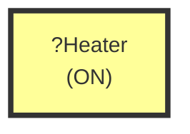
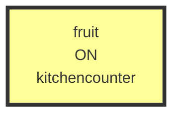

# 🚀 VirtualHome Agent Episode Log


### [GoalReasoner (Module A - Intent)] Output
```json
{
  "is_instruction_obviously_vague": false,
  "clarification_question": null,
  "target_object": "microwave",
  "location_hint": null,
  "reasoning_chain": [
    {
      "question": "Why does the user want this object?",
      "answer": "To change its power state from off to on."
    },
    {
      "question": "Why is that important?",
      "answer": "Because the appliance must be powered on to be usable for its intended function."
    },
    {
      "question": "What fundamental need does this fulfill?",
      "answer": "It enables food-heating or food-preparation capability."
    },
    {
      "question": "Are there any deeper psychological or physical motivations?",
      "answer": "The user likely wants convenience and access to a functioning kitchen appliance for preparing food."
    }
  ],
  "deep_intent": "The user wants to enable food-heating functionality.",
  "acceptable_alternatives_properties": [
    {
      "priority": 1,
      "description": "Other powered kitchen appliances that can heat food, such as an oven or toaster oven."
    },
    {
      "priority": 2,
      "description": "Alternative food-heating devices, such as a hot plate or air fryer."
    },
    {
      "priority": 3,
      "description": "Any household appliance that provides quick food warming capability."
    },
    {
      "priority": 4,
      "description": "A different way to obtain warm food, such as using a stovetop or preheated food from another source."
    }
  ]
}
```

### [PerceptionFilter] Output
```json
{
  "reasoning": "The goal is to turn a food-heating appliance on. The SDG specifies a heater that must be ON, so we keep the exact target appliance plus alternative heating appliances that can serve the same function as backups. We also retain the stove as an implied alternative heating source per the goal's acceptable alternatives.",
  "selected_classes": [
    "toaster",
    "character",
    "microwave",
    "coffeemaker",
    "air fryer",
    "stove",
    "plate"
  ],
  "raw_class_count": 45
}
```

### [LLMExecutor] Output
```json
{
  "reasoning": "The active goal is to make the microwave ON. The microwave is present in the current kitchen graph as microwave(234), and it has HAS_SWITCH and HAS_PLUG, so it can be switched on directly after being near it. Since switching requires proximity and no prior walk has been done, the next atomic step is to walk to the microwave.",
  "satisfied_nodes": [],
  "current_node_focus": "N1",
  "mapped_variables": {
    "?Heater": "microwave(234)"
  },
  "action": "[walk] <microwave> (234)"
}
```

### [RoboStateMultiTaskController] Output
```json
{
  "action": "[walk] <microwave> (234)",
  "active_task_id": "task_1",
  "task_context": {
    "active_task_id": "task_1",
    "pending_task_ids": [
      "task_2",
      "task_3"
    ],
    "satisfied_task_ids": []
  },
  "source": "llm_executor"
}
```
## Step 0
- **Action**: `[walk] <microwave> (234)`
- **Action Success**: `True`
- **Action Message**: {'0': {'message': 'Success'}}
- **Active Task**: `task_1`
- **Decision Source**: `llm_executor`
- **Task Progress**: E1_19=pending, E1_02=pending, E1_03=pending
- **SDG Status**:

- **Observed Items (16)**: plate(170), plate(171), plate(172), plate(173), plate(177), plate(178), plate(184), stove(226) [OFF,CLOSED], coffeemaker(229) [OFF], toaster(231) [OFF], microwave(234) [CLOSED,OFF], character(1), bathroom(11), bedroom(50), kitchen(126)...


### [PerceptionFilter] Output
```json
{
  "reasoning": "Reused cached class selection.",
  "selected_classes": [
    "toaster",
    "character",
    "microwave",
    "coffeemaker",
    "air fryer",
    "stove",
    "plate"
  ],
  "raw_class_count": 45
}
```

### [LLMExecutor] Output
```json
{
  "reasoning": "The active goal is to make the microwave ON. We are already close to microwave(234) from the previous successful walk, and the microwave is currently CLOSED and OFF. To satisfy N1, the next required action is to turn it on. Because it has HAS_PLUG and there is no indication it is unplugged, the correct next step is switch on the microwave directly.",
  "satisfied_nodes": [],
  "current_node_focus": "N1",
  "mapped_variables": {
    "?Heater": "microwave(234)"
  },
  "action": "[switchon] <microwave> (234)"
}
```

### [RoboStateMultiTaskController] Output
```json
{
  "action": "[switchon] <microwave> (234)",
  "active_task_id": "task_1",
  "task_context": {
    "active_task_id": "task_1",
    "pending_task_ids": [
      "task_2",
      "task_3"
    ],
    "satisfied_task_ids": []
  },
  "source": "llm_executor"
}
```
## Step 1
- **Action**: `[switchon] <microwave> (234)`
- **Action Success**: `True`
- **Action Message**: Faked switch operation in Python layer (bypassed Unity failure)
- **Active Task**: `task_1`
- **Decision Source**: `llm_executor`
- **Task Progress**: E1_19=done, E1_02=pending, E1_03=pending
- **SDG Status**:

- **Observed Items (16)**: plate(170), plate(171), plate(172), plate(173), plate(177), plate(178), plate(184), stove(226) [OFF,CLOSED], coffeemaker(229) [OFF], toaster(231) [OFF], microwave(234) [CLOSED,OFF], character(1), bathroom(11), bedroom(50), kitchen(126)...


### [GoalReasoner (Module A - Intent)] Output
```json
{
  "is_instruction_obviously_vague": false,
  "clarification_question": null,
  "target_object": "fruit",
  "location_hint": "kitchencounter",
  "reasoning_chain": [
    {
      "question": "Why does the user want this object?",
      "answer": "To have fruit transported to a specific place in the home."
    },
    {
      "question": "Why is that important?",
      "answer": "So the fruit is available where the user wants it, likely for use, storage, or later eating."
    },
    {
      "question": "What fundamental need does this fulfill?",
      "answer": "It fulfills the need to relocate food items to a desired location for convenience or access."
    },
    {
      "question": "Are there any deeper psychological or physical motivations?",
      "answer": "The user likely wants organized placement of available food, reducing effort needed to retrieve it later."
    }
  ],
  "deep_intent": "The user wants food items moved to a desired location for convenient access or organization.",
  "acceptable_alternatives_properties": [
    {
      "priority": 1,
      "description": "Other fresh produce items that can be moved to the same place, such as vegetables or additional fruit."
    },
    {
      "priority": 2,
      "description": "Other edible household food items that are typically stored or gathered in a kitchen area."
    },
    {
      "priority": 3,
      "description": "Packaged snacks or ingredients that can be conveniently placed on the kitchen counter."
    },
    {
      "priority": 4,
      "description": "Any portable food item suitable for later use or consumption if fruit is unavailable."
    }
  ]
}
```

### [PerceptionFilter] Output
```json
{
  "reasoning": "The goal is to place fruit on the kitchen counter. I must keep the target class fruit and the specified location kitchencounter. Since fruit is a broad category and apple is the visible fruit item available as a practical alternative, it should be retained as a relevant food item for this task.",
  "selected_classes": [
    "fruit",
    "apple",
    "character",
    "kitchencounter"
  ],
  "raw_class_count": 45
}
```

### [LLMExecutor] Output
```json
{
  "reasoning": "The active goal is to place fruit on the kitchen counter. The filtered graph shows multiple apples inside the kitchen, which are valid fruit candidates. Since the counter is the destination and I am already in the kitchen, the next progress step is to go to a specific fruit first before grabbing it. I will target apple(249) as a valid fruit instance.",
  "satisfied_nodes": [],
  "current_node_focus": "N1",
  "mapped_variables": {
    "?Destination": "kitchencounter(210)",
    "?Fruit": "apple(249)"
  },
  "action": "[walk] <apple> (249)"
}
```

### [RoboStateMultiTaskController] Output
```json
{
  "action": "[walk] <apple> (249)",
  "active_task_id": "task_2",
  "task_context": {
    "active_task_id": "task_2",
    "pending_task_ids": [
      "task_3"
    ],
    "satisfied_task_ids": [
      "task_1"
    ]
  },
  "source": "llm_executor"
}
```
## Step 2
- **Action**: `[walk] <apple> (249)`
- **Action Success**: `False`
- **Action Message**: {'0': {'message': 'ScriptExcutor 0: PROCESS WALK: Can not select object: apple. REASON: No interaction positions\nEXECUTION_GENERAL: Script is impossible to execute\n\n'}}
- **Active Task**: `task_2`
- **Decision Source**: `llm_executor`
- **Task Progress**: E1_19=done, E1_02=pending, E1_03=pending
- **SDG Status**:

- **Observed Items (19)**: kitchencounter(210) [CLOSED], kitchencounter(222) [CLOSED], apple(249), apple(250), apple(251), apple(252), apple(253), apple(254), apple(255), apple(256), apple(257), apple(258), apple(259), apple(113), character(1)...


### [PerceptionFilter] Output
```json
{
  "reasoning": "Reused cached class selection.",
  "selected_classes": [
    "fruit",
    "apple",
    "character",
    "kitchencounter"
  ],
  "raw_class_count": 45
}
```

### [LLMExecutor] Output
```json
{
  "reasoning": "The active SDG requires fruit to be ON the kitchencounter. The current graph shows multiple apples inside the kitchen, and apples are valid fruit/portable food substitutes. The previous walk to apple(249) failed because that object had no interaction positions, so I should pick a different reachable fruit object. Since I am not yet near the destination or holding anything, the next atomic step must be to walk to a selected apple first. I will use apple(250) because it is a grabbable fruit item inside the kitchen and has no conflicting special states.",
  "satisfied_nodes": [],
  "current_node_focus": "N1",
  "mapped_variables": {
    "?Fruit": "apple(250)",
    "?Destination": "kitchencounter(210)"
  },
  "action": "[walk] <apple> (250)"
}
```

### [RoboStateMultiTaskController] Output
```json
{
  "action": "[walk] <apple> (250)",
  "active_task_id": "task_2",
  "task_context": {
    "active_task_id": "task_2",
    "pending_task_ids": [
      "task_3"
    ],
    "satisfied_task_ids": [
      "task_1"
    ]
  },
  "source": "llm_executor"
}
```
## Step 3
- **Action**: `[walk] <apple> (250)`
- **Action Success**: `True`
- **Action Message**: {'0': {'message': 'Success'}}
- **Active Task**: `task_2`
- **Decision Source**: `llm_executor`
- **Task Progress**: E1_19=done, E1_02=pending, E1_03=pending
- **SDG Status**:

- **Observed Items (19)**: kitchencounter(210) [CLOSED], kitchencounter(222) [CLOSED], apple(249), apple(250), apple(251), apple(252), apple(253), apple(254), apple(255), apple(256), apple(257), apple(258), apple(259), apple(113), character(1)...


### [PerceptionFilter] Output
```json
{
  "reasoning": "Reused cached class selection.",
  "selected_classes": [
    "fruit",
    "apple",
    "character",
    "kitchencounter"
  ],
  "raw_class_count": 45
}
```

### [LLMExecutor] Output
```json
{
  "reasoning": "The active task is to place fruit on the kitchencounter. The current graph shows several apples close to the character, and apples are valid fruit substitutes. Since I just walked to apple(250), the next atomic step should be to grab a nearby fruit item. Apple(250) is grabbable and close, so this is the best next action toward eventually putting it on the kitchencounter.",
  "satisfied_nodes": [],
  "current_node_focus": "N1",
  "mapped_variables": {
    "?Fruit": "apple(250)",
    "?Counter": "kitchencounter(210)"
  },
  "action": "[grab] <apple> (250)"
}
```

### [RoboStateMultiTaskController] Output
```json
{
  "action": "[grab] <apple> (250)",
  "active_task_id": "task_2",
  "task_context": {
    "active_task_id": "task_2",
    "pending_task_ids": [
      "task_3"
    ],
    "satisfied_task_ids": [
      "task_1"
    ]
  },
  "source": "llm_executor"
}
```
## Step 4
- **Action**: `[grab] <apple> (250)`
- **Action Success**: `True`
- **Action Message**: {'0': {'message': 'Success'}}
- **Active Task**: `task_2`
- **Decision Source**: `llm_executor`
- **Task Progress**: E1_19=done, E1_02=pending, E1_03=pending
- **SDG Status**:

- **Observed Items (19)**: kitchencounter(210) [CLOSED], kitchencounter(222) [CLOSED], apple(249), apple(250), apple(251), apple(252), apple(253), apple(254), apple(255), apple(256), apple(257), apple(258), apple(259), apple(113), character(1)...


### [PerceptionFilter] Output
```json
{
  "reasoning": "Reused cached class selection.",
  "selected_classes": [
    "fruit",
    "apple",
    "character",
    "kitchencounter"
  ],
  "raw_class_count": 45
}
```

### [LLMExecutor] Output
```json
{
  "reasoning": "The active goal is to place fruit on the kitchencounter. We already hold apple(250), which is a valid fruit instance and is currently close to the character. The kitchencounter exists in the kitchen, and the next required step toward satisfying N1 is to move to the counter before placing the apple onto it. Because putback requires being explicitly walked to the destination first, I should walk to the kitchencounter(210).",
  "satisfied_nodes": [],
  "current_node_focus": "N1",
  "mapped_variables": {
    "?Container": "kitchencounter(210)"
  },
  "action": "[walk] <kitchencounter> (210)"
}
```

### [RoboStateMultiTaskController] Output
```json
{
  "action": "[walk] <kitchencounter> (210)",
  "active_task_id": "task_2",
  "task_context": {
    "active_task_id": "task_2",
    "pending_task_ids": [
      "task_3"
    ],
    "satisfied_task_ids": [
      "task_1"
    ]
  },
  "source": "llm_executor"
}
```
## Step 5
- **Action**: `[walk] <kitchencounter> (210)`
- **Action Success**: `True`
- **Action Message**: {'0': {'message': 'Success'}}
- **Active Task**: `task_2`
- **Decision Source**: `llm_executor`
- **Task Progress**: E1_19=done, E1_02=pending, E1_03=pending
- **SDG Status**:

- **Observed Items (19)**: kitchencounter(210) [CLOSED], kitchencounter(222) [CLOSED], apple(249), apple(250), apple(251), apple(252), apple(253), apple(254), apple(255), apple(256), apple(257), apple(258), apple(259), apple(113), character(1)...


### [PerceptionFilter] Output
```json
{
  "reasoning": "Reused cached class selection.",
  "selected_classes": [
    "fruit",
    "apple",
    "character",
    "kitchencounter"
  ],
  "raw_class_count": 45
}
```

### [LLMExecutor] Output
```json
{
  "reasoning": "The active goal is to have a fruit item on the kitchen counter. We are already close to kitchencounter(210), and the current graph shows the character holding apple(250) in the right hand. Since the counter is a flat surface and the apple is already held, the next necessary step is to place it on the counter. N1 will be satisfied by putting the held apple onto kitchencounter(210).",
  "satisfied_nodes": [],
  "current_node_focus": "N1",
  "mapped_variables": {
    "?Fruit": "apple(250)",
    "?Destination": "kitchencounter(210)"
  },
  "action": "[putback] <apple> (250) <kitchencounter> (210)"
}
```

### [RoboStateMultiTaskController] Output
```json
{
  "action": "[putback] <apple> (250) <kitchencounter> (210)",
  "active_task_id": "task_2",
  "task_context": {
    "active_task_id": "task_2",
    "pending_task_ids": [
      "task_3"
    ],
    "satisfied_task_ids": [
      "task_1"
    ]
  },
  "source": "llm_executor"
}
```
## Step 6
- **Action**: `[putback] <apple> (250) <kitchencounter> (210)`
- **Action Success**: `True`
- **Action Message**: {'0': {'message': 'Success'}}
- **Active Task**: `task_2`
- **Decision Source**: `llm_executor`
- **Task Progress**: E1_19=done, E1_02=pending, E1_03=pending
- **SDG Status**:

- **Observed Items (19)**: kitchencounter(210) [CLOSED], kitchencounter(222) [CLOSED], apple(249), apple(250), apple(251), apple(252), apple(253), apple(254), apple(255), apple(256), apple(257), apple(258), apple(259), apple(113), character(1)...


### [PerceptionFilter] Output
```json
{
  "reasoning": "Reused cached class selection.",
  "selected_classes": [
    "fruit",
    "apple",
    "character",
    "kitchencounter"
  ],
  "raw_class_count": 45
}
```

### [LLMExecutor] Output
```json
{
  "reasoning": "The active task is to place fruit on the kitchencounter. N1 is already satisfied because apple(250) is on kitchencounter(210) and close to the character. No further physical action is needed for the active task. Since the instruction says to work only on the active task and avoid repeating a walk if just done, the safest next step is to wait for the next task context rather than disturbing the completed state.",
  "satisfied_nodes": [
    "N1"
  ],
  "current_node_focus": "N1",
  "mapped_variables": {
    "?TargetFruit": "apple(250)",
    "?TargetSurface": "kitchencounter(210)"
  },
  "action": "[wait]"
}
```

### [RoboStateMultiTaskController] Output
```json
{
  "action": "[wait]",
  "active_task_id": "task_2",
  "task_context": {
    "active_task_id": "task_2",
    "pending_task_ids": [
      "task_3"
    ],
    "satisfied_task_ids": [
      "task_1"
    ]
  },
  "source": "llm_executor"
}
```
## Step 7
- **Action**: `[wait]`
- **Action Success**: `True`
- **Action Message**: Time passes. You waited for a while.
- **Active Task**: `task_2`
- **Decision Source**: `llm_executor`
- **Task Progress**: E1_19=done, E1_02=pending, E1_03=pending
- **SDG Status**:

- **Observed Items (19)**: kitchencounter(210) [CLOSED], kitchencounter(222) [CLOSED], apple(249), apple(250), apple(251), apple(252), apple(253), apple(254), apple(255), apple(256), apple(257), apple(258), apple(259), apple(113), character(1)...


### [PerceptionFilter] Output
```json
{
  "reasoning": "Reused cached class selection.",
  "selected_classes": [
    "fruit",
    "apple",
    "character",
    "kitchencounter"
  ],
  "raw_class_count": 45
}
```

### [LLMExecutor] Output
```json
{
  "reasoning": "The active SDG requires fruit to be ON the kitchencounter. That state is already satisfied because apple(250) is on kitchencounter(210), and apples are acceptable fruit instances. No further action is needed for the active task, and we must not manipulate satisfied-task objects unnecessarily.",
  "satisfied_nodes": [
    "N1"
  ],
  "current_node_focus": "N1",
  "mapped_variables": {
    "?TargetSurface": "kitchencounter(210)",
    "?Fruit": "apple(250)"
  },
  "action": "[wait]"
}
```

### [RoboStateMultiTaskController] Output
```json
{
  "action": "[wait]",
  "active_task_id": "task_2",
  "task_context": {
    "active_task_id": "task_2",
    "pending_task_ids": [
      "task_3"
    ],
    "satisfied_task_ids": [
      "task_1"
    ]
  },
  "source": "llm_executor"
}
```
## Step 8
- **Action**: `[wait]`
- **Action Success**: `True`
- **Action Message**: Time passes. You waited for a while.
- **Active Task**: `task_2`
- **Decision Source**: `llm_executor`
- **Task Progress**: E1_19=done, E1_02=pending, E1_03=pending
- **SDG Status**:

- **Observed Items (19)**: kitchencounter(210) [CLOSED], kitchencounter(222) [CLOSED], apple(249), apple(250), apple(251), apple(252), apple(253), apple(254), apple(255), apple(256), apple(257), apple(258), apple(259), apple(113), character(1)...


### [PerceptionFilter] Output
```json
{
  "reasoning": "Reused cached class selection.",
  "selected_classes": [
    "fruit",
    "apple",
    "character",
    "kitchencounter"
  ],
  "raw_class_count": 45
}
```

### [LLMExecutor] Output
```json
{
  "reasoning": "The active goal N1 is already satisfied: apple(250) is currently ON kitchencounter(210), and the counter is close to the character. No further action is needed for this task.",
  "satisfied_nodes": [
    "N1"
  ],
  "current_node_focus": "N1",
  "mapped_variables": {
    "?TargetObject": "apple(250)",
    "?Destination": "kitchencounter(210)"
  },
  "action": "[wait]"
}
```

### [RoboStateMultiTaskController] Output
```json
{
  "action": "[wait]",
  "active_task_id": "task_2",
  "task_context": {
    "active_task_id": "task_2",
    "pending_task_ids": [
      "task_3"
    ],
    "satisfied_task_ids": [
      "task_1"
    ]
  },
  "source": "llm_executor"
}
```
## Step 9
- **Action**: `[wait]`
- **Action Success**: `True`
- **Action Message**: Time passes. You waited for a while.
- **Active Task**: `task_2`
- **Decision Source**: `llm_executor`
- **Task Progress**: E1_19=done, E1_02=pending, E1_03=pending
- **SDG Status**:

- **Observed Items (19)**: kitchencounter(210) [CLOSED], kitchencounter(222) [CLOSED], apple(249), apple(250), apple(251), apple(252), apple(253), apple(254), apple(255), apple(256), apple(257), apple(258), apple(259), apple(113), character(1)...


### [PerceptionFilter] Output
```json
{
  "reasoning": "Reused cached class selection.",
  "selected_classes": [
    "fruit",
    "apple",
    "character",
    "kitchencounter"
  ],
  "raw_class_count": 45
}
```

### [LLMExecutor] Output
```json
{
  "reasoning": "The active goal is to have fruit ON the kitchencounter. This is already satisfied by apple(250), which is on kitchencounter(210) and close to the character. No further action is needed for the active task. Since the instruction asks for a single next action and avoids repeating a walk just done, the best step is to wait rather than disturb the satisfied state.",
  "satisfied_nodes": [
    "N1"
  ],
  "current_node_focus": "N1",
  "mapped_variables": {
    "?Counter": "kitchencounter(210)",
    "?Fruit": "apple(250)"
  },
  "action": "[wait]"
}
```

### [RoboStateMultiTaskController] Output
```json
{
  "action": "[wait]",
  "active_task_id": "task_2",
  "task_context": {
    "active_task_id": "task_2",
    "pending_task_ids": [
      "task_3"
    ],
    "satisfied_task_ids": [
      "task_1"
    ]
  },
  "source": "llm_executor"
}
```
## Step 10
- **Action**: `[wait]`
- **Action Success**: `True`
- **Action Message**: Time passes. You waited for a while.
- **Active Task**: `task_2`
- **Decision Source**: `llm_executor`
- **Task Progress**: E1_19=done, E1_02=pending, E1_03=pending
- **SDG Status**:

- **Observed Items (19)**: kitchencounter(210) [CLOSED], kitchencounter(222) [CLOSED], apple(249), apple(250), apple(251), apple(252), apple(253), apple(254), apple(255), apple(256), apple(257), apple(258), apple(259), apple(113), character(1)...


### [PerceptionFilter] Output
```json
{
  "reasoning": "Reused cached class selection.",
  "selected_classes": [
    "fruit",
    "apple",
    "character",
    "kitchencounter"
  ],
  "raw_class_count": 45
}
```

### [LLMExecutor] Output
```json
{
  "reasoning": "The active SDG node N1 requires fruit ON the kitchencounter. This is already satisfied because apple(250) is on kitchencounter(210), and apple is an acceptable fruit instance for the goal. No further action is needed for the active task.",
  "satisfied_nodes": [
    "N1"
  ],
  "current_node_focus": "N1",
  "mapped_variables": {
    "?Counter": "kitchencounter(210)",
    "?Fruit": "apple(250)"
  },
  "action": "[wait]"
}
```

### [RoboStateMultiTaskController] Output
```json
{
  "action": "[wait]",
  "active_task_id": "task_2",
  "task_context": {
    "active_task_id": "task_2",
    "pending_task_ids": [
      "task_3"
    ],
    "satisfied_task_ids": [
      "task_1"
    ]
  },
  "source": "llm_executor"
}
```
