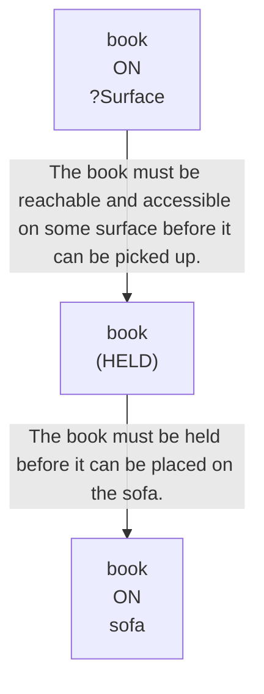
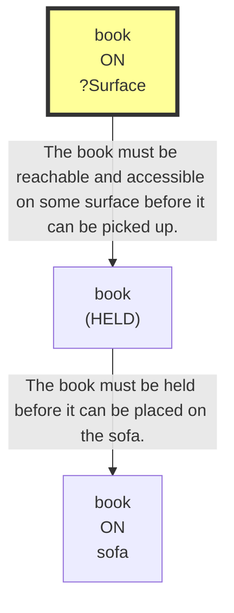
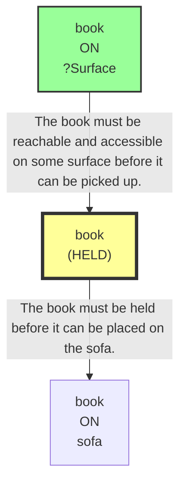
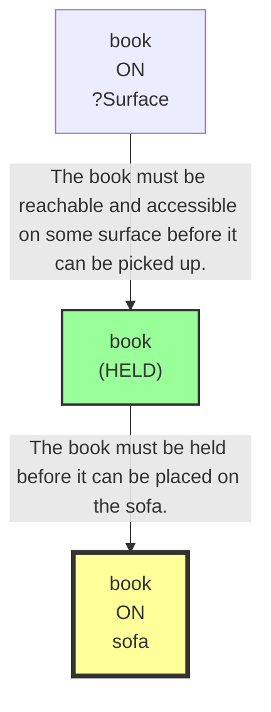
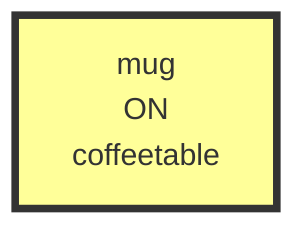
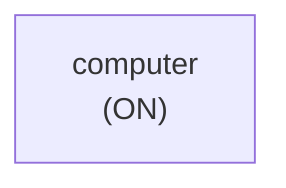
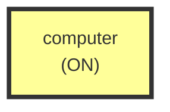

# 🚀 VirtualHome Agent Episode Log


### [GoalReasoner (Module A - Intent)] Output
```json
{
  "is_instruction_obviously_vague": false,
  "clarification_question": null,
  "target_object": "book",
  "location_hint": "sofa",
  "reasoning_chain": [
    {
      "question": "Why does the user want this object?",
      "answer": "To move an unorganized book to the sofa."
    },
    {
      "question": "Why is that important?",
      "answer": "To place the book in the desired location and improve organization."
    },
    {
      "question": "What fundamental need does this fulfill?",
      "answer": "The need to organize and relocate an item within the home."
    },
    {
      "question": "Are there any deeper psychological or physical motivations?",
      "answer": "It may reduce clutter, keep the room tidy, or make the book more accessible for use."
    }
  ],
  "deep_intent": "The user wants to organize and relocate a loose item within the home.",
  "acceptable_alternatives_properties": [
    {
      "priority": 1,
      "description": "Other loose reading materials or similar paper items that are out of place, such as magazines, notebooks, or papers."
    },
    {
      "priority": 2,
      "description": "Other small portable household items that are meant to be put away or relocated to a seating area."
    },
    {
      "priority": 3,
      "description": "General clutter items found indoors that can be tidied by moving them to their intended resting place."
    },
    {
      "priority": 4,
      "description": "Nearby portable objects that help fulfill the same organizing goal, even if they are not books."
    }
  ]
}
```

### [RoboStateMultiTaskController] Output
```json
{
  "action": "[walk] <kitchen> (11)",
  "active_task_id": "task_2",
  "task_context": {
    "active_task_id": "task_2",
    "pending_task_ids": [
      "task_1",
      "task_3"
    ],
    "satisfied_task_ids": []
  },
  "source": "room_frontier"
}
```
## Step 0
- **Action**: `[walk] <kitchen> (11)`
- **Action Success**: `True`
- **Action Message**: {'0': {'message': 'Success'}}
- **Active Task**: `task_2`
- **Decision Source**: `room_frontier`
- **Task Progress**: E1_11=pending, E1_03=pending, E1_07=pending
- **SDG Status**:

- **Observed Items (38)**: floor(242), floor(243), floor(244), floor(245), ceiling(246), ceiling(247), ceiling(248), ceiling(249), wall(250), wall(251), wall(252), wall(253), door(254) [OPEN], ceilinglamp(255), tablelamp(256) [ON]...


### [RoboStateMultiTaskController] Output
```json
{
  "action": "[walk] <livingroom> (183)",
  "active_task_id": "task_2",
  "task_context": {
    "active_task_id": "task_2",
    "pending_task_ids": [
      "task_1",
      "task_3"
    ],
    "satisfied_task_ids": []
  },
  "source": "room_frontier"
}
```
## Step 1
- **Action**: `[walk] <livingroom> (183)`
- **Action Success**: `True`
- **Action Message**: {'0': {'message': 'Success'}}
- **Active Task**: `task_2`
- **Decision Source**: `room_frontier`
- **Task Progress**: E1_11=pending, E1_03=pending, E1_07=pending
- **SDG Status**:

- **Observed Items (192)**: floor(242), floor(243), floor(244), floor(245), ceiling(246), ceiling(247), ceiling(248), ceiling(249), wall(250), wall(251), wall(252), wall(253), door(254) [OPEN], ceilinglamp(255), tablelamp(256) [ON]...


### [PerceptionFilter] Output
```json
{
  "reasoning": "The goal is to move a book onto the sofa. The SDG requires the target book, the destination sofa, and the book’s current accessible surface/location to enable pickup. No extra tools are needed beyond these locations and the item itself.",
  "selected_classes": [
    "book",
    "table",
    "bed",
    "sofa",
    "coffeetable",
    "character",
    "chair",
    "door",
    "floor",
    "nightstand",
    "bookshelf",
    "kitchentable",
    "desk"
  ],
  "raw_class_count": 66
}
```

### [LLMExecutor] Output
```json
{
  "reasoning": "The active goal is to place a book on the sofa. There is a reachable book already visible in the living room: book(105) is on the coffeetable and close to the character, while sofa(214) is the destination surface. To progress toward holding the book before placing it on the sofa, the next atomic step should be to move near the book first, since grabbing requires proximity.",
  "satisfied_nodes": [],
  "current_node_focus": "N3",
  "mapped_variables": {},
  "action": "[walk] <book> (105)"
}
```

### [RoboStateMultiTaskController] Output
```json
{
  "action": "[walk] <book> (105)",
  "active_task_id": "task_2",
  "task_context": {
    "active_task_id": "task_2",
    "pending_task_ids": [
      "task_1",
      "task_3"
    ],
    "satisfied_task_ids": []
  },
  "source": "llm_executor"
}
```
## Step 2
- **Action**: `[walk] <book> (105)`
- **Action Success**: `True`
- **Action Message**: {'0': {'message': 'Success'}}
- **Active Task**: `task_2`
- **Decision Source**: `llm_executor`
- **Task Progress**: E1_11=pending, E1_03=pending, E1_07=pending
- **SDG Status**:

- **Observed Items (48)**: floor(242), floor(243), floor(244), floor(245), door(254) [OPEN], book(275) [CLOSED], bookshelf(280), desk(281) [CLOSED], nightstand(282) [CLOSED], chair(283), bed(284), character(1), kitchen(11), livingroom(183), bedroom(241)...


### [PerceptionFilter] Output
```json
{
  "reasoning": "Reused cached class selection.",
  "selected_classes": [
    "book",
    "table",
    "bed",
    "sofa",
    "coffeetable",
    "character",
    "chair",
    "door",
    "floor",
    "nightstand",
    "bookshelf",
    "kitchentable",
    "desk"
  ],
  "raw_class_count": 66
}
```

### [LLMExecutor] Output
```json
{
  "reasoning": "The active goal is to place the book on the sofa. The current graph shows book(105) is already in the living room and close to the character, but it is on coffeetable(215), not yet held. Since grabbing requires being near the book and the last action was already a successful walk to book(105), the next atomic step is to grab it. This satisfies the prerequisite for moving it onto the sofa in subsequent steps.",
  "satisfied_nodes": [
    "N3"
  ],
  "current_node_focus": "N2",
  "mapped_variables": {},
  "action": "[grab] <book> (105)"
}
```

### [RoboStateMultiTaskController] Output
```json
{
  "action": "[grab] <book> (105)",
  "active_task_id": "task_2",
  "task_context": {
    "active_task_id": "task_2",
    "pending_task_ids": [
      "task_1",
      "task_3"
    ],
    "satisfied_task_ids": []
  },
  "source": "llm_executor"
}
```
## Step 3
- **Action**: `[grab] <book> (105)`
- **Action Success**: `True`
- **Action Message**: {'0': {'message': 'Success'}}
- **Active Task**: `task_2`
- **Decision Source**: `llm_executor`
- **Task Progress**: E1_11=pending, E1_03=pending, E1_07=pending
- **SDG Status**:

- **Observed Items (48)**: floor(242), floor(243), floor(244), floor(245), door(254) [OPEN], book(275) [CLOSED], bookshelf(280), desk(281) [CLOSED], nightstand(282) [CLOSED], chair(283), bed(284), character(1), kitchen(11), livingroom(183), bedroom(241)...


### [PerceptionFilter] Output
```json
{
  "reasoning": "Reused cached class selection.",
  "selected_classes": [
    "book",
    "table",
    "bed",
    "sofa",
    "coffeetable",
    "character",
    "chair",
    "door",
    "floor",
    "nightstand",
    "bookshelf",
    "kitchentable",
    "desk"
  ],
  "raw_class_count": 66
}
```

### [LLMExecutor] Output
```json
{
  "reasoning": "The active task is to place a book on the sofa. The current graph shows book(105) is already held in the right hand, and the sofa(214) is in the living room. The next required SDG step is to get the book onto the sofa, which requires first walking to the sofa because putback actions require explicit proximity to the destination surface. N2 is already satisfied by holding the book. N3 is not yet satisfied because the book is not on a surface. N1 is the target final relation.",
  "satisfied_nodes": [
    "N2"
  ],
  "current_node_focus": "N1",
  "mapped_variables": {},
  "action": "[walk] <sofa> (214)"
}
```

### [RoboStateMultiTaskController] Output
```json
{
  "action": "[walk] <sofa> (214)",
  "active_task_id": "task_2",
  "task_context": {
    "active_task_id": "task_2",
    "pending_task_ids": [
      "task_1",
      "task_3"
    ],
    "satisfied_task_ids": []
  },
  "source": "llm_executor"
}
```
## Step 4
- **Action**: `[walk] <sofa> (214)`
- **Action Success**: `True`
- **Action Message**: {'0': {'message': 'Success'}}
- **Active Task**: `task_2`
- **Decision Source**: `llm_executor`
- **Task Progress**: E1_11=pending, E1_03=pending, E1_07=pending
- **SDG Status**:

- **Observed Items (48)**: floor(242), floor(243), floor(244), floor(245), door(254) [OPEN], book(275) [CLOSED], bookshelf(280), desk(281) [CLOSED], nightstand(282) [CLOSED], chair(283), bed(284), character(1), kitchen(11), livingroom(183), bedroom(241)...


### [PerceptionFilter] Output
```json
{
  "reasoning": "Reused cached class selection.",
  "selected_classes": [
    "book",
    "table",
    "bed",
    "sofa",
    "coffeetable",
    "character",
    "chair",
    "door",
    "floor",
    "nightstand",
    "bookshelf",
    "kitchentable",
    "desk"
  ],
  "raw_class_count": 66
}
```

### [LLMExecutor] Output
```json
{
  "reasoning": "The active task is to place the book on the sofa. The current graph shows book(105) is already held, and the character is close to sofa(214). To satisfy the final SDG node N1, the next step is to place the held book onto the sofa. Because putback requires being explicitly walked to the destination first, and we are already at the sofa per the current proximity state, the next atomic action is the placement itself.",
  "satisfied_nodes": [
    "N2"
  ],
  "current_node_focus": "N1",
  "mapped_variables": {},
  "action": "[putback] <book> (105) <sofa> (214)"
}
```

### [RoboStateMultiTaskController] Output
```json
{
  "action": "[putback] <book> (105) <sofa> (214)",
  "active_task_id": "task_2",
  "task_context": {
    "active_task_id": "task_2",
    "pending_task_ids": [
      "task_1",
      "task_3"
    ],
    "satisfied_task_ids": []
  },
  "source": "llm_executor"
}
```
## Step 5
- **Action**: `[putback] <book> (105) <sofa> (214)`
- **Action Success**: `True`
- **Action Message**: {'0': {'message': 'Success'}}
- **Active Task**: `task_2`
- **Decision Source**: `llm_executor`
- **Task Progress**: E1_11=pending, E1_03=done, E1_07=pending
- **SDG Status**:

- **Observed Items (48)**: floor(242), floor(243), floor(244), floor(245), door(254) [OPEN], book(275) [CLOSED], bookshelf(280), desk(281) [CLOSED], nightstand(282) [CLOSED], chair(283), bed(284), character(1), kitchen(11), livingroom(183), bedroom(241)...


### [GoalReasoner (Module A - Intent)] Output
```json
{
  "is_instruction_obviously_vague": false,
  "clarification_question": null,
  "target_object": "mug",
  "location_hint": "coffeetable",
  "reasoning_chain": [
    {
      "question": "Why does the user want this object?",
      "answer": "They want the mug to be kept on the coffeetable."
    },
    {
      "question": "Why is that important?",
      "answer": "To maintain the mug in a specific visible and accessible place."
    },
    {
      "question": "What fundamental need does this fulfill?",
      "answer": "It fulfills the need to keep an item organized and placed in a desired location."
    },
    {
      "question": "Are there any deeper psychological or physical motivations?",
      "answer": "It may support tidiness, convenience, or a habitual preference for where the mug should remain."
    }
  ],
  "deep_intent": "The user wants an item to remain in a specific location for organization or convenience.",
  "acceptable_alternatives_properties": [
    {
      "priority": 1,
      "description": "Other small household items that can be kept on the coffee table, such as a cup, glass, or coaster."
    },
    {
      "priority": 2,
      "description": "Similar tabletop items that fit into a neat, accessible arrangement, such as a small bowl or remote."
    },
    {
      "priority": 3,
      "description": "Any lightweight everyday object that can be placed and left on the coffee table to maintain order."
    },
    {
      "priority": 4,
      "description": "Other items with a comparable purpose of being kept in a fixed, easy-to-reach indoor location."
    }
  ]
}
```

### [PerceptionFilter] Output
```json
{
  "reasoning": "The goal and SDG require the target mug and the location coffeetable. No tool or additional receptacle is needed beyond keeping the mug on the table.",
  "selected_classes": [
    "coffeetable",
    "door",
    "character",
    "mug"
  ],
  "raw_class_count": 66
}
```

### [LLMExecutor] Output
```json
{
  "reasoning": "The active goal is to have the mug on the coffeetable. The character is already close to the coffeetable, but the mug is currently inside the kitchen, so the next necessary step is to go to the mug before it can be grabbed and moved. No other node is satisfied yet because the mug is not on the coffeetable.",
  "satisfied_nodes": [],
  "current_node_focus": "N1",
  "mapped_variables": {
    "?Object": "mug(384)",
    "?Destination": "coffeetable(215)"
  },
  "action": "[walk] <mug> (384)"
}
```

### [RoboStateMultiTaskController] Output
```json
{
  "action": "[walk] <mug> (384)",
  "active_task_id": "task_3",
  "task_context": {
    "active_task_id": "task_3",
    "pending_task_ids": [
      "task_1"
    ],
    "satisfied_task_ids": [
      "task_2"
    ]
  },
  "source": "llm_executor"
}
```
## Step 6
- **Action**: `[walk] <mug> (384)`
- **Action Success**: `True`
- **Action Message**: {'0': {'message': 'Success'}}
- **Active Task**: `task_3`
- **Decision Source**: `llm_executor`
- **Task Progress**: E1_11=pending, E1_03=done, E1_07=pending
- **SDG Status**:

- **Observed Items (10)**: door(254) [OPEN], character(1), kitchen(11), livingroom(183), bedroom(241), bathroom(285), bedroom(346), door(47) [OPEN], mug(384), coffeetable(215)


### [PerceptionFilter] Output
```json
{
  "reasoning": "Reused cached class selection.",
  "selected_classes": [
    "coffeetable",
    "door",
    "character",
    "mug"
  ],
  "raw_class_count": 66
}
```

### [LLMExecutor] Output
```json
{
  "reasoning": "The active goal is to have the mug on the coffeetable. The character is currently close to the mug, but the mug is still inside the kitchen while the coffeetable is in the livingroom. Since putback requires being near the destination, the next required step is to walk to the coffeetable before any placement action. The mug is the correct object for N1, and no other SDG nodes exist.",
  "satisfied_nodes": [],
  "current_node_focus": "N1",
  "mapped_variables": {
    "?TargetObject": "mug(384)",
    "?Destination": "coffeetable(215)"
  },
  "action": "[walk] <coffeetable> (215)"
}
```

### [RoboStateMultiTaskController] Output
```json
{
  "action": "[walk] <coffeetable> (215)",
  "active_task_id": "task_3",
  "task_context": {
    "active_task_id": "task_3",
    "pending_task_ids": [
      "task_1"
    ],
    "satisfied_task_ids": [
      "task_2"
    ]
  },
  "source": "llm_executor"
}
```
## Step 7
- **Action**: `[walk] <coffeetable> (215)`
- **Action Success**: `True`
- **Action Message**: {'0': {'message': 'Success'}}
- **Active Task**: `task_3`
- **Decision Source**: `llm_executor`
- **Task Progress**: E1_11=pending, E1_03=done, E1_07=pending
- **SDG Status**:

- **Observed Items (10)**: door(254) [OPEN], character(1), kitchen(11), livingroom(183), bedroom(241), bathroom(285), bedroom(346), door(47) [OPEN], mug(384), coffeetable(215)


### [PerceptionFilter] Output
```json
{
  "reasoning": "Reused cached class selection.",
  "selected_classes": [
    "coffeetable",
    "door",
    "character",
    "mug"
  ],
  "raw_class_count": 66
}
```

### [LLMExecutor] Output
```json
{
  "reasoning": "The active goal is to have the mug on the coffeetable. I am already close to the coffeetable, and the mug is a grabbable movable object currently in the kitchen and close to the character. To satisfy N1, the next step is to pick up the mug so it can be placed on the coffeetable afterward.",
  "satisfied_nodes": [],
  "current_node_focus": "N1",
  "mapped_variables": {},
  "action": "[grab] <mug> (384)"
}
```

### [RoboStateMultiTaskController] Output
```json
{
  "action": "[grab] <mug> (384)",
  "active_task_id": "task_3",
  "task_context": {
    "active_task_id": "task_3",
    "pending_task_ids": [
      "task_1"
    ],
    "satisfied_task_ids": [
      "task_2"
    ]
  },
  "source": "llm_executor"
}
```
## Step 8
- **Action**: `[grab] <mug> (384)`
- **Action Success**: `True`
- **Action Message**: {'0': {'message': 'Success'}}
- **Active Task**: `task_3`
- **Decision Source**: `llm_executor`
- **Task Progress**: E1_11=pending, E1_03=done, E1_07=pending
- **SDG Status**:

- **Observed Items (10)**: door(254) [OPEN], character(1), kitchen(11), livingroom(183), bedroom(241), bathroom(285), bedroom(346), door(47) [OPEN], mug(384), coffeetable(215)


### [PerceptionFilter] Output
```json
{
  "reasoning": "Reused cached class selection.",
  "selected_classes": [
    "coffeetable",
    "door",
    "character",
    "mug"
  ],
  "raw_class_count": 66
}
```

### [LLMExecutor] Output
```json
{
  "reasoning": "The active task is to keep the mug on the coffeetable. I am currently holding mug(384) and am already close to coffeetable(215), so the next required step is to place the mug onto that flat surface. The SDG node N1 will be satisfied by putting the mug on the coffeetable.",
  "satisfied_nodes": [],
  "current_node_focus": "N1",
  "mapped_variables": {},
  "action": "[putback] <mug> (384) <coffeetable> (215)"
}
```

### [RoboStateMultiTaskController] Output
```json
{
  "action": "[putback] <mug> (384) <coffeetable> (215)",
  "active_task_id": "task_3",
  "task_context": {
    "active_task_id": "task_3",
    "pending_task_ids": [
      "task_1"
    ],
    "satisfied_task_ids": [
      "task_2"
    ]
  },
  "source": "llm_executor"
}
```
## Step 9
- **Action**: `[putback] <mug> (384) <coffeetable> (215)`
- **Action Success**: `True`
- **Action Message**: {'0': {'message': 'Success'}}
- **Active Task**: `task_3`
- **Decision Source**: `llm_executor`
- **Task Progress**: E1_11=pending, E1_03=done, E1_07=done
- **SDG Status**:

- **Observed Items (10)**: door(254) [OPEN], character(1), kitchen(11), livingroom(183), bedroom(241), bathroom(285), bedroom(346), door(47) [OPEN], mug(384), coffeetable(215)


### [GoalReasoner (Module A - Intent)] Output
```json
{
  "is_instruction_obviously_vague": false,
  "clarification_question": null,
  "target_object": "computer",
  "location_hint": null,
  "reasoning_chain": [
    {
      "question": "Why does the user want this object?",
      "answer": "To have the computer operating instead of remaining powered off."
    },
    {
      "question": "Why is that important?",
      "answer": "Because a powered-on computer can be used for tasks the user likely intends to perform."
    },
    {
      "question": "What fundamental need does this fulfill?",
      "answer": "It fulfills the need to restore or enable device functionality and access to computing."
    },
    {
      "question": "Are there any deeper psychological or physical motivations?",
      "answer": "The user likely wants to continue using the device without interruption, avoid delay, or regain control over the system state."
    }
  ],
  "deep_intent": "The user wants to restore power and functionality to a device so it can be used.",
  "acceptable_alternatives_properties": [
    {
      "priority": 1,
      "description": "Other powered electronic devices that can provide the needed function, such as a laptop, tablet, or desktop computer."
    },
    {
      "priority": 2,
      "description": "Another available computing device that can run the same or similar tasks."
    },
    {
      "priority": 3,
      "description": "A different electronic device that can support the immediate task if the computer is unavailable."
    },
    {
      "priority": 4,
      "description": "Any accessible device that can fulfill the same practical computing need, even if it is not a computer."
    }
  ]
}
```

### [RoboStateMultiTaskController] Output
```json
{
  "action": "[walk] <bathroom> (285)",
  "active_task_id": "task_1",
  "task_context": {
    "active_task_id": "task_1",
    "pending_task_ids": [],
    "satisfied_task_ids": [
      "task_2",
      "task_3"
    ]
  },
  "source": "room_frontier"
}
```
## Step 10
- **Action**: `[walk] <bathroom> (285)`
- **Action Success**: `True`
- **Action Message**: {'0': {'message': 'Success'}}
- **Active Task**: `task_1`
- **Decision Source**: `room_frontier`
- **Task Progress**: E1_11=pending, E1_03=done, E1_07=done
- **SDG Status**:

- **Observed Items (245)**: floor(242), floor(243), floor(244), floor(245), ceiling(246), ceiling(247), ceiling(248), ceiling(249), wall(250), wall(251), wall(252), wall(253), door(254) [OPEN], ceilinglamp(255), tablelamp(256) [ON]...


### [RoboStateMultiTaskController] Output
```json
{
  "action": "[walk] <bedroom> (346)",
  "active_task_id": "task_1",
  "task_context": {
    "active_task_id": "task_1",
    "pending_task_ids": [],
    "satisfied_task_ids": [
      "task_2",
      "task_3"
    ]
  },
  "source": "room_frontier"
}
```
## Step 11
- **Action**: `[walk] <bedroom> (346)`
- **Action Success**: `True`
- **Action Message**: {'0': {'message': 'Success'}}
- **Active Task**: `task_1`
- **Decision Source**: `room_frontier`
- **Task Progress**: E1_11=pending, E1_03=done, E1_07=done
- **SDG Status**:

- **Observed Items (305)**: floor(242), floor(243), floor(244), floor(245), ceiling(246), ceiling(247), ceiling(248), ceiling(249), wall(250), wall(251), wall(252), wall(253), door(254) [OPEN], ceilinglamp(255), tablelamp(256) [ON]...


### [PerceptionFilter] Output
```json
{
  "reasoning": "The goal and SDG require only restoring the computer to ON. To do that, we must keep the computer itself and the most relevant power-related item visible for enabling it: the powersocket. No other objects are necessary.",
  "selected_classes": [
    "computer",
    "desk",
    "character",
    "powersocket"
  ],
  "raw_class_count": 91
}
```

### [LLMExecutor] Output
```json
{
  "reasoning": "The goal is to turn the computer ON. The computer(397) is in the same bedroom(346) as the character, and it has HAS_SWITCH, so the next required step is to interact with it directly. Since switch actions require proximity and we are already in the same room, the best next atomic action is to walk to the computer before switching it on.",
  "satisfied_nodes": [],
  "current_node_focus": "N1",
  "mapped_variables": {},
  "action": "[walk] <computer> (397)"
}
```

### [RoboStateMultiTaskController] Output
```json
{
  "action": "[walk] <computer> (397)",
  "active_task_id": "task_1",
  "task_context": {
    "active_task_id": "task_1",
    "pending_task_ids": [],
    "satisfied_task_ids": [
      "task_2",
      "task_3"
    ]
  },
  "source": "llm_executor"
}
```
## Step 12
- **Action**: `[walk] <computer> (397)`
- **Action Success**: `True`
- **Action Message**: {'0': {'message': 'Success'}}
- **Active Task**: `task_1`
- **Decision Source**: `llm_executor`
- **Task Progress**: E1_11=pending, E1_03=done, E1_07=done
- **SDG Status**:

- **Observed Items (12)**: powersocket(279), desk(281) [CLOSED], character(1), kitchen(11), livingroom(183), bedroom(241), bathroom(285), bedroom(346), powersocket(57), powersocket(240), desk(393) [CLOSED], computer(397) [OFF]


### [PerceptionFilter] Output
```json
{
  "reasoning": "Reused cached class selection.",
  "selected_classes": [
    "computer",
    "desk",
    "character",
    "powersocket"
  ],
  "raw_class_count": 91
}
```

### [LLMExecutor] Output
```json
{
  "reasoning": "The active goal is to make computer(397) ON. The current graph shows the character is already CLOSE to computer(397), and the computer has HAS_SWITCH with state OFF. Since switch operations require proximity and no plug-in is required for a computer here, the next step is to turn it on directly.",
  "satisfied_nodes": [],
  "current_node_focus": "N1",
  "mapped_variables": {
    "?Computer": "computer(397)"
  },
  "action": "[switchon] <computer> (397)"
}
```

### [RoboStateMultiTaskController] Output
```json
{
  "action": "[switchon] <computer> (397)",
  "active_task_id": "task_1",
  "task_context": {
    "active_task_id": "task_1",
    "pending_task_ids": [],
    "satisfied_task_ids": [
      "task_2",
      "task_3"
    ]
  },
  "source": "llm_executor"
}
```
## Step 13
- **Action**: `[switchon] <computer> (397)`
- **Action Success**: `True`
- **Action Message**: Faked switch operation in Python layer (bypassed Unity failure)
- **Active Task**: `task_1`
- **Decision Source**: `llm_executor`
- **Task Progress**: E1_11=done, E1_03=done, E1_07=done
- **SDG Status**:

- **Observed Items (12)**: powersocket(279), desk(281) [CLOSED], character(1), kitchen(11), livingroom(183), bedroom(241), bathroom(285), bedroom(346), powersocket(57), powersocket(240), desk(393) [CLOSED], computer(397) [OFF]

