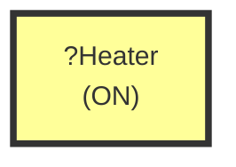
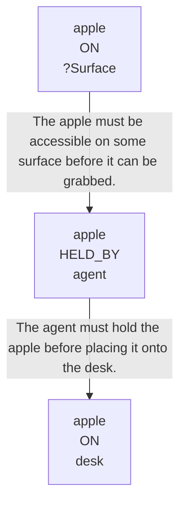
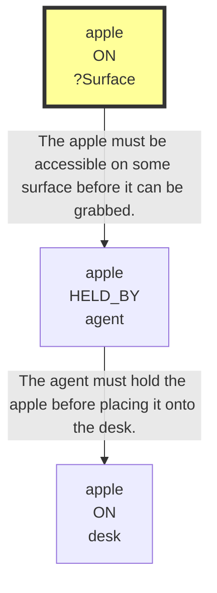
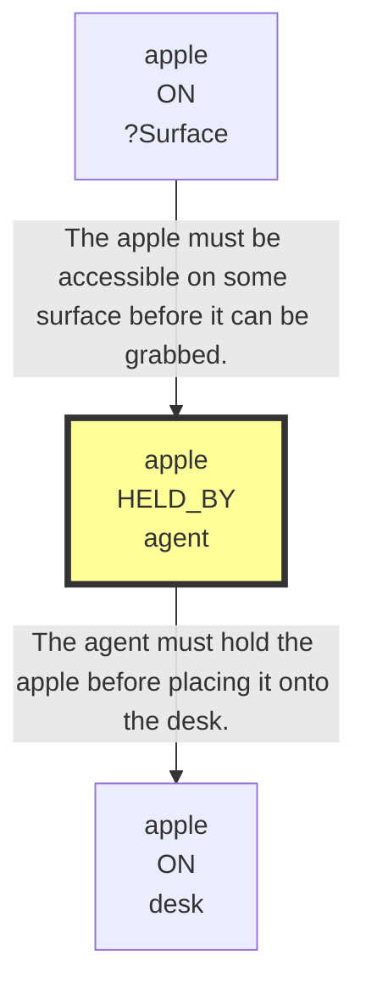
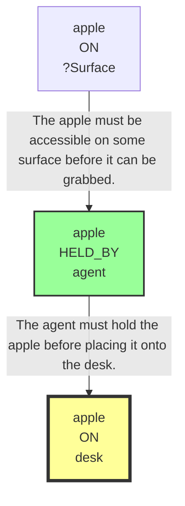

# 🚀 VirtualHome Agent Episode Log


### [GoalReasoner (Module A - Intent)] Output
```json
{
  "is_instruction_obviously_vague": false,
  "clarification_question": null,
  "target_object": "microwave",
  "location_hint": null,
  "reasoning_chain": [
    {
      "question": "Why does the user want this object?",
      "answer": "To have the microwave in an on state."
    },
    {
      "question": "Why is that important?",
      "answer": "Because the user wants to change the appliance from off to on if it is currently off."
    },
    {
      "question": "What fundamental need does this fulfill?",
      "answer": "The user wants an appliance powered on and ready for use."
    },
    {
      "question": "Are there any deeper psychological or physical motivations?",
      "answer": "The likely motivation is to enable heating or cooking tasks that depend on the microwave being operational."
    }
  ],
  "deep_intent": "The user wants an appliance powered on and ready for use.",
  "acceptable_alternatives_properties": [
    {
      "priority": 1,
      "description": "Other indoor cooking or heating appliances that can be turned on and used for warming food."
    },
    {
      "priority": 2,
      "description": "Similar kitchen appliances that provide convenient food heating or preparation."
    },
    {
      "priority": 3,
      "description": "Any household appliance that can fulfill the same goal of making food ready to use."
    },
    {
      "priority": 4,
      "description": "A different food-warming method, such as a stove or toaster oven, if the microwave is unavailable."
    }
  ]
}
```

### [PerceptionFilter] Output
```json
{
  "reasoning": "The goal is to have a heating/cooking appliance powered on. The SDG requires an appliance in the ON state, and the target object is microwave. I should keep the microwave plus alternative food-heating appliances that can fulfill the same function if needed, such as stove, toaster, toaster oven-like heating options, and coffeemaker is not relevant to food heating so excluded.",
  "selected_classes": [
    "character",
    "door",
    "stove",
    "toaster",
    "microwave"
  ],
  "raw_class_count": 45
}
```

### [LLMExecutor] Output
```json
{
  "reasoning": "The active goal is to make the microwave ON. The microwave(234) is present in the kitchen and currently OFF. Because switching on an appliance requires being near it, the next step is to walk to the microwave. It also has HAS_PLUG, but plugging in is only needed if it were not already powered; the graph does not indicate it is unplugged, so the immediate focus is proximity before switching it on.",
  "satisfied_nodes": [],
  "current_node_focus": "N1",
  "mapped_variables": {
    "?Heater": "microwave(234)"
  },
  "action": "[walk] <microwave> (234)"
}
```

### [RoboStateMultiTaskController] Output
```json
{
  "action": "[walk] <microwave> (234)",
  "active_task_id": "task_1",
  "task_context": {
    "active_task_id": "task_1",
    "pending_task_ids": [
      "task_2",
      "task_3"
    ],
    "satisfied_task_ids": []
  },
  "source": "llm_executor"
}
```
## Step 0
- **Action**: `[walk] <microwave> (234)`
- **Action Success**: `True`
- **Action Message**: {'0': {'message': 'Success'}}
- **Active Task**: `task_1`
- **Decision Source**: `llm_executor`
- **Task Progress**: E1_19=pending, E1_02=pending, E1_03=pending
- **SDG Status**:

- **Observed Items (10)**: door(145) [OPEN], door(146) [OPEN], stove(226) [OFF,CLOSED], toaster(231) [OFF], microwave(234) [OFF,CLOSED], character(1), bathroom(11), bedroom(50), kitchen(126), livingroom(261)


### [PerceptionFilter] Output
```json
{
  "reasoning": "Reused cached class selection.",
  "selected_classes": [
    "character",
    "door",
    "stove",
    "toaster",
    "microwave"
  ],
  "raw_class_count": 45
}
```

### [LLMExecutor] Output
```json
{
  "reasoning": "The active goal is to make the microwave ON. The filtered graph shows microwave(234) is OFF and we are already CLOSE to it, so no additional walking is needed. The microwave has HAS_SWITCH and HAS_PLUG, but there is no indication it needs plugging first. The next atomic step is to switch it on.",
  "satisfied_nodes": [],
  "current_node_focus": "N1",
  "mapped_variables": {
    "?Heater": "microwave(234)"
  },
  "action": "[switchon] <microwave> (234)"
}
```

### [RoboStateMultiTaskController] Output
```json
{
  "action": "[switchon] <microwave> (234)",
  "active_task_id": "task_1",
  "task_context": {
    "active_task_id": "task_1",
    "pending_task_ids": [
      "task_2",
      "task_3"
    ],
    "satisfied_task_ids": []
  },
  "source": "llm_executor"
}
```
## Step 1
- **Action**: `[switchon] <microwave> (234)`
- **Action Success**: `True`
- **Action Message**: Faked switch operation in Python layer (bypassed Unity failure)
- **Active Task**: `task_1`
- **Decision Source**: `llm_executor`
- **Task Progress**: E1_19=done, E1_02=pending, E1_03=pending
- **SDG Status**:

- **Observed Items (10)**: door(145) [OPEN], door(146) [OPEN], stove(226) [OFF,CLOSED], toaster(231) [OFF], microwave(234) [OFF,CLOSED], character(1), bathroom(11), bedroom(50), kitchen(126), livingroom(261)


### [GoalReasoner (Module A - Intent)] Output
```json
{
  "is_instruction_obviously_vague": false,
  "clarification_question": null,
  "target_object": "apple",
  "location_hint": "desk",
  "reasoning_chain": [
    {
      "question": "Why does the user want this object?",
      "answer": "To have the apple brought to their desk."
    },
    {
      "question": "Why is that important?",
      "answer": "So the apple is available in the place where the user wants to receive or use it."
    },
    {
      "question": "What fundamental need does this fulfill?",
      "answer": "It fulfills the need to have a desired food item conveniently accessible at the desk."
    },
    {
      "question": "Are there any deeper psychological or physical motivations?",
      "answer": "It may be for eating, snacking, or simply keeping preferred food within reach while working or staying at the desk."
    }
  ],
  "deep_intent": "The user wants convenient access to a food item at their desk.",
  "acceptable_alternatives_properties": [
    {
      "priority": 1,
      "description": "Other ready-to-eat fruits that can be placed at the desk, such as a banana, orange, or pear"
    },
    {
      "priority": 2,
      "description": "Other portable whole foods that can be set on a desk, such as a granola bar or packaged snack"
    },
    {
      "priority": 3,
      "description": "Other light snack foods that satisfy hunger or provide a quick bite"
    },
    {
      "priority": 4,
      "description": "Any edible item the user can consume conveniently while at the desk"
    }
  ]
}
```

### [RoboStateMultiTaskController] Output
```json
{
  "action": "[walk] <bathroom> (11)",
  "active_task_id": "task_2",
  "task_context": {
    "active_task_id": "task_2",
    "pending_task_ids": [
      "task_3"
    ],
    "satisfied_task_ids": [
      "task_1"
    ]
  },
  "source": "room_frontier"
}
```
## Step 2
- **Action**: `[walk] <bathroom> (11)`
- **Action Success**: `True`
- **Action Message**: {'0': {'message': 'Success'}}
- **Active Task**: `task_2`
- **Decision Source**: `room_frontier`
- **Task Progress**: E1_19=done, E1_02=pending, E1_03=pending
- **SDG Status**:

- **Observed Items (125)**: floor(127), floor(128), floor(129), floor(130), floor(131), floor(132), floor(133), floor(134), floor(135), ceiling(136), ceiling(137), ceiling(138), ceiling(139), ceiling(140), ceiling(141)...


### [RoboStateMultiTaskController] Output
```json
{
  "action": "[walk] <bedroom> (50)",
  "active_task_id": "task_2",
  "task_context": {
    "active_task_id": "task_2",
    "pending_task_ids": [
      "task_3"
    ],
    "satisfied_task_ids": [
      "task_1"
    ]
  },
  "source": "room_frontier"
}
```
## Step 3
- **Action**: `[walk] <bedroom> (50)`
- **Action Success**: `True`
- **Action Message**: {'0': {'message': 'Success'}}
- **Active Task**: `task_2`
- **Decision Source**: `room_frontier`
- **Task Progress**: E1_19=done, E1_02=pending, E1_03=pending
- **SDG Status**:

- **Observed Items (163)**: floor(127), floor(128), floor(129), floor(130), floor(131), floor(132), floor(133), floor(134), floor(135), ceiling(136), ceiling(137), ceiling(138), ceiling(139), ceiling(140), ceiling(141)...


### [PerceptionFilter] Output
```json
{
  "reasoning": "The goal is to move the apple to the desk. The SDG requires the apple itself and the desk as the destination, plus a surface to access/handle the apple before placing it. No specialized tool or container is required for this task.",
  "selected_classes": [
    "bed",
    "character",
    "apple",
    "desk"
  ],
  "raw_class_count": 82
}
```

### [LLMExecutor] Output
```json
{
  "reasoning": "The goal is to place an apple on the desk. The current graph shows the desk is in the bedroom and is CLOSED, while the only apple currently in the bedroom is apple(114). To satisfy the chain, the apple must first be held. Since I am already in the bedroom and the apple is present here, the next atomic step is to walk to apple(114) before grabbing it.",
  "satisfied_nodes": [],
  "current_node_focus": "N1",
  "mapped_variables": {
    "?Surface": "desk(80)"
  },
  "action": "[walk] <apple> (114)"
}
```

### [RoboStateMultiTaskController] Output
```json
{
  "action": "[walk] <apple> (114)",
  "active_task_id": "task_2",
  "task_context": {
    "active_task_id": "task_2",
    "pending_task_ids": [
      "task_1",
      "task_3"
    ],
    "satisfied_task_ids": []
  },
  "source": "llm_executor"
}
```
## Step 4
- **Action**: `[walk] <apple> (114)`
- **Action Success**: `True`
- **Action Message**: {'0': {'message': 'Success'}}
- **Active Task**: `task_2`
- **Decision Source**: `llm_executor`
- **Task Progress**: E1_19=pending, E1_02=pending, E1_03=pending
- **SDG Status**:

- **Observed Items (20)**: apple(249), apple(250), apple(251), apple(252), apple(253), apple(254), apple(255), apple(256), apple(257), apple(258), apple(259), apple(113), character(1), bathroom(11), bedroom(50)...


### [PerceptionFilter] Output
```json
{
  "reasoning": "Reused cached class selection.",
  "selected_classes": [
    "bed",
    "character",
    "apple",
    "desk"
  ],
  "raw_class_count": 82
}
```

### [LLMExecutor] Output
```json
{
  "reasoning": "The active task is to place an apple on the desk. The current graph shows apple(114) is already in the bedroom and close to the agent, so the next step toward satisfying N2 (apple held by agent) is to grab that apple. The desk(80) is currently closed, but that will matter only after the apple is held and we are ready to put it on the desk. No other SDG nodes are yet satisfied.",
  "satisfied_nodes": [],
  "current_node_focus": "N2",
  "mapped_variables": {},
  "action": "[grab] <apple> (114)"
}
```

### [RoboStateMultiTaskController] Output
```json
{
  "action": "[grab] <apple> (114)",
  "active_task_id": "task_2",
  "task_context": {
    "active_task_id": "task_2",
    "pending_task_ids": [
      "task_1",
      "task_3"
    ],
    "satisfied_task_ids": []
  },
  "source": "llm_executor"
}
```
## Step 5
- **Action**: `[grab] <apple> (114)`
- **Action Success**: `True`
- **Action Message**: {'0': {'message': 'Success'}}
- **Active Task**: `task_2`
- **Decision Source**: `llm_executor`
- **Task Progress**: E1_19=pending, E1_02=pending, E1_03=pending
- **SDG Status**:

- **Observed Items (20)**: apple(249), apple(250), apple(251), apple(252), apple(253), apple(254), apple(255), apple(256), apple(257), apple(258), apple(259), apple(113), character(1), bathroom(11), bedroom(50)...


### [PerceptionFilter] Output
```json
{
  "reasoning": "Reused cached class selection.",
  "selected_classes": [
    "bed",
    "character",
    "apple",
    "desk"
  ],
  "raw_class_count": 82
}
```

### [LLMExecutor] Output
```json
{
  "reasoning": "The active goal is to place the apple on the desk. The current graph shows apple(114) is already held in the right hand and the agent is in the bedroom near it. The desk(80) is the target surface, but it is CLOSED and can_open, so I must first walk to the desk before any place action. N2 is already satisfied because the apple is held by the agent.",
  "satisfied_nodes": [
    "N2"
  ],
  "current_node_focus": "N3",
  "mapped_variables": {
    "?Surface": "desk(80)"
  },
  "action": "[walk] <desk> (80)"
}
```

### [RoboStateMultiTaskController] Output
```json
{
  "action": "[walk] <desk> (80)",
  "active_task_id": "task_2",
  "task_context": {
    "active_task_id": "task_2",
    "pending_task_ids": [
      "task_1",
      "task_3"
    ],
    "satisfied_task_ids": []
  },
  "source": "llm_executor"
}
```
## Step 6
- **Action**: `[walk] <desk> (80)`
- **Action Success**: `True`
- **Action Message**: {'0': {'message': 'Success'}}
- **Active Task**: `task_2`
- **Decision Source**: `llm_executor`
- **Task Progress**: E1_19=pending, E1_02=pending, E1_03=pending
- **SDG Status**:

- **Observed Items (20)**: apple(249), apple(250), apple(251), apple(252), apple(253), apple(254), apple(255), apple(256), apple(257), apple(258), apple(259), apple(113), character(1), bathroom(11), bedroom(50)...


### [PerceptionFilter] Output
```json
{
  "reasoning": "Reused cached class selection.",
  "selected_classes": [
    "bed",
    "character",
    "apple",
    "desk"
  ],
  "raw_class_count": 82
}
```

### [LLMExecutor] Output
```json
{
  "reasoning": "The active task is to place the apple on the desk. The current graph shows apple(114) is already held in the right hand and the character is already close to desk(80). The desk is a valid surface target for putback. N2 (apple held by agent) is satisfied, and the remaining goal is N3 (apple on desk). Since proximity to the destination is already established, the next atomic action is to place the held apple onto the desk.",
  "satisfied_nodes": [
    "N2"
  ],
  "current_node_focus": "N3",
  "mapped_variables": {},
  "action": "[putback] <apple> (114) <desk> (80)"
}
```

### [RoboStateMultiTaskController] Output
```json
{
  "action": "[putback] <apple> (114) <desk> (80)",
  "active_task_id": "task_2",
  "task_context": {
    "active_task_id": "task_2",
    "pending_task_ids": [
      "task_1",
      "task_3"
    ],
    "satisfied_task_ids": []
  },
  "source": "llm_executor"
}
```
## Step 7
- **Action**: `[putback] <apple> (114) <desk> (80)`
- **Action Success**: `True`
- **Action Message**: {'0': {'message': 'Success'}}
- **Active Task**: `task_2`
- **Decision Source**: `llm_executor`
- **Task Progress**: E1_19=pending, E1_02=done, E1_03=pending
- **SDG Status**:

- **Observed Items (20)**: apple(249), apple(250), apple(251), apple(252), apple(253), apple(254), apple(255), apple(256), apple(257), apple(258), apple(259), apple(113), character(1), bathroom(11), bedroom(50)...


### [GoalReasoner (Module A - Intent)] Output
```json
{
  "is_instruction_obviously_vague": false,
  "clarification_question": null,
  "target_object": "book",
  "location_hint": "sofa",
  "reasoning_chain": [
    {
      "question": "Why does the user want this object?",
      "answer": "To move an unorganized book to the sofa."
    },
    {
      "question": "Why is that important?",
      "answer": "To place the book in a preferred location instead of leaving it unorganized somewhere else."
    },
    {
      "question": "What fundamental need does this fulfill?",
      "answer": "To organize or relocate an item into a desired resting place."
    },
    {
      "question": "Are there any deeper psychological or physical motivations?",
      "answer": "The user likely wants the environment to be tidier and the book to be placed where it belongs or is easier to use."
    }
  ],
  "deep_intent": "The user wants to organize a misplaced item by relocating it to a preferred indoor resting place.",
  "acceptable_alternatives_properties": [
    {
      "priority": 1,
      "description": "Other similarly misplaced personal reading materials, such as magazines, notebooks, or papers, moved to the same resting place."
    },
    {
      "priority": 2,
      "description": "Other small household items that are out of place and can be neatly relocated to a seating area."
    },
    {
      "priority": 3,
      "description": "Nearby portable items that help tidy the space by being grouped in one designated spot."
    },
    {
      "priority": 4,
      "description": "Other movable household objects that can be organized into a more orderly location if the exact item is unavailable."
    }
  ]
}
```

### [PerceptionFilter] Output
```json
{
  "reasoning": "The goal is to relocate a book onto a sofa, so the only necessary classes are the target object and the destination furniture. No tools or alternative functional objects are required for this simple placement task.",
  "selected_classes": [
    "paper",
    "character",
    "door",
    "book",
    "sofa"
  ],
  "raw_class_count": 82
}
```

### [LLMExecutor] Output
```json
{
  "reasoning": "The active goal is to place a book on the sofa. In the current graph, the relevant matching book is book(104) in the bedroom, and the sofa(85) is also in the bedroom. Since I am already in the bedroom (character is INSIDE bedroom(50)), the next required step is to move next to the book before I can grab it. I should not interact with the sofa yet because I do not hold the book.",
  "satisfied_nodes": [],
  "current_node_focus": "N1",
  "mapped_variables": {},
  "action": "[walk] <book> (104)"
}
```

### [RoboStateMultiTaskController] Output
```json
{
  "action": "[walk] <book> (104)",
  "active_task_id": "task_3",
  "task_context": {
    "active_task_id": "task_3",
    "pending_task_ids": [
      "task_1"
    ],
    "satisfied_task_ids": [
      "task_2"
    ]
  },
  "source": "llm_executor"
}
```
## Step 8
- **Action**: `[walk] <book> (104)`
- **Action Success**: `True`
- **Action Message**: {'0': {'message': 'Success'}}
- **Active Task**: `task_3`
- **Decision Source**: `llm_executor`
- **Task Progress**: E1_19=pending, E1_02=done, E1_03=pending
- **SDG Status**:

- **Observed Items (13)**: door(145) [OPEN], door(146) [OPEN], book(163) [CLOSED], book(164) [CLOSED], character(1), bathroom(11), bedroom(50), kitchen(126), livingroom(261), door(47) [OPEN], sofa(85), book(104) [CLOSED], paper(109)


### [PerceptionFilter] Output
```json
{
  "reasoning": "Reused cached class selection.",
  "selected_classes": [
    "paper",
    "character",
    "door",
    "book",
    "sofa"
  ],
  "raw_class_count": 82
}
```

### [LLMExecutor] Output
```json
{
  "reasoning": "The active goal is to place the book on the sofa. I am already close to book(104) from the previous successful walk, and the book is currently in the bedroom. The sofa target is also in the bedroom and is a flat surface. Since I must be holding the book before placing it, the next atomic step is to grab the book that is currently nearby. The state of book(104) is valid for grabbing (grabbable, movable), and no hygiene/tool constraints apply.",
  "satisfied_nodes": [],
  "current_node_focus": "N1",
  "mapped_variables": {},
  "action": "[grab] <book> (104)"
}
```

### [RoboStateMultiTaskController] Output
```json
{
  "action": "[grab] <book> (104)",
  "active_task_id": "task_3",
  "task_context": {
    "active_task_id": "task_3",
    "pending_task_ids": [
      "task_1"
    ],
    "satisfied_task_ids": [
      "task_2"
    ]
  },
  "source": "llm_executor"
}
```
## Step 9
- **Action**: `[grab] <book> (104)`
- **Action Success**: `True`
- **Action Message**: {'0': {'message': 'Success'}}
- **Active Task**: `task_3`
- **Decision Source**: `llm_executor`
- **Task Progress**: E1_19=pending, E1_02=done, E1_03=pending
- **SDG Status**:

- **Observed Items (13)**: door(145) [OPEN], door(146) [OPEN], book(163) [CLOSED], book(164) [CLOSED], character(1), bathroom(11), bedroom(50), kitchen(126), livingroom(261), door(47) [OPEN], sofa(85), book(104) [CLOSED], paper(109)


### [PerceptionFilter] Output
```json
{
  "reasoning": "Reused cached class selection.",
  "selected_classes": [
    "paper",
    "character",
    "door",
    "book",
    "sofa"
  ],
  "raw_class_count": 82
}
```

### [LLMExecutor] Output
```json
{
  "reasoning": "The active goal is to place the currently held book onto the sofa. I already hold book(104), and the sofa(85) is the target surface in the bedroom. To satisfy the ON relation, I must first move next to the sofa before I can put the book down.",
  "satisfied_nodes": [],
  "current_node_focus": "N1",
  "mapped_variables": {},
  "action": "[walk] <sofa> (85)"
}
```

### [RoboStateMultiTaskController] Output
```json
{
  "action": "[walk] <sofa> (85)",
  "active_task_id": "task_3",
  "task_context": {
    "active_task_id": "task_3",
    "pending_task_ids": [
      "task_1"
    ],
    "satisfied_task_ids": [
      "task_2"
    ]
  },
  "source": "llm_executor"
}
```
## Step 10
- **Action**: `[walk] <sofa> (85)`
- **Action Success**: `True`
- **Action Message**: {'0': {'message': 'Success'}}
- **Active Task**: `task_3`
- **Decision Source**: `llm_executor`
- **Task Progress**: E1_19=pending, E1_02=done, E1_03=pending
- **SDG Status**:

- **Observed Items (13)**: door(145) [OPEN], door(146) [OPEN], book(163) [CLOSED], book(164) [CLOSED], character(1), bathroom(11), bedroom(50), kitchen(126), livingroom(261), door(47) [OPEN], sofa(85), book(104) [CLOSED], paper(109)


### [PerceptionFilter] Output
```json
{
  "reasoning": "Reused cached class selection.",
  "selected_classes": [
    "paper",
    "character",
    "door",
    "book",
    "sofa"
  ],
  "raw_class_count": 82
}
```

### [LLMExecutor] Output
```json
{
  "reasoning": "The active goal is to place the book on the sofa. I am already close to the sofa, and the held object in the graph is book(104), which matches the target book. The next required atomic step is to place it onto the sofa, satisfying N1.",
  "satisfied_nodes": [],
  "current_node_focus": "N1",
  "mapped_variables": {},
  "action": "[putback] <book> (104) <sofa> (85)"
}
```

### [RoboStateMultiTaskController] Output
```json
{
  "action": "[putback] <book> (104) <sofa> (85)",
  "active_task_id": "task_3",
  "task_context": {
    "active_task_id": "task_3",
    "pending_task_ids": [
      "task_1"
    ],
    "satisfied_task_ids": [
      "task_2"
    ]
  },
  "source": "llm_executor"
}
```
## Step 11
- **Action**: `[putback] <book> (104) <sofa> (85)`
- **Action Success**: `True`
- **Action Message**: {'0': {'message': 'Success'}}
- **Active Task**: `task_3`
- **Decision Source**: `llm_executor`
- **Task Progress**: E1_19=pending, E1_02=done, E1_03=done
- **SDG Status**:

- **Observed Items (13)**: door(145) [OPEN], door(146) [OPEN], book(163) [CLOSED], book(164) [CLOSED], character(1), bathroom(11), bedroom(50), kitchen(126), livingroom(261), door(47) [OPEN], sofa(85), book(104) [CLOSED], paper(109)


### [PerceptionFilter] Output
```json
{
  "reasoning": "The goal is to turn the microwave on, so the essential class is the microwave itself. No additional tools or locations are required for this state-change task.",
  "selected_classes": [
    "character",
    "door",
    "stove",
    "toaster",
    "microwave"
  ],
  "raw_class_count": 82
}
```

### [LLMExecutor] Output
```json
{
  "reasoning": "The active goal is to have the microwave in the ON state. The filtered graph already shows microwave(234) as ON, so the single SDG node N1 is already satisfied. No further action is needed for the active task.",
  "satisfied_nodes": [
    "N1"
  ],
  "current_node_focus": "N1",
  "mapped_variables": {
    "?Heater": "microwave(234)"
  },
  "action": "[wait]"
}
```

### [RoboStateMultiTaskController] Output
```json
{
  "action": "[wait]",
  "active_task_id": "task_1",
  "task_context": {
    "active_task_id": "task_1",
    "pending_task_ids": [],
    "satisfied_task_ids": [
      "task_2",
      "task_3"
    ]
  },
  "source": "llm_executor"
}
```
## Step 12
- **Action**: `[wait]`
- **Action Success**: `True`
- **Action Message**: Time passes. You waited for a while.
- **Active Task**: `task_1`
- **Decision Source**: `llm_executor`
- **Task Progress**: E1_19=pending, E1_02=done, E1_03=done
- **SDG Status**:

- **Observed Items (11)**: door(145) [OPEN], door(146) [OPEN], stove(226) [OFF,CLOSED], toaster(231) [OFF], microwave(234) [CLOSED,ON], character(1), bathroom(11), bedroom(50), kitchen(126), livingroom(261), door(47) [OPEN]


### [PerceptionFilter] Output
```json
{
  "reasoning": "Reused cached class selection.",
  "selected_classes": [
    "character",
    "door",
    "stove",
    "toaster",
    "microwave"
  ],
  "raw_class_count": 82
}
```

### [LLMExecutor] Output
```json
{
  "reasoning": "The active goal is to have the microwave in the ON state. The current filtered graph already shows microwave(234) is ON, so the single required SDG node N1 is satisfied. No further action is needed for the active task.",
  "satisfied_nodes": [
    "N1"
  ],
  "current_node_focus": "N1",
  "mapped_variables": {
    "?Heater": "microwave(234)"
  },
  "action": "[wait]"
}
```

### [RoboStateMultiTaskController] Output
```json
{
  "action": "[wait]",
  "active_task_id": "task_1",
  "task_context": {
    "active_task_id": "task_1",
    "pending_task_ids": [],
    "satisfied_task_ids": [
      "task_2",
      "task_3"
    ]
  },
  "source": "llm_executor"
}
```
## Step 13
- **Action**: `[wait]`
- **Action Success**: `True`
- **Action Message**: Time passes. You waited for a while.
- **Active Task**: `task_1`
- **Decision Source**: `llm_executor`
- **Task Progress**: E1_19=pending, E1_02=done, E1_03=done
- **SDG Status**:

- **Observed Items (11)**: door(145) [OPEN], door(146) [OPEN], stove(226) [OFF,CLOSED], toaster(231) [OFF], microwave(234) [CLOSED,ON], character(1), bathroom(11), bedroom(50), kitchen(126), livingroom(261), door(47) [OPEN]


### [PerceptionFilter] Output
```json
{
  "reasoning": "Reused cached class selection.",
  "selected_classes": [
    "character",
    "door",
    "stove",
    "toaster",
    "microwave"
  ],
  "raw_class_count": 82
}
```

### [LLMExecutor] Output
```json
{
  "reasoning": "The active SDG only requires the heater object to be ON. The microwave(234) is the best match for ?Heater because it is a kitchen appliance with HAS_SWITCH and is already marked ON. Therefore the goal state N1 is already satisfied, and no physical action is needed.",
  "satisfied_nodes": [
    "N1"
  ],
  "current_node_focus": "N1",
  "mapped_variables": {
    "?Heater": "microwave(234)"
  },
  "action": "[wait]"
}
```

### [RoboStateMultiTaskController] Output
```json
{
  "action": "[wait]",
  "active_task_id": "task_1",
  "task_context": {
    "active_task_id": "task_1",
    "pending_task_ids": [],
    "satisfied_task_ids": [
      "task_2",
      "task_3"
    ]
  },
  "source": "llm_executor"
}
```
## Step 14
- **Action**: `[wait]`
- **Action Success**: `True`
- **Action Message**: Time passes. You waited for a while.
- **Active Task**: `task_1`
- **Decision Source**: `llm_executor`
- **Task Progress**: E1_19=pending, E1_02=done, E1_03=done
- **SDG Status**:

- **Observed Items (11)**: door(145) [OPEN], door(146) [OPEN], stove(226) [OFF,CLOSED], toaster(231) [OFF], microwave(234) [CLOSED,ON], character(1), bathroom(11), bedroom(50), kitchen(126), livingroom(261), door(47) [OPEN]


### [PerceptionFilter] Output
```json
{
  "reasoning": "Reused cached class selection.",
  "selected_classes": [
    "character",
    "door",
    "stove",
    "toaster",
    "microwave"
  ],
  "raw_class_count": 82
}
```

### [LLMExecutor] Output
```json
{
  "reasoning": "The active SDG has a single node: the heater object must be ON. The filtered graph already shows microwave(234) is ON, and it matches the goal intent's target appliance. Therefore the goal state is already satisfied and no physical action is needed.",
  "satisfied_nodes": [
    "N1"
  ],
  "current_node_focus": "N1",
  "mapped_variables": {
    "?Heater": "microwave(234)"
  },
  "action": "[wait]"
}
```

### [RoboStateMultiTaskController] Output
```json
{
  "action": "[wait]",
  "active_task_id": "task_1",
  "task_context": {
    "active_task_id": "task_1",
    "pending_task_ids": [],
    "satisfied_task_ids": [
      "task_2",
      "task_3"
    ]
  },
  "source": "llm_executor"
}
```
## Step 15
- **Action**: `[wait]`
- **Action Success**: `True`
- **Action Message**: Time passes. You waited for a while.
- **Active Task**: `task_1`
- **Decision Source**: `llm_executor`
- **Task Progress**: E1_19=pending, E1_02=done, E1_03=done
- **SDG Status**:

- **Observed Items (11)**: door(145) [OPEN], door(146) [OPEN], stove(226) [OFF,CLOSED], toaster(231) [OFF], microwave(234) [CLOSED,ON], character(1), bathroom(11), bedroom(50), kitchen(126), livingroom(261), door(47) [OPEN]


### [PerceptionFilter] Output
```json
{
  "reasoning": "Reused cached class selection.",
  "selected_classes": [
    "character",
    "door",
    "stove",
    "toaster",
    "microwave"
  ],
  "raw_class_count": 82
}
```

### [LLMExecutor] Output
```json
{
  "reasoning": "The SDG has a single goal node: the heater appliance must be ON. In the current graph, microwave(234) is already ON and is the best match for ?Heater because it is an indoor kitchen appliance with switch capability and is explicitly close to the character. Therefore the goal state is already satisfied; no physical action is needed.",
  "satisfied_nodes": [
    "N1"
  ],
  "current_node_focus": "N1",
  "mapped_variables": {
    "?Heater": "microwave(234)"
  },
  "action": "[wait]"
}
```

### [RoboStateMultiTaskController] Output
```json
{
  "action": "[wait]",
  "active_task_id": "task_1",
  "task_context": {
    "active_task_id": "task_1",
    "pending_task_ids": [],
    "satisfied_task_ids": [
      "task_2",
      "task_3"
    ]
  },
  "source": "llm_executor"
}
```
