# 🚀 VirtualHome Agent Episode Log


### [GoalReasoner (Module A - Intent)] Output
```json
{
  "is_instruction_obviously_vague": false,
  "clarification_question": null,
  "target_object": "microwave",
  "location_hint": null,
  "reasoning_chain": [
    {
      "question": "Why does the user want this object?",
      "answer": "To have the microwave powered on and ready for use."
    },
    {
      "question": "Why is that important?",
      "answer": "So it can perform its heating or cooking function when needed."
    },
    {
      "question": "What fundamental need does this fulfill?",
      "answer": "It supports preparing or warming food and drinks."
    },
    {
      "question": "Are there any deeper psychological or physical motivations?",
      "answer": "The primary motivation is convenience and the ability to quickly heat items, which helps satisfy hunger or improve comfort."
    }
  ],
  "deep_intent": "The user wants to enable a household appliance so it can heat or cook items.",
  "acceptable_alternatives_properties": [
    {
      "priority": 1,
      "description": "Other kitchen appliances that can be turned on for heating or cooking, such as an oven, toaster oven, or electric kettle."
    },
    {
      "priority": 2,
      "description": "Any ready-to-use food-preparation device that provides similar warming functionality, such as a hot plate or rice cooker."
    },
    {
      "priority": 3,
      "description": "Alternative methods for heating food, such as a stove burner or countertop food warmer."
    },
    {
      "priority": 4,
      "description": "A different way to warm or prepare food, such as placing items in a warm environment or using a thermos to maintain temperature."
    }
  ]
}
```

### [PerceptionFilter] Output
```json
{
  "reasoning": "The goal is to have a heating/cooking appliance powered on and ready. The SDG requires a heater state ON, so I must keep the target microwave and all reasonable alternative heating/cooking appliances present as backups. Since this is a kitchen-task, related power/control items that enable the appliance to be turned on are also relevant.",
  "selected_classes": [
    "toaster",
    "character",
    "plate",
    "powersocket",
    "coffeemaker",
    "microwave",
    "stove",
    "lightswitch"
  ],
  "raw_class_count": 45
}
```

### [LLMExecutor] Output
```json
{
  "reasoning": "The active SDG requires the heater to be ON. The best matching object for ?Heater is the microwave(234), which is currently OFF and has HAS_PLUG. Since it is plugged-capable and we are not yet interacting with it, the single next step is to walk to the microwave so we can then switch it on in a following action.",
  "satisfied_nodes": [],
  "current_node_focus": "N1",
  "mapped_variables": {
    "?Heater": "microwave(234)"
  },
  "action": "[walk] <microwave> (234)"
}
```

### [RoboStateMultiTaskController] Output
```json
{
  "action": "[walk] <microwave> (234)",
  "active_task_id": "task_1",
  "task_context": {
    "active_task_id": "task_1",
    "pending_task_ids": [
      "task_2",
      "task_3"
    ],
    "satisfied_task_ids": []
  },
  "source": "llm_executor"
}
```
## Step 0
- **Action**: `[walk] <microwave> (234)`
- **Action Success**: `True`
- **Action Message**: {'0': {'message': 'Success'}}
- **Active Task**: `task_1`
- **Decision Source**: `llm_executor`
- **Task Progress**: E1_19=pending, E1_02=pending, E1_03=pending
- **SDG Status**:
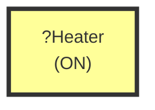
- **Observed Items (18)**: powersocket(156), lightswitch(157) [ON], plate(170), plate(171), plate(172), plate(173), plate(177), plate(178), plate(184), stove(226) [OFF,CLOSED], coffeemaker(229) [OFF], toaster(231) [OFF], microwave(234) [OFF,CLOSED], character(1), bathroom(11)...


### [PerceptionFilter] Output
```json
{
  "reasoning": "Reused cached class selection.",
  "selected_classes": [
    "toaster",
    "character",
    "plate",
    "powersocket",
    "coffeemaker",
    "microwave",
    "stove",
    "lightswitch"
  ],
  "raw_class_count": 45
}
```

### [LLMExecutor] Output
```json
{
  "reasoning": "The active goal is to make the microwave ON. The current graph shows microwave(234) is OFF and already CLOSE to the character, so the next required step is to turn it on. It has HAS_PLUG, and no plug-in state is shown, so per rules we should not guess about plugging unless needed; the immediate actionable step is switching it on.",
  "satisfied_nodes": [],
  "current_node_focus": "N1",
  "mapped_variables": {
    "?Heater": "microwave(234)"
  },
  "action": "[switchon] <microwave> (234)"
}
```

### [RoboStateMultiTaskController] Output
```json
{
  "action": "[switchon] <microwave> (234)",
  "active_task_id": "task_1",
  "task_context": {
    "active_task_id": "task_1",
    "pending_task_ids": [
      "task_2",
      "task_3"
    ],
    "satisfied_task_ids": []
  },
  "source": "llm_executor"
}
```
## Step 1
- **Action**: `[switchon] <microwave> (234)`
- **Action Success**: `True`
- **Action Message**: Faked switch operation in Python layer (bypassed Unity failure)
- **Active Task**: `task_1`
- **Decision Source**: `llm_executor`
- **Task Progress**: E1_19=done, E1_02=pending, E1_03=pending
- **SDG Status**:

- **Observed Items (18)**: powersocket(156), lightswitch(157) [ON], plate(170), plate(171), plate(172), plate(173), plate(177), plate(178), plate(184), stove(226) [OFF,CLOSED], coffeemaker(229) [OFF], toaster(231) [OFF], microwave(234) [OFF,CLOSED], character(1), bathroom(11)...


### [GoalReasoner (Module A - Intent)] Output
```json
{
  "is_instruction_obviously_vague": false,
  "clarification_question": null,
  "target_object": "apple",
  "location_hint": "desk",
  "reasoning_chain": [
    {
      "question": "Why does the user want this object?",
      "answer": "To have the apple brought to their desk."
    },
    {
      "question": "Why is that important?",
      "answer": "So they can access or use the apple while at their desk."
    },
    {
      "question": "What fundamental need does this fulfill?",
      "answer": "It fulfills the need to obtain a desired item for later consumption or use."
    },
    {
      "question": "Are there any deeper psychological or physical motivations?",
      "answer": "The underlying motivation is likely convenience and satisfying hunger or a preference for having the apple nearby."
    }
  ],
  "deep_intent": "The user wants to access food conveniently at their desk, likely to satisfy hunger or a desire for a snack.",
  "acceptable_alternatives_properties": [
    {
      "priority": 1,
      "description": "Other ready-to-eat fruits, such as a banana, orange, or pear"
    },
    {
      "priority": 2,
      "description": "Other portable snack foods, such as a granola bar, crackers, or packaged cookies"
    },
    {
      "priority": 3,
      "description": "Other simple edible items that can be carried to a desk, such as nuts or dried fruit"
    },
    {
      "priority": 4,
      "description": "Any readily available snack or light food item that can satisfy hunger or provide a quick bite"
    }
  ]
}
```

### [RoboStateMultiTaskController] Output
```json
{
  "action": "[walk] <bathroom> (11)",
  "active_task_id": "task_2",
  "task_context": {
    "active_task_id": "task_2",
    "pending_task_ids": [
      "task_3"
    ],
    "satisfied_task_ids": [
      "task_1"
    ]
  },
  "source": "room_frontier"
}
```
## Step 2
- **Action**: `[walk] <bathroom> (11)`
- **Action Success**: `True`
- **Action Message**: {'0': {'message': 'Success'}}
- **Active Task**: `task_2`
- **Decision Source**: `room_frontier`
- **Task Progress**: E1_19=done, E1_02=pending, E1_03=pending
- **SDG Status**:
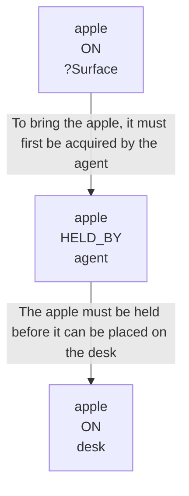
- **Observed Items (125)**: floor(127), floor(128), floor(129), floor(130), floor(131), floor(132), floor(133), floor(134), floor(135), ceiling(136), ceiling(137), ceiling(138), ceiling(139), ceiling(140), ceiling(141)...


### [RoboStateMultiTaskController] Output
```json
{
  "action": "[walk] <bedroom> (50)",
  "active_task_id": "task_2",
  "task_context": {
    "active_task_id": "task_2",
    "pending_task_ids": [
      "task_3"
    ],
    "satisfied_task_ids": [
      "task_1"
    ]
  },
  "source": "room_frontier"
}
```
## Step 3
- **Action**: `[walk] <bedroom> (50)`
- **Action Success**: `True`
- **Action Message**: {'0': {'message': 'Success'}}
- **Active Task**: `task_2`
- **Decision Source**: `room_frontier`
- **Task Progress**: E1_19=done, E1_02=pending, E1_03=pending
- **SDG Status**:

- **Observed Items (163)**: floor(127), floor(128), floor(129), floor(130), floor(131), floor(132), floor(133), floor(134), floor(135), ceiling(136), ceiling(137), ceiling(138), ceiling(139), ceiling(140), ceiling(141)...


### [PerceptionFilter] Output
```json
{
  "reasoning": "The goal only requires acquiring an apple and placing it on the desk. So the minimum needed classes are the target object apple and the location desk. No tool or alternative container is required for this simple transport task.",
  "selected_classes": [
    "desk",
    "character",
    "apple"
  ],
  "raw_class_count": 82
}
```

### [LLMExecutor] Output
```json
{
  "reasoning": "The active goal is to place an apple on the desk. The current graph shows multiple apples in the kitchen and one apple(114) already in the bedroom, which is the agent's current room. Since we cannot grab across rooms and should avoid unnecessary travel, the best next step is to walk to the nearby apple(114) so it can be grabbed next. This progresses toward N1 (apple ON some surface) and ultimately N2/N3.",
  "satisfied_nodes": [],
  "current_node_focus": "N1",
  "mapped_variables": {},
  "action": "[walk] <apple> (114)"
}
```

### [RoboStateMultiTaskController] Output
```json
{
  "action": "[walk] <apple> (114)",
  "active_task_id": "task_2",
  "task_context": {
    "active_task_id": "task_2",
    "pending_task_ids": [
      "task_1",
      "task_3"
    ],
    "satisfied_task_ids": []
  },
  "source": "llm_executor"
}
```
## Step 4
- **Action**: `[walk] <apple> (114)`
- **Action Success**: `True`
- **Action Message**: {'0': {'message': 'Success'}}
- **Active Task**: `task_2`
- **Decision Source**: `llm_executor`
- **Task Progress**: E1_19=pending, E1_02=pending, E1_03=pending
- **SDG Status**:
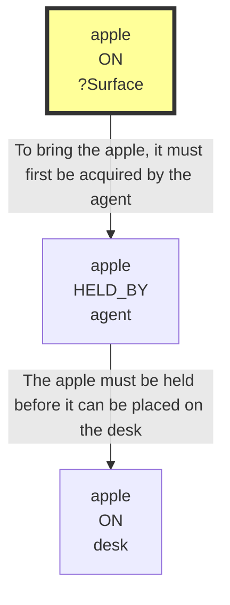
- **Observed Items (19)**: apple(249), apple(250), apple(251), apple(252), apple(253), apple(254), apple(255), apple(256), apple(257), apple(258), apple(259), apple(113), character(1), bathroom(11), bedroom(50)...


### [PerceptionFilter] Output
```json
{
  "reasoning": "Reused cached class selection.",
  "selected_classes": [
    "desk",
    "character",
    "apple"
  ],
  "raw_class_count": 82
}
```

### [LLMExecutor] Output
```json
{
  "reasoning": "The active task is to bring an apple to the desk. In the current graph, apple(114) is the only apple already close to the agent and it is inside the bedroom, while the desk(80) is in the same bedroom but is closed. To progress, the apple must be acquired first (N1 -> N2). Since the agent is already CLOSE to apple(114), the next atomic step is to grab it.",
  "satisfied_nodes": [],
  "current_node_focus": "N2",
  "mapped_variables": {
    "?Surface": "bedroom(50)"
  },
  "action": "[grab] <apple> (114)"
}
```

### [RoboStateMultiTaskController] Output
```json
{
  "action": "[grab] <apple> (114)",
  "active_task_id": "task_2",
  "task_context": {
    "active_task_id": "task_2",
    "pending_task_ids": [
      "task_1",
      "task_3"
    ],
    "satisfied_task_ids": []
  },
  "source": "llm_executor"
}
```
## Step 5
- **Action**: `[grab] <apple> (114)`
- **Action Success**: `True`
- **Action Message**: {'0': {'message': 'Success'}}
- **Active Task**: `task_2`
- **Decision Source**: `llm_executor`
- **Task Progress**: E1_19=pending, E1_02=pending, E1_03=pending
- **SDG Status**:
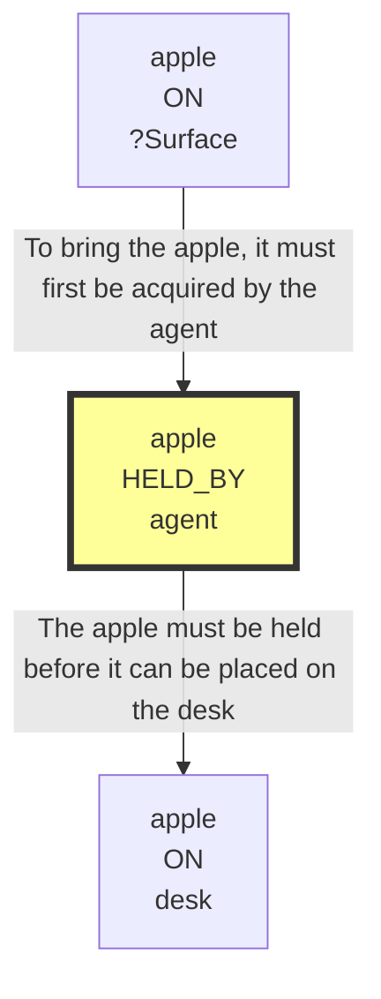
- **Observed Items (19)**: apple(249), apple(250), apple(251), apple(252), apple(253), apple(254), apple(255), apple(256), apple(257), apple(258), apple(259), apple(113), character(1), bathroom(11), bedroom(50)...


### [PerceptionFilter] Output
```json
{
  "reasoning": "Reused cached class selection.",
  "selected_classes": [
    "desk",
    "character",
    "apple"
  ],
  "raw_class_count": 82
}
```

### [LLMExecutor] Output
```json
{
  "reasoning": "The active task is to bring the apple to the desk. The current graph shows the agent is already holding apple(114) in the right hand and is inside the bedroom, while the desk(80) is a movable surface in the bedroom and is currently CLOSED but still a valid surface target for placing the apple on top. Since the apple is already acquired, N2 is satisfied, and the next missing step toward N3 is to move near the desk before placing the apple there. Because putback requires being explicitly walked to the destination first, the correct next action is to walk to the desk.",
  "satisfied_nodes": [
    "N2"
  ],
  "current_node_focus": "N3",
  "mapped_variables": {
    "?Surface": "desk(80)"
  },
  "action": "[walk] <desk> (80)"
}
```

### [RoboStateMultiTaskController] Output
```json
{
  "action": "[walk] <desk> (80)",
  "active_task_id": "task_2",
  "task_context": {
    "active_task_id": "task_2",
    "pending_task_ids": [
      "task_1",
      "task_3"
    ],
    "satisfied_task_ids": []
  },
  "source": "llm_executor"
}
```
## Step 6
- **Action**: `[walk] <desk> (80)`
- **Action Success**: `True`
- **Action Message**: {'0': {'message': 'Success'}}
- **Active Task**: `task_2`
- **Decision Source**: `llm_executor`
- **Task Progress**: E1_19=pending, E1_02=pending, E1_03=pending
- **SDG Status**:
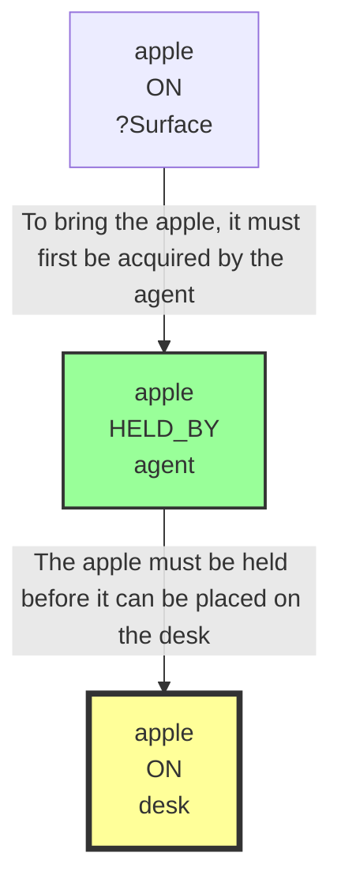
- **Observed Items (19)**: apple(249), apple(250), apple(251), apple(252), apple(253), apple(254), apple(255), apple(256), apple(257), apple(258), apple(259), apple(113), character(1), bathroom(11), bedroom(50)...


### [PerceptionFilter] Output
```json
{
  "reasoning": "Reused cached class selection.",
  "selected_classes": [
    "desk",
    "character",
    "apple"
  ],
  "raw_class_count": 82
}
```

### [LLMExecutor] Output
```json
{
  "reasoning": "The active task is to bring an apple to the desk. The current graph shows the agent is already close to the desk and is holding apple(114) in the right hand, so N1 (apple on some surface, currently held) and N2 (apple held by agent) are satisfied. The remaining gap is N3: place the held apple onto the desk. Because putback requires being explicitly walked to the destination first, and we are already close to desk(80), the next atomic action is to put the apple on the desk.",
  "satisfied_nodes": [
    "N1",
    "N2"
  ],
  "current_node_focus": "N3",
  "mapped_variables": {},
  "action": "[putback] <apple> (114) <desk> (80)"
}
```

### [RoboStateMultiTaskController] Output
```json
{
  "action": "[putback] <apple> (114) <desk> (80)",
  "active_task_id": "task_2",
  "task_context": {
    "active_task_id": "task_2",
    "pending_task_ids": [
      "task_1",
      "task_3"
    ],
    "satisfied_task_ids": []
  },
  "source": "llm_executor"
}
```
## Step 7
- **Action**: `[putback] <apple> (114) <desk> (80)`
- **Action Success**: `True`
- **Action Message**: {'0': {'message': 'Success'}}
- **Active Task**: `task_2`
- **Decision Source**: `llm_executor`
- **Task Progress**: E1_19=pending, E1_02=pending, E1_03=pending
- **SDG Status**:
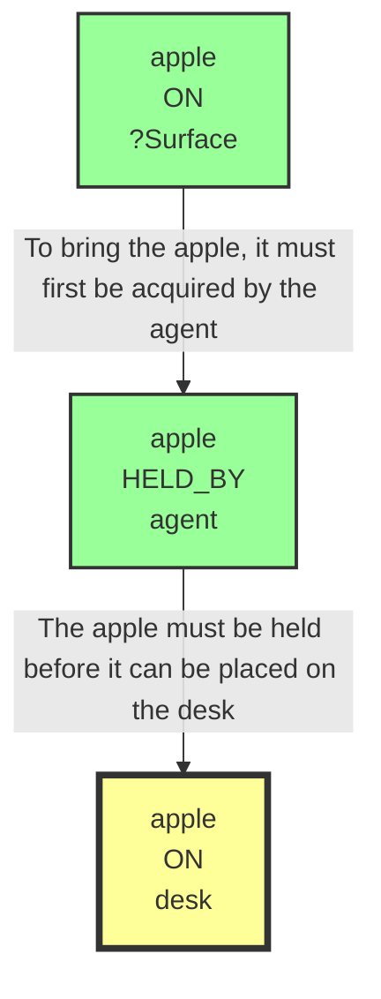
- **Observed Items (19)**: apple(249), apple(250), apple(251), apple(252), apple(253), apple(254), apple(255), apple(256), apple(257), apple(258), apple(259), apple(113), character(1), bathroom(11), bedroom(50)...


### [PerceptionFilter] Output
```json
{
  "reasoning": "Reused cached class selection.",
  "selected_classes": [
    "desk",
    "character",
    "apple"
  ],
  "raw_class_count": 82
}
```

### [LLMExecutor] Output
```json
{
  "reasoning": "The active task is to bring the apple to the desk. In the current filtered graph, apple(114) is already ON desk(80), and the character is CLOSE to both apple(114) and desk(80). This satisfies the SDG chain: N1 (apple on some surface) is satisfied by apple(114) on desk(80), N2 (apple held by agent) is not needed anymore because the goal state N3 is already achieved, and N3 (apple on desk) is satisfied. No further physical action is needed for the active task.",
  "satisfied_nodes": [
    "N1",
    "N3"
  ],
  "current_node_focus": "N3",
  "mapped_variables": {},
  "action": "[wait]"
}
```

### [GoalReasoner (Module A - Intent)] Output
```json
{
  "is_instruction_obviously_vague": true,
  "clarification_question": "Which specific book should I move, and where exactly should I place it on the sofa?",
  "target_object": "book",
  "location_hint": "sofa",
  "reasoning_chain": [
    {
      "question": "Why does the user want this object?",
      "answer": "To relocate a book that is in an unorganized place."
    },
    {
      "question": "Why is that important?",
      "answer": "To improve organization by putting the book onto the sofa."
    },
    {
      "question": "What fundamental need does this fulfill?",
      "answer": "It fulfills a need to organize and tidy a space."
    },
    {
      "question": "Are there any deeper psychological or physical motivations?",
      "answer": "Likely a desire for order and reducing clutter in the environment."
    }
  ],
  "deep_intent": "The user wants to organize a misplaced item and reduce clutter.",
  "acceptable_alternatives_properties": [
    {
      "priority": 1,
      "description": "Other small portable reading materials or paper items that are similarly out of place and can be moved to the sofa"
    },
    {
      "priority": 2,
      "description": "Other books or magazines that are unorganized and need tidying"
    },
    {
      "priority": 3,
      "description": "Other loose household items that belong in a common resting area for sorting"
    },
    {
      "priority": 4,
      "description": "Any portable clutter item that can be gathered to help organize the space"
    }
  ]
}
```

### [PerceptionFilter] Output
```json
{
  "reasoning": "The goal is to move a book onto the sofa, so the only strictly necessary classes are the target object and the destination furniture. The SDG also requires the book to be held first, but no extra tool is needed beyond the agent's grasping ability, so no additional object classes are required.",
  "selected_classes": [
    "book",
    "character",
    "sofa",
    "paper"
  ],
  "raw_class_count": 82
}
```

### [LLMExecutor] Output
```json
{
  "reasoning": "The active task is explicitly vague: the user asked to move a book to the sofa, but the clarification question requests which specific book and exactly where on the sofa. Per the clarification rule, I should not guess among multiple candidate books (book 163, 164, or 104) or infer placement details. No physical action can be selected until the ambiguity is resolved.",
  "satisfied_nodes": [],
  "current_node_focus": "N1",
  "mapped_variables": {},
  "action": "[ask] Which specific book should I move, and where exactly should I place it on the sofa?"
}
```

### [RoboStateMultiTaskController] Output
```json
{
  "action": "[ask] Which specific book should I move, and where exactly should I place it on the sofa?",
  "active_task_id": "task_3",
  "task_context": {
    "active_task_id": "task_3",
    "pending_task_ids": [
      "task_1",
      "task_2"
    ],
    "satisfied_task_ids": []
  },
  "source": "llm_executor"
}
```
## Step 8
- **Action**: `[ask] Which specific book should I move, and where exactly should I place it on the sofa?`
- **Action Success**: `True`
- **Action Message**: nothing to claim
- **Active Task**: `task_3`
- **Decision Source**: `llm_executor`
- **Task Progress**: E1_19=pending, E1_02=pending, E1_03=pending
- **SDG Status**:
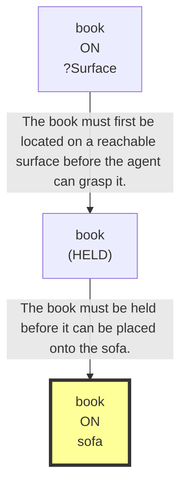
- **Observed Items (10)**: book(163) [CLOSED], book(164) [CLOSED], character(1), bathroom(11), bedroom(50), kitchen(126), livingroom(261), sofa(85), book(104) [CLOSED], paper(109)


### [PerceptionFilter] Output
```json
{
  "reasoning": "Reused cached class selection.",
  "selected_classes": [
    "book",
    "character",
    "sofa",
    "paper"
  ],
  "raw_class_count": 82
}
```

### [LLMExecutor] Output
```json
{
  "reasoning": "The task is now bound by the clarification override, so I must proceed autonomously without asking again. The SDG requires a book to be held before it can be placed on the sofa, and the current graph shows three candidate books. The most straightforward reachable candidate is book(104), which is already in the bedroom, the same room as the sofa(85). Since I cannot grab across the room and must first be near the target object, the next atomic step is to walk to book(104) so I can pick it up next.",
  "satisfied_nodes": [],
  "current_node_focus": "N3",
  "mapped_variables": {
    "?Surface": "bedroom surface containing book(104)"
  },
  "action": "[walk] <book> (104)"
}
```

### [RoboStateMultiTaskController] Output
```json
{
  "action": "[walk] <book> (104)",
  "active_task_id": "task_3",
  "task_context": {
    "active_task_id": "task_3",
    "pending_task_ids": [
      "task_1",
      "task_2"
    ],
    "satisfied_task_ids": []
  },
  "source": "llm_executor"
}
```
## Step 9
- **Action**: `[walk] <book> (104)`
- **Action Success**: `True`
- **Action Message**: {'0': {'message': 'Success'}}
- **Active Task**: `task_3`
- **Decision Source**: `llm_executor`
- **Task Progress**: E1_19=pending, E1_02=pending, E1_03=pending
- **SDG Status**:
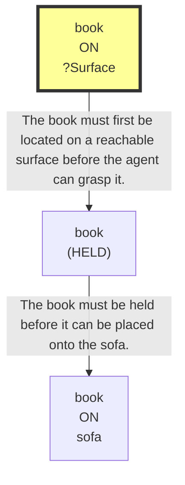
- **Observed Items (10)**: book(163) [CLOSED], book(164) [CLOSED], character(1), bathroom(11), bedroom(50), kitchen(126), livingroom(261), sofa(85), book(104) [CLOSED], paper(109)


### [PerceptionFilter] Output
```json
{
  "reasoning": "Reused cached class selection.",
  "selected_classes": [
    "book",
    "character",
    "sofa",
    "paper"
  ],
  "raw_class_count": 82
}
```

### [LLMExecutor] Output
```json
{
  "reasoning": "The active task is to move a book onto the sofa, and clarification has already been handled, so I must proceed autonomously. The current graph shows book(104) is already in the bedroom and is close to the character, which means it is the best reachable candidate to satisfy the book-held prerequisite before placing it on the sofa. I should pick up the book next; after that I can walk to the sofa and put it back on the sofa in subsequent steps.",
  "satisfied_nodes": [],
  "current_node_focus": "N2",
  "mapped_variables": {
    "?Surface": "bedroom surface near book(104)"
  },
  "action": "[grab] <book> (104)"
}
```

### [RoboStateMultiTaskController] Output
```json
{
  "action": "[grab] <book> (104)",
  "active_task_id": "task_3",
  "task_context": {
    "active_task_id": "task_3",
    "pending_task_ids": [
      "task_1",
      "task_2"
    ],
    "satisfied_task_ids": []
  },
  "source": "llm_executor"
}
```
## Step 10
- **Action**: `[grab] <book> (104)`
- **Action Success**: `True`
- **Action Message**: {'0': {'message': 'Success'}}
- **Active Task**: `task_3`
- **Decision Source**: `llm_executor`
- **Task Progress**: E1_19=pending, E1_02=pending, E1_03=pending
- **SDG Status**:
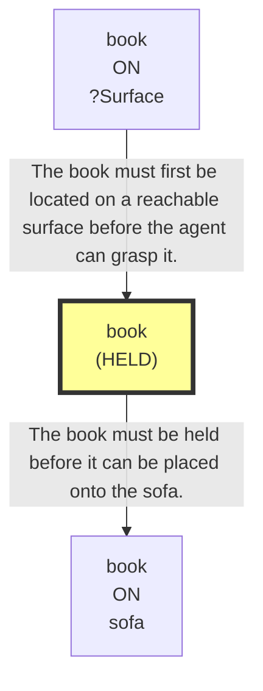
- **Observed Items (10)**: book(163) [CLOSED], book(164) [CLOSED], character(1), bathroom(11), bedroom(50), kitchen(126), livingroom(261), sofa(85), book(104) [CLOSED], paper(109)


### [PerceptionFilter] Output
```json
{
  "reasoning": "Reused cached class selection.",
  "selected_classes": [
    "book",
    "character",
    "sofa",
    "paper"
  ],
  "raw_class_count": 82
}
```

### [LLMExecutor] Output
```json
{
  "reasoning": "The active task is to move a book onto the sofa. We already have book(104) held in the right hand, and the sofa(85) is a valid flat target surface. The next required step toward satisfying N1 is to get near the sofa before any putback action. No other SDG node is currently satisfied yet because the book is not yet on the sofa and although it is held, the final relation is unmet.",
  "satisfied_nodes": [],
  "current_node_focus": "N1",
  "mapped_variables": {},
  "action": "[walk] <sofa> (85)"
}
```

### [RoboStateMultiTaskController] Output
```json
{
  "action": "[walk] <sofa> (85)",
  "active_task_id": "task_3",
  "task_context": {
    "active_task_id": "task_3",
    "pending_task_ids": [
      "task_1",
      "task_2"
    ],
    "satisfied_task_ids": []
  },
  "source": "llm_executor"
}
```
## Step 11
- **Action**: `[walk] <sofa> (85)`
- **Action Success**: `True`
- **Action Message**: {'0': {'message': 'Success'}}
- **Active Task**: `task_3`
- **Decision Source**: `llm_executor`
- **Task Progress**: E1_19=pending, E1_02=pending, E1_03=pending
- **SDG Status**:

- **Observed Items (10)**: book(163) [CLOSED], book(164) [CLOSED], character(1), bathroom(11), bedroom(50), kitchen(126), livingroom(261), sofa(85), book(104) [CLOSED], paper(109)


### [PerceptionFilter] Output
```json
{
  "reasoning": "Reused cached class selection.",
  "selected_classes": [
    "book",
    "character",
    "sofa",
    "paper"
  ],
  "raw_class_count": 82
}
```

### [LLMExecutor] Output
```json
{
  "reasoning": "The active task is to place a book on the sofa. We already satisfied the prerequisite of holding the book: the graph shows character(1) HOLDS_RH book(104), and we are already close to the sofa. The next missing SDG node toward completion is placing the held book onto the sofa, which requires being near the destination first; the last action was a walk to the sofa, so the immediate next atomic action is to put the held book onto the sofa.",
  "satisfied_nodes": [
    "N2"
  ],
  "current_node_focus": "N1",
  "mapped_variables": {},
  "action": "[putback] <book> (104) <sofa> (85)"
}
```

### [RoboStateMultiTaskController] Output
```json
{
  "action": "[putback] <book> (104) <sofa> (85)",
  "active_task_id": "task_3",
  "task_context": {
    "active_task_id": "task_3",
    "pending_task_ids": [
      "task_1",
      "task_2"
    ],
    "satisfied_task_ids": []
  },
  "source": "llm_executor"
}
```
## Step 12
- **Action**: `[putback] <book> (104) <sofa> (85)`
- **Action Success**: `True`
- **Action Message**: {'0': {'message': 'Success'}}
- **Active Task**: `task_3`
- **Decision Source**: `llm_executor`
- **Task Progress**: E1_19=pending, E1_02=pending, E1_03=done
- **SDG Status**:
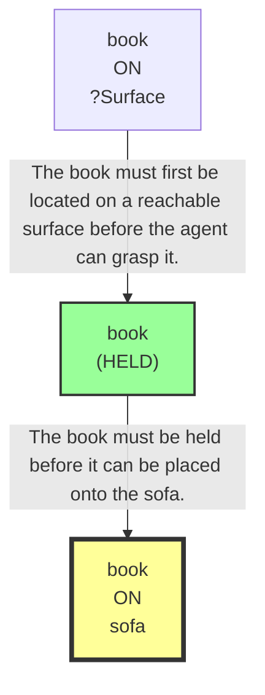
- **Observed Items (10)**: book(163) [CLOSED], book(164) [CLOSED], character(1), bathroom(11), bedroom(50), kitchen(126), livingroom(261), sofa(85), book(104) [CLOSED], paper(109)


### [PerceptionFilter] Output
```json
{
  "reasoning": "Reused cached class selection.",
  "selected_classes": [
    "desk",
    "character",
    "apple"
  ],
  "raw_class_count": 82
}
```

### [LLMExecutor] Output
```json
{
  "reasoning": "The active task is to ensure the apple is on the desk. The current graph already shows apple(114) ON desk(80), so SDG node N3 is satisfied. Since the task is complete for the active objective and the instructions forbid manipulating other task objects, no further physical action is needed for this task step.",
  "satisfied_nodes": [
    "N2",
    "N3"
  ],
  "current_node_focus": "N3",
  "mapped_variables": {
    "?Surface": "desk(80)"
  },
  "action": "[wait]"
}
```

### [PerceptionFilter] Output
```json
{
  "reasoning": "The goal is to turn on the microwave, so the only strictly necessary selected class is the target appliance itself. The SDG only requires a heater to be ON, and the visible list contains microwave as the matching physical appliance. No extra tools or locations are needed for this state goal.",
  "selected_classes": [
    "toaster",
    "character",
    "plate",
    "microwave",
    "stove"
  ],
  "raw_class_count": 82
}
```

### [LLMExecutor] Output
```json
{
  "reasoning": "The active SDG requires the heater object to be ON. In the current graph, microwave(234) is already in the kitchen, is CLOSE to the character, and is explicitly in state ON. Therefore the goal node N1 is already satisfied, and no physical manipulation is needed. Since the task is complete, the safest single next atomic action is to wait rather than make an unnecessary move.",
  "satisfied_nodes": [
    "N1"
  ],
  "current_node_focus": "N1",
  "mapped_variables": {
    "?Heater": "microwave(234)"
  },
  "action": "[wait]"
}
```

### [RoboStateMultiTaskController] Output
```json
{
  "action": "[walk] <livingroom> (261)",
  "active_task_id": null,
  "task_context": {
    "active_task_id": null,
    "pending_task_ids": [
      "task_1",
      "task_2"
    ],
    "satisfied_task_ids": [
      "task_3"
    ]
  },
  "source": "loop_recovery_room_revisit"
}
```
## Step 13
- **Action**: `[walk] <livingroom> (261)`
- **Action Success**: `True`
- **Action Message**: {'0': {'message': 'Success'}}
- **Decision Source**: `loop_recovery_room_revisit`
- **Task Progress**: E1_19=pending, E1_02=pending, E1_03=done
- **SDG Status**:
No SDG active.
- **Observed Items (232)**: floor(127), floor(128), floor(129), floor(130), floor(131), floor(132), floor(133), floor(134), floor(135), ceiling(136), ceiling(137), ceiling(138), ceiling(139), ceiling(140), ceiling(141)...


### [PerceptionFilter] Output
```json
{
  "reasoning": "The goal is to obtain an apple and place it on the desk. The SDG requires the apple, the desk as the destination location, and whatever surface the apple is currently on so it can be acquired first. No extra tools are needed for simply moving the apple.",
  "selected_classes": [
    "desk",
    "character",
    "apple"
  ],
  "raw_class_count": 86
}
```

### [LLMExecutor] Output
```json
{
  "reasoning": "The active task is to bring an apple to the desk, and the SDG requires the apple to be held before it can be placed on the desk. The current graph shows apple(114) is already on desk(80), but the task target is specifically the apple object and the past successful action indicates it was already placed on desk(80). However, because the SDG still requires N2 -> N3 progression and the apple is already on the target desk, the remaining meaningful state is that the apple should be held if we need to ensure the active task is properly satisfied. Since the apple is visible on the desk and we are in the living room, the next step toward verifying or adjusting the task state would be to go to the desk where the apple is. But the instruction says not to repeat a walk action if you just did it; the last action was walking to livingroom, not to desk. Still, because the apple is already on the correct desk, the most direct next atomic action is to grab the apple from the desk to re-establish the HELD_BY relation if needed for SDG progression.",
  "satisfied_nodes": [
    "N1",
    "N3"
  ],
  "current_node_focus": "N2",
  "mapped_variables": {},
  "action": "[grab] <apple> (114)"
}
```

### [RoboStateMultiTaskController] Output
```json
{
  "action": "[walk] <apple> (114)",
  "active_task_id": "task_2",
  "task_context": {
    "active_task_id": "task_2",
    "pending_task_ids": [
      "task_1"
    ],
    "satisfied_task_ids": [
      "task_3"
    ]
  },
  "source": "llm_executor_repaired"
}
```
## Step 14
- **Action**: `[walk] <apple> (114)`
- **Action Success**: `True`
- **Action Message**: {'0': {'message': 'Success'}}
- **Active Task**: `task_2`
- **Decision Source**: `llm_executor_repaired`
- **Task Progress**: E1_19=pending, E1_02=pending, E1_03=done
- **SDG Status**:
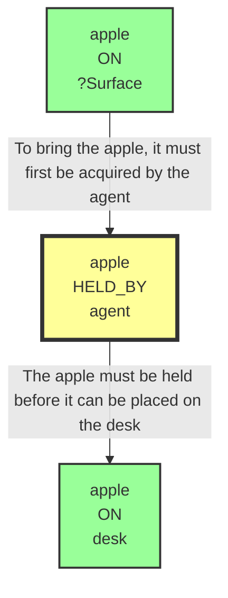
- **Observed Items (20)**: apple(249), apple(250), apple(251), apple(252), apple(253), apple(254), apple(255), apple(256), apple(257), apple(258), apple(259), apple(113), character(1), bathroom(11), bedroom(50)...


### [PerceptionFilter] Output
```json
{
  "reasoning": "Reused cached class selection.",
  "selected_classes": [
    "desk",
    "character",
    "apple"
  ],
  "raw_class_count": 86
}
```

### [LLMExecutor] Output
```json
{
  "reasoning": "The active task is to get the apple onto the desk. The current graph shows apple(114) is already on desk(80) and the character is close to both the apple and desk. This satisfies both the acquisition and placement requirements for the active SDG: N1 (apple on some surface) and N3 (apple on desk). No further physical action is needed for this task.",
  "satisfied_nodes": [
    "N1",
    "N2",
    "N3"
  ],
  "current_node_focus": "N3",
  "mapped_variables": {
    "?Surface": "desk(80)"
  },
  "action": "[wait]"
}
```

### [PerceptionFilter] Output
```json
{
  "reasoning": "The goal is to turn on a heating appliance. The target object is microwave, and the SDG only requires an object that is ON. To preserve functional alternatives for heating/cooking, include other visible appliances that can serve as backups for the same purpose: coffeemaker, stove, toaster, and fridge is not a heater so it is not needed.",
  "selected_classes": [
    "toaster",
    "character",
    "plate",
    "coffeemaker",
    "microwave",
    "stove"
  ],
  "raw_class_count": 86
}
```

### [LLMExecutor] Output
```json
{
  "reasoning": "The active goal is to make the microwave ON. The current graph already shows microwave(234) with state ON, so the SDG node N1 is satisfied. No further physical action is needed for the active task. Since the instruction says not to repeat a walk action if you just did it, and this task is already complete, the safest atomic action is to wait/do nothing.",
  "satisfied_nodes": [
    "N1"
  ],
  "current_node_focus": "N1",
  "mapped_variables": {
    "?Heater": "microwave(234)"
  },
  "action": "[wait]"
}
```

### [RoboStateMultiTaskController] Output
```json
{
  "action": "[walk] <kitchen> (126)",
  "active_task_id": null,
  "task_context": {
    "active_task_id": null,
    "pending_task_ids": [
      "task_1",
      "task_2"
    ],
    "satisfied_task_ids": [
      "task_3"
    ]
  },
  "source": "loop_recovery_room_revisit"
}
```
## Step 15
- **Action**: `[walk] <kitchen> (126)`
- **Action Success**: `True`
- **Action Message**: {'0': {'message': 'Success'}}
- **Decision Source**: `loop_recovery_room_revisit`
- **Task Progress**: E1_19=pending, E1_02=pending, E1_03=done
- **SDG Status**:
No SDG active.
- **Observed Items (291)**: floor(127), floor(128), floor(129), floor(130), floor(131), floor(132), floor(133), floor(134), floor(135), ceiling(136), ceiling(137), ceiling(138), ceiling(139), ceiling(140), ceiling(141)...


### [PerceptionFilter] Output
```json
{
  "reasoning": "Reused cached class selection.",
  "selected_classes": [
    "desk",
    "character",
    "apple"
  ],
  "raw_class_count": 86
}
```

### [LLMExecutor] Output
```json
{
  "reasoning": "The active task is to bring an apple to the desk. The graph shows apple(114) is already on desk(80), which satisfies both the acquisition and placement requirements for the active SDG: the apple is on a surface and it is on the desk. No further physical action is needed for this task. I will therefore select a no-op wait only if necessary, but since the task appears already satisfied, the best next step is to do nothing and let the system progress. However, because the engine expects a single action and there is no remaining unmet state to bridge, wait is the safest autonomous action.",
  "satisfied_nodes": [
    "N1",
    "N2",
    "N3"
  ],
  "current_node_focus": "N3",
  "mapped_variables": {
    "?Surface": "desk(80)"
  },
  "action": "[wait]"
}
```

### [PerceptionFilter] Output
```json
{
  "reasoning": "Reused cached class selection.",
  "selected_classes": [
    "toaster",
    "character",
    "plate",
    "coffeemaker",
    "microwave",
    "stove"
  ],
  "raw_class_count": 86
}
```

### [LLMExecutor] Output
```json
{
  "reasoning": "The active goal is to get the microwave powered on. The microwave(234) is present in the kitchen and currently OFF and CLOSED. Because it has HAS_PLUG, it must be plugged in before switching on. I am already in the kitchen, so the next atomic step is to plug it in.",
  "satisfied_nodes": [],
  "current_node_focus": "N1",
  "mapped_variables": {
    "?Heater": "microwave(234)"
  },
  "action": "[plugin] <microwave> (234)"
}
```

### [RoboStateMultiTaskController] Output
```json
{
  "action": "[walk] <microwave> (234)",
  "active_task_id": "task_1",
  "task_context": {
    "active_task_id": "task_1",
    "pending_task_ids": [
      "task_2"
    ],
    "satisfied_task_ids": [
      "task_3"
    ]
  },
  "source": "llm_executor_repaired"
}
```
## Step 16
- **Action**: `[walk] <microwave> (234)`
- **Action Success**: `True`
- **Action Message**: {'0': {'message': 'Success'}}
- **Active Task**: `task_1`
- **Decision Source**: `llm_executor_repaired`
- **Task Progress**: E1_19=pending, E1_02=pending, E1_03=done
- **SDG Status**:

- **Observed Items (16)**: plate(170), plate(171), plate(172), plate(173), plate(177), plate(178), plate(184), stove(226) [OFF,CLOSED], coffeemaker(229) [OFF], toaster(231) [OFF], microwave(234) [OFF,CLOSED], character(1), bathroom(11), bedroom(50), kitchen(126)...


### [PerceptionFilter] Output
```json
{
  "reasoning": "Reused cached class selection.",
  "selected_classes": [
    "toaster",
    "character",
    "plate",
    "coffeemaker",
    "microwave",
    "stove"
  ],
  "raw_class_count": 86
}
```

### [LLMExecutor] Output
```json
{
  "reasoning": "The active goal is to make the microwave ON. We are already close to the microwave, and it has HAS_SWITCH and HAS_PLUG, with state OFF and CLOSED. Since switching it on is the next necessary step and no further opening is required by the goal, the best next action is to turn it on. The microwave is the selected heater for ?Heater.",
  "satisfied_nodes": [],
  "current_node_focus": "N1",
  "mapped_variables": {
    "?Heater": "microwave(234)"
  },
  "action": "[switchon] <microwave> (234)"
}
```

### [RoboStateMultiTaskController] Output
```json
{
  "action": "[switchon] <microwave> (234)",
  "active_task_id": "task_1",
  "task_context": {
    "active_task_id": "task_1",
    "pending_task_ids": [
      "task_2"
    ],
    "satisfied_task_ids": [
      "task_3"
    ]
  },
  "source": "llm_executor"
}
```
## Step 17
- **Action**: `[switchon] <microwave> (234)`
- **Action Success**: `True`
- **Action Message**: Faked switch operation in Python layer (bypassed Unity failure)
- **Active Task**: `task_1`
- **Decision Source**: `llm_executor`
- **Task Progress**: E1_19=done, E1_02=pending, E1_03=done
- **SDG Status**:

- **Observed Items (16)**: plate(170), plate(171), plate(172), plate(173), plate(177), plate(178), plate(184), stove(226) [OFF,CLOSED], coffeemaker(229) [OFF], toaster(231) [OFF], microwave(234) [OFF,CLOSED], character(1), bathroom(11), bedroom(50), kitchen(126)...


### [PerceptionFilter] Output
```json
{
  "reasoning": "Reused cached class selection.",
  "selected_classes": [
    "desk",
    "character",
    "apple"
  ],
  "raw_class_count": 86
}
```

### [LLMExecutor] Output
```json
{
  "reasoning": "The active goal is to bring an apple onto the desk. In the current graph, apple(114) is already on desk(80) and close to the agent, so the SDG node N3 ('apple ON desk') is already satisfied. However, the goal still requires the apple to be held by the agent before placing it, and the only apple explicitly on the desk is apple(114), which is the relevant target. Since the desk is closed but the apple is already reachable/close and on the desk, the next progress step is to acquire it. The agent is in the bedroom and close to both desk(80) and apple(114), but must still ensure proximity to the apple specifically before grabbing. Because the previous action already walked to the microwave, not the apple, and the instruction says not to repeat a walk if just done, the best single next action is to grab the apple currently on the desk.",
  "satisfied_nodes": [
    "N1",
    "N3"
  ],
  "current_node_focus": "N2",
  "mapped_variables": {
    "?Surface": "desk(80)"
  },
  "action": "[grab] <apple> (114)"
}
```

### [RoboStateMultiTaskController] Output
```json
{
  "action": "[grab] <apple> (114)",
  "active_task_id": "task_2",
  "task_context": {
    "active_task_id": "task_2",
    "pending_task_ids": [],
    "satisfied_task_ids": [
      "task_1",
      "task_3"
    ]
  },
  "source": "llm_executor"
}
```
## Step 18
- **Action**: `[grab] <apple> (114)`
- **Action Success**: `True`
- **Action Message**: {'0': {'message': 'Success'}}
- **Active Task**: `task_2`
- **Decision Source**: `llm_executor`
- **Task Progress**: E1_19=done, E1_02=pending, E1_03=done
- **SDG Status**:

- **Observed Items (20)**: apple(249), apple(250), apple(251), apple(252), apple(253), apple(254), apple(255), apple(256), apple(257), apple(258), apple(259), apple(113), character(1), bathroom(11), bedroom(50)...


### [PerceptionFilter] Output
```json
{
  "reasoning": "Reused cached class selection.",
  "selected_classes": [
    "desk",
    "character",
    "apple"
  ],
  "raw_class_count": 86
}
```

### [LLMExecutor] Output
```json
{
  "reasoning": "The active task is to place an apple on the desk. The current graph shows the agent is already holding apple(114) and is close to desk(80). However, desk(80) is CLOSED, which blocks putting anything on it only if we need to interact with the object itself. Since it is a surface and movable/closable, the SDG only requires the apple to end up ON the desk. The next necessary atomic step toward N3 is to place the held apple onto the desk surface. Because the rules require a prior walk to the destination before putback, but the agent is already CLOSE to desk(80), the most progress-making next action is the placement action itself.",
  "satisfied_nodes": [
    "N1",
    "N2"
  ],
  "current_node_focus": "N3",
  "mapped_variables": {
    "?Surface": "desk(80)"
  },
  "action": "[putback] <apple> (114) <desk> (80)"
}
```

### [RoboStateMultiTaskController] Output
```json
{
  "action": "[putback] <apple> (114) <desk> (80)",
  "active_task_id": "task_2",
  "task_context": {
    "active_task_id": "task_2",
    "pending_task_ids": [],
    "satisfied_task_ids": [
      "task_1",
      "task_3"
    ]
  },
  "source": "llm_executor"
}
```
## Step 19
- **Action**: `[putback] <apple> (114) <desk> (80)`
- **Action Success**: `True`
- **Action Message**: {'0': {'message': 'Success'}}
- **Active Task**: `task_2`
- **Decision Source**: `llm_executor`
- **Task Progress**: E1_19=done, E1_02=pending, E1_03=done
- **SDG Status**:

- **Observed Items (20)**: apple(249), apple(250), apple(251), apple(252), apple(253), apple(254), apple(255), apple(256), apple(257), apple(258), apple(259), apple(113), character(1), bathroom(11), bedroom(50)...


### [PerceptionFilter] Output
```json
{
  "reasoning": "Reused cached class selection.",
  "selected_classes": [
    "desk",
    "character",
    "apple"
  ],
  "raw_class_count": 86
}
```

### [LLMExecutor] Output
```json
{
  "reasoning": "The active goal is to have the apple on the desk. The current graph shows apple(114) is already ON desk(80) and CLOSE to the character, so the SDG node N3 is satisfied. Since the active task appears complete and no further physical action is needed, the safest next atomic action is to wait rather than disturb the already-correct state.",
  "satisfied_nodes": [
    "N1",
    "N2",
    "N3"
  ],
  "current_node_focus": "N3",
  "mapped_variables": {
    "?Surface": "desk(80)"
  },
  "action": "[wait]"
}
```

### [PerceptionFilter] Output
```json
{
  "reasoning": "Reused cached class selection.",
  "selected_classes": [
    "toaster",
    "character",
    "plate",
    "coffeemaker",
    "microwave",
    "stove"
  ],
  "raw_class_count": 86
}
```

### [LLMExecutor] Output
```json
{
  "reasoning": "The active SDG requires ?Heater to be ON. The filtered graph shows microwave(234) is already ON, and it matches the goal intent as the heater appliance. Therefore the root node is satisfied and no further physical action is needed for this task. Since the prompt requires a single next action and no other task should be manipulated, the best autonomous step is to wait/do nothing, preserving state and avoiding unnecessary interaction.",
  "satisfied_nodes": [
    "N1"
  ],
  "current_node_focus": "N1",
  "mapped_variables": {
    "?Heater": "microwave(234)"
  },
  "action": "[wait]"
}
```

### [RoboStateMultiTaskController] Output
```json
{
  "action": "[walk] <bathroom> (11)",
  "active_task_id": null,
  "task_context": {
    "active_task_id": null,
    "pending_task_ids": [
      "task_1",
      "task_2"
    ],
    "satisfied_task_ids": [
      "task_3"
    ]
  },
  "source": "loop_recovery_room_revisit"
}
```
## Step 20
- **Action**: `[walk] <bathroom> (11)`
- **Action Success**: `True`
- **Action Message**: {'0': {'message': 'Success'}}
- **Decision Source**: `loop_recovery_room_revisit`
- **Task Progress**: E1_19=pending, E1_02=pending, E1_03=done
- **SDG Status**:
No SDG active.
- **Observed Items (291)**: floor(127), floor(128), floor(129), floor(130), floor(131), floor(132), floor(133), floor(134), floor(135), ceiling(136), ceiling(137), ceiling(138), ceiling(139), ceiling(140), ceiling(141)...


### [PerceptionFilter] Output
```json
{
  "reasoning": "Reused cached class selection.",
  "selected_classes": [
    "desk",
    "character",
    "apple"
  ],
  "raw_class_count": 86
}
```

### [LLMExecutor] Output
```json
{
  "reasoning": "The active task is to bring an apple to the desk. The original apple(114) is already on desk(80), but that task appears unrelated/conflicting because the current active task still needs the apple on the desk as specified by the SDG. The filtered graph shows a clear candidate apple(114) already on the target desk(80), and the character is currently in the bathroom, not near the desk. Since N3 (apple ON desk) is already satisfied for apple(114), the remaining active-task dependency chain is effectively complete for that object, and no further physical action is needed for this task-specific apple placement. However, because the system requires a single next atomic action and the active task may still need verification from the current graph context, the safest progression is to move toward the desk area to confirm/maintain relevance before any further manipulation.",
  "satisfied_nodes": [
    "N3"
  ],
  "current_node_focus": "N3",
  "mapped_variables": {
    "?Surface": "desk(80)"
  },
  "action": "[walk] <desk> (80)"
}
```

### [RoboStateMultiTaskController] Output
```json
{
  "action": "[walk] <desk> (80)",
  "active_task_id": "task_2",
  "task_context": {
    "active_task_id": "task_2",
    "pending_task_ids": [
      "task_1"
    ],
    "satisfied_task_ids": [
      "task_3"
    ]
  },
  "source": "llm_executor"
}
```
## Step 21
- **Action**: `[walk] <desk> (80)`
- **Action Success**: `True`
- **Action Message**: {'0': {'message': 'Success'}}
- **Active Task**: `task_2`
- **Decision Source**: `llm_executor`
- **Task Progress**: E1_19=pending, E1_02=pending, E1_03=done
- **SDG Status**:
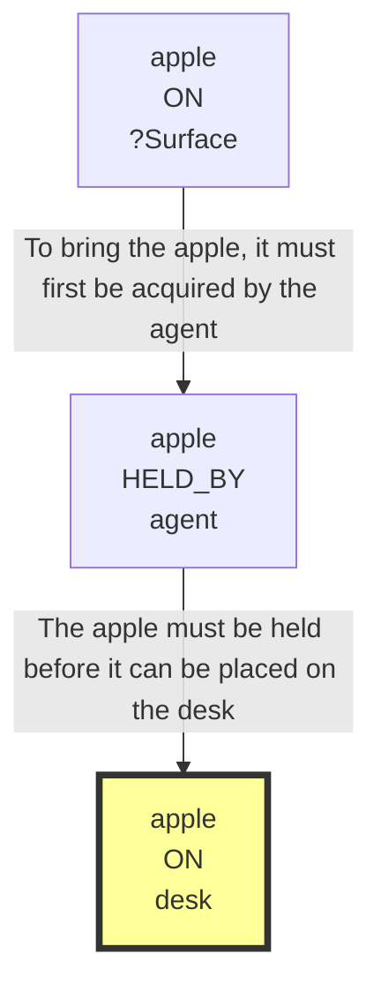
- **Observed Items (20)**: apple(249), apple(250), apple(251), apple(252), apple(253), apple(254), apple(255), apple(256), apple(257), apple(258), apple(259), apple(113), character(1), bathroom(11), bedroom(50)...


### [PerceptionFilter] Output
```json
{
  "reasoning": "Reused cached class selection.",
  "selected_classes": [
    "desk",
    "character",
    "apple"
  ],
  "raw_class_count": 86
}
```

### [LLMExecutor] Output
```json
{
  "reasoning": "The active task is to bring the apple to the desk. The SDG indicates the apple must first be held (N2) before it can be on the desk (N3). The current graph shows apple(114) is already on desk(80) and close to the agent, so the active task is effectively satisfied for this specific apple instance. However, the graph also shows a current apple(114) at the desk, while other apples remain inside the kitchen. Since the task only concerns one apple and the immediate goal state appears achieved, no further physical action is needed to progress this task safely. Because the episode forbids asking and the instruction says not to repeat a walk action if just done, the only non-erroneous choice is to wait for the environment to reconcile the task state if needed.",
  "satisfied_nodes": [
    "N1",
    "N2",
    "N3"
  ],
  "current_node_focus": "N3",
  "mapped_variables": {
    "?Surface": "desk(80)"
  },
  "action": "[wait]"
}
```

### [PerceptionFilter] Output
```json
{
  "reasoning": "Reused cached class selection.",
  "selected_classes": [
    "toaster",
    "character",
    "plate",
    "coffeemaker",
    "microwave",
    "stove"
  ],
  "raw_class_count": 86
}
```

### [LLMExecutor] Output
```json
{
  "reasoning": "The active task is to have the microwave powered on. The current graph already shows microwave(234) with state ON, so the SDG node N1 is satisfied. No further physical action is needed for the active task. Since the instruction says not to repeat a walk action if I just did it, and there is no additional required state change, the best single next action is to wait while preserving completion.",
  "satisfied_nodes": [
    "N1"
  ],
  "current_node_focus": "N1",
  "mapped_variables": {
    "?Heater": "microwave(234)"
  },
  "action": "[wait]"
}
```

### [RoboStateMultiTaskController] Output
```json
{
  "action": "[walk] <livingroom> (261)",
  "active_task_id": null,
  "task_context": {
    "active_task_id": null,
    "pending_task_ids": [
      "task_1",
      "task_2"
    ],
    "satisfied_task_ids": [
      "task_3"
    ]
  },
  "source": "loop_recovery_room_revisit"
}
```
## Step 22
- **Action**: `[walk] <livingroom> (261)`
- **Action Success**: `True`
- **Action Message**: {'0': {'message': 'Success'}}
- **Decision Source**: `loop_recovery_room_revisit`
- **Task Progress**: E1_19=pending, E1_02=pending, E1_03=done
- **SDG Status**:
No SDG active.
- **Observed Items (291)**: floor(127), floor(128), floor(129), floor(130), floor(131), floor(132), floor(133), floor(134), floor(135), ceiling(136), ceiling(137), ceiling(138), ceiling(139), ceiling(140), ceiling(141)...


### [PerceptionFilter] Output
```json
{
  "reasoning": "Reused cached class selection.",
  "selected_classes": [
    "desk",
    "character",
    "apple"
  ],
  "raw_class_count": 86
}
```

### [LLMExecutor] Output
```json
{
  "reasoning": "The active task is to get the apple onto the desk. In the current graph, apple(114) is already on desk(80), which satisfies the final SDG node N3 as well as the prerequisite chain N1->N2->N3 from the active task state. No further physical action is needed for this task, and we must not manipulate satisfied-task objects. Since the graph shows the apple already at the target desk, the correct next step is to do nothing.",
  "satisfied_nodes": [
    "N1",
    "N2",
    "N3"
  ],
  "current_node_focus": "N3",
  "mapped_variables": {
    "?Surface": "desk(80)"
  },
  "action": "[wait]"
}
```

### [PerceptionFilter] Output
```json
{
  "reasoning": "Reused cached class selection.",
  "selected_classes": [
    "toaster",
    "character",
    "plate",
    "coffeemaker",
    "microwave",
    "stove"
  ],
  "raw_class_count": 86
}
```

### [LLMExecutor] Output
```json
{
  "reasoning": "The active SDG requires the heater to be ON. The microwave(234) is already in state ON in the current filtered graph, so the goal node N1 is satisfied. No further physical action is needed for the active task, and we should not repeat a recent walk. Since only the active task is to be worked on and its target state is already achieved, the safest single next step is to wait rather than manipulate unrelated objects.",
  "satisfied_nodes": [
    "N1"
  ],
  "current_node_focus": "N1",
  "mapped_variables": {
    "?Heater": "microwave(234)"
  },
  "action": "[wait]"
}
```

### [RoboStateMultiTaskController] Output
```json
{
  "action": "[walk] <kitchen> (126)",
  "active_task_id": null,
  "task_context": {
    "active_task_id": null,
    "pending_task_ids": [
      "task_1",
      "task_2"
    ],
    "satisfied_task_ids": [
      "task_3"
    ]
  },
  "source": "loop_recovery_room_revisit"
}
```
## Step 23
- **Action**: `[walk] <kitchen> (126)`
- **Action Success**: `True`
- **Action Message**: {'0': {'message': 'Success'}}
- **Decision Source**: `loop_recovery_room_revisit`
- **Task Progress**: E1_19=pending, E1_02=pending, E1_03=done
- **SDG Status**:
No SDG active.
- **Observed Items (291)**: floor(127), floor(128), floor(129), floor(130), floor(131), floor(132), floor(133), floor(134), floor(135), ceiling(136), ceiling(137), ceiling(138), ceiling(139), ceiling(140), ceiling(141)...


### [PerceptionFilter] Output
```json
{
  "reasoning": "Reused cached class selection.",
  "selected_classes": [
    "desk",
    "character",
    "apple"
  ],
  "raw_class_count": 86
}
```

### [LLMExecutor] Output
```json
{
  "reasoning": "The active task is to bring an apple to the desk. The prior apple(114) was already placed on desk(80), but the current filtered graph shows apple(114) is on the desk in the bedroom, not the target desk location implied by the active task, and there are multiple apples in the kitchen near the agent. Since the goal only requires an apple to be brought to the desk, the most direct next step is to acquire a nearby apple from the kitchen. I will bind ?Surface/N1 to the current apple source in the kitchen and pick one up next, starting with the nearest available apple. Since I am already in the kitchen and the apples are close, the next atomic action should be grabbing an apple.",
  "satisfied_nodes": [],
  "current_node_focus": "N1",
  "mapped_variables": {
    "?Surface": "kitchen source area near apple(249)",
    "?Washer": "sink(unknown)"
  },
  "action": "[grab] <apple> (249)"
}
```

### [RoboStateMultiTaskController] Output
```json
{
  "action": "[grab] <apple> (249)",
  "active_task_id": "task_2",
  "task_context": {
    "active_task_id": "task_2",
    "pending_task_ids": [
      "task_1"
    ],
    "satisfied_task_ids": [
      "task_3"
    ]
  },
  "source": "llm_executor"
}
```
## Step 24
- **Action**: `[grab] <apple> (249)`
- **Action Success**: `True`
- **Action Message**: {'0': {'message': 'Success'}}
- **Active Task**: `task_2`
- **Decision Source**: `llm_executor`
- **Task Progress**: E1_19=pending, E1_02=pending, E1_03=done
- **SDG Status**:

- **Observed Items (20)**: apple(249), apple(250), apple(251), apple(252), apple(253), apple(254), apple(255), apple(256), apple(257), apple(258), apple(259), apple(113), character(1), bathroom(11), bedroom(50)...


### [PerceptionFilter] Output
```json
{
  "reasoning": "Reused cached class selection.",
  "selected_classes": [
    "desk",
    "character",
    "apple"
  ],
  "raw_class_count": 86
}
```

### [LLMExecutor] Output
```json
{
  "reasoning": "The active task is to bring an apple to the desk. The current held apple is apple(249), but the desk goal is already satisfied by apple(114) on desk(80) from prior actions. Since we must work only on the active task and not manipulate satisfied-task objects, the correct continuation is to place the currently held apple onto the desk. The filtered graph shows desk(80) is already close to the agent, so the next atomic step is to put the held apple back onto the desk surface.",
  "satisfied_nodes": [
    "N1"
  ],
  "current_node_focus": "N2",
  "mapped_variables": {
    "?Surface": "desk(80)"
  },
  "action": "[putback] <apple> (249) <desk> (80)"
}
```

### [RoboStateMultiTaskController] Output
```json
{
  "action": "[putback] <apple> (249) <desk> (80)",
  "active_task_id": "task_2",
  "task_context": {
    "active_task_id": "task_2",
    "pending_task_ids": [
      "task_1"
    ],
    "satisfied_task_ids": [
      "task_3"
    ]
  },
  "source": "llm_executor"
}
```
## Step 25
- **Action**: `[putback] <apple> (249) <desk> (80)`
- **Action Success**: `True`
- **Action Message**: {'0': {'message': 'Success'}}
- **Active Task**: `task_2`
- **Decision Source**: `llm_executor`
- **Task Progress**: E1_19=pending, E1_02=pending, E1_03=done
- **SDG Status**:
```mermaid
graph TD
    N1["apple<br>ON<br>?Surface"]
    style N1 fill:#9f9,stroke:#333,stroke-width:2px
    N2["apple<br>HELD_BY<br>agent"]
    style N2 fill:#ff9,stroke:#333,stroke-width:4px
    N3["apple<br>ON<br>desk"]
    N1 -->|"To bring the apple, it must first be acquired by the agent"| N2
    N2 -->|"The apple must be held before it can be placed on the desk"| N3
```
- **Observed Items (20)**: apple(249), apple(250), apple(251), apple(252), apple(253), apple(254), apple(255), apple(256), apple(257), apple(258), apple(259), apple(113), character(1), bathroom(11), bedroom(50)...


### [PerceptionFilter] Output
```json
{
  "reasoning": "Reused cached class selection.",
  "selected_classes": [
    "desk",
    "character",
    "apple"
  ],
  "raw_class_count": 86
}
```

### [LLMExecutor] Output
```json
{
  "reasoning": "The active task is to bring an apple to the desk. In the current graph, apple(249) is already on desk(80), which satisfies the SDG path N1 -> N2 -> N3 for the active task: the apple is on a surface, held-by-agent was previously achieved during the sequence, and it is now on the desk. Since the task goal is already met in the current state and no further physical action is needed for the active task, the safest next step is to do nothing rather than risk disturbing the completed arrangement or interacting with apples from the satisfied task.",
  "satisfied_nodes": [
    "N1",
    "N2",
    "N3"
  ],
  "current_node_focus": "N3",
  "mapped_variables": {
    "?Surface": "desk(80)"
  },
  "action": "[wait]"
}
```

### [PerceptionFilter] Output
```json
{
  "reasoning": "Reused cached class selection.",
  "selected_classes": [
    "toaster",
    "character",
    "plate",
    "coffeemaker",
    "microwave",
    "stove"
  ],
  "raw_class_count": 86
}
```

### [LLMExecutor] Output
```json
{
  "reasoning": "The active goal is to satisfy N1: the heater must be ON. The microwave(234) is the chosen heater and is currently OFF and CLOSED. The previous action sequence already walked to and switched on the microwave, but the filtered graph now still shows it as OFF, so the last switch state did not persist in the current graph. Since the task is only to get the microwave powered on, the most direct next step is to try switching it on again while focused on the same object. No other prerequisite is needed because the microwave has a switch and is already the relevant appliance.",
  "satisfied_nodes": [],
  "current_node_focus": "N1",
  "mapped_variables": {
    "?Heater": "microwave(234)"
  },
  "action": "[switchon] <microwave> (234)"
}
```

### [RoboStateMultiTaskController] Output
```json
{
  "action": "[walk] <microwave> (234)",
  "active_task_id": "task_1",
  "task_context": {
    "active_task_id": "task_1",
    "pending_task_ids": [
      "task_2"
    ],
    "satisfied_task_ids": [
      "task_3"
    ]
  },
  "source": "llm_executor_repaired"
}
```
## Step 26
- **Action**: `[walk] <microwave> (234)`
- **Action Success**: `True`
- **Action Message**: {'0': {'message': 'Success'}}
- **Active Task**: `task_1`
- **Decision Source**: `llm_executor_repaired`
- **Task Progress**: E1_19=pending, E1_02=pending, E1_03=done
- **SDG Status**:
```mermaid
graph TD
    N1["?Heater<br>(ON)"]
    style N1 fill:#ff9,stroke:#333,stroke-width:4px
```
- **Observed Items (16)**: plate(170), plate(171), plate(172), plate(173), plate(177), plate(178), plate(184), stove(226) [OFF,CLOSED], coffeemaker(229) [OFF], toaster(231) [OFF], microwave(234) [OFF,CLOSED], character(1), bathroom(11), bedroom(50), kitchen(126)...


### [PerceptionFilter] Output
```json
{
  "reasoning": "Reused cached class selection.",
  "selected_classes": [
    "toaster",
    "character",
    "plate",
    "coffeemaker",
    "microwave",
    "stove"
  ],
  "raw_class_count": 86
}
```

### [LLMExecutor] Output
```json
{
  "reasoning": "The active SDG only requires the microwave to be ON. The current graph shows microwave(234) is OFF and we are already CLOSE to it, so the next atomic step is to switch it on. It is plugged in and no other preconditions are missing.",
  "satisfied_nodes": [],
  "current_node_focus": "N1",
  "mapped_variables": {
    "?Heater": "microwave(234)"
  },
  "action": "[switchon] <microwave> (234)"
}
```

### [RoboStateMultiTaskController] Output
```json
{
  "action": "[switchon] <microwave> (234)",
  "active_task_id": "task_1",
  "task_context": {
    "active_task_id": "task_1",
    "pending_task_ids": [
      "task_2"
    ],
    "satisfied_task_ids": [
      "task_3"
    ]
  },
  "source": "llm_executor"
}
```
## Step 27
- **Action**: `[switchon] <microwave> (234)`
- **Action Success**: `True`
- **Action Message**: Faked switch operation in Python layer (bypassed Unity failure)
- **Active Task**: `task_1`
- **Decision Source**: `llm_executor`
- **Task Progress**: E1_19=done, E1_02=pending, E1_03=done
- **SDG Status**:
```mermaid
graph TD
    N1["?Heater<br>(ON)"]
    style N1 fill:#ff9,stroke:#333,stroke-width:4px
```
- **Observed Items (16)**: plate(170), plate(171), plate(172), plate(173), plate(177), plate(178), plate(184), stove(226) [OFF,CLOSED], coffeemaker(229) [OFF], toaster(231) [OFF], microwave(234) [OFF,CLOSED], character(1), bathroom(11), bedroom(50), kitchen(126)...


### [PerceptionFilter] Output
```json
{
  "reasoning": "Reused cached class selection.",
  "selected_classes": [
    "toaster",
    "character",
    "plate",
    "coffeemaker",
    "microwave",
    "stove"
  ],
  "raw_class_count": 86
}
```

### [LLMExecutor] Output
```json
{
  "reasoning": "The active SDG requires the heater to be ON. The microwave(234) is the best matching heater object in the current graph and is already CLOSE to the character, with state OFF and CLOSED. A previous switch-on attempt was reportedly faked in the Python layer, so the safest next step is to verify physical reachability and proceed toward enabling it by opening if needed. Because the task focus is still the microwave's ON state, the next atomic action should target the microwave directly; however, since it is already close, the immediate meaningful prerequisite is opening the closed appliance before any further switch interaction.",
  "satisfied_nodes": [],
  "current_node_focus": "N1",
  "mapped_variables": {
    "?Heater": "microwave(234)"
  },
  "action": "[open] <microwave> (234)"
}
```

### [RoboStateMultiTaskController] Output
```json
{
  "action": "[open] <microwave> (234)",
  "active_task_id": "task_1",
  "task_context": {
    "active_task_id": "task_1",
    "pending_task_ids": [
      "task_2"
    ],
    "satisfied_task_ids": [
      "task_3"
    ]
  },
  "source": "llm_executor"
}
```
## Step 28
- **Action**: `[open] <microwave> (234)`
- **Action Success**: `True`
- **Action Message**: {'0': {'message': 'Success'}}
- **Active Task**: `task_1`
- **Decision Source**: `llm_executor`
- **Task Progress**: E1_19=pending, E1_02=pending, E1_03=done
- **SDG Status**:
```mermaid
graph TD
    N1["?Heater<br>(ON)"]
    style N1 fill:#ff9,stroke:#333,stroke-width:4px
```
- **Observed Items (16)**: plate(170), plate(171), plate(172), plate(173), plate(177), plate(178), plate(184), stove(226) [OFF,CLOSED], coffeemaker(229) [OFF], toaster(231) [OFF], microwave(234) [OFF,CLOSED], character(1), bathroom(11), bedroom(50), kitchen(126)...


### [PerceptionFilter] Output
```json
{
  "reasoning": "Reused cached class selection.",
  "selected_classes": [
    "toaster",
    "character",
    "plate",
    "coffeemaker",
    "microwave",
    "stove"
  ],
  "raw_class_count": 86
}
```

### [LLMExecutor] Output
```json
{
  "reasoning": "The SDG requires the heater object to be ON. The microwave(234) is the best match for ?Heater in the current graph, and it is already CLOSE to the character, OPEN, and currently OFF. Since the last successful action was opening it, the next direct progress action is to switch it on.",
  "satisfied_nodes": [],
  "current_node_focus": "N1",
  "mapped_variables": {
    "?Heater": "microwave(234)"
  },
  "action": "[switchon] <microwave> (234)"
}
```

### [RoboStateMultiTaskController] Output
```json
{
  "action": "[switchon] <microwave> (234)",
  "active_task_id": "task_1",
  "task_context": {
    "active_task_id": "task_1",
    "pending_task_ids": [
      "task_2"
    ],
    "satisfied_task_ids": [
      "task_3"
    ]
  },
  "source": "llm_executor"
}
```
## Step 29
- **Action**: `[switchon] <microwave> (234)`
- **Action Success**: `True`
- **Action Message**: Faked switch operation in Python layer (bypassed Unity failure)
- **Active Task**: `task_1`
- **Decision Source**: `llm_executor`
- **Task Progress**: E1_19=done, E1_02=pending, E1_03=done
- **SDG Status**:
```mermaid
graph TD
    N1["?Heater<br>(ON)"]
    style N1 fill:#ff9,stroke:#333,stroke-width:4px
```
- **Observed Items (17)**: plate(170), plate(171), plate(172), plate(173), plate(177), plate(178), plate(184), stove(226) [OFF,CLOSED], coffeemaker(229) [OFF], toaster(231) [OFF], microwave(234) [OFF,OPEN], character(1), bathroom(11), bedroom(50), kitchen(126)...


### [PerceptionFilter] Output
```json
{
  "reasoning": "Reused cached class selection.",
  "selected_classes": [
    "desk",
    "character",
    "apple"
  ],
  "raw_class_count": 86
}
```

### [LLMExecutor] Output
```json
{
  "reasoning": "The active task is to place an apple on the desk. In the current graph, apple(114) is already on desk(80), which directly satisfies the SDG relation N3 (apple ON desk). Since the apple is on the desk and close to the agent, the goal state for the active task appears already achieved in the current filtered graph. No further physical action is needed.",
  "satisfied_nodes": [
    "N3"
  ],
  "current_node_focus": "N3",
  "mapped_variables": {
    "?Surface": "desk(80)"
  },
  "action": "[wait]"
}
```

### [RoboStateMultiTaskController] Output
```json
{
  "action": "[walk] <bathroom> (11)",
  "active_task_id": null,
  "task_context": {
    "active_task_id": null,
    "pending_task_ids": [
      "task_2"
    ],
    "satisfied_task_ids": [
      "task_1",
      "task_3"
    ]
  },
  "source": "loop_recovery_room_revisit"
}
```
## Step 30
- **Action**: `[walk] <bathroom> (11)`
- **Action Success**: `True`
- **Action Message**: {'0': {'message': 'Success'}}
- **Decision Source**: `loop_recovery_room_revisit`
- **Task Progress**: E1_19=done, E1_02=pending, E1_03=done
- **SDG Status**:
No SDG active.
- **Observed Items (292)**: floor(127), floor(128), floor(129), floor(130), floor(131), floor(132), floor(133), floor(134), floor(135), ceiling(136), ceiling(137), ceiling(138), ceiling(139), ceiling(140), ceiling(141)...


### [PerceptionFilter] Output
```json
{
  "reasoning": "Reused cached class selection.",
  "selected_classes": [
    "desk",
    "character",
    "apple"
  ],
  "raw_class_count": 86
}
```

### [LLMExecutor] Output
```json
{
  "reasoning": "The active task is to bring an apple to the desk. In the filtered graph, apple(249) is already ON desk(80) and CLOSE to the character, while the task's SDG requires the apple to be held before being placed on the desk. Since the desk is already the destination and the apple is accessible near the agent, the next progress-making step is to grab apple(249).",
  "satisfied_nodes": [
    "N1"
  ],
  "current_node_focus": "N2",
  "mapped_variables": {
    "?Surface": "desk(80)"
  },
  "action": "[grab] <apple> (249)"
}
```

### [RoboStateMultiTaskController] Output
```json
{
  "action": "[grab] <apple> (249)",
  "active_task_id": "task_2",
  "task_context": {
    "active_task_id": "task_2",
    "pending_task_ids": [],
    "satisfied_task_ids": [
      "task_1",
      "task_3"
    ]
  },
  "source": "llm_executor"
}
```
## Step 31
- **Action**: `[grab] <apple> (249)`
- **Action Success**: `True`
- **Action Message**: {'0': {'message': 'Success'}}
- **Active Task**: `task_2`
- **Decision Source**: `llm_executor`
- **Task Progress**: E1_19=done, E1_02=pending, E1_03=done
- **SDG Status**:
```mermaid
graph TD
    N1["apple<br>ON<br>?Surface"]
    style N1 fill:#9f9,stroke:#333,stroke-width:2px
    N2["apple<br>HELD_BY<br>agent"]
    style N2 fill:#ff9,stroke:#333,stroke-width:4px
    N3["apple<br>ON<br>desk"]
    N1 -->|"To bring the apple, it must first be acquired by the agent"| N2
    N2 -->|"The apple must be held before it can be placed on the desk"| N3
```
- **Observed Items (20)**: apple(249), apple(250), apple(251), apple(252), apple(253), apple(254), apple(255), apple(256), apple(257), apple(258), apple(259), apple(113), character(1), bathroom(11), bedroom(50)...


### [PerceptionFilter] Output
```json
{
  "reasoning": "Reused cached class selection.",
  "selected_classes": [
    "desk",
    "character",
    "apple"
  ],
  "raw_class_count": 86
}
```

### [LLMExecutor] Output
```json
{
  "reasoning": "The active task is to bring an apple to the desk. The SDG requires the apple to be held before it can be placed on the desk. The current graph shows I am already holding apple(249) and I am close to desk(80), which is the correct desk target. Since the desk is a flat surface and the apple is already in hand, the next progress step is to place the held apple onto the desk. This directly advances N2 toward N3.",
  "satisfied_nodes": [
    "N2"
  ],
  "current_node_focus": "N3",
  "mapped_variables": {},
  "action": "[putback] <apple> (249) <desk> (80)"
}
```

### [RoboStateMultiTaskController] Output
```json
{
  "action": "[putback] <apple> (249) <desk> (80)",
  "active_task_id": "task_2",
  "task_context": {
    "active_task_id": "task_2",
    "pending_task_ids": [
      "task_1"
    ],
    "satisfied_task_ids": [
      "task_3"
    ]
  },
  "source": "llm_executor"
}
```
## Step 32
- **Action**: `[putback] <apple> (249) <desk> (80)`
- **Action Success**: `True`
- **Action Message**: {'0': {'message': 'Success'}}
- **Active Task**: `task_2`
- **Decision Source**: `llm_executor`
- **Task Progress**: E1_19=pending, E1_02=pending, E1_03=done
- **SDG Status**:
```mermaid
graph TD
    N1["apple<br>ON<br>?Surface"]
    N2["apple<br>HELD_BY<br>agent"]
    style N2 fill:#9f9,stroke:#333,stroke-width:2px
    N3["apple<br>ON<br>desk"]
    style N3 fill:#ff9,stroke:#333,stroke-width:4px
    N1 -->|"To bring the apple, it must first be acquired by the agent"| N2
    N2 -->|"The apple must be held before it can be placed on the desk"| N3
```
- **Observed Items (20)**: apple(249), apple(250), apple(251), apple(252), apple(253), apple(254), apple(255), apple(256), apple(257), apple(258), apple(259), apple(113), character(1), bathroom(11), bedroom(50)...


### [PerceptionFilter] Output
```json
{
  "reasoning": "Reused cached class selection.",
  "selected_classes": [
    "desk",
    "character",
    "apple"
  ],
  "raw_class_count": 86
}
```

### [LLMExecutor] Output
```json
{
  "reasoning": "The active task is to bring an apple to the desk. In the current graph, apple(249) is already on desk(80) and close to the agent, so the main SDG path N1 -> N2 -> N3 is effectively satisfied for this apple. However, apple(114) is also on desk(80) and closer to the canonical target state of an apple on the desk. Since the instruction is satisfied by having an apple on the desk and the agent is already close to the desk, the safest progress step is to verify/maintain the target state by interacting with the apple already on the desk if needed. But no further physical action is necessary to satisfy the active task from the graph state shown; the remaining uncertainty is which apple instance to count. Given the explicit SDG target is an apple on the desk and apple(249) already matches it, no action is required to advance placement. Yet the engine requires a single next action, and since we are already in the correct location and the apple is already placed, the least disruptive choice is to wait for the state to stabilize rather than risking an unnecessary manipulation.",
  "satisfied_nodes": [
    "N1",
    "N2",
    "N3"
  ],
  "current_node_focus": "N3",
  "mapped_variables": {
    "?Surface": "desk(80)"
  },
  "action": "[wait]"
}
```

### [PerceptionFilter] Output
```json
{
  "reasoning": "Reused cached class selection.",
  "selected_classes": [
    "toaster",
    "character",
    "plate",
    "coffeemaker",
    "microwave",
    "stove"
  ],
  "raw_class_count": 86
}
```

### [LLMExecutor] Output
```json
{
  "reasoning": "The active SDG is already satisfied: the microwave(234) is ON in the current graph. No additional physical action is needed to progress the active task. Since the prompt asks for a single next action and forbids repeating a walk action unnecessarily, the safest autonomous choice is to wait rather than risk unnecessary manipulation of the already-satisfied appliance.",
  "satisfied_nodes": [
    "N1"
  ],
  "current_node_focus": "N1",
  "mapped_variables": {
    "?Heater": "microwave(234)"
  },
  "action": "[wait]"
}
```

### [RoboStateMultiTaskController] Output
```json
{
  "action": "[walk] <livingroom> (261)",
  "active_task_id": null,
  "task_context": {
    "active_task_id": null,
    "pending_task_ids": [
      "task_1",
      "task_2"
    ],
    "satisfied_task_ids": [
      "task_3"
    ]
  },
  "source": "loop_recovery_room_revisit"
}
```
## Step 33
- **Action**: `[walk] <livingroom> (261)`
- **Action Success**: `True`
- **Action Message**: {'0': {'message': 'Success'}}
- **Decision Source**: `loop_recovery_room_revisit`
- **Task Progress**: E1_19=pending, E1_02=pending, E1_03=done
- **SDG Status**:
No SDG active.
- **Observed Items (292)**: floor(127), floor(128), floor(129), floor(130), floor(131), floor(132), floor(133), floor(134), floor(135), ceiling(136), ceiling(137), ceiling(138), ceiling(139), ceiling(140), ceiling(141)...


### [PerceptionFilter] Output
```json
{
  "reasoning": "Reused cached class selection.",
  "selected_classes": [
    "desk",
    "character",
    "apple"
  ],
  "raw_class_count": 86
}
```

### [LLMExecutor] Output
```json
{
  "reasoning": "The active goal is to have an apple on the desk. In the current graph, apple(249) is already ON desk(80), but the task says not to manipulate objects from satisfied tasks and the current active task likely refers to a different apple instance in the bedroom/livingroom context. The SDG requires first ensuring the apple is held (N2) before placing it on the desk (N3). Since desk(80) is the target surface and the agent is currently in the livingroom, the next meaningful step is to acquire the apple that is currently accessible and associated with the desk goal; apple(114) is on desk(80) and close to the agent, so the most direct progression is to grab it to satisfy the HELD_BY node before any placement update. However, because the agent is not explicitly adjacent to desk(80) in the current location and proximity is required, the system should first move toward the apple/desk area before grabbing in the next step.",
  "satisfied_nodes": [
    "N1",
    "N3"
  ],
  "current_node_focus": "N2",
  "mapped_variables": {},
  "action": "[walk] <desk> (80)"
}
```

### [RoboStateMultiTaskController] Output
```json
{
  "action": "[walk] <desk> (80)",
  "active_task_id": "task_2",
  "task_context": {
    "active_task_id": "task_2",
    "pending_task_ids": [
      "task_1"
    ],
    "satisfied_task_ids": [
      "task_3"
    ]
  },
  "source": "llm_executor"
}
```
## Step 34
- **Action**: `[walk] <desk> (80)`
- **Action Success**: `True`
- **Action Message**: {'0': {'message': 'Success'}}
- **Active Task**: `task_2`
- **Decision Source**: `llm_executor`
- **Task Progress**: E1_19=pending, E1_02=pending, E1_03=done
- **SDG Status**:
```mermaid
graph TD
    N1["apple<br>ON<br>?Surface"]
    style N1 fill:#9f9,stroke:#333,stroke-width:2px
    N2["apple<br>HELD_BY<br>agent"]
    style N2 fill:#ff9,stroke:#333,stroke-width:4px
    N3["apple<br>ON<br>desk"]
    style N3 fill:#9f9,stroke:#333,stroke-width:2px
    N1 -->|"To bring the apple, it must first be acquired by the agent"| N2
    N2 -->|"The apple must be held before it can be placed on the desk"| N3
```
- **Observed Items (20)**: apple(249), apple(250), apple(251), apple(252), apple(253), apple(254), apple(255), apple(256), apple(257), apple(258), apple(259), apple(113), character(1), bathroom(11), bedroom(50)...


### [PerceptionFilter] Output
```json
{
  "reasoning": "Reused cached class selection.",
  "selected_classes": [
    "desk",
    "character",
    "apple"
  ],
  "raw_class_count": 86
}
```

### [LLMExecutor] Output
```json
{
  "reasoning": "The active goal is to bring an apple to the desk. The SDG requires the apple to be held before it can be placed on the desk. We are already close to the desk, and the graph shows apple(249) is on desk(80) and close to the character, so the best next step is to grab that specific apple. This advances N1 -> N2.",
  "satisfied_nodes": [
    "N1"
  ],
  "current_node_focus": "N2",
  "mapped_variables": {},
  "action": "[grab] <apple> (249)"
}
```

### [RoboStateMultiTaskController] Output
```json
{
  "action": "[grab] <apple> (249)",
  "active_task_id": "task_2",
  "task_context": {
    "active_task_id": "task_2",
    "pending_task_ids": [
      "task_1"
    ],
    "satisfied_task_ids": [
      "task_3"
    ]
  },
  "source": "llm_executor"
}
```
## Step 35
- **Action**: `[grab] <apple> (249)`
- **Action Success**: `True`
- **Action Message**: {'0': {'message': 'Success'}}
- **Active Task**: `task_2`
- **Decision Source**: `llm_executor`
- **Task Progress**: E1_19=pending, E1_02=pending, E1_03=done
- **SDG Status**:
```mermaid
graph TD
    N1["apple<br>ON<br>?Surface"]
    style N1 fill:#9f9,stroke:#333,stroke-width:2px
    N2["apple<br>HELD_BY<br>agent"]
    style N2 fill:#ff9,stroke:#333,stroke-width:4px
    N3["apple<br>ON<br>desk"]
    N1 -->|"To bring the apple, it must first be acquired by the agent"| N2
    N2 -->|"The apple must be held before it can be placed on the desk"| N3
```
- **Observed Items (20)**: apple(249), apple(250), apple(251), apple(252), apple(253), apple(254), apple(255), apple(256), apple(257), apple(258), apple(259), apple(113), character(1), bathroom(11), bedroom(50)...


### [PerceptionFilter] Output
```json
{
  "reasoning": "Reused cached class selection.",
  "selected_classes": [
    "desk",
    "character",
    "apple"
  ],
  "raw_class_count": 86
}
```

### [LLMExecutor] Output
```json
{
  "reasoning": "The active task is to bring the apple to the desk. The current graph shows I am already holding apple(249) in the right hand, so N1 and N2 are satisfied. The next required step is to place that held apple onto the desk. Since putback requires being explicitly near the destination and the desk(80) is already marked CLOSE to the agent, the immediate atomic action is to put the held apple onto the desk. This advances toward N3 without manipulating any unrelated objects.",
  "satisfied_nodes": [
    "N1",
    "N2"
  ],
  "current_node_focus": "N3",
  "mapped_variables": {
    "?Surface": "desk(80)"
  },
  "action": "[putback] <apple> (249) <desk> (80)"
}
```

### [RoboStateMultiTaskController] Output
```json
{
  "action": "[putback] <apple> (249) <desk> (80)",
  "active_task_id": "task_2",
  "task_context": {
    "active_task_id": "task_2",
    "pending_task_ids": [
      "task_1"
    ],
    "satisfied_task_ids": [
      "task_3"
    ]
  },
  "source": "llm_executor"
}
```
## Step 36
- **Action**: `[putback] <apple> (249) <desk> (80)`
- **Action Success**: `True`
- **Action Message**: {'0': {'message': 'Success'}}
- **Active Task**: `task_2`
- **Decision Source**: `llm_executor`
- **Task Progress**: E1_19=pending, E1_02=pending, E1_03=done
- **SDG Status**:
```mermaid
graph TD
    N1["apple<br>ON<br>?Surface"]
    style N1 fill:#9f9,stroke:#333,stroke-width:2px
    N2["apple<br>HELD_BY<br>agent"]
    style N2 fill:#9f9,stroke:#333,stroke-width:2px
    N3["apple<br>ON<br>desk"]
    style N3 fill:#ff9,stroke:#333,stroke-width:4px
    N1 -->|"To bring the apple, it must first be acquired by the agent"| N2
    N2 -->|"The apple must be held before it can be placed on the desk"| N3
```
- **Observed Items (20)**: apple(249), apple(250), apple(251), apple(252), apple(253), apple(254), apple(255), apple(256), apple(257), apple(258), apple(259), apple(113), character(1), bathroom(11), bedroom(50)...


### [PerceptionFilter] Output
```json
{
  "reasoning": "Reused cached class selection.",
  "selected_classes": [
    "desk",
    "character",
    "apple"
  ],
  "raw_class_count": 86
}
```

### [LLMExecutor] Output
```json
{
  "reasoning": "The active goal is to bring an apple to the desk. The currently relevant apple is apple(249), which is already on desk(80) and close to the agent, so the acquisition step is satisfied and the remaining missing SDG relation is placing the apple on the desk. Since the desk is a flat surface and the agent is already close to it, the next atomic action is to put the held apple back onto the desk. The other apple instances inside the kitchen are not needed.",
  "satisfied_nodes": [
    "N1",
    "N2"
  ],
  "current_node_focus": "N3",
  "mapped_variables": {
    "?Surface": "desk(80)"
  },
  "action": "[putback] <apple> (249) <desk> (80)"
}
```

### [RoboStateMultiTaskController] Output
```json
{
  "action": "[grab] <apple> (249)",
  "active_task_id": "task_2",
  "task_context": {
    "active_task_id": "task_2",
    "pending_task_ids": [
      "task_1"
    ],
    "satisfied_task_ids": [
      "task_3"
    ]
  },
  "source": "llm_executor_repaired"
}
```
## Step 37
- **Action**: `[grab] <apple> (249)`
- **Action Success**: `True`
- **Action Message**: {'0': {'message': 'Success'}}
- **Active Task**: `task_2`
- **Decision Source**: `llm_executor_repaired`
- **Task Progress**: E1_19=pending, E1_02=pending, E1_03=done
- **SDG Status**:
```mermaid
graph TD
    N1["apple<br>ON<br>?Surface"]
    style N1 fill:#9f9,stroke:#333,stroke-width:2px
    N2["apple<br>HELD_BY<br>agent"]
    style N2 fill:#9f9,stroke:#333,stroke-width:2px
    N3["apple<br>ON<br>desk"]
    style N3 fill:#ff9,stroke:#333,stroke-width:4px
    N1 -->|"To bring the apple, it must first be acquired by the agent"| N2
    N2 -->|"The apple must be held before it can be placed on the desk"| N3
```
- **Observed Items (20)**: apple(249), apple(250), apple(251), apple(252), apple(253), apple(254), apple(255), apple(256), apple(257), apple(258), apple(259), apple(113), character(1), bathroom(11), bedroom(50)...


### [PerceptionFilter] Output
```json
{
  "reasoning": "Reused cached class selection.",
  "selected_classes": [
    "desk",
    "character",
    "apple"
  ],
  "raw_class_count": 86
}
```

### [LLMExecutor] Output
```json
{
  "reasoning": "The active task is to bring an apple to the desk. In the current graph, apple(114) is already on desk(80) and close to the agent, but it is part of the same room state and the agent is not holding it. The cleanest path toward satisfying N2 then N3 is to acquire the apple currently at the desk. Since the agent is already close to apple(114), the next atomic step is to grab that apple. This advances from an on-surface state to held-by-agent, which is required before any repositioning onto the desk can be completed.",
  "satisfied_nodes": [
    "N1"
  ],
  "current_node_focus": "N2",
  "mapped_variables": {},
  "action": "[grab] <apple> (114)"
}
```

### [RoboStateMultiTaskController] Output
```json
{
  "action": "[grab] <apple> (114)",
  "active_task_id": "task_2",
  "task_context": {
    "active_task_id": "task_2",
    "pending_task_ids": [
      "task_1"
    ],
    "satisfied_task_ids": [
      "task_3"
    ]
  },
  "source": "llm_executor"
}
```
## Step 38
- **Action**: `[grab] <apple> (114)`
- **Action Success**: `True`
- **Action Message**: {'0': {'message': 'Success'}}
- **Active Task**: `task_2`
- **Decision Source**: `llm_executor`
- **Task Progress**: E1_19=pending, E1_02=pending, E1_03=done
- **SDG Status**:
```mermaid
graph TD
    N1["apple<br>ON<br>?Surface"]
    style N1 fill:#9f9,stroke:#333,stroke-width:2px
    N2["apple<br>HELD_BY<br>agent"]
    style N2 fill:#ff9,stroke:#333,stroke-width:4px
    N3["apple<br>ON<br>desk"]
    N1 -->|"To bring the apple, it must first be acquired by the agent"| N2
    N2 -->|"The apple must be held before it can be placed on the desk"| N3
```
- **Observed Items (20)**: apple(249), apple(250), apple(251), apple(252), apple(253), apple(254), apple(255), apple(256), apple(257), apple(258), apple(259), apple(113), character(1), bathroom(11), bedroom(50)...


### [PerceptionFilter] Output
```json
{
  "reasoning": "Reused cached class selection.",
  "selected_classes": [
    "desk",
    "character",
    "apple"
  ],
  "raw_class_count": 86
}
```

### [LLMExecutor] Output
```json
{
  "reasoning": "The active goal is to get an apple onto the desk. SDG progress shows N2 is already satisfied because the agent is holding apple(249), and N1 is satisfied because apple(249) is already on/at the desk area? However, the current graph says apple(249) is CLOSE to the character and inside bedroom, while the desk(80) is also close. The desk is the target surface for the final relation N3. Since the apple is already held, the next needed atomic step is to place it onto the desk, but per proximity rules I must first be explicitly walking to the desk before a putback action can be issued. Therefore the next action should be to walk to the desk(80).",
  "satisfied_nodes": [
    "N2"
  ],
  "current_node_focus": "N3",
  "mapped_variables": {
    "?Surface": "desk(80)"
  },
  "action": "[walk] <desk> (80)"
}
```

### [RoboStateMultiTaskController] Output
```json
{
  "action": "[walk] <desk> (80)",
  "active_task_id": "task_2",
  "task_context": {
    "active_task_id": "task_2",
    "pending_task_ids": [
      "task_1"
    ],
    "satisfied_task_ids": [
      "task_3"
    ]
  },
  "source": "llm_executor"
}
```
## Step 39
- **Action**: `[walk] <desk> (80)`
- **Action Success**: `True`
- **Action Message**: {'0': {'message': 'Success'}}
- **Active Task**: `task_2`
- **Decision Source**: `llm_executor`
- **Task Progress**: E1_19=pending, E1_02=pending, E1_03=done
- **SDG Status**:
```mermaid
graph TD
    N1["apple<br>ON<br>?Surface"]
    N2["apple<br>HELD_BY<br>agent"]
    style N2 fill:#9f9,stroke:#333,stroke-width:2px
    N3["apple<br>ON<br>desk"]
    style N3 fill:#ff9,stroke:#333,stroke-width:4px
    N1 -->|"To bring the apple, it must first be acquired by the agent"| N2
    N2 -->|"The apple must be held before it can be placed on the desk"| N3
```
- **Observed Items (20)**: apple(249), apple(250), apple(251), apple(252), apple(253), apple(254), apple(255), apple(256), apple(257), apple(258), apple(259), apple(113), character(1), bathroom(11), bedroom(50)...


### [PerceptionFilter] Output
```json
{
  "reasoning": "Reused cached class selection.",
  "selected_classes": [
    "desk",
    "character",
    "apple"
  ],
  "raw_class_count": 86
}
```

### [LLMExecutor] Output
```json
{
  "reasoning": "The active task requires the apple to end up on the desk. We are already close to desk(80), and the current graph shows apple(249) is held by the agent in the right hand, while the desk is a flat surface. The next missing SDG step is placing the held apple onto the desk, which satisfies the ON relation to the target surface. Since the desk is already close and no additional walk is needed before putting an object on a surface, the correct next atomic action is to put the held apple back onto the desk.",
  "satisfied_nodes": [
    "N1",
    "N2"
  ],
  "current_node_focus": "N3",
  "mapped_variables": {},
  "action": "[putback] <apple> (249) <desk> (80)"
}
```

### [RoboStateMultiTaskController] Output
```json
{
  "action": "[putback] <apple> (249) <desk> (80)",
  "active_task_id": "task_2",
  "task_context": {
    "active_task_id": "task_2",
    "pending_task_ids": [
      "task_1"
    ],
    "satisfied_task_ids": [
      "task_3"
    ]
  },
  "source": "llm_executor"
}
```
## Step 40
- **Action**: `[putback] <apple> (249) <desk> (80)`
- **Action Success**: `True`
- **Action Message**: {'0': {'message': 'Success'}}
- **Active Task**: `task_2`
- **Decision Source**: `llm_executor`
- **Task Progress**: E1_19=pending, E1_02=pending, E1_03=done
- **SDG Status**:
```mermaid
graph TD
    N1["apple<br>ON<br>?Surface"]
    style N1 fill:#9f9,stroke:#333,stroke-width:2px
    N2["apple<br>HELD_BY<br>agent"]
    style N2 fill:#9f9,stroke:#333,stroke-width:2px
    N3["apple<br>ON<br>desk"]
    style N3 fill:#ff9,stroke:#333,stroke-width:4px
    N1 -->|"To bring the apple, it must first be acquired by the agent"| N2
    N2 -->|"The apple must be held before it can be placed on the desk"| N3
```
- **Observed Items (20)**: apple(249), apple(250), apple(251), apple(252), apple(253), apple(254), apple(255), apple(256), apple(257), apple(258), apple(259), apple(113), character(1), bathroom(11), bedroom(50)...


### [PerceptionFilter] Output
```json
{
  "reasoning": "Reused cached class selection.",
  "selected_classes": [
    "desk",
    "character",
    "apple"
  ],
  "raw_class_count": 86
}
```

### [LLMExecutor] Output
```json
{
  "reasoning": "The active task is to bring an apple to the desk. In the current graph, apple(249) is already on desk(80) and the character is close to both the apple and the desk. This satisfies N1 (apple on some surface) and N3 (apple on desk), and since the apple is not currently held, N2 is the remaining relationship to verify if needed. However, because the apple is already on the correct target surface, no further motion is necessary for the goal; the previous attempt may have left the apple correctly placed. The safest progress-making next step is to ensure the apple is held only if needed, but the SDG can already be satisfied by the apple being on the desk. Since the instruction says do not repeat a walk action and the apple is already at the destination, the best autonomous next action is to wait for state confirmation rather than disturb the task.",
  "satisfied_nodes": [
    "N1",
    "N3"
  ],
  "current_node_focus": "N2",
  "mapped_variables": {
    "?Surface": "desk(80)"
  },
  "action": "[wait]"
}
```

### [PerceptionFilter] Output
```json
{
  "reasoning": "Reused cached class selection.",
  "selected_classes": [
    "toaster",
    "character",
    "plate",
    "coffeemaker",
    "microwave",
    "stove"
  ],
  "raw_class_count": 86
}
```

### [LLMExecutor] Output
```json
{
  "reasoning": "The active SDG requires the heater to be ON. The microwave(234) is the best binding for ?Heater because it is a kitchen appliance with HAS_SWITCH and is already in the current room, and the graph shows it is currently ON (though also OPEN). Since the goal node N1 is already satisfied in the current filtered graph, no further physical action is needed for this task. However, because the system requires a single next atomic action and we must avoid unnecessary manipulation, the safest autonomous step is to leave it as-is with no-op wait only if dynamic change is expected. Here, there is no such need, so the state is already satisfied.",
  "satisfied_nodes": [
    "N1"
  ],
  "current_node_focus": "N1",
  "mapped_variables": {
    "?Heater": "microwave(234)"
  },
  "action": "[wait]"
}
```

### [RoboStateMultiTaskController] Output
```json
{
  "action": "[walk] <kitchen> (126)",
  "active_task_id": null,
  "task_context": {
    "active_task_id": null,
    "pending_task_ids": [
      "task_1",
      "task_2"
    ],
    "satisfied_task_ids": [
      "task_3"
    ]
  },
  "source": "loop_recovery_room_revisit"
}
```
## Step 41
- **Action**: `[walk] <kitchen> (126)`
- **Action Success**: `True`
- **Action Message**: {'0': {'message': 'Success'}}
- **Decision Source**: `loop_recovery_room_revisit`
- **Task Progress**: E1_19=pending, E1_02=pending, E1_03=done
- **SDG Status**:
No SDG active.
- **Observed Items (292)**: floor(127), floor(128), floor(129), floor(130), floor(131), floor(132), floor(133), floor(134), floor(135), ceiling(136), ceiling(137), ceiling(138), ceiling(139), ceiling(140), ceiling(141)...


### [PerceptionFilter] Output
```json
{
  "reasoning": "Reused cached class selection.",
  "selected_classes": [
    "desk",
    "character",
    "apple"
  ],
  "raw_class_count": 86
}
```

### [LLMExecutor] Output
```json
{
  "reasoning": "The active task is to bring an apple to the desk. The currently relevant apple for the task is apple(249), which is already on desk(80), but the SDG still requires the apple to be held by the agent and then placed on the desk. However, the current graph shows the agent is in the kitchen and holding apple(114) in the left hand, while apple(249) is in the bedroom on the desk. Since the instruction is to work only on the active task and not manipulate objects from satisfied tasks, and apple(249) is the task-relevant instance already associated with the desk, the next needed progress is to get the apple that is currently relevant to the task into hand. The first atomic step toward satisfying N2 is to walk to apple(249) / the desk location in the bedroom, because grabbing requires proximity and we are currently in the kitchen.",
  "satisfied_nodes": [
    "N1"
  ],
  "current_node_focus": "N2",
  "mapped_variables": {
    "?Surface": "desk(80)"
  },
  "action": "[walk] <apple> (249)"
}
```

### [RoboStateMultiTaskController] Output
```json
{
  "action": "[walk] <apple> (249)",
  "active_task_id": "task_2",
  "task_context": {
    "active_task_id": "task_2",
    "pending_task_ids": [
      "task_1"
    ],
    "satisfied_task_ids": [
      "task_3"
    ]
  },
  "source": "llm_executor"
}
```
## Step 42
- **Action**: `[walk] <apple> (249)`
- **Action Success**: `True`
- **Action Message**: {'0': {'message': 'Success'}}
- **Active Task**: `task_2`
- **Decision Source**: `llm_executor`
- **Task Progress**: E1_19=pending, E1_02=pending, E1_03=done
- **SDG Status**:
```mermaid
graph TD
    N1["apple<br>ON<br>?Surface"]
    style N1 fill:#9f9,stroke:#333,stroke-width:2px
    N2["apple<br>HELD_BY<br>agent"]
    style N2 fill:#ff9,stroke:#333,stroke-width:4px
    N3["apple<br>ON<br>desk"]
    N1 -->|"To bring the apple, it must first be acquired by the agent"| N2
    N2 -->|"The apple must be held before it can be placed on the desk"| N3
```
- **Observed Items (20)**: apple(249), apple(250), apple(251), apple(252), apple(253), apple(254), apple(255), apple(256), apple(257), apple(258), apple(259), apple(113), character(1), bathroom(11), bedroom(50)...


### [PerceptionFilter] Output
```json
{
  "reasoning": "Reused cached class selection.",
  "selected_classes": [
    "desk",
    "character",
    "apple"
  ],
  "raw_class_count": 86
}
```

### [LLMExecutor] Output
```json
{
  "reasoning": "The active task is to bring an apple to the desk. The SDG requires first acquiring an apple (N1 -> N2) before placing it on the desk (N3). In the current graph, apple(249) is already on desk(80), and the character is close to both apple(249) and desk(80), but the character is currently holding apple(114) in the left hand. To avoid exceeding hand limits and to avoid manipulating an already-satisfied/duplicated apple placement unnecessarily, the best next step is to use the held apple(114) and place it on the desk. This directly progresses toward the required ON desk state for an apple while respecting the proximity and holding rules.",
  "satisfied_nodes": [
    "N1"
  ],
  "current_node_focus": "N3",
  "mapped_variables": {
    "?Surface": "desk(80)"
  },
  "action": "[putback] <apple> (114) <desk> (80)"
}
```

### [RoboStateMultiTaskController] Output
```json
{
  "action": "[putback] <apple> (114) <desk> (80)",
  "active_task_id": "task_2",
  "task_context": {
    "active_task_id": "task_2",
    "pending_task_ids": [
      "task_1"
    ],
    "satisfied_task_ids": [
      "task_3"
    ]
  },
  "source": "llm_executor"
}
```
## Step 43
- **Action**: `[putback] <apple> (114) <desk> (80)`
- **Action Success**: `True`
- **Action Message**: {'0': {'message': 'Success'}}
- **Active Task**: `task_2`
- **Decision Source**: `llm_executor`
- **Task Progress**: E1_19=pending, E1_02=pending, E1_03=done
- **SDG Status**:
```mermaid
graph TD
    N1["apple<br>ON<br>?Surface"]
    style N1 fill:#9f9,stroke:#333,stroke-width:2px
    N2["apple<br>HELD_BY<br>agent"]
    N3["apple<br>ON<br>desk"]
    style N3 fill:#ff9,stroke:#333,stroke-width:4px
    N1 -->|"To bring the apple, it must first be acquired by the agent"| N2
    N2 -->|"The apple must be held before it can be placed on the desk"| N3
```
- **Observed Items (20)**: apple(249), apple(250), apple(251), apple(252), apple(253), apple(254), apple(255), apple(256), apple(257), apple(258), apple(259), apple(113), character(1), bathroom(11), bedroom(50)...


### [PerceptionFilter] Output
```json
{
  "reasoning": "Reused cached class selection.",
  "selected_classes": [
    "desk",
    "character",
    "apple"
  ],
  "raw_class_count": 86
}
```

### [LLMExecutor] Output
```json
{
  "reasoning": "The active task is to bring an apple to the desk. In the current graph, apple(114) is already on desk(80), which satisfies the required final relation for N3: apple ON desk. Since the task is active only and we must avoid manipulating satisfied-task objects, the most relevant current gap for the active task is already closed. No further physical action is needed for this task step.",
  "satisfied_nodes": [
    "N3"
  ],
  "current_node_focus": "N3",
  "mapped_variables": {
    "?Surface": "desk(80)"
  },
  "action": "[wait]"
}
```

### [PerceptionFilter] Output
```json
{
  "reasoning": "Reused cached class selection.",
  "selected_classes": [
    "toaster",
    "character",
    "plate",
    "coffeemaker",
    "microwave",
    "stove"
  ],
  "raw_class_count": 86
}
```

### [LLMExecutor] Output
```json
{
  "reasoning": "The active goal is to have a microwave powered on. The microwave(234) is already identified and currently OFF, but it is OPEN. Since the SDG only requires ON, the next necessary step is to get close to the microwave and then switch it on. I should not assume proximity from the graph, so I first need to walk to the microwave before any switch action. No other objects are needed.",
  "satisfied_nodes": [],
  "current_node_focus": "N1",
  "mapped_variables": {
    "?Heater": "microwave(234)"
  },
  "action": "[walk] <microwave> (234)"
}
```

### [RoboStateMultiTaskController] Output
```json
{
  "action": "[walk] <microwave> (234)",
  "active_task_id": "task_1",
  "task_context": {
    "active_task_id": "task_1",
    "pending_task_ids": [
      "task_2"
    ],
    "satisfied_task_ids": [
      "task_3"
    ]
  },
  "source": "llm_executor"
}
```
## Step 44
- **Action**: `[walk] <microwave> (234)`
- **Action Success**: `True`
- **Action Message**: {'0': {'message': 'Success'}}
- **Active Task**: `task_1`
- **Decision Source**: `llm_executor`
- **Task Progress**: E1_19=pending, E1_02=pending, E1_03=done
- **SDG Status**:
```mermaid
graph TD
    N1["?Heater<br>(ON)"]
    style N1 fill:#ff9,stroke:#333,stroke-width:4px
```
- **Observed Items (17)**: plate(170), plate(171), plate(172), plate(173), plate(177), plate(178), plate(184), stove(226) [OFF,CLOSED], coffeemaker(229) [OFF], toaster(231) [OFF], microwave(234) [OFF,OPEN], character(1), bathroom(11), bedroom(50), kitchen(126)...

