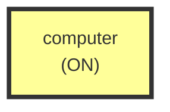
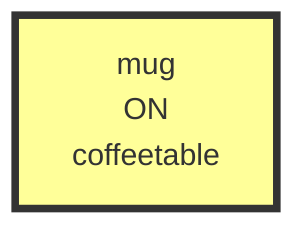

# 🚀 VirtualHome Agent Episode Log


### [GoalReasoner (Module A - Intent)] Output
```json
{
  "is_instruction_obviously_vague": false,
  "clarification_question": null,
  "target_object": "computer",
  "location_hint": null,
  "reasoning_chain": [
    {
      "question": "Why does the user want this object?",
      "answer": "To have the computer be on rather than staying off."
    },
    {
      "question": "Why is that important?",
      "answer": "Because the computer must be powered on for the user to use it."
    },
    {
      "question": "What fundamental need does this fulfill?",
      "answer": "It enables access to a functioning computing device."
    },
    {
      "question": "Are there any deeper psychological or physical motivations?",
      "answer": "The user likely wants to continue a task or interaction that requires the computer to be operational."
    }
  ],
  "deep_intent": "The user wants to make a computing device operational.",
  "acceptable_alternatives_properties": [
    {
      "priority": 1,
      "description": "Another powered-on computing device that can serve the same immediate function, such as a laptop, desktop, or tablet."
    },
    {
      "priority": 2,
      "description": "A different computer form factor that is already on and usable, such as a nearby workstation or all-in-one computer."
    },
    {
      "priority": 3,
      "description": "Any indoor electronic device that can provide comparable digital access for the intended task."
    },
    {
      "priority": 4,
      "description": "A non-computer alternative only if it can fulfill the same task, such as a smartphone for basic digital access."
    }
  ]
}
```

### [PerceptionFilter] Output
```json
{
  "reasoning": "The goal is to make the computer operational, and the SDG requires the computer to be ON. The minimum necessary classes are the computer itself plus the likely input tools needed to power/use it: keyboard and mouse. A screen/monitor may also be part of the usable computing setup, and it is explicitly visible as cpuscreen. Since alternatives and backups must be retained, cellphone is kept as a possible fallback digital device.",
  "selected_classes": [
    "cpuscreen",
    "character",
    "keyboard",
    "desk",
    "mouse",
    "cellphone",
    "computer"
  ],
  "raw_class_count": 33
}
```

### [LLMExecutor] Output
```json
{
  "reasoning": "The active goal is to make the computer ON. The filtered graph shows computer(174) is currently OFF and has a switch. To interact with a switch, I must first be near the computer. No other prerequisites like plugging in are needed because the computer already has no plug requirement shown as blocking. The best next step is to walk to the computer so the next action can be switching it on.",
  "satisfied_nodes": [],
  "current_node_focus": "N1",
  "mapped_variables": {},
  "action": "[walk] <computer> (174)"
}
```

### [RoboStateMultiTaskController] Output
```json
{
  "action": "[walk] <computer> (174)",
  "active_task_id": "task_1",
  "task_context": {
    "active_task_id": "task_1",
    "pending_task_ids": [
      "task_2",
      "task_3"
    ],
    "satisfied_task_ids": []
  },
  "source": "llm_executor"
}
```
## Step 0
- **Action**: `[walk] <computer> (174)`
- **Action Success**: `True`
- **Action Message**: {'0': {'message': 'Success'}}
- **Active Task**: `task_1`
- **Decision Source**: `llm_executor`
- **Task Progress**: E1_11=pending, E1_03=pending, E1_07=pending
- **SDG Status**:

- **Observed Items (12)**: desk(108) [CLOSED], mouse(170), keyboard(172), computer(174) [OFF], cpuscreen(175), cellphone(188) [OFF], cellphone(202) [OFF], character(1), bathroom(11), bedroom(73), kitchen(205), livingroom(335)


### [PerceptionFilter] Output
```json
{
  "reasoning": "Reused cached class selection.",
  "selected_classes": [
    "cpuscreen",
    "character",
    "keyboard",
    "desk",
    "mouse",
    "cellphone",
    "computer"
  ],
  "raw_class_count": 33
}
```

### [LLMExecutor] Output
```json
{
  "reasoning": "The active goal is to make the computer ON. I already walked to computer(174) in the previous step and it is currently OFF, with no need for any other intermediate object. The next atomic step is to switch it on.",
  "satisfied_nodes": [],
  "current_node_focus": "N1",
  "mapped_variables": {},
  "action": "[switchon] <computer> (174)"
}
```

### [RoboStateMultiTaskController] Output
```json
{
  "action": "[switchon] <computer> (174)",
  "active_task_id": "task_1",
  "task_context": {
    "active_task_id": "task_1",
    "pending_task_ids": [
      "task_2",
      "task_3"
    ],
    "satisfied_task_ids": []
  },
  "source": "llm_executor"
}
```
## Step 1
- **Action**: `[switchon] <computer> (174)`
- **Action Success**: `True`
- **Action Message**: Faked switch operation in Python layer (bypassed Unity failure)
- **Active Task**: `task_1`
- **Decision Source**: `llm_executor`
- **Task Progress**: E1_11=done, E1_03=pending, E1_07=pending
- **SDG Status**:

- **Observed Items (12)**: desk(108) [CLOSED], mouse(170), keyboard(172), computer(174) [OFF], cpuscreen(175), cellphone(188) [OFF], cellphone(202) [OFF], character(1), bathroom(11), bedroom(73), kitchen(205), livingroom(335)


### [GoalReasoner (Module A - Intent)] Output
```json
{
  "is_instruction_obviously_vague": false,
  "clarification_question": null,
  "target_object": "book",
  "location_hint": "sofa",
  "reasoning_chain": [
    {
      "question": "Why does the user want this object?",
      "answer": "They want the book moved from an unorganized place to the sofa."
    },
    {
      "question": "Why is that important?",
      "answer": "It likely helps organize the space or place the book where it should be kept."
    },
    {
      "question": "What fundamental need does this fulfill?",
      "answer": "It fulfills a need to tidy and organize household items."
    },
    {
      "question": "Are there any deeper psychological or physical motivations?",
      "answer": "The user may want a more orderly environment and easier access to the book."
    }
  ],
  "deep_intent": "The user wants to organize household items by moving a misplaced item to a designated resting place.",
  "acceptable_alternatives_properties": [
    {
      "priority": 1,
      "description": "Other similarly misplaced household reading materials, such as magazines or notebooks, moved to the sofa."
    },
    {
      "priority": 2,
      "description": "Other small portable household items that are out of place and can be relocated to the sofa."
    },
    {
      "priority": 3,
      "description": "Other loose paper-based or reading-related items that help reduce clutter."
    },
    {
      "priority": 4,
      "description": "Any nearby lightweight item that needs to be put away to improve tidiness."
    }
  ]
}
```

### [RoboStateMultiTaskController] Output
```json
{
  "action": "[walk] <bathroom> (11)",
  "active_task_id": "task_2",
  "task_context": {
    "active_task_id": "task_2",
    "pending_task_ids": [
      "task_3"
    ],
    "satisfied_task_ids": [
      "task_1"
    ]
  },
  "source": "room_frontier"
}
```
## Step 2
- **Action**: `[walk] <bathroom> (11)`
- **Action Success**: `True`
- **Action Message**: {'0': {'message': 'Success'}}
- **Active Task**: `task_2`
- **Decision Source**: `room_frontier`
- **Task Progress**: E1_11=done, E1_03=pending, E1_07=pending
- **SDG Status**:

- **Observed Items (74)**: floor(74), floor(75), floor(76), floor(77), floor(78), floor(79), floor(80), floor(81), floor(82), wall(83), wall(84), wall(85), wall(86), wall(87), wall(88)...


### [RoboStateMultiTaskController] Output
```json
{
  "action": "[walk] <kitchen> (205)",
  "active_task_id": "task_2",
  "task_context": {
    "active_task_id": "task_2",
    "pending_task_ids": [
      "task_3"
    ],
    "satisfied_task_ids": [
      "task_1"
    ]
  },
  "source": "room_frontier"
}
```
## Step 3
- **Action**: `[walk] <kitchen> (205)`
- **Action Success**: `True`
- **Action Message**: {'0': {'message': 'Success'}}
- **Active Task**: `task_2`
- **Decision Source**: `room_frontier`
- **Task Progress**: E1_11=done, E1_03=pending, E1_07=pending
- **SDG Status**:

- **Observed Items (135)**: floor(74), floor(75), floor(76), floor(77), floor(78), floor(79), floor(80), floor(81), floor(82), wall(83), wall(84), wall(85), wall(86), wall(87), wall(88)...


### [RoboStateMultiTaskController] Output
```json
{
  "action": "[walk] <livingroom> (335)",
  "active_task_id": "task_2",
  "task_context": {
    "active_task_id": "task_2",
    "pending_task_ids": [
      "task_3"
    ],
    "satisfied_task_ids": [
      "task_1"
    ]
  },
  "source": "room_frontier"
}
```
## Step 4
- **Action**: `[walk] <livingroom> (335)`
- **Action Success**: `True`
- **Action Message**: {'0': {'message': 'Success'}}
- **Active Task**: `task_2`
- **Decision Source**: `room_frontier`
- **Task Progress**: E1_11=done, E1_03=pending, E1_07=pending
- **SDG Status**:

- **Observed Items (243)**: floor(74), floor(75), floor(76), floor(77), floor(78), floor(79), floor(80), floor(81), floor(82), wall(83), wall(84), wall(85), wall(86), wall(87), wall(88)...


### [PerceptionFilter] Output
```json
{
  "reasoning": "The goal is to place the book on the sofa. The SDG explicitly requires the book and the sofa, so only those classes are necessary; no tools or alternative receptacles are needed for a simple move-and-place task.",
  "selected_classes": [
    "book",
    "paper",
    "character",
    "sofa"
  ],
  "raw_class_count": 101
}
```

### [LLMExecutor] Output
```json
{
  "reasoning": "The active goal is to place a book on the sofa. The current graph shows sofa(368) is in the living room and the character is already close to it, but the candidate target book(268) is inside the kitchen, not yet in hand. The best next step is to go to the book first, since grabbing it requires being near the object. Book(268) is a valid grabbable book and is the best match for the target object.",
  "satisfied_nodes": [],
  "current_node_focus": "N1",
  "mapped_variables": {},
  "action": "[walk] <book> (268)"
}
```

### [RoboStateMultiTaskController] Output
```json
{
  "action": "[walk] <book> (268)",
  "active_task_id": "task_2",
  "task_context": {
    "active_task_id": "task_2",
    "pending_task_ids": [
      "task_3"
    ],
    "satisfied_task_ids": [
      "task_1"
    ]
  },
  "source": "llm_executor"
}
```
## Step 5
- **Action**: `[walk] <book> (268)`
- **Action Success**: `True`
- **Action Message**: {'0': {'message': 'Success'}}
- **Active Task**: `task_2`
- **Decision Source**: `llm_executor`
- **Task Progress**: E1_11=done, E1_03=pending, E1_07=pending
- **SDG Status**:

- **Observed Items (9)**: book(190) [CLOSED], character(1), bathroom(11), bedroom(73), kitchen(205), livingroom(335), book(268) [CLOSED], sofa(368), paper(451)


### [PerceptionFilter] Output
```json
{
  "reasoning": "Reused cached class selection.",
  "selected_classes": [
    "book",
    "paper",
    "character",
    "sofa"
  ],
  "raw_class_count": 101
}
```

### [LLMExecutor] Output
```json
{
  "reasoning": "The active goal is to place the book on the sofa. In the current graph, book(268) is the best match because it is a grabbable book and is already close to the character in the kitchen. The sofa(368) is the target surface and is also close to the character. Since I cannot put an object onto a surface unless I am explicitly walking to that destination first, the next atomic step should be to walk to the sofa before attempting any putback. The other book(190) is in the bedroom and is not the closest candidate, so I should continue with book(268).",
  "satisfied_nodes": [],
  "current_node_focus": "N1",
  "mapped_variables": {},
  "action": "[walk] <sofa> (368)"
}
```

### [RoboStateMultiTaskController] Output
```json
{
  "action": "[walk] <sofa> (368)",
  "active_task_id": "task_2",
  "task_context": {
    "active_task_id": "task_2",
    "pending_task_ids": [
      "task_3"
    ],
    "satisfied_task_ids": [
      "task_1"
    ]
  },
  "source": "llm_executor"
}
```
## Step 6
- **Action**: `[walk] <sofa> (368)`
- **Action Success**: `True`
- **Action Message**: {'0': {'message': 'Success'}}
- **Active Task**: `task_2`
- **Decision Source**: `llm_executor`
- **Task Progress**: E1_11=done, E1_03=pending, E1_07=pending
- **SDG Status**:

- **Observed Items (9)**: book(190) [CLOSED], character(1), bathroom(11), bedroom(73), kitchen(205), livingroom(335), book(268) [CLOSED], sofa(368), paper(451)


### [PerceptionFilter] Output
```json
{
  "reasoning": "Reused cached class selection.",
  "selected_classes": [
    "book",
    "paper",
    "character",
    "sofa"
  ],
  "raw_class_count": 101
}
```

### [LLMExecutor] Output
```json
{
  "reasoning": "The active goal is to place a book on the sofa. The current graph shows the character is already close to sofa(368), but there are two candidate books. book(268) is in the kitchen and book(190) is in the bedroom. Since task progression should use the nearest available matching object and we are currently in the living room near the sofa, the next step should be to go to the nearest reachable book to begin moving it toward the sofa. However, because the last action was already a walk to the sofa and the instruction says not to repeat a walk action if just done, the appropriate next atomic step is to grab the nearby book only if already close. The graph explicitly says book(268) is close to the character, so it is the best target to pick up before placing it on the sofa in a later step.",
  "satisfied_nodes": [],
  "current_node_focus": "N1",
  "mapped_variables": {},
  "action": "[grab] <book> (268)"
}
```

### [RoboStateMultiTaskController] Output
```json
{
  "action": "[grab] <book> (268)",
  "active_task_id": "task_2",
  "task_context": {
    "active_task_id": "task_2",
    "pending_task_ids": [
      "task_3"
    ],
    "satisfied_task_ids": [
      "task_1"
    ]
  },
  "source": "llm_executor"
}
```
## Step 7
- **Action**: `[grab] <book> (268)`
- **Action Success**: `True`
- **Action Message**: {'0': {'message': 'Success'}}
- **Active Task**: `task_2`
- **Decision Source**: `llm_executor`
- **Task Progress**: E1_11=done, E1_03=pending, E1_07=pending
- **SDG Status**:

- **Observed Items (9)**: book(190) [CLOSED], character(1), bathroom(11), bedroom(73), kitchen(205), livingroom(335), book(268) [CLOSED], sofa(368), paper(451)


### [PerceptionFilter] Output
```json
{
  "reasoning": "Reused cached class selection.",
  "selected_classes": [
    "book",
    "paper",
    "character",
    "sofa"
  ],
  "raw_class_count": 101
}
```

### [LLMExecutor] Output
```json
{
  "reasoning": "The active goal is to place the currently held book onto the sofa. The Filtered Graph shows book(268) is already held by the character and the sofa(368) is close to the character, so the only remaining step is to place the book on that flat surface. N1 is not yet satisfied because the book is not on the sofa.",
  "satisfied_nodes": [],
  "current_node_focus": "N1",
  "mapped_variables": {},
  "action": "[putback] <book> (268) <sofa> (368)"
}
```

### [RoboStateMultiTaskController] Output
```json
{
  "action": "[putback] <book> (268) <sofa> (368)",
  "active_task_id": "task_2",
  "task_context": {
    "active_task_id": "task_2",
    "pending_task_ids": [
      "task_1",
      "task_3"
    ],
    "satisfied_task_ids": []
  },
  "source": "llm_executor"
}
```
## Step 8
- **Action**: `[putback] <book> (268) <sofa> (368)`
- **Action Success**: `True`
- **Action Message**: {'0': {'message': 'Success'}}
- **Active Task**: `task_2`
- **Decision Source**: `llm_executor`
- **Task Progress**: E1_11=pending, E1_03=done, E1_07=pending
- **SDG Status**:

- **Observed Items (9)**: book(190) [CLOSED], character(1), bathroom(11), bedroom(73), kitchen(205), livingroom(335), book(268) [CLOSED], sofa(368), paper(451)


### [GoalReasoner (Module A - Intent)] Output
```json
{
  "is_instruction_obviously_vague": false,
  "clarification_question": null,
  "target_object": "mug",
  "location_hint": "coffeetable",
  "reasoning_chain": [
    {
      "question": "Why does the user want this object?",
      "answer": "To keep the mug in a specific place."
    },
    {
      "question": "Why is that important?",
      "answer": "So the mug remains on the coffeetable rather than elsewhere."
    },
    {
      "question": "What fundamental need does this fulfill?",
      "answer": "Maintaining the mug in a designated, accessible location."
    },
    {
      "question": "Are there any deeper psychological or physical motivations?",
      "answer": "Possibly organization, convenience, or preventing the mug from being misplaced."
    }
  ],
  "deep_intent": "The user wants an object kept in a designated location for organization and convenience.",
  "acceptable_alternatives_properties": [
    {
      "priority": 1,
      "description": "Other drinking containers such as cups or tumblers kept on the coffee table"
    },
    {
      "priority": 2,
      "description": "Similar tabletop drinkware like a glass or small bowl used to hold a beverage"
    },
    {
      "priority": 3,
      "description": "Other small everyday items that can be kept neatly on the coffee table"
    },
    {
      "priority": 4,
      "description": "Alternative accessible household items placed in the same designated spot to preserve order"
    }
  ]
}
```

### [PerceptionFilter] Output
```json
{
  "reasoning": "The goal is to keep the mug on the coffeetable, so the only strictly necessary classes are the target mug and the location coffeetable. No tools or alternative receptacles are required for this relation.",
  "selected_classes": [
    "character",
    "mug",
    "coffeetable"
  ],
  "raw_class_count": 101
}
```

### [LLMExecutor] Output
```json
{
  "reasoning": "The active goal is to have a mug on the coffeetable. There are two mug instances available: mug(194) is in the kitchen, and mug(447) is already in the livingroom. The character is currently close to coffeetable(371) in the livingroom, so the most efficient choice is to move the nearby mug(447) onto the nearby coffee table. Because placement requires being explicitly near the destination and holding the object first, the next step should be to walk to the mug currently in the livingroom, then later grab and place it. Since only one atomic action is allowed now, I will start by approaching the closest suitable mug.",
  "satisfied_nodes": [],
  "current_node_focus": "N1",
  "mapped_variables": {},
  "action": "[walk] <mug> (447)"
}
```

### [RoboStateMultiTaskController] Output
```json
{
  "action": "[walk] <mug> (447)",
  "active_task_id": "task_3",
  "task_context": {
    "active_task_id": "task_3",
    "pending_task_ids": [
      "task_1"
    ],
    "satisfied_task_ids": [
      "task_2"
    ]
  },
  "source": "llm_executor"
}
```
## Step 9
- **Action**: `[walk] <mug> (447)`
- **Action Success**: `True`
- **Action Message**: {'0': {'message': 'Success'}}
- **Active Task**: `task_3`
- **Decision Source**: `llm_executor`
- **Task Progress**: E1_11=pending, E1_03=done, E1_07=pending
- **SDG Status**:

- **Observed Items (9)**: coffeetable(111), character(1), bathroom(11), bedroom(73), kitchen(205), livingroom(335), mug(194), coffeetable(371), mug(447)


### [PerceptionFilter] Output
```json
{
  "reasoning": "Reused cached class selection.",
  "selected_classes": [
    "character",
    "mug",
    "coffeetable"
  ],
  "raw_class_count": 101
}
```

### [LLMExecutor] Output
```json
{
  "reasoning": "The active goal is to have a mug ON a coffeetable. The character is already CLOSE to mug(447), so the next required step is to grab a mug before moving it. Among the available mugs, mug(447) is the best binding because it is already near the character in the livingroom. The coffeetable target exists as coffeetable(111) in the bedroom, so after grabbing the mug the next step would be to walk there, then put it back. Current satisfied node: none yet, since the mug is not on the coffeetable.",
  "satisfied_nodes": [],
  "current_node_focus": "N1",
  "mapped_variables": {
    "?Mug": "mug(447)",
    "?Table": "coffeetable(111)"
  },
  "action": "[grab] <mug> (447)"
}
```

### [RoboStateMultiTaskController] Output
```json
{
  "action": "[grab] <mug> (447)",
  "active_task_id": "task_3",
  "task_context": {
    "active_task_id": "task_3",
    "pending_task_ids": [
      "task_1"
    ],
    "satisfied_task_ids": [
      "task_2"
    ]
  },
  "source": "llm_executor"
}
```
## Step 10
- **Action**: `[grab] <mug> (447)`
- **Action Success**: `True`
- **Action Message**: {'0': {'message': 'Success'}}
- **Active Task**: `task_3`
- **Decision Source**: `llm_executor`
- **Task Progress**: E1_11=pending, E1_03=done, E1_07=pending
- **SDG Status**:

- **Observed Items (9)**: coffeetable(111), character(1), bathroom(11), bedroom(73), kitchen(205), livingroom(335), mug(194), coffeetable(371), mug(447)


### [PerceptionFilter] Output
```json
{
  "reasoning": "Reused cached class selection.",
  "selected_classes": [
    "character",
    "mug",
    "coffeetable"
  ],
  "raw_class_count": 101
}
```

### [LLMExecutor] Output
```json
{
  "reasoning": "The active goal is to have a mug on the coffeetable. I am currently holding mug(447), and coffeetable(111) is the valid target surface. To place an object on a surface, I must first walk to that surface. The mug is already the correct object for the task and is in hand, so the next step is to move to the coffeetable before putting it down.",
  "satisfied_nodes": [],
  "current_node_focus": "N1",
  "mapped_variables": {
    "?TargetMug": "mug(447)",
    "?TargetSurface": "coffeetable(111)"
  },
  "action": "[walk] <coffeetable> (111)"
}
```

### [RoboStateMultiTaskController] Output
```json
{
  "action": "[walk] <coffeetable> (111)",
  "active_task_id": "task_3",
  "task_context": {
    "active_task_id": "task_3",
    "pending_task_ids": [
      "task_1"
    ],
    "satisfied_task_ids": [
      "task_2"
    ]
  },
  "source": "llm_executor"
}
```
## Step 11
- **Action**: `[walk] <coffeetable> (111)`
- **Action Success**: `True`
- **Action Message**: {'0': {'message': 'Success'}}
- **Active Task**: `task_3`
- **Decision Source**: `llm_executor`
- **Task Progress**: E1_11=pending, E1_03=done, E1_07=pending
- **SDG Status**:

- **Observed Items (9)**: coffeetable(111), character(1), bathroom(11), bedroom(73), kitchen(205), livingroom(335), mug(194), coffeetable(371), mug(447)


### [PerceptionFilter] Output
```json
{
  "reasoning": "Reused cached class selection.",
  "selected_classes": [
    "character",
    "mug",
    "coffeetable"
  ],
  "raw_class_count": 101
}
```

### [LLMExecutor] Output
```json
{
  "reasoning": "The active goal is to ensure mug(447) is on coffeetable(111). We are already close to the coffee table, and the mug(447) is currently held in the right hand. The next required atomic step is to place the held mug onto the coffee table to satisfy N1.",
  "satisfied_nodes": [],
  "current_node_focus": "N1",
  "mapped_variables": {
    "?Target": "coffeetable(111)"
  },
  "action": "[putback] <mug> (447) <coffeetable> (111)"
}
```

### [RoboStateMultiTaskController] Output
```json
{
  "action": "[putback] <mug> (447) <coffeetable> (111)",
  "active_task_id": "task_3",
  "task_context": {
    "active_task_id": "task_3",
    "pending_task_ids": [
      "task_1"
    ],
    "satisfied_task_ids": [
      "task_2"
    ]
  },
  "source": "llm_executor"
}
```
## Step 12
- **Action**: `[putback] <mug> (447) <coffeetable> (111)`
- **Action Success**: `True`
- **Action Message**: {'0': {'message': 'Success'}}
- **Active Task**: `task_3`
- **Decision Source**: `llm_executor`
- **Task Progress**: E1_11=pending, E1_03=done, E1_07=done
- **SDG Status**:

- **Observed Items (9)**: coffeetable(111), character(1), bathroom(11), bedroom(73), kitchen(205), livingroom(335), mug(194), coffeetable(371), mug(447)


### [PerceptionFilter] Output
```json
{
  "reasoning": "The goal is to make the computer operational, so the target object class computer must be kept. Since the required state is ON, the minimal needed set should also include the most relevant computer interaction/power-related nearby components visible here: cpuscreen, keyboard, mouse, desk, and powersocket as possible supporting items for using or powering the computer. No unrelated objects are needed.",
  "selected_classes": [
    "computer",
    "cpuscreen",
    "character",
    "door",
    "keyboard",
    "mouse",
    "powersocket",
    "desk"
  ],
  "raw_class_count": 101
}
```

### [LLMExecutor] Output
```json
{
  "reasoning": "The active task is to make the computer ON. In the current graph, there are two OFF computers: computer(174) in the bedroom and computer(433) in the living room. The living room computer is closer to the character (CLOSE character(1)), so it is the best binding for the SDG variable. To switch it on, I must be near it; since the graph already marks it close but not explicitly at the same interaction state, the next safe atomic action is to walk to the living room computer before switching it on.",
  "satisfied_nodes": [],
  "current_node_focus": "N1",
  "mapped_variables": {
    "?Computer": "computer(433)"
  },
  "action": "[walk] <computer> (433)"
}
```

### [RoboStateMultiTaskController] Output
```json
{
  "action": "[walk] <computer> (433)",
  "active_task_id": "task_1",
  "task_context": {
    "active_task_id": "task_1",
    "pending_task_ids": [],
    "satisfied_task_ids": [
      "task_2",
      "task_3"
    ]
  },
  "source": "llm_executor"
}
```
## Step 13
- **Action**: `[walk] <computer> (433)`
- **Action Success**: `True`
- **Action Message**: {'0': {'message': 'Success'}}
- **Active Task**: `task_1`
- **Decision Source**: `llm_executor`
- **Task Progress**: E1_11=pending, E1_03=done, E1_07=done
- **SDG Status**:

- **Observed Items (19)**: desk(108) [CLOSED], mouse(170), keyboard(172), computer(174) [OFF], cpuscreen(175), character(1), bathroom(11), bedroom(73), kitchen(205), livingroom(335), door(51) [OPEN], door(224) [OPEN], powersocket(262), desk(373) [CLOSED], powersocket(428)...


### [PerceptionFilter] Output
```json
{
  "reasoning": "Reused cached class selection.",
  "selected_classes": [
    "computer",
    "cpuscreen",
    "character",
    "door",
    "keyboard",
    "mouse",
    "powersocket",
    "desk"
  ],
  "raw_class_count": 101
}
```

### [LLMExecutor] Output
```json
{
  "reasoning": "The active goal is to make the computer ON. The current Filtered Graph shows computer(433) is in the livingroom and CLOSE to the character, but it is OFF and has HAS_SWITCH, so the next required step is to switch it on. No plug-in is needed because no plug state is shown for the computer. The bedroom computer(174) is a different instance and not the one currently near the robot, so the closest valid target is computer(433).",
  "satisfied_nodes": [],
  "current_node_focus": "N1",
  "mapped_variables": {
    "?Computer": "computer(433)"
  },
  "action": "[switchon] <computer> (433)"
}
```

### [RoboStateMultiTaskController] Output
```json
{
  "action": "[switchon] <computer> (433)",
  "active_task_id": "task_1",
  "task_context": {
    "active_task_id": "task_1",
    "pending_task_ids": [],
    "satisfied_task_ids": [
      "task_2",
      "task_3"
    ]
  },
  "source": "llm_executor"
}
```
## Step 14
- **Action**: `[switchon] <computer> (433)`
- **Action Success**: `True`
- **Action Message**: Faked switch operation in Python layer (bypassed Unity failure)
- **Active Task**: `task_1`
- **Decision Source**: `llm_executor`
- **Task Progress**: E1_11=done, E1_03=done, E1_07=done
- **SDG Status**:

- **Observed Items (19)**: desk(108) [CLOSED], mouse(170), keyboard(172), computer(174) [OFF], cpuscreen(175), character(1), bathroom(11), bedroom(73), kitchen(205), livingroom(335), door(51) [OPEN], door(224) [OPEN], powersocket(262), desk(373) [CLOSED], powersocket(428)...

