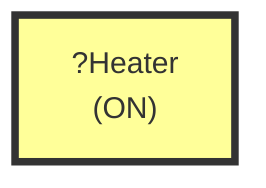
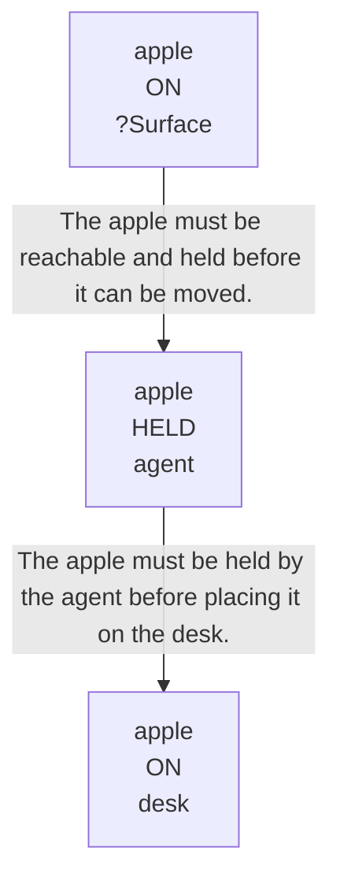
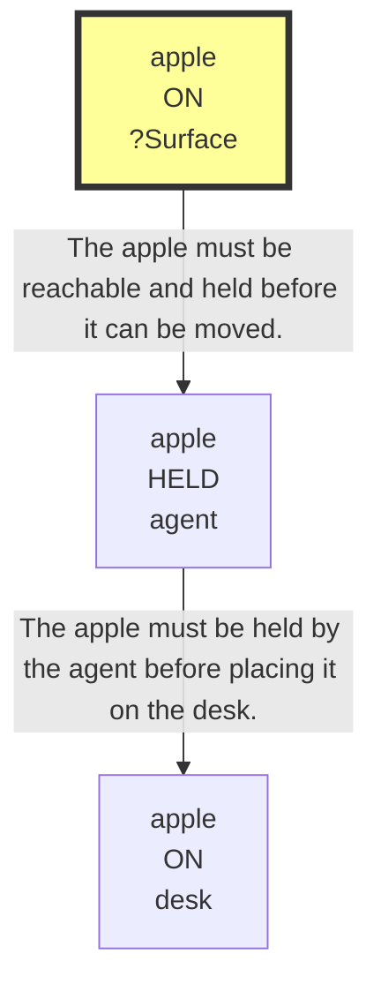
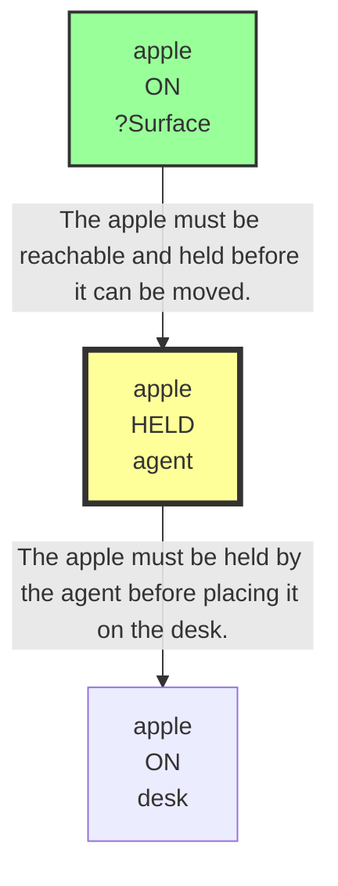
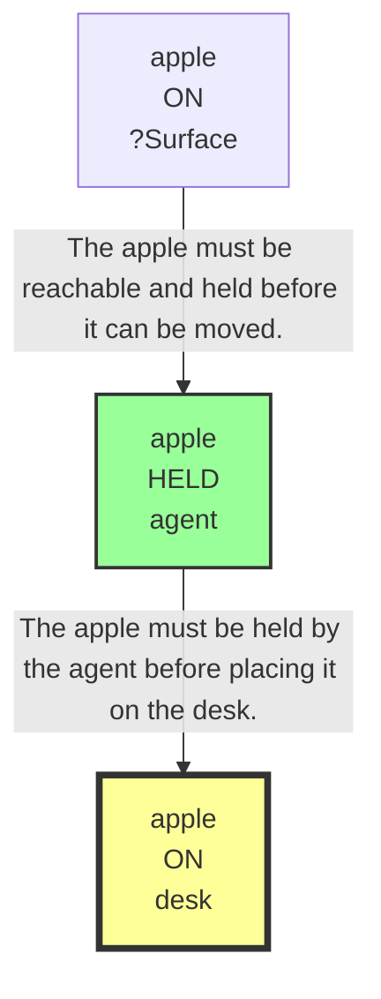

# 🚀 VirtualHome Agent Episode Log


### [GoalReasoner (Module A - Intent)] Output
```json
{
  "is_instruction_obviously_vague": false,
  "clarification_question": null,
  "target_object": "microwave",
  "location_hint": null,
  "reasoning_chain": [
    {
      "question": "Why does the user want this object?",
      "answer": "To have the microwave operating."
    },
    {
      "question": "Why is that important?",
      "answer": "So it can be used for its intended function when needed."
    },
    {
      "question": "What fundamental need does this fulfill?",
      "answer": "It fulfills the need to make a household appliance operational."
    },
    {
      "question": "Are there any deeper psychological or physical motivations?",
      "answer": "The user likely wants to enable heating or cooking tasks by ensuring the appliance is powered on."
    }
  ],
  "deep_intent": "The user wants to enable a household appliance so it can be used.",
  "acceptable_alternatives_properties": [
    {
      "priority": 1,
      "description": "Other plug-in kitchen appliances that can be turned on to perform their function, such as a toaster or oven."
    },
    {
      "priority": 2,
      "description": "Other electrical household devices that are currently off and can be powered on for immediate use."
    },
    {
      "priority": 3,
      "description": "Any indoor appliance that provides convenient food preparation or heating capability."
    },
    {
      "priority": 4,
      "description": "A different available heating method for food, such as a stove or electric warmer, if the goal is to make food warm."
    }
  ]
}
```

### [PerceptionFilter] Output
```json
{
  "reasoning": "The goal is to make a household appliance operational, and the SDG requires an abstract heater/appliance to be ON. The target object microwave must be included, along with other viable heating/prep appliance alternatives retained for backup. A power source is also relevant for turning appliances on.",
  "selected_classes": [
    "character",
    "door",
    "stove",
    "toaster",
    "microwave",
    "powersocket"
  ],
  "raw_class_count": 45
}
```

### [LLMExecutor] Output
```json
{
  "reasoning": "The active goal is to make a heater appliance ON. The microwave(234) is the best match in the filtered graph because it is a kitchen appliance with HAS_SWITCH and HAS_PLUG, and it is currently OFF. To switch it on, I must first be near it, so the next atomic step is to walk to the microwave.",
  "satisfied_nodes": [],
  "current_node_focus": "N1",
  "mapped_variables": {
    "?Heater": "microwave(234)"
  },
  "action": "[walk] <microwave> (234)"
}
```

### [RoboStateMultiTaskController] Output
```json
{
  "action": "[walk] <microwave> (234)",
  "active_task_id": "task_1",
  "task_context": {
    "active_task_id": "task_1",
    "pending_task_ids": [
      "task_2",
      "task_3"
    ],
    "satisfied_task_ids": []
  },
  "source": "llm_executor"
}
```
## Step 0
- **Action**: `[walk] <microwave> (234)`
- **Action Success**: `True`
- **Action Message**: {'0': {'message': 'Success'}}
- **Active Task**: `task_1`
- **Decision Source**: `llm_executor`
- **Task Progress**: E1_19=pending, E1_02=pending, E1_03=pending
- **SDG Status**:

- **Observed Items (11)**: door(145) [OPEN], door(146) [OPEN], powersocket(156), stove(226) [OFF,CLOSED], toaster(231) [OFF], microwave(234) [OFF,CLOSED], character(1), bathroom(11), bedroom(50), kitchen(126), livingroom(261)


### [PerceptionFilter] Output
```json
{
  "reasoning": "Reused cached class selection.",
  "selected_classes": [
    "character",
    "door",
    "stove",
    "toaster",
    "microwave",
    "powersocket"
  ],
  "raw_class_count": 45
}
```

### [LLMExecutor] Output
```json
{
  "reasoning": "The active goal is to make the microwave ON. The current graph shows microwave(234) is close to the character, has a plug, and is currently OFF. Since I am already close to it and no plug-in step is required yet in the SDG, the next atomic action is to switch it on.",
  "satisfied_nodes": [],
  "current_node_focus": "N1",
  "mapped_variables": {
    "?Heater": "microwave(234)"
  },
  "action": "[switchon] <microwave> (234)"
}
```

### [RoboStateMultiTaskController] Output
```json
{
  "action": "[switchon] <microwave> (234)",
  "active_task_id": "task_1",
  "task_context": {
    "active_task_id": "task_1",
    "pending_task_ids": [
      "task_2",
      "task_3"
    ],
    "satisfied_task_ids": []
  },
  "source": "llm_executor"
}
```
## Step 1
- **Action**: `[switchon] <microwave> (234)`
- **Action Success**: `True`
- **Action Message**: Faked switch operation in Python layer (bypassed Unity failure)
- **Active Task**: `task_1`
- **Decision Source**: `llm_executor`
- **Task Progress**: E1_19=done, E1_02=pending, E1_03=pending
- **SDG Status**:

- **Observed Items (11)**: door(145) [OPEN], door(146) [OPEN], powersocket(156), stove(226) [OFF,CLOSED], toaster(231) [OFF], microwave(234) [OFF,CLOSED], character(1), bathroom(11), bedroom(50), kitchen(126), livingroom(261)


### [GoalReasoner (Module A - Intent)] Output
```json
{
  "is_instruction_obviously_vague": false,
  "clarification_question": null,
  "target_object": "apple",
  "location_hint": "desk",
  "reasoning_chain": [
    {
      "question": "Why does the user want this object?",
      "answer": "To have the apple brought to their desk."
    },
    {
      "question": "Why is that important?",
      "answer": "Because they likely want access to the apple while they are at their desk."
    },
    {
      "question": "What fundamental need does this fulfill?",
      "answer": "It fulfills the need to obtain and have convenient access to food or a snack."
    },
    {
      "question": "Are there any deeper psychological or physical motivations?",
      "answer": "The likely motivation is to satisfy hunger or make a snack available within reach during desk activity."
    }
  ],
  "deep_intent": "The user wants convenient access to food while at their desk.",
  "acceptable_alternatives_properties": [
    {
      "priority": 1,
      "description": "Other ready-to-eat fruits or snack foods that can be placed at the desk, such as a banana, orange, or granola bar."
    },
    {
      "priority": 2,
      "description": "Other portable handheld foods that can serve as a snack, such as crackers, cookies, or a sandwich."
    },
    {
      "priority": 3,
      "description": "Packaged or easy-to-eat foods that provide quick energy and can be kept at a desk, such as nuts, trail mix, or dried fruit."
    },
    {
      "priority": 4,
      "description": "Any small edible item available indoors that can satisfy hunger or provide a snack-like refreshment, even if it is not a fruit."
    }
  ]
}
```

### [RoboStateMultiTaskController] Output
```json
{
  "action": "[walk] <bathroom> (11)",
  "active_task_id": "task_2",
  "task_context": {
    "active_task_id": "task_2",
    "pending_task_ids": [
      "task_3"
    ],
    "satisfied_task_ids": [
      "task_1"
    ]
  },
  "source": "room_frontier"
}
```
## Step 2
- **Action**: `[walk] <bathroom> (11)`
- **Action Success**: `True`
- **Action Message**: {'0': {'message': 'Success'}}
- **Active Task**: `task_2`
- **Decision Source**: `room_frontier`
- **Task Progress**: E1_19=done, E1_02=pending, E1_03=pending
- **SDG Status**:

- **Observed Items (125)**: floor(127), floor(128), floor(129), floor(130), floor(131), floor(132), floor(133), floor(134), floor(135), ceiling(136), ceiling(137), ceiling(138), ceiling(139), ceiling(140), ceiling(141)...


### [RoboStateMultiTaskController] Output
```json
{
  "action": "[walk] <bedroom> (50)",
  "active_task_id": "task_2",
  "task_context": {
    "active_task_id": "task_2",
    "pending_task_ids": [
      "task_3"
    ],
    "satisfied_task_ids": [
      "task_1"
    ]
  },
  "source": "room_frontier"
}
```
## Step 3
- **Action**: `[walk] <bedroom> (50)`
- **Action Success**: `True`
- **Action Message**: {'0': {'message': 'Success'}}
- **Active Task**: `task_2`
- **Decision Source**: `room_frontier`
- **Task Progress**: E1_19=done, E1_02=pending, E1_03=pending
- **SDG Status**:

- **Observed Items (163)**: floor(127), floor(128), floor(129), floor(130), floor(131), floor(132), floor(133), floor(134), floor(135), ceiling(136), ceiling(137), ceiling(138), ceiling(139), ceiling(140), ceiling(141)...


### [PerceptionFilter] Output
```json
{
  "reasoning": "The goal is to place the apple on the desk. The SDG requires the target object (apple), the destination location (desk), and the apple being held by the agent before placement, so only the apple and desk are necessary among visible classes.",
  "selected_classes": [
    "door",
    "character",
    "apple",
    "desk"
  ],
  "raw_class_count": 82
}
```

### [LLMExecutor] Output
```json
{
  "reasoning": "The active task is to place an apple on the desk. The agent is currently in the bedroom, and the filtered graph shows the desk is also in the bedroom, while several apples are in the kitchen and one apple (114) is in the bedroom. To progress toward the SDG, the apple must first be held (N2) before it can be placed on the desk (N3). Since apple(114) is the closest valid target and is already in the same room, the next atomic action should be to walk to it before grabbing.",
  "satisfied_nodes": [],
  "current_node_focus": "N1",
  "mapped_variables": {},
  "action": "[walk] <apple> (114)"
}
```

### [RoboStateMultiTaskController] Output
```json
{
  "action": "[walk] <apple> (114)",
  "active_task_id": "task_2",
  "task_context": {
    "active_task_id": "task_2",
    "pending_task_ids": [
      "task_3"
    ],
    "satisfied_task_ids": [
      "task_1"
    ]
  },
  "source": "llm_executor"
}
```
## Step 4
- **Action**: `[walk] <apple> (114)`
- **Action Success**: `True`
- **Action Message**: {'0': {'message': 'Success'}}
- **Active Task**: `task_2`
- **Decision Source**: `llm_executor`
- **Task Progress**: E1_19=done, E1_02=pending, E1_03=pending
- **SDG Status**:

- **Observed Items (22)**: door(145) [OPEN], door(146) [OPEN], apple(249), apple(250), apple(251), apple(252), apple(253), apple(254), apple(255), apple(256), apple(257), apple(258), apple(259), apple(113), character(1)...


### [PerceptionFilter] Output
```json
{
  "reasoning": "Reused cached class selection.",
  "selected_classes": [
    "door",
    "character",
    "apple",
    "desk"
  ],
  "raw_class_count": 82
}
```

### [LLMExecutor] Output
```json
{
  "reasoning": "The active task is to place an apple on the desk. In the current graph, apple(114) is the only apple already close to the agent and located in the bedroom, while the desk(80) is in the same room but currently closed. The apple must be held before it can be placed on the desk, so the next required step is to pick up apple(114).",
  "satisfied_nodes": [
    "N1"
  ],
  "current_node_focus": "N2",
  "mapped_variables": {
    "?Surface": "desk(80)"
  },
  "action": "[grab] <apple> (114)"
}
```

### [RoboStateMultiTaskController] Output
```json
{
  "action": "[grab] <apple> (114)",
  "active_task_id": "task_2",
  "task_context": {
    "active_task_id": "task_2",
    "pending_task_ids": [
      "task_3"
    ],
    "satisfied_task_ids": [
      "task_1"
    ]
  },
  "source": "llm_executor"
}
```
## Step 5
- **Action**: `[grab] <apple> (114)`
- **Action Success**: `True`
- **Action Message**: {'0': {'message': 'Success'}}
- **Active Task**: `task_2`
- **Decision Source**: `llm_executor`
- **Task Progress**: E1_19=done, E1_02=pending, E1_03=pending
- **SDG Status**:

- **Observed Items (22)**: door(145) [OPEN], door(146) [OPEN], apple(249), apple(250), apple(251), apple(252), apple(253), apple(254), apple(255), apple(256), apple(257), apple(258), apple(259), apple(113), character(1)...


### [PerceptionFilter] Output
```json
{
  "reasoning": "Reused cached class selection.",
  "selected_classes": [
    "door",
    "character",
    "apple",
    "desk"
  ],
  "raw_class_count": 82
}
```

### [LLMExecutor] Output
```json
{
  "reasoning": "The active goal is to place the apple on the desk. From the graph, I am already holding apple(114), satisfying the HOLD prerequisite (N2). The desk(80) is the target surface for the final placement, and I must explicitly walk to it before putting the apple down. The desk is currently closed, but it is a surface/movable object and does not need to be opened for placing an item on top of it; I only need proximity. Therefore the next step is to walk to the desk to prepare for N3.",
  "satisfied_nodes": [
    "N2"
  ],
  "current_node_focus": "N3",
  "mapped_variables": {},
  "action": "[walk] <desk> (80)"
}
```

### [RoboStateMultiTaskController] Output
```json
{
  "action": "[walk] <desk> (80)",
  "active_task_id": "task_2",
  "task_context": {
    "active_task_id": "task_2",
    "pending_task_ids": [
      "task_1",
      "task_3"
    ],
    "satisfied_task_ids": []
  },
  "source": "llm_executor"
}
```
## Step 6
- **Action**: `[walk] <desk> (80)`
- **Action Success**: `True`
- **Action Message**: {'0': {'message': 'Success'}}
- **Active Task**: `task_2`
- **Decision Source**: `llm_executor`
- **Task Progress**: E1_19=pending, E1_02=pending, E1_03=pending
- **SDG Status**:

- **Observed Items (22)**: door(145) [OPEN], door(146) [OPEN], apple(249), apple(250), apple(251), apple(252), apple(253), apple(254), apple(255), apple(256), apple(257), apple(258), apple(259), apple(113), character(1)...


### [PerceptionFilter] Output
```json
{
  "reasoning": "Reused cached class selection.",
  "selected_classes": [
    "door",
    "character",
    "apple",
    "desk"
  ],
  "raw_class_count": 82
}
```

### [LLMExecutor] Output
```json
{
  "reasoning": "The active goal is to place the apple on the desk. The current graph shows the agent is already close to the desk and is holding apple(114), so the next required step is to place that held apple onto the desk surface. The desk is a valid flat surface, and no opening is needed for a surface placement. This will satisfy the final SDG node N3 if the putback succeeds.",
  "satisfied_nodes": [
    "N2"
  ],
  "current_node_focus": "N3",
  "mapped_variables": {},
  "action": "[putback] <apple> (114) <desk> (80)"
}
```

### [RoboStateMultiTaskController] Output
```json
{
  "action": "[putback] <apple> (114) <desk> (80)",
  "active_task_id": "task_2",
  "task_context": {
    "active_task_id": "task_2",
    "pending_task_ids": [
      "task_1",
      "task_3"
    ],
    "satisfied_task_ids": []
  },
  "source": "llm_executor"
}
```
## Step 7
- **Action**: `[putback] <apple> (114) <desk> (80)`
- **Action Success**: `True`
- **Action Message**: {'0': {'message': 'Success'}}
- **Active Task**: `task_2`
- **Decision Source**: `llm_executor`
- **Task Progress**: E1_19=pending, E1_02=done, E1_03=pending
- **SDG Status**:

- **Observed Items (22)**: door(145) [OPEN], door(146) [OPEN], apple(249), apple(250), apple(251), apple(252), apple(253), apple(254), apple(255), apple(256), apple(257), apple(258), apple(259), apple(113), character(1)...


### [GoalReasoner (Module A - Intent)] Output
```json
{
  "is_instruction_obviously_vague": false,
  "clarification_question": null,
  "target_object": "book",
  "location_hint": "sofa",
  "reasoning_chain": [
    {
      "question": "Why does the user want this object moved?",
      "answer": "To place an unorganized book in a more specific location."
    },
    {
      "question": "Why is that important?",
      "answer": "Because the book is not in the desired arrangement or location."
    },
    {
      "question": "What fundamental need does this fulfill?",
      "answer": "It fulfills the need to organize or tidy up items in the environment."
    },
    {
      "question": "Are there any deeper psychological or physical motivations?",
      "answer": "The user likely wants reduced clutter, easier access to the book, or a neater living space."
    }
  ],
  "deep_intent": "The user wants to organize or tidy up a misplaced item by relocating it to a designated resting area.",
  "acceptable_alternatives_properties": [
    {
      "priority": 1,
      "description": "Other small household items that are out of place and can be moved to the same resting area, such as magazines or notebooks."
    },
    {
      "priority": 2,
      "description": "Other reading materials or paper items that belong with the book, such as journals or documents."
    },
    {
      "priority": 3,
      "description": "General clutter items that can be tidied into a common living-area location, such as remote controls or cushions if they are meant to be gathered."
    },
    {
      "priority": 4,
      "description": "Any portable object that needs to be put somewhere more organized within the room, as long as it serves the same tidying purpose."
    }
  ]
}
```

### [PerceptionFilter] Output
```json
{
  "reasoning": "The goal is to place the book on the sofa, and the SDG explicitly requires the relation book ON sofa. Only the target object and the destination location are needed; no additional tools or alternatives are required for this simple relocation task.",
  "selected_classes": [
    "book",
    "paper",
    "character",
    "sofa"
  ],
  "raw_class_count": 82
}
```

### [LLMExecutor] Output
```json
{
  "reasoning": "The active goal is to make a book be ON the sofa. A suitable book is available in the bedroom, and the sofa is also in the bedroom, so the first required step is to move near the target object before grabbing it. I will focus on the closest valid book instance in the bedroom (book 104) to minimize travel and because it is already in the same room as the sofa.",
  "satisfied_nodes": [],
  "current_node_focus": "N1",
  "mapped_variables": {
    "?TargetBook": "book(104)",
    "?TargetSurface": "sofa(85)"
  },
  "action": "[walk] <book> (104)"
}
```

### [RoboStateMultiTaskController] Output
```json
{
  "action": "[walk] <book> (104)",
  "active_task_id": "task_3",
  "task_context": {
    "active_task_id": "task_3",
    "pending_task_ids": [
      "task_1"
    ],
    "satisfied_task_ids": [
      "task_2"
    ]
  },
  "source": "llm_executor"
}
```
## Step 8
- **Action**: `[walk] <book> (104)`
- **Action Success**: `True`
- **Action Message**: {'0': {'message': 'Success'}}
- **Active Task**: `task_3`
- **Decision Source**: `llm_executor`
- **Task Progress**: E1_19=pending, E1_02=done, E1_03=pending
- **SDG Status**:

- **Observed Items (10)**: book(163) [CLOSED], book(164) [CLOSED], character(1), bathroom(11), bedroom(50), kitchen(126), livingroom(261), sofa(85), book(104) [CLOSED], paper(109)


### [PerceptionFilter] Output
```json
{
  "reasoning": "Reused cached class selection.",
  "selected_classes": [
    "book",
    "paper",
    "character",
    "sofa"
  ],
  "raw_class_count": 82
}
```

### [LLMExecutor] Output
```json
{
  "reasoning": "The active SDG requires the book to be ON the sofa. The currently visible book(104) is in the bedroom and we have already walked to it, so the next atomic step is to grab it before transporting it to the sofa. The sofa is the correct destination surface for the final relation, and there is no need to interact with the kitchen books because they are unrelated to the active task and belong to a different location.",
  "satisfied_nodes": [],
  "current_node_focus": "N1",
  "mapped_variables": {},
  "action": "[grab] <book> (104)"
}
```

### [RoboStateMultiTaskController] Output
```json
{
  "action": "[grab] <book> (104)",
  "active_task_id": "task_3",
  "task_context": {
    "active_task_id": "task_3",
    "pending_task_ids": [
      "task_1"
    ],
    "satisfied_task_ids": [
      "task_2"
    ]
  },
  "source": "llm_executor"
}
```
## Step 9
- **Action**: `[grab] <book> (104)`
- **Action Success**: `True`
- **Action Message**: {'0': {'message': 'Success'}}
- **Active Task**: `task_3`
- **Decision Source**: `llm_executor`
- **Task Progress**: E1_19=pending, E1_02=done, E1_03=pending
- **SDG Status**:

- **Observed Items (10)**: book(163) [CLOSED], book(164) [CLOSED], character(1), bathroom(11), bedroom(50), kitchen(126), livingroom(261), sofa(85), book(104) [CLOSED], paper(109)


### [PerceptionFilter] Output
```json
{
  "reasoning": "Reused cached class selection.",
  "selected_classes": [
    "book",
    "paper",
    "character",
    "sofa"
  ],
  "raw_class_count": 82
}
```

### [LLMExecutor] Output
```json
{
  "reasoning": "The active task is to place a book on the sofa. I am currently holding book(104), and the sofa(85) is in the same bedroom. The next required step toward satisfying N1 is to move to the sofa before any putback action. The other book instances are inside the kitchen and are irrelevant because I already have the book currently in hand.",
  "satisfied_nodes": [],
  "current_node_focus": "N1",
  "mapped_variables": {},
  "action": "[walk] <sofa> (85)"
}
```

### [RoboStateMultiTaskController] Output
```json
{
  "action": "[walk] <sofa> (85)",
  "active_task_id": "task_3",
  "task_context": {
    "active_task_id": "task_3",
    "pending_task_ids": [
      "task_1"
    ],
    "satisfied_task_ids": [
      "task_2"
    ]
  },
  "source": "llm_executor"
}
```
## Step 10
- **Action**: `[walk] <sofa> (85)`
- **Action Success**: `True`
- **Action Message**: {'0': {'message': 'Success'}}
- **Active Task**: `task_3`
- **Decision Source**: `llm_executor`
- **Task Progress**: E1_19=pending, E1_02=done, E1_03=pending
- **SDG Status**:

- **Observed Items (10)**: book(163) [CLOSED], book(164) [CLOSED], character(1), bathroom(11), bedroom(50), kitchen(126), livingroom(261), sofa(85), book(104) [CLOSED], paper(109)


### [PerceptionFilter] Output
```json
{
  "reasoning": "Reused cached class selection.",
  "selected_classes": [
    "book",
    "paper",
    "character",
    "sofa"
  ],
  "raw_class_count": 82
}
```

### [LLMExecutor] Output
```json
{
  "reasoning": "The active goal is to place a book on the sofa. The current graph shows the character is already close to sofa(85) and is holding book(104) in the right hand. Therefore the next required step is to place the held book onto the sofa surface. The sofa is a valid flat surface, so [putback] is the correct action. No other task should be manipulated.",
  "satisfied_nodes": [],
  "current_node_focus": "N1",
  "mapped_variables": {
    "?TargetSurface": "sofa(85)"
  },
  "action": "[putback] <book> (104) <sofa> (85)"
}
```

### [RoboStateMultiTaskController] Output
```json
{
  "action": "[putback] <book> (104) <sofa> (85)",
  "active_task_id": "task_3",
  "task_context": {
    "active_task_id": "task_3",
    "pending_task_ids": [
      "task_1"
    ],
    "satisfied_task_ids": [
      "task_2"
    ]
  },
  "source": "llm_executor"
}
```
## Step 11
- **Action**: `[putback] <book> (104) <sofa> (85)`
- **Action Success**: `True`
- **Action Message**: {'0': {'message': 'Success'}}
- **Active Task**: `task_3`
- **Decision Source**: `llm_executor`
- **Task Progress**: E1_19=pending, E1_02=done, E1_03=done
- **SDG Status**:

- **Observed Items (10)**: book(163) [CLOSED], book(164) [CLOSED], character(1), bathroom(11), bedroom(50), kitchen(126), livingroom(261), sofa(85), book(104) [CLOSED], paper(109)


### [PerceptionFilter] Output
```json
{
  "reasoning": "The goal is to make the microwave operational, so the target appliance must be kept. To turn it on, the relevant power-control items are a powersocket and a lightswitch if the microwave or its power source is controlled through them. No food-prep or unrelated furniture is needed.",
  "selected_classes": [
    "lightswitch",
    "character",
    "door",
    "stove",
    "toaster",
    "microwave",
    "powersocket"
  ],
  "raw_class_count": 82
}
```

### [LLMExecutor] Output
```json
{
  "reasoning": "The active goal is to make the microwave operating, and the filtered graph already shows microwave(234) is ON. Therefore the single SDG node N1 is satisfied, and no further action is needed.",
  "satisfied_nodes": [
    "N1"
  ],
  "current_node_focus": "N1",
  "mapped_variables": {
    "?Heater": "microwave(234)"
  },
  "action": "[wait]"
}
```

### [RoboStateMultiTaskController] Output
```json
{
  "action": "[wait]",
  "active_task_id": "task_1",
  "task_context": {
    "active_task_id": "task_1",
    "pending_task_ids": [],
    "satisfied_task_ids": [
      "task_2",
      "task_3"
    ]
  },
  "source": "llm_executor"
}
```
## Step 12
- **Action**: `[wait]`
- **Action Success**: `True`
- **Action Message**: Time passes. You waited for a while.
- **Active Task**: `task_1`
- **Decision Source**: `llm_executor`
- **Task Progress**: E1_19=pending, E1_02=done, E1_03=done
- **SDG Status**:

- **Observed Items (15)**: door(145) [OPEN], door(146) [OPEN], powersocket(156), lightswitch(157) [ON], stove(226) [OFF,CLOSED], toaster(231) [OFF], microwave(234) [CLOSED,ON], character(1), bathroom(11), bedroom(50), kitchen(126), livingroom(261), door(47) [OPEN], lightswitch(48) [ON], lightswitch(97) [ON]


### [PerceptionFilter] Output
```json
{
  "reasoning": "Reused cached class selection.",
  "selected_classes": [
    "lightswitch",
    "character",
    "door",
    "stove",
    "toaster",
    "microwave",
    "powersocket"
  ],
  "raw_class_count": 82
}
```

### [LLMExecutor] Output
```json
{
  "reasoning": "The active SDG has a single goal node: make ?Heater ON. The filtered graph shows a suitable heater candidate, microwave(234), already in the kitchen and currently CLOSED but ON. Since the goal is already satisfied by the current state, no physical manipulation is needed. However, because the instruction asks for a single next action and the microwave is already ON, the correct move is to do nothing only if progress were pending; here the goal node is satisfied. I will therefore choose a no-op? The available atomic actions include wait, but that would not change state. Since the task is already satisfied, the safest next action is to wait while preserving completion state.",
  "satisfied_nodes": [
    "N1"
  ],
  "current_node_focus": "N1",
  "mapped_variables": {
    "?Heater": "microwave(234)"
  },
  "action": "[wait]"
}
```

### [RoboStateMultiTaskController] Output
```json
{
  "action": "[wait]",
  "active_task_id": "task_1",
  "task_context": {
    "active_task_id": "task_1",
    "pending_task_ids": [],
    "satisfied_task_ids": [
      "task_2",
      "task_3"
    ]
  },
  "source": "llm_executor"
}
```
## Step 13
- **Action**: `[wait]`
- **Action Success**: `True`
- **Action Message**: Time passes. You waited for a while.
- **Active Task**: `task_1`
- **Decision Source**: `llm_executor`
- **Task Progress**: E1_19=pending, E1_02=done, E1_03=done
- **SDG Status**:

- **Observed Items (15)**: door(145) [OPEN], door(146) [OPEN], powersocket(156), lightswitch(157) [ON], stove(226) [OFF,CLOSED], toaster(231) [OFF], microwave(234) [CLOSED,ON], character(1), bathroom(11), bedroom(50), kitchen(126), livingroom(261), door(47) [OPEN], lightswitch(48) [ON], lightswitch(97) [ON]


### [PerceptionFilter] Output
```json
{
  "reasoning": "Reused cached class selection.",
  "selected_classes": [
    "lightswitch",
    "character",
    "door",
    "stove",
    "toaster",
    "microwave",
    "powersocket"
  ],
  "raw_class_count": 82
}
```

### [LLMExecutor] Output
```json
{
  "reasoning": "The active goal is to have the microwave operating (SDG N1: ?Heater ON). The current graph already shows microwave(234) is ON, so the target state is satisfied. No further physical action is needed.",
  "satisfied_nodes": [
    "N1"
  ],
  "current_node_focus": "N1",
  "mapped_variables": {
    "?Heater": "microwave(234)"
  },
  "action": "[wait]"
}
```

### [RoboStateMultiTaskController] Output
```json
{
  "action": "[wait]",
  "active_task_id": "task_1",
  "task_context": {
    "active_task_id": "task_1",
    "pending_task_ids": [],
    "satisfied_task_ids": [
      "task_2",
      "task_3"
    ]
  },
  "source": "llm_executor"
}
```
## Step 14
- **Action**: `[wait]`
- **Action Success**: `True`
- **Action Message**: Time passes. You waited for a while.
- **Active Task**: `task_1`
- **Decision Source**: `llm_executor`
- **Task Progress**: E1_19=pending, E1_02=done, E1_03=done
- **SDG Status**:

- **Observed Items (15)**: door(145) [OPEN], door(146) [OPEN], powersocket(156), lightswitch(157) [ON], stove(226) [OFF,CLOSED], toaster(231) [OFF], microwave(234) [CLOSED,ON], character(1), bathroom(11), bedroom(50), kitchen(126), livingroom(261), door(47) [OPEN], lightswitch(48) [ON], lightswitch(97) [ON]


### [PerceptionFilter] Output
```json
{
  "reasoning": "Reused cached class selection.",
  "selected_classes": [
    "lightswitch",
    "character",
    "door",
    "stove",
    "toaster",
    "microwave",
    "powersocket"
  ],
  "raw_class_count": 82
}
```

### [LLMExecutor] Output
```json
{
  "reasoning": "The active SDG requires the heater object to be ON. The filtered graph already shows microwave(234) is ON, and it is a valid plug-in kitchen appliance matching the goal intent. No further manipulation is needed.",
  "satisfied_nodes": [
    "N1"
  ],
  "current_node_focus": "N1",
  "mapped_variables": {
    "?Heater": "microwave(234)"
  },
  "action": "[wait]"
}
```

### [RoboStateMultiTaskController] Output
```json
{
  "action": "[wait]",
  "active_task_id": "task_1",
  "task_context": {
    "active_task_id": "task_1",
    "pending_task_ids": [],
    "satisfied_task_ids": [
      "task_2",
      "task_3"
    ]
  },
  "source": "llm_executor"
}
```
## Step 15
- **Action**: `[wait]`
- **Action Success**: `True`
- **Action Message**: Time passes. You waited for a while.
- **Active Task**: `task_1`
- **Decision Source**: `llm_executor`
- **Task Progress**: E1_19=pending, E1_02=done, E1_03=done
- **SDG Status**:

- **Observed Items (15)**: door(145) [OPEN], door(146) [OPEN], powersocket(156), lightswitch(157) [ON], stove(226) [OFF,CLOSED], toaster(231) [OFF], microwave(234) [CLOSED,ON], character(1), bathroom(11), bedroom(50), kitchen(126), livingroom(261), door(47) [OPEN], lightswitch(48) [ON], lightswitch(97) [ON]


### [PerceptionFilter] Output
```json
{
  "reasoning": "Reused cached class selection.",
  "selected_classes": [
    "lightswitch",
    "character",
    "door",
    "stove",
    "toaster",
    "microwave",
    "powersocket"
  ],
  "raw_class_count": 82
}
```

### [LLMExecutor] Output
```json
{
  "reasoning": "The active goal is to satisfy N1: the heater object must be ON. The filtered graph shows microwave(234) is already ON, and it matches the target appliance class and intent. No further action is needed to progress this single-node SDG, so I should not manipulate other objects. However, since the task is to make the microwave operating and it is already ON, the next best atomic step is to verify by focusing on it; but there is no explicit observe action. Because the SDG node is already satisfied in the current graph, the correct action is to do nothing unnecessary. Since the interface requires an action, and all objective conditions are already met, I will wait rather than risk changing state.",
  "satisfied_nodes": [
    "N1"
  ],
  "current_node_focus": "N1",
  "mapped_variables": {
    "?Heater": "microwave(234)"
  },
  "action": "[wait]"
}
```

### [RoboStateMultiTaskController] Output
```json
{
  "action": "[wait]",
  "active_task_id": "task_1",
  "task_context": {
    "active_task_id": "task_1",
    "pending_task_ids": [],
    "satisfied_task_ids": [
      "task_2",
      "task_3"
    ]
  },
  "source": "llm_executor"
}
```
