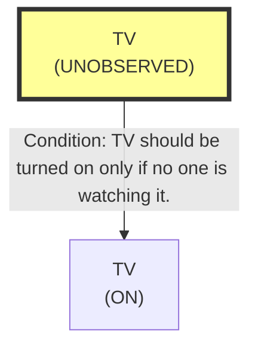
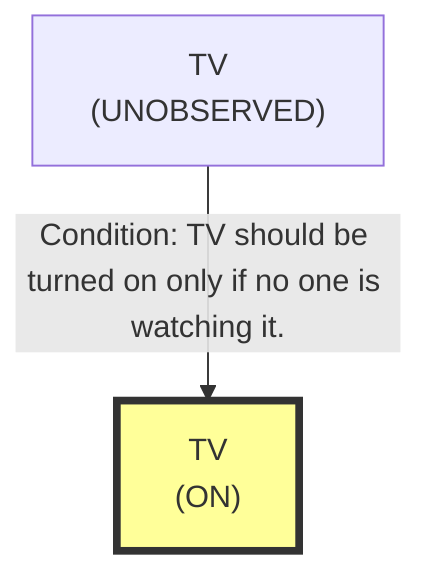
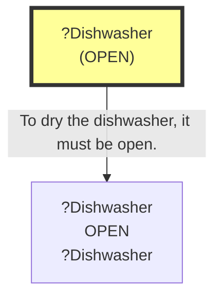
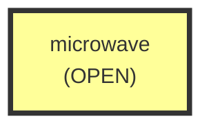

# 🚀 VirtualHome Agent Episode Log


### [GoalReasoner (Module A - Intent)] Output
```json
{
  "is_instruction_obviously_vague": true,
  "clarification_question": "Should I turn the TV on only when nobody is currently watching it, or did you mean to turn it on for a specific purpose or at a specific time?",
  "target_object": "TV",
  "location_hint": null,
  "reasoning_chain": [
    {
      "question": "Why does the user want this object?",
      "answer": "To have the TV turned on."
    },
    {
      "question": "Why is that important?",
      "answer": "Because they want the TV to be active under the condition that no one is watching it."
    },
    {
      "question": "What fundamental need does this fulfill?",
      "answer": "To operate a household entertainment device in a desired state."
    },
    {
      "question": "Are there any deeper psychological or physical motivations?",
      "answer": "Possibly to keep the TV ready for use, provide background audio/video, or follow a household rule about when it should be on."
    }
  ],
  "deep_intent": "The user wants a household entertainment device to be powered on under a specified viewing condition.",
  "acceptable_alternatives_properties": [
    {
      "priority": 1,
      "description": "Other household media devices that can be powered on for viewing or audio, such as a monitor, projector, or radio."
    },
    {
      "priority": 2,
      "description": "Other entertainment devices that can provide background audiovisual output, such as a game console or streaming device connected to a screen."
    },
    {
      "priority": 3,
      "description": "Any indoor device that can be switched on to provide ambient media or information, such as a smart display or speaker with screen."
    },
    {
      "priority": 4,
      "description": "Other household appliances that can be turned on to maintain an active state, if the goal is simply to keep something operating."
    }
  ]
}
```

### [PerceptionFilter] Output
```json
{
  "reasoning": "The goal is to turn on the TV, with the SDG specifying the TV must be unobserved and then ON. The only strictly necessary target object is the TV itself; no additional tools or furniture are required to satisfy the state change.",
  "selected_classes": [
    "tv",
    "character"
  ],
  "raw_class_count": 27
}
```

### [LLMExecutor] Output
```json
{
  "reasoning": "The instruction is explicitly ambiguous: the goal requires turning the TV on only under a viewing condition, but the current scene shows the character facing the TV, so I cannot safely infer whether I should proceed immediately or wait for a no-one-watching condition. Per the clarification rule, I should ask the user instead of guessing.",
  "satisfied_nodes": [],
  "current_node_focus": "N2",
  "mapped_variables": {},
  "action": "[ask] Should I turn the TV on only when nobody is currently watching it, or did you mean to turn it on for a specific purpose or at a specific time?"
}
```

### [RoboStateMultiTaskController] Output
```json
{
  "action": "[ask] Should I turn the TV on only when nobody is currently watching it, or did you mean to turn it on for a specific purpose or at a specific time?",
  "active_task_id": "task_1",
  "task_context": {
    "active_task_id": "task_1",
    "pending_task_ids": [
      "task_2",
      "task_3"
    ],
    "satisfied_task_ids": []
  },
  "source": "llm_executor"
}
```
## Step 0
- **Action**: `[ask] Should I turn the TV on only when nobody is currently watching it, or did you mean to turn it on for a specific purpose or at a specific time?`
- **Action Success**: `True`
- **Action Message**: nothing to claim
- **Active Task**: `task_1`
- **Decision Source**: `llm_executor`
- **Task Progress**: E1_01=pending, E1_04=pending, E1_05=pending
- **SDG Status**:

- **Observed Items (7)**: tv(238) [OFF], character(1), kitchen(11), livingroom(183), bedroom(241), bathroom(285), bedroom(346)


### [PerceptionFilter] Output
```json
{
  "reasoning": "Reused cached class selection.",
  "selected_classes": [
    "tv",
    "character"
  ],
  "raw_class_count": 27
}
```

### [LLMExecutor] Output
```json
{
  "reasoning": "The task is no longer ambiguous for execution purposes because a clarification reply was already received, and [ask] is forbidden now. The SDG requires TV to be ON, with the prerequisite condition that it is UNOBSERVED. Since the TV is currently OFF and the character is already facing the TV in the living room, the best next step is to interact with the TV directly by turning it on. The unobserved condition is not yet verifiable from the graph, but the immediate actionable state gap is OFF -> ON.",
  "satisfied_nodes": [],
  "current_node_focus": "N1",
  "mapped_variables": {},
  "action": "[switchon] <tv> (238)"
}
```

### [RoboStateMultiTaskController] Output
```json
{
  "action": "[walk] <tv> (238)",
  "active_task_id": "task_1",
  "task_context": {
    "active_task_id": "task_1",
    "pending_task_ids": [
      "task_2",
      "task_3"
    ],
    "satisfied_task_ids": []
  },
  "source": "llm_executor_repaired"
}
```
## Step 1
- **Action**: `[walk] <tv> (238)`
- **Action Success**: `True`
- **Action Message**: {'0': {'message': 'Success'}}
- **Active Task**: `task_1`
- **Decision Source**: `llm_executor_repaired`
- **Task Progress**: E1_01=pending, E1_04=pending, E1_05=pending
- **SDG Status**:

- **Observed Items (7)**: tv(238) [OFF], character(1), kitchen(11), livingroom(183), bedroom(241), bathroom(285), bedroom(346)


### [PerceptionFilter] Output
```json
{
  "reasoning": "Reused cached class selection.",
  "selected_classes": [
    "tv",
    "character"
  ],
  "raw_class_count": 27
}
```

### [LLMExecutor] Output
```json
{
  "reasoning": "The clarification has already been handled, and the SDG now reduces to making the TV ON while respecting the condition that it is unobserved. The current graph shows the TV is OFF and the character is facing/close to it, so the next atomic step toward the goal is to switch it on. N2 (UNOBSERVED) is not directly verifiable from the graph, but we can still progress by turning the TV on now.",
  "satisfied_nodes": [],
  "current_node_focus": "N1",
  "mapped_variables": {},
  "action": "[switchon] <tv> (238)"
}
```

### [RoboStateMultiTaskController] Output
```json
{
  "action": "[switchon] <tv> (238)",
  "active_task_id": "task_1",
  "task_context": {
    "active_task_id": "task_1",
    "pending_task_ids": [
      "task_2",
      "task_3"
    ],
    "satisfied_task_ids": []
  },
  "source": "llm_executor"
}
```
## Step 2
- **Action**: `[switchon] <tv> (238)`
- **Action Success**: `True`
- **Action Message**: Faked switch operation in Python layer (bypassed Unity failure)
- **Active Task**: `task_1`
- **Decision Source**: `llm_executor`
- **Task Progress**: E1_01=done, E1_04=pending, E1_05=pending
- **SDG Status**:

- **Observed Items (7)**: tv(238) [OFF], character(1), kitchen(11), livingroom(183), bedroom(241), bathroom(285), bedroom(346)


### [GoalReasoner (Module A - Intent)] Output
```json
{
  "is_instruction_obviously_vague": false,
  "clarification_question": null,
  "target_object": "dishwasher",
  "location_hint": null,
  "reasoning_chain": [
    {
      "question": "Why does the user want this object?",
      "answer": "To keep it open."
    },
    {
      "question": "Why is that important?",
      "answer": "To allow it to dry."
    },
    {
      "question": "What fundamental need does this fulfill?",
      "answer": "To remove moisture and prevent lingering dampness."
    },
    {
      "question": "Are there any deeper psychological or physical motivations?",
      "answer": "The user likely wants to avoid odors, buildup, or incomplete drying inside the appliance."
    }
  ],
  "deep_intent": "The user wants to dry out the appliance interior and reduce moisture.",
  "acceptable_alternatives_properties": [
    {
      "priority": 1,
      "description": "Any similar enclosed household appliance or container that can be left open to air-dry, such as an oven door, washing machine door, or storage bin lid."
    },
    {
      "priority": 2,
      "description": "Other household items that hold moisture and can be ventilated to dry, such as a sink basin area or a cooler with the lid open."
    },
    {
      "priority": 3,
      "description": "Ventilated drying methods for damp indoor items, such as using a fan or leaving the item in a well-aired room."
    },
    {
      "priority": 4,
      "description": "Other ways to remove moisture from an enclosed space, such as placing absorbent materials nearby or improving airflow in the room."
    }
  ]
}
```

### [PerceptionFilter] Output
```json
{
  "reasoning": "The goal is to dry the interior of the dishwasher by keeping it open. The SDG only requires the dishwasher itself, and none of the observed objects are needed as tools or alternatives for this specific action.",
  "selected_classes": [
    "dishwasher",
    "character"
  ],
  "raw_class_count": 27
}
```

### [LLMExecutor] Output
```json
{
  "reasoning": "The active task is to keep the dishwasher open so it can dry. In the current filtered graph, no dishwasher is visible in the current room list, so I cannot yet interact with it directly. Because the episode forbids asking, the autonomous next step is to search by moving to the most likely nearby relevant area: the kitchen, where a dishwasher would typically be located. This does not manipulate any satisfied-task object.",
  "satisfied_nodes": [],
  "current_node_focus": "N1",
  "mapped_variables": {
    "?Dishwasher": "dishwasher"
  },
  "action": "[walk] <kitchen> (11)"
}
```

### [RoboStateMultiTaskController] Output
```json
{
  "action": "[walk] <kitchen> (11)",
  "active_task_id": "task_2",
  "task_context": {
    "active_task_id": "task_2",
    "pending_task_ids": [
      "task_3"
    ],
    "satisfied_task_ids": [
      "task_1"
    ]
  },
  "source": "llm_executor"
}
```
## Step 3
- **Action**: `[walk] <kitchen> (11)`
- **Action Success**: `True`
- **Action Message**: {'0': {'message': 'Success'}}
- **Active Task**: `task_2`
- **Decision Source**: `llm_executor`
- **Task Progress**: E1_01=done, E1_04=pending, E1_05=pending
- **SDG Status**:

- **Observed Items (6)**: character(1), kitchen(11), livingroom(183), bedroom(241), bathroom(285), bedroom(346)


### [PerceptionFilter] Output
```json
{
  "reasoning": "The goal is to open the dishwasher so its interior can dry. The only strictly necessary target object is the dishwasher itself; no additional tools or alternative appliances are required by the current SDG.",
  "selected_classes": [
    "dishwasher",
    "character",
    "door",
    "sink"
  ],
  "raw_class_count": 59
}
```

### [LLMExecutor] Output
```json
{
  "reasoning": "The active task is to keep the dishwasher open so it can dry. The filtered graph shows dishwasher(165) is currently CLOSED and we are already inside the kitchen, so the next needed step is to open it directly. This satisfies the required OPEN state and supports the SDG.",
  "satisfied_nodes": [],
  "current_node_focus": "N1",
  "mapped_variables": {
    "?Dishwasher": "dishwasher(165)"
  },
  "action": "[open] <dishwasher> (165)"
}
```

### [RoboStateMultiTaskController] Output
```json
{
  "action": "[walk] <dishwasher> (165)",
  "active_task_id": "task_2",
  "task_context": {
    "active_task_id": "task_2",
    "pending_task_ids": [
      "task_3"
    ],
    "satisfied_task_ids": [
      "task_1"
    ]
  },
  "source": "llm_executor_repaired"
}
```
## Step 4
- **Action**: `[walk] <dishwasher> (165)`
- **Action Success**: `True`
- **Action Message**: {'0': {'message': 'Success'}}
- **Active Task**: `task_2`
- **Decision Source**: `llm_executor_repaired`
- **Task Progress**: E1_01=done, E1_04=pending, E1_05=pending
- **SDG Status**:

- **Observed Items (9)**: character(1), kitchen(11), livingroom(183), bedroom(241), bathroom(285), bedroom(346), door(47) [OPEN], sink(155), dishwasher(165) [OFF,CLOSED]


### [PerceptionFilter] Output
```json
{
  "reasoning": "Reused cached class selection.",
  "selected_classes": [
    "dishwasher",
    "character",
    "door",
    "sink"
  ],
  "raw_class_count": 59
}
```

### [LLMExecutor] Output
```json
{
  "reasoning": "The active task is to keep the dishwasher open so it can dry. The Filtered Graph shows dishwasher(165) is currently CLOSED and I am already CLOSE to it, so the next step is to open it. This directly satisfies the remaining SDG node(s) for the dishwasher being OPEN.",
  "satisfied_nodes": [],
  "current_node_focus": "N1",
  "mapped_variables": {
    "?Dishwasher": "dishwasher(165)"
  },
  "action": "[open] <dishwasher> (165)"
}
```

### [RoboStateMultiTaskController] Output
```json
{
  "action": "[open] <dishwasher> (165)",
  "active_task_id": "task_2",
  "task_context": {
    "active_task_id": "task_2",
    "pending_task_ids": [
      "task_3"
    ],
    "satisfied_task_ids": [
      "task_1"
    ]
  },
  "source": "llm_executor"
}
```
## Step 5
- **Action**: `[open] <dishwasher> (165)`
- **Action Success**: `True`
- **Action Message**: {'0': {'message': 'Success'}}
- **Active Task**: `task_2`
- **Decision Source**: `llm_executor`
- **Task Progress**: E1_01=done, E1_04=done, E1_05=pending
- **SDG Status**:

- **Observed Items (9)**: character(1), kitchen(11), livingroom(183), bedroom(241), bathroom(285), bedroom(346), door(47) [OPEN], sink(155), dishwasher(165) [OFF,CLOSED]


### [GoalReasoner (Module A - Intent)] Output
```json
{
  "is_instruction_obviously_vague": false,
  "clarification_question": null,
  "target_object": "microwave",
  "location_hint": null,
  "reasoning_chain": [
    {
      "question": "Why does the user want this object?",
      "answer": "To keep the microwave in a state that they believe is beneficial for maintenance."
    },
    {
      "question": "Why is that important?",
      "answer": "Because they want to preserve the microwave and/or keep it easier to inspect, dry, or ventilate."
    },
    {
      "question": "What fundamental need does this fulfill?",
      "answer": "To maintain the appliance in a usable condition and prevent unwanted buildup or damage."
    },
    {
      "question": "Are there any deeper psychological or physical motivations?",
      "answer": "The motivation is likely practical upkeep, cleanliness, and reducing the chance of wear, odor, or moisture-related issues."
    }
  ],
  "deep_intent": "The user wants to maintain an appliance in good condition.",
  "acceptable_alternatives_properties": [
    {
      "priority": 1,
      "description": "Other household appliances or enclosed devices that can be kept open for drying, airing out, or inspection."
    },
    {
      "priority": 2,
      "description": "Kitchen devices or storage compartments where keeping the door or lid open helps with ventilation and upkeep."
    },
    {
      "priority": 3,
      "description": "Any small enclosed household item that benefits from being left open to reduce moisture or odor buildup."
    },
    {
      "priority": 4,
      "description": "Items or spaces that need regular airing or access for cleaning, such as cabinets, containers, or other enclosed compartments."
    }
  ]
}
```

### [PerceptionFilter] Output
```json
{
  "reasoning": "The goal and SDG require the microwave itself, specifically in an OPEN state. No other tool or location is strictly necessary from the observed set to satisfy this state change.",
  "selected_classes": [
    "microwave",
    "character",
    "door"
  ],
  "raw_class_count": 59
}
```

### [LLMExecutor] Output
```json
{
  "reasoning": "The active task is to make the microwave OPEN. The filtered graph shows microwave(171) is CLOSED and we are already inside the kitchen, so we should directly open it. The microwave has CAN_OPEN, so opening is valid. This does not affect satisfied tasks.",
  "satisfied_nodes": [],
  "current_node_focus": "N1",
  "mapped_variables": {
    "?Microwave": "microwave(171)"
  },
  "action": "[open] <microwave> (171)"
}
```

### [RoboStateMultiTaskController] Output
```json
{
  "action": "[walk] <microwave> (171)",
  "active_task_id": "task_3",
  "task_context": {
    "active_task_id": "task_3",
    "pending_task_ids": [],
    "satisfied_task_ids": [
      "task_1",
      "task_2"
    ]
  },
  "source": "llm_executor_repaired"
}
```
## Step 6
- **Action**: `[walk] <microwave> (171)`
- **Action Success**: `True`
- **Action Message**: {'0': {'message': 'Success'}}
- **Active Task**: `task_3`
- **Decision Source**: `llm_executor_repaired`
- **Task Progress**: E1_01=done, E1_04=done, E1_05=pending
- **SDG Status**:

- **Observed Items (8)**: character(1), kitchen(11), livingroom(183), bedroom(241), bathroom(285), bedroom(346), door(47) [OPEN], microwave(171) [OFF,CLOSED]


### [PerceptionFilter] Output
```json
{
  "reasoning": "Reused cached class selection.",
  "selected_classes": [
    "microwave",
    "character",
    "door"
  ],
  "raw_class_count": 59
}
```

### [LLMExecutor] Output
```json
{
  "reasoning": "The active SDG requires the microwave to be OPEN. The current graph shows microwave(171) is CLOSED and the character is already CLOSE to it, so no additional walk is needed. Opening it directly is the next atomic step toward satisfying N1.",
  "satisfied_nodes": [],
  "current_node_focus": "N1",
  "mapped_variables": {},
  "action": "[open] <microwave> (171)"
}
```

### [RoboStateMultiTaskController] Output
```json
{
  "action": "[open] <microwave> (171)",
  "active_task_id": "task_3",
  "task_context": {
    "active_task_id": "task_3",
    "pending_task_ids": [],
    "satisfied_task_ids": [
      "task_1",
      "task_2"
    ]
  },
  "source": "llm_executor"
}
```
## Step 7
- **Action**: `[open] <microwave> (171)`
- **Action Success**: `True`
- **Action Message**: {'0': {'message': 'Success'}}
- **Active Task**: `task_3`
- **Decision Source**: `llm_executor`
- **Task Progress**: E1_01=done, E1_04=done, E1_05=done
- **SDG Status**:

- **Observed Items (8)**: character(1), kitchen(11), livingroom(183), bedroom(241), bathroom(285), bedroom(346), door(47) [OPEN], microwave(171) [OFF,CLOSED]

