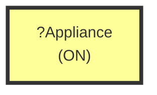
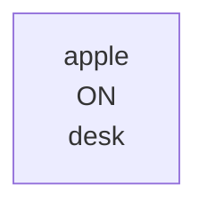
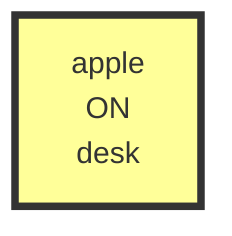
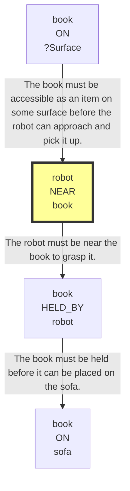
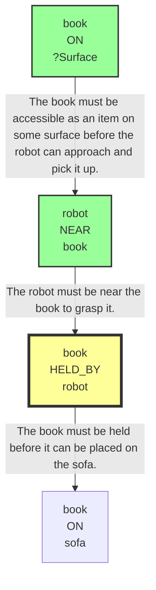
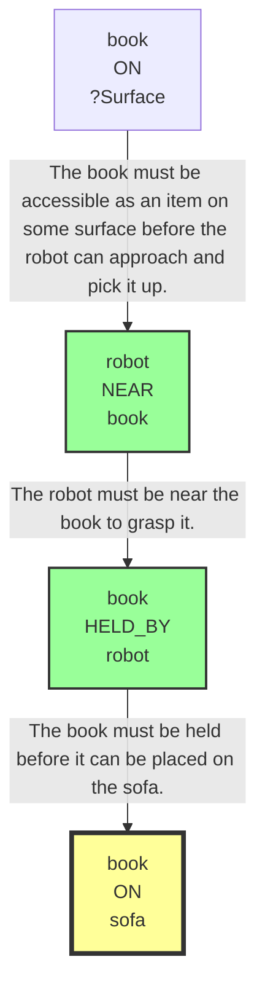

# 🚀 VirtualHome Agent Episode Log


### [GoalReasoner (Module A - Intent)] Output
```json
{
  "is_instruction_obviously_vague": false,
  "clarification_question": null,
  "target_object": "microwave",
  "location_hint": null,
  "reasoning_chain": [
    {
      "question": "Why does the user want this object?",
      "answer": "To have the microwave in an on state rather than off."
    },
    {
      "question": "Why is that important?",
      "answer": "Because the user wants the appliance to be available for use or already operating."
    },
    {
      "question": "What fundamental need does this fulfill?",
      "answer": "It fulfills the need to use the microwave for heating or cooking food."
    },
    {
      "question": "Are there any deeper psychological or physical motivations?",
      "answer": "The likely motivation is to prepare food or make it ready more quickly and conveniently."
    }
  ],
  "deep_intent": "The user wants the appliance to be powered on so it can be used for food preparation.",
  "acceptable_alternatives_properties": [
    {
      "priority": 1,
      "description": "Other indoor cooking or heating appliances that can warm food, such as a toaster oven, oven, or hot plate"
    },
    {
      "priority": 2,
      "description": "Any readily usable kitchen appliance that can perform food heating, such as an air fryer or countertop warmer"
    },
    {
      "priority": 3,
      "description": "Alternative methods to make food ready to eat, such as a kettle for hot beverages or a stovetop"
    },
    {
      "priority": 4,
      "description": "Any household means of preparing food more conveniently, such as using pre-cooked ready-to-eat food instead of heating it"
    }
  ]
}
```

### [PerceptionFilter] Output
```json
{
  "reasoning": "The goal is to have a microwave appliance turned ON. The minimum required selection is the target appliance itself, plus close functional alternatives for food heating per the intent. No locations or extra tools are required by the SDG beyond the appliance state.",
  "selected_classes": [
    "dishwasher",
    "character",
    "door",
    "stove",
    "toaster",
    "microwave",
    "fryingpan",
    "cookingpot",
    "plate",
    "coffeemaker",
    "fridge"
  ],
  "raw_class_count": 45
}
```

### [LLMExecutor] Output
```json
{
  "reasoning": "The active task is to get the microwave into an ON state. In the filtered graph, microwave(234) is present, OFF, and has HAS_SWITCH and HAS_PLUG. Since it is an appliance with a plug, the correct progression is to first get near it before switching it on. No prerequisite object handling is needed.",
  "satisfied_nodes": [],
  "current_node_focus": "N1",
  "mapped_variables": {
    "?Appliance": "microwave(234)"
  },
  "action": "[walk] <microwave> (234)"
}
```

### [RoboStateMultiTaskController] Output
```json
{
  "action": "[walk] <microwave> (234)",
  "active_task_id": "task_1",
  "task_context": {
    "active_task_id": "task_1",
    "pending_task_ids": [
      "task_2",
      "task_3"
    ],
    "satisfied_task_ids": []
  },
  "source": "llm_executor"
}
```
## Step 0
- **Action**: `[walk] <microwave> (234)`
- **Action Success**: `True`
- **Action Message**: {'0': {'message': 'Success'}}
- **Active Task**: `task_1`
- **Decision Source**: `llm_executor`
- **Task Progress**: E1_19=pending, E1_02=pending, E1_03=pending
- **SDG Status**:

- **Observed Items (22)**: door(145) [OPEN], door(146) [OPEN], fryingpan(161), cookingpot(162) [CLOSED], plate(170), plate(171), plate(172), plate(173), plate(177), plate(178), plate(184), fridge(225) [CLOSED], stove(226) [OFF,CLOSED], dishwasher(228) [CLOSED,OFF], coffeemaker(229) [OFF]...


### [PerceptionFilter] Output
```json
{
  "reasoning": "Reused cached class selection.",
  "selected_classes": [
    "dishwasher",
    "character",
    "door",
    "stove",
    "toaster",
    "microwave",
    "fryingpan",
    "cookingpot",
    "plate",
    "coffeemaker",
    "fridge"
  ],
  "raw_class_count": 45
}
```

### [LLMExecutor] Output
```json
{
  "reasoning": "The active goal is to get the microwave into the ON state. The filtered graph shows microwave(234) is already CLOSE to the character and has HAS_PLUG, so the next required step is to turn it on. It is currently OFF and CLOSED; opening is not required just to satisfy the ON state, and we are already near it, so switching it on is the most direct action.",
  "satisfied_nodes": [],
  "current_node_focus": "N1",
  "mapped_variables": {
    "?Appliance": "microwave(234)"
  },
  "action": "[switchon] <microwave> (234)"
}
```

### [RoboStateMultiTaskController] Output
```json
{
  "action": "[switchon] <microwave> (234)",
  "active_task_id": "task_1",
  "task_context": {
    "active_task_id": "task_1",
    "pending_task_ids": [
      "task_2",
      "task_3"
    ],
    "satisfied_task_ids": []
  },
  "source": "llm_executor"
}
```
## Step 1
- **Action**: `[switchon] <microwave> (234)`
- **Action Success**: `True`
- **Action Message**: Faked switch operation in Python layer (bypassed Unity failure)
- **Active Task**: `task_1`
- **Decision Source**: `llm_executor`
- **Task Progress**: E1_19=done, E1_02=pending, E1_03=pending
- **SDG Status**:

- **Observed Items (22)**: door(145) [OPEN], door(146) [OPEN], fryingpan(161), cookingpot(162) [CLOSED], plate(170), plate(171), plate(172), plate(173), plate(177), plate(178), plate(184), fridge(225) [CLOSED], stove(226) [OFF,CLOSED], dishwasher(228) [CLOSED,OFF], coffeemaker(229) [OFF]...


### [GoalReasoner (Module A - Intent)] Output
```json
{
  "is_instruction_obviously_vague": false,
  "clarification_question": null,
  "target_object": "apple",
  "location_hint": "desk",
  "reasoning_chain": [
    {
      "question": "Why does the user want this object?",
      "answer": "To have the apple brought to their desk."
    },
    {
      "question": "Why is that important?",
      "answer": "It lets the user access the apple in the place where they want it."
    },
    {
      "question": "What fundamental need does this fulfill?",
      "answer": "It fulfills the need to obtain and have a desired food item available in a specific location."
    },
    {
      "question": "Are there any deeper psychological or physical motivations?",
      "answer": "The primary motivation is likely convenience and readiness to eat or use the apple without needing to retrieve it later."
    }
  ],
  "deep_intent": "The user wants convenient access to a desired food item at their desk.",
  "acceptable_alternatives_properties": [
    {
      "priority": 1,
      "description": "Other readily available fruits that can be placed at the desk, such as a banana, pear, or orange."
    },
    {
      "priority": 2,
      "description": "Other whole snack foods or portable ready-to-eat foods that can serve a similar purpose, such as a granola bar or packaged snack."
    },
    {
      "priority": 3,
      "description": "Any accessible food item suitable for keeping at a desk for later consumption."
    },
    {
      "priority": 4,
      "description": "A non-perishable snack or beverage that provides a similar convenience of having something consumable nearby."
    }
  ]
}
```

### [RoboStateMultiTaskController] Output
```json
{
  "action": "[walk] <bathroom> (11)",
  "active_task_id": "task_2",
  "task_context": {
    "active_task_id": "task_2",
    "pending_task_ids": [
      "task_3"
    ],
    "satisfied_task_ids": [
      "task_1"
    ]
  },
  "source": "room_frontier"
}
```
## Step 2
- **Action**: `[walk] <bathroom> (11)`
- **Action Success**: `True`
- **Action Message**: {'0': {'message': 'Success'}}
- **Active Task**: `task_2`
- **Decision Source**: `room_frontier`
- **Task Progress**: E1_19=done, E1_02=pending, E1_03=pending
- **SDG Status**:

- **Observed Items (125)**: floor(127), floor(128), floor(129), floor(130), floor(131), floor(132), floor(133), floor(134), floor(135), ceiling(136), ceiling(137), ceiling(138), ceiling(139), ceiling(140), ceiling(141)...


### [RoboStateMultiTaskController] Output
```json
{
  "action": "[walk] <bedroom> (50)",
  "active_task_id": "task_2",
  "task_context": {
    "active_task_id": "task_2",
    "pending_task_ids": [
      "task_3"
    ],
    "satisfied_task_ids": [
      "task_1"
    ]
  },
  "source": "room_frontier"
}
```
## Step 3
- **Action**: `[walk] <bedroom> (50)`
- **Action Success**: `True`
- **Action Message**: {'0': {'message': 'Success'}}
- **Active Task**: `task_2`
- **Decision Source**: `room_frontier`
- **Task Progress**: E1_19=done, E1_02=pending, E1_03=pending
- **SDG Status**:

- **Observed Items (163)**: floor(127), floor(128), floor(129), floor(130), floor(131), floor(132), floor(133), floor(134), floor(135), ceiling(136), ceiling(137), ceiling(138), ceiling(139), ceiling(140), ceiling(141)...


### [PerceptionFilter] Output
```json
{
  "reasoning": "The goal is to place the apple at the desk. The SDG explicitly requires the apple and the desk, so both must be kept. No other tools, locations, or backups are needed for this simple placement task.",
  "selected_classes": [
    "character",
    "apple",
    "desk"
  ],
  "raw_class_count": 82
}
```

### [LLMExecutor] Output
```json
{
  "reasoning": "The active goal is to have an apple ON the desk. The desk is currently CLOSED, so I need to open it before placing anything on it. The relevant desk instance is desk(80) in the bedroom, and no apple is currently held. Since putback requires first being near the destination and the desk is the destination surface, the next step should be to walk to the desk. This also sets up the required proximity for opening it next.",
  "satisfied_nodes": [],
  "current_node_focus": "N1",
  "mapped_variables": {
    "?TargetSurface": "desk(80)"
  },
  "action": "[walk] <desk> (80)"
}
```

### [RoboStateMultiTaskController] Output
```json
{
  "action": "[walk] <desk> (80)",
  "active_task_id": "task_2",
  "task_context": {
    "active_task_id": "task_2",
    "pending_task_ids": [
      "task_3"
    ],
    "satisfied_task_ids": [
      "task_1"
    ]
  },
  "source": "llm_executor"
}
```
## Step 4
- **Action**: `[walk] <desk> (80)`
- **Action Success**: `True`
- **Action Message**: {'0': {'message': 'Success'}}
- **Active Task**: `task_2`
- **Decision Source**: `llm_executor`
- **Task Progress**: E1_19=done, E1_02=pending, E1_03=pending
- **SDG Status**:

- **Observed Items (19)**: apple(249), apple(250), apple(251), apple(252), apple(253), apple(254), apple(255), apple(256), apple(257), apple(258), apple(259), apple(113), character(1), bathroom(11), bedroom(50)...


### [PerceptionFilter] Output
```json
{
  "reasoning": "Reused cached class selection.",
  "selected_classes": [
    "character",
    "apple",
    "desk"
  ],
  "raw_class_count": 82
}
```

### [LLMExecutor] Output
```json
{
  "reasoning": "The active goal is to place an apple on the desk. We are already close to desk(80), but the desk is currently CLOSED and it is the required destination surface. Since apples are movable and can be placed on a flat surface, the first needed step toward satisfying N1 is to open the desk so it can be used properly as the target surface. The most suitable apple candidate is apple(114), which is in the bedroom and not part of any satisfied task.",
  "satisfied_nodes": [],
  "current_node_focus": "N1",
  "mapped_variables": {
    "?TargetApple": "apple(114)",
    "?Desk": "desk(80)"
  },
  "action": "[open] <desk> (80)"
}
```

### [RoboStateMultiTaskController] Output
```json
{
  "action": "[open] <desk> (80)",
  "active_task_id": "task_2",
  "task_context": {
    "active_task_id": "task_2",
    "pending_task_ids": [
      "task_3"
    ],
    "satisfied_task_ids": [
      "task_1"
    ]
  },
  "source": "llm_executor"
}
```
## Step 5
- **Action**: `[open] <desk> (80)`
- **Action Success**: `False`
- **Action Message**: {'0': {'message': 'ScriptExcutor 0: EXECUTION_GENERAL: Script is impossible to execute\n\n'}}
- **Active Task**: `task_2`
- **Decision Source**: `llm_executor`
- **Task Progress**: E1_19=done, E1_02=pending, E1_03=pending
- **SDG Status**:

- **Observed Items (19)**: apple(249), apple(250), apple(251), apple(252), apple(253), apple(254), apple(255), apple(256), apple(257), apple(258), apple(259), apple(113), character(1), bathroom(11), bedroom(50)...


### [PerceptionFilter] Output
```json
{
  "reasoning": "Reused cached class selection.",
  "selected_classes": [
    "character",
    "apple",
    "desk"
  ],
  "raw_class_count": 82
}
```

### [LLMExecutor] Output
```json
{
  "reasoning": "The active goal is to have an apple ON the desk. The desk is currently CLOSED and we are already CLOSE to it, so the failed open attempt suggests the desk is not a valid openable container for this task. Since the desk is a surface and the apple is inside the kitchen, the next progress step is to go to a reachable apple instance and bring it to the desk. Because we are not near any apple yet and must explicitly walk before grabbing, I will move to the closest/available apple in the kitchen, binding the target apple variable to a specific grabbable apple. Apple(114) is in the bedroom, but the task asks for an apple at the desk; any apple is acceptable only if needed, but the primary target remains apple on desk. The immediate necessary step is to approach an apple in the kitchen so it can later be grabbed.",
  "satisfied_nodes": [],
  "current_node_focus": "N1",
  "mapped_variables": {
    "?Apple": "apple(249)",
    "?Desk": "desk(80)"
  },
  "action": "[walk] <apple> (249)"
}
```

### [RoboStateMultiTaskController] Output
```json
{
  "action": "[walk] <apple> (249)",
  "active_task_id": "task_2",
  "task_context": {
    "active_task_id": "task_2",
    "pending_task_ids": [
      "task_3"
    ],
    "satisfied_task_ids": [
      "task_1"
    ]
  },
  "source": "llm_executor"
}
```
## Step 6
- **Action**: `[walk] <apple> (249)`
- **Action Success**: `False`
- **Action Message**: {'0': {'message': 'ScriptExcutor 0: PROCESS WALK: Can not select object: apple. REASON: No interaction positions\nEXECUTION_GENERAL: Script is impossible to execute\n\n'}}
- **Active Task**: `task_2`
- **Decision Source**: `llm_executor`
- **Task Progress**: E1_19=done, E1_02=pending, E1_03=pending
- **SDG Status**:

- **Observed Items (19)**: apple(249), apple(250), apple(251), apple(252), apple(253), apple(254), apple(255), apple(256), apple(257), apple(258), apple(259), apple(113), character(1), bathroom(11), bedroom(50)...


### [GoalReasoner (Module A - Intent)] Output
```json
{
  "is_instruction_obviously_vague": false,
  "clarification_question": null,
  "target_object": "book",
  "location_hint": "sofa",
  "reasoning_chain": [
    {
      "question": "Why does the user want this object?",
      "answer": "To move a book that is found in an unorganized state to the sofa."
    },
    {
      "question": "Why is that important?",
      "answer": "It likely helps organize or relocate the book to a preferred resting place."
    },
    {
      "question": "What fundamental need does this fulfill?",
      "answer": "It fulfills the need to organize and place a reading item in a desired indoor location."
    },
    {
      "question": "Are there any deeper psychological or physical motivations?",
      "answer": "The user may want the space tidied, the item made accessible, or the book positioned for later use."
    }
  ],
  "deep_intent": "The user wants to organize and relocate an item to a preferred indoor resting place.",
  "acceptable_alternatives_properties": [
    {
      "priority": 1,
      "description": "Other similarly sized reading materials, such as magazines or notebooks, that can be moved to the sofa"
    },
    {
      "priority": 2,
      "description": "Other paper-based personal items that are out of place and can be tidied onto the sofa"
    },
    {
      "priority": 3,
      "description": "Light household items that are being organized and relocated within the room"
    },
    {
      "priority": 4,
      "description": "Other portable objects that can be set down on the sofa as part of tidying or staging"
    }
  ]
}
```

### [PerceptionFilter] Output
```json
{
  "reasoning": "The goal is to move the book onto the sofa, so the minimum needed classes are the target object and the destination location. The SDG also requires the book to be accessible/held, but no extra tool is needed beyond the book itself and the sofa as the placement surface.",
  "selected_classes": [
    "paper",
    "character",
    "door",
    "book",
    "sofa"
  ],
  "raw_class_count": 82
}
```

### [LLMExecutor] Output
```json
{
  "reasoning": "The active goal is to get a book onto the sofa. In the current graph, book(104) is in the bedroom and the sofa(85) is also in the bedroom, so the book is accessible there. Since the robot is already inside the bedroom, the next required step to satisfy N4 (robot near book) is to move near the book before attempting to grab it.",
  "satisfied_nodes": [],
  "current_node_focus": "N4",
  "mapped_variables": {},
  "action": "[walk] <book> (104)"
}
```

### [RoboStateMultiTaskController] Output
```json
{
  "action": "[walk] <book> (104)",
  "active_task_id": "task_3",
  "task_context": {
    "active_task_id": "task_3",
    "pending_task_ids": [
      "task_2"
    ],
    "satisfied_task_ids": [
      "task_1"
    ]
  },
  "source": "llm_executor"
}
```
## Step 7
- **Action**: `[walk] <book> (104)`
- **Action Success**: `True`
- **Action Message**: {'0': {'message': 'Success'}}
- **Active Task**: `task_3`
- **Decision Source**: `llm_executor`
- **Task Progress**: E1_19=done, E1_02=pending, E1_03=pending
- **SDG Status**:

- **Observed Items (13)**: door(145) [OPEN], door(146) [OPEN], book(163) [CLOSED], book(164) [CLOSED], character(1), bathroom(11), bedroom(50), kitchen(126), livingroom(261), door(47) [OPEN], sofa(85), book(104) [CLOSED], paper(109)


### [PerceptionFilter] Output
```json
{
  "reasoning": "Reused cached class selection.",
  "selected_classes": [
    "paper",
    "character",
    "door",
    "book",
    "sofa"
  ],
  "raw_class_count": 82
}
```

### [LLMExecutor] Output
```json
{
  "reasoning": "The active task is to place a book on the sofa. The current graph shows book(104) is in the bedroom and the robot is close to it, so the next required step is to grab it. This satisfies the prerequisite of holding the book before moving it to the sofa. I will bind the target book to book(104).",
  "satisfied_nodes": [
    "N4",
    "N3"
  ],
  "current_node_focus": "N2",
  "mapped_variables": {
    "?Surface": "book(104)"
  },
  "action": "[grab] <book> (104)"
}
```

### [RoboStateMultiTaskController] Output
```json
{
  "action": "[grab] <book> (104)",
  "active_task_id": "task_3",
  "task_context": {
    "active_task_id": "task_3",
    "pending_task_ids": [
      "task_2"
    ],
    "satisfied_task_ids": [
      "task_1"
    ]
  },
  "source": "llm_executor"
}
```
## Step 8
- **Action**: `[grab] <book> (104)`
- **Action Success**: `True`
- **Action Message**: {'0': {'message': 'Success'}}
- **Active Task**: `task_3`
- **Decision Source**: `llm_executor`
- **Task Progress**: E1_19=done, E1_02=pending, E1_03=pending
- **SDG Status**:

- **Observed Items (13)**: door(145) [OPEN], door(146) [OPEN], book(163) [CLOSED], book(164) [CLOSED], character(1), bathroom(11), bedroom(50), kitchen(126), livingroom(261), door(47) [OPEN], sofa(85), book(104) [CLOSED], paper(109)


### [PerceptionFilter] Output
```json
{
  "reasoning": "Reused cached class selection.",
  "selected_classes": [
    "paper",
    "character",
    "door",
    "book",
    "sofa"
  ],
  "raw_class_count": 82
}
```

### [LLMExecutor] Output
```json
{
  "reasoning": "The active task is to place a book on the sofa. We are already holding book(104) from the previous successful grab, and the sofa(85) is the target surface. To satisfy the final goal node N1, the next required step is to move close to the sofa before putting the book down. Since we must explicitly walk to the destination before any putback action, the best next atomic action is to walk to the sofa.",
  "satisfied_nodes": [
    "N2",
    "N4"
  ],
  "current_node_focus": "N1",
  "mapped_variables": {},
  "action": "[walk] <sofa> (85)"
}
```

### [RoboStateMultiTaskController] Output
```json
{
  "action": "[walk] <sofa> (85)",
  "active_task_id": "task_3",
  "task_context": {
    "active_task_id": "task_3",
    "pending_task_ids": [
      "task_2"
    ],
    "satisfied_task_ids": [
      "task_1"
    ]
  },
  "source": "llm_executor"
}
```
## Step 9
- **Action**: `[walk] <sofa> (85)`
- **Action Success**: `True`
- **Action Message**: {'0': {'message': 'Success'}}
- **Active Task**: `task_3`
- **Decision Source**: `llm_executor`
- **Task Progress**: E1_19=done, E1_02=pending, E1_03=pending
- **SDG Status**:

- **Observed Items (13)**: door(145) [OPEN], door(146) [OPEN], book(163) [CLOSED], book(164) [CLOSED], character(1), bathroom(11), bedroom(50), kitchen(126), livingroom(261), door(47) [OPEN], sofa(85), book(104) [CLOSED], paper(109)


### [PerceptionFilter] Output
```json
{
  "reasoning": "Reused cached class selection.",
  "selected_classes": [
    "paper",
    "character",
    "door",
    "book",
    "sofa"
  ],
  "raw_class_count": 82
}
```

### [LLMExecutor] Output
```json
{
  "reasoning": "The active task is to place the book on the sofa. The current graph shows the robot is already close to sofa(85), and it is holding book(104) in the right hand. Since the destination surface is the sofa and we must be near the destination before placing, the next required step is to put the held book onto the sofa. This directly satisfies the final relation N1.",
  "satisfied_nodes": [
    "N2",
    "N4"
  ],
  "current_node_focus": "N1",
  "mapped_variables": {},
  "action": "[putback] <book> (104) <sofa> (85)"
}
```

### [RoboStateMultiTaskController] Output
```json
{
  "action": "[putback] <book> (104) <sofa> (85)",
  "active_task_id": "task_3",
  "task_context": {
    "active_task_id": "task_3",
    "pending_task_ids": [
      "task_2"
    ],
    "satisfied_task_ids": [
      "task_1"
    ]
  },
  "source": "llm_executor"
}
```
## Step 10
- **Action**: `[putback] <book> (104) <sofa> (85)`
- **Action Success**: `True`
- **Action Message**: {'0': {'message': 'Success'}}
- **Active Task**: `task_3`
- **Decision Source**: `llm_executor`
- **Task Progress**: E1_19=done, E1_02=pending, E1_03=done
- **SDG Status**:

- **Observed Items (13)**: door(145) [OPEN], door(146) [OPEN], book(163) [CLOSED], book(164) [CLOSED], character(1), bathroom(11), bedroom(50), kitchen(126), livingroom(261), door(47) [OPEN], sofa(85), book(104) [CLOSED], paper(109)


### [PerceptionFilter] Output
```json
{
  "reasoning": "Reused cached class selection.",
  "selected_classes": [
    "character",
    "apple",
    "desk"
  ],
  "raw_class_count": 82
}
```

### [LLMExecutor] Output
```json
{
  "reasoning": "The active goal is to have an apple on the desk. We are currently in the bedroom, and the desk(80) is a movable surface in the bedroom but it is CLOSED; however, for placing an apple on a flat surface, the desk itself does not need to be opened. The apple objects currently visible are all inside the kitchen, so the immediate next step is to go to the kitchen to approach an apple before grabbing it. I will target apple(249) as a valid grabbable instance.",
  "satisfied_nodes": [],
  "current_node_focus": "N1",
  "mapped_variables": {
    "?TargetApple": "apple(249)",
    "?Destination": "desk(80)"
  },
  "action": "[walk] <apple> (249)"
}
```

### [RoboStateMultiTaskController] Output
```json
{
  "action": "[walk] <apple> (249)",
  "active_task_id": "task_2",
  "task_context": {
    "active_task_id": "task_2",
    "pending_task_ids": [],
    "satisfied_task_ids": [
      "task_1",
      "task_3"
    ]
  },
  "source": "llm_executor"
}
```
## Step 11
- **Action**: `[walk] <apple> (249)`
- **Action Success**: `False`
- **Action Message**: {'0': {'message': 'ScriptExcutor 0: PROCESS WALK: Can not select object: apple. REASON: No interaction positions\nEXECUTION_GENERAL: Script is impossible to execute\n\n'}}
- **Active Task**: `task_2`
- **Decision Source**: `llm_executor`
- **Task Progress**: E1_19=done, E1_02=pending, E1_03=done
- **SDG Status**:

- **Observed Items (19)**: apple(249), apple(250), apple(251), apple(252), apple(253), apple(254), apple(255), apple(256), apple(257), apple(258), apple(259), apple(113), character(1), bathroom(11), bedroom(50)...


### [RoboStateMultiTaskController] Output
```json
{
  "action": "[walk] <livingroom> (261)",
  "active_task_id": null,
  "task_context": {
    "active_task_id": null,
    "pending_task_ids": [
      "task_2"
    ],
    "satisfied_task_ids": [
      "task_1",
      "task_3"
    ]
  },
  "source": "loop_recovery_room_revisit"
}
```
## Step 12
- **Action**: `[walk] <livingroom> (261)`
- **Action Success**: `True`
- **Action Message**: {'0': {'message': 'Success'}}
- **Decision Source**: `loop_recovery_room_revisit`
- **Task Progress**: E1_19=done, E1_02=pending, E1_03=done
- **SDG Status**:
No SDG active.
- **Observed Items (232)**: floor(127), floor(128), floor(129), floor(130), floor(131), floor(132), floor(133), floor(134), floor(135), ceiling(136), ceiling(137), ceiling(138), ceiling(139), ceiling(140), ceiling(141)...


### [PerceptionFilter] Output
```json
{
  "reasoning": "The goal and SDG require the apple and the desk as the location where it should be placed. No additional tools or receptacles are needed for this simple placement task.",
  "selected_classes": [
    "character",
    "apple",
    "desk"
  ],
  "raw_class_count": 86
}
```

### [LLMExecutor] Output
```json
{
  "reasoning": "The active goal is to have an apple on the desk. The current graph shows apple(114) is the only apple that is already close to the character, and it is inside the bedroom. Desk(80) is a valid desk target and is currently closed, but since it is a surface/movable desk and the goal only requires the apple to be ON the desk, the next necessary step is to get the apple first. I am currently in the livingroom, so I must walk to the apple before I can grab it. This avoids the earlier failed attempts to walk to inaccessible apples inside the kitchen. After this, I can grab apple(114) and later carry it to desk(80).",
  "satisfied_nodes": [],
  "current_node_focus": "N1",
  "mapped_variables": {},
  "action": "[walk] <apple> (114)"
}
```

### [RoboStateMultiTaskController] Output
```json
{
  "action": "[walk] <apple> (114)",
  "active_task_id": "task_2",
  "task_context": {
    "active_task_id": "task_2",
    "pending_task_ids": [],
    "satisfied_task_ids": [
      "task_1",
      "task_3"
    ]
  },
  "source": "llm_executor"
}
```
## Step 13
- **Action**: `[walk] <apple> (114)`
- **Action Success**: `True`
- **Action Message**: {'0': {'message': 'Success'}}
- **Active Task**: `task_2`
- **Decision Source**: `llm_executor`
- **Task Progress**: E1_19=done, E1_02=pending, E1_03=done
- **SDG Status**:

- **Observed Items (20)**: apple(249), apple(250), apple(251), apple(252), apple(253), apple(254), apple(255), apple(256), apple(257), apple(258), apple(259), apple(113), character(1), bathroom(11), bedroom(50)...


### [PerceptionFilter] Output
```json
{
  "reasoning": "Reused cached class selection.",
  "selected_classes": [
    "character",
    "apple",
    "desk"
  ],
  "raw_class_count": 86
}
```

### [LLMExecutor] Output
```json
{
  "reasoning": "The active goal is to place an apple on a desk. In the current graph, apple(114) is the nearest reachable apple because it is CLOSE to the character in the bedroom, while the other apples are in the kitchen. To progress, I should first pick up the close apple before moving it to a desk. The desk is currently CLOSED, but that only matters for interacting with its interior if needed; placing an apple ON the desk will require walking to the desk later, not opening it. Since I just walked to apple(114) in the previous step, the next atomic action should be grabbing it.",
  "satisfied_nodes": [],
  "current_node_focus": "N1",
  "mapped_variables": {},
  "action": "[grab] <apple> (114)"
}
```

### [RoboStateMultiTaskController] Output
```json
{
  "action": "[grab] <apple> (114)",
  "active_task_id": "task_2",
  "task_context": {
    "active_task_id": "task_2",
    "pending_task_ids": [],
    "satisfied_task_ids": [
      "task_1",
      "task_3"
    ]
  },
  "source": "llm_executor"
}
```
## Step 14
- **Action**: `[grab] <apple> (114)`
- **Action Success**: `True`
- **Action Message**: {'0': {'message': 'Success'}}
- **Active Task**: `task_2`
- **Decision Source**: `llm_executor`
- **Task Progress**: E1_19=done, E1_02=pending, E1_03=done
- **SDG Status**:

- **Observed Items (20)**: apple(249), apple(250), apple(251), apple(252), apple(253), apple(254), apple(255), apple(256), apple(257), apple(258), apple(259), apple(113), character(1), bathroom(11), bedroom(50)...


### [PerceptionFilter] Output
```json
{
  "reasoning": "Reused cached class selection.",
  "selected_classes": [
    "character",
    "apple",
    "desk"
  ],
  "raw_class_count": 86
}
```

### [LLMExecutor] Output
```json
{
  "reasoning": "The active goal is to have an apple ON the desk. We currently hold apple(114) in the right hand and are close to it in the bedroom, but the relevant desk for the task is desk(80) in the bedroom. Since placement on a surface requires being at the destination first, the next step is to walk to desk(80). The desk is a flat surface, so no opening is needed for placement. Once there, the next step after this will be putback of the held apple onto the desk.",
  "satisfied_nodes": [],
  "current_node_focus": "N1",
  "mapped_variables": {},
  "action": "[walk] <desk> (80)"
}
```

### [RoboStateMultiTaskController] Output
```json
{
  "action": "[walk] <desk> (80)",
  "active_task_id": "task_2",
  "task_context": {
    "active_task_id": "task_2",
    "pending_task_ids": [],
    "satisfied_task_ids": [
      "task_1",
      "task_3"
    ]
  },
  "source": "llm_executor"
}
```
## Step 15
- **Action**: `[walk] <desk> (80)`
- **Action Success**: `True`
- **Action Message**: {'0': {'message': 'Success'}}
- **Active Task**: `task_2`
- **Decision Source**: `llm_executor`
- **Task Progress**: E1_19=done, E1_02=pending, E1_03=done
- **SDG Status**:

- **Observed Items (20)**: apple(249), apple(250), apple(251), apple(252), apple(253), apple(254), apple(255), apple(256), apple(257), apple(258), apple(259), apple(113), character(1), bathroom(11), bedroom(50)...


### [PerceptionFilter] Output
```json
{
  "reasoning": "Reused cached class selection.",
  "selected_classes": [
    "character",
    "apple",
    "desk"
  ],
  "raw_class_count": 86
}
```

### [LLMExecutor] Output
```json
{
  "reasoning": "The active goal is to have an apple ON the desk. The current graph shows the character is already CLOSE to desk(80) and holding apple(114) in the right hand. Since the desk is a flat surface and the apple is already in hand, the next required step is to place the apple onto the desk. Desk(80) is the correct target because it is explicitly close to the character and matches the location hint.",
  "satisfied_nodes": [],
  "current_node_focus": "N1",
  "mapped_variables": {
    "?Surface": "desk(80)"
  },
  "action": "[putback] <apple> (114) <desk> (80)"
}
```

### [RoboStateMultiTaskController] Output
```json
{
  "action": "[putback] <apple> (114) <desk> (80)",
  "active_task_id": "task_2",
  "task_context": {
    "active_task_id": "task_2",
    "pending_task_ids": [],
    "satisfied_task_ids": [
      "task_1",
      "task_3"
    ]
  },
  "source": "llm_executor"
}
```
## Step 16
- **Action**: `[putback] <apple> (114) <desk> (80)`
- **Action Success**: `True`
- **Action Message**: {'0': {'message': 'Success'}}
- **Active Task**: `task_2`
- **Decision Source**: `llm_executor`
- **Task Progress**: E1_19=done, E1_02=done, E1_03=done
- **SDG Status**:

- **Observed Items (20)**: apple(249), apple(250), apple(251), apple(252), apple(253), apple(254), apple(255), apple(256), apple(257), apple(258), apple(259), apple(113), character(1), bathroom(11), bedroom(50)...

