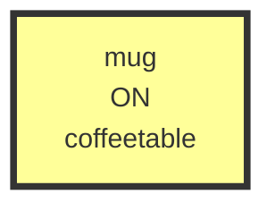
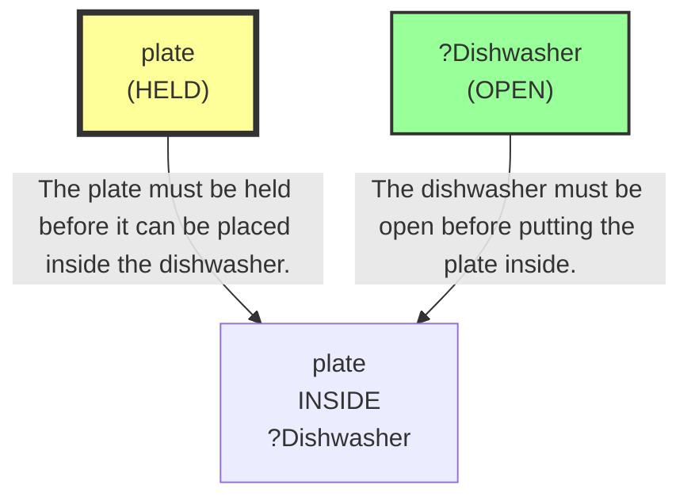
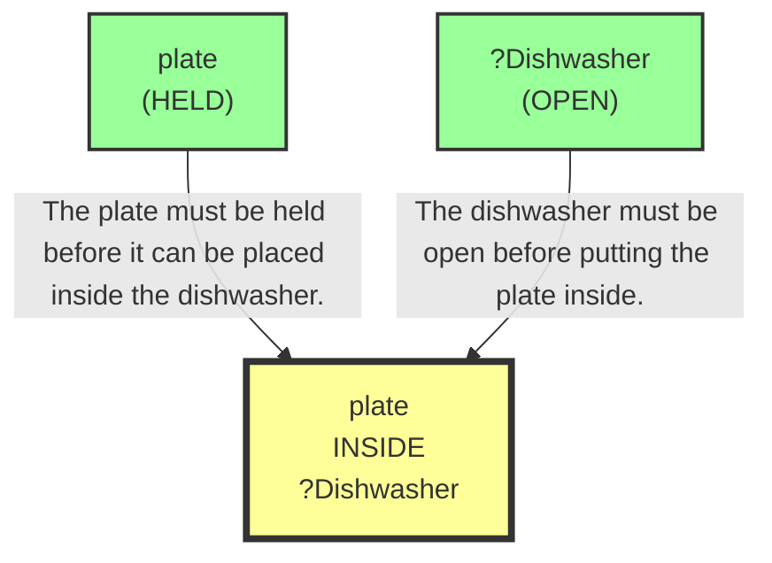
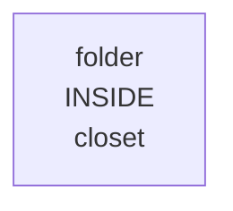
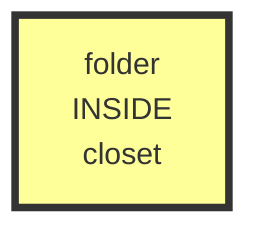

# 🚀 VirtualHome Agent Episode Log


### [GoalReasoner (Module A - Intent)] Output
```json
{
  "is_instruction_obviously_vague": false,
  "clarification_question": null,
  "target_object": "book",
  "location_hint": "sofa",
  "reasoning_chain": [
    {
      "question": "Why does the user want this object?",
      "answer": "To move a book from an unorganized place to the sofa."
    },
    {
      "question": "Why is that important?",
      "answer": "To place the book in a desired resting or storage area."
    },
    {
      "question": "What fundamental need does this fulfill?",
      "answer": "It helps organize or relocate reading material to a preferred location."
    },
    {
      "question": "Are there any deeper psychological or physical motivations?",
      "answer": "The user may want to tidy the environment, make the book easier to access, or keep it in a comfortable nearby spot."
    }
  ],
  "deep_intent": "The user wants to organize and relocate reading material to a preferred nearby resting area.",
  "acceptable_alternatives_properties": [
    {
      "priority": 1,
      "description": "Other books or similar reading materials, such as magazines or notebooks, that can be moved to the sofa."
    },
    {
      "priority": 2,
      "description": "Other paper-based items that are being kept in an unorganized place and can be tidied to the sofa."
    },
    {
      "priority": 3,
      "description": "Other lightweight personal items commonly kept in living spaces that can be relocated for organization."
    },
    {
      "priority": 4,
      "description": "If the goal is general tidiness, nearby misplaced household items that can be gathered and placed in the same resting area."
    }
  ]
}
```

### [RoboStateMultiTaskController] Output
```json
{
  "action": "[walk] <kitchen> (11)",
  "active_task_id": "task_2",
  "task_context": {
    "active_task_id": "task_2",
    "pending_task_ids": [
      "task_1",
      "task_3",
      "task_4",
      "task_5"
    ],
    "satisfied_task_ids": []
  },
  "source": "room_frontier"
}
```
## Step 0
- **Action**: `[walk] <kitchen> (11)`
- **Action Success**: `True`
- **Action Message**: {'0': {'message': 'Success'}}
- **Active Task**: `task_2`
- **Decision Source**: `room_frontier`
- **Task Progress**: E1_11=pending, E1_03=pending, E1_07=pending, E1_15=pending, E1_18=pending
- **SDG Status**:

- **Observed Items (39)**: floor(242), floor(243), floor(244), floor(245), ceiling(246), ceiling(247), ceiling(248), ceiling(249), wall(250), wall(251), wall(252), wall(253), door(254) [OPEN], ceilinglamp(255), tablelamp(256) [ON]...


### [RoboStateMultiTaskController] Output
```json
{
  "action": "[walk] <livingroom> (183)",
  "active_task_id": "task_2",
  "task_context": {
    "active_task_id": "task_2",
    "pending_task_ids": [
      "task_1",
      "task_3",
      "task_4",
      "task_5"
    ],
    "satisfied_task_ids": []
  },
  "source": "room_frontier"
}
```
## Step 1
- **Action**: `[walk] <livingroom> (183)`
- **Action Success**: `True`
- **Action Message**: {'0': {'message': 'Success'}}
- **Active Task**: `task_2`
- **Decision Source**: `room_frontier`
- **Task Progress**: E1_11=pending, E1_03=pending, E1_07=pending, E1_15=pending, E1_18=pending
- **SDG Status**:

- **Observed Items (194)**: floor(242), floor(243), floor(244), floor(245), ceiling(246), ceiling(247), ceiling(248), ceiling(249), wall(250), wall(251), wall(252), wall(253), door(254) [OPEN], ceilinglamp(255), tablelamp(256) [ON]...


### [PerceptionFilter] Output
```json
{
  "reasoning": "The goal is to place the book on the sofa, so the only strictly necessary objects are the target item and the destination location. No extra tools or alternative receptacles are required for this simple relocation task.",
  "selected_classes": [
    "book",
    "character",
    "sofa"
  ],
  "raw_class_count": 66
}
```

### [LLMExecutor] Output
```json
{
  "reasoning": "The active goal is to place a book on the sofa. We are already in the livingroom, and the sofa is available here. The closest relevant book is book(105), which is marked CLOSE to the character, so it is the best candidate to grab and move. Since placing onto a surface requires the object to be held first, the next atomic step is to grab this nearby book. The sofa placement will come after that in subsequent steps.",
  "satisfied_nodes": [],
  "current_node_focus": "N1",
  "mapped_variables": {
    "?Container": "sofa(214)"
  },
  "action": "[grab] <book> (105)"
}
```

### [RoboStateMultiTaskController] Output
```json
{
  "action": "[grab] <book> (105)",
  "active_task_id": "task_2",
  "task_context": {
    "active_task_id": "task_2",
    "pending_task_ids": [
      "task_1",
      "task_3",
      "task_4",
      "task_5"
    ],
    "satisfied_task_ids": []
  },
  "source": "llm_executor"
}
```
## Step 2
- **Action**: `[grab] <book> (105)`
- **Action Success**: `True`
- **Action Message**: {'0': {'message': 'Success'}}
- **Active Task**: `task_2`
- **Decision Source**: `llm_executor`
- **Task Progress**: E1_11=pending, E1_03=pending, E1_07=pending, E1_15=pending, E1_18=pending
- **SDG Status**:

- **Observed Items (11)**: book(275) [CLOSED], character(1), kitchen(11), livingroom(183), bedroom(241), bathroom(285), bedroom(346), sofa(214), book(229) [CLOSED], book(230) [CLOSED], book(105) [CLOSED]


### [PerceptionFilter] Output
```json
{
  "reasoning": "Reused cached class selection.",
  "selected_classes": [
    "book",
    "character",
    "sofa"
  ],
  "raw_class_count": 66
}
```

### [LLMExecutor] Output
```json
{
  "reasoning": "The active goal is to place a book on the sofa. The held book(105) is already in hand and the sofa(214) is the required destination surface in the living room. Because putback requires being explicitly near the destination first, the next atomic step is to walk to the sofa.",
  "satisfied_nodes": [],
  "current_node_focus": "N1",
  "mapped_variables": {},
  "action": "[walk] <sofa> (214)"
}
```

### [RoboStateMultiTaskController] Output
```json
{
  "action": "[walk] <sofa> (214)",
  "active_task_id": "task_2",
  "task_context": {
    "active_task_id": "task_2",
    "pending_task_ids": [
      "task_1",
      "task_3",
      "task_4",
      "task_5"
    ],
    "satisfied_task_ids": []
  },
  "source": "llm_executor"
}
```
## Step 3
- **Action**: `[walk] <sofa> (214)`
- **Action Success**: `True`
- **Action Message**: {'0': {'message': 'Success'}}
- **Active Task**: `task_2`
- **Decision Source**: `llm_executor`
- **Task Progress**: E1_11=pending, E1_03=pending, E1_07=pending, E1_15=pending, E1_18=pending
- **SDG Status**:

- **Observed Items (11)**: book(275) [CLOSED], character(1), kitchen(11), livingroom(183), bedroom(241), bathroom(285), bedroom(346), sofa(214), book(229) [CLOSED], book(230) [CLOSED], book(105) [CLOSED]


### [PerceptionFilter] Output
```json
{
  "reasoning": "Reused cached class selection.",
  "selected_classes": [
    "book",
    "character",
    "sofa"
  ],
  "raw_class_count": 66
}
```

### [LLMExecutor] Output
```json
{
  "reasoning": "The active task is to place a book on the sofa. The current graph shows I am already close to sofa(214), and I am holding book(105). The remaining gap is the required ON relation, which can be satisfied by placing the held book onto the sofa. Since putting onto a surface requires being near the surface and I already am, the next atomic action is to put the book back onto the sofa.",
  "satisfied_nodes": [],
  "current_node_focus": "N1",
  "mapped_variables": {},
  "action": "[putback] <book> (105) <sofa> (214)"
}
```

### [RoboStateMultiTaskController] Output
```json
{
  "action": "[putback] <book> (105) <sofa> (214)",
  "active_task_id": "task_2",
  "task_context": {
    "active_task_id": "task_2",
    "pending_task_ids": [
      "task_1",
      "task_3",
      "task_4",
      "task_5"
    ],
    "satisfied_task_ids": []
  },
  "source": "llm_executor"
}
```
## Step 4
- **Action**: `[putback] <book> (105) <sofa> (214)`
- **Action Success**: `True`
- **Action Message**: {'0': {'message': 'Success'}}
- **Active Task**: `task_2`
- **Decision Source**: `llm_executor`
- **Task Progress**: E1_11=pending, E1_03=done, E1_07=pending, E1_15=pending, E1_18=pending
- **SDG Status**:

- **Observed Items (11)**: book(275) [CLOSED], character(1), kitchen(11), livingroom(183), bedroom(241), bathroom(285), bedroom(346), sofa(214), book(229) [CLOSED], book(230) [CLOSED], book(105) [CLOSED]


### [GoalReasoner (Module A - Intent)] Output
```json
{
  "is_instruction_obviously_vague": false,
  "clarification_question": null,
  "target_object": "mug",
  "location_hint": "coffeetable",
  "reasoning_chain": [
    {
      "question": "Why does the user want this object?",
      "answer": "To keep the mug in a specific place."
    },
    {
      "question": "Why is that important?",
      "answer": "To maintain the mug's position on the coffee table."
    },
    {
      "question": "What fundamental need does this fulfill?",
      "answer": "To organize and manage the placement of a household item."
    },
    {
      "question": "Are there any deeper psychological or physical motivations?",
      "answer": "The user likely wants convenient access to the mug and a tidy, consistent arrangement in the room."
    }
  ],
  "deep_intent": "The user wants to keep a household item consistently placed in a specific location for organization and easy access.",
  "acceptable_alternatives_properties": [
    {
      "priority": 1,
      "description": "Other drink containers such as a cup, tumbler, or glass kept on the coffee table"
    },
    {
      "priority": 2,
      "description": "Other small tabletop items that can be stably placed on the coffee table"
    },
    {
      "priority": 3,
      "description": "Nearby household items that serve similar everyday use and can remain accessible"
    },
    {
      "priority": 4,
      "description": "Any commonly used personal item that can be kept in a designated spot for organization"
    }
  ]
}
```

### [PerceptionFilter] Output
```json
{
  "reasoning": "The goal is to keep the mug on the coffeetable, so the only strictly necessary classes are the target object and the location surface. No extra tools or alternatives are required for this placement task.",
  "selected_classes": [
    "character",
    "mug",
    "coffeetable"
  ],
  "raw_class_count": 66
}
```

### [LLMExecutor] Output
```json
{
  "reasoning": "The active goal is to have the mug on the coffeetable. The coffee table is already close to the character, but the mug is currently inside the kitchen and not in hand. Since I must be adjacent to an object before grabbing it, the next step is to walk to the mug in the kitchen. No SDG nodes are satisfied yet because the mug is not on the coffee table.",
  "satisfied_nodes": [],
  "current_node_focus": "N1",
  "mapped_variables": {},
  "action": "[walk] <mug> (384)"
}
```

### [RoboStateMultiTaskController] Output
```json
{
  "action": "[walk] <mug> (384)",
  "active_task_id": "task_3",
  "task_context": {
    "active_task_id": "task_3",
    "pending_task_ids": [
      "task_1",
      "task_4",
      "task_5"
    ],
    "satisfied_task_ids": [
      "task_2"
    ]
  },
  "source": "llm_executor"
}
```
## Step 5
- **Action**: `[walk] <mug> (384)`
- **Action Success**: `True`
- **Action Message**: {'0': {'message': 'Success'}}
- **Active Task**: `task_3`
- **Decision Source**: `llm_executor`
- **Task Progress**: E1_11=pending, E1_03=done, E1_07=pending, E1_15=pending, E1_18=pending
- **SDG Status**:

- **Observed Items (8)**: character(1), kitchen(11), livingroom(183), bedroom(241), bathroom(285), bedroom(346), mug(384), coffeetable(215)


### [PerceptionFilter] Output
```json
{
  "reasoning": "Reused cached class selection.",
  "selected_classes": [
    "character",
    "mug",
    "coffeetable"
  ],
  "raw_class_count": 66
}
```

### [LLMExecutor] Output
```json
{
  "reasoning": "The active goal is to have mug(384) ON coffeetable(215). I am already close to the mug, but the mug is still in the kitchen and not on the coffee table. Since putting an object onto a surface requires being near the destination first, the next step is to walk to the coffeetable. The mug is the correct target object and the coffee table is the correct destination surface from the filtered graph.",
  "satisfied_nodes": [],
  "current_node_focus": "N1",
  "mapped_variables": {},
  "action": "[walk] <coffeetable> (215)"
}
```

### [RoboStateMultiTaskController] Output
```json
{
  "action": "[walk] <coffeetable> (215)",
  "active_task_id": "task_3",
  "task_context": {
    "active_task_id": "task_3",
    "pending_task_ids": [
      "task_1",
      "task_4",
      "task_5"
    ],
    "satisfied_task_ids": [
      "task_2"
    ]
  },
  "source": "llm_executor"
}
```
## Step 6
- **Action**: `[walk] <coffeetable> (215)`
- **Action Success**: `True`
- **Action Message**: {'0': {'message': 'Success'}}
- **Active Task**: `task_3`
- **Decision Source**: `llm_executor`
- **Task Progress**: E1_11=pending, E1_03=done, E1_07=pending, E1_15=pending, E1_18=pending
- **SDG Status**:

- **Observed Items (8)**: character(1), kitchen(11), livingroom(183), bedroom(241), bathroom(285), bedroom(346), mug(384), coffeetable(215)


### [PerceptionFilter] Output
```json
{
  "reasoning": "Reused cached class selection.",
  "selected_classes": [
    "character",
    "mug",
    "coffeetable"
  ],
  "raw_class_count": 66
}
```

### [LLMExecutor] Output
```json
{
  "reasoning": "The active goal is to have the mug on the coffeetable. The mug is currently close to the character, and the character is already close to the coffeetable, so the remaining step is to place the mug onto the table. The mug is a movable recipient and the coffeetable is a flat surface, so the correct action is putback onto the coffeetable. The mug object is the one relevant to N1; this action should satisfy the final SDG node.",
  "satisfied_nodes": [],
  "current_node_focus": "N1",
  "mapped_variables": {},
  "action": "[putback] <mug> (384) <coffeetable> (215)"
}
```

### [RoboStateMultiTaskController] Output
```json
{
  "action": "[grab] <mug> (384)",
  "active_task_id": "task_3",
  "task_context": {
    "active_task_id": "task_3",
    "pending_task_ids": [
      "task_1",
      "task_4",
      "task_5"
    ],
    "satisfied_task_ids": [
      "task_2"
    ]
  },
  "source": "llm_executor_repaired"
}
```
## Step 7
- **Action**: `[grab] <mug> (384)`
- **Action Success**: `True`
- **Action Message**: {'0': {'message': 'Success'}}
- **Active Task**: `task_3`
- **Decision Source**: `llm_executor_repaired`
- **Task Progress**: E1_11=pending, E1_03=done, E1_07=pending, E1_15=pending, E1_18=pending
- **SDG Status**:

- **Observed Items (8)**: character(1), kitchen(11), livingroom(183), bedroom(241), bathroom(285), bedroom(346), mug(384), coffeetable(215)


### [PerceptionFilter] Output
```json
{
  "reasoning": "Reused cached class selection.",
  "selected_classes": [
    "character",
    "mug",
    "coffeetable"
  ],
  "raw_class_count": 66
}
```

### [LLMExecutor] Output
```json
{
  "reasoning": "The active goal is to have the mug on the coffeetable. I am already holding mug(384) and the coffeetable(215) is currently close, so the remaining gap is to place the mug onto the table. Since putback onto a surface requires being explicitly walked to the surface first, the next step is to walk to the coffeetable. This is the immediate prerequisite for satisfying N1.",
  "satisfied_nodes": [],
  "current_node_focus": "N1",
  "mapped_variables": {
    "?Container": "coffeetable(215)"
  },
  "action": "[walk] <coffeetable> (215)"
}
```

### [RoboStateMultiTaskController] Output
```json
{
  "action": "[walk] <coffeetable> (215)",
  "active_task_id": "task_3",
  "task_context": {
    "active_task_id": "task_3",
    "pending_task_ids": [
      "task_1",
      "task_4",
      "task_5"
    ],
    "satisfied_task_ids": [
      "task_2"
    ]
  },
  "source": "llm_executor"
}
```
## Step 8
- **Action**: `[walk] <coffeetable> (215)`
- **Action Success**: `True`
- **Action Message**: {'0': {'message': 'Success'}}
- **Active Task**: `task_3`
- **Decision Source**: `llm_executor`
- **Task Progress**: E1_11=pending, E1_03=done, E1_07=pending, E1_15=pending, E1_18=pending
- **SDG Status**:

- **Observed Items (8)**: character(1), kitchen(11), livingroom(183), bedroom(241), bathroom(285), bedroom(346), mug(384), coffeetable(215)


### [PerceptionFilter] Output
```json
{
  "reasoning": "Reused cached class selection.",
  "selected_classes": [
    "character",
    "mug",
    "coffeetable"
  ],
  "raw_class_count": 66
}
```

### [LLMExecutor] Output
```json
{
  "reasoning": "The active SDG requires the mug to be ON the coffeetable. I am already holding mug(384) and I am already close to coffeetable(215), so the next required step is to place the mug onto the table. This directly satisfies the only remaining goal node.",
  "satisfied_nodes": [],
  "current_node_focus": "N1",
  "mapped_variables": {},
  "action": "[putback] <mug> (384) <coffeetable> (215)"
}
```

### [RoboStateMultiTaskController] Output
```json
{
  "action": "[putback] <mug> (384) <coffeetable> (215)",
  "active_task_id": "task_3",
  "task_context": {
    "active_task_id": "task_3",
    "pending_task_ids": [
      "task_1",
      "task_4",
      "task_5"
    ],
    "satisfied_task_ids": [
      "task_2"
    ]
  },
  "source": "llm_executor"
}
```
## Step 9
- **Action**: `[putback] <mug> (384) <coffeetable> (215)`
- **Action Success**: `True`
- **Action Message**: {'0': {'message': 'Success'}}
- **Active Task**: `task_3`
- **Decision Source**: `llm_executor`
- **Task Progress**: E1_11=pending, E1_03=done, E1_07=done, E1_15=pending, E1_18=pending
- **SDG Status**:

- **Observed Items (8)**: character(1), kitchen(11), livingroom(183), bedroom(241), bathroom(285), bedroom(346), mug(384), coffeetable(215)


### [GoalReasoner (Module A - Intent)] Output
```json
{
  "is_instruction_obviously_vague": false,
  "clarification_question": null,
  "target_object": "plate",
  "location_hint": null,
  "reasoning_chain": [
    {
      "question": "Why does the user want this object?",
      "answer": "Because the plate has been used for washing dishes and then left somewhere, and the user wants it put away properly."
    },
    {
      "question": "Why is that important?",
      "answer": "Because placing it in the dishwasher returns the item to its appropriate cleaning/storage process and keeps the area organized."
    },
    {
      "question": "What fundamental need does this fulfill?",
      "answer": "It fulfills the need to restore order and properly manage a dish that is no longer being used."
    },
    {
      "question": "Are there any deeper psychological or physical motivations?",
      "answer": "It may reduce clutter, prevent the item from being misplaced, and ensure the dish is available for cleaning or reuse later."
    }
  ],
  "deep_intent": "The user wants a used dish item to be returned to proper dish-cleaning storage or processing.",
  "acceptable_alternatives_properties": [
    {
      "priority": 1,
      "description": "Other used dishware items that belong in a dishwasher, such as bowls, cups, or utensils"
    },
    {
      "priority": 2,
      "description": "Other kitchenware items that need to be cleaned and put away, such as serving dishes or trays"
    },
    {
      "priority": 3,
      "description": "Other dirty reusable food-contact items that should be collected for washing"
    },
    {
      "priority": 4,
      "description": "Any misplaced household item that needs to be returned to its proper storage or cleanup location"
    }
  ]
}
```

### [PerceptionFilter] Output
```json
{
  "reasoning": "The goal is to place a held plate into an open dishwasher. The only strictly necessary classes are the target dish item and the appliance it goes into. The SDG also requires the plate to be held and the dishwasher to be open, but those are states/actions rather than additional object classes.",
  "selected_classes": [
    "plate",
    "dishwasher",
    "character"
  ],
  "raw_class_count": 66
}
```

### [LLMExecutor] Output
```json
{
  "reasoning": "The active task is to place a plate into the dishwasher. The dishwasher(165) is already OPEN, so N2 is satisfied. The plate to use should be a nearby kitchen plate that can be reached and grabbed next; plate(76) is CLOSE to the character in the kitchen and matches the target object class. The next required subgoal is holding the plate (N3), so I should move toward the target plate before grabbing it.",
  "satisfied_nodes": [
    "N2"
  ],
  "current_node_focus": "N3",
  "mapped_variables": {
    "?Dishwasher": "dishwasher(165)"
  },
  "action": "[walk] <plate> (76)"
}
```

### [RoboStateMultiTaskController] Output
```json
{
  "action": "[walk] <plate> (76)",
  "active_task_id": "task_5",
  "task_context": {
    "active_task_id": "task_5",
    "pending_task_ids": [
      "task_1",
      "task_4"
    ],
    "satisfied_task_ids": [
      "task_2",
      "task_3"
    ]
  },
  "source": "llm_executor"
}
```
## Step 10
- **Action**: `[walk] <plate> (76)`
- **Action Success**: `True`
- **Action Message**: {'0': {'message': 'Success'}}
- **Active Task**: `task_5`
- **Decision Source**: `llm_executor`
- **Task Progress**: E1_11=pending, E1_03=done, E1_07=done, E1_15=pending, E1_18=pending
- **SDG Status**:

- **Observed Items (19)**: plate(273), character(1), kitchen(11), livingroom(183), bedroom(241), bathroom(285), bedroom(346), plate(68), plate(75), plate(76), plate(83), plate(84), plate(91), plate(103), plate(104)...


### [PerceptionFilter] Output
```json
{
  "reasoning": "Reused cached class selection.",
  "selected_classes": [
    "plate",
    "dishwasher",
    "character"
  ],
  "raw_class_count": 66
}
```

### [LLMExecutor] Output
```json
{
  "reasoning": "The active goal is to put a plate inside the dishwasher. The dishwasher(165) is already OPEN, satisfying N2. The current graph shows plate(76) is CLOSE to the character and in the kitchen, but the character is not shown as holding it yet. Since the plate must be held before it can be placed in the dishwasher, the next required step is to grab the nearby plate(76).",
  "satisfied_nodes": [
    "N2"
  ],
  "current_node_focus": "N3",
  "mapped_variables": {
    "?Dishwasher": "dishwasher(165)"
  },
  "action": "[grab] <plate> (76)"
}
```

### [RoboStateMultiTaskController] Output
```json
{
  "action": "[grab] <plate> (76)",
  "active_task_id": "task_5",
  "task_context": {
    "active_task_id": "task_5",
    "pending_task_ids": [
      "task_1",
      "task_4"
    ],
    "satisfied_task_ids": [
      "task_2",
      "task_3"
    ]
  },
  "source": "llm_executor"
}
```
## Step 11
- **Action**: `[grab] <plate> (76)`
- **Action Success**: `True`
- **Action Message**: {'0': {'message': 'Success'}}
- **Active Task**: `task_5`
- **Decision Source**: `llm_executor`
- **Task Progress**: E1_11=pending, E1_03=done, E1_07=done, E1_15=pending, E1_18=pending
- **SDG Status**:

- **Observed Items (19)**: plate(273), character(1), kitchen(11), livingroom(183), bedroom(241), bathroom(285), bedroom(346), plate(68), plate(75), plate(76), plate(83), plate(84), plate(91), plate(103), plate(104)...


### [PerceptionFilter] Output
```json
{
  "reasoning": "Reused cached class selection.",
  "selected_classes": [
    "plate",
    "dishwasher",
    "character"
  ],
  "raw_class_count": 66
}
```

### [LLMExecutor] Output
```json
{
  "reasoning": "The active task is to place a plate inside the dishwasher. The required plate is already being held in the right hand as plate(76), satisfying N3. The dishwasher(165) is in the kitchen and is already OPEN, satisfying N2. The next required step is to put the held plate into the open dishwasher. Since putin requires being near the destination and we are in the kitchen with the dishwasher already identified as the target, the next atomic action should be to place the held plate into it.",
  "satisfied_nodes": [
    "N2",
    "N3"
  ],
  "current_node_focus": "N1",
  "mapped_variables": {
    "?Dishwasher": "dishwasher(165)"
  },
  "action": "[putin] <plate> (76) <dishwasher> (165)"
}
```

### [RoboStateMultiTaskController] Output
```json
{
  "action": "[walk] <dishwasher> (165)",
  "active_task_id": "task_5",
  "task_context": {
    "active_task_id": "task_5",
    "pending_task_ids": [
      "task_1",
      "task_4"
    ],
    "satisfied_task_ids": [
      "task_2",
      "task_3"
    ]
  },
  "source": "llm_executor_repaired"
}
```
## Step 12
- **Action**: `[walk] <dishwasher> (165)`
- **Action Success**: `True`
- **Action Message**: {'0': {'message': 'Success'}}
- **Active Task**: `task_5`
- **Decision Source**: `llm_executor_repaired`
- **Task Progress**: E1_11=pending, E1_03=done, E1_07=done, E1_15=pending, E1_18=pending
- **SDG Status**:

- **Observed Items (19)**: plate(273), character(1), kitchen(11), livingroom(183), bedroom(241), bathroom(285), bedroom(346), plate(68), plate(75), plate(76), plate(83), plate(84), plate(91), plate(103), plate(104)...


### [PerceptionFilter] Output
```json
{
  "reasoning": "Reused cached class selection.",
  "selected_classes": [
    "plate",
    "dishwasher",
    "character"
  ],
  "raw_class_count": 66
}
```

### [LLMExecutor] Output
```json
{
  "reasoning": "The active task is to put the plate into the dishwasher. The dishwasher(165) is already OPEN and the character is CLOSE to it, so the remaining gap for node N1 is that the held plate must be placed inside. The current filtered graph shows the character holds plate(76), which satisfies N3. Since we are already near the dishwasher, the next atomic action is to put the held plate into it.",
  "satisfied_nodes": [
    "N2",
    "N3"
  ],
  "current_node_focus": "N1",
  "mapped_variables": {
    "?Dishwasher": "dishwasher(165)"
  },
  "action": "[putin] <plate> (76) <dishwasher> (165)"
}
```

### [RoboStateMultiTaskController] Output
```json
{
  "action": "[putin] <plate> (76) <dishwasher> (165)",
  "active_task_id": "task_5",
  "task_context": {
    "active_task_id": "task_5",
    "pending_task_ids": [
      "task_1",
      "task_4"
    ],
    "satisfied_task_ids": [
      "task_2",
      "task_3"
    ]
  },
  "source": "llm_executor"
}
```
## Step 13
- **Action**: `[putin] <plate> (76) <dishwasher> (165)`
- **Action Success**: `True`
- **Action Message**: {'0': {'message': 'Success'}}
- **Active Task**: `task_5`
- **Decision Source**: `llm_executor`
- **Task Progress**: E1_11=pending, E1_03=done, E1_07=done, E1_15=pending, E1_18=done
- **SDG Status**:

- **Observed Items (19)**: plate(273), character(1), kitchen(11), livingroom(183), bedroom(241), bathroom(285), bedroom(346), plate(68), plate(75), plate(76), plate(83), plate(84), plate(91), plate(103), plate(104)...


### [GoalReasoner (Module A - Intent)] Output
```json
{
  "is_instruction_obviously_vague": false,
  "clarification_question": null,
  "target_object": "folder",
  "location_hint": "closet",
  "reasoning_chain": [
    {
      "question": "Why does the user want this object moved to that location?",
      "answer": "To store the folder away in the closet."
    },
    {
      "question": "Why is that important?",
      "answer": "Because the user likely wants the folder organized, out of the way, or protected."
    },
    {
      "question": "What fundamental need does this fulfill?",
      "answer": "It fulfills the need to organize and store an item in a designated place."
    },
    {
      "question": "Are there any deeper psychological or physical motivations?",
      "answer": "It may reduce clutter, improve accessibility later, or create a tidier indoor space."
    }
  ],
  "deep_intent": "The user wants to organize and store an item in a designated indoor storage location.",
  "acceptable_alternatives_properties": [
    {
      "priority": 1,
      "description": "Other similarly sized paper storage items, such as a binder, document stack, or notebook"
    },
    {
      "priority": 2,
      "description": "Other office or paper-related items that can be stored neatly, such as envelopes or magazines"
    },
    {
      "priority": 3,
      "description": "Small household items that can be put away in a closet for organization"
    },
    {
      "priority": 4,
      "description": "Any portable item that needs to be stored out of the way in an indoor storage space"
    }
  ]
}
```

### [RoboStateMultiTaskController] Output
```json
{
  "action": "[walk] <bathroom> (285)",
  "active_task_id": "task_4",
  "task_context": {
    "active_task_id": "task_4",
    "pending_task_ids": [
      "task_1"
    ],
    "satisfied_task_ids": [
      "task_2",
      "task_3",
      "task_5"
    ]
  },
  "source": "room_frontier"
}
```
## Step 14
- **Action**: `[walk] <bathroom> (285)`
- **Action Success**: `True`
- **Action Message**: {'0': {'message': 'Success'}}
- **Active Task**: `task_4`
- **Decision Source**: `room_frontier`
- **Task Progress**: E1_11=pending, E1_03=done, E1_07=done, E1_15=pending, E1_18=done
- **SDG Status**:

- **Observed Items (247)**: floor(242), floor(243), floor(244), floor(245), ceiling(246), ceiling(247), ceiling(248), ceiling(249), wall(250), wall(251), wall(252), wall(253), door(254) [OPEN], ceilinglamp(255), tablelamp(256) [ON]...


### [RoboStateMultiTaskController] Output
```json
{
  "action": "[walk] <bedroom> (346)",
  "active_task_id": "task_4",
  "task_context": {
    "active_task_id": "task_4",
    "pending_task_ids": [
      "task_1"
    ],
    "satisfied_task_ids": [
      "task_2",
      "task_3",
      "task_5"
    ]
  },
  "source": "room_frontier"
}
```
## Step 15
- **Action**: `[walk] <bedroom> (346)`
- **Action Success**: `True`
- **Action Message**: {'0': {'message': 'Success'}}
- **Active Task**: `task_4`
- **Decision Source**: `room_frontier`
- **Task Progress**: E1_11=pending, E1_03=done, E1_07=done, E1_15=pending, E1_18=done
- **SDG Status**:

- **Observed Items (307)**: floor(242), floor(243), floor(244), floor(245), ceiling(246), ceiling(247), ceiling(248), ceiling(249), wall(250), wall(251), wall(252), wall(253), door(254) [OPEN], ceilinglamp(255), tablelamp(256) [ON]...


### [PerceptionFilter] Output
```json
{
  "reasoning": "The goal is to store the folder in the closet, so the only strictly necessary classes are the target object and the destination location. No additional tools or alternative storage fixtures are required by the SDG.",
  "selected_classes": [
    "closet",
    "character",
    "door",
    "folder",
    "book"
  ],
  "raw_class_count": 91
}
```

### [LLMExecutor] Output
```json
{
  "reasoning": "The active goal is to place a folder inside the closet. The closest valid target location in the current room is closet(395), which is already OPEN and inside the same bedroom(346) as the character. Since the next required step toward the final SDG node is to move near the destination before any put action, the best immediate action is to walk to the closet. I will bind ?Container to closet(395).",
  "satisfied_nodes": [],
  "current_node_focus": "N1",
  "mapped_variables": {
    "?Container": "closet(395)"
  },
  "action": "[walk] <closet> (395)"
}
```

### [RoboStateMultiTaskController] Output
```json
{
  "action": "[walk] <closet> (395)",
  "active_task_id": "task_4",
  "task_context": {
    "active_task_id": "task_4",
    "pending_task_ids": [
      "task_1"
    ],
    "satisfied_task_ids": [
      "task_2",
      "task_3",
      "task_5"
    ]
  },
  "source": "llm_executor"
}
```
## Step 16
- **Action**: `[walk] <closet> (395)`
- **Action Success**: `True`
- **Action Message**: {'0': {'message': 'Success'}}
- **Active Task**: `task_4`
- **Decision Source**: `llm_executor`
- **Task Progress**: E1_11=pending, E1_03=done, E1_07=done, E1_15=pending, E1_18=done
- **SDG Status**:

- **Observed Items (17)**: door(254) [OPEN], book(275) [CLOSED], folder(276) [CLOSED], folder(277) [CLOSED], folder(121) [CLOSED], character(1), kitchen(11), livingroom(183), bedroom(241), bathroom(285), bedroom(346), door(47) [OPEN], book(229) [CLOSED], book(230) [CLOSED], book(105) [CLOSED]...


### [PerceptionFilter] Output
```json
{
  "reasoning": "Reused cached class selection.",
  "selected_classes": [
    "closet",
    "character",
    "door",
    "folder",
    "book"
  ],
  "raw_class_count": 91
}
```

### [LLMExecutor] Output
```json
{
  "reasoning": "The active goal is to store a folder inside the closet. The closet(395) is already open and the character is close to it, but the current room contains no folder. The nearest matching target folders are in bedroom(241), with folder(276) being a valid graspable, movable folder. To proceed toward the final INSIDE(folder, closet) node, the next required step is to walk to a folder so it can be grabbed next.",
  "satisfied_nodes": [],
  "current_node_focus": "N1",
  "mapped_variables": {
    "?Container": "closet(395)",
    "?Folder": "folder(276)"
  },
  "action": "[walk] <folder> (276)"
}
```

### [RoboStateMultiTaskController] Output
```json
{
  "action": "[walk] <folder> (276)",
  "active_task_id": "task_4",
  "task_context": {
    "active_task_id": "task_4",
    "pending_task_ids": [
      "task_1"
    ],
    "satisfied_task_ids": [
      "task_2",
      "task_3",
      "task_5"
    ]
  },
  "source": "llm_executor"
}
```
## Step 17
- **Action**: `[walk] <folder> (276)`
- **Action Success**: `True`
- **Action Message**: {'0': {'message': 'Success'}}
- **Active Task**: `task_4`
- **Decision Source**: `llm_executor`
- **Task Progress**: E1_11=pending, E1_03=done, E1_07=done, E1_15=pending, E1_18=done
- **SDG Status**:

- **Observed Items (17)**: door(254) [OPEN], book(275) [CLOSED], folder(276) [CLOSED], folder(277) [CLOSED], folder(121) [CLOSED], character(1), kitchen(11), livingroom(183), bedroom(241), bathroom(285), bedroom(346), door(47) [OPEN], book(229) [CLOSED], book(230) [CLOSED], book(105) [CLOSED]...


### [PerceptionFilter] Output
```json
{
  "reasoning": "Reused cached class selection.",
  "selected_classes": [
    "closet",
    "character",
    "door",
    "folder",
    "book"
  ],
  "raw_class_count": 91
}
```

### [LLMExecutor] Output
```json
{
  "reasoning": "The goal is to place the folder inside the closet. We are already close to folder(276), but we are not yet holding it, and the closet is open and available as the destination. To satisfy N1 we need to pick up the folder first before we can move it into the closet.",
  "satisfied_nodes": [],
  "current_node_focus": "N1",
  "mapped_variables": {
    "?Container": "closet(395)"
  },
  "action": "[grab] <folder> (276)"
}
```

### [RoboStateMultiTaskController] Output
```json
{
  "action": "[grab] <folder> (276)",
  "active_task_id": "task_4",
  "task_context": {
    "active_task_id": "task_4",
    "pending_task_ids": [
      "task_1"
    ],
    "satisfied_task_ids": [
      "task_2",
      "task_3",
      "task_5"
    ]
  },
  "source": "llm_executor"
}
```
## Step 18
- **Action**: `[grab] <folder> (276)`
- **Action Success**: `True`
- **Action Message**: {'0': {'message': 'Success'}}
- **Active Task**: `task_4`
- **Decision Source**: `llm_executor`
- **Task Progress**: E1_11=pending, E1_03=done, E1_07=done, E1_15=pending, E1_18=done
- **SDG Status**:

- **Observed Items (17)**: door(254) [OPEN], book(275) [CLOSED], folder(276) [CLOSED], folder(277) [CLOSED], folder(121) [CLOSED], character(1), kitchen(11), livingroom(183), bedroom(241), bathroom(285), bedroom(346), door(47) [OPEN], book(229) [CLOSED], book(230) [CLOSED], book(105) [CLOSED]...


### [PerceptionFilter] Output
```json
{
  "reasoning": "Reused cached class selection.",
  "selected_classes": [
    "closet",
    "character",
    "door",
    "folder",
    "book"
  ],
  "raw_class_count": 91
}
```

### [LLMExecutor] Output
```json
{
  "reasoning": "The active goal is to place the currently held folder(276) inside closet(395). The closet is already open and the folder is in hand, so the next required step is to move to the closet before using putin. This directly advances N1 (folder INSIDE closet).",
  "satisfied_nodes": [],
  "current_node_focus": "N1",
  "mapped_variables": {
    "?Container": "closet(395)"
  },
  "action": "[walk] <closet> (395)"
}
```

### [RoboStateMultiTaskController] Output
```json
{
  "action": "[walk] <closet> (395)",
  "active_task_id": "task_4",
  "task_context": {
    "active_task_id": "task_4",
    "pending_task_ids": [
      "task_1"
    ],
    "satisfied_task_ids": [
      "task_2",
      "task_3",
      "task_5"
    ]
  },
  "source": "llm_executor"
}
```
## Step 19
- **Action**: `[walk] <closet> (395)`
- **Action Success**: `True`
- **Action Message**: {'0': {'message': 'Success'}}
- **Active Task**: `task_4`
- **Decision Source**: `llm_executor`
- **Task Progress**: E1_11=pending, E1_03=done, E1_07=done, E1_15=pending, E1_18=done
- **SDG Status**:

- **Observed Items (17)**: door(254) [OPEN], book(275) [CLOSED], folder(276) [CLOSED], folder(277) [CLOSED], folder(121) [CLOSED], character(1), kitchen(11), livingroom(183), bedroom(241), bathroom(285), bedroom(346), door(47) [OPEN], book(229) [CLOSED], book(230) [CLOSED], book(105) [CLOSED]...


### [PerceptionFilter] Output
```json
{
  "reasoning": "Reused cached class selection.",
  "selected_classes": [
    "closet",
    "character",
    "door",
    "folder",
    "book"
  ],
  "raw_class_count": 91
}
```

### [LLMExecutor] Output
```json
{
  "reasoning": "The active task is to place the folder inside the closet. The selected folder is folder(276), which is already being held in the right hand, and the closet(395) is open and close to the character. The remaining gap is to move the held folder into the closet. Since putin requires being at the container first and we have already walked to the closet in the prior step, the next atomic action is to put the folder inside the closet.",
  "satisfied_nodes": [],
  "current_node_focus": "N1",
  "mapped_variables": {},
  "action": "[putin] <folder> (276) <closet> (395)"
}
```

### [RoboStateMultiTaskController] Output
```json
{
  "action": "[putin] <folder> (276) <closet> (395)",
  "active_task_id": "task_4",
  "task_context": {
    "active_task_id": "task_4",
    "pending_task_ids": [
      "task_1"
    ],
    "satisfied_task_ids": [
      "task_2",
      "task_3",
      "task_5"
    ]
  },
  "source": "llm_executor"
}
```
## Step 20
- **Action**: `[putin] <folder> (276) <closet> (395)`
- **Action Success**: `True`
- **Action Message**: {'0': {'message': 'Success'}}
- **Active Task**: `task_4`
- **Decision Source**: `llm_executor`
- **Task Progress**: E1_11=pending, E1_03=done, E1_07=done, E1_15=done, E1_18=done
- **SDG Status**:
```mermaid
graph TD
    N1["folder<br>INSIDE<br>closet"]
    style N1 fill:#ff9,stroke:#333,stroke-width:4px
```
- **Observed Items (17)**: door(254) [OPEN], book(275) [CLOSED], folder(276) [CLOSED], folder(277) [CLOSED], folder(121) [CLOSED], character(1), kitchen(11), livingroom(183), bedroom(241), bathroom(285), bedroom(346), door(47) [OPEN], book(229) [CLOSED], book(230) [CLOSED], book(105) [CLOSED]...


### [GoalReasoner (Module A - Intent)] Output
```json
{
  "is_instruction_obviously_vague": false,
  "clarification_question": null,
  "target_object": "computer",
  "location_hint": null,
  "reasoning_chain": [
    {
      "question": "Why does the user want this object?",
      "answer": "To have the computer in an on/operational state instead of off."
    },
    {
      "question": "Why is that important?",
      "answer": "Because an off computer cannot be used to perform tasks or provide access to its functions."
    },
    {
      "question": "What fundamental need does this fulfill?",
      "answer": "It fulfills the need to use the computer and access its capabilities."
    },
    {
      "question": "Are there any deeper psychological or physical motivations?",
      "answer": "The motivation is likely to restore availability, functionality, or readiness for use."
    }
  ],
  "deep_intent": "The user wants to ensure a device is powered on and usable.",
  "acceptable_alternatives_properties": [
    {
      "priority": 1,
      "description": "Other nearby electronic devices that can be powered on to provide similar computing or information access, such as a laptop, tablet, or desktop computer."
    },
    {
      "priority": 2,
      "description": "A different computer or similar personal device that can serve the same functional purpose if the original device cannot be turned on."
    },
    {
      "priority": 3,
      "description": "Any indoor electronic device that can supply needed access to information, communication, or work functions."
    },
    {
      "priority": 4,
      "description": "A household device with a comparable readiness-for-use function, such as another screen-based device, if the main goal is simply to have an operational device available."
    }
  ]
}
```

### [PerceptionFilter] Output
```json
{
  "reasoning": "The goal is to power on and use a computer, so the target object computer must be kept. Since the SDG only requires the computer to be ON, no extra tools or locations are strictly necessary beyond the device itself. If a compatible alternative device were needed, nearby screen-based computing devices are present, but the minimum required class is computer.",
  "selected_classes": [
    "character",
    "door",
    "computer",
    "desk"
  ],
  "raw_class_count": 91
}
```

### [LLMExecutor] Output
```json
{
  "reasoning": "The active goal is to make computer(397) ON. The computer is currently in bedroom(346) and is OFF. Since switching on requires proximity, the next atomic step is to walk to the computer. No plug-in action is needed because the graph does not indicate that the computer requires plugging in before switching on.",
  "satisfied_nodes": [],
  "current_node_focus": "N1",
  "mapped_variables": {
    "?Computer": "computer(397)"
  },
  "action": "[walk] <computer> (397)"
}
```

### [RoboStateMultiTaskController] Output
```json
{
  "action": "[walk] <computer> (397)",
  "active_task_id": "task_1",
  "task_context": {
    "active_task_id": "task_1",
    "pending_task_ids": [],
    "satisfied_task_ids": [
      "task_2",
      "task_3",
      "task_4",
      "task_5"
    ]
  },
  "source": "llm_executor"
}
```
## Step 21
- **Action**: `[walk] <computer> (397)`
- **Action Success**: `True`
- **Action Message**: {'0': {'message': 'Success'}}
- **Active Task**: `task_1`
- **Decision Source**: `llm_executor`
- **Task Progress**: E1_11=pending, E1_03=done, E1_07=done, E1_15=done, E1_18=done
- **SDG Status**:
```mermaid
graph TD
    N1["computer<br>(ON)"]
    style N1 fill:#ff9,stroke:#333,stroke-width:4px
```
- **Observed Items (12)**: door(254) [OPEN], desk(281) [CLOSED], character(1), kitchen(11), livingroom(183), bedroom(241), bathroom(285), bedroom(346), door(47) [OPEN], door(305) [OPEN], desk(393) [CLOSED], computer(397) [OFF]


### [PerceptionFilter] Output
```json
{
  "reasoning": "Reused cached class selection.",
  "selected_classes": [
    "character",
    "door",
    "computer",
    "desk"
  ],
  "raw_class_count": 91
}
```

### [LLMExecutor] Output
```json
{
  "reasoning": "The active goal is to turn the computer ON. The current graph shows computer(397) is already CLOSE to the character, so no additional walk is needed. The computer has HAS_SWITCH and is currently OFF, so the next atomic step is to switch it on.",
  "satisfied_nodes": [],
  "current_node_focus": "N1",
  "mapped_variables": {},
  "action": "[switchon] <computer> (397)"
}
```

### [RoboStateMultiTaskController] Output
```json
{
  "action": "[switchon] <computer> (397)",
  "active_task_id": "task_1",
  "task_context": {
    "active_task_id": "task_1",
    "pending_task_ids": [],
    "satisfied_task_ids": [
      "task_2",
      "task_3",
      "task_4",
      "task_5"
    ]
  },
  "source": "llm_executor"
}
```
## Step 22
- **Action**: `[switchon] <computer> (397)`
- **Action Success**: `True`
- **Action Message**: Faked switch operation in Python layer (bypassed Unity failure)
- **Active Task**: `task_1`
- **Decision Source**: `llm_executor`
- **Task Progress**: E1_11=done, E1_03=done, E1_07=done, E1_15=done, E1_18=done
- **SDG Status**:
```mermaid
graph TD
    N1["computer<br>(ON)"]
    style N1 fill:#ff9,stroke:#333,stroke-width:4px
```
- **Observed Items (12)**: door(254) [OPEN], desk(281) [CLOSED], character(1), kitchen(11), livingroom(183), bedroom(241), bathroom(285), bedroom(346), door(47) [OPEN], door(305) [OPEN], desk(393) [CLOSED], computer(397) [OFF]

