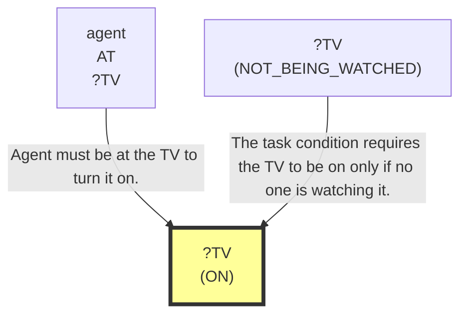
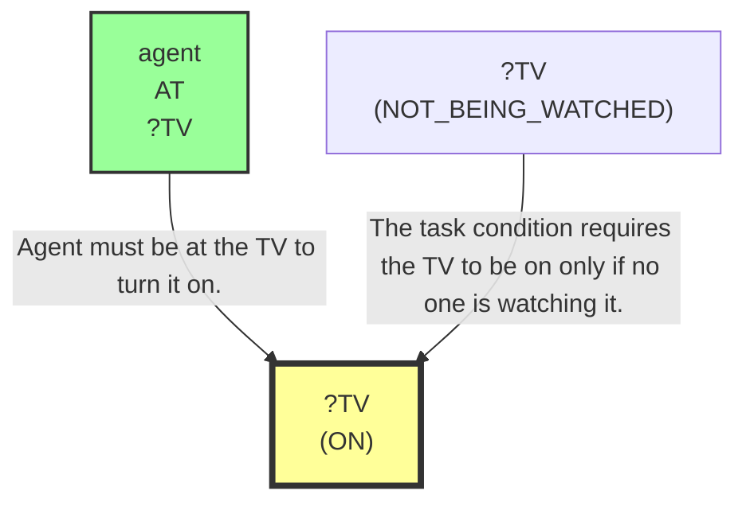
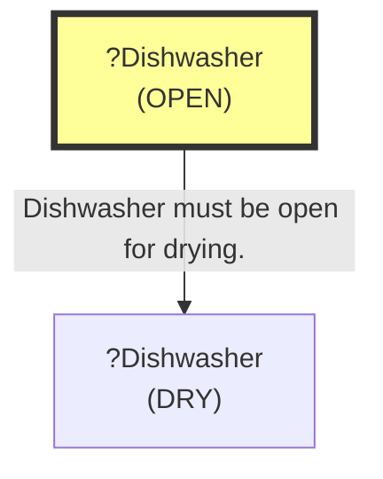
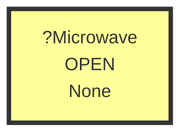
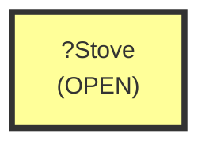
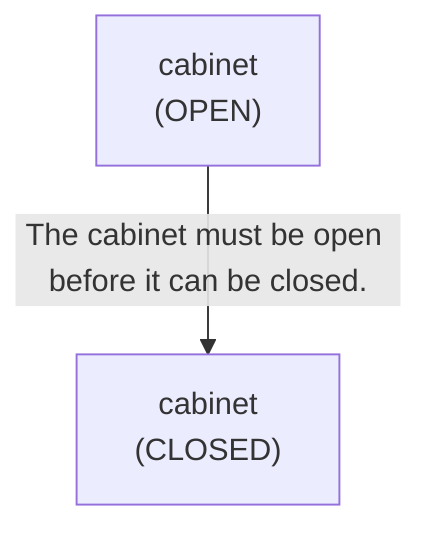
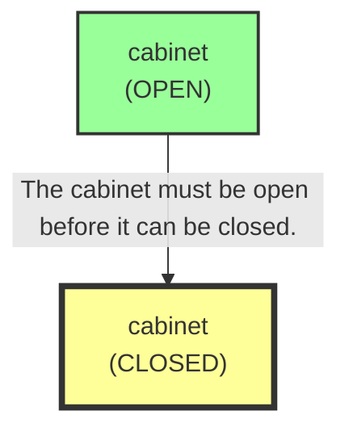

# 🚀 VirtualHome Agent Episode Log


### [GoalReasoner (Module A - Intent)] Output
```json
{
  "is_instruction_obviously_vague": true,
  "clarification_question": "What specific TV should I turn on, and do you want it turned on even if no one is watching?",
  "target_object": "TV",
  "location_hint": null,
  "reasoning_chain": [
    {
      "question": "Why does the user want this object?",
      "answer": "To have the television turned on under the stated condition."
    },
    {
      "question": "Why is that important?",
      "answer": "So the TV is active when it is not being watched, likely for use, display, or background activity."
    },
    {
      "question": "What fundamental need does this fulfill?",
      "answer": "It fulfills the need to have an electronic display powered on and available."
    },
    {
      "question": "Are there any deeper psychological or physical motivations?",
      "answer": "The user may want the environment to feel active, keep the device ready, or ensure it is operating without requiring immediate attention."
    }
  ],
  "deep_intent": "The user wants an electronic display powered on and active.",
  "acceptable_alternatives_properties": [
    {
      "priority": 1,
      "description": "Other indoor screens or displays that can be powered on, such as a monitor or tablet"
    },
    {
      "priority": 2,
      "description": "Similar electronic media devices that provide visual output, such as a smart display"
    },
    {
      "priority": 3,
      "description": "Any household device with a screen that can remain on and active"
    },
    {
      "priority": 4,
      "description": "Other powered visual devices used to maintain an active or visible environment"
    }
  ]
}
```

### [PerceptionFilter] Output
```json
{
  "reasoning": "The goal is to turn on the TV and keep it on even when not being watched. The SDG explicitly requires the TV and the agent to be at the TV; no extra tools are needed. I therefore keep only the target TV and the related TV stand as the immediate location/support object.",
  "selected_classes": [
    "tv",
    "tvstand",
    "character"
  ],
  "raw_class_count": 27
}
```

### [LLMExecutor] Output
```json
{
  "reasoning": "The instruction is explicitly vague: the goal refers to 'TV' without specifying which one, and the conditional 'even if no one is watching' is ambiguous. Per the clarification rule, I should ask before taking physical actions rather than guessing among possible displays or interpreting the condition myself.",
  "satisfied_nodes": [],
  "current_node_focus": "N1",
  "mapped_variables": {
    "?TV": "tv(238)"
  },
  "action": "[ask] What specific TV should I turn on, and do you want it turned on even if no one is watching?"
}
```

### [RoboStateMultiTaskController] Output
```json
{
  "action": "[ask] What specific TV should I turn on, and do you want it turned on even if no one is watching?",
  "active_task_id": "task_1",
  "task_context": {
    "active_task_id": "task_1",
    "pending_task_ids": [
      "task_2",
      "task_3",
      "task_4",
      "task_5"
    ],
    "satisfied_task_ids": []
  },
  "source": "llm_executor"
}
```
## Step 0
- **Action**: `[ask] What specific TV should I turn on, and do you want it turned on even if no one is watching?`
- **Action Success**: `True`
- **Action Message**: nothing to claim
- **Active Task**: `task_1`
- **Decision Source**: `llm_executor`
- **Task Progress**: E1_01=pending, E1_04=pending, E1_05=pending, E1_06=pending, E1_12=pending
- **SDG Status**:

- **Observed Items (8)**: tvstand(208), tv(238) [OFF], character(1), kitchen(11), livingroom(183), bedroom(241), bathroom(285), bedroom(346)


### [PerceptionFilter] Output
```json
{
  "reasoning": "Reused cached class selection.",
  "selected_classes": [
    "tv",
    "tvstand",
    "character"
  ],
  "raw_class_count": 27
}
```

### [LLMExecutor] Output
```json
{
  "reasoning": "The task is no longer eligible for clarification, so I must act autonomously. The active TV target is clearly identified in the living room as tv(238), currently OFF and requiring the agent to be at the TV to switch it on. Since I am already in the living room, the next atomic step toward satisfying N3 and then N1 is to switch on the TV. N2 (NOT_BEING_WATCHED) is not directly enforceable yet, but turning the TV on is the required first step toward the goal.",
  "satisfied_nodes": [],
  "current_node_focus": "N1",
  "mapped_variables": {
    "?TV": "tv(238)"
  },
  "action": "[switchon] <tv> (238)"
}
```

### [RoboStateMultiTaskController] Output
```json
{
  "action": "[walk] <tv> (238)",
  "active_task_id": "task_1",
  "task_context": {
    "active_task_id": "task_1",
    "pending_task_ids": [
      "task_2",
      "task_3",
      "task_4",
      "task_5"
    ],
    "satisfied_task_ids": []
  },
  "source": "llm_executor_repaired"
}
```
## Step 1
- **Action**: `[walk] <tv> (238)`
- **Action Success**: `True`
- **Action Message**: {'0': {'message': 'Success'}}
- **Active Task**: `task_1`
- **Decision Source**: `llm_executor_repaired`
- **Task Progress**: E1_01=pending, E1_04=pending, E1_05=pending, E1_06=pending, E1_12=pending
- **SDG Status**:

- **Observed Items (8)**: tvstand(208), tv(238) [OFF], character(1), kitchen(11), livingroom(183), bedroom(241), bathroom(285), bedroom(346)


### [PerceptionFilter] Output
```json
{
  "reasoning": "Reused cached class selection.",
  "selected_classes": [
    "tv",
    "tvstand",
    "character"
  ],
  "raw_class_count": 27
}
```

### [LLMExecutor] Output
```json
{
  "reasoning": "The agent is already close to the target TV (tv(238)) and the SDG requires the TV to be ON. The clarification was already handled, so I must act autonomously. Since the TV has HAS_SWITCH and is currently OFF, the next step is to switch it on. N3 (agent at TV) is already satisfied, and turning it on will directly satisfy N1, while N2 depends on the TV being on in the required condition.",
  "satisfied_nodes": [
    "N3"
  ],
  "current_node_focus": "N1",
  "mapped_variables": {
    "?TV": "tv(238)"
  },
  "action": "[switchon] <tv> (238)"
}
```

### [RoboStateMultiTaskController] Output
```json
{
  "action": "[switchon] <tv> (238)",
  "active_task_id": "task_1",
  "task_context": {
    "active_task_id": "task_1",
    "pending_task_ids": [
      "task_2",
      "task_3",
      "task_4",
      "task_5"
    ],
    "satisfied_task_ids": []
  },
  "source": "llm_executor"
}
```
## Step 2
- **Action**: `[switchon] <tv> (238)`
- **Action Success**: `True`
- **Action Message**: Faked switch operation in Python layer (bypassed Unity failure)
- **Active Task**: `task_1`
- **Decision Source**: `llm_executor`
- **Task Progress**: E1_01=done, E1_04=pending, E1_05=pending, E1_06=pending, E1_12=pending
- **SDG Status**:

- **Observed Items (8)**: tvstand(208), tv(238) [OFF], character(1), kitchen(11), livingroom(183), bedroom(241), bathroom(285), bedroom(346)


### [GoalReasoner (Module A - Intent)] Output
```json
{
  "is_instruction_obviously_vague": false,
  "clarification_question": null,
  "target_object": "dishwasher",
  "location_hint": null,
  "reasoning_chain": [
    {
      "question": "Why does the user want this object?",
      "answer": "To allow it to dry by keeping it open."
    },
    {
      "question": "Why is that important?",
      "answer": "Because an open state can promote drying and reduce retained moisture."
    },
    {
      "question": "What fundamental need does this fulfill?",
      "answer": "To remove moisture from the appliance interior and prevent dampness."
    },
    {
      "question": "Are there any deeper psychological or physical motivations?",
      "answer": "The underlying physical motivation is to dry the interior and reduce conditions associated with lingering wetness, such as odors or buildup."
    }
  ],
  "deep_intent": "The user wants to remove moisture from an appliance interior by keeping it open.",
  "acceptable_alternatives_properties": [
    {
      "priority": 1,
      "description": "Other household compartments or containers that need to dry, such as a washing machine door, refrigerator drawer, or storage bin lid left open"
    },
    {
      "priority": 2,
      "description": "Other enclosed household items with wet interiors that can be aired out, such as cabinets, coolers, or laundry hampers"
    },
    {
      "priority": 3,
      "description": "Any openable household item where ventilation helps remove moisture, such as a closet or pantry door"
    },
    {
      "priority": 4,
      "description": "Drying a damp indoor space or surface using airflow, such as leaving a room door open to improve ventilation"
    }
  ]
}
```

### [PerceptionFilter] Output
```json
{
  "reasoning": "The goal is to dry a dishwasher by keeping it open. The SDG explicitly requires the dishwasher, and no additional tools or location-specific objects are needed from the visible list.",
  "selected_classes": [
    "dishwasher",
    "character"
  ],
  "raw_class_count": 27
}
```

### [LLMExecutor] Output
```json
{
  "reasoning": "The active task requires making the dishwasher open, then dry. In the current filtered graph, no dishwasher is visible in the known rooms, so I cannot yet interact with it directly. Since the task is not vague and asking is forbidden, the only autonomous next step is to search by moving to a likely location where kitchen appliances may be present. The kitchen is the most plausible place to find a dishwasher.",
  "satisfied_nodes": [],
  "current_node_focus": "N1",
  "mapped_variables": {
    "?Dishwasher": "dishwasher (unmapped; not currently visible)"
  },
  "action": "[walk] <kitchen> (11)"
}
```

### [RoboStateMultiTaskController] Output
```json
{
  "action": "[walk] <kitchen> (11)",
  "active_task_id": "task_2",
  "task_context": {
    "active_task_id": "task_2",
    "pending_task_ids": [
      "task_3",
      "task_4",
      "task_5"
    ],
    "satisfied_task_ids": [
      "task_1"
    ]
  },
  "source": "llm_executor"
}
```
## Step 3
- **Action**: `[walk] <kitchen> (11)`
- **Action Success**: `True`
- **Action Message**: {'0': {'message': 'Success'}}
- **Active Task**: `task_2`
- **Decision Source**: `llm_executor`
- **Task Progress**: E1_01=done, E1_04=pending, E1_05=pending, E1_06=pending, E1_12=pending
- **SDG Status**:

- **Observed Items (6)**: character(1), kitchen(11), livingroom(183), bedroom(241), bathroom(285), bedroom(346)


### [PerceptionFilter] Output
```json
{
  "reasoning": "The goal is to dry the dishwasher interior by keeping it open, so the only strictly necessary class is the dishwasher itself. No extra tools or locations are required by the SDG.",
  "selected_classes": [
    "dishwasher",
    "character",
    "door"
  ],
  "raw_class_count": 59
}
```

### [LLMExecutor] Output
```json
{
  "reasoning": "The active goal is to make the dishwasher open, then dry. The filtered graph shows dishwasher(165) is in the kitchen and currently CLOSED, and the agent is already inside the kitchen. Since opening requires proximity and the last action was already walking to the kitchen, the next atomic step is to open the dishwasher. This satisfies N1 and enables progress toward N2.",
  "satisfied_nodes": [],
  "current_node_focus": "N1",
  "mapped_variables": {
    "?Dishwasher": "dishwasher(165)"
  },
  "action": "[open] <dishwasher> (165)"
}
```

### [RoboStateMultiTaskController] Output
```json
{
  "action": "[walk] <dishwasher> (165)",
  "active_task_id": "task_2",
  "task_context": {
    "active_task_id": "task_2",
    "pending_task_ids": [
      "task_3",
      "task_4",
      "task_5"
    ],
    "satisfied_task_ids": [
      "task_1"
    ]
  },
  "source": "llm_executor_repaired"
}
```
## Step 4
- **Action**: `[walk] <dishwasher> (165)`
- **Action Success**: `True`
- **Action Message**: {'0': {'message': 'Success'}}
- **Active Task**: `task_2`
- **Decision Source**: `llm_executor_repaired`
- **Task Progress**: E1_01=done, E1_04=pending, E1_05=pending, E1_06=pending, E1_12=pending
- **SDG Status**:

- **Observed Items (8)**: character(1), kitchen(11), livingroom(183), bedroom(241), bathroom(285), bedroom(346), door(47) [OPEN], dishwasher(165) [OFF,CLOSED]


### [PerceptionFilter] Output
```json
{
  "reasoning": "Reused cached class selection.",
  "selected_classes": [
    "dishwasher",
    "character",
    "door"
  ],
  "raw_class_count": 59
}
```

### [LLMExecutor] Output
```json
{
  "reasoning": "The active task is to make the dishwasher open, and the current graph shows dishwasher(165) is close and currently CLOSED. The next required step for the SDG is to satisfy N1 by opening it. We are already near it, so no additional walk is needed.",
  "satisfied_nodes": [],
  "current_node_focus": "N1",
  "mapped_variables": {
    "?Dishwasher": "dishwasher(165)"
  },
  "action": "[open] <dishwasher> (165)"
}
```

### [RoboStateMultiTaskController] Output
```json
{
  "action": "[open] <dishwasher> (165)",
  "active_task_id": "task_2",
  "task_context": {
    "active_task_id": "task_2",
    "pending_task_ids": [
      "task_3",
      "task_4",
      "task_5"
    ],
    "satisfied_task_ids": [
      "task_1"
    ]
  },
  "source": "llm_executor"
}
```
## Step 5
- **Action**: `[open] <dishwasher> (165)`
- **Action Success**: `True`
- **Action Message**: {'0': {'message': 'Success'}}
- **Active Task**: `task_2`
- **Decision Source**: `llm_executor`
- **Task Progress**: E1_01=done, E1_04=done, E1_05=pending, E1_06=pending, E1_12=pending
- **SDG Status**:

- **Observed Items (8)**: character(1), kitchen(11), livingroom(183), bedroom(241), bathroom(285), bedroom(346), door(47) [OPEN], dishwasher(165) [OFF,CLOSED]


### [GoalReasoner (Module A - Intent)] Output
```json
{
  "is_instruction_obviously_vague": true,
  "clarification_question": "Do you want the microwave door to be left open, closed, or set to a specific state after use?",
  "target_object": "microwave",
  "location_hint": null,
  "reasoning_chain": [
    {
      "question": "Why does the user want this object?",
      "answer": "To support maintenance of the appliance."
    },
    {
      "question": "Why is that important?",
      "answer": "Because the user believes keeping it in a certain state helps preserve or care for it."
    },
    {
      "question": "What fundamental need does this fulfill?",
      "answer": "The need to maintain the appliance and prevent conditions that could interfere with its upkeep."
    },
    {
      "question": "Are there any deeper psychological or physical motivations?",
      "answer": "Likely a desire to reduce wear, moisture buildup, or other maintenance concerns, but the exact desired physical state is unclear."
    }
  ],
  "deep_intent": "The user wants to maintain the appliance in a condition they believe is better for upkeep.",
  "acceptable_alternatives_properties": [
    {
      "priority": 1,
      "description": "Other appliance-preserving states for household devices, such as leaving a door or cover in the position that reduces moisture or strain"
    },
    {
      "priority": 2,
      "description": "Routine maintenance actions for kitchen appliances, such as cleaning or airing them out"
    },
    {
      "priority": 3,
      "description": "Preventive care measures for household equipment that reduce buildup or wear"
    },
    {
      "priority": 4,
      "description": "General home maintenance practices that protect appliances from damage or deterioration"
    }
  ]
}
```

### [PerceptionFilter] Output
```json
{
  "reasoning": "The goal and SDG indicate the microwave must be in the OPEN state. The only strictly necessary object class is the microwave itself, since no other tool or location is required to satisfy this state-change task.",
  "selected_classes": [
    "microwave",
    "character",
    "door"
  ],
  "raw_class_count": 59
}
```

### [LLMExecutor] Output
```json
{
  "reasoning": "The active SDG requires the microwave to be OPEN. The filtered graph shows microwave(171) is CLOSED and we are already inside the kitchen, so the next atomic step is to open it. No clarification is allowed now, and this task is independent of the previously satisfied tasks.",
  "satisfied_nodes": [],
  "current_node_focus": "N1",
  "mapped_variables": {
    "?Microwave": "microwave(171)"
  },
  "action": "[open] <microwave> (171)"
}
```

### [RoboStateMultiTaskController] Output
```json
{
  "action": "[walk] <microwave> (171)",
  "active_task_id": "task_3",
  "task_context": {
    "active_task_id": "task_3",
    "pending_task_ids": [
      "task_4",
      "task_5"
    ],
    "satisfied_task_ids": [
      "task_1",
      "task_2"
    ]
  },
  "source": "llm_executor_repaired"
}
```
## Step 6
- **Action**: `[walk] <microwave> (171)`
- **Action Success**: `True`
- **Action Message**: {'0': {'message': 'Success'}}
- **Active Task**: `task_3`
- **Decision Source**: `llm_executor_repaired`
- **Task Progress**: E1_01=done, E1_04=done, E1_05=pending, E1_06=pending, E1_12=pending
- **SDG Status**:

- **Observed Items (8)**: character(1), kitchen(11), livingroom(183), bedroom(241), bathroom(285), bedroom(346), door(47) [OPEN], microwave(171) [OFF,CLOSED]


### [PerceptionFilter] Output
```json
{
  "reasoning": "Reused cached class selection.",
  "selected_classes": [
    "microwave",
    "character",
    "door"
  ],
  "raw_class_count": 59
}
```

### [LLMExecutor] Output
```json
{
  "reasoning": "The active SDG requires the microwave to be OPEN. The microwave is currently CLOSED and we are already close to it, so the next atomic action is to open it. No other task objects should be manipulated.",
  "satisfied_nodes": [],
  "current_node_focus": "N1",
  "mapped_variables": {
    "?Microwave": "microwave(171)"
  },
  "action": "[open] <microwave> (171)"
}
```

### [RoboStateMultiTaskController] Output
```json
{
  "action": "[open] <microwave> (171)",
  "active_task_id": "task_3",
  "task_context": {
    "active_task_id": "task_3",
    "pending_task_ids": [
      "task_4",
      "task_5"
    ],
    "satisfied_task_ids": [
      "task_1",
      "task_2"
    ]
  },
  "source": "llm_executor"
}
```
## Step 7
- **Action**: `[open] <microwave> (171)`
- **Action Success**: `True`
- **Action Message**: {'0': {'message': 'Success'}}
- **Active Task**: `task_3`
- **Decision Source**: `llm_executor`
- **Task Progress**: E1_01=done, E1_04=done, E1_05=done, E1_06=pending, E1_12=pending
- **SDG Status**:

- **Observed Items (8)**: character(1), kitchen(11), livingroom(183), bedroom(241), bathroom(285), bedroom(346), door(47) [OPEN], microwave(171) [OFF,CLOSED]


### [GoalReasoner (Module A - Intent)] Output
```json
{
  "is_instruction_obviously_vague": false,
  "clarification_question": null,
  "target_object": "stove",
  "location_hint": null,
  "reasoning_chain": [
    {
      "question": "Why does the user want this object?",
      "answer": "They want the stove to remain open rather than closed."
    },
    {
      "question": "Why is that important?",
      "answer": "Keeping it open is the intended physical state they want maintained."
    },
    {
      "question": "What fundamental need does this fulfill?",
      "answer": "It fulfills the need to control the stove's state for access, visibility, or ventilation."
    },
    {
      "question": "Are there any deeper psychological or physical motivations?",
      "answer": "The motivation is likely practical: maintaining a specific stove configuration so it stays usable in the desired state."
    }
  ],
  "deep_intent": "The user wants a household appliance to remain in an open state.",
  "acceptable_alternatives_properties": [
    {
      "priority": 1,
      "description": "Other kitchen appliance parts or covers that can be left open, such as an oven door or cooktop cover"
    },
    {
      "priority": 2,
      "description": "Any similar hinged household fixture that can remain open, such as a cabinet door or drawer"
    },
    {
      "priority": 3,
      "description": "Other indoor access points or lids that can be kept open for access or airflow"
    },
    {
      "priority": 4,
      "description": "Alternative ways to maintain access or ventilation in the kitchen, such as opening a window or vent"
    }
  ]
}
```

### [PerceptionFilter] Output
```json
{
  "reasoning": "The goal is to keep the stove in an OPEN state, so the target appliance must be included. Since the intent also allows alternative kitchen fixtures that can remain open for access or ventilation, I retain nearby functional alternatives that could serve as backups or related openable kitchen fixtures: oven-like appliances, cabinets/drawers, doors, windows, and ventilation-related fixtures.",
  "selected_classes": [
    "kitchencabinet",
    "door",
    "character",
    "stove",
    "microwave",
    "stovefan",
    "kitchencounterdrawer",
    "window",
    "fridge"
  ],
  "raw_class_count": 59
}
```

### [LLMExecutor] Output
```json
{
  "reasoning": "The active task is to make the stove remain OPEN. In the filtered graph, stove(163) is currently CLOSED and is the correct binding for ?Stove. I am already in the kitchen, so the next required step is to move to the stove before opening it. I should not repeat a walk to the same place, and no other prerequisite is needed.",
  "satisfied_nodes": [],
  "current_node_focus": "N1",
  "mapped_variables": {
    "?Stove": "stove(163)"
  },
  "action": "[walk] <stove> (163)"
}
```

### [RoboStateMultiTaskController] Output
```json
{
  "action": "[walk] <stove> (163)",
  "active_task_id": "task_4",
  "task_context": {
    "active_task_id": "task_4",
    "pending_task_ids": [
      "task_5"
    ],
    "satisfied_task_ids": [
      "task_1",
      "task_2",
      "task_3"
    ]
  },
  "source": "llm_executor"
}
```
## Step 8
- **Action**: `[walk] <stove> (163)`
- **Action Success**: `True`
- **Action Message**: {'0': {'message': 'Success'}}
- **Active Task**: `task_4`
- **Decision Source**: `llm_executor`
- **Task Progress**: E1_01=done, E1_04=done, E1_05=done, E1_06=pending, E1_12=pending
- **SDG Status**:

- **Observed Items (29)**: window(202) [CLOSED], character(1), kitchen(11), livingroom(183), bedroom(241), bathroom(285), bedroom(346), door(47) [OPEN], window(49) [CLOSED], kitchencabinet(138) [CLOSED], kitchencabinet(139) [CLOSED], kitchencabinet(140) [CLOSED], kitchencabinet(141) [CLOSED], kitchencabinet(142) [CLOSED], kitchencabinet(143) [CLOSED]...


### [PerceptionFilter] Output
```json
{
  "reasoning": "Reused cached class selection.",
  "selected_classes": [
    "kitchencabinet",
    "door",
    "character",
    "stove",
    "microwave",
    "stovefan",
    "kitchencounterdrawer",
    "window",
    "fridge"
  ],
  "raw_class_count": 59
}
```

### [LLMExecutor] Output
```json
{
  "reasoning": "The active SDG has a single remaining node: the stove must be OPEN. I am already close to stove(163) from the previous walk action, and the stove is currently CLOSED. Since opening requires proximity and no other prerequisite is needed, the next atomic action is to open the stove.",
  "satisfied_nodes": [],
  "current_node_focus": "N1",
  "mapped_variables": {
    "?Stove": "stove(163)"
  },
  "action": "[open] <stove> (163)"
}
```

### [RoboStateMultiTaskController] Output
```json
{
  "action": "[open] <stove> (163)",
  "active_task_id": "task_4",
  "task_context": {
    "active_task_id": "task_4",
    "pending_task_ids": [
      "task_5"
    ],
    "satisfied_task_ids": [
      "task_1",
      "task_2",
      "task_3"
    ]
  },
  "source": "llm_executor"
}
```
## Step 9
- **Action**: `[open] <stove> (163)`
- **Action Success**: `True`
- **Action Message**: {'0': {'message': 'Success'}}
- **Active Task**: `task_4`
- **Decision Source**: `llm_executor`
- **Task Progress**: E1_01=done, E1_04=done, E1_05=done, E1_06=done, E1_12=pending
- **SDG Status**:

- **Observed Items (29)**: window(202) [CLOSED], character(1), kitchen(11), livingroom(183), bedroom(241), bathroom(285), bedroom(346), door(47) [OPEN], window(49) [CLOSED], kitchencabinet(138) [CLOSED], kitchencabinet(139) [CLOSED], kitchencabinet(140) [CLOSED], kitchencabinet(141) [CLOSED], kitchencabinet(142) [CLOSED], kitchencabinet(143) [CLOSED]...


### [GoalReasoner (Module A - Intent)] Output
```json
{
  "is_instruction_obviously_vague": false,
  "clarification_question": null,
  "target_object": "cabinet",
  "location_hint": null,
  "reasoning_chain": [
    {
      "question": "Why does the user want this object?",
      "answer": "To change the cabinet's state from open to closed if it is currently open."
    },
    {
      "question": "Why is that important?",
      "answer": "Because an open cabinet may need to be secured, tidied, or kept out of the way."
    },
    {
      "question": "What fundamental need does this fulfill?",
      "answer": "It fulfills a need to ensure the cabinet is in a desired closed physical state."
    },
    {
      "question": "Are there any deeper psychological or physical motivations?",
      "answer": "The user may want organization, safety, or a cleaner visual environment."
    }
  ],
  "deep_intent": "The user wants a cabinet to be in a closed state if it is currently open.",
  "acceptable_alternatives_properties": [
    {
      "priority": 1,
      "description": "Other hinged household storage doors or compartments that can be closed, such as a cupboard door or closet door."
    },
    {
      "priority": 2,
      "description": "Similar enclosed storage units with openable access points that can be shut, such as drawers or hatches."
    },
    {
      "priority": 3,
      "description": "Any indoor storage or access opening that can be secured in a closed position."
    },
    {
      "priority": 4,
      "description": "Other household items whose open state can be ended to improve safety, order, or neatness."
    }
  ]
}
```

### [RoboStateMultiTaskController] Output
```json
{
  "action": "[walk] <bedroom> (241)",
  "active_task_id": "task_5",
  "task_context": {
    "active_task_id": "task_5",
    "pending_task_ids": [],
    "satisfied_task_ids": [
      "task_1",
      "task_2",
      "task_3",
      "task_4"
    ]
  },
  "source": "room_frontier"
}
```
## Step 10
- **Action**: `[walk] <bedroom> (241)`
- **Action Success**: `True`
- **Action Message**: {'0': {'message': 'Success'}}
- **Active Task**: `task_5`
- **Decision Source**: `room_frontier`
- **Task Progress**: E1_01=done, E1_04=done, E1_05=done, E1_06=done, E1_12=pending
- **SDG Status**:

- **Observed Items (214)**: floor(184), floor(185), floor(186), floor(187), floor(188), floor(189), wall(190), wall(191), wall(192), wall(193), wall(194), wall(195), ceiling(196), ceiling(197), ceiling(198)...


### [RoboStateMultiTaskController] Output
```json
{
  "action": "[walk] <bathroom> (285)",
  "active_task_id": "task_5",
  "task_context": {
    "active_task_id": "task_5",
    "pending_task_ids": [],
    "satisfied_task_ids": [
      "task_1",
      "task_2",
      "task_3",
      "task_4"
    ]
  },
  "source": "room_frontier"
}
```
## Step 11
- **Action**: `[walk] <bathroom> (285)`
- **Action Success**: `True`
- **Action Message**: {'0': {'message': 'Success'}}
- **Active Task**: `task_5`
- **Decision Source**: `room_frontier`
- **Task Progress**: E1_01=done, E1_04=done, E1_05=done, E1_06=done, E1_12=pending
- **SDG Status**:

- **Observed Items (246)**: floor(184), floor(185), floor(186), floor(187), floor(188), floor(189), wall(190), wall(191), wall(192), wall(193), wall(194), wall(195), ceiling(196), ceiling(197), ceiling(198)...


### [RoboStateMultiTaskController] Output
```json
{
  "action": "[walk] <bedroom> (346)",
  "active_task_id": "task_5",
  "task_context": {
    "active_task_id": "task_5",
    "pending_task_ids": [],
    "satisfied_task_ids": [
      "task_1",
      "task_2",
      "task_3",
      "task_4"
    ]
  },
  "source": "room_frontier"
}
```
## Step 12
- **Action**: `[walk] <bedroom> (346)`
- **Action Success**: `True`
- **Action Message**: {'0': {'message': 'Success'}}
- **Active Task**: `task_5`
- **Decision Source**: `room_frontier`
- **Task Progress**: E1_01=done, E1_04=done, E1_05=done, E1_06=done, E1_12=pending
- **SDG Status**:

- **Observed Items (306)**: floor(184), floor(185), floor(186), floor(187), floor(188), floor(189), wall(190), wall(191), wall(192), wall(193), wall(194), wall(195), ceiling(196), ceiling(197), ceiling(198)...


### [PerceptionFilter] Output
```json
{
  "reasoning": "The goal is to close a cabinet, so the only strictly necessary object class is the cabinet itself. No extra tools or alternative storage units are needed because the SDG only requires changing the cabinet from open to closed.",
  "selected_classes": [
    "closet",
    "character",
    "door",
    "cabinet"
  ],
  "raw_class_count": 92
}
```

### [LLMExecutor] Output
```json
{
  "reasoning": "The active task is to make the cabinet closed. The filtered graph shows cabinet(396) is currently OPEN and we are already inside bedroom(346), the same room as the cabinet. The SDG indicates N2 (OPEN) must be satisfied before N1 (CLOSED), and N2 is already satisfied. Since closing requires proximity and we are already in the room, the next action is to close the cabinet directly.",
  "satisfied_nodes": [
    "N2"
  ],
  "current_node_focus": "N1",
  "mapped_variables": {},
  "action": "[close] <cabinet> (396)"
}
```

### [RoboStateMultiTaskController] Output
```json
{
  "action": "[walk] <cabinet> (396)",
  "active_task_id": "task_5",
  "task_context": {
    "active_task_id": "task_5",
    "pending_task_ids": [],
    "satisfied_task_ids": [
      "task_1",
      "task_2",
      "task_3",
      "task_4"
    ]
  },
  "source": "llm_executor_repaired"
}
```
## Step 13
- **Action**: `[walk] <cabinet> (396)`
- **Action Success**: `True`
- **Action Message**: {'0': {'message': 'Success'}}
- **Active Task**: `task_5`
- **Decision Source**: `llm_executor_repaired`
- **Task Progress**: E1_01=done, E1_04=done, E1_05=done, E1_06=done, E1_12=pending
- **SDG Status**:

- **Observed Items (11)**: character(1), kitchen(11), livingroom(183), bedroom(241), bathroom(285), bedroom(346), door(47) [OPEN], door(254) [OPEN], door(305) [OPEN], closet(395) [CLOSED], cabinet(396) [OPEN]


### [PerceptionFilter] Output
```json
{
  "reasoning": "Reused cached class selection.",
  "selected_classes": [
    "closet",
    "character",
    "door",
    "cabinet"
  ],
  "raw_class_count": 92
}
```

### [LLMExecutor] Output
```json
{
  "reasoning": "The active task is to make the cabinet end in CLOSED state. The current filtered graph shows cabinet(396) is already OPEN and I am close to it. The SDG requires the cabinet to be open before it can be closed, and that prerequisite is satisfied. The single next action is to close the cabinet.",
  "satisfied_nodes": [
    "N2"
  ],
  "current_node_focus": "N1",
  "mapped_variables": {},
  "action": "[close] <cabinet> (396)"
}
```

### [RoboStateMultiTaskController] Output
```json
{
  "action": "[close] <cabinet> (396)",
  "active_task_id": "task_5",
  "task_context": {
    "active_task_id": "task_5",
    "pending_task_ids": [],
    "satisfied_task_ids": [
      "task_1",
      "task_2",
      "task_3",
      "task_4"
    ]
  },
  "source": "llm_executor"
}
```
## Step 14
- **Action**: `[close] <cabinet> (396)`
- **Action Success**: `True`
- **Action Message**: {'0': {'message': 'Success'}}
- **Active Task**: `task_5`
- **Decision Source**: `llm_executor`
- **Task Progress**: E1_01=done, E1_04=done, E1_05=done, E1_06=done, E1_12=done
- **SDG Status**:

- **Observed Items (11)**: character(1), kitchen(11), livingroom(183), bedroom(241), bathroom(285), bedroom(346), door(47) [OPEN], door(254) [OPEN], door(305) [OPEN], closet(395) [CLOSED], cabinet(396) [OPEN]

