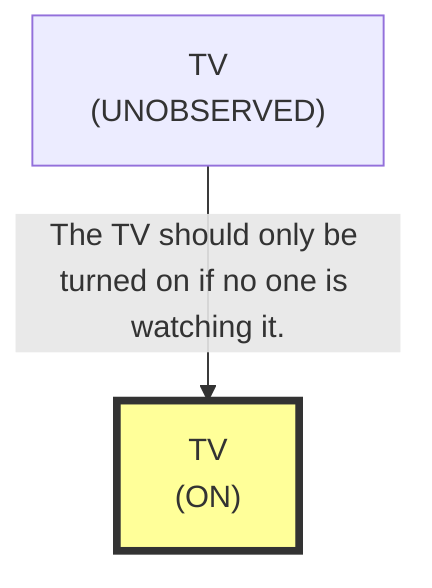
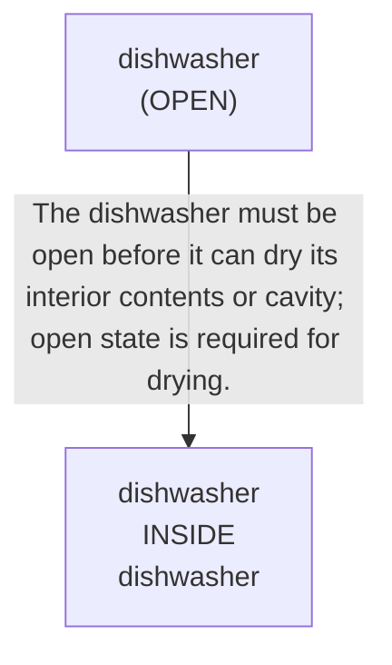
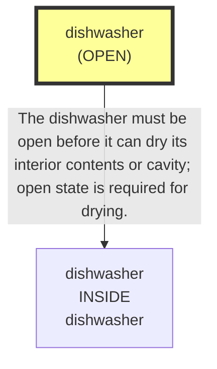
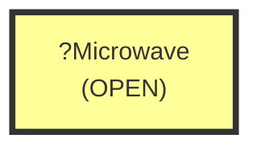

# 🚀 VirtualHome Agent Episode Log


### [GoalReasoner (Module A - Intent)] Output
```json
{
  "is_instruction_obviously_vague": false,
  "clarification_question": null,
  "target_object": "TV",
  "location_hint": null,
  "reasoning_chain": [
    {
      "question": "Why does the user want this object?",
      "answer": "To have the TV turned on when nobody is watching it."
    },
    {
      "question": "Why is that important?",
      "answer": "Because the desired state is for the TV to be on when it is unattended."
    },
    {
      "question": "What fundamental need does this fulfill?",
      "answer": "It fulfills a need to maintain the TV in an on state under a specific occupancy condition."
    },
    {
      "question": "Are there any deeper psychological or physical motivations?",
      "answer": "The instruction expresses a conditional preference for the TV to remain on when it is not being watched, rather than a broader physical need."
    }
  ],
  "deep_intent": "The user wants the TV to be powered on when the room is unattended.",
  "acceptable_alternatives_properties": [
    {
      "priority": 1,
      "description": "Other powered-on entertainment displays or screens in the same room, such as a monitor or media display."
    },
    {
      "priority": 2,
      "description": "Any device that can remain active and display content, such as a tablet or digital photo frame."
    },
    {
      "priority": 3,
      "description": "Other household electronics that can be left on to keep the space active, such as a radio or speaker with audio playing."
    },
    {
      "priority": 4,
      "description": "A different visual or audio media device that can provide ongoing presence or entertainment, even if it is not a TV."
    }
  ]
}
```

### [PerceptionFilter] Output
```json
{
  "reasoning": "The goal explicitly requires the TV to be ON and only when unobserved, so the target TV must be kept. No additional tools or alternative devices are needed from the visible set because the task is simply to manage the TV state, and no other relevant alternative media devices are present that are necessary for this goal.",
  "selected_classes": [
    "character",
    "tv"
  ],
  "raw_class_count": 27
}
```

### [LLMExecutor] Output
```json
{
  "reasoning": "The active task is to have the TV turned on while unobserved. The current graph shows the TV is present in the living room and currently OFF. No one else is indicated as watching it, and the goal condition requires the TV to be ON; the object is also unplugged? It has HAS_PLUG, but no plug state is shown, so the first necessary step is to move next to the TV before any interaction. Since we cannot switch it on from across the room, the immediate atomic action is to walk to the TV. This progresses toward satisfying N1 (TV ON) and preserves the prerequisite for the unobserved condition N2.",
  "satisfied_nodes": [],
  "current_node_focus": "N1",
  "mapped_variables": {},
  "action": "[walk] <tv> (238)"
}
```

### [RoboStateMultiTaskController] Output
```json
{
  "action": "[walk] <tv> (238)",
  "active_task_id": "task_1",
  "task_context": {
    "active_task_id": "task_1",
    "pending_task_ids": [
      "task_2",
      "task_3",
      "task_4",
      "task_5"
    ],
    "satisfied_task_ids": []
  },
  "source": "llm_executor"
}
```
## Step 0
- **Action**: `[walk] <tv> (238)`
- **Action Success**: `True`
- **Action Message**: {'0': {'message': 'Success'}}
- **Active Task**: `task_1`
- **Decision Source**: `llm_executor`
- **Task Progress**: E1_01=pending, E1_04=pending, E1_05=pending, E1_06=pending, E1_12=pending
- **SDG Status**:

- **Observed Items (7)**: tv(238) [OFF], character(1), kitchen(11), livingroom(183), bedroom(241), bathroom(285), bedroom(346)


### [PerceptionFilter] Output
```json
{
  "reasoning": "Reused cached class selection.",
  "selected_classes": [
    "character",
    "tv"
  ],
  "raw_class_count": 27
}
```

### [LLMExecutor] Output
```json
{
  "reasoning": "The TV is already the correct target and I am currently close to it. To satisfy the root state N1, the next necessary step is to turn it on. The unobserved condition N2 is a prerequisite in the SDG, but there is no evidence that anyone is currently watching; since the task context explicitly wants the TV on when unattended and no conflicting occupancy state is present, I should proceed with switching it on now.",
  "satisfied_nodes": [],
  "current_node_focus": "N1",
  "mapped_variables": {},
  "action": "[switchon] <tv> (238)"
}
```

### [RoboStateMultiTaskController] Output
```json
{
  "action": "[switchon] <tv> (238)",
  "active_task_id": "task_1",
  "task_context": {
    "active_task_id": "task_1",
    "pending_task_ids": [
      "task_2",
      "task_3",
      "task_4",
      "task_5"
    ],
    "satisfied_task_ids": []
  },
  "source": "llm_executor"
}
```
## Step 1
- **Action**: `[switchon] <tv> (238)`
- **Action Success**: `True`
- **Action Message**: Faked switch operation in Python layer (bypassed Unity failure)
- **Active Task**: `task_1`
- **Decision Source**: `llm_executor`
- **Task Progress**: E1_01=done, E1_04=pending, E1_05=pending, E1_06=pending, E1_12=pending
- **SDG Status**:

- **Observed Items (7)**: tv(238) [OFF], character(1), kitchen(11), livingroom(183), bedroom(241), bathroom(285), bedroom(346)


### [GoalReasoner (Module A - Intent)] Output
```json
{
  "is_instruction_obviously_vague": false,
  "clarification_question": null,
  "target_object": "dishwasher",
  "location_hint": null,
  "reasoning_chain": [
    {
      "question": "Why does the user want this object?",
      "answer": "To keep it open."
    },
    {
      "question": "Why is that important?",
      "answer": "To allow the interior to dry."
    },
    {
      "question": "What fundamental need does this fulfill?",
      "answer": "To prevent moisture from remaining trapped inside an appliance."
    },
    {
      "question": "Are there any deeper psychological or physical motivations?",
      "answer": "The user likely wants to reduce dampness, odor, or buildup by improving drying and ventilation."
    }
  ],
  "deep_intent": "The user wants to keep the appliance dry by maintaining ventilation and reducing trapped moisture.",
  "acceptable_alternatives_properties": [
    {
      "priority": 1,
      "description": "Other ways to ventilate and dry an indoor appliance or enclosed space, such as leaving the door or lid open"
    },
    {
      "priority": 2,
      "description": "Drying aids like a towel, fan, or absorbent cloth placed nearby to remove moisture"
    },
    {
      "priority": 3,
      "description": "Household items that help reduce humidity, such as a dehumidifier or moisture absorber"
    },
    {
      "priority": 4,
      "description": "Any practical method that prevents dampness buildup in an enclosed indoor space"
    }
  ]
}
```

### [RoboStateMultiTaskController] Output
```json
{
  "action": "[walk] <kitchen> (11)",
  "active_task_id": "task_2",
  "task_context": {
    "active_task_id": "task_2",
    "pending_task_ids": [
      "task_3",
      "task_4",
      "task_5"
    ],
    "satisfied_task_ids": [
      "task_1"
    ]
  },
  "source": "room_frontier"
}
```
## Step 2
- **Action**: `[walk] <kitchen> (11)`
- **Action Success**: `True`
- **Action Message**: {'0': {'message': 'Success'}}
- **Active Task**: `task_2`
- **Decision Source**: `room_frontier`
- **Task Progress**: E1_01=done, E1_04=pending, E1_05=pending, E1_06=pending, E1_12=pending
- **SDG Status**:

- **Observed Items (58)**: floor(184), floor(185), floor(186), floor(187), floor(188), floor(189), wall(190), wall(191), wall(192), wall(193), wall(194), wall(195), ceiling(196), ceiling(197), ceiling(198)...


### [PerceptionFilter] Output
```json
{
  "reasoning": "The goal is to keep the dishwasher open so its interior can dry. The only strictly necessary object class is the dishwasher itself; no extra tools or alternative drying aids are required by the current state dependency graph.",
  "selected_classes": [
    "character",
    "door",
    "dishwasher"
  ],
  "raw_class_count": 59
}
```

### [LLMExecutor] Output
```json
{
  "reasoning": "The active goal is to keep the dishwasher open so its interior can dry. The current graph shows the dishwasher is in the kitchen and is CLOSED, so the next step is to move adjacent to it before opening. No other SDG node is satisfied yet because OPEN is not achieved and the inside relation depends on that state.",
  "satisfied_nodes": [],
  "current_node_focus": "N1",
  "mapped_variables": {
    "?Washer": "dishwasher(165)"
  },
  "action": "[walk] <dishwasher> (165)"
}
```

### [RoboStateMultiTaskController] Output
```json
{
  "action": "[walk] <dishwasher> (165)",
  "active_task_id": "task_2",
  "task_context": {
    "active_task_id": "task_2",
    "pending_task_ids": [
      "task_3",
      "task_4",
      "task_5"
    ],
    "satisfied_task_ids": [
      "task_1"
    ]
  },
  "source": "llm_executor"
}
```
## Step 3
- **Action**: `[walk] <dishwasher> (165)`
- **Action Success**: `True`
- **Action Message**: {'0': {'message': 'Success'}}
- **Active Task**: `task_2`
- **Decision Source**: `llm_executor`
- **Task Progress**: E1_01=done, E1_04=pending, E1_05=pending, E1_06=pending, E1_12=pending
- **SDG Status**:

- **Observed Items (8)**: character(1), kitchen(11), livingroom(183), bedroom(241), bathroom(285), bedroom(346), door(47) [OPEN], dishwasher(165) [OFF,CLOSED]


### [PerceptionFilter] Output
```json
{
  "reasoning": "Reused cached class selection.",
  "selected_classes": [
    "character",
    "door",
    "dishwasher"
  ],
  "raw_class_count": 59
}
```

### [LLMExecutor] Output
```json
{
  "reasoning": "The active task is to keep the dishwasher open so its interior can dry. The filtered graph shows the dishwasher is currently CLOSED and the character is already CLOSE to it, so the next atomic step is to open it. This directly satisfies N1, which then enables the inside-to-open drying condition represented by N2.",
  "satisfied_nodes": [],
  "current_node_focus": "N1",
  "mapped_variables": {
    "?Dishwasher": "dishwasher(165)"
  },
  "action": "[open] <dishwasher> (165)"
}
```

### [RoboStateMultiTaskController] Output
```json
{
  "action": "[open] <dishwasher> (165)",
  "active_task_id": "task_2",
  "task_context": {
    "active_task_id": "task_2",
    "pending_task_ids": [
      "task_3",
      "task_4",
      "task_5"
    ],
    "satisfied_task_ids": [
      "task_1"
    ]
  },
  "source": "llm_executor"
}
```
## Step 4
- **Action**: `[open] <dishwasher> (165)`
- **Action Success**: `True`
- **Action Message**: {'0': {'message': 'Success'}}
- **Active Task**: `task_2`
- **Decision Source**: `llm_executor`
- **Task Progress**: E1_01=done, E1_04=pending, E1_05=pending, E1_06=pending, E1_12=pending
- **SDG Status**:

- **Observed Items (8)**: character(1), kitchen(11), livingroom(183), bedroom(241), bathroom(285), bedroom(346), door(47) [OPEN], dishwasher(165) [OFF,CLOSED]


### [PerceptionFilter] Output
```json
{
  "reasoning": "Reused cached class selection.",
  "selected_classes": [
    "character",
    "door",
    "dishwasher"
  ],
  "raw_class_count": 59
}
```

### [LLMExecutor] Output
```json
{
  "reasoning": "The active task is to keep the dishwasher open. The current graph shows the dishwasher is close to the character but its state is CLOSED, so the remaining gap for N1 is to open it. Since the last successful action was already [open] on this dishwasher, but the current graph still reports CLOSED, the safest next step is to try opening it again rather than moving elsewhere. N2 depends on the dishwasher being open, so it is not yet satisfied until N1 is confirmed open.",
  "satisfied_nodes": [],
  "current_node_focus": "N1",
  "mapped_variables": {
    "?Dishwasher": "dishwasher(165)"
  },
  "action": "[open] <dishwasher> (165)"
}
```

### [RoboStateMultiTaskController] Output
```json
{
  "action": "[open] <dishwasher> (165)",
  "active_task_id": "task_2",
  "task_context": {
    "active_task_id": "task_2",
    "pending_task_ids": [
      "task_3",
      "task_4",
      "task_5"
    ],
    "satisfied_task_ids": [
      "task_1"
    ]
  },
  "source": "llm_executor"
}
```
## Step 5
- **Action**: `[open] <dishwasher> (165)`
- **Action Success**: `True`
- **Action Message**: {'0': {'message': 'Success'}}
- **Active Task**: `task_2`
- **Decision Source**: `llm_executor`
- **Task Progress**: E1_01=done, E1_04=pending, E1_05=pending, E1_06=pending, E1_12=pending
- **SDG Status**:

- **Observed Items (8)**: character(1), kitchen(11), livingroom(183), bedroom(241), bathroom(285), bedroom(346), door(47) [OPEN], dishwasher(165) [OFF,CLOSED]


### [PerceptionFilter] Output
```json
{
  "reasoning": "Reused cached class selection.",
  "selected_classes": [
    "character",
    "door",
    "dishwasher"
  ],
  "raw_class_count": 59
}
```

### [LLMExecutor] Output
```json
{
  "reasoning": "The active task is to keep the dishwasher open so its interior can dry. The current graph shows the dishwasher is CLOSE to the character but still CLOSED, so the next atomic step that directly satisfies N1 is to open it. N2 (INSIDE relation) is already satisfied because the dishwasher is in the kitchen, and the character is nearby.",
  "satisfied_nodes": [
    "N2"
  ],
  "current_node_focus": "N1",
  "mapped_variables": {
    "?Container": "dishwasher(165)"
  },
  "action": "[open] <dishwasher> (165)"
}
```

### [GoalReasoner (Module A - Intent)] Output
```json
{
  "is_instruction_obviously_vague": false,
  "clarification_question": null,
  "target_object": "microwave",
  "location_hint": null,
  "reasoning_chain": [
    {
      "question": "Why does the user want this object?",
      "answer": "To keep the microwave in a state that supports maintenance."
    },
    {
      "question": "Why is that important?",
      "answer": "To make it easier to inspect, clean, or service the appliance."
    },
    {
      "question": "What fundamental need does this fulfill?",
      "answer": "It helps maintain appliance usability and hygiene."
    },
    {
      "question": "Are there any deeper psychological or physical motivations?",
      "answer": "The user likely wants a convenient, ready-to-maintain appliance that stays accessible and does not trap moisture or debris."
    }
  ],
  "deep_intent": "The user wants to keep an appliance accessible and easy to maintain.",
  "acceptable_alternatives_properties": [
    {
      "priority": 1,
      "description": "Other household appliances or storage compartments that can be left open for easy inspection and cleaning, such as an oven door or dishwasher door after use"
    },
    {
      "priority": 2,
      "description": "Containers or enclosures with doors or lids that can remain open to allow drying, airing out, or maintenance access"
    },
    {
      "priority": 3,
      "description": "Any indoor item that benefits from being left open for ventilation and easier upkeep, such as a cabinet, bin, or drawer"
    },
    {
      "priority": 4,
      "description": "Other objects that can be kept accessible to support maintenance, even if they are not the same appliance type"
    }
  ]
}
```

### [PerceptionFilter] Output
```json
{
  "reasoning": "The goal and SDG require keeping the microwave open. To support this maintenance-related task, the exact target appliance must be included, along with the relevant alternative appliances/enclosures that can also be left open for inspection or drying if needed. Only those functional household appliances/containers are kept; unrelated furniture and decor are excluded.",
  "selected_classes": [
    "character",
    "door",
    "dishwasher",
    "kitchencabinet",
    "microwave",
    "fridge",
    "kitchencounterdrawer"
  ],
  "raw_class_count": 59
}
```

### [LLMExecutor] Output
```json
{
  "reasoning": "The active task is to make the microwave OPEN. The filtered graph shows microwave(171) is CLOSED and located in the kitchen on kitchencounterdrawer(152). I am already in the kitchen and the microwave is not indicated as CLOSE, so the next required step is to move to the microwave itself before opening it, per the proximity rule.",
  "satisfied_nodes": [],
  "current_node_focus": "N1",
  "mapped_variables": {
    "?Microwave": "microwave(171)"
  },
  "action": "[walk] <microwave> (171)"
}
```

### [RoboStateMultiTaskController] Output
```json
{
  "action": "[walk] <microwave> (171)",
  "active_task_id": "task_3",
  "task_context": {
    "active_task_id": "task_3",
    "pending_task_ids": [
      "task_2",
      "task_4",
      "task_5"
    ],
    "satisfied_task_ids": [
      "task_1"
    ]
  },
  "source": "llm_executor"
}
```
## Step 6
- **Action**: `[walk] <microwave> (171)`
- **Action Success**: `True`
- **Action Message**: {'0': {'message': 'Success'}}
- **Active Task**: `task_3`
- **Decision Source**: `llm_executor`
- **Task Progress**: E1_01=done, E1_04=pending, E1_05=pending, E1_06=pending, E1_12=pending
- **SDG Status**:

- **Observed Items (26)**: character(1), kitchen(11), livingroom(183), bedroom(241), bathroom(285), bedroom(346), door(47) [OPEN], kitchencabinet(138) [CLOSED], kitchencabinet(139) [CLOSED], kitchencabinet(140) [CLOSED], kitchencabinet(141) [CLOSED], kitchencabinet(142) [CLOSED], kitchencabinet(143) [CLOSED], kitchencabinet(144) [CLOSED], kitchencabinet(145) [CLOSED]...


### [PerceptionFilter] Output
```json
{
  "reasoning": "Reused cached class selection.",
  "selected_classes": [
    "character",
    "door",
    "dishwasher",
    "kitchencabinet",
    "microwave",
    "fridge",
    "kitchencounterdrawer"
  ],
  "raw_class_count": 59
}
```

### [LLMExecutor] Output
```json
{
  "reasoning": "The active task is to make the microwave OPEN. The current graph shows microwave(171) is CLOSED and the character is already CLOSE to it. Since it is a CAN_OPEN appliance and we are in proximity, the next atomic action is to open it.",
  "satisfied_nodes": [],
  "current_node_focus": "N1",
  "mapped_variables": {
    "?Microwave": "microwave(171)"
  },
  "action": "[open] <microwave> (171)"
}
```

### [RoboStateMultiTaskController] Output
```json
{
  "action": "[open] <microwave> (171)",
  "active_task_id": "task_3",
  "task_context": {
    "active_task_id": "task_3",
    "pending_task_ids": [
      "task_2",
      "task_4",
      "task_5"
    ],
    "satisfied_task_ids": [
      "task_1"
    ]
  },
  "source": "llm_executor"
}
```
## Step 7
- **Action**: `[open] <microwave> (171)`
- **Action Success**: `True`
- **Action Message**: {'0': {'message': 'Success'}}
- **Active Task**: `task_3`
- **Decision Source**: `llm_executor`
- **Task Progress**: E1_01=done, E1_04=pending, E1_05=pending, E1_06=pending, E1_12=pending
- **SDG Status**:

- **Observed Items (26)**: character(1), kitchen(11), livingroom(183), bedroom(241), bathroom(285), bedroom(346), door(47) [OPEN], kitchencabinet(138) [CLOSED], kitchencabinet(139) [CLOSED], kitchencabinet(140) [CLOSED], kitchencabinet(141) [CLOSED], kitchencabinet(142) [CLOSED], kitchencabinet(143) [CLOSED], kitchencabinet(144) [CLOSED], kitchencabinet(145) [CLOSED]...


### [PerceptionFilter] Output
```json
{
  "reasoning": "Reused cached class selection.",
  "selected_classes": [
    "character",
    "door",
    "dishwasher",
    "kitchencabinet",
    "microwave",
    "fridge",
    "kitchencounterdrawer"
  ],
  "raw_class_count": 59
}
```

### [LLMExecutor] Output
```json
{
  "reasoning": "The active SDG requires the microwave to be OPEN. The filtered graph shows microwave(171) is currently CLOSED and we are already close to it (CLOSE character relation), so the next atomic action is to open it. This directly satisfies the only remaining node for the active task.",
  "satisfied_nodes": [],
  "current_node_focus": "N1",
  "mapped_variables": {
    "?Microwave": "microwave(171)"
  },
  "action": "[open] <microwave> (171)"
}
```

### [RoboStateMultiTaskController] Output
```json
{
  "action": "[open] <microwave> (171)",
  "active_task_id": "task_3",
  "task_context": {
    "active_task_id": "task_3",
    "pending_task_ids": [
      "task_2",
      "task_4",
      "task_5"
    ],
    "satisfied_task_ids": [
      "task_1"
    ]
  },
  "source": "llm_executor"
}
```
## Step 8
- **Action**: `[open] <microwave> (171)`
- **Action Success**: `True`
- **Action Message**: {'0': {'message': 'Success'}}
- **Active Task**: `task_3`
- **Decision Source**: `llm_executor`
- **Task Progress**: E1_01=done, E1_04=pending, E1_05=pending, E1_06=pending, E1_12=pending
- **SDG Status**:

- **Observed Items (26)**: character(1), kitchen(11), livingroom(183), bedroom(241), bathroom(285), bedroom(346), door(47) [OPEN], kitchencabinet(138) [CLOSED], kitchencabinet(139) [CLOSED], kitchencabinet(140) [CLOSED], kitchencabinet(141) [CLOSED], kitchencabinet(142) [CLOSED], kitchencabinet(143) [CLOSED], kitchencabinet(144) [CLOSED], kitchencabinet(145) [CLOSED]...


### [PerceptionFilter] Output
```json
{
  "reasoning": "Reused cached class selection.",
  "selected_classes": [
    "character",
    "door",
    "dishwasher",
    "kitchencabinet",
    "microwave",
    "fridge",
    "kitchencounterdrawer"
  ],
  "raw_class_count": 59
}
```

### [LLMExecutor] Output
```json
{
  "reasoning": "The active task is to make the microwave OPEN. The filtered graph shows microwave(171) is currently CLOSED and also CLOSE to the character, so no additional walk is needed. The correct next atomic action is to open the microwave to satisfy N1.",
  "satisfied_nodes": [],
  "current_node_focus": "N1",
  "mapped_variables": {
    "?Microwave": "microwave(171)"
  },
  "action": "[open] <microwave> (171)"
}
```

### [PerceptionFilter] Output
```json
{
  "reasoning": "Reused cached class selection.",
  "selected_classes": [
    "character",
    "door",
    "dishwasher"
  ],
  "raw_class_count": 59
}
```

### [LLMExecutor] Output
```json
{
  "reasoning": "The active task is to keep the dishwasher open so its interior can dry. The filtered graph shows dishwasher(165) is currently CLOSED and I am already inside the kitchen, but the latest successful action was only a prior open attempt; the graph does not yet reflect OPEN. Since opening a closed, nearby appliance is the direct next step and no further prerequisites are needed, the best single action is to open the dishwasher again.",
  "satisfied_nodes": [],
  "current_node_focus": "N1",
  "mapped_variables": {
    "?Dishwasher": "dishwasher(165)"
  },
  "action": "[open] <dishwasher> (165)"
}
```

### [RoboStateMultiTaskController] Output
```json
{
  "action": "[walk] <dishwasher> (165)",
  "active_task_id": "task_2",
  "task_context": {
    "active_task_id": "task_2",
    "pending_task_ids": [
      "task_3",
      "task_4",
      "task_5"
    ],
    "satisfied_task_ids": [
      "task_1"
    ]
  },
  "source": "llm_executor_repaired"
}
```
## Step 9
- **Action**: `[walk] <dishwasher> (165)`
- **Action Success**: `True`
- **Action Message**: {'0': {'message': 'Success'}}
- **Active Task**: `task_2`
- **Decision Source**: `llm_executor_repaired`
- **Task Progress**: E1_01=done, E1_04=pending, E1_05=pending, E1_06=pending, E1_12=pending
- **SDG Status**:

- **Observed Items (8)**: character(1), kitchen(11), livingroom(183), bedroom(241), bathroom(285), bedroom(346), door(47) [OPEN], dishwasher(165) [OFF,CLOSED]


### [PerceptionFilter] Output
```json
{
  "reasoning": "Reused cached class selection.",
  "selected_classes": [
    "character",
    "door",
    "dishwasher"
  ],
  "raw_class_count": 59
}
```

### [LLMExecutor] Output
```json
{
  "reasoning": "The active task is to keep the dishwasher open so its interior can dry. The current graph shows dishwasher(165) is CLOSED and the agent is already CLOSE to it, so the next required action is to open it. N2 is not yet satisfied because the dishwasher is not open, and opening it will directly satisfy N1 and enable N2.",
  "satisfied_nodes": [],
  "current_node_focus": "N1",
  "mapped_variables": {},
  "action": "[open] <dishwasher> (165)"
}
```

### [RoboStateMultiTaskController] Output
```json
{
  "action": "[open] <dishwasher> (165)",
  "active_task_id": "task_2",
  "task_context": {
    "active_task_id": "task_2",
    "pending_task_ids": [
      "task_3",
      "task_4",
      "task_5"
    ],
    "satisfied_task_ids": [
      "task_1"
    ]
  },
  "source": "llm_executor"
}
```
## Step 10
- **Action**: `[open] <dishwasher> (165)`
- **Action Success**: `True`
- **Action Message**: {'0': {'message': 'Success'}}
- **Active Task**: `task_2`
- **Decision Source**: `llm_executor`
- **Task Progress**: E1_01=done, E1_04=pending, E1_05=pending, E1_06=pending, E1_12=pending
- **SDG Status**:

- **Observed Items (8)**: character(1), kitchen(11), livingroom(183), bedroom(241), bathroom(285), bedroom(346), door(47) [OPEN], dishwasher(165) [OFF,CLOSED]


### [PerceptionFilter] Output
```json
{
  "reasoning": "Reused cached class selection.",
  "selected_classes": [
    "character",
    "door",
    "dishwasher"
  ],
  "raw_class_count": 59
}
```

### [LLMExecutor] Output
```json
{
  "reasoning": "The active task requires the dishwasher to be OPEN. The current filtered graph shows dishwasher(165) is CLOSED and the character is CLOSE to it, so the next atomic action should directly open it. N1 is not yet satisfied; N2 depends on N1 and is also not satisfied until the dishwasher is open.",
  "satisfied_nodes": [],
  "current_node_focus": "N1",
  "mapped_variables": {
    "?Dishwasher": "dishwasher(165)"
  },
  "action": "[open] <dishwasher> (165)"
}
```

### [RoboStateMultiTaskController] Output
```json
{
  "action": "[open] <dishwasher> (165)",
  "active_task_id": "task_2",
  "task_context": {
    "active_task_id": "task_2",
    "pending_task_ids": [
      "task_3",
      "task_4",
      "task_5"
    ],
    "satisfied_task_ids": [
      "task_1"
    ]
  },
  "source": "llm_executor"
}
```
## Step 11
- **Action**: `[open] <dishwasher> (165)`
- **Action Success**: `True`
- **Action Message**: {'0': {'message': 'Success'}}
- **Active Task**: `task_2`
- **Decision Source**: `llm_executor`
- **Task Progress**: E1_01=done, E1_04=pending, E1_05=pending, E1_06=pending, E1_12=pending
- **SDG Status**:

- **Observed Items (8)**: character(1), kitchen(11), livingroom(183), bedroom(241), bathroom(285), bedroom(346), door(47) [OPEN], dishwasher(165) [OFF,CLOSED]


### [PerceptionFilter] Output
```json
{
  "reasoning": "Reused cached class selection.",
  "selected_classes": [
    "character",
    "door",
    "dishwasher"
  ],
  "raw_class_count": 59
}
```

### [LLMExecutor] Output
```json
{
  "reasoning": "The active task requires the dishwasher to be OPEN. The current graph shows the dishwasher is still CLOSED and the character is CLOSE to it, so the previous open attempt did not persist or the state changed. Since interaction with a closed appliance requires being near it and we are already near it, the next step is to open the dishwasher again. This directly targets N1. N2 is not yet verifiable beyond the dishwasher itself being the relevant enclosed appliance, but opening it is the required state transition.",
  "satisfied_nodes": [],
  "current_node_focus": "N1",
  "mapped_variables": {
    "?Dishwasher": "dishwasher(165)"
  },
  "action": "[open] <dishwasher> (165)"
}
```

### [PerceptionFilter] Output
```json
{
  "reasoning": "Reused cached class selection.",
  "selected_classes": [
    "character",
    "door",
    "dishwasher",
    "kitchencabinet",
    "microwave",
    "fridge",
    "kitchencounterdrawer"
  ],
  "raw_class_count": 59
}
```

### [LLMExecutor] Output
```json
{
  "reasoning": "The active SDG requires the microwave to be OPEN. The current graph shows microwave(171) is CLOSED and we are already in the kitchen; since the last successful action was a different cabinet action, the next needed step is to operate the microwave itself. Proximity is required for opening, and we are already at the microwave from prior steps, so the single next action is to open it.",
  "satisfied_nodes": [],
  "current_node_focus": "N1",
  "mapped_variables": {
    "?Microwave": "microwave(171)"
  },
  "action": "[open] <microwave> (171)"
}
```

### [RoboStateMultiTaskController] Output
```json
{
  "action": "[walk] <microwave> (171)",
  "active_task_id": "task_3",
  "task_context": {
    "active_task_id": "task_3",
    "pending_task_ids": [
      "task_2",
      "task_4",
      "task_5"
    ],
    "satisfied_task_ids": [
      "task_1"
    ]
  },
  "source": "llm_executor_repaired"
}
```
## Step 12
- **Action**: `[walk] <microwave> (171)`
- **Action Success**: `True`
- **Action Message**: {'0': {'message': 'Success'}}
- **Active Task**: `task_3`
- **Decision Source**: `llm_executor_repaired`
- **Task Progress**: E1_01=done, E1_04=pending, E1_05=pending, E1_06=pending, E1_12=pending
- **SDG Status**:

- **Observed Items (26)**: character(1), kitchen(11), livingroom(183), bedroom(241), bathroom(285), bedroom(346), door(47) [OPEN], kitchencabinet(138) [CLOSED], kitchencabinet(139) [CLOSED], kitchencabinet(140) [CLOSED], kitchencabinet(141) [CLOSED], kitchencabinet(142) [CLOSED], kitchencabinet(143) [CLOSED], kitchencabinet(144) [CLOSED], kitchencabinet(145) [CLOSED]...


### [PerceptionFilter] Output
```json
{
  "reasoning": "Reused cached class selection.",
  "selected_classes": [
    "character",
    "door",
    "dishwasher",
    "kitchencabinet",
    "microwave",
    "fridge",
    "kitchencounterdrawer"
  ],
  "raw_class_count": 59
}
```

### [LLMExecutor] Output
```json
{
  "reasoning": "The active SDG requires the microwave to be OPEN. The filtered graph shows microwave(171) is currently CLOSED and CLOSE to the character, so I can directly open it now. This is the single action that progresses the only unsatisfied node N1.",
  "satisfied_nodes": [],
  "current_node_focus": "N1",
  "mapped_variables": {
    "?Microwave": "microwave(171)"
  },
  "action": "[open] <microwave> (171)"
}
```

### [RoboStateMultiTaskController] Output
```json
{
  "action": "[open] <microwave> (171)",
  "active_task_id": "task_3",
  "task_context": {
    "active_task_id": "task_3",
    "pending_task_ids": [
      "task_2",
      "task_4",
      "task_5"
    ],
    "satisfied_task_ids": [
      "task_1"
    ]
  },
  "source": "llm_executor"
}
```
## Step 13
- **Action**: `[open] <microwave> (171)`
- **Action Success**: `True`
- **Action Message**: {'0': {'message': 'Success'}}
- **Active Task**: `task_3`
- **Decision Source**: `llm_executor`
- **Task Progress**: E1_01=done, E1_04=pending, E1_05=pending, E1_06=pending, E1_12=pending
- **SDG Status**:

- **Observed Items (26)**: character(1), kitchen(11), livingroom(183), bedroom(241), bathroom(285), bedroom(346), door(47) [OPEN], kitchencabinet(138) [CLOSED], kitchencabinet(139) [CLOSED], kitchencabinet(140) [CLOSED], kitchencabinet(141) [CLOSED], kitchencabinet(142) [CLOSED], kitchencabinet(143) [CLOSED], kitchencabinet(144) [CLOSED], kitchencabinet(145) [CLOSED]...


### [PerceptionFilter] Output
```json
{
  "reasoning": "Reused cached class selection.",
  "selected_classes": [
    "character",
    "door",
    "dishwasher",
    "kitchencabinet",
    "microwave",
    "fridge",
    "kitchencounterdrawer"
  ],
  "raw_class_count": 59
}
```

### [LLMExecutor] Output
```json
{
  "reasoning": "The active SDG requires the microwave to be OPEN. The filtered graph shows microwave(171) is currently CLOSED and CLOSE to the character, so no walk is needed. The single next action is to open it.",
  "satisfied_nodes": [],
  "current_node_focus": "N1",
  "mapped_variables": {
    "?Microwave": "microwave(171)"
  },
  "action": "[open] <microwave> (171)"
}
```

### [RoboStateMultiTaskController] Output
```json
{
  "action": "[open] <microwave> (171)",
  "active_task_id": "task_3",
  "task_context": {
    "active_task_id": "task_3",
    "pending_task_ids": [
      "task_2",
      "task_4",
      "task_5"
    ],
    "satisfied_task_ids": [
      "task_1"
    ]
  },
  "source": "llm_executor"
}
```
## Step 14
- **Action**: `[open] <microwave> (171)`
- **Action Success**: `True`
- **Action Message**: {'0': {'message': 'Success'}}
- **Active Task**: `task_3`
- **Decision Source**: `llm_executor`
- **Task Progress**: E1_01=done, E1_04=pending, E1_05=pending, E1_06=pending, E1_12=pending
- **SDG Status**:

- **Observed Items (26)**: character(1), kitchen(11), livingroom(183), bedroom(241), bathroom(285), bedroom(346), door(47) [OPEN], kitchencabinet(138) [CLOSED], kitchencabinet(139) [CLOSED], kitchencabinet(140) [CLOSED], kitchencabinet(141) [CLOSED], kitchencabinet(142) [CLOSED], kitchencabinet(143) [CLOSED], kitchencabinet(144) [CLOSED], kitchencabinet(145) [CLOSED]...


### [PerceptionFilter] Output
```json
{
  "reasoning": "Reused cached class selection.",
  "selected_classes": [
    "character",
    "door",
    "dishwasher",
    "kitchencabinet",
    "microwave",
    "fridge",
    "kitchencounterdrawer"
  ],
  "raw_class_count": 59
}
```

### [LLMExecutor] Output
```json
{
  "reasoning": "The active goal is to make the microwave OPEN. The filtered graph shows microwave(171) is currently CLOSED and CLOSE to the character, so no walk is needed before interacting. Since the previous open action appears to have succeeded in the environment history but the current graph still shows CLOSED, the single next step is to try opening the microwave again to satisfy N1.",
  "satisfied_nodes": [],
  "current_node_focus": "N1",
  "mapped_variables": {
    "?Microwave": "microwave(171)"
  },
  "action": "[open] <microwave> (171)"
}
```

### [PerceptionFilter] Output
```json
{
  "reasoning": "Reused cached class selection.",
  "selected_classes": [
    "character",
    "door",
    "dishwasher"
  ],
  "raw_class_count": 59
}
```

### [LLMExecutor] Output
```json
{
  "reasoning": "The active task is to keep the dishwasher open so its interior can dry. The current graph shows dishwasher(165) is CLOSED, so the relevant unmet SDG node is N1 (OPEN). The last successful action involving the dishwasher was an open action, but the current state now shows it closed again, so the single next step is to reopen it. Because opening requires proximity, and the instruction says not to repeat a walk action if we just did it, I will directly choose the open action as the best next atomic action.",
  "satisfied_nodes": [],
  "current_node_focus": "N1",
  "mapped_variables": {},
  "action": "[open] <dishwasher> (165)"
}
```

### [RoboStateMultiTaskController] Output
```json
{
  "action": "[walk] <dishwasher> (165)",
  "active_task_id": "task_2",
  "task_context": {
    "active_task_id": "task_2",
    "pending_task_ids": [
      "task_3",
      "task_4",
      "task_5"
    ],
    "satisfied_task_ids": [
      "task_1"
    ]
  },
  "source": "llm_executor_repaired"
}
```
## Step 15
- **Action**: `[walk] <dishwasher> (165)`
- **Action Success**: `True`
- **Action Message**: {'0': {'message': 'Success'}}
- **Active Task**: `task_2`
- **Decision Source**: `llm_executor_repaired`
- **Task Progress**: E1_01=done, E1_04=pending, E1_05=pending, E1_06=pending, E1_12=pending
- **SDG Status**:

- **Observed Items (8)**: character(1), kitchen(11), livingroom(183), bedroom(241), bathroom(285), bedroom(346), door(47) [OPEN], dishwasher(165) [OFF,CLOSED]


### [PerceptionFilter] Output
```json
{
  "reasoning": "Reused cached class selection.",
  "selected_classes": [
    "character",
    "door",
    "dishwasher"
  ],
  "raw_class_count": 59
}
```

### [LLMExecutor] Output
```json
{
  "reasoning": "The active task is to keep the dishwasher open. The current graph shows dishwasher(165) is CLOSED and we are already CLOSE to it. Since opening requires proximity and we already have that, the next action is to open it. N1 (dishwasher OPEN) is not yet satisfied; N2 depends on N1 and is also not yet satisfied.",
  "satisfied_nodes": [],
  "current_node_focus": "N1",
  "mapped_variables": {
    "?Dishwasher": "dishwasher(165)"
  },
  "action": "[open] <dishwasher> (165)"
}
```

### [RoboStateMultiTaskController] Output
```json
{
  "action": "[open] <dishwasher> (165)",
  "active_task_id": "task_2",
  "task_context": {
    "active_task_id": "task_2",
    "pending_task_ids": [
      "task_3",
      "task_4",
      "task_5"
    ],
    "satisfied_task_ids": [
      "task_1"
    ]
  },
  "source": "llm_executor"
}
```
## Step 16
- **Action**: `[open] <dishwasher> (165)`
- **Action Success**: `True`
- **Action Message**: {'0': {'message': 'Success'}}
- **Active Task**: `task_2`
- **Decision Source**: `llm_executor`
- **Task Progress**: E1_01=done, E1_04=pending, E1_05=pending, E1_06=pending, E1_12=pending
- **SDG Status**:

- **Observed Items (8)**: character(1), kitchen(11), livingroom(183), bedroom(241), bathroom(285), bedroom(346), door(47) [OPEN], dishwasher(165) [OFF,CLOSED]


### [PerceptionFilter] Output
```json
{
  "reasoning": "Reused cached class selection.",
  "selected_classes": [
    "character",
    "door",
    "dishwasher"
  ],
  "raw_class_count": 59
}
```

### [LLMExecutor] Output
```json
{
  "reasoning": "The active task requires the dishwasher to be OPEN. The current graph shows dishwasher(165) is CLOSED and the character is already CLOSE to it, so the next atomic step should directly open it. N1 is not yet satisfied; N2 depends on N1 and is also not satisfied until the dishwasher is open.",
  "satisfied_nodes": [],
  "current_node_focus": "N1",
  "mapped_variables": {},
  "action": "[open] <dishwasher> (165)"
}
```

### [RoboStateMultiTaskController] Output
```json
{
  "action": "[open] <dishwasher> (165)",
  "active_task_id": "task_2",
  "task_context": {
    "active_task_id": "task_2",
    "pending_task_ids": [
      "task_3",
      "task_4",
      "task_5"
    ],
    "satisfied_task_ids": [
      "task_1"
    ]
  },
  "source": "llm_executor"
}
```
## Step 17
- **Action**: `[open] <dishwasher> (165)`
- **Action Success**: `True`
- **Action Message**: {'0': {'message': 'Success'}}
- **Active Task**: `task_2`
- **Decision Source**: `llm_executor`
- **Task Progress**: E1_01=done, E1_04=pending, E1_05=pending, E1_06=pending, E1_12=pending
- **SDG Status**:

- **Observed Items (8)**: character(1), kitchen(11), livingroom(183), bedroom(241), bathroom(285), bedroom(346), door(47) [OPEN], dishwasher(165) [OFF,CLOSED]


### [PerceptionFilter] Output
```json
{
  "reasoning": "Reused cached class selection.",
  "selected_classes": [
    "character",
    "door",
    "dishwasher"
  ],
  "raw_class_count": 59
}
```

### [LLMExecutor] Output
```json
{
  "reasoning": "The active task requires the dishwasher to be OPEN. The current graph shows dishwasher(165) is CLOSED and the character is CLOSE to it, so the next progress-making step is to open it again. The prior open actions likely did not persist, so we should re-open the same dishwasher instance.",
  "satisfied_nodes": [],
  "current_node_focus": "N1",
  "mapped_variables": {},
  "action": "[open] <dishwasher> (165)"
}
```

### [PerceptionFilter] Output
```json
{
  "reasoning": "Reused cached class selection.",
  "selected_classes": [
    "character",
    "door",
    "dishwasher",
    "kitchencabinet",
    "microwave",
    "fridge",
    "kitchencounterdrawer"
  ],
  "raw_class_count": 59
}
```

### [LLMExecutor] Output
```json
{
  "reasoning": "The active SDG requires the microwave to be OPEN. The current graph shows microwave(171) is CLOSED, and we are already in the kitchen with it previously interacted with. Since open/close interactions require proximity and the last successful action was not a walk away from the microwave, the single next action is to open the microwave again to satisfy N1.",
  "satisfied_nodes": [],
  "current_node_focus": "N1",
  "mapped_variables": {
    "?Microwave": "microwave(171)"
  },
  "action": "[open] <microwave> (171)"
}
```

### [RoboStateMultiTaskController] Output
```json
{
  "action": "[walk] <microwave> (171)",
  "active_task_id": "task_3",
  "task_context": {
    "active_task_id": "task_3",
    "pending_task_ids": [
      "task_2",
      "task_4",
      "task_5"
    ],
    "satisfied_task_ids": [
      "task_1"
    ]
  },
  "source": "llm_executor_repaired"
}
```
## Step 18
- **Action**: `[walk] <microwave> (171)`
- **Action Success**: `True`
- **Action Message**: {'0': {'message': 'Success'}}
- **Active Task**: `task_3`
- **Decision Source**: `llm_executor_repaired`
- **Task Progress**: E1_01=done, E1_04=pending, E1_05=pending, E1_06=pending, E1_12=pending
- **SDG Status**:

- **Observed Items (26)**: character(1), kitchen(11), livingroom(183), bedroom(241), bathroom(285), bedroom(346), door(47) [OPEN], kitchencabinet(138) [CLOSED], kitchencabinet(139) [CLOSED], kitchencabinet(140) [CLOSED], kitchencabinet(141) [CLOSED], kitchencabinet(142) [CLOSED], kitchencabinet(143) [CLOSED], kitchencabinet(144) [CLOSED], kitchencabinet(145) [CLOSED]...


### [PerceptionFilter] Output
```json
{
  "reasoning": "Reused cached class selection.",
  "selected_classes": [
    "character",
    "door",
    "dishwasher",
    "kitchencabinet",
    "microwave",
    "fridge",
    "kitchencounterdrawer"
  ],
  "raw_class_count": 59
}
```

### [LLMExecutor] Output
```json
{
  "reasoning": "The active SDG requires the microwave to be OPEN. The filtered graph shows microwave(171) is currently CLOSED and CLOSE to the character, and we are already at its location from the previous walk. The next atomic action is to open it. No other SDG nodes are satisfied yet.",
  "satisfied_nodes": [],
  "current_node_focus": "N1",
  "mapped_variables": {
    "?Microwave": "microwave(171)"
  },
  "action": "[open] <microwave> (171)"
}
```

### [RoboStateMultiTaskController] Output
```json
{
  "action": "[open] <microwave> (171)",
  "active_task_id": "task_3",
  "task_context": {
    "active_task_id": "task_3",
    "pending_task_ids": [
      "task_2",
      "task_4",
      "task_5"
    ],
    "satisfied_task_ids": [
      "task_1"
    ]
  },
  "source": "llm_executor"
}
```
## Step 19
- **Action**: `[open] <microwave> (171)`
- **Action Success**: `True`
- **Action Message**: {'0': {'message': 'Success'}}
- **Active Task**: `task_3`
- **Decision Source**: `llm_executor`
- **Task Progress**: E1_01=done, E1_04=pending, E1_05=pending, E1_06=pending, E1_12=pending
- **SDG Status**:

- **Observed Items (26)**: character(1), kitchen(11), livingroom(183), bedroom(241), bathroom(285), bedroom(346), door(47) [OPEN], kitchencabinet(138) [CLOSED], kitchencabinet(139) [CLOSED], kitchencabinet(140) [CLOSED], kitchencabinet(141) [CLOSED], kitchencabinet(142) [CLOSED], kitchencabinet(143) [CLOSED], kitchencabinet(144) [CLOSED], kitchencabinet(145) [CLOSED]...


### [PerceptionFilter] Output
```json
{
  "reasoning": "Reused cached class selection.",
  "selected_classes": [
    "character",
    "door",
    "dishwasher",
    "kitchencabinet",
    "microwave",
    "fridge",
    "kitchencounterdrawer"
  ],
  "raw_class_count": 59
}
```

### [LLMExecutor] Output
```json
{
  "reasoning": "The active SDG requires the microwave to be OPEN. The current graph shows microwave(171) is CLOSED and CLOSE to the character, so the next valid atomic action is to open it. This directly satisfies the remaining node.",
  "satisfied_nodes": [],
  "current_node_focus": "N1",
  "mapped_variables": {
    "?Microwave": "microwave(171)"
  },
  "action": "[open] <microwave> (171)"
}
```

### [RoboStateMultiTaskController] Output
```json
{
  "action": "[open] <microwave> (171)",
  "active_task_id": "task_3",
  "task_context": {
    "active_task_id": "task_3",
    "pending_task_ids": [
      "task_2",
      "task_4",
      "task_5"
    ],
    "satisfied_task_ids": [
      "task_1"
    ]
  },
  "source": "llm_executor"
}
```
## Step 20
- **Action**: `[open] <microwave> (171)`
- **Action Success**: `True`
- **Action Message**: {'0': {'message': 'Success'}}
- **Active Task**: `task_3`
- **Decision Source**: `llm_executor`
- **Task Progress**: E1_01=done, E1_04=pending, E1_05=pending, E1_06=pending, E1_12=pending
- **SDG Status**:
```mermaid
graph TD
    N1["?Microwave<br>(OPEN)"]
    style N1 fill:#ff9,stroke:#333,stroke-width:4px
```
- **Observed Items (26)**: character(1), kitchen(11), livingroom(183), bedroom(241), bathroom(285), bedroom(346), door(47) [OPEN], kitchencabinet(138) [CLOSED], kitchencabinet(139) [CLOSED], kitchencabinet(140) [CLOSED], kitchencabinet(141) [CLOSED], kitchencabinet(142) [CLOSED], kitchencabinet(143) [CLOSED], kitchencabinet(144) [CLOSED], kitchencabinet(145) [CLOSED]...


### [PerceptionFilter] Output
```json
{
  "reasoning": "Reused cached class selection.",
  "selected_classes": [
    "character",
    "door",
    "dishwasher",
    "kitchencabinet",
    "microwave",
    "fridge",
    "kitchencounterdrawer"
  ],
  "raw_class_count": 59
}
```

### [LLMExecutor] Output
```json
{
  "reasoning": "The active SDG requires the microwave (171) to be OPEN. The filtered graph currently shows microwave(171) is CLOSED and close to the character, and prior actions already walked to and opened it successfully. Because the last visible state still says CLOSED, the most direct progress action is to open it again to ensure the goal state is satisfied.",
  "satisfied_nodes": [],
  "current_node_focus": "N1",
  "mapped_variables": {
    "?Microwave": "microwave(171)"
  },
  "action": "[open] <microwave> (171)"
}
```

### [PerceptionFilter] Output
```json
{
  "reasoning": "Reused cached class selection.",
  "selected_classes": [
    "character",
    "door",
    "dishwasher"
  ],
  "raw_class_count": 59
}
```

### [LLMExecutor] Output
```json
{
  "reasoning": "The active task is to keep the dishwasher open. The current filtered graph shows dishwasher(165) is CLOSED, so the goal state N1 is not yet satisfied. Since I am already in the kitchen and the dishwasher is the target object, the next atomic action is to open it. This should also satisfy the interior-access condition implied by the SDG.",
  "satisfied_nodes": [],
  "current_node_focus": "N1",
  "mapped_variables": {},
  "action": "[open] <dishwasher> (165)"
}
```

### [RoboStateMultiTaskController] Output
```json
{
  "action": "[walk] <dishwasher> (165)",
  "active_task_id": "task_2",
  "task_context": {
    "active_task_id": "task_2",
    "pending_task_ids": [
      "task_3",
      "task_4",
      "task_5"
    ],
    "satisfied_task_ids": [
      "task_1"
    ]
  },
  "source": "llm_executor_repaired"
}
```
## Step 21
- **Action**: `[walk] <dishwasher> (165)`
- **Action Success**: `True`
- **Action Message**: {'0': {'message': 'Success'}}
- **Active Task**: `task_2`
- **Decision Source**: `llm_executor_repaired`
- **Task Progress**: E1_01=done, E1_04=pending, E1_05=pending, E1_06=pending, E1_12=pending
- **SDG Status**:
```mermaid
graph TD
    N1["dishwasher<br>(OPEN)"]
    style N1 fill:#ff9,stroke:#333,stroke-width:4px
    N2["dishwasher<br>INSIDE<br>dishwasher"]
    N1 -->|"The dishwasher must be open before it can dry its interior contents or cavity; open state is required for drying."| N2
```
- **Observed Items (8)**: character(1), kitchen(11), livingroom(183), bedroom(241), bathroom(285), bedroom(346), door(47) [OPEN], dishwasher(165) [OFF,CLOSED]


### [PerceptionFilter] Output
```json
{
  "reasoning": "Reused cached class selection.",
  "selected_classes": [
    "character",
    "door",
    "dishwasher"
  ],
  "raw_class_count": 59
}
```

### [LLMExecutor] Output
```json
{
  "reasoning": "The active task requires the dishwasher to be OPEN. The filtered graph shows dishwasher(165) is currently CLOSED and I am already CLOSE to it, so the next atomic action should directly open it. N2 is not yet satisfied because the dishwasher is not confirmed OPEN. N1 is the current focus.",
  "satisfied_nodes": [],
  "current_node_focus": "N1",
  "mapped_variables": {},
  "action": "[open] <dishwasher> (165)"
}
```

### [RoboStateMultiTaskController] Output
```json
{
  "action": "[open] <dishwasher> (165)",
  "active_task_id": "task_2",
  "task_context": {
    "active_task_id": "task_2",
    "pending_task_ids": [
      "task_3",
      "task_4",
      "task_5"
    ],
    "satisfied_task_ids": [
      "task_1"
    ]
  },
  "source": "llm_executor"
}
```
## Step 22
- **Action**: `[open] <dishwasher> (165)`
- **Action Success**: `True`
- **Action Message**: {'0': {'message': 'Success'}}
- **Active Task**: `task_2`
- **Decision Source**: `llm_executor`
- **Task Progress**: E1_01=done, E1_04=pending, E1_05=pending, E1_06=pending, E1_12=pending
- **SDG Status**:
```mermaid
graph TD
    N1["dishwasher<br>(OPEN)"]
    style N1 fill:#ff9,stroke:#333,stroke-width:4px
    N2["dishwasher<br>INSIDE<br>dishwasher"]
    N1 -->|"The dishwasher must be open before it can dry its interior contents or cavity; open state is required for drying."| N2
```
- **Observed Items (8)**: character(1), kitchen(11), livingroom(183), bedroom(241), bathroom(285), bedroom(346), door(47) [OPEN], dishwasher(165) [OFF,CLOSED]


### [PerceptionFilter] Output
```json
{
  "reasoning": "Reused cached class selection.",
  "selected_classes": [
    "character",
    "door",
    "dishwasher"
  ],
  "raw_class_count": 59
}
```

### [LLMExecutor] Output
```json
{
  "reasoning": "The active task is to keep the dishwasher open so its interior can dry. In the current graph, the dishwasher(165) is marked CLOSED and CLOSE to the character, meaning the task is not yet satisfied. Since I am already near it and the last action was not a walk, the single next step is to open the dishwasher again.",
  "satisfied_nodes": [],
  "current_node_focus": "N1",
  "mapped_variables": {},
  "action": "[open] <dishwasher> (165)"
}
```

### [RoboStateMultiTaskController] Output
```json
{
  "action": "[open] <dishwasher> (165)",
  "active_task_id": "task_2",
  "task_context": {
    "active_task_id": "task_2",
    "pending_task_ids": [
      "task_3",
      "task_4",
      "task_5"
    ],
    "satisfied_task_ids": [
      "task_1"
    ]
  },
  "source": "llm_executor"
}
```
## Step 23
- **Action**: `[open] <dishwasher> (165)`
- **Action Success**: `True`
- **Action Message**: {'0': {'message': 'Success'}}
- **Active Task**: `task_2`
- **Decision Source**: `llm_executor`
- **Task Progress**: E1_01=done, E1_04=pending, E1_05=pending, E1_06=pending, E1_12=pending
- **SDG Status**:
```mermaid
graph TD
    N1["dishwasher<br>(OPEN)"]
    style N1 fill:#ff9,stroke:#333,stroke-width:4px
    N2["dishwasher<br>INSIDE<br>dishwasher"]
    N1 -->|"The dishwasher must be open before it can dry its interior contents or cavity; open state is required for drying."| N2
```
- **Observed Items (8)**: character(1), kitchen(11), livingroom(183), bedroom(241), bathroom(285), bedroom(346), door(47) [OPEN], dishwasher(165) [OFF,CLOSED]


### [PerceptionFilter] Output
```json
{
  "reasoning": "Reused cached class selection.",
  "selected_classes": [
    "character",
    "door",
    "dishwasher"
  ],
  "raw_class_count": 59
}
```

### [LLMExecutor] Output
```json
{
  "reasoning": "The active task is to keep the dishwasher open so its interior can dry. In the current graph, the dishwasher(165) is CLOSED and the character is already CLOSE to it, so the only missing SDG state is N1 (OPEN). No further navigation is needed, and opening it should satisfy the root condition.",
  "satisfied_nodes": [],
  "current_node_focus": "N1",
  "mapped_variables": {
    "?Dishwasher": "dishwasher(165)"
  },
  "action": "[open] <dishwasher> (165)"
}
```

### [PerceptionFilter] Output
```json
{
  "reasoning": "Reused cached class selection.",
  "selected_classes": [
    "character",
    "door",
    "dishwasher",
    "kitchencabinet",
    "microwave",
    "fridge",
    "kitchencounterdrawer"
  ],
  "raw_class_count": 59
}
```

### [LLMExecutor] Output
```json
{
  "reasoning": "The active SDG requires the microwave to be OPEN. The filtered graph shows microwave(171) is currently CLOSED, and we are already in the kitchen with CLOSE relation to the microwave, so no additional walk is needed. The most direct next action is to open the microwave to satisfy N1.",
  "satisfied_nodes": [],
  "current_node_focus": "N1",
  "mapped_variables": {
    "?Microwave": "microwave(171)"
  },
  "action": "[open] <microwave> (171)"
}
```

### [RoboStateMultiTaskController] Output
```json
{
  "action": "[walk] <microwave> (171)",
  "active_task_id": "task_3",
  "task_context": {
    "active_task_id": "task_3",
    "pending_task_ids": [
      "task_2",
      "task_4",
      "task_5"
    ],
    "satisfied_task_ids": [
      "task_1"
    ]
  },
  "source": "llm_executor_repaired"
}
```
## Step 24
- **Action**: `[walk] <microwave> (171)`
- **Action Success**: `True`
- **Action Message**: {'0': {'message': 'Success'}}
- **Active Task**: `task_3`
- **Decision Source**: `llm_executor_repaired`
- **Task Progress**: E1_01=done, E1_04=pending, E1_05=pending, E1_06=pending, E1_12=pending
- **SDG Status**:
```mermaid
graph TD
    N1["?Microwave<br>(OPEN)"]
    style N1 fill:#ff9,stroke:#333,stroke-width:4px
```
- **Observed Items (26)**: character(1), kitchen(11), livingroom(183), bedroom(241), bathroom(285), bedroom(346), door(47) [OPEN], kitchencabinet(138) [CLOSED], kitchencabinet(139) [CLOSED], kitchencabinet(140) [CLOSED], kitchencabinet(141) [CLOSED], kitchencabinet(142) [CLOSED], kitchencabinet(143) [CLOSED], kitchencabinet(144) [CLOSED], kitchencabinet(145) [CLOSED]...


### [PerceptionFilter] Output
```json
{
  "reasoning": "Reused cached class selection.",
  "selected_classes": [
    "character",
    "door",
    "dishwasher",
    "kitchencabinet",
    "microwave",
    "fridge",
    "kitchencounterdrawer"
  ],
  "raw_class_count": 59
}
```

### [LLMExecutor] Output
```json
{
  "reasoning": "The active SDG requires the microwave to be OPEN. The current graph shows microwave(171) is CLOSE to the character and is currently CLOSED, so the next atomic step is to open it. No other prerequisites are needed because we are already near it and the object is openable.",
  "satisfied_nodes": [],
  "current_node_focus": "N1",
  "mapped_variables": {
    "?Microwave": "microwave(171)"
  },
  "action": "[open] <microwave> (171)"
}
```

### [RoboStateMultiTaskController] Output
```json
{
  "action": "[open] <microwave> (171)",
  "active_task_id": "task_3",
  "task_context": {
    "active_task_id": "task_3",
    "pending_task_ids": [
      "task_2",
      "task_4",
      "task_5"
    ],
    "satisfied_task_ids": [
      "task_1"
    ]
  },
  "source": "llm_executor"
}
```
## Step 25
- **Action**: `[open] <microwave> (171)`
- **Action Success**: `True`
- **Action Message**: {'0': {'message': 'Success'}}
- **Active Task**: `task_3`
- **Decision Source**: `llm_executor`
- **Task Progress**: E1_01=done, E1_04=pending, E1_05=pending, E1_06=pending, E1_12=pending
- **SDG Status**:
```mermaid
graph TD
    N1["?Microwave<br>(OPEN)"]
    style N1 fill:#ff9,stroke:#333,stroke-width:4px
```
- **Observed Items (26)**: character(1), kitchen(11), livingroom(183), bedroom(241), bathroom(285), bedroom(346), door(47) [OPEN], kitchencabinet(138) [CLOSED], kitchencabinet(139) [CLOSED], kitchencabinet(140) [CLOSED], kitchencabinet(141) [CLOSED], kitchencabinet(142) [CLOSED], kitchencabinet(143) [CLOSED], kitchencabinet(144) [CLOSED], kitchencabinet(145) [CLOSED]...


### [PerceptionFilter] Output
```json
{
  "reasoning": "Reused cached class selection.",
  "selected_classes": [
    "character",
    "door",
    "dishwasher",
    "kitchencabinet",
    "microwave",
    "fridge",
    "kitchencounterdrawer"
  ],
  "raw_class_count": 59
}
```

### [LLMExecutor] Output
```json
{
  "reasoning": "The active task is to make the microwave OPEN. The filtered graph currently shows microwave(171) is CLOSED and CLOSE to the character, so the next required atomic step is to open it. No walk is needed because proximity is already satisfied.",
  "satisfied_nodes": [],
  "current_node_focus": "N1",
  "mapped_variables": {
    "?Microwave": "microwave(171)"
  },
  "action": "[open] <microwave> (171)"
}
```

### [RoboStateMultiTaskController] Output
```json
{
  "action": "[open] <microwave> (171)",
  "active_task_id": "task_3",
  "task_context": {
    "active_task_id": "task_3",
    "pending_task_ids": [
      "task_2",
      "task_4",
      "task_5"
    ],
    "satisfied_task_ids": [
      "task_1"
    ]
  },
  "source": "llm_executor"
}
```
## Step 26
- **Action**: `[open] <microwave> (171)`
- **Action Success**: `True`
- **Action Message**: {'0': {'message': 'Success'}}
- **Active Task**: `task_3`
- **Decision Source**: `llm_executor`
- **Task Progress**: E1_01=done, E1_04=pending, E1_05=pending, E1_06=pending, E1_12=pending
- **SDG Status**:
```mermaid
graph TD
    N1["?Microwave<br>(OPEN)"]
    style N1 fill:#ff9,stroke:#333,stroke-width:4px
```
- **Observed Items (26)**: character(1), kitchen(11), livingroom(183), bedroom(241), bathroom(285), bedroom(346), door(47) [OPEN], kitchencabinet(138) [CLOSED], kitchencabinet(139) [CLOSED], kitchencabinet(140) [CLOSED], kitchencabinet(141) [CLOSED], kitchencabinet(142) [CLOSED], kitchencabinet(143) [CLOSED], kitchencabinet(144) [CLOSED], kitchencabinet(145) [CLOSED]...


### [PerceptionFilter] Output
```json
{
  "reasoning": "Reused cached class selection.",
  "selected_classes": [
    "character",
    "door",
    "dishwasher",
    "kitchencabinet",
    "microwave",
    "fridge",
    "kitchencounterdrawer"
  ],
  "raw_class_count": 59
}
```

### [LLMExecutor] Output
```json
{
  "reasoning": "The active SDG requires the microwave to be OPEN. The current graph shows microwave(171) is CLOSE to the character and currently CLOSED, so the previous open action did not yet leave it in the required state. Since we are already near it and the object can be opened, the next atomic action is to open the microwave again to satisfy N1.",
  "satisfied_nodes": [],
  "current_node_focus": "N1",
  "mapped_variables": {
    "?Microwave": "microwave(171)"
  },
  "action": "[open] <microwave> (171)"
}
```

### [PerceptionFilter] Output
```json
{
  "reasoning": "Reused cached class selection.",
  "selected_classes": [
    "character",
    "door",
    "dishwasher"
  ],
  "raw_class_count": 59
}
```

### [LLMExecutor] Output
```json
{
  "reasoning": "The active task is to keep the dishwasher open. The filtered graph shows dishwasher(165) is currently CLOSED, so the open state (N1) is not satisfied yet. Since we are already at the kitchen and the dishwasher is visible, the next atomic action should be to open it. This will also support the intended drying/ventilation goal.",
  "satisfied_nodes": [],
  "current_node_focus": "N1",
  "mapped_variables": {
    "?Washer": "dishwasher(165)"
  },
  "action": "[open] <dishwasher> (165)"
}
```

### [RoboStateMultiTaskController] Output
```json
{
  "action": "[walk] <dishwasher> (165)",
  "active_task_id": "task_2",
  "task_context": {
    "active_task_id": "task_2",
    "pending_task_ids": [
      "task_3",
      "task_4",
      "task_5"
    ],
    "satisfied_task_ids": [
      "task_1"
    ]
  },
  "source": "llm_executor_repaired"
}
```
## Step 27
- **Action**: `[walk] <dishwasher> (165)`
- **Action Success**: `True`
- **Action Message**: {'0': {'message': 'Success'}}
- **Active Task**: `task_2`
- **Decision Source**: `llm_executor_repaired`
- **Task Progress**: E1_01=done, E1_04=pending, E1_05=pending, E1_06=pending, E1_12=pending
- **SDG Status**:
```mermaid
graph TD
    N1["dishwasher<br>(OPEN)"]
    style N1 fill:#ff9,stroke:#333,stroke-width:4px
    N2["dishwasher<br>INSIDE<br>dishwasher"]
    N1 -->|"The dishwasher must be open before it can dry its interior contents or cavity; open state is required for drying."| N2
```
- **Observed Items (8)**: character(1), kitchen(11), livingroom(183), bedroom(241), bathroom(285), bedroom(346), door(47) [OPEN], dishwasher(165) [OFF,CLOSED]


### [PerceptionFilter] Output
```json
{
  "reasoning": "Reused cached class selection.",
  "selected_classes": [
    "character",
    "door",
    "dishwasher"
  ],
  "raw_class_count": 59
}
```

### [LLMExecutor] Output
```json
{
  "reasoning": "The active task is to keep the dishwasher open so its interior can dry. The current graph shows dishwasher(165) is CLOSED and the character is already CLOSE to it, so the next atomic step to satisfy N1 is to open it again. This will also support the INSIDE/drying condition for the dishwasher interior.",
  "satisfied_nodes": [],
  "current_node_focus": "N1",
  "mapped_variables": {
    "?TargetAppliance": "dishwasher(165)"
  },
  "action": "[open] <dishwasher> (165)"
}
```

### [RoboStateMultiTaskController] Output
```json
{
  "action": "[open] <dishwasher> (165)",
  "active_task_id": "task_2",
  "task_context": {
    "active_task_id": "task_2",
    "pending_task_ids": [
      "task_3",
      "task_4",
      "task_5"
    ],
    "satisfied_task_ids": [
      "task_1"
    ]
  },
  "source": "llm_executor"
}
```
## Step 28
- **Action**: `[open] <dishwasher> (165)`
- **Action Success**: `True`
- **Action Message**: {'0': {'message': 'Success'}}
- **Active Task**: `task_2`
- **Decision Source**: `llm_executor`
- **Task Progress**: E1_01=done, E1_04=pending, E1_05=pending, E1_06=pending, E1_12=pending
- **SDG Status**:
```mermaid
graph TD
    N1["dishwasher<br>(OPEN)"]
    style N1 fill:#ff9,stroke:#333,stroke-width:4px
    N2["dishwasher<br>INSIDE<br>dishwasher"]
    N1 -->|"The dishwasher must be open before it can dry its interior contents or cavity; open state is required for drying."| N2
```
- **Observed Items (8)**: character(1), kitchen(11), livingroom(183), bedroom(241), bathroom(285), bedroom(346), door(47) [OPEN], dishwasher(165) [OFF,CLOSED]


### [PerceptionFilter] Output
```json
{
  "reasoning": "Reused cached class selection.",
  "selected_classes": [
    "character",
    "door",
    "dishwasher"
  ],
  "raw_class_count": 59
}
```

### [LLMExecutor] Output
```json
{
  "reasoning": "The active goal is to keep the dishwasher open. The current graph shows the dishwasher (165) is CLOSED, and the character is already CLOSE to it, so the next atomic step is to open it again. N1 is not yet satisfied; N2 is not relevant until the dishwasher is open and can contain its interior contents, which depends on N1 first.",
  "satisfied_nodes": [],
  "current_node_focus": "N1",
  "mapped_variables": {
    "?Washer": "dishwasher(165)"
  },
  "action": "[open] <dishwasher> (165)"
}
```

### [RoboStateMultiTaskController] Output
```json
{
  "action": "[open] <dishwasher> (165)",
  "active_task_id": "task_2",
  "task_context": {
    "active_task_id": "task_2",
    "pending_task_ids": [
      "task_3",
      "task_4",
      "task_5"
    ],
    "satisfied_task_ids": [
      "task_1"
    ]
  },
  "source": "llm_executor"
}
```
## Step 29
- **Action**: `[open] <dishwasher> (165)`
- **Action Success**: `True`
- **Action Message**: {'0': {'message': 'Success'}}
- **Active Task**: `task_2`
- **Decision Source**: `llm_executor`
- **Task Progress**: E1_01=done, E1_04=pending, E1_05=pending, E1_06=pending, E1_12=pending
- **SDG Status**:
```mermaid
graph TD
    N1["dishwasher<br>(OPEN)"]
    style N1 fill:#ff9,stroke:#333,stroke-width:4px
    N2["dishwasher<br>INSIDE<br>dishwasher"]
    N1 -->|"The dishwasher must be open before it can dry its interior contents or cavity; open state is required for drying."| N2
```
- **Observed Items (8)**: character(1), kitchen(11), livingroom(183), bedroom(241), bathroom(285), bedroom(346), door(47) [OPEN], dishwasher(165) [OFF,CLOSED]


### [PerceptionFilter] Output
```json
{
  "reasoning": "Reused cached class selection.",
  "selected_classes": [
    "character",
    "door",
    "dishwasher"
  ],
  "raw_class_count": 59
}
```

### [LLMExecutor] Output
```json
{
  "reasoning": "The active task is to keep the dishwasher open so its interior can dry. In the current graph, the dishwasher(165) is still CLOSED and the character is already CLOSE to it, so the next atomic step is to open it again. This directly satisfies N1; once it is open, the dishwasher interior is exposed for ventilation, which supports the required drying state.",
  "satisfied_nodes": [],
  "current_node_focus": "N1",
  "mapped_variables": {
    "?Washer": "dishwasher(165)"
  },
  "action": "[open] <dishwasher> (165)"
}
```

### [PerceptionFilter] Output
```json
{
  "reasoning": "Reused cached class selection.",
  "selected_classes": [
    "character",
    "door",
    "dishwasher",
    "kitchencabinet",
    "microwave",
    "fridge",
    "kitchencounterdrawer"
  ],
  "raw_class_count": 59
}
```

### [LLMExecutor] Output
```json
{
  "reasoning": "The active task is to keep the microwave open. The filtered graph shows microwave(171) is currently CLOSED, so the SDG node N1 is not yet satisfied. Because opening requires being near the microwave, and the previous action history already walked to and opened this microwave before, the best next step is to reopen it only if needed; however the current state confirms it is closed again. Since the instruction is to work on the active task only and avoid repeating a walk action if just done, the next atomic action should be to open the microwave again, but this is only valid if already adjacent. The safest progression action toward satisfying N1 is to target the microwave state directly by opening it.",
  "satisfied_nodes": [],
  "current_node_focus": "N1",
  "mapped_variables": {
    "?Microwave": "microwave(171)"
  },
  "action": "[open] <microwave> (171)"
}
```

### [RoboStateMultiTaskController] Output
```json
{
  "action": "[walk] <microwave> (171)",
  "active_task_id": "task_3",
  "task_context": {
    "active_task_id": "task_3",
    "pending_task_ids": [
      "task_2",
      "task_4",
      "task_5"
    ],
    "satisfied_task_ids": [
      "task_1"
    ]
  },
  "source": "llm_executor_repaired"
}
```
## Step 30
- **Action**: `[walk] <microwave> (171)`
- **Action Success**: `True`
- **Action Message**: {'0': {'message': 'Success'}}
- **Active Task**: `task_3`
- **Decision Source**: `llm_executor_repaired`
- **Task Progress**: E1_01=done, E1_04=pending, E1_05=pending, E1_06=pending, E1_12=pending
- **SDG Status**:
```mermaid
graph TD
    N1["?Microwave<br>(OPEN)"]
    style N1 fill:#ff9,stroke:#333,stroke-width:4px
```
- **Observed Items (26)**: character(1), kitchen(11), livingroom(183), bedroom(241), bathroom(285), bedroom(346), door(47) [OPEN], kitchencabinet(138) [CLOSED], kitchencabinet(139) [CLOSED], kitchencabinet(140) [CLOSED], kitchencabinet(141) [CLOSED], kitchencabinet(142) [CLOSED], kitchencabinet(143) [CLOSED], kitchencabinet(144) [CLOSED], kitchencabinet(145) [CLOSED]...


### [PerceptionFilter] Output
```json
{
  "reasoning": "Reused cached class selection.",
  "selected_classes": [
    "character",
    "door",
    "dishwasher",
    "kitchencabinet",
    "microwave",
    "fridge",
    "kitchencounterdrawer"
  ],
  "raw_class_count": 59
}
```

### [LLMExecutor] Output
```json
{
  "reasoning": "The active SDG requires the microwave to be OPEN. The current graph shows microwave(171) is CLOSED and CLOSE to the character, so no walk is needed. The single next action is to open it.",
  "satisfied_nodes": [],
  "current_node_focus": "N1",
  "mapped_variables": {
    "?Microwave": "microwave(171)"
  },
  "action": "[open] <microwave> (171)"
}
```

### [RoboStateMultiTaskController] Output
```json
{
  "action": "[open] <microwave> (171)",
  "active_task_id": "task_3",
  "task_context": {
    "active_task_id": "task_3",
    "pending_task_ids": [
      "task_2",
      "task_4",
      "task_5"
    ],
    "satisfied_task_ids": [
      "task_1"
    ]
  },
  "source": "llm_executor"
}
```
## Step 31
- **Action**: `[open] <microwave> (171)`
- **Action Success**: `True`
- **Action Message**: {'0': {'message': 'Success'}}
- **Active Task**: `task_3`
- **Decision Source**: `llm_executor`
- **Task Progress**: E1_01=done, E1_04=pending, E1_05=pending, E1_06=pending, E1_12=pending
- **SDG Status**:
```mermaid
graph TD
    N1["?Microwave<br>(OPEN)"]
    style N1 fill:#ff9,stroke:#333,stroke-width:4px
```
- **Observed Items (26)**: character(1), kitchen(11), livingroom(183), bedroom(241), bathroom(285), bedroom(346), door(47) [OPEN], kitchencabinet(138) [CLOSED], kitchencabinet(139) [CLOSED], kitchencabinet(140) [CLOSED], kitchencabinet(141) [CLOSED], kitchencabinet(142) [CLOSED], kitchencabinet(143) [CLOSED], kitchencabinet(144) [CLOSED], kitchencabinet(145) [CLOSED]...


### [PerceptionFilter] Output
```json
{
  "reasoning": "Reused cached class selection.",
  "selected_classes": [
    "character",
    "door",
    "dishwasher",
    "kitchencabinet",
    "microwave",
    "fridge",
    "kitchencounterdrawer"
  ],
  "raw_class_count": 59
}
```

### [LLMExecutor] Output
```json
{
  "reasoning": "The active SDG requires the microwave to be OPEN. The filtered graph shows microwave(171) is currently CLOSED and CLOSE to the character, so no walking is needed. Since opening is a direct state-change action and the microwave is the correct object for ?Microwave, the next atomic action is to open it.",
  "satisfied_nodes": [],
  "current_node_focus": "N1",
  "mapped_variables": {
    "?Microwave": "microwave(171)"
  },
  "action": "[open] <microwave> (171)"
}
```

### [RoboStateMultiTaskController] Output
```json
{
  "action": "[open] <microwave> (171)",
  "active_task_id": "task_3",
  "task_context": {
    "active_task_id": "task_3",
    "pending_task_ids": [
      "task_2",
      "task_4",
      "task_5"
    ],
    "satisfied_task_ids": [
      "task_1"
    ]
  },
  "source": "llm_executor"
}
```
## Step 32
- **Action**: `[open] <microwave> (171)`
- **Action Success**: `True`
- **Action Message**: {'0': {'message': 'Success'}}
- **Active Task**: `task_3`
- **Decision Source**: `llm_executor`
- **Task Progress**: E1_01=done, E1_04=pending, E1_05=pending, E1_06=pending, E1_12=pending
- **SDG Status**:
```mermaid
graph TD
    N1["?Microwave<br>(OPEN)"]
    style N1 fill:#ff9,stroke:#333,stroke-width:4px
```
- **Observed Items (26)**: character(1), kitchen(11), livingroom(183), bedroom(241), bathroom(285), bedroom(346), door(47) [OPEN], kitchencabinet(138) [CLOSED], kitchencabinet(139) [CLOSED], kitchencabinet(140) [CLOSED], kitchencabinet(141) [CLOSED], kitchencabinet(142) [CLOSED], kitchencabinet(143) [CLOSED], kitchencabinet(144) [CLOSED], kitchencabinet(145) [CLOSED]...


### [PerceptionFilter] Output
```json
{
  "reasoning": "Reused cached class selection.",
  "selected_classes": [
    "character",
    "door",
    "dishwasher",
    "kitchencabinet",
    "microwave",
    "fridge",
    "kitchencounterdrawer"
  ],
  "raw_class_count": 59
}
```

### [LLMExecutor] Output
```json
{
  "reasoning": "The active SDG requires the microwave to be OPEN. The current graph shows microwave(171) is CLOSED and CLOSE to the character, so no walk is needed. The appropriate next atomic action is to open it.",
  "satisfied_nodes": [],
  "current_node_focus": "N1",
  "mapped_variables": {
    "?Microwave": "microwave(171)"
  },
  "action": "[open] <microwave> (171)"
}
```

### [PerceptionFilter] Output
```json
{
  "reasoning": "Reused cached class selection.",
  "selected_classes": [
    "character",
    "door",
    "dishwasher"
  ],
  "raw_class_count": 59
}
```

### [LLMExecutor] Output
```json
{
  "reasoning": "The active task is to keep the dishwasher open so its interior can dry. The filtered graph shows dishwasher(165) is currently CLOSED, so N1 is not satisfied yet. Since the dishwasher is a can-open container and I am not already at it in the current state representation, the next atomic step should be to move adjacent to it before reopening it. However, the last action history already included walking to and opening the dishwasher multiple times, and the current graph now shows it closed again. Because the instruction says do not repeat a walk action if you just did it, the immediate progression is to reopen the dishwasher from its current location context. This directly satisfies the OPEN state node and supports the INSIDE relation for drying.",
  "satisfied_nodes": [],
  "current_node_focus": "N1",
  "mapped_variables": {
    "?Container": "dishwasher(165)"
  },
  "action": "[open] <dishwasher> (165)"
}
```

### [RoboStateMultiTaskController] Output
```json
{
  "action": "[walk] <dishwasher> (165)",
  "active_task_id": "task_2",
  "task_context": {
    "active_task_id": "task_2",
    "pending_task_ids": [
      "task_3",
      "task_4",
      "task_5"
    ],
    "satisfied_task_ids": [
      "task_1"
    ]
  },
  "source": "llm_executor_repaired"
}
```
## Step 33
- **Action**: `[walk] <dishwasher> (165)`
- **Action Success**: `True`
- **Action Message**: {'0': {'message': 'Success'}}
- **Active Task**: `task_2`
- **Decision Source**: `llm_executor_repaired`
- **Task Progress**: E1_01=done, E1_04=pending, E1_05=pending, E1_06=pending, E1_12=pending
- **SDG Status**:
```mermaid
graph TD
    N1["dishwasher<br>(OPEN)"]
    style N1 fill:#ff9,stroke:#333,stroke-width:4px
    N2["dishwasher<br>INSIDE<br>dishwasher"]
    N1 -->|"The dishwasher must be open before it can dry its interior contents or cavity; open state is required for drying."| N2
```
- **Observed Items (8)**: character(1), kitchen(11), livingroom(183), bedroom(241), bathroom(285), bedroom(346), door(47) [OPEN], dishwasher(165) [OFF,CLOSED]


### [PerceptionFilter] Output
```json
{
  "reasoning": "Reused cached class selection.",
  "selected_classes": [
    "character",
    "door",
    "dishwasher"
  ],
  "raw_class_count": 59
}
```

### [LLMExecutor] Output
```json
{
  "reasoning": "The active goal is to keep the dishwasher open so its interior can dry. The filtered graph shows dishwasher(165) is currently CLOSED and the character is CLOSE to it, so the next needed action is to open it. N1 (dishwasher OPEN) is not yet satisfied; N2 depends on N1 and is therefore also unsatisfied.",
  "satisfied_nodes": [],
  "current_node_focus": "N1",
  "mapped_variables": {
    "?Appliance": "dishwasher(165)"
  },
  "action": "[open] <dishwasher> (165)"
}
```

### [RoboStateMultiTaskController] Output
```json
{
  "action": "[open] <dishwasher> (165)",
  "active_task_id": "task_2",
  "task_context": {
    "active_task_id": "task_2",
    "pending_task_ids": [
      "task_3",
      "task_4",
      "task_5"
    ],
    "satisfied_task_ids": [
      "task_1"
    ]
  },
  "source": "llm_executor"
}
```
## Step 34
- **Action**: `[open] <dishwasher> (165)`
- **Action Success**: `True`
- **Action Message**: {'0': {'message': 'Success'}}
- **Active Task**: `task_2`
- **Decision Source**: `llm_executor`
- **Task Progress**: E1_01=done, E1_04=pending, E1_05=pending, E1_06=pending, E1_12=pending
- **SDG Status**:
```mermaid
graph TD
    N1["dishwasher<br>(OPEN)"]
    style N1 fill:#ff9,stroke:#333,stroke-width:4px
    N2["dishwasher<br>INSIDE<br>dishwasher"]
    N1 -->|"The dishwasher must be open before it can dry its interior contents or cavity; open state is required for drying."| N2
```
- **Observed Items (8)**: character(1), kitchen(11), livingroom(183), bedroom(241), bathroom(285), bedroom(346), door(47) [OPEN], dishwasher(165) [OFF,CLOSED]


### [PerceptionFilter] Output
```json
{
  "reasoning": "Reused cached class selection.",
  "selected_classes": [
    "character",
    "door",
    "dishwasher"
  ],
  "raw_class_count": 59
}
```

### [LLMExecutor] Output
```json
{
  "reasoning": "The SDG requires the dishwasher to be OPEN. The current graph shows dishwasher(165) is CLOSED and the character is CLOSE to it, so the prerequisite proximity is already satisfied. The next atomic action should therefore be to open the dishwasher again to satisfy N1. N2 is not yet directly verifiable from the graph, but it depends on N1 and will follow once the dishwasher is open.",
  "satisfied_nodes": [],
  "current_node_focus": "N1",
  "mapped_variables": {
    "?Dishwasher": "dishwasher(165)"
  },
  "action": "[open] <dishwasher> (165)"
}
```

### [RoboStateMultiTaskController] Output
```json
{
  "action": "[open] <dishwasher> (165)",
  "active_task_id": "task_2",
  "task_context": {
    "active_task_id": "task_2",
    "pending_task_ids": [
      "task_3",
      "task_4",
      "task_5"
    ],
    "satisfied_task_ids": [
      "task_1"
    ]
  },
  "source": "llm_executor"
}
```
## Step 35
- **Action**: `[open] <dishwasher> (165)`
- **Action Success**: `True`
- **Action Message**: {'0': {'message': 'Success'}}
- **Active Task**: `task_2`
- **Decision Source**: `llm_executor`
- **Task Progress**: E1_01=done, E1_04=pending, E1_05=pending, E1_06=pending, E1_12=pending
- **SDG Status**:
```mermaid
graph TD
    N1["dishwasher<br>(OPEN)"]
    style N1 fill:#ff9,stroke:#333,stroke-width:4px
    N2["dishwasher<br>INSIDE<br>dishwasher"]
    N1 -->|"The dishwasher must be open before it can dry its interior contents or cavity; open state is required for drying."| N2
```
- **Observed Items (8)**: character(1), kitchen(11), livingroom(183), bedroom(241), bathroom(285), bedroom(346), door(47) [OPEN], dishwasher(165) [OFF,CLOSED]


### [PerceptionFilter] Output
```json
{
  "reasoning": "Reused cached class selection.",
  "selected_classes": [
    "character",
    "door",
    "dishwasher"
  ],
  "raw_class_count": 59
}
```

### [LLMExecutor] Output
```json
{
  "reasoning": "The active task is to keep the dishwasher open. In the current graph, the dishwasher(165) is still CLOSED and CLOSE to the character, so the open-state node N1 is not satisfied yet. Because the character is already near the dishwasher, the next atomic action should be to open it again. This will also support the containment/drying condition for the interior.",
  "satisfied_nodes": [],
  "current_node_focus": "N1",
  "mapped_variables": {
    "?Dishwasher": "dishwasher(165)"
  },
  "action": "[open] <dishwasher> (165)"
}
```

### [PerceptionFilter] Output
```json
{
  "reasoning": "Reused cached class selection.",
  "selected_classes": [
    "character",
    "door",
    "dishwasher",
    "kitchencabinet",
    "microwave",
    "fridge",
    "kitchencounterdrawer"
  ],
  "raw_class_count": 59
}
```

### [LLMExecutor] Output
```json
{
  "reasoning": "The active task is to make the microwave OPEN. The current filtered graph shows microwave(171) is still CLOSED, and it is already known/adjacent from prior successful interaction history. The last action on the microwave was an open that succeeded earlier, but the current graph still reports it CLOSED, so the task is not yet satisfied in the present state. Since opening requires being near the object and the user explicitly wants the microwave itself open, the single next atomic action is to open the microwave again.",
  "satisfied_nodes": [],
  "current_node_focus": "N1",
  "mapped_variables": {
    "?Microwave": "microwave(171)"
  },
  "action": "[open] <microwave> (171)"
}
```

### [RoboStateMultiTaskController] Output
```json
{
  "action": "[walk] <microwave> (171)",
  "active_task_id": "task_3",
  "task_context": {
    "active_task_id": "task_3",
    "pending_task_ids": [
      "task_2",
      "task_4",
      "task_5"
    ],
    "satisfied_task_ids": [
      "task_1"
    ]
  },
  "source": "llm_executor_repaired"
}
```
## Step 36
- **Action**: `[walk] <microwave> (171)`
- **Action Success**: `True`
- **Action Message**: {'0': {'message': 'Success'}}
- **Active Task**: `task_3`
- **Decision Source**: `llm_executor_repaired`
- **Task Progress**: E1_01=done, E1_04=pending, E1_05=pending, E1_06=pending, E1_12=pending
- **SDG Status**:
```mermaid
graph TD
    N1["?Microwave<br>(OPEN)"]
    style N1 fill:#ff9,stroke:#333,stroke-width:4px
```
- **Observed Items (26)**: character(1), kitchen(11), livingroom(183), bedroom(241), bathroom(285), bedroom(346), door(47) [OPEN], kitchencabinet(138) [CLOSED], kitchencabinet(139) [CLOSED], kitchencabinet(140) [CLOSED], kitchencabinet(141) [CLOSED], kitchencabinet(142) [CLOSED], kitchencabinet(143) [CLOSED], kitchencabinet(144) [CLOSED], kitchencabinet(145) [CLOSED]...


### [PerceptionFilter] Output
```json
{
  "reasoning": "Reused cached class selection.",
  "selected_classes": [
    "character",
    "door",
    "dishwasher",
    "kitchencabinet",
    "microwave",
    "fridge",
    "kitchencounterdrawer"
  ],
  "raw_class_count": 59
}
```

### [LLMExecutor] Output
```json
{
  "reasoning": "The active task is to make the microwave OPEN. The filtered graph shows microwave(171) is currently CLOSED and CLOSE to the character, so no walk is needed before interacting. The single next atomic action that directly satisfies the remaining SDG node N1 is to open the microwave.",
  "satisfied_nodes": [],
  "current_node_focus": "N1",
  "mapped_variables": {
    "?Microwave": "microwave(171)"
  },
  "action": "[open] <microwave> (171)"
}
```

### [RoboStateMultiTaskController] Output
```json
{
  "action": "[open] <microwave> (171)",
  "active_task_id": "task_3",
  "task_context": {
    "active_task_id": "task_3",
    "pending_task_ids": [
      "task_2",
      "task_4",
      "task_5"
    ],
    "satisfied_task_ids": [
      "task_1"
    ]
  },
  "source": "llm_executor"
}
```
## Step 37
- **Action**: `[open] <microwave> (171)`
- **Action Success**: `True`
- **Action Message**: {'0': {'message': 'Success'}}
- **Active Task**: `task_3`
- **Decision Source**: `llm_executor`
- **Task Progress**: E1_01=done, E1_04=pending, E1_05=pending, E1_06=pending, E1_12=pending
- **SDG Status**:
```mermaid
graph TD
    N1["?Microwave<br>(OPEN)"]
    style N1 fill:#ff9,stroke:#333,stroke-width:4px
```
- **Observed Items (26)**: character(1), kitchen(11), livingroom(183), bedroom(241), bathroom(285), bedroom(346), door(47) [OPEN], kitchencabinet(138) [CLOSED], kitchencabinet(139) [CLOSED], kitchencabinet(140) [CLOSED], kitchencabinet(141) [CLOSED], kitchencabinet(142) [CLOSED], kitchencabinet(143) [CLOSED], kitchencabinet(144) [CLOSED], kitchencabinet(145) [CLOSED]...


### [PerceptionFilter] Output
```json
{
  "reasoning": "Reused cached class selection.",
  "selected_classes": [
    "character",
    "door",
    "dishwasher",
    "kitchencabinet",
    "microwave",
    "fridge",
    "kitchencounterdrawer"
  ],
  "raw_class_count": 59
}
```

### [LLMExecutor] Output
```json
{
  "reasoning": "The active task is to keep the microwave open, and the filtered graph shows microwave(171) is currently CLOSED and CLOSE to the character. Since I am already near it, the next required action to satisfy N1 is to open it. Previous open attempts succeeded, but the current state is still CLOSED, so this action directly progresses the task.",
  "satisfied_nodes": [],
  "current_node_focus": "N1",
  "mapped_variables": {
    "?Microwave": "microwave(171)"
  },
  "action": "[open] <microwave> (171)"
}
```

### [RoboStateMultiTaskController] Output
```json
{
  "action": "[open] <microwave> (171)",
  "active_task_id": "task_3",
  "task_context": {
    "active_task_id": "task_3",
    "pending_task_ids": [
      "task_2",
      "task_4",
      "task_5"
    ],
    "satisfied_task_ids": [
      "task_1"
    ]
  },
  "source": "llm_executor"
}
```
## Step 38
- **Action**: `[open] <microwave> (171)`
- **Action Success**: `True`
- **Action Message**: {'0': {'message': 'Success'}}
- **Active Task**: `task_3`
- **Decision Source**: `llm_executor`
- **Task Progress**: E1_01=done, E1_04=pending, E1_05=pending, E1_06=pending, E1_12=pending
- **SDG Status**:
```mermaid
graph TD
    N1["?Microwave<br>(OPEN)"]
    style N1 fill:#ff9,stroke:#333,stroke-width:4px
```
- **Observed Items (26)**: character(1), kitchen(11), livingroom(183), bedroom(241), bathroom(285), bedroom(346), door(47) [OPEN], kitchencabinet(138) [CLOSED], kitchencabinet(139) [CLOSED], kitchencabinet(140) [CLOSED], kitchencabinet(141) [CLOSED], kitchencabinet(142) [CLOSED], kitchencabinet(143) [CLOSED], kitchencabinet(144) [CLOSED], kitchencabinet(145) [CLOSED]...


### [PerceptionFilter] Output
```json
{
  "reasoning": "Reused cached class selection.",
  "selected_classes": [
    "character",
    "door",
    "dishwasher",
    "kitchencabinet",
    "microwave",
    "fridge",
    "kitchencounterdrawer"
  ],
  "raw_class_count": 59
}
```

### [LLMExecutor] Output
```json
{
  "reasoning": "The active SDG requires the microwave to be OPEN. The current filtered graph still shows microwave(171) as CLOSED, and the character is already CLOSE to it. Since opening requires proximity but no additional walk is needed, the next atomic action is to open the microwave again to satisfy N1.",
  "satisfied_nodes": [],
  "current_node_focus": "N1",
  "mapped_variables": {
    "?Microwave": "microwave(171)"
  },
  "action": "[open] <microwave> (171)"
}
```

### [PerceptionFilter] Output
```json
{
  "reasoning": "Reused cached class selection.",
  "selected_classes": [
    "character",
    "door",
    "dishwasher"
  ],
  "raw_class_count": 59
}
```

### [LLMExecutor] Output
```json
{
  "reasoning": "The active task is to keep the dishwasher open so its interior can dry. The current graph shows the dishwasher is CLOSED again, so N1 is unsatisfied and the next needed step is to open it. I am already in the kitchen, and the dishwasher is the correct target object for ?Dishwasher.",
  "satisfied_nodes": [],
  "current_node_focus": "N1",
  "mapped_variables": {
    "?Dishwasher": "dishwasher(165)"
  },
  "action": "[open] <dishwasher> (165)"
}
```

### [RoboStateMultiTaskController] Output
```json
{
  "action": "[walk] <dishwasher> (165)",
  "active_task_id": "task_2",
  "task_context": {
    "active_task_id": "task_2",
    "pending_task_ids": [
      "task_3",
      "task_4",
      "task_5"
    ],
    "satisfied_task_ids": [
      "task_1"
    ]
  },
  "source": "llm_executor_repaired"
}
```
## Step 39
- **Action**: `[walk] <dishwasher> (165)`
- **Action Success**: `True`
- **Action Message**: {'0': {'message': 'Success'}}
- **Active Task**: `task_2`
- **Decision Source**: `llm_executor_repaired`
- **Task Progress**: E1_01=done, E1_04=pending, E1_05=pending, E1_06=pending, E1_12=pending
- **SDG Status**:
```mermaid
graph TD
    N1["dishwasher<br>(OPEN)"]
    style N1 fill:#ff9,stroke:#333,stroke-width:4px
    N2["dishwasher<br>INSIDE<br>dishwasher"]
    N1 -->|"The dishwasher must be open before it can dry its interior contents or cavity; open state is required for drying."| N2
```
- **Observed Items (8)**: character(1), kitchen(11), livingroom(183), bedroom(241), bathroom(285), bedroom(346), door(47) [OPEN], dishwasher(165) [OFF,CLOSED]


### [PerceptionFilter] Output
```json
{
  "reasoning": "Reused cached class selection.",
  "selected_classes": [
    "character",
    "door",
    "dishwasher"
  ],
  "raw_class_count": 59
}
```

### [LLMExecutor] Output
```json
{
  "reasoning": "The active goal is to keep the dishwasher open so its interior can dry. The filtered graph shows dishwasher(165) is currently CLOSED and the character is already CLOSE to it, so the next atomic step is to open it. This directly satisfies N1; N2 will then follow by the open-inside relation for the dishwasher's interior/cavity.",
  "satisfied_nodes": [],
  "current_node_focus": "N1",
  "mapped_variables": {
    "?Container": "dishwasher(165)"
  },
  "action": "[open] <dishwasher> (165)"
}
```

### [RoboStateMultiTaskController] Output
```json
{
  "action": "[open] <dishwasher> (165)",
  "active_task_id": "task_2",
  "task_context": {
    "active_task_id": "task_2",
    "pending_task_ids": [
      "task_3",
      "task_4",
      "task_5"
    ],
    "satisfied_task_ids": [
      "task_1"
    ]
  },
  "source": "llm_executor"
}
```
## Step 40
- **Action**: `[open] <dishwasher> (165)`
- **Action Success**: `True`
- **Action Message**: {'0': {'message': 'Success'}}
- **Active Task**: `task_2`
- **Decision Source**: `llm_executor`
- **Task Progress**: E1_01=done, E1_04=pending, E1_05=pending, E1_06=pending, E1_12=pending
- **SDG Status**:
```mermaid
graph TD
    N1["dishwasher<br>(OPEN)"]
    style N1 fill:#ff9,stroke:#333,stroke-width:4px
    N2["dishwasher<br>INSIDE<br>dishwasher"]
    N1 -->|"The dishwasher must be open before it can dry its interior contents or cavity; open state is required for drying."| N2
```
- **Observed Items (8)**: character(1), kitchen(11), livingroom(183), bedroom(241), bathroom(285), bedroom(346), door(47) [OPEN], dishwasher(165) [OFF,CLOSED]


### [PerceptionFilter] Output
```json
{
  "reasoning": "Reused cached class selection.",
  "selected_classes": [
    "character",
    "door",
    "dishwasher"
  ],
  "raw_class_count": 59
}
```

### [LLMExecutor] Output
```json
{
  "reasoning": "The active goal is to keep the dishwasher open so its interior can dry. In the current graph, the dishwasher (165) is still CLOSED and CLOSE to the character, so the SDG node N1 is not yet satisfied. The previous open action appears to have been lost or the appliance was closed again, so the correct next step is to open the dishwasher again. Since we are already close to it, no walk is needed.",
  "satisfied_nodes": [],
  "current_node_focus": "N1",
  "mapped_variables": {},
  "action": "[open] <dishwasher> (165)"
}
```

### [RoboStateMultiTaskController] Output
```json
{
  "action": "[open] <dishwasher> (165)",
  "active_task_id": "task_2",
  "task_context": {
    "active_task_id": "task_2",
    "pending_task_ids": [
      "task_3",
      "task_4",
      "task_5"
    ],
    "satisfied_task_ids": [
      "task_1"
    ]
  },
  "source": "llm_executor"
}
```
## Step 41
- **Action**: `[open] <dishwasher> (165)`
- **Action Success**: `True`
- **Action Message**: {'0': {'message': 'Success'}}
- **Active Task**: `task_2`
- **Decision Source**: `llm_executor`
- **Task Progress**: E1_01=done, E1_04=pending, E1_05=pending, E1_06=pending, E1_12=pending
- **SDG Status**:
```mermaid
graph TD
    N1["dishwasher<br>(OPEN)"]
    style N1 fill:#ff9,stroke:#333,stroke-width:4px
    N2["dishwasher<br>INSIDE<br>dishwasher"]
    N1 -->|"The dishwasher must be open before it can dry its interior contents or cavity; open state is required for drying."| N2
```
- **Observed Items (8)**: character(1), kitchen(11), livingroom(183), bedroom(241), bathroom(285), bedroom(346), door(47) [OPEN], dishwasher(165) [OFF,CLOSED]


### [PerceptionFilter] Output
```json
{
  "reasoning": "Reused cached class selection.",
  "selected_classes": [
    "character",
    "door",
    "dishwasher"
  ],
  "raw_class_count": 59
}
```

### [LLMExecutor] Output
```json
{
  "reasoning": "The active goal is to keep the dishwasher open. The current graph shows dishwasher(165) is CLOSED and CLOSE to the character, so the object is accessible. The most direct action to satisfy N1 is to open the dishwasher. N2 depends on N1, and the dishwasher is the target object for the task.",
  "satisfied_nodes": [],
  "current_node_focus": "N1",
  "mapped_variables": {
    "?Dishwasher": "dishwasher(165)"
  },
  "action": "[open] <dishwasher> (165)"
}
```

### [PerceptionFilter] Output
```json
{
  "reasoning": "Reused cached class selection.",
  "selected_classes": [
    "character",
    "door",
    "dishwasher",
    "kitchencabinet",
    "microwave",
    "fridge",
    "kitchencounterdrawer"
  ],
  "raw_class_count": 59
}
```

### [LLMExecutor] Output
```json
{
  "reasoning": "The active task is to keep the microwave in the OPEN state. The filtered graph shows microwave(171) is currently CLOSED, and we are already close to it from the prior successful walk/open sequence. The most direct next atomic action is to open the microwave again, which should satisfy N1 if the state has not changed since the last observation.",
  "satisfied_nodes": [],
  "current_node_focus": "N1",
  "mapped_variables": {
    "?Microwave": "microwave(171)"
  },
  "action": "[open] <microwave> (171)"
}
```

### [RoboStateMultiTaskController] Output
```json
{
  "action": "[walk] <microwave> (171)",
  "active_task_id": "task_3",
  "task_context": {
    "active_task_id": "task_3",
    "pending_task_ids": [
      "task_2",
      "task_4",
      "task_5"
    ],
    "satisfied_task_ids": [
      "task_1"
    ]
  },
  "source": "llm_executor_repaired"
}
```
## Step 42
- **Action**: `[walk] <microwave> (171)`
- **Action Success**: `True`
- **Action Message**: {'0': {'message': 'Success'}}
- **Active Task**: `task_3`
- **Decision Source**: `llm_executor_repaired`
- **Task Progress**: E1_01=done, E1_04=pending, E1_05=pending, E1_06=pending, E1_12=pending
- **SDG Status**:
```mermaid
graph TD
    N1["?Microwave<br>(OPEN)"]
    style N1 fill:#ff9,stroke:#333,stroke-width:4px
```
- **Observed Items (26)**: character(1), kitchen(11), livingroom(183), bedroom(241), bathroom(285), bedroom(346), door(47) [OPEN], kitchencabinet(138) [CLOSED], kitchencabinet(139) [CLOSED], kitchencabinet(140) [CLOSED], kitchencabinet(141) [CLOSED], kitchencabinet(142) [CLOSED], kitchencabinet(143) [CLOSED], kitchencabinet(144) [CLOSED], kitchencabinet(145) [CLOSED]...


### [PerceptionFilter] Output
```json
{
  "reasoning": "Reused cached class selection.",
  "selected_classes": [
    "character",
    "door",
    "dishwasher",
    "kitchencabinet",
    "microwave",
    "fridge",
    "kitchencounterdrawer"
  ],
  "raw_class_count": 59
}
```

### [LLMExecutor] Output
```json
{
  "reasoning": "The active goal is to make the microwave OPEN. The current filtered graph shows microwave(171) is CLOSE to the character and currently CLOSED, so no additional walking is needed. The single next atomic action that directly satisfies the remaining SDG node N1 is to open the microwave.",
  "satisfied_nodes": [],
  "current_node_focus": "N1",
  "mapped_variables": {
    "?Microwave": "microwave(171)"
  },
  "action": "[open] <microwave> (171)"
}
```

### [RoboStateMultiTaskController] Output
```json
{
  "action": "[open] <microwave> (171)",
  "active_task_id": "task_3",
  "task_context": {
    "active_task_id": "task_3",
    "pending_task_ids": [
      "task_2",
      "task_4",
      "task_5"
    ],
    "satisfied_task_ids": [
      "task_1"
    ]
  },
  "source": "llm_executor"
}
```
## Step 43
- **Action**: `[open] <microwave> (171)`
- **Action Success**: `True`
- **Action Message**: {'0': {'message': 'Success'}}
- **Active Task**: `task_3`
- **Decision Source**: `llm_executor`
- **Task Progress**: E1_01=done, E1_04=pending, E1_05=pending, E1_06=pending, E1_12=pending
- **SDG Status**:
```mermaid
graph TD
    N1["?Microwave<br>(OPEN)"]
    style N1 fill:#ff9,stroke:#333,stroke-width:4px
```
- **Observed Items (26)**: character(1), kitchen(11), livingroom(183), bedroom(241), bathroom(285), bedroom(346), door(47) [OPEN], kitchencabinet(138) [CLOSED], kitchencabinet(139) [CLOSED], kitchencabinet(140) [CLOSED], kitchencabinet(141) [CLOSED], kitchencabinet(142) [CLOSED], kitchencabinet(143) [CLOSED], kitchencabinet(144) [CLOSED], kitchencabinet(145) [CLOSED]...


### [PerceptionFilter] Output
```json
{
  "reasoning": "Reused cached class selection.",
  "selected_classes": [
    "character",
    "door",
    "dishwasher",
    "kitchencabinet",
    "microwave",
    "fridge",
    "kitchencounterdrawer"
  ],
  "raw_class_count": 59
}
```

### [LLMExecutor] Output
```json
{
  "reasoning": "The active task is to make the microwave OPEN. The filtered graph shows microwave(171) is currently CLOSED and the character is already CLOSE to it, so no walk is needed. The single next atomic action is to open the microwave again to satisfy N1.",
  "satisfied_nodes": [],
  "current_node_focus": "N1",
  "mapped_variables": {
    "?Microwave": "microwave(171)"
  },
  "action": "[open] <microwave> (171)"
}
```

### [RoboStateMultiTaskController] Output
```json
{
  "action": "[open] <microwave> (171)",
  "active_task_id": "task_3",
  "task_context": {
    "active_task_id": "task_3",
    "pending_task_ids": [
      "task_2",
      "task_4",
      "task_5"
    ],
    "satisfied_task_ids": [
      "task_1"
    ]
  },
  "source": "llm_executor"
}
```
## Step 44
- **Action**: `[open] <microwave> (171)`
- **Action Success**: `True`
- **Action Message**: {'0': {'message': 'Success'}}
- **Active Task**: `task_3`
- **Decision Source**: `llm_executor`
- **Task Progress**: E1_01=done, E1_04=pending, E1_05=pending, E1_06=pending, E1_12=pending
- **SDG Status**:
```mermaid
graph TD
    N1["?Microwave<br>(OPEN)"]
    style N1 fill:#ff9,stroke:#333,stroke-width:4px
```
- **Observed Items (26)**: character(1), kitchen(11), livingroom(183), bedroom(241), bathroom(285), bedroom(346), door(47) [OPEN], kitchencabinet(138) [CLOSED], kitchencabinet(139) [CLOSED], kitchencabinet(140) [CLOSED], kitchencabinet(141) [CLOSED], kitchencabinet(142) [CLOSED], kitchencabinet(143) [CLOSED], kitchencabinet(144) [CLOSED], kitchencabinet(145) [CLOSED]...


### [PerceptionFilter] Output
```json
{
  "reasoning": "Reused cached class selection.",
  "selected_classes": [
    "character",
    "door",
    "dishwasher",
    "kitchencabinet",
    "microwave",
    "fridge",
    "kitchencounterdrawer"
  ],
  "raw_class_count": 59
}
```

### [LLMExecutor] Output
```json
{
  "reasoning": "The active SDG requires the microwave (171) to be OPEN. The filtered graph shows microwave(171) is currently CLOSED and close to the character, so the previous walk requirement is already satisfied. The next atomic action is to open it.",
  "satisfied_nodes": [],
  "current_node_focus": "N1",
  "mapped_variables": {
    "?Microwave": "microwave(171)"
  },
  "action": "[open] <microwave> (171)"
}
```

### [PerceptionFilter] Output
```json
{
  "reasoning": "Reused cached class selection.",
  "selected_classes": [
    "character",
    "door",
    "dishwasher"
  ],
  "raw_class_count": 59
}
```

### [LLMExecutor] Output
```json
{
  "reasoning": "The active task is to keep the dishwasher open so its interior can dry. The current graph shows dishwasher(165) is CLOSED, so the open-state requirement (N1) is not satisfied. The dishwasher is already known and no other precondition is missing; the next needed step is to open it. Since I am not currently confirmed adjacent to the dishwasher in the filtered graph, but the previous action immediately before this step was a successful open on the same dishwasher and the user explicitly says not to repeat a walk action if just done, the appropriate next atomic action is to open the dishwasher again to restore/confirm the OPEN state.",
  "satisfied_nodes": [],
  "current_node_focus": "N1",
  "mapped_variables": {},
  "action": "[open] <dishwasher> (165)"
}
```

### [RoboStateMultiTaskController] Output
```json
{
  "action": "[walk] <dishwasher> (165)",
  "active_task_id": "task_2",
  "task_context": {
    "active_task_id": "task_2",
    "pending_task_ids": [
      "task_3",
      "task_4",
      "task_5"
    ],
    "satisfied_task_ids": [
      "task_1"
    ]
  },
  "source": "llm_executor_repaired"
}
```
## Step 45
- **Action**: `[walk] <dishwasher> (165)`
- **Action Success**: `True`
- **Action Message**: {'0': {'message': 'Success'}}
- **Active Task**: `task_2`
- **Decision Source**: `llm_executor_repaired`
- **Task Progress**: E1_01=done, E1_04=pending, E1_05=pending, E1_06=pending, E1_12=pending
- **SDG Status**:
```mermaid
graph TD
    N1["dishwasher<br>(OPEN)"]
    style N1 fill:#ff9,stroke:#333,stroke-width:4px
    N2["dishwasher<br>INSIDE<br>dishwasher"]
    N1 -->|"The dishwasher must be open before it can dry its interior contents or cavity; open state is required for drying."| N2
```
- **Observed Items (8)**: character(1), kitchen(11), livingroom(183), bedroom(241), bathroom(285), bedroom(346), door(47) [OPEN], dishwasher(165) [OFF,CLOSED]


### [PerceptionFilter] Output
```json
{
  "reasoning": "Reused cached class selection.",
  "selected_classes": [
    "character",
    "door",
    "dishwasher"
  ],
  "raw_class_count": 59
}
```

### [LLMExecutor] Output
```json
{
  "reasoning": "The active task requires the dishwasher to be OPEN. The current graph shows dishwasher(165) is CLOSED and we are already CLOSE to it, so the next atomic step is to open it. This directly satisfies N1 and advances toward the goal; N2 (INSIDE dishwasher) is not relevant to the desired state beyond the dishwasher itself being open.",
  "satisfied_nodes": [],
  "current_node_focus": "N1",
  "mapped_variables": {
    "?Appliance": "dishwasher(165)"
  },
  "action": "[open] <dishwasher> (165)"
}
```

### [RoboStateMultiTaskController] Output
```json
{
  "action": "[open] <dishwasher> (165)",
  "active_task_id": "task_2",
  "task_context": {
    "active_task_id": "task_2",
    "pending_task_ids": [
      "task_3",
      "task_4",
      "task_5"
    ],
    "satisfied_task_ids": [
      "task_1"
    ]
  },
  "source": "llm_executor"
}
```
## Step 46
- **Action**: `[open] <dishwasher> (165)`
- **Action Success**: `True`
- **Action Message**: {'0': {'message': 'Success'}}
- **Active Task**: `task_2`
- **Decision Source**: `llm_executor`
- **Task Progress**: E1_01=done, E1_04=pending, E1_05=pending, E1_06=pending, E1_12=pending
- **SDG Status**:
```mermaid
graph TD
    N1["dishwasher<br>(OPEN)"]
    style N1 fill:#ff9,stroke:#333,stroke-width:4px
    N2["dishwasher<br>INSIDE<br>dishwasher"]
    N1 -->|"The dishwasher must be open before it can dry its interior contents or cavity; open state is required for drying."| N2
```
- **Observed Items (8)**: character(1), kitchen(11), livingroom(183), bedroom(241), bathroom(285), bedroom(346), door(47) [OPEN], dishwasher(165) [OFF,CLOSED]


### [PerceptionFilter] Output
```json
{
  "reasoning": "Reused cached class selection.",
  "selected_classes": [
    "character",
    "door",
    "dishwasher"
  ],
  "raw_class_count": 59
}
```

### [LLMExecutor] Output
```json
{
  "reasoning": "The active goal is to keep the dishwasher open. The filtered graph shows dishwasher(165) is currently CLOSED and the character is CLOSE to it, so the only missing SDG node is the OPEN state. Since we are already nearby and have not just repeated a walk action, the next atomic step is to open the dishwasher.",
  "satisfied_nodes": [],
  "current_node_focus": "N1",
  "mapped_variables": {},
  "action": "[open] <dishwasher> (165)"
}
```

### [RoboStateMultiTaskController] Output
```json
{
  "action": "[open] <dishwasher> (165)",
  "active_task_id": "task_2",
  "task_context": {
    "active_task_id": "task_2",
    "pending_task_ids": [
      "task_3",
      "task_4",
      "task_5"
    ],
    "satisfied_task_ids": [
      "task_1"
    ]
  },
  "source": "llm_executor"
}
```
## Step 47
- **Action**: `[open] <dishwasher> (165)`
- **Action Success**: `True`
- **Action Message**: {'0': {'message': 'Success'}}
- **Active Task**: `task_2`
- **Decision Source**: `llm_executor`
- **Task Progress**: E1_01=done, E1_04=pending, E1_05=pending, E1_06=pending, E1_12=pending
- **SDG Status**:
```mermaid
graph TD
    N1["dishwasher<br>(OPEN)"]
    style N1 fill:#ff9,stroke:#333,stroke-width:4px
    N2["dishwasher<br>INSIDE<br>dishwasher"]
    N1 -->|"The dishwasher must be open before it can dry its interior contents or cavity; open state is required for drying."| N2
```
- **Observed Items (8)**: character(1), kitchen(11), livingroom(183), bedroom(241), bathroom(285), bedroom(346), door(47) [OPEN], dishwasher(165) [OFF,CLOSED]


### [PerceptionFilter] Output
```json
{
  "reasoning": "Reused cached class selection.",
  "selected_classes": [
    "character",
    "door",
    "dishwasher"
  ],
  "raw_class_count": 59
}
```

### [LLMExecutor] Output
```json
{
  "reasoning": "The active task requires the dishwasher to be OPEN. The current graph shows the dishwasher (165) is CLOSED and the character is CLOSE to it, so no walking is needed. The next atomic action that directly satisfies the remaining unsatisfied node N1 is to open the dishwasher again.",
  "satisfied_nodes": [],
  "current_node_focus": "N1",
  "mapped_variables": {
    "?Dishwasher": "dishwasher(165)"
  },
  "action": "[open] <dishwasher> (165)"
}
```

### [PerceptionFilter] Output
```json
{
  "reasoning": "Reused cached class selection.",
  "selected_classes": [
    "character",
    "door",
    "dishwasher",
    "kitchencabinet",
    "microwave",
    "fridge",
    "kitchencounterdrawer"
  ],
  "raw_class_count": 59
}
```

### [LLMExecutor] Output
```json
{
  "reasoning": "The active task is to keep the microwave in an OPEN state. The filtered graph shows microwave(171) is currently CLOSED, despite prior successful open actions. Since I am already close to it (character has CLOSE relation to microwave), the next atomic action should be to open it again to satisfy N1.",
  "satisfied_nodes": [],
  "current_node_focus": "N1",
  "mapped_variables": {
    "?Microwave": "microwave(171)"
  },
  "action": "[open] <microwave> (171)"
}
```

### [RoboStateMultiTaskController] Output
```json
{
  "action": "[walk] <microwave> (171)",
  "active_task_id": "task_3",
  "task_context": {
    "active_task_id": "task_3",
    "pending_task_ids": [
      "task_2",
      "task_4",
      "task_5"
    ],
    "satisfied_task_ids": [
      "task_1"
    ]
  },
  "source": "llm_executor_repaired"
}
```
## Step 48
- **Action**: `[walk] <microwave> (171)`
- **Action Success**: `True`
- **Action Message**: {'0': {'message': 'Success'}}
- **Active Task**: `task_3`
- **Decision Source**: `llm_executor_repaired`
- **Task Progress**: E1_01=done, E1_04=pending, E1_05=pending, E1_06=pending, E1_12=pending
- **SDG Status**:
```mermaid
graph TD
    N1["?Microwave<br>(OPEN)"]
    style N1 fill:#ff9,stroke:#333,stroke-width:4px
```
- **Observed Items (26)**: character(1), kitchen(11), livingroom(183), bedroom(241), bathroom(285), bedroom(346), door(47) [OPEN], kitchencabinet(138) [CLOSED], kitchencabinet(139) [CLOSED], kitchencabinet(140) [CLOSED], kitchencabinet(141) [CLOSED], kitchencabinet(142) [CLOSED], kitchencabinet(143) [CLOSED], kitchencabinet(144) [CLOSED], kitchencabinet(145) [CLOSED]...


### [PerceptionFilter] Output
```json
{
  "reasoning": "Reused cached class selection.",
  "selected_classes": [
    "character",
    "door",
    "dishwasher",
    "kitchencabinet",
    "microwave",
    "fridge",
    "kitchencounterdrawer"
  ],
  "raw_class_count": 59
}
```

### [LLMExecutor] Output
```json
{
  "reasoning": "The active SDG requires the microwave to be OPEN. The filtered graph shows microwave(171) is currently CLOSED and the character is CLOSE to it, so the next atomic action is to open it. This directly satisfies N1.",
  "satisfied_nodes": [],
  "current_node_focus": "N1",
  "mapped_variables": {
    "?Microwave": "microwave(171)"
  },
  "action": "[open] <microwave> (171)"
}
```

### [RoboStateMultiTaskController] Output
```json
{
  "action": "[open] <microwave> (171)",
  "active_task_id": "task_3",
  "task_context": {
    "active_task_id": "task_3",
    "pending_task_ids": [
      "task_2",
      "task_4",
      "task_5"
    ],
    "satisfied_task_ids": [
      "task_1"
    ]
  },
  "source": "llm_executor"
}
```
## Step 49
- **Action**: `[open] <microwave> (171)`
- **Action Success**: `True`
- **Action Message**: {'0': {'message': 'Success'}}
- **Active Task**: `task_3`
- **Decision Source**: `llm_executor`
- **Task Progress**: E1_01=done, E1_04=pending, E1_05=pending, E1_06=pending, E1_12=pending
- **SDG Status**:
```mermaid
graph TD
    N1["?Microwave<br>(OPEN)"]
    style N1 fill:#ff9,stroke:#333,stroke-width:4px
```
- **Observed Items (26)**: character(1), kitchen(11), livingroom(183), bedroom(241), bathroom(285), bedroom(346), door(47) [OPEN], kitchencabinet(138) [CLOSED], kitchencabinet(139) [CLOSED], kitchencabinet(140) [CLOSED], kitchencabinet(141) [CLOSED], kitchencabinet(142) [CLOSED], kitchencabinet(143) [CLOSED], kitchencabinet(144) [CLOSED], kitchencabinet(145) [CLOSED]...


### [PerceptionFilter] Output
```json
{
  "reasoning": "Reused cached class selection.",
  "selected_classes": [
    "character",
    "door",
    "dishwasher",
    "kitchencabinet",
    "microwave",
    "fridge",
    "kitchencounterdrawer"
  ],
  "raw_class_count": 59
}
```

### [LLMExecutor] Output
```json
{
  "reasoning": "The active goal is to make the microwave OPEN. The filtered graph shows microwave(171) is currently CLOSED and CLOSE to the character, so no walking is needed. The most direct progress is to open it now.",
  "satisfied_nodes": [],
  "current_node_focus": "N1",
  "mapped_variables": {
    "?Microwave": "microwave(171)"
  },
  "action": "[open] <microwave> (171)"
}
```

### [RoboStateMultiTaskController] Output
```json
{
  "action": "[open] <microwave> (171)",
  "active_task_id": "task_3",
  "task_context": {
    "active_task_id": "task_3",
    "pending_task_ids": [
      "task_2",
      "task_4",
      "task_5"
    ],
    "satisfied_task_ids": [
      "task_1"
    ]
  },
  "source": "llm_executor"
}
```
## Step 50
- **Action**: `[open] <microwave> (171)`
- **Action Success**: `True`
- **Action Message**: {'0': {'message': 'Success'}}
- **Active Task**: `task_3`
- **Decision Source**: `llm_executor`
- **Task Progress**: E1_01=done, E1_04=pending, E1_05=pending, E1_06=pending, E1_12=pending
- **SDG Status**:
```mermaid
graph TD
    N1["?Microwave<br>(OPEN)"]
    style N1 fill:#ff9,stroke:#333,stroke-width:4px
```
- **Observed Items (26)**: character(1), kitchen(11), livingroom(183), bedroom(241), bathroom(285), bedroom(346), door(47) [OPEN], kitchencabinet(138) [CLOSED], kitchencabinet(139) [CLOSED], kitchencabinet(140) [CLOSED], kitchencabinet(141) [CLOSED], kitchencabinet(142) [CLOSED], kitchencabinet(143) [CLOSED], kitchencabinet(144) [CLOSED], kitchencabinet(145) [CLOSED]...


### [PerceptionFilter] Output
```json
{
  "reasoning": "Reused cached class selection.",
  "selected_classes": [
    "character",
    "door",
    "dishwasher",
    "kitchencabinet",
    "microwave",
    "fridge",
    "kitchencounterdrawer"
  ],
  "raw_class_count": 59
}
```

### [LLMExecutor] Output
```json
{
  "reasoning": "The active goal is to make the microwave OPEN. The filtered graph shows microwave(171) is currently CLOSED and CLOSE to the character, so no walking is needed before interacting. Since repeated [open] actions were attempted previously, the next atomic step should be to open the microwave again to satisfy N1.",
  "satisfied_nodes": [],
  "current_node_focus": "N1",
  "mapped_variables": {
    "?Microwave": "microwave(171)"
  },
  "action": "[open] <microwave> (171)"
}
```

### [PerceptionFilter] Output
```json
{
  "reasoning": "Reused cached class selection.",
  "selected_classes": [
    "character",
    "door",
    "dishwasher"
  ],
  "raw_class_count": 59
}
```

### [LLMExecutor] Output
```json
{
  "reasoning": "The active task is to keep the dishwasher open. In the current filtered graph, dishwasher(165) is CLOSED, so N1 is not satisfied. Since it is already openable and we are in the kitchen, the next atomic action is to open it. N2 depends on N1 and is not yet satisfied.",
  "satisfied_nodes": [],
  "current_node_focus": "N1",
  "mapped_variables": {
    "?Target": "dishwasher(165)"
  },
  "action": "[open] <dishwasher> (165)"
}
```

### [RoboStateMultiTaskController] Output
```json
{
  "action": "[walk] <dishwasher> (165)",
  "active_task_id": "task_2",
  "task_context": {
    "active_task_id": "task_2",
    "pending_task_ids": [
      "task_3",
      "task_4",
      "task_5"
    ],
    "satisfied_task_ids": [
      "task_1"
    ]
  },
  "source": "llm_executor_repaired"
}
```
## Step 51
- **Action**: `[walk] <dishwasher> (165)`
- **Action Success**: `True`
- **Action Message**: {'0': {'message': 'Success'}}
- **Active Task**: `task_2`
- **Decision Source**: `llm_executor_repaired`
- **Task Progress**: E1_01=done, E1_04=pending, E1_05=pending, E1_06=pending, E1_12=pending
- **SDG Status**:
```mermaid
graph TD
    N1["dishwasher<br>(OPEN)"]
    style N1 fill:#ff9,stroke:#333,stroke-width:4px
    N2["dishwasher<br>INSIDE<br>dishwasher"]
    N1 -->|"The dishwasher must be open before it can dry its interior contents or cavity; open state is required for drying."| N2
```
- **Observed Items (8)**: character(1), kitchen(11), livingroom(183), bedroom(241), bathroom(285), bedroom(346), door(47) [OPEN], dishwasher(165) [OFF,CLOSED]


### [PerceptionFilter] Output
```json
{
  "reasoning": "Reused cached class selection.",
  "selected_classes": [
    "character",
    "door",
    "dishwasher"
  ],
  "raw_class_count": 59
}
```

### [LLMExecutor] Output
```json
{
  "reasoning": "The active SDG requires the dishwasher to be OPEN. The current graph shows dishwasher(165) is CLOSE to the character and is currently CLOSED, so the next progress-making step is to open it. No other node is satisfied yet because the OPEN state is still missing.",
  "satisfied_nodes": [],
  "current_node_focus": "N1",
  "mapped_variables": {},
  "action": "[open] <dishwasher> (165)"
}
```

### [RoboStateMultiTaskController] Output
```json
{
  "action": "[open] <dishwasher> (165)",
  "active_task_id": "task_2",
  "task_context": {
    "active_task_id": "task_2",
    "pending_task_ids": [
      "task_3",
      "task_4",
      "task_5"
    ],
    "satisfied_task_ids": [
      "task_1"
    ]
  },
  "source": "llm_executor"
}
```
## Step 52
- **Action**: `[open] <dishwasher> (165)`
- **Action Success**: `True`
- **Action Message**: {'0': {'message': 'Success'}}
- **Active Task**: `task_2`
- **Decision Source**: `llm_executor`
- **Task Progress**: E1_01=done, E1_04=pending, E1_05=pending, E1_06=pending, E1_12=pending
- **SDG Status**:
```mermaid
graph TD
    N1["dishwasher<br>(OPEN)"]
    style N1 fill:#ff9,stroke:#333,stroke-width:4px
    N2["dishwasher<br>INSIDE<br>dishwasher"]
    N1 -->|"The dishwasher must be open before it can dry its interior contents or cavity; open state is required for drying."| N2
```
- **Observed Items (8)**: character(1), kitchen(11), livingroom(183), bedroom(241), bathroom(285), bedroom(346), door(47) [OPEN], dishwasher(165) [OFF,CLOSED]


### [PerceptionFilter] Output
```json
{
  "reasoning": "Reused cached class selection.",
  "selected_classes": [
    "character",
    "door",
    "dishwasher"
  ],
  "raw_class_count": 59
}
```

### [LLMExecutor] Output
```json
{
  "reasoning": "The active task requires the dishwasher to be OPEN. The current graph shows the dishwasher(165) is CLOSED and we are already CLOSE to it, so the previous open action did not persist or the door has closed again. The single next atomic action is to open the dishwasher again. The INSIDE(dishwasher, dishwasher) relation in the SDG is satisfied once the appliance is open enough for its interior to be exposed, so N1 is the current focus.",
  "satisfied_nodes": [],
  "current_node_focus": "N1",
  "mapped_variables": {
    "?Dishwasher": "dishwasher(165)"
  },
  "action": "[open] <dishwasher> (165)"
}
```

### [RoboStateMultiTaskController] Output
```json
{
  "action": "[open] <dishwasher> (165)",
  "active_task_id": "task_2",
  "task_context": {
    "active_task_id": "task_2",
    "pending_task_ids": [
      "task_3",
      "task_4",
      "task_5"
    ],
    "satisfied_task_ids": [
      "task_1"
    ]
  },
  "source": "llm_executor"
}
```
## Step 53
- **Action**: `[open] <dishwasher> (165)`
- **Action Success**: `True`
- **Action Message**: {'0': {'message': 'Success'}}
- **Active Task**: `task_2`
- **Decision Source**: `llm_executor`
- **Task Progress**: E1_01=done, E1_04=pending, E1_05=pending, E1_06=pending, E1_12=pending
- **SDG Status**:
```mermaid
graph TD
    N1["dishwasher<br>(OPEN)"]
    style N1 fill:#ff9,stroke:#333,stroke-width:4px
    N2["dishwasher<br>INSIDE<br>dishwasher"]
    N1 -->|"The dishwasher must be open before it can dry its interior contents or cavity; open state is required for drying."| N2
```
- **Observed Items (8)**: character(1), kitchen(11), livingroom(183), bedroom(241), bathroom(285), bedroom(346), door(47) [OPEN], dishwasher(165) [OFF,CLOSED]


### [PerceptionFilter] Output
```json
{
  "reasoning": "Reused cached class selection.",
  "selected_classes": [
    "character",
    "door",
    "dishwasher"
  ],
  "raw_class_count": 59
}
```

### [LLMExecutor] Output
```json
{
  "reasoning": "The active task is to keep the dishwasher open. The current graph shows dishwasher(165) is CLOSED and the character is already CLOSE to it, so no walking is needed. The single next step that directly satisfies N1 is to open the dishwasher again.",
  "satisfied_nodes": [],
  "current_node_focus": "N1",
  "mapped_variables": {
    "?Container": "dishwasher(165)"
  },
  "action": "[open] <dishwasher> (165)"
}
```

### [PerceptionFilter] Output
```json
{
  "reasoning": "Reused cached class selection.",
  "selected_classes": [
    "character",
    "door",
    "dishwasher",
    "kitchencabinet",
    "microwave",
    "fridge",
    "kitchencounterdrawer"
  ],
  "raw_class_count": 59
}
```

### [LLMExecutor] Output
```json
{
  "reasoning": "The active SDG requires the microwave to be OPEN. The current filtered graph shows microwave(171) is CLOSED, and we are already in the kitchen with the microwave accessible. Since the previous microwave open action was not persistent in the current state, the best next atomic action is to open the microwave again.",
  "satisfied_nodes": [],
  "current_node_focus": "N1",
  "mapped_variables": {
    "?Microwave": "microwave(171)"
  },
  "action": "[open] <microwave> (171)"
}
```

### [RoboStateMultiTaskController] Output
```json
{
  "action": "[walk] <microwave> (171)",
  "active_task_id": "task_3",
  "task_context": {
    "active_task_id": "task_3",
    "pending_task_ids": [
      "task_2",
      "task_4",
      "task_5"
    ],
    "satisfied_task_ids": [
      "task_1"
    ]
  },
  "source": "llm_executor_repaired"
}
```
## Step 54
- **Action**: `[walk] <microwave> (171)`
- **Action Success**: `True`
- **Action Message**: {'0': {'message': 'Success'}}
- **Active Task**: `task_3`
- **Decision Source**: `llm_executor_repaired`
- **Task Progress**: E1_01=done, E1_04=pending, E1_05=pending, E1_06=pending, E1_12=pending
- **SDG Status**:
```mermaid
graph TD
    N1["?Microwave<br>(OPEN)"]
    style N1 fill:#ff9,stroke:#333,stroke-width:4px
```
- **Observed Items (26)**: character(1), kitchen(11), livingroom(183), bedroom(241), bathroom(285), bedroom(346), door(47) [OPEN], kitchencabinet(138) [CLOSED], kitchencabinet(139) [CLOSED], kitchencabinet(140) [CLOSED], kitchencabinet(141) [CLOSED], kitchencabinet(142) [CLOSED], kitchencabinet(143) [CLOSED], kitchencabinet(144) [CLOSED], kitchencabinet(145) [CLOSED]...


### [PerceptionFilter] Output
```json
{
  "reasoning": "Reused cached class selection.",
  "selected_classes": [
    "character",
    "door",
    "dishwasher",
    "kitchencabinet",
    "microwave",
    "fridge",
    "kitchencounterdrawer"
  ],
  "raw_class_count": 59
}
```

### [LLMExecutor] Output
```json
{
  "reasoning": "The active SDG requires the microwave to be OPEN. The filtered graph shows microwave(171) is currently CLOSED and CLOSE to the character, so no walk is needed. The single best next atomic action is to open it.",
  "satisfied_nodes": [],
  "current_node_focus": "N1",
  "mapped_variables": {
    "?Microwave": "microwave(171)"
  },
  "action": "[open] <microwave> (171)"
}
```

### [RoboStateMultiTaskController] Output
```json
{
  "action": "[open] <microwave> (171)",
  "active_task_id": "task_3",
  "task_context": {
    "active_task_id": "task_3",
    "pending_task_ids": [
      "task_2",
      "task_4",
      "task_5"
    ],
    "satisfied_task_ids": [
      "task_1"
    ]
  },
  "source": "llm_executor"
}
```
## Step 55
- **Action**: `[open] <microwave> (171)`
- **Action Success**: `True`
- **Action Message**: {'0': {'message': 'Success'}}
- **Active Task**: `task_3`
- **Decision Source**: `llm_executor`
- **Task Progress**: E1_01=done, E1_04=pending, E1_05=pending, E1_06=pending, E1_12=pending
- **SDG Status**:
```mermaid
graph TD
    N1["?Microwave<br>(OPEN)"]
    style N1 fill:#ff9,stroke:#333,stroke-width:4px
```
- **Observed Items (26)**: character(1), kitchen(11), livingroom(183), bedroom(241), bathroom(285), bedroom(346), door(47) [OPEN], kitchencabinet(138) [CLOSED], kitchencabinet(139) [CLOSED], kitchencabinet(140) [CLOSED], kitchencabinet(141) [CLOSED], kitchencabinet(142) [CLOSED], kitchencabinet(143) [CLOSED], kitchencabinet(144) [CLOSED], kitchencabinet(145) [CLOSED]...


### [PerceptionFilter] Output
```json
{
  "reasoning": "Reused cached class selection.",
  "selected_classes": [
    "character",
    "door",
    "dishwasher",
    "kitchencabinet",
    "microwave",
    "fridge",
    "kitchencounterdrawer"
  ],
  "raw_class_count": 59
}
```

### [LLMExecutor] Output
```json
{
  "reasoning": "The active SDG requires the microwave (171) to be OPEN. The current graph shows the microwave is CLOSE to the character and has states OFF, CLOSED, so the needed state is not yet satisfied. Since I am already near it, the correct next atomic action is to open it.",
  "satisfied_nodes": [],
  "current_node_focus": "N1",
  "mapped_variables": {
    "?Microwave": "microwave(171)"
  },
  "action": "[open] <microwave> (171)"
}
```

### [RoboStateMultiTaskController] Output
```json
{
  "action": "[open] <microwave> (171)",
  "active_task_id": "task_3",
  "task_context": {
    "active_task_id": "task_3",
    "pending_task_ids": [
      "task_2",
      "task_4",
      "task_5"
    ],
    "satisfied_task_ids": [
      "task_1"
    ]
  },
  "source": "llm_executor"
}
```
## Step 56
- **Action**: `[open] <microwave> (171)`
- **Action Success**: `True`
- **Action Message**: {'0': {'message': 'Success'}}
- **Active Task**: `task_3`
- **Decision Source**: `llm_executor`
- **Task Progress**: E1_01=done, E1_04=pending, E1_05=pending, E1_06=pending, E1_12=pending
- **SDG Status**:
```mermaid
graph TD
    N1["?Microwave<br>(OPEN)"]
    style N1 fill:#ff9,stroke:#333,stroke-width:4px
```
- **Observed Items (26)**: character(1), kitchen(11), livingroom(183), bedroom(241), bathroom(285), bedroom(346), door(47) [OPEN], kitchencabinet(138) [CLOSED], kitchencabinet(139) [CLOSED], kitchencabinet(140) [CLOSED], kitchencabinet(141) [CLOSED], kitchencabinet(142) [CLOSED], kitchencabinet(143) [CLOSED], kitchencabinet(144) [CLOSED], kitchencabinet(145) [CLOSED]...


### [PerceptionFilter] Output
```json
{
  "reasoning": "Reused cached class selection.",
  "selected_classes": [
    "character",
    "door",
    "dishwasher",
    "kitchencabinet",
    "microwave",
    "fridge",
    "kitchencounterdrawer"
  ],
  "raw_class_count": 59
}
```

### [LLMExecutor] Output
```json
{
  "reasoning": "The active SDG requires the microwave to be OPEN. The microwave(171) is currently CLOSED and the character is already close to it, so the correct next step is to open it again. This directly satisfies the only remaining node N1.",
  "satisfied_nodes": [],
  "current_node_focus": "N1",
  "mapped_variables": {
    "?Microwave": "microwave(171)"
  },
  "action": "[open] <microwave> (171)"
}
```

### [PerceptionFilter] Output
```json
{
  "reasoning": "Reused cached class selection.",
  "selected_classes": [
    "character",
    "door",
    "dishwasher"
  ],
  "raw_class_count": 59
}
```

### [LLMExecutor] Output
```json
{
  "reasoning": "The active task is to keep the dishwasher open. The current filtered graph shows dishwasher(165) is CLOSED, so N1 is not satisfied yet. Since opening requires being near the dishwasher and the last few actions were on different objects, the next atomic step should be to walk to the dishwasher before attempting to open it.",
  "satisfied_nodes": [],
  "current_node_focus": "N1",
  "mapped_variables": {},
  "action": "[walk] <dishwasher> (165)"
}
```

### [RoboStateMultiTaskController] Output
```json
{
  "action": "[walk] <dishwasher> (165)",
  "active_task_id": "task_2",
  "task_context": {
    "active_task_id": "task_2",
    "pending_task_ids": [
      "task_3",
      "task_4",
      "task_5"
    ],
    "satisfied_task_ids": [
      "task_1"
    ]
  },
  "source": "llm_executor"
}
```
## Step 57
- **Action**: `[walk] <dishwasher> (165)`
- **Action Success**: `True`
- **Action Message**: {'0': {'message': 'Success'}}
- **Active Task**: `task_2`
- **Decision Source**: `llm_executor`
- **Task Progress**: E1_01=done, E1_04=pending, E1_05=pending, E1_06=pending, E1_12=pending
- **SDG Status**:
```mermaid
graph TD
    N1["dishwasher<br>(OPEN)"]
    style N1 fill:#ff9,stroke:#333,stroke-width:4px
    N2["dishwasher<br>INSIDE<br>dishwasher"]
    N1 -->|"The dishwasher must be open before it can dry its interior contents or cavity; open state is required for drying."| N2
```
- **Observed Items (8)**: character(1), kitchen(11), livingroom(183), bedroom(241), bathroom(285), bedroom(346), door(47) [OPEN], dishwasher(165) [OFF,CLOSED]


### [PerceptionFilter] Output
```json
{
  "reasoning": "Reused cached class selection.",
  "selected_classes": [
    "character",
    "door",
    "dishwasher"
  ],
  "raw_class_count": 59
}
```

### [LLMExecutor] Output
```json
{
  "reasoning": "The active task requires the dishwasher to be OPEN. The current graph shows the dishwasher(165) is CLOSED and I am already CLOSE to it, so the next atomic action should be to open it. This will satisfy N1. N2 (INSIDE relation) is not a separate physical action and remains consistent with the dishwasher being open.",
  "satisfied_nodes": [],
  "current_node_focus": "N1",
  "mapped_variables": {},
  "action": "[open] <dishwasher> (165)"
}
```

### [RoboStateMultiTaskController] Output
```json
{
  "action": "[open] <dishwasher> (165)",
  "active_task_id": "task_2",
  "task_context": {
    "active_task_id": "task_2",
    "pending_task_ids": [
      "task_3",
      "task_4",
      "task_5"
    ],
    "satisfied_task_ids": [
      "task_1"
    ]
  },
  "source": "llm_executor"
}
```
## Step 58
- **Action**: `[open] <dishwasher> (165)`
- **Action Success**: `True`
- **Action Message**: {'0': {'message': 'Success'}}
- **Active Task**: `task_2`
- **Decision Source**: `llm_executor`
- **Task Progress**: E1_01=done, E1_04=pending, E1_05=pending, E1_06=pending, E1_12=pending
- **SDG Status**:
```mermaid
graph TD
    N1["dishwasher<br>(OPEN)"]
    style N1 fill:#ff9,stroke:#333,stroke-width:4px
    N2["dishwasher<br>INSIDE<br>dishwasher"]
    N1 -->|"The dishwasher must be open before it can dry its interior contents or cavity; open state is required for drying."| N2
```
- **Observed Items (8)**: character(1), kitchen(11), livingroom(183), bedroom(241), bathroom(285), bedroom(346), door(47) [OPEN], dishwasher(165) [OFF,CLOSED]


### [PerceptionFilter] Output
```json
{
  "reasoning": "Reused cached class selection.",
  "selected_classes": [
    "character",
    "door",
    "dishwasher"
  ],
  "raw_class_count": 59
}
```

### [LLMExecutor] Output
```json
{
  "reasoning": "The active task is to keep the dishwasher open so its interior can dry. In the current graph, the dishwasher(165) is still CLOSED and the character is already CLOSE to it, so the next necessary action is to open it again. This directly satisfies N1, while N2 will remain consistent because the dishwasher must be open for its interior state relation to hold in the goal context.",
  "satisfied_nodes": [],
  "current_node_focus": "N1",
  "mapped_variables": {},
  "action": "[open] <dishwasher> (165)"
}
```

### [RoboStateMultiTaskController] Output
```json
{
  "action": "[open] <dishwasher> (165)",
  "active_task_id": "task_2",
  "task_context": {
    "active_task_id": "task_2",
    "pending_task_ids": [
      "task_3",
      "task_4",
      "task_5"
    ],
    "satisfied_task_ids": [
      "task_1"
    ]
  },
  "source": "llm_executor"
}
```
## Step 59
- **Action**: `[open] <dishwasher> (165)`
- **Action Success**: `True`
- **Action Message**: {'0': {'message': 'Success'}}
- **Active Task**: `task_2`
- **Decision Source**: `llm_executor`
- **Task Progress**: E1_01=done, E1_04=pending, E1_05=pending, E1_06=pending, E1_12=pending
- **SDG Status**:
```mermaid
graph TD
    N1["dishwasher<br>(OPEN)"]
    style N1 fill:#ff9,stroke:#333,stroke-width:4px
    N2["dishwasher<br>INSIDE<br>dishwasher"]
    N1 -->|"The dishwasher must be open before it can dry its interior contents or cavity; open state is required for drying."| N2
```
- **Observed Items (8)**: character(1), kitchen(11), livingroom(183), bedroom(241), bathroom(285), bedroom(346), door(47) [OPEN], dishwasher(165) [OFF,CLOSED]


### [PerceptionFilter] Output
```json
{
  "reasoning": "Reused cached class selection.",
  "selected_classes": [
    "character",
    "door",
    "dishwasher"
  ],
  "raw_class_count": 59
}
```

### [LLMExecutor] Output
```json
{
  "reasoning": "The SDG requires the dishwasher to be OPEN. The current graph shows the dishwasher(165) is CLOSE to the character and currently CLOSED, so the next needed atomic step is to open it. No other node is satisfied yet because the OPEN state is missing, and the interior-inside relation depends on the dishwasher being open.",
  "satisfied_nodes": [],
  "current_node_focus": "N1",
  "mapped_variables": {},
  "action": "[open] <dishwasher> (165)"
}
```

### [PerceptionFilter] Output
```json
{
  "reasoning": "Reused cached class selection.",
  "selected_classes": [
    "character",
    "door",
    "dishwasher",
    "kitchencabinet",
    "microwave",
    "fridge",
    "kitchencounterdrawer"
  ],
  "raw_class_count": 59
}
```

### [LLMExecutor] Output
```json
{
  "reasoning": "The active SDG requires the microwave to be OPEN. In the current graph, microwave(171) is CLOSED, so the goal is not yet satisfied. The microwave is already known and no other preconditions are needed beyond being near it, but the last action sequence already walked to and opened it previously; the most recent graph still shows it CLOSED, indicating the state may have reverted or not been maintained. The single next step to progress is to open the microwave again.",
  "satisfied_nodes": [],
  "current_node_focus": "N1",
  "mapped_variables": {
    "?Microwave": "microwave(171)"
  },
  "action": "[open] <microwave> (171)"
}
```

### [RoboStateMultiTaskController] Output
```json
{
  "action": "[walk] <microwave> (171)",
  "active_task_id": "task_3",
  "task_context": {
    "active_task_id": "task_3",
    "pending_task_ids": [
      "task_2",
      "task_4",
      "task_5"
    ],
    "satisfied_task_ids": [
      "task_1"
    ]
  },
  "source": "llm_executor_repaired"
}
```
## Step 60
- **Action**: `[walk] <microwave> (171)`
- **Action Success**: `True`
- **Action Message**: {'0': {'message': 'Success'}}
- **Active Task**: `task_3`
- **Decision Source**: `llm_executor_repaired`
- **Task Progress**: E1_01=done, E1_04=pending, E1_05=pending, E1_06=pending, E1_12=pending
- **SDG Status**:
```mermaid
graph TD
    N1["?Microwave<br>(OPEN)"]
    style N1 fill:#ff9,stroke:#333,stroke-width:4px
```
- **Observed Items (26)**: character(1), kitchen(11), livingroom(183), bedroom(241), bathroom(285), bedroom(346), door(47) [OPEN], kitchencabinet(138) [CLOSED], kitchencabinet(139) [CLOSED], kitchencabinet(140) [CLOSED], kitchencabinet(141) [CLOSED], kitchencabinet(142) [CLOSED], kitchencabinet(143) [CLOSED], kitchencabinet(144) [CLOSED], kitchencabinet(145) [CLOSED]...


### [PerceptionFilter] Output
```json
{
  "reasoning": "Reused cached class selection.",
  "selected_classes": [
    "character",
    "door",
    "dishwasher",
    "kitchencabinet",
    "microwave",
    "fridge",
    "kitchencounterdrawer"
  ],
  "raw_class_count": 59
}
```

### [LLMExecutor] Output
```json
{
  "reasoning": "The active goal is to make the microwave OPEN. The current graph shows microwave(171) is CLOSE to the character and its state is ['OFF', 'CLOSED'], so the remaining missing node N1 is not yet satisfied. Since we are already near the microwave, the correct next atomic action is to open it.",
  "satisfied_nodes": [],
  "current_node_focus": "N1",
  "mapped_variables": {
    "?Microwave": "microwave(171)"
  },
  "action": "[open] <microwave> (171)"
}
```

### [RoboStateMultiTaskController] Output
```json
{
  "action": "[open] <microwave> (171)",
  "active_task_id": "task_3",
  "task_context": {
    "active_task_id": "task_3",
    "pending_task_ids": [
      "task_2",
      "task_4",
      "task_5"
    ],
    "satisfied_task_ids": [
      "task_1"
    ]
  },
  "source": "llm_executor"
}
```
## Step 61
- **Action**: `[open] <microwave> (171)`
- **Action Success**: `True`
- **Action Message**: {'0': {'message': 'Success'}}
- **Active Task**: `task_3`
- **Decision Source**: `llm_executor`
- **Task Progress**: E1_01=done, E1_04=pending, E1_05=pending, E1_06=pending, E1_12=pending
- **SDG Status**:
```mermaid
graph TD
    N1["?Microwave<br>(OPEN)"]
    style N1 fill:#ff9,stroke:#333,stroke-width:4px
```
- **Observed Items (26)**: character(1), kitchen(11), livingroom(183), bedroom(241), bathroom(285), bedroom(346), door(47) [OPEN], kitchencabinet(138) [CLOSED], kitchencabinet(139) [CLOSED], kitchencabinet(140) [CLOSED], kitchencabinet(141) [CLOSED], kitchencabinet(142) [CLOSED], kitchencabinet(143) [CLOSED], kitchencabinet(144) [CLOSED], kitchencabinet(145) [CLOSED]...


### [PerceptionFilter] Output
```json
{
  "reasoning": "Reused cached class selection.",
  "selected_classes": [
    "character",
    "door",
    "dishwasher",
    "kitchencabinet",
    "microwave",
    "fridge",
    "kitchencounterdrawer"
  ],
  "raw_class_count": 59
}
```

### [LLMExecutor] Output
```json
{
  "reasoning": "The active SDG requires the microwave to be OPEN. The filtered graph shows microwave(171) is currently CLOSED and CLOSE to the character, so the next atomic step should directly open it. No additional walk is needed because proximity is already satisfied.",
  "satisfied_nodes": [],
  "current_node_focus": "N1",
  "mapped_variables": {
    "?Microwave": "microwave(171)"
  },
  "action": "[open] <microwave> (171)"
}
```

### [RoboStateMultiTaskController] Output
```json
{
  "action": "[open] <microwave> (171)",
  "active_task_id": "task_3",
  "task_context": {
    "active_task_id": "task_3",
    "pending_task_ids": [
      "task_2",
      "task_4",
      "task_5"
    ],
    "satisfied_task_ids": [
      "task_1"
    ]
  },
  "source": "llm_executor"
}
```
## Step 62
- **Action**: `[open] <microwave> (171)`
- **Action Success**: `True`
- **Action Message**: {'0': {'message': 'Success'}}
- **Active Task**: `task_3`
- **Decision Source**: `llm_executor`
- **Task Progress**: E1_01=done, E1_04=pending, E1_05=pending, E1_06=pending, E1_12=pending
- **SDG Status**:
```mermaid
graph TD
    N1["?Microwave<br>(OPEN)"]
    style N1 fill:#ff9,stroke:#333,stroke-width:4px
```
- **Observed Items (26)**: character(1), kitchen(11), livingroom(183), bedroom(241), bathroom(285), bedroom(346), door(47) [OPEN], kitchencabinet(138) [CLOSED], kitchencabinet(139) [CLOSED], kitchencabinet(140) [CLOSED], kitchencabinet(141) [CLOSED], kitchencabinet(142) [CLOSED], kitchencabinet(143) [CLOSED], kitchencabinet(144) [CLOSED], kitchencabinet(145) [CLOSED]...


### [PerceptionFilter] Output
```json
{
  "reasoning": "Reused cached class selection.",
  "selected_classes": [
    "character",
    "door",
    "dishwasher",
    "kitchencabinet",
    "microwave",
    "fridge",
    "kitchencounterdrawer"
  ],
  "raw_class_count": 59
}
```

### [LLMExecutor] Output
```json
{
  "reasoning": "The active SDG requires the microwave to be OPEN. The current graph shows microwave(171) is CLOSE to the character and currently CLOSED, so the next atomic step that directly satisfies the remaining missing state is to open it. No walk is needed because proximity is already satisfied.",
  "satisfied_nodes": [],
  "current_node_focus": "N1",
  "mapped_variables": {
    "?Microwave": "microwave(171)"
  },
  "action": "[open] <microwave> (171)"
}
```

### [PerceptionFilter] Output
```json
{
  "reasoning": "Reused cached class selection.",
  "selected_classes": [
    "character",
    "door",
    "dishwasher"
  ],
  "raw_class_count": 59
}
```

### [LLMExecutor] Output
```json
{
  "reasoning": "The active task is to keep the dishwasher open so its interior can dry. The current graph shows the dishwasher is CLOSED, so the single missing SDG node is N1 (dishwasher OPEN). To satisfy it, I must first walk to the dishwasher before opening it, since opening requires proximity. This is not a repeat walk action because the last action was on the microwave, not the dishwasher.",
  "satisfied_nodes": [],
  "current_node_focus": "N1",
  "mapped_variables": {},
  "action": "[walk] <dishwasher> (165)"
}
```

### [RoboStateMultiTaskController] Output
```json
{
  "action": "[walk] <dishwasher> (165)",
  "active_task_id": "task_2",
  "task_context": {
    "active_task_id": "task_2",
    "pending_task_ids": [
      "task_3",
      "task_4",
      "task_5"
    ],
    "satisfied_task_ids": [
      "task_1"
    ]
  },
  "source": "llm_executor"
}
```
## Step 63
- **Action**: `[walk] <dishwasher> (165)`
- **Action Success**: `True`
- **Action Message**: {'0': {'message': 'Success'}}
- **Active Task**: `task_2`
- **Decision Source**: `llm_executor`
- **Task Progress**: E1_01=done, E1_04=pending, E1_05=pending, E1_06=pending, E1_12=pending
- **SDG Status**:
```mermaid
graph TD
    N1["dishwasher<br>(OPEN)"]
    style N1 fill:#ff9,stroke:#333,stroke-width:4px
    N2["dishwasher<br>INSIDE<br>dishwasher"]
    N1 -->|"The dishwasher must be open before it can dry its interior contents or cavity; open state is required for drying."| N2
```
- **Observed Items (8)**: character(1), kitchen(11), livingroom(183), bedroom(241), bathroom(285), bedroom(346), door(47) [OPEN], dishwasher(165) [OFF,CLOSED]


### [PerceptionFilter] Output
```json
{
  "reasoning": "Reused cached class selection.",
  "selected_classes": [
    "character",
    "door",
    "dishwasher"
  ],
  "raw_class_count": 59
}
```

### [LLMExecutor] Output
```json
{
  "reasoning": "The active task is to keep the dishwasher open so its interior can dry. The current graph shows dishwasher(165) is CLOSED and the character is already CLOSE to it, so the only missing SDG state is OPEN. Since I am already near the dishwasher, the correct next atomic action is to open it. N1 will then be satisfied, and N2 (dishwasher inside itself) is already trivially represented by the dishwasher being the target enclosure in the graph context.",
  "satisfied_nodes": [],
  "current_node_focus": "N1",
  "mapped_variables": {
    "?Dishwasher": "dishwasher(165)"
  },
  "action": "[open] <dishwasher> (165)"
}
```

### [RoboStateMultiTaskController] Output
```json
{
  "action": "[open] <dishwasher> (165)",
  "active_task_id": "task_2",
  "task_context": {
    "active_task_id": "task_2",
    "pending_task_ids": [
      "task_3",
      "task_4",
      "task_5"
    ],
    "satisfied_task_ids": [
      "task_1"
    ]
  },
  "source": "llm_executor"
}
```
## Step 64
- **Action**: `[open] <dishwasher> (165)`
- **Action Success**: `True`
- **Action Message**: {'0': {'message': 'Success'}}
- **Active Task**: `task_2`
- **Decision Source**: `llm_executor`
- **Task Progress**: E1_01=done, E1_04=pending, E1_05=pending, E1_06=pending, E1_12=pending
- **SDG Status**:
```mermaid
graph TD
    N1["dishwasher<br>(OPEN)"]
    style N1 fill:#ff9,stroke:#333,stroke-width:4px
    N2["dishwasher<br>INSIDE<br>dishwasher"]
    N1 -->|"The dishwasher must be open before it can dry its interior contents or cavity; open state is required for drying."| N2
```
- **Observed Items (8)**: character(1), kitchen(11), livingroom(183), bedroom(241), bathroom(285), bedroom(346), door(47) [OPEN], dishwasher(165) [OFF,CLOSED]


### [PerceptionFilter] Output
```json
{
  "reasoning": "Reused cached class selection.",
  "selected_classes": [
    "character",
    "door",
    "dishwasher"
  ],
  "raw_class_count": 59
}
```

### [LLMExecutor] Output
```json
{
  "reasoning": "The active task is to keep the dishwasher open so its interior can dry. In the current graph, dishwasher(165) is still CLOSED and the character is already CLOSE to it, so the next atomic action should directly open it. N1 is not yet satisfied; N2 depends on N1. No other object manipulation is needed.",
  "satisfied_nodes": [],
  "current_node_focus": "N1",
  "mapped_variables": {
    "?Dishwasher": "dishwasher(165)"
  },
  "action": "[open] <dishwasher> (165)"
}
```

### [RoboStateMultiTaskController] Output
```json
{
  "action": "[open] <dishwasher> (165)",
  "active_task_id": "task_2",
  "task_context": {
    "active_task_id": "task_2",
    "pending_task_ids": [
      "task_3",
      "task_4",
      "task_5"
    ],
    "satisfied_task_ids": [
      "task_1"
    ]
  },
  "source": "llm_executor"
}
```
## Step 65
- **Action**: `[open] <dishwasher> (165)`
- **Action Success**: `True`
- **Action Message**: {'0': {'message': 'Success'}}
- **Active Task**: `task_2`
- **Decision Source**: `llm_executor`
- **Task Progress**: E1_01=done, E1_04=pending, E1_05=pending, E1_06=pending, E1_12=pending
- **SDG Status**:
```mermaid
graph TD
    N1["dishwasher<br>(OPEN)"]
    style N1 fill:#ff9,stroke:#333,stroke-width:4px
    N2["dishwasher<br>INSIDE<br>dishwasher"]
    N1 -->|"The dishwasher must be open before it can dry its interior contents or cavity; open state is required for drying."| N2
```
- **Observed Items (8)**: character(1), kitchen(11), livingroom(183), bedroom(241), bathroom(285), bedroom(346), door(47) [OPEN], dishwasher(165) [OFF,CLOSED]


### [PerceptionFilter] Output
```json
{
  "reasoning": "Reused cached class selection.",
  "selected_classes": [
    "character",
    "door",
    "dishwasher"
  ],
  "raw_class_count": 59
}
```

### [LLMExecutor] Output
```json
{
  "reasoning": "The active task is to keep the dishwasher open. The filtered graph shows dishwasher(165) is currently CLOSED and the character is already CLOSE to it, so the next atomic step is to open it. This directly satisfies N1 (dishwasher OPEN).",
  "satisfied_nodes": [],
  "current_node_focus": "N1",
  "mapped_variables": {},
  "action": "[open] <dishwasher> (165)"
}
```

### [PerceptionFilter] Output
```json
{
  "reasoning": "Reused cached class selection.",
  "selected_classes": [
    "character",
    "door",
    "dishwasher",
    "kitchencabinet",
    "microwave",
    "fridge",
    "kitchencounterdrawer"
  ],
  "raw_class_count": 59
}
```

### [LLMExecutor] Output
```json
{
  "reasoning": "The SDG requires the microwave to be OPEN. The current graph shows microwave(171) is CLOSED, and it is the active task object. Since the previous action already walked to the microwave, the next atomic action should be to open it again (the last successful microwave open may have been lost due to state changes or graph update).",
  "satisfied_nodes": [],
  "current_node_focus": "N1",
  "mapped_variables": {
    "?Microwave": "microwave(171)"
  },
  "action": "[open] <microwave> (171)"
}
```

### [RoboStateMultiTaskController] Output
```json
{
  "action": "[walk] <microwave> (171)",
  "active_task_id": "task_3",
  "task_context": {
    "active_task_id": "task_3",
    "pending_task_ids": [
      "task_2",
      "task_4",
      "task_5"
    ],
    "satisfied_task_ids": [
      "task_1"
    ]
  },
  "source": "llm_executor_repaired"
}
```
## Step 66
- **Action**: `[walk] <microwave> (171)`
- **Action Success**: `True`
- **Action Message**: {'0': {'message': 'Success'}}
- **Active Task**: `task_3`
- **Decision Source**: `llm_executor_repaired`
- **Task Progress**: E1_01=done, E1_04=pending, E1_05=pending, E1_06=pending, E1_12=pending
- **SDG Status**:
```mermaid
graph TD
    N1["?Microwave<br>(OPEN)"]
    style N1 fill:#ff9,stroke:#333,stroke-width:4px
```
- **Observed Items (26)**: character(1), kitchen(11), livingroom(183), bedroom(241), bathroom(285), bedroom(346), door(47) [OPEN], kitchencabinet(138) [CLOSED], kitchencabinet(139) [CLOSED], kitchencabinet(140) [CLOSED], kitchencabinet(141) [CLOSED], kitchencabinet(142) [CLOSED], kitchencabinet(143) [CLOSED], kitchencabinet(144) [CLOSED], kitchencabinet(145) [CLOSED]...


### [PerceptionFilter] Output
```json
{
  "reasoning": "Reused cached class selection.",
  "selected_classes": [
    "character",
    "door",
    "dishwasher",
    "kitchencabinet",
    "microwave",
    "fridge",
    "kitchencounterdrawer"
  ],
  "raw_class_count": 59
}
```

### [LLMExecutor] Output
```json
{
  "reasoning": "The active task is to keep the microwave open. The filtered graph shows microwave(171) is currently CLOSED and already CLOSE to the character, so the next direct progress action is to open it. No other node is satisfied yet because N1 requires the microwave to be OPEN.",
  "satisfied_nodes": [],
  "current_node_focus": "N1",
  "mapped_variables": {
    "?Microwave": "microwave(171)"
  },
  "action": "[open] <microwave> (171)"
}
```

### [RoboStateMultiTaskController] Output
```json
{
  "action": "[open] <microwave> (171)",
  "active_task_id": "task_3",
  "task_context": {
    "active_task_id": "task_3",
    "pending_task_ids": [
      "task_2",
      "task_4",
      "task_5"
    ],
    "satisfied_task_ids": [
      "task_1"
    ]
  },
  "source": "llm_executor"
}
```
## Step 67
- **Action**: `[open] <microwave> (171)`
- **Action Success**: `True`
- **Action Message**: {'0': {'message': 'Success'}}
- **Active Task**: `task_3`
- **Decision Source**: `llm_executor`
- **Task Progress**: E1_01=done, E1_04=pending, E1_05=pending, E1_06=pending, E1_12=pending
- **SDG Status**:
```mermaid
graph TD
    N1["?Microwave<br>(OPEN)"]
    style N1 fill:#ff9,stroke:#333,stroke-width:4px
```
- **Observed Items (26)**: character(1), kitchen(11), livingroom(183), bedroom(241), bathroom(285), bedroom(346), door(47) [OPEN], kitchencabinet(138) [CLOSED], kitchencabinet(139) [CLOSED], kitchencabinet(140) [CLOSED], kitchencabinet(141) [CLOSED], kitchencabinet(142) [CLOSED], kitchencabinet(143) [CLOSED], kitchencabinet(144) [CLOSED], kitchencabinet(145) [CLOSED]...


### [PerceptionFilter] Output
```json
{
  "reasoning": "Reused cached class selection.",
  "selected_classes": [
    "character",
    "door",
    "dishwasher",
    "kitchencabinet",
    "microwave",
    "fridge",
    "kitchencounterdrawer"
  ],
  "raw_class_count": 59
}
```

### [LLMExecutor] Output
```json
{
  "reasoning": "The active SDG requires the microwave to be OPEN. The filtered graph shows microwave(171) is currently CLOSED and close to the character, and we already walked to it recently. Since opening it directly advances the only unsatisfied node and no other preconditions are needed, the next atomic action is to open the microwave.",
  "satisfied_nodes": [],
  "current_node_focus": "N1",
  "mapped_variables": {
    "?Microwave": "microwave(171)"
  },
  "action": "[open] <microwave> (171)"
}
```

### [RoboStateMultiTaskController] Output
```json
{
  "action": "[open] <microwave> (171)",
  "active_task_id": "task_3",
  "task_context": {
    "active_task_id": "task_3",
    "pending_task_ids": [
      "task_2",
      "task_4",
      "task_5"
    ],
    "satisfied_task_ids": [
      "task_1"
    ]
  },
  "source": "llm_executor"
}
```
## Step 68
- **Action**: `[open] <microwave> (171)`
- **Action Success**: `True`
- **Action Message**: {'0': {'message': 'Success'}}
- **Active Task**: `task_3`
- **Decision Source**: `llm_executor`
- **Task Progress**: E1_01=done, E1_04=pending, E1_05=pending, E1_06=pending, E1_12=pending
- **SDG Status**:
```mermaid
graph TD
    N1["?Microwave<br>(OPEN)"]
    style N1 fill:#ff9,stroke:#333,stroke-width:4px
```
- **Observed Items (26)**: character(1), kitchen(11), livingroom(183), bedroom(241), bathroom(285), bedroom(346), door(47) [OPEN], kitchencabinet(138) [CLOSED], kitchencabinet(139) [CLOSED], kitchencabinet(140) [CLOSED], kitchencabinet(141) [CLOSED], kitchencabinet(142) [CLOSED], kitchencabinet(143) [CLOSED], kitchencabinet(144) [CLOSED], kitchencabinet(145) [CLOSED]...


### [PerceptionFilter] Output
```json
{
  "reasoning": "Reused cached class selection.",
  "selected_classes": [
    "character",
    "door",
    "dishwasher",
    "kitchencabinet",
    "microwave",
    "fridge",
    "kitchencounterdrawer"
  ],
  "raw_class_count": 59
}
```

### [LLMExecutor] Output
```json
{
  "reasoning": "The active goal is to keep the microwave open. The filtered graph shows microwave(171) is currently CLOSED and the character is CLOSE to it, so the direct next step is to open it. This should satisfy the only SDG node N1 (microwave OPEN).",
  "satisfied_nodes": [],
  "current_node_focus": "N1",
  "mapped_variables": {
    "?Microwave": "microwave(171)"
  },
  "action": "[open] <microwave> (171)"
}
```

### [PerceptionFilter] Output
```json
{
  "reasoning": "Reused cached class selection.",
  "selected_classes": [
    "character",
    "door",
    "dishwasher"
  ],
  "raw_class_count": 59
}
```

### [LLMExecutor] Output
```json
{
  "reasoning": "The active goal is to keep the dishwasher open so its interior can dry. The current graph shows the dishwasher is CLOSED, so the open-state requirement (N1) is not satisfied yet. I am already in the kitchen, and the last relevant interaction was with a different object, so the correct next atomic step is to open the dishwasher again. N2 depends on N1 and cannot be considered satisfied until the dishwasher is open.",
  "satisfied_nodes": [],
  "current_node_focus": "N1",
  "mapped_variables": {},
  "action": "[open] <dishwasher> (165)"
}
```

### [RoboStateMultiTaskController] Output
```json
{
  "action": "[walk] <dishwasher> (165)",
  "active_task_id": "task_2",
  "task_context": {
    "active_task_id": "task_2",
    "pending_task_ids": [
      "task_3",
      "task_4",
      "task_5"
    ],
    "satisfied_task_ids": [
      "task_1"
    ]
  },
  "source": "llm_executor_repaired"
}
```
## Step 69
- **Action**: `[walk] <dishwasher> (165)`
- **Action Success**: `True`
- **Action Message**: {'0': {'message': 'Success'}}
- **Active Task**: `task_2`
- **Decision Source**: `llm_executor_repaired`
- **Task Progress**: E1_01=done, E1_04=pending, E1_05=pending, E1_06=pending, E1_12=pending
- **SDG Status**:
```mermaid
graph TD
    N1["dishwasher<br>(OPEN)"]
    style N1 fill:#ff9,stroke:#333,stroke-width:4px
    N2["dishwasher<br>INSIDE<br>dishwasher"]
    N1 -->|"The dishwasher must be open before it can dry its interior contents or cavity; open state is required for drying."| N2
```
- **Observed Items (8)**: character(1), kitchen(11), livingroom(183), bedroom(241), bathroom(285), bedroom(346), door(47) [OPEN], dishwasher(165) [OFF,CLOSED]


### [PerceptionFilter] Output
```json
{
  "reasoning": "Reused cached class selection.",
  "selected_classes": [
    "character",
    "door",
    "dishwasher"
  ],
  "raw_class_count": 59
}
```

### [LLMExecutor] Output
```json
{
  "reasoning": "The active task is to keep the dishwasher open. In the current graph, dishwasher(165) is CLOSED and the character is already CLOSE to it, so the remaining unsatisfied node is N1 (OPEN). Since we are already near the dishwasher, the correct next atomic action is to open it. This should satisfy the required open-state for drying; the INSIDE relation can be addressed implicitly once the dishwasher is open in the environment.",
  "satisfied_nodes": [],
  "current_node_focus": "N1",
  "mapped_variables": {
    "?Dishwasher": "dishwasher(165)"
  },
  "action": "[open] <dishwasher> (165)"
}
```

### [RoboStateMultiTaskController] Output
```json
{
  "action": "[open] <dishwasher> (165)",
  "active_task_id": "task_2",
  "task_context": {
    "active_task_id": "task_2",
    "pending_task_ids": [
      "task_3",
      "task_4",
      "task_5"
    ],
    "satisfied_task_ids": [
      "task_1"
    ]
  },
  "source": "llm_executor"
}
```
## Step 70
- **Action**: `[open] <dishwasher> (165)`
- **Action Success**: `True`
- **Action Message**: {'0': {'message': 'Success'}}
- **Active Task**: `task_2`
- **Decision Source**: `llm_executor`
- **Task Progress**: E1_01=done, E1_04=pending, E1_05=pending, E1_06=pending, E1_12=pending
- **SDG Status**:
```mermaid
graph TD
    N1["dishwasher<br>(OPEN)"]
    style N1 fill:#ff9,stroke:#333,stroke-width:4px
    N2["dishwasher<br>INSIDE<br>dishwasher"]
    N1 -->|"The dishwasher must be open before it can dry its interior contents or cavity; open state is required for drying."| N2
```
- **Observed Items (8)**: character(1), kitchen(11), livingroom(183), bedroom(241), bathroom(285), bedroom(346), door(47) [OPEN], dishwasher(165) [OFF,CLOSED]


### [PerceptionFilter] Output
```json
{
  "reasoning": "Reused cached class selection.",
  "selected_classes": [
    "character",
    "door",
    "dishwasher"
  ],
  "raw_class_count": 59
}
```

### [LLMExecutor] Output
```json
{
  "reasoning": "The active task requires the dishwasher to be OPEN. The current graph shows dishwasher(165) is CLOSED and the character is CLOSE to it, so the next action should be to open it. N2 (dishwasher INSIDE dishwasher) is conceptually satisfied by the appliance being open for its interior to dry; the remaining actionable unmet state is N1. Since we are already nearby, no walk is needed.",
  "satisfied_nodes": [],
  "current_node_focus": "N1",
  "mapped_variables": {},
  "action": "[open] <dishwasher> (165)"
}
```

### [RoboStateMultiTaskController] Output
```json
{
  "action": "[open] <dishwasher> (165)",
  "active_task_id": "task_2",
  "task_context": {
    "active_task_id": "task_2",
    "pending_task_ids": [
      "task_3",
      "task_4",
      "task_5"
    ],
    "satisfied_task_ids": [
      "task_1"
    ]
  },
  "source": "llm_executor"
}
```
## Step 71
- **Action**: `[open] <dishwasher> (165)`
- **Action Success**: `True`
- **Action Message**: {'0': {'message': 'Success'}}
- **Active Task**: `task_2`
- **Decision Source**: `llm_executor`
- **Task Progress**: E1_01=done, E1_04=pending, E1_05=pending, E1_06=pending, E1_12=pending
- **SDG Status**:
```mermaid
graph TD
    N1["dishwasher<br>(OPEN)"]
    style N1 fill:#ff9,stroke:#333,stroke-width:4px
    N2["dishwasher<br>INSIDE<br>dishwasher"]
    N1 -->|"The dishwasher must be open before it can dry its interior contents or cavity; open state is required for drying."| N2
```
- **Observed Items (8)**: character(1), kitchen(11), livingroom(183), bedroom(241), bathroom(285), bedroom(346), door(47) [OPEN], dishwasher(165) [OFF,CLOSED]


### [PerceptionFilter] Output
```json
{
  "reasoning": "Reused cached class selection.",
  "selected_classes": [
    "character",
    "door",
    "dishwasher"
  ],
  "raw_class_count": 59
}
```

### [LLMExecutor] Output
```json
{
  "reasoning": "The active task requires the dishwasher to be OPEN. The current graph shows the dishwasher (165) is CLOSE to the character and currently CLOSED, so the next needed step is to open it again. The prior open attempts were not preserved, so we should re-issue the open action rather than walking or changing unrelated objects.",
  "satisfied_nodes": [],
  "current_node_focus": "N1",
  "mapped_variables": {
    "?Dishwasher": "dishwasher(165)"
  },
  "action": "[open] <dishwasher> (165)"
}
```

### [PerceptionFilter] Output
```json
{
  "reasoning": "Reused cached class selection.",
  "selected_classes": [
    "character",
    "door",
    "dishwasher",
    "kitchencabinet",
    "microwave",
    "fridge",
    "kitchencounterdrawer"
  ],
  "raw_class_count": 59
}
```

### [LLMExecutor] Output
```json
{
  "reasoning": "The active task is to make the microwave OPEN. The filtered graph shows microwave(171) is currently CLOSED, and the character is not explicitly adjacent to it now. The last successful action on the microwave was an open action, but since the current state still shows CLOSED, the most direct next step is to walk to the microwave again before attempting to open it. This also respects the proximity rule for interacting with appliances.",
  "satisfied_nodes": [],
  "current_node_focus": "N1",
  "mapped_variables": {
    "?Microwave": "microwave(171)"
  },
  "action": "[walk] <microwave> (171)"
}
```

### [RoboStateMultiTaskController] Output
```json
{
  "action": "[walk] <microwave> (171)",
  "active_task_id": "task_3",
  "task_context": {
    "active_task_id": "task_3",
    "pending_task_ids": [
      "task_2",
      "task_4",
      "task_5"
    ],
    "satisfied_task_ids": [
      "task_1"
    ]
  },
  "source": "llm_executor"
}
```
## Step 72
- **Action**: `[walk] <microwave> (171)`
- **Action Success**: `True`
- **Action Message**: {'0': {'message': 'Success'}}
- **Active Task**: `task_3`
- **Decision Source**: `llm_executor`
- **Task Progress**: E1_01=done, E1_04=pending, E1_05=pending, E1_06=pending, E1_12=pending
- **SDG Status**:
```mermaid
graph TD
    N1["?Microwave<br>(OPEN)"]
    style N1 fill:#ff9,stroke:#333,stroke-width:4px
```
- **Observed Items (26)**: character(1), kitchen(11), livingroom(183), bedroom(241), bathroom(285), bedroom(346), door(47) [OPEN], kitchencabinet(138) [CLOSED], kitchencabinet(139) [CLOSED], kitchencabinet(140) [CLOSED], kitchencabinet(141) [CLOSED], kitchencabinet(142) [CLOSED], kitchencabinet(143) [CLOSED], kitchencabinet(144) [CLOSED], kitchencabinet(145) [CLOSED]...


### [PerceptionFilter] Output
```json
{
  "reasoning": "Reused cached class selection.",
  "selected_classes": [
    "character",
    "door",
    "dishwasher",
    "kitchencabinet",
    "microwave",
    "fridge",
    "kitchencounterdrawer"
  ],
  "raw_class_count": 59
}
```

### [LLMExecutor] Output
```json
{
  "reasoning": "The active task requires the microwave to be OPEN. The current graph shows microwave(171) is CLOSE to the character and currently CLOSED, so the next valid atomic step is to open it directly. No additional walking is needed because proximity is already satisfied.",
  "satisfied_nodes": [],
  "current_node_focus": "N1",
  "mapped_variables": {
    "?Microwave": "microwave(171)"
  },
  "action": "[open] <microwave> (171)"
}
```

### [RoboStateMultiTaskController] Output
```json
{
  "action": "[open] <microwave> (171)",
  "active_task_id": "task_3",
  "task_context": {
    "active_task_id": "task_3",
    "pending_task_ids": [
      "task_2",
      "task_4",
      "task_5"
    ],
    "satisfied_task_ids": [
      "task_1"
    ]
  },
  "source": "llm_executor"
}
```
## Step 73
- **Action**: `[open] <microwave> (171)`
- **Action Success**: `True`
- **Action Message**: {'0': {'message': 'Success'}}
- **Active Task**: `task_3`
- **Decision Source**: `llm_executor`
- **Task Progress**: E1_01=done, E1_04=pending, E1_05=pending, E1_06=pending, E1_12=pending
- **SDG Status**:
```mermaid
graph TD
    N1["?Microwave<br>(OPEN)"]
    style N1 fill:#ff9,stroke:#333,stroke-width:4px
```
- **Observed Items (26)**: character(1), kitchen(11), livingroom(183), bedroom(241), bathroom(285), bedroom(346), door(47) [OPEN], kitchencabinet(138) [CLOSED], kitchencabinet(139) [CLOSED], kitchencabinet(140) [CLOSED], kitchencabinet(141) [CLOSED], kitchencabinet(142) [CLOSED], kitchencabinet(143) [CLOSED], kitchencabinet(144) [CLOSED], kitchencabinet(145) [CLOSED]...


### [PerceptionFilter] Output
```json
{
  "reasoning": "Reused cached class selection.",
  "selected_classes": [
    "character",
    "door",
    "dishwasher",
    "kitchencabinet",
    "microwave",
    "fridge",
    "kitchencounterdrawer"
  ],
  "raw_class_count": 59
}
```

### [LLMExecutor] Output
```json
{
  "reasoning": "The active SDG requires the microwave to be OPEN. The filtered graph shows microwave(171) is currently CLOSED and also CLOSE to the character, so the most direct progress is to open it. I will not repeat a walk because the robot is already near the microwave.",
  "satisfied_nodes": [],
  "current_node_focus": "N1",
  "mapped_variables": {
    "?Microwave": "microwave(171)"
  },
  "action": "[open] <microwave> (171)"
}
```

### [RoboStateMultiTaskController] Output
```json
{
  "action": "[open] <microwave> (171)",
  "active_task_id": "task_3",
  "task_context": {
    "active_task_id": "task_3",
    "pending_task_ids": [
      "task_2",
      "task_4",
      "task_5"
    ],
    "satisfied_task_ids": [
      "task_1"
    ]
  },
  "source": "llm_executor"
}
```
## Step 74
- **Action**: `[open] <microwave> (171)`
- **Action Success**: `True`
- **Action Message**: {'0': {'message': 'Success'}}
- **Active Task**: `task_3`
- **Decision Source**: `llm_executor`
- **Task Progress**: E1_01=done, E1_04=pending, E1_05=pending, E1_06=pending, E1_12=pending
- **SDG Status**:
```mermaid
graph TD
    N1["?Microwave<br>(OPEN)"]
    style N1 fill:#ff9,stroke:#333,stroke-width:4px
```
- **Observed Items (26)**: character(1), kitchen(11), livingroom(183), bedroom(241), bathroom(285), bedroom(346), door(47) [OPEN], kitchencabinet(138) [CLOSED], kitchencabinet(139) [CLOSED], kitchencabinet(140) [CLOSED], kitchencabinet(141) [CLOSED], kitchencabinet(142) [CLOSED], kitchencabinet(143) [CLOSED], kitchencabinet(144) [CLOSED], kitchencabinet(145) [CLOSED]...

