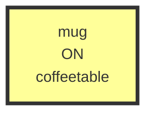
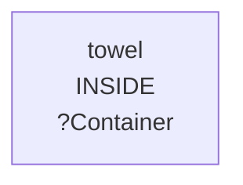
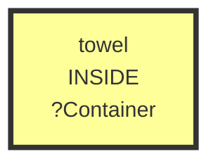
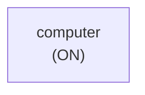
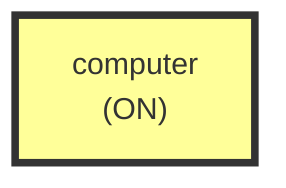
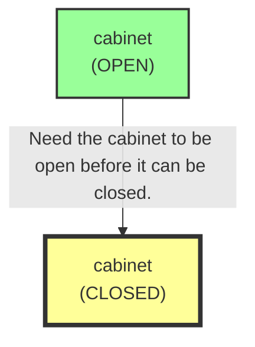

# 🚀 VirtualHome Agent Episode Log


### [GoalReasoner (Module A - Intent)] Output
```json
{
  "is_instruction_obviously_vague": false,
  "clarification_question": null,
  "target_object": "book",
  "location_hint": "sofa",
  "reasoning_chain": [
    {
      "question": "Why does the user want this object?",
      "answer": "To move an unorganized book to the sofa."
    },
    {
      "question": "Why is that important?",
      "answer": "To place the book in a more desired or organized location."
    },
    {
      "question": "What fundamental need does this fulfill?",
      "answer": "To organize and relocate a household item."
    },
    {
      "question": "Are there any deeper psychological or physical motivations?",
      "answer": "It may reduce clutter, improve order in the room, or make the book easier to access or use later."
    }
  ],
  "deep_intent": "The user wants to organize a household item by relocating it from an undesired state to a preferred resting place.",
  "acceptable_alternatives_properties": [
    {
      "priority": 1,
      "description": "Other loose reading materials, such as magazines or documents, moved to the sofa if they are similarly out of place"
    },
    {
      "priority": 2,
      "description": "Other paper-based household items that are currently unorganized and can be tidied into a seating area"
    },
    {
      "priority": 3,
      "description": "Nearby small household items that are cluttering the area and can be placed together for organization"
    },
    {
      "priority": 4,
      "description": "Any portable object that needs to be relocated from an unorganized spot to a designated resting place"
    }
  ]
}
```

### [RoboStateMultiTaskController] Output
```json
{
  "action": "[walk] <kitchen> (11)",
  "active_task_id": "task_2",
  "task_context": {
    "active_task_id": "task_2",
    "pending_task_ids": [
      "task_1",
      "task_3",
      "task_4",
      "task_5"
    ],
    "satisfied_task_ids": []
  },
  "source": "room_frontier"
}
```
## Step 0
- **Action**: `[walk] <kitchen> (11)`
- **Action Success**: `True`
- **Action Message**: {'0': {'message': 'Success'}}
- **Active Task**: `task_2`
- **Decision Source**: `room_frontier`
- **Task Progress**: E1_11=pending, E1_03=pending, E1_07=pending, E1_09=pending, E1_12=pending
- **SDG Status**:

- **Observed Items (38)**: floor(242), floor(243), floor(244), floor(245), ceiling(246), ceiling(247), ceiling(248), ceiling(249), wall(250), wall(251), wall(252), wall(253), door(254) [OPEN], ceilinglamp(255), tablelamp(256) [ON]...


### [RoboStateMultiTaskController] Output
```json
{
  "action": "[walk] <livingroom> (183)",
  "active_task_id": "task_2",
  "task_context": {
    "active_task_id": "task_2",
    "pending_task_ids": [
      "task_1",
      "task_3",
      "task_4",
      "task_5"
    ],
    "satisfied_task_ids": []
  },
  "source": "room_frontier"
}
```
## Step 1
- **Action**: `[walk] <livingroom> (183)`
- **Action Success**: `True`
- **Action Message**: {'0': {'message': 'Success'}}
- **Active Task**: `task_2`
- **Decision Source**: `room_frontier`
- **Task Progress**: E1_11=pending, E1_03=pending, E1_07=pending, E1_09=pending, E1_12=pending
- **SDG Status**:

- **Observed Items (193)**: floor(242), floor(243), floor(244), floor(245), ceiling(246), ceiling(247), ceiling(248), ceiling(249), wall(250), wall(251), wall(252), wall(253), door(254) [OPEN], ceilinglamp(255), tablelamp(256) [ON]...


### [PerceptionFilter] Output
```json
{
  "reasoning": "The goal is to place the book on the sofa, so the only strictly necessary classes are the target object and the destination furniture. No tool or alternative receptacle is required for this relocation task.",
  "selected_classes": [
    "book",
    "character",
    "sofa"
  ],
  "raw_class_count": 66
}
```

### [LLMExecutor] Output
```json
{
  "reasoning": "The active goal is to place a book on the sofa. We are already in the livingroom, and the sofa is available there. To satisfy the ON relation, the next step should be to move close to the sofa before any grab/putback sequence. Among the visible books, book(105) is the one currently closest to the character, so it is the best candidate to relocate toward the sofa without needing to search elsewhere. Since I cannot put an object onto a surface without first walking to that surface, the immediate action is to approach the sofa.",
  "satisfied_nodes": [],
  "current_node_focus": "N1",
  "mapped_variables": {
    "?TargetSurface": "sofa(214)",
    "?Book": "book(105)"
  },
  "action": "[walk] <sofa> (214)"
}
```

### [RoboStateMultiTaskController] Output
```json
{
  "action": "[walk] <sofa> (214)",
  "active_task_id": "task_2",
  "task_context": {
    "active_task_id": "task_2",
    "pending_task_ids": [
      "task_1",
      "task_3",
      "task_4",
      "task_5"
    ],
    "satisfied_task_ids": []
  },
  "source": "llm_executor"
}
```
## Step 2
- **Action**: `[walk] <sofa> (214)`
- **Action Success**: `True`
- **Action Message**: {'0': {'message': 'Success'}}
- **Active Task**: `task_2`
- **Decision Source**: `llm_executor`
- **Task Progress**: E1_11=pending, E1_03=pending, E1_07=pending, E1_09=pending, E1_12=pending
- **SDG Status**:

- **Observed Items (11)**: book(275) [CLOSED], character(1), kitchen(11), livingroom(183), bedroom(241), bathroom(285), bedroom(346), sofa(214), book(229) [CLOSED], book(230) [CLOSED], book(105) [CLOSED]


### [PerceptionFilter] Output
```json
{
  "reasoning": "Reused cached class selection.",
  "selected_classes": [
    "book",
    "character",
    "sofa"
  ],
  "raw_class_count": 66
}
```

### [LLMExecutor] Output
```json
{
  "reasoning": "The goal is to place a book on the sofa. The current graph shows book(105) is in the living room and close to the character, while the sofa is also in the living room and close to the character. Since I am already near the sofa and book(105), the next required step is to grab the book before I can put it on the sofa. I choose book(105) because it is the nearest accessible book and matches the goal object class.",
  "satisfied_nodes": [],
  "current_node_focus": "N1",
  "mapped_variables": {},
  "action": "[grab] <book> (105)"
}
```

### [RoboStateMultiTaskController] Output
```json
{
  "action": "[grab] <book> (105)",
  "active_task_id": "task_2",
  "task_context": {
    "active_task_id": "task_2",
    "pending_task_ids": [
      "task_1",
      "task_3",
      "task_4",
      "task_5"
    ],
    "satisfied_task_ids": []
  },
  "source": "llm_executor"
}
```
## Step 3
- **Action**: `[grab] <book> (105)`
- **Action Success**: `True`
- **Action Message**: {'0': {'message': 'Success'}}
- **Active Task**: `task_2`
- **Decision Source**: `llm_executor`
- **Task Progress**: E1_11=pending, E1_03=pending, E1_07=pending, E1_09=pending, E1_12=pending
- **SDG Status**:

- **Observed Items (11)**: book(275) [CLOSED], character(1), kitchen(11), livingroom(183), bedroom(241), bathroom(285), bedroom(346), sofa(214), book(229) [CLOSED], book(230) [CLOSED], book(105) [CLOSED]


### [PerceptionFilter] Output
```json
{
  "reasoning": "Reused cached class selection.",
  "selected_classes": [
    "book",
    "character",
    "sofa"
  ],
  "raw_class_count": 66
}
```

### [LLMExecutor] Output
```json
{
  "reasoning": "The active goal is to place a book on the sofa. The filtered graph shows I am already close to sofa(214) and currently holding book(105), which is in the living room and close to the character. Since the target support surface is the sofa and I must be explicitly near it before placing, the next step is to put the held book onto the sofa. N1 will be satisfied by this placement.",
  "satisfied_nodes": [],
  "current_node_focus": "N1",
  "mapped_variables": {
    "?TargetSurface": "sofa(214)"
  },
  "action": "[putback] <book> (105) <sofa> (214)"
}
```

### [RoboStateMultiTaskController] Output
```json
{
  "action": "[putback] <book> (105) <sofa> (214)",
  "active_task_id": "task_2",
  "task_context": {
    "active_task_id": "task_2",
    "pending_task_ids": [
      "task_1",
      "task_3",
      "task_4",
      "task_5"
    ],
    "satisfied_task_ids": []
  },
  "source": "llm_executor"
}
```
## Step 4
- **Action**: `[putback] <book> (105) <sofa> (214)`
- **Action Success**: `True`
- **Action Message**: {'0': {'message': 'Success'}}
- **Active Task**: `task_2`
- **Decision Source**: `llm_executor`
- **Task Progress**: E1_11=pending, E1_03=done, E1_07=pending, E1_09=pending, E1_12=pending
- **SDG Status**:

- **Observed Items (11)**: book(275) [CLOSED], character(1), kitchen(11), livingroom(183), bedroom(241), bathroom(285), bedroom(346), sofa(214), book(229) [CLOSED], book(230) [CLOSED], book(105) [CLOSED]


### [GoalReasoner (Module A - Intent)] Output
```json
{
  "is_instruction_obviously_vague": false,
  "clarification_question": null,
  "target_object": "mug",
  "location_hint": "coffeetable",
  "reasoning_chain": [
    {
      "question": "Why does the user want this object?",
      "answer": "To keep the mug in a specific location."
    },
    {
      "question": "Why is that important?",
      "answer": "To maintain the mug's placement on the coffeetable consistently."
    },
    {
      "question": "What fundamental need does this fulfill?",
      "answer": "To organize and control the mug's position in the living space."
    },
    {
      "question": "Are there any deeper psychological or physical motivations?",
      "answer": "It may support tidiness, convenience, or making the mug easy to find and use."
    }
  ],
  "deep_intent": "The user wants an item to remain in a designated place for organization and convenience.",
  "acceptable_alternatives_properties": [
    {
      "priority": 1,
      "description": "Other drinkware or small tabletop items that can be kept on the coffeetable in the same fixed position."
    },
    {
      "priority": 2,
      "description": "Small household objects that are typically stored on a coffee table for easy access."
    },
    {
      "priority": 3,
      "description": "Any portable item that the user wants kept organized and readily available in the living area."
    },
    {
      "priority": 4,
      "description": "Other objects with a similar need for stable placement and easy access, even if they are not drinkware."
    }
  ]
}
```

### [PerceptionFilter] Output
```json
{
  "reasoning": "The goal is to keep a mug on a coffeetable, so the only strictly necessary classes are the target item and the location/furniture it must be on. No extra tools or alternatives are required for this placement task.",
  "selected_classes": [
    "character",
    "mug",
    "coffeetable"
  ],
  "raw_class_count": 66
}
```

### [LLMExecutor] Output
```json
{
  "reasoning": "The active goal is to place the mug on the coffeetable. The mug is currently in the kitchen, while the character is already close to the coffeetable in the living room. To satisfy the SDG, the next step should be to go to the mug first so it can be grabbed before moving it onto the table. No task-specific constraints are currently satisfied yet.",
  "satisfied_nodes": [],
  "current_node_focus": "N1",
  "mapped_variables": {},
  "action": "[walk] <mug> (384)"
}
```

### [RoboStateMultiTaskController] Output
```json
{
  "action": "[walk] <mug> (384)",
  "active_task_id": "task_3",
  "task_context": {
    "active_task_id": "task_3",
    "pending_task_ids": [
      "task_1",
      "task_4",
      "task_5"
    ],
    "satisfied_task_ids": [
      "task_2"
    ]
  },
  "source": "llm_executor"
}
```
## Step 5
- **Action**: `[walk] <mug> (384)`
- **Action Success**: `True`
- **Action Message**: {'0': {'message': 'Success'}}
- **Active Task**: `task_3`
- **Decision Source**: `llm_executor`
- **Task Progress**: E1_11=pending, E1_03=done, E1_07=pending, E1_09=pending, E1_12=pending
- **SDG Status**:

- **Observed Items (8)**: character(1), kitchen(11), livingroom(183), bedroom(241), bathroom(285), bedroom(346), mug(384), coffeetable(215)


### [PerceptionFilter] Output
```json
{
  "reasoning": "Reused cached class selection.",
  "selected_classes": [
    "character",
    "mug",
    "coffeetable"
  ],
  "raw_class_count": 66
}
```

### [LLMExecutor] Output
```json
{
  "reasoning": "The active goal is to have mug(384) on coffeetable(215). I am already close to the mug and the coffeetable is also close, so the next step is to place the held mug onto the target surface. This directly satisfies the single SDG node N1. No other nodes are present.",
  "satisfied_nodes": [],
  "current_node_focus": "N1",
  "mapped_variables": {},
  "action": "[putback] <mug> (384) <coffeetable> (215)"
}
```

### [RoboStateMultiTaskController] Output
```json
{
  "action": "[grab] <mug> (384)",
  "active_task_id": "task_3",
  "task_context": {
    "active_task_id": "task_3",
    "pending_task_ids": [
      "task_1",
      "task_4",
      "task_5"
    ],
    "satisfied_task_ids": [
      "task_2"
    ]
  },
  "source": "llm_executor_repaired"
}
```
## Step 6
- **Action**: `[grab] <mug> (384)`
- **Action Success**: `True`
- **Action Message**: {'0': {'message': 'Success'}}
- **Active Task**: `task_3`
- **Decision Source**: `llm_executor_repaired`
- **Task Progress**: E1_11=pending, E1_03=done, E1_07=pending, E1_09=pending, E1_12=pending
- **SDG Status**:

- **Observed Items (8)**: character(1), kitchen(11), livingroom(183), bedroom(241), bathroom(285), bedroom(346), mug(384), coffeetable(215)


### [PerceptionFilter] Output
```json
{
  "reasoning": "Reused cached class selection.",
  "selected_classes": [
    "character",
    "mug",
    "coffeetable"
  ],
  "raw_class_count": 66
}
```

### [LLMExecutor] Output
```json
{
  "reasoning": "The active goal is to place the mug on the coffeetable. The mug is already held in the right hand, and the coffeetable is already close to the character, so the next required step is to place the held mug onto that surface. N1 is not yet satisfied because the mug is not on the coffeetable.",
  "satisfied_nodes": [],
  "current_node_focus": "N1",
  "mapped_variables": {},
  "action": "[putback] <mug> (384) <coffeetable> (215)"
}
```

### [RoboStateMultiTaskController] Output
```json
{
  "action": "[putback] <mug> (384) <coffeetable> (215)",
  "active_task_id": "task_3",
  "task_context": {
    "active_task_id": "task_3",
    "pending_task_ids": [
      "task_1",
      "task_4",
      "task_5"
    ],
    "satisfied_task_ids": [
      "task_2"
    ]
  },
  "source": "llm_executor"
}
```
## Step 7
- **Action**: `[putback] <mug> (384) <coffeetable> (215)`
- **Action Success**: `True`
- **Action Message**: {'0': {'message': 'Success'}}
- **Active Task**: `task_3`
- **Decision Source**: `llm_executor`
- **Task Progress**: E1_11=pending, E1_03=done, E1_07=done, E1_09=pending, E1_12=pending
- **SDG Status**:

- **Observed Items (8)**: character(1), kitchen(11), livingroom(183), bedroom(241), bathroom(285), bedroom(346), mug(384), coffeetable(215)


### [GoalReasoner (Module A - Intent)] Output
```json
{
  "is_instruction_obviously_vague": false,
  "clarification_question": null,
  "target_object": "towels",
  "location_hint": null,
  "reasoning_chain": [
    {
      "question": "Why does the user want this object?",
      "answer": "To have towels placed into the dishwasher when they are seen."
    },
    {
      "question": "Why is that important?",
      "answer": "The user wants the towels moved into a specific appliance, likely to change their state or location as instructed."
    },
    {
      "question": "What fundamental need does this fulfill?",
      "answer": "It fulfills a need to organize or process household items according to the user's directive."
    },
    {
      "question": "Are there any deeper psychological or physical motivations?",
      "answer": "The user may be aiming to manage clutter, follow a cleaning routine, or prepare items for washing or another household process."
    }
  ],
  "deep_intent": "The user wants household textiles to be processed or relocated according to a specified cleaning-related task.",
  "acceptable_alternatives_properties": [
    {
      "priority": 1,
      "description": "Other washable soft household textiles, such as dish cloths, washcloths, or rags, if the goal is to send fabric items for cleaning."
    },
    {
      "priority": 2,
      "description": "Similar fabric items used for wiping or drying, such as kitchen towels or cleaning cloths."
    },
    {
      "priority": 3,
      "description": "Other small household laundry items that can be collected for washing or processing."
    },
    {
      "priority": 4,
      "description": "Any other dirty or used fabric items that need to be moved into a cleaning appliance or laundry area."
    }
  ]
}
```

### [RoboStateMultiTaskController] Output
```json
{
  "action": "[walk] <bathroom> (285)",
  "active_task_id": "task_4",
  "task_context": {
    "active_task_id": "task_4",
    "pending_task_ids": [
      "task_1",
      "task_5"
    ],
    "satisfied_task_ids": [
      "task_2",
      "task_3"
    ]
  },
  "source": "room_frontier"
}
```
## Step 8
- **Action**: `[walk] <bathroom> (285)`
- **Action Success**: `True`
- **Action Message**: {'0': {'message': 'Success'}}
- **Active Task**: `task_4`
- **Decision Source**: `room_frontier`
- **Task Progress**: E1_11=pending, E1_03=done, E1_07=done, E1_09=pending, E1_12=pending
- **SDG Status**:

- **Observed Items (246)**: floor(242), floor(243), floor(244), floor(245), ceiling(246), ceiling(247), ceiling(248), ceiling(249), wall(250), wall(251), wall(252), wall(253), door(254) [OPEN], ceilinglamp(255), tablelamp(256) [ON]...


### [PerceptionFilter] Output
```json
{
  "reasoning": "The goal is to move towels into a dishwasher, so the target object class is towel and the needed container/appliance is dishwasher. No other tools are required by the SDG.",
  "selected_classes": [
    "dishwasher",
    "character",
    "towel"
  ],
  "raw_class_count": 82
}
```

### [LLMExecutor] Output
```json
{
  "reasoning": "The active goal is to place a towel inside the dishwasher. The dishwasher(165) is the correct container candidate and is already OPEN, so the next necessary step is to get close to it before any putin action. We are currently in the bathroom, not near the dishwasher in the kitchen. Since the user wants towels and the graph shows five available towels in the bathroom, the immediate progress action is to walk to the dishwasher first.",
  "satisfied_nodes": [],
  "current_node_focus": "N1",
  "mapped_variables": {
    "?Container": "dishwasher(165)"
  },
  "action": "[walk] <dishwasher> (165)"
}
```

### [RoboStateMultiTaskController] Output
```json
{
  "action": "[walk] <dishwasher> (165)",
  "active_task_id": "task_4",
  "task_context": {
    "active_task_id": "task_4",
    "pending_task_ids": [
      "task_1",
      "task_5"
    ],
    "satisfied_task_ids": [
      "task_2",
      "task_3"
    ]
  },
  "source": "llm_executor"
}
```
## Step 9
- **Action**: `[walk] <dishwasher> (165)`
- **Action Success**: `True`
- **Action Message**: {'0': {'message': 'Success'}}
- **Active Task**: `task_4`
- **Decision Source**: `llm_executor`
- **Task Progress**: E1_11=pending, E1_03=done, E1_07=done, E1_09=pending, E1_12=pending
- **SDG Status**:

- **Observed Items (12)**: character(1), kitchen(11), livingroom(183), bedroom(241), bathroom(285), bedroom(346), dishwasher(165) [OPEN,OFF], towel(328), towel(329), towel(330), towel(342), towel(343)


### [PerceptionFilter] Output
```json
{
  "reasoning": "Reused cached class selection.",
  "selected_classes": [
    "dishwasher",
    "character",
    "towel"
  ],
  "raw_class_count": 82
}
```

### [LLMExecutor] Output
```json
{
  "reasoning": "The active goal is to place a towel inside a container, and the only suitable container currently visible is the dishwasher(165), which is already open. We are already close to the dishwasher, so the next step is to grab one towel from the bathroom and then later return to the dishwasher for insertion. Since only a single atomic action is allowed now, we should first move to a towel. I will choose towel(328) as the first available matching towel instance in the bathroom.",
  "satisfied_nodes": [],
  "current_node_focus": "N1",
  "mapped_variables": {
    "?Container": "dishwasher(165)"
  },
  "action": "[walk] <towel> (328)"
}
```

### [RoboStateMultiTaskController] Output
```json
{
  "action": "[walk] <towel> (328)",
  "active_task_id": "task_4",
  "task_context": {
    "active_task_id": "task_4",
    "pending_task_ids": [
      "task_1",
      "task_5"
    ],
    "satisfied_task_ids": [
      "task_2",
      "task_3"
    ]
  },
  "source": "llm_executor"
}
```
## Step 10
- **Action**: `[walk] <towel> (328)`
- **Action Success**: `True`
- **Action Message**: {'0': {'message': 'Success'}}
- **Active Task**: `task_4`
- **Decision Source**: `llm_executor`
- **Task Progress**: E1_11=pending, E1_03=done, E1_07=done, E1_09=pending, E1_12=pending
- **SDG Status**:

- **Observed Items (12)**: character(1), kitchen(11), livingroom(183), bedroom(241), bathroom(285), bedroom(346), dishwasher(165) [OPEN,OFF], towel(328), towel(329), towel(330), towel(342), towel(343)


### [PerceptionFilter] Output
```json
{
  "reasoning": "Reused cached class selection.",
  "selected_classes": [
    "dishwasher",
    "character",
    "towel"
  ],
  "raw_class_count": 82
}
```

### [LLMExecutor] Output
```json
{
  "reasoning": "The active SDG requires a towel to be INSIDE some container. The dishwasher is the best available container target in the filtered graph, and it is already OPEN and close to the character. I am currently close to towel(328), so the next valid step is to grab it before I can move it into the dishwasher. I will not repeat the recent walk action.",
  "satisfied_nodes": [],
  "current_node_focus": "N1",
  "mapped_variables": {
    "?Container": "dishwasher(165)"
  },
  "action": "[grab] <towel> (328)"
}
```

### [RoboStateMultiTaskController] Output
```json
{
  "action": "[grab] <towel> (328)",
  "active_task_id": "task_4",
  "task_context": {
    "active_task_id": "task_4",
    "pending_task_ids": [
      "task_1",
      "task_5"
    ],
    "satisfied_task_ids": [
      "task_2",
      "task_3"
    ]
  },
  "source": "llm_executor"
}
```
## Step 11
- **Action**: `[grab] <towel> (328)`
- **Action Success**: `True`
- **Action Message**: {'0': {'message': 'Success'}}
- **Active Task**: `task_4`
- **Decision Source**: `llm_executor`
- **Task Progress**: E1_11=pending, E1_03=done, E1_07=done, E1_09=pending, E1_12=pending
- **SDG Status**:

- **Observed Items (12)**: character(1), kitchen(11), livingroom(183), bedroom(241), bathroom(285), bedroom(346), dishwasher(165) [OPEN,OFF], towel(328), towel(329), towel(330), towel(342), towel(343)


### [PerceptionFilter] Output
```json
{
  "reasoning": "Reused cached class selection.",
  "selected_classes": [
    "dishwasher",
    "character",
    "towel"
  ],
  "raw_class_count": 82
}
```

### [LLMExecutor] Output
```json
{
  "reasoning": "The active goal is to get a towel inside the dishwasher. I am already holding towel(328), and the dishwasher(165) is open and close to the character, so the next required step is to walk directly to the dishwasher before any putin action. No other SDG nodes are satisfied yet because the towel is not inside the dishwasher.",
  "satisfied_nodes": [],
  "current_node_focus": "N1",
  "mapped_variables": {
    "?Container": "dishwasher(165)"
  },
  "action": "[walk] <dishwasher> (165)"
}
```

### [RoboStateMultiTaskController] Output
```json
{
  "action": "[walk] <dishwasher> (165)",
  "active_task_id": "task_4",
  "task_context": {
    "active_task_id": "task_4",
    "pending_task_ids": [
      "task_1",
      "task_5"
    ],
    "satisfied_task_ids": [
      "task_2",
      "task_3"
    ]
  },
  "source": "llm_executor"
}
```
## Step 12
- **Action**: `[walk] <dishwasher> (165)`
- **Action Success**: `True`
- **Action Message**: {'0': {'message': 'Success'}}
- **Active Task**: `task_4`
- **Decision Source**: `llm_executor`
- **Task Progress**: E1_11=pending, E1_03=done, E1_07=done, E1_09=pending, E1_12=pending
- **SDG Status**:

- **Observed Items (12)**: character(1), kitchen(11), livingroom(183), bedroom(241), bathroom(285), bedroom(346), dishwasher(165) [OPEN,OFF], towel(328), towel(329), towel(330), towel(342), towel(343)


### [PerceptionFilter] Output
```json
{
  "reasoning": "Reused cached class selection.",
  "selected_classes": [
    "dishwasher",
    "character",
    "towel"
  ],
  "raw_class_count": 82
}
```

### [LLMExecutor] Output
```json
{
  "reasoning": "The active SDG requires a towel to be INSIDE a container. We are already holding towel(328) and are close to the dishwasher(165), which is open and available as the target container. The next required step is to place the held towel into the dishwasher. Since putting into a container requires being near the destination and explicitly walking first, but we are already close to the dishwasher and the last action was a walk to it, the next atomic action is to put the towel inside it.",
  "satisfied_nodes": [],
  "current_node_focus": "N1",
  "mapped_variables": {
    "?Container": "dishwasher(165)"
  },
  "action": "[putin] <towel> (328) <dishwasher> (165)"
}
```

### [RoboStateMultiTaskController] Output
```json
{
  "action": "[putin] <towel> (328) <dishwasher> (165)",
  "active_task_id": "task_4",
  "task_context": {
    "active_task_id": "task_4",
    "pending_task_ids": [
      "task_1",
      "task_5"
    ],
    "satisfied_task_ids": [
      "task_2",
      "task_3"
    ]
  },
  "source": "llm_executor"
}
```
## Step 13
- **Action**: `[putin] <towel> (328) <dishwasher> (165)`
- **Action Success**: `True`
- **Action Message**: {'0': {'message': 'Success'}}
- **Active Task**: `task_4`
- **Decision Source**: `llm_executor`
- **Task Progress**: E1_11=pending, E1_03=done, E1_07=done, E1_09=done, E1_12=pending
- **SDG Status**:

- **Observed Items (12)**: character(1), kitchen(11), livingroom(183), bedroom(241), bathroom(285), bedroom(346), dishwasher(165) [OPEN,OFF], towel(328), towel(329), towel(330), towel(342), towel(343)


### [GoalReasoner (Module A - Intent)] Output
```json
{
  "is_instruction_obviously_vague": false,
  "clarification_question": null,
  "target_object": "computer",
  "location_hint": null,
  "reasoning_chain": [
    {
      "question": "Why does the user want this object?",
      "answer": "To have the computer on and usable."
    },
    {
      "question": "Why is that important?",
      "answer": "Because the computer must be in the on state for operation or access."
    },
    {
      "question": "What fundamental need does this fulfill?",
      "answer": "It fulfills the need to use or interact with the computer."
    },
    {
      "question": "Are there any deeper psychological or physical motivations?",
      "answer": "The user likely wants to restore functionality, productivity, or access to tasks that require the computer to be powered on."
    }
  ],
  "deep_intent": "The user wants the computer to be powered on and operational.",
  "acceptable_alternatives_properties": [
    {
      "priority": 1,
      "description": "Other powered-on computing devices that can provide similar functionality, such as a laptop, desktop, or tablet."
    },
    {
      "priority": 2,
      "description": "A different computer terminal or workstation that is already on and usable."
    },
    {
      "priority": 3,
      "description": "Any nearby electronic device that can serve the same immediate purpose of computing or access, such as a tablet or smart display."
    },
    {
      "priority": 4,
      "description": "A non-computer device that can still support the underlying task, such as a phone if the user mainly needs access to information or communication."
    }
  ]
}
```

### [RoboStateMultiTaskController] Output
```json
{
  "action": "[walk] <bedroom> (346)",
  "active_task_id": "task_1",
  "task_context": {
    "active_task_id": "task_1",
    "pending_task_ids": [
      "task_5"
    ],
    "satisfied_task_ids": [
      "task_2",
      "task_3",
      "task_4"
    ]
  },
  "source": "room_frontier"
}
```
## Step 14
- **Action**: `[walk] <bedroom> (346)`
- **Action Success**: `True`
- **Action Message**: {'0': {'message': 'Success'}}
- **Active Task**: `task_1`
- **Decision Source**: `room_frontier`
- **Task Progress**: E1_11=pending, E1_03=done, E1_07=done, E1_09=done, E1_12=pending
- **SDG Status**:

- **Observed Items (306)**: floor(242), floor(243), floor(244), floor(245), ceiling(246), ceiling(247), ceiling(248), ceiling(249), wall(250), wall(251), wall(252), wall(253), door(254) [OPEN], ceilinglamp(255), tablelamp(256) [ON]...


### [PerceptionFilter] Output
```json
{
  "reasoning": "The goal is to power on and use the computer, so the target computer must be kept. Since a powered-on alternative computing device can satisfy the same immediate purpose, nearby usable computing-related devices should be retained as backups, along with the workstation components directly tied to operating the computer.",
  "selected_classes": [
    "computer",
    "cpuscreen",
    "tablet",
    "character",
    "tv",
    "keyboard",
    "laptop",
    "mouse",
    "wallphone",
    "desk",
    "chair"
  ],
  "raw_class_count": 91
}
```

### [LLMExecutor] Output
```json
{
  "reasoning": "The active goal is to turn the computer ON. The computer is already visible in bedroom(346) and its current state is OFF, so the next required step is to move close enough to interact with its switch. I will walk to the computer before switching it on.",
  "satisfied_nodes": [],
  "current_node_focus": "N1",
  "mapped_variables": {},
  "action": "[walk] <computer> (397)"
}
```

### [RoboStateMultiTaskController] Output
```json
{
  "action": "[walk] <computer> (397)",
  "active_task_id": "task_1",
  "task_context": {
    "active_task_id": "task_1",
    "pending_task_ids": [
      "task_5"
    ],
    "satisfied_task_ids": [
      "task_2",
      "task_3",
      "task_4"
    ]
  },
  "source": "llm_executor"
}
```
## Step 15
- **Action**: `[walk] <computer> (397)`
- **Action Success**: `True`
- **Action Message**: {'0': {'message': 'Success'}}
- **Active Task**: `task_1`
- **Decision Source**: `llm_executor`
- **Task Progress**: E1_11=pending, E1_03=done, E1_07=done, E1_09=done, E1_12=pending
- **SDG Status**:

- **Observed Items (17)**: desk(281) [CLOSED], chair(283), character(1), kitchen(11), livingroom(183), bedroom(241), bathroom(285), bedroom(346), wallphone(56) [OFF], chair(160), tv(238) [OFF], chair(392), desk(393) [CLOSED], computer(397) [OFF], mouse(398)...


### [PerceptionFilter] Output
```json
{
  "reasoning": "Reused cached class selection.",
  "selected_classes": [
    "computer",
    "cpuscreen",
    "tablet",
    "character",
    "tv",
    "keyboard",
    "laptop",
    "mouse",
    "wallphone",
    "desk",
    "chair"
  ],
  "raw_class_count": 91
}
```

### [LLMExecutor] Output
```json
{
  "reasoning": "The active task is to make the computer ON. We are already close to computer(397) in bedroom(346), and it has the HAS_SWITCH property, so the next required step is to switch it on. No other prerequisites are needed.",
  "satisfied_nodes": [],
  "current_node_focus": "N1",
  "mapped_variables": {
    "?Computer": "computer(397)"
  },
  "action": "[switchon] <computer> (397)"
}
```

### [RoboStateMultiTaskController] Output
```json
{
  "action": "[switchon] <computer> (397)",
  "active_task_id": "task_1",
  "task_context": {
    "active_task_id": "task_1",
    "pending_task_ids": [
      "task_5"
    ],
    "satisfied_task_ids": [
      "task_2",
      "task_3",
      "task_4"
    ]
  },
  "source": "llm_executor"
}
```
## Step 16
- **Action**: `[switchon] <computer> (397)`
- **Action Success**: `True`
- **Action Message**: Faked switch operation in Python layer (bypassed Unity failure)
- **Active Task**: `task_1`
- **Decision Source**: `llm_executor`
- **Task Progress**: E1_11=done, E1_03=done, E1_07=done, E1_09=done, E1_12=pending
- **SDG Status**:

- **Observed Items (17)**: desk(281) [CLOSED], chair(283), character(1), kitchen(11), livingroom(183), bedroom(241), bathroom(285), bedroom(346), wallphone(56) [OFF], chair(160), tv(238) [OFF], chair(392), desk(393) [CLOSED], computer(397) [OFF], mouse(398)...


### [GoalReasoner (Module A - Intent)] Output
```json
{
  "is_instruction_obviously_vague": false,
  "clarification_question": null,
  "target_object": "cabinet",
  "location_hint": null,
  "reasoning_chain": [
    {
      "question": "Why does the user want this object?",
      "answer": "To change the cabinet's state from open to closed if it is currently open."
    },
    {
      "question": "Why is that important?",
      "answer": "Closed cabinets help keep the space orderly, protect contents, and prevent the door from remaining in an undesired position."
    },
    {
      "question": "What fundamental need does this fulfill?",
      "answer": "Maintaining a desired physical state in the environment."
    },
    {
      "question": "Are there any deeper psychological or physical motivations?",
      "answer": "It may support safety, tidiness, or convenience by ensuring the cabinet is not left open."
    }
  ],
  "deep_intent": "The user wants to ensure a cabinet is in the closed state.",
  "acceptable_alternatives_properties": [
    {
      "priority": 1,
      "description": "Other closable storage doors or panels that can be shut to secure contents, such as a closet door or drawer front."
    },
    {
      "priority": 2,
      "description": "Similar household enclosures with openable access points that can be returned to a closed state, such as a cupboard or pantry door."
    },
    {
      "priority": 3,
      "description": "Any interior fixture that can be left open or closed and should be set to closed for tidiness or safety."
    },
    {
      "priority": 4,
      "description": "Other household items with movable parts that can be put into a non-open position, such as a box lid or storage bin cover."
    }
  ]
}
```

### [PerceptionFilter] Output
```json
{
  "reasoning": "The goal is to ensure a cabinet is closed, so the only strictly necessary object class is the target cabinet itself. No tools or alternative receptacles are needed for this state-change task.",
  "selected_classes": [
    "closet",
    "character",
    "door",
    "box",
    "cabinet"
  ],
  "raw_class_count": 91
}
```

### [LLMExecutor] Output
```json
{
  "reasoning": "The active goal is to make a cabinet closed. In the current graph, cabinet(396) is already OPEN, so the prerequisite state N2 is satisfied and the remaining step is to close it. I must first be near the cabinet before closing it, and I have no evidence that I am already at the cabinet location, so the correct next atomic action is to walk to cabinet(396).",
  "satisfied_nodes": [
    "N2"
  ],
  "current_node_focus": "N1",
  "mapped_variables": {},
  "action": "[walk] <cabinet> (396)"
}
```

### [RoboStateMultiTaskController] Output
```json
{
  "action": "[walk] <cabinet> (396)",
  "active_task_id": "task_5",
  "task_context": {
    "active_task_id": "task_5",
    "pending_task_ids": [],
    "satisfied_task_ids": [
      "task_1",
      "task_2",
      "task_3",
      "task_4"
    ]
  },
  "source": "llm_executor"
}
```
## Step 17
- **Action**: `[walk] <cabinet> (396)`
- **Action Success**: `True`
- **Action Message**: {'0': {'message': 'Success'}}
- **Active Task**: `task_5`
- **Decision Source**: `llm_executor`
- **Task Progress**: E1_11=done, E1_03=done, E1_07=done, E1_09=done, E1_12=pending
- **SDG Status**:

- **Observed Items (13)**: door(254) [OPEN], box(270) [CLOSED], character(1), kitchen(11), livingroom(183), bedroom(241), bathroom(285), bedroom(346), door(47) [OPEN], box(231) [CLOSED], door(305) [OPEN], closet(395) [CLOSED], cabinet(396) [OPEN]


### [PerceptionFilter] Output
```json
{
  "reasoning": "Reused cached class selection.",
  "selected_classes": [
    "closet",
    "character",
    "door",
    "box",
    "cabinet"
  ],
  "raw_class_count": 91
}
```

### [LLMExecutor] Output
```json
{
  "reasoning": "The active task is to make the cabinet closed. The current graph shows cabinet(396) is OPEN and the character is CLOSE to it, so no additional walking is needed. Since closing requires being near the cabinet and it is already open, the next action is to close it directly.",
  "satisfied_nodes": [
    "N2"
  ],
  "current_node_focus": "N1",
  "mapped_variables": {},
  "action": "[close] <cabinet> (396)"
}
```

### [RoboStateMultiTaskController] Output
```json
{
  "action": "[close] <cabinet> (396)",
  "active_task_id": "task_5",
  "task_context": {
    "active_task_id": "task_5",
    "pending_task_ids": [],
    "satisfied_task_ids": [
      "task_1",
      "task_2",
      "task_3",
      "task_4"
    ]
  },
  "source": "llm_executor"
}
```
## Step 18
- **Action**: `[close] <cabinet> (396)`
- **Action Success**: `True`
- **Action Message**: {'0': {'message': 'Success'}}
- **Active Task**: `task_5`
- **Decision Source**: `llm_executor`
- **Task Progress**: E1_11=done, E1_03=done, E1_07=done, E1_09=done, E1_12=done
- **SDG Status**:

- **Observed Items (13)**: door(254) [OPEN], box(270) [CLOSED], character(1), kitchen(11), livingroom(183), bedroom(241), bathroom(285), bedroom(346), door(47) [OPEN], box(231) [CLOSED], door(305) [OPEN], closet(395) [CLOSED], cabinet(396) [OPEN]

