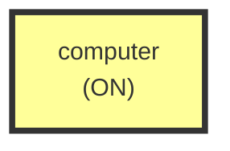
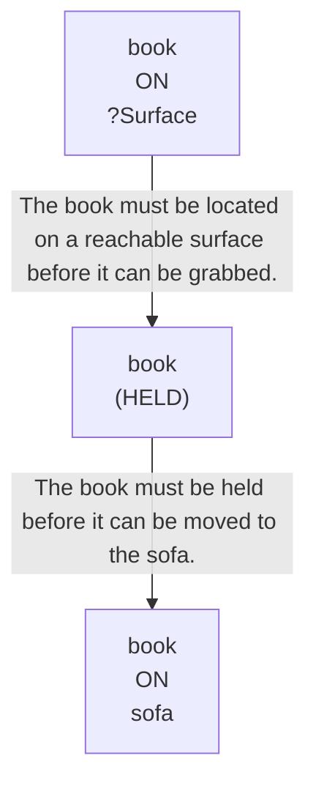
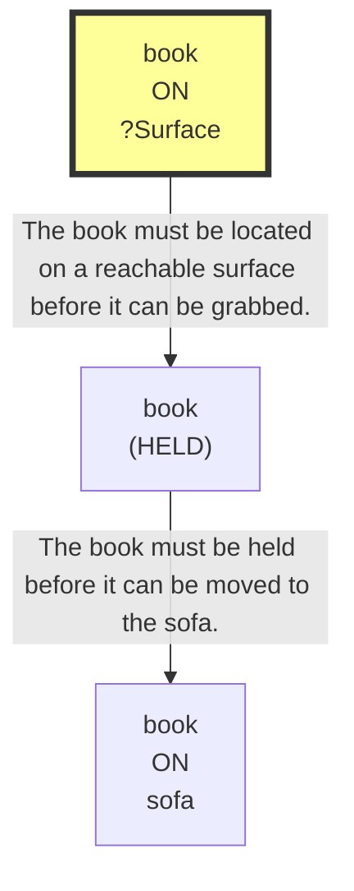
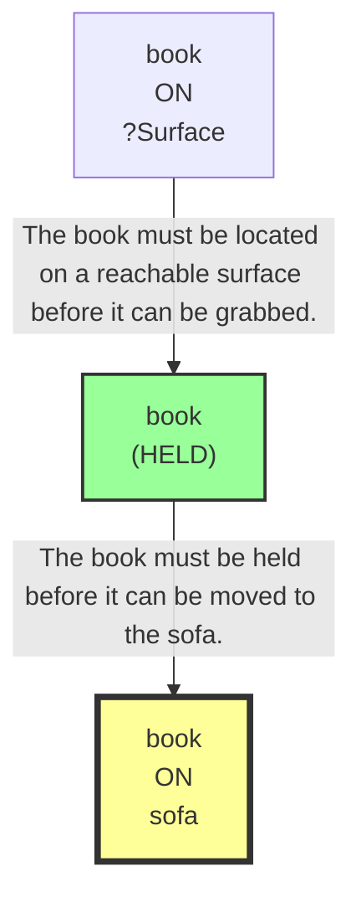
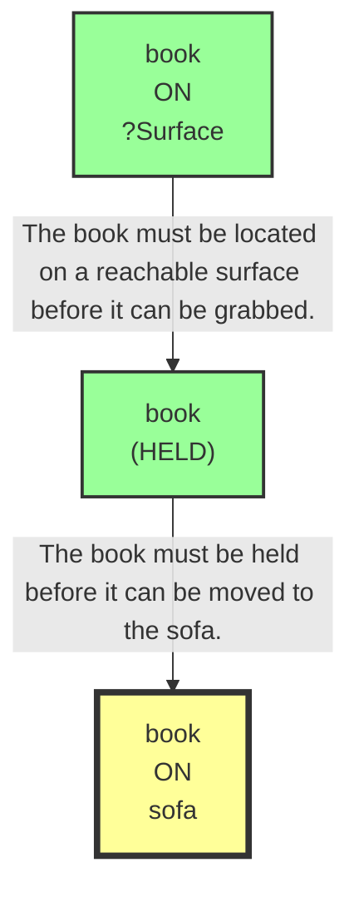
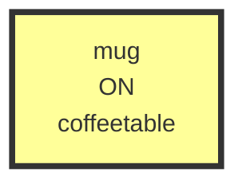
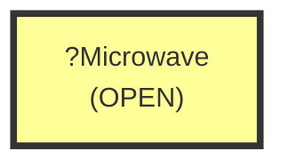
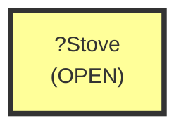

# 🚀 VirtualHome Agent Episode Log


### [GoalReasoner (Module A - Intent)] Output
```json
{
  "is_instruction_obviously_vague": false,
  "clarification_question": null,
  "target_object": "computer",
  "location_hint": null,
  "reasoning_chain": [
    {
      "question": "Why does the user want this object?",
      "answer": "To ensure the computer is in an on state rather than remaining off."
    },
    {
      "question": "Why is that important?",
      "answer": "Because an off computer cannot be used to perform tasks or provide access to needed functions."
    },
    {
      "question": "What fundamental need does this fulfill?",
      "answer": "It fulfills the need to use computing functionality and restore device availability."
    },
    {
      "question": "Are there any deeper psychological or physical motivations?",
      "answer": "The user likely wants readiness, access, or continuity of work or interaction that depends on the computer being powered on."
    }
  ],
  "deep_intent": "The user wants to restore access to a usable powered-on computer.",
  "acceptable_alternatives_properties": [
    {
      "priority": 1,
      "description": "Other powered-on computing devices that can provide similar access, such as a laptop, tablet, or desktop computer."
    },
    {
      "priority": 2,
      "description": "Any nearby device that can serve the same immediate computing function, such as a different computer with the needed account or application available."
    },
    {
      "priority": 3,
      "description": "A secondary digital device that can support the same task, such as a smartphone or tablet if a computer is unavailable."
    },
    {
      "priority": 4,
      "description": "Any device or system that allows the user to continue the intended digital activity, even if it is not a computer, such as a kiosk or shared terminal."
    }
  ]
}
```

### [PerceptionFilter] Output
```json
{
  "reasoning": "The goal is to restore a usable computer to the ON state. The SDG only requires the computer itself, and the visible list includes a computer that matches the target object. No extra tools or location objects are needed for this state goal.",
  "selected_classes": [
    "character",
    "computer",
    "desk"
  ],
  "raw_class_count": 33
}
```

### [LLMExecutor] Output
```json
{
  "reasoning": "The active task is to make the computer ON. The filtered graph shows computer(174) is currently OFF and is in the same room as the character (bedroom). To change its state, I must first be near it, so the correct next step is to walk to the computer before attempting to switch it on.",
  "satisfied_nodes": [],
  "current_node_focus": "N1",
  "mapped_variables": {
    "?Computer": "computer(174)"
  },
  "action": "[walk] <computer> (174)"
}
```

### [RoboStateMultiTaskController] Output
```json
{
  "action": "[walk] <computer> (174)",
  "active_task_id": "task_1",
  "task_context": {
    "active_task_id": "task_1",
    "pending_task_ids": [
      "task_2",
      "task_3",
      "task_4",
      "task_5"
    ],
    "satisfied_task_ids": []
  },
  "source": "llm_executor"
}
```
## Step 0
- **Action**: `[walk] <computer> (174)`
- **Action Success**: `True`
- **Action Message**: {'0': {'message': 'Success'}}
- **Active Task**: `task_1`
- **Decision Source**: `llm_executor`
- **Task Progress**: E1_11=pending, E1_03=pending, E1_07=pending, E1_05=pending, E1_06=pending
- **SDG Status**:

- **Observed Items (7)**: desk(108) [CLOSED], computer(174) [OFF], character(1), bathroom(11), bedroom(73), kitchen(205), livingroom(335)


### [PerceptionFilter] Output
```json
{
  "reasoning": "Reused cached class selection.",
  "selected_classes": [
    "character",
    "computer",
    "desk"
  ],
  "raw_class_count": 33
}
```

### [LLMExecutor] Output
```json
{
  "reasoning": "The active task is to make the computer ON. The current graph shows computer(174) is OFF and the character is already CLOSE to it, so the next atomic step is to switch it on. No additional movement or container interaction is needed.",
  "satisfied_nodes": [],
  "current_node_focus": "N1",
  "mapped_variables": {},
  "action": "[switchon] <computer> (174)"
}
```

### [RoboStateMultiTaskController] Output
```json
{
  "action": "[switchon] <computer> (174)",
  "active_task_id": "task_1",
  "task_context": {
    "active_task_id": "task_1",
    "pending_task_ids": [
      "task_2",
      "task_3",
      "task_4",
      "task_5"
    ],
    "satisfied_task_ids": []
  },
  "source": "llm_executor"
}
```
## Step 1
- **Action**: `[switchon] <computer> (174)`
- **Action Success**: `True`
- **Action Message**: Faked switch operation in Python layer (bypassed Unity failure)
- **Active Task**: `task_1`
- **Decision Source**: `llm_executor`
- **Task Progress**: E1_11=done, E1_03=pending, E1_07=pending, E1_05=pending, E1_06=pending
- **SDG Status**:

- **Observed Items (7)**: desk(108) [CLOSED], computer(174) [OFF], character(1), bathroom(11), bedroom(73), kitchen(205), livingroom(335)


### [GoalReasoner (Module A - Intent)] Output
```json
{
  "is_instruction_obviously_vague": false,
  "clarification_question": null,
  "target_object": "book",
  "location_hint": "sofa",
  "reasoning_chain": [
    {
      "question": "Why does the user want this object?",
      "answer": "To move an unorganized book to the sofa."
    },
    {
      "question": "Why is that important?",
      "answer": "To place the book in the requested location instead of leaving it unorganized elsewhere."
    },
    {
      "question": "What fundamental need does this fulfill?",
      "answer": "To organize or relocate a household item to a designated resting place."
    },
    {
      "question": "Are there any deeper psychological or physical motivations?",
      "answer": "It likely reflects a desire for tidiness, easier access, or reducing clutter in the environment."
    }
  ],
  "deep_intent": "The user wants to organize or relocate a household item to a designated place.",
  "acceptable_alternatives_properties": [
    {
      "priority": 1,
      "description": "Other readable items such as magazines, notebooks, or papers that are similarly unorganized and can be moved to the sofa"
    },
    {
      "priority": 2,
      "description": "Other lightweight personal items typically found indoors that can be tidied and relocated, such as a tablet or folder"
    },
    {
      "priority": 3,
      "description": "Other clutter items that can be put into a more orderly resting spot in the living area"
    },
    {
      "priority": 4,
      "description": "Any nearby household item that the user intends to have placed on the sofa for convenience or organization"
    }
  ]
}
```

### [RoboStateMultiTaskController] Output
```json
{
  "action": "[walk] <bathroom> (11)",
  "active_task_id": "task_2",
  "task_context": {
    "active_task_id": "task_2",
    "pending_task_ids": [
      "task_3",
      "task_4",
      "task_5"
    ],
    "satisfied_task_ids": [
      "task_1"
    ]
  },
  "source": "room_frontier"
}
```
## Step 2
- **Action**: `[walk] <bathroom> (11)`
- **Action Success**: `True`
- **Action Message**: {'0': {'message': 'Success'}}
- **Active Task**: `task_2`
- **Decision Source**: `room_frontier`
- **Task Progress**: E1_11=done, E1_03=pending, E1_07=pending, E1_05=pending, E1_06=pending
- **SDG Status**:

- **Observed Items (74)**: floor(74), floor(75), floor(76), floor(77), floor(78), floor(79), floor(80), floor(81), floor(82), wall(83), wall(84), wall(85), wall(86), wall(87), wall(88)...


### [RoboStateMultiTaskController] Output
```json
{
  "action": "[walk] <kitchen> (205)",
  "active_task_id": "task_2",
  "task_context": {
    "active_task_id": "task_2",
    "pending_task_ids": [
      "task_3",
      "task_4",
      "task_5"
    ],
    "satisfied_task_ids": [
      "task_1"
    ]
  },
  "source": "room_frontier"
}
```
## Step 3
- **Action**: `[walk] <kitchen> (205)`
- **Action Success**: `True`
- **Action Message**: {'0': {'message': 'Success'}}
- **Active Task**: `task_2`
- **Decision Source**: `room_frontier`
- **Task Progress**: E1_11=done, E1_03=pending, E1_07=pending, E1_05=pending, E1_06=pending
- **SDG Status**:

- **Observed Items (135)**: floor(74), floor(75), floor(76), floor(77), floor(78), floor(79), floor(80), floor(81), floor(82), wall(83), wall(84), wall(85), wall(86), wall(87), wall(88)...


### [RoboStateMultiTaskController] Output
```json
{
  "action": "[walk] <livingroom> (335)",
  "active_task_id": "task_2",
  "task_context": {
    "active_task_id": "task_2",
    "pending_task_ids": [
      "task_3",
      "task_4",
      "task_5"
    ],
    "satisfied_task_ids": [
      "task_1"
    ]
  },
  "source": "room_frontier"
}
```
## Step 4
- **Action**: `[walk] <livingroom> (335)`
- **Action Success**: `True`
- **Action Message**: {'0': {'message': 'Success'}}
- **Active Task**: `task_2`
- **Decision Source**: `room_frontier`
- **Task Progress**: E1_11=done, E1_03=pending, E1_07=pending, E1_05=pending, E1_06=pending
- **SDG Status**:

- **Observed Items (243)**: floor(74), floor(75), floor(76), floor(77), floor(78), floor(79), floor(80), floor(81), floor(82), wall(83), wall(84), wall(85), wall(86), wall(87), wall(88)...


### [PerceptionFilter] Output
```json
{
  "reasoning": "The task is to move the target object book onto the sofa. The SDG requires the book itself, the destination sofa, and a reachable surface to pick the book up from. No additional tools are implied beyond handling the book, so only those relevant object classes are kept.",
  "selected_classes": [
    "paper",
    "character",
    "door",
    "table",
    "folder",
    "book",
    "bed",
    "sofa"
  ],
  "raw_class_count": 101
}
```

### [LLMExecutor] Output
```json
{
  "reasoning": "The active goal is to place a book on the sofa. The current graph shows the character is already close to sofa(368), and the book we should use is book(268), which is also close to the character in the living room. Since the book is not yet held, the next required step is to grab it before it can be moved onto the sofa. This also satisfies the prerequisite node N3 (book on a reachable surface) toward N2 (book held), and then N1 can be completed afterward.",
  "satisfied_nodes": [],
  "current_node_focus": "N3",
  "mapped_variables": {},
  "action": "[grab] <book> (268)"
}
```

### [RoboStateMultiTaskController] Output
```json
{
  "action": "[grab] <book> (268)",
  "active_task_id": "task_2",
  "task_context": {
    "active_task_id": "task_2",
    "pending_task_ids": [
      "task_3",
      "task_4",
      "task_5"
    ],
    "satisfied_task_ids": [
      "task_1"
    ]
  },
  "source": "llm_executor"
}
```
## Step 5
- **Action**: `[grab] <book> (268)`
- **Action Success**: `True`
- **Action Message**: {'0': {'message': 'Success'}}
- **Active Task**: `task_2`
- **Decision Source**: `llm_executor`
- **Task Progress**: E1_11=done, E1_03=pending, E1_07=pending, E1_05=pending, E1_06=pending
- **SDG Status**:

- **Observed Items (13)**: bed(109), book(190) [CLOSED], character(1), bathroom(11), bedroom(73), kitchen(205), livingroom(335), door(51) [OPEN], door(224) [OPEN], book(268) [CLOSED], sofa(368), paper(451), folder(453) [CLOSED]


### [PerceptionFilter] Output
```json
{
  "reasoning": "Reused cached class selection.",
  "selected_classes": [
    "paper",
    "character",
    "door",
    "table",
    "folder",
    "book",
    "bed",
    "sofa"
  ],
  "raw_class_count": 101
}
```

### [LLMExecutor] Output
```json
{
  "reasoning": "The active task is to place the book on the sofa. The current graph shows book(268) is already held in the right hand and the sofa(368) is close and in the living room. The next required step is to move to the sofa before placing the book on it. N2 (book held) is satisfied; N3 will remain relevant after positioning near the sofa, and then N1 can be completed with a putback.",
  "satisfied_nodes": [
    "N2"
  ],
  "current_node_focus": "N1",
  "mapped_variables": {},
  "action": "[walk] <sofa> (368)"
}
```

### [RoboStateMultiTaskController] Output
```json
{
  "action": "[walk] <sofa> (368)",
  "active_task_id": "task_2",
  "task_context": {
    "active_task_id": "task_2",
    "pending_task_ids": [
      "task_3",
      "task_4",
      "task_5"
    ],
    "satisfied_task_ids": [
      "task_1"
    ]
  },
  "source": "llm_executor"
}
```
## Step 6
- **Action**: `[walk] <sofa> (368)`
- **Action Success**: `True`
- **Action Message**: {'0': {'message': 'Success'}}
- **Active Task**: `task_2`
- **Decision Source**: `llm_executor`
- **Task Progress**: E1_11=done, E1_03=pending, E1_07=pending, E1_05=pending, E1_06=pending
- **SDG Status**:

- **Observed Items (13)**: bed(109), book(190) [CLOSED], character(1), bathroom(11), bedroom(73), kitchen(205), livingroom(335), door(51) [OPEN], door(224) [OPEN], book(268) [CLOSED], sofa(368), paper(451), folder(453) [CLOSED]


### [PerceptionFilter] Output
```json
{
  "reasoning": "Reused cached class selection.",
  "selected_classes": [
    "paper",
    "character",
    "door",
    "table",
    "folder",
    "book",
    "bed",
    "sofa"
  ],
  "raw_class_count": 101
}
```

### [LLMExecutor] Output
```json
{
  "reasoning": "The active task is to place the book on the sofa. We are already close to the sofa, and the held object is book(268), which matches the active task target better than the other book(190). To satisfy N1, the next step is to put the held book onto the nearby sofa. The sofa is a flat surface, so [putback] is the correct action.",
  "satisfied_nodes": [
    "N2",
    "N3"
  ],
  "current_node_focus": "N1",
  "mapped_variables": {},
  "action": "[putback] <book> (268) <sofa> (368)"
}
```

### [RoboStateMultiTaskController] Output
```json
{
  "action": "[putback] <book> (268) <sofa> (368)",
  "active_task_id": "task_2",
  "task_context": {
    "active_task_id": "task_2",
    "pending_task_ids": [
      "task_3",
      "task_4",
      "task_5"
    ],
    "satisfied_task_ids": [
      "task_1"
    ]
  },
  "source": "llm_executor"
}
```
## Step 7
- **Action**: `[putback] <book> (268) <sofa> (368)`
- **Action Success**: `True`
- **Action Message**: {'0': {'message': 'Success'}}
- **Active Task**: `task_2`
- **Decision Source**: `llm_executor`
- **Task Progress**: E1_11=done, E1_03=done, E1_07=pending, E1_05=pending, E1_06=pending
- **SDG Status**:

- **Observed Items (13)**: bed(109), book(190) [CLOSED], character(1), bathroom(11), bedroom(73), kitchen(205), livingroom(335), door(51) [OPEN], door(224) [OPEN], book(268) [CLOSED], sofa(368), paper(451), folder(453) [CLOSED]


### [GoalReasoner (Module A - Intent)] Output
```json
{
  "is_instruction_obviously_vague": false,
  "clarification_question": null,
  "target_object": "mug",
  "location_hint": "coffeetable",
  "reasoning_chain": [
    {
      "question": "Why does the user want this object?",
      "answer": "To keep the mug in a specific place on the coffee table."
    },
    {
      "question": "Why is that important?",
      "answer": "To maintain the mug's location so it remains where the user expects it to be."
    },
    {
      "question": "What fundamental need does this fulfill?",
      "answer": "It fulfills the need to organize or keep track of an everyday household item."
    },
    {
      "question": "Are there any deeper psychological or physical motivations?",
      "answer": "The user may want convenience, tidiness, or easy access to the mug."
    }
  ],
  "deep_intent": "The user wants to keep an everyday item in a consistent, accessible place.",
  "acceptable_alternatives_properties": [
    {
      "priority": 1,
      "description": "Other small everyday items that can be kept on the coffee table for easy access, such as a cup or glass."
    },
    {
      "priority": 2,
      "description": "Similar tabletop household items that are commonly stored in a living area, such as a bowl or coaster."
    },
    {
      "priority": 3,
      "description": "Other lightweight personal items that can be placed and left on a table, such as a remote control or book."
    },
    {
      "priority": 4,
      "description": "Any household object that supports keeping frequently used items organized and readily available."
    }
  ]
}
```

### [PerceptionFilter] Output
```json
{
  "reasoning": "The goal and SDG require keeping the mug on the coffeetable, so the only necessary classes are the target object and the location. No additional tools or alternative containers are needed for this static placement task.",
  "selected_classes": [
    "book",
    "character",
    "mug",
    "coffeetable"
  ],
  "raw_class_count": 101
}
```

### [LLMExecutor] Output
```json
{
  "reasoning": "The active goal is to have a mug on the coffeetable. In the current graph, mug(447) is already in the livingroom and is the best candidate to move because it is nearby and directly matches the target object class. The character is already close to coffeetable(371), so the next necessary step is to grab the mug before placing it on the table. I will use mug(447) rather than mug(194) because mug(447) is the accessible instance in the current room, while mug(194) is in the kitchen.",
  "satisfied_nodes": [],
  "current_node_focus": "N1",
  "mapped_variables": {},
  "action": "[grab] <mug> (447)"
}
```

### [RoboStateMultiTaskController] Output
```json
{
  "action": "[walk] <mug> (447)",
  "active_task_id": "task_3",
  "task_context": {
    "active_task_id": "task_3",
    "pending_task_ids": [
      "task_4",
      "task_5"
    ],
    "satisfied_task_ids": [
      "task_1",
      "task_2"
    ]
  },
  "source": "llm_executor_repaired"
}
```
## Step 8
- **Action**: `[walk] <mug> (447)`
- **Action Success**: `True`
- **Action Message**: {'0': {'message': 'Success'}}
- **Active Task**: `task_3`
- **Decision Source**: `llm_executor_repaired`
- **Task Progress**: E1_11=done, E1_03=done, E1_07=pending, E1_05=pending, E1_06=pending
- **SDG Status**:

- **Observed Items (11)**: coffeetable(111), book(190) [CLOSED], character(1), bathroom(11), bedroom(73), kitchen(205), livingroom(335), book(268) [CLOSED], mug(194), coffeetable(371), mug(447)


### [PerceptionFilter] Output
```json
{
  "reasoning": "Reused cached class selection.",
  "selected_classes": [
    "book",
    "character",
    "mug",
    "coffeetable"
  ],
  "raw_class_count": 101
}
```

### [LLMExecutor] Output
```json
{
  "reasoning": "The active goal is to ensure the mug is on the coffeetable. In the current graph, mug(447) is already in the livingroom and close to the character, while coffeetable(371) is the relevant target surface in the livingroom. I am not yet at the coffeetable, so I must first move there before I can place the mug on it. This is the correct next atomic step toward satisfying N1.",
  "satisfied_nodes": [],
  "current_node_focus": "N1",
  "mapped_variables": {
    "?TargetMug": "mug(447)",
    "?Table": "coffeetable(371)"
  },
  "action": "[walk] <coffeetable> (371)"
}
```

### [RoboStateMultiTaskController] Output
```json
{
  "action": "[walk] <coffeetable> (371)",
  "active_task_id": "task_3",
  "task_context": {
    "active_task_id": "task_3",
    "pending_task_ids": [
      "task_4",
      "task_5"
    ],
    "satisfied_task_ids": [
      "task_1",
      "task_2"
    ]
  },
  "source": "llm_executor"
}
```
## Step 9
- **Action**: `[walk] <coffeetable> (371)`
- **Action Success**: `True`
- **Action Message**: {'0': {'message': 'Success'}}
- **Active Task**: `task_3`
- **Decision Source**: `llm_executor`
- **Task Progress**: E1_11=done, E1_03=done, E1_07=pending, E1_05=pending, E1_06=pending
- **SDG Status**:

- **Observed Items (11)**: coffeetable(111), book(190) [CLOSED], character(1), bathroom(11), bedroom(73), kitchen(205), livingroom(335), book(268) [CLOSED], mug(194), coffeetable(371), mug(447)


### [PerceptionFilter] Output
```json
{
  "reasoning": "Reused cached class selection.",
  "selected_classes": [
    "book",
    "character",
    "mug",
    "coffeetable"
  ],
  "raw_class_count": 101
}
```

### [LLMExecutor] Output
```json
{
  "reasoning": "The active goal is to place a mug on the coffeetable. The current graph shows coffeetable(371) is close to the character, and mug(447) is in the livingroom, so the next valid step is to go to the mug before grabbing it. I should not repeat the recent walk to the coffeetable, and I cannot grab the mug from across the room. Mug(447) is the best binding for ?mug because it is a valid mug and is already in the target area (livingroom).",
  "satisfied_nodes": [],
  "current_node_focus": "N1",
  "mapped_variables": {
    "?mug": "mug(447)",
    "?TargetTable": "coffeetable(371)"
  },
  "action": "[walk] <mug> (447)"
}
```

### [RoboStateMultiTaskController] Output
```json
{
  "action": "[walk] <mug> (447)",
  "active_task_id": "task_3",
  "task_context": {
    "active_task_id": "task_3",
    "pending_task_ids": [
      "task_4",
      "task_5"
    ],
    "satisfied_task_ids": [
      "task_1",
      "task_2"
    ]
  },
  "source": "llm_executor"
}
```
## Step 10
- **Action**: `[walk] <mug> (447)`
- **Action Success**: `True`
- **Action Message**: {'0': {'message': 'Success'}}
- **Active Task**: `task_3`
- **Decision Source**: `llm_executor`
- **Task Progress**: E1_11=done, E1_03=done, E1_07=pending, E1_05=pending, E1_06=pending
- **SDG Status**:

- **Observed Items (11)**: coffeetable(111), book(190) [CLOSED], character(1), bathroom(11), bedroom(73), kitchen(205), livingroom(335), book(268) [CLOSED], mug(194), coffeetable(371), mug(447)


### [PerceptionFilter] Output
```json
{
  "reasoning": "Reused cached class selection.",
  "selected_classes": [
    "book",
    "character",
    "mug",
    "coffeetable"
  ],
  "raw_class_count": 101
}
```

### [LLMExecutor] Output
```json
{
  "reasoning": "The active goal is to place a mug on the coffeetable. We are already in the livingroom and the target mug(447) is marked CLOSE to the character, so the next necessary step after having walked near it is to grab it before moving it onto the coffeetable. No other SDG node is satisfied yet because the mug is not on the coffeetable.",
  "satisfied_nodes": [],
  "current_node_focus": "N1",
  "mapped_variables": {},
  "action": "[grab] <mug> (447)"
}
```

### [RoboStateMultiTaskController] Output
```json
{
  "action": "[grab] <mug> (447)",
  "active_task_id": "task_3",
  "task_context": {
    "active_task_id": "task_3",
    "pending_task_ids": [
      "task_4",
      "task_5"
    ],
    "satisfied_task_ids": [
      "task_1",
      "task_2"
    ]
  },
  "source": "llm_executor"
}
```
## Step 11
- **Action**: `[grab] <mug> (447)`
- **Action Success**: `True`
- **Action Message**: {'0': {'message': 'Success'}}
- **Active Task**: `task_3`
- **Decision Source**: `llm_executor`
- **Task Progress**: E1_11=done, E1_03=done, E1_07=pending, E1_05=pending, E1_06=pending
- **SDG Status**:

- **Observed Items (11)**: coffeetable(111), book(190) [CLOSED], character(1), bathroom(11), bedroom(73), kitchen(205), livingroom(335), book(268) [CLOSED], mug(194), coffeetable(371), mug(447)


### [PerceptionFilter] Output
```json
{
  "reasoning": "Reused cached class selection.",
  "selected_classes": [
    "book",
    "character",
    "mug",
    "coffeetable"
  ],
  "raw_class_count": 101
}
```

### [LLMExecutor] Output
```json
{
  "reasoning": "The active goal is to have the mug on the coffeetable. I am already holding mug(447), and coffeetable(371) is the correct target surface in the livingroom. Because putback onto a surface requires being explicitly walked to that surface first, the next atomic step is to walk to the coffeetable before placing the mug there.",
  "satisfied_nodes": [],
  "current_node_focus": "N1",
  "mapped_variables": {},
  "action": "[walk] <coffeetable> (371)"
}
```

### [RoboStateMultiTaskController] Output
```json
{
  "action": "[walk] <coffeetable> (371)",
  "active_task_id": "task_3",
  "task_context": {
    "active_task_id": "task_3",
    "pending_task_ids": [
      "task_4",
      "task_5"
    ],
    "satisfied_task_ids": [
      "task_1",
      "task_2"
    ]
  },
  "source": "llm_executor"
}
```
## Step 12
- **Action**: `[walk] <coffeetable> (371)`
- **Action Success**: `True`
- **Action Message**: {'0': {'message': 'Success'}}
- **Active Task**: `task_3`
- **Decision Source**: `llm_executor`
- **Task Progress**: E1_11=done, E1_03=done, E1_07=pending, E1_05=pending, E1_06=pending
- **SDG Status**:

- **Observed Items (11)**: coffeetable(111), book(190) [CLOSED], character(1), bathroom(11), bedroom(73), kitchen(205), livingroom(335), book(268) [CLOSED], mug(194), coffeetable(371), mug(447)


### [PerceptionFilter] Output
```json
{
  "reasoning": "Reused cached class selection.",
  "selected_classes": [
    "book",
    "character",
    "mug",
    "coffeetable"
  ],
  "raw_class_count": 101
}
```

### [LLMExecutor] Output
```json
{
  "reasoning": "The active SDG requires the mug to be ON the coffeetable. We are currently holding mug(447) and are already close to coffeetable(371), so the next necessary step is to place the mug onto the coffee table. The table is a flat surface, so [putback] is the correct action. No other SDG nodes are satisfied yet because the mug is not currently on the coffeetable in the graph.",
  "satisfied_nodes": [],
  "current_node_focus": "N1",
  "mapped_variables": {
    "?Surface": "coffeetable(371)"
  },
  "action": "[putback] <mug> (447) <coffeetable> (371)"
}
```

### [RoboStateMultiTaskController] Output
```json
{
  "action": "[putback] <mug> (447) <coffeetable> (371)",
  "active_task_id": "task_3",
  "task_context": {
    "active_task_id": "task_3",
    "pending_task_ids": [
      "task_4",
      "task_5"
    ],
    "satisfied_task_ids": [
      "task_1",
      "task_2"
    ]
  },
  "source": "llm_executor"
}
```
## Step 13
- **Action**: `[putback] <mug> (447) <coffeetable> (371)`
- **Action Success**: `True`
- **Action Message**: {'0': {'message': 'Success'}}
- **Active Task**: `task_3`
- **Decision Source**: `llm_executor`
- **Task Progress**: E1_11=done, E1_03=done, E1_07=done, E1_05=pending, E1_06=pending
- **SDG Status**:

- **Observed Items (11)**: coffeetable(111), book(190) [CLOSED], character(1), bathroom(11), bedroom(73), kitchen(205), livingroom(335), book(268) [CLOSED], mug(194), coffeetable(371), mug(447)


### [GoalReasoner (Module A - Intent)] Output
```json
{
  "is_instruction_obviously_vague": true,
  "clarification_question": "Do you want the microwave door to be left open or closed when not in use?",
  "target_object": "microwave",
  "location_hint": null,
  "reasoning_chain": [
    {
      "question": "Why does the user want this object?",
      "answer": "To support maintenance of the appliance."
    },
    {
      "question": "Why is that important?",
      "answer": "Because the user believes the door state affects how well the appliance is maintained."
    },
    {
      "question": "What fundamental need does this fulfill?",
      "answer": "The need to keep the appliance in a desired condition for upkeep or care."
    },
    {
      "question": "Are there any deeper psychological or physical motivations?",
      "answer": "Likely a practical preference to prevent unwanted moisture, odor, or stale air buildup, but the exact desired final state is ambiguous."
    }
  ],
  "deep_intent": "The user wants to maintain the appliance in a preferred condition.",
  "acceptable_alternatives_properties": [
    {
      "priority": 1,
      "description": "Other household appliances or enclosed devices that can be left in a specific open or closed state for upkeep."
    },
    {
      "priority": 2,
      "description": "Containers or storage compartments whose door or lid state affects air circulation and maintenance."
    },
    {
      "priority": 3,
      "description": "Indoor items that benefit from being ventilated or kept accessible for cleanliness and odor control."
    },
    {
      "priority": 4,
      "description": "Any household object that can be managed to support maintenance, such as items that need airing out or drying."
    }
  ]
}
```

### [PerceptionFilter] Output
```json
{
  "reasoning": "The SDG requires the microwave to be in the OPEN state, so the only essential object class is the microwave itself. No other tools, locations, or alternatives are needed for this specific state goal.",
  "selected_classes": [
    "microwave",
    "character",
    "door"
  ],
  "raw_class_count": 101
}
```

### [LLMExecutor] Output
```json
{
  "reasoning": "The active task is ambiguous, and the task explicitly marks the instruction as vague. The SDG requires the microwave to be OPEN, which conflicts with the user-facing ambiguity about whether it should be left open or closed when not in use. Per the clarification rule, I should ask the user before taking physical action.",
  "satisfied_nodes": [],
  "current_node_focus": "N1",
  "mapped_variables": {
    "?Microwave": "microwave(313)"
  },
  "action": "[ask] Do you want the microwave door to be left open or closed when not in use?"
}
```

### [RoboStateMultiTaskController] Output
```json
{
  "action": "[ask] Do you want the microwave door to be left open or closed when not in use?",
  "active_task_id": "task_4",
  "task_context": {
    "active_task_id": "task_4",
    "pending_task_ids": [
      "task_5"
    ],
    "satisfied_task_ids": [
      "task_1",
      "task_2",
      "task_3"
    ]
  },
  "source": "llm_executor"
}
```
## Step 14
- **Action**: `[ask] Do you want the microwave door to be left open or closed when not in use?`
- **Action Success**: `True`
- **Action Message**: nothing to claim
- **Active Task**: `task_4`
- **Decision Source**: `llm_executor`
- **Task Progress**: E1_11=done, E1_03=done, E1_07=done, E1_05=pending, E1_06=pending
- **SDG Status**:

- **Observed Items (8)**: character(1), bathroom(11), bedroom(73), kitchen(205), livingroom(335), door(51) [OPEN], door(224) [OPEN], microwave(313) [OFF,CLOSED]


### [PerceptionFilter] Output
```json
{
  "reasoning": "Reused cached class selection.",
  "selected_classes": [
    "microwave",
    "character",
    "door"
  ],
  "raw_class_count": 101
}
```

### [LLMExecutor] Output
```json
{
  "reasoning": "The active task's SDG requires the microwave to be OPEN. The current graph shows microwave(313) is CLOSED and can be opened, and we are already in the kitchen context with no indication of being far away from it. Since the previous action was a clarification request and asking is now forbidden, the correct autonomous next step is to open the microwave.",
  "satisfied_nodes": [],
  "current_node_focus": "N1",
  "mapped_variables": {
    "?Microwave": "microwave(313)"
  },
  "action": "[open] <microwave> (313)"
}
```

### [RoboStateMultiTaskController] Output
```json
{
  "action": "[walk] <microwave> (313)",
  "active_task_id": "task_4",
  "task_context": {
    "active_task_id": "task_4",
    "pending_task_ids": [
      "task_5"
    ],
    "satisfied_task_ids": [
      "task_1",
      "task_2",
      "task_3"
    ]
  },
  "source": "llm_executor_repaired"
}
```
## Step 15
- **Action**: `[walk] <microwave> (313)`
- **Action Success**: `True`
- **Action Message**: {'0': {'message': 'Success'}}
- **Active Task**: `task_4`
- **Decision Source**: `llm_executor_repaired`
- **Task Progress**: E1_11=done, E1_03=done, E1_07=done, E1_05=pending, E1_06=pending
- **SDG Status**:

- **Observed Items (8)**: character(1), bathroom(11), bedroom(73), kitchen(205), livingroom(335), door(51) [OPEN], door(224) [OPEN], microwave(313) [OFF,CLOSED]


### [PerceptionFilter] Output
```json
{
  "reasoning": "Reused cached class selection.",
  "selected_classes": [
    "microwave",
    "character",
    "door"
  ],
  "raw_class_count": 101
}
```

### [LLMExecutor] Output
```json
{
  "reasoning": "The active SDG has a single sink node: the microwave must be OPEN. The current graph shows microwave(313) is CLOSED and I am already CLOSE to it, so the next atomic step is to open it. No other objects are needed, and the clarification has already been resolved, so I must proceed autonomously.",
  "satisfied_nodes": [],
  "current_node_focus": "N1",
  "mapped_variables": {
    "?Microwave": "microwave(313)"
  },
  "action": "[open] <microwave> (313)"
}
```

### [RoboStateMultiTaskController] Output
```json
{
  "action": "[open] <microwave> (313)",
  "active_task_id": "task_4",
  "task_context": {
    "active_task_id": "task_4",
    "pending_task_ids": [
      "task_5"
    ],
    "satisfied_task_ids": [
      "task_1",
      "task_2",
      "task_3"
    ]
  },
  "source": "llm_executor"
}
```
## Step 16
- **Action**: `[open] <microwave> (313)`
- **Action Success**: `True`
- **Action Message**: {'0': {'message': 'Success'}}
- **Active Task**: `task_4`
- **Decision Source**: `llm_executor`
- **Task Progress**: E1_11=done, E1_03=done, E1_07=done, E1_05=done, E1_06=pending
- **SDG Status**:

- **Observed Items (8)**: character(1), bathroom(11), bedroom(73), kitchen(205), livingroom(335), door(51) [OPEN], door(224) [OPEN], microwave(313) [OFF,CLOSED]


### [GoalReasoner (Module A - Intent)] Output
```json
{
  "is_instruction_obviously_vague": false,
  "clarification_question": null,
  "target_object": "stove",
  "location_hint": null,
  "reasoning_chain": [
    {
      "question": "Why does the user want this object?",
      "answer": "They want the stove to remain in an open state."
    },
    {
      "question": "Why is that important?",
      "answer": "Keeping it open may support a desired physical condition in the kitchen, such as access, ventilation, or a specific setup."
    },
    {
      "question": "What fundamental need does this fulfill?",
      "answer": "It fulfills a need to maintain a particular physical state of the cooking appliance."
    },
    {
      "question": "Are there any deeper psychological or physical motivations?",
      "answer": "The primary motivation appears to be maintaining a fixed appliance state rather than obtaining an object or satisfying a consumable need."
    }
  ],
  "deep_intent": "The user wants to maintain a specific open physical state for a kitchen appliance.",
  "acceptable_alternatives_properties": [
    {
      "priority": 1,
      "description": "Other ways to keep a cooking appliance accessible or uncovered, such as leaving a related lid, cover, or door open if applicable"
    },
    {
      "priority": 2,
      "description": "Keeping nearby kitchen equipment in an open or ready-to-use state when the exact appliance state cannot be maintained"
    },
    {
      "priority": 3,
      "description": "Maintaining clear access to a cooking area or appliance surface"
    },
    {
      "priority": 4,
      "description": "Alternative kitchen access-related setups that preserve openness or readiness, such as opening a cabinet or removing an obstruction"
    }
  ]
}
```

### [PerceptionFilter] Output
```json
{
  "reasoning": "The goal is to keep the stove in an OPEN state. The only explicitly required target class is the stove itself; no additional tools or receptacles are needed from the SDG, and alternatives are not necessary because the task is about this exact appliance state.",
  "selected_classes": [
    "character",
    "door",
    "cabinet",
    "stove"
  ],
  "raw_class_count": 101
}
```

### [LLMExecutor] Output
```json
{
  "reasoning": "The active SDG has a single remaining node: keep the stove open. The filtered graph shows stove(311) is currently CLOSED and we are in the kitchen, but proximity to the stove itself is not explicitly guaranteed. Because opening requires being near the object, the safest next step is to walk to the stove before attempting to open it. This does not conflict with any satisfied tasks.",
  "satisfied_nodes": [],
  "current_node_focus": "N1",
  "mapped_variables": {
    "?Stove": "stove(311)"
  },
  "action": "[walk] <stove> (311)"
}
```

### [RoboStateMultiTaskController] Output
```json
{
  "action": "[walk] <stove> (311)",
  "active_task_id": "task_5",
  "task_context": {
    "active_task_id": "task_5",
    "pending_task_ids": [],
    "satisfied_task_ids": [
      "task_1",
      "task_2",
      "task_3",
      "task_4"
    ]
  },
  "source": "llm_executor"
}
```
## Step 17
- **Action**: `[walk] <stove> (311)`
- **Action Success**: `True`
- **Action Message**: {'0': {'message': 'Success'}}
- **Active Task**: `task_5`
- **Decision Source**: `llm_executor`
- **Task Progress**: E1_11=done, E1_03=done, E1_07=done, E1_05=done, E1_06=pending
- **SDG Status**:

- **Observed Items (9)**: character(1), bathroom(11), bedroom(73), kitchen(205), livingroom(335), door(51) [OPEN], door(224) [OPEN], stove(311) [OFF,CLOSED], cabinet(415) [CLOSED]


### [PerceptionFilter] Output
```json
{
  "reasoning": "Reused cached class selection.",
  "selected_classes": [
    "character",
    "door",
    "cabinet",
    "stove"
  ],
  "raw_class_count": 101
}
```

### [LLMExecutor] Output
```json
{
  "reasoning": "The active SDG has a single unmet node: the stove must be OPEN. The current graph shows stove(311) is CLOSED and I am already CLOSE to it, so the next direct action is to open it.",
  "satisfied_nodes": [],
  "current_node_focus": "N1",
  "mapped_variables": {
    "?Stove": "stove(311)"
  },
  "action": "[open] <stove> (311)"
}
```

### [RoboStateMultiTaskController] Output
```json
{
  "action": "[open] <stove> (311)",
  "active_task_id": "task_5",
  "task_context": {
    "active_task_id": "task_5",
    "pending_task_ids": [],
    "satisfied_task_ids": [
      "task_1",
      "task_2",
      "task_3",
      "task_4"
    ]
  },
  "source": "llm_executor"
}
```
## Step 18
- **Action**: `[open] <stove> (311)`
- **Action Success**: `True`
- **Action Message**: {'0': {'message': 'Success'}}
- **Active Task**: `task_5`
- **Decision Source**: `llm_executor`
- **Task Progress**: E1_11=done, E1_03=done, E1_07=done, E1_05=done, E1_06=done
- **SDG Status**:

- **Observed Items (9)**: character(1), bathroom(11), bedroom(73), kitchen(205), livingroom(335), door(51) [OPEN], door(224) [OPEN], stove(311) [OFF,CLOSED], cabinet(415) [CLOSED]

