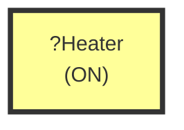
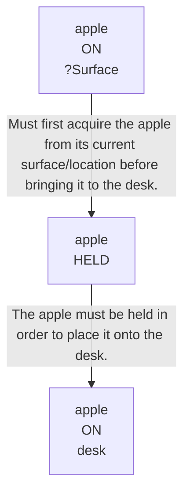
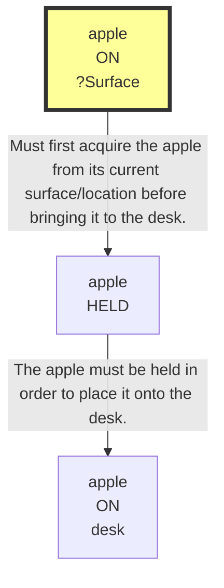
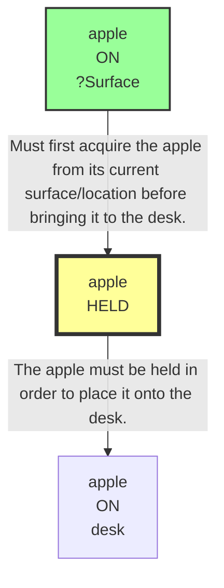
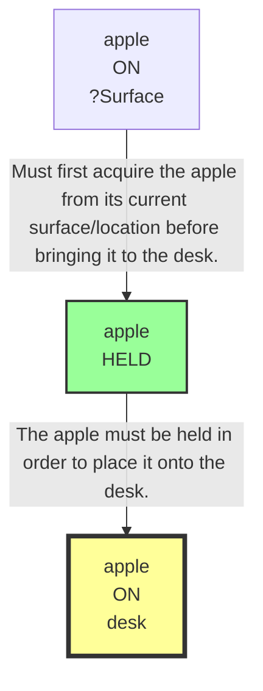
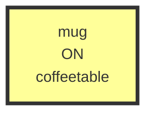
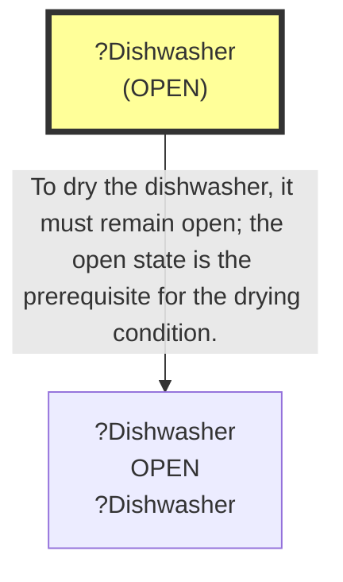

# 🚀 VirtualHome Agent Episode Log


### [GoalReasoner (Module A - Intent)] Output
```json
{
  "is_instruction_obviously_vague": false,
  "clarification_question": null,
  "target_object": "microwave",
  "location_hint": null,
  "reasoning_chain": [
    {
      "question": "Why does the user want this object?",
      "answer": "They want the microwave to be in an on state."
    },
    {
      "question": "Why is that important?",
      "answer": "So the microwave can operate instead of remaining off."
    },
    {
      "question": "What fundamental need does this fulfill?",
      "answer": "It enables appliance functionality for heating or preparing food."
    },
    {
      "question": "Are there any deeper psychological or physical motivations?",
      "answer": "The underlying motivation is likely to use the appliance to support meal preparation or food warming."
    }
  ],
  "deep_intent": "Enable appliance operation for food heating or preparation.",
  "acceptable_alternatives_properties": [
    {
      "priority": 1,
      "description": "Other kitchen appliances that can heat food, such as a toaster oven or stovetop burner."
    },
    {
      "priority": 2,
      "description": "Any working food-heating appliance that can perform a similar function."
    },
    {
      "priority": 3,
      "description": "Alternative household appliances that support meal preparation, such as an oven or electric kettle."
    },
    {
      "priority": 4,
      "description": "Other ways to make food ready to eat, such as using hot water or a warming device."
    }
  ]
}
```

### [PerceptionFilter] Output
```json
{
  "reasoning": "The goal is to have the microwave/heater in the ON state, so the target appliance must be kept. The SDG only requires a heater-capable appliance, and the observed list includes the exact target class microwave plus other valid heating alternatives (stove, toaster, coffeemaker, dishwasher is not a heater). To satisfy the alternative-retention rule, keep all plausible food-heating appliances that could serve the same function.",
  "selected_classes": [
    "character",
    "stove",
    "toaster",
    "microwave",
    "coffeemaker"
  ],
  "raw_class_count": 46
}
```

### [LLMExecutor] Output
```json
{
  "reasoning": "The active task requires the heater to be ON. The microwave is the target heater object, and it is currently OFF. Since switching it on requires being near it and it has a plug, the next step is to walk to the microwave before attempting to switch it on.",
  "satisfied_nodes": [],
  "current_node_focus": "N1",
  "mapped_variables": {
    "?Heater": "microwave(234)"
  },
  "action": "[walk] <microwave> (234)"
}
```

### [RoboStateMultiTaskController] Output
```json
{
  "action": "[walk] <microwave> (234)",
  "active_task_id": "task_1",
  "task_context": {
    "active_task_id": "task_1",
    "pending_task_ids": [
      "task_2",
      "task_3",
      "task_4",
      "task_5"
    ],
    "satisfied_task_ids": []
  },
  "source": "llm_executor"
}
```
## Step 0
- **Action**: `[walk] <microwave> (234)`
- **Action Success**: `True`
- **Action Message**: {'0': {'message': 'Success'}}
- **Active Task**: `task_1`
- **Decision Source**: `llm_executor`
- **Task Progress**: E1_19=pending, E1_02=pending, E1_03=pending, E1_04=pending, E1_07=pending
- **SDG Status**:

- **Observed Items (9)**: stove(226) [OFF,CLOSED], coffeemaker(229) [OFF], toaster(231) [OFF], microwave(234) [OFF,CLOSED], character(1), bathroom(11), bedroom(50), kitchen(126), livingroom(261)


### [PerceptionFilter] Output
```json
{
  "reasoning": "Reused cached class selection.",
  "selected_classes": [
    "character",
    "stove",
    "toaster",
    "microwave",
    "coffeemaker"
  ],
  "raw_class_count": 46
}
```

### [LLMExecutor] Output
```json
{
  "reasoning": "The active goal is to make the microwave ON. The current graph shows microwave(234) is CLOSE, has HAS_SWITCH and HAS_PLUG, and is currently OFF. Since it is already open/closed state is irrelevant for switching, the next required step is to turn it on. I am already near it from the prior walk, so no additional walk is needed.",
  "satisfied_nodes": [],
  "current_node_focus": "N1",
  "mapped_variables": {
    "?Heater": "microwave(234)"
  },
  "action": "[switchon] <microwave> (234)"
}
```

### [RoboStateMultiTaskController] Output
```json
{
  "action": "[switchon] <microwave> (234)",
  "active_task_id": "task_1",
  "task_context": {
    "active_task_id": "task_1",
    "pending_task_ids": [
      "task_2",
      "task_3",
      "task_4",
      "task_5"
    ],
    "satisfied_task_ids": []
  },
  "source": "llm_executor"
}
```
## Step 1
- **Action**: `[switchon] <microwave> (234)`
- **Action Success**: `True`
- **Action Message**: Faked switch operation in Python layer (bypassed Unity failure)
- **Active Task**: `task_1`
- **Decision Source**: `llm_executor`
- **Task Progress**: E1_19=done, E1_02=pending, E1_03=pending, E1_04=pending, E1_07=pending
- **SDG Status**:

- **Observed Items (9)**: stove(226) [OFF,CLOSED], coffeemaker(229) [OFF], toaster(231) [OFF], microwave(234) [OFF,CLOSED], character(1), bathroom(11), bedroom(50), kitchen(126), livingroom(261)


### [GoalReasoner (Module A - Intent)] Output
```json
{
  "is_instruction_obviously_vague": false,
  "clarification_question": null,
  "target_object": "apple",
  "location_hint": "desk",
  "reasoning_chain": [
    {
      "question": "Why does the user want this object?",
      "answer": "To have the apple delivered to their desk."
    },
    {
      "question": "Why is that important?",
      "answer": "So the apple is available in the place where the user wants to use or access it."
    },
    {
      "question": "What fundamental need does this fulfill?",
      "answer": "It supports convenient access to the desired food item."
    },
    {
      "question": "Are there any deeper psychological or physical motivations?",
      "answer": "The user may want to eat it later, keep it nearby, or reduce the effort of getting it themselves."
    }
  ],
  "deep_intent": "The user wants convenient access to food.",
  "acceptable_alternatives_properties": [
    {
      "priority": 1,
      "description": "Other readily available fruits that can be brought to the desk, such as a banana or orange"
    },
    {
      "priority": 2,
      "description": "Other portable ready-to-eat foods that can be placed on a desk, such as a snack bar or sandwich"
    },
    {
      "priority": 3,
      "description": "Any edible item already available indoors that serves as a convenient snack"
    },
    {
      "priority": 4,
      "description": "Another small, portable food item that can satisfy a snack or hunger need"
    }
  ]
}
```

### [RoboStateMultiTaskController] Output
```json
{
  "action": "[walk] <bathroom> (11)",
  "active_task_id": "task_2",
  "task_context": {
    "active_task_id": "task_2",
    "pending_task_ids": [
      "task_3",
      "task_4",
      "task_5"
    ],
    "satisfied_task_ids": [
      "task_1"
    ]
  },
  "source": "room_frontier"
}
```
## Step 2
- **Action**: `[walk] <bathroom> (11)`
- **Action Success**: `True`
- **Action Message**: {'0': {'message': 'Success'}}
- **Active Task**: `task_2`
- **Decision Source**: `room_frontier`
- **Task Progress**: E1_19=done, E1_02=pending, E1_03=pending, E1_04=pending, E1_07=pending
- **SDG Status**:

- **Observed Items (126)**: floor(127), floor(128), floor(129), floor(130), floor(131), floor(132), floor(133), floor(134), floor(135), ceiling(136), ceiling(137), ceiling(138), ceiling(139), ceiling(140), ceiling(141)...


### [RoboStateMultiTaskController] Output
```json
{
  "action": "[walk] <bedroom> (50)",
  "active_task_id": "task_2",
  "task_context": {
    "active_task_id": "task_2",
    "pending_task_ids": [
      "task_3",
      "task_4",
      "task_5"
    ],
    "satisfied_task_ids": [
      "task_1"
    ]
  },
  "source": "room_frontier"
}
```
## Step 3
- **Action**: `[walk] <bedroom> (50)`
- **Action Success**: `True`
- **Action Message**: {'0': {'message': 'Success'}}
- **Active Task**: `task_2`
- **Decision Source**: `room_frontier`
- **Task Progress**: E1_19=done, E1_02=pending, E1_03=pending, E1_04=pending, E1_07=pending
- **SDG Status**:

- **Observed Items (164)**: floor(127), floor(128), floor(129), floor(130), floor(131), floor(132), floor(133), floor(134), floor(135), ceiling(136), ceiling(137), ceiling(138), ceiling(139), ceiling(140), ceiling(141)...


### [PerceptionFilter] Output
```json
{
  "reasoning": "The goal is to get the apple to the desk, so the required classes are the target object and the destination location. The SDG indicates the apple must first be held, but no separate grasping tool is required for this simple pickup-and-place task. No alternative food or backup item is needed because the target is explicitly apple.",
  "selected_classes": [
    "door",
    "character",
    "apple",
    "desk"
  ],
  "raw_class_count": 82
}
```

### [LLMExecutor] Output
```json
{
  "reasoning": "The active task is to place an apple on the desk. The SDG requires first acquiring an apple that is currently on some surface/location (N3), then holding it (N2), then placing it on the desk (N1). The current graph shows a suitable apple instance, apple(114), inside the bedroom where the character currently is. Since I am already in the same room as apple(114), the next required step is to grab it before any walking to the desk can occur.",
  "satisfied_nodes": [],
  "current_node_focus": "N3",
  "mapped_variables": {},
  "action": "[grab] <apple> (114)"
}
```

### [RoboStateMultiTaskController] Output
```json
{
  "action": "[walk] <apple> (114)",
  "active_task_id": "task_2",
  "task_context": {
    "active_task_id": "task_2",
    "pending_task_ids": [
      "task_3",
      "task_4",
      "task_5"
    ],
    "satisfied_task_ids": [
      "task_1"
    ]
  },
  "source": "llm_executor_repaired"
}
```
## Step 4
- **Action**: `[walk] <apple> (114)`
- **Action Success**: `True`
- **Action Message**: {'0': {'message': 'Success'}}
- **Active Task**: `task_2`
- **Decision Source**: `llm_executor_repaired`
- **Task Progress**: E1_19=done, E1_02=pending, E1_03=pending, E1_04=pending, E1_07=pending
- **SDG Status**:

- **Observed Items (22)**: door(145) [OPEN], door(146) [OPEN], apple(249), apple(250), apple(251), apple(252), apple(253), apple(254), apple(255), apple(256), apple(257), apple(258), apple(259), apple(113), character(1)...


### [PerceptionFilter] Output
```json
{
  "reasoning": "Reused cached class selection.",
  "selected_classes": [
    "door",
    "character",
    "apple",
    "desk"
  ],
  "raw_class_count": 82
}
```

### [LLMExecutor] Output
```json
{
  "reasoning": "The active task is to place an apple on the desk. The current graph shows apple(114) is already in the bedroom and CLOSE to the character, so it is the best bind for the target apple. The desk(80) exists in the bedroom but is CLOSED; since it is a surface and movable, we should first get the apple into hand before any placement steps. The immediate next atomic step is to grab the nearby apple(114).",
  "satisfied_nodes": [
    "N3"
  ],
  "current_node_focus": "N2",
  "mapped_variables": {
    "?Surface": "desk(80)"
  },
  "action": "[grab] <apple> (114)"
}
```

### [RoboStateMultiTaskController] Output
```json
{
  "action": "[grab] <apple> (114)",
  "active_task_id": "task_2",
  "task_context": {
    "active_task_id": "task_2",
    "pending_task_ids": [
      "task_3",
      "task_4",
      "task_5"
    ],
    "satisfied_task_ids": [
      "task_1"
    ]
  },
  "source": "llm_executor"
}
```
## Step 5
- **Action**: `[grab] <apple> (114)`
- **Action Success**: `True`
- **Action Message**: {'0': {'message': 'Success'}}
- **Active Task**: `task_2`
- **Decision Source**: `llm_executor`
- **Task Progress**: E1_19=done, E1_02=pending, E1_03=pending, E1_04=pending, E1_07=pending
- **SDG Status**:

- **Observed Items (22)**: door(145) [OPEN], door(146) [OPEN], apple(249), apple(250), apple(251), apple(252), apple(253), apple(254), apple(255), apple(256), apple(257), apple(258), apple(259), apple(113), character(1)...


### [PerceptionFilter] Output
```json
{
  "reasoning": "Reused cached class selection.",
  "selected_classes": [
    "door",
    "character",
    "apple",
    "desk"
  ],
  "raw_class_count": 82
}
```

### [LLMExecutor] Output
```json
{
  "reasoning": "The active apple target is apple(114), which is currently already held in the right hand and close to the character in the bedroom. The SDG requires first having the apple held (N2) before placing it on the desk (N1). The desk exists in the bedroom and is the destination surface, but per proximity rules I must walk to the desk before any putback action. Thus the next step is to approach the desk.",
  "satisfied_nodes": [
    "N2"
  ],
  "current_node_focus": "N1",
  "mapped_variables": {},
  "action": "[walk] <desk> (80)"
}
```

### [RoboStateMultiTaskController] Output
```json
{
  "action": "[walk] <desk> (80)",
  "active_task_id": "task_2",
  "task_context": {
    "active_task_id": "task_2",
    "pending_task_ids": [
      "task_3",
      "task_4",
      "task_5"
    ],
    "satisfied_task_ids": [
      "task_1"
    ]
  },
  "source": "llm_executor"
}
```
## Step 6
- **Action**: `[walk] <desk> (80)`
- **Action Success**: `True`
- **Action Message**: {'0': {'message': 'Success'}}
- **Active Task**: `task_2`
- **Decision Source**: `llm_executor`
- **Task Progress**: E1_19=done, E1_02=pending, E1_03=pending, E1_04=pending, E1_07=pending
- **SDG Status**:

- **Observed Items (22)**: door(145) [OPEN], door(146) [OPEN], apple(249), apple(250), apple(251), apple(252), apple(253), apple(254), apple(255), apple(256), apple(257), apple(258), apple(259), apple(113), character(1)...


### [PerceptionFilter] Output
```json
{
  "reasoning": "Reused cached class selection.",
  "selected_classes": [
    "door",
    "character",
    "apple",
    "desk"
  ],
  "raw_class_count": 82
}
```

### [LLMExecutor] Output
```json
{
  "reasoning": "The active task is to place the apple on the desk. I am already holding apple(114) and I am already close to desk(80), so the remaining step is to put the held apple onto the desk surface. The desk is a valid flat surface, so [putback] is the correct action.",
  "satisfied_nodes": [
    "N2"
  ],
  "current_node_focus": "N1",
  "mapped_variables": {},
  "action": "[putback] <apple> (114) <desk> (80)"
}
```

### [RoboStateMultiTaskController] Output
```json
{
  "action": "[putback] <apple> (114) <desk> (80)",
  "active_task_id": "task_2",
  "task_context": {
    "active_task_id": "task_2",
    "pending_task_ids": [
      "task_3",
      "task_4",
      "task_5"
    ],
    "satisfied_task_ids": [
      "task_1"
    ]
  },
  "source": "llm_executor"
}
```
## Step 7
- **Action**: `[putback] <apple> (114) <desk> (80)`
- **Action Success**: `True`
- **Action Message**: {'0': {'message': 'Success'}}
- **Active Task**: `task_2`
- **Decision Source**: `llm_executor`
- **Task Progress**: E1_19=done, E1_02=done, E1_03=pending, E1_04=pending, E1_07=pending
- **SDG Status**:

- **Observed Items (22)**: door(145) [OPEN], door(146) [OPEN], apple(249), apple(250), apple(251), apple(252), apple(253), apple(254), apple(255), apple(256), apple(257), apple(258), apple(259), apple(113), character(1)...


### [GoalReasoner (Module A - Intent)] Output
```json
{
  "is_instruction_obviously_vague": false,
  "clarification_question": null,
  "target_object": "book",
  "location_hint": "sofa",
  "reasoning_chain": [
    {
      "question": "Why does the user want this object?",
      "answer": "To move a book that is unorganized to the sofa."
    },
    {
      "question": "Why is that important?",
      "answer": "So the book is placed in a more organized or intended resting location."
    },
    {
      "question": "What fundamental need does this fulfill?",
      "answer": "It fulfills the need to organize or tidy the book's placement in the living area."
    },
    {
      "question": "Are there any deeper psychological or physical motivations?",
      "answer": "The user likely wants to reduce clutter and maintain order in the room."
    }
  ],
  "deep_intent": "The user wants to reduce clutter by placing an out-of-place item in a designated resting area.",
  "acceptable_alternatives_properties": [
    {
      "priority": 1,
      "description": "Other similarly unorganized reading materials, such as magazines or notebooks, placed on the sofa"
    },
    {
      "priority": 2,
      "description": "Other small household items that belong with reading or leisure items, if the exact item is unavailable"
    },
    {
      "priority": 3,
      "description": "Lightweight personal items that are out of place and can be tidied to a seating area"
    },
    {
      "priority": 4,
      "description": "Any nearby clutter item that can be moved to reduce disorganization in the room"
    }
  ]
}
```

### [PerceptionFilter] Output
```json
{
  "reasoning": "The goal and SDG specify moving a book onto a sofa. The only strictly necessary classes are the target object and the destination furniture. No tools or alternatives are required for this placement task.",
  "selected_classes": [
    "book",
    "character",
    "sofa"
  ],
  "raw_class_count": 82
}
```

### [LLMExecutor] Output
```json
{
  "reasoning": "The active goal is to place a book on the sofa. Among the visible books, book(104) is already in the bedroom, and the sofa(85) is also in the bedroom, so this is the most efficient target. I am not adjacent to the book yet, so the next atomic step must be to walk to the book before any grab or placement action. This also avoids manipulating the kitchen books, which are farther away and unnecessary.",
  "satisfied_nodes": [],
  "current_node_focus": "N1",
  "mapped_variables": {
    "?TargetBook": "book(104)",
    "?Destination": "sofa(85)"
  },
  "action": "[walk] <book> (104)"
}
```

### [RoboStateMultiTaskController] Output
```json
{
  "action": "[walk] <book> (104)",
  "active_task_id": "task_3",
  "task_context": {
    "active_task_id": "task_3",
    "pending_task_ids": [
      "task_4",
      "task_5"
    ],
    "satisfied_task_ids": [
      "task_1",
      "task_2"
    ]
  },
  "source": "llm_executor"
}
```
## Step 8
- **Action**: `[walk] <book> (104)`
- **Action Success**: `True`
- **Action Message**: {'0': {'message': 'Success'}}
- **Active Task**: `task_3`
- **Decision Source**: `llm_executor`
- **Task Progress**: E1_19=done, E1_02=done, E1_03=pending, E1_04=pending, E1_07=pending
- **SDG Status**:

- **Observed Items (9)**: book(163) [CLOSED], book(164) [CLOSED], character(1), bathroom(11), bedroom(50), kitchen(126), livingroom(261), sofa(85), book(104) [CLOSED]


### [PerceptionFilter] Output
```json
{
  "reasoning": "Reused cached class selection.",
  "selected_classes": [
    "book",
    "character",
    "sofa"
  ],
  "raw_class_count": 82
}
```

### [LLMExecutor] Output
```json
{
  "reasoning": "The active goal is to place a book on the sofa. We are already close to book(104) from the previous step, and the sofa(85) is the required destination surface. Since putting an item down onto a surface requires first walking to that surface, the next atomic step should be to move to the sofa. The book itself is a valid target object and there is no need to switch to the alternative books in the kitchen because the already-seen book(104) matches the goal and is nearby.",
  "satisfied_nodes": [],
  "current_node_focus": "N1",
  "mapped_variables": {
    "?TargetSurface": "sofa(85)"
  },
  "action": "[walk] <sofa> (85)"
}
```

### [RoboStateMultiTaskController] Output
```json
{
  "action": "[walk] <sofa> (85)",
  "active_task_id": "task_3",
  "task_context": {
    "active_task_id": "task_3",
    "pending_task_ids": [
      "task_4",
      "task_5"
    ],
    "satisfied_task_ids": [
      "task_1",
      "task_2"
    ]
  },
  "source": "llm_executor"
}
```
## Step 9
- **Action**: `[walk] <sofa> (85)`
- **Action Success**: `True`
- **Action Message**: {'0': {'message': 'Success'}}
- **Active Task**: `task_3`
- **Decision Source**: `llm_executor`
- **Task Progress**: E1_19=done, E1_02=done, E1_03=pending, E1_04=pending, E1_07=pending
- **SDG Status**:

- **Observed Items (9)**: book(163) [CLOSED], book(164) [CLOSED], character(1), bathroom(11), bedroom(50), kitchen(126), livingroom(261), sofa(85), book(104) [CLOSED]


### [PerceptionFilter] Output
```json
{
  "reasoning": "Reused cached class selection.",
  "selected_classes": [
    "book",
    "character",
    "sofa"
  ],
  "raw_class_count": 82
}
```

### [LLMExecutor] Output
```json
{
  "reasoning": "The active goal is to place a book on the sofa. The current graph shows we are already close to sofa(85) and book(104), and book(104) is the most plausible current target because it is in the same room as the robot and is already a valid book object. The next required step is to pick it up; since we are already close to it and not holding anything, grabbing is the correct atomic action before any putback onto the sofa.",
  "satisfied_nodes": [],
  "current_node_focus": "N1",
  "mapped_variables": {},
  "action": "[grab] <book> (104)"
}
```

### [RoboStateMultiTaskController] Output
```json
{
  "action": "[grab] <book> (104)",
  "active_task_id": "task_3",
  "task_context": {
    "active_task_id": "task_3",
    "pending_task_ids": [
      "task_4",
      "task_5"
    ],
    "satisfied_task_ids": [
      "task_1",
      "task_2"
    ]
  },
  "source": "llm_executor"
}
```
## Step 10
- **Action**: `[grab] <book> (104)`
- **Action Success**: `True`
- **Action Message**: {'0': {'message': 'Success'}}
- **Active Task**: `task_3`
- **Decision Source**: `llm_executor`
- **Task Progress**: E1_19=done, E1_02=done, E1_03=pending, E1_04=pending, E1_07=pending
- **SDG Status**:

- **Observed Items (9)**: book(163) [CLOSED], book(164) [CLOSED], character(1), bathroom(11), bedroom(50), kitchen(126), livingroom(261), sofa(85), book(104) [CLOSED]


### [PerceptionFilter] Output
```json
{
  "reasoning": "Reused cached class selection.",
  "selected_classes": [
    "book",
    "character",
    "sofa"
  ],
  "raw_class_count": 82
}
```

### [LLMExecutor] Output
```json
{
  "reasoning": "The active goal is to place the book on the sofa. The character is already close to both the held book(104) and the sofa(85), and currently holds the correct book in the right hand. The next required step is to place the held book onto the sofa surface. Since putback requires being near the destination and we already are, no additional walk is needed.",
  "satisfied_nodes": [],
  "current_node_focus": "N1",
  "mapped_variables": {
    "?TargetBook": "book(104)",
    "?Destination": "sofa(85)"
  },
  "action": "[putback] <book> (104) <sofa> (85)"
}
```

### [RoboStateMultiTaskController] Output
```json
{
  "action": "[putback] <book> (104) <sofa> (85)",
  "active_task_id": "task_3",
  "task_context": {
    "active_task_id": "task_3",
    "pending_task_ids": [
      "task_4",
      "task_5"
    ],
    "satisfied_task_ids": [
      "task_1",
      "task_2"
    ]
  },
  "source": "llm_executor"
}
```
## Step 11
- **Action**: `[putback] <book> (104) <sofa> (85)`
- **Action Success**: `True`
- **Action Message**: {'0': {'message': 'Success'}}
- **Active Task**: `task_3`
- **Decision Source**: `llm_executor`
- **Task Progress**: E1_19=done, E1_02=done, E1_03=done, E1_04=pending, E1_07=pending
- **SDG Status**:

- **Observed Items (9)**: book(163) [CLOSED], book(164) [CLOSED], character(1), bathroom(11), bedroom(50), kitchen(126), livingroom(261), sofa(85), book(104) [CLOSED]


### [GoalReasoner (Module A - Intent)] Output
```json
{
  "is_instruction_obviously_vague": false,
  "clarification_question": null,
  "target_object": "mug",
  "location_hint": "coffeetable",
  "reasoning_chain": [
    {
      "question": "Why does the user want this object?",
      "answer": "To keep the mug placed on the coffeetable."
    },
    {
      "question": "Why is that important?",
      "answer": "To maintain a desired physical arrangement or ensure the mug stays in a specific visible, accessible location."
    },
    {
      "question": "What fundamental need does this fulfill?",
      "answer": "It fulfills the need to organize or control the placement of an object in the environment."
    },
    {
      "question": "Are there any deeper psychological or physical motivations?",
      "answer": "The user may want convenience, tidiness, or to prevent the mug from being moved or misplaced."
    }
  ],
  "deep_intent": "The user wants an object to remain in a specific location for organization or convenience.",
  "acceptable_alternatives_properties": [
    {
      "priority": 1,
      "description": "Other drinkware or small tabletop items that can remain on the same table, such as a cup or glass."
    },
    {
      "priority": 2,
      "description": "Similar handheld household containers or small vessels that can be kept on a tabletop."
    },
    {
      "priority": 3,
      "description": "Any small household item that can be stored or displayed on the table to preserve order."
    },
    {
      "priority": 4,
      "description": "Other objects kept in a fixed place to maintain tidiness and convenience, such as a book or remote."
    }
  ]
}
```

### [PerceptionFilter] Output
```json
{
  "reasoning": "The goal explicitly requires a mug to be on a coffeetable, so both the target object and the location furniture must be kept. No other tools or receptacles are needed for this placement task.",
  "selected_classes": [
    "book",
    "character",
    "mug",
    "coffeetable"
  ],
  "raw_class_count": 82
}
```

### [LLMExecutor] Output
```json
{
  "reasoning": "The active goal is to have mug(102) on coffeetable(86). The mug is currently in the kitchen, while the coffeetable is in the bedroom and is close to the character. I am not yet holding the mug, so the next atomic step must be to walk to the mug first before grabbing it.",
  "satisfied_nodes": [],
  "current_node_focus": "N1",
  "mapped_variables": {},
  "action": "[walk] <mug> (102)"
}
```

### [RoboStateMultiTaskController] Output
```json
{
  "action": "[walk] <mug> (102)",
  "active_task_id": "task_5",
  "task_context": {
    "active_task_id": "task_5",
    "pending_task_ids": [
      "task_4"
    ],
    "satisfied_task_ids": [
      "task_1",
      "task_2",
      "task_3"
    ]
  },
  "source": "llm_executor"
}
```
## Step 12
- **Action**: `[walk] <mug> (102)`
- **Action Success**: `True`
- **Action Message**: {'0': {'message': 'Success'}}
- **Active Task**: `task_5`
- **Decision Source**: `llm_executor`
- **Task Progress**: E1_19=done, E1_02=done, E1_03=done, E1_04=pending, E1_07=pending
- **SDG Status**:

- **Observed Items (10)**: book(163) [CLOSED], book(164) [CLOSED], mug(102), character(1), bathroom(11), bedroom(50), kitchen(126), livingroom(261), coffeetable(86), book(104) [CLOSED]


### [PerceptionFilter] Output
```json
{
  "reasoning": "Reused cached class selection.",
  "selected_classes": [
    "book",
    "character",
    "mug",
    "coffeetable"
  ],
  "raw_class_count": 82
}
```

### [LLMExecutor] Output
```json
{
  "reasoning": "The active goal is to place mug(102) on coffeetable(86). The mug is already close to the character, but the coffeetable is a surface and must be explicitly approached before any putback. The current graph shows the coffeetable is in the bedroom and close to the character, so the next step is to walk to the coffeetable to satisfy proximity for the eventual putback.",
  "satisfied_nodes": [],
  "current_node_focus": "N1",
  "mapped_variables": {},
  "action": "[walk] <coffeetable> (86)"
}
```

### [RoboStateMultiTaskController] Output
```json
{
  "action": "[walk] <coffeetable> (86)",
  "active_task_id": "task_5",
  "task_context": {
    "active_task_id": "task_5",
    "pending_task_ids": [
      "task_4"
    ],
    "satisfied_task_ids": [
      "task_1",
      "task_2",
      "task_3"
    ]
  },
  "source": "llm_executor"
}
```
## Step 13
- **Action**: `[walk] <coffeetable> (86)`
- **Action Success**: `True`
- **Action Message**: {'0': {'message': 'Success'}}
- **Active Task**: `task_5`
- **Decision Source**: `llm_executor`
- **Task Progress**: E1_19=done, E1_02=done, E1_03=done, E1_04=pending, E1_07=pending
- **SDG Status**:

- **Observed Items (10)**: book(163) [CLOSED], book(164) [CLOSED], mug(102), character(1), bathroom(11), bedroom(50), kitchen(126), livingroom(261), coffeetable(86), book(104) [CLOSED]


### [PerceptionFilter] Output
```json
{
  "reasoning": "Reused cached class selection.",
  "selected_classes": [
    "book",
    "character",
    "mug",
    "coffeetable"
  ],
  "raw_class_count": 82
}
```

### [LLMExecutor] Output
```json
{
  "reasoning": "The active goal is to have mug(102) ON coffeetable(86). The current graph shows the mug is close to the character, and the character is also close to the coffeetable. Since placing an object on a surface requires being explicitly walked to the surface first, and we are already there from the previous step, the next atomic action is to place the mug on the coffeetable. The mug is grabbable and not dirty, so no extra prep is needed.",
  "satisfied_nodes": [],
  "current_node_focus": "N1",
  "mapped_variables": {},
  "action": "[putback] <mug> (102) <coffeetable> (86)"
}
```

### [RoboStateMultiTaskController] Output
```json
{
  "action": "[grab] <mug> (102)",
  "active_task_id": "task_5",
  "task_context": {
    "active_task_id": "task_5",
    "pending_task_ids": [
      "task_4"
    ],
    "satisfied_task_ids": [
      "task_1",
      "task_2",
      "task_3"
    ]
  },
  "source": "llm_executor_repaired"
}
```
## Step 14
- **Action**: `[grab] <mug> (102)`
- **Action Success**: `True`
- **Action Message**: {'0': {'message': 'Success'}}
- **Active Task**: `task_5`
- **Decision Source**: `llm_executor_repaired`
- **Task Progress**: E1_19=done, E1_02=done, E1_03=done, E1_04=pending, E1_07=pending
- **SDG Status**:

- **Observed Items (10)**: book(163) [CLOSED], book(164) [CLOSED], mug(102), character(1), bathroom(11), bedroom(50), kitchen(126), livingroom(261), coffeetable(86), book(104) [CLOSED]


### [PerceptionFilter] Output
```json
{
  "reasoning": "Reused cached class selection.",
  "selected_classes": [
    "book",
    "character",
    "mug",
    "coffeetable"
  ],
  "raw_class_count": 82
}
```

### [LLMExecutor] Output
```json
{
  "reasoning": "The active goal is to place mug(102) on coffeetable(86). The mug is already held in the right hand, and the coffeetable is a flat surface. The next required step is to move to the destination surface before putting the mug down. No other node is satisfied yet because the mug is not currently on the coffeetable.",
  "satisfied_nodes": [],
  "current_node_focus": "N1",
  "mapped_variables": {
    "?TargetSurface": "coffeetable(86)"
  },
  "action": "[walk] <coffeetable> (86)"
}
```

### [RoboStateMultiTaskController] Output
```json
{
  "action": "[walk] <coffeetable> (86)",
  "active_task_id": "task_5",
  "task_context": {
    "active_task_id": "task_5",
    "pending_task_ids": [
      "task_4"
    ],
    "satisfied_task_ids": [
      "task_1",
      "task_2",
      "task_3"
    ]
  },
  "source": "llm_executor"
}
```
## Step 15
- **Action**: `[walk] <coffeetable> (86)`
- **Action Success**: `True`
- **Action Message**: {'0': {'message': 'Success'}}
- **Active Task**: `task_5`
- **Decision Source**: `llm_executor`
- **Task Progress**: E1_19=done, E1_02=done, E1_03=done, E1_04=pending, E1_07=pending
- **SDG Status**:

- **Observed Items (10)**: book(163) [CLOSED], book(164) [CLOSED], mug(102), character(1), bathroom(11), bedroom(50), kitchen(126), livingroom(261), coffeetable(86), book(104) [CLOSED]


### [PerceptionFilter] Output
```json
{
  "reasoning": "Reused cached class selection.",
  "selected_classes": [
    "book",
    "character",
    "mug",
    "coffeetable"
  ],
  "raw_class_count": 82
}
```

### [LLMExecutor] Output
```json
{
  "reasoning": "The active goal is to have mug(102) ON coffeetable(86). The current graph shows I am already close to both the mug and the coffeetable, and I am holding the mug in my right hand. The next required step is to place the held mug onto the nearby coffeetable. Since putback requires being explicitly walked to the surface first and I already performed that walk, the correct next atomic action is to put the mug back onto the coffeetable.",
  "satisfied_nodes": [],
  "current_node_focus": "N1",
  "mapped_variables": {},
  "action": "[putback] <mug> (102) <coffeetable> (86)"
}
```

### [RoboStateMultiTaskController] Output
```json
{
  "action": "[putback] <mug> (102) <coffeetable> (86)",
  "active_task_id": "task_5",
  "task_context": {
    "active_task_id": "task_5",
    "pending_task_ids": [
      "task_4"
    ],
    "satisfied_task_ids": [
      "task_1",
      "task_2",
      "task_3"
    ]
  },
  "source": "llm_executor"
}
```
## Step 16
- **Action**: `[putback] <mug> (102) <coffeetable> (86)`
- **Action Success**: `True`
- **Action Message**: {'0': {'message': 'Success'}}
- **Active Task**: `task_5`
- **Decision Source**: `llm_executor`
- **Task Progress**: E1_19=done, E1_02=done, E1_03=done, E1_04=pending, E1_07=done
- **SDG Status**:

- **Observed Items (10)**: book(163) [CLOSED], book(164) [CLOSED], mug(102), character(1), bathroom(11), bedroom(50), kitchen(126), livingroom(261), coffeetable(86), book(104) [CLOSED]


### [GoalReasoner (Module A - Intent)] Output
```json
{
  "is_instruction_obviously_vague": false,
  "clarification_question": null,
  "target_object": "dishwasher",
  "location_hint": null,
  "reasoning_chain": [
    {
      "question": "Why does the user want this object?",
      "answer": "To keep the appliance open."
    },
    {
      "question": "Why is that important?",
      "answer": "To allow it to dry after use."
    },
    {
      "question": "What fundamental need does this fulfill?",
      "answer": "To remove moisture and reduce wetness inside the appliance."
    },
    {
      "question": "Are there any deeper psychological or physical motivations?",
      "answer": "To prevent lingering dampness, which can help avoid odors, residue, or mold buildup."
    }
  ],
  "deep_intent": "The user wants to remove moisture from the appliance interior.",
  "acceptable_alternatives_properties": [
    {
      "priority": 1,
      "description": "Other methods or aids that help dry the inside of a wet appliance, such as leaving a door ajar or using a clean dry towel to wipe surfaces."
    },
    {
      "priority": 2,
      "description": "Ventilation-related solutions for drying enclosed indoor items, such as a fan or dehumidifier placed nearby."
    },
    {
      "priority": 3,
      "description": "Drying aids for household moisture control, such as absorbent cloths or drying mats."
    },
    {
      "priority": 4,
      "description": "Any indoor moisture-reduction approach that helps eliminate dampness and prevent buildup, such as improving airflow in the room."
    }
  ]
}
```

### [PerceptionFilter] Output
```json
{
  "reasoning": "The goal is to dry the dishwasher interior by keeping it open. The only strictly necessary object class from the scene is the dishwasher itself, since the SDG requires it to be in the OPEN state. No additional tools or locations are needed for this goal.",
  "selected_classes": [
    "dishwasher",
    "character",
    "door"
  ],
  "raw_class_count": 82
}
```

### [LLMExecutor] Output
```json
{
  "reasoning": "The active task is to keep the dishwasher open so it can dry. The current graph shows dishwasher(228) is CLOSED and can be opened. Since interacting with a door/appliance requires being near it, the next step is to walk to the dishwasher before opening it.",
  "satisfied_nodes": [],
  "current_node_focus": "N1",
  "mapped_variables": {
    "?Dishwasher": "dishwasher(228)"
  },
  "action": "[walk] <dishwasher> (228)"
}
```

### [RoboStateMultiTaskController] Output
```json
{
  "action": "[walk] <dishwasher> (228)",
  "active_task_id": "task_4",
  "task_context": {
    "active_task_id": "task_4",
    "pending_task_ids": [],
    "satisfied_task_ids": [
      "task_1",
      "task_2",
      "task_3",
      "task_5"
    ]
  },
  "source": "llm_executor"
}
```
## Step 17
- **Action**: `[walk] <dishwasher> (228)`
- **Action Success**: `True`
- **Action Message**: {'0': {'message': 'Success'}}
- **Active Task**: `task_4`
- **Decision Source**: `llm_executor`
- **Task Progress**: E1_19=done, E1_02=done, E1_03=done, E1_04=pending, E1_07=done
- **SDG Status**:

- **Observed Items (9)**: door(145) [OPEN], door(146) [OPEN], dishwasher(228) [OFF,CLOSED], character(1), bathroom(11), bedroom(50), kitchen(126), livingroom(261), door(47) [OPEN]


### [PerceptionFilter] Output
```json
{
  "reasoning": "Reused cached class selection.",
  "selected_classes": [
    "dishwasher",
    "character",
    "door"
  ],
  "raw_class_count": 82
}
```

### [LLMExecutor] Output
```json
{
  "reasoning": "The active goal is to keep the dishwasher open so it can dry. The filtered graph shows dishwasher(228) is currently CLOSED, and we are already CLOSE to it. Since opening is the required next step and proximity is satisfied, the best action is to open the dishwasher.",
  "satisfied_nodes": [],
  "current_node_focus": "N1",
  "mapped_variables": {
    "?Dishwasher": "dishwasher(228)"
  },
  "action": "[open] <dishwasher> (228)"
}
```

### [RoboStateMultiTaskController] Output
```json
{
  "action": "[open] <dishwasher> (228)",
  "active_task_id": "task_4",
  "task_context": {
    "active_task_id": "task_4",
    "pending_task_ids": [],
    "satisfied_task_ids": [
      "task_1",
      "task_2",
      "task_3",
      "task_5"
    ]
  },
  "source": "llm_executor"
}
```
## Step 18
- **Action**: `[open] <dishwasher> (228)`
- **Action Success**: `True`
- **Action Message**: {'0': {'message': 'Success'}}
- **Active Task**: `task_4`
- **Decision Source**: `llm_executor`
- **Task Progress**: E1_19=done, E1_02=done, E1_03=done, E1_04=done, E1_07=done
- **SDG Status**:

- **Observed Items (9)**: door(145) [OPEN], door(146) [OPEN], dishwasher(228) [OFF,CLOSED], character(1), bathroom(11), bedroom(50), kitchen(126), livingroom(261), door(47) [OPEN]

