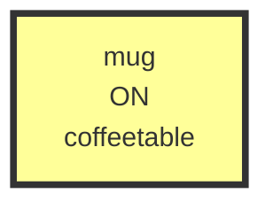
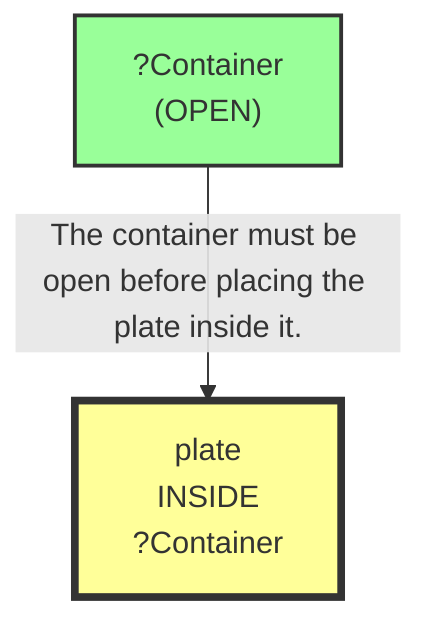
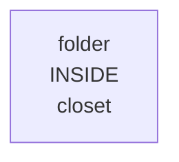
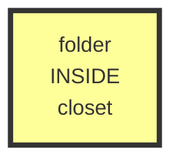

# 🚀 VirtualHome Agent Episode Log


### [GoalReasoner (Module A - Intent)] Output
```json
{
  "is_instruction_obviously_vague": false,
  "clarification_question": null,
  "target_object": "book",
  "location_hint": "sofa",
  "reasoning_chain": [
    {
      "question": "Why does the user want this object?",
      "answer": "To move an unorganized book to the sofa."
    },
    {
      "question": "Why is that important?",
      "answer": "To place the book in the desired location rather than leaving it somewhere unorganized."
    },
    {
      "question": "What fundamental need does this fulfill?",
      "answer": "To organize and relocate a book within the indoor environment."
    },
    {
      "question": "Are there any deeper psychological or physical motivations?",
      "answer": "The user likely wants the space tidied or the book made available on the sofa for later use."
    }
  ],
  "deep_intent": "The user wants to organize and relocate reading material within the living space.",
  "acceptable_alternatives_properties": [
    {
      "priority": 1,
      "description": "Other reading materials such as magazines, notebooks, or papers that are similarly unorganized and can be placed on the sofa"
    },
    {
      "priority": 2,
      "description": "Other lightweight paper-based items that belong together with reading material in the living area"
    },
    {
      "priority": 3,
      "description": "Similar household items that are meant to be kept in a tidy, accessible spot"
    },
    {
      "priority": 4,
      "description": "Any portable item the user may want gathered into the living area for convenience"
    }
  ]
}
```

### [RoboStateMultiTaskController] Output
```json
{
  "action": "[walk] <kitchen> (11)",
  "active_task_id": "task_2",
  "task_context": {
    "active_task_id": "task_2",
    "pending_task_ids": [
      "task_1",
      "task_3",
      "task_4",
      "task_5",
      "task_6",
      "task_7"
    ],
    "satisfied_task_ids": []
  },
  "source": "room_frontier"
}
```
## Step 0
- **Action**: `[walk] <kitchen> (11)`
- **Action Success**: `True`
- **Action Message**: {'0': {'message': 'Success'}}
- **Active Task**: `task_2`
- **Decision Source**: `room_frontier`
- **Task Progress**: E1_11=pending, E1_03=pending, E1_07=pending, E1_15=pending, E1_18=pending, E1_14=pending, E1_17=pending
- **SDG Status**:

- **Observed Items (39)**: floor(242), floor(243), floor(244), floor(245), ceiling(246), ceiling(247), ceiling(248), ceiling(249), wall(250), wall(251), wall(252), wall(253), door(254) [OPEN], ceilinglamp(255), tablelamp(256) [ON]...


### [RoboStateMultiTaskController] Output
```json
{
  "action": "[walk] <livingroom> (183)",
  "active_task_id": "task_2",
  "task_context": {
    "active_task_id": "task_2",
    "pending_task_ids": [
      "task_1",
      "task_3",
      "task_4",
      "task_5",
      "task_6",
      "task_7"
    ],
    "satisfied_task_ids": []
  },
  "source": "room_frontier"
}
```
## Step 1
- **Action**: `[walk] <livingroom> (183)`
- **Action Success**: `True`
- **Action Message**: {'0': {'message': 'Success'}}
- **Active Task**: `task_2`
- **Decision Source**: `room_frontier`
- **Task Progress**: E1_11=pending, E1_03=pending, E1_07=pending, E1_15=pending, E1_18=pending, E1_14=pending, E1_17=pending
- **SDG Status**:

- **Observed Items (194)**: floor(242), floor(243), floor(244), floor(245), ceiling(246), ceiling(247), ceiling(248), ceiling(249), wall(250), wall(251), wall(252), wall(253), door(254) [OPEN], ceilinglamp(255), tablelamp(256) [ON]...


### [PerceptionFilter] Output
```json
{
  "reasoning": "The goal is to place the book on the sofa. The SDG explicitly requires the book and the sofa, and no extra tools or containers are needed for a simple relocation task.",
  "selected_classes": [
    "book",
    "character",
    "sofa",
    "door"
  ],
  "raw_class_count": 66
}
```

### [LLMExecutor] Output
```json
{
  "reasoning": "The goal is to place a book on the sofa. We are already in the living room, and the sofa(214) is present there. The best matching movable book for the task is book(105), which is already close to the character and in the living room, making it the most efficient target to grab before placing it on the sofa. Since putting onto a surface requires being near the destination first, the next step should be to walk to the sofa.",
  "satisfied_nodes": [],
  "current_node_focus": "N1",
  "mapped_variables": {},
  "action": "[walk] <sofa> (214)"
}
```

### [RoboStateMultiTaskController] Output
```json
{
  "action": "[walk] <sofa> (214)",
  "active_task_id": "task_2",
  "task_context": {
    "active_task_id": "task_2",
    "pending_task_ids": [
      "task_1",
      "task_3",
      "task_4",
      "task_5",
      "task_6",
      "task_7"
    ],
    "satisfied_task_ids": []
  },
  "source": "llm_executor"
}
```
## Step 2
- **Action**: `[walk] <sofa> (214)`
- **Action Success**: `True`
- **Action Message**: {'0': {'message': 'Success'}}
- **Active Task**: `task_2`
- **Decision Source**: `llm_executor`
- **Task Progress**: E1_11=pending, E1_03=pending, E1_07=pending, E1_15=pending, E1_18=pending, E1_14=pending, E1_17=pending
- **SDG Status**:

- **Observed Items (13)**: door(254) [OPEN], book(275) [CLOSED], character(1), kitchen(11), livingroom(183), bedroom(241), bathroom(285), bedroom(346), door(47) [OPEN], sofa(214), book(229) [CLOSED], book(230) [CLOSED], book(105) [CLOSED]


### [PerceptionFilter] Output
```json
{
  "reasoning": "Reused cached class selection.",
  "selected_classes": [
    "book",
    "character",
    "sofa",
    "door"
  ],
  "raw_class_count": 66
}
```

### [LLMExecutor] Output
```json
{
  "reasoning": "The goal is to place a book on the sofa. We are already in the living room and close to the sofa, but the target book for the active task is currently in the bedroom. Among the available book instances, book(275) is the clearest unsatisfied book to relocate. Per the proximity rule, before grabbing it I must first walk to that specific object. The sofa task is not yet satisfied because no book is on sofa(214).",
  "satisfied_nodes": [],
  "current_node_focus": "N1",
  "mapped_variables": {},
  "action": "[walk] <book> (275)"
}
```

### [RoboStateMultiTaskController] Output
```json
{
  "action": "[walk] <book> (275)",
  "active_task_id": "task_2",
  "task_context": {
    "active_task_id": "task_2",
    "pending_task_ids": [
      "task_1",
      "task_3",
      "task_4",
      "task_5",
      "task_6",
      "task_7"
    ],
    "satisfied_task_ids": []
  },
  "source": "llm_executor"
}
```
## Step 3
- **Action**: `[walk] <book> (275)`
- **Action Success**: `True`
- **Action Message**: {'0': {'message': 'Success'}}
- **Active Task**: `task_2`
- **Decision Source**: `llm_executor`
- **Task Progress**: E1_11=pending, E1_03=pending, E1_07=pending, E1_15=pending, E1_18=pending, E1_14=pending, E1_17=pending
- **SDG Status**:

- **Observed Items (13)**: door(254) [OPEN], book(275) [CLOSED], character(1), kitchen(11), livingroom(183), bedroom(241), bathroom(285), bedroom(346), door(47) [OPEN], sofa(214), book(229) [CLOSED], book(230) [CLOSED], book(105) [CLOSED]


### [PerceptionFilter] Output
```json
{
  "reasoning": "Reused cached class selection.",
  "selected_classes": [
    "book",
    "character",
    "sofa",
    "door"
  ],
  "raw_class_count": 66
}
```

### [LLMExecutor] Output
```json
{
  "reasoning": "The active goal is to place a book on the sofa. We are already near the sofa and have just walked to the book, so the next required step is to grab the closest matching book object that is reachable and likely intended for the task. Among the visible books, book(275) is the current close target from the last walk action, so I will grab it before transporting it to the sofa in a later step.",
  "satisfied_nodes": [],
  "current_node_focus": "N1",
  "mapped_variables": {},
  "action": "[grab] <book> (275)"
}
```

### [RoboStateMultiTaskController] Output
```json
{
  "action": "[grab] <book> (275)",
  "active_task_id": "task_2",
  "task_context": {
    "active_task_id": "task_2",
    "pending_task_ids": [
      "task_1",
      "task_3",
      "task_4",
      "task_5",
      "task_6",
      "task_7"
    ],
    "satisfied_task_ids": []
  },
  "source": "llm_executor"
}
```
## Step 4
- **Action**: `[grab] <book> (275)`
- **Action Success**: `True`
- **Action Message**: {'0': {'message': 'Success'}}
- **Active Task**: `task_2`
- **Decision Source**: `llm_executor`
- **Task Progress**: E1_11=pending, E1_03=pending, E1_07=pending, E1_15=pending, E1_18=pending, E1_14=pending, E1_17=pending
- **SDG Status**:

- **Observed Items (13)**: door(254) [OPEN], book(275) [CLOSED], character(1), kitchen(11), livingroom(183), bedroom(241), bathroom(285), bedroom(346), door(47) [OPEN], sofa(214), book(229) [CLOSED], book(230) [CLOSED], book(105) [CLOSED]


### [PerceptionFilter] Output
```json
{
  "reasoning": "Reused cached class selection.",
  "selected_classes": [
    "book",
    "character",
    "sofa",
    "door"
  ],
  "raw_class_count": 66
}
```

### [LLMExecutor] Output
```json
{
  "reasoning": "The active task is to place a book on the sofa. I am already holding book(275), and the sofa(214) is the target surface. Since putback requires being explicitly walked to the destination first, the next step must be to walk to the sofa. The book task node is not yet satisfied because the book is not currently on the sofa.",
  "satisfied_nodes": [],
  "current_node_focus": "N1",
  "mapped_variables": {},
  "action": "[walk] <sofa> (214)"
}
```

### [RoboStateMultiTaskController] Output
```json
{
  "action": "[walk] <sofa> (214)",
  "active_task_id": "task_2",
  "task_context": {
    "active_task_id": "task_2",
    "pending_task_ids": [
      "task_1",
      "task_3",
      "task_4",
      "task_5",
      "task_6",
      "task_7"
    ],
    "satisfied_task_ids": []
  },
  "source": "llm_executor"
}
```
## Step 5
- **Action**: `[walk] <sofa> (214)`
- **Action Success**: `True`
- **Action Message**: {'0': {'message': 'Success'}}
- **Active Task**: `task_2`
- **Decision Source**: `llm_executor`
- **Task Progress**: E1_11=pending, E1_03=pending, E1_07=pending, E1_15=pending, E1_18=pending, E1_14=pending, E1_17=pending
- **SDG Status**:

- **Observed Items (13)**: door(254) [OPEN], book(275) [CLOSED], character(1), kitchen(11), livingroom(183), bedroom(241), bathroom(285), bedroom(346), door(47) [OPEN], sofa(214), book(229) [CLOSED], book(230) [CLOSED], book(105) [CLOSED]


### [PerceptionFilter] Output
```json
{
  "reasoning": "Reused cached class selection.",
  "selected_classes": [
    "book",
    "character",
    "sofa",
    "door"
  ],
  "raw_class_count": 66
}
```

### [LLMExecutor] Output
```json
{
  "reasoning": "The active goal is to place a book on the sofa. I am already holding book(275) and am close to sofa(214), so the next step is to put the held book onto the sofa surface. This should directly satisfy N1.",
  "satisfied_nodes": [],
  "current_node_focus": "N1",
  "mapped_variables": {
    "?TargetSurface": "sofa(214)"
  },
  "action": "[putback] <book> (275) <sofa> (214)"
}
```

### [RoboStateMultiTaskController] Output
```json
{
  "action": "[putback] <book> (275) <sofa> (214)",
  "active_task_id": "task_2",
  "task_context": {
    "active_task_id": "task_2",
    "pending_task_ids": [
      "task_1",
      "task_3",
      "task_4",
      "task_5",
      "task_6",
      "task_7"
    ],
    "satisfied_task_ids": []
  },
  "source": "llm_executor"
}
```
## Step 6
- **Action**: `[putback] <book> (275) <sofa> (214)`
- **Action Success**: `True`
- **Action Message**: {'0': {'message': 'Success'}}
- **Active Task**: `task_2`
- **Decision Source**: `llm_executor`
- **Task Progress**: E1_11=pending, E1_03=done, E1_07=pending, E1_15=pending, E1_18=pending, E1_14=pending, E1_17=pending
- **SDG Status**:

- **Observed Items (13)**: door(254) [OPEN], book(275) [CLOSED], character(1), kitchen(11), livingroom(183), bedroom(241), bathroom(285), bedroom(346), door(47) [OPEN], sofa(214), book(229) [CLOSED], book(230) [CLOSED], book(105) [CLOSED]


### [GoalReasoner (Module A - Intent)] Output
```json
{
  "is_instruction_obviously_vague": false,
  "clarification_question": null,
  "target_object": "mug",
  "location_hint": "coffeetable",
  "reasoning_chain": [
    {
      "question": "Why does the user want this object?",
      "answer": "To have the mug kept in a specific place."
    },
    {
      "question": "Why is that important?",
      "answer": "To maintain a consistent, desired physical arrangement in the room."
    },
    {
      "question": "What fundamental need does this fulfill?",
      "answer": "The need to organize and control object placement in the environment."
    },
    {
      "question": "Are there any deeper psychological or physical motivations?",
      "answer": "It may support convenience, reduce clutter, or make the mug easy to find and access."
    }
  ],
  "deep_intent": "The user wants to keep an object in a fixed, organized location for convenience and order.",
  "acceptable_alternatives_properties": [
    {
      "priority": 1,
      "description": "Other drinking vessels or similar handheld containers kept on the same table, such as a cup or tumbler."
    },
    {
      "priority": 2,
      "description": "Small tabletop items that can occupy the same designated spot and preserve organization."
    },
    {
      "priority": 3,
      "description": "Any commonly used personal items that can be kept neatly on a coffee table to reduce clutter."
    },
    {
      "priority": 4,
      "description": "Other objects that can be stored or displayed in a consistent indoor location to maintain an orderly environment."
    }
  ]
}
```

### [PerceptionFilter] Output
```json
{
  "reasoning": "The goal is to keep the mug on the coffeetable, so the only strictly necessary classes are the target object and its required location/furniture. No extra tools or alternatives are needed for this placement task.",
  "selected_classes": [
    "character",
    "door",
    "mug",
    "coffeetable"
  ],
  "raw_class_count": 66
}
```

### [LLMExecutor] Output
```json
{
  "reasoning": "The active SDG requires the mug to be ON the coffeetable. The mug is currently in the kitchen, while the character is already close to the coffeetable in the livingroom. To satisfy the relation, I need to first get the mug from the kitchen, but since I can only grab nearby objects and the mug is not currently near me, the next atomic step must be to walk to the mug. The coffeetable itself is already nearby, so this is the most direct progress toward placing the mug on it.",
  "satisfied_nodes": [],
  "current_node_focus": "N1",
  "mapped_variables": {},
  "action": "[walk] <mug> (384)"
}
```

### [RoboStateMultiTaskController] Output
```json
{
  "action": "[walk] <mug> (384)",
  "active_task_id": "task_3",
  "task_context": {
    "active_task_id": "task_3",
    "pending_task_ids": [
      "task_1",
      "task_4",
      "task_5",
      "task_6",
      "task_7"
    ],
    "satisfied_task_ids": [
      "task_2"
    ]
  },
  "source": "llm_executor"
}
```
## Step 7
- **Action**: `[walk] <mug> (384)`
- **Action Success**: `True`
- **Action Message**: {'0': {'message': 'Success'}}
- **Active Task**: `task_3`
- **Decision Source**: `llm_executor`
- **Task Progress**: E1_11=pending, E1_03=done, E1_07=pending, E1_15=pending, E1_18=pending, E1_14=pending, E1_17=pending
- **SDG Status**:

- **Observed Items (10)**: door(254) [OPEN], character(1), kitchen(11), livingroom(183), bedroom(241), bathroom(285), bedroom(346), door(47) [OPEN], mug(384), coffeetable(215)


### [PerceptionFilter] Output
```json
{
  "reasoning": "Reused cached class selection.",
  "selected_classes": [
    "character",
    "door",
    "mug",
    "coffeetable"
  ],
  "raw_class_count": 66
}
```

### [LLMExecutor] Output
```json
{
  "reasoning": "The active goal is to have mug(384) ON coffeetable(215). I am already close to the mug, and the coffee table is also close, but to place the mug on the table I must explicitly walk to the destination surface first. The mug is grabbable and not dirty, so the next progress-making step is to position at the coffee table before putting it down.",
  "satisfied_nodes": [],
  "current_node_focus": "N1",
  "mapped_variables": {},
  "action": "[walk] <coffeetable> (215)"
}
```

### [RoboStateMultiTaskController] Output
```json
{
  "action": "[walk] <coffeetable> (215)",
  "active_task_id": "task_3",
  "task_context": {
    "active_task_id": "task_3",
    "pending_task_ids": [
      "task_1",
      "task_4",
      "task_5",
      "task_6",
      "task_7"
    ],
    "satisfied_task_ids": [
      "task_2"
    ]
  },
  "source": "llm_executor"
}
```
## Step 8
- **Action**: `[walk] <coffeetable> (215)`
- **Action Success**: `True`
- **Action Message**: {'0': {'message': 'Success'}}
- **Active Task**: `task_3`
- **Decision Source**: `llm_executor`
- **Task Progress**: E1_11=pending, E1_03=done, E1_07=pending, E1_15=pending, E1_18=pending, E1_14=pending, E1_17=pending
- **SDG Status**:

- **Observed Items (10)**: door(254) [OPEN], character(1), kitchen(11), livingroom(183), bedroom(241), bathroom(285), bedroom(346), door(47) [OPEN], mug(384), coffeetable(215)


### [PerceptionFilter] Output
```json
{
  "reasoning": "Reused cached class selection.",
  "selected_classes": [
    "character",
    "door",
    "mug",
    "coffeetable"
  ],
  "raw_class_count": 66
}
```

### [LLMExecutor] Output
```json
{
  "reasoning": "The active goal is to have mug(384) ON coffeetable(215). The character is already CLOSE to the coffeetable, and the mug is CLOSE to the character, but the mug is still INSIDE kitchen(11). To place it on the table, I must first be near the mug to grab it. Since I just walked to the coffeetable and should not repeat that walk, the next step is to walk to the mug so I can grab it on the following action.",
  "satisfied_nodes": [],
  "current_node_focus": "N1",
  "mapped_variables": {},
  "action": "[walk] <mug> (384)"
}
```

### [RoboStateMultiTaskController] Output
```json
{
  "action": "[walk] <mug> (384)",
  "active_task_id": "task_3",
  "task_context": {
    "active_task_id": "task_3",
    "pending_task_ids": [
      "task_1",
      "task_4",
      "task_5",
      "task_6",
      "task_7"
    ],
    "satisfied_task_ids": [
      "task_2"
    ]
  },
  "source": "llm_executor"
}
```
## Step 9
- **Action**: `[walk] <mug> (384)`
- **Action Success**: `True`
- **Action Message**: {'0': {'message': 'Success'}}
- **Active Task**: `task_3`
- **Decision Source**: `llm_executor`
- **Task Progress**: E1_11=pending, E1_03=done, E1_07=pending, E1_15=pending, E1_18=pending, E1_14=pending, E1_17=pending
- **SDG Status**:

- **Observed Items (10)**: door(254) [OPEN], character(1), kitchen(11), livingroom(183), bedroom(241), bathroom(285), bedroom(346), door(47) [OPEN], mug(384), coffeetable(215)


### [PerceptionFilter] Output
```json
{
  "reasoning": "Reused cached class selection.",
  "selected_classes": [
    "character",
    "door",
    "mug",
    "coffeetable"
  ],
  "raw_class_count": 66
}
```

### [LLMExecutor] Output
```json
{
  "reasoning": "The active goal is to have the mug on the coffeetable. The mug is already close to the character, but the last action was [walk] to the mug, so the next required step is to pick it up before we can place it. The mug is not dirty and the coffeetable is a valid flat surface. I will grab the mug now so it can be put on the coffeetable next.",
  "satisfied_nodes": [],
  "current_node_focus": "N1",
  "mapped_variables": {},
  "action": "[grab] <mug> (384)"
}
```

### [RoboStateMultiTaskController] Output
```json
{
  "action": "[grab] <mug> (384)",
  "active_task_id": "task_3",
  "task_context": {
    "active_task_id": "task_3",
    "pending_task_ids": [
      "task_1",
      "task_4",
      "task_5",
      "task_6",
      "task_7"
    ],
    "satisfied_task_ids": [
      "task_2"
    ]
  },
  "source": "llm_executor"
}
```
## Step 10
- **Action**: `[grab] <mug> (384)`
- **Action Success**: `True`
- **Action Message**: {'0': {'message': 'Success'}}
- **Active Task**: `task_3`
- **Decision Source**: `llm_executor`
- **Task Progress**: E1_11=pending, E1_03=done, E1_07=pending, E1_15=pending, E1_18=pending, E1_14=pending, E1_17=pending
- **SDG Status**:

- **Observed Items (10)**: door(254) [OPEN], character(1), kitchen(11), livingroom(183), bedroom(241), bathroom(285), bedroom(346), door(47) [OPEN], mug(384), coffeetable(215)


### [PerceptionFilter] Output
```json
{
  "reasoning": "Reused cached class selection.",
  "selected_classes": [
    "character",
    "door",
    "mug",
    "coffeetable"
  ],
  "raw_class_count": 66
}
```

### [LLMExecutor] Output
```json
{
  "reasoning": "The mug is already held in the right hand and the coffee table is the target surface. The current graph shows the character is close to the coffeetable(215), so the next required step to satisfy N1 is to place the mug onto that table. Since putback requires being near the destination and we already are, the next atomic action is to put the held mug on the coffee table.",
  "satisfied_nodes": [],
  "current_node_focus": "N1",
  "mapped_variables": {},
  "action": "[putback] <mug> (384) <coffeetable> (215)"
}
```

### [RoboStateMultiTaskController] Output
```json
{
  "action": "[putback] <mug> (384) <coffeetable> (215)",
  "active_task_id": "task_3",
  "task_context": {
    "active_task_id": "task_3",
    "pending_task_ids": [
      "task_1",
      "task_4",
      "task_5",
      "task_6",
      "task_7"
    ],
    "satisfied_task_ids": [
      "task_2"
    ]
  },
  "source": "llm_executor"
}
```
## Step 11
- **Action**: `[putback] <mug> (384) <coffeetable> (215)`
- **Action Success**: `True`
- **Action Message**: {'0': {'message': 'Success'}}
- **Active Task**: `task_3`
- **Decision Source**: `llm_executor`
- **Task Progress**: E1_11=pending, E1_03=done, E1_07=done, E1_15=pending, E1_18=pending, E1_14=pending, E1_17=pending
- **SDG Status**:

- **Observed Items (10)**: door(254) [OPEN], character(1), kitchen(11), livingroom(183), bedroom(241), bathroom(285), bedroom(346), door(47) [OPEN], mug(384), coffeetable(215)


### [GoalReasoner (Module A - Intent)] Output
```json
{
  "is_instruction_obviously_vague": false,
  "clarification_question": null,
  "target_object": "plate",
  "location_hint": null,
  "reasoning_chain": [
    {
      "question": "Why does the user want this object?",
      "answer": "To have the plate cleaned and returned to a proper storage/appliance state after use."
    },
    {
      "question": "Why is that important?",
      "answer": "So dirty dishes do not remain out, reducing clutter and keeping the kitchen organized."
    },
    {
      "question": "What fundamental need does this fulfill?",
      "answer": "It fulfills the need to maintain cleanliness and order in the living space."
    },
    {
      "question": "Are there any deeper psychological or physical motivations?",
      "answer": "It may support hygiene, convenience, and reducing visual mess or effort for later cleanup."
    }
  ],
  "deep_intent": "The user wants used dishes to be cleaned up and put where they belong.",
  "acceptable_alternatives_properties": [
    {
      "priority": 1,
      "description": "Other used tableware or kitchenware that should be washed and placed in the dishwasher, such as bowls, cups, or utensils"
    },
    {
      "priority": 2,
      "description": "Any dirty dishware items that have been left out after use and can be collected for washing"
    },
    {
      "priority": 3,
      "description": "Kitchen items needing cleanup and consolidation to reduce mess and keep the area tidy"
    },
    {
      "priority": 4,
      "description": "Other household objects that are out of place and should be returned to an appropriate storage or cleaning location"
    }
  ]
}
```

### [PerceptionFilter] Output
```json
{
  "reasoning": "The goal is to clean up a used plate by placing it into an open container, which in this context means the dishwasher. I keep the target object plate and the functional container/appliance dishwasher. Since the SDG says the container must be open, the dishwasher is the required receptacle state target.",
  "selected_classes": [
    "plate",
    "dishwasher",
    "character"
  ],
  "raw_class_count": 66
}
```

### [LLMExecutor] Output
```json
{
  "reasoning": "The active task is to place a plate inside an open container/appliance. The filtered graph shows dishwasher(165) is an OPEN container and is the best match for ?Container. Plate(228) is close to the character in the living room, so the immediate next step is to move to that plate before grabbing it. I should not use task_2 or task_3 objects; plate(228) belongs to the active task and is currently accessible. Since putin requires already holding the plate and being near the destination, the first atomic action must be to walk to the target plate.",
  "satisfied_nodes": [
    "N2"
  ],
  "current_node_focus": "N1",
  "mapped_variables": {
    "?Container": "dishwasher(165)"
  },
  "action": "[walk] <plate> (228)"
}
```

### [RoboStateMultiTaskController] Output
```json
{
  "action": "[walk] <plate> (228)",
  "active_task_id": "task_5",
  "task_context": {
    "active_task_id": "task_5",
    "pending_task_ids": [
      "task_1",
      "task_4",
      "task_6",
      "task_7"
    ],
    "satisfied_task_ids": [
      "task_2",
      "task_3"
    ]
  },
  "source": "llm_executor"
}
```
## Step 12
- **Action**: `[walk] <plate> (228)`
- **Action Success**: `True`
- **Action Message**: {'0': {'message': 'Success'}}
- **Active Task**: `task_5`
- **Decision Source**: `llm_executor`
- **Task Progress**: E1_11=pending, E1_03=done, E1_07=done, E1_15=pending, E1_18=pending, E1_14=pending, E1_17=pending
- **SDG Status**:

- **Observed Items (19)**: plate(273), character(1), kitchen(11), livingroom(183), bedroom(241), bathroom(285), bedroom(346), plate(68), plate(75), plate(76), plate(83), plate(84), plate(91), plate(103), plate(104)...


### [PerceptionFilter] Output
```json
{
  "reasoning": "Reused cached class selection.",
  "selected_classes": [
    "plate",
    "dishwasher",
    "character"
  ],
  "raw_class_count": 66
}
```

### [LLMExecutor] Output
```json
{
  "reasoning": "The active goal is to place a plate inside an open container. The filtered graph shows dishwasher(165) is already OPEN, so N2 is satisfied. The target plate should be the one closest and currently in reach: plate(228) is CLOSE to the character in the livingroom. I have already walked to plate(228), so the next atomic step is to grab it before I can put it into the dishwasher.",
  "satisfied_nodes": [
    "N2"
  ],
  "current_node_focus": "N1",
  "mapped_variables": {
    "?Container": "dishwasher(165)"
  },
  "action": "[grab] <plate> (228)"
}
```

### [RoboStateMultiTaskController] Output
```json
{
  "action": "[grab] <plate> (228)",
  "active_task_id": "task_5",
  "task_context": {
    "active_task_id": "task_5",
    "pending_task_ids": [
      "task_1",
      "task_4",
      "task_6",
      "task_7"
    ],
    "satisfied_task_ids": [
      "task_2",
      "task_3"
    ]
  },
  "source": "llm_executor"
}
```
## Step 13
- **Action**: `[grab] <plate> (228)`
- **Action Success**: `True`
- **Action Message**: {'0': {'message': 'Success'}}
- **Active Task**: `task_5`
- **Decision Source**: `llm_executor`
- **Task Progress**: E1_11=pending, E1_03=done, E1_07=done, E1_15=pending, E1_18=pending, E1_14=pending, E1_17=pending
- **SDG Status**:

- **Observed Items (19)**: plate(273), character(1), kitchen(11), livingroom(183), bedroom(241), bathroom(285), bedroom(346), plate(68), plate(75), plate(76), plate(83), plate(84), plate(91), plate(103), plate(104)...


### [PerceptionFilter] Output
```json
{
  "reasoning": "Reused cached class selection.",
  "selected_classes": [
    "plate",
    "dishwasher",
    "character"
  ],
  "raw_class_count": 66
}
```

### [LLMExecutor] Output
```json
{
  "reasoning": "The active task is to place a plate inside an open container. The best match for ?Container is the dishwasher(165), since it is already OPEN and is the appropriate storage/cleaning appliance for dishware. The current graph shows plate(228) is already held, so the next needed step is to move to the dishwasher before putting the plate inside it. N2 is already satisfied because the dishwasher is OPEN.",
  "satisfied_nodes": [
    "N2"
  ],
  "current_node_focus": "N1",
  "mapped_variables": {
    "?Container": "dishwasher(165)"
  },
  "action": "[walk] <dishwasher> (165)"
}
```

### [RoboStateMultiTaskController] Output
```json
{
  "action": "[walk] <dishwasher> (165)",
  "active_task_id": "task_5",
  "task_context": {
    "active_task_id": "task_5",
    "pending_task_ids": [
      "task_1",
      "task_4",
      "task_6",
      "task_7"
    ],
    "satisfied_task_ids": [
      "task_2",
      "task_3"
    ]
  },
  "source": "llm_executor"
}
```
## Step 14
- **Action**: `[walk] <dishwasher> (165)`
- **Action Success**: `True`
- **Action Message**: {'0': {'message': 'Success'}}
- **Active Task**: `task_5`
- **Decision Source**: `llm_executor`
- **Task Progress**: E1_11=pending, E1_03=done, E1_07=done, E1_15=pending, E1_18=pending, E1_14=pending, E1_17=pending
- **SDG Status**:

- **Observed Items (19)**: plate(273), character(1), kitchen(11), livingroom(183), bedroom(241), bathroom(285), bedroom(346), plate(68), plate(75), plate(76), plate(83), plate(84), plate(91), plate(103), plate(104)...


### [PerceptionFilter] Output
```json
{
  "reasoning": "Reused cached class selection.",
  "selected_classes": [
    "plate",
    "dishwasher",
    "character"
  ],
  "raw_class_count": 66
}
```

### [LLMExecutor] Output
```json
{
  "reasoning": "The active task is to place a plate inside an open container, and the SDG requires the container to be OPEN first. The current graph shows dishwasher(165) is already OPEN and the character is CLOSE to it, but the character is holding plate(228). Since [putin] requires holding the object and being near the destination, the next logical step is to place the held plate into the open dishwasher. This satisfies N1 and should complete the task if successful.",
  "satisfied_nodes": [
    "N2"
  ],
  "current_node_focus": "N1",
  "mapped_variables": {
    "?Container": "dishwasher(165)"
  },
  "action": "[putin] <plate> (228) <dishwasher> (165)"
}
```

### [RoboStateMultiTaskController] Output
```json
{
  "action": "[putin] <plate> (228) <dishwasher> (165)",
  "active_task_id": "task_5",
  "task_context": {
    "active_task_id": "task_5",
    "pending_task_ids": [
      "task_1",
      "task_4",
      "task_6",
      "task_7"
    ],
    "satisfied_task_ids": [
      "task_2",
      "task_3"
    ]
  },
  "source": "llm_executor"
}
```
## Step 15
- **Action**: `[putin] <plate> (228) <dishwasher> (165)`
- **Action Success**: `True`
- **Action Message**: {'0': {'message': 'Success'}}
- **Active Task**: `task_5`
- **Decision Source**: `llm_executor`
- **Task Progress**: E1_11=pending, E1_03=done, E1_07=done, E1_15=pending, E1_18=done, E1_14=pending, E1_17=pending
- **SDG Status**:

- **Observed Items (19)**: plate(273), character(1), kitchen(11), livingroom(183), bedroom(241), bathroom(285), bedroom(346), plate(68), plate(75), plate(76), plate(83), plate(84), plate(91), plate(103), plate(104)...


### [GoalReasoner (Module A - Intent)] Output
```json
{
  "is_instruction_obviously_vague": false,
  "clarification_question": null,
  "target_object": "folder",
  "location_hint": "closet",
  "reasoning_chain": [
    {
      "question": "Why does the user want this object placed in that location?",
      "answer": "To store the folder in a designated storage area."
    },
    {
      "question": "Why is that important?",
      "answer": "To keep the item organized and out of the way."
    },
    {
      "question": "What fundamental need does this fulfill?",
      "answer": "It fulfills the need for organization and tidy storage."
    },
    {
      "question": "Are there any deeper psychological or physical motivations?",
      "answer": "The user may want to reduce clutter, protect the folder, or make the space easier to use."
    }
  ],
  "deep_intent": "The user wants to organize and store an item out of the way.",
  "acceptable_alternatives_properties": [
    {
      "priority": 1,
      "description": "Other flat paper items or documents that can be stored in the same way, such as papers, files, or envelopes"
    },
    {
      "priority": 2,
      "description": "Similar office or school materials that fit in storage, such as notebooks or binders"
    },
    {
      "priority": 3,
      "description": "Small household items that can be neatly stowed away in a closet"
    },
    {
      "priority": 4,
      "description": "Any portable object that can be put away to reduce clutter and keep the area organized"
    }
  ]
}
```

### [RoboStateMultiTaskController] Output
```json
{
  "action": "[walk] <bathroom> (285)",
  "active_task_id": "task_4",
  "task_context": {
    "active_task_id": "task_4",
    "pending_task_ids": [
      "task_1",
      "task_6",
      "task_7"
    ],
    "satisfied_task_ids": [
      "task_2",
      "task_3",
      "task_5"
    ]
  },
  "source": "room_frontier"
}
```
## Step 16
- **Action**: `[walk] <bathroom> (285)`
- **Action Success**: `True`
- **Action Message**: {'0': {'message': 'Success'}}
- **Active Task**: `task_4`
- **Decision Source**: `room_frontier`
- **Task Progress**: E1_11=pending, E1_03=done, E1_07=done, E1_15=pending, E1_18=done, E1_14=pending, E1_17=pending
- **SDG Status**:

- **Observed Items (247)**: floor(242), floor(243), floor(244), floor(245), ceiling(246), ceiling(247), ceiling(248), ceiling(249), wall(250), wall(251), wall(252), wall(253), door(254) [OPEN], ceilinglamp(255), tablelamp(256) [ON]...


### [RoboStateMultiTaskController] Output
```json
{
  "action": "[walk] <bedroom> (346)",
  "active_task_id": "task_4",
  "task_context": {
    "active_task_id": "task_4",
    "pending_task_ids": [
      "task_1",
      "task_6",
      "task_7"
    ],
    "satisfied_task_ids": [
      "task_2",
      "task_3",
      "task_5"
    ]
  },
  "source": "room_frontier"
}
```
## Step 17
- **Action**: `[walk] <bedroom> (346)`
- **Action Success**: `True`
- **Action Message**: {'0': {'message': 'Success'}}
- **Active Task**: `task_4`
- **Decision Source**: `room_frontier`
- **Task Progress**: E1_11=pending, E1_03=done, E1_07=done, E1_15=pending, E1_18=done, E1_14=pending, E1_17=pending
- **SDG Status**:

- **Observed Items (307)**: floor(242), floor(243), floor(244), floor(245), ceiling(246), ceiling(247), ceiling(248), ceiling(249), wall(250), wall(251), wall(252), wall(253), door(254) [OPEN], ceilinglamp(255), tablelamp(256) [ON]...


### [PerceptionFilter] Output
```json
{
  "reasoning": "The goal is to place the folder inside the closet. Only the target object and the destination location are strictly necessary; no tool is required for this storage task.",
  "selected_classes": [
    "book",
    "closet",
    "character",
    "folder"
  ],
  "raw_class_count": 91
}
```

### [LLMExecutor] Output
```json
{
  "reasoning": "The active goal is to place a folder inside the closet. The closet is already open and the robot is already inside bedroom(346), where the closet(395) is located and close to the character. The next necessary step is to move to the closet so a subsequent putin can be performed. Among the available folder candidates, folder(276) is a valid grabbable folder currently nearby in bedroom(241), but we are not yet holding any folder and must first go to it before grabbing. However, because the instruction says not to repeat a walk action if I just did it, the last action was walking from bathroom to bedroom(346), not to the closet. So the immediate best action is to walk to the closet for proximity before interacting with it or any target object.",
  "satisfied_nodes": [],
  "current_node_focus": "N1",
  "mapped_variables": {
    "?Container": "closet(395)"
  },
  "action": "[walk] <closet> (395)"
}
```

### [RoboStateMultiTaskController] Output
```json
{
  "action": "[walk] <closet> (395)",
  "active_task_id": "task_4",
  "task_context": {
    "active_task_id": "task_4",
    "pending_task_ids": [
      "task_1",
      "task_6",
      "task_7"
    ],
    "satisfied_task_ids": [
      "task_2",
      "task_3",
      "task_5"
    ]
  },
  "source": "llm_executor"
}
```
## Step 18
- **Action**: `[walk] <closet> (395)`
- **Action Success**: `True`
- **Action Message**: {'0': {'message': 'Success'}}
- **Active Task**: `task_4`
- **Decision Source**: `llm_executor`
- **Task Progress**: E1_11=pending, E1_03=done, E1_07=done, E1_15=pending, E1_18=done, E1_14=pending, E1_17=pending
- **SDG Status**:

- **Observed Items (14)**: book(275) [CLOSED], folder(276) [CLOSED], folder(277) [CLOSED], folder(121) [CLOSED], character(1), kitchen(11), livingroom(183), bedroom(241), bathroom(285), bedroom(346), book(229) [CLOSED], book(230) [CLOSED], book(105) [CLOSED], closet(395) [OPEN]


### [PerceptionFilter] Output
```json
{
  "reasoning": "Reused cached class selection.",
  "selected_classes": [
    "book",
    "closet",
    "character",
    "folder"
  ],
  "raw_class_count": 91
}
```

### [LLMExecutor] Output
```json
{
  "reasoning": "The active goal is to place a folder inside the closet. I am already close to closet(395) and it is open, but I am not holding any folder yet. The closest matching target object is folder(121), which is in the current bedroom area and close to the character. I need to walk to that specific folder before I can grab it, following the required grab sequence.",
  "satisfied_nodes": [],
  "current_node_focus": "N1",
  "mapped_variables": {
    "?Container": "closet(395)",
    "?Folder": "folder(121)"
  },
  "action": "[walk] <folder> (121)"
}
```

### [RoboStateMultiTaskController] Output
```json
{
  "action": "[walk] <folder> (121)",
  "active_task_id": "task_4",
  "task_context": {
    "active_task_id": "task_4",
    "pending_task_ids": [
      "task_1",
      "task_6",
      "task_7"
    ],
    "satisfied_task_ids": [
      "task_2",
      "task_3",
      "task_5"
    ]
  },
  "source": "llm_executor"
}
```
## Step 19
- **Action**: `[walk] <folder> (121)`
- **Action Success**: `True`
- **Action Message**: {'0': {'message': 'Success'}}
- **Active Task**: `task_4`
- **Decision Source**: `llm_executor`
- **Task Progress**: E1_11=pending, E1_03=done, E1_07=done, E1_15=pending, E1_18=done, E1_14=pending, E1_17=pending
- **SDG Status**:

- **Observed Items (14)**: book(275) [CLOSED], folder(276) [CLOSED], folder(277) [CLOSED], folder(121) [CLOSED], character(1), kitchen(11), livingroom(183), bedroom(241), bathroom(285), bedroom(346), book(229) [CLOSED], book(230) [CLOSED], book(105) [CLOSED], closet(395) [OPEN]


### [PerceptionFilter] Output
```json
{
  "reasoning": "Reused cached class selection.",
  "selected_classes": [
    "book",
    "closet",
    "character",
    "folder"
  ],
  "raw_class_count": 91
}
```

### [LLMExecutor] Output
```json
{
  "reasoning": "The active SDG requires the folder to be INSIDE the closet. We are already close to the target folder (folder(121)) and the closet(395) is open and also close. The folder is not yet held, so the next required step is to grab it before we can place it inside the closet.",
  "satisfied_nodes": [],
  "current_node_focus": "N1",
  "mapped_variables": {
    "?Container": "closet(395)"
  },
  "action": "[grab] <folder> (121)"
}
```

### [RoboStateMultiTaskController] Output
```json
{
  "action": "[grab] <folder> (121)",
  "active_task_id": "task_4",
  "task_context": {
    "active_task_id": "task_4",
    "pending_task_ids": [
      "task_1",
      "task_6",
      "task_7"
    ],
    "satisfied_task_ids": [
      "task_2",
      "task_3",
      "task_5"
    ]
  },
  "source": "llm_executor"
}
```
## Step 20
- **Action**: `[grab] <folder> (121)`
- **Action Success**: `True`
- **Action Message**: {'0': {'message': 'Success'}}
- **Active Task**: `task_4`
- **Decision Source**: `llm_executor`
- **Task Progress**: E1_11=pending, E1_03=done, E1_07=done, E1_15=pending, E1_18=done, E1_14=pending, E1_17=pending
- **SDG Status**:
```mermaid
graph TD
    N1["folder<br>INSIDE<br>closet"]
    style N1 fill:#ff9,stroke:#333,stroke-width:4px
```
- **Observed Items (14)**: book(275) [CLOSED], folder(276) [CLOSED], folder(277) [CLOSED], folder(121) [CLOSED], character(1), kitchen(11), livingroom(183), bedroom(241), bathroom(285), bedroom(346), book(229) [CLOSED], book(230) [CLOSED], book(105) [CLOSED], closet(395) [OPEN]


### [PerceptionFilter] Output
```json
{
  "reasoning": "Reused cached class selection.",
  "selected_classes": [
    "book",
    "closet",
    "character",
    "folder"
  ],
  "raw_class_count": 91
}
```

### [LLMExecutor] Output
```json
{
  "reasoning": "The active goal is to place folder(121) inside closet(395). The folder is already in hand (HOLDS_RH folder(121)), and the closet is open and close to the character. To satisfy the SDG node N1, the next step is to put the held folder into the closet. Since putin requires being near the destination and the closet is already close, the correct single next action is to put the folder inside the closet.",
  "satisfied_nodes": [],
  "current_node_focus": "N1",
  "mapped_variables": {
    "?Container": "closet(395)"
  },
  "action": "[putin] <folder> (121) <closet> (395)"
}
```

### [RoboStateMultiTaskController] Output
```json
{
  "action": "[putin] <folder> (121) <closet> (395)",
  "active_task_id": "task_4",
  "task_context": {
    "active_task_id": "task_4",
    "pending_task_ids": [
      "task_1",
      "task_6",
      "task_7"
    ],
    "satisfied_task_ids": [
      "task_2",
      "task_3",
      "task_5"
    ]
  },
  "source": "llm_executor"
}
```
## Step 21
- **Action**: `[putin] <folder> (121) <closet> (395)`
- **Action Success**: `True`
- **Action Message**: {'0': {'message': 'Success'}}
- **Active Task**: `task_4`
- **Decision Source**: `llm_executor`
- **Task Progress**: E1_11=pending, E1_03=done, E1_07=done, E1_15=done, E1_18=done, E1_14=pending, E1_17=pending
- **SDG Status**:
```mermaid
graph TD
    N1["folder<br>INSIDE<br>closet"]
    style N1 fill:#ff9,stroke:#333,stroke-width:4px
```
- **Observed Items (14)**: book(275) [CLOSED], folder(276) [CLOSED], folder(277) [CLOSED], folder(121) [CLOSED], character(1), kitchen(11), livingroom(183), bedroom(241), bathroom(285), bedroom(346), book(229) [CLOSED], book(230) [CLOSED], book(105) [CLOSED], closet(395) [OPEN]


### [GoalReasoner (Module A - Intent)] Output
```json
{
  "is_instruction_obviously_vague": false,
  "clarification_question": null,
  "target_object": "computer",
  "location_hint": null,
  "reasoning_chain": [
    {
      "question": "Why does the user want this object?",
      "answer": "To have the computer not remain off."
    },
    {
      "question": "Why is that important?",
      "answer": "Because a powered-on computer can be used for its intended tasks."
    },
    {
      "question": "What fundamental need does this fulfill?",
      "answer": "It fulfills the need to make the computer operational and available for use."
    },
    {
      "question": "Are there any deeper psychological or physical motivations?",
      "answer": "The user likely wants to continue, begin, or restore activity that requires the computer being on."
    }
  ],
  "deep_intent": "The user wants to make a computer operational and available for use.",
  "acceptable_alternatives_properties": [
    {
      "priority": 1,
      "description": "Another powered computer or similar computing device that is already on and ready to use"
    },
    {
      "priority": 2,
      "description": "A different computer, laptop, or tablet that can perform the same needed digital task"
    },
    {
      "priority": 3,
      "description": "Any nearby electronic device that can support the same activity, such as a workstation or terminal"
    },
    {
      "priority": 4,
      "description": "A non-computer substitute only if it can still accomplish the user's underlying task"
    }
  ]
}
```

### [PerceptionFilter] Output
```json
{
  "reasoning": "The goal is to make the computer operational, and the SDG explicitly requires a computer in the ON state. No extra tools or locations are needed beyond the computer itself.",
  "selected_classes": [
    "character",
    "computer"
  ],
  "raw_class_count": 91
}
```

### [LLMExecutor] Output
```json
{
  "reasoning": "The active SDG has a single sink node: computer(397) must be ON. The computer is currently in the same room (inside bedroom(346)) and is OFF, with HAS_SWITCH, so the next step is to interact with it directly. I should switch it on now; no other prerequisites are needed.",
  "satisfied_nodes": [],
  "current_node_focus": "N1",
  "mapped_variables": {},
  "action": "[switchon] <computer> (397)"
}
```

### [RoboStateMultiTaskController] Output
```json
{
  "action": "[walk] <computer> (397)",
  "active_task_id": "task_1",
  "task_context": {
    "active_task_id": "task_1",
    "pending_task_ids": [
      "task_6",
      "task_7"
    ],
    "satisfied_task_ids": [
      "task_2",
      "task_3",
      "task_4",
      "task_5"
    ]
  },
  "source": "llm_executor_repaired"
}
```
## Step 22
- **Action**: `[walk] <computer> (397)`
- **Action Success**: `True`
- **Action Message**: {'0': {'message': 'Success'}}
- **Active Task**: `task_1`
- **Decision Source**: `llm_executor_repaired`
- **Task Progress**: E1_11=pending, E1_03=done, E1_07=done, E1_15=done, E1_18=done, E1_14=pending, E1_17=pending
- **SDG Status**:
```mermaid
graph TD
    N1["computer<br>(ON)"]
    style N1 fill:#ff9,stroke:#333,stroke-width:4px
```
- **Observed Items (7)**: character(1), kitchen(11), livingroom(183), bedroom(241), bathroom(285), bedroom(346), computer(397) [OFF]


### [PerceptionFilter] Output
```json
{
  "reasoning": "Reused cached class selection.",
  "selected_classes": [
    "character",
    "computer"
  ],
  "raw_class_count": 91
}
```

### [LLMExecutor] Output
```json
{
  "reasoning": "The active goal is to make computer(397) ON. The character is already CLOSE to the computer, and the computer has HAS_SWITCH, so the next necessary step is to turn it on. No other prerequisite is needed.",
  "satisfied_nodes": [],
  "current_node_focus": "N1",
  "mapped_variables": {},
  "action": "[switchon] <computer> (397)"
}
```

### [RoboStateMultiTaskController] Output
```json
{
  "action": "[switchon] <computer> (397)",
  "active_task_id": "task_1",
  "task_context": {
    "active_task_id": "task_1",
    "pending_task_ids": [
      "task_6",
      "task_7"
    ],
    "satisfied_task_ids": [
      "task_2",
      "task_3",
      "task_4",
      "task_5"
    ]
  },
  "source": "llm_executor"
}
```
## Step 23
- **Action**: `[switchon] <computer> (397)`
- **Action Success**: `True`
- **Action Message**: Faked switch operation in Python layer (bypassed Unity failure)
- **Active Task**: `task_1`
- **Decision Source**: `llm_executor`
- **Task Progress**: E1_11=done, E1_03=done, E1_07=done, E1_15=done, E1_18=done, E1_14=pending, E1_17=pending
- **SDG Status**:
```mermaid
graph TD
    N1["computer<br>(ON)"]
    style N1 fill:#ff9,stroke:#333,stroke-width:4px
```
- **Observed Items (7)**: character(1), kitchen(11), livingroom(183), bedroom(241), bathroom(285), bedroom(346), computer(397) [OFF]


### [GoalReasoner (Module A - Intent)] Output
```json
{
  "is_instruction_obviously_vague": false,
  "clarification_question": null,
  "target_object": "stove",
  "location_hint": null,
  "reasoning_chain": [
    {
      "question": "Why does the user want this object turned on?",
      "answer": "To begin the stove's heating process for preheating."
    },
    {
      "question": "Why is that important?",
      "answer": "Preheating prepares the appliance to reach a usable cooking temperature before food is placed inside or on it."
    },
    {
      "question": "What fundamental need does this fulfill?",
      "answer": "It supports cooking preparation by ensuring the appliance is ready at the desired temperature."
    },
    {
      "question": "Are there any deeper psychological or physical motivations?",
      "answer": "The user likely wants to reduce waiting time and have the cooking appliance ready for immediate use."
    }
  ],
  "deep_intent": "The user wants to prepare a cooking appliance for use by heating it to the required operating state.",
  "acceptable_alternatives_properties": [
    {
      "priority": 1,
      "description": "Other kitchen appliances that need preheating or warm-up before use, such as an oven or toaster oven"
    },
    {
      "priority": 2,
      "description": "A different heat source used for cooking preparation, such as a countertop grill or air fryer with a preheat function"
    },
    {
      "priority": 3,
      "description": "Any indoor appliance that can be brought to a ready-to-use heated state for cooking preparation"
    },
    {
      "priority": 4,
      "description": "A similar method of making food-preparation equipment ready, such as warming another cooking surface or appliance"
    }
  ]
}
```

### [PerceptionFilter] Output
```json
{
  "reasoning": "The goal is to preheat a cooking appliance, so we keep the target stove and the main alternative heat-source appliances that could also be preheated for cooking. No extra furniture or unrelated objects are needed.",
  "selected_classes": [
    "character",
    "door",
    "stove",
    "toaster",
    "microwave"
  ],
  "raw_class_count": 91
}
```

### [LLMExecutor] Output
```json
{
  "reasoning": "The active SDG has a single unmet node: turn the heater ON. In the filtered graph, the stove(163) is the best match for ?Heater because it is a kitchen cooking appliance with HAS_SWITCH and is currently OFF. The character is already in bedroom(346), and the stove is in kitchen(11), so the immediate next atomic step must be to walk to the stove before any interaction. Note that although the stove is marked CLOSED, the goal is only to switch it on; the next action should establish proximity first.",
  "satisfied_nodes": [],
  "current_node_focus": "N1",
  "mapped_variables": {
    "?Heater": "stove(163)"
  },
  "action": "[walk] <stove> (163)"
}
```

### [RoboStateMultiTaskController] Output
```json
{
  "action": "[walk] <stove> (163)",
  "active_task_id": "task_6",
  "task_context": {
    "active_task_id": "task_6",
    "pending_task_ids": [
      "task_7"
    ],
    "satisfied_task_ids": [
      "task_1",
      "task_2",
      "task_3",
      "task_4",
      "task_5"
    ]
  },
  "source": "llm_executor"
}
```
## Step 24
- **Action**: `[walk] <stove> (163)`
- **Action Success**: `True`
- **Action Message**: {'0': {'message': 'Success'}}
- **Active Task**: `task_6`
- **Decision Source**: `llm_executor`
- **Task Progress**: E1_11=done, E1_03=done, E1_07=done, E1_15=done, E1_18=done, E1_14=pending, E1_17=pending
- **SDG Status**:
```mermaid
graph TD
    N1["?Heater<br>(ON)"]
    style N1 fill:#ff9,stroke:#333,stroke-width:4px
```
- **Observed Items (12)**: door(254) [OPEN], character(1), kitchen(11), livingroom(183), bedroom(241), bathroom(285), bedroom(346), door(47) [OPEN], stove(163) [OFF,CLOSED], toaster(166) [OFF], microwave(171) [CLOSED,OFF], door(305) [OPEN]


### [PerceptionFilter] Output
```json
{
  "reasoning": "Reused cached class selection.",
  "selected_classes": [
    "character",
    "door",
    "stove",
    "toaster",
    "microwave"
  ],
  "raw_class_count": 91
}
```

### [LLMExecutor] Output
```json
{
  "reasoning": "The active goal is to make the stove ON. The current graph shows the character is already CLOSE to stove(163), and the stove has HAS_SWITCH and is currently OFF. Since proximity is satisfied, the next atomic step is to switch it on. The stove is not a plug-powered appliance, so no plugin action is needed.",
  "satisfied_nodes": [],
  "current_node_focus": "N1",
  "mapped_variables": {
    "?Heater": "stove(163)"
  },
  "action": "[switchon] <stove> (163)"
}
```

### [RoboStateMultiTaskController] Output
```json
{
  "action": "[switchon] <stove> (163)",
  "active_task_id": "task_6",
  "task_context": {
    "active_task_id": "task_6",
    "pending_task_ids": [
      "task_7"
    ],
    "satisfied_task_ids": [
      "task_1",
      "task_2",
      "task_3",
      "task_4",
      "task_5"
    ]
  },
  "source": "llm_executor"
}
```
## Step 25
- **Action**: `[switchon] <stove> (163)`
- **Action Success**: `True`
- **Action Message**: Faked switch operation in Python layer (bypassed Unity failure)
- **Active Task**: `task_6`
- **Decision Source**: `llm_executor`
- **Task Progress**: E1_11=done, E1_03=done, E1_07=done, E1_15=done, E1_18=done, E1_14=done, E1_17=pending
- **SDG Status**:
```mermaid
graph TD
    N1["?Heater<br>(ON)"]
    style N1 fill:#ff9,stroke:#333,stroke-width:4px
```
- **Observed Items (12)**: door(254) [OPEN], character(1), kitchen(11), livingroom(183), bedroom(241), bathroom(285), bedroom(346), door(47) [OPEN], stove(163) [OFF,CLOSED], toaster(166) [OFF], microwave(171) [CLOSED,OFF], door(305) [OPEN]


### [GoalReasoner (Module A - Intent)] Output
```json
{
  "is_instruction_obviously_vague": false,
  "clarification_question": null,
  "target_object": "radio",
  "location_hint": null,
  "reasoning_chain": [
    {
      "question": "Why does the user want this object?",
      "answer": "To have the radio powered on."
    },
    {
      "question": "Why is that important?",
      "answer": "Because the user wants the radio to be in an active state instead of off."
    },
    {
      "question": "What fundamental need does this fulfill?",
      "answer": "To enable access to audio or broadcast output."
    },
    {
      "question": "Are there any deeper psychological or physical motivations?",
      "answer": "It may be to hear information, music, or other audio content."
    }
  ],
  "deep_intent": "The user wants to enable access to audio or broadcast output.",
  "acceptable_alternatives_properties": [
    {
      "priority": 1,
      "description": "Other audio playback devices that can be turned on and used to hear sound, such as a speaker or stereo system"
    },
    {
      "priority": 2,
      "description": "Any household device that provides audio output, such as a TV or tablet with sound enabled"
    },
    {
      "priority": 3,
      "description": "Portable entertainment devices that can deliver spoken or music content"
    },
    {
      "priority": 4,
      "description": "Other sources of accessible audio information or entertainment"
    }
  ]
}
```

### [PerceptionFilter] Output
```json
{
  "reasoning": "The goal is to have the radio powered on, so the target object radio must be kept. No additional tools or locations are required by the SDG beyond the radio itself.",
  "selected_classes": [
    "tv",
    "character",
    "radio"
  ],
  "raw_class_count": 91
}
```

### [LLMExecutor] Output
```json
{
  "reasoning": "The active goal is to make the radio ON. The filtered graph shows radio(403) is currently OFF and located inside bedroom(346). To interact with it, I must first move near it. No other prerequisite is needed before approaching because the radio has a switch and plug, but switching it on requires proximity first. I am not already at the radio location, so the next atomic action should be to walk to the radio.",
  "satisfied_nodes": [],
  "current_node_focus": "N1",
  "mapped_variables": {},
  "action": "[walk] <radio> (403)"
}
```

### [RoboStateMultiTaskController] Output
```json
{
  "action": "[walk] <radio> (403)",
  "active_task_id": "task_7",
  "task_context": {
    "active_task_id": "task_7",
    "pending_task_ids": [],
    "satisfied_task_ids": [
      "task_1",
      "task_2",
      "task_3",
      "task_4",
      "task_5",
      "task_6"
    ]
  },
  "source": "llm_executor"
}
```
## Step 26
- **Action**: `[walk] <radio> (403)`
- **Action Success**: `True`
- **Action Message**: {'0': {'message': 'Success'}}
- **Active Task**: `task_7`
- **Decision Source**: `llm_executor`
- **Task Progress**: E1_11=done, E1_03=done, E1_07=done, E1_15=done, E1_18=done, E1_14=done, E1_17=pending
- **SDG Status**:
```mermaid
graph TD
    N1["radio<br>(ON)"]
    style N1 fill:#ff9,stroke:#333,stroke-width:4px
```
- **Observed Items (8)**: character(1), kitchen(11), livingroom(183), bedroom(241), bathroom(285), bedroom(346), tv(238) [OFF], radio(403) [OFF]


### [PerceptionFilter] Output
```json
{
  "reasoning": "Reused cached class selection.",
  "selected_classes": [
    "tv",
    "character",
    "radio"
  ],
  "raw_class_count": 91
}
```

### [LLMExecutor] Output
```json
{
  "reasoning": "The active SDG has a single unmet node: radio(403) must be ON. The current graph shows the character is already CLOSE to radio(403), and the radio is OFF with HAS_SWITCH and HAS_PLUG. Since it is already nearby and the previous action was a walk to it, the next atomic step is to switch it on.",
  "satisfied_nodes": [],
  "current_node_focus": "N1",
  "mapped_variables": {},
  "action": "[switchon] <radio> (403)"
}
```

### [RoboStateMultiTaskController] Output
```json
{
  "action": "[switchon] <radio> (403)",
  "active_task_id": "task_7",
  "task_context": {
    "active_task_id": "task_7",
    "pending_task_ids": [],
    "satisfied_task_ids": [
      "task_1",
      "task_2",
      "task_3",
      "task_4",
      "task_5",
      "task_6"
    ]
  },
  "source": "llm_executor"
}
```
## Step 27
- **Action**: `[switchon] <radio> (403)`
- **Action Success**: `True`
- **Action Message**: Faked switch operation in Python layer (bypassed Unity failure)
- **Active Task**: `task_7`
- **Decision Source**: `llm_executor`
- **Task Progress**: E1_11=done, E1_03=done, E1_07=done, E1_15=done, E1_18=done, E1_14=done, E1_17=done
- **SDG Status**:
```mermaid
graph TD
    N1["radio<br>(ON)"]
    style N1 fill:#ff9,stroke:#333,stroke-width:4px
```
- **Observed Items (8)**: character(1), kitchen(11), livingroom(183), bedroom(241), bathroom(285), bedroom(346), tv(238) [OFF], radio(403) [OFF]

