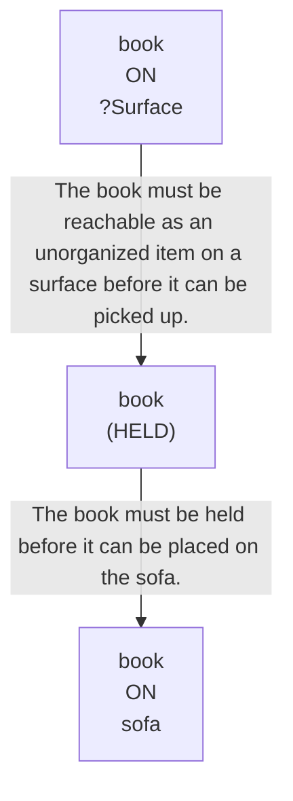
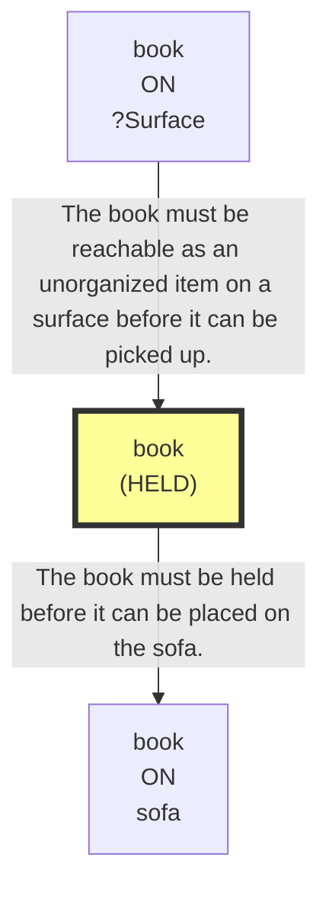
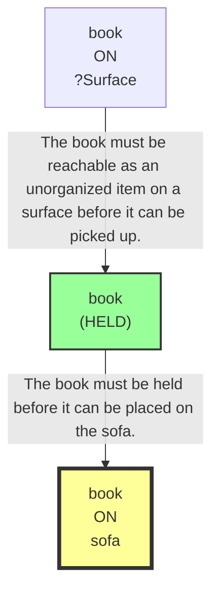
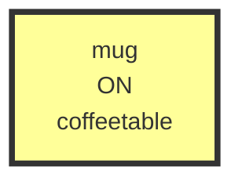
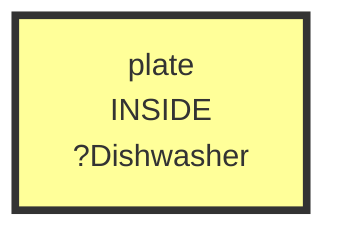
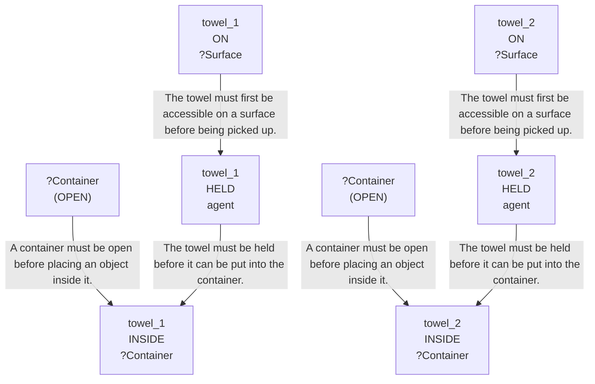
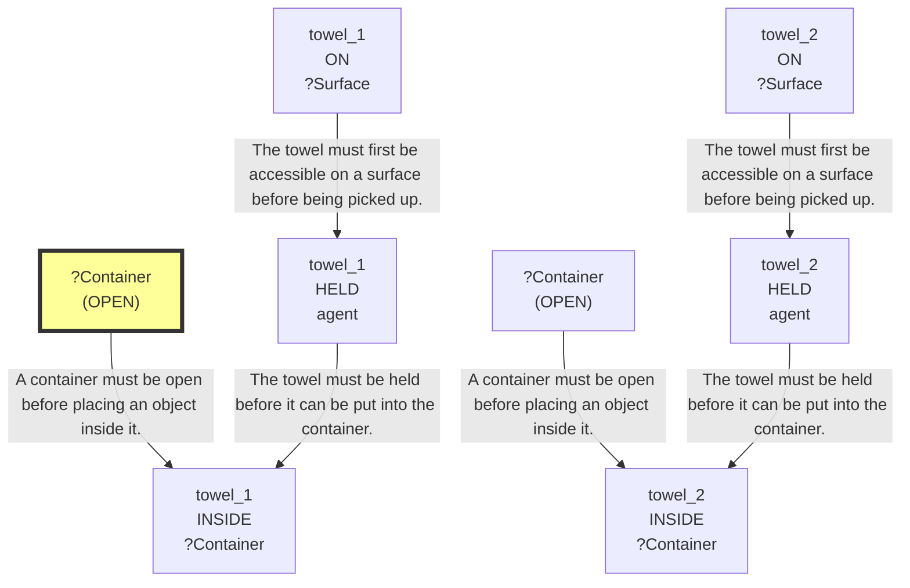
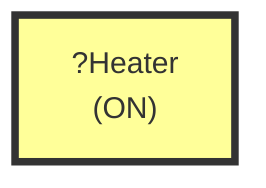

# 🚀 VirtualHome Agent Episode Log


### [GoalReasoner (Module A - Intent)] Output
```json
{
  "is_instruction_obviously_vague": false,
  "clarification_question": null,
  "target_object": "book",
  "location_hint": "sofa",
  "reasoning_chain": [
    {
      "question": "Why does the user want this object moved?",
      "answer": "To place a book that is found unorganized into a more appropriate resting location."
    },
    {
      "question": "Why is that important?",
      "answer": "It likely helps organize the space and make the book available in a preferred spot."
    },
    {
      "question": "What fundamental need does this fulfill?",
      "answer": "It supports tidiness and convenient access to reading material."
    },
    {
      "question": "Are there any deeper psychological or physical motivations?",
      "answer": "The user may want a cleaner, more orderly environment and easier retrieval of the book later."
    }
  ],
  "deep_intent": "The user wants to organize misplaced reading material into a preferred resting area.",
  "acceptable_alternatives_properties": [
    {
      "priority": 1,
      "description": "Other reading materials such as magazines, notebooks, or journals that are out of place"
    },
    {
      "priority": 2,
      "description": "Other paper-based items used for reading or writing that can be tidied to the same area"
    },
    {
      "priority": 3,
      "description": "Light household items that are similarly meant to be kept neatly in a living area"
    },
    {
      "priority": 4,
      "description": "Other portable personal items that can be moved to reduce clutter in the room"
    }
  ]
}
```

### [RoboStateMultiTaskController] Output
```json
{
  "action": "[walk] <kitchen> (11)",
  "active_task_id": "task_2",
  "task_context": {
    "active_task_id": "task_2",
    "pending_task_ids": [
      "task_1",
      "task_3",
      "task_4",
      "task_5",
      "task_6",
      "task_7"
    ],
    "satisfied_task_ids": []
  },
  "source": "room_frontier"
}
```
## Step 0
- **Action**: `[walk] <kitchen> (11)`
- **Action Success**: `True`
- **Action Message**: {'0': {'message': 'Success'}}
- **Active Task**: `task_2`
- **Decision Source**: `room_frontier`
- **Task Progress**: E1_11=pending, E1_03=pending, E1_07=pending, E1_09=pending, E1_12=pending, E1_18=pending, E1_19=pending
- **SDG Status**:

- **Observed Items (38)**: floor(242), floor(243), floor(244), floor(245), ceiling(246), ceiling(247), ceiling(248), ceiling(249), wall(250), wall(251), wall(252), wall(253), door(254) [OPEN], ceilinglamp(255), tablelamp(256) [ON]...


### [RoboStateMultiTaskController] Output
```json
{
  "action": "[walk] <livingroom> (183)",
  "active_task_id": "task_2",
  "task_context": {
    "active_task_id": "task_2",
    "pending_task_ids": [
      "task_1",
      "task_3",
      "task_4",
      "task_5",
      "task_6",
      "task_7"
    ],
    "satisfied_task_ids": []
  },
  "source": "room_frontier"
}
```
## Step 1
- **Action**: `[walk] <livingroom> (183)`
- **Action Success**: `True`
- **Action Message**: {'0': {'message': 'Success'}}
- **Active Task**: `task_2`
- **Decision Source**: `room_frontier`
- **Task Progress**: E1_11=pending, E1_03=pending, E1_07=pending, E1_09=pending, E1_12=pending, E1_18=pending, E1_19=pending
- **SDG Status**:

- **Observed Items (193)**: floor(242), floor(243), floor(244), floor(245), ceiling(246), ceiling(247), ceiling(248), ceiling(249), wall(250), wall(251), wall(252), wall(253), door(254) [OPEN], ceilinglamp(255), tablelamp(256) [ON]...


### [PerceptionFilter] Output
```json
{
  "reasoning": "The goal is to move a book onto the sofa. The required target object is book, and the location/final resting place explicitly needed is sofa. The SDG also implies the book must be accessible from some surface before being picked up, but no specific source surface is required because any current surface can satisfy that relation.",
  "selected_classes": [
    "book",
    "character",
    "sofa"
  ],
  "raw_class_count": 66
}
```

### [LLMExecutor] Output
```json
{
  "reasoning": "The goal is to place a book on the sofa. In the current living room, the only book explicitly close to the character is book(105), but it is still on a surface/nearby state not yet verified as held. Since the SDG requires the book to be held before it can be placed on the sofa, the next step must be to grab the reachable book. I should focus on satisfying N2 first. The sofa(214) is identified as the target surface for the final placement, but I am not yet holding any book.",
  "satisfied_nodes": [],
  "current_node_focus": "N2",
  "mapped_variables": {},
  "action": "[grab] <book> (105)"
}
```

### [RoboStateMultiTaskController] Output
```json
{
  "action": "[grab] <book> (105)",
  "active_task_id": "task_2",
  "task_context": {
    "active_task_id": "task_2",
    "pending_task_ids": [
      "task_1",
      "task_3",
      "task_4",
      "task_5",
      "task_6",
      "task_7"
    ],
    "satisfied_task_ids": []
  },
  "source": "llm_executor"
}
```
## Step 2
- **Action**: `[grab] <book> (105)`
- **Action Success**: `True`
- **Action Message**: {'0': {'message': 'Success'}}
- **Active Task**: `task_2`
- **Decision Source**: `llm_executor`
- **Task Progress**: E1_11=pending, E1_03=pending, E1_07=pending, E1_09=pending, E1_12=pending, E1_18=pending, E1_19=pending
- **SDG Status**:

- **Observed Items (11)**: book(275) [CLOSED], character(1), kitchen(11), livingroom(183), bedroom(241), bathroom(285), bedroom(346), sofa(214), book(229) [CLOSED], book(230) [CLOSED], book(105) [CLOSED]


### [PerceptionFilter] Output
```json
{
  "reasoning": "Reused cached class selection.",
  "selected_classes": [
    "book",
    "character",
    "sofa"
  ],
  "raw_class_count": 66
}
```

### [LLMExecutor] Output
```json
{
  "reasoning": "The active task is to place the book on the sofa. The current graph shows I am already holding book(105) and I am inside the livingroom where sofa(214) is located, so the next required step is to move next to the sofa before I can place the book on it. N2 is satisfied because the book is held. N1 is not yet satisfied, and N3 is not relevant anymore because the book is already in hand.",
  "satisfied_nodes": [
    "N2"
  ],
  "current_node_focus": "N1",
  "mapped_variables": {},
  "action": "[walk] <sofa> (214)"
}
```

### [RoboStateMultiTaskController] Output
```json
{
  "action": "[walk] <sofa> (214)",
  "active_task_id": "task_2",
  "task_context": {
    "active_task_id": "task_2",
    "pending_task_ids": [
      "task_1",
      "task_3",
      "task_4",
      "task_5",
      "task_6",
      "task_7"
    ],
    "satisfied_task_ids": []
  },
  "source": "llm_executor"
}
```
## Step 3
- **Action**: `[walk] <sofa> (214)`
- **Action Success**: `True`
- **Action Message**: {'0': {'message': 'Success'}}
- **Active Task**: `task_2`
- **Decision Source**: `llm_executor`
- **Task Progress**: E1_11=pending, E1_03=pending, E1_07=pending, E1_09=pending, E1_12=pending, E1_18=pending, E1_19=pending
- **SDG Status**:

- **Observed Items (11)**: book(275) [CLOSED], character(1), kitchen(11), livingroom(183), bedroom(241), bathroom(285), bedroom(346), sofa(214), book(229) [CLOSED], book(230) [CLOSED], book(105) [CLOSED]


### [PerceptionFilter] Output
```json
{
  "reasoning": "Reused cached class selection.",
  "selected_classes": [
    "book",
    "character",
    "sofa"
  ],
  "raw_class_count": 66
}
```

### [LLMExecutor] Output
```json
{
  "reasoning": "The active task is to place the book on the sofa. The current graph shows I am already close to sofa(214) and holding book(105) in my right hand. N2 (book held) is satisfied. The next required step is to place the held book onto the sofa, which requires being at the sofa destination and then using putback.",
  "satisfied_nodes": [
    "N2"
  ],
  "current_node_focus": "N1",
  "mapped_variables": {},
  "action": "[putback] <book> (105) <sofa> (214)"
}
```

### [RoboStateMultiTaskController] Output
```json
{
  "action": "[putback] <book> (105) <sofa> (214)",
  "active_task_id": "task_2",
  "task_context": {
    "active_task_id": "task_2",
    "pending_task_ids": [
      "task_1",
      "task_3",
      "task_4",
      "task_5",
      "task_6",
      "task_7"
    ],
    "satisfied_task_ids": []
  },
  "source": "llm_executor"
}
```
## Step 4
- **Action**: `[putback] <book> (105) <sofa> (214)`
- **Action Success**: `True`
- **Action Message**: {'0': {'message': 'Success'}}
- **Active Task**: `task_2`
- **Decision Source**: `llm_executor`
- **Task Progress**: E1_11=pending, E1_03=done, E1_07=pending, E1_09=pending, E1_12=pending, E1_18=pending, E1_19=pending
- **SDG Status**:

- **Observed Items (11)**: book(275) [CLOSED], character(1), kitchen(11), livingroom(183), bedroom(241), bathroom(285), bedroom(346), sofa(214), book(229) [CLOSED], book(230) [CLOSED], book(105) [CLOSED]


### [GoalReasoner (Module A - Intent)] Output
```json
{
  "is_instruction_obviously_vague": false,
  "clarification_question": null,
  "target_object": "mug",
  "location_hint": "coffeetable",
  "reasoning_chain": [
    {
      "question": "Why does the user want this object?",
      "answer": "To keep the mug placed on the coffeetable."
    },
    {
      "question": "Why is that important?",
      "answer": "To maintain the mug in a specific visible and accessible location."
    },
    {
      "question": "What fundamental need does this fulfill?",
      "answer": "It supports organization and predictable placement of an everyday household item."
    },
    {
      "question": "Are there any deeper psychological or physical motivations?",
      "answer": "It may be about convenience, tidiness, or keeping the mug ready for use."
    }
  ],
  "deep_intent": "The user wants an everyday household item kept in a consistent, accessible location.",
  "acceptable_alternatives_properties": [
    {
      "priority": 1,
      "description": "Other drink containers or cups that can be kept on the coffeetable in the same way"
    },
    {
      "priority": 2,
      "description": "Other small tabletop items that serve a similar keep-it-handy function"
    },
    {
      "priority": 3,
      "description": "Any everyday household item that can be stably placed on the coffeetable"
    },
    {
      "priority": 4,
      "description": "A different portable personal item that can still be stored in a predictable visible spot"
    }
  ]
}
```

### [PerceptionFilter] Output
```json
{
  "reasoning": "The goal and SDG require keeping a mug on a coffeetable. To satisfy this, the only strictly necessary visible classes are the target object and its required location.",
  "selected_classes": [
    "character",
    "mug",
    "coffeetable"
  ],
  "raw_class_count": 66
}
```

### [LLMExecutor] Output
```json
{
  "reasoning": "The active goal is to have mug(384) on coffeetable(215). The mug is in kitchen(11) and the character is already close to coffeetable(215), but not necessarily close to the mug. To move the mug onto the coffeetable, the next required step is to go to the mug first so it can be grabbed before transporting it.",
  "satisfied_nodes": [],
  "current_node_focus": "N1",
  "mapped_variables": {},
  "action": "[walk] <mug> (384)"
}
```

### [RoboStateMultiTaskController] Output
```json
{
  "action": "[walk] <mug> (384)",
  "active_task_id": "task_3",
  "task_context": {
    "active_task_id": "task_3",
    "pending_task_ids": [
      "task_1",
      "task_4",
      "task_5",
      "task_6",
      "task_7"
    ],
    "satisfied_task_ids": [
      "task_2"
    ]
  },
  "source": "llm_executor"
}
```
## Step 5
- **Action**: `[walk] <mug> (384)`
- **Action Success**: `True`
- **Action Message**: {'0': {'message': 'Success'}}
- **Active Task**: `task_3`
- **Decision Source**: `llm_executor`
- **Task Progress**: E1_11=pending, E1_03=done, E1_07=pending, E1_09=pending, E1_12=pending, E1_18=pending, E1_19=pending
- **SDG Status**:

- **Observed Items (8)**: character(1), kitchen(11), livingroom(183), bedroom(241), bathroom(285), bedroom(346), mug(384), coffeetable(215)


### [PerceptionFilter] Output
```json
{
  "reasoning": "Reused cached class selection.",
  "selected_classes": [
    "character",
    "mug",
    "coffeetable"
  ],
  "raw_class_count": 66
}
```

### [LLMExecutor] Output
```json
{
  "reasoning": "The mug is already close to the character, so the next step toward satisfying N1 (mug ON coffeetable) is to move it onto the coffeetable. Because putting back onto a surface requires being explicitly walked to the destination first, and the mug is currently held from the prior step? Actually the graph does not show it held, so I should not assume possession. However the last action was walking to the mug and the graph says CLOSE mug, which means the immediate next physical interaction should be to grab it before transport. Since only one atomic action is allowed, I will grab the mug now to prepare for placement on the coffeetable next.",
  "satisfied_nodes": [],
  "current_node_focus": "N1",
  "mapped_variables": {},
  "action": "[grab] <mug> (384)"
}
```

### [RoboStateMultiTaskController] Output
```json
{
  "action": "[grab] <mug> (384)",
  "active_task_id": "task_3",
  "task_context": {
    "active_task_id": "task_3",
    "pending_task_ids": [
      "task_1",
      "task_4",
      "task_5",
      "task_6",
      "task_7"
    ],
    "satisfied_task_ids": [
      "task_2"
    ]
  },
  "source": "llm_executor"
}
```
## Step 6
- **Action**: `[grab] <mug> (384)`
- **Action Success**: `True`
- **Action Message**: {'0': {'message': 'Success'}}
- **Active Task**: `task_3`
- **Decision Source**: `llm_executor`
- **Task Progress**: E1_11=pending, E1_03=done, E1_07=pending, E1_09=pending, E1_12=pending, E1_18=pending, E1_19=pending
- **SDG Status**:

- **Observed Items (8)**: character(1), kitchen(11), livingroom(183), bedroom(241), bathroom(285), bedroom(346), mug(384), coffeetable(215)


### [PerceptionFilter] Output
```json
{
  "reasoning": "Reused cached class selection.",
  "selected_classes": [
    "character",
    "mug",
    "coffeetable"
  ],
  "raw_class_count": 66
}
```

### [LLMExecutor] Output
```json
{
  "reasoning": "The active goal is to have mug(384) on coffeetable(215). I am already holding the mug and the coffeetable is close, so the next step is to walk to the coffeetable before placing the mug on it. No other node is satisfied yet because the mug is not on the coffeetable.",
  "satisfied_nodes": [],
  "current_node_focus": "N1",
  "mapped_variables": {},
  "action": "[walk] <coffeetable> (215)"
}
```

### [RoboStateMultiTaskController] Output
```json
{
  "action": "[walk] <coffeetable> (215)",
  "active_task_id": "task_3",
  "task_context": {
    "active_task_id": "task_3",
    "pending_task_ids": [
      "task_1",
      "task_4",
      "task_5",
      "task_6",
      "task_7"
    ],
    "satisfied_task_ids": [
      "task_2"
    ]
  },
  "source": "llm_executor"
}
```
## Step 7
- **Action**: `[walk] <coffeetable> (215)`
- **Action Success**: `True`
- **Action Message**: {'0': {'message': 'Success'}}
- **Active Task**: `task_3`
- **Decision Source**: `llm_executor`
- **Task Progress**: E1_11=pending, E1_03=done, E1_07=pending, E1_09=pending, E1_12=pending, E1_18=pending, E1_19=pending
- **SDG Status**:

- **Observed Items (8)**: character(1), kitchen(11), livingroom(183), bedroom(241), bathroom(285), bedroom(346), mug(384), coffeetable(215)


### [PerceptionFilter] Output
```json
{
  "reasoning": "Reused cached class selection.",
  "selected_classes": [
    "character",
    "mug",
    "coffeetable"
  ],
  "raw_class_count": 66
}
```

### [LLMExecutor] Output
```json
{
  "reasoning": "The mug is already being held and the character is close to the coffeetable, so the remaining step to satisfy N1 is to place the mug onto the coffeetable. This requires a putback action onto the flat surface.",
  "satisfied_nodes": [],
  "current_node_focus": "N1",
  "mapped_variables": {},
  "action": "[putback] <mug> (384) <coffeetable> (215)"
}
```

### [RoboStateMultiTaskController] Output
```json
{
  "action": "[putback] <mug> (384) <coffeetable> (215)",
  "active_task_id": "task_3",
  "task_context": {
    "active_task_id": "task_3",
    "pending_task_ids": [
      "task_1",
      "task_4",
      "task_5",
      "task_6",
      "task_7"
    ],
    "satisfied_task_ids": [
      "task_2"
    ]
  },
  "source": "llm_executor"
}
```
## Step 8
- **Action**: `[putback] <mug> (384) <coffeetable> (215)`
- **Action Success**: `True`
- **Action Message**: {'0': {'message': 'Success'}}
- **Active Task**: `task_3`
- **Decision Source**: `llm_executor`
- **Task Progress**: E1_11=pending, E1_03=done, E1_07=done, E1_09=pending, E1_12=pending, E1_18=pending, E1_19=pending
- **SDG Status**:

- **Observed Items (8)**: character(1), kitchen(11), livingroom(183), bedroom(241), bathroom(285), bedroom(346), mug(384), coffeetable(215)


### [GoalReasoner (Module A - Intent)] Output
```json
{
  "is_instruction_obviously_vague": false,
  "clarification_question": null,
  "target_object": "plate",
  "location_hint": null,
  "reasoning_chain": [
    {
      "question": "Why does the user want this object?",
      "answer": "To have the plate returned to the dishwasher after it has been used for washing dishes and left elsewhere."
    },
    {
      "question": "Why is that important?",
      "answer": "To restore the plate to its proper storage/cleaning place and keep the area organized."
    },
    {
      "question": "What fundamental need does this fulfill?",
      "answer": "It fulfills the need to maintain household order and ensure dishware is placed in the correct cleaning appliance."
    },
    {
      "question": "Are there any deeper psychological or physical motivations?",
      "answer": "The user likely wants to reduce clutter, prevent misplaced dishware, and keep the kitchen workflow tidy and functional."
    }
  ],
  "deep_intent": "Maintain household order by returning used dishware to its proper cleaning/storage place.",
  "acceptable_alternatives_properties": [
    {
      "priority": 1,
      "description": "Other used dishware or kitchen items that belong in the dishwasher, such as bowls, cups, or utensils"
    },
    {
      "priority": 2,
      "description": "Any washable kitchenware that has been left out and needs to be returned to the dishwasher"
    },
    {
      "priority": 3,
      "description": "Other household items from the same cleanup context that should be put back in their designated place"
    },
    {
      "priority": 4,
      "description": "Nearby items that are out of place and need tidying to restore an orderly kitchen environment"
    }
  ]
}
```

### [PerceptionFilter] Output
```json
{
  "reasoning": "The goal is to return the plate to the dishwasher, so the required target object is the plate and the relevant receptacle/appliance is the dishwasher. No other objects are necessary for this task.",
  "selected_classes": [
    "plate",
    "dishwasher",
    "character"
  ],
  "raw_class_count": 66
}
```

### [LLMExecutor] Output
```json
{
  "reasoning": "The active goal is to place a plate inside the dishwasher. The dishwasher(165) is already open and in the kitchen. There are multiple plate candidates, but plate(76) is the best choice because it is in the kitchen and currently CLOSE to the character, minimizing movement. I cannot put it in without first holding it, so the next atomic step is to walk to that plate before grabbing it.",
  "satisfied_nodes": [],
  "current_node_focus": "N1",
  "mapped_variables": {
    "?Dishwasher": "dishwasher(165)"
  },
  "action": "[walk] <plate> (76)"
}
```

### [RoboStateMultiTaskController] Output
```json
{
  "action": "[walk] <plate> (76)",
  "active_task_id": "task_6",
  "task_context": {
    "active_task_id": "task_6",
    "pending_task_ids": [
      "task_1",
      "task_4",
      "task_5",
      "task_7"
    ],
    "satisfied_task_ids": [
      "task_2",
      "task_3"
    ]
  },
  "source": "llm_executor"
}
```
## Step 9
- **Action**: `[walk] <plate> (76)`
- **Action Success**: `True`
- **Action Message**: {'0': {'message': 'Success'}}
- **Active Task**: `task_6`
- **Decision Source**: `llm_executor`
- **Task Progress**: E1_11=pending, E1_03=done, E1_07=done, E1_09=pending, E1_12=pending, E1_18=pending, E1_19=pending
- **SDG Status**:

- **Observed Items (19)**: plate(273), character(1), kitchen(11), livingroom(183), bedroom(241), bathroom(285), bedroom(346), plate(68), plate(75), plate(76), plate(83), plate(84), plate(91), plate(103), plate(104)...


### [PerceptionFilter] Output
```json
{
  "reasoning": "Reused cached class selection.",
  "selected_classes": [
    "plate",
    "dishwasher",
    "character"
  ],
  "raw_class_count": 66
}
```

### [LLMExecutor] Output
```json
{
  "reasoning": "The active task is to place a plate inside the dishwasher. In the current graph, dishwasher(165) is open and in the kitchen, while plate(76) is already close to the character and appears to be the best matching plate for this task. Since I am already near plate(76), the next required step is to pick it up before walking to the dishwasher and putting it inside.",
  "satisfied_nodes": [],
  "current_node_focus": "N1",
  "mapped_variables": {
    "?Dishwasher": "dishwasher(165)"
  },
  "action": "[grab] <plate> (76)"
}
```

### [RoboStateMultiTaskController] Output
```json
{
  "action": "[grab] <plate> (76)",
  "active_task_id": "task_6",
  "task_context": {
    "active_task_id": "task_6",
    "pending_task_ids": [
      "task_1",
      "task_4",
      "task_5",
      "task_7"
    ],
    "satisfied_task_ids": [
      "task_2",
      "task_3"
    ]
  },
  "source": "llm_executor"
}
```
## Step 10
- **Action**: `[grab] <plate> (76)`
- **Action Success**: `True`
- **Action Message**: {'0': {'message': 'Success'}}
- **Active Task**: `task_6`
- **Decision Source**: `llm_executor`
- **Task Progress**: E1_11=pending, E1_03=done, E1_07=done, E1_09=pending, E1_12=pending, E1_18=pending, E1_19=pending
- **SDG Status**:

- **Observed Items (19)**: plate(273), character(1), kitchen(11), livingroom(183), bedroom(241), bathroom(285), bedroom(346), plate(68), plate(75), plate(76), plate(83), plate(84), plate(91), plate(103), plate(104)...


### [PerceptionFilter] Output
```json
{
  "reasoning": "Reused cached class selection.",
  "selected_classes": [
    "plate",
    "dishwasher",
    "character"
  ],
  "raw_class_count": 66
}
```

### [LLMExecutor] Output
```json
{
  "reasoning": "The active goal is to place a plate inside the dishwasher. The current graph shows the character is already holding plate(76) and is in the kitchen, while dishwasher(165) is open and nearby in the same room. No further prerequisite is needed before depositing the plate. Since putin requires being near the destination and the dishwasher is the correct container for the target relation, the next step is to place the held plate into the dishwasher.",
  "satisfied_nodes": [],
  "current_node_focus": "N1",
  "mapped_variables": {
    "?Dishwasher": "dishwasher(165)"
  },
  "action": "[putin] <plate> (76) <dishwasher> (165)"
}
```

### [RoboStateMultiTaskController] Output
```json
{
  "action": "[walk] <dishwasher> (165)",
  "active_task_id": "task_6",
  "task_context": {
    "active_task_id": "task_6",
    "pending_task_ids": [
      "task_1",
      "task_4",
      "task_5",
      "task_7"
    ],
    "satisfied_task_ids": [
      "task_2",
      "task_3"
    ]
  },
  "source": "llm_executor_repaired"
}
```
## Step 11
- **Action**: `[walk] <dishwasher> (165)`
- **Action Success**: `True`
- **Action Message**: {'0': {'message': 'Success'}}
- **Active Task**: `task_6`
- **Decision Source**: `llm_executor_repaired`
- **Task Progress**: E1_11=pending, E1_03=done, E1_07=done, E1_09=pending, E1_12=pending, E1_18=pending, E1_19=pending
- **SDG Status**:

- **Observed Items (19)**: plate(273), character(1), kitchen(11), livingroom(183), bedroom(241), bathroom(285), bedroom(346), plate(68), plate(75), plate(76), plate(83), plate(84), plate(91), plate(103), plate(104)...


### [PerceptionFilter] Output
```json
{
  "reasoning": "Reused cached class selection.",
  "selected_classes": [
    "plate",
    "dishwasher",
    "character"
  ],
  "raw_class_count": 66
}
```

### [LLMExecutor] Output
```json
{
  "reasoning": "The active goal is to return a plate inside the dishwasher. The current filter shows dishwasher(165) is OPEN and OFF, and character(1) is already CLOSE to dishwasher(165). However, the character is holding plate(76) in the right hand, while the plate object currently selected in the graph as near the dishwasher is also plate(76). Since putting into a container requires holding the item and being near the destination, the next atomic action is to put the held plate into the dishwasher. The dishwasher is open, so no open action is needed.",
  "satisfied_nodes": [],
  "current_node_focus": "N1",
  "mapped_variables": {
    "?Dishwasher": "dishwasher(165)"
  },
  "action": "[putin] <plate> (76) <dishwasher> (165)"
}
```

### [RoboStateMultiTaskController] Output
```json
{
  "action": "[putin] <plate> (76) <dishwasher> (165)",
  "active_task_id": "task_6",
  "task_context": {
    "active_task_id": "task_6",
    "pending_task_ids": [
      "task_1",
      "task_4",
      "task_5",
      "task_7"
    ],
    "satisfied_task_ids": [
      "task_2",
      "task_3"
    ]
  },
  "source": "llm_executor"
}
```
## Step 12
- **Action**: `[putin] <plate> (76) <dishwasher> (165)`
- **Action Success**: `True`
- **Action Message**: {'0': {'message': 'Success'}}
- **Active Task**: `task_6`
- **Decision Source**: `llm_executor`
- **Task Progress**: E1_11=pending, E1_03=done, E1_07=done, E1_09=pending, E1_12=pending, E1_18=done, E1_19=pending
- **SDG Status**:

- **Observed Items (19)**: plate(273), character(1), kitchen(11), livingroom(183), bedroom(241), bathroom(285), bedroom(346), plate(68), plate(75), plate(76), plate(83), plate(84), plate(91), plate(103), plate(104)...


### [GoalReasoner (Module A - Intent)] Output
```json
{
  "is_instruction_obviously_vague": false,
  "clarification_question": null,
  "target_object": "towels",
  "location_hint": null,
  "reasoning_chain": [
    {
      "question": "Why does the user want this object?",
      "answer": "To relocate towels from where they are found into another appliance."
    },
    {
      "question": "Why is that important?",
      "answer": "The user likely wants the towels handled or cleaned in a specific way."
    },
    {
      "question": "What fundamental need does this fulfill?",
      "answer": "The user wants to manage household items, most likely for cleaning or tidying."
    },
    {
      "question": "Are there any deeper psychological or physical motivations?",
      "answer": "It may be to maintain order in the home and process soiled textiles."
    }
  ],
  "deep_intent": "The user wants to clean or otherwise process household textiles.",
  "acceptable_alternatives_properties": [
    {
      "priority": 1,
      "description": "Other washable household textiles, such as washcloths, dish cloths, or cleaning rags"
    },
    {
      "priority": 2,
      "description": "Similar fabric items that can be laundered, such as napkins or small linens"
    },
    {
      "priority": 3,
      "description": "Other household items intended to be cleaned rather than discarded, such as cloth placemats or fabric oven mitts"
    },
    {
      "priority": 4,
      "description": "Other soft reusable items that can be sanitized or washed, such as reusable shopping bags made of fabric"
    }
  ]
}
```

### [RoboStateMultiTaskController] Output
```json
{
  "action": "[walk] <bathroom> (285)",
  "active_task_id": "task_4",
  "task_context": {
    "active_task_id": "task_4",
    "pending_task_ids": [
      "task_1",
      "task_5",
      "task_7"
    ],
    "satisfied_task_ids": [
      "task_2",
      "task_3",
      "task_6"
    ]
  },
  "source": "room_frontier"
}
```
## Step 13
- **Action**: `[walk] <bathroom> (285)`
- **Action Success**: `True`
- **Action Message**: {'0': {'message': 'Success'}}
- **Active Task**: `task_4`
- **Decision Source**: `room_frontier`
- **Task Progress**: E1_11=pending, E1_03=done, E1_07=done, E1_09=pending, E1_12=pending, E1_18=done, E1_19=pending
- **SDG Status**:

- **Observed Items (246)**: floor(242), floor(243), floor(244), floor(245), ceiling(246), ceiling(247), ceiling(248), ceiling(249), wall(250), wall(251), wall(252), wall(253), door(254) [OPEN], ceilinglamp(255), tablelamp(256) [ON]...


### [PerceptionFilter] Output
```json
{
  "reasoning": "The goal is to process towels, so the target towels must be kept. The SDG requires an open container/receptacle where the towels are located or will be placed, so I keep all plausible laundry/processing appliances and receptacles present: washingmachine, dishwasher, sink, and fridge only if it could serve as a cooling/storage appliance for textiles, but the task specifically points to washing/processing, so the necessary physical options are the laundry-capable ones and the towels themselves.",
  "selected_classes": [
    "dishwasher",
    "character",
    "towel",
    "sink",
    "washingmachine"
  ],
  "raw_class_count": 82
}
```

### [LLMExecutor] Output
```json
{
  "reasoning": "The active task is to place towels into an open container. The best available container in the current location is washingmachine(345), which is a suitable container and is currently CLOSED, so it must be opened before any towel can be put inside. We are already inside the bathroom, and the washing machine is the clearest target container for the towels. Next step should therefore be to walk to the washing machine before opening it, because proximity is required for interaction.",
  "satisfied_nodes": [],
  "current_node_focus": "N2",
  "mapped_variables": {
    "?Container": "washingmachine(345)"
  },
  "action": "[walk] <washingmachine> (345)"
}
```

### [RoboStateMultiTaskController] Output
```json
{
  "action": "[walk] <washingmachine> (345)",
  "active_task_id": "task_4",
  "task_context": {
    "active_task_id": "task_4",
    "pending_task_ids": [
      "task_1",
      "task_5",
      "task_7"
    ],
    "satisfied_task_ids": [
      "task_2",
      "task_3",
      "task_6"
    ]
  },
  "source": "llm_executor"
}
```
## Step 14
- **Action**: `[walk] <washingmachine> (345)`
- **Action Success**: `True`
- **Action Message**: {'0': {'message': 'Success'}}
- **Active Task**: `task_4`
- **Decision Source**: `llm_executor`
- **Task Progress**: E1_11=pending, E1_03=done, E1_07=done, E1_09=pending, E1_12=pending, E1_18=done, E1_19=pending
- **SDG Status**:

- **Observed Items (15)**: character(1), kitchen(11), livingroom(183), bedroom(241), bathroom(285), bedroom(346), sink(155), dishwasher(165) [OPEN,OFF], sink(326), towel(328), towel(329), towel(330), towel(342), towel(343), washingmachine(345) [CLOSED,OFF]


### [PerceptionFilter] Output
```json
{
  "reasoning": "Reused cached class selection.",
  "selected_classes": [
    "dishwasher",
    "character",
    "towel",
    "sink",
    "washingmachine"
  ],
  "raw_class_count": 82
}
```

### [LLMExecutor] Output
```json
{
  "reasoning": "The active goal is to place towels into an open container, and the best matching container in view is the washing machine (345). We are already close to the washing machine, but it is currently CLOSED, so the next required step is to open it before any towel can be put inside. This advances the SDG toward N2/N6 without violating proximity or container rules.",
  "satisfied_nodes": [],
  "current_node_focus": "N2",
  "mapped_variables": {
    "?Container": "washingmachine(345)"
  },
  "action": "[open] <washingmachine> (345)"
}
```

### [RoboStateMultiTaskController] Output
```json
{
  "action": "[open] <washingmachine> (345)",
  "active_task_id": "task_4",
  "task_context": {
    "active_task_id": "task_4",
    "pending_task_ids": [
      "task_1",
      "task_5",
      "task_7"
    ],
    "satisfied_task_ids": [
      "task_2",
      "task_3",
      "task_6"
    ]
  },
  "source": "llm_executor"
}
```
## Step 15
- **Action**: `[open] <washingmachine> (345)`
- **Action Success**: `False`
- **Action Message**: {'0': {'message': 'ScriptExcutor 0: EXECUTION_GENERAL: Script is impossible to execute\n\n'}}
- **Active Task**: `task_4`
- **Decision Source**: `llm_executor`
- **Task Progress**: E1_11=pending, E1_03=done, E1_07=done, E1_09=pending, E1_12=pending, E1_18=done, E1_19=pending
- **SDG Status**:

- **Observed Items (15)**: character(1), kitchen(11), livingroom(183), bedroom(241), bathroom(285), bedroom(346), sink(155), dishwasher(165) [OPEN,OFF], sink(326), towel(328), towel(329), towel(330), towel(342), towel(343), washingmachine(345) [CLOSED,OFF]


### [PerceptionFilter] Output
```json
{
  "reasoning": "Reused cached class selection.",
  "selected_classes": [
    "dishwasher",
    "character",
    "towel",
    "sink",
    "washingmachine"
  ],
  "raw_class_count": 82
}
```

### [LLMExecutor] Output
```json
{
  "reasoning": "The previous attempt to open the washing machine failed, and the graph shows the washing machine is a valid container but currently CLOSED and we are already close to it. To progress the towel task, the next required step is to open the washing machine before we can place towels inside. No clarification is needed because the task is specific and the towels are clearly available in the bathroom.",
  "satisfied_nodes": [],
  "current_node_focus": "N2",
  "mapped_variables": {
    "?Container": "washingmachine(345)"
  },
  "action": "[open] <washingmachine> (345)"
}
```

### [RoboStateMultiTaskController] Output
```json
{
  "action": "[open] <washingmachine> (345)",
  "active_task_id": "task_4",
  "task_context": {
    "active_task_id": "task_4",
    "pending_task_ids": [
      "task_1",
      "task_5",
      "task_7"
    ],
    "satisfied_task_ids": [
      "task_2",
      "task_3",
      "task_6"
    ]
  },
  "source": "llm_executor"
}
```
## Step 16
- **Action**: `[open] <washingmachine> (345)`
- **Action Success**: `False`
- **Action Message**: {'0': {'message': 'ScriptExcutor 0: EXECUTION_GENERAL: Script is impossible to execute\n\n'}}
- **Active Task**: `task_4`
- **Decision Source**: `llm_executor`
- **Task Progress**: E1_11=pending, E1_03=done, E1_07=done, E1_09=pending, E1_12=pending, E1_18=done, E1_19=pending
- **SDG Status**:

- **Observed Items (15)**: character(1), kitchen(11), livingroom(183), bedroom(241), bathroom(285), bedroom(346), sink(155), dishwasher(165) [OPEN,OFF], sink(326), towel(328), towel(329), towel(330), towel(342), towel(343), washingmachine(345) [CLOSED,OFF]


### [GoalReasoner (Module A - Intent)] Output
```json
{
  "is_instruction_obviously_vague": false,
  "clarification_question": null,
  "target_object": "microwave",
  "location_hint": null,
  "reasoning_chain": [
    {
      "question": "Why does the user want this object?",
      "answer": "To have the microwave available in an on state."
    },
    {
      "question": "Why is that important?",
      "answer": "So it can be used for its intended function."
    },
    {
      "question": "What fundamental need does this fulfill?",
      "answer": "It enables heating or preparing food/drinks quickly."
    },
    {
      "question": "Are there any deeper psychological or physical motivations?",
      "answer": "The user likely wants convenient access to heat food or warm items, reducing effort and time."
    }
  ],
  "deep_intent": "The user wants to enable quick heating or preparation of food or drinks.",
  "acceptable_alternatives_properties": [
    {
      "priority": 1,
      "description": "Other appliances that can quickly heat food or drinks, such as a toaster oven or electric kettle."
    },
    {
      "priority": 2,
      "description": "Any indoor food-heating device that is powered on and ready to use."
    },
    {
      "priority": 3,
      "description": "Portable or countertop cooking/heating appliances that serve the same convenience function."
    },
    {
      "priority": 4,
      "description": "Alternative ways to warm food or drinks, such as a stove or hot plate, if the microwave is unavailable."
    }
  ]
}
```

### [PerceptionFilter] Output
```json
{
  "reasoning": "The goal is to have a microwave available in the ON state. The SDG only requires a heater-like appliance turned on, so the minimum necessary selection is the microwave itself. No extra tools or locations are required for this state goal.",
  "selected_classes": [
    "character",
    "door",
    "stove",
    "toaster",
    "microwave",
    "plate"
  ],
  "raw_class_count": 82
}
```

### [LLMExecutor] Output
```json
{
  "reasoning": "The active task is to get the microwave into the ON state. The microwave(171) is in the kitchen and is currently OFF and CLOSED. Since switching on requires being near the appliance, and the last action was not a walk to the microwave, the next atomic step is to walk to it. The microwave is the best binding for ?Heater because it matches the target object and can be switched on; it also has HAS_PLUG, so a future plugin may be needed before switching on if required by the environment. No other SDG nodes are satisfied yet because ON is not achieved.",
  "satisfied_nodes": [],
  "current_node_focus": "N1",
  "mapped_variables": {
    "?Heater": "microwave(171)"
  },
  "action": "[walk] <microwave> (171)"
}
```

### [RoboStateMultiTaskController] Output
```json
{
  "action": "[walk] <microwave> (171)",
  "active_task_id": "task_7",
  "task_context": {
    "active_task_id": "task_7",
    "pending_task_ids": [
      "task_1",
      "task_4",
      "task_5"
    ],
    "satisfied_task_ids": [
      "task_2",
      "task_3",
      "task_6"
    ]
  },
  "source": "llm_executor"
}
```
## Step 17
- **Action**: `[walk] <microwave> (171)`
- **Action Success**: `True`
- **Action Message**: {'0': {'message': 'Success'}}
- **Active Task**: `task_7`
- **Decision Source**: `llm_executor`
- **Task Progress**: E1_11=pending, E1_03=done, E1_07=done, E1_09=pending, E1_12=pending, E1_18=done, E1_19=pending
- **SDG Status**:

- **Observed Items (25)**: door(254) [OPEN], plate(273), character(1), kitchen(11), livingroom(183), bedroom(241), bathroom(285), bedroom(346), door(47) [OPEN], plate(68), plate(75), plate(76), plate(83), plate(84), plate(91)...


### [PerceptionFilter] Output
```json
{
  "reasoning": "Reused cached class selection.",
  "selected_classes": [
    "character",
    "door",
    "stove",
    "toaster",
    "microwave",
    "plate"
  ],
  "raw_class_count": 82
}
```

### [LLMExecutor] Output
```json
{
  "reasoning": "The active task is to get the heater ON. The microwave(171) is the best match for ?Heater: it is a heating appliance, has HAS_SWITCH and HAS_PLUG, and is currently OFF and CLOSE to the character. To turn it on, I must first be near it, and I already am. The microwave is CLOSED, but for switching on I do not need to open it. Next step is to switch it on.",
  "satisfied_nodes": [],
  "current_node_focus": "N1",
  "mapped_variables": {
    "?Heater": "microwave(171)"
  },
  "action": "[switchon] <microwave> (171)"
}
```

### [RoboStateMultiTaskController] Output
```json
{
  "action": "[switchon] <microwave> (171)",
  "active_task_id": "task_7",
  "task_context": {
    "active_task_id": "task_7",
    "pending_task_ids": [
      "task_1",
      "task_4",
      "task_5"
    ],
    "satisfied_task_ids": [
      "task_2",
      "task_3",
      "task_6"
    ]
  },
  "source": "llm_executor"
}
```
## Step 18
- **Action**: `[switchon] <microwave> (171)`
- **Action Success**: `True`
- **Action Message**: Faked switch operation in Python layer (bypassed Unity failure)
- **Active Task**: `task_7`
- **Decision Source**: `llm_executor`
- **Task Progress**: E1_11=pending, E1_03=done, E1_07=done, E1_09=pending, E1_12=pending, E1_18=done, E1_19=done
- **SDG Status**:

- **Observed Items (25)**: door(254) [OPEN], plate(273), character(1), kitchen(11), livingroom(183), bedroom(241), bathroom(285), bedroom(346), door(47) [OPEN], plate(68), plate(75), plate(76), plate(83), plate(84), plate(91)...


### [PerceptionFilter] Output
```json
{
  "reasoning": "Reused cached class selection.",
  "selected_classes": [
    "dishwasher",
    "character",
    "towel",
    "sink",
    "washingmachine"
  ],
  "raw_class_count": 82
}
```

### [LLMExecutor] Output
```json
{
  "reasoning": "The active goal is to place towels inside an open container. The only relevant container currently available in the graph is the washingmachine(345), which is closed and therefore must be opened before any towel can be put inside. We are already close to it from the previous step, and no towel is yet held. Because container opening is a prerequisite for the towel-inside relation, the next atomic action should satisfy N2/N6 by opening the washing machine.",
  "satisfied_nodes": [],
  "current_node_focus": "N2",
  "mapped_variables": {
    "?Container": "washingmachine(345)"
  },
  "action": "[open] <washingmachine> (345)"
}
```

### [RoboStateMultiTaskController] Output
```json
{
  "action": "[open] <washingmachine> (345)",
  "active_task_id": "task_4",
  "task_context": {
    "active_task_id": "task_4",
    "pending_task_ids": [
      "task_1",
      "task_5"
    ],
    "satisfied_task_ids": [
      "task_2",
      "task_3",
      "task_6",
      "task_7"
    ]
  },
  "source": "llm_executor"
}
```
## Step 19
- **Action**: `[open] <washingmachine> (345)`
- **Action Success**: `False`
- **Action Message**: {'0': {'message': 'ScriptExcutor 0: EXECUTION_GENERAL: Script is impossible to execute\n\n'}}
- **Active Task**: `task_4`
- **Decision Source**: `llm_executor`
- **Task Progress**: E1_11=pending, E1_03=done, E1_07=done, E1_09=pending, E1_12=pending, E1_18=done, E1_19=done
- **SDG Status**:

- **Observed Items (15)**: character(1), kitchen(11), livingroom(183), bedroom(241), bathroom(285), bedroom(346), sink(155), dishwasher(165) [OPEN,OFF], sink(326), towel(328), towel(329), towel(330), towel(342), towel(343), washingmachine(345) [CLOSED,OFF]


### [GoalReasoner (Module A - Intent)] Output
```json
{
  "is_instruction_obviously_vague": false,
  "clarification_question": null,
  "target_object": "computer",
  "location_hint": null,
  "reasoning_chain": [
    {
      "question": "Why does the user want this object?",
      "answer": "To have the computer powered on if it is currently off."
    },
    {
      "question": "Why is that important?",
      "answer": "Because the user needs the computer to be in an on state rather than off."
    },
    {
      "question": "What fundamental need does this fulfill?",
      "answer": "To enable the use of a computing device and make it operational."
    },
    {
      "question": "Are there any deeper psychological or physical motivations?",
      "answer": "The underlying motivation is likely to restore access to digital tasks, information, or interaction that require an active computer."
    }
  ],
  "deep_intent": "The user wants to make a computing device operational.",
  "acceptable_alternatives_properties": [
    {
      "priority": 1,
      "description": "Other power-controlled electronic devices that can be turned on, such as a laptop, desktop, or tablet."
    },
    {
      "priority": 2,
      "description": "Nearby computing equipment that serves the same function, such as a monitor-connected workstation or all-in-one computer."
    },
    {
      "priority": 3,
      "description": "Any usable electronic device that provides digital access, such as a smart terminal or media device."
    },
    {
      "priority": 4,
      "description": "A different device that can support the same digital task, such as a phone or tablet if a computer is unavailable."
    }
  ]
}
```

### [RoboStateMultiTaskController] Output
```json
{
  "action": "[walk] <bedroom> (346)",
  "active_task_id": "task_1",
  "task_context": {
    "active_task_id": "task_1",
    "pending_task_ids": [
      "task_4",
      "task_5"
    ],
    "satisfied_task_ids": [
      "task_2",
      "task_3",
      "task_6",
      "task_7"
    ]
  },
  "source": "room_frontier"
}
```
## Step 20
- **Action**: `[walk] <bedroom> (346)`
- **Action Success**: `True`
- **Action Message**: {'0': {'message': 'Success'}}
- **Active Task**: `task_1`
- **Decision Source**: `room_frontier`
- **Task Progress**: E1_11=pending, E1_03=done, E1_07=done, E1_09=pending, E1_12=pending, E1_18=done, E1_19=done
- **SDG Status**:
```mermaid
graph TD
    N1["computer<br>(ON)"]
```
- **Observed Items (306)**: floor(242), floor(243), floor(244), floor(245), ceiling(246), ceiling(247), ceiling(248), ceiling(249), wall(250), wall(251), wall(252), wall(253), door(254) [OPEN], ceilinglamp(255), tablelamp(256) [ON]...


### [PerceptionFilter] Output
```json
{
  "reasoning": "The goal is to make the computer operational by turning it on. The only strictly necessary object class in view is the computer itself; no additional tools, locations, or alternative devices are required by the SDG for this state change.",
  "selected_classes": [
    "character",
    "computer",
    "desk"
  ],
  "raw_class_count": 91
}
```

### [LLMExecutor] Output
```json
{
  "reasoning": "The active task is to make the computer operational, and the filtered graph shows computer(397) is in the current room (bedroom(346)) and is OFF. Since the goal is simply to turn it ON, the next atomic step is to interact with it directly. We are already in the same room, so no walk is needed before switching it on.",
  "satisfied_nodes": [],
  "current_node_focus": "N1",
  "mapped_variables": {},
  "action": "[switchon] <computer> (397)"
}
```

### [RoboStateMultiTaskController] Output
```json
{
  "action": "[walk] <computer> (397)",
  "active_task_id": "task_1",
  "task_context": {
    "active_task_id": "task_1",
    "pending_task_ids": [
      "task_4",
      "task_5"
    ],
    "satisfied_task_ids": [
      "task_2",
      "task_3",
      "task_6",
      "task_7"
    ]
  },
  "source": "llm_executor_repaired"
}
```
## Step 21
- **Action**: `[walk] <computer> (397)`
- **Action Success**: `True`
- **Action Message**: {'0': {'message': 'Success'}}
- **Active Task**: `task_1`
- **Decision Source**: `llm_executor_repaired`
- **Task Progress**: E1_11=pending, E1_03=done, E1_07=done, E1_09=pending, E1_12=pending, E1_18=done, E1_19=done
- **SDG Status**:
```mermaid
graph TD
    N1["computer<br>(ON)"]
    style N1 fill:#ff9,stroke:#333,stroke-width:4px
```
- **Observed Items (9)**: desk(281) [CLOSED], character(1), kitchen(11), livingroom(183), bedroom(241), bathroom(285), bedroom(346), desk(393) [CLOSED], computer(397) [OFF]


### [PerceptionFilter] Output
```json
{
  "reasoning": "Reused cached class selection.",
  "selected_classes": [
    "character",
    "computer",
    "desk"
  ],
  "raw_class_count": 91
}
```

### [LLMExecutor] Output
```json
{
  "reasoning": "The active goal is to make the computer ON. The current graph shows the character is already CLOSE to computer(397), and the computer is OFF with HAS_SWITCH. Since switch operations require proximity and we already have it, the next atomic action is to turn it on. No other prerequisites are needed.",
  "satisfied_nodes": [],
  "current_node_focus": "N1",
  "mapped_variables": {
    "?Computer": "computer(397)"
  },
  "action": "[switchon] <computer> (397)"
}
```

### [RoboStateMultiTaskController] Output
```json
{
  "action": "[switchon] <computer> (397)",
  "active_task_id": "task_1",
  "task_context": {
    "active_task_id": "task_1",
    "pending_task_ids": [
      "task_4",
      "task_5"
    ],
    "satisfied_task_ids": [
      "task_2",
      "task_3",
      "task_6",
      "task_7"
    ]
  },
  "source": "llm_executor"
}
```
## Step 22
- **Action**: `[switchon] <computer> (397)`
- **Action Success**: `True`
- **Action Message**: Faked switch operation in Python layer (bypassed Unity failure)
- **Active Task**: `task_1`
- **Decision Source**: `llm_executor`
- **Task Progress**: E1_11=done, E1_03=done, E1_07=done, E1_09=pending, E1_12=pending, E1_18=done, E1_19=done
- **SDG Status**:
```mermaid
graph TD
    N1["computer<br>(ON)"]
    style N1 fill:#ff9,stroke:#333,stroke-width:4px
```
- **Observed Items (9)**: desk(281) [CLOSED], character(1), kitchen(11), livingroom(183), bedroom(241), bathroom(285), bedroom(346), desk(393) [CLOSED], computer(397) [OFF]


### [PerceptionFilter] Output
```json
{
  "reasoning": "The goal is to process towels, and the SDG requires the towels plus an open container/appliance where they are located and from which they will be moved. To clean/launder textiles, the relevant functional appliance is the washing machine. I keep the towel target class and the washer/appliance needed by the task, along with an openable container if needed by the SDG.",
  "selected_classes": [
    "washingmachine",
    "character",
    "towel"
  ],
  "raw_class_count": 91
}
```

### [LLMExecutor] Output
```json
{
  "reasoning": "The active task is to place two towels into the washingmachine. The washingmachine(345) is the likely target container and is currently CLOSED, so the next required step is to open it before any towel can be put inside. We are already in the bathroom and close to the washingmachine, so no additional walk is needed. This action advances the SDG toward satisfying N2 (and then N1/N5 after towels are handled).",
  "satisfied_nodes": [],
  "current_node_focus": "N2",
  "mapped_variables": {
    "?Container": "washingmachine(345)"
  },
  "action": "[open] <washingmachine> (345)"
}
```

### [RoboStateMultiTaskController] Output
```json
{
  "action": "[open] <washingmachine> (345)",
  "active_task_id": "task_4",
  "task_context": {
    "active_task_id": "task_4",
    "pending_task_ids": [
      "task_5"
    ],
    "satisfied_task_ids": [
      "task_1",
      "task_2",
      "task_3",
      "task_6",
      "task_7"
    ]
  },
  "source": "llm_executor"
}
```
## Step 23
- **Action**: `[open] <washingmachine> (345)`
- **Action Success**: `False`
- **Action Message**: {'0': {'message': 'ScriptExcutor 0: EXECUTION_GENERAL: Script is impossible to execute\n\n'}}
- **Active Task**: `task_4`
- **Decision Source**: `llm_executor`
- **Task Progress**: E1_11=done, E1_03=done, E1_07=done, E1_09=pending, E1_12=pending, E1_18=done, E1_19=done
- **SDG Status**:
```mermaid
graph TD
    N1["towel_1<br>INSIDE<br>?Container"]
    N2["?Container<br>(OPEN)"]
    style N2 fill:#ff9,stroke:#333,stroke-width:4px
    N3["towel_1<br>HELD<br>agent"]
    N4["towel_1<br>ON<br>?Surface"]
    N5["towel_2<br>INSIDE<br>?Container"]
    N6["?Container<br>(OPEN)"]
    N7["towel_2<br>HELD<br>agent"]
    N8["towel_2<br>ON<br>?Surface"]
    N2 -->|"A container must be open before placing an object inside it."| N1
    N3 -->|"The towel must be held before it can be put into the container."| N1
    N4 -->|"The towel must first be accessible on a surface before being picked up."| N3
    N6 -->|"A container must be open before placing an object inside it."| N5
    N7 -->|"The towel must be held before it can be put into the container."| N5
    N8 -->|"The towel must first be accessible on a surface before being picked up."| N7
```
- **Observed Items (12)**: character(1), kitchen(11), livingroom(183), bedroom(241), bathroom(285), bedroom(346), towel(328), towel(329), towel(330), towel(342), towel(343), washingmachine(345) [CLOSED,OFF]


### [GoalReasoner (Module A - Intent)] Output
```json
{
  "is_instruction_obviously_vague": false,
  "clarification_question": null,
  "target_object": "cabinet",
  "location_hint": null,
  "reasoning_chain": [
    {
      "question": "Why does the user want this object?",
      "answer": "To change the cabinet's state from open to closed if needed."
    },
    {
      "question": "Why is that important?",
      "answer": "Because an open cabinet may be undesired and closing it restores the expected physical state."
    },
    {
      "question": "What fundamental need does this fulfill?",
      "answer": "To secure or tidy the storage area by ensuring it is closed."
    },
    {
      "question": "Are there any deeper psychological or physical motivations?",
      "answer": "It may be for organization, safety, or to prevent obstruction."
    }
  ],
  "deep_intent": "The user wants to ensure an opening is closed.",
  "acceptable_alternatives_properties": [
    {
      "priority": 1,
      "description": "Other closable storage openings, such as a drawer, door, or lid, if the same goal is to close an open access point."
    },
    {
      "priority": 2,
      "description": "Other household compartments or enclosures that can be shut to keep contents contained."
    },
    {
      "priority": 3,
      "description": "Any movable barrier that can be put into a closed state."
    },
    {
      "priority": 4,
      "description": "A different secure-containment action, such as covering or sealing an opening, if closing is not possible."
    }
  ]
}
```

### [PerceptionFilter] Output
```json
{
  "reasoning": "The goal is to close the cabinet, so the only necessary class is the cabinet itself. No additional tools or locations are required for this state change.",
  "selected_classes": [
    "character",
    "door",
    "cabinet"
  ],
  "raw_class_count": 91
}
```

### [LLMExecutor] Output
```json
{
  "reasoning": "The active goal is to make cabinet(396) CLOSED. The current filtered graph shows this cabinet is OPEN and it is the only object matching the SDG target. I am already in bedroom(346), the same location as cabinet(396), so I can interact directly. The correct next step is to close it.",
  "satisfied_nodes": [],
  "current_node_focus": "N1",
  "mapped_variables": {},
  "action": "[close] <cabinet> (396)"
}
```

### [RoboStateMultiTaskController] Output
```json
{
  "action": "[walk] <cabinet> (396)",
  "active_task_id": "task_5",
  "task_context": {
    "active_task_id": "task_5",
    "pending_task_ids": [
      "task_4"
    ],
    "satisfied_task_ids": [
      "task_1",
      "task_2",
      "task_3",
      "task_6",
      "task_7"
    ]
  },
  "source": "llm_executor_repaired"
}
```
## Step 24
- **Action**: `[walk] <cabinet> (396)`
- **Action Success**: `True`
- **Action Message**: {'0': {'message': 'Success'}}
- **Active Task**: `task_5`
- **Decision Source**: `llm_executor_repaired`
- **Task Progress**: E1_11=done, E1_03=done, E1_07=done, E1_09=pending, E1_12=pending, E1_18=done, E1_19=done
- **SDG Status**:
```mermaid
graph TD
    N1["cabinet<br>(CLOSED)"]
    style N1 fill:#ff9,stroke:#333,stroke-width:4px
```
- **Observed Items (10)**: door(254) [OPEN], character(1), kitchen(11), livingroom(183), bedroom(241), bathroom(285), bedroom(346), door(47) [OPEN], door(305) [OPEN], cabinet(396) [OPEN]


### [PerceptionFilter] Output
```json
{
  "reasoning": "Reused cached class selection.",
  "selected_classes": [
    "character",
    "door",
    "cabinet"
  ],
  "raw_class_count": 91
}
```

### [LLMExecutor] Output
```json
{
  "reasoning": "The active goal is to make cabinet(396) CLOSED, and the current graph shows it is OPEN while the character is already CLOSE to it. Since it is a closable storage object and no other prerequisite is needed, the next atomic action is to close it.",
  "satisfied_nodes": [],
  "current_node_focus": "N1",
  "mapped_variables": {},
  "action": "[close] <cabinet> (396)"
}
```

### [RoboStateMultiTaskController] Output
```json
{
  "action": "[close] <cabinet> (396)",
  "active_task_id": "task_5",
  "task_context": {
    "active_task_id": "task_5",
    "pending_task_ids": [
      "task_4"
    ],
    "satisfied_task_ids": [
      "task_1",
      "task_2",
      "task_3",
      "task_6",
      "task_7"
    ]
  },
  "source": "llm_executor"
}
```
## Step 25
- **Action**: `[close] <cabinet> (396)`
- **Action Success**: `True`
- **Action Message**: {'0': {'message': 'Success'}}
- **Active Task**: `task_5`
- **Decision Source**: `llm_executor`
- **Task Progress**: E1_11=done, E1_03=done, E1_07=done, E1_09=pending, E1_12=done, E1_18=done, E1_19=done
- **SDG Status**:
```mermaid
graph TD
    N1["cabinet<br>(CLOSED)"]
    style N1 fill:#ff9,stroke:#333,stroke-width:4px
```
- **Observed Items (10)**: door(254) [OPEN], character(1), kitchen(11), livingroom(183), bedroom(241), bathroom(285), bedroom(346), door(47) [OPEN], door(305) [OPEN], cabinet(396) [OPEN]


### [PerceptionFilter] Output
```json
{
  "reasoning": "Reused cached class selection.",
  "selected_classes": [
    "washingmachine",
    "character",
    "towel"
  ],
  "raw_class_count": 91
}
```

### [LLMExecutor] Output
```json
{
  "reasoning": "The active task is to process towels by placing them into an open container. The only relevant container in the graph is the washingmachine(345), but prior attempts to open it failed with 'impossible to execute', so it is not a viable openable container in the current environment. The towels are accessible in the bathroom and grabbable. Since the next prerequisite for moving a towel into the target container is to have the towel held, I should move toward a towel first. I will target towel(328) as one accessible instance to begin satisfying the towel-inside-container chain.",
  "satisfied_nodes": [],
  "current_node_focus": "N4",
  "mapped_variables": {
    "?Container": "washingmachine(345)",
    "?Surface": "bathroom(285)"
  },
  "action": "[walk] <towel> (328)"
}
```

### [RoboStateMultiTaskController] Output
```json
{
  "action": "[walk] <towel> (328)",
  "active_task_id": "task_4",
  "task_context": {
    "active_task_id": "task_4",
    "pending_task_ids": [],
    "satisfied_task_ids": [
      "task_1",
      "task_2",
      "task_3",
      "task_5",
      "task_6",
      "task_7"
    ]
  },
  "source": "llm_executor"
}
```
## Step 26
- **Action**: `[walk] <towel> (328)`
- **Action Success**: `True`
- **Action Message**: {'0': {'message': 'Success'}}
- **Active Task**: `task_4`
- **Decision Source**: `llm_executor`
- **Task Progress**: E1_11=done, E1_03=done, E1_07=done, E1_09=pending, E1_12=done, E1_18=done, E1_19=done
- **SDG Status**:
```mermaid
graph TD
    N1["towel_1<br>INSIDE<br>?Container"]
    N2["?Container<br>(OPEN)"]
    N3["towel_1<br>HELD<br>agent"]
    N4["towel_1<br>ON<br>?Surface"]
    style N4 fill:#ff9,stroke:#333,stroke-width:4px
    N5["towel_2<br>INSIDE<br>?Container"]
    N6["?Container<br>(OPEN)"]
    N7["towel_2<br>HELD<br>agent"]
    N8["towel_2<br>ON<br>?Surface"]
    N2 -->|"A container must be open before placing an object inside it."| N1
    N3 -->|"The towel must be held before it can be put into the container."| N1
    N4 -->|"The towel must first be accessible on a surface before being picked up."| N3
    N6 -->|"A container must be open before placing an object inside it."| N5
    N7 -->|"The towel must be held before it can be put into the container."| N5
    N8 -->|"The towel must first be accessible on a surface before being picked up."| N7
```
- **Observed Items (12)**: character(1), kitchen(11), livingroom(183), bedroom(241), bathroom(285), bedroom(346), towel(328), towel(329), towel(330), towel(342), towel(343), washingmachine(345) [CLOSED,OFF]


### [PerceptionFilter] Output
```json
{
  "reasoning": "Reused cached class selection.",
  "selected_classes": [
    "washingmachine",
    "character",
    "towel"
  ],
  "raw_class_count": 91
}
```

### [LLMExecutor] Output
```json
{
  "reasoning": "The active SDG requires getting towel_1 and towel_2 into an open container, but the current graph shows several towels already close to the agent in the bathroom. Since towel(328) is close and grabbable, the next progress step is to pick it up. I will bind towel_1 to towel(328). The container is still unknown and the towels are not yet held, so the immediate unsatisfied prerequisite is grabbing one accessible towel.",
  "satisfied_nodes": [],
  "current_node_focus": "N3",
  "mapped_variables": {
    "?Container": "washingmachine(345)",
    "?Surface": "unknown",
    "towel_1": "towel(328)"
  },
  "action": "[grab] <towel> (328)"
}
```

### [RoboStateMultiTaskController] Output
```json
{
  "action": "[grab] <towel> (328)",
  "active_task_id": "task_4",
  "task_context": {
    "active_task_id": "task_4",
    "pending_task_ids": [],
    "satisfied_task_ids": [
      "task_1",
      "task_2",
      "task_3",
      "task_5",
      "task_6",
      "task_7"
    ]
  },
  "source": "llm_executor"
}
```
## Step 27
- **Action**: `[grab] <towel> (328)`
- **Action Success**: `True`
- **Action Message**: {'0': {'message': 'Success'}}
- **Active Task**: `task_4`
- **Decision Source**: `llm_executor`
- **Task Progress**: E1_11=done, E1_03=done, E1_07=done, E1_09=pending, E1_12=done, E1_18=done, E1_19=done
- **SDG Status**:
```mermaid
graph TD
    N1["towel_1<br>INSIDE<br>?Container"]
    N2["?Container<br>(OPEN)"]
    N3["towel_1<br>HELD<br>agent"]
    style N3 fill:#ff9,stroke:#333,stroke-width:4px
    N4["towel_1<br>ON<br>?Surface"]
    N5["towel_2<br>INSIDE<br>?Container"]
    N6["?Container<br>(OPEN)"]
    N7["towel_2<br>HELD<br>agent"]
    N8["towel_2<br>ON<br>?Surface"]
    N2 -->|"A container must be open before placing an object inside it."| N1
    N3 -->|"The towel must be held before it can be put into the container."| N1
    N4 -->|"The towel must first be accessible on a surface before being picked up."| N3
    N6 -->|"A container must be open before placing an object inside it."| N5
    N7 -->|"The towel must be held before it can be put into the container."| N5
    N8 -->|"The towel must first be accessible on a surface before being picked up."| N7
```
- **Observed Items (12)**: character(1), kitchen(11), livingroom(183), bedroom(241), bathroom(285), bedroom(346), towel(328), towel(329), towel(330), towel(342), towel(343), washingmachine(345) [CLOSED,OFF]


### [PerceptionFilter] Output
```json
{
  "reasoning": "Reused cached class selection.",
  "selected_classes": [
    "washingmachine",
    "character",
    "towel"
  ],
  "raw_class_count": 91
}
```

### [LLMExecutor] Output
```json
{
  "reasoning": "We have already grabbed towel(328), so N3 is satisfied. The active SDG now needs a container that can be opened and eventually used to place towels inside. The only relevant candidate in view from prior context is the washingmachine(345), which is a recipient with CAN_OPEN and is currently CLOSED. The previous open attempts failed as impossible, but that was before the current graph/state update; since the washing machine is still the only plausible container for processing towels and the task is to relocate towels into another appliance, the next required step is to get near it before any further interaction. Because of the proximity rule, I must walk to the washing machine before trying to open or put in towels.",
  "satisfied_nodes": [
    "N3"
  ],
  "current_node_focus": "N2",
  "mapped_variables": {
    "?Container": "washingmachine(345)"
  },
  "action": "[walk] <washingmachine> (345)"
}
```

### [RoboStateMultiTaskController] Output
```json
{
  "action": "[walk] <washingmachine> (345)",
  "active_task_id": "task_4",
  "task_context": {
    "active_task_id": "task_4",
    "pending_task_ids": [],
    "satisfied_task_ids": [
      "task_1",
      "task_2",
      "task_3",
      "task_5",
      "task_6",
      "task_7"
    ]
  },
  "source": "llm_executor"
}
```
## Step 28
- **Action**: `[walk] <washingmachine> (345)`
- **Action Success**: `True`
- **Action Message**: {'0': {'message': 'Success'}}
- **Active Task**: `task_4`
- **Decision Source**: `llm_executor`
- **Task Progress**: E1_11=done, E1_03=done, E1_07=done, E1_09=pending, E1_12=done, E1_18=done, E1_19=done
- **SDG Status**:
```mermaid
graph TD
    N1["towel_1<br>INSIDE<br>?Container"]
    N2["?Container<br>(OPEN)"]
    style N2 fill:#ff9,stroke:#333,stroke-width:4px
    N3["towel_1<br>HELD<br>agent"]
    style N3 fill:#9f9,stroke:#333,stroke-width:2px
    N4["towel_1<br>ON<br>?Surface"]
    N5["towel_2<br>INSIDE<br>?Container"]
    N6["?Container<br>(OPEN)"]
    N7["towel_2<br>HELD<br>agent"]
    N8["towel_2<br>ON<br>?Surface"]
    N2 -->|"A container must be open before placing an object inside it."| N1
    N3 -->|"The towel must be held before it can be put into the container."| N1
    N4 -->|"The towel must first be accessible on a surface before being picked up."| N3
    N6 -->|"A container must be open before placing an object inside it."| N5
    N7 -->|"The towel must be held before it can be put into the container."| N5
    N8 -->|"The towel must first be accessible on a surface before being picked up."| N7
```
- **Observed Items (12)**: character(1), kitchen(11), livingroom(183), bedroom(241), bathroom(285), bedroom(346), towel(328), towel(329), towel(330), towel(342), towel(343), washingmachine(345) [CLOSED,OFF]


### [PerceptionFilter] Output
```json
{
  "reasoning": "Reused cached class selection.",
  "selected_classes": [
    "washingmachine",
    "character",
    "towel"
  ],
  "raw_class_count": 91
}
```

### [LLMExecutor] Output
```json
{
  "reasoning": "The current task is to relocate towels into another appliance. We already hold towel(328) and are close to the washingmachine(345), but the washing machine is CLOSED. The SDG requires the container to be OPEN before putting the towel inside, so the next necessary step is to open the washing machine. This is the active focus because it is the prerequisite for later [putin] of towel(328), and no other towel manipulation should happen before the container is open.",
  "satisfied_nodes": [
    "N3"
  ],
  "current_node_focus": "N2",
  "mapped_variables": {
    "?Container": "washingmachine(345)"
  },
  "action": "[open] <washingmachine> (345)"
}
```

### [RoboStateMultiTaskController] Output
```json
{
  "action": "[open] <washingmachine> (345)",
  "active_task_id": "task_4",
  "task_context": {
    "active_task_id": "task_4",
    "pending_task_ids": [],
    "satisfied_task_ids": [
      "task_1",
      "task_2",
      "task_3",
      "task_5",
      "task_6",
      "task_7"
    ]
  },
  "source": "llm_executor"
}
```
## Step 29
- **Action**: `[open] <washingmachine> (345)`
- **Action Success**: `False`
- **Action Message**: {'0': {'message': 'ScriptExcutor 0: EXECUTION_GENERAL: Script is impossible to execute\n\n'}}
- **Active Task**: `task_4`
- **Decision Source**: `llm_executor`
- **Task Progress**: E1_11=done, E1_03=done, E1_07=done, E1_09=pending, E1_12=done, E1_18=done, E1_19=done
- **SDG Status**:
```mermaid
graph TD
    N1["towel_1<br>INSIDE<br>?Container"]
    N2["?Container<br>(OPEN)"]
    style N2 fill:#ff9,stroke:#333,stroke-width:4px
    N3["towel_1<br>HELD<br>agent"]
    style N3 fill:#9f9,stroke:#333,stroke-width:2px
    N4["towel_1<br>ON<br>?Surface"]
    N5["towel_2<br>INSIDE<br>?Container"]
    N6["?Container<br>(OPEN)"]
    N7["towel_2<br>HELD<br>agent"]
    N8["towel_2<br>ON<br>?Surface"]
    N2 -->|"A container must be open before placing an object inside it."| N1
    N3 -->|"The towel must be held before it can be put into the container."| N1
    N4 -->|"The towel must first be accessible on a surface before being picked up."| N3
    N6 -->|"A container must be open before placing an object inside it."| N5
    N7 -->|"The towel must be held before it can be put into the container."| N5
    N8 -->|"The towel must first be accessible on a surface before being picked up."| N7
```
- **Observed Items (12)**: character(1), kitchen(11), livingroom(183), bedroom(241), bathroom(285), bedroom(346), towel(328), towel(329), towel(330), towel(342), towel(343), washingmachine(345) [CLOSED,OFF]


### [PerceptionFilter] Output
```json
{
  "reasoning": "Reused cached class selection.",
  "selected_classes": [
    "washingmachine",
    "character",
    "towel"
  ],
  "raw_class_count": 91
}
```

### [LLMExecutor] Output
```json
{
  "reasoning": "The current plan is blocked because the washingmachine cannot be opened, and the task SDG for towels does not require washing yet. The active goal is to relocate towels into another appliance/container, but the exact target container is not specified in the SDG and no suitable open container is visible in the current graph. Since the instruction says towels should be moved into another appliance and the available appliance here is the washingmachine, but opening it is impossible in this environment, I need clarification before taking further physical actions.",
  "satisfied_nodes": [
    "N3",
    "N7"
  ],
  "current_node_focus": "N2",
  "mapped_variables": {},
  "action": "[ask] The washingmachine appears impossible to open in this environment, and no other target container for the towels is specified. Which container or appliance should I place the towels into instead?"
}
```

### [RoboStateMultiTaskController] Output
```json
{
  "action": "[ask] The washingmachine appears impossible to open in this environment, and no other target container for the towels is specified. Which container or appliance should I place the towels into instead?",
  "active_task_id": "task_4",
  "task_context": {
    "active_task_id": "task_4",
    "pending_task_ids": [],
    "satisfied_task_ids": [
      "task_1",
      "task_2",
      "task_3",
      "task_5",
      "task_6",
      "task_7"
    ]
  },
  "source": "llm_executor"
}
```
## Step 30
- **Action**: `[ask] The washingmachine appears impossible to open in this environment, and no other target container for the towels is specified. Which container or appliance should I place the towels into instead?`
- **Action Success**: `True`
- **Action Message**: nothing to claim
- **Active Task**: `task_4`
- **Decision Source**: `llm_executor`
- **Task Progress**: E1_11=done, E1_03=done, E1_07=done, E1_09=pending, E1_12=done, E1_18=done, E1_19=done
- **SDG Status**:
```mermaid
graph TD
    N1["towel_1<br>INSIDE<br>?Container"]
    N2["?Container<br>(OPEN)"]
    style N2 fill:#ff9,stroke:#333,stroke-width:4px
    N3["towel_1<br>HELD<br>agent"]
    style N3 fill:#9f9,stroke:#333,stroke-width:2px
    N4["towel_1<br>ON<br>?Surface"]
    N5["towel_2<br>INSIDE<br>?Container"]
    N6["?Container<br>(OPEN)"]
    N7["towel_2<br>HELD<br>agent"]
    style N7 fill:#9f9,stroke:#333,stroke-width:2px
    N8["towel_2<br>ON<br>?Surface"]
    N2 -->|"A container must be open before placing an object inside it."| N1
    N3 -->|"The towel must be held before it can be put into the container."| N1
    N4 -->|"The towel must first be accessible on a surface before being picked up."| N3
    N6 -->|"A container must be open before placing an object inside it."| N5
    N7 -->|"The towel must be held before it can be put into the container."| N5
    N8 -->|"The towel must first be accessible on a surface before being picked up."| N7
```
- **Observed Items (12)**: character(1), kitchen(11), livingroom(183), bedroom(241), bathroom(285), bedroom(346), towel(328), towel(329), towel(330), towel(342), towel(343), washingmachine(345) [CLOSED,OFF]


### [PerceptionFilter] Output
```json
{
  "reasoning": "Reused cached class selection.",
  "selected_classes": [
    "washingmachine",
    "character",
    "towel"
  ],
  "raw_class_count": 91
}
```

### [LLMExecutor] Output
```json
{
  "reasoning": "The active task is to relocate towels into another appliance, and the only plausible target appliance in the current scene is the washingmachine(345). However, the last attempts to open it failed, and the clarification constraint forbids asking again. Since the current SDG still requires the towels to end up inside an open container/appliance, and the washingmachine is currently closed, the next autonomous step is to try opening it again from the current close position to see if the earlier failure was transient.",
  "satisfied_nodes": [
    "N3"
  ],
  "current_node_focus": "N2",
  "mapped_variables": {
    "?Container": "washingmachine(345)"
  },
  "action": "[open] <washingmachine> (345)"
}
```

### [RoboStateMultiTaskController] Output
```json
{
  "action": "[open] <washingmachine> (345)",
  "active_task_id": "task_4",
  "task_context": {
    "active_task_id": "task_4",
    "pending_task_ids": [],
    "satisfied_task_ids": [
      "task_1",
      "task_2",
      "task_3",
      "task_5",
      "task_6",
      "task_7"
    ]
  },
  "source": "llm_executor"
}
```
## Step 31
- **Action**: `[open] <washingmachine> (345)`
- **Action Success**: `False`
- **Action Message**: {'0': {'message': 'ScriptExcutor 0: EXECUTION_GENERAL: Script is impossible to execute\n\n'}}
- **Active Task**: `task_4`
- **Decision Source**: `llm_executor`
- **Task Progress**: E1_11=done, E1_03=done, E1_07=done, E1_09=pending, E1_12=done, E1_18=done, E1_19=done
- **SDG Status**:
```mermaid
graph TD
    N1["towel_1<br>INSIDE<br>?Container"]
    N2["?Container<br>(OPEN)"]
    style N2 fill:#ff9,stroke:#333,stroke-width:4px
    N3["towel_1<br>HELD<br>agent"]
    style N3 fill:#9f9,stroke:#333,stroke-width:2px
    N4["towel_1<br>ON<br>?Surface"]
    N5["towel_2<br>INSIDE<br>?Container"]
    N6["?Container<br>(OPEN)"]
    N7["towel_2<br>HELD<br>agent"]
    N8["towel_2<br>ON<br>?Surface"]
    N2 -->|"A container must be open before placing an object inside it."| N1
    N3 -->|"The towel must be held before it can be put into the container."| N1
    N4 -->|"The towel must first be accessible on a surface before being picked up."| N3
    N6 -->|"A container must be open before placing an object inside it."| N5
    N7 -->|"The towel must be held before it can be put into the container."| N5
    N8 -->|"The towel must first be accessible on a surface before being picked up."| N7
```
- **Observed Items (12)**: character(1), kitchen(11), livingroom(183), bedroom(241), bathroom(285), bedroom(346), towel(328), towel(329), towel(330), towel(342), towel(343), washingmachine(345) [CLOSED,OFF]


### [PerceptionFilter] Output
```json
{
  "reasoning": "Reused cached class selection.",
  "selected_classes": [
    "washingmachine",
    "character",
    "towel"
  ],
  "raw_class_count": 91
}
```

### [LLMExecutor] Output
```json
{
  "reasoning": "We already hold towel(328), satisfying the HOLD prerequisite for N3. The washingmachine(345) is the only available container for the active towel task, and it is currently CLOSED, so the next required step is to open it before any put-in action. We are already close to the washingmachine per the graph, so opening is the correct immediate action. This advances toward placing towel_1 inside the container and aligns with the SDG; the towel is not yet on a surface, so N4 is not satisfied.",
  "satisfied_nodes": [
    "N3"
  ],
  "current_node_focus": "N2",
  "mapped_variables": {
    "?Container": "washingmachine(345)",
    "?Surface": "washingmachine(345)"
  },
  "action": "[open] <washingmachine> (345)"
}
```

### [RoboStateMultiTaskController] Output
```json
{
  "action": "[walk] <bedroom> (241)",
  "active_task_id": null,
  "task_context": {
    "active_task_id": null,
    "pending_task_ids": [
      "task_4"
    ],
    "satisfied_task_ids": [
      "task_1",
      "task_2",
      "task_3",
      "task_5",
      "task_6",
      "task_7"
    ]
  },
  "source": "loop_recovery_room_revisit"
}
```
## Step 32
- **Action**: `[walk] <bedroom> (241)`
- **Action Success**: `True`
- **Action Message**: {'0': {'message': 'Success'}}
- **Decision Source**: `loop_recovery_room_revisit`
- **Task Progress**: E1_11=done, E1_03=done, E1_07=done, E1_09=pending, E1_12=done, E1_18=done, E1_19=done
- **SDG Status**:
No SDG active.
- **Observed Items (363)**: floor(242), floor(243), floor(244), floor(245), ceiling(246), ceiling(247), ceiling(248), ceiling(249), wall(250), wall(251), wall(252), wall(253), door(254) [OPEN], ceilinglamp(255), tablelamp(256) [ON]...


### [PerceptionFilter] Output
```json
{
  "reasoning": "Reused cached class selection.",
  "selected_classes": [
    "washingmachine",
    "character",
    "towel"
  ],
  "raw_class_count": 91
}
```

### [LLMExecutor] Output
```json
{
  "reasoning": "We already hold towel(328) in the right hand, so the next unsatisfied SDG step for this towel is to place it inside an open container. The only plausible target container from the current graph is washingmachine(345), but it is CLOSED and we are no longer adjacent to it after moving into the bedroom. To satisfy the prerequisite chain for N1/N2/N3, the immediate next action is to walk back to the washing machine so we can open it next and then put the towel inside. No other task objects should be touched.",
  "satisfied_nodes": [
    "N3"
  ],
  "current_node_focus": "N2",
  "mapped_variables": {
    "?Container": "washingmachine(345)"
  },
  "action": "[walk] <washingmachine> (345)"
}
```

### [RoboStateMultiTaskController] Output
```json
{
  "action": "[walk] <washingmachine> (345)",
  "active_task_id": "task_4",
  "task_context": {
    "active_task_id": "task_4",
    "pending_task_ids": [],
    "satisfied_task_ids": [
      "task_1",
      "task_2",
      "task_3",
      "task_5",
      "task_6",
      "task_7"
    ]
  },
  "source": "llm_executor"
}
```
## Step 33
- **Action**: `[walk] <washingmachine> (345)`
- **Action Success**: `True`
- **Action Message**: {'0': {'message': 'Success'}}
- **Active Task**: `task_4`
- **Decision Source**: `llm_executor`
- **Task Progress**: E1_11=done, E1_03=done, E1_07=done, E1_09=pending, E1_12=done, E1_18=done, E1_19=done
- **SDG Status**:
```mermaid
graph TD
    N1["towel_1<br>INSIDE<br>?Container"]
    N2["?Container<br>(OPEN)"]
    style N2 fill:#ff9,stroke:#333,stroke-width:4px
    N3["towel_1<br>HELD<br>agent"]
    style N3 fill:#9f9,stroke:#333,stroke-width:2px
    N4["towel_1<br>ON<br>?Surface"]
    N5["towel_2<br>INSIDE<br>?Container"]
    N6["?Container<br>(OPEN)"]
    N7["towel_2<br>HELD<br>agent"]
    N8["towel_2<br>ON<br>?Surface"]
    N2 -->|"A container must be open before placing an object inside it."| N1
    N3 -->|"The towel must be held before it can be put into the container."| N1
    N4 -->|"The towel must first be accessible on a surface before being picked up."| N3
    N6 -->|"A container must be open before placing an object inside it."| N5
    N7 -->|"The towel must be held before it can be put into the container."| N5
    N8 -->|"The towel must first be accessible on a surface before being picked up."| N7
```
- **Observed Items (12)**: character(1), kitchen(11), livingroom(183), bedroom(241), bathroom(285), bedroom(346), towel(328), towel(329), towel(330), towel(342), towel(343), washingmachine(345) [CLOSED,OFF]


### [PerceptionFilter] Output
```json
{
  "reasoning": "Reused cached class selection.",
  "selected_classes": [
    "washingmachine",
    "character",
    "towel"
  ],
  "raw_class_count": 91
}
```

### [LLMExecutor] Output
```json
{
  "reasoning": "The active task is to relocate towels into another appliance. We already hold towel(328) and are close to washingmachine(345), which is the only plausible container-like appliance visible. The washing machine is closed, so before any putin action it must be opened. This directly progresses toward placing the held towel inside the appliance. The failed prior open attempt suggests the environment may allow a retry now that we are positioned at the machine.",
  "satisfied_nodes": [],
  "current_node_focus": "N2",
  "mapped_variables": {
    "?Container": "washingmachine(345)"
  },
  "action": "[open] <washingmachine> (345)"
}
```

### [RoboStateMultiTaskController] Output
```json
{
  "action": "[open] <washingmachine> (345)",
  "active_task_id": "task_4",
  "task_context": {
    "active_task_id": "task_4",
    "pending_task_ids": [],
    "satisfied_task_ids": [
      "task_1",
      "task_2",
      "task_3",
      "task_5",
      "task_6",
      "task_7"
    ]
  },
  "source": "llm_executor"
}
```
## Step 34
- **Action**: `[open] <washingmachine> (345)`
- **Action Success**: `False`
- **Action Message**: {'0': {'message': 'ScriptExcutor 0: EXECUTION_GENERAL: Script is impossible to execute\n\n'}}
- **Active Task**: `task_4`
- **Decision Source**: `llm_executor`
- **Task Progress**: E1_11=done, E1_03=done, E1_07=done, E1_09=pending, E1_12=done, E1_18=done, E1_19=done
- **SDG Status**:
```mermaid
graph TD
    N1["towel_1<br>INSIDE<br>?Container"]
    N2["?Container<br>(OPEN)"]
    style N2 fill:#ff9,stroke:#333,stroke-width:4px
    N3["towel_1<br>HELD<br>agent"]
    N4["towel_1<br>ON<br>?Surface"]
    N5["towel_2<br>INSIDE<br>?Container"]
    N6["?Container<br>(OPEN)"]
    N7["towel_2<br>HELD<br>agent"]
    N8["towel_2<br>ON<br>?Surface"]
    N2 -->|"A container must be open before placing an object inside it."| N1
    N3 -->|"The towel must be held before it can be put into the container."| N1
    N4 -->|"The towel must first be accessible on a surface before being picked up."| N3
    N6 -->|"A container must be open before placing an object inside it."| N5
    N7 -->|"The towel must be held before it can be put into the container."| N5
    N8 -->|"The towel must first be accessible on a surface before being picked up."| N7
```
- **Observed Items (12)**: character(1), kitchen(11), livingroom(183), bedroom(241), bathroom(285), bedroom(346), towel(328), towel(329), towel(330), towel(342), towel(343), washingmachine(345) [CLOSED,OFF]


### [PerceptionFilter] Output
```json
{
  "reasoning": "Reused cached class selection.",
  "selected_classes": [
    "washingmachine",
    "character",
    "towel"
  ],
  "raw_class_count": 91
}
```

### [LLMExecutor] Output
```json
{
  "reasoning": "The active towel task requires moving towel_1 and towel_2 into an open container. The washingmachine has been repeatedly shown impossible to open, so it is not a viable container. The current graph shows towel(328) is already held and close, so the next progress step is to put this towel into a suitable open container if one is available. However, no alternative container is visible in the current filtered graph, and the user already indicated the towels should be relocated into another appliance/container. Since I cannot ask again and the current container is unusable, the safest autonomous step is to wait for the environment to potentially reveal or adjust the container situation rather than repeating failed open attempts.",
  "satisfied_nodes": [
    "N3"
  ],
  "current_node_focus": "N1",
  "mapped_variables": {
    "?Container": "washingmachine(345)"
  },
  "action": "[wait]"
}
```

### [RoboStateMultiTaskController] Output
```json
{
  "action": "[wait]",
  "active_task_id": "task_4",
  "task_context": {
    "active_task_id": "task_4",
    "pending_task_ids": [],
    "satisfied_task_ids": [
      "task_1",
      "task_2",
      "task_3",
      "task_5",
      "task_6",
      "task_7"
    ]
  },
  "source": "llm_executor"
}
```
## Step 35
- **Action**: `[wait]`
- **Action Success**: `True`
- **Action Message**: Time passes. You waited for a while.
- **Active Task**: `task_4`
- **Decision Source**: `llm_executor`
- **Task Progress**: E1_11=done, E1_03=done, E1_07=done, E1_09=pending, E1_12=done, E1_18=done, E1_19=done
- **SDG Status**:
```mermaid
graph TD
    N1["towel_1<br>INSIDE<br>?Container"]
    style N1 fill:#ff9,stroke:#333,stroke-width:4px
    N2["?Container<br>(OPEN)"]
    N3["towel_1<br>HELD<br>agent"]
    style N3 fill:#9f9,stroke:#333,stroke-width:2px
    N4["towel_1<br>ON<br>?Surface"]
    N5["towel_2<br>INSIDE<br>?Container"]
    N6["?Container<br>(OPEN)"]
    N7["towel_2<br>HELD<br>agent"]
    N8["towel_2<br>ON<br>?Surface"]
    N2 -->|"A container must be open before placing an object inside it."| N1
    N3 -->|"The towel must be held before it can be put into the container."| N1
    N4 -->|"The towel must first be accessible on a surface before being picked up."| N3
    N6 -->|"A container must be open before placing an object inside it."| N5
    N7 -->|"The towel must be held before it can be put into the container."| N5
    N8 -->|"The towel must first be accessible on a surface before being picked up."| N7
```
- **Observed Items (12)**: character(1), kitchen(11), livingroom(183), bedroom(241), bathroom(285), bedroom(346), towel(328), towel(329), towel(330), towel(342), towel(343), washingmachine(345) [CLOSED,OFF]


### [PerceptionFilter] Output
```json
{
  "reasoning": "Reused cached class selection.",
  "selected_classes": [
    "washingmachine",
    "character",
    "towel"
  ],
  "raw_class_count": 91
}
```

### [LLMExecutor] Output
```json
{
  "reasoning": "We already hold towel(328), which can satisfy the towel_1 role. The washingmachine(345) is impossible to open, so the previous plan is blocked. Since the SDG only requires the towels to end up inside/open container-related flow but the appliance cannot be opened, the best autonomous next step is to re-check the held towel against the remaining towel-related goal path by moving toward the other towel candidates; however, the immediate actionable progress is to place the held towel into the only specified recipient if accessible. Because the machine is closed and open failed repeatedly, the next safe action is to wait? No dynamic event is indicated. Therefore the only progress-making step is to try the container interaction after being near it, but that also requires open and is impossible. With no alternative container specified and no ask allowed, the correct atomic action is to wait for a possible state change or human intervention.",
  "satisfied_nodes": [
    "N3"
  ],
  "current_node_focus": "N1",
  "mapped_variables": {
    "?Container": "washingmachine(345)",
    "?Surface": "unknown"
  },
  "action": "[wait]"
}
```

### [RoboStateMultiTaskController] Output
```json
{
  "action": "[wait]",
  "active_task_id": "task_4",
  "task_context": {
    "active_task_id": "task_4",
    "pending_task_ids": [],
    "satisfied_task_ids": [
      "task_1",
      "task_2",
      "task_3",
      "task_5",
      "task_6",
      "task_7"
    ]
  },
  "source": "llm_executor"
}
```
## Step 36
- **Action**: `[wait]`
- **Action Success**: `True`
- **Action Message**: Time passes. You waited for a while.
- **Active Task**: `task_4`
- **Decision Source**: `llm_executor`
- **Task Progress**: E1_11=done, E1_03=done, E1_07=done, E1_09=pending, E1_12=done, E1_18=done, E1_19=done
- **SDG Status**:
```mermaid
graph TD
    N1["towel_1<br>INSIDE<br>?Container"]
    style N1 fill:#ff9,stroke:#333,stroke-width:4px
    N2["?Container<br>(OPEN)"]
    N3["towel_1<br>HELD<br>agent"]
    style N3 fill:#9f9,stroke:#333,stroke-width:2px
    N4["towel_1<br>ON<br>?Surface"]
    N5["towel_2<br>INSIDE<br>?Container"]
    N6["?Container<br>(OPEN)"]
    N7["towel_2<br>HELD<br>agent"]
    N8["towel_2<br>ON<br>?Surface"]
    N2 -->|"A container must be open before placing an object inside it."| N1
    N3 -->|"The towel must be held before it can be put into the container."| N1
    N4 -->|"The towel must first be accessible on a surface before being picked up."| N3
    N6 -->|"A container must be open before placing an object inside it."| N5
    N7 -->|"The towel must be held before it can be put into the container."| N5
    N8 -->|"The towel must first be accessible on a surface before being picked up."| N7
```
- **Observed Items (12)**: character(1), kitchen(11), livingroom(183), bedroom(241), bathroom(285), bedroom(346), towel(328), towel(329), towel(330), towel(342), towel(343), washingmachine(345) [CLOSED,OFF]


### [PerceptionFilter] Output
```json
{
  "reasoning": "Reused cached class selection.",
  "selected_classes": [
    "washingmachine",
    "character",
    "towel"
  ],
  "raw_class_count": 91
}
```

### [LLMExecutor] Output
```json
{
  "reasoning": "The active task requires placing two towels into an open container. The only candidate container currently visible is washingmachine(345), but it is marked CLOSED and previous attempts to open it failed with an impossible-to-execute error. Since [ask] is forbidden now and the task must be continued autonomously, the next best move is to inspect for a dynamic change by waiting. This keeps the towel already held and preserves progress while the environment potentially updates or another route becomes available.",
  "satisfied_nodes": [],
  "current_node_focus": "N2",
  "mapped_variables": {
    "?Container": "washingmachine(345)",
    "?Surface": "unknown"
  },
  "action": "[wait]"
}
```

### [RoboStateMultiTaskController] Output
```json
{
  "action": "[wait]",
  "active_task_id": "task_4",
  "task_context": {
    "active_task_id": "task_4",
    "pending_task_ids": [],
    "satisfied_task_ids": [
      "task_1",
      "task_2",
      "task_3",
      "task_5",
      "task_6",
      "task_7"
    ]
  },
  "source": "llm_executor"
}
```
## Step 37
- **Action**: `[wait]`
- **Action Success**: `True`
- **Action Message**: Time passes. You waited for a while.
- **Active Task**: `task_4`
- **Decision Source**: `llm_executor`
- **Task Progress**: E1_11=done, E1_03=done, E1_07=done, E1_09=pending, E1_12=done, E1_18=done, E1_19=done
- **SDG Status**:
```mermaid
graph TD
    N1["towel_1<br>INSIDE<br>?Container"]
    N2["?Container<br>(OPEN)"]
    style N2 fill:#ff9,stroke:#333,stroke-width:4px
    N3["towel_1<br>HELD<br>agent"]
    N4["towel_1<br>ON<br>?Surface"]
    N5["towel_2<br>INSIDE<br>?Container"]
    N6["?Container<br>(OPEN)"]
    N7["towel_2<br>HELD<br>agent"]
    N8["towel_2<br>ON<br>?Surface"]
    N2 -->|"A container must be open before placing an object inside it."| N1
    N3 -->|"The towel must be held before it can be put into the container."| N1
    N4 -->|"The towel must first be accessible on a surface before being picked up."| N3
    N6 -->|"A container must be open before placing an object inside it."| N5
    N7 -->|"The towel must be held before it can be put into the container."| N5
    N8 -->|"The towel must first be accessible on a surface before being picked up."| N7
```
- **Observed Items (12)**: character(1), kitchen(11), livingroom(183), bedroom(241), bathroom(285), bedroom(346), towel(328), towel(329), towel(330), towel(342), towel(343), washingmachine(345) [CLOSED,OFF]


### [PerceptionFilter] Output
```json
{
  "reasoning": "Reused cached class selection.",
  "selected_classes": [
    "washingmachine",
    "character",
    "towel"
  ],
  "raw_class_count": 91
}
```

### [LLMExecutor] Output
```json
{
  "reasoning": "We already have a towel in hand: towel(328) is held in the right hand and is close to the character. The SDG for towel_1 requires it to be inside/open/held/on, but the active task context says the user wants towels relocated into another appliance, and the only viable container shown is the washingmachine(345). The machine is closed, so the next progress-making step is to open it. This aligns with advancing the towel-placement task and also resolves the container prerequisite before any put-in action.",
  "satisfied_nodes": [
    "N3"
  ],
  "current_node_focus": "N2",
  "mapped_variables": {
    "?Container": "washingmachine(345)",
    "?Surface": "bedroom floor / any surface placeholder not yet identified"
  },
  "action": "[open] <washingmachine> (345)"
}
```

### [RoboStateMultiTaskController] Output
```json
{
  "action": "[open] <washingmachine> (345)",
  "active_task_id": "task_4",
  "task_context": {
    "active_task_id": "task_4",
    "pending_task_ids": [],
    "satisfied_task_ids": [
      "task_1",
      "task_2",
      "task_3",
      "task_5",
      "task_6",
      "task_7"
    ]
  },
  "source": "llm_executor"
}
```
## Step 38
- **Action**: `[open] <washingmachine> (345)`
- **Action Success**: `False`
- **Action Message**: {'0': {'message': 'ScriptExcutor 0: EXECUTION_GENERAL: Script is impossible to execute\n\n'}}
- **Active Task**: `task_4`
- **Decision Source**: `llm_executor`
- **Task Progress**: E1_11=done, E1_03=done, E1_07=done, E1_09=pending, E1_12=done, E1_18=done, E1_19=done
- **SDG Status**:
```mermaid
graph TD
    N1["towel_1<br>INSIDE<br>?Container"]
    N2["?Container<br>(OPEN)"]
    style N2 fill:#ff9,stroke:#333,stroke-width:4px
    N3["towel_1<br>HELD<br>agent"]
    style N3 fill:#9f9,stroke:#333,stroke-width:2px
    N4["towel_1<br>ON<br>?Surface"]
    N5["towel_2<br>INSIDE<br>?Container"]
    N6["?Container<br>(OPEN)"]
    N7["towel_2<br>HELD<br>agent"]
    N8["towel_2<br>ON<br>?Surface"]
    N2 -->|"A container must be open before placing an object inside it."| N1
    N3 -->|"The towel must be held before it can be put into the container."| N1
    N4 -->|"The towel must first be accessible on a surface before being picked up."| N3
    N6 -->|"A container must be open before placing an object inside it."| N5
    N7 -->|"The towel must be held before it can be put into the container."| N5
    N8 -->|"The towel must first be accessible on a surface before being picked up."| N7
```
- **Observed Items (12)**: character(1), kitchen(11), livingroom(183), bedroom(241), bathroom(285), bedroom(346), towel(328), towel(329), towel(330), towel(342), towel(343), washingmachine(345) [CLOSED,OFF]


### [PerceptionFilter] Output
```json
{
  "reasoning": "Reused cached class selection.",
  "selected_classes": [
    "washingmachine",
    "character",
    "towel"
  ],
  "raw_class_count": 91
}
```

### [LLMExecutor] Output
```json
{
  "reasoning": "The washing machine is not a viable openable target here because repeated open attempts failed, but the towels are already accessible and one towel is currently held. The SDG for the active task still requires processing towels into a container, and the machine is the only container-like appliance in view. Since it is closed and has a container property, the next step is to get close to it if needed; however we are already close to both towel and washingmachine. The immediate missing prerequisite for any put-in action is holding the towel, which is already satisfied for towel(328). The next atomic progression toward the goal is to attempt interacting with the washing machine by opening it again is futile, so the best autonomous physical action is to wait for no dynamic change? No dynamic event is indicated. Therefore, the only viable progress action is to continue by using the held towel with the washing machine once accessible; but the machine is closed, so the correct next action is to re-attempt opening would repeat a known failure. Given the environment's impossibility on open, the safest non-repetitive action is [wait] to see if the appliance state changes or another agent alters it.",
  "satisfied_nodes": [
    "N3"
  ],
  "current_node_focus": "N2",
  "mapped_variables": {
    "?Container": "washingmachine(345)"
  },
  "action": "[wait]"
}
```

### [RoboStateMultiTaskController] Output
```json
{
  "action": "[wait]",
  "active_task_id": "task_4",
  "task_context": {
    "active_task_id": "task_4",
    "pending_task_ids": [],
    "satisfied_task_ids": [
      "task_1",
      "task_2",
      "task_3",
      "task_5",
      "task_6",
      "task_7"
    ]
  },
  "source": "llm_executor"
}
```
## Step 39
- **Action**: `[wait]`
- **Action Success**: `True`
- **Action Message**: Time passes. You waited for a while.
- **Active Task**: `task_4`
- **Decision Source**: `llm_executor`
- **Task Progress**: E1_11=done, E1_03=done, E1_07=done, E1_09=pending, E1_12=done, E1_18=done, E1_19=done
- **SDG Status**:
```mermaid
graph TD
    N1["towel_1<br>INSIDE<br>?Container"]
    N2["?Container<br>(OPEN)"]
    style N2 fill:#ff9,stroke:#333,stroke-width:4px
    N3["towel_1<br>HELD<br>agent"]
    style N3 fill:#9f9,stroke:#333,stroke-width:2px
    N4["towel_1<br>ON<br>?Surface"]
    N5["towel_2<br>INSIDE<br>?Container"]
    N6["?Container<br>(OPEN)"]
    N7["towel_2<br>HELD<br>agent"]
    N8["towel_2<br>ON<br>?Surface"]
    N2 -->|"A container must be open before placing an object inside it."| N1
    N3 -->|"The towel must be held before it can be put into the container."| N1
    N4 -->|"The towel must first be accessible on a surface before being picked up."| N3
    N6 -->|"A container must be open before placing an object inside it."| N5
    N7 -->|"The towel must be held before it can be put into the container."| N5
    N8 -->|"The towel must first be accessible on a surface before being picked up."| N7
```
- **Observed Items (12)**: character(1), kitchen(11), livingroom(183), bedroom(241), bathroom(285), bedroom(346), towel(328), towel(329), towel(330), towel(342), towel(343), washingmachine(345) [CLOSED,OFF]


### [PerceptionFilter] Output
```json
{
  "reasoning": "Reused cached class selection.",
  "selected_classes": [
    "washingmachine",
    "character",
    "towel"
  ],
  "raw_class_count": 91
}
```

### [LLMExecutor] Output
```json
{
  "reasoning": "The active task is to place towels into an open container/appliance. The washingmachine is the specified recipient and is currently CLOSED and OFF, so the next required step is to open it before any towel can be put inside. I am already close to the washingmachine and holding one towel in the right hand, but opening the container is the immediate SDG prerequisite for towel_1's inside relation.",
  "satisfied_nodes": [],
  "current_node_focus": "N2",
  "mapped_variables": {
    "?Container": "washingmachine(345)"
  },
  "action": "[open] <washingmachine> (345)"
}
```

### [RoboStateMultiTaskController] Output
```json
{
  "action": "[open] <washingmachine> (345)",
  "active_task_id": "task_4",
  "task_context": {
    "active_task_id": "task_4",
    "pending_task_ids": [],
    "satisfied_task_ids": [
      "task_1",
      "task_2",
      "task_3",
      "task_5",
      "task_6",
      "task_7"
    ]
  },
  "source": "llm_executor"
}
```
## Step 40
- **Action**: `[open] <washingmachine> (345)`
- **Action Success**: `False`
- **Action Message**: {'0': {'message': 'ScriptExcutor 0: EXECUTION_GENERAL: Script is impossible to execute\n\n'}}
- **Active Task**: `task_4`
- **Decision Source**: `llm_executor`
- **Task Progress**: E1_11=done, E1_03=done, E1_07=done, E1_09=pending, E1_12=done, E1_18=done, E1_19=done
- **SDG Status**:
```mermaid
graph TD
    N1["towel_1<br>INSIDE<br>?Container"]
    N2["?Container<br>(OPEN)"]
    style N2 fill:#ff9,stroke:#333,stroke-width:4px
    N3["towel_1<br>HELD<br>agent"]
    N4["towel_1<br>ON<br>?Surface"]
    N5["towel_2<br>INSIDE<br>?Container"]
    N6["?Container<br>(OPEN)"]
    N7["towel_2<br>HELD<br>agent"]
    N8["towel_2<br>ON<br>?Surface"]
    N2 -->|"A container must be open before placing an object inside it."| N1
    N3 -->|"The towel must be held before it can be put into the container."| N1
    N4 -->|"The towel must first be accessible on a surface before being picked up."| N3
    N6 -->|"A container must be open before placing an object inside it."| N5
    N7 -->|"The towel must be held before it can be put into the container."| N5
    N8 -->|"The towel must first be accessible on a surface before being picked up."| N7
```
- **Observed Items (12)**: character(1), kitchen(11), livingroom(183), bedroom(241), bathroom(285), bedroom(346), towel(328), towel(329), towel(330), towel(342), towel(343), washingmachine(345) [CLOSED,OFF]

