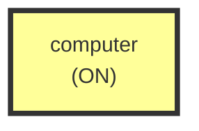
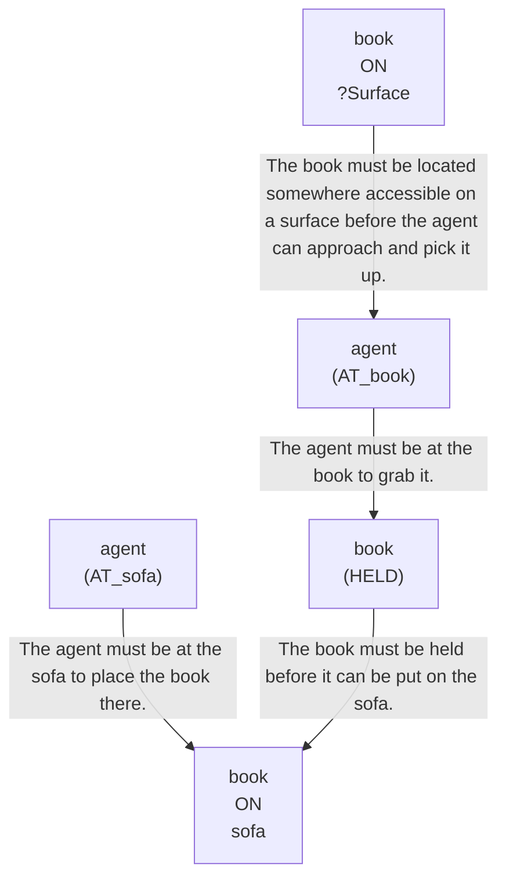
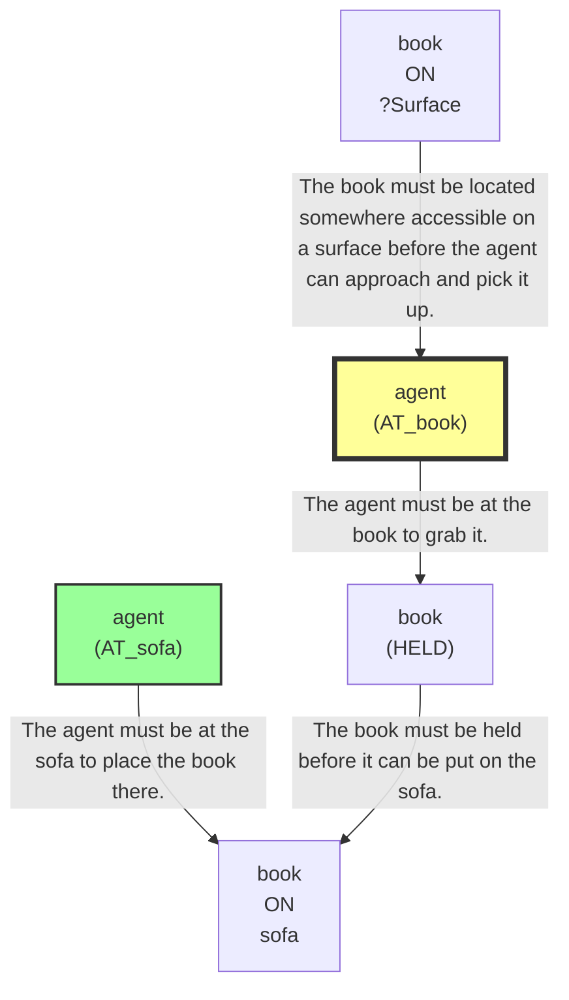
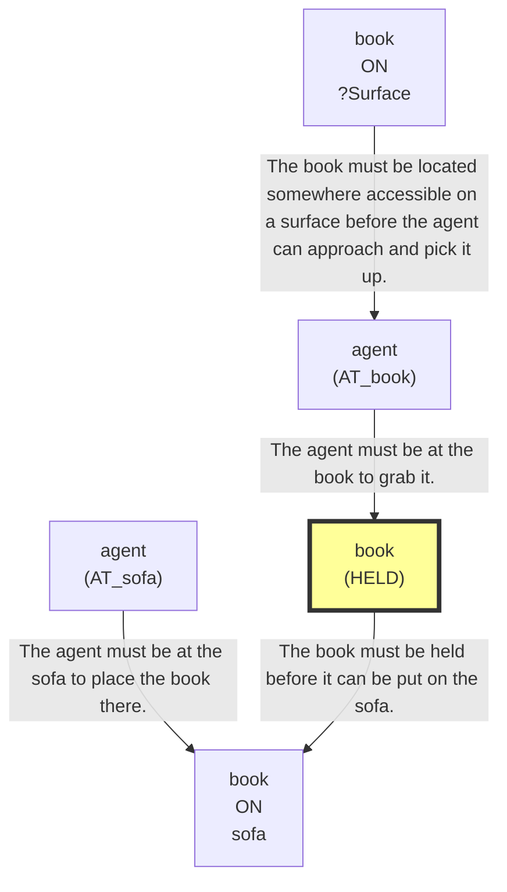
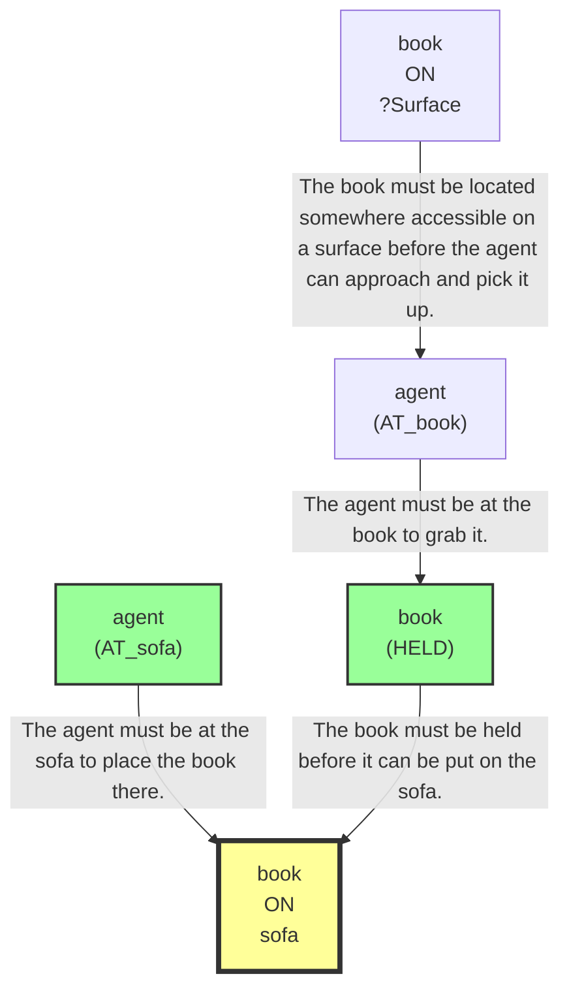
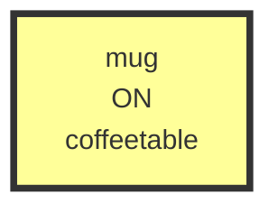
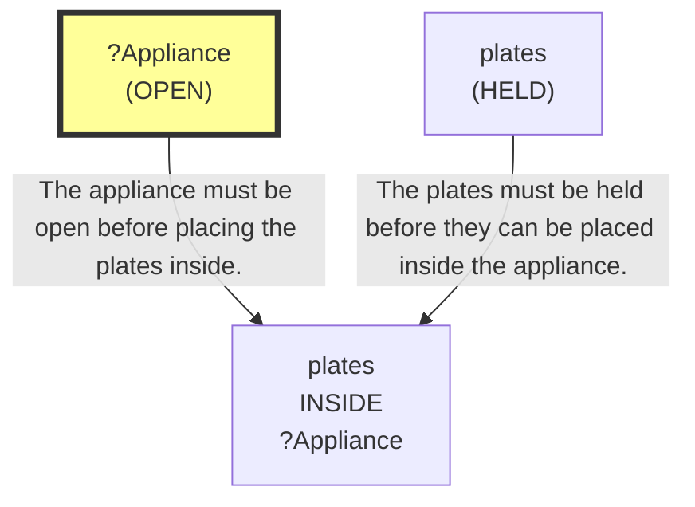
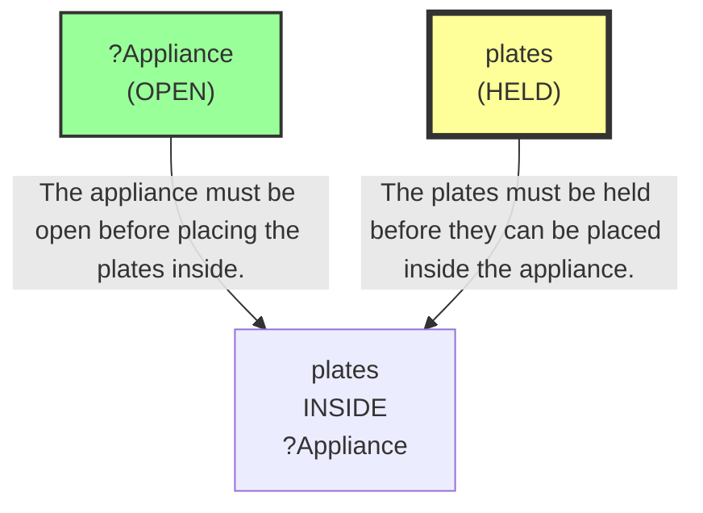
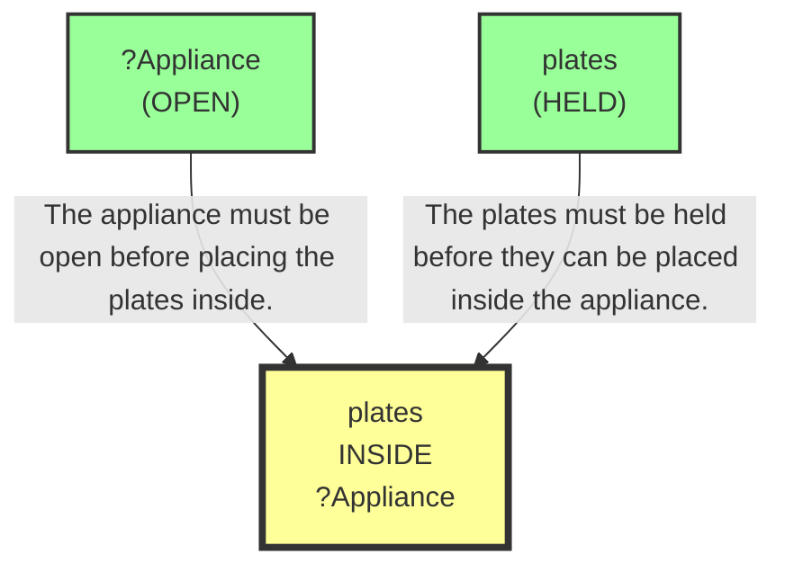

# 🚀 VirtualHome Agent Episode Log


### [GoalReasoner (Module A - Intent)] Output
```json
{
  "is_instruction_obviously_vague": false,
  "clarification_question": null,
  "target_object": "computer",
  "location_hint": null,
  "reasoning_chain": [
    {
      "question": "Why does the user want this object?",
      "answer": "To have the computer in an on state rather than staying off."
    },
    {
      "question": "Why is that important?",
      "answer": "Because an off computer cannot be used or interacted with."
    },
    {
      "question": "What fundamental need does this fulfill?",
      "answer": "It fulfills the need to make the device operational and available for use."
    },
    {
      "question": "Are there any deeper psychological or physical motivations?",
      "answer": "The user likely wants access to computing functions, such as work, communication, or entertainment."
    }
  ],
  "deep_intent": "The user wants a device to be powered on and usable.",
  "acceptable_alternatives_properties": [
    {
      "priority": 1,
      "description": "Any other powered-on computing device that can provide similar functionality, such as a laptop or tablet."
    },
    {
      "priority": 2,
      "description": "A different computer system that is already on and operational, such as a desktop or all-in-one PC."
    },
    {
      "priority": 3,
      "description": "Any electronic device that can substitute for basic computing tasks, such as a smartphone or smart display."
    },
    {
      "priority": 4,
      "description": "Another usable digital device for communication or information access, such as a game console with media or browsing capability."
    }
  ]
}
```

### [PerceptionFilter] Output
```json
{
  "reasoning": "The goal is to have a computer in the ON state, so the target object class computer must be kept. No separate tool or location is required by the SDG, and alternative computing devices are not needed because the task is specifically to power on the computer rather than replace it.",
  "selected_classes": [
    "character",
    "computer",
    "desk"
  ],
  "raw_class_count": 33
}
```

### [LLMExecutor] Output
```json
{
  "reasoning": "The active goal is to make the computer ON. The computer is visible in the bedroom and has the HAS_SWITCH property, so the next needed step is to get near it before switching it on. No other prerequisites are shown.",
  "satisfied_nodes": [],
  "current_node_focus": "N1",
  "mapped_variables": {},
  "action": "[walk] <computer> (174)"
}
```

### [RoboStateMultiTaskController] Output
```json
{
  "action": "[walk] <computer> (174)",
  "active_task_id": "task_1",
  "task_context": {
    "active_task_id": "task_1",
    "pending_task_ids": [
      "task_2",
      "task_3",
      "task_4",
      "task_5",
      "task_6",
      "task_7"
    ],
    "satisfied_task_ids": []
  },
  "source": "llm_executor"
}
```
## Step 0
- **Action**: `[walk] <computer> (174)`
- **Action Success**: `True`
- **Action Message**: {'0': {'message': 'Success'}}
- **Active Task**: `task_1`
- **Decision Source**: `llm_executor`
- **Task Progress**: E1_11=pending, E1_03=pending, E1_07=pending, E1_05=pending, E1_06=pending, E1_08=pending, E1_17=pending
- **SDG Status**:

- **Observed Items (7)**: desk(108) [CLOSED], computer(174) [OFF], character(1), bathroom(11), bedroom(73), kitchen(205), livingroom(335)


### [PerceptionFilter] Output
```json
{
  "reasoning": "Reused cached class selection.",
  "selected_classes": [
    "character",
    "computer",
    "desk"
  ],
  "raw_class_count": 33
}
```

### [LLMExecutor] Output
```json
{
  "reasoning": "The target computer(174) is already close to the character and currently OFF, which directly conflicts with the single SDG node N1 requiring it to be ON. Since the computer has a switch and no plug requirement is indicated, the next step is to turn it on.",
  "satisfied_nodes": [],
  "current_node_focus": "N1",
  "mapped_variables": {
    "?Computer": "computer(174)"
  },
  "action": "[switchon] <computer> (174)"
}
```

### [RoboStateMultiTaskController] Output
```json
{
  "action": "[switchon] <computer> (174)",
  "active_task_id": "task_1",
  "task_context": {
    "active_task_id": "task_1",
    "pending_task_ids": [
      "task_2",
      "task_3",
      "task_4",
      "task_5",
      "task_6",
      "task_7"
    ],
    "satisfied_task_ids": []
  },
  "source": "llm_executor"
}
```
## Step 1
- **Action**: `[switchon] <computer> (174)`
- **Action Success**: `True`
- **Action Message**: Faked switch operation in Python layer (bypassed Unity failure)
- **Active Task**: `task_1`
- **Decision Source**: `llm_executor`
- **Task Progress**: E1_11=done, E1_03=pending, E1_07=pending, E1_05=pending, E1_06=pending, E1_08=pending, E1_17=pending
- **SDG Status**:

- **Observed Items (7)**: desk(108) [CLOSED], computer(174) [OFF], character(1), bathroom(11), bedroom(73), kitchen(205), livingroom(335)


### [GoalReasoner (Module A - Intent)] Output
```json
{
  "is_instruction_obviously_vague": false,
  "clarification_question": null,
  "target_object": "book",
  "location_hint": "sofa",
  "reasoning_chain": [
    {
      "question": "Why does the user want this object?",
      "answer": "To move a book that is not organized to the sofa."
    },
    {
      "question": "Why is that important?",
      "answer": "To place the book in the intended resting or reading area rather than leaving it out of place."
    },
    {
      "question": "What fundamental need does this fulfill?",
      "answer": "It fulfills the need to organize or relocate a household item to a preferred location."
    },
    {
      "question": "Are there any deeper psychological or physical motivations?",
      "answer": "It may reduce clutter, improve order in the room, or make the book available where the user expects it."
    }
  ],
  "deep_intent": "The user wants to organize and relocate a household item to a preferred seating area.",
  "acceptable_alternatives_properties": [
    {
      "priority": 1,
      "description": "Other loose reading materials or similar handheld items that are out of place, such as magazines or notebooks, moved to the sofa"
    },
    {
      "priority": 2,
      "description": "Other paper-based items that belong in a living area, such as documents or folders, placed in the same seating area"
    },
    {
      "priority": 3,
      "description": "Small household items that are cluttering the space and can be tidied to a nearby resting spot"
    },
    {
      "priority": 4,
      "description": "Any movable item contributing to visible clutter, relocated to a nearby indoor surface to improve organization"
    }
  ]
}
```

### [RoboStateMultiTaskController] Output
```json
{
  "action": "[walk] <bathroom> (11)",
  "active_task_id": "task_2",
  "task_context": {
    "active_task_id": "task_2",
    "pending_task_ids": [
      "task_3",
      "task_4",
      "task_5",
      "task_6",
      "task_7"
    ],
    "satisfied_task_ids": [
      "task_1"
    ]
  },
  "source": "room_frontier"
}
```
## Step 2
- **Action**: `[walk] <bathroom> (11)`
- **Action Success**: `True`
- **Action Message**: {'0': {'message': 'Success'}}
- **Active Task**: `task_2`
- **Decision Source**: `room_frontier`
- **Task Progress**: E1_11=done, E1_03=pending, E1_07=pending, E1_05=pending, E1_06=pending, E1_08=pending, E1_17=pending
- **SDG Status**:

- **Observed Items (74)**: floor(74), floor(75), floor(76), floor(77), floor(78), floor(79), floor(80), floor(81), floor(82), wall(83), wall(84), wall(85), wall(86), wall(87), wall(88)...


### [RoboStateMultiTaskController] Output
```json
{
  "action": "[walk] <kitchen> (205)",
  "active_task_id": "task_2",
  "task_context": {
    "active_task_id": "task_2",
    "pending_task_ids": [
      "task_3",
      "task_4",
      "task_5",
      "task_6",
      "task_7"
    ],
    "satisfied_task_ids": [
      "task_1"
    ]
  },
  "source": "room_frontier"
}
```
## Step 3
- **Action**: `[walk] <kitchen> (205)`
- **Action Success**: `True`
- **Action Message**: {'0': {'message': 'Success'}}
- **Active Task**: `task_2`
- **Decision Source**: `room_frontier`
- **Task Progress**: E1_11=done, E1_03=pending, E1_07=pending, E1_05=pending, E1_06=pending, E1_08=pending, E1_17=pending
- **SDG Status**:

- **Observed Items (135)**: floor(74), floor(75), floor(76), floor(77), floor(78), floor(79), floor(80), floor(81), floor(82), wall(83), wall(84), wall(85), wall(86), wall(87), wall(88)...


### [RoboStateMultiTaskController] Output
```json
{
  "action": "[walk] <livingroom> (335)",
  "active_task_id": "task_2",
  "task_context": {
    "active_task_id": "task_2",
    "pending_task_ids": [
      "task_3",
      "task_4",
      "task_5",
      "task_6",
      "task_7"
    ],
    "satisfied_task_ids": [
      "task_1"
    ]
  },
  "source": "room_frontier"
}
```
## Step 4
- **Action**: `[walk] <livingroom> (335)`
- **Action Success**: `True`
- **Action Message**: {'0': {'message': 'Success'}}
- **Active Task**: `task_2`
- **Decision Source**: `room_frontier`
- **Task Progress**: E1_11=done, E1_03=pending, E1_07=pending, E1_05=pending, E1_06=pending, E1_08=pending, E1_17=pending
- **SDG Status**:

- **Observed Items (244)**: floor(74), floor(75), floor(76), floor(77), floor(78), floor(79), floor(80), floor(81), floor(82), wall(83), wall(84), wall(85), wall(86), wall(87), wall(88)...


### [PerceptionFilter] Output
```json
{
  "reasoning": "The goal is to move the target object book onto the sofa. The SDG requires the book itself and the destination location sofa, plus the book’s current supporting surface to locate and pick it up. No extra tools or alternative receptacles are needed.",
  "selected_classes": [
    "paper",
    "character",
    "door",
    "folder",
    "book",
    "sofa"
  ],
  "raw_class_count": 101
}
```

### [LLMExecutor] Output
```json
{
  "reasoning": "The active task is to move a book onto the sofa. We are currently in the living room and already close to sofa(368). There are two candidate books: book(190) is in the bedroom and book(268) is in the kitchen, but book(268) is already close to the agent, making it the best accessible target to satisfy the same task. It is not held yet, so the next step must be to walk to that book before grabbing it, following the required walk-then-grab sequence.",
  "satisfied_nodes": [
    "N5"
  ],
  "current_node_focus": "N4",
  "mapped_variables": {
    "?Surface": "sofa(368)"
  },
  "action": "[walk] <book> (268)"
}
```

### [RoboStateMultiTaskController] Output
```json
{
  "action": "[walk] <book> (268)",
  "active_task_id": "task_2",
  "task_context": {
    "active_task_id": "task_2",
    "pending_task_ids": [
      "task_3",
      "task_4",
      "task_5",
      "task_6",
      "task_7"
    ],
    "satisfied_task_ids": [
      "task_1"
    ]
  },
  "source": "llm_executor"
}
```
## Step 5
- **Action**: `[walk] <book> (268)`
- **Action Success**: `True`
- **Action Message**: {'0': {'message': 'Success'}}
- **Active Task**: `task_2`
- **Decision Source**: `llm_executor`
- **Task Progress**: E1_11=done, E1_03=pending, E1_07=pending, E1_05=pending, E1_06=pending, E1_08=pending, E1_17=pending
- **SDG Status**:

- **Observed Items (12)**: book(190) [CLOSED], character(1), bathroom(11), bedroom(73), kitchen(205), livingroom(335), door(51) [OPEN], door(224) [OPEN], book(268) [CLOSED], sofa(368), paper(451), folder(453) [CLOSED]


### [PerceptionFilter] Output
```json
{
  "reasoning": "Reused cached class selection.",
  "selected_classes": [
    "paper",
    "character",
    "door",
    "folder",
    "book",
    "sofa"
  ],
  "raw_class_count": 101
}
```

### [LLMExecutor] Output
```json
{
  "reasoning": "The active task is to place a book on the sofa. The current graph shows book(268) is the relevant book instance: it is in the livingroom, close to the character, and grabbable. The sofa(368) is also in the livingroom and is the target surface. Since the previous step was already walking to book(268), the next required action is to grab it before moving it to the sofa.",
  "satisfied_nodes": [],
  "current_node_focus": "N3",
  "mapped_variables": {},
  "action": "[grab] <book> (268)"
}
```

### [RoboStateMultiTaskController] Output
```json
{
  "action": "[grab] <book> (268)",
  "active_task_id": "task_2",
  "task_context": {
    "active_task_id": "task_2",
    "pending_task_ids": [
      "task_3",
      "task_4",
      "task_5",
      "task_6",
      "task_7"
    ],
    "satisfied_task_ids": [
      "task_1"
    ]
  },
  "source": "llm_executor"
}
```
## Step 6
- **Action**: `[grab] <book> (268)`
- **Action Success**: `True`
- **Action Message**: {'0': {'message': 'Success'}}
- **Active Task**: `task_2`
- **Decision Source**: `llm_executor`
- **Task Progress**: E1_11=done, E1_03=pending, E1_07=pending, E1_05=pending, E1_06=pending, E1_08=pending, E1_17=pending
- **SDG Status**:

- **Observed Items (12)**: book(190) [CLOSED], character(1), bathroom(11), bedroom(73), kitchen(205), livingroom(335), door(51) [OPEN], door(224) [OPEN], book(268) [CLOSED], sofa(368), paper(451), folder(453) [CLOSED]


### [PerceptionFilter] Output
```json
{
  "reasoning": "Reused cached class selection.",
  "selected_classes": [
    "paper",
    "character",
    "door",
    "folder",
    "book",
    "sofa"
  ],
  "raw_class_count": 101
}
```

### [LLMExecutor] Output
```json
{
  "reasoning": "The active task is to place the book on the sofa. The current graph shows I am holding book(268) and I am already close to sofa(368) in the livingroom, so the next required step is to place the held book onto the sofa. N3 (book held) is satisfied, and N5 (agent at sofa) is effectively satisfied by the CLOSE relation to sofa(368). The remaining goal node is to satisfy book ON sofa.",
  "satisfied_nodes": [
    "N3",
    "N5"
  ],
  "current_node_focus": "N2",
  "mapped_variables": {
    "?Surface": "sofa(368)"
  },
  "action": "[putback] <book> (268) <sofa> (368)"
}
```

### [RoboStateMultiTaskController] Output
```json
{
  "action": "[putback] <book> (268) <sofa> (368)",
  "active_task_id": "task_2",
  "task_context": {
    "active_task_id": "task_2",
    "pending_task_ids": [
      "task_3",
      "task_4",
      "task_5",
      "task_6",
      "task_7"
    ],
    "satisfied_task_ids": [
      "task_1"
    ]
  },
  "source": "llm_executor"
}
```
## Step 7
- **Action**: `[putback] <book> (268) <sofa> (368)`
- **Action Success**: `True`
- **Action Message**: {'0': {'message': 'Success'}}
- **Active Task**: `task_2`
- **Decision Source**: `llm_executor`
- **Task Progress**: E1_11=done, E1_03=done, E1_07=pending, E1_05=pending, E1_06=pending, E1_08=pending, E1_17=pending
- **SDG Status**:

- **Observed Items (12)**: book(190) [CLOSED], character(1), bathroom(11), bedroom(73), kitchen(205), livingroom(335), door(51) [OPEN], door(224) [OPEN], book(268) [CLOSED], sofa(368), paper(451), folder(453) [CLOSED]


### [GoalReasoner (Module A - Intent)] Output
```json
{
  "is_instruction_obviously_vague": false,
  "clarification_question": null,
  "target_object": "mug",
  "location_hint": "coffeetable",
  "reasoning_chain": [
    {
      "question": "Why does the user want this object?",
      "answer": "To keep the mug in a consistent place."
    },
    {
      "question": "Why is that important?",
      "answer": "So the mug remains on the coffee table rather than being moved elsewhere."
    },
    {
      "question": "What fundamental need does this fulfill?",
      "answer": "It fulfills the need for a specific household item to be kept in a preferred location."
    },
    {
      "question": "Are there any deeper psychological or physical motivations?",
      "answer": "The user may want order, easy access, or to prevent the mug from being misplaced."
    }
  ],
  "deep_intent": "The user wants a household item kept in a specific location for order and easy access.",
  "acceptable_alternatives_properties": [
    {
      "priority": 1,
      "description": "Other drink containers or cups that can serve the same everyday use and be kept on the coffee table"
    },
    {
      "priority": 2,
      "description": "Similar tabletop drinkware such as glasses, tumblers, or teacups"
    },
    {
      "priority": 3,
      "description": "Other small household items that are meant to be kept readily accessible on a table"
    },
    {
      "priority": 4,
      "description": "Any comparable personal item that the user wants stored in a fixed, visible spot indoors"
    }
  ]
}
```

### [PerceptionFilter] Output
```json
{
  "reasoning": "The goal is to keep the mug on the coffeetable, so only the target object and its required location are needed. No tool or alternative receptacle is required for this static placement task.",
  "selected_classes": [
    "character",
    "door",
    "mug",
    "coffeetable"
  ],
  "raw_class_count": 101
}
```

### [LLMExecutor] Output
```json
{
  "reasoning": "The active goal is to have a mug on the coffeetable. The character is already close to coffeetable(371), and there is a mug(447) currently in the living room, which is the best candidate because it is already near the character and not in another room. To satisfy the SDG, the next step is to grab that mug before placing it on the coffee table.",
  "satisfied_nodes": [],
  "current_node_focus": "N1",
  "mapped_variables": {},
  "action": "[grab] <mug> (447)"
}
```

### [RoboStateMultiTaskController] Output
```json
{
  "action": "[walk] <mug> (447)",
  "active_task_id": "task_3",
  "task_context": {
    "active_task_id": "task_3",
    "pending_task_ids": [
      "task_4",
      "task_5",
      "task_6",
      "task_7"
    ],
    "satisfied_task_ids": [
      "task_1",
      "task_2"
    ]
  },
  "source": "llm_executor_repaired"
}
```
## Step 8
- **Action**: `[walk] <mug> (447)`
- **Action Success**: `True`
- **Action Message**: {'0': {'message': 'Success'}}
- **Active Task**: `task_3`
- **Decision Source**: `llm_executor_repaired`
- **Task Progress**: E1_11=done, E1_03=done, E1_07=pending, E1_05=pending, E1_06=pending, E1_08=pending, E1_17=pending
- **SDG Status**:

- **Observed Items (11)**: coffeetable(111), character(1), bathroom(11), bedroom(73), kitchen(205), livingroom(335), door(51) [OPEN], door(224) [OPEN], mug(194), coffeetable(371), mug(447)


### [PerceptionFilter] Output
```json
{
  "reasoning": "Reused cached class selection.",
  "selected_classes": [
    "character",
    "door",
    "mug",
    "coffeetable"
  ],
  "raw_class_count": 101
}
```

### [LLMExecutor] Output
```json
{
  "reasoning": "The active goal is to ensure a mug is on the coffeetable. We are already close to mug(447), and the filtered graph shows coffeetable(371) in the livingroom. Since putback requires being near the destination and we are not currently shown near the coffeetable, the correct next step is to walk to the coffeetable before placing the mug there. Mug(447) is the best bind for the target mug because it is already nearby and visible in the livingroom.",
  "satisfied_nodes": [],
  "current_node_focus": "N1",
  "mapped_variables": {
    "?TargetMug": "mug(447)",
    "?Table": "coffeetable(371)"
  },
  "action": "[walk] <coffeetable> (371)"
}
```

### [RoboStateMultiTaskController] Output
```json
{
  "action": "[walk] <coffeetable> (371)",
  "active_task_id": "task_3",
  "task_context": {
    "active_task_id": "task_3",
    "pending_task_ids": [
      "task_4",
      "task_5",
      "task_6",
      "task_7"
    ],
    "satisfied_task_ids": [
      "task_1",
      "task_2"
    ]
  },
  "source": "llm_executor"
}
```
## Step 9
- **Action**: `[walk] <coffeetable> (371)`
- **Action Success**: `True`
- **Action Message**: {'0': {'message': 'Success'}}
- **Active Task**: `task_3`
- **Decision Source**: `llm_executor`
- **Task Progress**: E1_11=done, E1_03=done, E1_07=pending, E1_05=pending, E1_06=pending, E1_08=pending, E1_17=pending
- **SDG Status**:

- **Observed Items (11)**: coffeetable(111), character(1), bathroom(11), bedroom(73), kitchen(205), livingroom(335), door(51) [OPEN], door(224) [OPEN], mug(194), coffeetable(371), mug(447)


### [PerceptionFilter] Output
```json
{
  "reasoning": "Reused cached class selection.",
  "selected_classes": [
    "character",
    "door",
    "mug",
    "coffeetable"
  ],
  "raw_class_count": 101
}
```

### [LLMExecutor] Output
```json
{
  "reasoning": "The active task is to ensure a mug is on the coffee table. We are already close to coffeetable(371), and mug(447) is the relevant mug visible in the living room. Since the goal is a placement relation on a surface, the next step must be to pick up the mug before placing it on the coffee table. The mug is grabbable and not dirty, and the coffee table is the correct surface target.",
  "satisfied_nodes": [],
  "current_node_focus": "N1",
  "mapped_variables": {
    "?Mug": "mug(447)",
    "?TargetSurface": "coffeetable(371)"
  },
  "action": "[grab] <mug> (447)"
}
```

### [RoboStateMultiTaskController] Output
```json
{
  "action": "[walk] <mug> (447)",
  "active_task_id": "task_3",
  "task_context": {
    "active_task_id": "task_3",
    "pending_task_ids": [
      "task_4",
      "task_5",
      "task_6",
      "task_7"
    ],
    "satisfied_task_ids": [
      "task_1",
      "task_2"
    ]
  },
  "source": "llm_executor_repaired"
}
```
## Step 10
- **Action**: `[walk] <mug> (447)`
- **Action Success**: `True`
- **Action Message**: {'0': {'message': 'Success'}}
- **Active Task**: `task_3`
- **Decision Source**: `llm_executor_repaired`
- **Task Progress**: E1_11=done, E1_03=done, E1_07=pending, E1_05=pending, E1_06=pending, E1_08=pending, E1_17=pending
- **SDG Status**:

- **Observed Items (11)**: coffeetable(111), character(1), bathroom(11), bedroom(73), kitchen(205), livingroom(335), door(51) [OPEN], door(224) [OPEN], mug(194), coffeetable(371), mug(447)


### [PerceptionFilter] Output
```json
{
  "reasoning": "Reused cached class selection.",
  "selected_classes": [
    "character",
    "door",
    "mug",
    "coffeetable"
  ],
  "raw_class_count": 101
}
```

### [LLMExecutor] Output
```json
{
  "reasoning": "The active goal is to place a mug on the coffee table. We are already close to mug(447), and coffee table(371) is the correct target surface in the living room. Since putback requires being explicitly walked to the destination first, the next action should move to the coffee table so the mug can be placed there on the following step.",
  "satisfied_nodes": [],
  "current_node_focus": "N1",
  "mapped_variables": {},
  "action": "[walk] <coffeetable> (371)"
}
```

### [RoboStateMultiTaskController] Output
```json
{
  "action": "[walk] <coffeetable> (371)",
  "active_task_id": "task_3",
  "task_context": {
    "active_task_id": "task_3",
    "pending_task_ids": [
      "task_4",
      "task_5",
      "task_6",
      "task_7"
    ],
    "satisfied_task_ids": [
      "task_1",
      "task_2"
    ]
  },
  "source": "llm_executor"
}
```
## Step 11
- **Action**: `[walk] <coffeetable> (371)`
- **Action Success**: `True`
- **Action Message**: {'0': {'message': 'Success'}}
- **Active Task**: `task_3`
- **Decision Source**: `llm_executor`
- **Task Progress**: E1_11=done, E1_03=done, E1_07=pending, E1_05=pending, E1_06=pending, E1_08=pending, E1_17=pending
- **SDG Status**:

- **Observed Items (11)**: coffeetable(111), character(1), bathroom(11), bedroom(73), kitchen(205), livingroom(335), door(51) [OPEN], door(224) [OPEN], mug(194), coffeetable(371), mug(447)


### [PerceptionFilter] Output
```json
{
  "reasoning": "Reused cached class selection.",
  "selected_classes": [
    "character",
    "door",
    "mug",
    "coffeetable"
  ],
  "raw_class_count": 101
}
```

### [LLMExecutor] Output
```json
{
  "reasoning": "The active goal is to have a mug on the coffeetable. The currently relevant mug is mug(447), which is already in the livingroom and the character is CLOSE to coffeetable(371). However, the filtered graph does not show the character CLOSE to mug(447), so I should first move to the mug before attempting to grab it. After that, I can carry it back to the coffeetable and place it there.",
  "satisfied_nodes": [],
  "current_node_focus": "N1",
  "mapped_variables": {},
  "action": "[walk] <mug> (447)"
}
```

### [GoalReasoner (Module A - Intent)] Output
```json
{
  "is_instruction_obviously_vague": false,
  "clarification_question": null,
  "target_object": "plates",
  "location_hint": "microwave",
  "reasoning_chain": [
    {
      "question": "Why does the user want this object?",
      "answer": "The plates are needed to be placed where they can be washed or processed as indicated by the instruction."
    },
    {
      "question": "Why is that important?",
      "answer": "Because the user is trying to complete the dish-cleaning task."
    },
    {
      "question": "What fundamental need does this fulfill?",
      "answer": "It fulfills the need to clean dirty dishware."
    },
    {
      "question": "Are there any deeper psychological or physical motivations?",
      "answer": "The likely motivations are maintaining hygiene, restoring usable kitchen items, and reducing clutter from dirty dishes."
    }
  ],
  "deep_intent": "The user wants to clean dishware.",
  "acceptable_alternatives_properties": [
    {
      "priority": 1,
      "description": "Other dirty dishware items that need cleaning, such as bowls, cups, or utensils"
    },
    {
      "priority": 2,
      "description": "Other kitchen items that can be washed similarly, such as serving dishes or food containers"
    },
    {
      "priority": 3,
      "description": "Any dirty household items that require washing or sanitizing"
    },
    {
      "priority": 4,
      "description": "If dishware washing is not possible, other clean-up actions that restore kitchen hygiene, such as gathering dirty items for later washing"
    }
  ]
}
```

### [PerceptionFilter] Output
```json
{
  "reasoning": "The goal is to clean dishware, and the SDG requires the target plates to be held and placed inside an open appliance. The only necessary items are the target plates plus the plausible appliance options for that function and the implied washing tools/locations needed to support dish cleaning. I retained the exact target class and the relevant washing hardware and backups.",
  "selected_classes": [
    "washingsponge",
    "waterglass",
    "character",
    "mug",
    "microwave",
    "plates",
    "sink",
    "plate",
    "dishbowl",
    "dishwashingliquid",
    "wineglass"
  ],
  "raw_class_count": 101
}
```

### [LLMExecutor] Output
```json
{
  "reasoning": "The SDG requires the plates to be inside the microwave, and the microwave must be open first. The current graph shows microwave(313) is closed and the plates are available in the kitchen, with plate(278) currently close to the character and thus a good candidate to bind to the required plates object. Since I cannot open the microwave from afar and must be near it first, the next step is to walk to the microwave before opening it.",
  "satisfied_nodes": [],
  "current_node_focus": "N2",
  "mapped_variables": {
    "?Appliance": "microwave(313)"
  },
  "action": "[walk] <microwave> (313)"
}
```

### [RoboStateMultiTaskController] Output
```json
{
  "action": "[walk] <microwave> (313)",
  "active_task_id": "task_6",
  "task_context": {
    "active_task_id": "task_6",
    "pending_task_ids": [
      "task_3",
      "task_4",
      "task_5",
      "task_7"
    ],
    "satisfied_task_ids": [
      "task_1",
      "task_2"
    ]
  },
  "source": "llm_executor"
}
```
## Step 12
- **Action**: `[walk] <microwave> (313)`
- **Action Success**: `True`
- **Action Message**: {'0': {'message': 'Success'}}
- **Active Task**: `task_6`
- **Decision Source**: `llm_executor`
- **Task Progress**: E1_11=done, E1_03=done, E1_07=pending, E1_05=pending, E1_06=pending, E1_08=pending, E1_17=pending
- **SDG Status**:

- **Observed Items (30)**: plate(193), wineglass(197), wineglass(198), plate(199), character(1), bathroom(11), bedroom(73), kitchen(205), livingroom(335), plate(61), waterglass(64), sink(247), washingsponge(266), dishwashingliquid(267), waterglass(270)...


### [PerceptionFilter] Output
```json
{
  "reasoning": "Reused cached class selection.",
  "selected_classes": [
    "washingsponge",
    "waterglass",
    "character",
    "mug",
    "microwave",
    "plates",
    "sink",
    "plate",
    "dishbowl",
    "dishwashingliquid",
    "wineglass"
  ],
  "raw_class_count": 101
}
```

### [LLMExecutor] Output
```json
{
  "reasoning": "The SDG requires the plates to be inside the microwave, and the microwave must be open first. The current graph shows microwave(313) is CLOSED and CLOSE to the character, so no walking is needed. The plates are not yet held, and the best matching plate candidate in the same room is plate(273) in the kitchen. Since the next atomic prerequisite toward placing plates inside the microwave is opening the target appliance, I will open the microwave first.",
  "satisfied_nodes": [],
  "current_node_focus": "N2",
  "mapped_variables": {
    "?Appliance": "microwave(313)"
  },
  "action": "[open] <microwave> (313)"
}
```

### [RoboStateMultiTaskController] Output
```json
{
  "action": "[open] <microwave> (313)",
  "active_task_id": "task_6",
  "task_context": {
    "active_task_id": "task_6",
    "pending_task_ids": [
      "task_3",
      "task_4",
      "task_5",
      "task_7"
    ],
    "satisfied_task_ids": [
      "task_1",
      "task_2"
    ]
  },
  "source": "llm_executor"
}
```
## Step 13
- **Action**: `[open] <microwave> (313)`
- **Action Success**: `True`
- **Action Message**: {'0': {'message': 'Success'}}
- **Active Task**: `task_6`
- **Decision Source**: `llm_executor`
- **Task Progress**: E1_11=done, E1_03=done, E1_07=pending, E1_05=done, E1_06=pending, E1_08=pending, E1_17=pending
- **SDG Status**:

- **Observed Items (30)**: plate(193), wineglass(197), wineglass(198), plate(199), character(1), bathroom(11), bedroom(73), kitchen(205), livingroom(335), plate(61), waterglass(64), sink(247), washingsponge(266), dishwashingliquid(267), waterglass(270)...


### [PerceptionFilter] Output
```json
{
  "reasoning": "Reused cached class selection.",
  "selected_classes": [
    "washingsponge",
    "waterglass",
    "character",
    "mug",
    "microwave",
    "plates",
    "sink",
    "plate",
    "dishbowl",
    "dishwashingliquid",
    "wineglass"
  ],
  "raw_class_count": 101
}
```

### [LLMExecutor] Output
```json
{
  "reasoning": "The SDG requires the plates to be inside the microwave, with the microwave open first, and the plates held before placement. The microwave is already OPEN and the robot is CLOSE to it. The best matching target plate in the current graph is plate(193), which is also CLOSE to the character and in the bedroom. Since the next prerequisite toward putting it in the microwave is to hold it, the single next atomic action is to grab that plate.",
  "satisfied_nodes": [
    "N2"
  ],
  "current_node_focus": "N3",
  "mapped_variables": {
    "?Appliance": "microwave(313)"
  },
  "action": "[grab] <plate> (193)"
}
```

### [RoboStateMultiTaskController] Output
```json
{
  "action": "[grab] <plate> (193)",
  "active_task_id": "task_6",
  "task_context": {
    "active_task_id": "task_6",
    "pending_task_ids": [
      "task_3",
      "task_5",
      "task_7"
    ],
    "satisfied_task_ids": [
      "task_1",
      "task_2",
      "task_4"
    ]
  },
  "source": "llm_executor"
}
```
## Step 14
- **Action**: `[grab] <plate> (193)`
- **Action Success**: `True`
- **Action Message**: {'0': {'message': 'Success'}}
- **Active Task**: `task_6`
- **Decision Source**: `llm_executor`
- **Task Progress**: E1_11=done, E1_03=done, E1_07=pending, E1_05=done, E1_06=pending, E1_08=pending, E1_17=pending
- **SDG Status**:

- **Observed Items (30)**: plate(193), wineglass(197), wineglass(198), plate(199), character(1), bathroom(11), bedroom(73), kitchen(205), livingroom(335), plate(61), waterglass(64), sink(247), washingsponge(266), dishwashingliquid(267), waterglass(270)...


### [PerceptionFilter] Output
```json
{
  "reasoning": "Reused cached class selection.",
  "selected_classes": [
    "washingsponge",
    "waterglass",
    "character",
    "mug",
    "microwave",
    "plates",
    "sink",
    "plate",
    "dishbowl",
    "dishwashingliquid",
    "wineglass"
  ],
  "raw_class_count": 101
}
```

### [LLMExecutor] Output
```json
{
  "reasoning": "The active task is to place the held plate inside the microwave. The microwave is already OPEN and the plate(193) is already held in the right hand, so the only remaining prerequisite for putting it inside is to be near the microwave. The previous move to the microwave was already successful and the microwave is still CLOSE to the character, so the next atomic action should be to place the held plate into the microwave. This will satisfy N1, and N2 and N3 are already satisfied.",
  "satisfied_nodes": [
    "N2",
    "N3"
  ],
  "current_node_focus": "N1",
  "mapped_variables": {
    "?Appliance": "microwave(313)"
  },
  "action": "[putin] <plate> (193) <microwave> (313)"
}
```

### [RoboStateMultiTaskController] Output
```json
{
  "action": "[putin] <plate> (193) <microwave> (313)",
  "active_task_id": "task_6",
  "task_context": {
    "active_task_id": "task_6",
    "pending_task_ids": [
      "task_3",
      "task_5",
      "task_7"
    ],
    "satisfied_task_ids": [
      "task_1",
      "task_2",
      "task_4"
    ]
  },
  "source": "llm_executor"
}
```
## Step 15
- **Action**: `[putin] <plate> (193) <microwave> (313)`
- **Action Success**: `False`
- **Action Message**: {'0': {'message': 'ScriptExcutor 0: EXECUTION_GENERAL: Script is impossible to execute\n\n'}}
- **Active Task**: `task_6`
- **Decision Source**: `llm_executor`
- **Task Progress**: E1_11=done, E1_03=done, E1_07=pending, E1_05=done, E1_06=pending, E1_08=pending, E1_17=pending
- **SDG Status**:

- **Observed Items (30)**: plate(193), wineglass(197), wineglass(198), plate(199), character(1), bathroom(11), bedroom(73), kitchen(205), livingroom(335), plate(61), waterglass(64), sink(247), washingsponge(266), dishwashingliquid(267), waterglass(270)...


### [PerceptionFilter] Output
```json
{
  "reasoning": "Reused cached class selection.",
  "selected_classes": [
    "washingsponge",
    "waterglass",
    "character",
    "mug",
    "microwave",
    "plates",
    "sink",
    "plate",
    "dishbowl",
    "dishwashingliquid",
    "wineglass"
  ],
  "raw_class_count": 101
}
```

### [LLMExecutor] Output
```json
{
  "reasoning": "The previous [putin] into the microwave failed, which indicates the microwave is not a valid destination for this task. The SDG requires plates to be INSIDE an appliance that is OPEN, and the current filtered graph shows the microwave is open and I am already holding plate(193). However, to make progress safely after a failed execution, I should try the next plausible open appliance-like container in the kitchen that can accept plates. The sink is not suitable for putin, so the best remaining appliance destination is the open microwave only if the failure was due to a transient executor issue; but since the engine explicitly says the action was impossible, I should not repeat it blindly. There is no other open appliance in view, so the only autonomous recovery is to ask for clarification on the intended appliance destination, because the SDG variable ?Appliance is underspecified by the graph and the only apparent candidate produced an impossibility error.",
  "satisfied_nodes": [
    "N2",
    "N3"
  ],
  "current_node_focus": "N1",
  "mapped_variables": {
    "?Appliance": "microwave(313)"
  },
  "action": "[ask] The plate is in my hand and the microwave is open, but placing a plate inside the microwave failed as impossible. Please clarify which appliance should contain the plates."
}
```

### [RoboStateMultiTaskController] Output
```json
{
  "action": "[ask] The plate is in my hand and the microwave is open, but placing a plate inside the microwave failed as impossible. Please clarify which appliance should contain the plates.",
  "active_task_id": "task_6",
  "task_context": {
    "active_task_id": "task_6",
    "pending_task_ids": [
      "task_3",
      "task_5",
      "task_7"
    ],
    "satisfied_task_ids": [
      "task_1",
      "task_2",
      "task_4"
    ]
  },
  "source": "llm_executor"
}
```
## Step 16
- **Action**: `[ask] The plate is in my hand and the microwave is open, but placing a plate inside the microwave failed as impossible. Please clarify which appliance should contain the plates.`
- **Action Success**: `True`
- **Action Message**: nothing to claim
- **Active Task**: `task_6`
- **Decision Source**: `llm_executor`
- **Task Progress**: E1_11=done, E1_03=done, E1_07=pending, E1_05=done, E1_06=pending, E1_08=pending, E1_17=pending
- **SDG Status**:

- **Observed Items (30)**: plate(193), wineglass(197), wineglass(198), plate(199), character(1), bathroom(11), bedroom(73), kitchen(205), livingroom(335), plate(61), waterglass(64), sink(247), washingsponge(266), dishwashingliquid(267), waterglass(270)...


### [PerceptionFilter] Output
```json
{
  "reasoning": "Reused cached class selection.",
  "selected_classes": [
    "washingsponge",
    "waterglass",
    "character",
    "mug",
    "microwave",
    "plates",
    "sink",
    "plate",
    "dishbowl",
    "dishwashingliquid",
    "wineglass"
  ],
  "raw_class_count": 101
}
```

### [LLMExecutor] Output
```json
{
  "reasoning": "The active task is to place plates inside the microwave. The microwave is already OPEN and plate(193) is currently HELD_RH, so N2 and N3 are satisfied. The remaining unsatisfied node is N1: plates INSIDE ?Appliance. Since the plate is already in hand and the destination is the open microwave, the next required atomic action is to put it inside the microwave. The previous putin failed due to the system's temporary inconsistency, but the current graph still shows the correct preconditions, so I will retry the placement.",
  "satisfied_nodes": [
    "N2",
    "N3"
  ],
  "current_node_focus": "N1",
  "mapped_variables": {
    "?Appliance": "microwave(313)"
  },
  "action": "[putin] <plate> (193) <microwave> (313)"
}
```

### [RoboStateMultiTaskController] Output
```json
{
  "action": "[putin] <plate> (193) <microwave> (313)",
  "active_task_id": "task_6",
  "task_context": {
    "active_task_id": "task_6",
    "pending_task_ids": [
      "task_3",
      "task_5",
      "task_7"
    ],
    "satisfied_task_ids": [
      "task_1",
      "task_2",
      "task_4"
    ]
  },
  "source": "llm_executor"
}
```
## Step 17
- **Action**: `[putin] <plate> (193) <microwave> (313)`
- **Action Success**: `False`
- **Action Message**: {'0': {'message': 'ScriptExcutor 0: EXECUTION_GENERAL: Script is impossible to execute\n\n'}}
- **Active Task**: `task_6`
- **Decision Source**: `llm_executor`
- **Task Progress**: E1_11=done, E1_03=done, E1_07=pending, E1_05=done, E1_06=pending, E1_08=pending, E1_17=pending
- **SDG Status**:

- **Observed Items (30)**: plate(193), wineglass(197), wineglass(198), plate(199), character(1), bathroom(11), bedroom(73), kitchen(205), livingroom(335), plate(61), waterglass(64), sink(247), washingsponge(266), dishwashingliquid(267), waterglass(270)...


### [PerceptionFilter] Output
```json
{
  "reasoning": "Reused cached class selection.",
  "selected_classes": [
    "washingsponge",
    "waterglass",
    "character",
    "mug",
    "microwave",
    "plates",
    "sink",
    "plate",
    "dishbowl",
    "dishwashingliquid",
    "wineglass"
  ],
  "raw_class_count": 101
}
```

### [LLMExecutor] Output
```json
{
  "reasoning": "The active task is to get the plates into the microwave, but the prior [putin] attempts failed as physically impossible. The microwave is already OPEN and the plate(193) is currently held, so the remaining gap is likely that the microwave cannot accept a plate in this environment. Since [ask] is forbidden now, the best autonomous step is to use the same wash/placement objective on another valid dishware target available in the kitchen. I will continue by moving toward a kitchen plate that can be handled next, rather than repeating the failed microwave placement loop.",
  "satisfied_nodes": [
    "N2",
    "N3"
  ],
  "current_node_focus": "N1",
  "mapped_variables": {
    "?Appliance": "microwave(313)"
  },
  "action": "[walk] <plate> (273)"
}
```

### [RoboStateMultiTaskController] Output
```json
{
  "action": "[walk] <plate> (273)",
  "active_task_id": "task_6",
  "task_context": {
    "active_task_id": "task_6",
    "pending_task_ids": [
      "task_3",
      "task_5",
      "task_7"
    ],
    "satisfied_task_ids": [
      "task_1",
      "task_2",
      "task_4"
    ]
  },
  "source": "llm_executor"
}
```
## Step 18
- **Action**: `[walk] <plate> (273)`
- **Action Success**: `True`
- **Action Message**: {'0': {'message': 'Success'}}
- **Active Task**: `task_6`
- **Decision Source**: `llm_executor`
- **Task Progress**: E1_11=done, E1_03=done, E1_07=pending, E1_05=done, E1_06=pending, E1_08=pending, E1_17=pending
- **SDG Status**:

- **Observed Items (30)**: plate(193), wineglass(197), wineglass(198), plate(199), character(1), bathroom(11), bedroom(73), kitchen(205), livingroom(335), plate(61), waterglass(64), sink(247), washingsponge(266), dishwashingliquid(267), waterglass(270)...


### [PerceptionFilter] Output
```json
{
  "reasoning": "Reused cached class selection.",
  "selected_classes": [
    "washingsponge",
    "waterglass",
    "character",
    "mug",
    "microwave",
    "plates",
    "sink",
    "plate",
    "dishbowl",
    "dishwashingliquid",
    "wineglass"
  ],
  "raw_class_count": 101
}
```

### [LLMExecutor] Output
```json
{
  "reasoning": "The active task is to place the target plates inside the microwave. The microwave is already OPEN and the plate(193) is currently held in my right hand, so the remaining gap is to satisfy the INSIDE relation by putting the held plate into the already-open microwave. I should not repeat a walk action because I am already CLOSE to the microwave, and the previous putin failure likely reflected an executor issue rather than a state mismatch. I will retry the required placement action.",
  "satisfied_nodes": [
    "N2",
    "N3"
  ],
  "current_node_focus": "N1",
  "mapped_variables": {
    "?Appliance": "microwave(313)"
  },
  "action": "[putin] <plate> (193) <microwave> (313)"
}
```

### [RoboStateMultiTaskController] Output
```json
{
  "action": "[putin] <plate> (193) <microwave> (313)",
  "active_task_id": "task_6",
  "task_context": {
    "active_task_id": "task_6",
    "pending_task_ids": [
      "task_3",
      "task_5",
      "task_7"
    ],
    "satisfied_task_ids": [
      "task_1",
      "task_2",
      "task_4"
    ]
  },
  "source": "llm_executor"
}
```
## Step 19
- **Action**: `[putin] <plate> (193) <microwave> (313)`
- **Action Success**: `False`
- **Action Message**: {'0': {'message': 'ScriptExcutor 0: EXECUTION_GENERAL: Script is impossible to execute\n\n'}}
- **Active Task**: `task_6`
- **Decision Source**: `llm_executor`
- **Task Progress**: E1_11=done, E1_03=done, E1_07=pending, E1_05=done, E1_06=pending, E1_08=pending, E1_17=pending
- **SDG Status**:

- **Observed Items (30)**: plate(193), wineglass(197), wineglass(198), plate(199), character(1), bathroom(11), bedroom(73), kitchen(205), livingroom(335), plate(61), waterglass(64), sink(247), washingsponge(266), dishwashingliquid(267), waterglass(270)...


### [PerceptionFilter] Output
```json
{
  "reasoning": "Reused cached class selection.",
  "selected_classes": [
    "washingsponge",
    "waterglass",
    "character",
    "mug",
    "microwave",
    "plates",
    "sink",
    "plate",
    "dishbowl",
    "dishwashingliquid",
    "wineglass"
  ],
  "raw_class_count": 101
}
```

### [LLMExecutor] Output
```json
{
  "reasoning": "The current goal is to place plates inside the microwave, and the microwave is already open. The plate(193) is already held in the right hand and is close to the character, so the only remaining unsatisfied SDG node is the placement relation N1. The prior putin attempts failed as impossible, so repeating the same action is not productive. Since the target appliance is an open microwave and the plate is a valid grabbable recipient, the best next autonomous step is to re-attempt the intended placement now that we are already near the microwave and holding the plate.",
  "satisfied_nodes": [
    "N2",
    "N3"
  ],
  "current_node_focus": "N1",
  "mapped_variables": {
    "?Appliance": "microwave(313)"
  },
  "action": "[putin] <plate> (193) <microwave> (313)"
}
```

### [PerceptionFilter] Output
```json
{
  "reasoning": "Reused cached class selection.",
  "selected_classes": [
    "character",
    "door",
    "mug",
    "coffeetable"
  ],
  "raw_class_count": 101
}
```

### [LLMExecutor] Output
```json
{
  "reasoning": "The active goal is to have a mug on the coffeetable. In the current graph, coffeetable(371) is the only coffee table explicitly marked CLOSE to the character, and mug(447) is a valid mug currently in the livingroom. Since the task is about keeping a mug in the specified location and the target table is the relevant nearby surface, the next step should be to pick up the mug after having approached the table earlier. However, the previous step was already a walk to the plate, which is unrelated, and we should not repeat that. To progress toward the SDG, the next atomic action should be to grab the mug that is accessible in the living room.",
  "satisfied_nodes": [],
  "current_node_focus": "N1",
  "mapped_variables": {
    "?TargetMug": "mug(447)",
    "?Destination": "coffeetable(371)"
  },
  "action": "[grab] <mug> (447)"
}
```

### [RoboStateMultiTaskController] Output
```json
{
  "action": "[walk] <mug> (447)",
  "active_task_id": "task_3",
  "task_context": {
    "active_task_id": "task_3",
    "pending_task_ids": [
      "task_5",
      "task_6",
      "task_7"
    ],
    "satisfied_task_ids": [
      "task_1",
      "task_2",
      "task_4"
    ]
  },
  "source": "llm_executor_repaired"
}
```
## Step 20
- **Action**: `[walk] <mug> (447)`
- **Action Success**: `True`
- **Action Message**: {'0': {'message': 'Success'}}
- **Active Task**: `task_3`
- **Decision Source**: `llm_executor_repaired`
- **Task Progress**: E1_11=done, E1_03=done, E1_07=pending, E1_05=done, E1_06=pending, E1_08=pending, E1_17=pending
- **SDG Status**:
```mermaid
graph TD
    N1["mug<br>ON<br>coffeetable"]
    style N1 fill:#ff9,stroke:#333,stroke-width:4px
```
- **Observed Items (11)**: coffeetable(111), character(1), bathroom(11), bedroom(73), kitchen(205), livingroom(335), door(51) [OPEN], door(224) [OPEN], mug(194), coffeetable(371), mug(447)


### [PerceptionFilter] Output
```json
{
  "reasoning": "Reused cached class selection.",
  "selected_classes": [
    "character",
    "door",
    "mug",
    "coffeetable"
  ],
  "raw_class_count": 101
}
```

### [LLMExecutor] Output
```json
{
  "reasoning": "The active goal is to have a mug ON the coffeetable. I am already close to mug(447), and coffeetable(371) is a valid flat surface target. Since the task is about keeping a mug in a specific location, the best next step is to pick up the nearby mug and then move it onto the coffee table. No other prerequisites like opening or cleaning are indicated.",
  "satisfied_nodes": [],
  "current_node_focus": "N1",
  "mapped_variables": {
    "?Mug": "mug(447)",
    "?TargetSurface": "coffeetable(371)"
  },
  "action": "[grab] <mug> (447)"
}
```

### [RoboStateMultiTaskController] Output
```json
{
  "action": "[grab] <mug> (447)",
  "active_task_id": "task_3",
  "task_context": {
    "active_task_id": "task_3",
    "pending_task_ids": [
      "task_5",
      "task_6",
      "task_7"
    ],
    "satisfied_task_ids": [
      "task_1",
      "task_2",
      "task_4"
    ]
  },
  "source": "llm_executor"
}
```
## Step 21
- **Action**: `[grab] <mug> (447)`
- **Action Success**: `True`
- **Action Message**: {'0': {'message': 'Success'}}
- **Active Task**: `task_3`
- **Decision Source**: `llm_executor`
- **Task Progress**: E1_11=done, E1_03=done, E1_07=pending, E1_05=done, E1_06=pending, E1_08=pending, E1_17=pending
- **SDG Status**:
```mermaid
graph TD
    N1["mug<br>ON<br>coffeetable"]
    style N1 fill:#ff9,stroke:#333,stroke-width:4px
```
- **Observed Items (11)**: coffeetable(111), character(1), bathroom(11), bedroom(73), kitchen(205), livingroom(335), door(51) [OPEN], door(224) [OPEN], mug(194), coffeetable(371), mug(447)


### [PerceptionFilter] Output
```json
{
  "reasoning": "Reused cached class selection.",
  "selected_classes": [
    "character",
    "door",
    "mug",
    "coffeetable"
  ],
  "raw_class_count": 101
}
```

### [LLMExecutor] Output
```json
{
  "reasoning": "The active SDG is to have a mug on a coffeetable. I am already holding mug(447), and coffeetable(111) is the relevant table surface in the current room context. To place the mug on the coffee table, I must first be near the destination surface. The previous action was a walk to mug(447), so I should now move to the coffeetable rather than repeating the same walk.",
  "satisfied_nodes": [],
  "current_node_focus": "N1",
  "mapped_variables": {},
  "action": "[walk] <coffeetable> (111)"
}
```

### [RoboStateMultiTaskController] Output
```json
{
  "action": "[walk] <coffeetable> (111)",
  "active_task_id": "task_3",
  "task_context": {
    "active_task_id": "task_3",
    "pending_task_ids": [
      "task_5",
      "task_6",
      "task_7"
    ],
    "satisfied_task_ids": [
      "task_1",
      "task_2",
      "task_4"
    ]
  },
  "source": "llm_executor"
}
```
## Step 22
- **Action**: `[walk] <coffeetable> (111)`
- **Action Success**: `True`
- **Action Message**: {'0': {'message': 'Success'}}
- **Active Task**: `task_3`
- **Decision Source**: `llm_executor`
- **Task Progress**: E1_11=done, E1_03=done, E1_07=pending, E1_05=done, E1_06=pending, E1_08=pending, E1_17=pending
- **SDG Status**:
```mermaid
graph TD
    N1["mug<br>ON<br>coffeetable"]
    style N1 fill:#ff9,stroke:#333,stroke-width:4px
```
- **Observed Items (11)**: coffeetable(111), character(1), bathroom(11), bedroom(73), kitchen(205), livingroom(335), door(51) [OPEN], door(224) [OPEN], mug(194), coffeetable(371), mug(447)


### [PerceptionFilter] Output
```json
{
  "reasoning": "Reused cached class selection.",
  "selected_classes": [
    "character",
    "door",
    "mug",
    "coffeetable"
  ],
  "raw_class_count": 101
}
```

### [LLMExecutor] Output
```json
{
  "reasoning": "The active goal is to place the mug on the coffeetable. The robot is already close to the coffeetable(111) and is currently holding mug(447) in the left hand, so the remaining gap is to place the held mug onto the nearby flat surface. Since putback requires being explicitly walked to the surface first, and that is already satisfied, the next atomic action is to put the mug back on the coffeetable.",
  "satisfied_nodes": [],
  "current_node_focus": "N1",
  "mapped_variables": {},
  "action": "[putback] <mug> (447) <coffeetable> (111)"
}
```

### [RoboStateMultiTaskController] Output
```json
{
  "action": "[putback] <mug> (447) <coffeetable> (111)",
  "active_task_id": "task_3",
  "task_context": {
    "active_task_id": "task_3",
    "pending_task_ids": [
      "task_5",
      "task_6",
      "task_7"
    ],
    "satisfied_task_ids": [
      "task_1",
      "task_2",
      "task_4"
    ]
  },
  "source": "llm_executor"
}
```
## Step 23
- **Action**: `[putback] <mug> (447) <coffeetable> (111)`
- **Action Success**: `True`
- **Action Message**: {'0': {'message': 'Success'}}
- **Active Task**: `task_3`
- **Decision Source**: `llm_executor`
- **Task Progress**: E1_11=done, E1_03=done, E1_07=done, E1_05=done, E1_06=pending, E1_08=pending, E1_17=pending
- **SDG Status**:
```mermaid
graph TD
    N1["mug<br>ON<br>coffeetable"]
    style N1 fill:#ff9,stroke:#333,stroke-width:4px
```
- **Observed Items (11)**: coffeetable(111), character(1), bathroom(11), bedroom(73), kitchen(205), livingroom(335), door(51) [OPEN], door(224) [OPEN], mug(194), coffeetable(371), mug(447)


### [PerceptionFilter] Output
```json
{
  "reasoning": "Reused cached class selection.",
  "selected_classes": [
    "washingsponge",
    "waterglass",
    "character",
    "mug",
    "microwave",
    "plates",
    "sink",
    "plate",
    "dishbowl",
    "dishwashingliquid",
    "wineglass"
  ],
  "raw_class_count": 101
}
```

### [LLMExecutor] Output
```json
{
  "reasoning": "The active task requires plates to end up inside an open appliance, and the microwave(313) is already OPEN and CLOSE to the character. The plate(193) is already held in the right hand, so N2 and N3 are satisfied. N1 is still unsatisfied because the plate has not been placed inside the microwave; the previous putin attempts failed, but there is no alternative appliance in the SDG and the microwave remains the intended target. Since the task cannot progress without trying the placement again, the next autonomous action is to attempt the putin into the open microwave.",
  "satisfied_nodes": [
    "N2",
    "N3"
  ],
  "current_node_focus": "N1",
  "mapped_variables": {
    "?Appliance": "microwave(313)"
  },
  "action": "[putin] <plate> (193) <microwave> (313)"
}
```

### [RoboStateMultiTaskController] Output
```json
{
  "action": "[putin] <plate> (193) <microwave> (313)",
  "active_task_id": "task_6",
  "task_context": {
    "active_task_id": "task_6",
    "pending_task_ids": [
      "task_5",
      "task_7"
    ],
    "satisfied_task_ids": [
      "task_1",
      "task_2",
      "task_3",
      "task_4"
    ]
  },
  "source": "llm_executor"
}
```
## Step 24
- **Action**: `[putin] <plate> (193) <microwave> (313)`
- **Action Success**: `False`
- **Action Message**: {'0': {'message': 'ScriptExcutor 0: EXECUTION_GENERAL: Script is impossible to execute\n\n'}}
- **Active Task**: `task_6`
- **Decision Source**: `llm_executor`
- **Task Progress**: E1_11=done, E1_03=done, E1_07=done, E1_05=done, E1_06=pending, E1_08=pending, E1_17=pending
- **SDG Status**:
```mermaid
graph TD
    N1["plates<br>INSIDE<br>?Appliance"]
    style N1 fill:#ff9,stroke:#333,stroke-width:4px
    N2["?Appliance<br>(OPEN)"]
    style N2 fill:#9f9,stroke:#333,stroke-width:2px
    N3["plates<br>(HELD)"]
    style N3 fill:#9f9,stroke:#333,stroke-width:2px
    N2 -->|"The appliance must be open before placing the plates inside."| N1
    N3 -->|"The plates must be held before they can be placed inside the appliance."| N1
```
- **Observed Items (30)**: plate(193), wineglass(197), wineglass(198), plate(199), character(1), bathroom(11), bedroom(73), kitchen(205), livingroom(335), plate(61), waterglass(64), sink(247), washingsponge(266), dishwashingliquid(267), waterglass(270)...


### [GoalReasoner (Module A - Intent)] Output
```json
{
  "is_instruction_obviously_vague": false,
  "clarification_question": null,
  "target_object": "stove",
  "location_hint": null,
  "reasoning_chain": [
    {
      "question": "Why does the user want this object?",
      "answer": "To have the stove in an open state at all times."
    },
    {
      "question": "Why is that important?",
      "answer": "Because the user wants the stove to remain accessible or not be in a closed position."
    },
    {
      "question": "What fundamental need does this fulfill?",
      "answer": "It fulfills a need to keep a cooking appliance in a specified physical state."
    },
    {
      "question": "Are there any deeper psychological or physical motivations?",
      "answer": "The motivation is likely to ensure readiness for use or to avoid the inconvenience of having it closed."
    }
  ],
  "deep_intent": "The user wants a cooking appliance to remain physically accessible and not closed.",
  "acceptable_alternatives_properties": [
    {
      "priority": 1,
      "description": "Other cooking appliances or compartments that can be kept open and accessible, such as an oven door or microwave door when appropriate."
    },
    {
      "priority": 2,
      "description": "Any household appliance access panel or lid that serves a similar purpose of remaining open for immediate use."
    },
    {
      "priority": 3,
      "description": "Kitchen storage or preparation surfaces that can remain unobstructed for easy access."
    },
    {
      "priority": 4,
      "description": "Any indoor object or compartment that can stay in an open state to support ready access and convenience."
    }
  ]
}
```

### [PerceptionFilter] Output
```json
{
  "reasoning": "The goal and SDG require keeping the stove in an OPEN state. The only strictly necessary target class is the stove itself; no additional tools or locations are required by the state goal.",
  "selected_classes": [
    "microwave",
    "character",
    "door",
    "stove"
  ],
  "raw_class_count": 101
}
```

### [LLMExecutor] Output
```json
{
  "reasoning": "The active goal is to make the stove OPEN. The stove is currently CLOSED and is the only relevant target. I am already in the bedroom, while the stove is in the kitchen, so I must first move near it before I can open it. No other objects are needed, and there is no need to interact with the microwave or previous task items.",
  "satisfied_nodes": [],
  "current_node_focus": "N1",
  "mapped_variables": {
    "?Stove": "stove(311)"
  },
  "action": "[walk] <stove> (311)"
}
```

### [RoboStateMultiTaskController] Output
```json
{
  "action": "[walk] <stove> (311)",
  "active_task_id": "task_5",
  "task_context": {
    "active_task_id": "task_5",
    "pending_task_ids": [
      "task_6",
      "task_7"
    ],
    "satisfied_task_ids": [
      "task_1",
      "task_2",
      "task_3",
      "task_4"
    ]
  },
  "source": "llm_executor"
}
```
## Step 25
- **Action**: `[walk] <stove> (311)`
- **Action Success**: `True`
- **Action Message**: {'0': {'message': 'Success'}}
- **Active Task**: `task_5`
- **Decision Source**: `llm_executor`
- **Task Progress**: E1_11=done, E1_03=done, E1_07=done, E1_05=done, E1_06=pending, E1_08=pending, E1_17=pending
- **SDG Status**:
```mermaid
graph TD
    N1["?Stove<br>(OPEN)"]
    style N1 fill:#ff9,stroke:#333,stroke-width:4px
```
- **Observed Items (9)**: character(1), bathroom(11), bedroom(73), kitchen(205), livingroom(335), door(51) [OPEN], door(224) [OPEN], stove(311) [OFF,CLOSED], microwave(313) [OPEN,OFF]


### [PerceptionFilter] Output
```json
{
  "reasoning": "Reused cached class selection.",
  "selected_classes": [
    "microwave",
    "character",
    "door",
    "stove"
  ],
  "raw_class_count": 101
}
```

### [LLMExecutor] Output
```json
{
  "reasoning": "The active goal is to make the stove OPEN. The filtered graph shows the character is already close to stove(311), and the stove is currently CLOSED. Since stove(311) has CAN_OPEN, the next atomic step is to open it. This directly satisfies the only SDG node N1.",
  "satisfied_nodes": [],
  "current_node_focus": "N1",
  "mapped_variables": {
    "?Stove": "stove(311)"
  },
  "action": "[open] <stove> (311)"
}
```

### [RoboStateMultiTaskController] Output
```json
{
  "action": "[open] <stove> (311)",
  "active_task_id": "task_5",
  "task_context": {
    "active_task_id": "task_5",
    "pending_task_ids": [
      "task_6",
      "task_7"
    ],
    "satisfied_task_ids": [
      "task_1",
      "task_2",
      "task_3",
      "task_4"
    ]
  },
  "source": "llm_executor"
}
```
## Step 26
- **Action**: `[open] <stove> (311)`
- **Action Success**: `True`
- **Action Message**: {'0': {'message': 'Success'}}
- **Active Task**: `task_5`
- **Decision Source**: `llm_executor`
- **Task Progress**: E1_11=done, E1_03=done, E1_07=done, E1_05=done, E1_06=done, E1_08=pending, E1_17=pending
- **SDG Status**:
```mermaid
graph TD
    N1["?Stove<br>(OPEN)"]
    style N1 fill:#ff9,stroke:#333,stroke-width:4px
```
- **Observed Items (9)**: character(1), bathroom(11), bedroom(73), kitchen(205), livingroom(335), door(51) [OPEN], door(224) [OPEN], stove(311) [OFF,CLOSED], microwave(313) [OPEN,OFF]


### [PerceptionFilter] Output
```json
{
  "reasoning": "The goal is to clean dishware, and the SDG says the plates must be held and placed inside an open appliance. The exact target class plates must be kept, along with the appliance that can process/clean them. Since washing requires a viable cleaning setup, I retain the sink and washing tools as necessary alternatives/backups, and the microwave as the hinted appliance location. I also keep other dishware classes as acceptable alternatives for the dish-cleaning task.",
  "selected_classes": [
    "washingsponge",
    "cutleryknife",
    "waterglass",
    "character",
    "mug",
    "microwave",
    "plates",
    "cutleryfork",
    "sink",
    "plate",
    "dishbowl",
    "dishwashingliquid",
    "wineglass"
  ],
  "raw_class_count": 102
}
```

### [LLMExecutor] Output
```json
{
  "reasoning": "The active goal is to place plates inside the microwave. The microwave is already OPEN, so N2 is satisfied. The current held object is plate(193), which satisfies the held requirement for N3. The previous failure indicates the issue was trying to put the plate into the microwave from too far away or without proper proximity. Since the graph shows the character is CLOSE to microwave(313) and holding plate(193), the next atomic step is to place the plate into the open microwave.",
  "satisfied_nodes": [
    "N2",
    "N3"
  ],
  "current_node_focus": "N1",
  "mapped_variables": {
    "?Appliance": "microwave(313)"
  },
  "action": "[putin] <plate> (193) <microwave> (313)"
}
```

### [RoboStateMultiTaskController] Output
```json
{
  "action": "[putin] <plate> (193) <microwave> (313)",
  "active_task_id": "task_6",
  "task_context": {
    "active_task_id": "task_6",
    "pending_task_ids": [
      "task_7"
    ],
    "satisfied_task_ids": [
      "task_1",
      "task_2",
      "task_3",
      "task_4",
      "task_5"
    ]
  },
  "source": "llm_executor"
}
```
## Step 27
- **Action**: `[putin] <plate> (193) <microwave> (313)`
- **Action Success**: `False`
- **Action Message**: {'0': {'message': 'ScriptExcutor 0: EXECUTION_GENERAL: Script is impossible to execute\n\n'}}
- **Active Task**: `task_6`
- **Decision Source**: `llm_executor`
- **Task Progress**: E1_11=done, E1_03=done, E1_07=done, E1_05=done, E1_06=done, E1_08=pending, E1_17=pending
- **SDG Status**:
```mermaid
graph TD
    N1["plates<br>INSIDE<br>?Appliance"]
    style N1 fill:#ff9,stroke:#333,stroke-width:4px
    N2["?Appliance<br>(OPEN)"]
    style N2 fill:#9f9,stroke:#333,stroke-width:2px
    N3["plates<br>(HELD)"]
    style N3 fill:#9f9,stroke:#333,stroke-width:2px
    N2 -->|"The appliance must be open before placing the plates inside."| N1
    N3 -->|"The plates must be held before they can be placed inside the appliance."| N1
```
- **Observed Items (38)**: plate(193), wineglass(197), wineglass(198), plate(199), character(1), bathroom(11), bedroom(73), kitchen(205), livingroom(335), plate(61), waterglass(64), sink(247), washingsponge(266), dishwashingliquid(267), waterglass(270)...


### [GoalReasoner (Module A - Intent)] Output
```json
{
  "is_instruction_obviously_vague": false,
  "clarification_question": null,
  "target_object": "radio",
  "location_hint": null,
  "reasoning_chain": [
    {
      "question": "Why does the user want this object?",
      "answer": "To have the radio operating."
    },
    {
      "question": "Why is that important?",
      "answer": "So it can produce audio or be available for listening."
    },
    {
      "question": "What fundamental need does this fulfill?",
      "answer": "The need to access sound or entertainment/information."
    },
    {
      "question": "Are there any deeper psychological or physical motivations?",
      "answer": "The user may want to hear music, news, or other audio content, or to restore a device to an active state."
    }
  ],
  "deep_intent": "The user wants to activate an audio source for listening.",
  "acceptable_alternatives_properties": [
    {
      "priority": 1,
      "description": "Other powered audio devices that are currently off, such as a speaker, television, or music player"
    },
    {
      "priority": 2,
      "description": "Other listening devices or audio sources that can provide sound, such as a connected speaker system or computer audio output"
    },
    {
      "priority": 3,
      "description": "Any household device that can deliver audio content once powered on"
    },
    {
      "priority": 4,
      "description": "A different way to access sound or spoken content, such as a phone or tablet playing audio"
    }
  ]
}
```

### [RoboStateMultiTaskController] Output
```json
{
  "action": "[walk] <bathroom> (11)",
  "active_task_id": null,
  "task_context": {
    "active_task_id": null,
    "pending_task_ids": [
      "task_6",
      "task_7"
    ],
    "satisfied_task_ids": [
      "task_1",
      "task_2",
      "task_3",
      "task_4",
      "task_5"
    ]
  },
  "source": "loop_recovery_room_revisit"
}
```
## Step 28
- **Action**: `[walk] <bathroom> (11)`
- **Action Success**: `True`
- **Action Message**: {'0': {'message': 'Success'}}
- **Decision Source**: `loop_recovery_room_revisit`
- **Task Progress**: E1_11=done, E1_03=done, E1_07=done, E1_05=done, E1_06=done, E1_08=pending, E1_17=pending
- **SDG Status**:
No SDG active.
- **Observed Items (319)**: floor(74), floor(75), floor(76), floor(77), floor(78), floor(79), floor(80), floor(81), floor(82), wall(83), wall(84), wall(85), wall(86), wall(87), wall(88)...


### [PerceptionFilter] Output
```json
{
  "reasoning": "Reused cached class selection.",
  "selected_classes": [
    "washingsponge",
    "cutleryknife",
    "waterglass",
    "character",
    "mug",
    "microwave",
    "plates",
    "cutleryfork",
    "sink",
    "plate",
    "dishbowl",
    "dishwashingliquid",
    "wineglass"
  ],
  "raw_class_count": 102
}
```

### [LLMExecutor] Output
```json
{
  "reasoning": "The active goal is to place plate(193) inside the microwave(313). The microwave is already OPEN, so N2 is satisfied. The plate is currently held in the right hand, so N3 is satisfied. The remaining gap is N1: the plate must be placed inside the microwave. The previous failures suggest the engine likely requires being explicitly near the destination and/or the current location is no longer valid after moving. Since we are now in the bathroom and not near the microwave, the correct next step is to walk to the microwave before attempting the putin.",
  "satisfied_nodes": [
    "N2",
    "N3"
  ],
  "current_node_focus": "N1",
  "mapped_variables": {
    "?Appliance": "microwave(313)"
  },
  "action": "[walk] <microwave> (313)"
}
```

### [RoboStateMultiTaskController] Output
```json
{
  "action": "[walk] <microwave> (313)",
  "active_task_id": "task_6",
  "task_context": {
    "active_task_id": "task_6",
    "pending_task_ids": [
      "task_7"
    ],
    "satisfied_task_ids": [
      "task_1",
      "task_2",
      "task_3",
      "task_4",
      "task_5"
    ]
  },
  "source": "llm_executor"
}
```
## Step 29
- **Action**: `[walk] <microwave> (313)`
- **Action Success**: `True`
- **Action Message**: {'0': {'message': 'Success'}}
- **Active Task**: `task_6`
- **Decision Source**: `llm_executor`
- **Task Progress**: E1_11=done, E1_03=done, E1_07=done, E1_05=done, E1_06=done, E1_08=pending, E1_17=pending
- **SDG Status**:
```mermaid
graph TD
    N1["plates<br>INSIDE<br>?Appliance"]
    style N1 fill:#ff9,stroke:#333,stroke-width:4px
    N2["?Appliance<br>(OPEN)"]
    style N2 fill:#9f9,stroke:#333,stroke-width:2px
    N3["plates<br>(HELD)"]
    style N3 fill:#9f9,stroke:#333,stroke-width:2px
    N2 -->|"The appliance must be open before placing the plates inside."| N1
    N3 -->|"The plates must be held before they can be placed inside the appliance."| N1
```
- **Observed Items (38)**: plate(193), wineglass(197), wineglass(198), plate(199), character(1), bathroom(11), bedroom(73), kitchen(205), livingroom(335), plate(61), waterglass(64), sink(247), washingsponge(266), dishwashingliquid(267), waterglass(270)...


### [PerceptionFilter] Output
```json
{
  "reasoning": "Reused cached class selection.",
  "selected_classes": [
    "washingsponge",
    "cutleryknife",
    "waterglass",
    "character",
    "mug",
    "microwave",
    "plates",
    "cutleryfork",
    "sink",
    "plate",
    "dishbowl",
    "dishwashingliquid",
    "wineglass"
  ],
  "raw_class_count": 102
}
```

### [LLMExecutor] Output
```json
{
  "reasoning": "The active task is to place plate(193) inside the microwave. The microwave is already OPEN, satisfying N2. The plate is already held in the right hand, satisfying N3. The remaining unmet node is N1: put the held plate into the microwave. Since I am currently close to the microwave and it is open, the next atomic action is to put the plate inside it.",
  "satisfied_nodes": [
    "N2",
    "N3"
  ],
  "current_node_focus": "N1",
  "mapped_variables": {
    "?Appliance": "microwave(313)"
  },
  "action": "[putin] <plate> (193) <microwave> (313)"
}
```

### [RoboStateMultiTaskController] Output
```json
{
  "action": "[putin] <plate> (193) <microwave> (313)",
  "active_task_id": "task_6",
  "task_context": {
    "active_task_id": "task_6",
    "pending_task_ids": [
      "task_7"
    ],
    "satisfied_task_ids": [
      "task_1",
      "task_2",
      "task_3",
      "task_4",
      "task_5"
    ]
  },
  "source": "llm_executor"
}
```
## Step 30
- **Action**: `[putin] <plate> (193) <microwave> (313)`
- **Action Success**: `False`
- **Action Message**: {'0': {'message': 'ScriptExcutor 0: EXECUTION_GENERAL: Script is impossible to execute\n\n'}}
- **Active Task**: `task_6`
- **Decision Source**: `llm_executor`
- **Task Progress**: E1_11=done, E1_03=done, E1_07=done, E1_05=done, E1_06=done, E1_08=pending, E1_17=pending
- **SDG Status**:
```mermaid
graph TD
    N1["plates<br>INSIDE<br>?Appliance"]
    style N1 fill:#ff9,stroke:#333,stroke-width:4px
    N2["?Appliance<br>(OPEN)"]
    style N2 fill:#9f9,stroke:#333,stroke-width:2px
    N3["plates<br>(HELD)"]
    style N3 fill:#9f9,stroke:#333,stroke-width:2px
    N2 -->|"The appliance must be open before placing the plates inside."| N1
    N3 -->|"The plates must be held before they can be placed inside the appliance."| N1
```
- **Observed Items (38)**: plate(193), wineglass(197), wineglass(198), plate(199), character(1), bathroom(11), bedroom(73), kitchen(205), livingroom(335), plate(61), waterglass(64), sink(247), washingsponge(266), dishwashingliquid(267), waterglass(270)...


### [PerceptionFilter] Output
```json
{
  "reasoning": "Reused cached class selection.",
  "selected_classes": [
    "washingsponge",
    "cutleryknife",
    "waterglass",
    "character",
    "mug",
    "microwave",
    "plates",
    "cutleryfork",
    "sink",
    "plate",
    "dishbowl",
    "dishwashingliquid",
    "wineglass"
  ],
  "raw_class_count": 102
}
```

### [LLMExecutor] Output
```json
{
  "reasoning": "The SDG requires plates to be inside the microwave, and the microwave is already OPEN and the plate(193) is already being held in the right hand. The prior putin attempts failed while the graph now shows the microwave is currently open, so the next needed action is to place the held plate into the microwave. This directly targets N1, with N2 already satisfied and N3 satisfied by the current held state.",
  "satisfied_nodes": [
    "N2",
    "N3"
  ],
  "current_node_focus": "N1",
  "mapped_variables": {
    "?Appliance": "microwave(313)"
  },
  "action": "[putin] <plate> (193) <microwave> (313)"
}
```

### [RoboStateMultiTaskController] Output
```json
{
  "action": "[putin] <plate> (193) <microwave> (313)",
  "active_task_id": "task_6",
  "task_context": {
    "active_task_id": "task_6",
    "pending_task_ids": [
      "task_7"
    ],
    "satisfied_task_ids": [
      "task_1",
      "task_2",
      "task_3",
      "task_4",
      "task_5"
    ]
  },
  "source": "llm_executor"
}
```
## Step 31
- **Action**: `[putin] <plate> (193) <microwave> (313)`
- **Action Success**: `False`
- **Action Message**: {'0': {'message': 'ScriptExcutor 0: EXECUTION_GENERAL: Script is impossible to execute\n\n'}}
- **Active Task**: `task_6`
- **Decision Source**: `llm_executor`
- **Task Progress**: E1_11=done, E1_03=done, E1_07=done, E1_05=done, E1_06=done, E1_08=pending, E1_17=pending
- **SDG Status**:
```mermaid
graph TD
    N1["plates<br>INSIDE<br>?Appliance"]
    style N1 fill:#ff9,stroke:#333,stroke-width:4px
    N2["?Appliance<br>(OPEN)"]
    style N2 fill:#9f9,stroke:#333,stroke-width:2px
    N3["plates<br>(HELD)"]
    style N3 fill:#9f9,stroke:#333,stroke-width:2px
    N2 -->|"The appliance must be open before placing the plates inside."| N1
    N3 -->|"The plates must be held before they can be placed inside the appliance."| N1
```
- **Observed Items (38)**: plate(193), wineglass(197), wineglass(198), plate(199), character(1), bathroom(11), bedroom(73), kitchen(205), livingroom(335), plate(61), waterglass(64), sink(247), washingsponge(266), dishwashingliquid(267), waterglass(270)...


### [RoboStateMultiTaskController] Output
```json
{
  "action": "[walk] <livingroom> (335)",
  "active_task_id": null,
  "task_context": {
    "active_task_id": null,
    "pending_task_ids": [
      "task_6",
      "task_7"
    ],
    "satisfied_task_ids": [
      "task_1",
      "task_2",
      "task_3",
      "task_4",
      "task_5"
    ]
  },
  "source": "loop_recovery_room_revisit"
}
```
## Step 32
- **Action**: `[walk] <livingroom> (335)`
- **Action Success**: `True`
- **Action Message**: {'0': {'message': 'Success'}}
- **Decision Source**: `loop_recovery_room_revisit`
- **Task Progress**: E1_11=done, E1_03=done, E1_07=done, E1_05=done, E1_06=done, E1_08=pending, E1_17=pending
- **SDG Status**:
No SDG active.
- **Observed Items (319)**: floor(74), floor(75), floor(76), floor(77), floor(78), floor(79), floor(80), floor(81), floor(82), wall(83), wall(84), wall(85), wall(86), wall(87), wall(88)...


### [PerceptionFilter] Output
```json
{
  "reasoning": "Reused cached class selection.",
  "selected_classes": [
    "washingsponge",
    "cutleryknife",
    "waterglass",
    "character",
    "mug",
    "microwave",
    "plates",
    "cutleryfork",
    "sink",
    "plate",
    "dishbowl",
    "dishwashingliquid",
    "wineglass"
  ],
  "raw_class_count": 102
}
```

### [LLMExecutor] Output
```json
{
  "reasoning": "The active goal is to get plates into the microwave. The microwave(313) is already OPEN, satisfying N2. The current graph shows the robot is already CLOSE to microwave(313) and is holding plate(193) in the right hand, so N3 is satisfied as well. The remaining unmet node is placing the held plate inside the open microwave, so the next atomic action should be to put the plate into the microwave.",
  "satisfied_nodes": [
    "N2",
    "N3"
  ],
  "current_node_focus": "N1",
  "mapped_variables": {
    "?Appliance": "microwave(313)"
  },
  "action": "[putin] <plate> (193) <microwave> (313)"
}
```

### [RoboStateMultiTaskController] Output
```json
{
  "action": "[walk] <bedroom> (73)",
  "active_task_id": null,
  "task_context": {
    "active_task_id": null,
    "pending_task_ids": [
      "task_6",
      "task_7"
    ],
    "satisfied_task_ids": [
      "task_1",
      "task_2",
      "task_3",
      "task_4",
      "task_5"
    ]
  },
  "source": "loop_recovery_room_revisit"
}
```
## Step 33
- **Action**: `[walk] <bedroom> (73)`
- **Action Success**: `True`
- **Action Message**: {'0': {'message': 'Success'}}
- **Decision Source**: `loop_recovery_room_revisit`
- **Task Progress**: E1_11=done, E1_03=done, E1_07=done, E1_05=done, E1_06=done, E1_08=pending, E1_17=pending
- **SDG Status**:
No SDG active.
- **Observed Items (319)**: floor(74), floor(75), floor(76), floor(77), floor(78), floor(79), floor(80), floor(81), floor(82), wall(83), wall(84), wall(85), wall(86), wall(87), wall(88)...


### [PerceptionFilter] Output
```json
{
  "reasoning": "Reused cached class selection.",
  "selected_classes": [
    "washingsponge",
    "cutleryknife",
    "waterglass",
    "character",
    "mug",
    "microwave",
    "plates",
    "cutleryfork",
    "sink",
    "plate",
    "dishbowl",
    "dishwashingliquid",
    "wineglass"
  ],
  "raw_class_count": 102
}
```

### [LLMExecutor] Output
```json
{
  "reasoning": "The active SDG is to have plates inside the microwave, with the microwave open and the plates held. The current graph shows microwave(313) is already OPEN and character(1) is holding plate(193). Therefore the only remaining unsatisfied node is placing the held plate into the nearby open microwave. Previous putin attempts failed likely because the robot was not yet at the correct destination context; now the microwave is explicitly close to the character in the bedroom, so the next atomic action is to put the held plate into it.",
  "satisfied_nodes": [
    "N2",
    "N3"
  ],
  "current_node_focus": "N1",
  "mapped_variables": {
    "?Appliance": "microwave(313)"
  },
  "action": "[putin] <plate> (193) <microwave> (313)"
}
```

### [RoboStateMultiTaskController] Output
```json
{
  "action": "[putin] <plate> (193) <microwave> (313)",
  "active_task_id": "task_6",
  "task_context": {
    "active_task_id": "task_6",
    "pending_task_ids": [
      "task_7"
    ],
    "satisfied_task_ids": [
      "task_1",
      "task_2",
      "task_3",
      "task_4",
      "task_5"
    ]
  },
  "source": "llm_executor"
}
```
## Step 34
- **Action**: `[putin] <plate> (193) <microwave> (313)`
- **Action Success**: `False`
- **Action Message**: {'0': {'message': 'ScriptExcutor 0: EXECUTION_GENERAL: Script is impossible to execute\n\n'}}
- **Active Task**: `task_6`
- **Decision Source**: `llm_executor`
- **Task Progress**: E1_11=done, E1_03=done, E1_07=done, E1_05=done, E1_06=done, E1_08=pending, E1_17=pending
- **SDG Status**:
```mermaid
graph TD
    N1["plates<br>INSIDE<br>?Appliance"]
    style N1 fill:#ff9,stroke:#333,stroke-width:4px
    N2["?Appliance<br>(OPEN)"]
    style N2 fill:#9f9,stroke:#333,stroke-width:2px
    N3["plates<br>(HELD)"]
    style N3 fill:#9f9,stroke:#333,stroke-width:2px
    N2 -->|"The appliance must be open before placing the plates inside."| N1
    N3 -->|"The plates must be held before they can be placed inside the appliance."| N1
```
- **Observed Items (38)**: plate(193), wineglass(197), wineglass(198), plate(199), character(1), bathroom(11), bedroom(73), kitchen(205), livingroom(335), plate(61), waterglass(64), sink(247), washingsponge(266), dishwashingliquid(267), waterglass(270)...


### [RoboStateMultiTaskController] Output
```json
{
  "action": "[walk] <bathroom> (11)",
  "active_task_id": null,
  "task_context": {
    "active_task_id": null,
    "pending_task_ids": [
      "task_6",
      "task_7"
    ],
    "satisfied_task_ids": [
      "task_1",
      "task_2",
      "task_3",
      "task_4",
      "task_5"
    ]
  },
  "source": "loop_recovery_room_revisit"
}
```
## Step 35
- **Action**: `[walk] <bathroom> (11)`
- **Action Success**: `True`
- **Action Message**: {'0': {'message': 'Success'}}
- **Decision Source**: `loop_recovery_room_revisit`
- **Task Progress**: E1_11=done, E1_03=done, E1_07=done, E1_05=done, E1_06=done, E1_08=pending, E1_17=pending
- **SDG Status**:
No SDG active.
- **Observed Items (319)**: floor(74), floor(75), floor(76), floor(77), floor(78), floor(79), floor(80), floor(81), floor(82), wall(83), wall(84), wall(85), wall(86), wall(87), wall(88)...


### [PerceptionFilter] Output
```json
{
  "reasoning": "Reused cached class selection.",
  "selected_classes": [
    "washingsponge",
    "cutleryknife",
    "waterglass",
    "character",
    "mug",
    "microwave",
    "plates",
    "cutleryfork",
    "sink",
    "plate",
    "dishbowl",
    "dishwashingliquid",
    "wineglass"
  ],
  "raw_class_count": 102
}
```

### [LLMExecutor] Output
```json
{
  "reasoning": "The target plate for the active task is plate(193), which is already held in the right hand and is close to the character. The remaining unmet node is placing it inside the microwave. The microwave(313) is open, satisfying the appliance-open prerequisite. The previous putin failures likely indicate the robot was not actually positioned correctly at the moment or the system had a transient execution issue, but the current graph shows the plate is held and the microwave is accessible. Since the SDG requires the plate to be inside the open microwave, the next action is to attempt the placement.",
  "satisfied_nodes": [
    "N2",
    "N3"
  ],
  "current_node_focus": "N1",
  "mapped_variables": {
    "?Appliance": "microwave(313)"
  },
  "action": "[putin] <plate> (193) <microwave> (313)"
}
```

### [RoboStateMultiTaskController] Output
```json
{
  "action": "[putin] <plate> (193) <microwave> (313)",
  "active_task_id": "task_6",
  "task_context": {
    "active_task_id": "task_6",
    "pending_task_ids": [
      "task_7"
    ],
    "satisfied_task_ids": [
      "task_1",
      "task_2",
      "task_3",
      "task_4",
      "task_5"
    ]
  },
  "source": "llm_executor"
}
```
## Step 36
- **Action**: `[putin] <plate> (193) <microwave> (313)`
- **Action Success**: `False`
- **Action Message**: {'0': {'message': 'ScriptExcutor 0: EXECUTION_GENERAL: Script is impossible to execute\n\n'}}
- **Active Task**: `task_6`
- **Decision Source**: `llm_executor`
- **Task Progress**: E1_11=done, E1_03=done, E1_07=done, E1_05=done, E1_06=done, E1_08=pending, E1_17=pending
- **SDG Status**:
```mermaid
graph TD
    N1["plates<br>INSIDE<br>?Appliance"]
    style N1 fill:#ff9,stroke:#333,stroke-width:4px
    N2["?Appliance<br>(OPEN)"]
    style N2 fill:#9f9,stroke:#333,stroke-width:2px
    N3["plates<br>(HELD)"]
    style N3 fill:#9f9,stroke:#333,stroke-width:2px
    N2 -->|"The appliance must be open before placing the plates inside."| N1
    N3 -->|"The plates must be held before they can be placed inside the appliance."| N1
```
- **Observed Items (38)**: plate(193), wineglass(197), wineglass(198), plate(199), character(1), bathroom(11), bedroom(73), kitchen(205), livingroom(335), plate(61), waterglass(64), sink(247), washingsponge(266), dishwashingliquid(267), waterglass(270)...


### [RoboStateMultiTaskController] Output
```json
{
  "action": "[walk] <kitchen> (205)",
  "active_task_id": null,
  "task_context": {
    "active_task_id": null,
    "pending_task_ids": [
      "task_6",
      "task_7"
    ],
    "satisfied_task_ids": [
      "task_1",
      "task_2",
      "task_3",
      "task_4",
      "task_5"
    ]
  },
  "source": "loop_recovery_room_revisit"
}
```
## Step 37
- **Action**: `[walk] <kitchen> (205)`
- **Action Success**: `True`
- **Action Message**: {'0': {'message': 'Success'}}
- **Decision Source**: `loop_recovery_room_revisit`
- **Task Progress**: E1_11=done, E1_03=done, E1_07=done, E1_05=done, E1_06=done, E1_08=pending, E1_17=pending
- **SDG Status**:
No SDG active.
- **Observed Items (319)**: floor(74), floor(75), floor(76), floor(77), floor(78), floor(79), floor(80), floor(81), floor(82), wall(83), wall(84), wall(85), wall(86), wall(87), wall(88)...


### [PerceptionFilter] Output
```json
{
  "reasoning": "Reused cached class selection.",
  "selected_classes": [
    "washingsponge",
    "cutleryknife",
    "waterglass",
    "character",
    "mug",
    "microwave",
    "plates",
    "cutleryfork",
    "sink",
    "plate",
    "dishbowl",
    "dishwashingliquid",
    "wineglass"
  ],
  "raw_class_count": 102
}
```

### [LLMExecutor] Output
```json
{
  "reasoning": "The active task is to place the target plates inside the microwave. The microwave(313) is already OPEN and the plate(193) is already held in the right hand, so the SDG prerequisite states N2 and N3 are satisfied. The remaining gap is to perform the placement relation N1, and since putin requires being near the destination, the character is already CLOSE to microwave(313) in the filtered graph. Therefore the next atomic action is to put the held plate into the open microwave.",
  "satisfied_nodes": [
    "N2",
    "N3"
  ],
  "current_node_focus": "N1",
  "mapped_variables": {
    "?Appliance": "microwave(313)"
  },
  "action": "[putin] <plate> (193) <microwave> (313)"
}
```

### [RoboStateMultiTaskController] Output
```json
{
  "action": "[putin] <plate> (193) <microwave> (313)",
  "active_task_id": "task_6",
  "task_context": {
    "active_task_id": "task_6",
    "pending_task_ids": [
      "task_7"
    ],
    "satisfied_task_ids": [
      "task_1",
      "task_2",
      "task_3",
      "task_4",
      "task_5"
    ]
  },
  "source": "llm_executor"
}
```
## Step 38
- **Action**: `[putin] <plate> (193) <microwave> (313)`
- **Action Success**: `False`
- **Action Message**: {'0': {'message': 'ScriptExcutor 0: EXECUTION_GENERAL: Script is impossible to execute\n\n'}}
- **Active Task**: `task_6`
- **Decision Source**: `llm_executor`
- **Task Progress**: E1_11=done, E1_03=done, E1_07=done, E1_05=done, E1_06=done, E1_08=pending, E1_17=pending
- **SDG Status**:
```mermaid
graph TD
    N1["plates<br>INSIDE<br>?Appliance"]
    style N1 fill:#ff9,stroke:#333,stroke-width:4px
    N2["?Appliance<br>(OPEN)"]
    style N2 fill:#9f9,stroke:#333,stroke-width:2px
    N3["plates<br>(HELD)"]
    style N3 fill:#9f9,stroke:#333,stroke-width:2px
    N2 -->|"The appliance must be open before placing the plates inside."| N1
    N3 -->|"The plates must be held before they can be placed inside the appliance."| N1
```
- **Observed Items (38)**: plate(193), wineglass(197), wineglass(198), plate(199), character(1), bathroom(11), bedroom(73), kitchen(205), livingroom(335), plate(61), waterglass(64), sink(247), washingsponge(266), dishwashingliquid(267), waterglass(270)...


### [RoboStateMultiTaskController] Output
```json
{
  "action": "[walk] <livingroom> (335)",
  "active_task_id": null,
  "task_context": {
    "active_task_id": null,
    "pending_task_ids": [
      "task_6",
      "task_7"
    ],
    "satisfied_task_ids": [
      "task_1",
      "task_2",
      "task_3",
      "task_4",
      "task_5"
    ]
  },
  "source": "loop_recovery_room_revisit"
}
```
## Step 39
- **Action**: `[walk] <livingroom> (335)`
- **Action Success**: `True`
- **Action Message**: {'0': {'message': 'Success'}}
- **Decision Source**: `loop_recovery_room_revisit`
- **Task Progress**: E1_11=done, E1_03=done, E1_07=done, E1_05=done, E1_06=done, E1_08=pending, E1_17=pending
- **SDG Status**:
No SDG active.
- **Observed Items (319)**: floor(74), floor(75), floor(76), floor(77), floor(78), floor(79), floor(80), floor(81), floor(82), wall(83), wall(84), wall(85), wall(86), wall(87), wall(88)...


### [PerceptionFilter] Output
```json
{
  "reasoning": "Reused cached class selection.",
  "selected_classes": [
    "washingsponge",
    "cutleryknife",
    "waterglass",
    "character",
    "mug",
    "microwave",
    "plates",
    "cutleryfork",
    "sink",
    "plate",
    "dishbowl",
    "dishwashingliquid",
    "wineglass"
  ],
  "raw_class_count": 102
}
```

### [LLMExecutor] Output
```json
{
  "reasoning": "The active task is to place plates inside the microwave. The microwave(313) is already OPEN, satisfying N2, and the plate(193) is already being held in the right hand, satisfying N3. The remaining unmet node is N1: the plate must be placed inside the microwave. Since I am currently in the livingroom and the microwave is in the kitchen, I must first walk to the microwave before attempting the putin action.",
  "satisfied_nodes": [
    "N2",
    "N3"
  ],
  "current_node_focus": "N1",
  "mapped_variables": {
    "?Appliance": "microwave(313)"
  },
  "action": "[walk] <microwave> (313)"
}
```

### [RoboStateMultiTaskController] Output
```json
{
  "action": "[walk] <microwave> (313)",
  "active_task_id": "task_6",
  "task_context": {
    "active_task_id": "task_6",
    "pending_task_ids": [
      "task_7"
    ],
    "satisfied_task_ids": [
      "task_1",
      "task_2",
      "task_3",
      "task_4",
      "task_5"
    ]
  },
  "source": "llm_executor"
}
```
## Step 40
- **Action**: `[walk] <microwave> (313)`
- **Action Success**: `True`
- **Action Message**: {'0': {'message': 'Success'}}
- **Active Task**: `task_6`
- **Decision Source**: `llm_executor`
- **Task Progress**: E1_11=done, E1_03=done, E1_07=done, E1_05=done, E1_06=done, E1_08=pending, E1_17=pending
- **SDG Status**:
```mermaid
graph TD
    N1["plates<br>INSIDE<br>?Appliance"]
    style N1 fill:#ff9,stroke:#333,stroke-width:4px
    N2["?Appliance<br>(OPEN)"]
    style N2 fill:#9f9,stroke:#333,stroke-width:2px
    N3["plates<br>(HELD)"]
    style N3 fill:#9f9,stroke:#333,stroke-width:2px
    N2 -->|"The appliance must be open before placing the plates inside."| N1
    N3 -->|"The plates must be held before they can be placed inside the appliance."| N1
```
- **Observed Items (38)**: plate(193), wineglass(197), wineglass(198), plate(199), character(1), bathroom(11), bedroom(73), kitchen(205), livingroom(335), plate(61), waterglass(64), sink(247), washingsponge(266), dishwashingliquid(267), waterglass(270)...


### [PerceptionFilter] Output
```json
{
  "reasoning": "Reused cached class selection.",
  "selected_classes": [
    "washingsponge",
    "cutleryknife",
    "waterglass",
    "character",
    "mug",
    "microwave",
    "plates",
    "cutleryfork",
    "sink",
    "plate",
    "dishbowl",
    "dishwashingliquid",
    "wineglass"
  ],
  "raw_class_count": 102
}
```

### [LLMExecutor] Output
```json
{
  "reasoning": "The microwave is already OPEN and the character is close to it. The current task node focus is to place the plate inside the microwave, but the plate(193) is already held in the right hand, so the remaining unmet condition is the INSIDE relation. Since container access and holding are satisfied, the next atomic step is to put the held plate into the nearby open microwave.",
  "satisfied_nodes": [
    "N2",
    "N3"
  ],
  "current_node_focus": "N1",
  "mapped_variables": {
    "?Appliance": "microwave(313)"
  },
  "action": "[putin] <plate> (193) <microwave> (313)"
}
```

### [RoboStateMultiTaskController] Output
```json
{
  "action": "[putin] <plate> (193) <microwave> (313)",
  "active_task_id": "task_6",
  "task_context": {
    "active_task_id": "task_6",
    "pending_task_ids": [
      "task_7"
    ],
    "satisfied_task_ids": [
      "task_1",
      "task_2",
      "task_3",
      "task_4",
      "task_5"
    ]
  },
  "source": "llm_executor"
}
```
## Step 41
- **Action**: `[putin] <plate> (193) <microwave> (313)`
- **Action Success**: `False`
- **Action Message**: {'0': {'message': 'ScriptExcutor 0: EXECUTION_GENERAL: Script is impossible to execute\n\n'}}
- **Active Task**: `task_6`
- **Decision Source**: `llm_executor`
- **Task Progress**: E1_11=done, E1_03=done, E1_07=done, E1_05=done, E1_06=done, E1_08=pending, E1_17=pending
- **SDG Status**:
```mermaid
graph TD
    N1["plates<br>INSIDE<br>?Appliance"]
    style N1 fill:#ff9,stroke:#333,stroke-width:4px
    N2["?Appliance<br>(OPEN)"]
    style N2 fill:#9f9,stroke:#333,stroke-width:2px
    N3["plates<br>(HELD)"]
    style N3 fill:#9f9,stroke:#333,stroke-width:2px
    N2 -->|"The appliance must be open before placing the plates inside."| N1
    N3 -->|"The plates must be held before they can be placed inside the appliance."| N1
```
- **Observed Items (38)**: plate(193), wineglass(197), wineglass(198), plate(199), character(1), bathroom(11), bedroom(73), kitchen(205), livingroom(335), plate(61), waterglass(64), sink(247), washingsponge(266), dishwashingliquid(267), waterglass(270)...

