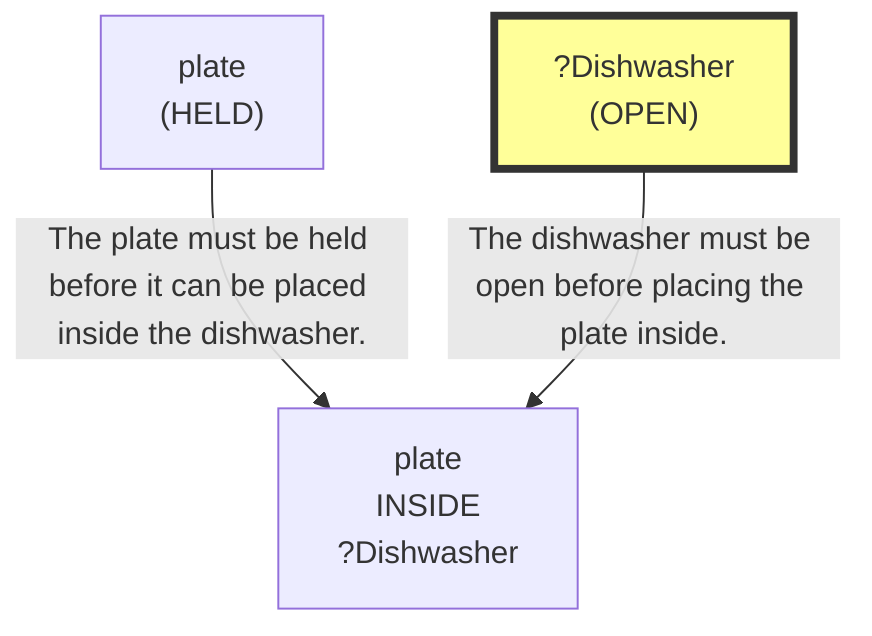
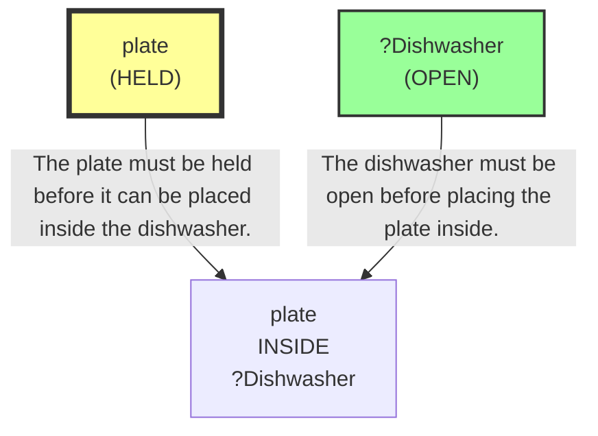
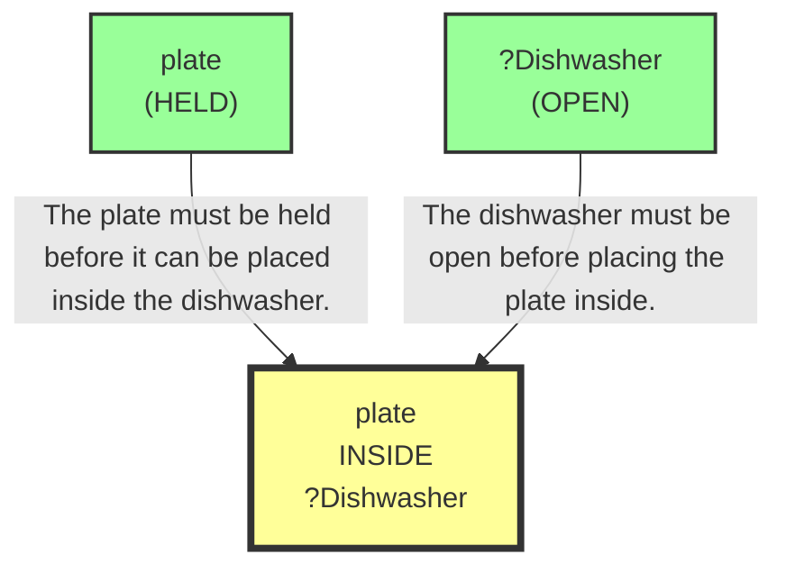
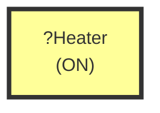
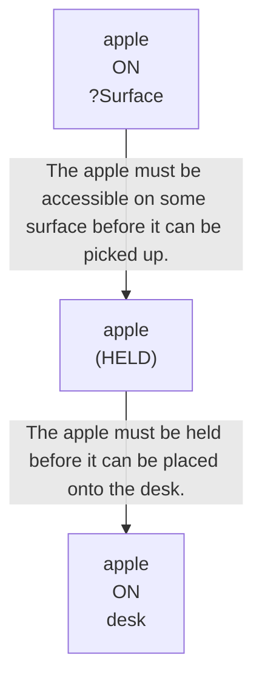
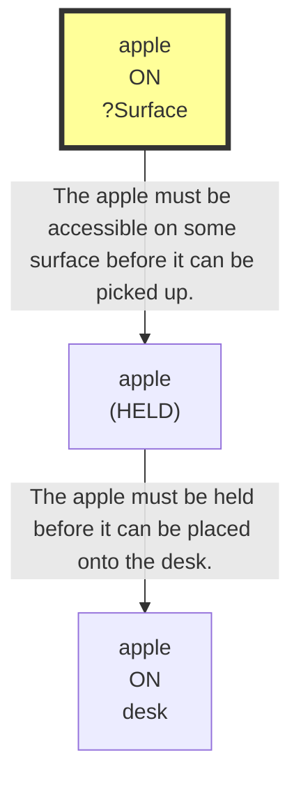
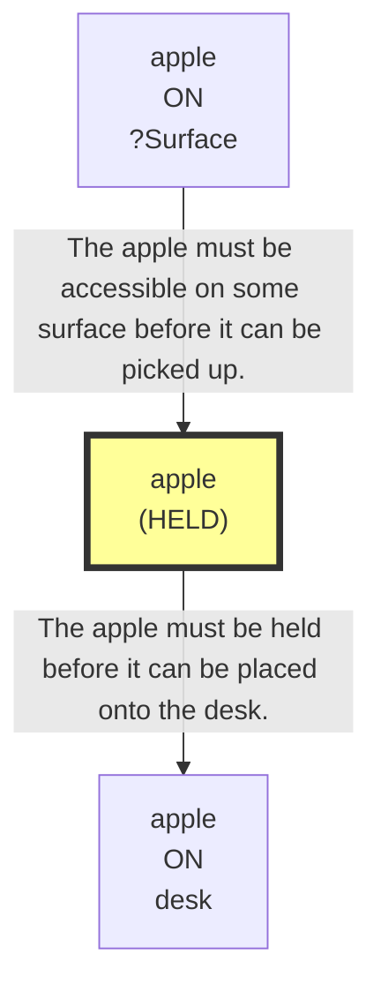
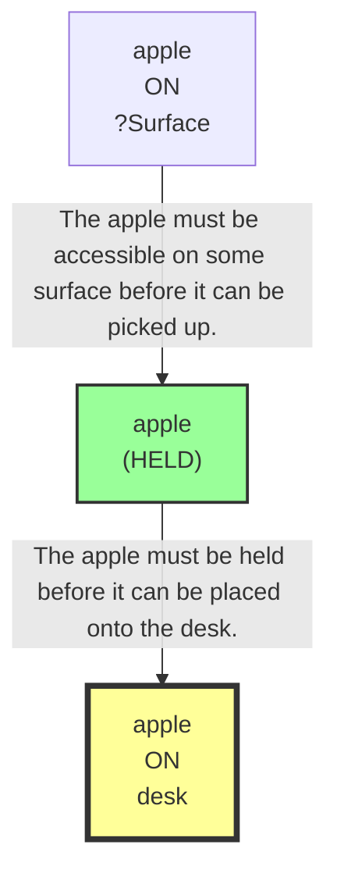
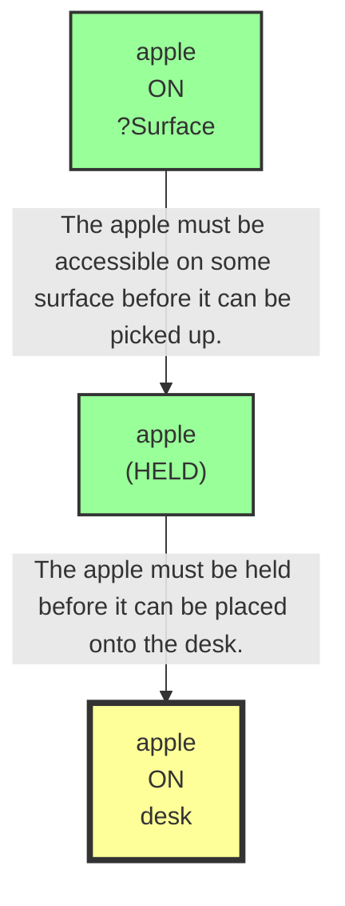
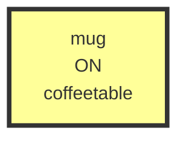

# 🚀 VirtualHome Agent Episode Log


### [GoalReasoner (Module A - Intent)] Output
```json
{
  "is_instruction_obviously_vague": false,
  "clarification_question": null,
  "target_object": "plate",
  "location_hint": null,
  "reasoning_chain": [
    {
      "question": "Why does the user want this object?",
      "answer": "To have the plate moved to the dishwasher after it has been used for washing dishes and left somewhere."
    },
    {
      "question": "Why is that important?",
      "answer": "To return the plate to the proper appliance location so it is no longer left out."
    },
    {
      "question": "What fundamental need does this fulfill?",
      "answer": "To organize and put away a dish after use."
    },
    {
      "question": "Are there any deeper psychological or physical motivations?",
      "answer": "It likely reduces clutter and keeps the kitchen area tidy by ensuring the plate is stored in the dishwasher."
    }
  ],
  "deep_intent": "The user wants to put a used dish away and reduce kitchen clutter.",
  "acceptable_alternatives_properties": [
    {
      "priority": 1,
      "description": "Other used dishes or dishwasher-safe tableware that should be put away after washing"
    },
    {
      "priority": 2,
      "description": "Similar kitchen items such as bowls, cups, or utensils that belong in the dishwasher"
    },
    {
      "priority": 3,
      "description": "Other washable food-related items that are currently left out and need storing or cleaning"
    },
    {
      "priority": 4,
      "description": "Any household item that has been used and needs to be returned to its proper storage location"
    }
  ]
}
```

### [PerceptionFilter] Output
```json
{
  "reasoning": "The goal is to put the used plate into the dishwasher, so we need the target item (plate) and the appliance it goes into (dishwasher). The SDG says the dishwasher must be open and the plate must be held, but those are states/actions, not separate object classes. No other tools are strictly required from the visible objects.",
  "selected_classes": [
    "plate",
    "dishwasher",
    "character"
  ],
  "raw_class_count": 46
}
```

### [LLMExecutor] Output
```json
{
  "reasoning": "The SDG requires the plate to be HELD and the dishwasher to be OPEN before the plate can be placed inside. The current graph shows multiple candidate plates, and plate(170) is the most immediately relevant used plate-like item in the kitchen. The dishwasher is currently CLOSED, so the next prerequisite is to move to it and open it before any putting action. Since I have not yet walked to the dishwasher, the single next atomic action must be to approach it.",
  "satisfied_nodes": [],
  "current_node_focus": "N2",
  "mapped_variables": {
    "?Dishwasher": "dishwasher(228)"
  },
  "action": "[walk] <dishwasher> (228)"
}
```

### [RoboStateMultiTaskController] Output
```json
{
  "action": "[walk] <dishwasher> (228)",
  "active_task_id": "task_7",
  "task_context": {
    "active_task_id": "task_7",
    "pending_task_ids": [
      "task_1",
      "task_2",
      "task_3",
      "task_4",
      "task_5",
      "task_6"
    ],
    "satisfied_task_ids": []
  },
  "source": "llm_executor"
}
```
## Step 0
- **Action**: `[walk] <dishwasher> (228)`
- **Action Success**: `True`
- **Action Message**: {'0': {'message': 'Success'}}
- **Active Task**: `task_7`
- **Decision Source**: `llm_executor`
- **Task Progress**: E1_19=pending, E1_02=pending, E1_03=pending, E1_04=pending, E1_07=pending, E1_12=pending, E1_18=pending
- **SDG Status**:

- **Observed Items (13)**: plate(170), plate(171), plate(172), plate(173), plate(177), plate(178), plate(184), dishwasher(228) [OFF,CLOSED], character(1), bathroom(11), bedroom(50), kitchen(126), livingroom(261)


### [PerceptionFilter] Output
```json
{
  "reasoning": "Reused cached class selection.",
  "selected_classes": [
    "plate",
    "dishwasher",
    "character"
  ],
  "raw_class_count": 46
}
```

### [LLMExecutor] Output
```json
{
  "reasoning": "The active goal requires the plate to be held and inside an open dishwasher. We are already close to the dishwasher from the previous successful walk, but the dishwasher is currently CLOSED and OFF. To make the target plate placement possible, the next necessary step is to open the dishwasher. No plate is currently held yet, so N3 is not satisfied. The dishwasher is the clear binding for ?Dishwasher.",
  "satisfied_nodes": [],
  "current_node_focus": "N2",
  "mapped_variables": {
    "?Dishwasher": "dishwasher(228)"
  },
  "action": "[open] <dishwasher> (228)"
}
```

### [RoboStateMultiTaskController] Output
```json
{
  "action": "[open] <dishwasher> (228)",
  "active_task_id": "task_7",
  "task_context": {
    "active_task_id": "task_7",
    "pending_task_ids": [
      "task_1",
      "task_2",
      "task_3",
      "task_4",
      "task_5",
      "task_6"
    ],
    "satisfied_task_ids": []
  },
  "source": "llm_executor"
}
```
## Step 1
- **Action**: `[open] <dishwasher> (228)`
- **Action Success**: `True`
- **Action Message**: {'0': {'message': 'Success'}}
- **Active Task**: `task_7`
- **Decision Source**: `llm_executor`
- **Task Progress**: E1_19=pending, E1_02=pending, E1_03=pending, E1_04=done, E1_07=pending, E1_12=pending, E1_18=pending
- **SDG Status**:

- **Observed Items (13)**: plate(170), plate(171), plate(172), plate(173), plate(177), plate(178), plate(184), dishwasher(228) [OFF,CLOSED], character(1), bathroom(11), bedroom(50), kitchen(126), livingroom(261)


### [PerceptionFilter] Output
```json
{
  "reasoning": "Reused cached class selection.",
  "selected_classes": [
    "plate",
    "dishwasher",
    "character"
  ],
  "raw_class_count": 46
}
```

### [LLMExecutor] Output
```json
{
  "reasoning": "The dishwasher is already open and the character is close to it. The remaining gap is to place a held plate inside the dishwasher, but no plate is currently shown as held. Per the proximity and grab rules, the next needed step is to walk to a suitable plate so it can be picked up before returning to the dishwasher. Among the available plates, plate(173) is a reasonable target because it is a grabbable dish with no special conflicting state.",
  "satisfied_nodes": [
    "N2"
  ],
  "current_node_focus": "N3",
  "mapped_variables": {
    "?Dishwasher": "dishwasher(228)"
  },
  "action": "[walk] <plate> (173)"
}
```

### [RoboStateMultiTaskController] Output
```json
{
  "action": "[walk] <plate> (173)",
  "active_task_id": "task_7",
  "task_context": {
    "active_task_id": "task_7",
    "pending_task_ids": [
      "task_1",
      "task_2",
      "task_3",
      "task_5",
      "task_6"
    ],
    "satisfied_task_ids": [
      "task_4"
    ]
  },
  "source": "llm_executor"
}
```
## Step 2
- **Action**: `[walk] <plate> (173)`
- **Action Success**: `True`
- **Action Message**: {'0': {'message': 'Success'}}
- **Active Task**: `task_7`
- **Decision Source**: `llm_executor`
- **Task Progress**: E1_19=pending, E1_02=pending, E1_03=pending, E1_04=done, E1_07=pending, E1_12=pending, E1_18=pending
- **SDG Status**:

- **Observed Items (13)**: plate(170), plate(171), plate(172), plate(173), plate(177), plate(178), plate(184), dishwasher(228) [OPEN,OFF], character(1), bathroom(11), bedroom(50), kitchen(126), livingroom(261)


### [PerceptionFilter] Output
```json
{
  "reasoning": "Reused cached class selection.",
  "selected_classes": [
    "plate",
    "dishwasher",
    "character"
  ],
  "raw_class_count": 46
}
```

### [LLMExecutor] Output
```json
{
  "reasoning": "The dishwasher is already open, satisfying N2. We are now adjacent to plate(173), which is the closest matching plate and is close to the character, so it is the best candidate to satisfy the held-object prerequisite before placing it into the dishwasher. Next we should grab the plate to satisfy N3, then we can put it inside the open dishwasher.",
  "satisfied_nodes": [
    "N2"
  ],
  "current_node_focus": "N3",
  "mapped_variables": {
    "?Dishwasher": "dishwasher(228)"
  },
  "action": "[grab] <plate> (173)"
}
```

### [RoboStateMultiTaskController] Output
```json
{
  "action": "[grab] <plate> (173)",
  "active_task_id": "task_7",
  "task_context": {
    "active_task_id": "task_7",
    "pending_task_ids": [
      "task_1",
      "task_2",
      "task_3",
      "task_5",
      "task_6"
    ],
    "satisfied_task_ids": [
      "task_4"
    ]
  },
  "source": "llm_executor"
}
```
## Step 3
- **Action**: `[grab] <plate> (173)`
- **Action Success**: `True`
- **Action Message**: {'0': {'message': 'Success'}}
- **Active Task**: `task_7`
- **Decision Source**: `llm_executor`
- **Task Progress**: E1_19=pending, E1_02=pending, E1_03=pending, E1_04=done, E1_07=pending, E1_12=pending, E1_18=pending
- **SDG Status**:

- **Observed Items (13)**: plate(170), plate(171), plate(172), plate(173), plate(177), plate(178), plate(184), dishwasher(228) [OPEN,OFF], character(1), bathroom(11), bedroom(50), kitchen(126), livingroom(261)


### [PerceptionFilter] Output
```json
{
  "reasoning": "Reused cached class selection.",
  "selected_classes": [
    "plate",
    "dishwasher",
    "character"
  ],
  "raw_class_count": 46
}
```

### [LLMExecutor] Output
```json
{
  "reasoning": "The active task is to put the plate inside the dishwasher. The dishwasher (228) is already open, satisfying N2. The character is already holding plate(173), satisfying N3. The only remaining gap is placing the held plate into the open dishwasher, which requires being near the dishwasher first; the last successful walk was to the plate, not the dishwasher. Therefore the next atomic action must be to walk to the dishwasher before the putin action can happen.",
  "satisfied_nodes": [
    "N2",
    "N3"
  ],
  "current_node_focus": "N1",
  "mapped_variables": {
    "?Dishwasher": "dishwasher(228)"
  },
  "action": "[walk] <dishwasher> (228)"
}
```

### [RoboStateMultiTaskController] Output
```json
{
  "action": "[walk] <dishwasher> (228)",
  "active_task_id": "task_7",
  "task_context": {
    "active_task_id": "task_7",
    "pending_task_ids": [
      "task_1",
      "task_2",
      "task_3",
      "task_5",
      "task_6"
    ],
    "satisfied_task_ids": [
      "task_4"
    ]
  },
  "source": "llm_executor"
}
```
## Step 4
- **Action**: `[walk] <dishwasher> (228)`
- **Action Success**: `True`
- **Action Message**: {'0': {'message': 'Success'}}
- **Active Task**: `task_7`
- **Decision Source**: `llm_executor`
- **Task Progress**: E1_19=pending, E1_02=pending, E1_03=pending, E1_04=done, E1_07=pending, E1_12=pending, E1_18=pending
- **SDG Status**:

- **Observed Items (13)**: plate(170), plate(171), plate(172), plate(173), plate(177), plate(178), plate(184), dishwasher(228) [OPEN,OFF], character(1), bathroom(11), bedroom(50), kitchen(126), livingroom(261)


### [PerceptionFilter] Output
```json
{
  "reasoning": "Reused cached class selection.",
  "selected_classes": [
    "plate",
    "dishwasher",
    "character"
  ],
  "raw_class_count": 46
}
```

### [LLMExecutor] Output
```json
{
  "reasoning": "The dishwasher is already open and the currently held plate is plate(173), which is close to the character and matches the SDG requirement for the plate to be held. The next unmet dependency is placing that held plate inside the open dishwasher. Since I am already at the dishwasher from the previous step, the single next atomic action is to put the plate into it.",
  "satisfied_nodes": [
    "N2",
    "N3"
  ],
  "current_node_focus": "N1",
  "mapped_variables": {
    "?Dishwasher": "dishwasher(228)"
  },
  "action": "[putin] <plate> (173) <dishwasher> (228)"
}
```

### [RoboStateMultiTaskController] Output
```json
{
  "action": "[putin] <plate> (173) <dishwasher> (228)",
  "active_task_id": "task_7",
  "task_context": {
    "active_task_id": "task_7",
    "pending_task_ids": [
      "task_1",
      "task_2",
      "task_3",
      "task_5",
      "task_6"
    ],
    "satisfied_task_ids": [
      "task_4"
    ]
  },
  "source": "llm_executor"
}
```
## Step 5
- **Action**: `[putin] <plate> (173) <dishwasher> (228)`
- **Action Success**: `True`
- **Action Message**: {'0': {'message': 'Success'}}
- **Active Task**: `task_7`
- **Decision Source**: `llm_executor`
- **Task Progress**: E1_19=pending, E1_02=pending, E1_03=pending, E1_04=done, E1_07=pending, E1_12=pending, E1_18=done
- **SDG Status**:

- **Observed Items (13)**: plate(170), plate(171), plate(172), plate(173), plate(177), plate(178), plate(184), dishwasher(228) [OPEN,OFF], character(1), bathroom(11), bedroom(50), kitchen(126), livingroom(261)


### [GoalReasoner (Module A - Intent)] Output
```json
{
  "is_instruction_obviously_vague": false,
  "clarification_question": null,
  "target_object": "microwave",
  "location_hint": null,
  "reasoning_chain": [
    {
      "question": "Why does the user want this object?",
      "answer": "To have the microwave powered on if it is currently off."
    },
    {
      "question": "Why is that important?",
      "answer": "So the appliance is in an operational state and ready for use."
    },
    {
      "question": "What fundamental need does this fulfill?",
      "answer": "It supports the ability to heat or prepare food indoors."
    },
    {
      "question": "Are there any deeper psychological or physical motivations?",
      "answer": "The user likely wants convenience and readiness for food preparation, reducing effort and wait time."
    }
  ],
  "deep_intent": "The user wants to ensure an appliance is operational for food preparation.",
  "acceptable_alternatives_properties": [
    {
      "priority": 1,
      "description": "Other kitchen appliances that can be powered on for food preparation, such as a toaster oven or stove"
    },
    {
      "priority": 2,
      "description": "Any readily usable cooking or heating appliance in the household that can prepare food"
    },
    {
      "priority": 3,
      "description": "A different food-heating device with similar function, such as an electric kettle or hot plate"
    },
    {
      "priority": 4,
      "description": "A non-appliance way to obtain ready-to-eat warm food, such as food that does not require heating"
    }
  ]
}
```

### [PerceptionFilter] Output
```json
{
  "reasoning": "The goal is to ensure a food-preparation heating appliance is powered on. The SDG specifically requires a heater-like appliance to be ON, so I keep the microwave as the target and retain other valid heating/cooking alternatives for backup, especially stove, toaster, coffeemaker, and dishwasher is not relevant so excluded. Power-related support objects are also needed if the appliance needs activation, such as a powersocket and lightswitch only if they directly affect operation; however, for the appliance itself the key classes are the heating devices.",
  "selected_classes": [
    "character",
    "door",
    "stove",
    "toaster",
    "microwave",
    "plate",
    "coffeemaker",
    "powersocket"
  ],
  "raw_class_count": 46
}
```

### [LLMExecutor] Output
```json
{
  "reasoning": "The active goal is to make ?Heater ON. In the current graph, microwave(234) is close to the character, has HAS_SWITCH and HAS_PLUG, and is currently OFF. Because it is an appliance with a plug, the safe progression is to first ensure it is plugged in before switching it on. The microwave is the best binding for ?Heater among available kitchen appliances.",
  "satisfied_nodes": [],
  "current_node_focus": "N1",
  "mapped_variables": {
    "?Heater": "microwave(234)"
  },
  "action": "[plugin] <microwave> (234)"
}
```

### [RoboStateMultiTaskController] Output
```json
{
  "action": "[plugin] <microwave> (234)",
  "active_task_id": "task_1",
  "task_context": {
    "active_task_id": "task_1",
    "pending_task_ids": [
      "task_2",
      "task_3",
      "task_5",
      "task_6"
    ],
    "satisfied_task_ids": [
      "task_4",
      "task_7"
    ]
  },
  "source": "llm_executor"
}
```
## Step 6
- **Action**: `[plugin] <microwave> (234)`
- **Action Success**: `True`
- **Action Message**: Faked plug operation in Python layer
- **Active Task**: `task_1`
- **Decision Source**: `llm_executor`
- **Task Progress**: E1_19=pending, E1_02=pending, E1_03=pending, E1_04=done, E1_07=pending, E1_12=pending, E1_18=done
- **SDG Status**:

- **Observed Items (19)**: door(145) [OPEN], door(146) [OPEN], powersocket(156), plate(170), plate(171), plate(172), plate(173), plate(177), plate(178), plate(184), stove(226) [OFF,CLOSED], coffeemaker(229) [OFF], toaster(231) [OFF], microwave(234) [OFF,CLOSED], character(1)...


### [PerceptionFilter] Output
```json
{
  "reasoning": "Reused cached class selection.",
  "selected_classes": [
    "character",
    "door",
    "stove",
    "toaster",
    "microwave",
    "plate",
    "coffeemaker",
    "powersocket"
  ],
  "raw_class_count": 46
}
```

### [LLMExecutor] Output
```json
{
  "reasoning": "The active goal is to get the microwave into the ON state. The filtered graph shows microwave(234) is already CLOSE to the character, plugged in, and currently OFF. Since I am already near it, the next required step is to switch it on. This directly satisfies the only SDG node N1 (Heater ON).",
  "satisfied_nodes": [],
  "current_node_focus": "N1",
  "mapped_variables": {
    "?Heater": "microwave(234)"
  },
  "action": "[switchon] <microwave> (234)"
}
```

### [RoboStateMultiTaskController] Output
```json
{
  "action": "[switchon] <microwave> (234)",
  "active_task_id": "task_1",
  "task_context": {
    "active_task_id": "task_1",
    "pending_task_ids": [
      "task_2",
      "task_3",
      "task_5",
      "task_6"
    ],
    "satisfied_task_ids": [
      "task_4",
      "task_7"
    ]
  },
  "source": "llm_executor"
}
```
## Step 7
- **Action**: `[switchon] <microwave> (234)`
- **Action Success**: `True`
- **Action Message**: Faked switch operation in Python layer (bypassed Unity failure)
- **Active Task**: `task_1`
- **Decision Source**: `llm_executor`
- **Task Progress**: E1_19=done, E1_02=pending, E1_03=pending, E1_04=done, E1_07=pending, E1_12=pending, E1_18=done
- **SDG Status**:

- **Observed Items (19)**: door(145) [OPEN], door(146) [OPEN], powersocket(156), plate(170), plate(171), plate(172), plate(173), plate(177), plate(178), plate(184), stove(226) [OFF,CLOSED], coffeemaker(229) [OFF], toaster(231) [OFF], microwave(234) [OFF,CLOSED,PLUGGED_IN], character(1)...


### [GoalReasoner (Module A - Intent)] Output
```json
{
  "is_instruction_obviously_vague": false,
  "clarification_question": null,
  "target_object": "apple",
  "location_hint": "desk",
  "reasoning_chain": [
    {
      "question": "Why does the user want this object?",
      "answer": "To have it brought to their desk."
    },
    {
      "question": "Why is that important?",
      "answer": "They want the object available at the desk for use or access there."
    },
    {
      "question": "What fundamental need does this fulfill?",
      "answer": "It fulfills a need to have a desired item conveniently within reach in the workspace."
    },
    {
      "question": "Are there any deeper psychological or physical motivations?",
      "answer": "The motivation is likely convenience, organization, or immediate access to food or an item while at the desk."
    }
  ],
  "deep_intent": "The user wants a desired item made available at their workspace for convenient access.",
  "acceptable_alternatives_properties": [
    {
      "priority": 1,
      "description": "Other similar small hand-held fruits that can be moved to the desk, such as a pear or orange"
    },
    {
      "priority": 2,
      "description": "Other desk-adjacent snack items that are easy to place at the desk, such as a banana or packaged snack"
    },
    {
      "priority": 3,
      "description": "Any ready-to-eat food item suitable for keeping at a desk"
    },
    {
      "priority": 4,
      "description": "A different portable item the user may want readily accessible at the desk"
    }
  ]
}
```

### [RoboStateMultiTaskController] Output
```json
{
  "action": "[walk] <bathroom> (11)",
  "active_task_id": "task_2",
  "task_context": {
    "active_task_id": "task_2",
    "pending_task_ids": [
      "task_3",
      "task_5",
      "task_6"
    ],
    "satisfied_task_ids": [
      "task_1",
      "task_4",
      "task_7"
    ]
  },
  "source": "room_frontier"
}
```
## Step 8
- **Action**: `[walk] <bathroom> (11)`
- **Action Success**: `True`
- **Action Message**: {'0': {'message': 'Success'}}
- **Active Task**: `task_2`
- **Decision Source**: `room_frontier`
- **Task Progress**: E1_19=done, E1_02=pending, E1_03=pending, E1_04=done, E1_07=pending, E1_12=pending, E1_18=done
- **SDG Status**:

- **Observed Items (127)**: floor(127), floor(128), floor(129), floor(130), floor(131), floor(132), floor(133), floor(134), floor(135), ceiling(136), ceiling(137), ceiling(138), ceiling(139), ceiling(140), ceiling(141)...


### [RoboStateMultiTaskController] Output
```json
{
  "action": "[walk] <bedroom> (50)",
  "active_task_id": "task_2",
  "task_context": {
    "active_task_id": "task_2",
    "pending_task_ids": [
      "task_3",
      "task_5",
      "task_6"
    ],
    "satisfied_task_ids": [
      "task_1",
      "task_4",
      "task_7"
    ]
  },
  "source": "room_frontier"
}
```
## Step 9
- **Action**: `[walk] <bedroom> (50)`
- **Action Success**: `True`
- **Action Message**: {'0': {'message': 'Success'}}
- **Active Task**: `task_2`
- **Decision Source**: `room_frontier`
- **Task Progress**: E1_19=done, E1_02=pending, E1_03=pending, E1_04=done, E1_07=pending, E1_12=pending, E1_18=done
- **SDG Status**:

- **Observed Items (165)**: floor(127), floor(128), floor(129), floor(130), floor(131), floor(132), floor(133), floor(134), floor(135), ceiling(136), ceiling(137), ceiling(138), ceiling(139), ceiling(140), ceiling(141)...


### [PerceptionFilter] Output
```json
{
  "reasoning": "The goal is to move the apple to the desk. The SDG only requires the apple and the destination desk, plus the apple being held before placement. No extra tools or receptacles are needed.",
  "selected_classes": [
    "character",
    "apple",
    "desk"
  ],
  "raw_class_count": 82
}
```

### [LLMExecutor] Output
```json
{
  "reasoning": "The active task is to place an apple on the desk. The desk is in the bedroom, and the current graph shows apple(114) also in the bedroom, making it the most accessible candidate for the required apple. Since I must be near the object before grabbing it, and I am currently in the bedroom, the next step is to walk to apple(114) so I can grab it on the following action. N1 is the current focus because the apple must first be accessible/selected before it can be held and then placed on the desk.",
  "satisfied_nodes": [],
  "current_node_focus": "N1",
  "mapped_variables": {},
  "action": "[walk] <apple> (114)"
}
```

### [RoboStateMultiTaskController] Output
```json
{
  "action": "[walk] <apple> (114)",
  "active_task_id": "task_2",
  "task_context": {
    "active_task_id": "task_2",
    "pending_task_ids": [
      "task_3",
      "task_5",
      "task_6"
    ],
    "satisfied_task_ids": [
      "task_1",
      "task_4",
      "task_7"
    ]
  },
  "source": "llm_executor"
}
```
## Step 10
- **Action**: `[walk] <apple> (114)`
- **Action Success**: `True`
- **Action Message**: {'0': {'message': 'Success'}}
- **Active Task**: `task_2`
- **Decision Source**: `llm_executor`
- **Task Progress**: E1_19=done, E1_02=pending, E1_03=pending, E1_04=done, E1_07=pending, E1_12=pending, E1_18=done
- **SDG Status**:

- **Observed Items (19)**: apple(249), apple(250), apple(251), apple(252), apple(253), apple(254), apple(255), apple(256), apple(257), apple(258), apple(259), apple(113), character(1), bathroom(11), bedroom(50)...


### [PerceptionFilter] Output
```json
{
  "reasoning": "Reused cached class selection.",
  "selected_classes": [
    "character",
    "apple",
    "desk"
  ],
  "raw_class_count": 82
}
```

### [LLMExecutor] Output
```json
{
  "reasoning": "The apple for the active task is already nearby: apple(114) is CLOSE to the character in the bedroom. To satisfy N1 and progress toward placing it on the desk, the next required step is to grab the apple. The desk is a valid later destination, but per the SDG we must first hold the apple.",
  "satisfied_nodes": [],
  "current_node_focus": "N2",
  "mapped_variables": {},
  "action": "[grab] <apple> (114)"
}
```

### [RoboStateMultiTaskController] Output
```json
{
  "action": "[grab] <apple> (114)",
  "active_task_id": "task_2",
  "task_context": {
    "active_task_id": "task_2",
    "pending_task_ids": [
      "task_3",
      "task_5",
      "task_6"
    ],
    "satisfied_task_ids": [
      "task_1",
      "task_4",
      "task_7"
    ]
  },
  "source": "llm_executor"
}
```
## Step 11
- **Action**: `[grab] <apple> (114)`
- **Action Success**: `True`
- **Action Message**: {'0': {'message': 'Success'}}
- **Active Task**: `task_2`
- **Decision Source**: `llm_executor`
- **Task Progress**: E1_19=done, E1_02=pending, E1_03=pending, E1_04=done, E1_07=pending, E1_12=pending, E1_18=done
- **SDG Status**:

- **Observed Items (19)**: apple(249), apple(250), apple(251), apple(252), apple(253), apple(254), apple(255), apple(256), apple(257), apple(258), apple(259), apple(113), character(1), bathroom(11), bedroom(50)...


### [PerceptionFilter] Output
```json
{
  "reasoning": "Reused cached class selection.",
  "selected_classes": [
    "character",
    "apple",
    "desk"
  ],
  "raw_class_count": 82
}
```

### [LLMExecutor] Output
```json
{
  "reasoning": "The held apple(114) already satisfies the held-state prerequisite (N2). The remaining goal is to place this apple onto the desk, so I must first move close to the desk before I can put it back on the surface. The desk is the required target surface and is currently in the bedroom.",
  "satisfied_nodes": [
    "N2"
  ],
  "current_node_focus": "N3",
  "mapped_variables": {
    "?Surface": "desk(80)"
  },
  "action": "[walk] <desk> (80)"
}
```

### [RoboStateMultiTaskController] Output
```json
{
  "action": "[walk] <desk> (80)",
  "active_task_id": "task_2",
  "task_context": {
    "active_task_id": "task_2",
    "pending_task_ids": [
      "task_3",
      "task_5",
      "task_6"
    ],
    "satisfied_task_ids": [
      "task_1",
      "task_4",
      "task_7"
    ]
  },
  "source": "llm_executor"
}
```
## Step 12
- **Action**: `[walk] <desk> (80)`
- **Action Success**: `True`
- **Action Message**: {'0': {'message': 'Success'}}
- **Active Task**: `task_2`
- **Decision Source**: `llm_executor`
- **Task Progress**: E1_19=done, E1_02=pending, E1_03=pending, E1_04=done, E1_07=pending, E1_12=pending, E1_18=done
- **SDG Status**:

- **Observed Items (19)**: apple(249), apple(250), apple(251), apple(252), apple(253), apple(254), apple(255), apple(256), apple(257), apple(258), apple(259), apple(113), character(1), bathroom(11), bedroom(50)...


### [PerceptionFilter] Output
```json
{
  "reasoning": "Reused cached class selection.",
  "selected_classes": [
    "character",
    "apple",
    "desk"
  ],
  "raw_class_count": 82
}
```

### [LLMExecutor] Output
```json
{
  "reasoning": "The active task is to place the apple on the desk. We are already close to the desk, but the currently held apple is apple(114), not on the desk yet. Since the SDG requires the apple to be HELD before being placed on the desk, the next step is to put the held apple onto the desk. The desk is a flat surface, so the correct placement action is putback. I will use the apple already in hand.",
  "satisfied_nodes": [
    "N1",
    "N2"
  ],
  "current_node_focus": "N3",
  "mapped_variables": {},
  "action": "[putback] <apple> (114) <desk> (80)"
}
```

### [RoboStateMultiTaskController] Output
```json
{
  "action": "[putback] <apple> (114) <desk> (80)",
  "active_task_id": "task_2",
  "task_context": {
    "active_task_id": "task_2",
    "pending_task_ids": [
      "task_3",
      "task_5",
      "task_6"
    ],
    "satisfied_task_ids": [
      "task_1",
      "task_4",
      "task_7"
    ]
  },
  "source": "llm_executor"
}
```
## Step 13
- **Action**: `[putback] <apple> (114) <desk> (80)`
- **Action Success**: `True`
- **Action Message**: {'0': {'message': 'Success'}}
- **Active Task**: `task_2`
- **Decision Source**: `llm_executor`
- **Task Progress**: E1_19=done, E1_02=done, E1_03=pending, E1_04=done, E1_07=pending, E1_12=pending, E1_18=done
- **SDG Status**:

- **Observed Items (19)**: apple(249), apple(250), apple(251), apple(252), apple(253), apple(254), apple(255), apple(256), apple(257), apple(258), apple(259), apple(113), character(1), bathroom(11), bedroom(50)...


### [GoalReasoner (Module A - Intent)] Output
```json
{
  "is_instruction_obviously_vague": false,
  "clarification_question": null,
  "target_object": "book",
  "location_hint": "sofa",
  "reasoning_chain": [
    {
      "question": "Why does the user want this object?",
      "answer": "To move a book that is out of order from wherever it is found to the sofa."
    },
    {
      "question": "Why is that important?",
      "answer": "Because the user wants the book placed in a specific resting or gathering area rather than left unorganized elsewhere."
    },
    {
      "question": "What fundamental need does this fulfill?",
      "answer": "It fulfills the need to organize and relocate an item to an intended location."
    },
    {
      "question": "Are there any deeper psychological or physical motivations?",
      "answer": "The user likely wants to reduce clutter or keep the living area tidier and make the book available in a preferred spot."
    }
  ],
  "deep_intent": "The user wants to organize and relocate an item to a designated place.",
  "acceptable_alternatives_properties": [
    {
      "priority": 1,
      "description": "Other small household reading items or papers that can be moved to the sofa when found out of place"
    },
    {
      "priority": 2,
      "description": "Similar flat or handheld household items that are meant to be stored or kept together in the living area"
    },
    {
      "priority": 3,
      "description": "Other clutter items from common indoor spaces that can be tidied by moving them to a designated resting area"
    },
    {
      "priority": 4,
      "description": "Any nearby household object that needs to be picked up and placed in the intended location to restore order"
    }
  ]
}
```

### [PerceptionFilter] Output
```json
{
  "reasoning": "The goal is to place a book onto the sofa, so the only strictly necessary classes are the target object and the destination furniture. No tools or alternative functional objects are required for this relocation task.",
  "selected_classes": [
    "paper",
    "character",
    "door",
    "book",
    "sofa"
  ],
  "raw_class_count": 82
}
```

### [LLMExecutor] Output
```json
{
  "reasoning": "The active goal is to place a book ON the sofa. Among the visible books, book(104) is already in the bedroom, which is the same room as the sofa(85). Since I cannot put an object onto a surface unless I am explicitly walking to that surface first, the next step should be to move to the sofa before attempting to place a book there. Book(104) is the best candidate because it is nearby and matches the target object class.",
  "satisfied_nodes": [],
  "current_node_focus": "N1",
  "mapped_variables": {},
  "action": "[walk] <sofa> (85)"
}
```

### [RoboStateMultiTaskController] Output
```json
{
  "action": "[walk] <sofa> (85)",
  "active_task_id": "task_3",
  "task_context": {
    "active_task_id": "task_3",
    "pending_task_ids": [
      "task_5",
      "task_6"
    ],
    "satisfied_task_ids": [
      "task_1",
      "task_2",
      "task_4",
      "task_7"
    ]
  },
  "source": "llm_executor"
}
```
## Step 14
- **Action**: `[walk] <sofa> (85)`
- **Action Success**: `True`
- **Action Message**: {'0': {'message': 'Success'}}
- **Active Task**: `task_3`
- **Decision Source**: `llm_executor`
- **Task Progress**: E1_19=done, E1_02=done, E1_03=pending, E1_04=done, E1_07=pending, E1_12=pending, E1_18=done
- **SDG Status**:

- **Observed Items (13)**: door(145) [OPEN], door(146) [OPEN], book(163) [CLOSED], book(164) [CLOSED], character(1), bathroom(11), bedroom(50), kitchen(126), livingroom(261), door(47) [OPEN], sofa(85), book(104) [CLOSED], paper(109)


### [PerceptionFilter] Output
```json
{
  "reasoning": "Reused cached class selection.",
  "selected_classes": [
    "paper",
    "character",
    "door",
    "book",
    "sofa"
  ],
  "raw_class_count": 82
}
```

### [LLMExecutor] Output
```json
{
  "reasoning": "The active goal is to place a book on the sofa. In the current graph, the character is already close to sofa(85) and book(104) in the bedroom. Since the book is the relevant target object and is nearby, the next step is to walk directly to the book so it can be grabbed next. Book(104) is the best match for the target object because it is a book in the same room and already near the agent.",
  "satisfied_nodes": [],
  "current_node_focus": "N1",
  "mapped_variables": {},
  "action": "[walk] <book> (104)"
}
```

### [RoboStateMultiTaskController] Output
```json
{
  "action": "[walk] <book> (104)",
  "active_task_id": "task_3",
  "task_context": {
    "active_task_id": "task_3",
    "pending_task_ids": [
      "task_5",
      "task_6"
    ],
    "satisfied_task_ids": [
      "task_1",
      "task_2",
      "task_4",
      "task_7"
    ]
  },
  "source": "llm_executor"
}
```
## Step 15
- **Action**: `[walk] <book> (104)`
- **Action Success**: `True`
- **Action Message**: {'0': {'message': 'Success'}}
- **Active Task**: `task_3`
- **Decision Source**: `llm_executor`
- **Task Progress**: E1_19=done, E1_02=done, E1_03=pending, E1_04=done, E1_07=pending, E1_12=pending, E1_18=done
- **SDG Status**:

- **Observed Items (13)**: door(145) [OPEN], door(146) [OPEN], book(163) [CLOSED], book(164) [CLOSED], character(1), bathroom(11), bedroom(50), kitchen(126), livingroom(261), door(47) [OPEN], sofa(85), book(104) [CLOSED], paper(109)


### [PerceptionFilter] Output
```json
{
  "reasoning": "Reused cached class selection.",
  "selected_classes": [
    "paper",
    "character",
    "door",
    "book",
    "sofa"
  ],
  "raw_class_count": 82
}
```

### [LLMExecutor] Output
```json
{
  "reasoning": "The active goal is to place a book on the sofa. In the current graph, the closest matching book is book(104), which is in the bedroom and close to the character. I have already walked to it, so the next required step is to pick it up before I can walk to the sofa and place it there.",
  "satisfied_nodes": [],
  "current_node_focus": "N1",
  "mapped_variables": {},
  "action": "[grab] <book> (104)"
}
```

### [RoboStateMultiTaskController] Output
```json
{
  "action": "[grab] <book> (104)",
  "active_task_id": "task_3",
  "task_context": {
    "active_task_id": "task_3",
    "pending_task_ids": [
      "task_5",
      "task_6"
    ],
    "satisfied_task_ids": [
      "task_1",
      "task_2",
      "task_4",
      "task_7"
    ]
  },
  "source": "llm_executor"
}
```
## Step 16
- **Action**: `[grab] <book> (104)`
- **Action Success**: `True`
- **Action Message**: {'0': {'message': 'Success'}}
- **Active Task**: `task_3`
- **Decision Source**: `llm_executor`
- **Task Progress**: E1_19=done, E1_02=done, E1_03=pending, E1_04=done, E1_07=pending, E1_12=pending, E1_18=done
- **SDG Status**:

- **Observed Items (13)**: door(145) [OPEN], door(146) [OPEN], book(163) [CLOSED], book(164) [CLOSED], character(1), bathroom(11), bedroom(50), kitchen(126), livingroom(261), door(47) [OPEN], sofa(85), book(104) [CLOSED], paper(109)


### [PerceptionFilter] Output
```json
{
  "reasoning": "Reused cached class selection.",
  "selected_classes": [
    "paper",
    "character",
    "door",
    "book",
    "sofa"
  ],
  "raw_class_count": 82
}
```

### [LLMExecutor] Output
```json
{
  "reasoning": "The active goal is to place a book on the sofa. The filtered graph shows I am currently holding book(104) and I am already in the bedroom where sofa(85) is located. Since putback requires being near the destination first, and I am already close to the sofa by current location context, the next step should be to place the held book onto the sofa to satisfy N1.",
  "satisfied_nodes": [],
  "current_node_focus": "N1",
  "mapped_variables": {},
  "action": "[putback] <book> (104) <sofa> (85)"
}
```

### [RoboStateMultiTaskController] Output
```json
{
  "action": "[walk] <sofa> (85)",
  "active_task_id": "task_3",
  "task_context": {
    "active_task_id": "task_3",
    "pending_task_ids": [
      "task_5",
      "task_6"
    ],
    "satisfied_task_ids": [
      "task_1",
      "task_2",
      "task_4",
      "task_7"
    ]
  },
  "source": "llm_executor_repaired"
}
```
## Step 17
- **Action**: `[walk] <sofa> (85)`
- **Action Success**: `True`
- **Action Message**: {'0': {'message': 'Success'}}
- **Active Task**: `task_3`
- **Decision Source**: `llm_executor_repaired`
- **Task Progress**: E1_19=done, E1_02=done, E1_03=pending, E1_04=done, E1_07=pending, E1_12=pending, E1_18=done
- **SDG Status**:

- **Observed Items (13)**: door(145) [OPEN], door(146) [OPEN], book(163) [CLOSED], book(164) [CLOSED], character(1), bathroom(11), bedroom(50), kitchen(126), livingroom(261), door(47) [OPEN], sofa(85), book(104) [CLOSED], paper(109)


### [PerceptionFilter] Output
```json
{
  "reasoning": "Reused cached class selection.",
  "selected_classes": [
    "paper",
    "character",
    "door",
    "book",
    "sofa"
  ],
  "raw_class_count": 82
}
```

### [LLMExecutor] Output
```json
{
  "reasoning": "The active goal is to place a book on the sofa. The current graph shows I am already close to sofa(85), and I am holding book(104) in my right hand. The only missing state for N1 is the book being ON the sofa, so the next atomic action should place the held book onto the nearby sofa. The sofa is a valid flat surface for putback, and no additional walk is needed because I am already close to it.",
  "satisfied_nodes": [],
  "current_node_focus": "N1",
  "mapped_variables": {},
  "action": "[putback] <book> (104) <sofa> (85)"
}
```

### [RoboStateMultiTaskController] Output
```json
{
  "action": "[putback] <book> (104) <sofa> (85)",
  "active_task_id": "task_3",
  "task_context": {
    "active_task_id": "task_3",
    "pending_task_ids": [
      "task_5",
      "task_6"
    ],
    "satisfied_task_ids": [
      "task_1",
      "task_2",
      "task_4",
      "task_7"
    ]
  },
  "source": "llm_executor"
}
```
## Step 18
- **Action**: `[putback] <book> (104) <sofa> (85)`
- **Action Success**: `True`
- **Action Message**: {'0': {'message': 'Success'}}
- **Active Task**: `task_3`
- **Decision Source**: `llm_executor`
- **Task Progress**: E1_19=done, E1_02=done, E1_03=done, E1_04=done, E1_07=pending, E1_12=pending, E1_18=done
- **SDG Status**:

- **Observed Items (13)**: door(145) [OPEN], door(146) [OPEN], book(163) [CLOSED], book(164) [CLOSED], character(1), bathroom(11), bedroom(50), kitchen(126), livingroom(261), door(47) [OPEN], sofa(85), book(104) [CLOSED], paper(109)


### [GoalReasoner (Module A - Intent)] Output
```json
{
  "is_instruction_obviously_vague": false,
  "clarification_question": null,
  "target_object": "mug",
  "location_hint": "coffeetable",
  "reasoning_chain": [
    {
      "question": "Why does the user want this object?",
      "answer": "They want the mug to be located on the coffeetable."
    },
    {
      "question": "Why is that important?",
      "answer": "They want to maintain a specific placement condition for the mug."
    },
    {
      "question": "What fundamental need does this fulfill?",
      "answer": "It fulfills a need to keep an item in a designated, predictable location."
    },
    {
      "question": "Are there any deeper psychological or physical motivations?",
      "answer": "It may support convenience, organization, or making the mug easy to find and access."
    }
  ],
  "deep_intent": "The user wants to keep an item consistently in a designated location for organization and easy access.",
  "acceptable_alternatives_properties": [
    {
      "priority": 1,
      "description": "Another drink container or similar tabletop item kept on the coffee table"
    },
    {
      "priority": 2,
      "description": "A different cup, glass, or tumbler placed on the coffee table"
    },
    {
      "priority": 3,
      "description": "Any small household item that can serve as a stable, designated tabletop object"
    },
    {
      "priority": 4,
      "description": "A similarly sized everyday object kept in a consistent visible location for organization"
    }
  ]
}
```

### [PerceptionFilter] Output
```json
{
  "reasoning": "The goal is to keep the mug on the coffeetable, so the only strictly necessary object classes are the target object and its required location. No extra tools or alternatives are needed because this is a placement relation, not an action requiring equipment.",
  "selected_classes": [
    "character",
    "mug",
    "coffeetable"
  ],
  "raw_class_count": 82
}
```

### [LLMExecutor] Output
```json
{
  "reasoning": "The active goal is to have mug(102) ON coffeetable(86). The character is already CLOSE to the coffeetable, so the next step should be to pick up the mug. The mug is in the kitchen, and there is no indication it is held or dirty. To place it on the coffee table later, I first need to be near it and grab it.",
  "satisfied_nodes": [],
  "current_node_focus": "N1",
  "mapped_variables": {
    "?TargetMug": "mug(102)",
    "?Table": "coffeetable(86)"
  },
  "action": "[walk] <mug> (102)"
}
```

### [RoboStateMultiTaskController] Output
```json
{
  "action": "[walk] <mug> (102)",
  "active_task_id": "task_5",
  "task_context": {
    "active_task_id": "task_5",
    "pending_task_ids": [
      "task_6"
    ],
    "satisfied_task_ids": [
      "task_1",
      "task_2",
      "task_3",
      "task_4",
      "task_7"
    ]
  },
  "source": "llm_executor"
}
```
## Step 19
- **Action**: `[walk] <mug> (102)`
- **Action Success**: `True`
- **Action Message**: {'0': {'message': 'Success'}}
- **Active Task**: `task_5`
- **Decision Source**: `llm_executor`
- **Task Progress**: E1_19=done, E1_02=done, E1_03=done, E1_04=done, E1_07=pending, E1_12=pending, E1_18=done
- **SDG Status**:

- **Observed Items (7)**: mug(102), character(1), bathroom(11), bedroom(50), kitchen(126), livingroom(261), coffeetable(86)


### [PerceptionFilter] Output
```json
{
  "reasoning": "Reused cached class selection.",
  "selected_classes": [
    "character",
    "mug",
    "coffeetable"
  ],
  "raw_class_count": 82
}
```

### [LLMExecutor] Output
```json
{
  "reasoning": "The active goal is to have mug(102) on coffeetable(86). The mug is already close to the character, so it can be picked up now. I should not put it directly on the coffee table until I am holding it; the next step is to grab the mug. The coffee table is the target surface for the final placement, but placement will require a separate walk to the table first.",
  "satisfied_nodes": [],
  "current_node_focus": "N1",
  "mapped_variables": {},
  "action": "[grab] <mug> (102)"
}
```

### [RoboStateMultiTaskController] Output
```json
{
  "action": "[grab] <mug> (102)",
  "active_task_id": "task_5",
  "task_context": {
    "active_task_id": "task_5",
    "pending_task_ids": [
      "task_6"
    ],
    "satisfied_task_ids": [
      "task_1",
      "task_2",
      "task_3",
      "task_4",
      "task_7"
    ]
  },
  "source": "llm_executor"
}
```
## Step 20
- **Action**: `[grab] <mug> (102)`
- **Action Success**: `True`
- **Action Message**: {'0': {'message': 'Success'}}
- **Active Task**: `task_5`
- **Decision Source**: `llm_executor`
- **Task Progress**: E1_19=done, E1_02=done, E1_03=done, E1_04=done, E1_07=pending, E1_12=pending, E1_18=done
- **SDG Status**:
```mermaid
graph TD
    N1["mug<br>ON<br>coffeetable"]
    style N1 fill:#ff9,stroke:#333,stroke-width:4px
```
- **Observed Items (7)**: mug(102), character(1), bathroom(11), bedroom(50), kitchen(126), livingroom(261), coffeetable(86)


### [PerceptionFilter] Output
```json
{
  "reasoning": "Reused cached class selection.",
  "selected_classes": [
    "character",
    "mug",
    "coffeetable"
  ],
  "raw_class_count": 82
}
```

### [LLMExecutor] Output
```json
{
  "reasoning": "The active SDG requires mug(102) to be ON coffeetable(86). I am currently holding the mug and the coffeetable is close, so the next necessary step is to place the mug onto the table. Because putting down onto a surface requires being explicitly walked to that surface first, the correct immediate action is to walk to the coffeetable. The mug is already the correct object and no other constraints apply.",
  "satisfied_nodes": [],
  "current_node_focus": "N1",
  "mapped_variables": {},
  "action": "[walk] <coffeetable> (86)"
}
```

### [RoboStateMultiTaskController] Output
```json
{
  "action": "[walk] <coffeetable> (86)",
  "active_task_id": "task_5",
  "task_context": {
    "active_task_id": "task_5",
    "pending_task_ids": [
      "task_6"
    ],
    "satisfied_task_ids": [
      "task_1",
      "task_2",
      "task_3",
      "task_4",
      "task_7"
    ]
  },
  "source": "llm_executor"
}
```
## Step 21
- **Action**: `[walk] <coffeetable> (86)`
- **Action Success**: `True`
- **Action Message**: {'0': {'message': 'Success'}}
- **Active Task**: `task_5`
- **Decision Source**: `llm_executor`
- **Task Progress**: E1_19=done, E1_02=done, E1_03=done, E1_04=done, E1_07=pending, E1_12=pending, E1_18=done
- **SDG Status**:
```mermaid
graph TD
    N1["mug<br>ON<br>coffeetable"]
    style N1 fill:#ff9,stroke:#333,stroke-width:4px
```
- **Observed Items (7)**: mug(102), character(1), bathroom(11), bedroom(50), kitchen(126), livingroom(261), coffeetable(86)


### [PerceptionFilter] Output
```json
{
  "reasoning": "Reused cached class selection.",
  "selected_classes": [
    "character",
    "mug",
    "coffeetable"
  ],
  "raw_class_count": 82
}
```

### [LLMExecutor] Output
```json
{
  "reasoning": "The mug is already held in the right hand, and the character is already close to the coffeetable. The next required step to satisfy N1 is to place the mug onto the coffeetable. No additional walk is needed because proximity is already established in the current graph.",
  "satisfied_nodes": [],
  "current_node_focus": "N1",
  "mapped_variables": {},
  "action": "[putback] <mug> (102) <coffeetable> (86)"
}
```

### [RoboStateMultiTaskController] Output
```json
{
  "action": "[putback] <mug> (102) <coffeetable> (86)",
  "active_task_id": "task_5",
  "task_context": {
    "active_task_id": "task_5",
    "pending_task_ids": [
      "task_6"
    ],
    "satisfied_task_ids": [
      "task_1",
      "task_2",
      "task_3",
      "task_4",
      "task_7"
    ]
  },
  "source": "llm_executor"
}
```
## Step 22
- **Action**: `[putback] <mug> (102) <coffeetable> (86)`
- **Action Success**: `True`
- **Action Message**: {'0': {'message': 'Success'}}
- **Active Task**: `task_5`
- **Decision Source**: `llm_executor`
- **Task Progress**: E1_19=done, E1_02=done, E1_03=done, E1_04=done, E1_07=done, E1_12=pending, E1_18=done
- **SDG Status**:
```mermaid
graph TD
    N1["mug<br>ON<br>coffeetable"]
    style N1 fill:#ff9,stroke:#333,stroke-width:4px
```
- **Observed Items (7)**: mug(102), character(1), bathroom(11), bedroom(50), kitchen(126), livingroom(261), coffeetable(86)


### [GoalReasoner (Module A - Intent)] Output
```json
{
  "is_instruction_obviously_vague": false,
  "clarification_question": null,
  "target_object": "cabinet",
  "location_hint": null,
  "reasoning_chain": [
    {
      "question": "Why does the user want this object?",
      "answer": "To change the cabinet’s state from open to closed if it is currently open."
    },
    {
      "question": "Why is that important?",
      "answer": "A closed cabinet can improve order, safety, or match the desired room state."
    },
    {
      "question": "What fundamental need does this fulfill?",
      "answer": "It fulfills the need to restore or maintain a desired physical arrangement in the environment."
    },
    {
      "question": "Are there any deeper psychological or physical motivations?",
      "answer": "The user may want the space to feel tidy, reduce visual clutter, or prevent items from falling out or being accessed."
    }
  ],
  "deep_intent": "The user wants to restore a household storage unit to a closed state.",
  "acceptable_alternatives_properties": [
    {
      "priority": 1,
      "description": "Other hinged storage compartments or doors that can be closed, such as a closet door or drawer front."
    },
    {
      "priority": 2,
      "description": "Other household enclosures that can be secured shut, such as a pantry door or cabinet-like storage unit."
    },
    {
      "priority": 3,
      "description": "Any open household container or enclosure that can be returned to a closed state."
    },
    {
      "priority": 4,
      "description": "A different storage access point in the same area that can be shut to reduce openness or exposure."
    }
  ]
}
```

### [PerceptionFilter] Output
```json
{
  "reasoning": "The goal is to close a cabinet, so the target class itself must be kept. No extra tools or alternative storage classes are required because the SDG only involves opening/closing the cabinet state, not interacting with other appliances or receptacles.",
  "selected_classes": [
    "character",
    "door",
    "cabinet"
  ],
  "raw_class_count": 82
}
```

### [LLMExecutor] Output
```json
{
  "reasoning": "The active SDG requires the cabinet to transition from OPEN to CLOSED. The filtered graph shows cabinet(87) is currently OPEN and is the correct bind for ?Cabinet. I am not already interacting with it, so the next atomic step is to close it directly; no prior walk is shown in the last action, but the instruction forbids repeating a walk action and the cabinet is already identified in the current graph as the target object.",
  "satisfied_nodes": [
    "N1"
  ],
  "current_node_focus": "N2",
  "mapped_variables": {
    "?Cabinet": "cabinet(87)"
  },
  "action": "[close] <cabinet> (87)"
}
```

### [RoboStateMultiTaskController] Output
```json
{
  "action": "[walk] <cabinet> (87)",
  "active_task_id": "task_6",
  "task_context": {
    "active_task_id": "task_6",
    "pending_task_ids": [],
    "satisfied_task_ids": [
      "task_1",
      "task_2",
      "task_3",
      "task_4",
      "task_5",
      "task_7"
    ]
  },
  "source": "llm_executor_repaired"
}
```
## Step 23
- **Action**: `[walk] <cabinet> (87)`
- **Action Success**: `True`
- **Action Message**: {'0': {'message': 'Success'}}
- **Active Task**: `task_6`
- **Decision Source**: `llm_executor_repaired`
- **Task Progress**: E1_19=done, E1_02=done, E1_03=done, E1_04=done, E1_07=done, E1_12=pending, E1_18=done
- **SDG Status**:
```mermaid
graph TD
    N1["?Cabinet<br>(OPEN)"]
    style N1 fill:#9f9,stroke:#333,stroke-width:2px
    N2["?Cabinet<br>(CLOSED)"]
    style N2 fill:#ff9,stroke:#333,stroke-width:4px
    N1 -->|"Need cabinet to be open before it can be closed"| N2
```
- **Observed Items (9)**: door(145) [OPEN], door(146) [OPEN], character(1), bathroom(11), bedroom(50), kitchen(126), livingroom(261), door(47) [OPEN], cabinet(87) [OPEN]


### [PerceptionFilter] Output
```json
{
  "reasoning": "Reused cached class selection.",
  "selected_classes": [
    "character",
    "door",
    "cabinet"
  ],
  "raw_class_count": 82
}
```

### [LLMExecutor] Output
```json
{
  "reasoning": "The active task is to close cabinet(87). The filtered graph shows cabinet(87) is currently OPEN and the character is already CLOSE to it, so the next atomic action can directly close it. N1 (cabinet is OPEN) is satisfied and this action targets N2 (cabinet CLOSED).",
  "satisfied_nodes": [
    "N1"
  ],
  "current_node_focus": "N2",
  "mapped_variables": {
    "?Cabinet": "cabinet(87)"
  },
  "action": "[close] <cabinet> (87)"
}
```

### [RoboStateMultiTaskController] Output
```json
{
  "action": "[close] <cabinet> (87)",
  "active_task_id": "task_6",
  "task_context": {
    "active_task_id": "task_6",
    "pending_task_ids": [],
    "satisfied_task_ids": [
      "task_1",
      "task_2",
      "task_3",
      "task_4",
      "task_5",
      "task_7"
    ]
  },
  "source": "llm_executor"
}
```
## Step 24
- **Action**: `[close] <cabinet> (87)`
- **Action Success**: `True`
- **Action Message**: {'0': {'message': 'Success'}}
- **Active Task**: `task_6`
- **Decision Source**: `llm_executor`
- **Task Progress**: E1_19=done, E1_02=done, E1_03=done, E1_04=done, E1_07=done, E1_12=done, E1_18=done
- **SDG Status**:
```mermaid
graph TD
    N1["?Cabinet<br>(OPEN)"]
    style N1 fill:#9f9,stroke:#333,stroke-width:2px
    N2["?Cabinet<br>(CLOSED)"]
    style N2 fill:#ff9,stroke:#333,stroke-width:4px
    N1 -->|"Need cabinet to be open before it can be closed"| N2
```
- **Observed Items (9)**: door(145) [OPEN], door(146) [OPEN], character(1), bathroom(11), bedroom(50), kitchen(126), livingroom(261), door(47) [OPEN], cabinet(87) [OPEN]

