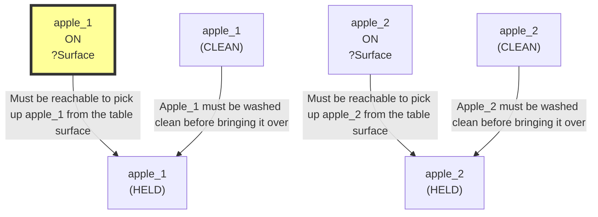
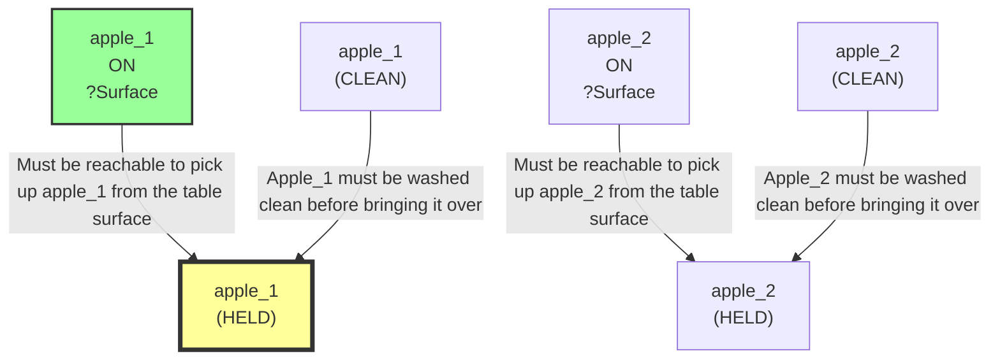
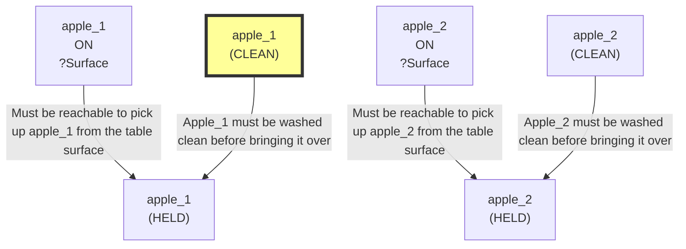

# 🚀 VirtualHome Agent Episode Log


### [GoalReasoner (Module A - Intent)] Output
```json
{
  "literal_instruction": "If there are apples on the table, wash them clean and bring them over."
}
```

### [PerceptionFilter] Output
```json
{
  "reasoning": "The goal is to wash any apples on the table and bring them over. So we must keep the target object class apple, the table surface where they are located (kitchentable), and the washing tools/appliances needed to clean them (sink, faucet, dishwashingliquid, washingsponge). Since the task involves washing, the sink-based cleanup setup is necessary; no extra unrelated objects are needed.",
  "selected_classes": [
    "dishwashingliquid",
    "sink",
    "kitchentable",
    "character",
    "washingsponge",
    "faucet",
    "apple"
  ],
  "raw_class_count": 55
}
```

### [LLMExecutor] Output
```json
{
  "reasoning": "The active goal requires washing apples that are on the table and then bringing them over. In the current graph, only one apple instance is visible: apple(437), which is DIRTY and ON kitchentable(231). The character is already CLOSE to the kitchentable, so the apple is reachable. To satisfy the cleanliness prerequisite before any pickup/transport, the next step should be to grab the apple so it can be washed at the sink next.",
  "satisfied_nodes": [],
  "current_node_focus": "N1",
  "mapped_variables": {
    "?Surface": "kitchentable(231)"
  },
  "action": "[grab] <apple> (437)"
}
```

### [RoboStateMultiTaskController] Output
```json
{
  "action": "[walk] <apple> (437)",
  "active_task_id": "task_1",
  "task_context": {
    "active_task_id": "task_1",
    "pending_task_ids": [],
    "satisfied_task_ids": []
  },
  "source": "llm_executor_repaired"
}
```
## Step 0
- **Action**: `[walk] <apple> (437)`
- **Action Success**: `True`
- **Action Message**: {'0': {'message': 'Success'}}
- **Active Task**: `task_1`
- **Decision Source**: `llm_executor_repaired`
- **Task Progress**: T3_without_goal_reasoning_G1_02=pending
- **SDG Status**:

- **Observed Items (11)**: kitchentable(231), sink(247), faucet(248) [ON], washingsponge(266), dishwashingliquid(267), apple(437) [DIRTY], character(1), bathroom(11), bedroom(73), kitchen(205), livingroom(335)


### [PerceptionFilter] Output
```json
{
  "reasoning": "Reused cached class selection.",
  "selected_classes": [
    "dishwashingliquid",
    "sink",
    "kitchentable",
    "character",
    "washingsponge",
    "faucet",
    "apple"
  ],
  "raw_class_count": 55
}
```

### [LLMExecutor] Output
```json
{
  "reasoning": "The current graph shows one apple instance in the task context: apple(437) is on the kitchen table and DIRTY. The SDG requires apples to be ON a surface, CLEAN, and then HELD. Since the apple is already close and on the table, the next required step toward satisfying the clean prerequisite is to grab it so it can be washed at the sink. I will focus on apple_1 using the observed apple(437) as the matching instance.",
  "satisfied_nodes": [
    "N1"
  ],
  "current_node_focus": "N5",
  "mapped_variables": {},
  "action": "[grab] <apple> (437)"
}
```

### [RoboStateMultiTaskController] Output
```json
{
  "action": "[grab] <apple> (437)",
  "active_task_id": "task_1",
  "task_context": {
    "active_task_id": "task_1",
    "pending_task_ids": [],
    "satisfied_task_ids": []
  },
  "source": "llm_executor"
}
```
## Step 1
- **Action**: `[grab] <apple> (437)`
- **Action Success**: `True`
- **Action Message**: {'0': {'message': 'Success'}}
- **Active Task**: `task_1`
- **Decision Source**: `llm_executor`
- **Task Progress**: T3_without_goal_reasoning_G1_02=pending
- **SDG Status**:

- **Observed Items (11)**: kitchentable(231), sink(247), faucet(248) [ON], washingsponge(266), dishwashingliquid(267), apple(437) [DIRTY], character(1), bathroom(11), bedroom(73), kitchen(205), livingroom(335)


### [PerceptionFilter] Output
```json
{
  "reasoning": "Reused cached class selection.",
  "selected_classes": [
    "dishwashingliquid",
    "sink",
    "kitchentable",
    "character",
    "washingsponge",
    "faucet",
    "apple"
  ],
  "raw_class_count": 55
}
```

### [LLMExecutor] Output
```json
{
  "reasoning": "The currently held apple(437) is dirty, and the task requires washing apples before bringing them over. Since washing requires being near a sink while holding the object, the next step is to walk to the sink. This also prepares for the subsequent wash action.",
  "satisfied_nodes": [],
  "current_node_focus": "N3",
  "mapped_variables": {
    "?Surface": "kitchentable(231)"
  },
  "action": "[walk] <sink> (247)"
}
```

### [RoboStateMultiTaskController] Output
```json
{
  "action": "[walk] <sink> (247)",
  "active_task_id": "task_1",
  "task_context": {
    "active_task_id": "task_1",
    "pending_task_ids": [],
    "satisfied_task_ids": []
  },
  "source": "llm_executor"
}
```
## Step 2
- **Action**: `[walk] <sink> (247)`
- **Action Success**: `True`
- **Action Message**: {'0': {'message': 'Success'}}
- **Active Task**: `task_1`
- **Decision Source**: `llm_executor`
- **Task Progress**: T3_without_goal_reasoning_G1_02=pending
- **SDG Status**:

- **Observed Items (11)**: kitchentable(231), sink(247), faucet(248) [ON], washingsponge(266), dishwashingliquid(267), apple(437) [DIRTY], character(1), bathroom(11), bedroom(73), kitchen(205), livingroom(335)


### [PerceptionFilter] Output
```json
{
  "reasoning": "Reused cached class selection.",
  "selected_classes": [
    "dishwashingliquid",
    "sink",
    "kitchentable",
    "character",
    "washingsponge",
    "faucet",
    "apple"
  ],
  "raw_class_count": 55
}
```

### [LLMExecutor] Output
```json
{
  "reasoning": "Apple(437) is already held and we are already close to the sink(247), so the next required step toward making it clean is to wash it at the sink. The sink is the correct washer target in the SDG context, and the apple is currently DIRTY, so washing directly addresses N3 and is a prerequisite for eventually satisfying the held state nodes for bringing it over.",
  "satisfied_nodes": [],
  "current_node_focus": "N3",
  "mapped_variables": {
    "?Surface": "kitchentable(231)"
  },
  "action": "[wash] <apple> (437)"
}
```

### [RoboStateMultiTaskController] Output
```json
{
  "action": "[wash] <apple> (437)",
  "active_task_id": "task_1",
  "task_context": {
    "active_task_id": "task_1",
    "pending_task_ids": [],
    "satisfied_task_ids": []
  },
  "source": "llm_executor"
}
```
## Step 3
- **Action**: `[wash] <apple> (437)`
- **Action Success**: `True`
- **Action Message**: Washed successfully.
- **Active Task**: `task_1`
- **Decision Source**: `llm_executor`
- **Task Progress**: T3_without_goal_reasoning_G1_02=done
- **SDG Status**:

- **Observed Items (11)**: kitchentable(231), sink(247), faucet(248) [ON], washingsponge(266), dishwashingliquid(267), apple(437) [DIRTY], character(1), bathroom(11), bedroom(73), kitchen(205), livingroom(335)

