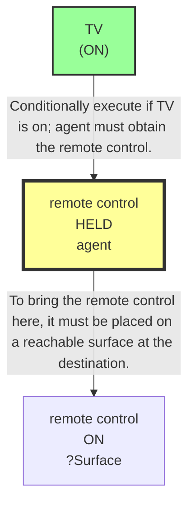

# 🚀 VirtualHome Agent Episode Log


### [GoalReasoner (Module A - Intent)] Output
```json
{
  "literal_instruction": "If the TV is on, bring the remote control here."
}
```

### [PerceptionFilter] Output
```json
{
  "reasoning": "The goal is to bring the remote control here only if the TV is on. So the necessary classes are the TV (to check the condition), the remote control (target object), and a plausible surface to place it on at the destination. A coffee table is the clearest reachable surface available; the TV stand is also a relevant surface near the TV and a valid backup surface.",
  "selected_classes": [
    "remotecontrol",
    "tv",
    "coffeetable",
    "character",
    "tvstand"
  ],
  "raw_class_count": 40
}
```

### [LLMExecutor] Output
```json
{
  "reasoning": "The TV is already ON, so the condition for this conditional task is satisfied. The next unmet SDG node is to obtain the remote control. The remotecontrol(452) is present in the livingroom and is not currently held, so I should first walk to it before attempting to grab it.",
  "satisfied_nodes": [
    "N1"
  ],
  "current_node_focus": "N2",
  "mapped_variables": {},
  "action": "[walk] <remotecontrol> (452)"
}
```

### [RoboStateMultiTaskController] Output
```json
{
  "action": "[walk] <remotecontrol> (452)",
  "active_task_id": "task_1",
  "task_context": {
    "active_task_id": "task_1",
    "pending_task_ids": [],
    "satisfied_task_ids": []
  },
  "source": "llm_executor"
}
```
## Step 0
- **Action**: `[walk] <remotecontrol> (452)`
- **Action Success**: `True`
- **Action Message**: {'0': {'message': 'Success'}}
- **Active Task**: `task_1`
- **Decision Source**: `llm_executor`
- **Task Progress**: T3_without_goal_reasoning_G1_03=pending
- **SDG Status**:

- **Observed Items (9)**: tvstand(369), coffeetable(371), tv(426) [ON], remotecontrol(452) [OFF], character(1), bathroom(11), bedroom(73), kitchen(205), livingroom(335)


### [PerceptionFilter] Output
```json
{
  "reasoning": "Reused cached class selection.",
  "selected_classes": [
    "remotecontrol",
    "tv",
    "coffeetable",
    "character",
    "tvstand"
  ],
  "raw_class_count": 40
}
```

### [LLMExecutor] Output
```json
{
  "reasoning": "The TV is already ON, so the conditional prerequisite N1 is satisfied. The remote control is already CLOSE to the agent, and it is the target object that must be brought here. To satisfy N2, the next step should be to grab the remote control. After that, we can place it on a reachable surface to satisfy N3.",
  "satisfied_nodes": [
    "N1"
  ],
  "current_node_focus": "N2",
  "mapped_variables": {},
  "action": "[grab] <remotecontrol> (452)"
}
```

### [RoboStateMultiTaskController] Output
```json
{
  "action": "[grab] <remotecontrol> (452)",
  "active_task_id": "task_1",
  "task_context": {
    "active_task_id": "task_1",
    "pending_task_ids": [],
    "satisfied_task_ids": []
  },
  "source": "llm_executor"
}
```
## Step 1
- **Action**: `[grab] <remotecontrol> (452)`
- **Action Success**: `True`
- **Action Message**: {'0': {'message': 'Success'}}
- **Active Task**: `task_1`
- **Decision Source**: `llm_executor`
- **Task Progress**: T3_without_goal_reasoning_G1_03=done
- **SDG Status**:

- **Observed Items (9)**: tvstand(369), coffeetable(371), tv(426) [ON], remotecontrol(452) [OFF], character(1), bathroom(11), bedroom(73), kitchen(205), livingroom(335)

