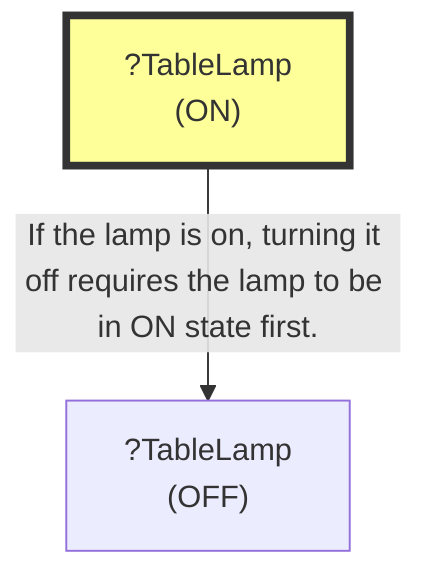
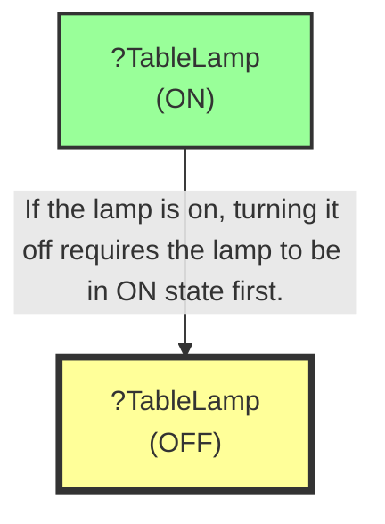

# 🚀 VirtualHome Agent Episode Log


### [GoalReasoner (Module A - Intent)] Output
```json
{
  "literal_instruction": "If the table lamp is on, turn it off."
}
```

### [PerceptionFilter] Output
```json
{
  "reasoning": "The goal is to turn off the table lamp if it is on, so the only required object class is the target lamp itself. No other tools or locations are needed because the action is directly applied to the lamp.",
  "selected_classes": [
    "tablelamp",
    "character"
  ],
  "raw_class_count": 33
}
```

### [LLMExecutor] Output
```json
{
  "reasoning": "The goal is conditional: if a table lamp is ON, turn it OFF. The filtered graph shows two ON table lamps in the current bedroom. Either could satisfy the instruction, but the safest immediate progress is to approach one of the ON lamps so it can be switched off next. Since interaction requires proximity and no prior walk was done, the next atomic action should be to walk to one lamp.",
  "satisfied_nodes": [],
  "current_node_focus": "N1",
  "mapped_variables": {
    "?TableLamp": "tablelamp(102)"
  },
  "action": "[walk] <tablelamp> (102)"
}
```

### [RoboStateMultiTaskController] Output
```json
{
  "action": "[walk] <tablelamp> (102)",
  "active_task_id": "task_1",
  "task_context": {
    "active_task_id": "task_1",
    "pending_task_ids": [],
    "satisfied_task_ids": []
  },
  "source": "llm_executor"
}
```
## Step 0
- **Action**: `[walk] <tablelamp> (102)`
- **Action Success**: `True`
- **Action Message**: {'0': {'message': 'Success'}}
- **Active Task**: `task_1`
- **Decision Source**: `llm_executor`
- **Task Progress**: T3_without_goal_reasoning_G1_04=pending
- **SDG Status**:

- **Observed Items (7)**: tablelamp(102) [ON], tablelamp(103) [ON], character(1), bathroom(11), bedroom(73), kitchen(205), livingroom(335)


### [PerceptionFilter] Output
```json
{
  "reasoning": "Reused cached class selection.",
  "selected_classes": [
    "tablelamp",
    "character"
  ],
  "raw_class_count": 33
}
```

### [LLMExecutor] Output
```json
{
  "reasoning": "The goal is to make the table lamp OFF. The SDG indicates the prerequisite ON state is already satisfied for tablelamp(102). I am already close to tablelamp(102), and it has a switch, so the next atomic action is to turn it off. I will target the lamp instance I am currently near and has the ON state.",
  "satisfied_nodes": [
    "N1"
  ],
  "current_node_focus": "N2",
  "mapped_variables": {
    "?TableLamp": "tablelamp(102)"
  },
  "action": "[switchoff] <tablelamp> (102)"
}
```

### [RoboStateMultiTaskController] Output
```json
{
  "action": "[switchoff] <tablelamp> (102)",
  "active_task_id": "task_1",
  "task_context": {
    "active_task_id": "task_1",
    "pending_task_ids": [],
    "satisfied_task_ids": []
  },
  "source": "llm_executor"
}
```
## Step 1
- **Action**: `[switchoff] <tablelamp> (102)`
- **Action Success**: `True`
- **Action Message**: Faked switch operation in Python layer (bypassed Unity failure)
- **Active Task**: `task_1`
- **Decision Source**: `llm_executor`
- **Task Progress**: T3_without_goal_reasoning_G1_04=done
- **SDG Status**:

- **Observed Items (7)**: tablelamp(102) [ON], tablelamp(103) [ON], character(1), bathroom(11), bedroom(73), kitchen(205), livingroom(335)

