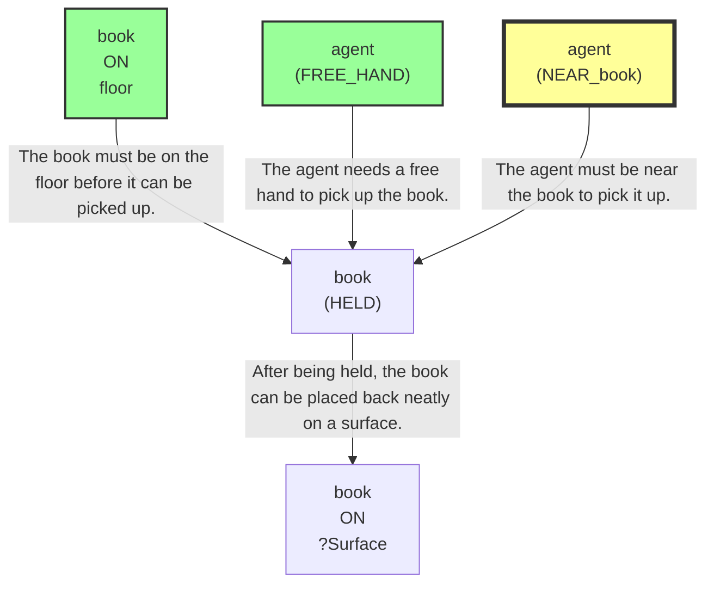
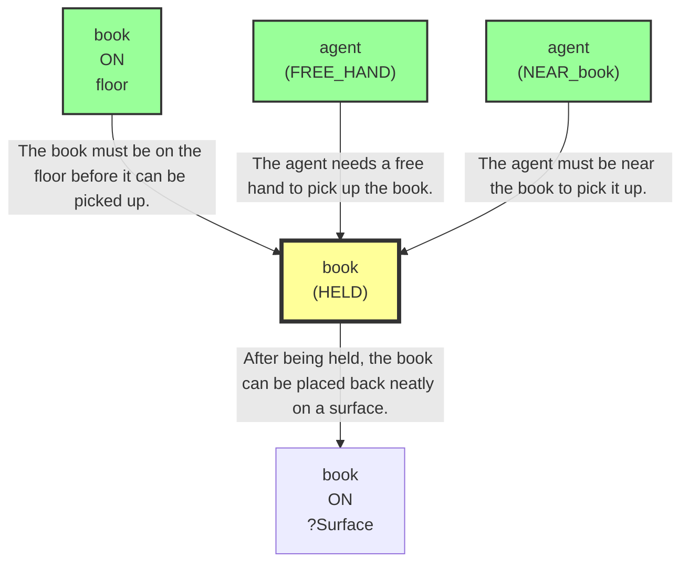
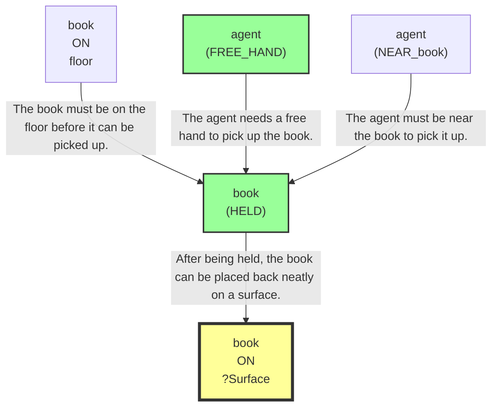
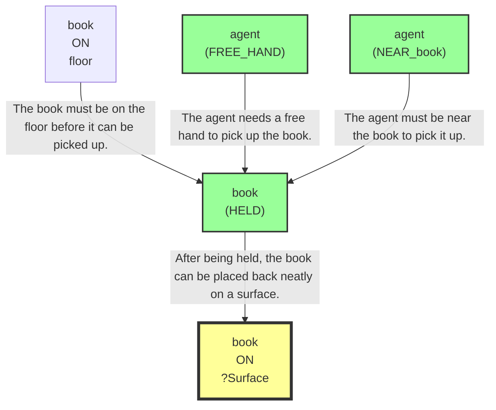
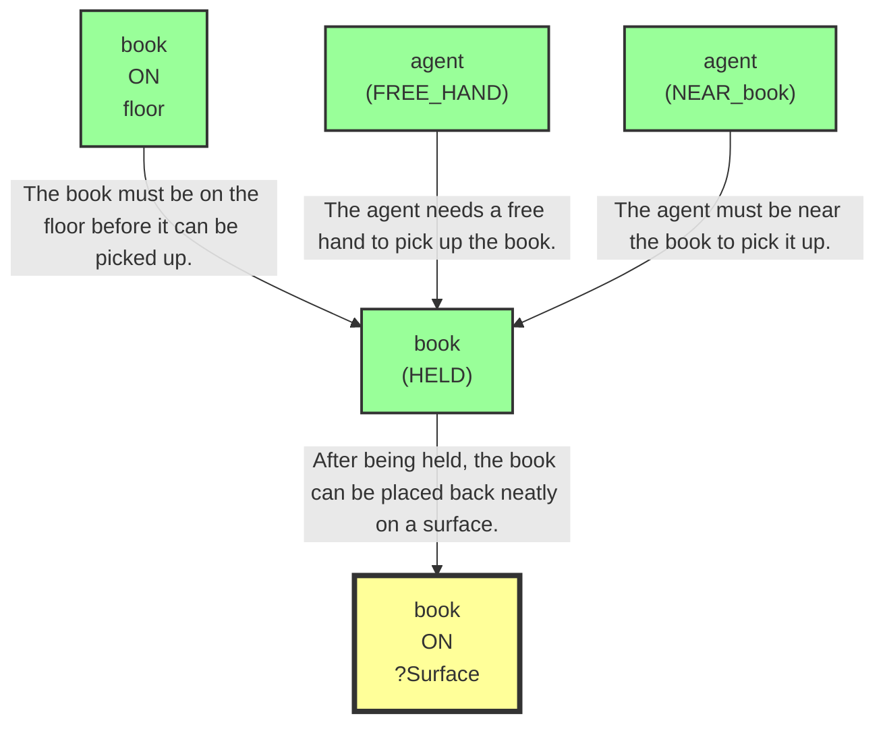
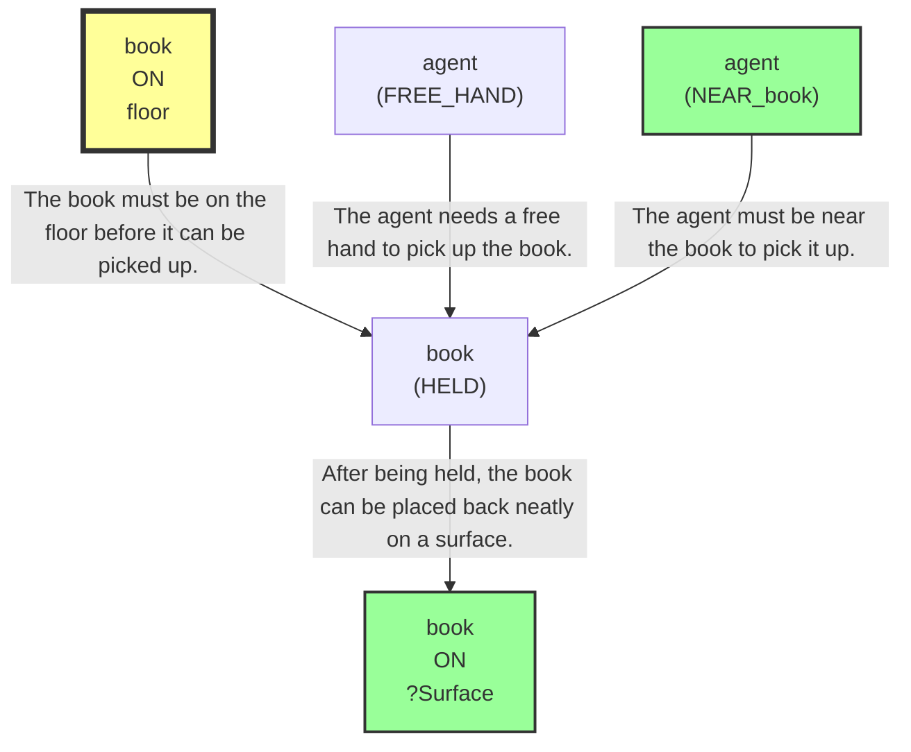
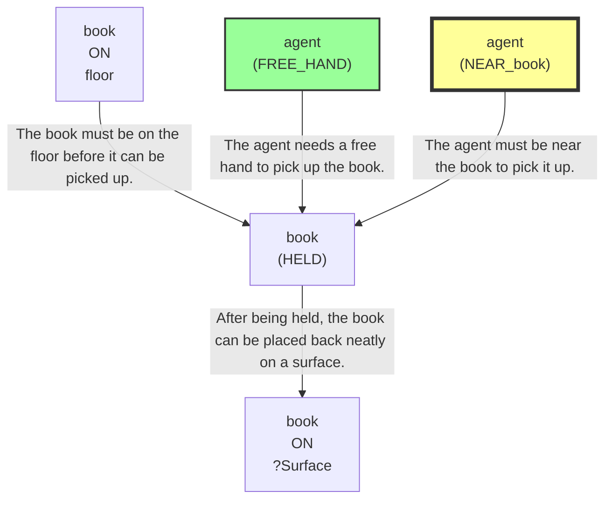
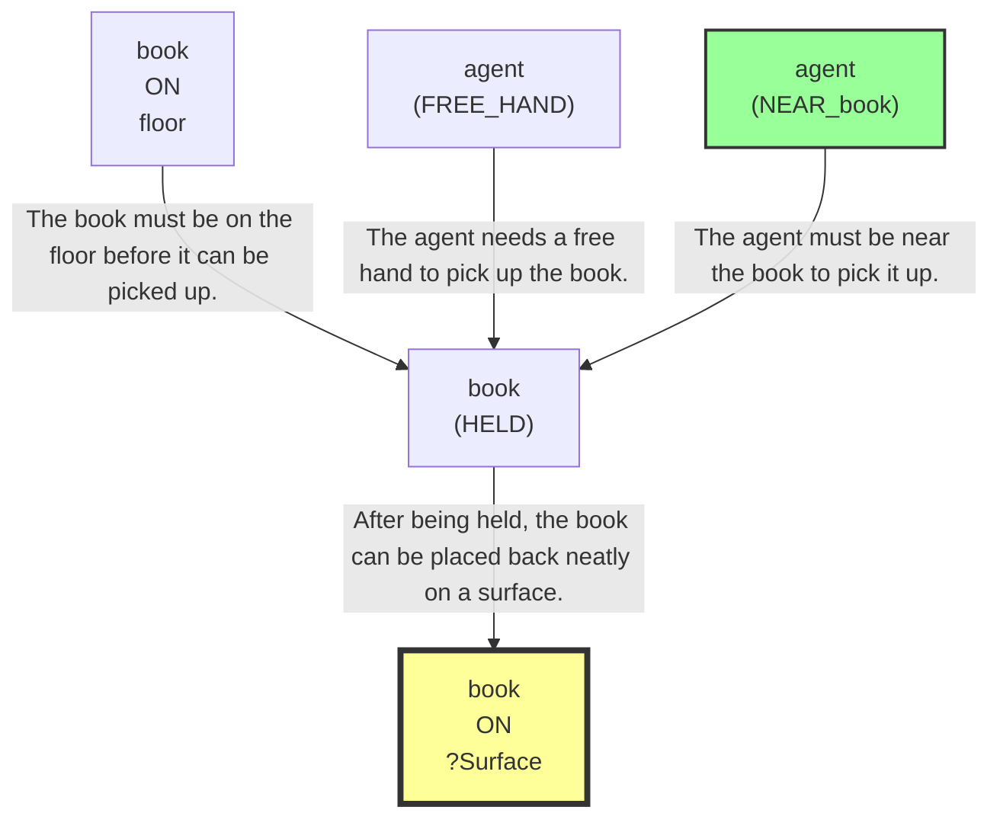
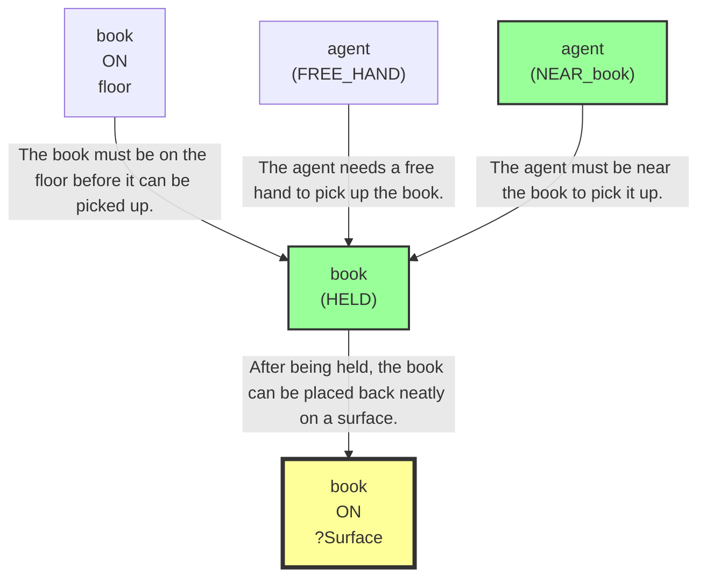

# 🚀 VirtualHome Agent Episode Log


### [GoalReasoner (Module A - Intent)] Output
```json
{
  "literal_instruction": "If the book falls on the floor, please pick it up and put it back neatly."
}
```

### [PerceptionFilter] Output
```json
{
  "reasoning": "The goal only requires the book itself and the relevant place to put it back neatly. From the SDG, the book must be on the floor, held, then placed on a surface; the visible suitable surfaces/receptacles for putting it back neatly include the bookshelf, box, cabinet, coffeetable, desk, and floor as the explicit starting location. Other objects are irrelevant.",
  "selected_classes": [
    "book",
    "box",
    "cabinet",
    "character",
    "floor",
    "coffeetable",
    "bookshelf",
    "desk"
  ],
  "raw_class_count": 41
}
```

### [LLMExecutor] Output
```json
{
  "reasoning": "The goal requires handling a book that is currently on the floor, then placing it neatly on a surface. The current graph shows three books on the floor; any of them can satisfy the condition, and book(190) is a valid grabbable instance. The agent is already close to the coffeetable, but not explicitly near the book, so the next required step is to move next to the book before grabbing it. This advances toward satisfying N4 (near book) and enables N2 (held).",
  "satisfied_nodes": [
    "N1",
    "N5"
  ],
  "current_node_focus": "N4",
  "mapped_variables": {},
  "action": "[walk] <book> (190)"
}
```

### [RoboStateMultiTaskController] Output
```json
{
  "action": "[walk] <book> (190)",
  "active_task_id": "task_1",
  "task_context": {
    "active_task_id": "task_1",
    "pending_task_ids": [],
    "satisfied_task_ids": []
  },
  "source": "llm_executor"
}
```
## Step 0
- **Action**: `[walk] <book> (190)`
- **Action Success**: `True`
- **Action Message**: {'0': {'message': 'Success'}}
- **Active Task**: `task_1`
- **Decision Source**: `llm_executor`
- **Task Progress**: T3_without_goal_reasoning_G2_09=pending
- **SDG Status**:

- **Observed Items (22)**: floor(336), floor(337), floor(338), floor(339), floor(340), floor(341), floor(342), floor(343), floor(344), bookshelf(370), coffeetable(371), desk(373) [CLOSED], cabinet(415) [CLOSED], box(435) [CLOSED], book(190) [CLOSED]...


### [PerceptionFilter] Output
```json
{
  "reasoning": "Reused cached class selection.",
  "selected_classes": [
    "book",
    "box",
    "cabinet",
    "character",
    "floor",
    "coffeetable",
    "bookshelf",
    "desk"
  ],
  "raw_class_count": 41
}
```

### [LLMExecutor] Output
```json
{
  "reasoning": "The active task is to pick up the book if it is on the floor and put it back neatly. The graph shows book(190) is on the floor and the agent is already close to it, but the book is not yet held. Since the next prerequisite for satisfying N2 is to grab the target book, and we have a free hand requirement in the SDG, the best next atomic action is to pick up book(190).",
  "satisfied_nodes": [
    "N1",
    "N4",
    "N5"
  ],
  "current_node_focus": "N2",
  "mapped_variables": {},
  "action": "[grab] <book> (190)"
}
```

### [RoboStateMultiTaskController] Output
```json
{
  "action": "[grab] <book> (190)",
  "active_task_id": "task_1",
  "task_context": {
    "active_task_id": "task_1",
    "pending_task_ids": [],
    "satisfied_task_ids": []
  },
  "source": "llm_executor"
}
```
## Step 1
- **Action**: `[grab] <book> (190)`
- **Action Success**: `True`
- **Action Message**: {'0': {'message': 'Success'}}
- **Active Task**: `task_1`
- **Decision Source**: `llm_executor`
- **Task Progress**: T3_without_goal_reasoning_G2_09=pending
- **SDG Status**:

- **Observed Items (22)**: floor(336), floor(337), floor(338), floor(339), floor(340), floor(341), floor(342), floor(343), floor(344), bookshelf(370), coffeetable(371), desk(373) [CLOSED], cabinet(415) [CLOSED], box(435) [CLOSED], book(190) [CLOSED]...


### [PerceptionFilter] Output
```json
{
  "reasoning": "Reused cached class selection.",
  "selected_classes": [
    "book",
    "box",
    "cabinet",
    "character",
    "floor",
    "coffeetable",
    "bookshelf",
    "desk"
  ],
  "raw_class_count": 41
}
```

### [LLMExecutor] Output
```json
{
  "reasoning": "The active book is already held in the right hand (book(190)), so N2 is satisfied and the agent has a free hand available for placing it down. To satisfy the remaining goal, I need to put the book neatly onto a suitable surface. The nearest appropriate flat surface in the current graph is the coffeetable(371), and I must explicitly walk to it before placing the book. Since the task is to put the book back neatly, the next step is to approach that surface.",
  "satisfied_nodes": [
    "N2",
    "N5"
  ],
  "current_node_focus": "N3",
  "mapped_variables": {
    "?Surface": "coffeetable(371)"
  },
  "action": "[walk] <coffeetable> (371)"
}
```

### [RoboStateMultiTaskController] Output
```json
{
  "action": "[walk] <coffeetable> (371)",
  "active_task_id": "task_1",
  "task_context": {
    "active_task_id": "task_1",
    "pending_task_ids": [],
    "satisfied_task_ids": []
  },
  "source": "llm_executor"
}
```
## Step 2
- **Action**: `[walk] <coffeetable> (371)`
- **Action Success**: `True`
- **Action Message**: {'0': {'message': 'Success'}}
- **Active Task**: `task_1`
- **Decision Source**: `llm_executor`
- **Task Progress**: T3_without_goal_reasoning_G2_09=pending
- **SDG Status**:

- **Observed Items (22)**: floor(336), floor(337), floor(338), floor(339), floor(340), floor(341), floor(342), floor(343), floor(344), bookshelf(370), coffeetable(371), desk(373) [CLOSED], cabinet(415) [CLOSED], box(435) [CLOSED], book(190) [CLOSED]...


### [PerceptionFilter] Output
```json
{
  "reasoning": "Reused cached class selection.",
  "selected_classes": [
    "book",
    "box",
    "cabinet",
    "character",
    "floor",
    "coffeetable",
    "bookshelf",
    "desk"
  ],
  "raw_class_count": 41
}
```

### [LLMExecutor] Output
```json
{
  "reasoning": "The active task concerns book(190), which is currently already held by the agent (character(1) has HOLDS_RH book(190)). The next unmet SDG node is N3: place the book back neatly on a suitable surface. We are already near the coffeetable(371) from the previous walk, and it is a valid flat surface for putting the book down. Therefore the next atomic action is to place the held book onto the coffeetable.",
  "satisfied_nodes": [
    "N2",
    "N4",
    "N5"
  ],
  "current_node_focus": "N3",
  "mapped_variables": {
    "?Surface": "coffeetable(371)"
  },
  "action": "[putback] <book> (190) <coffeetable> (371)"
}
```

### [RoboStateMultiTaskController] Output
```json
{
  "action": "[putback] <book> (190) <coffeetable> (371)",
  "active_task_id": "task_1",
  "task_context": {
    "active_task_id": "task_1",
    "pending_task_ids": [],
    "satisfied_task_ids": []
  },
  "source": "llm_executor"
}
```
## Step 3
- **Action**: `[putback] <book> (190) <coffeetable> (371)`
- **Action Success**: `True`
- **Action Message**: {'0': {'message': 'Success'}}
- **Active Task**: `task_1`
- **Decision Source**: `llm_executor`
- **Task Progress**: T3_without_goal_reasoning_G2_09=pending
- **SDG Status**:

- **Observed Items (22)**: floor(336), floor(337), floor(338), floor(339), floor(340), floor(341), floor(342), floor(343), floor(344), bookshelf(370), coffeetable(371), desk(373) [CLOSED], cabinet(415) [CLOSED], box(435) [CLOSED], book(190) [CLOSED]...


### [PerceptionFilter] Output
```json
{
  "reasoning": "Reused cached class selection.",
  "selected_classes": [
    "book",
    "box",
    "cabinet",
    "character",
    "floor",
    "coffeetable",
    "bookshelf",
    "desk"
  ],
  "raw_class_count": 41
}
```

### [LLMExecutor] Output
```json
{
  "reasoning": "The active task is already satisfied in its essential outcome: the book that fell on the floor has been picked up and placed back neatly on a surface. The current graph shows book(190) on coffeetable(371), and the past actions confirm it was grabbed and put back. Since the goal intent is conditional and the condition has been resolved with the book returned to a surface, no further action is needed toward the SDG.",
  "satisfied_nodes": [
    "N1",
    "N2",
    "N3",
    "N4",
    "N5"
  ],
  "current_node_focus": "N3",
  "mapped_variables": {
    "?Surface": "coffeetable(371)"
  },
  "action": "[wait]"
}
```

### [RoboStateMultiTaskController] Output
```json
{
  "action": "[wait]",
  "active_task_id": "task_1",
  "task_context": {
    "active_task_id": "task_1",
    "pending_task_ids": [],
    "satisfied_task_ids": []
  },
  "source": "llm_executor"
}
```
## Step 4
- **Action**: `[wait]`
- **Action Success**: `True`
- **Action Message**: Time passes. You waited for a while.
- **Active Task**: `task_1`
- **Decision Source**: `llm_executor`
- **Task Progress**: T3_without_goal_reasoning_G2_09=pending
- **SDG Status**:

- **Observed Items (22)**: floor(336), floor(337), floor(338), floor(339), floor(340), floor(341), floor(342), floor(343), floor(344), bookshelf(370), coffeetable(371), desk(373) [CLOSED], cabinet(415) [CLOSED], box(435) [CLOSED], book(190) [CLOSED]...


### [PerceptionFilter] Output
```json
{
  "reasoning": "Reused cached class selection.",
  "selected_classes": [
    "book",
    "box",
    "cabinet",
    "character",
    "floor",
    "coffeetable",
    "bookshelf",
    "desk"
  ],
  "raw_class_count": 41
}
```

### [LLMExecutor] Output
```json
{
  "reasoning": "The book from the past interaction (book 190) is currently on the coffeetable, not on the floor, so the prerequisite-floor condition N1 is not satisfied. Since the task is conditional ('If the book falls on the floor...'), there is nothing to repair right now. The closest sensible interpretation is to leave the book neatly on a surface, which is already true. No further action is needed toward this active task from the current state, and repeating walk/grab/putback would not improve progress.",
  "satisfied_nodes": [
    "N3",
    "N4"
  ],
  "current_node_focus": "N1",
  "mapped_variables": {
    "?Surface": "coffeetable(371)"
  },
  "action": "[wait]"
}
```

### [RoboStateMultiTaskController] Output
```json
{
  "action": "[wait]",
  "active_task_id": "task_1",
  "task_context": {
    "active_task_id": "task_1",
    "pending_task_ids": [],
    "satisfied_task_ids": []
  },
  "source": "llm_executor"
}
```
## Step 5
- **Action**: `[wait]`
- **Action Success**: `True`
- **Action Message**: Time passes. You waited for a while.
- **Active Task**: `task_1`
- **Decision Source**: `llm_executor`
- **Task Progress**: T3_without_goal_reasoning_G2_09=pending
- **SDG Status**:

- **Observed Items (22)**: floor(336), floor(337), floor(338), floor(339), floor(340), floor(341), floor(342), floor(343), floor(344), bookshelf(370), coffeetable(371), desk(373) [CLOSED], cabinet(415) [CLOSED], box(435) [CLOSED], book(190) [CLOSED]...


### [PerceptionFilter] Output
```json
{
  "reasoning": "Reused cached class selection.",
  "selected_classes": [
    "book",
    "box",
    "cabinet",
    "character",
    "floor",
    "coffeetable",
    "bookshelf",
    "desk"
  ],
  "raw_class_count": 41
}
```

### [LLMExecutor] Output
```json
{
  "reasoning": "The book was already picked up and then placed neatly on the coffeetable, which satisfies the intended outcome after the floor-fall recovery. The current graph shows book(190) on coffeetable(371) and close to the character, so the cleanup task is effectively complete. No further physical action is needed, and repeating walk would be unnecessary.",
  "satisfied_nodes": [
    "N1",
    "N2",
    "N3",
    "N4",
    "N5"
  ],
  "current_node_focus": "N3",
  "mapped_variables": {
    "?Surface": "coffeetable(371)"
  },
  "action": "[wait]"
}
```

### [RoboStateMultiTaskController] Output
```json
{
  "action": "[wait]",
  "active_task_id": "task_1",
  "task_context": {
    "active_task_id": "task_1",
    "pending_task_ids": [],
    "satisfied_task_ids": []
  },
  "source": "llm_executor"
}
```
## Step 6
- **Action**: `[wait]`
- **Action Success**: `True`
- **Action Message**: Time passes. You waited for a while.
- **Active Task**: `task_1`
- **Decision Source**: `llm_executor`
- **Task Progress**: T3_without_goal_reasoning_G2_09=pending
- **SDG Status**:

- **Observed Items (22)**: floor(336), floor(337), floor(338), floor(339), floor(340), floor(341), floor(342), floor(343), floor(344), bookshelf(370), coffeetable(371), desk(373) [CLOSED], cabinet(415) [CLOSED], box(435) [CLOSED], book(190) [CLOSED]...


### [PerceptionFilter] Output
```json
{
  "reasoning": "Reused cached class selection.",
  "selected_classes": [
    "book",
    "box",
    "cabinet",
    "character",
    "floor",
    "coffeetable",
    "bookshelf",
    "desk"
  ],
  "raw_class_count": 41
}
```

### [LLMExecutor] Output
```json
{
  "reasoning": "The active task is to pick up the book only if it is on the floor, then put it back neatly. The current graph shows book(190) is on the coffeetable, not on the floor, so the prerequisite N1 is not satisfied for this book instance. However, the environment also contains book(191) and book(268) on the floor, which satisfy the trigger condition. Since the task refers generically to 'the book' and the closest floor book should be handled, I will first move near a floor book to prepare for pickup. The closest candidate consistent with the goal is book(191) on the floor.",
  "satisfied_nodes": [
    "N4",
    "N5"
  ],
  "current_node_focus": "N4",
  "mapped_variables": {},
  "action": "[walk] <book> (191)"
}
```

### [RoboStateMultiTaskController] Output
```json
{
  "action": "[walk] <book> (191)",
  "active_task_id": "task_1",
  "task_context": {
    "active_task_id": "task_1",
    "pending_task_ids": [],
    "satisfied_task_ids": []
  },
  "source": "llm_executor"
}
```
## Step 7
- **Action**: `[walk] <book> (191)`
- **Action Success**: `True`
- **Action Message**: {'0': {'message': 'Success'}}
- **Active Task**: `task_1`
- **Decision Source**: `llm_executor`
- **Task Progress**: T3_without_goal_reasoning_G2_09=pending
- **SDG Status**:

- **Observed Items (22)**: floor(336), floor(337), floor(338), floor(339), floor(340), floor(341), floor(342), floor(343), floor(344), bookshelf(370), coffeetable(371), desk(373) [CLOSED], cabinet(415) [CLOSED], box(435) [CLOSED], book(190) [CLOSED]...


### [PerceptionFilter] Output
```json
{
  "reasoning": "Reused cached class selection.",
  "selected_classes": [
    "book",
    "box",
    "cabinet",
    "character",
    "floor",
    "coffeetable",
    "bookshelf",
    "desk"
  ],
  "raw_class_count": 41
}
```

### [LLMExecutor] Output
```json
{
  "reasoning": "The current likely target is book(191), which is on the floor and close to the agent. The goal requires picking it up and then placing it neatly on a surface. We already walked to book(191) in the previous step, so the next atomic action should be to grab it. This satisfies the prerequisite for N1->N2 progression and uses the currently free hand.",
  "satisfied_nodes": [
    "N1",
    "N4",
    "N5"
  ],
  "current_node_focus": "N2",
  "mapped_variables": {},
  "action": "[grab] <book> (191)"
}
```

### [RoboStateMultiTaskController] Output
```json
{
  "action": "[grab] <book> (191)",
  "active_task_id": "task_1",
  "task_context": {
    "active_task_id": "task_1",
    "pending_task_ids": [],
    "satisfied_task_ids": []
  },
  "source": "llm_executor"
}
```
## Step 8
- **Action**: `[grab] <book> (191)`
- **Action Success**: `True`
- **Action Message**: {'0': {'message': 'Success'}}
- **Active Task**: `task_1`
- **Decision Source**: `llm_executor`
- **Task Progress**: T3_without_goal_reasoning_G2_09=pending
- **SDG Status**:

- **Observed Items (22)**: floor(336), floor(337), floor(338), floor(339), floor(340), floor(341), floor(342), floor(343), floor(344), bookshelf(370), coffeetable(371), desk(373) [CLOSED], cabinet(415) [CLOSED], box(435) [CLOSED], book(190) [CLOSED]...


### [PerceptionFilter] Output
```json
{
  "reasoning": "Reused cached class selection.",
  "selected_classes": [
    "book",
    "box",
    "cabinet",
    "character",
    "floor",
    "coffeetable",
    "bookshelf",
    "desk"
  ],
  "raw_class_count": 41
}
```

### [LLMExecutor] Output
```json
{
  "reasoning": "The SDG requires the book to be on the floor, then held, then placed neatly on a surface. The current graph shows book(191) is already held by the agent, so N2 is satisfied and the agent is in a position to proceed to the placement step. To satisfy N3, I need to choose a surface; the coffeetable is the natural neat placement target and is already a valid flat surface. Because putback requires being walked to the destination immediately before placing, the next atomic step should be to walk to the coffeetable before putting the book down.",
  "satisfied_nodes": [
    "N2",
    "N5",
    "N4"
  ],
  "current_node_focus": "N3",
  "mapped_variables": {
    "?Surface": "coffeetable(371)"
  },
  "action": "[walk] <coffeetable> (371)"
}
```

### [RoboStateMultiTaskController] Output
```json
{
  "action": "[walk] <coffeetable> (371)",
  "active_task_id": "task_1",
  "task_context": {
    "active_task_id": "task_1",
    "pending_task_ids": [],
    "satisfied_task_ids": []
  },
  "source": "llm_executor"
}
```
## Step 9
- **Action**: `[walk] <coffeetable> (371)`
- **Action Success**: `True`
- **Action Message**: {'0': {'message': 'Success'}}
- **Active Task**: `task_1`
- **Decision Source**: `llm_executor`
- **Task Progress**: T3_without_goal_reasoning_G2_09=pending
- **SDG Status**:

- **Observed Items (22)**: floor(336), floor(337), floor(338), floor(339), floor(340), floor(341), floor(342), floor(343), floor(344), bookshelf(370), coffeetable(371), desk(373) [CLOSED], cabinet(415) [CLOSED], box(435) [CLOSED], book(190) [CLOSED]...


### [PerceptionFilter] Output
```json
{
  "reasoning": "Reused cached class selection.",
  "selected_classes": [
    "book",
    "box",
    "cabinet",
    "character",
    "floor",
    "coffeetable",
    "bookshelf",
    "desk"
  ],
  "raw_class_count": 41
}
```

### [LLMExecutor] Output
```json
{
  "reasoning": "The active task is to pick up the book if it is on the floor and put it back neatly. The graph shows book(191) is currently held by the character, while book(190) is on the coffeetable and is close to the agent. Since the only book on the floor is book(268), but the recent interaction indicates the relevant book being handled is the nearby book instance and the task requires placing the book back neatly after holding it, the next required step is to place the held book onto a suitable flat surface. The agent is already at the coffeetable, which is a valid flat surface, so the immediate action is to put the held book back on the coffeetable.",
  "satisfied_nodes": [
    "N4"
  ],
  "current_node_focus": "N3",
  "mapped_variables": {},
  "action": "[putback] <book> (191) <coffeetable> (371)"
}
```

### [RoboStateMultiTaskController] Output
```json
{
  "action": "[putback] <book> (191) <coffeetable> (371)",
  "active_task_id": "task_1",
  "task_context": {
    "active_task_id": "task_1",
    "pending_task_ids": [],
    "satisfied_task_ids": []
  },
  "source": "llm_executor"
}
```
## Step 10
- **Action**: `[putback] <book> (191) <coffeetable> (371)`
- **Action Success**: `True`
- **Action Message**: {'0': {'message': 'Success'}}
- **Active Task**: `task_1`
- **Decision Source**: `llm_executor`
- **Task Progress**: T3_without_goal_reasoning_G2_09=pending
- **SDG Status**:

- **Observed Items (22)**: floor(336), floor(337), floor(338), floor(339), floor(340), floor(341), floor(342), floor(343), floor(344), bookshelf(370), coffeetable(371), desk(373) [CLOSED], cabinet(415) [CLOSED], box(435) [CLOSED], book(190) [CLOSED]...


### [PerceptionFilter] Output
```json
{
  "reasoning": "Reused cached class selection.",
  "selected_classes": [
    "book",
    "box",
    "cabinet",
    "character",
    "floor",
    "coffeetable",
    "bookshelf",
    "desk"
  ],
  "raw_class_count": 41
}
```

### [LLMExecutor] Output
```json
{
  "reasoning": "The task condition is currently satisfied for a book on the floor: book(268) is on floor(336), matching N1. The previous book instances (190, 191) have already been placed on the coffeetable, so the remaining unmet step is to pick up the book on the floor and then later place it neatly on a surface. I will focus on the floor book instance because it is the only one matching the trigger condition and is not yet handled.",
  "satisfied_nodes": [
    "N1",
    "N5"
  ],
  "current_node_focus": "N4",
  "mapped_variables": {
    "?Surface": "coffeetable(371)"
  },
  "action": "[walk] <book> (268)"
}
```

### [RoboStateMultiTaskController] Output
```json
{
  "action": "[walk] <book> (268)",
  "active_task_id": "task_1",
  "task_context": {
    "active_task_id": "task_1",
    "pending_task_ids": [],
    "satisfied_task_ids": []
  },
  "source": "llm_executor"
}
```
## Step 11
- **Action**: `[walk] <book> (268)`
- **Action Success**: `True`
- **Action Message**: {'0': {'message': 'Success'}}
- **Active Task**: `task_1`
- **Decision Source**: `llm_executor`
- **Task Progress**: T3_without_goal_reasoning_G2_09=pending
- **SDG Status**:

- **Observed Items (22)**: floor(336), floor(337), floor(338), floor(339), floor(340), floor(341), floor(342), floor(343), floor(344), bookshelf(370), coffeetable(371), desk(373) [CLOSED], cabinet(415) [CLOSED], box(435) [CLOSED], book(190) [CLOSED]...


### [PerceptionFilter] Output
```json
{
  "reasoning": "Reused cached class selection.",
  "selected_classes": [
    "book",
    "box",
    "cabinet",
    "character",
    "floor",
    "coffeetable",
    "bookshelf",
    "desk"
  ],
  "raw_class_count": 41
}
```

### [LLMExecutor] Output
```json
{
  "reasoning": "The active task is to pick up the book if it is on the floor and put it back neatly. The current graph shows book(268) is on the floor and close to the agent, while the agent is already near it from the previous walk. The next required step in the SDG is to satisfy the HELD state by grabbing the book; the agent also has at least one free hand since no held objects are shown.",
  "satisfied_nodes": [
    "N1",
    "N4",
    "N5"
  ],
  "current_node_focus": "N2",
  "mapped_variables": {},
  "action": "[grab] <book> (268)"
}
```

### [RoboStateMultiTaskController] Output
```json
{
  "action": "[grab] <book> (268)",
  "active_task_id": "task_1",
  "task_context": {
    "active_task_id": "task_1",
    "pending_task_ids": [],
    "satisfied_task_ids": []
  },
  "source": "llm_executor"
}
```
## Step 12
- **Action**: `[grab] <book> (268)`
- **Action Success**: `True`
- **Action Message**: {'0': {'message': 'Success'}}
- **Active Task**: `task_1`
- **Decision Source**: `llm_executor`
- **Task Progress**: T3_without_goal_reasoning_G2_09=pending
- **SDG Status**:

- **Observed Items (22)**: floor(336), floor(337), floor(338), floor(339), floor(340), floor(341), floor(342), floor(343), floor(344), bookshelf(370), coffeetable(371), desk(373) [CLOSED], cabinet(415) [CLOSED], box(435) [CLOSED], book(190) [CLOSED]...


### [PerceptionFilter] Output
```json
{
  "reasoning": "Reused cached class selection.",
  "selected_classes": [
    "book",
    "box",
    "cabinet",
    "character",
    "floor",
    "coffeetable",
    "bookshelf",
    "desk"
  ],
  "raw_class_count": 41
}
```

### [LLMExecutor] Output
```json
{
  "reasoning": "The active book to manipulate is book(268), and the graph shows the agent is currently close to it and holding it in the right hand. The task requires picking up the book and putting it back neatly on some surface. Since the book is already held, the next needed step is to place it onto a suitable flat surface; coffeetable(371) is a valid surface and was previously used successfully. I should therefore walk to the surface before putting it back, per proximity rules.",
  "satisfied_nodes": [
    "N2",
    "N4"
  ],
  "current_node_focus": "N3",
  "mapped_variables": {
    "?Surface": "coffeetable(371)"
  },
  "action": "[walk] <coffeetable> (371)"
}
```

### [RoboStateMultiTaskController] Output
```json
{
  "action": "[walk] <coffeetable> (371)",
  "active_task_id": "task_1",
  "task_context": {
    "active_task_id": "task_1",
    "pending_task_ids": [],
    "satisfied_task_ids": []
  },
  "source": "llm_executor"
}
```
## Step 13
- **Action**: `[walk] <coffeetable> (371)`
- **Action Success**: `True`
- **Action Message**: {'0': {'message': 'Success'}}
- **Active Task**: `task_1`
- **Decision Source**: `llm_executor`
- **Task Progress**: T3_without_goal_reasoning_G2_09=pending
- **SDG Status**:

- **Observed Items (22)**: floor(336), floor(337), floor(338), floor(339), floor(340), floor(341), floor(342), floor(343), floor(344), bookshelf(370), coffeetable(371), desk(373) [CLOSED], cabinet(415) [CLOSED], box(435) [CLOSED], book(190) [CLOSED]...


### [PerceptionFilter] Output
```json
{
  "reasoning": "Reused cached class selection.",
  "selected_classes": [
    "book",
    "box",
    "cabinet",
    "character",
    "floor",
    "coffeetable",
    "bookshelf",
    "desk"
  ],
  "raw_class_count": 41
}
```

### [LLMExecutor] Output
```json
{
  "reasoning": "The current goal requires the book to be picked up and put back neatly after it has fallen on the floor. In the current graph, the book is not on the floor; book(268) is already held by the agent, while book(190) and book(191) are on the coffeetable. Since the instruction is conditional and the floor condition is not currently satisfied for any visible book, the safest progress is to continue with the already-held book(268) and place it neatly on a surface. We are already walked to the coffeetable in the previous step, so the next atomic action is to put the held book onto that nearby flat surface.",
  "satisfied_nodes": [
    "N4",
    "N5",
    "N2"
  ],
  "current_node_focus": "N3",
  "mapped_variables": {
    "?Surface": "coffeetable(371)"
  },
  "action": "[putback] <book> (268) <coffeetable> (371)"
}
```

### [RoboStateMultiTaskController] Output
```json
{
  "action": "[putback] <book> (268) <coffeetable> (371)",
  "active_task_id": "task_1",
  "task_context": {
    "active_task_id": "task_1",
    "pending_task_ids": [],
    "satisfied_task_ids": []
  },
  "source": "llm_executor"
}
```
## Step 14
- **Action**: `[putback] <book> (268) <coffeetable> (371)`
- **Action Success**: `True`
- **Action Message**: {'0': {'message': 'Success'}}
- **Active Task**: `task_1`
- **Decision Source**: `llm_executor`
- **Task Progress**: T3_without_goal_reasoning_G2_09=pending
- **SDG Status**:

- **Observed Items (22)**: floor(336), floor(337), floor(338), floor(339), floor(340), floor(341), floor(342), floor(343), floor(344), bookshelf(370), coffeetable(371), desk(373) [CLOSED], cabinet(415) [CLOSED], box(435) [CLOSED], book(190) [CLOSED]...

