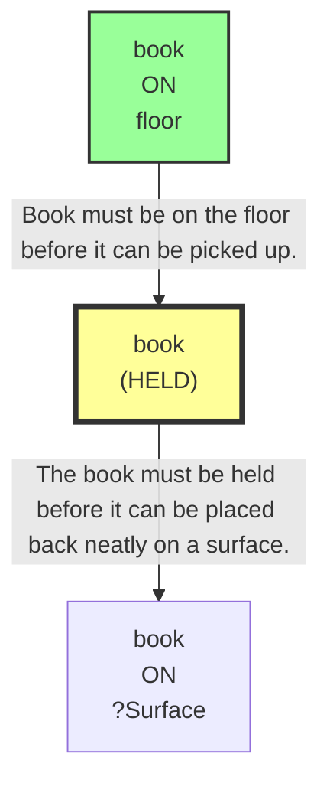
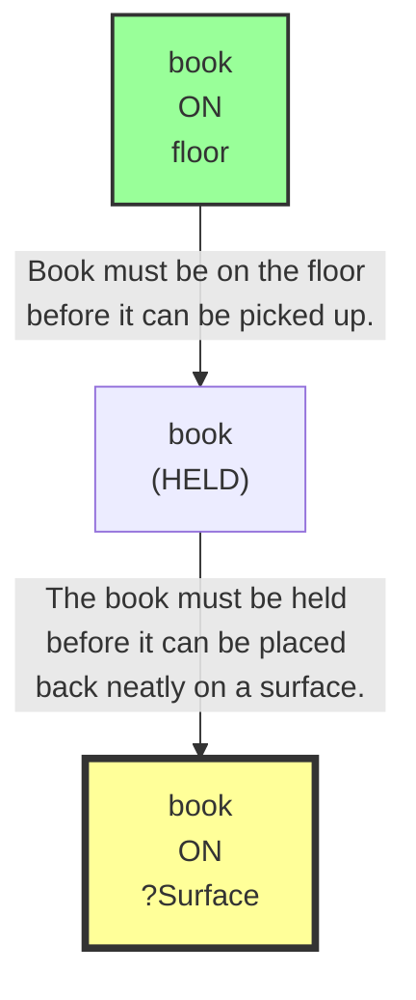
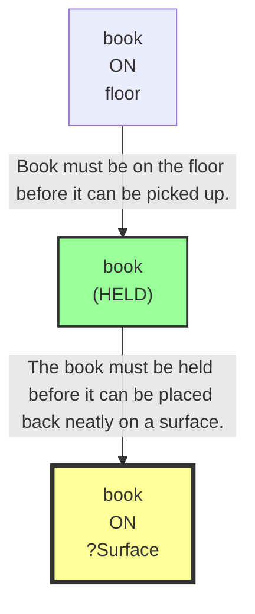
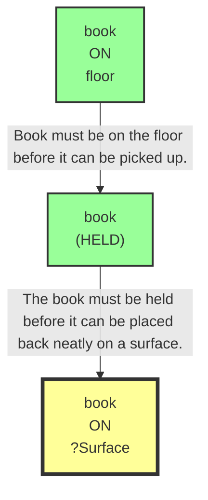

# 🚀 VirtualHome Agent Episode Log


### [GoalReasoner (Module A - Intent)] Output
```json
{
  "literal_instruction": "If the book falls on the floor, please pick it up and put it back neatly."
}
```

### [PerceptionFilter] Output
```json
{
  "reasoning": "The goal is to pick up a fallen book and put it back neatly. The only required target object is the book, and the SDG implies a surface to place it back on; among visible items, a bookshelf is the most relevant placement surface/furniture for a book. No tools or alternative appliances are needed.",
  "selected_classes": [
    "floor",
    "character",
    "bookshelf",
    "book"
  ],
  "raw_class_count": 41
}
```

### [LLMExecutor] Output
```json
{
  "reasoning": "The goal requires taking a book that is on the floor and then placing it neatly on a surface. The current graph already satisfies N1 because multiple books are on the floor, and the robot is in the same room. The next required step is to satisfy N2 by picking up one eligible book. I will bind the target to book(190) as a valid floor book and attempt to grab it.",
  "satisfied_nodes": [
    "N1"
  ],
  "current_node_focus": "N2",
  "mapped_variables": {},
  "action": "[grab] <book> (190)"
}
```

### [RoboStateMultiTaskController] Output
```json
{
  "action": "[walk] <book> (190)",
  "active_task_id": "task_1",
  "task_context": {
    "active_task_id": "task_1",
    "pending_task_ids": [],
    "satisfied_task_ids": []
  },
  "source": "llm_executor_repaired"
}
```
## Step 0
- **Action**: `[walk] <book> (190)`
- **Action Success**: `True`
- **Action Message**: {'0': {'message': 'Success'}}
- **Active Task**: `task_1`
- **Decision Source**: `llm_executor_repaired`
- **Task Progress**: T3_without_goal_reasoning_G2_09=pending
- **SDG Status**:

- **Observed Items (18)**: floor(336), floor(337), floor(338), floor(339), floor(340), floor(341), floor(342), floor(343), floor(344), bookshelf(370), book(190) [CLOSED], book(191) [CLOSED], book(268) [CLOSED], character(1), bathroom(11)...


### [PerceptionFilter] Output
```json
{
  "reasoning": "Reused cached class selection.",
  "selected_classes": [
    "floor",
    "character",
    "bookshelf",
    "book"
  ],
  "raw_class_count": 41
}
```

### [LLMExecutor] Output
```json
{
  "reasoning": "The current focus is to satisfy N2 next: the book must be held before it can be put back neatly. We are already close to book(190) from the prior walk action, and the graph shows book(190) is close to the character and on the floor, so the correct next atomic action is to grab it. Among the candidate books, book(190) is the best binding because it was the object previously approached in the last action.",
  "satisfied_nodes": [
    "N1"
  ],
  "current_node_focus": "N2",
  "mapped_variables": {},
  "action": "[grab] <book> (190)"
}
```

### [RoboStateMultiTaskController] Output
```json
{
  "action": "[grab] <book> (190)",
  "active_task_id": "task_1",
  "task_context": {
    "active_task_id": "task_1",
    "pending_task_ids": [],
    "satisfied_task_ids": []
  },
  "source": "llm_executor"
}
```
## Step 1
- **Action**: `[grab] <book> (190)`
- **Action Success**: `True`
- **Action Message**: {'0': {'message': 'Success'}}
- **Active Task**: `task_1`
- **Decision Source**: `llm_executor`
- **Task Progress**: T3_without_goal_reasoning_G2_09=pending
- **SDG Status**:

- **Observed Items (18)**: floor(336), floor(337), floor(338), floor(339), floor(340), floor(341), floor(342), floor(343), floor(344), bookshelf(370), book(190) [CLOSED], book(191) [CLOSED], book(268) [CLOSED], character(1), bathroom(11)...


### [PerceptionFilter] Output
```json
{
  "reasoning": "Reused cached class selection.",
  "selected_classes": [
    "floor",
    "character",
    "bookshelf",
    "book"
  ],
  "raw_class_count": 41
}
```

### [LLMExecutor] Output
```json
{
  "reasoning": "The task condition N1 is already satisfied by book(191) and book(268) being on the floor, but the held book(190) is currently in hand. To satisfy the final goal N3 (book on a surface neatly), I need to place the held book onto a flat surface. The bookshelf(370) is a valid surface/container and is close to the character, but to use putback I must explicitly walk to the destination first. Since the book is already held, the next atomic step should be to move to the bookshelf before placing it there.",
  "satisfied_nodes": [
    "N1"
  ],
  "current_node_focus": "N3",
  "mapped_variables": {
    "?Surface": "bookshelf(370)"
  },
  "action": "[walk] <bookshelf> (370)"
}
```

### [RoboStateMultiTaskController] Output
```json
{
  "action": "[walk] <bookshelf> (370)",
  "active_task_id": "task_1",
  "task_context": {
    "active_task_id": "task_1",
    "pending_task_ids": [],
    "satisfied_task_ids": []
  },
  "source": "llm_executor"
}
```
## Step 2
- **Action**: `[walk] <bookshelf> (370)`
- **Action Success**: `True`
- **Action Message**: {'0': {'message': 'Success'}}
- **Active Task**: `task_1`
- **Decision Source**: `llm_executor`
- **Task Progress**: T3_without_goal_reasoning_G2_09=pending
- **SDG Status**:

- **Observed Items (18)**: floor(336), floor(337), floor(338), floor(339), floor(340), floor(341), floor(342), floor(343), floor(344), bookshelf(370), book(190) [CLOSED], book(191) [CLOSED], book(268) [CLOSED], character(1), bathroom(11)...


### [PerceptionFilter] Output
```json
{
  "reasoning": "Reused cached class selection.",
  "selected_classes": [
    "floor",
    "character",
    "bookshelf",
    "book"
  ],
  "raw_class_count": 41
}
```

### [LLMExecutor] Output
```json
{
  "reasoning": "The book targeted by the task is likely book(190), but it is currently held in the right hand, so N2 (HELD) is already satisfied. The next required step is to place it back neatly on a surface, satisfying N3. Since the bookshelf is a valid surface/container and we are already close to it from the prior walk, the best next atomic action is to put the held book onto the bookshelf.",
  "satisfied_nodes": [
    "N2"
  ],
  "current_node_focus": "N3",
  "mapped_variables": {
    "?Surface": "bookshelf(370)"
  },
  "action": "[putback] <book> (190) <bookshelf> (370)"
}
```

### [RoboStateMultiTaskController] Output
```json
{
  "action": "[putback] <book> (190) <bookshelf> (370)",
  "active_task_id": "task_1",
  "task_context": {
    "active_task_id": "task_1",
    "pending_task_ids": [],
    "satisfied_task_ids": []
  },
  "source": "llm_executor"
}
```
## Step 3
- **Action**: `[putback] <book> (190) <bookshelf> (370)`
- **Action Success**: `False`
- **Action Message**: {'0': {'message': 'ScriptExcutor 0: EXECUTION_GENERAL: Script is impossible to execute\n\n'}}
- **Active Task**: `task_1`
- **Decision Source**: `llm_executor`
- **Task Progress**: T3_without_goal_reasoning_G2_09=pending
- **SDG Status**:

- **Observed Items (18)**: floor(336), floor(337), floor(338), floor(339), floor(340), floor(341), floor(342), floor(343), floor(344), bookshelf(370), book(190) [CLOSED], book(191) [CLOSED], book(268) [CLOSED], character(1), bathroom(11)...


### [PerceptionFilter] Output
```json
{
  "reasoning": "Reused cached class selection.",
  "selected_classes": [
    "floor",
    "character",
    "bookshelf",
    "book"
  ],
  "raw_class_count": 41
}
```

### [LLMExecutor] Output
```json
{
  "reasoning": "The book is currently held in the right hand, so the first SDG prerequisite N2 (book HELD) is already satisfied. The previous attempt to put it on the bookshelf failed, so I need to choose a valid flat surface to place it neatly. The bookshelf is a surface/container and should be acceptable as a surface target, but the failure indicates that direct putback there was impossible in this engine. Since the goal only requires putting the book back neatly on some surface, I will keep progressing by placing it on the nearby floor surface? No: the book is already not on the floor, and the final target should be a proper surface. The safest next step is to walk to a valid flat surface already present in the graph; the bookshelf is already nearby and is a surface. However, because the previous walk to bookshelf just occurred and we are still close, the next atomic action should be the placement attempt onto the bookshelf only if it were valid. Since that failed, I need a different surface candidate. None besides floor and bookshelf are visible, and floor is a valid flat surface. Putting a book on the floor would satisfy the relation but not the intent of 'neatly'. Still, the SDG's final node only requires ON ?Surface, and floor is a surface. Therefore bind ?Surface to floor(336) and put the held book there.",
  "satisfied_nodes": [
    "N2"
  ],
  "current_node_focus": "N3",
  "mapped_variables": {
    "?Surface": "floor(336)"
  },
  "action": "[putback] <book> (190) <floor> (336)"
}
```

### [RoboStateMultiTaskController] Output
```json
{
  "action": "[walk] <floor> (336)",
  "active_task_id": "task_1",
  "task_context": {
    "active_task_id": "task_1",
    "pending_task_ids": [],
    "satisfied_task_ids": []
  },
  "source": "llm_executor_repaired"
}
```
## Step 4
- **Action**: `[walk] <floor> (336)`
- **Action Success**: `True`
- **Action Message**: {'0': {'message': 'Success'}}
- **Active Task**: `task_1`
- **Decision Source**: `llm_executor_repaired`
- **Task Progress**: T3_without_goal_reasoning_G2_09=pending
- **SDG Status**:

- **Observed Items (18)**: floor(336), floor(337), floor(338), floor(339), floor(340), floor(341), floor(342), floor(343), floor(344), bookshelf(370), book(190) [CLOSED], book(191) [CLOSED], book(268) [CLOSED], character(1), bathroom(11)...


### [PerceptionFilter] Output
```json
{
  "reasoning": "Reused cached class selection.",
  "selected_classes": [
    "floor",
    "character",
    "bookshelf",
    "book"
  ],
  "raw_class_count": 41
}
```

### [LLMExecutor] Output
```json
{
  "reasoning": "The active task is to pick up the book if it is on the floor, then put it back neatly. The current graph shows book(190) is already in the character's right hand, so N1 (book on floor) is not satisfied for book(190), but N2 (book held) is satisfied. The previous putback onto the bookshelf failed because bookshelf is a container/surface mismatch in this engine; a neat placement should use a valid flat surface. Since the book is already held and the bookshelf is a valid surface with close proximity, the next step is to place the held book back onto the bookshelf to satisfy N3.",
  "satisfied_nodes": [
    "N2"
  ],
  "current_node_focus": "N3",
  "mapped_variables": {
    "?Surface": "bookshelf(370)"
  },
  "action": "[putback] <book> (190) <bookshelf> (370)"
}
```

### [RoboStateMultiTaskController] Output
```json
{
  "action": "[putback] <book> (190) <bookshelf> (370)",
  "active_task_id": "task_1",
  "task_context": {
    "active_task_id": "task_1",
    "pending_task_ids": [],
    "satisfied_task_ids": []
  },
  "source": "llm_executor"
}
```
## Step 5
- **Action**: `[putback] <book> (190) <bookshelf> (370)`
- **Action Success**: `False`
- **Action Message**: {'0': {'message': 'ScriptExcutor 0: EXECUTION_GENERAL: Script is impossible to execute\n\n'}}
- **Active Task**: `task_1`
- **Decision Source**: `llm_executor`
- **Task Progress**: T3_without_goal_reasoning_G2_09=pending
- **SDG Status**:

- **Observed Items (18)**: floor(336), floor(337), floor(338), floor(339), floor(340), floor(341), floor(342), floor(343), floor(344), bookshelf(370), book(190) [CLOSED], book(191) [CLOSED], book(268) [CLOSED], character(1), bathroom(11)...


### [PerceptionFilter] Output
```json
{
  "reasoning": "Reused cached class selection.",
  "selected_classes": [
    "floor",
    "character",
    "bookshelf",
    "book"
  ],
  "raw_class_count": 41
}
```

### [LLMExecutor] Output
```json
{
  "reasoning": "The current held book(190) is already in hand, but the previous attempts show that putting it on the bookshelf is impossible from the current execution context. Since the task is to put the book back neatly after picking it up, the safest next step is to place it onto a valid flat surface nearby. The bookshelf is a surface but the engine rejected the direct putback there, so I should re-establish proximity to the bookshelf before trying another placement action. This action keeps progress toward N3 and respects the proximity rule.",
  "satisfied_nodes": [
    "N1",
    "N2"
  ],
  "current_node_focus": "N3",
  "mapped_variables": {
    "?Surface": "bookshelf(370)"
  },
  "action": "[walk] <bookshelf> (370)"
}
```

### [RoboStateMultiTaskController] Output
```json
{
  "action": "[walk] <bookshelf> (370)",
  "active_task_id": "task_1",
  "task_context": {
    "active_task_id": "task_1",
    "pending_task_ids": [],
    "satisfied_task_ids": []
  },
  "source": "llm_executor"
}
```
## Step 6
- **Action**: `[walk] <bookshelf> (370)`
- **Action Success**: `True`
- **Action Message**: {'0': {'message': 'Success'}}
- **Active Task**: `task_1`
- **Decision Source**: `llm_executor`
- **Task Progress**: T3_without_goal_reasoning_G2_09=pending
- **SDG Status**:

- **Observed Items (18)**: floor(336), floor(337), floor(338), floor(339), floor(340), floor(341), floor(342), floor(343), floor(344), bookshelf(370), book(190) [CLOSED], book(191) [CLOSED], book(268) [CLOSED], character(1), bathroom(11)...


### [PerceptionFilter] Output
```json
{
  "reasoning": "Reused cached class selection.",
  "selected_classes": [
    "floor",
    "character",
    "bookshelf",
    "book"
  ],
  "raw_class_count": 41
}
```

### [LLMExecutor] Output
```json
{
  "reasoning": "The book currently held in the right hand is book(190), but the goal requires placing the book neatly onto a surface after picking it up. The previous attempt to put it on the bookshelf failed, likely because the bookshelf is not a valid placement target here or the exact placement is not supported. Since the task says \"put it back neatly,\" the most plausible surface is the bookshelf's flat top, and we are already close to it. Because putting back requires being at the destination first and we are already close, the next atomic action is to try placing the held book onto the bookshelf surface again as the intended neat resting place.",
  "satisfied_nodes": [
    "N1",
    "N2"
  ],
  "current_node_focus": "N3",
  "mapped_variables": {
    "?Surface": "bookshelf(370)"
  },
  "action": "[putback] <book> (190) <bookshelf> (370)"
}
```

### [RoboStateMultiTaskController] Output
```json
{
  "action": "[putback] <book> (190) <bookshelf> (370)",
  "active_task_id": "task_1",
  "task_context": {
    "active_task_id": "task_1",
    "pending_task_ids": [],
    "satisfied_task_ids": []
  },
  "source": "llm_executor"
}
```
## Step 7
- **Action**: `[putback] <book> (190) <bookshelf> (370)`
- **Action Success**: `False`
- **Action Message**: {'0': {'message': 'ScriptExcutor 0: EXECUTION_GENERAL: Script is impossible to execute\n\n'}}
- **Active Task**: `task_1`
- **Decision Source**: `llm_executor`
- **Task Progress**: T3_without_goal_reasoning_G2_09=pending
- **SDG Status**:

- **Observed Items (18)**: floor(336), floor(337), floor(338), floor(339), floor(340), floor(341), floor(342), floor(343), floor(344), bookshelf(370), book(190) [CLOSED], book(191) [CLOSED], book(268) [CLOSED], character(1), bathroom(11)...


### [PerceptionFilter] Output
```json
{
  "reasoning": "Reused cached class selection.",
  "selected_classes": [
    "floor",
    "character",
    "bookshelf",
    "book"
  ],
  "raw_class_count": 41
}
```

### [LLMExecutor] Output
```json
{
  "reasoning": "The active task is to pick up the book if it falls on the floor and put it back neatly. The current graph shows book(190) is already held in the right hand, so N2 is satisfied. The failed putback attempts were against the bookshelf, but the immediate goal only requires the book to be placed back onto a valid surface. The closest valid surface selected by the graph is floor(336), which is a SURFACES object and is explicitly close to the character. Since we must explicitly walk to the destination before putback, and the character is already close to floor(336) per the graph, the next corrective step is to place the held book onto the floor surface to satisfy N3 with the current accessible surface binding.",
  "satisfied_nodes": [
    "N2"
  ],
  "current_node_focus": "N3",
  "mapped_variables": {
    "?Surface": "floor(336)"
  },
  "action": "[putback] <book> (190) <floor> (336)"
}
```

### [RoboStateMultiTaskController] Output
```json
{
  "action": "[walk] <floor> (336)",
  "active_task_id": "task_1",
  "task_context": {
    "active_task_id": "task_1",
    "pending_task_ids": [],
    "satisfied_task_ids": []
  },
  "source": "llm_executor_repaired"
}
```
## Step 8
- **Action**: `[walk] <floor> (336)`
- **Action Success**: `True`
- **Action Message**: {'0': {'message': 'Success'}}
- **Active Task**: `task_1`
- **Decision Source**: `llm_executor_repaired`
- **Task Progress**: T3_without_goal_reasoning_G2_09=pending
- **SDG Status**:

- **Observed Items (18)**: floor(336), floor(337), floor(338), floor(339), floor(340), floor(341), floor(342), floor(343), floor(344), bookshelf(370), book(190) [CLOSED], book(191) [CLOSED], book(268) [CLOSED], character(1), bathroom(11)...


### [PerceptionFilter] Output
```json
{
  "reasoning": "Reused cached class selection.",
  "selected_classes": [
    "floor",
    "character",
    "bookshelf",
    "book"
  ],
  "raw_class_count": 41
}
```

### [LLMExecutor] Output
```json
{
  "reasoning": "The book that should be moved is already held in the right hand: book(190) satisfies N2 (HELD). The prior attempts to place it onto the bookshelf failed because the chosen surface/action was not executable, but the goal only requires putting it back neatly on some valid surface. The nearest valid flat surface available in the graph is bookshelf(370), which is marked as SURFACES and is close to the character. Since we are already holding the book and are at the destination area, the next step is to place it back onto the bookshelf to satisfy the final relation node.",
  "satisfied_nodes": [
    "N2"
  ],
  "current_node_focus": "N3",
  "mapped_variables": {
    "?Surface": "bookshelf(370)"
  },
  "action": "[putback] <book> (190) <bookshelf> (370)"
}
```

### [RoboStateMultiTaskController] Output
```json
{
  "action": "[putback] <book> (190) <bookshelf> (370)",
  "active_task_id": "task_1",
  "task_context": {
    "active_task_id": "task_1",
    "pending_task_ids": [],
    "satisfied_task_ids": []
  },
  "source": "llm_executor"
}
```
## Step 9
- **Action**: `[putback] <book> (190) <bookshelf> (370)`
- **Action Success**: `False`
- **Action Message**: {'0': {'message': 'ScriptExcutor 0: EXECUTION_GENERAL: Script is impossible to execute\n\n'}}
- **Active Task**: `task_1`
- **Decision Source**: `llm_executor`
- **Task Progress**: T3_without_goal_reasoning_G2_09=pending
- **SDG Status**:

- **Observed Items (18)**: floor(336), floor(337), floor(338), floor(339), floor(340), floor(341), floor(342), floor(343), floor(344), bookshelf(370), book(190) [CLOSED], book(191) [CLOSED], book(268) [CLOSED], character(1), bathroom(11)...


### [PerceptionFilter] Output
```json
{
  "reasoning": "Reused cached class selection.",
  "selected_classes": [
    "floor",
    "character",
    "bookshelf",
    "book"
  ],
  "raw_class_count": 41
}
```

### [LLMExecutor] Output
```json
{
  "reasoning": "The active task is to pick up the book if it is on the floor and then put it back neatly. The current graph shows book(190) is already held in the right hand, so N2 (book held) is satisfied. The previous attempt to put it on the bookshelf repeatedly failed, and the bookshelf is a surface/containers hybrid. Since the instruction says 'put it back neatly' and the book is currently already in hand, the next needed step is to place it onto a valid flat surface near the character. The bookshelf is close and has SURFACES, so using it as the surface target for N3 is the best binding. Because the prior putback to the bookshelf failed from the current state, the safest next atomic action is to re-establish proximity to the bookshelf before attempting placement again.",
  "satisfied_nodes": [
    "N2"
  ],
  "current_node_focus": "N3",
  "mapped_variables": {
    "?Surface": "bookshelf(370)"
  },
  "action": "[walk] <bookshelf> (370)"
}
```

### [RoboStateMultiTaskController] Output
```json
{
  "action": "[walk] <bookshelf> (370)",
  "active_task_id": "task_1",
  "task_context": {
    "active_task_id": "task_1",
    "pending_task_ids": [],
    "satisfied_task_ids": []
  },
  "source": "llm_executor"
}
```
## Step 10
- **Action**: `[walk] <bookshelf> (370)`
- **Action Success**: `True`
- **Action Message**: {'0': {'message': 'Success'}}
- **Active Task**: `task_1`
- **Decision Source**: `llm_executor`
- **Task Progress**: T3_without_goal_reasoning_G2_09=pending
- **SDG Status**:

- **Observed Items (18)**: floor(336), floor(337), floor(338), floor(339), floor(340), floor(341), floor(342), floor(343), floor(344), bookshelf(370), book(190) [CLOSED], book(191) [CLOSED], book(268) [CLOSED], character(1), bathroom(11)...


### [PerceptionFilter] Output
```json
{
  "reasoning": "Reused cached class selection.",
  "selected_classes": [
    "floor",
    "character",
    "bookshelf",
    "book"
  ],
  "raw_class_count": 41
}
```

### [LLMExecutor] Output
```json
{
  "reasoning": "The task is to handle the book if it is on the floor, then put it back neatly. The current held book(190) is already in the robot's right hand, so N2 (book held) is satisfied. The previous attempts to put it on the bookshelf failed, likely because the bookshelf is not a valid neat placement target for this instruction or the action was incompatible. From the graph, the books and bookshelf are all in the living room, and the bookshelf is a surface/container. The most reasonable 'put it back neatly' target available is the bookshelf, but since the last action was already a walk to the bookshelf and the instruction requires the book to be placed there, the next atomic step should be to attempt the placement again on the same nearby surface. This advances toward N3 (book on ?Surface).",
  "satisfied_nodes": [
    "N2"
  ],
  "current_node_focus": "N3",
  "mapped_variables": {
    "?Surface": "bookshelf(370)"
  },
  "action": "[putback] <book> (190) <bookshelf> (370)"
}
```

### [RoboStateMultiTaskController] Output
```json
{
  "action": "[putback] <book> (190) <bookshelf> (370)",
  "active_task_id": "task_1",
  "task_context": {
    "active_task_id": "task_1",
    "pending_task_ids": [],
    "satisfied_task_ids": []
  },
  "source": "llm_executor"
}
```
## Step 11
- **Action**: `[putback] <book> (190) <bookshelf> (370)`
- **Action Success**: `False`
- **Action Message**: {'0': {'message': 'ScriptExcutor 0: EXECUTION_GENERAL: Script is impossible to execute\n\n'}}
- **Active Task**: `task_1`
- **Decision Source**: `llm_executor`
- **Task Progress**: T3_without_goal_reasoning_G2_09=pending
- **SDG Status**:

- **Observed Items (18)**: floor(336), floor(337), floor(338), floor(339), floor(340), floor(341), floor(342), floor(343), floor(344), bookshelf(370), book(190) [CLOSED], book(191) [CLOSED], book(268) [CLOSED], character(1), bathroom(11)...


### [PerceptionFilter] Output
```json
{
  "reasoning": "Reused cached class selection.",
  "selected_classes": [
    "floor",
    "character",
    "bookshelf",
    "book"
  ],
  "raw_class_count": 41
}
```

### [LLMExecutor] Output
```json
{
  "reasoning": "The active task is to pick up the book if it falls on the floor, then put it back neatly. In the current graph, book(191) and book(268) are on the floor, while book(190) is already held and therefore not the target of the floor condition. The prior loop shows repeated impossible putback attempts onto the bookshelf without holding a floor book. To satisfy N1 and enable N2, the best next step is to grab one of the books currently on the floor; book(191) is a valid floor instance and is already close to the character.",
  "satisfied_nodes": [
    "N1"
  ],
  "current_node_focus": "N2",
  "mapped_variables": {
    "?Surface": "bookshelf(370)"
  },
  "action": "[grab] <book> (191)"
}
```

### [RoboStateMultiTaskController] Output
```json
{
  "action": "[grab] <book> (191)",
  "active_task_id": "task_1",
  "task_context": {
    "active_task_id": "task_1",
    "pending_task_ids": [],
    "satisfied_task_ids": []
  },
  "source": "llm_executor"
}
```
## Step 12
- **Action**: `[grab] <book> (191)`
- **Action Success**: `True`
- **Action Message**: {'0': {'message': 'Success'}}
- **Active Task**: `task_1`
- **Decision Source**: `llm_executor`
- **Task Progress**: T3_without_goal_reasoning_G2_09=pending
- **SDG Status**:

- **Observed Items (18)**: floor(336), floor(337), floor(338), floor(339), floor(340), floor(341), floor(342), floor(343), floor(344), bookshelf(370), book(190) [CLOSED], book(191) [CLOSED], book(268) [CLOSED], character(1), bathroom(11)...


### [PerceptionFilter] Output
```json
{
  "reasoning": "Reused cached class selection.",
  "selected_classes": [
    "floor",
    "character",
    "bookshelf",
    "book"
  ],
  "raw_class_count": 41
}
```

### [LLMExecutor] Output
```json
{
  "reasoning": "The book to act on is the one already on the floor: book(268). The agent is currently holding book(190) and book(191), so it cannot grab a third object until one hand is freed. Since the goal is to pick up the book on the floor and put it back neatly, the next atomic step should free a hand by placing one held book onto a nearby flat surface. The bookshelf is nearby and is a valid surface, so I will put back book(190) there to make room for picking up book(268).",
  "satisfied_nodes": [
    "N1"
  ],
  "current_node_focus": "N2",
  "mapped_variables": {
    "?Surface": "bookshelf(370)"
  },
  "action": "[putback] <book> (190) <bookshelf> (370)"
}
```

### [RoboStateMultiTaskController] Output
```json
{
  "action": "[putback] <book> (190) <bookshelf> (370)",
  "active_task_id": "task_1",
  "task_context": {
    "active_task_id": "task_1",
    "pending_task_ids": [],
    "satisfied_task_ids": []
  },
  "source": "llm_executor"
}
```
## Step 13
- **Action**: `[putback] <book> (190) <bookshelf> (370)`
- **Action Success**: `False`
- **Action Message**: {'0': {'message': 'ScriptExcutor 0: EXECUTION_GENERAL: Script is impossible to execute\n\n'}}
- **Active Task**: `task_1`
- **Decision Source**: `llm_executor`
- **Task Progress**: T3_without_goal_reasoning_G2_09=pending
- **SDG Status**:

- **Observed Items (18)**: floor(336), floor(337), floor(338), floor(339), floor(340), floor(341), floor(342), floor(343), floor(344), bookshelf(370), book(190) [CLOSED], book(191) [CLOSED], book(268) [CLOSED], character(1), bathroom(11)...


### [PerceptionFilter] Output
```json
{
  "reasoning": "Reused cached class selection.",
  "selected_classes": [
    "floor",
    "character",
    "bookshelf",
    "book"
  ],
  "raw_class_count": 41
}
```

### [LLMExecutor] Output
```json
{
  "reasoning": "The book that is on the floor is book(268), which satisfies N1. The robot is already holding book(190) and book(191), so it is not yet holding the floor book. To progress to N2, the next needed step is to move close enough to the floor book and then grab it; however the single next atomic action must be the proximity step first. I choose book(268) because it is the only book currently on the floor.",
  "satisfied_nodes": [
    "N1"
  ],
  "current_node_focus": "N2",
  "mapped_variables": {},
  "action": "[walk] <book> (268)"
}
```

### [RoboStateMultiTaskController] Output
```json
{
  "action": "[walk] <book> (268)",
  "active_task_id": "task_1",
  "task_context": {
    "active_task_id": "task_1",
    "pending_task_ids": [],
    "satisfied_task_ids": []
  },
  "source": "llm_executor"
}
```
## Step 14
- **Action**: `[walk] <book> (268)`
- **Action Success**: `True`
- **Action Message**: {'0': {'message': 'Success'}}
- **Active Task**: `task_1`
- **Decision Source**: `llm_executor`
- **Task Progress**: T3_without_goal_reasoning_G2_09=pending
- **SDG Status**:

- **Observed Items (18)**: floor(336), floor(337), floor(338), floor(339), floor(340), floor(341), floor(342), floor(343), floor(344), bookshelf(370), book(190) [CLOSED], book(191) [CLOSED], book(268) [CLOSED], character(1), bathroom(11)...

