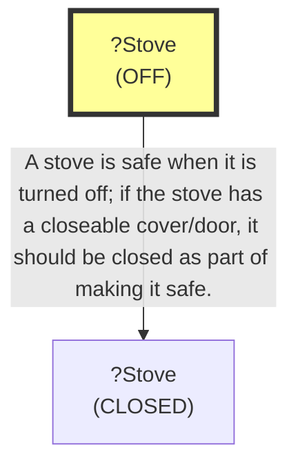
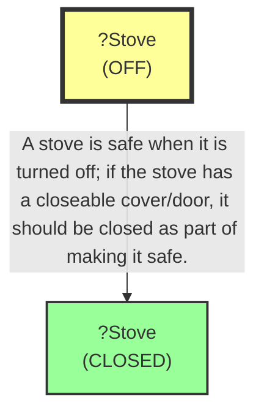

# 🚀 VirtualHome Agent Episode Log


### [GoalReasoner (Module A - Intent)] Output
```json
{
  "literal_instruction": "If there is no one in the kitchen, make sure the stove is safe."
}
```

### [PerceptionFilter] Output
```json
{
  "reasoning": "The goal is to make the stove safe, and the SDG specifies the stove must be OFF and CLOSED. Therefore, the only required object class is the stove itself; no extra tools or alternative appliances are needed.",
  "selected_classes": [
    "stove",
    "door",
    "character"
  ],
  "raw_class_count": 54
}
```

### [LLMExecutor] Output
```json
{
  "reasoning": "The active task is to make the stove safe. The current graph shows stove(311) is ON and CLOSED. The first SDG node requires the stove to be OFF, which is not yet satisfied. Because the stove has a switch, the next required step is to move close to it before switching it off. No other node is currently satisfied since OFF is false and CLOSED alone is not enough without OFF first.",
  "satisfied_nodes": [],
  "current_node_focus": "N1",
  "mapped_variables": {
    "?Stove": "stove(311)"
  },
  "action": "[walk] <stove> (311)"
}
```

### [RoboStateMultiTaskController] Output
```json
{
  "action": "[walk] <stove> (311)",
  "active_task_id": "task_1",
  "task_context": {
    "active_task_id": "task_1",
    "pending_task_ids": [],
    "satisfied_task_ids": []
  },
  "source": "llm_executor"
}
```
## Step 0
- **Action**: `[walk] <stove> (311)`
- **Action Success**: `True`
- **Action Message**: {'0': {'message': 'Success'}}
- **Active Task**: `task_1`
- **Decision Source**: `llm_executor`
- **Task Progress**: T3_without_goal_reasoning_G2_10=pending
- **SDG Status**:

- **Observed Items (7)**: door(224) [OPEN], stove(311) [ON,CLOSED], character(1), bathroom(11), bedroom(73), kitchen(205), livingroom(335)


### [PerceptionFilter] Output
```json
{
  "reasoning": "Reused cached class selection.",
  "selected_classes": [
    "stove",
    "door",
    "character"
  ],
  "raw_class_count": 54
}
```

### [LLMExecutor] Output
```json
{
  "reasoning": "The stove is already closed, but it is still ON, so N2 is currently satisfied and N1 is not. Since we are already close to the stove from the last successful walk, the correct next step is to turn it off to make it safe.",
  "satisfied_nodes": [
    "N2"
  ],
  "current_node_focus": "N1",
  "mapped_variables": {
    "?Stove": "stove(311)"
  },
  "action": "[switchoff] <stove> (311)"
}
```

### [RoboStateMultiTaskController] Output
```json
{
  "action": "[switchoff] <stove> (311)",
  "active_task_id": "task_1",
  "task_context": {
    "active_task_id": "task_1",
    "pending_task_ids": [],
    "satisfied_task_ids": []
  },
  "source": "llm_executor"
}
```
## Step 1
- **Action**: `[switchoff] <stove> (311)`
- **Action Success**: `True`
- **Action Message**: Faked switch operation in Python layer (bypassed Unity failure)
- **Active Task**: `task_1`
- **Decision Source**: `llm_executor`
- **Task Progress**: T3_without_goal_reasoning_G2_10=done
- **SDG Status**:

- **Observed Items (7)**: door(224) [OPEN], stove(311) [ON,CLOSED], character(1), bathroom(11), bedroom(73), kitchen(205), livingroom(335)

