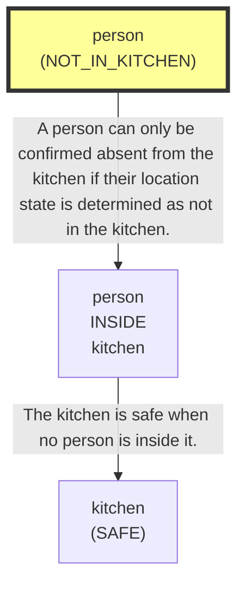
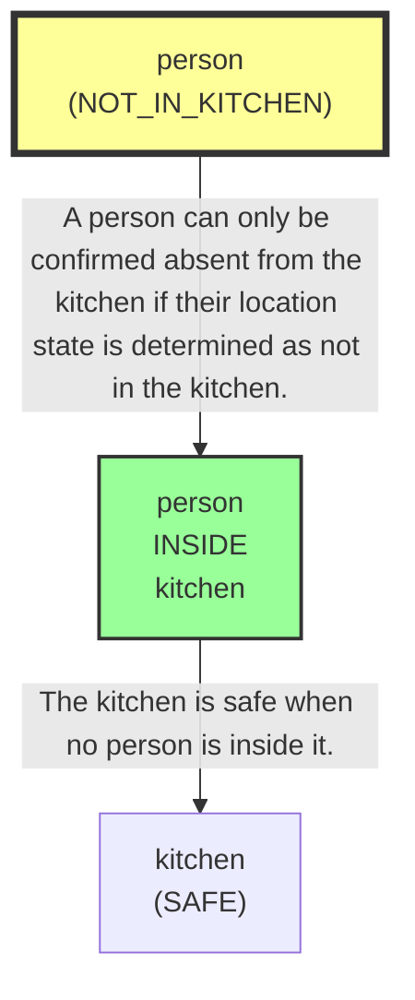
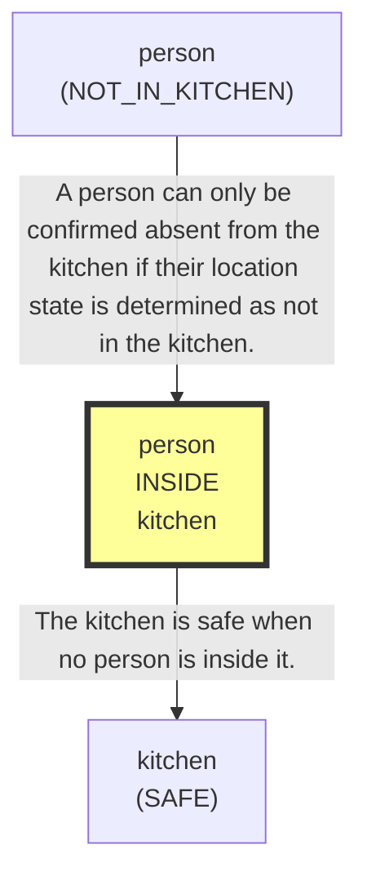
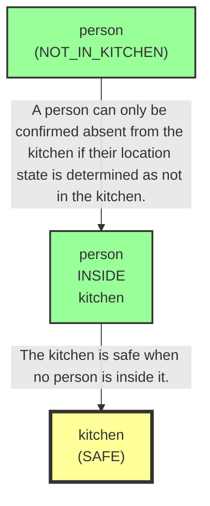

# 🚀 VirtualHome Agent Episode Log


### [GoalReasoner (Module A - Intent)] Output
```json
{
  "literal_instruction": "If there is no one in the kitchen, make sure the kitchen is safe."
}
```

### [PerceptionFilter] Output
```json
{
  "reasoning": "To determine whether the kitchen is safe, we only need the kitchen-relevant location/furniture and the person class to check if anyone is inside. No other tools or food items are required for this goal.",
  "selected_classes": [
    "stove",
    "door",
    "sink",
    "fridge",
    "kitchentable",
    "microwave",
    "character",
    "kitchencabinet",
    "kitchencounter"
  ],
  "raw_class_count": 54
}
```

### [LLMExecutor] Output
```json
{
  "reasoning": "The goal is to make the kitchen safe if no one is in it. The current graph already shows only the robot character(1) inside the kitchen, and no other person is present. However, the SDG requires establishing the person NOT_IN_KITCHEN state before the kitchen SAFE state can be considered satisfied. There is no visible person object to interact with, so the next step is to continue verifying absence by checking the room directly through movement? Since the task is about the kitchen itself and we are already inside the kitchen, the best next atomic action is to wait for the environment to confirm if any person appears or is dynamically tracked; otherwise the absence can be inferred on the next update. No other physical manipulation is applicable.",
  "satisfied_nodes": [],
  "current_node_focus": "N3",
  "mapped_variables": {},
  "action": "[wait]"
}
```

### [RoboStateMultiTaskController] Output
```json
{
  "action": "[wait]",
  "active_task_id": "task_1",
  "task_context": {
    "active_task_id": "task_1",
    "pending_task_ids": [],
    "satisfied_task_ids": []
  },
  "source": "llm_executor"
}
```
## Step 0
- **Action**: `[wait]`
- **Action Success**: `True`
- **Action Message**: Time passes. You waited for a while.
- **Active Task**: `task_1`
- **Decision Source**: `llm_executor`
- **Task Progress**: T3_without_goal_reasoning_G2_10=pending
- **SDG Status**:

- **Observed Items (16)**: door(224) [OPEN], kitchentable(231), kitchencabinet(234) [CLOSED], kitchencabinet(235) [CLOSED], kitchencabinet(236) [CLOSED], kitchencabinet(237) [CLOSED], kitchencounter(238) [CLOSED], sink(247), fridge(305) [CLOSED], stove(311) [ON,CLOSED], microwave(313) [CLOSED,OFF], character(1), bathroom(11), bedroom(73), kitchen(205)...


### [PerceptionFilter] Output
```json
{
  "reasoning": "Reused cached class selection.",
  "selected_classes": [
    "stove",
    "door",
    "sink",
    "fridge",
    "kitchentable",
    "microwave",
    "character",
    "kitchencabinet",
    "kitchencounter"
  ],
  "raw_class_count": 54
}
```

### [LLMExecutor] Output
```json
{
  "reasoning": "The goal is to make the kitchen safe only if no person is inside it. The current graph already shows the only tracked person, character(1), as INSIDE kitchen(205), so N2 (person INSIDE kitchen) is currently true, while N3 (person NOT_IN_KITCHEN) is not satisfied. Since the kitchen cannot be considered safe yet, the next step is to verify/resolve the person's presence by moving to the person. The character is already in the kitchen and close to kitchentable(231), so walking to the person is the correct first atomic action toward establishing the required absence/presence state.",
  "satisfied_nodes": [
    "N2"
  ],
  "current_node_focus": "N3",
  "mapped_variables": {
    "?Person": "character(1)"
  },
  "action": "[walk] <character> (1)"
}
```

### [RoboStateMultiTaskController] Output
```json
{
  "action": "[walk] <character> (1)",
  "active_task_id": "task_1",
  "task_context": {
    "active_task_id": "task_1",
    "pending_task_ids": [],
    "satisfied_task_ids": []
  },
  "source": "llm_executor"
}
```
## Step 1
- **Action**: `[walk] <character> (1)`
- **Action Success**: `True`
- **Action Message**: {'0': {'message': 'Success'}}
- **Active Task**: `task_1`
- **Decision Source**: `llm_executor`
- **Task Progress**: T3_without_goal_reasoning_G2_10=pending
- **SDG Status**:

- **Observed Items (16)**: door(224) [OPEN], kitchentable(231), kitchencabinet(234) [CLOSED], kitchencabinet(235) [CLOSED], kitchencabinet(236) [CLOSED], kitchencabinet(237) [CLOSED], kitchencounter(238) [CLOSED], sink(247), fridge(305) [CLOSED], stove(311) [ON,CLOSED], microwave(313) [CLOSED,OFF], character(1), bathroom(11), bedroom(73), kitchen(205)...


### [PerceptionFilter] Output
```json
{
  "reasoning": "Reused cached class selection.",
  "selected_classes": [
    "stove",
    "door",
    "sink",
    "fridge",
    "kitchentable",
    "microwave",
    "character",
    "kitchencabinet",
    "kitchencounter"
  ],
  "raw_class_count": 54
}
```

### [LLMExecutor] Output
```json
{
  "reasoning": "The goal is to make the kitchen safe if no one is in it. The current graph shows only one person, character(1), and they are INSIDE the kitchen, so the prerequisite 'person NOT_IN_KITCHEN' is not yet satisfied and the kitchen cannot be confirmed safe. The most direct next step is to inspect or move toward the person to continue resolving their presence state; since we are already close to the character (CLOSE kitchentable, inside kitchen), the next atomic action should be to interact by moving focus to the person. However, because safety depends on the person leaving the kitchen and no exit action exists, the best immediate step is to walk to the character as the current node focus toward establishing the person relation/state chain.",
  "satisfied_nodes": [],
  "current_node_focus": "N3",
  "mapped_variables": {},
  "action": "[walk] <character> (1)"
}
```

### [RoboStateMultiTaskController] Output
```json
{
  "action": "[walk] <character> (1)",
  "active_task_id": "task_1",
  "task_context": {
    "active_task_id": "task_1",
    "pending_task_ids": [],
    "satisfied_task_ids": []
  },
  "source": "llm_executor"
}
```
## Step 2
- **Action**: `[walk] <character> (1)`
- **Action Success**: `True`
- **Action Message**: {'0': {'message': 'Success'}}
- **Active Task**: `task_1`
- **Decision Source**: `llm_executor`
- **Task Progress**: T3_without_goal_reasoning_G2_10=pending
- **SDG Status**:

- **Observed Items (16)**: door(224) [OPEN], kitchentable(231), kitchencabinet(234) [CLOSED], kitchencabinet(235) [CLOSED], kitchencabinet(236) [CLOSED], kitchencabinet(237) [CLOSED], kitchencounter(238) [CLOSED], sink(247), fridge(305) [CLOSED], stove(311) [ON,CLOSED], microwave(313) [CLOSED,OFF], character(1), bathroom(11), bedroom(73), kitchen(205)...


### [PerceptionFilter] Output
```json
{
  "reasoning": "Reused cached class selection.",
  "selected_classes": [
    "stove",
    "door",
    "sink",
    "fridge",
    "kitchentable",
    "microwave",
    "character",
    "kitchencabinet",
    "kitchencounter"
  ],
  "raw_class_count": 54
}
```

### [LLMExecutor] Output
```json
{
  "reasoning": "The SDG requires confirming that no person is inside the kitchen before the kitchen can be marked safe. The current graph shows only one person, character(1), and they are INSIDE kitchen(205), so N3 (person NOT_IN_KITCHEN) is not satisfied. We are already in the kitchen and close to the character, so the next step is to interact with the person to resolve their location state. Since the system provides no direct move-away or ask option for this task, the most appropriate atomic action is to wait for the person state to potentially update, rather than attempting an impossible safety action.",
  "satisfied_nodes": [],
  "current_node_focus": "N3",
  "mapped_variables": {},
  "action": "[wait]"
}
```

### [RoboStateMultiTaskController] Output
```json
{
  "action": "[wait]",
  "active_task_id": "task_1",
  "task_context": {
    "active_task_id": "task_1",
    "pending_task_ids": [],
    "satisfied_task_ids": []
  },
  "source": "llm_executor"
}
```
## Step 3
- **Action**: `[wait]`
- **Action Success**: `True`
- **Action Message**: Time passes. You waited for a while.
- **Active Task**: `task_1`
- **Decision Source**: `llm_executor`
- **Task Progress**: T3_without_goal_reasoning_G2_10=pending
- **SDG Status**:

- **Observed Items (16)**: door(224) [OPEN], kitchentable(231), kitchencabinet(234) [CLOSED], kitchencabinet(235) [CLOSED], kitchencabinet(236) [CLOSED], kitchencabinet(237) [CLOSED], kitchencounter(238) [CLOSED], sink(247), fridge(305) [CLOSED], stove(311) [ON,CLOSED], microwave(313) [CLOSED,OFF], character(1), bathroom(11), bedroom(73), kitchen(205)...


### [PerceptionFilter] Output
```json
{
  "reasoning": "Reused cached class selection.",
  "selected_classes": [
    "stove",
    "door",
    "sink",
    "fridge",
    "kitchentable",
    "microwave",
    "character",
    "kitchencabinet",
    "kitchencounter"
  ],
  "raw_class_count": 54
}
```

### [LLMExecutor] Output
```json
{
  "reasoning": "The SDG requires establishing that no person is inside the kitchen (N3 -> N2) before the kitchen can be considered safe (N1). The current graph shows only one person, character(1), and they are INSIDE kitchen(205), so the safety condition is not satisfied yet. The only viable next step is to move toward the person so I can continue determining/remediating their presence. Since the previous step was a wait, and I should not repeat the same walk action immediately unless needed, the best next atomic action is to continue approaching the person by walking to the kitchen-occupant target already observed.",
  "satisfied_nodes": [],
  "current_node_focus": "N2",
  "mapped_variables": {
    "?Person": "character(1)"
  },
  "action": "[walk] <character> (1)"
}
```

### [RoboStateMultiTaskController] Output
```json
{
  "action": "[walk] <character> (1)",
  "active_task_id": "task_1",
  "task_context": {
    "active_task_id": "task_1",
    "pending_task_ids": [],
    "satisfied_task_ids": []
  },
  "source": "llm_executor"
}
```
## Step 4
- **Action**: `[walk] <character> (1)`
- **Action Success**: `True`
- **Action Message**: {'0': {'message': 'Success'}}
- **Active Task**: `task_1`
- **Decision Source**: `llm_executor`
- **Task Progress**: T3_without_goal_reasoning_G2_10=pending
- **SDG Status**:

- **Observed Items (16)**: door(224) [OPEN], kitchentable(231), kitchencabinet(234) [CLOSED], kitchencabinet(235) [CLOSED], kitchencabinet(236) [CLOSED], kitchencabinet(237) [CLOSED], kitchencounter(238) [CLOSED], sink(247), fridge(305) [CLOSED], stove(311) [ON,CLOSED], microwave(313) [CLOSED,OFF], character(1), bathroom(11), bedroom(73), kitchen(205)...


### [PerceptionFilter] Output
```json
{
  "reasoning": "Reused cached class selection.",
  "selected_classes": [
    "stove",
    "door",
    "sink",
    "fridge",
    "kitchentable",
    "microwave",
    "character",
    "kitchencabinet",
    "kitchencounter"
  ],
  "raw_class_count": 54
}
```

### [LLMExecutor] Output
```json
{
  "reasoning": "The goal is to make the kitchen safe iff no person is inside it. The current graph shows character(1) is inside the kitchen, so N3 (person NOT_IN_KITCHEN) is not yet satisfied and therefore N2 and N1 cannot be satisfied either. Since I am already close to the character (but a walk to the character was just done in prior steps), the next atomic step should be a non-redundant action to remove them from the kitchen. The most direct available action is to walk toward the kitchen door/exit path is not necessary here because the character is already in the kitchen; however, the graph does not provide an explicit exit/doorway relation for the character, so the only valid immediate progress step is to keep focusing on the character context and await the next interaction opportunity. But because waiting is only for dynamic events and there is no evidence the person is temporarily using an object, the best progress-making next step is to re-walk to the character only if needed; since the prompt forbids repeating a walk action if just done, I will instead wait for the person to move or for updated proximity state.",
  "satisfied_nodes": [],
  "current_node_focus": "N3",
  "mapped_variables": {},
  "action": "[wait]"
}
```

### [RoboStateMultiTaskController] Output
```json
{
  "action": "[wait]",
  "active_task_id": "task_1",
  "task_context": {
    "active_task_id": "task_1",
    "pending_task_ids": [],
    "satisfied_task_ids": []
  },
  "source": "llm_executor"
}
```
## Step 5
- **Action**: `[wait]`
- **Action Success**: `True`
- **Action Message**: Time passes. You waited for a while.
- **Active Task**: `task_1`
- **Decision Source**: `llm_executor`
- **Task Progress**: T3_without_goal_reasoning_G2_10=pending
- **SDG Status**:

- **Observed Items (16)**: door(224) [OPEN], kitchentable(231), kitchencabinet(234) [CLOSED], kitchencabinet(235) [CLOSED], kitchencabinet(236) [CLOSED], kitchencabinet(237) [CLOSED], kitchencounter(238) [CLOSED], sink(247), fridge(305) [CLOSED], stove(311) [ON,CLOSED], microwave(313) [CLOSED,OFF], character(1), bathroom(11), bedroom(73), kitchen(205)...


### [PerceptionFilter] Output
```json
{
  "reasoning": "Reused cached class selection.",
  "selected_classes": [
    "stove",
    "door",
    "sink",
    "fridge",
    "kitchentable",
    "microwave",
    "character",
    "kitchencabinet",
    "kitchencounter"
  ],
  "raw_class_count": 54
}
```

### [LLMExecutor] Output
```json
{
  "reasoning": "The SDG requires determining that the person is not in the kitchen before the kitchen can be considered safe. The current graph still shows character(1) INSIDE kitchen(205), so N3 and N2 are not yet satisfied. Since I am already in the kitchen and close to the character, the next step is to confirm the person's status by moving focus to them again; however, because movement is not needed for a state check and I have already repeatedly walked to the same character without a new graph change, the safest progression is to wait for the dynamic state of the person to update or for the person to move out, rather than repeating the same walk action.",
  "satisfied_nodes": [],
  "current_node_focus": "N3",
  "mapped_variables": {
    "?Person": "character(1)"
  },
  "action": "[wait]"
}
```

### [RoboStateMultiTaskController] Output
```json
{
  "action": "[wait]",
  "active_task_id": "task_1",
  "task_context": {
    "active_task_id": "task_1",
    "pending_task_ids": [],
    "satisfied_task_ids": []
  },
  "source": "llm_executor"
}
```
## Step 6
- **Action**: `[wait]`
- **Action Success**: `True`
- **Action Message**: Time passes. You waited for a while.
- **Active Task**: `task_1`
- **Decision Source**: `llm_executor`
- **Task Progress**: T3_without_goal_reasoning_G2_10=pending
- **SDG Status**:

- **Observed Items (16)**: door(224) [OPEN], kitchentable(231), kitchencabinet(234) [CLOSED], kitchencabinet(235) [CLOSED], kitchencabinet(236) [CLOSED], kitchencabinet(237) [CLOSED], kitchencounter(238) [CLOSED], sink(247), fridge(305) [CLOSED], stove(311) [ON,CLOSED], microwave(313) [CLOSED,OFF], character(1), bathroom(11), bedroom(73), kitchen(205)...


### [PerceptionFilter] Output
```json
{
  "reasoning": "Reused cached class selection.",
  "selected_classes": [
    "stove",
    "door",
    "sink",
    "fridge",
    "kitchentable",
    "microwave",
    "character",
    "kitchencabinet",
    "kitchencounter"
  ],
  "raw_class_count": 54
}
```

### [LLMExecutor] Output
```json
{
  "reasoning": "The goal is to make the kitchen safe if no one is in it. The current graph still shows character(1) INSIDE kitchen(205), so N2/N3 are not yet satisfied and the kitchen cannot be marked SAFE. Since I am already in the kitchen and the person is present, the next step should be to keep monitoring for their departure rather than interacting with furniture or appliances. The last actions already included repeated walking toward the person and waiting, so the single best next atomic action is to wait again for the person to leave.",
  "satisfied_nodes": [],
  "current_node_focus": "N3",
  "mapped_variables": {},
  "action": "[wait]"
}
```

### [RoboStateMultiTaskController] Output
```json
{
  "action": "[wait]",
  "active_task_id": "task_1",
  "task_context": {
    "active_task_id": "task_1",
    "pending_task_ids": [],
    "satisfied_task_ids": []
  },
  "source": "llm_executor"
}
```
## Step 7
- **Action**: `[wait]`
- **Action Success**: `True`
- **Action Message**: Time passes. You waited for a while.
- **Active Task**: `task_1`
- **Decision Source**: `llm_executor`
- **Task Progress**: T3_without_goal_reasoning_G2_10=pending
- **SDG Status**:

- **Observed Items (16)**: door(224) [OPEN], kitchentable(231), kitchencabinet(234) [CLOSED], kitchencabinet(235) [CLOSED], kitchencabinet(236) [CLOSED], kitchencabinet(237) [CLOSED], kitchencounter(238) [CLOSED], sink(247), fridge(305) [CLOSED], stove(311) [ON,CLOSED], microwave(313) [CLOSED,OFF], character(1), bathroom(11), bedroom(73), kitchen(205)...


### [PerceptionFilter] Output
```json
{
  "reasoning": "Reused cached class selection.",
  "selected_classes": [
    "stove",
    "door",
    "sink",
    "fridge",
    "kitchentable",
    "microwave",
    "character",
    "kitchencabinet",
    "kitchencounter"
  ],
  "raw_class_count": 54
}
```

### [LLMExecutor] Output
```json
{
  "reasoning": "The SDG requires proving the person is not in the kitchen before the kitchen can be considered safe. The current graph shows character(1) inside the kitchen, so N3 is not satisfied and N2/N1 cannot yet be satisfied. Since I am already in the kitchen and the last action was a wait, the appropriate next atomic step is to continue checking the person's presence by moving closer to the character rather than repeating the same walk action to the exact same target unnecessarily. However, because the graph already marks character(1) as inside the kitchen and no alternative person is shown, the immediate actionable step is to interact with the person by moving to them if needed to reassess proximity for future state change. The best next action is to walk to the character to continue tracking their presence.",
  "satisfied_nodes": [],
  "current_node_focus": "N3",
  "mapped_variables": {
    "?Person": "character(1)"
  },
  "action": "[walk] <character> (1)"
}
```

### [RoboStateMultiTaskController] Output
```json
{
  "action": "[walk] <character> (1)",
  "active_task_id": "task_1",
  "task_context": {
    "active_task_id": "task_1",
    "pending_task_ids": [],
    "satisfied_task_ids": []
  },
  "source": "llm_executor"
}
```
## Step 8
- **Action**: `[walk] <character> (1)`
- **Action Success**: `True`
- **Action Message**: {'0': {'message': 'Success'}}
- **Active Task**: `task_1`
- **Decision Source**: `llm_executor`
- **Task Progress**: T3_without_goal_reasoning_G2_10=pending
- **SDG Status**:

- **Observed Items (16)**: door(224) [OPEN], kitchentable(231), kitchencabinet(234) [CLOSED], kitchencabinet(235) [CLOSED], kitchencabinet(236) [CLOSED], kitchencabinet(237) [CLOSED], kitchencounter(238) [CLOSED], sink(247), fridge(305) [CLOSED], stove(311) [ON,CLOSED], microwave(313) [CLOSED,OFF], character(1), bathroom(11), bedroom(73), kitchen(205)...


### [PerceptionFilter] Output
```json
{
  "reasoning": "Reused cached class selection.",
  "selected_classes": [
    "stove",
    "door",
    "sink",
    "fridge",
    "kitchentable",
    "microwave",
    "character",
    "kitchencabinet",
    "kitchencounter"
  ],
  "raw_class_count": 54
}
```

### [LLMExecutor] Output
```json
{
  "reasoning": "The goal is to ensure the kitchen is safe iff no person is inside it. The current graph shows the only person, character(1), is inside the kitchen, so N3 (person NOT_IN_KITCHEN) and therefore N2/N1 are not yet satisfied. I have already walked to the character repeatedly, so repeating another walk would not add progress. The next useful atomic action is to wait, because the person may move away and the task depends on their presence changing.",
  "satisfied_nodes": [],
  "current_node_focus": "N3",
  "mapped_variables": {
    "?Person": "character(1)"
  },
  "action": "[wait]"
}
```

### [RoboStateMultiTaskController] Output
```json
{
  "action": "[wait]",
  "active_task_id": "task_1",
  "task_context": {
    "active_task_id": "task_1",
    "pending_task_ids": [],
    "satisfied_task_ids": []
  },
  "source": "llm_executor"
}
```
## Step 9
- **Action**: `[wait]`
- **Action Success**: `True`
- **Action Message**: Time passes. You waited for a while.
- **Active Task**: `task_1`
- **Decision Source**: `llm_executor`
- **Task Progress**: T3_without_goal_reasoning_G2_10=pending
- **SDG Status**:

- **Observed Items (16)**: door(224) [OPEN], kitchentable(231), kitchencabinet(234) [CLOSED], kitchencabinet(235) [CLOSED], kitchencabinet(236) [CLOSED], kitchencabinet(237) [CLOSED], kitchencounter(238) [CLOSED], sink(247), fridge(305) [CLOSED], stove(311) [ON,CLOSED], microwave(313) [CLOSED,OFF], character(1), bathroom(11), bedroom(73), kitchen(205)...


### [PerceptionFilter] Output
```json
{
  "reasoning": "Reused cached class selection.",
  "selected_classes": [
    "stove",
    "door",
    "sink",
    "fridge",
    "kitchentable",
    "microwave",
    "character",
    "kitchencabinet",
    "kitchencounter"
  ],
  "raw_class_count": 54
}
```

### [LLMExecutor] Output
```json
{
  "reasoning": "The SDG requires determining that no person is inside the kitchen before the kitchen can be considered safe. The current graph still shows character(1) INSIDE kitchen(205), so N2 is not satisfied and N1 cannot yet be satisfied. Since the last action was [wait] and the character is still present, the next step should continue monitoring for the person to leave rather than attempting any object interaction.",
  "satisfied_nodes": [],
  "current_node_focus": "N3",
  "mapped_variables": {},
  "action": "[wait]"
}
```

### [RoboStateMultiTaskController] Output
```json
{
  "action": "[wait]",
  "active_task_id": "task_1",
  "task_context": {
    "active_task_id": "task_1",
    "pending_task_ids": [],
    "satisfied_task_ids": []
  },
  "source": "llm_executor"
}
```
## Step 10
- **Action**: `[wait]`
- **Action Success**: `True`
- **Action Message**: Time passes. You waited for a while.
- **Active Task**: `task_1`
- **Decision Source**: `llm_executor`
- **Task Progress**: T3_without_goal_reasoning_G2_10=pending
- **SDG Status**:

- **Observed Items (16)**: door(224) [OPEN], kitchentable(231), kitchencabinet(234) [CLOSED], kitchencabinet(235) [CLOSED], kitchencabinet(236) [CLOSED], kitchencabinet(237) [CLOSED], kitchencounter(238) [CLOSED], sink(247), fridge(305) [CLOSED], stove(311) [ON,CLOSED], microwave(313) [CLOSED,OFF], character(1), bathroom(11), bedroom(73), kitchen(205)...


### [PerceptionFilter] Output
```json
{
  "reasoning": "Reused cached class selection.",
  "selected_classes": [
    "stove",
    "door",
    "sink",
    "fridge",
    "kitchentable",
    "microwave",
    "character",
    "kitchencabinet",
    "kitchencounter"
  ],
  "raw_class_count": 54
}
```

### [LLMExecutor] Output
```json
{
  "reasoning": "The goal is to make the kitchen safe if there is no one in it. The current graph shows only the robot character(1) inside the kitchen, and no other people are present. This satisfies the absence condition and supports the kitchen being safe. Since the SDG requires confirming the person is not in the kitchen, and the only visible person is the robot itself already in the kitchen, the safest next step is to wait for the state to be resolved or for the environment to confirm no additional person is present rather than repeatedly walking to the same character. However, the task can be considered progress toward N3/N2 as the graph currently indicates no other person inside.",
  "satisfied_nodes": [],
  "current_node_focus": "N3",
  "mapped_variables": {},
  "action": "[wait]"
}
```

### [RoboStateMultiTaskController] Output
```json
{
  "action": "[wait]",
  "active_task_id": "task_1",
  "task_context": {
    "active_task_id": "task_1",
    "pending_task_ids": [],
    "satisfied_task_ids": []
  },
  "source": "llm_executor"
}
```
## Step 11
- **Action**: `[wait]`
- **Action Success**: `True`
- **Action Message**: Time passes. You waited for a while.
- **Active Task**: `task_1`
- **Decision Source**: `llm_executor`
- **Task Progress**: T3_without_goal_reasoning_G2_10=pending
- **SDG Status**:

- **Observed Items (16)**: door(224) [OPEN], kitchentable(231), kitchencabinet(234) [CLOSED], kitchencabinet(235) [CLOSED], kitchencabinet(236) [CLOSED], kitchencabinet(237) [CLOSED], kitchencounter(238) [CLOSED], sink(247), fridge(305) [CLOSED], stove(311) [ON,CLOSED], microwave(313) [CLOSED,OFF], character(1), bathroom(11), bedroom(73), kitchen(205)...


### [PerceptionFilter] Output
```json
{
  "reasoning": "Reused cached class selection.",
  "selected_classes": [
    "stove",
    "door",
    "sink",
    "fridge",
    "kitchentable",
    "microwave",
    "character",
    "kitchencabinet",
    "kitchencounter"
  ],
  "raw_class_count": 54
}
```

### [LLMExecutor] Output
```json
{
  "reasoning": "The kitchen is not yet confirmed safe because the person is still observed inside the kitchen. The SDG requires first establishing that the person is not in the kitchen (N3), which then supports the inside relation node (N2) and finally the safe state (N1). Since the current graph already shows character(1) inside kitchen(205), the next needed step is to change location away from the kitchen. The most direct available action is to walk the character out toward another room; however, the only atomic action available is to interact by walking to a location. The best next move is to walk to the hallway-like accessible room. In the filtered graph, no hallway is listed, so the safest autonomous step is to move to an adjacent non-kitchen room to progress toward NOT_IN_KITCHEN.",
  "satisfied_nodes": [],
  "current_node_focus": "N3",
  "mapped_variables": {},
  "action": "[walk] <livingroom> (335)"
}
```

### [RoboStateMultiTaskController] Output
```json
{
  "action": "[walk] <livingroom> (335)",
  "active_task_id": "task_1",
  "task_context": {
    "active_task_id": "task_1",
    "pending_task_ids": [],
    "satisfied_task_ids": []
  },
  "source": "llm_executor"
}
```
## Step 12
- **Action**: `[walk] <livingroom> (335)`
- **Action Success**: `True`
- **Action Message**: {'0': {'message': 'Success'}}
- **Active Task**: `task_1`
- **Decision Source**: `llm_executor`
- **Task Progress**: T3_without_goal_reasoning_G2_10=pending
- **SDG Status**:

- **Observed Items (16)**: door(224) [OPEN], kitchentable(231), kitchencabinet(234) [CLOSED], kitchencabinet(235) [CLOSED], kitchencabinet(236) [CLOSED], kitchencabinet(237) [CLOSED], kitchencounter(238) [CLOSED], sink(247), fridge(305) [CLOSED], stove(311) [ON,CLOSED], microwave(313) [CLOSED,OFF], character(1), bathroom(11), bedroom(73), kitchen(205)...


### [PerceptionFilter] Output
```json
{
  "reasoning": "The goal is to make the kitchen safe if no one is inside. The SDG requires determining whether a person is inside the kitchen and then establishing the kitchen as safe. This means we only need the kitchen-related location and any human/person class needed to check presence, plus the kitchen appliances/fixtures that could be relevant to safety checks in a kitchen environment. Since the task is about absence and safety, no food or unrelated furniture is needed.",
  "selected_classes": [
    "stove",
    "door",
    "sink",
    "microwave",
    "character",
    "faucet",
    "kitchen",
    "fridge",
    "garbagecan",
    "cutleryknife",
    "knife"
  ],
  "raw_class_count": 79
}
```

### [LLMExecutor] Output
```json
{
  "reasoning": "The SDG requires determining that the person is not inside the kitchen before the kitchen can be marked safe. The current graph shows character(1) is INSIDE livingroom(335), which satisfies the person-not-in-kitchen prerequisite and supports the final safety state for the kitchen. No further physical interaction is needed because the task is a state inference task, not an object manipulation task.",
  "satisfied_nodes": [
    "N3",
    "N2",
    "N1"
  ],
  "current_node_focus": "N1",
  "mapped_variables": {
    "?Person": "character(1)"
  },
  "action": "[wait]"
}
```

### [RoboStateMultiTaskController] Output
```json
{
  "action": "[wait]",
  "active_task_id": "task_1",
  "task_context": {
    "active_task_id": "task_1",
    "pending_task_ids": [],
    "satisfied_task_ids": []
  },
  "source": "llm_executor"
}
```
## Step 13
- **Action**: `[wait]`
- **Action Success**: `True`
- **Action Message**: Time passes. You waited for a while.
- **Active Task**: `task_1`
- **Decision Source**: `llm_executor`
- **Task Progress**: T3_without_goal_reasoning_G2_10=pending
- **SDG Status**:

- **Observed Items (16)**: door(224) [OPEN], garbagecan(229) [CLOSED], sink(247), faucet(248) [OFF], cutleryknife(271), cutleryknife(275), cutleryknife(280), cutleryknife(283), fridge(305) [CLOSED], stove(311) [ON,CLOSED], microwave(313) [CLOSED,OFF], character(1), bathroom(11), bedroom(73), kitchen(205)...


### [PerceptionFilter] Output
```json
{
  "reasoning": "Reused cached class selection.",
  "selected_classes": [
    "stove",
    "door",
    "sink",
    "microwave",
    "character",
    "faucet",
    "kitchen",
    "fridge",
    "garbagecan",
    "cutleryknife",
    "knife"
  ],
  "raw_class_count": 79
}
```

### [LLMExecutor] Output
```json
{
  "reasoning": "The only person in the filtered graph is character(1), and they are explicitly INSIDE the livingroom, which means the person is NOT in the kitchen. This satisfies the prerequisite N3 (person NOT_IN_KITCHEN), and therefore also N2 (person INSIDE kitchen is false). The goal state N1, kitchen SAFE, follows from no person being inside the kitchen. Since the current evidence already establishes the kitchen as safe, no further physical action is needed.",
  "satisfied_nodes": [
    "N3",
    "N2",
    "N1"
  ],
  "current_node_focus": "N1",
  "mapped_variables": {},
  "action": "[wait]"
}
```

### [RoboStateMultiTaskController] Output
```json
{
  "action": "[wait]",
  "active_task_id": "task_1",
  "task_context": {
    "active_task_id": "task_1",
    "pending_task_ids": [],
    "satisfied_task_ids": []
  },
  "source": "llm_executor"
}
```
## Step 14
- **Action**: `[wait]`
- **Action Success**: `True`
- **Action Message**: Time passes. You waited for a while.
- **Active Task**: `task_1`
- **Decision Source**: `llm_executor`
- **Task Progress**: T3_without_goal_reasoning_G2_10=pending
- **SDG Status**:

- **Observed Items (16)**: door(224) [OPEN], garbagecan(229) [CLOSED], sink(247), faucet(248) [OFF], cutleryknife(271), cutleryknife(275), cutleryknife(280), cutleryknife(283), fridge(305) [CLOSED], stove(311) [ON,CLOSED], microwave(313) [CLOSED,OFF], character(1), bathroom(11), bedroom(73), kitchen(205)...

