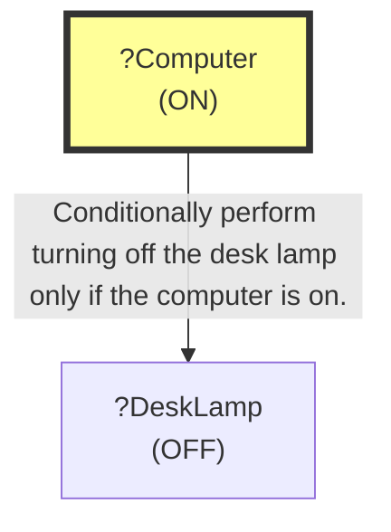

# 🚀 VirtualHome Agent Episode Log


### [GoalReasoner (Module A - Intent)] Output
```json
{
  "literal_instruction": "If the computer is on, turn off the desk lamp."
}
```

### [PerceptionFilter] Output
```json
{
  "reasoning": "The goal is conditional: if the computer is on, turn off the desk lamp. The required objects are the computer to check its state and the desk lamp itself, represented in the दृश्य as tablelamp. No other tools or furniture are needed.",
  "selected_classes": [
    "tablelamp",
    "desk",
    "character",
    "computer"
  ],
  "raw_class_count": 33
}
```

### [LLMExecutor] Output
```json
{
  "reasoning": "The SDG requires the computer to be ON before turning off the desk lamp. The only computer visible is computer(174), but it is explicitly BROKEN and OFF. Since the condition 'if the computer is on' is an inherently false precondition in the current environment, the lamp-off action is not reachable under the task's condition.",
  "satisfied_nodes": [],
  "current_node_focus": "N1",
  "mapped_variables": {
    "?Computer": "computer(174)",
    "?DeskLamp": "tablelamp(102)"
  },
  "action": "[ask] The computer is broken and off, so the condition for turning off the desk lamp cannot be satisfied. Please confirm how you would like me to proceed."
}
```

### [RoboStateMultiTaskController] Output
```json
{
  "action": "[ask] The computer is broken and off, so the condition for turning off the desk lamp cannot be satisfied. Please confirm how you would like me to proceed.",
  "active_task_id": "task_1",
  "task_context": {
    "active_task_id": "task_1",
    "pending_task_ids": [],
    "satisfied_task_ids": []
  },
  "source": "llm_executor"
}
```
## Step 0
- **Action**: `[ask] The computer is broken and off, so the condition for turning off the desk lamp cannot be satisfied. Please confirm how you would like me to proceed.`
- **Action Success**: `True`
- **Action Message**: nothing to claim
- **Active Task**: `task_1`
- **Decision Source**: `llm_executor`
- **Task Progress**: T3_without_goal_reasoning_G3_12=pending
- **SDG Status**:

- **Observed Items (9)**: tablelamp(102) [ON], tablelamp(103) [ON], desk(108) [CLOSED], computer(174) [BROKEN,OFF], character(1), bathroom(11), bedroom(73), kitchen(205), livingroom(335)

