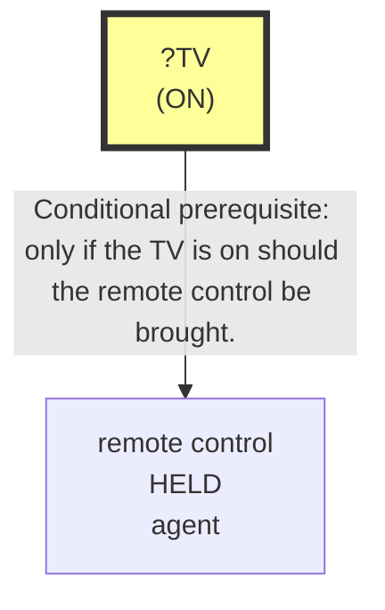

# 🚀 VirtualHome Agent Episode Log


### [GoalReasoner (Module A - Intent)] Output
```json
{
  "literal_instruction": "If the TV is on, bring the remote control."
}
```

### [PerceptionFilter] Output
```json
{
  "reasoning": "The goal is conditional on the TV being on, and if so the required item is the remote control. No other tools or locations are needed beyond the exact target object and the TV to evaluate the condition.",
  "selected_classes": [
    "tv",
    "character",
    "remotecontrol"
  ],
  "raw_class_count": 40
}
```

### [LLMExecutor] Output
```json
{
  "reasoning": "The SDG requires the TV to be ON before the remote control must be brought. However, the only TV in the current graph is explicitly BROKEN and OFF, so the prerequisite state (TV ON) is permanently impossible. Per the failure-handling rules, this is an inherently false precondition, so I should report impossibility rather than taking physical actions.",
  "satisfied_nodes": [],
  "current_node_focus": "N1",
  "mapped_variables": {
    "?TV": "tv(426)"
  },
  "action": "[ask] The task is impossible as stated because the only available TV is BROKEN and cannot be turned ON."
}
```

### [RoboStateMultiTaskController] Output
```json
{
  "action": "[ask] The task is impossible as stated because the only available TV is BROKEN and cannot be turned ON.",
  "active_task_id": "task_1",
  "task_context": {
    "active_task_id": "task_1",
    "pending_task_ids": [],
    "satisfied_task_ids": []
  },
  "source": "llm_executor"
}
```
## Step 0
- **Action**: `[ask] The task is impossible as stated because the only available TV is BROKEN and cannot be turned ON.`
- **Action Success**: `True`
- **Action Message**: nothing to claim
- **Active Task**: `task_1`
- **Decision Source**: `llm_executor`
- **Task Progress**: T3_without_goal_reasoning_G3_13=pending
- **SDG Status**:

- **Observed Items (7)**: tv(426) [OFF,BROKEN], remotecontrol(452) [OFF], character(1), bathroom(11), bedroom(73), kitchen(205), livingroom(335)

