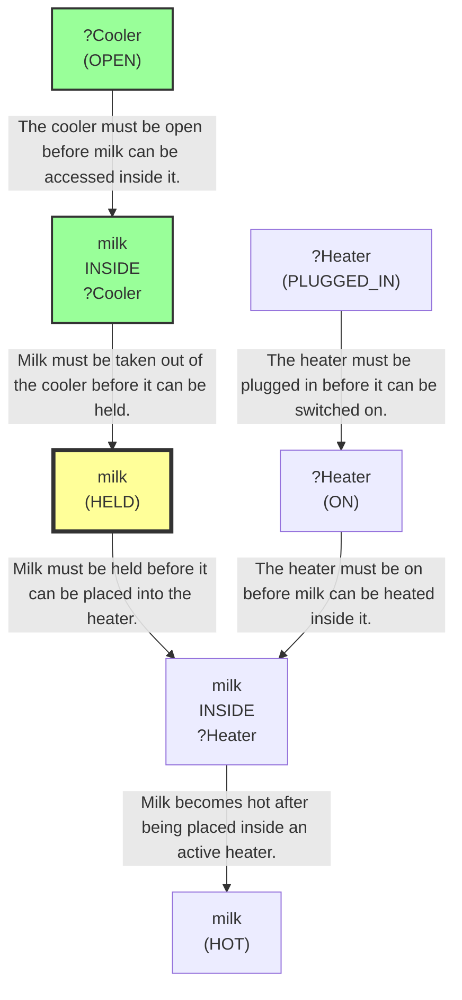
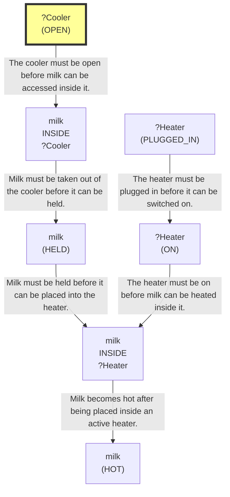
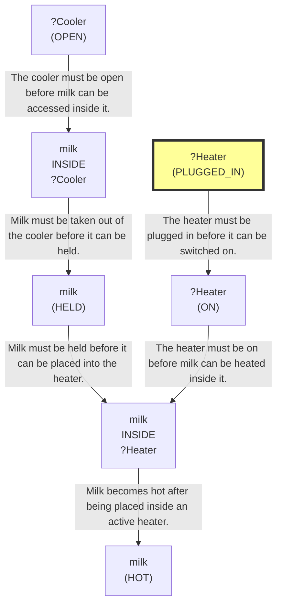
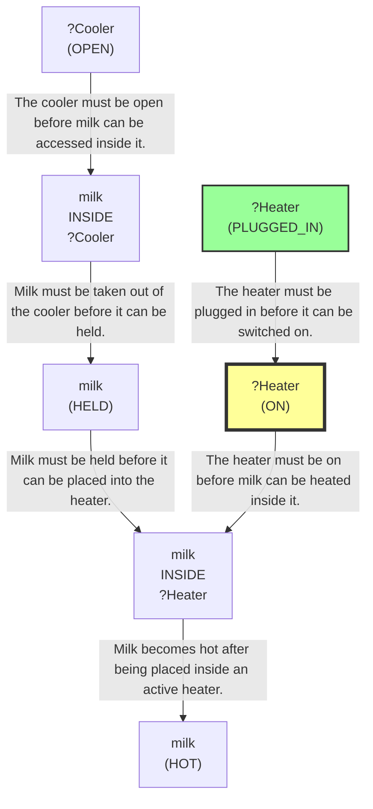
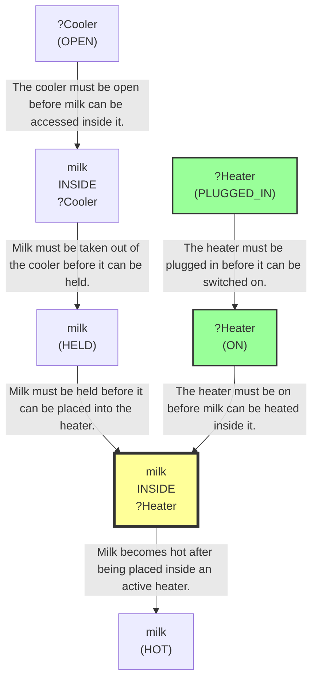

# 🚀 VirtualHome Agent Episode Log


### [GoalReasoner (Module A - Intent)] Output
```json
{
  "literal_instruction": "If there is milk in the fridge, heat up a cup of it in the microwave."
}
```

### [PerceptionFilter] Output
```json
{
  "reasoning": "The goal requires retrieving milk from a cooler (fridge), placing it into a heater (microwave), and ensuring the heater can be powered and turned on. So the only necessary object classes are milk, fridge, microwave, and the power source needed for plugging in the microwave.",
  "selected_classes": [
    "character",
    "milk",
    "powersocket",
    "microwave",
    "fridge"
  ],
  "raw_class_count": 50
}
```

### [LLMExecutor] Output
```json
{
  "reasoning": "The goal requires heating milk in the microwave. The currently relevant milk inside the fridge is milk(176), which matches the SDG prerequisite of milk being inside the cooler/fridge. The fridge is already OPEN, so the next unmet step toward accessing the milk is to walk directly to milk(176) so it can be grabbed next. The microwave state prerequisites (plugged in/on) are not yet actionable until the milk is held, and we must not skip the required access step.",
  "satisfied_nodes": [
    "N3",
    "N4"
  ],
  "current_node_focus": "N5",
  "mapped_variables": {
    "?Cooler": "fridge(162)",
    "?Heater": "microwave(171)"
  },
  "action": "[walk] <milk> (176)"
}
```

### [RoboStateMultiTaskController] Output
```json
{
  "action": "[walk] <milk> (176)",
  "active_task_id": "task_1",
  "task_context": {
    "active_task_id": "task_1",
    "pending_task_ids": [],
    "satisfied_task_ids": []
  },
  "source": "llm_executor"
}
```
## Step 0
- **Action**: `[walk] <milk> (176)`
- **Action Success**: `True`
- **Action Message**: {'0': {'message': 'Success'}}
- **Active Task**: `task_1`
- **Decision Source**: `llm_executor`
- **Task Progress**: T3_without_goal_reasoning_G4_16=pending
- **SDG Status**:

- **Observed Items (11)**: powersocket(57), fridge(162) [OPEN], microwave(171) [CLOSED,OFF], milk(177) [CLOSED], character(1), milk(176) [COLD,CLOSED], kitchen(11), livingroom(183), bedroom(241), bathroom(285), bedroom(346)


### [PerceptionFilter] Output
```json
{
  "reasoning": "Reused cached class selection.",
  "selected_classes": [
    "character",
    "milk",
    "powersocket",
    "microwave",
    "fridge"
  ],
  "raw_class_count": 50
}
```

### [LLMExecutor] Output
```json
{
  "reasoning": "The milk inside the fridge is visible as milk(176), and the fridge is already OPEN, so the next prerequisite toward holding the milk is to grab it. I should target the specific milk instance inside the fridge that matches the SDG's milk-in-cooler requirement.",
  "satisfied_nodes": [
    "N3",
    "N4"
  ],
  "current_node_focus": "N5",
  "mapped_variables": {
    "?Cooler": "fridge(162)",
    "?Heater": "microwave(171)"
  },
  "action": "[grab] <milk> (176)"
}
```

### [RoboStateMultiTaskController] Output
```json
{
  "action": "[grab] <milk> (176)",
  "active_task_id": "task_1",
  "task_context": {
    "active_task_id": "task_1",
    "pending_task_ids": [],
    "satisfied_task_ids": []
  },
  "source": "llm_executor"
}
```
## Step 1
- **Action**: `[grab] <milk> (176)`
- **Action Success**: `True`
- **Action Message**: {'0': {'message': 'Success'}}
- **Active Task**: `task_1`
- **Decision Source**: `llm_executor`
- **Task Progress**: T3_without_goal_reasoning_G4_16=pending
- **SDG Status**:

- **Observed Items (11)**: powersocket(57), fridge(162) [OPEN], microwave(171) [CLOSED,OFF], milk(177) [CLOSED], character(1), milk(176) [COLD,CLOSED], kitchen(11), livingroom(183), bedroom(241), bathroom(285), bedroom(346)


### [PerceptionFilter] Output
```json
{
  "reasoning": "Reused cached class selection.",
  "selected_classes": [
    "character",
    "milk",
    "powersocket",
    "microwave",
    "fridge"
  ],
  "raw_class_count": 50
}
```

### [LLMExecutor] Output
```json
{
  "reasoning": "The active milk object in hand is milk(176), but the graph also shows another milk(177) still inside the fridge. For this task, we need milk from the fridge, so the next step is to access the fridge contents. The fridge is already OPEN and we are already close to it, so the correct progress is to grab the fridge milk object next. This advances toward holding milk before placing it into the microwave.",
  "satisfied_nodes": [
    "N3",
    "N4"
  ],
  "current_node_focus": "N5",
  "mapped_variables": {
    "?Cooler": "fridge(162)",
    "?Heater": "microwave(171)"
  },
  "action": "[grab] <milk> (177)"
}
```

### [RoboStateMultiTaskController] Output
```json
{
  "action": "[walk] <milk> (177)",
  "active_task_id": "task_1",
  "task_context": {
    "active_task_id": "task_1",
    "pending_task_ids": [],
    "satisfied_task_ids": []
  },
  "source": "llm_executor_repaired"
}
```
## Step 2
- **Action**: `[walk] <milk> (177)`
- **Action Success**: `True`
- **Action Message**: {'0': {'message': 'Success'}}
- **Active Task**: `task_1`
- **Decision Source**: `llm_executor_repaired`
- **Task Progress**: T3_without_goal_reasoning_G4_16=pending
- **SDG Status**:

- **Observed Items (11)**: powersocket(57), fridge(162) [OPEN], microwave(171) [CLOSED,OFF], milk(177) [CLOSED], character(1), milk(176) [COLD,CLOSED], kitchen(11), livingroom(183), bedroom(241), bathroom(285), bedroom(346)


### [PerceptionFilter] Output
```json
{
  "reasoning": "Reused cached class selection.",
  "selected_classes": [
    "character",
    "milk",
    "powersocket",
    "microwave",
    "fridge"
  ],
  "raw_class_count": 50
}
```

### [LLMExecutor] Output
```json
{
  "reasoning": "The active goal is to heat milk in the microwave. We already have one milk object held in the right hand (milk 176), and the microwave is nearby but currently closed and off. To make progress toward placing milk inside the heater, the microwave must be opened first. Since interaction with a container requires being near it, and we are already close to the microwave, the next atomic step is to open it. This advances toward N4 before continuing with retrieving milk and heating it.",
  "satisfied_nodes": [],
  "current_node_focus": "N4",
  "mapped_variables": {
    "?Heater": "microwave(171)",
    "?Cooler": "fridge(162)"
  },
  "action": "[open] <microwave> (171)"
}
```

### [RoboStateMultiTaskController] Output
```json
{
  "action": "[open] <microwave> (171)",
  "active_task_id": "task_1",
  "task_context": {
    "active_task_id": "task_1",
    "pending_task_ids": [],
    "satisfied_task_ids": []
  },
  "source": "llm_executor"
}
```
## Step 3
- **Action**: `[open] <microwave> (171)`
- **Action Success**: `True`
- **Action Message**: {'0': {'message': 'Success'}}
- **Active Task**: `task_1`
- **Decision Source**: `llm_executor`
- **Task Progress**: T3_without_goal_reasoning_G4_16=pending
- **SDG Status**:

- **Observed Items (11)**: powersocket(57), fridge(162) [OPEN], microwave(171) [CLOSED,OFF], milk(177) [CLOSED], character(1), milk(176) [COLD,CLOSED], kitchen(11), livingroom(183), bedroom(241), bathroom(285), bedroom(346)


### [PerceptionFilter] Output
```json
{
  "reasoning": "Reused cached class selection.",
  "selected_classes": [
    "character",
    "milk",
    "powersocket",
    "microwave",
    "fridge"
  ],
  "raw_class_count": 50
}
```

### [LLMExecutor] Output
```json
{
  "reasoning": "The active goal is to heat milk in the microwave. We already have one milk object (milk 176) held, and the microwave is already open but currently off. According to the SDG, the next required prerequisite toward placing milk into the heater is to have the heater plugged in before switching it on. Since the microwave has HAS_PLUG and is close to the character, the best next atomic action is to plug it in.",
  "satisfied_nodes": [],
  "current_node_focus": "N2",
  "mapped_variables": {
    "?Heater": "microwave(171)",
    "?Cooler": "fridge(162)"
  },
  "action": "[plugin] <microwave> (171)"
}
```

### [RoboStateMultiTaskController] Output
```json
{
  "action": "[plugin] <microwave> (171)",
  "active_task_id": "task_1",
  "task_context": {
    "active_task_id": "task_1",
    "pending_task_ids": [],
    "satisfied_task_ids": []
  },
  "source": "llm_executor"
}
```
## Step 4
- **Action**: `[plugin] <microwave> (171)`
- **Action Success**: `True`
- **Action Message**: Faked plug operation in Python layer
- **Active Task**: `task_1`
- **Decision Source**: `llm_executor`
- **Task Progress**: T3_without_goal_reasoning_G4_16=pending
- **SDG Status**:

- **Observed Items (11)**: powersocket(57), fridge(162) [OPEN], microwave(171) [OPEN,OFF], milk(177) [CLOSED], character(1), milk(176) [COLD,CLOSED], kitchen(11), livingroom(183), bedroom(241), bathroom(285), bedroom(346)


### [PerceptionFilter] Output
```json
{
  "reasoning": "Reused cached class selection.",
  "selected_classes": [
    "character",
    "milk",
    "powersocket",
    "microwave",
    "fridge"
  ],
  "raw_class_count": 50
}
```

### [LLMExecutor] Output
```json
{
  "reasoning": "The active goal is to heat milk in the microwave. The microwave is already closed? No, it is currently OPEN, PLUGGED_IN, and OFF. The milk currently held is milk(176), which is cold and closed, and the graph shows a second milk(177) nearby but not held. Since the SDG requires milk to be inside the heater and then hot, the next needed step after plugging in is to switch the microwave on. The microwave is already the correct heater and is plugged in, so no further prerequisite is needed before turning it on.",
  "satisfied_nodes": [
    "N2"
  ],
  "current_node_focus": "N1",
  "mapped_variables": {
    "?Heater": "microwave(171)",
    "?Cooler": "fridge(162)"
  },
  "action": "[switchon] <microwave> (171)"
}
```

### [RoboStateMultiTaskController] Output
```json
{
  "action": "[switchon] <microwave> (171)",
  "active_task_id": "task_1",
  "task_context": {
    "active_task_id": "task_1",
    "pending_task_ids": [],
    "satisfied_task_ids": []
  },
  "source": "llm_executor"
}
```
## Step 5
- **Action**: `[switchon] <microwave> (171)`
- **Action Success**: `True`
- **Action Message**: Faked switch operation in Python layer (bypassed Unity failure)
- **Active Task**: `task_1`
- **Decision Source**: `llm_executor`
- **Task Progress**: T3_without_goal_reasoning_G4_16=pending
- **SDG Status**:

- **Observed Items (11)**: powersocket(57), fridge(162) [OPEN], microwave(171) [OPEN,PLUGGED_IN,OFF], milk(177) [CLOSED], character(1), milk(176) [COLD,CLOSED], kitchen(11), livingroom(183), bedroom(241), bathroom(285), bedroom(346)


### [PerceptionFilter] Output
```json
{
  "reasoning": "Reused cached class selection.",
  "selected_classes": [
    "character",
    "milk",
    "powersocket",
    "microwave",
    "fridge"
  ],
  "raw_class_count": 50
}
```

### [LLMExecutor] Output
```json
{
  "reasoning": "The microwave is already open, plugged in, and on, so the heater prerequisites are satisfied. The remaining gap is to place the held milk into the microwave so it can heat up. I am currently holding milk(176) and am close to the microwave, so the next required step is to put that milk into the microwave.",
  "satisfied_nodes": [
    "N1",
    "N2"
  ],
  "current_node_focus": "N6",
  "mapped_variables": {
    "?Heater": "microwave(171)",
    "?Cooler": "fridge(162)"
  },
  "action": "[putin] <milk> (176) <microwave> (171)"
}
```

### [RoboStateMultiTaskController] Output
```json
{
  "action": "[putin] <milk> (176) <microwave> (171)",
  "active_task_id": "task_1",
  "task_context": {
    "active_task_id": "task_1",
    "pending_task_ids": [],
    "satisfied_task_ids": []
  },
  "source": "llm_executor"
}
```
## Step 6
- **Action**: `[putin] <milk> (176) <microwave> (171)`
- **Action Success**: `True`
- **Action Message**: {'0': {'message': 'Success'}}
- **Active Task**: `task_1`
- **Decision Source**: `llm_executor`
- **Task Progress**: T3_without_goal_reasoning_G4_16=done
- **SDG Status**:

- **Observed Items (11)**: powersocket(57), fridge(162) [OPEN], microwave(171) [OPEN,ON,PLUGGED_IN], milk(177) [CLOSED], character(1), milk(176) [COLD,CLOSED], kitchen(11), livingroom(183), bedroom(241), bathroom(285), bedroom(346)

